# Domain 3: Cloud Technology & Services

## 1. التشريح العميق والموسع لمعمارية EC2 (Elastic Compute Cloud)

**أصل الحكاية (The Core Problem):**

زمان، لو عايز ترفع أبلكيشن (سواء كان شغال بـ Node.js، أو Backend بـ Laravel 13)، كنت لازم تشتري سيرفر فيزيكال (حتة حديدة)، وتستنى شهور يوصلك، وتجيب مهندس شبكات يركبه في الـ Rack، وتسطب نظام التشغيل. الكارثة إنك لو الأبلكيشن بتاعك ضرب وبقى عليه ضغط، السيرفر الفيزيكال ده هيقع، وعشان تكبره لازم تشتري رامات وبروسيسور فيزيكال وتطفي السيرفر وتركبهم.

من هنا ظهر الـ **EC2**. الفكرة مش تأجير سيرفر، الفكرة في الـ **(Virtualization)**. أمازون جابت سيرفرات عملاقة، واستخدمت برامج (Hypervisors) عشان تقطع السيرفرات دي لـ "خوادم افتراضية" صغيرة. إنت بتبني السيرفر بتاعك كأنه "مكعبات ليجو" من خلال الـ API أو الـ Console، وفي 40 ثانية بيكون شغال.

### ⚙️ تفكيك مكعبات الـ EC2 (The 4 Core Building Blocks)

عشان تخلق سيرفر EC2، أمازون بتجبرك تختار 4 مكونات رئيسية، كل مكون فيهم وراه بحر من التفاصيل الهندسية:

#### 1. الـ AMI (Amazon Machine Image) - "أسطمبة الروح"

الـ AMI مش مجرد "نسخة أوبونتو". دي عبارة عن (صورة مجمدة - Immutable Image) من الهارد ديسك، بتحتوي على نظام التشغيل وأي برامج متسطبة عليه.

- **الأنواع في الامتحان:**
    
    1. **AWS Managed AMIs:** صور أمازون هي اللي عاملاها ومسؤولة عن تحديثها (زي Amazon Linux 2023 أو Ubuntu 24.04 صافي).
        
    2. **AWS Marketplace:** صور شركات تانية عاملاها وبتبيعها. مثلاً ممكن تشتري صورة جاهزة متسطب عليها (F5 Load Balancer) أو فايروال جاهز وتدفع تمن رخصة السوفت وير مع ثمن السيرفر.
        
    3. **Custom AMIs (Golden Image):** ودي أهم لقطة ليك كمهندس! إنت بتعمل سيرفر عادي، تسطب عليه الـ PHP والـ Nginx وتظبط إعدادات الـ Laravel بتاعتك، وبعدين تاخد من السيرفر ده (صورة - Snapshot). الصورة دي بقت (Golden AMI) خاصة بيك. بعد كده، تقدر تخلق 100 سيرفر في ثانية واحدة من الصورة دي، وكلهم هيطلعوا متسطب عليهم كل حاجة جاهزة!
        

#### 2. عائلات السيرفرات (Instance Types) - "العضلات والهيكل"

أمازون مش بتديك عضلات عشوائية. اسم السيرفر في أمازون (زي `m5.large`) بيتكون من 3 حتت: حرف (M) بيمثل العائلة، رقم (5) بيمثل الجيل، وكلمة (large) بتمثل الحجم.

- **عائلة الأغراض العامة (General Purpose - T & M):**
    
    دي السيرفرات اللي الـ CPU والرامات فيها متوازنين.
    

> [!warning] تحذير معماري (T-Series CPU Credits)
> 
> عائلة الـ **T** (زي t2.micro) بتشتغل بنظام الـ (Burstable Performance). يعني إيه؟ يعني طول ما السيرفر بتاعك هادي، بيجمع حاجة اسمها (CPU Credits). ولما يحصل ضغط مفاجئ، بيحرق الكريدت دي عشان يشتغل بأقصى طاقة. لو الكريدت خلصت، السيرفر بيهنج وبيبقى بطيء جداً. دي تريكة خطيرة في بيئة العمل!

- **عائلة المعالجة (Compute Optimized - C):**
    
    المعالجات هنا جبارة. بتستخدمها لو الكود بتاعك بيعمل حسابات معقدة، ريندرينج، أو بيعالج فيديوهات.
    
- **عائلة الذاكرة (Memory Optimized - R & X):**
    
    هنا الرامات هي اللي ضخمة جداً. دي مثالية لقواعد البيانات اللي بتحتاج تحط الداتا كلها في الميموري عشان سرعة الاستجابة (In-Memory Databases) زي Redis أو Memcached.
    
- **عائلة التخزين (Storage Optimized - I & D):**
    
    بتديك هاردات (NVMe) راكبة في اللوحة الأم مباشرة (مش عن طريق الشبكة) عشان توفرلك سرعة قراءة وكتابة (IOPS) مجنونة. ممتازة للـ Big Data والـ NoSQL Databases.
    

#### 3. سكريبت الإفاقة (User Data / Bootstrapping) - "البرمجة الآلية"

- **المشكلة:** لما الـ Auto Scaling يقرر يبني سيرفر جديد الساعة 3 الفجر، السيرفر بيطلع "أبيض" حتى لو من الـ AMI. مين هيسحب آخر كود إنت عملتله Push على GitHub؟ ومين هيعمل `npm install` أو `composer update`؟
    
- **الحل (User Data):** ده سكريبت (Bash Script) إنت بتكتبه في إعدادات الـ EC2.
    
- **القاعدة الذهبية:** السكريبت ده بيشتغل **بصلاحيات الـ root**، وبيشتغل **مرة واحدة فقط لا غير** في دورة حياة السيرفر (لحظة الولادة الأولى). لو عملت Restart للسيرفر، السكريبت ده مش هيشتغل تاني.
    

#### 4. مفاتيح الأمان (Key Pairs - Asymmetric Cryptography)

إزاي هتدخل على السيرفر بتاعك وتكتب أوامر (SSH) من غير ما تكتب Username و Password كل شوية، وفي نفس الوقت تحميه من الهاكرز؟

- أمازون بتستخدم "التشفير غير المتماثل". بتولد مفتاحين:
    
    1. **Public Key (المفتاح العام):** أمازون بتاخده وتزرعه جوه السيرفر بتاعك في ملف `~/.ssh/authorized_keys`.
        
    2. **Private Key (المفتاح الخاص):** ده ملف بينزل على جهازك الشخصي بامتداد `.pem`.
        
- **تريكة الامتحان:** أمازون **لا تحتفظ** بنسخة من المفتاح الخاص بتاعك. لو الملف ده اتمسح من على جهازك، فقدت السيطرة الكاملة على السيرفر ومستحيل تدخل عليه بـ SSH تاني!
    

### 🏗️ اللوحة المعمارية التفصيلية لتكوين الـ EC2 (Mermaid)

الخريطة دي بتفصل التفاعل المعقد بين الـ 4 مكونات عشان يخلقوا السيرفر النهائي (الكود خالي من الـ HTML ليتوافق مع Obsidian):


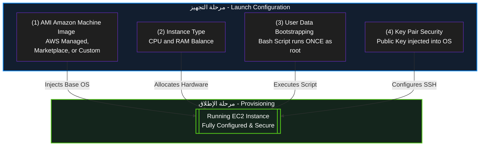

---
## 2. أمن السيرفرات: مجموعات الأمان (Security Groups)

**أصل الحكاية (The Core Problem):**

أي سيرفر EC2 بتخلقه وبتديله (Public IP) عشان الناس تدخله من على النت، بيبقى عامل زي بيت بيبانه وشبابيكه مفتوحة في شارع ضلمة؛ أي هاكر يقدر يعمل عليه (Port Scan) ويدخله. في الـ IT القديم، كنا بنشتري أجهزة (Hardware Firewalls) غالية جداً ونحطها على باب الشركة. في السحابة، أمازون اخترعت الـ **Security Groups (SG)**: ده فايروال افتراضي (Virtual Firewall) مجاني، بيحوط السيرفر بتاعك كأنه "درع شخصي"، وبيفلتر أي داتا داخلة أو طالعة.

### ⚙️ القواعد الهندسية للـ Security Groups (دستور الامتحان)

الـ Security Groups مش بتشتغل بالبركة، ليها 4 قواعد صارمة الامتحان بيلعب عليهم في السيناريوهات:

#### 1. مبدأ المنع الافتراضي (Default Deny)

- **القاعدة:** أول ما بتخلق SG جديد، بيكون **مانع كل حاجة داخلة للسيرفر (Inbound = Deny All)**، و**سامح بكل حاجة طالعة من السيرفر (Outbound = Allow All)**.
    
- **السيناريو:** لو عملت سيرفر وسطبت عليه موقع، الموقع مش هيفتح للناس إلا لو إنت دخلت بنفسك فتحت (Port 80 للـ HTTP) أو (Port 443 للـ HTTPS) في الـ Inbound Rules.
    

#### 2. حالة الاتصال (Stateful) - 🚨 [أهم تريكة في الامتحان]

- **المعنى المعماري:** الـ Security Group عندها "ذاكرة". يعني لو هي سمحت لريكويست إنه يدخل (Inbound)، هتسمح للرد بتاع الـ ريكويست ده إنه يخرج (Outbound) أوتوماتيك، **حتى لو إنت قافل كل الـ Outbound Rules!**
    
- **الفرق الجوهري:** في فايروال تاني في أمازون اسمه (NACL) ده بيكون (Stateless) مابيفهمش، لو فتحت الدخول لازم تفتح الخروج بإيدك. لكن الـ SG ذكية (Stateful).
    

#### 3. القواعد الإيجابية فقط (Allow Rules Only)

- إنت في الـ SG تقدر تقول: "اسمح لـ IP كذا إنه يدخل".
    
- لكن **مستحيل** تقول: "امنع IP كذا إنه يدخل". الـ SG مفيهاش (Deny Rules). لو عايز تمنع حد معين، بتسيبه بره القواعد المسموحة، فالـ SG هتمنعه بالديفولت.
    

#### 4. لغة التخاطب (IPs vs Security Groups)

- في الـ Inbound Rules، ممكن تفتح الباب لـ IP معين (مثلاً IP بيتك عشان تعمل SSH).
    
- **الحركة المعمارية الأذكى:** تقدر تفتح الباب لـ Security Group تانية!
    
    - _مثال:_ عندك سيرفر داتابيز (EC2-DB). بدل ما تفتحه للنت، هتقوله في الـ SG بتاعته: "ماتقبلش أي ريكويستات إلا لو جاية من الـ SG بتاعة سيرفر الـ Laravel (EC2-Web)". دي بتعمل طبقة حماية مرعبة (Micro-segmentation).
        

### 🏗️ اللوحة المعمارية: كيف يعمل الـ Security Group (Mermaid)

الرسمة دي بتوضح قاعدة الـ (Stateful) وإزاي الدرع بيحمي السيرفر:

Code snippet

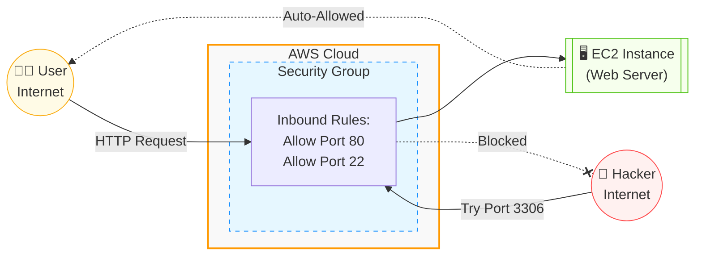


---
## 3. أنظمة الدفع وتسعير خوادم EC2 (Pricing Models)

أمازون عملت 4 أنظمة دفع (Payment Methods) عشان تناسب كل السيناريوهات. اختيار النظام الغلط ممكن يخسّر الشركة ملايين، عشان كده الأسئلة دي **مؤكدة 100% في الامتحان**.

### ⚙️ تفكيك خطط الدفع (للامتحان)

#### (1) الدفع عند الاستخدام (On-Demand Instances)

- **الفكرة:** بتأجر السيرفر وتدفع بالثانية (أو بالساعة) اللي بيشتغل فيها بس. مفيش أي عقود ولا التزامات مقدمة.
    
- **الاستخدام (سيناريو الامتحان):** لو عندك أبلكيشن جديد لسه بتجربه ومش عارف الترافيك بتاعه هيكون إيه (Unpredictable workloads)، أو بتعمل (Test/Dev) لفترة قصيرة.
    
- **العيب:** دي **أغلى** خطة دفع عادية في أمازون.
    

#### (2) الخوادم المحجوزة (Reserved Instances - RI) & (Savings Plans)

- **الفكرة:** إنت بتمضي عقد مع أمازون إنك هتفضل تستخدم السيرفرات دي لمدة (سنة أو 3 سنين). مقابل العقد والالتزام ده، أمازون بتعملك خصم بيوصل لـ **72%** من سعر الـ On-Demand.
    
- **الاستخدام (سيناريو الامتحان):** لو الأبلكيشن بتاعك شغال 24/7 وحالته مستقرة (Steady-state workloads)، زي قواعد البيانات الأساسية للشركة أو موقع شغال بقاله سنين.
    

#### (3) الخوادم الرخيصة (Spot Instances) - 🚨 [أكثر سؤال بيتكرر]

- **الفكرة:** أمازون عندها سيرفرات فاضية في الداتا سنتر محدش مأجرها، فبتعرضها بخصم مرعب بيوصل لـ **90%**!
    
- **الكارثة (الشرط):** أمازون تقدر تسحب منك السيرفر ده وتطفيه في أي لحظة (بتديك إنذار دقيقتين بس) لو حد تاني احتاجه ودفع سعره On-Demand.
    
- **الاستخدام (سيناريو الامتحان):** العمليات اللي "عادي لو وقفت ونكملها بعدين" زي (Batch Processing)، ريندر الفيديوهات، تحليل البيانات، أو معالجة الصور.
    
- **تحذير:** إياك تختارها في الامتحان لو السيناريو بيقولك "تطبيق ويب بيخدم عملاء حالياً" أو "داتابيز حرجة".
    

#### (4) الخوادم المخصصة (Dedicated Hosts)

- **الفكرة:** إنت بتأجر "سيرفر حديد" بالكامل ليك لوحدك في الداتا سنتر، محدش من عملاء أمازون التانيين بيشاركك فيه.
    
- **الاستخدام (سيناريو الامتحان):** في حالتين بس:
    
    - لو الشركة عندها **قوانين امتثال صارمة (Strict Compliance)** بتمنع مشاركة الهاردوير لأسباب أمنية.
        
    - لو عندك **رخصة سوفت وير (Software License)** خاصة بشركتك (زي Windows Server أو Oracle) بتشترط إنها تنزل على هاردوير محدد ومستقل.
        
- **العيب:** دي أغلى حاجة ممكن تأجرها في أمازون على الإطلاق.
    

### 🏗️ خريطة اتخاذ القرار في التسعير (Mermaid)

الرسمة دي بتلخصلك إزاي تختار الإجابة الصح في الامتحان بناءً على الكلمة الدلالية (Keyword) اللي في السيناريو:


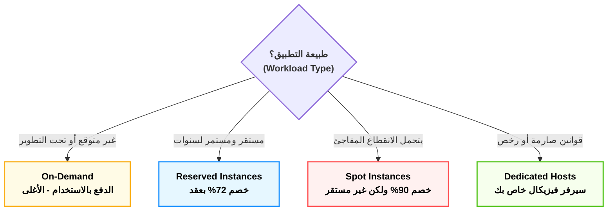

---

### 📊 جدول المقارنة الشامل لخطط تسعير EC2 (الخلاصة للامتحان)

|**خطة الدفع (Pricing Model)**|**التكلفة والخصم**|**الفكرة الجوهرية (المعنى الهندسي)**|**الكلمة الدلالية في الامتحان (Exam Keywords)**|
|---|---|---|---|
|**On-Demand**<br><br>  <br><br>(الدفع عند الاستخدام)|الأغلى (بدون خصم)|تأجير حر بالثانية/الساعة بدون أي عقود أو التزامات مسبقة.|Unpredictable, Spiky, Short-term, Testing & Development|
|**Reserved Instances**<br><br>  <br><br>(الخوادم المحجوزة)|خصم يصل لـ **72%**|عقد التزام (Commitment) لمدة سنة أو 3 سنوات مع أمازون.|Steady-state, Predictable, Long-term, 1 or 3 years commitment|
|**Spot Instances**<br><br>  <br><br>(الخوادم الرخيصة الفائضة)|خصم يصل لـ **90%**|استغلال هاردوير أمازون الفاضي، لكن يمكن سحبه بإنذار (دقيقتين) فقط!|Fault-tolerant, Batch processing, Can be interrupted, Stateless|
|**Dedicated Hosts**<br><br>  <br><br>(الخوادم المخصصة)|الأغلى على الإطلاق|سيرفر فيزيكال كامل (Hardware) مخصص لشركتك فقط غير مشترك مع أحد.|Strict Compliance, Regulatory requirements, Software Licensing (BYOL)|

> [!info] نصيحة أخيرة للحل السريع
> 
> في الامتحان، أول ما عينك تلمح كلمة **(Interruptible)** أو **(Batch)** روح فوراً للـ **Spot**. وأول ما تلمح كلمة **(License)** أو **(Compliance)** اختار **Dedicated Hosts** وإنت مغمض!

---
## 4. المكملات الهندسية لـ EC2 (تريكات مخفية في الامتحان)

في 3 مفاهيم أساسية بيكملوا معمارية الـ EC2، وأسئلتهم بتيجي في الامتحان على هيئة "فخوخ" (Traps):

### (1) العناوين الثابتة: Elastic IP (EIP)

- **المشكلة:** لما بتعمل سيرفر EC2 جديد (مثلاً عليه مشروع Laravel 13)، أمازون بتديله Public IP مجاني عشان الناس تدخله. الكارثة إنك لو عملت للسيرفر (Stop) ورجعت عملتله (Start)، الـ IP ده بيتغير! لو إنت رابط الـ IP ده بدومين (زي .com)، الموقع هيقع.
    
- **الحل المعماري:** الـ **Elastic IP**. ده IP ثابت (Static IPv4) إنت بتحجزه لنفسك ويفضل بتاعك للأبد، وتربطه بالسيرفر، ولو السيرفر عمل ريستارت هيفضل الـ IP زي ما هو.
    
- 🚨 **فخ الامتحان (التسعير الغريب):** الـ Elastic IP **مجاني** طول ما هو مربوط بسيرفر شغال (Running). لكن لو إنت حاجزه وراميه عندك ومش رابطه بسيرفر، أو رابطه بسيرفر مطفي (Stopped).. **أمازون هتبدأ تسحب منك فلوس عليه!** (بيعملوا كده عشان الناس ماتحجزش الـ IPs وتخلصها على الفاضي).
    

### (2) فخ التسعير: Dedicated Hosts vs Dedicated Instances

في الامتحان، هيحاول يلخبطك بين الاتنين دول لأنهم شبه بعض جداً:

- **Dedicated Instances (الخوادم المخصصة):** سيرفرات شغالة على هاردوير (Physical Server) مخصص لشركتك إنت بس. مفيش أي عميل تاني من أمازون هيشاركك نفس الحديدة. (تستخدم للـ Compliance والأمان العادي).
    
- **Dedicated Hosts (المضيف المخصص):** نفس اللي فوق، بس بيزيد عليها إن أمازون بتديك **(Visibility - رؤية كاملة)** لعدد الـ Sockets والـ Cores بتاعة البروسيسور.
    
- 🚨 **الكلمة الدلالية (Keyword):** أول ما تشوف في السؤال كلمة **BYOL (Bring Your Own License)** أو رخص سوفت وير بتتحاسب بعدد الكورز (زي Oracle أو Windows Server)، إياك تختار Instances، لازم تختار **Dedicated Hosts**!
    

### (3) مجموعات التسكين (Placement Groups)

أمازون بتسألك: "عايزني أرصلك السيرفرات بتاعتك فين في الداتا سنتر؟"

ليها 3 استراتيجيات (كل واحدة لسيناريو معين):

1. **Cluster (التكتل):**
    
    - **الفكرة:** بنرص السيرفرات كلها في نفس الـ Rack (نفس الدولاب) جنب بعض بالظبط.
        
    - **السيناريو:** لو عندك سيرفرات بتكلم بعض بسرعة جنونية ومحتاج (Low Latency) وتأخير شبه معدوم، زي الـ High Performance Computing (HPC).
        
    - **العيب:** لو الـ Rack ده الكهربا قطعت عنه، السيرفرات كلها هتقع مرة واحدة.
        
2. **Spread (الانتشار):**
    
    - **الفكرة:** بنوزع السيرفرات بحيث كل سيرفر يتحط في (Rack) مستقل، ليه كهربا ونتورك مختلفة.
        
    - **السيناريو:** لو عندك أبلكيشن حساس جداً (Critical Application) ومش عايز أي نسبة خطأ (High Availability). لو راك ولع، الباقي شغال.
        
    - **العيب:** الحد الأقصى 7 سيرفرات بس في كل منطقة (AZ).
        
3. **Partition (التقسيم):**
    
    - **الفكرة:** بنقسم السيرفرات لـ (مجموعات/Partitions). كل مجموعة في Rack لوحدها.
        
    - **السيناريو:** بتستخدم دايماً مع الـ Big Data وأنظمة قواعد البيانات الموزعة زي (Hadoop, Cassandra, Kafka).
        


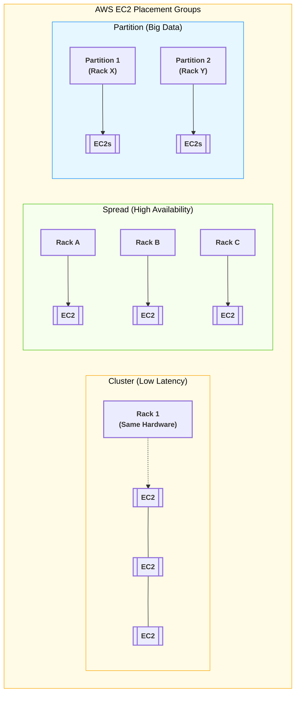

----
## 2. عوالم التخزين المرفقة (Attached Storage) - الجزء الأول: معمارية EBS

**أصل الحكاية والمشكلة الأساسية:**

أي سيرفر EC2 بتخلقه محتاج "هارد ديسك" عشان يتسطب عليه نظام التشغيل (Linux/Windows) وتتخزن عليه ملفاتك وقواعد البيانات. في السيرفرات القديمة (On-Premises)، الهارد كان بيبقى راكب بمسامير جوه اللوحة الأم، ولو المازربورد اتحرقت، الداتا كلها بتطير.

أمازون غيرت اللعبة دي واخترعت ما يسمى بـ **(التخزين المربوط بالشبكة - Network-Attached Storage)**. الهارد بقى مفصول عن السيرفر فيزيكال، ومربوط بيه بكابل شبكة داخلي فائق السرعة. يعني لو السيرفر ولع، الهارد هيفضل سليم وتقدر توصله بسيرفر تاني في ثواني!

### ⚙️ التشريح العميق لـ Amazon EBS (Elastic Block Store)

عشان تفهم الـ EBS صح وتحل أسئلته المعقدة في الامتحان، لازم نفكك اسمه ونفهم القوانين اللي بتحكمه:

#### (أ) يعني إيه Block Storage (تخزين الكتل)؟

- **المعنى الهندسي:** الهارد ده بيقسم الداتا لـ "بلوكات" (Blocks) صغيرة جداً بحجم ثابت.
    
- **ليه ده يهمنا؟** تخيل عندك قاعدة بيانات (Database) حجمها 50 جيجا، وفي يوزر عمل Update لحرف واحد في اسمه. لو الهارد ده بيخزن كـ (ملفات كاملة)، هيضطر يمسح الـ 50 جيجا ويكتبهم من جديد عشان حرف! لكن في الـ (Block Storage)، الهارد بيروح للبلوك المعين (اللي حجمه كام كيلو بايت) اللي فيه الحرف ده ويعدله بس في أجزاء من الثانية.
    
- **الخلاصة للامتحان:** الـ EBS **سريع جداً جداً** ومثالي لأنظمة التشغيل وقواعد البيانات (Databases) اللي محتاجة سرعة قراءة وكتابة لحظية.
    

#### (ب) القوانين المعمارية الصارمة للـ EBS (دستور الامتحان)

الـ EBS ليه 3 قوانين حاكمة مستحيل كسرها، والامتحان بيلعب عليهم في السيناريوهات:

1. **حبيس المنطقة (AZ Locked):**
    
    لما بتخلق هارد EBS، بيتولد جوه مبنى واحد (Availability Zone - مثلاً `us-east-1a`). السيرفر (EC2) اللي هيركب عليه لازم وحتماً يكون معاه في نفس الـ AZ.
    
    _(السبب: الهارد والسيرفر مربوطين بكابلات. مستحيل تركب هارد في مبنى `1a` على سيرفر في مبنى `1b` لأن الكابل مش هيوصل والسرعة هتقل)._
    
2. **الزواج الفردي (One-to-One):**
    
    هارد الـ EBS العادي بيركب في **سيرفر واحد فقط** في نفس اللحظة. مينفعش تجيب سيرفرين وتوصلهم بنفس هارد الـ EBS العادي عشان يقرأوا ويكتبوا مع بعض. (عشان تعمل كده هتحتاج هارد EFS اللي هنشرحه في الجزء الثالث).
    
3. **البقاء أو الفناء (Delete on Termination):**
    
    دي تريكة خبيثة جداً في الامتحان وفي بيئة العمل:
    
    - **الهارد الأساسي (Root Volume):** ده اللي بينزل عليه نظام التشغيل. الديفولت بتاعه إنه **بيتمسح ويُدمر أوتوماتيك** لو إنت مسحت السيرفر (Terminated).
        
    - **الهاردات الإضافية (Data Volumes):** دي اللي بتركبها عشان تشيل عليها الداتابيز أو الصور. الديفولت بتاعها إنها **بتفضل عايشة** حتى لو السيرفر اتدمر.
        
        _(ملاحظة: إنت كمهندس تقدر تغير الإعدادات دي براحتك قبل إطلاق السيرفر)._
        

#### (ج) اللقطات الاحتياطية (EBS Snapshots) - الهروب من السجن

- **المشكلة:** طالما الهارد "حبيس" في مبنى `1a`، إزاي أعمل منه باك أب (Backup) وأنقله لمبنى `1b` عشان أحمي الأبلكيشن لو المبنى الأول وقع؟
    
- **الحل المعماري (Snapshot):** إنت بتاخد "لقطة" (صورة طبق الأصل) من الهارد.
    
    - اللقطة دي مش بتتخزن على EBS، دي بتروح تتخزن في خدمة التخزين العملاقة **(Amazon S3)** لأنها أرخص وبتتوزع على كل المباني.
        
    - بعدها بتروح للمبنى التاني `1b`، وتقوله "اصنعلي هارد EBS جديد من اللقطة اللي متخزنة في الـ S3". وكده إنت استنسخت الهارد ونقلته من مبنى لمبنى!
        

> [!info] معلومة هامة للامتحان (Incremental Backups)
> 
> الـ Snapshots في أمازون بتشتغل بنظام (الزيادة التراكمية - Incremental). يعني أول لقطة بتاخد مساحة الهارد كله (مثلاً 10 جيجا). لو ضفت ملف حجمه 1 جيجا وأخدت لقطة تانية، اللقطة التانية هتحفظ الـ 1 جيجا الجديد بس، وده بيوفرلك فلوس كتير جداً في التخزين!


```mermaid
flowchart TD
    classDef default font-weight:bold,font-size:14px,stroke-width:2px;

    subgraph Region ["AWS Region (e.g., us-east-1)"]
        direction LR
        
        subgraph AZ_A ["Availability Zone A (us-east-1a)"]
            direction TB
            EC2_1[["🖥️ EC2 Instance</br>(App Server)"]]
            EBS_1[("💾 EBS Volume</br>Network Attached")]
            
            EC2_1 <==>|Fast Local Network| EBS_1
        end

        S3[("🪣 Amazon S3</br>Global Storage</br>Holds Snapshots")]

        subgraph AZ_B ["Availability Zone B (us-east-1b)"]
            direction TB
            EBS_2[("💾 New EBS Volume</br>Created from Snapshot")]
            EC2_2[["🖥️ New EC2 Instance</br>(Backup Server)"]]
            
            EBS_2 <==>|Fast Local Network| EC2_2
        end

        %% Snapshot Travel Process
        EBS_1 -.->|Take Snapshot| S3
        S3 -.->|Restore Snapshot| EBS_2
    end

    classDef ec2 fill:#f6ffed,stroke:#52c41a,color:#000;
    classDef ebs fill:#e6f7ff,stroke:#1890ff,color:#000;
    classDef s3 fill:#fffbe6,stroke:#faad14,color:#000;
    classDef az fill:#fdfdfd,stroke:#ff4d4f,stroke-width:3px,color:#000,stroke-dasharray: 5 5;

    class EC2_1,EC2_2 ec2;
    class EBS_1,EBS_2 ebs;
    class S3 s3;
    class AZ_A,AZ_B az;
```

---
##  الجزء الثاني: أنواع هاردات EBS (SSD vs HDD)

**أصل الحكاية (The Core Problem):**

ليه أمازون معملتش هارد واحد موحد وخلاص؟ لأن الداتا مش زي بعضها. لو إنت بتعمل سيرفر داتابيز (PostgreSQL) عليه ملايين العمليات في الثانية، إنت محتاج هارد "سريع جداً". لكن لو بتخزن ملفات "سجلات" (Logs) مش بتفتحها غير مرة كل كام شهر، حرام تدفع فلوس في هارد سريع!

عشان كده، أمازون قسمت الـ EBS لعائلتين كبار: **SSD** (سريع وغالي)، و **HDD** (بطيء ورخيص).

### ⚙️ فك طلاسم السرعة (IOPS vs Throughput)

قبل ما نحفظ أنواع الهاردات، لازم نفهم أمازون بتقيس سرعة الهارد إزاي في الكواليس:

1. **الـ IOPS (Input/Output Operations Per Second):** - ده مقياس **"سرعة الاستجابة"**. تخيل إنك بتبعت آلاف العربيات الملاكي الصغيرة والسريعة جداً.
    
    - **الاستخدام:** قواعد البيانات (Databases) اللي بتكتب وتقرأ أرقام صغيرة جداً بس بمعدل ملايين المرات في الثانية (Low Latency).
        
2. **الـ Throughput (معدل النقل - MiB/s):**
    
    - ده مقياس **"عرض الماسورة"**. تخيل إنك بتبعت عربية نقل مقطورة بطيئة، بس بتشيل أطنان من البضاعة في النقلة الواحدة.
        
    - **الاستخدام:** الـ Big Data ونقل الفيديوهات والملفات الضخمة اللي بتتقرأ ورا بعضها (Sequential Data).
        

### ⚙️ عائلات الـ EBS (دستور الامتحان)

#### أولاً: عائلة الـ SSD (Solid State Drives)

دي الهاردات السريعة اللي بتعتمد على الـ IOPS.

> [!info] ملاحظة هامة
> 
> عائلة الـ SSD هي **الوحيدة** اللي مسموح تنزل عليها نظام تشغيل (Boot Volumes).

- **(1) الهارد المتوازن: General Purpose SSD (gp2 / gp3)**
    
    - **الفكرة:** هارد بيوازن بين السعر والأداء. ده "الديفولت" بتاع أمازون لأي سيرفر جديد.
        
    - **التريكة الهندسية:** في الـ `gp2` القديم، السرعة (IOPS) كانت مربوطة بحجم الهارد. يعني لو عايز سرعة أكبر، لازم تشتري جيجات أكتر حتى لو مش محتاجها! أمازون حلت المشكلة دي في الـ `gp3`، وبقيت تقدر ترفع السرعة لوحدها من غير ما تزود الحجم (عشان توفر فلوس).
        
    - **سيناريو الامتحان:** أي تطبيق ويب عادي (زي تطبيق بـ Laravel)، أو Boot volume، أو بيئات التطوير والاختبار.
        
- **(2) الوحش الكاسر: Provisioned IOPS SSD (io1 / io2 / io2 Block Express)**
    
    - **الفكرة:** أغلى وأسرع هارد في أمازون، مخصص للأنظمة الحرجة جداً (Mission-Critical).
        
    - **السيناريو:** لو الداتابيز بتاعتك محتاجة أكتر من `16,000 IOPS` (سرعة جنونية)، أو لو الأبلكيشن بتاعك بيتعامل مع معاملات مالية (Billion-dollar DBs) ومفيش أي مجال للتأخير.
        
    - **الكلمات الدلالية في الامتحان:** `Critical Database`, `High IOPS`, `Sub-millisecond Latency`, `> 16,000 IOPS`.
        

#### ثانياً: عائلة الـ HDD (Hard Disk Drives)

دي هاردات ميكانيكية بتعتمد على عرض الماسورة (Throughput).

> [!warning] تحذير امتحان صارم
> 
> عائلة الـ HDD **مستحيل** تنزل عليها نظام تشغيل (Cannot be a Boot Volume). دي بتستخدم كهاردات "إضافية" للداتا فقط.

- **(3) هارد النقل الضخم: Throughput Optimized HDD (st1)**
    
    - **الفكرة:** هارد الماسورة الواسعة. رخيص ومصمم لنقل الداتا الضخمة والمستمرة.
        
    - **السيناريو:** الـ Big Data، أنظمة الـ Data Warehouses، ومعالجة سجلات النظام (Log Processing).
        
    - **الكلمات الدلالية:** `Big Data`, `Data Warehouse`, `Streaming workloads`.
        
- **(4) هارد الأرشيف: Cold HDD (sc1)**
    
    - **الفكرة:** ده "أرخص" هارد EBS في أمازون على الإطلاق.
        
    - **السيناريو:** الداتا "الباردة" (Cold Data) اللي محتاجينها تفضل واصلة بالسيرفر عشان لو احتاجنالها، بس مش بندخل عليها غير نادراً جداً.
        
    - **الكلمات الدلالية:** `Lowest Cost`, `Infrequently Accessed`, `Archive`.
        


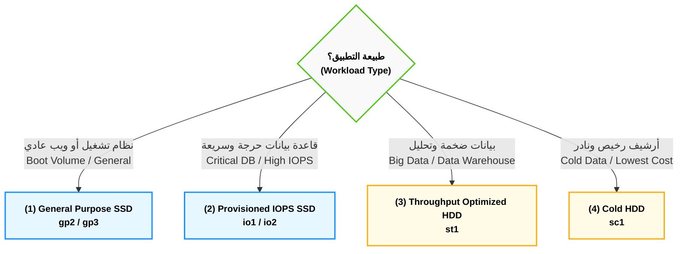

---
##  الجزء الثالث: الهارد المشترك (Amazon EFS)

**أصل الحكاية والمشكلة الأساسية:**

في الـ EBS، الهارد بيركب في "سيرفر واحد" وفي "مبنى واحد (AZ)". طب لو عندي سيستم كبير شغال وراه 10 سيرفرات EC2 متوزعين في 3 مباني (AZs) مختلفة، وكلهم محتاجين يقرأوا ويكتبوا في نفس الفولدر (`/uploads`) في نفس اللحظة؟

لو يوزر رفع صورة، هتنزل على سيرفر 1. لو يوزر تاني دخل والـ Load Balancer رماه على سيرفر 2، مش هيلاقي الصورة!

من هنا أمازون اخترعت الـ **EFS (Elastic File System)**: ده "هارد شبكي مشترك" (Shared File System) موجود في السحابة، بيكبر لوحده، بيوصل لآلاف السيرفرات في نفس اللحظة، وعابر للمباني (Multi-AZ).

### ⚙️ القواعد الهندسية للـ EFS (دستور الامتحان)

الـ EFS ليه قوانين صارمة جداً، وأسئلته في الامتحان بتيجي "مباشرة" لو إنت حافظ التريكات دي:

#### (أ) حصرية نظام التشغيل (Linux Only) - 🚨 [فخ الامتحان الأول]

- **القاعدة:** الـ EFS مصمم عشان يشتغل ببروتوكول اسمه (NFSv4 - Network File System)، وده بروتوكول بيفهمه اللينكس بس (زي Ubuntu و Amazon Linux).
    
- **سيناريو الامتحان:** لو جابلك سؤال بيقولك الشركة عندها سيرفرات **Windows** ومحتاجين هارد مشترك.. **إياك تختار EFS!** الإجابة الصح وقتها هتكون خدمة تانية خالص اسمها **Amazon FSx for Windows**.
    

#### (ب) التواجد في عدة مباني (Multi-AZ Built-in)

الداتا اللي بتترفع على الـ EFS بتتنسخ في الكواليس بشكل لحظي (Synchronously) في أكتر من AZ جوه الـ Region. يعني الـ High Availability بتاعته مبنية جواه. مش محتاج تعمل Snapshots عشان تحمي الداتا من إن مبنى يقع، هو بيحمي نفسه.

#### (ج) التمدد التلقائي والتسعير (Elasticity & Pricing)

- **في الـ EBS:** إنت بتشتري هارد 100 جيجا، بتدفع تمنهم بالكامل سواء حطيت فيهم ملفات أو سيبتهم فاضيين.
    
- **في الـ EFS:** إنت **مابتحددش مساحة أصلاً**. الهارد ده بيكبر ويصغر أوتوماتيك على حسب الملفات اللي جواه، وبتدفع تمن الجيجات اللي إنت ماليها بالظبط.
    
- **العيب المعماري (Trade-off):** الـ EFS **أغلى بكتير** من الـ EBS (تقريباً 3 أضعاف السعر)، عشان كده بنستخدمه للضرورة القصوى (للملفات المشتركة بس، مش لنظام التشغيل).
    

### ⚙️ طبقات التوفير الذكية (EFS Storage Classes)

بما إن الـ EFS غالي، أمازون عملت فيه "طبقات" (Tiers) عشان توفرلك فلوس بناءً على استخدامك للملفات:

1. **الطبقة القياسية (Standard):**
    
    دي للملفات الساخنة اللي السيرفرات بتفتحها وتعدل فيها كل يوم (ودي الطبقة الأغلى).
    
2. **طبقة الوصول النادر (EFS-IA - Infrequent Access):**
    
    للملفات اللي مش بتفتحها كتير. السعر هنا بيقل جداً (أرخص بحوالي 92%)، بس أمازون بتفرض عليك "رسوم بسيطة" كل مرة تفتح فيها الملف.
    
3. **نظام الإدارة الآلي (Lifecycle Management):**
    
    إنت بتشغل الخاصية دي في الإعدادات وتقوله: "أي ملف على الـ EFS محدش فتحه بقاله 30 يوم، انقله أوتوماتيك من طبقة الـ Standard لطبقة الـ IA عشان أوفر فاتورتي". دي بتيجي في الامتحان تحت كلمة (Cost Optimization for EFS).
    

> [!info] ملاحظة هندسية للامتحان (EFS One Zone)
> 
> لو إنت بتعمل بيئة تجارب (Test/Dev) ومش فارق معاك لو الداتا ضاعت، ممكن تختار (EFS One Zone). ده بيخزن الداتا في AZ واحدة بس، وده بيخليه أرخص 47% من الـ EFS العادي. بس لو الـ AZ دي وقعت، الداتا بتاعتك كلها طارت.


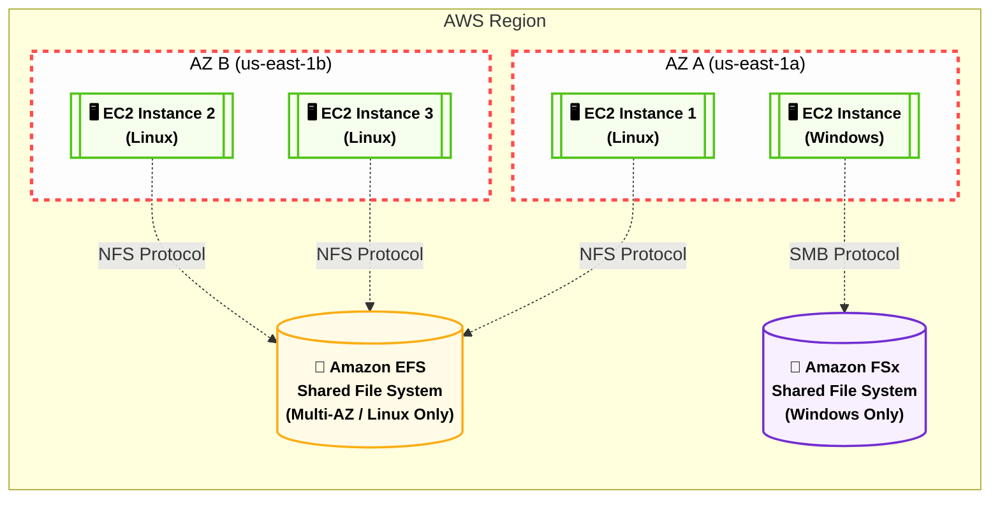

---
## الجزء الرابع: الخلاصة وشفرات الامتحان

**أصل الحكاية:**

في امتحان الـ CLF-C02، أمازون مش بتختبر حفظك للتعريفات، هي بتختبر قدرتك كـ (Architect) إنك تختار الأداة الصح للسيناريو الصح بأقل تكلفة. الأسئلة هنا بتيجي في شكل "شركة عندها تطبيق بيعمل كذا.. تختار أنهي نوع تخزين؟"

### ⚙️ شفرات الامتحان (The Exam Keywords)

أول ما تشوف الكلمات دي في السؤال، اختار الخدمة دي وإنت مغمض:

#### (أ) شفرات الـ EBS (Elastic Block Store)

- `Boot Volume` أو `Operating System` ➔ **EBS (gp2/gp3)**
    
- `Relational Database`, `Low Latency`, `High IOPS` ➔ **EBS (io1/io2)**
    
- `Single EC2 instance`, `Block level storage` ➔ **EBS**
    
- `Backup to another AZ/Region` ➔ **EBS Snapshots**
    

#### (ب) شفرات الـ EFS (Elastic File System)

- `Shared File System`, `Hundreds of EC2 instances` ➔ **EFS**
    
- `Linux instances`, `NFS protocol` ➔ **EFS**
    
- `Multi-AZ shared storage`, `Grows automatically` ➔ **EFS**
    

#### (ج) شفرات الـ FSx (خدمات الملفات المتخصصة)

- `Windows Server`, `SMB protocol`, `Active Directory` ➔ **Amazon FSx for Windows File Server**
    
- `High Performance Computing (HPC)`, `Machine Learning`, `Lustre` ➔ **Amazon FSx for Lustre**
    

### 📊 الجدول الذهبي للمقارنة (EBS vs EFS vs FSx)

|**وجه المقارنة**|**Amazon EBS**|**Amazon EFS**|**Amazon FSx for Windows**|
|---|---|---|---|
|**نوع التخزين**|Block Storage (مكعبات)|File Storage (ملفات)|File Storage (ملفات)|
|**عدد السيرفرات المسموح**|سيرفر واحد فقط (1:1)|آلاف السيرفرات (Many:1)|آلاف السيرفرات (Many:1)|
|**نظام التشغيل المدعوم**|Windows و Linux|**Linux فقط (NFS)**|**Windows فقط (SMB)**|
|**نطاق التواجد (Scope)**|AZ واحدة فقط (مبنى واحد)|Multi-AZ (عدة مباني)|Single أو Multi-AZ|
|**التسعير (Pricing)**|تدفع للمساحة المحجوزة مسبقاً|تدفع لما تستخدمه فعلياً فقط|تدفع للمساحة المحجوزة مسبقاً|

> [!tip] نصيحة ذهبية للحل السريع
> 
> أي سؤال يطلب منك "هارد مشترك" (Shared Storage) عينك تروح فوراً على نظام التشغيل: لو قالك Linux اختار EFS، لو قالك Windows اختار FSx.


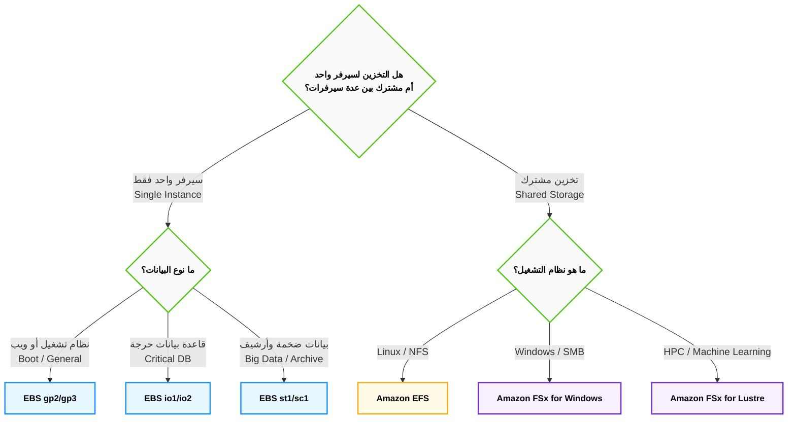

---
## 3. وحش التخزين اللانهائي (Amazon S3) - الجزء الأول: المعمارية والتشريح الدقيق

**أصل الحكاية والمشكلة المعمارية (The Core Problem):**

في عالم التخزين المرفق (EBS و EFS)، إنت محكوم بقواعد صارمة: الهارد لازم يتوصل بسيرفر (EC2)، ومقيد ببروتوكولات أنظمة التشغيل (Linux/Windows)، وليه حد أقصى في المساحة، ولازم تكون جوه شبكة أمازون المغلقة (VPC) عشان توصل للملفات.

لكن، تخيل إنك بتبني سيستم زي Netflix، أو منصة تواصل اجتماعي، أو حتى بتعمل سيستم لحفظ ملفات الـ Backup لشركتك. إنت محتاج مكان "سحري" مساحته لا نهائية، مش محتاج توصله بسيرفر أصلاً، وأي مستخدم يقدر يرفع أو ينزل ملفات من خلال الإنترنت مباشرة بـ (URL).

هنا ظهرت خدمة **Amazon S3 (Simple Storage Service)**. دي أقدم خدمة في تاريخ أمازون، والعمود الفقري للإنترنت الحديث. الـ S3 مش هارد ديسك، ده **(مخزن كيانات - Object Storage)** شغال عن طريق الـ Web APIs.

### ⚙️ التشريح العميق لمعمارية S3 (Under the Hood)

عشان تقفل أسئلة الـ S3 في الامتحان، لازم تمسح مفاهيم الهاردات العادية من دماغك، وتفهم الـ 3 أركان اللي بيقوم عليهم:

#### الركن الأول: حرب التخزين (Object Storage vs Block Storage)

الامتحان بيعشق المقارنة دي في سيناريوهات الشركات:

- **تخزين الكتل (EBS - Block Storage):** الهارد بيقطع الملف لـ "بلوكات". لو عندك ملف داتابيز (PostgreSQL) حجمه 100 جيجا، واليوزر "محمد" غير رقم تليفونه، الهارد هيروح يغير الـ 4 كيلو بايت بتوع رقم التليفون بس. (عشان كده EBS سريع جداً).
    
- **تخزين الكيانات (S3 - Object Storage):** الـ S3 بيشوف الملف كـ "صندوق أسود مقفول" (Immutable Object). لو عندك فيديو حجمه 100 جيجا على S3، وعايز تعدل فيه بيكسل واحد بس، الـ S3 مابيعرفش يعدل أجزاء.. **لازم ترفع الـ 100 جيجا كلهم من جديد فوق الملف القديم!**
    
- 🚨 **قاعدة الامتحان الصارمة:** إياك ثم إياك تختار S3 لو السيناريو بيقولك "قاعدة بيانات نشطة (Active Database)" أو "نظام تشغيل (OS)". الـ S3 مخصص فقط للملفات الثابتة (Static Files) زي الصور، الفيديوهات، ملفات الـ PDF، والـ Backups.
    

#### الركن الثاني: الحاوية (The Bucket) - قوانين الجردل

أي ملف هترفعه على S3، لازم يتحط جوه حاوية رئيسية اسمها (Bucket). الجردل ده ليه 3 قوانين دستورية في الامتحان:

1. **الاسم الفريد عالمياً (Globally Unique Name):**
    
    اسم الجردل بتاعك لازم يكون فريد على مستوى الكوكب كله في كل حسابات أمازون. ليه؟ لأن الجردل بيتحول لـ رابط إنترنت (URL) بالشكل ده: `https://my-unique-bucket.s3.amazonaws.com`. لو حد في اليابان حجز اسم `test-bucket`، إنت مستحيل تقدر تحجزه تاني أبداً.
    
2. **وهم العالمية (Global Console vs Regional Storage):**
    
    لما تفتح لوحة تحكم أمازون (Console)، هتلاقي الـ S3 مكتوب عليه (Global) زيه زي الـ IAM. بس دي خدعة!
    
    🚨 **الـ Data محبوسة:** لما بتيجي تخلق الجردل، أمازون بتجبرك تختار **Region** (مثلاً `us-east-1`). الداتا بتاعتك بتتخزن في المباني بتاعة المنطقة دي، و**مستحيل** أمازون تنقلها لمنطقة تانية من وراك (ده عشان قوانين سيادة البيانات Compliance & Data Sovereignty).
    
3. **السعة اللانهائية (Infinite Capacity):**
    
    إنت مابتحددش مساحة للجردل. الجردل ده ملوش قاع، ارمي فيه من زيرو بايت لحد إكسابايت (Exabytes)، وأمازون هتحاسبك بالجيجا اللي بتستخدمها بس.
    

#### الركن الثالث: الكيان (The Object) - تشريح الملف

الملف جوه الـ S3 مش زي الملف جوه الويندوز. الملف (Object) بيتكون من 5 أجزاء متركبة فوق بعض:

1. **المفتاح (Key):**
    
    ده مش بس اسم الملف، ده **المسار الكامل** للملف.
    
    🚨 **تريكة الفولدرات الوهمية:** الـ S3 **مفهوش فولدرات حقيقية** (Flat Namespace). لو إنت رافع صورة المسار بتاعها `images/2026/profile.jpg`، الـ S3 مش بيكريت فولدر اسمه `images` وجواه فولدر `2026`. هو بيعتبر الجملة الطويلة دي كلها هي "اسم الملف" (Key). واجهة أمازون بس هي اللي بترسملك شكل الفولدرات عشان تريح عينك (بيسموها Prefixes).
    
2. **القيمة (Value):**
    
    دي الداتا الفعلية (الـ Bytes) بتاعة الصورة أو الفيديو.
    
    _حدود الامتحان:_ مساحة الملف الواحد (Object) بتبدأ من 0 بايت لحد أقصى حاجة **5 تيرابايت (5TB)** للملف الواحد.
    
3. **البيانات الوصفية (Metadata):**
    
    معلومات عن الملف. (زي تاريخ الرفع، نوع الملف `Content-Type`، أو معلومات إنت بتضيفها بنفسك).
    
4. **العلامات (Tags):**
    
    كلمات دلالية إنت بتلزقها على الملف (مثلاً `Project: Project13` أو `Department: HR`). دي خطيرة جداً لأنك بتستخدمها عشان تظبط فواتيرك وتعرف كل مشروع بيصرف كام تخزين.
    
5. **معرف الإصدار (Version ID):**
    
    (هنشرحه بالتفصيل في جزء الحماية). كود فريد بيتحط للملف لو إنت مفعل خاصية الاحتفاظ بالنسخ القديمة.
    


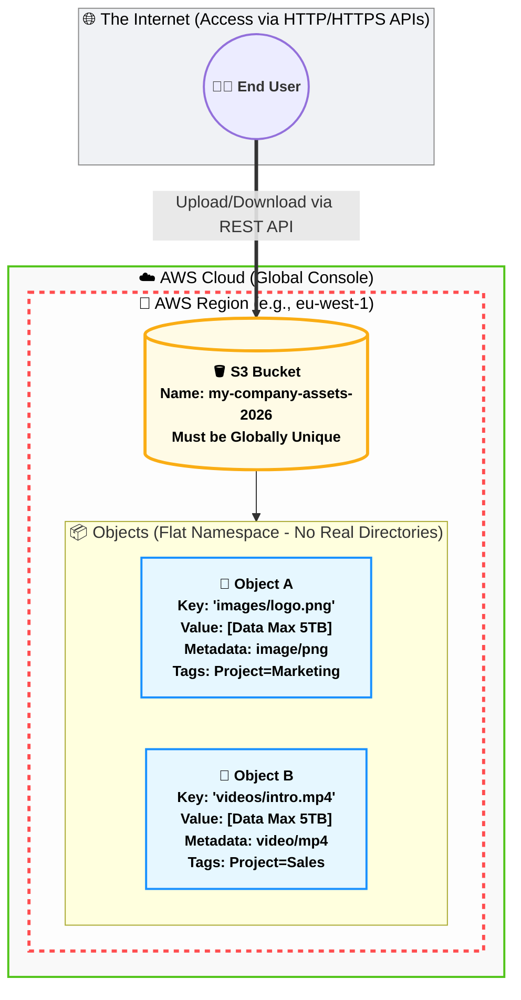
---
## الجزء الثاني: طبقات التخزين (Storage Classes)

**أصل الحكاية والمشكلة المعمارية (The Core Problem):**

تخيل إن شركتك عندها 100 تيرابايت من البيانات. البيانات دي متقسمة كالتالي:

- صور ومقالات اليوزرز بيدخلوا عليها كل ثانية.
    
- ملفات باك أب (Backup) لبيانات الشهر اللي فات، بنحتاجها مرة كل كام أسبوع.
    
- سجلات ضريبية وقانونية (Compliance) من سنة 2020، القانون بيجبرنا نحتفظ بيها 7 سنين بس إحنا مش بنفتحها أصلاً.
    

هل من العقل إننا نحط كل الداتا دي في نفس "الجردل" وندفع عليها نفس الفاتورة الغالية؟ طبعاً لأ.

أمازون عملت ما يسمى بـ **(طبقات التخزين - Storage Classes)**. الفكرة هنا عاملة زي "درجات الحرارة": الداتا الساخنة (Hot) اللي بنستخدمها كتير بتتحط في طبقة غالية وسريعة. والداتا المتجمدة (Cold) اللي مش بنفتحها بتترمي في أرخص طبقة في أمازون كلها.

_🚨 أسئلة الطبقات دي مؤكدة 100% في الامتحان، واللعبة كلها في حفظ "الكلمات الدلالية"._

### ⚙️ تفكيك طبقات التخزين (من الأغلى للأرخص)

#### (أ) طبقة الداتا الساخنة: S3 Standard

- **الفكرة:** دي الطبقة الافتراضية (Default). بتديك استجابة في أجزاء من الثانية (Milliseconds). الداتا بتاعتك بتتنسخ أوتوماتيك في 3 مباني (Multi-AZ) عشان لو مبنيين ولعوا الداتا متضيعش!
    
- **التسعير:** دي **أغلى** طبقة في الـ S3. بتدفع على التخزين، ومفيش رسوم على فتح الملفات.
    
- **سيناريو الامتحان:** `Frequently accessed data`, `Dynamic websites`, `Mobile applications`, `Default class`.
    

#### (ب) الطبقة الذكية: S3 Intelligent-Tiering

- **الفكرة:** لو إنت عندك داتا مش عارف اليوزرز هيستخدموها كتير ولا لأ (Unpredictable workload). أمازون بتشغّل "ذكاء اصطناعي" يراقب الملفات بتاعتك. لو لقى ملف محدش فتحه بقاله 30 يوم، يقوم ناقله أوتوماتيك لطبقة أرخص عشان يوفرلك فلوس، ولما حد يفتحه يرجعه تاني للطبقة الغالية.
    
- **التسعير:** بتدفع رسوم شهرية بسيطة لأمازون مقابل "المراقبة الأوتوماتيكية" دي.
    
- **سيناريو الامتحان:** `Unknown access patterns`, `Unpredictable workloads`, `Automatic cost optimization`.
    

#### (ج) طبقات الداتا الدافئة: Infrequent Access (IA)

دي للملفات اللي مش بنفتحها كل يوم، بس لما بنعوزها، بنعوزها "فوراً وبسرعة".

_هنا أمازون بتعمل معاك ديل: هقلل لك سعر التخزين جداً، بس هفرض عليك غرامة (Retrieval Fee) كل مرة تفتح فيها الملف._

1. **S3 Standard-IA (Infrequent Access):**
    
    - الداتا منسوخة في 3 مباني (Multi-AZ).
        
    - **سيناريو الامتحان:** `Disaster Recovery backups`, `Long-term storage accessed once a month`.
        
2. **S3 One Zone-IA (الطبقة الخطرة):**
    
    - **تريكة الامتحان:** دي الطبقة **الوحيدة** في الـ S3 اللي بتخزن الداتا في **(مبنى واحد فقط - Single AZ)**.
        
    - ده بيخليها أرخص بـ 20% من الـ Standard-IA، بس لو المبنى ده اتدمر، الداتا طارت للأبد!
        
    - **سيناريو الامتحان:** `Reproducible data` (داتا نقدر نعملها توليد تاني لو ضاعت، زي الـ Thumbnails بتاعة الصور المصغرة)، `Secondary backups`.
        

#### (د) عائلة التجميد العميق: Amazon Glacier

دي الداتا اللي اتجمدت وبقت "أرشيف". مساحة التخزين هنا برخص التراب، بس الفخ فين؟ الفخ إنك لو طلبت تفتح الملف، أمازون هتقولك "استنى على ما نسيحهولك!".

العائلة دي فيها 3 مستويات حسب سرعة الذوبان:

1. **S3 Glacier Instant Retrieval:**
    
    - بتفتح الملف في أجزاء من الثانية. بس سعر التخزين أغلى شوية من إخواتها. أرخص من IA لو بتفتح الداتا مرة كل ربع سنة.
        
2. **S3 Glacier Flexible Retrieval:**
    
    - عشان تفتح الملف، لازم تستنى من **دقيقة لحد 12 ساعة** حسب الفلوس اللي هتدفعها في الاسترجاع.
        
    - **سيناريو الامتحان:** `Occasional data retrieval`, `Backups not needed immediately`.
        
3. **S3 Glacier Deep Archive (أرخص شيء في أمازون):**
    
    - دي أرخص خدمة تخزين في AWS كلها. حرفياً ببلاش.
        
    - بس عشان تفتح ملف، لازم تستنى **12 ساعة كاملة**!
        
    - **سيناريو الامتحان (مؤكد):** `Regulatory compliance` (الامتثال للقوانين)، `Retain data for 7-10 years`، `Long-term archive`.
        

### ⚙️ إدارة دورة الحياة (S3 Lifecycle Rules) - المايسترو الآلي

بدل ما تدخل بنفسك تنقل الملفات من طبقة للتانية، أمازون عملتلك **Lifecycle Policies**. ده سكريبت إنت بتكتبه مرة واحدة وبيشتغل أوتوماتيك:

- _مثال معمارى:_ إنت بتقول لأمازون: "لما أرفع ملف جديد، حطه في الـ `Standard`. بعد 30 يوم، انقله للـ `Standard-IA`. بعد 90 يوم، ارميه في الـ `Glacier Deep Archive`. وبعد 365 يوم.. **امسحه خالص (Expire)**".
    
- **أهمية الامتحان:** دي الأداة الأولى لتحقيق مبدأ الـ (Cost Optimization) في التخزين.
    


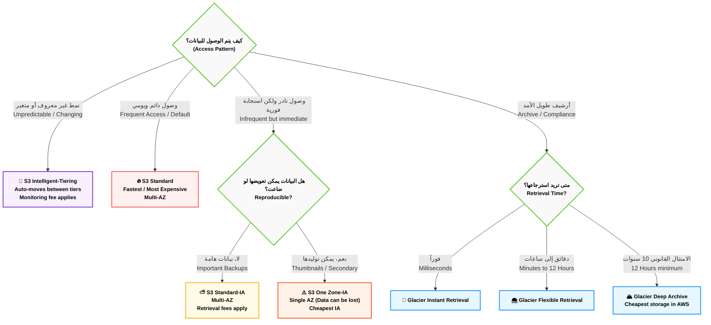

---
## الجزء الثالث: حماية البيانات والأمان (Security & Data Protection)

**أصل الحكاية والمشكلة المعمارية:**

الـ S3 بطبيعته متصل بالإنترنت. لو معملتش طبقات حماية (Layers of Security)، الداتا بتاعتك في خطر من 3 حاجات: المسح بالخطأ (Accidental Deletion)، التعديل الخاطئ (Overwrites)، وتسريب البيانات (Data Leaks).

أمازون وفرتلك ترسانة أسلحة عشان تقفل الجردل بتاعك بالضبة والمفتاح.

### ⚙️ السلاح الأول: إدارة الإصدارات (S3 Versioning) - آلة الزمن

- **المشكلة:** في الـ S3 العادي، لو رفعت ملف اسمه `index.html`، وبعدين رفعت ملف تاني بنفس الاسم، الملف القديم هيتمسح للأبد والجديد هيحل محله. طب لو مسحت الملف بالغلط؟ مفيش سلة مهملات (Recycle Bin) ترجعه منها!
    
- **الحل المعماري (Versioning):** أول ما بتفعل الخاصية دي على الجردل، الـ S3 بيشتغل كأنه (Git). لو رفعت ملف جديد بنفس الاسم، الـ S3 بيحتفظ بالملف القديم في الكواليس وبيديله (Version ID)، ويخلي الجديد هو الأساسي.
    
- **الحماية من الحذف:** لو دوست (Delete) لملف، الـ S3 مابيمسحوش بجد! هو بيحط فوقه حاجة اسمها (Delete Marker - علامة حذف) عشان يختفي من قدامك، بس لو دخلت في الإعدادات تقدر تشيل العلامة دي وترجع الملف عادي جداً!
    

> [!warning] قوانين الـ Versioning في الامتحان 🚨
> 
> 1. **طريق باتجاه واحد:** بمجرد ما تفعل الـ Versioning على جردل، **مستحيل تعمله Disable (إلغاء)**. تقدر بس تعمله (Suspend - إيقاف مؤقت).
>     
> 2. **التكلفة:** إنت بتدفع فلوس على كل الإصدارات القديمة اللي متخزنة! يعني لو ملف حجمه جيجا، وعدلته 5 مرات، إنت كده بتدفع تمن 5 جيجا مش جيجا واحدة.
>     

#### (أ) الحماية القصوى: المصادقة الثنائية للحذف (MFA Delete)

لو عايز تمنع أي حد (حتى الـ Root User بتاع الحساب) إنه يمسح إصدار قديم من الملف بشكل نهائي، بتفعل خاصية الـ `MFA Delete`. وقتها، مستحيل أمر المسح النهائي يتنفذ إلا لو الشخص معاه الموبايل بتاعك ودخل الكود المكون من 6 أرقام (زي كود البنك).

### ⚙️ السلاح الثاني: القفل الجنائي (S3 Object Lock / WORM)

- **المشكلة:** البنوك والمستشفيات عندهم قوانين حكومية (Compliance) بتجبرهم يحتفظوا بالسجلات لمدة 7 سنين بدون ما "أي مخلوق" يقدر يعدلها أو يمسحها، حتى لو كان صاحب الشركة نفسه.
    
- **الحل (WORM - Write Once, Read Many):** إكتب مرة واحدة واقرأ كتير. لما بتفعل الـ Object Lock على ملف، بتحدد مدة (مثلاً 5 سنين). خلال الـ 5 سنين دول، الملف ده **استحالة** يتمسح أو يتعدل، ولا حتى عن طريق خدمة الدعم الفني بتاعة أمازون شخصياً!
    
- **الكلمات الدلالية في الامتحان:** `Compliance`, `WORM model`, `Prevent deletion for fixed amount of time`, `Regulatory requirements`.
    

### ⚙️ السلاح الثالث: حراس البوابات (Access Control & Security)

إزاي نتحكم مين يشوف الداتا ومين لأ؟ عندنا 3 طبقات للحماية (الامتحان بيسأل في الفرق بينهم):

1. **سياسات المستخدمين (IAM Policies):**
    
    - دي بتتركب على **اليوزر (الشخص)**. يعني بكتب قاعدة أقول فيها: "المبرمج أحمد من حقه يقرأ الملفات اللي في جردل HR".
        
2. **سياسات الجردل (Bucket Policies):** - 🚨 أهم حاجة في S3
    
    - دي بتتركب على **الجردل نفسه** (Resource-based). ده ملف (JSON Document) بكتب فيه قوانين صارمة للجردل كله.
        
    - **سيناريو الامتحان:** إزاي تخلي الجردل كله (Public) عشان تستضيف عليه موقع ويب؟ عن طريق الـ Bucket Policy إنك تعمل `Allow` للـ `Principal: *` (يعني تسمح لأي حد في العالم).
        
    - **سيناريو تاني:** إزاي أجبر الناس إنهم ميرفعوش ملفات إلا لو كانوا جوه شبكة الشركة؟ بعمل Bucket Policy تمنع (Deny) أي حد הـ IP بتاعه مش بتاع الشركة.
        
3. **زرار الأمان النووي (Block Public Access - BPA):**
    
    - **المشكلة:** مبرمج صغير دخل عدل الـ Bucket Policy وخلى بيانات العملاء كلها Public بالغلط.
        
    - **الحل:** أمازون عملت خاصية اسمها (Block Public Access) ومفعلة كـ الديفولت. الخاصية دي عامله زي "السكينة الرئيسية بتاعة الكهربا". لو هي شغالة (ON)، فإنها بتعمل (Override / إبطال) لأي Bucket Policy بتسمح بالوصول العام، وتمنع الداتا إنها تطلع على النت مهما حصل!
        

### ⚙️ السلاح الرابع: التشفير (Data Encryption)

لو هاكر قدر يخترق سيرفرات أمازون ويسرق الهاردات الفيزيكال اللي عليها الداتا بتاعتك، هيلاقي الداتا دي "متشفرة" (مكتوبة بلغة غير مفهومة) ومستحيل يقرأها.

أمازون في الامتحان بتسألك عن **التشفير أثناء السكون (Encryption at Rest)** وليه طرق:

- **SSE-S3:** التشفير الأساسي، أمازون هي اللي بتشفر الداتا وهي اللي بتحتفظ بمفاتيح التشفير. _(ملاحظة: أمازون مؤخراً خلت النوع ده شغال أوتوماتيك على أي ملف يترفع بدون تدخلك)._
    
- **SSE-KMS:** إنت بتستخدم خدمة اسمها `AWS KMS` عشان تدير إنت مفاتيح التشفير بنفسك، وتعرف مين استخدم المفتاح إمتى (Auditing).
    
- **SSE-C (Customer Provided):** إنت اللي بتصنع مفتاح التشفير بره أمازون، وبتبعته لأمازون تشفر بيه الملف وبعدين أمازون بتمسح المفتاح من عندها.
    


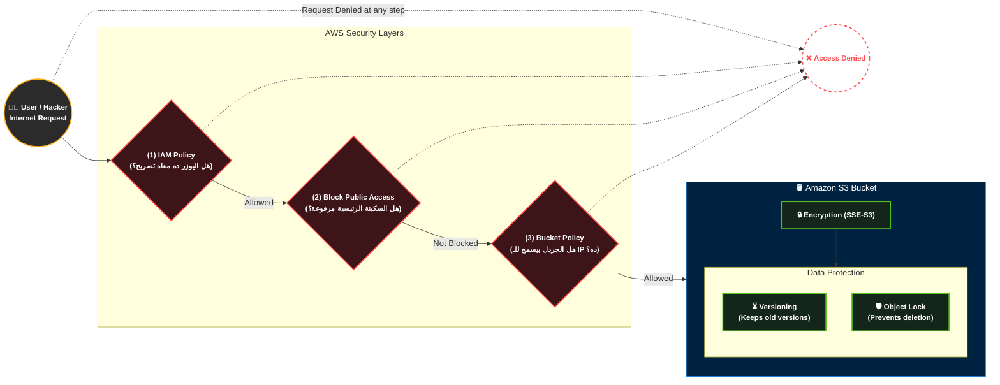

---
## الجزء الرابع: المكملات السحرية (الاستضافة والهجرة)

**أصل الحكاية (The Core Problem):**

إحنا كده فهمنا إن S3 بيخزن الداتا وبيحميها وبيوفر فلوسها. بس أمازون مبتقفش عند التخزين العادي؛ الامتحان بيختبرك في "الحلول المعمارية المبتكرة" اللي بتعتمد على S3 في الكواليس، زي إنك تشغل موقع كامل من غير ما تشتري سيرفر (EC2) أصلاً، أو إزاي تنقل "بيتابايت" من الداتا من شركتك لأمازون لو النت عندك بطيء جداً.

### ⚙️ أولاً: الاستضافة الساكنة (S3 Static Website Hosting)

- **الفكرة السحرية:** الـ S3 يقدر يشتغل كـ (Web Server) يستضيف موقعك بالكامل ويطلعه للناس على النت، وكل ده بتكلفة شبه معدومة (سنتات في الشهر) ومن غير ما تدير أي سيرفر (Serverless).
    
- **الشرط المعماري (🚨 تريكة الامتحان):** الـ S3 بيستضيف **(مواقع ساكنة - Static Websites) فقط**. يعني ملفات `HTML`, `CSS`, `JavaScript` (زي مشاريع React أو Vue.js).
    
- **الممنوعات:** **مستحيل** تشغل عليه كود (Backend) زي `PHP` (Laravel) أو `Node.js` أو `Python`، ومستحيل تركب عليه داتابيز مباشرة. لو موقعك فيه Backend، الـ S3 بيشيل الـ Frontend بس، والـ Backend بيروح لـ EC2 أو Lambda.
    
- **إعدادات الامتحان:** عشان الموقع يشتغل، لازم تعمل حاجتين:
    
    1. تقفل زرار الـ (Block Public Access).
        
    2. تضيف (Bucket Policy) بتعمل `Allow` لأكشن اسمه `s3:GetObject` لكل الناس `*`.
        

### ⚙️ ثانياً: عائلة الجليد ونقل البيانات (AWS Snow Family)

- **المشكلة:** لو شركتك عندها داتا حجمها 100 بيتابايت (Petabytes)، وعايز ترفعهم لأمازون، لو استخدمت أسرع خط إنترنت في العالم هياخد سنين!
    
- **الحل (Offline Migration):** أمازون بتبعتلك "جهاز هاردوير" لحد باب شركتك عن طريق شركة شحن. توصله في السيرفرات بتاعتك، تنقل الداتا بسرعة الكابلات، وبعدين تشحنه تاني لأمازون، وهم يفرغوه في الـ S3!
    

**أفراد العائلة (أسئلة مؤكدة في الامتحان):**

1. **AWS Snowcone:**
    
    - **الوصف:** أصغر جهاز (وزنه 2 كيلو تقريباً). بيشيل داتا من 8 لـ 14 تيرابايت.
        
    - **السيناريو:** الأماكن المتطرفة (Edge Computing) زي المستشفيات الميدانية أو السفن اللي مفيهاش نت، ومحتاجين نجمع داتا ونبعتها.
        
2. **AWS Snowball Edge:**
    
    - **الوصف:** جهاز بحجم "شنطة السفر". بيشيل داتا لحد 80 تيرابايت.
        
    - **السيناريو:** نقل الداتا الضخمة (Petabyte-scale migration)، أو معالجة الداتا محلياً في المصانع لأن الجهاز جواه (مُعالج CPU) يقدر يشغل كود قبل ما يتبعت لأمازون (Compute Optimized).
        
3. **AWS Snowmobile (شاحنة البيانات):**
    
    - **الوصف:** سيارة نقل بمقطورة (18-Wheeler Truck) بتيجي تقف قدام الداتا سنتر بتاعك!
        
    - **السيناريو:** نقل الـ (Exabytes) من البيانات (الـ 1 إكسابايت = ألف بيتابايت = مليون تيرابايت). دي بتستخدم لنقل داتا سنتر كاملة لشركة ضخمة.
        

### ⚙️ ثالثاً: بوابات التخزين الهجينة (AWS Storage Gateway)

- **المشكلة:** شركتك عندها داتا سنتر خاص بيها (On-Premises)، ومش عايزين ينقلوا كل حاجة للكلاود. عايزين يخلوا السيرفرات اللي في الشركة كأنها "متوصلة" بالـ S3 في أمازون عشان المساحة متخلصش أبداً (Hybrid Cloud Storage).
    
- **الحل (Storage Gateway):** ده سوفت وير (Virtual Machine) بتسطبه على سيرفرات الشركة بتاعتك، بيلعب دور "الكوبري" بين أجهزة الشركة وخدمات أمازون (S3, EBS, Glacier).
    

**الأنواع في الامتحان (كلمات دلالية):**

1. **بوابة الملفات (File Gateway / Amazon S3 File Gateway):**
    
    - السيرفرات بتاعتك بتتعامل معاه كأنه هارد شبكة عادي (ببروتوكولات NFS أو SMB). الكوبري بياخد الملفات دي ويرفعها أوتوماتيك لـ **Amazon S3**.
        
    - **السيناريو:** `Extend on-premises file storage to S3`, `NFS/SMB to S3`.
        
2. **بوابة الكتل (Volume Gateway):**
    
    - السيرفرات بتتعامل معاه كأنه هارد "بلوكات" (iSCSI). الكوبري بياخد الداتا ويحولها لـ **EBS Snapshots** عشان يعملها باك أب في الكلاود.
        
    - **السيناريو:** `iSCSI block storage`, `Disaster recovery with EBS snapshots`.
        
3. **بوابة الشرائط (Tape Gateway):**
    
    - في الشركات القديمة جداً، بيعملوا أرشيف للداتا على "شرائط مغناطيسية" (Physical Tapes). الكوبري ده بيوهم السيرفرات إنها لسه بتكتب على شرائط، بس هو في الحقيقة بياخد الداتا ويرميها في **Amazon Glacier**.
        
    - **السيناريو:** `Virtual Tape Library (VTL)`, `Replace physical tapes with Glacier`.
        


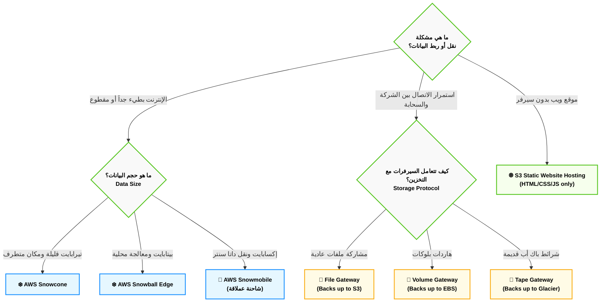

## 1. قواعد البيانات وتحليل البيانات (Databases & Analytics) - الجزء الأول: عائلة الـ SQL (RDS & Aurora)

**أصل الحكاية والمشكلة المعمارية (The Core Problem):**

زمان، لما كنا بنبني Backend قوي (زي نظام بـ Laravel 13 مثلاً)، كنا بنعمل سيرفر (EC2)، وندخل نسطب عليه قاعدة البيانات (PostgreSQL أو MySQL) بإيدينا. المشكلة إنك كمهندس كنت بتتحول لـ "حارس أمن" للداتابيز؛ لازم تعمل Backups كل يوم، تنزل تحديثات أمنية لنظام التشغيل، ولو السيرفر هنج أو الهارد باظ، الداتا بتضيع والموقع بيقع!

من هنا أمازون قالتلك: "ركز إنت في الكود وهندسة التطبيق، وسيب إدارة الداتابيز عليا". واخترعت خدمات قواعد البيانات المدارة (Managed Database Services).

### ⚙️ أولاً: خدمة قواعد البيانات العلائقية (Amazon RDS)

الـ **RDS (Relational Database Service)** هي خدمة بتخليك تطلق قاعدة بيانات (SQL) في ثواني، وأمازون بتتكفل بكل المهام الروتينية (النسخ الاحتياطي، تحديثات السوفت وير، تغيير الهاردوير، والـ Patching).

**محركات البحث المدعومة (الـ 6 محركات في الامتحان):**

الـ RDS مش داتابيز في حد ذاتها، دي "حاضنة" بتشغل 6 أنواع من قواعد البيانات:

1. Amazon Aurora (اختراع أمازون)
    
2. PostgreSQL
    
3. MySQL
    
4. MariaDB
    
5. Oracle
    
6. Microsoft SQL Server
    

#### 🛡️ استراتيجيات المعمارية في RDS (موضع أسئلة الامتحان)

الامتحان بيركز على إزاي بتخلي الداتابيز بتاعتك "مستحيل تقع" (High Availability) وإزاي "تسرعها" (Scalability).

**1. النشر في مناطق متعددة (RDS Multi-AZ Deployment): للحماية من الكوارث**

- **الفكرة:** لما بتفعل الخاصية دي، أمازون بتخلق سيرفر داتابيز "أساسي" (Primary) في مبنى (AZ-A)، وسيرفر تاني "احتياطي" (Standby) في مبنى تاني خالص (AZ-B).
    
- **الكواليس (Synchronous Replication):** أي داتا بتتكتب في الأساسي، بتتنسخ "في نفس اللحظة" للاحتياطي.
    
- **السيناريو:** لو المبنى الأول ولع، أمازون بتعمل (Automatic Failover) وتحول الـ Traffic أوتوماتيك للاحتياطي من غير ما الموقع بتاعك يقع أو الكود بتاعك يتغير.
    
- **الكلمة الدلالية في الامتحان:** `High Availability`, `Disaster Recovery`, `Automatic Failover`. (🚨 **تحذير:** الـ Standby ممنوع تقرأ منه داتا، هو نايم مستني الكارثة تحصل بس).
    

**2. النُسخ المخصصة للقراءة (RDS Read Replicas): لتسريع الأداء**

- **المشكلة:** تطبيقك عليه ضغط رهيب. اليوزرز بيقرأوا مقالات أو بيسحبوا تقارير ضخمة، وده مأثر على سرعة كتابة طلبات الشراء في الداتابيز.
    
- **الحل المعماري:** بتعمل (Read Replica). دي نسخة طبق الأصل من الداتابيز، بس "للقراءة فقط". بتخلي الـ Backend بتاعك يبعت كل أوامر الـ (SELECT) للنسخة دي، ويسيب الداتابيز الأساسية لأوامر الـ (INSERT / UPDATE) بس.
    
- **الكواليس (Asynchronous Replication):** النسخ هنا بياخد أجزاء من الثانية. وتقدر تعمل لحد 5 نسخ قراءة.
    
- **الكلمة الدلالية في الامتحان:** `Performance`, `Scalability`, `Read-heavy workloads`, `Offload read traffic`.
    

### ⚙️ ثانياً: وحش أمازون الخاص (Amazon Aurora)

**أصل الحكاية:** أمازون شافت إن MySQL و PostgreSQL العاديين ليهم حدود في السرعة على الكلاود. فقررت تبني قاعدة بيانات "Cloud-Native" من الصفر، مصممة مخصوص للعمل على البنية التحتية بتاعة AWS.

**القواعد الهندسية للـ Aurora (دستور الامتحان):**

1. **التوافق التام (Compatibility):** الـ Aurora بتفهم كود **MySQL** و **PostgreSQL**. يعني لو الأبلكيشن بتاعك متبرمج عليهم، هتنقله للـ Aurora من غير ما تغير حرف في الكود.
    
2. **السرعة الخارقة:** الـ Aurora أسرع **5 مرات** من الـ MySQL العادي، وأسرع **3 مرات** من الـ PostgreSQL العادي!
    
3. **التمدد الذاتي للتخزين (Auto-scaling Storage):** إنت مابتحددش مساحة هارد للـ Aurora. هي بتبدأ بـ 10 جيجا، وكل ما تتملي، أمازون تزودها 10 جيجا أوتوماتيك لحد ما توصل لـ **128 تيرابايت**.
    
4. **حماية البيانات المجنونة (6 Copies):** أول ما بتخلق Aurora، أمازون أوتوماتيك بتنسخ الداتا بتاعتك **6 مرات** وتوزعها على **3 مباني (AZs)** مختلفة، حتى لو إنت مطلبشت ده! (ده بيخليها تقريباً من المستحيل تفقد بياناتك).
    

> [!info] تريكة امتحان: Aurora Serverless
> 
> لو السيناريو بيقولك إن عندك أبلكيشن بيجيله ضغط "عشوائي وغير متوقع" (Unpredictable workloads)، وإنت مش عايز تدفع فلوس لسيرفر داتابيز شغال طول الوقت على الفاضي، الحل هو **Aurora Serverless**. دي داتابيز بتكبر وتصغر وتقفل خالص لوحدها حسب الضغط، وبتدفع بالثانية!

### 🏗️ اللوحة المعمارية: الفرق بين Multi-AZ و Read Replicas (Mermaid)

الخريطة دي بتوضح شكل الاتصال وإزاي بنحمي الداتابيز ونسرعها في نفس الوقت (تم استخدام `<br/>` لتوافق أوبسيديان):


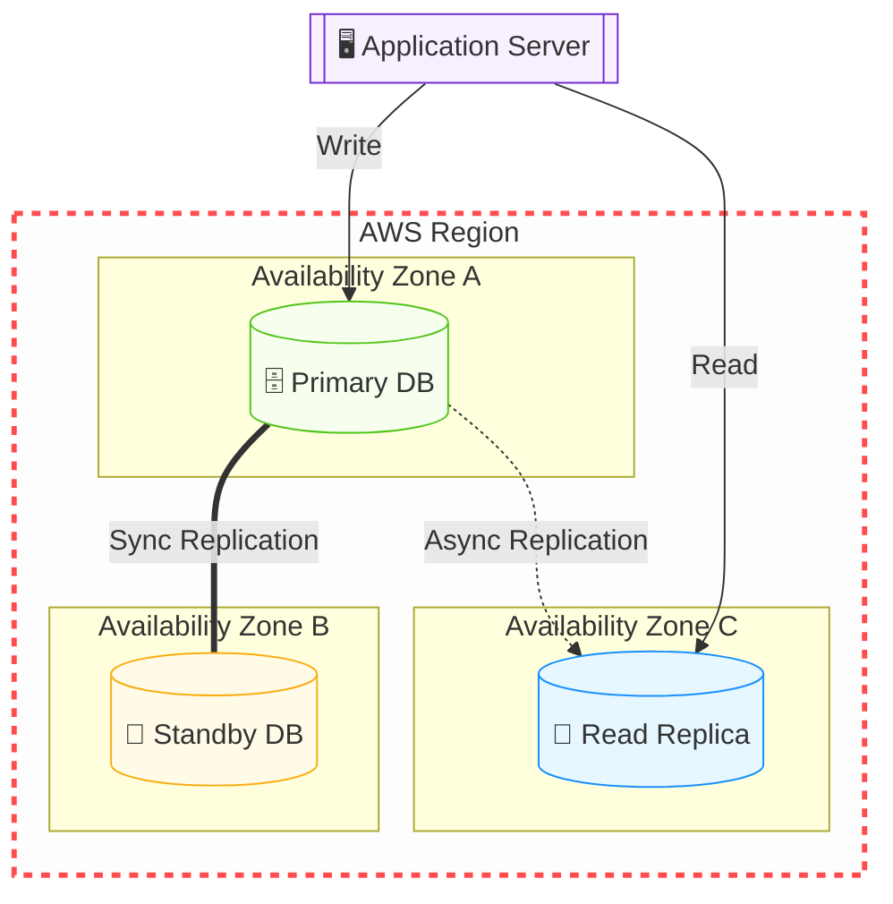

### 📊 شفرات الامتحان: الخلاصة لاختيار الـ DB

|**الكلمة الدلالية في سيناريو الامتحان (Keyword)**|**الإجابة الصحيحة (Service)**|
|---|---|
|`Relational DB`, `SQL`, `Complex Joins`, `Managed Service`|**Amazon RDS**|
|`Disaster Recovery`, `High Availability`, `Automatic Failover`|**RDS Multi-AZ**|
|`Improve performance`, `Heavy read traffic`, `Scalability`|**RDS Read Replicas**|
|`Proprietary AWS DB`, `5x faster than MySQL`, `Cloud-Native`|**Amazon Aurora**|
|`Relational DB`, `Unpredictable workload`, `Infrequent usage`|**Amazon Aurora Serverless**|
|`Full OS control`, `Custom DB patches`, `Specific OS level access`|**Database on Amazon EC2** (مش RDS خالص)|

---
##  الجزء الثاني: وحش الـ NoSQL (Amazon DynamoDB)

**أصل الحكاية والمشكلة المعمارية (The Core Problem):**

الـ RDS والـ SQL عموماً عظيمة جداً طول ما إنت عندك "علاقات" معقدة (جداول مربوطة ببعض بـ Foreign Keys). بس إيه المشكلة؟

المشكلة إن الـ SQL بطيء لما الضغط يوصل لملايين الطلبات في الثانية (زي مثلاً لو بتبني لعبة أونلاين وعايز تحفظ الـ Score بتاع 10 مليون لاعب في نفس اللحظة، أو بتعمل سلة مشتريات لموقع زي أمازون في الـ Black Friday). الـ SQL هنا هيهنج لأنه بيحاول يراجع كل العلاقات (Joins) قبل ما يكتب.

هنا ظهر مفهوم الـ **NoSQL (Not Only SQL)**. الفكرة هنا: "إنسى الجداول والعلاقات المعقدة، إحنا هنخزن الداتا على هيئة (مفتاح وقيمة - Key/Value) أو (ملفات JSON). ارمي الداتا واسحبها في أجزاء من الثانية!". بطل القصة دي في أمازون هو **Amazon DynamoDB**.

### ⚙️ التشريح العميق لـ Amazon DynamoDB (دستور الامتحان)

الـ DynamoDB مش مجرد قاعدة بيانات، دي "ظاهرة" في أمازون، وليها 4 قوانين معمارية بتيجي في الامتحان دايماً:

**1. البنية التحتية (Serverless Database):**

إنت في DynamoDB **مابتختارش سيرفرات**، ولا رامات، ولا بتحدد مساحة هارد. دي خدمة (Serverless) بالكامل. إنت بس بتعمل "جدول" (Table) وترمي فيه الداتا، وأمازون بتكبر السيرفرات في الكواليس أوتوماتيك لدرجة إنها ممكن تستحمل تيرابايتات من الداتا بدون أي تدخل منك.

**2. السرعة الجنونية (Single-digit Millisecond Latency):**

الـ DynamoDB بيضمنلك إن أي عملية قراءة أو كتابة هتاخد أقل من 10 مللي ثانية (Single-digit)، سواء الجدول ده فيه 100 ريكورد أو فيه 10 مليار ريكورد! السرعة ثابتة مبتتغيرش.

**3. التواجد المدمج (Multi-AZ by Default):**

عكس الـ RDS اللي كان لازم تختار تفعّل الـ Multi-AZ وتدفع فلوس زيادة، الـ DynamoDB بيعمل نسخ للداتا بتاعتك في 3 مباني (AZs) مختلفة **أوتوماتيك وبشكل افتراضي** عشان يضمن إن الداتا عمرها ما تضيع.

**4. نموذج البيانات (Key-Value & Document):**

الداتا هنا مش بتتحط في أعمدة وصفوف ثابتة. كل (Item) ممكن يكون ليه شكل مختلف. (مثلاً: مستخدم تحطله اسمه وسنه، ومستخدم تاني تحطله اسمه وعنوانه وهواياته). ده بيخليها مرنة جداً للتطبيقات الحديثة.

### 🚀 تسريع الوحش: محرك الـ DAX (DynamoDB Accelerator)

أمازون قالتلك: "الـ 10 مللي ثانية بطيئة بالنسبة لبعض التطبيقات (زي التداول المالي أو الألعاب اللحظية)، إحنا عايزين سرعة بالـ (ميكرو ثانية - Microseconds)!".

- **الحل المعماري (DAX):** ده نظام تخزين مؤقت (In-Memory Cache) مبني **مخصوص** للـ DynamoDB.
    
- **الكواليس:** بدل ما الأبلكيشن بتاعك يروح يقرأ من الداتابيز كل مرة، بيقرأ من الـ DAX (اللي شايل الداتا في الرامات). وده بينزل سرعة الاستجابة من مللي ثانية لـ ميكرو ثانية (أسرع 1000 مرة).
    
- 🚨 **تريكة الامتحان:** أول ما تشوف كلمة `Microseconds` مع `DynamoDB`، الإجابة فوراً هي **DAX**.
    

### 🌍 الانتشار العالمي: الجداول العالمية (Global Tables)

- **المشكلة:** الأبلكيشن بتاعك نجح عالمياً، بقى عندك مستخدمين في أمريكا وفي أستراليا. لو الداتابيز بتاعتك في أمريكا، المستخدم الأسترالي هيعاني من بطء (Latency) عشان الداتا بتسافر عبر المحيط.
    
- **الحل المعماري (Global Tables):** الخاصية دي بتخلي الـ DynamoDB ينسخ الجدول بتاعك في كذا منطقة جغرافية (Regions) في نفس الوقت.
    
- **الكواليس (Active-Active Replication):** المستخدم الأمريكي بيكتب ويقرأ من نسخة أمريكا، والأسترالي بيكتب ويقرأ من نسخة أستراليا، والنسختين بيكلموا بعض في الكواليس ويوحدوا الداتا!
    
- 🚨 **الكلمة الدلالية في الامتحان:** `Multi-Region scaling for DynamoDB`, `Active-Active global database`.
    

### 🏗️ اللوحة المعمارية: ديناميكية DynamoDB و DAX (Mermaid)

الرسمة دي بتوضح إزاي الأبلكيشن بيتعامل مع الـ DAX قبل ما يوصل للـ DynamoDB عشان ياخد أقصى سرعة ممكنة (تم استخدام `<br/>` لتوافق أوبسيديان):

Code snippet

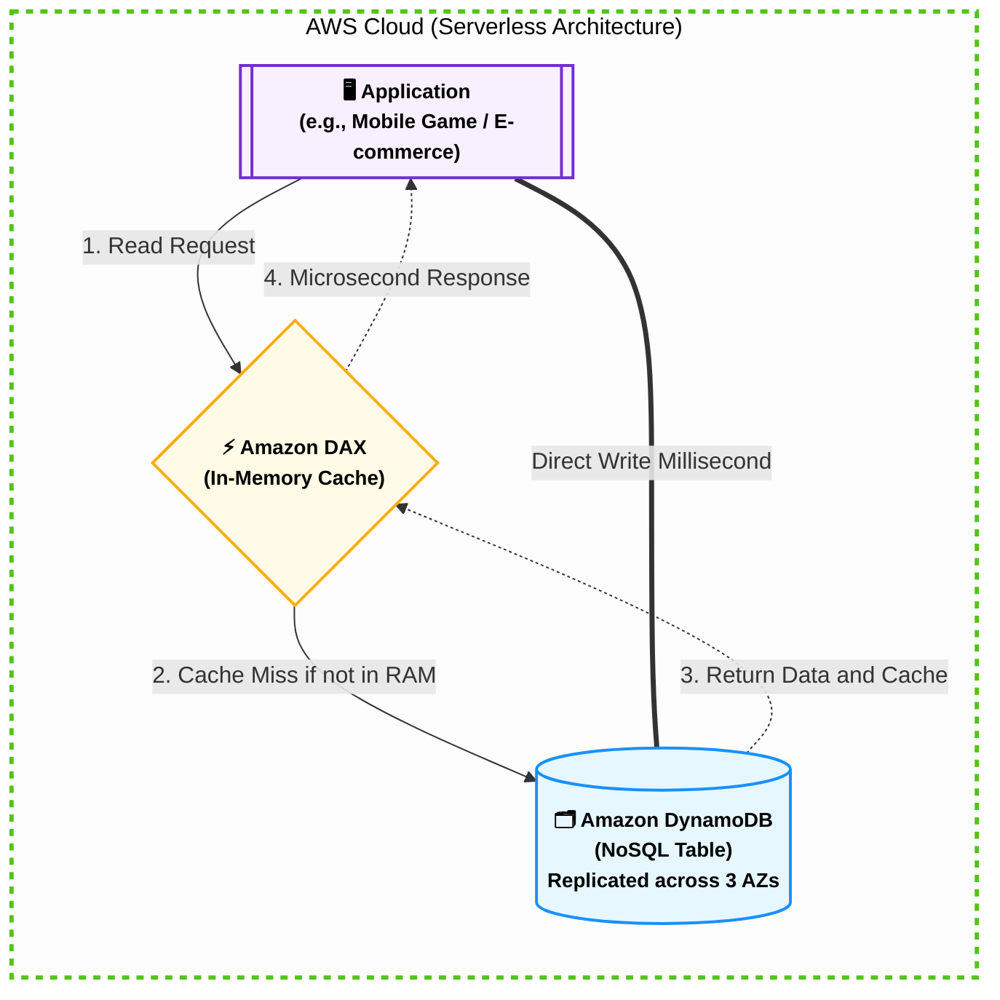

### 📊 شفرات الامتحان: متى تختار DynamoDB؟

الامتحان هيجيبلك سيناريوهات، أول ما تلمح الكلمات دي، اختار DynamoDB فوراً:

|**الكلمة الدلالية في سيناريو الامتحان (Keyword)**|**التفسير المعماري**|
|---|---|
|`Key-Value database`, `Document database`|النوع الأساسي لقاعدة البيانات (NoSQL).|
|`Single-digit millisecond latency at any scale`|السرعة الثابتة مهما زاد حجم البيانات أو الضغط.|
|`Serverless database`, `No infrastructure to manage`|إنت بتدير الداتا بس، أمازون بتدير السيرفرات.|
|`Microsecond latency for DynamoDB`|الإجابة هنا هتكون **DAX** (لتسريع الـ DynamoDB).|
|`Active-Active database across multiple regions`|الإجابة هنا هتكون **DynamoDB Global Tables**.|
|`Shopping cart`, `Gaming leaderboards`, `Session state`|أشهر استخدامات الـ DynamoDB في بيئة العمل.|

---
## الجزء الثالث: مستودعات البيانات والتحليلات (Redshift & Athena)

**أصل الحكاية والمشكلة المعمارية (The Core Problem):**

تخيل إنك بنيت سيستم مبيعات ضخم. الداتابيز الأساسية بتاعتك (RDS أو DynamoDB) بتسجل آلاف عمليات البيع كل دقيقة. مدير الشركة طلب منك تقرير معقد جداً: _"عايز أعرف مبيعات منتج معين في آخر 5 سنين، متقسمة بالشهور والمحافظات، ومقارنتها بمبيعات نفس المنتج لشركة تانية"_.

لو كتبت كود `SQL` يعمل `JOIN` و `GROUP BY` على قاعدة البيانات الأساسية بتاعتك (اللي شغالة لايف)، الـ CPU هيوصل 100%، والداتابيز هتهنج، والموقع هيقع!

هنا ظهر مفهوم فصل المعمارية لجزئين:

1. **OLTP (Online Transaction Processing):** دي الـ RDS اللي بتسجل الشغل اليومي السريع.
    
2. **OLAP (Online Analytical Processing):** دي "مستودعات البيانات" اللي بناخد فيها نسخة من الداتا كل يوم بالليل، عشان نعمل عليها التحليلات الثقيلة براحتنا من غير ما نأثر على الموقع. بطل القصة دي هو **Amazon Redshift**.
    

### ⚙️ أولاً: وحش التحليلات ومستودعات البيانات (Amazon Redshift)

الـ Redshift هو (Data Warehouse) أو مستودع بيانات مصمم خصيصاً لتحليل البيانات الضخمة جداً (بيتابايت - Petabytes) بسرعة خرافية.

**القواعد الهندسية للـ Redshift (دستور الامتحان):**

1. **التخزين العمودي (Columnar Storage):**
    
    على عكس الـ RDS اللي بيخزن الداتا في "صفوف"، الـ Redshift بيخزنها في "أعمدة". يعني لو بتعمل استعلام عن "سعر المنتجات"، هو بيسحب عمود السعر بس من غير ما يقرأ باقي بيانات الجدول. ده بيقلل القراءة من الهارد جداً وبيسرع التحليل.
    
2. **المعالجة المتوازية (Massively Parallel Processing - MPP):**
    
    الـ Redshift بيقسم الاستعلام المعقد (Query) بتاعك على كذا سيرفر جوه الكلاستر (Cluster) يشتغلو فيه مع بعض في نفس اللحظة، ويرجعولك النتيجة في ثواني.
    
3. **التسعير التنافسي:**
    
    أمازون بتفتخر إن Redshift بيكلف 1/10 (عُشر) تكلفة مستودعات البيانات التقليدية اللي الشركات بتعملها (On-Premises).
    

- 🚨 **الكلمات الدلالية في الامتحان:** `Data Warehouse`, `Analytics`, `OLAP`, `Petabyte-scale data warehousing`.
    

### ⚙️ ثانياً: استعلامات السحابة المباشرة (Amazon Athena)

**المشكلة:** طب لو الداتا بتاعتك أصلاً مش في داتابيز؟ لو الداتا عبارة عن ملايين ملفات الـ (Logs / Text / CSV) مرمية في جردل (S3 Bucket)؟ عشان تحللها، هتحتاج تعمل سيرفر، وتسطب عليه داتابيز، وتعمل (Import) للملفات دي من S3 للداتابيز.. حوار طويل ومكلف!

**الحل السحري (Athena):**

دي خدمة (Serverless) عبارة عن "محرك بحث SQL" طاير في الهوا. إنت بتفتح الـ Athena، تكتب كود `SELECT * FROM S3-Bucket`، وهي بتنزل تقرأ الملفات اللي جوه الـ S3 مباشرة وتطلعلك النتيجة!

**قواعد Athena في الامتحان:**

1. **بدون خوادم (Serverless):** مفيش سيرفرات بتديرها ولا داتابيز بتسطبها.
    
2. **الدفع بالاستخدام (Pay per Query):** بتدفع فلوس على كل تيرا بايت (TB) الـ Athena بتعمله (Scan) جوه S3. (عشان كده يفضل تضغط ملفاتك قبل ما ترميها في S3 عشان تقلل الفاتورة).
    
3. **الاستخدام الأشهر:** تحليل سجلات النظام (Log Analysis) زي الـ VPC Flow Logs أو CloudTrail Logs.
    

- 🚨 **الكلمات الدلالية في الامتحان:** `Query data in S3 directly`, `Serverless SQL`, `Analyze logs in S3`, `Standard SQL`.
    

### ⚙️ ثالثاً: مكملات البيانات الضخمة (Amazon EMR)

_(دي بتيجي كسؤال عابر في الامتحان، بس لازم تكون عارفها)._

**Amazon EMR (Elastic MapReduce):**

لو الشركة بتاعتك عندها داتا ضخمة جداً (Big Data) وبتستخدم تقنيات مفتوحة المصدر زي **Hadoop** أو **Apache Spark**، بدل ما تبني سيرفرات كتير عشان تشغلهم، الـ EMR بيعملك الكلاستر ده كله جاهز للإطلاق في دقايق.

- 🚨 **الكلمات الدلالية في الامتحان:** `Hadoop cluster`, `Apache Spark`, `Big data framework`.
    

### 🏗️ اللوحة المعمارية: مسار البيانات للتحليلات (Mermaid)

الرسمة دي بتوضح إزاي الداتا بتمشي من مرحلة العمليات اليومية (OLTP) لمرحلة التحليلات (OLAP)، وتم تطبيق كل قواعد أوبسيديان المعمارية الصارمة عليها (روابط خارجية، نصوص محمية، `flowchart LR`، و `<br/>`):


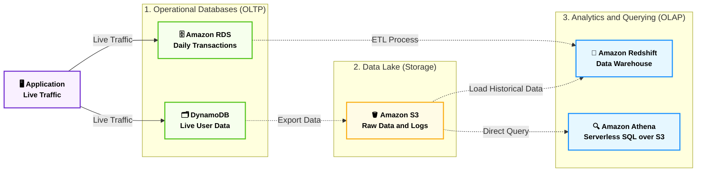

### 📊 شفرات الامتحان: متى تختار أي خدمة تحليل؟

|**الكلمة الدلالية في سيناريو الامتحان (Keyword)**|**الإجابة الصحيحة (Service)**|
|---|---|
|`Data Warehouse`, `Petabyte-scale analytics`, `Complex analytical queries`|**Amazon Redshift**|
|`Analyze data directly in S3`, `Serverless interactive query`, `Standard SQL`|**Amazon Athena**|
|`Hadoop`, `Spark`, `Managed Big Data framework`|**Amazon EMR**|

---
##  الجزء الرابع: التخزين المؤقت والهجرة (ElastiCache & DMS)

**أصل الحكاية والمشكلة المعمارية (The Core Problem):**

إحنا كده غطينا الداتابيز العادية (RDS) والسريعة (DynamoDB) والتحليلات (Redshift). بس في بيئة العمل الحقيقية، بتظهر مشكلتين كبار:

1. **أزمة القراءة المتكررة:** لو عندك موقع إخباري، ملايين الناس بتدخل تقرأ نفس الخبر الرئيسي. لو الأبلكيشن راح يقرأ الخبر ده من الـ RDS مليون مرة في الدقيقة، الداتابيز هتقع! محتاجين حاجة تشيل الحمل ده.
    
2. **أزمة الانتقال للسحابة:** الشركة مقتنعة بـ AWS، بس الداتابيز بتاعتهم موجودة على سيرفراتهم القديمة (On-Premises). إزاي ننقل الداتا دي للسحابة من غير ما الموقع يقف دقيقة واحدة؟
    

هنا أمازون بتتدخل بخدمتين هم أبطال الجزء ده: **ElastiCache** و **DMS**.

### ⚙️ أولاً: التخزين المؤقت في الذاكرة (Amazon ElastiCache)

الـ ElastiCache عبارة عن خدمة بتقدم (In-Memory Data Store). يعني الداتا مش بتتخزن على هارد ديسك بطيء، دي بتتخزن في "الرامات" (RAM) بتاعة السيرفر، وده بيخلي سرعة الاستجابة بأجزاء من المللي ثانية (Sub-millisecond latency).

_ملاحظة: ElastiCache بيستخدم لتخفيف الضغط عن قواعد البيانات العلائقية (RDS)، زي ما الـ DAX بيخفف الضغط عن الـ DynamoDB._

**محركات الـ ElastiCache (أسئلة المقارنة في الامتحان):**

1. **Redis:**
    
    - هو المحرك الأقوى والأكثر استخداماً.
        
    - بيدعم البيانات المعقدة (Lists, Sets).
        
    - **تريكة الامتحان:** Redis بيدعم الـ (Multi-AZ) والـ (Backups)، يعني لو السيرفر وقع، الداتا مش بتطير.
        
2. **Memcached:**
    
    - أبسط بكتير ومصمم للأشياء البسيطة جداً (Strings).
        
    - بيدعم الـ (Multi-threading) يعني بيستغل معالجات السيرفر بكفاءة.
        
    - **تريكة الامتحان:** لا يدعم الـ Multi-AZ ولا الـ Backups. لو السيرفر رستر، الرامات بتفضى والداتا بتطير!
        

- 🚨 **الكلمات الدلالية في الامتحان:** `Sub-millisecond latency`, `In-memory data store`, `Alleviate database load`, `Improve read performance for RDS`.
    

### ⚙️ ثانياً: خدمة هجرة قواعد البيانات (AWS DMS)

**AWS Database Migration Service (DMS)** هي الخدمة السحرية اللي بتنقل الداتابيز بتاعتك من أي مكان لـ AWS (أو العكس) بسرعة وبدون ما توقف الأبلكيشن بتاعك (Zero Downtime Migration).

**أنواع الهجرة في الامتحان:**

1. **الهجرة المتجانسة (Homogeneous Migration):**
    
    إنت بتنقل من نفس النوع لنفس النوع. (مثلاً: Oracle على سيرفرات الشركة ➔ Oracle على Amazon RDS). هنا إنت بتستخدم DMS مباشرة عشان ينقل الداتا.
    
2. **الهجرة غير المتجانسة (Heterogeneous Migration):**
    
    إنت بتنقل من نوع لنوع تاني خالص (عشان توفر فلوس الرخص). (مثلاً: Oracle على سيرفرات الشركة ➔ Amazon Aurora).
    
    - **أداة الامتحان السحرية (SCT):** الـ DMS بينقل الداتا بس (الصفوف والأعمدة). لكن عشان تترجم "هيكل الجدول" (Schema) والـ (Stored Procedures) من لغة أوراكل للغة أورورا، لازم تستخدم أداة مساعدة مع الـ DMS اسمها **AWS Schema Conversion Tool (SCT)**.
        

- 🚨 **الكلمات الدلالية في الامتحان:** `Migrate databases securely`, `Continuous replication during migration`, `Change database engine`, `SCT`.
    

### 🏗️ اللوحة المعمارية: مسار التخزين المؤقت والهجرة (Mermaid)

الرسمة دي معمولة بـ (flowchart LR) ومطبقة لكل القواعد الصارمة (نصوص محمية بـ " "، أسهم نقية، وتخصيص خارج الـ Subgraphs) عشان تظهر معاك بأفضل جودة:


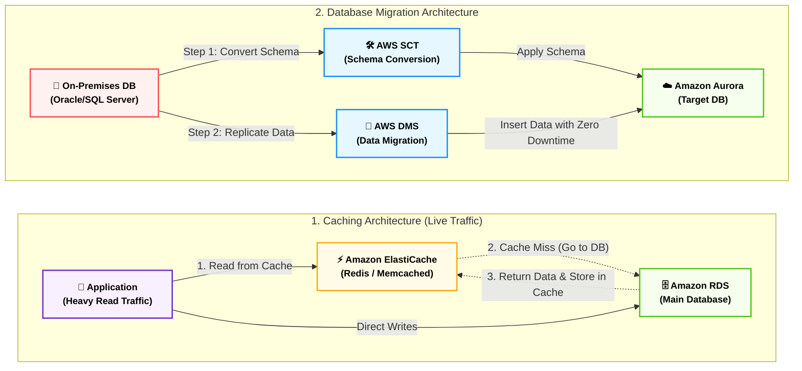

### 📊 شفرات الامتحان: التفرقة بين خدمات الداتابيز النهائية

لأن الداتابيز بتلخبط، ده الجدول الذهبي النهائي اللي تبروزه في النوتس:

|**الهدف (Use Case)**|**الخدمة المناسبة (AWS Service)**|
|---|---|
|قاعدة بيانات علائقية (SQL)|**Amazon RDS**|
|داتابيز علائقية أسرع 5 مرات ومبنية للسحابة|**Amazon Aurora**|
|قاعدة بيانات NoSQL سريعة جداً (Serverless)|**Amazon DynamoDB**|
|تسريع استجابة DynamoDB للميكرو ثانية|**Amazon DAX**|
|تسريع استجابة RDS وتخفيف أحمال القراءة|**Amazon ElastiCache**|
|مستودع بيانات ضخم للتحليلات المعقدة|**Amazon Redshift**|
|هجرة قاعدة بيانات من الخارج إلى AWS|**AWS DMS** (+ **SCT** لو هتغير النوع)|

---
## 2. الحوسبة المتقدمة وطرق النشر (Compute, Deploy & Integration) - الجزء الأول: عوالم الحاويات (Containers & Docker)

**أصل الحكاية والمشكلة المعمارية (The Core Problem):**

زمان، لو عندك مشروع (Backend) بـ Laravel ومشروع تاني بـ Node.js وعايز تشغلهم على نفس السيرفر (EC2)، كنت بتعاني من تضارب المكاتب والإصدارات (Dependency Conflicts). الحل القديم كان إننا نعمل (Virtual Machines - VMs)، بس الـ VM تقيلة جداً لأن كل واحدة بتحتاج "نظام تشغيل كامل" (Linux/Windows) خاص بيها، وده بيستهلك رامات وبروسيسور على الفاضي.

هنا ظهر السحر بتاع الـ **Containers (الحاويات)** وبطلها **Docker**.

فكرة الحاوية إنك بتحط الكود بتاعك (مثلاً مشروع الـ Laravel) مع كل المكاتب اللي بيحتاجها في "صندوق مقفول". الصندوق ده خفيف جداً، مفيش جواه نظام تشغيل كامل، هو بيستلف النواة (Kernel) بتاعة السيرفر الأساسي. الميزة المعمارية الجبارة هنا: "لو الحاوية اشتغلت على جهازك في اللاب (Ubuntu مثلاً)، هتشتغل بنفس الكفاءة بالظبط على سيرفرات أمازون بدون أي أخطاء".

لما يكون عندك 10 حاويات، تقدر تديرهم بنفسك. بس لما يكون عندك 1000 حاوية (Microservices)، محتاج "مايسترو" ينظمهم، يفتحهم، يراقبهم، ولو واحدة ماتت يخلق غيرها. أمازون بتقدملك 3 أبطال في المعركة دي.

### ⚙️ أولاً: المايسترو (Container Orchestration)

في الامتحان، أمازون بتخيرك بين نوعين من "المايسترو" لإدارة الحاويات:

#### 1. Amazon ECS (Elastic Container Service)

- **الفكرة:** ده المايسترو "الخاص بأمازون" (AWS-Native). مصمم عشان يكون سهل الاستخدام، وبيندس بقوة مع خدمات أمازون التانية (زي الـ Load Balancers والـ IAM).
    
- **السيناريو:** لو الشركة بتاعتك عايزة تشغل Docker، وكل البنية التحتية بتاعتها جوه AWS، ومش عايزين يوجعوا دماغهم بتعقيدات برمجية، الـ ECS هو الحل المثالي.
    

#### 2. Amazon EKS (Elastic Kubernetes Service)

- **الفكرة:** ده المايسترو "مفتوح المصدر" (Open-Source). أمازون جابت تكنولوجيا **Kubernetes** (اللي جوجل اخترعتها وبقت المعيار العالمي) وعملتلها إدارة على الكلاود.
    
- **السيناريو المعماري (🚨 تريكة امتحان):** لو الشركة بتاعتك بتستخدم (Multi-Cloud) يعني جزء من السيرفرات على AWS وجزء على Google Cloud أو On-Premises، وعايزين سيستم يقدر يشتغل في أي مكان بنفس الكود (No Vendor Lock-in)، لازم تختار **EKS**.
    
- **الكلمات الدلالية:** `Kubernetes`, `K8s`, `Open-source container orchestration`, `Migrate existing Kubernetes`.
    

### ⚙️ ثانياً: العضلات (The Compute Engine)

الـ ECS والـ EKS هما المايسترو، بس الحاوية (Container) في النهاية محتاجة "رامات وبروسيسور" حقيقيين عشان تشتغل عليهم. هنا أمازون بتديك طريقين (ودي من أهم أسئلة الامتحان):

#### الطريق الأول: الدفع المسبق والإدارة (EC2 Launch Type)

- **الفكرة:** إنت بتروح تخلق سيرفرات **EC2** عادية جداً، وتسطب عليها برنامج صغير (Agent)، وتقول للـ ECS: "العب براحتك ونزل الحاويات بتاعتك على السيرفرات دي".
    
- **العيوب:** إنت هنا بتدفع تمن سيرفر الـ EC2 سواء كان مليان حاويات أو فاضي. وإنت اللي مسؤول عن تحديث نظام التشغيل (OS Patching) بتاع السيرفر.
    
- **السيناريو:** لو إنت محتاج تحكم كامل في السيرفر أو عندك رخص معينة.
    

#### الطريق الثاني: الحوسبة السحرية (AWS Fargate) - 🚨 [سؤال مؤكد]

- **الفكرة:** ده الـ **(Serverless Compute for Containers)**. هنا إنت مبتمتلكش ولا سيرفر EC2! إنت بتروح للـ Fargate وتقوله: "أنا عندي الحاوية دي، محتاجلها 2 جيجا رام و 1 كور بروسيسور.. شغلها".
    
- **الكواليس:** أمازون بتخلق بيئة معزولة في الكواليس، تشغل حاويتك، وتحاسبك **بالثانية** على حجم الرامات والـ CPU اللي الحاوية استهلكتهم فقط! مفيش سيرفرات تديرها، مفيش تحديثات لنظام التشغيل، مفيش صداع.
    
- **الكلمات الدلالية في الامتحان:** `Serverless containers`, `No infrastructure to manage`, `Pay per container`.
    

### ⚙️ ثالثاً: المخزن (Amazon ECR)

**Amazon ECR (Elastic Container Registry):**

زي ما الـ GitHub هو مخزن للأكواد، وزي ما الـ S3 هو مخزن للملفات، الـ ECR هو **"المخزن الآمن لصور الحاويات (Docker Images)"**.

قبل ما المايسترو (ECS أو EKS) يشغل أي حاوية، لازم يروح يسحب الصورة بتاعتها من الـ ECR. (ممتاز في الامتحان لو سألك عن مكان تخزين الحاويات بأمان وتشفير).

### 🏗️ اللوحة المعمارية: عوالم الحاويات في أمازون (Mermaid)

الرسمة دي معمولة بـ `flowchart LR` ومطبقة لكل القواعد الصارمة بتاعتك في أوبسيديان، بتوضح العلاقة بين المخزن، المايسترو، والعضلات:


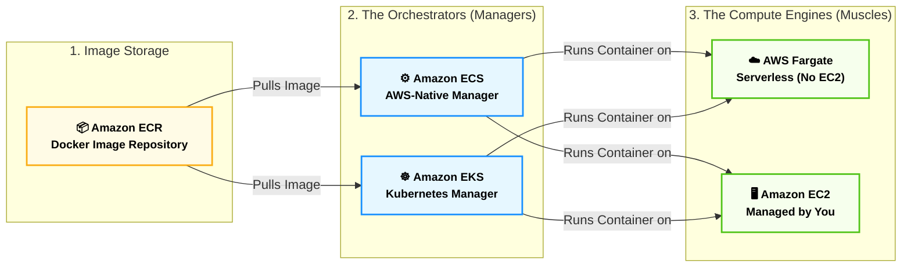

### 📊 شفرات الامتحان: الخلاصة لاختيار الحاويات

عشان تحل أي سؤال عن الـ Containers في 5 ثواني، احفظ الكلمات الدلالية دي:

|**الكلمة الدلالية في سيناريو الامتحان (Keyword)**|**الإجابة الصحيحة (AWS Service)**|
|---|---|
|`Run Docker containers`, `AWS-native orchestration`, `Deep AWS integration`|**Amazon ECS**|
|`Kubernetes`, `K8s`, `Open-source orchestration`, `Migrate from on-premises K8s`|**Amazon EKS**|
|`Serverless containers`, `Run containers without managing EC2`, `Don't want to manage infrastructure`|**AWS Fargate**|
|`Store Docker images`, `Container registry`, `Securely store container images`|**Amazon ECR**|

---

## الجزء الثاني: الحوسبة بدون خوادم (Serverless & Batch)

**أصل الحكاية والمشكلة المعمارية (The Core Problem):**

عشان تفهم السحر ده، خليني أضربلك مثال من بره الكلاود خالص. لو إنت عايز تشرب كوباية عصير كل يوم، النظام القديم (EC2) بيقولك: "روح اشتري عصارة، وادفع تمنها بالكامل، وحطها في المطبخ، ونضفها كل يوم سواء استخدمتها أو لأ".

نظام الـ **Serverless (بدون خوادم)** بيقولك: "روح المحل، اطلب كوباية العصير، وادفع تمن الكوباية دي بس، وامشي!". مفيش عصارة تشتريها، مفيش مطبخ تنضفه.

في عالم البرمجة، بدل ما تأجر سيرفر EC2 كامل يفضل شغال 24 ساعة عشان يستنى يوزر يرفع صورة فيعملها (Resize)، إنت بتدي لأمازون "الكود" بتاعك بس. ولما اليوزر يرفع الصورة، أمازون تشغل الكود لمدة ثانية واحدة، وتحاسبك على الثانية دي، وبعدين تقفل الكود!

### ⚙️ أولاً: بطل الساحة (AWS Lambda)

الـ **AWS Lambda** هي الخدمة اللي غيرت شكل الكلاود في العالم. دي خدمة حوسبة (Compute) بتسمحلك تشغل أكواد برمجية (زي Node.js, Python, Java) من غير ما تفكر في أي بنية تحتية.

**القواعد الهندسية للـ Lambda (دستور الامتحان):**

1. **الاعتماد على الأحداث (Event-Driven):**
    
    الـ Lambda مش بتشتغل لوحدها. دي عاملة زي "المصيدة"، نايمة مستنية حدث (Event) يحصل عشان تصحى.
    
    _أمثلة على الأحداث في الامتحان:_
    
    - ملف جديد اترفع في **Amazon S3** ➔ يصحي الـ Lambda عشان تضغطه.
        
    - داتا جديدة اتكتبت في **DynamoDB** ➔ تصحي الـ Lambda عشان تبعت إيميل.
        
    - يوزر طلب لينك من **API Gateway** ➔ يصحي الـ Lambda عشان تجيبله الداتا.
        
2. **مدة التنفيذ القصوى (The 15-Minute Rule) 🚨 [أهم فخ في الامتحان]:**
    
    الـ Lambda مصممة للمهام السريعة الخاطفة. أقصى مدة يقدر الكود بتاعك يفضل شغال فيها هي **15 دقيقة فقط**. لو الكود محتاج 16 دقيقة، أمازون هتقفل عليه الكود وتعمله (Timeout Error). لو جابلك سيناريو لمهمة بتاخد ساعات، إياك تختار Lambda!
    
3. **التسعير العبقري (Pay per Millisecond):**
    
    التسعير هنا بيتحسب بحاجتين:
    
    - **عدد الطلبات (Requests):** أول مليون طلب في الشهر "مجاناً" دايماً!
        
    - **مدة التشغيل (Compute Time):** بتدفع على كل "مللي ثانية" (Millisecond) الكود اشتغل فيها. لو الكود خلص في 200 مللي ثانية، هتدفع تمن الـ 200 مللي ثانية بس.
        

### ⚙️ ثانياً: معالجة المهام الثقيلة (AWS Batch)

**المشكلة المعمارية:**

طب لو الشركة بتاعتنا بتعمل تحليل لصور الأقمار الصناعية، أو بنعمل ريندر لفيلم أنيميشن 3D، والعملية الواحدة بتاخد **10 ساعات**؟ الـ Lambda هترفع إيدها وتقول "أنا آخري 15 دقيقة". والـ EC2 العادي هيحتاج مننا نكتب كود معقد عشان نفتح السيرفرات ونقفلها بعد ما الفيلم يخلص.

**الحل السحري (AWS Batch):**

دي خدمة مصممة لإدارة الـ (Batch Processing) أو "المهام المجمعة". إنت بترمي لأمازون 100,000 مهمة (Jobs) وتقولها "خلصيلي دول".

**الكواليس في AWS Batch:**

- الـ Batch مش سيرفر، هو "مدير". بيروح يشوف المهام بتاعتك محتاجة رامات وبروسيسور قد إيه.
    
- بيروح أوتوماتيك يخلق سيرفرات **EC2** (وغالباً بيختار **Spot Instances** الرخيصة جداً عشان يوفرلك فلوس).
    
- يشغل المهام بتاعتك عليها (في شكل Docker Containers)، ولما المهام كلها تخلص، **يقفل السيرفرات لوحده** ويمسحها عشان الفاتورة تقف!
    
- 🚨 **الميزة الجوهرية:** مفيش حد أقصى للوقت (No time limit). المهمة تقعد يوم، يومين، براحتها.
    

### 🏗️ اللوحة المعمارية: متى تختار Lambda ومتى تختار Batch؟ (Mermaid)

الرسمة دي معمولة بـ `flowchart LR` ومطبقة لكل القواعد الصارمة بتاعتك (نصوص محمية، الروابط في النهاية)، وبتلخص الفرق الجوهري في الامتحان:


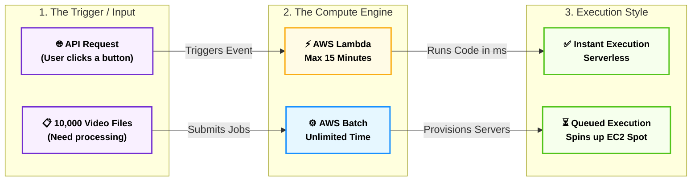

### 📊 شفرات الامتحان: الخلاصة لاختيار طريقة الحوسبة

دي الشفرات اللي هتخليك تلقط الإجابة في أسئلة الـ Compute من أول سطر:

|**الكلمة الدلالية في سيناريو الامتحان (Keyword)**|**الإجابة الصحيحة (AWS Service)**|
|---|---|
|`Run code without managing servers`, `Event-driven compute`, `Pay by millisecond`|**AWS Lambda**|
|`Task runs for 5 minutes`, `Triggered by S3 upload`|**AWS Lambda**|
|`Task runs for 3 hours`, `Long-running processes`|**AWS Batch** (أو EC2) - إياك تختار Lambda|
|`Process 100,000 images`, `Batch processing`, `Dynamically provisions EC2 Spot`|**AWS Batch**|
|`Run Docker containers`, `Microservices architecture`|**Amazon ECS / EKS**|

---
##  الجزء الثالث: البنية التحتية والنشر (IaC & PaaS)

**أصل الحكاية والمشكلة المعمارية (The Core Problem):**

تخيل إنك مطلوب منك تبني بنية تحتية لشركة: هتعمل شبكة (VPC)، جواها 4 سيرفرات (EC2)، متوصلين بـ Load Balancer، وفي الخلفية داتابيز (RDS) وجردل (S3). هتدخل على لوحة التحكم (Console) وتعمل ده كله بـ "الماوس" في حوالي 3 ساعات.

تاني يوم المدير قالك: "العميل عايز نسخة تانية طبق الأصل من السيستم ده في منطقة أوروبا!". هل هتدخل تضيع 3 ساعات تانية وتغلط في الإعدادات؟

هنا ظهر السحر: **البنية التحتية ككود (Infrastructure as Code - IaC)** و **منصات النشر (PaaS)**. أمازون بتقدم لك أداتين بيحلوا المشكلة دي بس بطريقتين مختلفتين تماماً.

### ⚙️ أولاً: مهندس البناء الآلي (AWS CloudFormation)

الـ **CloudFormation** هو أداة الـ (IaC) الرسمية من أمازون. الفكرة إنك مابتستخدمش الماوس خالص! إنت بتكتب "ملف نصي" (Template) بلغة `JSON` أو `YAML`، توصف فيه كل اللي إنت عايزه.

**القواعد الهندسية للـ CloudFormation في الامتحان:**

1. **أتمتة البنية التحتية (Automation & Repeatability):** بترفع الملف النصي لأمازون، والـ CloudFormation بيمشي عليه سطر سطر ويبني السيرفرات والشبكات بالترتيب الصح. لو عايز نسخة تانية في أوروبا، بتاخد نفس الملف وتشغله هناك، السيستم هيتبني في 5 دقايق بالضبط وبدون أي خطأ بشري!
    
2. **الـ Stack (الرزمة):** لما الـ CloudFormation بيبني الموارد دي، بيجمعهم كلهم في حاجة واحدة اسمها (Stack). لو حبيت تمسح السيستم كله، بتمسح الـ Stack، وأمازون بتدمر كل حاجة اتخلقت بسببه أوتوماتيك (عشان متنساش سيرفر شغال يسحب فلوس).
    
3. **AWS CDK (مكمل برمجي):** لو إنت مابتحبش تكتب `JSON/YAML`، أمازون عملتلك أداة اسمها **Cloud Development Kit (CDK)**، بتخليك تكتب البنية التحتية بلغات البرمجة العادية اللي إنت متعود عليها (زي TypeScript أو Python)، والـ CDK بيحولها لـ CloudFormation في الكواليس.
    

- 🚨 **الكلمات الدلالية في الامتحان:** `Infrastructure as Code (IaC)`, `JSON/YAML templates`, `Automate infrastructure provisioning`, `Repeatable deployments`.
    

### ⚙️ ثانياً: الصديق الصدوق للمطورين (AWS Elastic Beanstalk)

الـ **Elastic Beanstalk** هي خدمة بتندرج تحت تصنيف (Platform as a Service - PaaS).

**المشكلة:** إنت مبرمج، كاتب كود عظيم بـ **Laravel 13** أو **Node.js**، بس متعرفش حاجة عن الشبكات، ولا الـ Load Balancers، ولا إزاي تعمل Auto Scaling. إنت عايز حد ياخد الكود يشغلهولك وخلاص!

**الحل المعماري:**

1. إنت بتعمل (Upload) لملفات الكود بتاعك (ZIP file) للـ Elastic Beanstalk.
    
2. الخدمة دي بتشتغل كـ "مدير مشاريع ذكي". بتشوف كودك (PHP مثلاً)، فتروح هي لوحدها تفتح سيرفرات EC2، تسطب عليها Linux و Apache/Nginx و PHP، وتعمل Load Balancer، وتظبط الشبكة، وتعمل Deploy للكود بتاعك والموقع يشتغل!
    
3. **تريكة الامتحان:** رغم إن الـ Beanstalk بيبني كل حاجة أوتوماتيك، إلا إنه بيفضّل سايبلك **(التحكم الكامل - Full Control)**. يعني تقدر تدخل بـ SSH على السيرفرات اللي هو عملها وتعدل فيها براحتك (عكس الـ Serverless اللي بيخفي عنك السيرفر تماماً).
    

- 🚨 **الكلمات الدلالية في الامتحان:** `PaaS`, `Focus on writing code`, `Deploy web applications automatically`, `Don't worry about underlying infrastructure`, `Retain full control over EC2`.
    


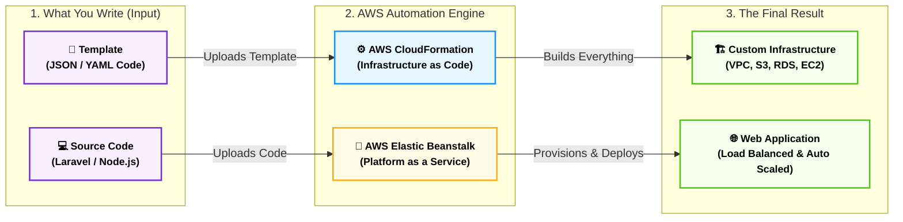

### 📊 شفرات الامتحان: الخلاصة لاختيار أداة النشر

السؤال هنا بييجي مباشر جداً، احفظ المفاتيح دي:

|**الكلمة الدلالية في سيناريو الامتحان (Keyword)**|**الإجابة الصحيحة (AWS Service)**|
|---|---|
|`Automate infrastructure provisioning`, `Infrastructure as Code`, `JSON/YAML`|**AWS CloudFormation**|
|`Developer wants to focus on code`, `Deploy web apps easily`, `PaaS`|**AWS Elastic Beanstalk**|
|`Provision infrastructure using standard programming languages (Python/JS)`|**AWS CDK**|

---

##  الجزء الرابع: مصنع الأكواد (Developer Tools & CI/CD)

**أصل الحكاية والمشكلة المعمارية (The Core Problem):**

تخيل إنك بتبني مشروع معقد جداً، زي منصة ذكاء اصطناعي بتحلل نصوص طبية، أو مساعد ذكي للرد الآلي (IVR). التيم بتاعك بيكتب كود ليل نهار. لو كل مطور خلص الكود بتاعه ودخل رفعه بنفسه على السيرفر (Manual Deployment)، الكود هيضرب، والسيرفر هيقع، والعملاء هيهربوا!

عشان نحل ده، ظهر مفهوم **(CI/CD - التكامل المستمر والنشر المستمر)**. الفكرة هنا إننا نبني "مصنع آلي" للأكواد (Assembly Line): المطور يرفع الكود، المصنع يختبره أوتوماتيك، يجهزه، ويرميه على السيرفرات بدون أي تدخل بشري.

أمازون عملتلك عائلة كاملة من الأدوات بتبدأ بكلمة `Code` عشان تدير المصنع ده من الألف للياء.

### ⚙️ أبطال مصنع الأكواد (The AWS Code Family)

كل خدمة من دول بتلعب دور محدد جداً في رحلة الكود، والامتحان بيسألك في وظيفة كل واحدة:

**1. مخزن المواد الخام (AWS CodeCommit):**

- **الوظيفة:** دي خدمة إدارة الأكواد المصدرية (Source Control Service). هي النسخة الخاصة بأمازون من `GitHub` أو `GitLab`.
    
- **الفكرة:** مكان آمن جداً ومقفل عليه بتشفير أمازون، التيم بيرفع عليه الكود بتاعهم باستخدام أوامر `Git` العادية.
    
- **الكلمة الدلالية في الامتحان:** `Private Git repository`, `Source control`, `Securely store source code`.
    

**2. خط التجميع والاختبار (AWS CodeBuild):**

- **الوظيفة:** الكود اللي طالع من المطورين ده "مادة خام". الـ CodeBuild بياخده، يعملّه تجميع (Compiling)، ويشغل عليه اختبارات الأمان (Unit Tests)، ويطلعه في شكل "رزمة جاهزة للتشغيل" (Artifact).
    
- **الميزة:** هو (Serverless)، يعني أمازون بتشغل سيرفرات في الكواليس تعمل الـ Build وتقفلها فوراً، وإنت بتدفع بالدقيقة.
    
- **الكلمة الدلالية في الامتحان:** `Compile source code`, `Run tests`, `Produce software packages`, `Continuous Integration (CI)`.
    

**3. أسطول التوصيل (AWS CodeDeploy):**

- **الوظيفة:** دي الخدمة اللي بتاخد الرزمة الجاهزة اللي طلعت من الـ CodeBuild، وتعملها نشر (Deployment) على السيرفرات بتاعتك.
    
- **تريكة الامتحان:** الـ CodeDeploy مش بينشر على EC2 بس! ده يقدر ينشر الكود بتاعك على (AWS Fargate)، وعلى (AWS Lambda)، وحتى على سيرفرات الشركة بتاعتك (On-Premises Servers).
    
- **الكلمة الدلالية في الامتحان:** `Automate code deployments`, `Maintain application uptime during deployment`.
    

**4. مدير المصنع (AWS CodePipeline): 🚨 [أهم خدمة فيهم]**

- **الوظيفة:** ده المايسترو اللي بيربط التلات خدمات اللي فوق ببعض عشان يعمل الـ (CI/CD Pipeline) الكامل.
    
- **السيناريو المعماري:** إنت بتقول للـ CodePipeline: "أول ما مبرمج يعمل Push لكود جديد في `CodeCommit`، ابعته فوراً لـ `CodeBuild` يختبره، ولو نجح، ابعته لـ `CodeDeploy` يرفعه على السيرفر". كل ده بيحصل أوتوماتيك كأنه شلال ورا بعضه!
    
- **الكلمة الدلالية في الامتحان:** `Automate release pipelines`, `CI/CD`, `Visualize and automate the different stages`.
    

### ⚙️ المكملات السحرية للمطورين

أمازون كمان وفرت أدوات بتسهل حياة المطور قبل حتى ما يكتب الكود:

- **AWS Cloud9:**
    
    تخيل إنك فاتح (VS Code) بس جوه المتصفح بتاعك! الـ Cloud9 هو (Cloud-based IDE) بيخليك تكتب كود وتشغله من أي جهاز في العالم، ومدمج جواه الـ Terminal متوصل بأمازون مباشرة.
    
    - **الكلمة الدلالية:** `Write, run, and debug code with just a browser`, `Cloud IDE`.
        
- **AWS X-Ray:**
    
    لو الكود بتاعك بطيء ومش عارف المشكلة منين، الـ X-Ray بيدخل جوه الكود ويعمل (Tracing) يتتبع الريكويست وهو معدي في السيرفرات والداتابيز، ويقولك بالظبط إيه اللي مأخر الرد!
    
    - **الكلمة الدلالية:** `Analyze and debug production applications`, `Trace user requests`.
        


```mermaid
flowchart LR
    %% Global Styling
    classDef default font-weight:bold,font-size:14px,stroke-width:2px;
    classDef dev fill:#f9f0ff,stroke:#722ed1,color:#000;
    classDef commit fill:#e6f7ff,stroke:#1890ff,color:#000;
    classDef build fill:#fffbe6,stroke:#faad14,color:#000;
    classDef deploy fill:#f6ffed,stroke:#52c41a,color:#000;
    classDef pipeline fill:#fff1f0,stroke:#ff4d4f,stroke-width:3px,stroke-dasharray: 5 5,color:#000;

    Developer["👨‍💻 Developer<br/>Pushes Code"]

    subgraph Pipeline ["🔄 AWS CodePipeline (The CI/CD Maestro)"]
        direction LR
        Commit["📦 AWS CodeCommit<br/>Git Repository"]
        Build["⚙️ AWS CodeBuild<br/>Compile & Test"]
        Deploy["🚀 AWS CodeDeploy<br/>Automated Deployment"]
    end

    Target["🌐 Production Servers<br/>(EC2, Lambda, or On-Prem)"]

    %% Connections defined strictly outside subgraphs with protected text
    Developer -->|"git push"| Commit
    Commit -->|"Triggers automatically"| Build
    Build -->|"Passes Artifacts"| Deploy
    Deploy -->|"Updates App safely"| Target

    %% Apply Classes
    class Developer dev;
    class Commit commit;
    class Build build;
    class Deploy deploy;
    class Pipeline pipeline;
    class Target dev;
```

### 📊 شفرات الامتحان: التفرقة بين عائلة Code

السؤال هنا مضمون 100% لو حفظت وظيفة كل أداة بالكلمة المفتاحية:

|**الكلمة الدلالية في سيناريو الامتحان (Keyword)**|**الإجابة الصحيحة (AWS Service)**|
|---|---|
|`Version control`, `Git-based repositories`, `Secure source code`|**AWS CodeCommit**|
|`Run tests`, `Compile code`, `Produce deployment packages`|**AWS CodeBuild**|
|`Deploy to EC2/Lambda/On-Premises`, `Rolling updates`|**AWS CodeDeploy**|
|`Automate release process`, `Orchestrate CI/CD workflow`|**AWS CodePipeline**|
|`Write code in browser`, `Cloud-based IDE`|**AWS Cloud9**|
|`Debug microservices`, `Trace performance bottlenecks`|**AWS X-Ray**|

---
## الجزء الخامس: فك الارتباط (Decoupling & Integration)

**أصل الحكاية والمشكلة المعمارية (The Core Problem):**

في البرمجة القديمة، كنا بنبني التطبيقات ككتلة واحدة (Monolithic Architecture). يعني لو اليوزر داس على زرار "شراء"، الويب سيرفر بيكلم الداتابيز مباشرة عشان يسجل الطلب. المشكلة إن لو في (Black Friday) و100 ألف يوزر داسوا "شراء" في نفس الثانية، الداتابيز هتهنج وموقعك هيقع كله!

أمازون قالتلك: "لازم تفصل مكونات السيستم عن بعضها (Decoupling)، عشان لو جزء وقع أو بقى بطيء، باقي السيستم يفضل شغال". إزاي؟ عن طريق إننا نحط "مخدة" أو "طابور" في النص يمتص الصدمة.

### ⚙️ أولاً: طوابير الرسائل (Amazon SQS)

الـ **SQS (Simple Queue Service)** هي أول خدمة أمازون عملتها في تاريخها! عبارة عن "طابور انتظار" (Queue).

- **الكواليس (Pull-Based):** لما الـ 100 ألف يوزر يدوسوا "شراء"، الويب سيرفر مش بيكلم الداتابيز! الويب سيرفر بياخد الطلبات يرميها في طابور الـ SQS (اللي مستحيل يقع). بعدين سيرفر الداتابيز (أو الـ Worker) يصحى براحته، ويروح يسحب (Pull) الطلبات من الطابور واحد ورا التاني ويعالجها.
    
- **الميزة المعمارية:** إنت كده عملت (Buffer) امتص الضغط، ومنعت السيستم إنه يفقد أي رسالة أو يقع.
    
- 🚨 **الكلمات الدلالية في الامتحان:** `Decouple applications`, `Message queue`, `Buffer requests`, `Pull-based`.
    

### ⚙️ ثانياً: مكبر الصوت والإشعارات (Amazon SNS)

الـ **SNS (Simple Notification Service)** هو نظام الـ (Pub/Sub) أو مكبر الصوت بتاع أمازون.

- **الكواليس (Push-Based):** بدل ما تستنى حد يجي يسحب منك الرسالة زي الـ SQS، الـ SNS بياخد الرسالة و"يزقها" (Push) فوراً لكل المشتركين معاه.
    
- **الاستخدامات (Subscribers):** الـ SNS بيقدر يبعت الرسالة دي لـ:
    
    1. إيميلات أو رسائل SMS للمستخدمين.
        
    2. سيرفرات HTTP/HTTPS.
        
    3. طوابير SQS (ودي حركة معمارية مشهورة جداً اسمها Fan-out).
        
    4. يشغل بيها أكواد AWS Lambda.
        
- 🚨 **الكلمات الدلالية في الامتحان:** `Pub/Sub`, `Send emails or SMS`, `Push notifications`, `Fan-out architecture`.
    

### ⚙️ ثالثاً: وحش البيانات اللحظية (Amazon Kinesis)

**المشكلة:** طب لو الداتا اللي جاية دي مش مجرد طلبات شراء؟ لو الداتا دي عبارة عن (ملايين السجلات اللحظية) زي أجهزة الـ IoT في مصنع، أو تتبع الـ GPS لعربيات أوبر، أو تحليل أسهم البورصة، والبيانات بتتدفق كأنها "نهر لا يتوقف".

الـ SQS العادي مش مصمم للسرعة والأحجام دي.

**الحل السحري (Kinesis):**

دي الخدمة المخصصة للـ (Real-time Data Streaming). بتستقبل ملايين البيانات في الثانية الواحدة، وتحللها في نفس اللحظة!

- 🚨 **الكلمات الدلالية في الامتحان:** `Real-time data streaming`, `Ingest large scale data streams`, `Analyze IoT or log data in real-time`.
    

### ⚙️ رابعاً: ناقل الأحداث المركزي (Amazon EventBridge)

_(كانت بتسمى زمان CloudWatch Events)._

تخيل الـ EventBridge كأنه "سنترال" بيربط خدمات أمازون ببعضها، وبيربط أمازون بخدمات خارجية (SaaS) زي Zendesk أو Datadog.

الفكرة: إنت بتكتب قاعدة (Rule) وتقول: "لما يحصل الحدث الفلاني (مثلاً سيرفر EC2 حالته اتغيرت لـ Stopped)، شغل الإجراء الفلاني (ابعت إيميل بـ SNS أو شغل Lambda)".

- 🚨 **الكلمات الدلالية في الامتحان:** `Serverless event bus`, `Connect applications using events`, `Integrate with SaaS`.
    


```mermaid
flowchart LR
    %% Global Styling
    classDef default font-weight:bold,font-size:14px,stroke-width:2px;
    classDef app fill:#f9f0ff,stroke:#722ed1,color:#000;
    classDef queue fill:#fffbe6,stroke:#faad14,color:#000;
    classDef topic fill:#e6f7ff,stroke:#1890ff,color:#000;
    classDef worker fill:#f6ffed,stroke:#52c41a,color:#000;
    classDef bad fill:#fff1f0,stroke:#ff4d4f,color:#000,stroke-dasharray: 5 5;

    subgraph Tightly_Coupled ["1. Tightly Coupled (Bad Architecture)"]
        direction LR
        App1["📱 Frontend App"]
        DB1["🗄️ Backend/DB"]
    end

    subgraph Decoupled ["2. Decoupled Architecture (Best Practice)"]
        direction LR
        App2["📱 Frontend App"]
        SNS["📢 Amazon SNS<br/>(Push/Notify)"]
        SQS["📨 Amazon SQS<br/>(Queue/Buffer)"]
        Worker["⚙️ Processing Server<br/>(Pulls Data safely)"]
    end

    %% Connections defined strictly outside subgraphs
    App1 -->|"Direct Call (Crashes if overloaded)"| DB1
    
    App2 -->|"Publishes 1 Message"| SNS
    SNS -->|"Fans out to"| SQS
    SQS -.->|"Worker pulls when ready"| Worker

    %% Apply Classes
    class App1 app;
    class DB1 bad;
    class App2 app;
    class SNS topic;
    class SQS queue;
    class Worker worker;
```

### 📊 شفرات الامتحان: الخلاصة لفك الارتباط

|**الكلمة الدلالية في سيناريو الامتحان (Keyword)**|**الإجابة الصحيحة (AWS Service)**|
|---|---|
|`Decouple`, `Message queue`, `Buffer`, `Pull messages`|**Amazon SQS**|
|`Pub/Sub`, `Push notifications`, `Send emails/SMS to multiple subscribers`|**Amazon SNS**|
|`Real-time streaming`, `IoT big data streams`, `Real-time analytics`|**Amazon Kinesis**|
|`Serverless event bus`, `Connect SaaS apps to AWS`|**Amazon EventBridge**|

---
