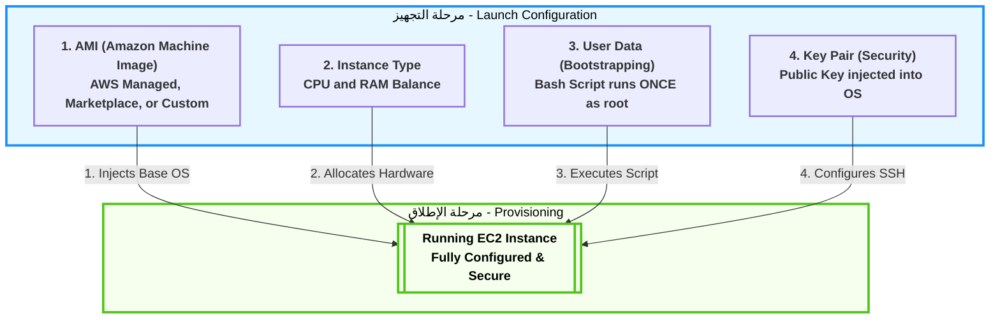
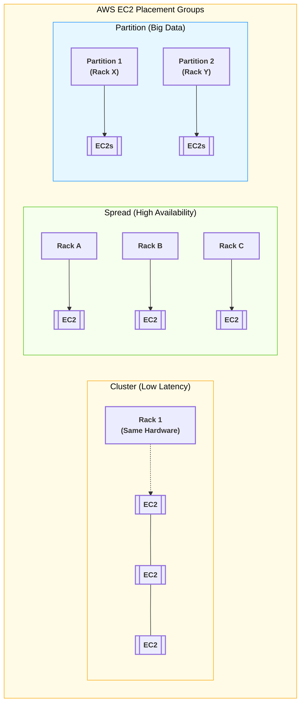
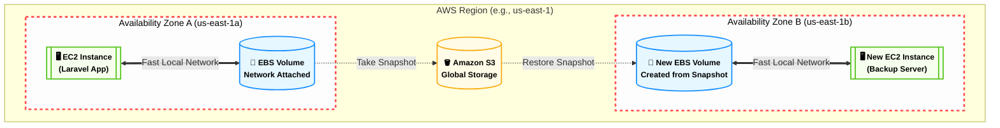

# Domain 3: Cloud Technology & Services

## 1. التشريح العميق والموسع لمعمارية EC2 (Elastic Compute Cloud)

**أصل الحكاية (The Core Problem):**

زمان، لو عايز ترفع أبلكيشن (سواء كان شغال بـ Node.js، أو Backend بـ Laravel 13)، كنت لازم تشتري سيرفر فيزيكال (حتة حديدة)، وتستنى شهور يوصلك، وتجيب مهندس شبكات يركبه في الـ Rack، وتسطب نظام التشغيل. الكارثة إنك لو الأبلكيشن بتاعك ضرب وبقى عليه ضغط، السيرفر الفيزيكال ده هيقع، وعشان تكبره لازم تشتري رامات وبروسيسور فيزيكال وتطفي السيرفر وتركبهم.

من هنا ظهر الـ **EC2**. الفكرة مش تأجير سيرفر، الفكرة في الـ **(Virtualization)**. أمازون جابت سيرفرات عملاقة، واستخدمت برامج (Hypervisors) عشان تقطع السيرفرات دي لـ "خوادم افتراضية" صغيرة. إنت بتبني السيرفر بتاعك كأنه "مكعبات ليجو" من خلال الـ API أو الـ Console، وفي 40 ثانية بيكون شغال.

### ⚙️ تفكيك مكعبات الـ EC2 (The 4 Core Building Blocks)

عشان تخلق سيرفر EC2، أمازون بتجبرك تختار 4 مكونات رئيسية، كل مكون فيهم وراه بحر من التفاصيل الهندسية:

#### 1. الـ AMI (Amazon Machine Image) - "أسطمبة الروح"

الـ AMI مش مجرد "نسخة أوبونتو". دي عبارة عن (صورة مجمدة - Immutable Image) من الهارد ديسك، بتحتوي على نظام التشغيل وأي برامج متسطبة عليه.

- **الأنواع في الامتحان:**
    
    1. **AWS Managed AMIs:** صور أمازون هي اللي عاملاها ومسؤولة عن تحديثها (زي Amazon Linux 2023 أو Ubuntu 24.04 صافي).
        
    2. **AWS Marketplace:** صور شركات تانية عاملاها وبتبيعها. مثلاً ممكن تشتري صورة جاهزة متسطب عليها (F5 Load Balancer) أو فايروال جاهز وتدفع تمن رخصة السوفت وير مع ثمن السيرفر.
        
    3. **Custom AMIs (Golden Image):** ودي أهم لقطة ليك كمهندس! إنت بتعمل سيرفر عادي، تسطب عليه الـ PHP والـ Nginx وتظبط إعدادات الـ Laravel بتاعتك، وبعدين تاخد من السيرفر ده (صورة - Snapshot). الصورة دي بقت (Golden AMI) خاصة بيك. بعد كده، تقدر تخلق 100 سيرفر في ثانية واحدة من الصورة دي، وكلهم هيطلعوا متسطب عليهم كل حاجة جاهزة!
        

#### 2. عائلات السيرفرات (Instance Types) - "العضلات والهيكل"

أمازون مش بتديك عضلات عشوائية. اسم السيرفر في أمازون (زي `m5.large`) بيتكون من 3 حتت: حرف (M) بيمثل العائلة، رقم (5) بيمثل الجيل، وكلمة (large) بتمثل الحجم.

- **عائلة الأغراض العامة (General Purpose - T & M):**
    
    دي السيرفرات اللي الـ CPU والرامات فيها متوازنين.
    

> [!warning] تحذير معماري (T-Series CPU Credits)
> 
> عائلة الـ **T** (زي t2.micro) بتشتغل بنظام الـ (Burstable Performance). يعني إيه؟ يعني طول ما السيرفر بتاعك هادي، بيجمع حاجة اسمها (CPU Credits). ولما يحصل ضغط مفاجئ، بيحرق الكريدت دي عشان يشتغل بأقصى طاقة. لو الكريدت خلصت، السيرفر بيهنج وبيبقى بطيء جداً. دي تريكة خطيرة في بيئة العمل!

- **عائلة المعالجة (Compute Optimized - C):**
    
    المعالجات هنا جبارة. بتستخدمها لو الكود بتاعك بيعمل حسابات معقدة، ريندرينج، أو بيعالج فيديوهات.
    
- **عائلة الذاكرة (Memory Optimized - R & X):**
    
    هنا الرامات هي اللي ضخمة جداً. دي مثالية لقواعد البيانات اللي بتحتاج تحط الداتا كلها في الميموري عشان سرعة الاستجابة (In-Memory Databases) زي Redis أو Memcached.
    
- **عائلة التخزين (Storage Optimized - I & D):**
    
    بتديك هاردات (NVMe) راكبة في اللوحة الأم مباشرة (مش عن طريق الشبكة) عشان توفرلك سرعة قراءة وكتابة (IOPS) مجنونة. ممتازة للـ Big Data والـ NoSQL Databases.
    

#### 3. سكريبت الإفاقة (User Data / Bootstrapping) - "البرمجة الآلية"

- **المشكلة:** لما الـ Auto Scaling يقرر يبني سيرفر جديد الساعة 3 الفجر، السيرفر بيطلع "أبيض" حتى لو من الـ AMI. مين هيسحب آخر كود إنت عملتله Push على GitHub؟ ومين هيعمل `npm install` أو `composer update`؟
    
- **الحل (User Data):** ده سكريبت (Bash Script) إنت بتكتبه في إعدادات الـ EC2.
    
- **القاعدة الذهبية:** السكريبت ده بيشتغل **بصلاحيات الـ root**، وبيشتغل **مرة واحدة فقط لا غير** في دورة حياة السيرفر (لحظة الولادة الأولى). لو عملت Restart للسيرفر، السكريبت ده مش هيشتغل تاني.
    

#### 4. مفاتيح الأمان (Key Pairs - Asymmetric Cryptography)

إزاي هتدخل على السيرفر بتاعك وتكتب أوامر (SSH) من غير ما تكتب Username و Password كل شوية، وفي نفس الوقت تحميه من الهاكرز؟

- أمازون بتستخدم "التشفير غير المتماثل". بتولد مفتاحين:
    
    1. **Public Key (المفتاح العام):** أمازون بتاخده وتزرعه جوه السيرفر بتاعك في ملف `~/.ssh/authorized_keys`.
        
    2. **Private Key (المفتاح الخاص):** ده ملف بينزل على جهازك الشخصي بامتداد `.pem`.
        
- **تريكة الامتحان:** أمازون **لا تحتفظ** بنسخة من المفتاح الخاص بتاعك. لو الملف ده اتمسح من على جهازك، فقدت السيطرة الكاملة على السيرفر ومستحيل تدخل عليه بـ SSH تاني!
    

### 🏗️ اللوحة المعمارية التفصيلية لتكوين الـ EC2 (Mermaid)

الخريطة دي بتفصل التفاعل المعقد بين الـ 4 مكونات عشان يخلقوا السيرفر النهائي (الكود خالي من الـ HTML ليتوافق مع Obsidian):




---
## 2. أمن السيرفرات: مجموعات الأمان (Security Groups)

**أصل الحكاية (The Core Problem):**

أي سيرفر EC2 بتخلقه وبتديله (Public IP) عشان الناس تدخله من على النت، بيبقى عامل زي بيت بيبانه وشبابيكه مفتوحة في شارع ضلمة؛ أي هاكر يقدر يعمل عليه (Port Scan) ويدخله. في الـ IT القديم، كنا بنشتري أجهزة (Hardware Firewalls) غالية جداً ونحطها على باب الشركة. في السحابة، أمازون اخترعت الـ **Security Groups (SG)**: ده فايروال افتراضي (Virtual Firewall) مجاني، بيحوط السيرفر بتاعك كأنه "درع شخصي"، وبيفلتر أي داتا داخلة أو طالعة.

### ⚙️ القواعد الهندسية للـ Security Groups (دستور الامتحان)

الـ Security Groups مش بتشتغل بالبركة، ليها 4 قواعد صارمة الامتحان بيلعب عليهم في السيناريوهات:

#### 1. مبدأ المنع الافتراضي (Default Deny)

- **القاعدة:** أول ما بتخلق SG جديد، بيكون **مانع كل حاجة داخلة للسيرفر (Inbound = Deny All)**، و**سامح بكل حاجة طالعة من السيرفر (Outbound = Allow All)**.
    
- **السيناريو:** لو عملت سيرفر وسطبت عليه موقع، الموقع مش هيفتح للناس إلا لو إنت دخلت بنفسك فتحت (Port 80 للـ HTTP) أو (Port 443 للـ HTTPS) في الـ Inbound Rules.
    

#### 2. حالة الاتصال (Stateful) - 🚨 [أهم تريكة في الامتحان]

- **المعنى المعماري:** الـ Security Group عندها "ذاكرة". يعني لو هي سمحت لريكويست إنه يدخل (Inbound)، هتسمح للرد بتاع الـ ريكويست ده إنه يخرج (Outbound) أوتوماتيك، **حتى لو إنت قافل كل الـ Outbound Rules!**
    
- **الفرق الجوهري:** في فايروال تاني في أمازون اسمه (NACL) ده بيكون (Stateless) مابيفهمش، لو فتحت الدخول لازم تفتح الخروج بإيدك. لكن الـ SG ذكية (Stateful).
    

#### 3. القواعد الإيجابية فقط (Allow Rules Only)

- إنت في الـ SG تقدر تقول: "اسمح لـ IP كذا إنه يدخل".
    
- لكن **مستحيل** تقول: "امنع IP كذا إنه يدخل". الـ SG مفيهاش (Deny Rules). لو عايز تمنع حد معين، بتسيبه بره القواعد المسموحة، فالـ SG هتمنعه بالديفولت.
    

#### 4. لغة التخاطب (IPs vs Security Groups)

- في الـ Inbound Rules، ممكن تفتح الباب لـ IP معين (مثلاً IP بيتك عشان تعمل SSH).
    
- **الحركة المعمارية الأذكى:** تقدر تفتح الباب لـ Security Group تانية!
    
    - _مثال:_ عندك سيرفر داتابيز (EC2-DB). بدل ما تفتحه للنت، هتقوله في الـ SG بتاعته: "ماتقبلش أي ريكويستات إلا لو جاية من الـ SG بتاعة سيرفر الـ Laravel (EC2-Web)". دي بتعمل طبقة حماية مرعبة (Micro-segmentation).
        

### 🏗️ اللوحة المعمارية: كيف يعمل الـ Security Group (Mermaid)

الرسمة دي بتوضح قاعدة الـ (Stateful) وإزاي الدرع بيحمي السيرفر:

Code snippet

```mermaid
flowchart LR
    classDef default font-weight:bold,font-size:14px,stroke-width:2px;

    User(("👨‍💻 User</br>Internet"))
    Hacker(("🦹 Hacker</br>Internet"))

    subgraph AWS_Cloud ["AWS Cloud"]
        subgraph SG ["🛡️ Security Group (Stateful Firewall)"]
            direction TB
            Inbound["Inbound Rules:</br>✅ Allow Port 80 (HTTP)</br>✅ Allow Port 22 (Your IP)"]
        end
        EC2[["🖥️ EC2 Instance</br>(Web Server)"]]
    end

    %% User Traffic
    User -->|1. HTTP Request (Port 80)| Inbound
    Inbound -->|Allowed!| EC2
    EC2 -.->|2. Auto-Allowed out</br>(Because SG is Stateful)| User

    %% Hacker Traffic
    Hacker -->|Try Port 3306 (DB)| Inbound
    Inbound -.-x|Blocked!</br>(Implicit Deny)| Hacker

    classDef aws fill:#f9f9f9,stroke:#ff9900,stroke-width:3px,color:#000;
    classDef sg fill:#e6f7ff,stroke:#1890ff,stroke-width:3px,color:#000,stroke-dasharray: 5 5;
    classDef ec2 fill:#f6ffed,stroke:#52c41a,stroke-width:3px,color:#000;
    classDef user fill:#fffbe6,stroke:#faad14,color:#000;
    classDef hacker fill:#fff1f0,stroke:#ff4d4f,color:#000;

    class AWS_Cloud aws;
    class SG sg;
    class EC2 ec2;
    class User user;
    class Hacker hacker;
```

بصة سريعة على الكود ده بعد ما ضفنا فيه الـ `</br>`، وقولي لو طالع معاك مظبوط وشكله نضيف في أوبسيديان.

---
## 3. أنظمة الدفع وتسعير خوادم EC2 (Pricing Models)

**أصل الحكاية (The Core Problem):**

الامتحان مش بس بيختبرك في التكنولوجيا، ده بيركز جداً على "إدارة التكلفة" (Cost Optimization). السيرفرات مش بتتدفع بطريقة واحدة؛ أمازون عملت 4 أنظمة دفع (Payment Methods) عشان تناسب كل السيناريوهات. اختيار النظام الغلط ممكن يخسّر الشركة ملايين، عشان كده الأسئلة دي **مؤكدة 100% في الامتحان**.

### ⚙️ تفكيك خطط الدفع (للامتحان)

#### (1) الدفع عند الاستخدام (On-Demand Instances)

- **الفكرة:** بتأجر السيرفر وتدفع بالثانية (أو بالساعة) اللي بيشتغل فيها بس. مفيش أي عقود ولا التزامات مقدمة.
    
- **الاستخدام (سيناريو الامتحان):** لو عندك أبلكيشن جديد لسه بتجربه ومش عارف الترافيك بتاعه هيكون إيه (Unpredictable workloads)، أو بتعمل (Test/Dev) لفترة قصيرة.
    
- **العيب:** دي **أغلى** خطة دفع عادية في أمازون.
    

#### (2) الخوادم المحجوزة (Reserved Instances - RI) & (Savings Plans)

- **الفكرة:** إنت بتمضي عقد مع أمازون إنك هتفضل تستخدم السيرفرات دي لمدة (سنة أو 3 سنين). مقابل العقد والالتزام ده، أمازون بتعملك خصم بيوصل لـ **72%** من سعر الـ On-Demand.
    
- **الاستخدام (سيناريو الامتحان):** لو الأبلكيشن بتاعك شغال 24/7 وحالته مستقرة (Steady-state workloads)، زي قواعد البيانات الأساسية للشركة أو موقع شغال بقاله سنين.
    

#### (3) الخوادم الرخيصة (Spot Instances) - 🚨 [أكثر سؤال بيتكرر]

- **الفكرة:** أمازون عندها سيرفرات فاضية في الداتا سنتر محدش مأجرها، فبتعرضها بخصم مرعب بيوصل لـ **90%**!
    
- **الكارثة (الشرط):** أمازون تقدر تسحب منك السيرفر ده وتطفيه في أي لحظة (بتديك إنذار دقيقتين بس) لو حد تاني احتاجه ودفع سعره On-Demand.
    
- **الاستخدام (سيناريو الامتحان):** العمليات اللي "عادي لو وقفت ونكملها بعدين" زي (Batch Processing)، ريندر الفيديوهات، تحليل البيانات، أو معالجة الصور.
    
- **تحذير:** إياك تختارها في الامتحان لو السيناريو بيقولك "تطبيق ويب بيخدم عملاء حالياً" أو "داتابيز حرجة".
    

#### (4) الخوادم المخصصة (Dedicated Hosts)

- **الفكرة:** إنت بتأجر "سيرفر حديد" بالكامل ليك لوحدك في الداتا سنتر، محدش من عملاء أمازون التانيين بيشاركك فيه.
    
- **الاستخدام (سيناريو الامتحان):** في حالتين بس:
    
    - لو الشركة عندها **قوانين امتثال صارمة (Strict Compliance)** بتمنع مشاركة الهاردوير لأسباب أمنية.
        
    - لو عندك **رخصة سوفت وير (Software License)** خاصة بشركتك (زي Windows Server أو Oracle) بتشترط إنها تنزل على هاردوير محدد ومستقل.
        
- **العيب:** دي أغلى حاجة ممكن تأجرها في أمازون على الإطلاق.
    

### 🏗️ خريطة اتخاذ القرار في التسعير (Mermaid)

الرسمة دي بتلخصلك إزاي تختار الإجابة الصح في الامتحان بناءً على الكلمة الدلالية (Keyword) اللي في السيناريو:

Code snippet

```mermaid
flowchart TD
    classDef default font-weight:bold,font-size:16px,stroke-width:2px;

    Start{"طبيعة التطبيق؟</br>(Workload Type)"}

    Start -->|غير متوقع أو تحت التطوير</br>(Unpredictable / Short-term)| OnDemand["On-Demand</br>الدفع بالاستخدام - الأغلى"]
    
    Start -->|مستقر ومستمر لسنوات</br>(Steady-state / Long-term)| RI["Reserved Instances</br>خصم 72% بعقد"]
    
    Start -->|يتحمل الانقطاع المفاجئ</br>(Fault-tolerant / Batch)| Spot["Spot Instances</br>خصم 90% ولكن غير مستقر"]
    
    Start -->|قوانين صارمة أو رخص</br>(Compliance / Licensing)| Dedicated["Dedicated Hosts</br>سيرفر فيزيكال خاص بك"]

    classDef ondemand fill:#fffbe6,stroke:#faad14,color:#000;
    classDef ri fill:#e6f7ff,stroke:#1890ff,color:#000;
    classDef spot fill:#fff1f0,stroke:#ff4d4f,color:#000;
    classDef dedicated fill:#f6ffed,stroke:#52c41a,color:#000;

    class OnDemand ondemand;
    class RI ri;
    class Spot spot;
    class Dedicated dedicated;
```

كده ملف الـ EC2 اتقفل بالضبة والمفتاح في النوتس بتاعتك:

1. المعمارية الفنية (AMI, Types, User Data, Keys).
    
2. الحماية (Security Groups).
    
3. خطط الدفع والتسعير (Pricing Models).
    

---

### 📊 جدول المقارنة الشامل لخطط تسعير EC2 (الخلاصة للامتحان)

|**خطة الدفع (Pricing Model)**|**التكلفة والخصم**|**الفكرة الجوهرية (المعنى الهندسي)**|**الكلمة الدلالية في الامتحان (Exam Keywords)**|
|---|---|---|---|
|**On-Demand**<br><br>  <br><br>(الدفع عند الاستخدام)|الأغلى (بدون خصم)|تأجير حر بالثانية/الساعة بدون أي عقود أو التزامات مسبقة.|Unpredictable, Spiky, Short-term, Testing & Development|
|**Reserved Instances**<br><br>  <br><br>(الخوادم المحجوزة)|خصم يصل لـ **72%**|عقد التزام (Commitment) لمدة سنة أو 3 سنوات مع أمازون.|Steady-state, Predictable, Long-term, 1 or 3 years commitment|
|**Spot Instances**<br><br>  <br><br>(الخوادم الرخيصة الفائضة)|خصم يصل لـ **90%**|استغلال هاردوير أمازون الفاضي، لكن يمكن سحبه بإنذار (دقيقتين) فقط!|Fault-tolerant, Batch processing, Can be interrupted, Stateless|
|**Dedicated Hosts**<br><br>  <br><br>(الخوادم المخصصة)|الأغلى على الإطلاق|سيرفر فيزيكال كامل (Hardware) مخصص لشركتك فقط غير مشترك مع أحد.|Strict Compliance, Regulatory requirements, Software Licensing (BYOL)|

> [!info] نصيحة أخيرة للحل السريع
> 
> في الامتحان، أول ما عينك تلمح كلمة **(Interruptible)** أو **(Batch)** روح فوراً للـ **Spot**. وأول ما تلمح كلمة **(License)** أو **(Compliance)** اختار **Dedicated Hosts** وإنت مغمض!

---
## 4. المكملات الهندسية لـ EC2 (تريكات مخفية في الامتحان)

في 3 مفاهيم أساسية بيكملوا معمارية الـ EC2، وأسئلتهم بتيجي في الامتحان على هيئة "فخوخ" (Traps):

### (1) العناوين الثابتة: Elastic IP (EIP)

- **المشكلة:** لما بتعمل سيرفر EC2 جديد (مثلاً عليه مشروع Laravel 13)، أمازون بتديله Public IP مجاني عشان الناس تدخله. الكارثة إنك لو عملت للسيرفر (Stop) ورجعت عملتله (Start)، الـ IP ده بيتغير! لو إنت رابط الـ IP ده بدومين (زي .com)، الموقع هيقع.
    
- **الحل المعماري:** الـ **Elastic IP**. ده IP ثابت (Static IPv4) إنت بتحجزه لنفسك ويفضل بتاعك للأبد، وتربطه بالسيرفر، ولو السيرفر عمل ريستارت هيفضل الـ IP زي ما هو.
    
- 🚨 **فخ الامتحان (التسعير الغريب):** الـ Elastic IP **مجاني** طول ما هو مربوط بسيرفر شغال (Running). لكن لو إنت حاجزه وراميه عندك ومش رابطه بسيرفر، أو رابطه بسيرفر مطفي (Stopped).. **أمازون هتبدأ تسحب منك فلوس عليه!** (بيعملوا كده عشان الناس ماتحجزش الـ IPs وتخلصها على الفاضي).
    

### (2) فخ التسعير: Dedicated Hosts vs Dedicated Instances

في الامتحان، هيحاول يلخبطك بين الاتنين دول لأنهم شبه بعض جداً:

- **Dedicated Instances (الخوادم المخصصة):** سيرفرات شغالة على هاردوير (Physical Server) مخصص لشركتك إنت بس. مفيش أي عميل تاني من أمازون هيشاركك نفس الحديدة. (تستخدم للـ Compliance والأمان العادي).
    
- **Dedicated Hosts (المضيف المخصص):** نفس اللي فوق، بس بيزيد عليها إن أمازون بتديك **(Visibility - رؤية كاملة)** لعدد الـ Sockets والـ Cores بتاعة البروسيسور.
    
- 🚨 **الكلمة الدلالية (Keyword):** أول ما تشوف في السؤال كلمة **BYOL (Bring Your Own License)** أو رخص سوفت وير بتتحاسب بعدد الكورز (زي Oracle أو Windows Server)، إياك تختار Instances، لازم تختار **Dedicated Hosts**!
    

### (3) مجموعات التسكين (Placement Groups)

أمازون بتسألك: "عايزني أرصلك السيرفرات بتاعتك فين في الداتا سنتر؟"

ليها 3 استراتيجيات (كل واحدة لسيناريو معين):

1. **Cluster (التكتل):**
    
    - **الفكرة:** بنرص السيرفرات كلها في نفس الـ Rack (نفس الدولاب) جنب بعض بالظبط.
        
    - **السيناريو:** لو عندك سيرفرات بتكلم بعض بسرعة جنونية ومحتاج (Low Latency) وتأخير شبه معدوم، زي الـ High Performance Computing (HPC).
        
    - **العيب:** لو الـ Rack ده الكهربا قطعت عنه، السيرفرات كلها هتقع مرة واحدة.
        
2. **Spread (الانتشار):**
    
    - **الفكرة:** بنوزع السيرفرات بحيث كل سيرفر يتحط في (Rack) مستقل، ليه كهربا ونتورك مختلفة.
        
    - **السيناريو:** لو عندك أبلكيشن حساس جداً (Critical Application) ومش عايز أي نسبة خطأ (High Availability). لو راك ولع، الباقي شغال.
        
    - **العيب:** الحد الأقصى 7 سيرفرات بس في كل منطقة (AZ).
        
3. **Partition (التقسيم):**
    
    - **الفكرة:** بنقسم السيرفرات لـ (مجموعات/Partitions). كل مجموعة في Rack لوحدها.
        
    - **السيناريو:** بتستخدم دايماً مع الـ Big Data وأنظمة قواعد البيانات الموزعة زي (Hadoop, Cassandra, Kafka).
        

### 🏗️ خريطة هندسة مجموعات التسكين (Mermaid)

Code snippet




---


----
## 5. عوالم التخزين (Storage) - الجزء الأول: التشريح العميق لأساسيات EBS

**أصل الحكاية والمشكلة الأساسية:**

أي سيرفر EC2 بتخلقه (عشان تشغل عليه مثلاً Backend بـ Laravel 13 وقاعدة بيانات PostgreSQL)، محتاج "هارد ديسك" عشان ينزل عليه نظام التشغيل (Ubuntu) وتتخزن عليه ملفاتك.

في الـ IT التقليدي، الهارد بيكون راكب "فيزيكال" بمسامير جوه اللوحة الأم للسيرفر. الكارثة إن لو السيرفر ده المازربورد بتاعته اتحرقت، الهارد اتحرق معاه والداتا طارت!

عشان كده أمازون اخترعت الـ **EBS (Elastic Block Store)**. الفكرة العبقرية هنا إن الهارد ده مش جوه السيرفر، ده هارد "مربوط بالشبكة" (Network-Attached). يعني لو سيرفرك ولع، تقدر بضغطة زرار تفك الهارد منه (سوفت وير) وتركبه في سيرفر تاني جديد، وتلاقي الداتا بتاعتك كلها سليمة!

### ⚙️ التفكيك المعماري لـ EBS (Under the Hood)

#### (1) يعني إيه Block Storage (تخزين الكتل)؟

- **المعنى الهندسي:** الهارد بيقسم الداتا لـ "بلوكات" (Blocks) صغيرة بحجم ثابت.
    
- **ليه ده يهمنا؟** تخيل عندك داتابيز حجمها 10 جيجا، وفي يوزر عمل Update لحرف واحد في اسمه. لو الهارد ده (File Storage)، هيضطر يمسح الـ 10 جيجا ويكتبهم من جديد عشان حرف! لكن في الـ (Block Storage)، الهارد بيروح للبلوك المعين (اللي حجمه كام كيلو بايت) اللي فيه الحرف ده ويعدله بس.
    
- **الخلاصة للامتحان:** الـ EBS **سريع جداً جداً** ومثالي لأنظمة التشغيل وقواعد البيانات (Databases) اللي محتاجة سرعة قراءة وكتابة لحظية (Low Latency).
    

#### (2) القواعد المعمارية الصارمة للـ EBS (دستور الامتحان)

الـ EBS ليه 3 قوانين حاكمة مستحيل كسرها، والامتحان بيلعب عليهم في السيناريوهات:

- **القانون الأول: حبيس منطقة التوافر (AZ Locked)**
    
    لما بتخلق هارد EBS، بيتولد جوه منطقة توافر واحدة (Availability Zone - مثلاً `us-east-1a`). السيرفر (EC2) اللي هيركب عليه لازم وحتماً يكون معاه في نفس الـ AZ.
    
    _السبب:_ الهارد والسيرفر مربوطين بكابلات شبكة داخلية سريعة جداً. مستحيل تركب هارد في مبنى `1a` على سيرفر في مبنى `1b` لأن سرعة الكابل (Latency) هتقل.
    
- **القانون الثاني: الزواج الفردي (One-to-One)**
    
    هارد الـ EBS العادي بيركب في **سيرفر واحد فقط** في نفس اللحظة. مينفعش تجيب سيرفرين وتوصلهم بنفس هارد الـ EBS العادي عشان يقرأوا ويكتبوا مع بعض. (عشان تعمل كده هتحتاج خدمة تانية هنشرحها قدام).
    
- **القانون الثالث: البقاء أو الفناء (Delete on Termination)**
    
    دي تريكة خبيثة جداً في الامتحان وفي الشغل:
    
    - الهارد الأساسي (Root Volume) اللي بينزل عليه نظام التشغيل: الديفولت بتاعه إنه **بيتمسح ويُدمر أوتوماتيك** لو إنت مسحت السيرفر (Terminated).
        
    - الهاردات الإضافية (Data Volumes) اللي بتركبها عشان تشيل عليها الداتابيز: الديفولت بتاعها إنها **بتفضل عايشة** حتى لو السيرفر اتدمر.
        
        _(إنت كمهندس تقدر تغير الإعدادات دي براحتك قبل الإطلاق)._
        

#### (3) اللقطات الاحتياطية (EBS Snapshots) - الحل السحري لكسر الحدود

- **المشكلة:** طالما الهارد "حبيس" في مبنى `1a`، إزاي أعمل منه باك أب (Backup) وأنقله لمبنى `1b` عشان الـ High Availability؟
    
- **الحل (Snapshot):** إنت بتاخد "لقطة" (صورة طبق الأصل) من الهارد.
    
    - اللقطة دي مش بتتخزن على EBS، دي بتروح تتخزن في خدمة التخزين العملاقة **(Amazon S3)** لأنها أرخص.
        
    - بعدها بتروح للمبنى التاني `1b`، وتقوله "اصنعلي هارد EBS جديد من اللقطة اللي متخزنة في الـ S3". وكده إنت نقلت الهارد من مبنى لمبنى!
        

### 🏗️ اللوحة المعمارية: دورة حياة الـ EBS والـ Snapshots (Mermaid)

الرسمة دي بتوضح إزاي الهارد مربوط بالشبكة، وإزاي اللقطة بتسافر بين المباني (خالية من الأرقام المنقطة والـ HTML لضمان عملها بامتياز في أوبسيديان):




كده إحنا فرشنا الأساس المعماري (الـ Foundation) لهارد الـ EBS وحطينا إيدينا على قوانينه اللي الامتحان بيلعب عليها.

---
## 5. عوالم التخزين (Storage) - الجزء الأول: التشريح العميق لأساسيات EBS

**أصل الحكاية والمشكلة الأساسية:**

أي سيرفر EC2 بتخلقه (عشان تشغل عليه مثلاً Backend بـ Laravel 13 وقاعدة بيانات PostgreSQL)، محتاج "هارد ديسك" عشان ينزل عليه نظام التشغيل (Ubuntu) وتتخزن عليه ملفاتك.

في الـ IT التقليدي، الهارد بيكون راكب "فيزيكال" بمسامير جوه اللوحة الأم للسيرفر. الكارثة إن لو السيرفر ده المازربورد بتاعته اتحرقت، الهارد اتحرق معاه والداتا طارت!

عشان كده أمازون اخترعت الـ **EBS (Elastic Block Store)**. الفكرة العبقرية هنا إن الهارد ده مش جوه السيرفر، ده هارد "مربوط بالشبكة" (Network-Attached). يعني لو سيرفرك ولع، تقدر بضغطة زرار تفك الهارد منه (سوفت وير) وتركبه في سيرفر تاني جديد، وتلاقي الداتا بتاعتك كلها سليمة!

### ⚙️ التفكيك المعماري لـ EBS (Under the Hood)

#### (1) يعني إيه Block Storage (تخزين الكتل)؟

- **المعنى الهندسي:** الهارد بيقسم الداتا لـ "بلوكات" (Blocks) صغيرة بحجم ثابت.
    
- **ليه ده يهمنا؟** تخيل عندك داتابيز حجمها 10 جيجا، وفي يوزر عمل Update لحرف واحد في اسمه. لو الهارد ده (File Storage)، هيضطر يمسح الـ 10 جيجا ويكتبهم من جديد عشان حرف! لكن في الـ (Block Storage)، الهارد بيروح للبلوك المعين (اللي حجمه كام كيلو بايت) اللي فيه الحرف ده ويعدله بس.
    
- **الخلاصة للامتحان:** الـ EBS **سريع جداً جداً** ومثالي لأنظمة التشغيل وقواعد البيانات (Databases) اللي محتاجة سرعة قراءة وكتابة لحظية (Low Latency).
    

#### (2) القواعد المعمارية الصارمة للـ EBS (دستور الامتحان)

الـ EBS ليه 3 قوانين حاكمة مستحيل كسرها، والامتحان بيلعب عليهم في السيناريوهات:

- **القانون الأول: حبيس منطقة التوافر (AZ Locked)**
    
    لما بتخلق هارد EBS، بيتولد جوه منطقة توافر واحدة (Availability Zone - مثلاً `us-east-1a`). السيرفر (EC2) اللي هيركب عليه لازم وحتماً يكون معاه في نفس الـ AZ.
    
    _السبب:_ الهارد والسيرفر مربوطين بكابلات شبكة داخلية سريعة جداً. مستحيل تركب هارد في مبنى `1a` على سيرفر في مبنى `1b` لأن سرعة الكابل (Latency) هتقل.
    
- **القانون الثاني: الزواج الفردي (One-to-One)**
    
    هارد الـ EBS العادي بيركب في **سيرفر واحد فقط** في نفس اللحظة. مينفعش تجيب سيرفرين وتوصلهم بنفس هارد الـ EBS العادي عشان يقرأوا ويكتبوا مع بعض. (عشان تعمل كده هتحتاج خدمة تانية هنشرحها قدام).
    
- **القانون الثالث: البقاء أو الفناء (Delete on Termination)**
    
    دي تريكة خبيثة جداً في الامتحان وفي الشغل:
    
    - الهارد الأساسي (Root Volume) اللي بينزل عليه نظام التشغيل: الديفولت بتاعه إنه **بيتمسح ويُدمر أوتوماتيك** لو إنت مسحت السيرفر (Terminated).
        
    - الهاردات الإضافية (Data Volumes) اللي بتركبها عشان تشيل عليها الداتابيز: الديفولت بتاعها إنها **بتفضل عايشة** حتى لو السيرفر اتدمر.
        
        _(إنت كمهندس تقدر تغير الإعدادات دي براحتك قبل الإطلاق)._
        

#### (3) اللقطات الاحتياطية (EBS Snapshots) - الحل السحري لكسر الحدود

- **المشكلة:** طالما الهارد "حبيس" في مبنى `1a`، إزاي أعمل منه باك أب (Backup) وأنقله لمبنى `1b` عشان الـ High Availability؟
    
- **الحل (Snapshot):** إنت بتاخد "لقطة" (صورة طبق الأصل) من الهارد.
    
    - اللقطة دي مش بتتخزن على EBS، دي بتروح تتخزن في خدمة التخزين العملاقة **(Amazon S3)** لأنها أرخص.
        
    - بعدها بتروح للمبنى التاني `1b`، وتقوله "اصنعلي هارد EBS جديد من اللقطة اللي متخزنة في الـ S3". وكده إنت نقلت الهارد من مبنى لمبنى!
        

### 🏗️ اللوحة المعمارية: دورة حياة الـ EBS والـ Snapshots (Mermaid)

الرسمة دي بتوضح إزاي الهارد مربوط بالشبكة، وإزاي اللقطة بتسافر بين المباني (خالية من الأرقام المنقطة والـ HTML لضمان عملها بامتياز في أوبسيديان):

Code snippet

![](data:image/png;base64,iVBORw0KGgoAAAANSUhEUgAAAIAAAACACAYAAADDPmHLAAAQAElEQVR4AexdeZAc1Xn/9exqpbWEDnRwSJySAAtJRoAkzI04ArZsxCEZME5hV5xyER+iQqAcV4Xgyh/BRRUhf7hcFR84piBGJJA4OAQQYANGSCBsIQ4dgEASOlYI3atjd9u/35vpmZ6Zvqd7plfsVL/p1+/47ve9773Xs1tAgo89/fah9tm3zbLPXvgNe9bCe5h+bc9c+CLvq5m2Mu3jcy/v9kBa2LgMZi6ULPdRlpLtaspWsv41n+8xOpAuqJMEqkRkA7DPunOEPfu759uzbvsWhvT8EAX7dqabAftyIj4TFk7mfSzTMKZBfLZ4H7jqJJBALBalCQwiKMl2LJ8k6zON7Av2zdTD7dKJdGN0RF2xbaSrENbK/vxtR9rnfG82Bu1fALvwddj2rUR8K6zCfFhtlzDNgGVNAqxjAIwE0MnUzmQxDVx1ErDrSuoL6kSnAslUsqWMKWvJ3Gqj7NuoA+oC1It0Ix1RV9KZdFcPu7rE0wBIomXPn99mX3zrMPTZc2Bbd6DPupddvwbLngJYg2H30Q6cxB5QwsAnFQmEyZL1tpIjf96lE6MbfM3oyujMniMdGl0CMiLUfjwNABff1YYNx0/G3o47YNu3UbdzAGs4LItuqNAGwBMYWvihOKJhzx3l0ciO0IqcUTdGR9SVDQ5c6k46lC6lUw8gVQZAIVr2xXe1Y8+uM9HbewvVvACwZsEq0O2wVlZHa0CrPmTRD3VAVXUXslFdEO0pYbdowFNrRSodHRmdSXdYYHRJnUq3bFElqkIV7vnXF3BgzyQGFdey/BYmzu1oh9w9H1p+kfpW0VAltVYREQdvUWeKG6TDW4xOpdv586t0XvWArnGd6Om9iXjmMY1hkrvnbeDqxxKQDqXLeUa3XWM7xYuTygZgIsbujisZ5F3KyolM6sjbwOUvgaz8QgS4EZo4dNNxSpcTjW6pY6PrUmXZAOjmJ7PsRsCawjlfrgOJPzGIS4wjs45xiKdoM6HDA26JrHKNkymVB5FhmlgF6pS6BW4s6dp0MQagTR4+TWd8dxlgjYQJJBD/Y5W6OMSVHvvXLafEl8hyRFyWaancea55dIqLS3ajW1DHmF7SOYwBoL17GteO57B1JyN/3nzBsC7gKnUr3QIakp7A2oHKpBKoMxA3oGJlp9G1dM66ogHYbVM5+mdSLQXeWcyr2JiZ+FeUrlHaxMecUo9cE9cAj2Zk2tLxTEjnBFXQwQ4VP5kBwmRw8mce5mMam9yn7ysXvGdhhWLMKhR1bU+W7gvo6D2dGj4OVtsQ3i2mgSsXEpCyMiHEKun6OOm+wBE/lUnrxEywVYBalexArmUSqJiVTZ3bUwsMA08lNdzq5XemVwV1pmgGgAdKwDUMR0r39AA4EbCOoBdAKz4DZpGe1KPLUi2lc5yoiHA8SRhajv750MzLaiayFuGSuJuBOrIsiwRJ5+MLXPePI3GdwR4gMmiCGrhqJRBFekWd1PbM6tlg65TuC0Sh+X8w7wGX6RBQP1DVqASiGEmjOGr6S+cjZQB6z2xQTeXh/2gkbr4y4DU9uKkNvXqSpPNhigFkCW0ZSCHfII1kzVcGdKYHt15vPuSGNawnqY1x3+AC54ECQYZ1Z5OBK9cSqFdwFbkeD5Z0L+V71IUVWWENDrP6w5ff6AZQJYP45pa+RYggpfQh10MM47dZdNRT1mhJdAMIk4FDidr19gFeqY+VSmormTlJz7ETYXESi90tjQ6iuwqOaKkqiPYgOE5SD8lGyU92alOXBKCuMHJBdAOIClL0dDCmHMIg00mD24E2otKLJmLuYA+wn6mb6UBv0VhUFxVHCu0SqiwFzAQhXiUH8S4ZSBaHXHKQrCQzya+TclS+YPls1TTGCbVCgtK6xFQ7QR7NrYVJRwOf5SbjqccCE48CjhsNjBsBjBoKdHSQGbYjz6CzAKMRWGKQzEg4vCHjD7Elx5CEPvVxeBOvIAXiXTKw2oAhlIlkIxlJVpKZZHfaBOBE7tWN+Ay4dw/IQySnvK4ntVBXlrzgILkZMgS4kAeM37gCWHgt8L1rgL+9Hvj+V4C7vlpMP1gA3DEP+PaVwLWzgBk8jhjKflv2AluZdu0HDtA7SGBWcnICe2YFtxapBoVG+PZuQPztJm+jufUyayIw/xzg21cBd1JGP3DJR7KSzCS72yjDr14CnH4cMIjeQJ6iFkcDzwWnrwzUybvvscpFXIEgjx8Le9rJJPoEYPpJwOeYP2syMJsHjzKOvzgTmDsT+PJs4BoK4brzgK9cCNzAdMUZ7EdmR9LiezhE9h0sGkPKlp9p+CBaZcCiXUY8jmdtMyiLK2cUeVxAPq8lz/M+D1w9C/jC2cAVrJNsJCPJSjKj7OwpxwNKowlDshVst4Kq8vGtmtoqQvDrGqtc1tLLL1q91cMRXATNb5bxu3wNpiWP4Cg4dgwwfRJwJY3hrzkS7uYoWDgXWHAucO6pnDqOBkYPL7pHCVIGESiAMobWZEQbeYfm607ur40dCZwyHrjodOBmKv3vvgz8Pb3fLZcDl3EQTOXgOIYyGD4UGNTuSbORv2KmXnpXWa0p8GzKwho5A2Bh4FUIrI1b2UbqBLH7ANAjgh0ALHeyfnc10Tw4iTHDVRwV3+EUcddNwN/QMM47BZDR7D0EEzz6wWhluZS/j/QdoNfSiL9sKvDdLwD/yGnvm7xfSoWfQIMe1Bafyj7CPEDYwqHYIT4E3x5Sl29l7AoFNyJ2L+e5KgOIAamD3mE43f8xR8K4voumAzdcDMhDXE1XeewoYCfn0+6SQGQ4McCn2lS45ZX2apoiPZOp4Pl0639Fo53PEX/BVOBUBnFHkeZhnfAb5aE0yatoShE+DbLQDtEbFKI3jdBSBiBid+8DDrmngAh9vZpozhtLNzqT08GC84EbLwC+SCOYMRE4klOIphsFWMXfwXlBcJVRerw8B5DKXS0jZTUlCbcaH0MFn3MaMG82cANpnMv79JOB0Vz1qL7RpMGkQaUpQNNLo/Bc/dM1ABEnD/DJHpgo3kEUf2pyelbumh6mUfHf5Mrh+1xVXDgFGCUjYBN6yPAfs5AIXpIhe1RfKq8uCX6S8pU0yx1NTzX3LOBO0nTTHGDieECGGwwhXq1igF0cVDKEeD1DW6drAO0WoNG4nUs5zVkOehY72cR3eRdtkCi4kltVIPWdLzLAoiHIPWr+lTtOjCBCR/EhHGbk82Eu5/WFXwKuo3c6gWv1DgZyopFVEaBFb6LV1R7FVbT0lGGnawBSkqaAT2QAKUwBfiJSQHjyMcAlnwPmn0fXy3l3wmiYTRIZg1+/pOWO0BWEisdTiFtT0vXEfQEj/AljgfYEwV1UevZS+dobURAo/FH7RWhXiNAmehMRJze1gwbQzcAoes9kLUdw+XThNOBbnBYuZ7CoHTS5X41SuehkUOt7KdbQJlcblTyRytcehoLSs7g6GcLlXn2P9Er2U46SZ78wABMDcEJVlL6TRiBjaFgUhBcEQ0Z31Cjg61cUAzBtoe7n5CyFOSM3qH+5zqexiuXyuwnzLK7b/5IrkusY6B3BlUq5b4aZ3ZTj9t3FmMp4gGi4orZK2QMQLacpyFVu3gF8vIsFjV7SQAgMud8juWF0KXfTbroImMHdM22saKkY0rVSXTS04nelFLvofrVNfSWnmxu5tDt3CnBEJ8xmj6tZJll5sW07gS7K0iIGGTtvaV7pGoBDmQjf9DGw9RNAeac867s8wZwzGBNwGTaF62/FCgqgYtAgOZulovoontA0M3syoPX9eZzvR3FLNikfddYVAdBmynAL0yCqSh42CYwANIQaUBu3SsRpo0LHwVu3AyJeZXHhNNJeCpvLoPBLZwOncVdRHkkpDkzR3MOvXprDuZzntTU987OAViBx4NS2JTiOCM+VaG1T8yyXv4nK30xZOgZgKny+DHzWOXdm666qOgvpGoCGjtyUjGB9F/Ahk1YFaPJHewaX0wCu5kHTyYzQhV6eQPewJAFpSSmjmc3NnKu4xj+TRqAlnkdfmolHaVCRJSkFNSjWyQNp82cdZbiBBiBEVrHK91ttVOncla9NNXUpGwChy00J6kbOWyJ+F4MYWXItIVk/yxPIZcsIxtBtS6BKYXgPUfN6p+EkGs48GpBO5nxHvh2sTDsMWUC9AmhNoR/RA3zCTSA11eDSPU4KNBo7bQ/gUEasCp7W03I/2AIc5D65U5XonlCS2qXTwdJMzuF62SLEC9gyELUZz929S7m8vJBLy8A5n3wG8RNSHdQVWv69sx7YwoEk9pMoXwjUV3efpLHqU+VdHAKv2EmMD2nnKoDEL1sFyJUVaxJ+C2DCrnqv4AauDM6YREPs0xTsDYjKt5ig16+0r38td/cU/Xu3zr5UW78vvAlsowyHdiDY1SDxJ7YBeKvCo1TvsymAef5tYBdP7xKT2GBHLQcncfPmkqnATJ4laE1fu0cg8g/SOPYz6ex+Dke/vIe2dROjjzRUvKHLEDXyX/8Q+JjnKkFHyKLdBSU0W9M+tgF4I/BgVucC2sJ8n0HMe5sAvSPg3TnbUrnOwRxBMxnIXUzFDi3t3LlJ1k6fYpdx3Eu4iG2mc8NHzw1RViPpOLC6OOrfpvuX8hWTBIFy8xEFR037lAzAw7MKkZaDNnfQlrwFvPdRFPKya6MRLSOYxv0BuVQFWQ42rfeHc3NHL56cfgIwrEm7fA7+2vtaDpil7wCcRaGpVLKsbZPScyElODVTVMlk5br6aAAv0ADe2gDzW4EMmQnl5ThG9nofb/RIYA/32J0OMobxY4BreLhz7GinNIV7TGbl+vUuxZsfAK++x1FF2Wn9nwIlbhBuqlIzADcCUl581BwqprQkXLkOWEsj0PsCxdqqbzdRVRVpPmgLVy9qKCY4YgigiF/v5k9g1K99/sk8y9ceQmo4SwMhKjztmax8H1hJA9ABkITS8FRUj9xNVUYG4EKqOViPYuolegKfWEBEiV81raT6kkpdgpxo0Usks7kikBHozELnBdNPBM6fAvNufgKwqXXRnsmLlNE7HCgKXr2F0hg6wXRByN4AZMH6dcvqzcDvuCLYyDMCn9fFamgjmfUlLGzs0pGu3jOcQSPQ6Nfxsd7O1W6f6hqDnrz3Xq6UVlHxS9ZyB5X7J4qfZLDJIXr3rBlT2RuAyJAe9abQhm3A068BXTzhUnkrkgxSh0YTjwZOOwqYxYj/pHEwL3SIzlbQJJwfUelPvELZcOdP836TaCkId1OSTua0ubH4DeB1WrmCnaYg9kFywhjgIrr9OdOB8WkGfj74goq3ctm3lBtmS1ZzuczgVJG/Z3t/q/BsHqGweQYgq1a0vWYLvcAfgeVrGIRl+NpYGPMTaACX8Oj4HJ7yjRsV1jq7+gNU+B847z+1HNhWOjfxdf01/rtRqmhPzTMA0S4jGEyUi7nF+cTrwIatrTOCMSOAaXT/J3IqGMYVQaPCLPcXo+WH4Iz2+xX1//+fgGVcJekQSiun4F7p1ZJUh3hD1wAADBFJREFUaiM9eKGQZNli8iCtfjmngceWAFvp/kI7ZtBAUfZQKl5TkwLB1FBwWEWBpZ/OrWNg/OjLwBtUvn4mrWP0iN2joPBsUwO/uQbgUDSCgv+YgeBT9AI68PiIKwOn7tNw197IOk6Fz3Aq/B294U7u9w8vbVFnzT9HvRtFSwzANp6gDdAPSP59MZeHb/DAiGfeUd4bqGHAzUy/yGuzR17vGbr9/3gBkDfUwVmL+GqJARgvpOWYFL6JU8B/vgQ8SmH4bBJVKdZ0ripp/UNU5Wnky/P98lngMbr+ffsBDQbJAq35RDcAD8FH5duXNTGvyjWbgCdeBR6nUDZyr0Bl/Sl5yKaWfNusgDYCj9DYn6brX08+9TZzC5UvGqMbgIe2I/AtHP5JALTjpchXJ2A/ewrQvPjhVrrGRt8i8kfrXePBoHfD+KWM9q01VP7/0cgf4JSnV72Gcc53BkB8iOUe5YxkWX6InoluANFhxm+pkSBD2M3t0J8/A/ySQnqXx8f6UWR8aAl7JJRgGDYqH396F/jZ08CDnOZ0OqoXTNNUvmhIaL/5MADJ3lmKbd8FPMug8N8osCeXcXOEqwUx2B+TpjPFNr/gnK9dvn00cHm7Frt9tyjzYQAORRJMZ0dxb+BpRsmPar7kUlFTgvkTKU7DLO8Jh5KbJAWzeqPnf5cCCnBf4CGYfip3BN2+eHS3bXE+XwYgYcg1an7sIGmvcoPkp4wLHnoOUNDU8NvFQhCW5I7C2gTU7+Eo19u8P/kt8FN6sfe6gM524DODyq9JBPSOUdUgnSVMlHIpl7ebdsUGk8nt3CR5ilHz/f8NvPkh4HOUnAvydaT7Gs84/uU33NrlXbt92vnMZNQHeCqKLao8KgYQo1NU4A21kyfQK9oS3jbGBUveKbrTP+pVqQDmG0KasLPW9wr2lvBET9OWaNSr8Ar2ZAAu2TaF8hhIKgYQo1NCMcXvJpokQO2UaR2tZdQTDAzf5x66nt0Q1db93My8/hqKXnn7Def85xjAmkMvunwPGly24FHb/KKKATQfd3SM8gZK+sHmCyuBhxhVa8nohtAqycrwtnA38+ec719msOccLmVMj5v1ZPkigf3DAMShDEAjawung5c5v/5+BdL5+wMC3kDayCBPy9W3NwD6HYQ8VlG2DQBtRldZLrL6bWBGDEi4igk2c2/gt68C2l3LCFUksApI9bLrk8uBPdzX1+iP1DE/jfqPB5DMZLR6wVRn50u5u7aSqwJtHCkIU30zkw6y1vEM43XSsXoLoH0KGWgsGqxYraM3DoHrqu5fBiAJiHglHavqbZqV3CuQYaiumUkGsJzKX8FVifYstMMXG39WhJfgSk5eNJWqVZVDA/CjWuQyiXjFA/rtoXbbVrwP81NqVjXtkvL1EscKeqC1HP2KTTQ1OQSEsOA0y/wuWYUgCTeApjPjUB2AWMLWiNNfzlhFN9zFKLx2Wegw7oBzntO460VOLUX1BzA+4c6fDNINNyLOiM3ckFPPhxtAllQG6Dh031RCP0jiNlH5q9bD99fHgTgSylObPDrh27Eb0ClmQjD+pPnXJETl263OAChS38ZBdb6dgioaASgZyfXu3Qfo5+faiQvClVodiTYGwKlHBzzarUwNtgOIOJxszT3txzoDkFz9kATV+fXJtHxwG5dfdMGrNgL7DmSKqgKcUtCfh1fkr6WfjLBSWcyxSTGT/+86AwgjuXm2GUYJ6/UiiXYEFQfo37OwqCmXNny69jL47AEUj9QizZWQaomrfo5tAFZ1/9Y+Sfj6gefH9AL6Iw/NoEZn/Xqx0y/obAYNKeKIbQAp4m4IlBlkCgSVkfLljpuxISQD0M+4ZXxKDXHR+s791gCKnkjaLwlRimnGCyPa/tUyUJIbMICS8PNw018ecdlDtiQVze9wwCE7zpaPpkJv3AIiQWiG/qP/ReEGJGwjwABS5DIMVFh9AyzG7VpPSiSTiIsmWnsXMdE6xG8VYAApMh4GKqw+Pl8p9miCFvyobYJcAgzAj6qB8nxJoDEDHTCAfGkzATWNuYlgA2jMuBIwk98ujYk5v3wFG0AKXKcAIhfSizsW0uU7LvboIgs2gOhwfFtmR7ovylxUpMt3uubkFlDmBuBGFpTPjsUgrAN1LTOAWoXHGjGxGvsruZYG/5atq/HGHE8AQXy2zADisVAjhiCOapoGPTZEQxDgzOviCSCIzwYNIAh0PCnEY6kGtjrr3YAO759j1bSuelTXqoKwB/3eT+8jql3szurUxBRBPQ0aQHoSiECrt+T0Ln6BdKzeCOinWctWA6+sipysGG0h2K+uAT7YCohg/YIZOf5QLGHUNWgAYeAzrheD+qHIIGYeewn450XADx8C/unhbJJg3/8/wOIVQKEP5h9MEXXGXGYH3kLQYVB2eONArpKv5dFTZ/J6MUT/YGHzDiDrtHUnoJdBhVO4PUjKV5GX0EoUUri59wBV5JPgEumlm6vW1JkvGPeMkI+ra0hLU12CDPO/kMsPpirnXxViK7kKybk3gAqpytVqzcWSRqP+0JTmZWd0mjL28bpHaePqZ5XzFJlwiJxIlmYa5uKLkqijg9zUleW4wKVwPyojNPHrWi73klS5kpkyjnKGhelezYLWzwygSWKhXnk1CVlr0RRg67fW/G4tHbnDHuYEohCccyOyqfW+Aqcx/aSmNwpDfm1yzqgf2THKk5lDsl4xyGqsaa90XyCMPUwN/WHenDNK9iJevozk2MR9afbhudJeOt8jA+DiGfICPj2yKc6lSHNJVIj849JcaS+d71AMwH1NdIP+AH6fitX4tYhdngHI2DR8ejsY6XczBthaoN65iY69vPvLo2I1/m1aXFMh0TDXYmpyjr4oIul8Y4Gk6o/s7EagBSD3nyJPIrNiCnrqbyk1eisC8QCpSps6x7oCF4E8OoPiAAx8KAGLqYlXJuYqHjwA1xTtkO7pAayVgLUNh+NHgojLV42U4naP2z4JiaE4fHioxiWdWysLONj2JgGuh927n3efrqzpj1fLuakWeU5EyA0go+v10n3BWnHvXsBaA5sJNg+5GyfaU+6JwCbqhPx8PCXRQvIkT+rY6NpaI91zCiA9Vu9KxoDLAKuPd2TySSSLRJ0yIf+wACr9F3W8DNI5mSoaQE/nGyjYS/istSFvrst0cj1HyCboEgFqfpvkwkx9he6qKBLabXR9iDqnSI0BWK/ds5P5FRz9zwD2DlimmEW8bKa8Xi7e0iLRTgAzQZe0yK3A8dVTqcLo1KZuQR1jhbXc6BwVTVuFNYT2MA3gLYYCPczn/7LTJ9HKAGYUKjNvY/dRp31vEc/DHODSNbOoGID18n3b0XnwSQaDi1nzLlMvU5MvywOfV5lHs9CiCpxW6bhVeCka6fJd2IXF0rHRNQt1VTyAnsZ2daO97SFmH2fS3oA6Mtusy0tE7rKKEuNTVIHTCJT4eCs9WoRXOpQuHze6lY4rJFU8gClbtKgPg4etRZ/1X3x+gGktUw9dBm95uCpKzAM1uabBzPnoIY3S4QNGp9KtdMxC56ryALRQ23r+7h4MG74cbW0PwMYjjAmWMibYAUaIsNgCSkj/kxHY9AnNM0QK0dGR3Ued2dQddShdUqfSLVvYbhVWGUCZtefv7sWED9dg6MEfwbLug4VnaQi7YNuHAP3zW5pGuTEzhMrv4uXOF0s8v+3a0rqC2gb96DmiDII5ig2EEqRujI7sXUZn0p10KF1Kpw5CtnSyngZA1La1aFGv9fyP96BgPQvL/hHXjrez069gW4wk7QOQi3ESscEkAC7gfPK9iMO3LpWKzBFUqKxjua6g0jZ6LggImbOUqL6yDqgToxv8yujK6Mx6Vjo0uvTRDCEEk6SI0Vpy/ys4NOQRWH2/gGX9GGCy+xbx/OA5ptfpGdYS/iYAdDt6ucTMPUEcIP6HDMfp5Is9JpwIONOHWIdU3Gg+72YNZWxvMjK3eyn7XuqAupBOpBvpiLqSzqQ7tg+8Qg3A6a3NIuuVf33RWnrfT7C//R/QZ93L9CBgPQ1gOUf+e7x3MRXfMeSRA/O+lzjyrfSsiN/DEwwJ9S4PLvXC7lUWDKW+NrDEKtUWZcnpF5JtF1mQrJdDsu+zHoR0QZ1IN0ZHxY09RPn8GQAA///6qrqtAAAABklEQVQDADNk/3GvBOMFAAAAAElFTkSuQmCC)

```
flowchart TD
    classDef default font-weight:bold,font-size:14px,stroke-width:2px;

    subgraph Region ["AWS Region (e.g., us-east-1)"]
        direction LR
        
        subgraph AZ_A ["Availability Zone A (us-east-1a)"]
            direction TB
            EC2_1[["🖥️ EC2 Instance</br>(Laravel App)"]]
            EBS_1[("💾 EBS Volume</br>Network Attached")]
            
            EC2_1 <==>|Fast Local Network| EBS_1
        end

        S3[("🪣 Amazon S3</br>Global Storage")]

        subgraph AZ_B ["Availability Zone B (us-east-1b)"]
            direction TB
            EBS_2[("💾 New EBS Volume</br>Created from Snapshot")]
            EC2_2[["🖥️ New EC2 Instance</br>(Backup Server)"]]
            
            EBS_2 <==>|Fast Local Network| EC2_2
        end

        %% Snapshot Travel Process
        EBS_1 -.->|Take Snapshot| S3
        S3 -.->|Restore Snapshot| EBS_2
    end

    classDef ec2 fill:#f6ffed,stroke:#52c41a,color:#000;
    classDef ebs fill:#e6f7ff,stroke:#1890ff,color:#000;
    classDef s3 fill:#fffbe6,stroke:#faad14,color:#000;
    classDef az fill:#fdfdfd,stroke:#ff4d4f,stroke-width:3px,color:#000,stroke-dasharray: 5 5;

    class EC2_1,EC2_2 ec2;
    class EBS_1,EBS_2 ebs;
    class S3 s3;
    class AZ_A,AZ_B az;
```

كده إحنا فرشنا الأساس المعماري (الـ Foundation) لهارد الـ EBS وحطينا إيدينا على قوانينه اللي الامتحان بيلعب عليها.

طمني إن البلوك ده ركب معاك بتفاصيله في النوتس.. عشان لو تمام، أرميلك **(الجزء التاني: أنواع هاردات الـ EBS بالتفصيل الممل، وفك طلاسم الـ IOPS والـ SSD والـ HDD وتسعيرهم للامتحان)**! جاهز؟