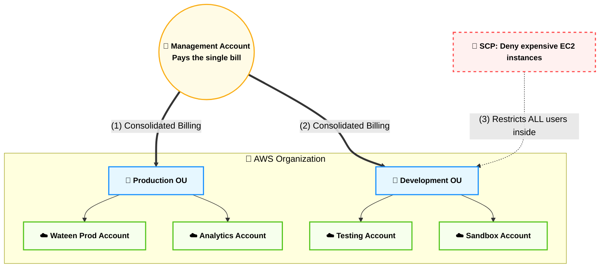
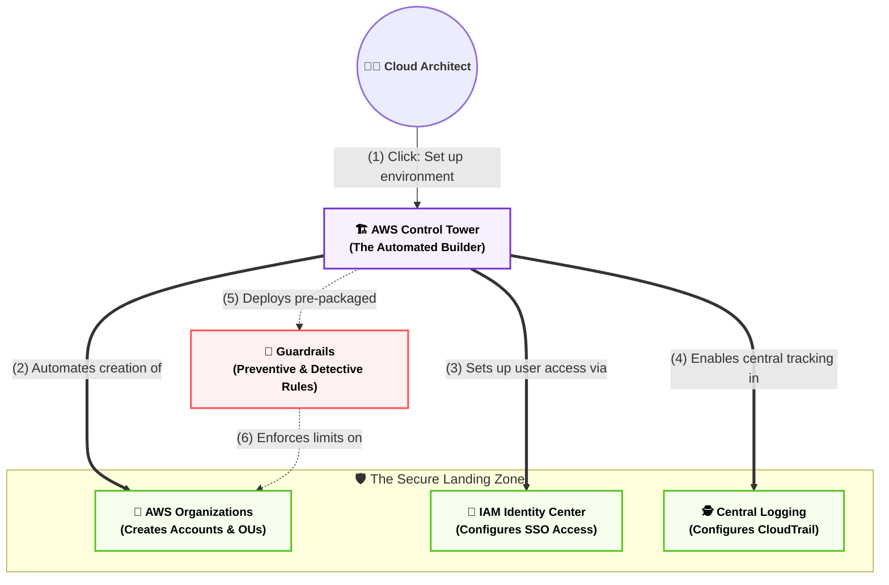
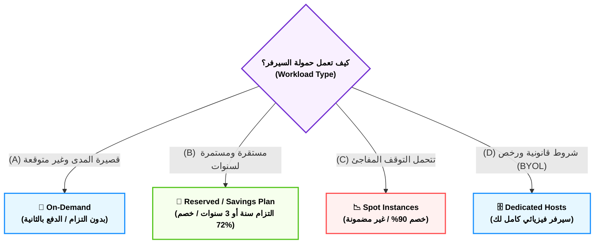
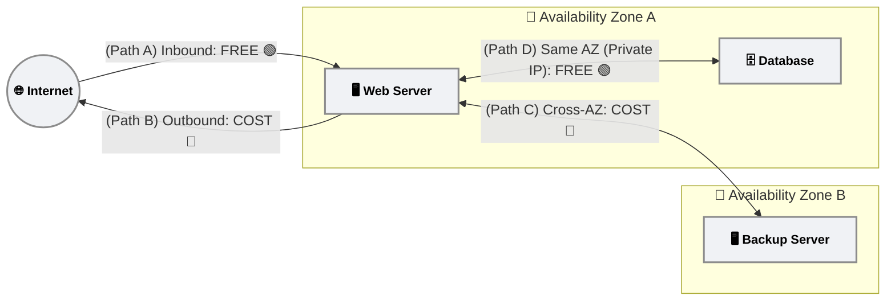
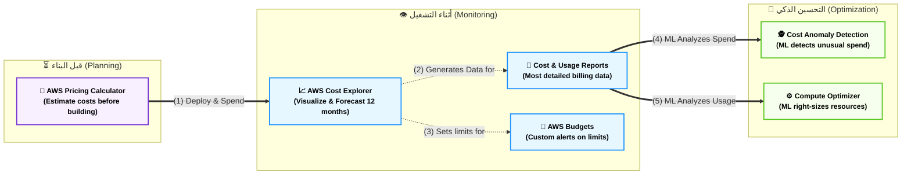

# Domain 4: Billing, Pricing & Support (هندسة التكاليف السحابية)

## المحطة الأولى: الإدارة المركزية وحوكمة الشركات - الجزء الأول (AWS Organizations)

**أصل الحكاية والمشكلة المعمارية (The Core Problem):**

تخيل إن منصة (Wateen.ai) كبرت جداً وبقى عندك فريق للتطوير (Dev)، وفريق للإنتاج (Prod)، وفريق للبيانات. لو كل فريق عمل حساب AWS منفصل وربطه بفيزا مختلفة، هيحصل الآتي:

1. الفواتير هتتشتت ومش هتعرف مين صرف إيه.
    
2. هتخسر "خصومات الكمية" (Volume Discounts) لأن كل حساب بيتحاسب لوحده من الصفر.
    
3. ممكن مطور مبتدئ في حساب الـ Dev يفتح سيرفر بـ 1000 دولار في الشهر بالغلط وتدبس فيه.
    

**الحل المعماري (AWS Organizations):**

أمازون عملت الخدمة دي عشان تكون "الشركة القابضة". بتعمل حساب رئيسي (Management Account)، وتدخل تحته كل الحسابات الفرعية التانية، وتبدأ تدير الفلوس والصلاحيات بقبضة من حديد.

### ⚙️ الفوائد المعمارية والمالية (لماذا نستخدم Organizations؟)

الامتحان بيركز على الـ 4 فوائد دول تحديداً:

#### 1. الفاتورة الموحدة (Consolidated Billing)

- حساب الـ Management هو اللي بيدفع الفاتورة المجمعة لكل الحسابات اللي تحته. ده بيسهل شغل قسم الحسابات في الشركة جداً.
    

#### 2. خصومات الكمية المجمعة (Aggregated Volume Discounts)

- **الميزة القاتلة:** تسعير أمازون لخدمات زي (S3) بيقل كل ما استهلاكك بيزيد (Tiered Pricing). الـ Organizations بتجمع استهلاك كل حساباتك مع بعض. لو حساب الـ Dev خزن 50 تيرا، وحساب الـ Prod خزن 50 تيرا، أمازون هتحاسبك على إنك خزنت 100 تيرا، فتدخل في شريحة سعرية أرخص بكتير!
    

#### 3. مشاركة الخصومات (Pooling of Reserved Instances)

- لو فريق الـ Dev اشترى (Reserved Instance) لمدة سنة، بس قفل السيرفر بتاعه ومبقاش بيستخدمه.. الخصم ده مابيضيعش! الـ Organizations بتخلي أي حساب تاني (زي الـ Prod) يورث الخصم ده أوتوماتيك ويستفيد بيه.
    

#### 4. سياسات التحكم في الخدمة (Service Control Policies - SCPs) 🚨

- دي **أقوى أداة حماية** في أمازون كلها. دي عبارة عن وثيقة (JSON) بتطبقها على حساب كامل عشان تمنع عنه خدمات معينة.
    
- **السيناريو:** بتعمل SCP تمنع أي حد في الـ Dev Account إنه يفتح سيرفرات غالية (زي سلسلة X1 أو P4).
    
- **القوة الغاشمة:** الـ SCP بتلغي أي صلاحيات تانية. حتى لو المطور معاه صلاحية (Administrator) جوه حساب الـ Dev، الـ SCP هتمنعه! (SCPs override everything).
    

### 📊 شفرات الامتحان: التفرقة الحاسمة لـ AWS Organizations

احفظ الكلمات الدلالية دي، بتيجي بالنص في أسئلة الـ Billing:

|**السيناريو المعماري في الامتحان (Keyword)**|**الإجابة الصحيحة (AWS Service / Feature)**|
|---|---|
|`Manage multiple AWS accounts centrally`|**AWS Organizations**|
|`Combine usage across all accounts to share volume pricing discounts`|**Consolidated Billing / AWS Organizations**|
|`Share Reserved Instances (RI) discounts across accounts`|**AWS Organizations**|
|`Restrict services or actions across multiple AWS accounts`|**Service Control Policies (SCPs)**|
|`Apply restrictions that override even the root user of a member account`|**Service Control Policies (SCPs)**|

---
## الجزء الثاني (AWS Control Tower)

**أصل الحكاية والمشكلة المعمارية (The Core Problem):**

في الجزء اللي فات عرفنا إن (AWS Organizations) بتحل مشكلة الفواتير المشتتة. بس إنت كـ Tech Lead اكتشفت مشكلة تانية: لو الشركة بتكبر بسرعة وكل يوم بتعملوا حساب جديد لفرع جديد أو تيم جديد، هل هتدخل كل مرة تعمل الحساب (Manual)، وتظبط الـ (SCPs) بإيدك، وتفعل المراقبة بـ (CloudTrail)، وتعمل إعدادات الـ (SSO) للموظفين؟

الخطوات اليدوية دي بتاخد أسابيع، والخطأ البشري فيها معناه إن في ثغرة أمنية ممكن تدمر الشركة.

**الحل المعماري (AWS Control Tower):**

دي مش خدمة جديدة بتبدأ من الصفر، دي عبارة عن "روبوت معماري" (Orchestrator). وظيفته إنه يبنيلك بيئة عمل كاملة وآمنة اسمها **(Landing Zone)** بضغطة زرار واحدة!

الـ Control Tower بيستخدم الـ AWS Organizations في الكواليس، بس هو اللي بيكتب الـ (SCPs) أوتوماتيك، وهو اللي بيفعل الـ (CloudTrail)، وهو اللي بيطبق معايير الأمان العالمية من غير ما إنت تتدخل.

### ⚙️ المفاهيم المعمارية لـ Control Tower

الامتحان بيركز جداً على المصطلحين دول:

#### 1. منطقة الهبوط الآمنة (The Landing Zone)

- ده مصطلح بيوصف بيئة السحابة لما تكون "متأسسة صح". يعني بيئة فيها كذا حساب (Multi-account)، متقسمة وحدات تنظيمية (OUs)، وفيها حساب مخصوص للـ Logs، وحساب مخصوص للـ Security، ومفتوح فيها الـ Single Sign-On (SSO). الـ Control Tower بيبني كل ده أوتوماتيك (Automated Setup).
    

#### 2. حواجز الحماية (Guardrails) 🚨

- تخيل إنك بتبني طريق سريع (Landing Zone) للعربيات (المطورين). إنت محتاج تحط حواجز حديد على يمين وشمال الطريق عشان محدش يقع في النهر. دي الـ Guardrails:
    
    - **حواجز وقائية (Preventive Guardrails):** دي بتمنع الغلطة قبل ما تحصل (بتستخدم الـ SCPs في الكواليس). مثلاً: "ممنوع أي مطور يمسح الـ CloudTrail".
        
    - **حواجز كشفية (Detective Guardrails):** دي بتكتشف الغلطة أول ما تحصل وتبعتلك إنذار (بتستخدم AWS Config في الكواليس). مثلاً: "لو في حد عمل Bucket S3 مفتوح للـ Public، ابعتلي إيميل فوراً".
        

### 📊 شفرات الامتحان: التفرقة القاضية (Organizations vs Control Tower)

أمازون بتعشق توقع المهندسين في الاختيار بين الخدمتين دول. احفظ الجدول ده صم:

|**السيناريو المعماري في الامتحان (Keyword)**|**الإجابة الصحيحة**|
|---|---|
|`Automate the setup of a secure, multi-account AWS environment`|**AWS Control Tower**|
|`Set up a Landing Zone based on best practices`|**AWS Control Tower**|
|`Enforce Preventive and Detective Guardrails`|**AWS Control Tower**|
|`Consolidate billing across multiple accounts`|**AWS Organizations**|
|`Use Service Control Policies (SCPs) to restrict access manually`|**AWS Organizations**|

---
# المحطة الثانية: بورصة السحابة ونماذج التسعير (Pricing Economics)

## الجزء الأول: بورصة الخوادم (EC2 Pricing Models & Savings Plans)

**أصل الحكاية والمشكلة المعمارية (The Core Problem):**

أكبر غلطة بيقع فيها المهندسين المبتدئين إنهم بيفتحوا السيرفرات (EC2) ويسيبوها شغالة بنظام الدفع الافتراضي (On-Demand). لو عندك سيرفر داتابيز شغال 24 ساعة في اليوم لمدة سنة، إنت كده بتدفع أضعاف التكلفة الحقيقية! أمازون عاملة "بورصة" لتأجير السيرفرات بتديك خصومات بتوصل لـ 90% لو اخترت الموديل الصح بناءً على طبيعة الأبلكيشن بتاعك.

### ⚙️ نماذج التسعير الأربعة (The 4 Pillars of EC2 Pricing)

#### 1. الدفع عند الاستخدام (On-Demand) - "التاكسي"

- **الفكرة:** بتأجر السيرفر وتدفع بالثانية. مفيش أي التزام منك، تقدر تطفيه في أي وقت.
    
- **الاستخدام المعماري:** للحمولات القصيرة غير المتوقعة (Short-term, un-interrupted workloads). زي لو بتعمل Test لأبلكيشن جديد ومش عارف هياخد وقت قد إيه.
    
- **التكلفة:** هو أغلى نموذج تسعير.
    

#### 2. الخوادم المحجوزة (Reserved Instances / Savings Plans) - "الإيجار السنوي"

- **الفكرة:** إنت بتمضي عقد مع أمازون إنك هتأجر منهم لمدة (سنة) أو (3 سنين). مقابل الالتزام ده، بيدوك خصم بيوصل لـ 72%.
    
- **الاستخدام المعماري:** للأنظمة المستقرة اللي شغالة طول الوقت (Steady-state usage). زي سيرفر قاعدة البيانات الأساسي بتاع الشركة (Production Database).
    
- 🚨 **التطور المعماري (Savings Plans):** الـ Reserved كان بيجبرك تختار نوع السيرفر (مثلاً M5). لكن الـ **(Compute Savings Plans)** بتديك مرونة مرعبة؛ إنت بتلتزم تدفع مبلغ معين (مثلاً 10 دولار/الساعة)، والخصم بيطبق أوتوماتيك على أي سيرفر (EC2)، أو (Fargate)، أو (Lambda) بتستخدمه في الشركة!
    

#### 3. خوادم البورصة (Spot Instances) - "تذاكر الستاندباي"

- **الفكرة:** أمازون عندها سيرفرات كتير فاضية في الداتا سنتر، فبتعرضها للبيع بخصم يوصل لـ 90%. **لكن (The Catch):** لو أمازون احتاجت السيرفر ده، هتاخده منك وتطفيه وتديك إنذار دقيقتين بس!
    
- **الاستخدام المعماري:** ممنوع منعاً باتاً تستخدمه للـ Database! بيستخدم فقط للـ (Batch processing, Data analysis)، أو الأبلكيشن اللي بيقدر يستحمل السيرفر يقع ويقوم من غير ما الداتا تبوظ (Resilient to failure / Fault-tolerant).
    

#### 4. الخوادم المخصصة (Dedicated Hosts) - "تمليك الأجهزة"

- **الفكرة:** إنت بتحجز سيرفر فيزيائي بالكامل (Physical Server) لحسابك لوحدك. محدش بيشاركك فيه.
    
- **الاستخدام المعماري:** مش بنستخدمه عشان الأداء، بنستخدمه لسببين:
    
    - شروط الامتثال القانونية (Compliance needs).
        
    - لو شركتك شاريّة رخص برامج قديمة (زي Oracle أو Windows Server) بتتحاسب بالـ CPU الفيزيكال (Bring Your Own License - BYOL).
        

---

## الجزء الثاني: عدّاد البيانات الخفي (AWS Data Transfer Rules)

> 💡 **القاعدة المعمارية الذهبية في تسعير أمازون:** > "الدخول مجاني ومرحب به دائماً، لكن الخروج أو التحرك الداخلي له ثمن!"

### ⚙️ مسارات التكلفة الأربعة (Data Transfer Paths)

بدلاً من الحفظ، تخيل البيانات كأنها سيارات تتحرك في شبكة طرق أمازون، وهذه هي بوابات الرسوم:

- **[ مسار A ] الدخول إلى أمازون (Inbound / Data Transfer IN):**
    
    - **التكلفة:** 🟢 مجاني تماماً ($0.00).
        
    - **السيناريو:** رفع ملفات، إدخال بيانات لقاعدة البيانات، أو استقبال ترافيك من الإنترنت.
        
- **[ مسار B ] الخروج إلى الإنترنت (Outbound / Data Transfer OUT):**
    
    - **التكلفة:** 🔴 بفلوس (حسب حجم الجيجا بايت المستهلكة).
        
    - **السيناريو:** مستخدم بيحمل فيديو أو صورة من موقعك لبره (للإنترنت العام).
        
- **[ مسار C ] النقل الخارجي بين المناطق (Cross-Region / Cross-AZ):**
    
    - **التكلفة:** 🔴 بفلوس (لكنها أرخص من الخروج للإنترنت).
        
    - **السيناريو:** سيرفر في (AZ-A) بيبعت داتا لسيرفر في (AZ-B)، أو الداتا بتتنقل من أمريكا لأوروبا.
        
- **[ مسار D ] النقل الداخلي المغلق (Same AZ using Private IP):**
    
    - **التكلفة:** 🟢 مجاني تماماً ($0.00).
        
    - **السيناريو:** سيرفرين جوا نفس الأوضة (نفس الـ Availability Zone) وبيكلموا بعض من خلال الـ IP الداخلي الخاص بيهم.
        

### 📊 شفرات الامتحان: الخلاصة لأسئلة التسعير (البيانات)

أمازون بتختبرك في هذه المسارات بالكلمات التالية:

|**السيناريو في الامتحان (Exam Keyword)**|**الإجابة المعمارية الصحيحة**|
|---|---|
|`Cost of Data Transfer IN to AWS from the internet`|**FREE ($0.00)**|
|`Cost of Data Transfer between EC2 instances in different Availability Zones`|**Incurs a charge (Cost associated)**|
|`Lowest cost network communication between EC2 instances`|**Same Availability Zone using Private IP**|

كده التنسيق بقى أحلى ومقسم بطريقة (المسارات) اللي هتريح عينك. انسخ ده، واديني الإشارة بكلمة **"المحطة التالتة"** عشان ندخل نختم الدومين بأدوات الرقابة والـ Dashboards المالية!

---
# المحطة الثالثة: أدوات الرقابة، التحليل، والذكاء المالي (Financial Dashboards)

**أصل الحكاية والمشكلة المعمارية (The Core Problem):**

بنينا المعمارية، واخترنا أرخص أنواع السيرفرات (Savings Plans)، السيستم اشتغل زي الفل. فجأة جالك مدير الحسابات بيسألك 3 أسئلة مرعبة:

1. المشروع الجديد اللي هتعملوه الشهر الجاي، هيكلفنا كام بالظبط؟
    
2. إحنا صرفنا كام الشهر اللي فات، وليه الفاتورة زادت فجأة؟
    
3. إزاي تضمنلي إن محدش هيسيب سيرفر شغال بالغلط ويخرب الميزانية وإحنا نايمين؟
    

أمازون عملت مجموعة أدوات مالية (Financial Suite) بتجاوب على كل سؤال من دول في مرحلة زمنية مختلفة (قبل البناء، أثناء التشغيل، وفي حالة الطوارئ).

### ⚙️ الترسانة المالية (The 5 Pillars of Cloud Finance)

#### 1. قبل البناء (AWS Pricing Calculator) - "المقايسة"

- **الوظيفة:** دي أداة بتستخدمها **قبل** ما تفتح حساب على أمازون أصلاً أو تكتب سطر كود واحد.
    
- **الفكرة:** بتدخل تقول للأداة: "أنا هحتاج 3 سيرفرات EC2، وداتابيز RDS، و100 جيجا S3". الأداة بتطلعلك **توقع مالي (Estimate)** دقيق جداً تقدر تطبعه وتديه لمديرك يعتمده.
    

#### 2. أثناء التشغيل (AWS Cost Explorer) - "الداشبورد والبوصلة"

- **الوظيفة:** بعد ما السيستم يشتغل، بتفتح الأداة دي عشان **تشوف (Visualize)** إنت صرفت إيه.
    
- **الميزة القاتلة في الامتحان:** الـ Cost Explorer مش بس بيبص للماضي، ده بيعمل **تنبؤ (Forecast)** لفاتورتك في الـ 12 شهر الجايين بناءً على استهلاكك الحالي.
    

#### 3. التفاصيل المملة (Cost & Usage Reports - CUR) - "الدفتر الدقيق"

- **الوظيفة:** لو الـ Cost Explorer مجابش التفاصيل اللي المحاسبين عايزينها، الـ CUR هو الحل.
    
- **السر:** ده أعقد وأشمل ملف (Excel/CSV) بيطلع من أمازون. بيحسبلك التكلفة بالـ **(السنت الواحد)** وبالـ **(الساعة)**.
    

#### 4. حارس الميزانية (AWS Budgets) - "الإنذار المبكر"

- **الوظيفة:** بتحط سقف للميزانية (مثلاً: 1000 دولار في الشهر). الـ Budgets بيبعتلك إيميل أو رسالة لو استهلاكك وصل لـ 80% من الرقم ده، عشان تلحق نفسك قبل الفاتورة ما تضرب.
    

#### 5. فريق الذكاء الاصطناعي (Anomaly Detection & Compute Optimizer)

- **Cost Anomaly Detection:** بيستخدم الـ Machine Learning عشان يراقب نمط صرفك الطبيعي. لو فجأة لقى سيرفر بيسحب فلوس بشكل جنوني (مثلاً هاكر دخل يعدّن عملات رقمية على حسابك)، بيبعتلك إنذار فوراً من غير ما تكون محدد رقم معين (No threshold needed).
    
- **Compute Optimizer:** ده الـ ML اللي بيبص على هندسة السيرفرات. بيشوف سيرفرك شغال بقاله شهر والـ CPU بتاعه مبيعديش 10%. يقوم باعتلك رسالة: "السيرفر ده كبير جداً (Over-provisioned)، نزّله لحجم أصغر ووفر 50 دولار". بيدعم (EC2, Auto Scaling, EBS, Lambda).
    

### 📊 شفرات الامتحان: الخلاصة الفورية (Domain 4 Dashboard)

الأسئلة هنا بتيجي مباشرة جداً، لو شفت الكلمة، اختار الأداة فوراً:

|**السيناريو في الامتحان (Keyword)**|**الإجابة الصحيحة**|
|---|---|
|`Estimate the cost of a solution architecture before building it`|**AWS Pricing Calculator**|
|`Visualize, understand, and manage your AWS costs and usage over time`|**AWS Cost Explorer**|
|`Forecast future costs for the next 12 months`|**AWS Cost Explorer**|
|`Set custom alerts when your costs or usage exceed your budgeted amount`|**AWS Budgets**|
|`Most comprehensive set of AWS cost and usage data available`|**AWS Cost and Usage Reports (CUR)**|
|`Use Machine Learning to detect unusual and unexpected spend`|**AWS Cost Anomaly Detection**|
|`Reduce costs by right-sizing resources (EC2, EBS, Lambda) using ML`|**AWS Compute Optimizer**|

