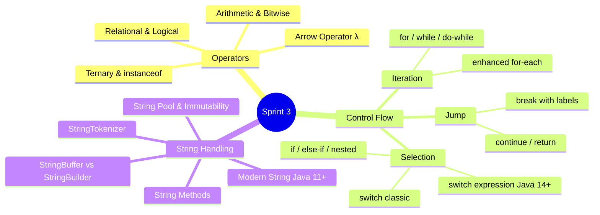
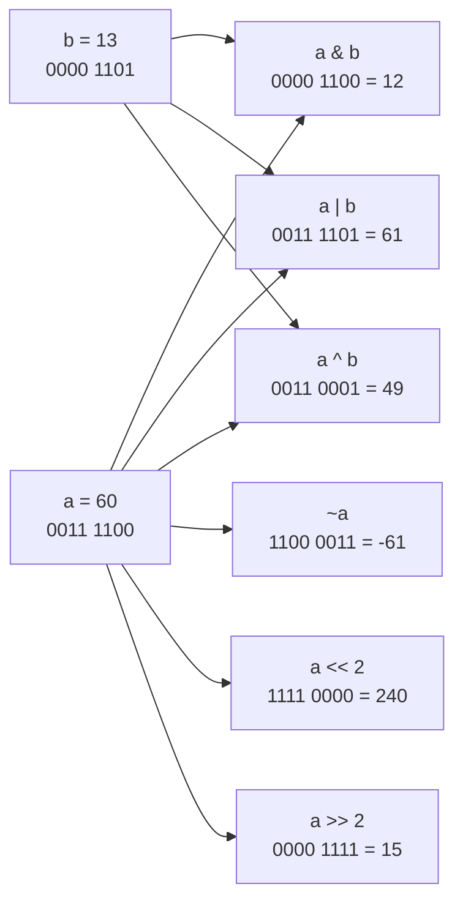
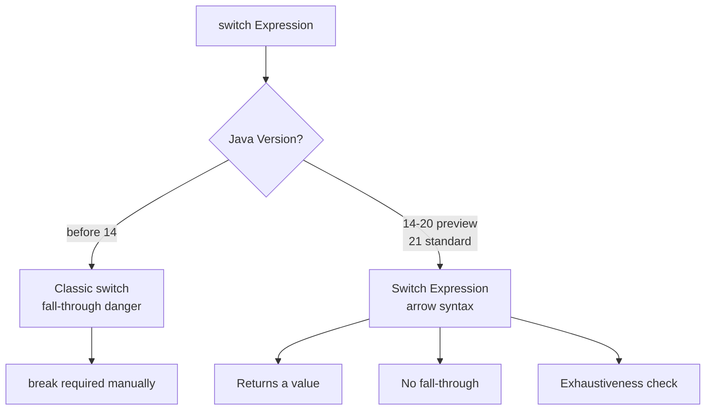
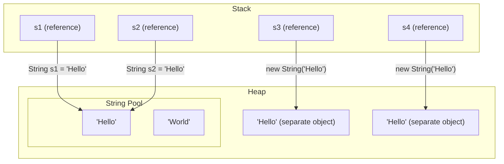
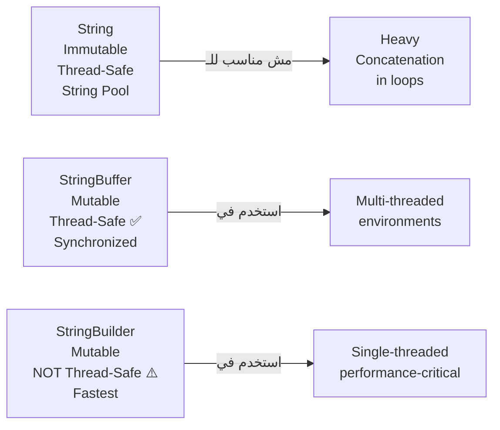

# 🚀 Sprint 3: Operators, Control Flow & String Handling — من الـ Bits لحد الـ Pool

> **ملحوظة للـ Mentee:** Sprint ده فيه حاجات تبدو "سهلة" على حد عنده C++ background، لكن Java عندها surprises خطيرة في الـ `==` vs `.equals()`، الـ `switch` الجديد، والـ String Pool. هنوصل لـ production-level pitfalls.

---

## 📍 خريطة الـ Sprint



---

# ⚙️ الجزء الأول: Operators — مش بس `+` و `-`

## الـ Arithmetic Operators + الـ Traps

```java
public class ArithmeticTraps {
    public static void main(String[] args) {

        // Integer Division — نفس سلوك C
        int a = 7, b = 2;
        System.out.println(a / b);     // 3  ← مش 3.5!
        System.out.println(a % b);     // 1  (modulus)

        // Fix: cast لـ double
        System.out.println((double) a / b); // 3.5 ✅

        // Pre vs Post Increment — الـ classic trap
        int x = 5;
        int y = x++;   // y = 5, x = 6  (post: اسند الأول، زوّد بعدين)
        int z = ++x;   // z = 7, x = 7  (pre: زوّد الأول، اسند بعدين)

        System.out.println("x=" + x + " y=" + y + " z=" + z);
        // x=7, y=5, z=7

        // Compound Operators + Implicit Cast
        byte val = 10;
        // val = val + 5; // ❌ COMPILE ERROR: val+5 is int, not byte
        val += 5;        // ✅ compound operator بيعمل implicit narrowing cast
        System.out.println(val); // 15
    }
}
```

> [!warning] ⚠️ WARNING — الـ `%` مع الـ Negative Numbers
> في Java، الـ modulus operator بيحتفظ بإشارة الـ dividend مش الـ divisor:
> ```java
> System.out.println(-7 % 3);  // -1  (مش 2!)
> System.out.println(7 % -3);  //  1
> ```
> لو محتاج دايماً positive modulus: `((n % m) + m) % m`

---

## 🔢 Bitwise Operators — السلاح السري

الـ Bitwise operators مهمين جداً في الـ systems programming، الـ permissions، والـ performance optimization.



```java
public class BitwiseDeepDive {
    public static void main(String[] args) {

        int a = 60;  // 0011 1100
        int b = 13;  // 0000 1101

        System.out.println(a & b);   // 12  = 0000 1100 (AND)
        System.out.println(a | b);   // 61  = 0011 1101 (OR)
        System.out.println(a ^ b);   // 49  = 0011 0001 (XOR)
        System.out.println(~a);      // -61 = 1100 0011 (NOT)
        System.out.println(a << 2);  // 240 = multiply by 4
        System.out.println(a >> 2);  // 15  = divide by 4 (signed)
        System.out.println(a >>> 2); // 15  = divide by 4 (unsigned, fills 0s)

        // ============================
        // Real-World Use Case: Flags
        // ============================
        // بدل boolean[] أو multiple booleans → استخدم int كـ bitmask

        final int READ    = 0b001; // 1
        final int WRITE   = 0b010; // 2
        final int EXECUTE = 0b100; // 4

        int userPermissions = READ | WRITE; // 3 = 011

        // Check permission
        boolean canRead    = (userPermissions & READ)    != 0; // true
        boolean canExecute = (userPermissions & EXECUTE) != 0; // false

        // Add permission
        userPermissions |= EXECUTE; // now = 111 = 7

        // Remove permission
        userPermissions &= ~WRITE;  // now = 101 = 5

        System.out.println("Can Read: " + canRead);
        System.out.println("Can Execute after add: " + ((userPermissions & EXECUTE) != 0));
    }
}
```

> [!info] 🤿 JVM DEEP-DIVE — `>>` vs `>>>`
> - `>>` هو **Signed Right Shift** — بيملى بالـ sign bit (0 للـ positive, 1 للـ negative). بيحافظ على الإشارة.
> - `>>>` هو **Unsigned Right Shift** — بيملى بـ 0 دايماً. بيستخدم في الـ hashing وعمليات الـ network protocols.
> ```java
> int neg = -1;  // 1111...1111 (32 ones)
> System.out.println(neg >> 1);  // -1  (fills with 1, stays negative)
> System.out.println(neg >>> 1); // 2147483647 (fills with 0, becomes positive)
> ```

---

## ⚖️ Relational & Logical Operators — الـ Short-Circuit

```java
public class LogicalOperators {

    static boolean expensiveCheck() {
        System.out.println("Expensive check ran!");
        return true;
    }

    public static void main(String[] args) {

        int x = 5;

        // & vs && — الفرق الجوهري
        // & (eager): بيقيّم الاتنين دايماً
        // && (short-circuit): لو الأول false → مش بيقيّم التاني

        System.out.println("=== & operator ===");
        if (x > 10 & expensiveCheck()) { // expensiveCheck() RAN even though x>10 is false
            System.out.println("both true");
        }

        System.out.println("=== && operator ===");
        if (x > 10 && expensiveCheck()) { // expensiveCheck() SKIPPED! x>10 is false
            System.out.println("both true");
        }

        // | vs || — نفس الفكرة
        // | بيقيّم الاتنين، || بيوقف لو الأول true

        // Real-World Pattern: Null Safety مع &&
        String name = null;
        if (name != null && name.length() > 0) { // ✅ آمن — لو null مش هيدخل التاني
            System.out.println("Name: " + name);
        }
        // لو استخدمنا & بدل &&:
        // name.length() هيرمي NullPointerException حتى لو name == null!
    }
}
```

> [!warning] ⚠️ WARNING — الـ Short-Circuit في الـ Production
> دايماً استخدم `&&` و `||` في الـ conditions العادية. استخدم `&` و `|` بس لما بتحتاج فعلاً تنفّذ الـ side effects في الجزء التاني بغض النظر عن الجزء الأول. الـ `&` بيسبب **unnecessary computation** وممكن يسبب **NPE**.

---

## 🎯 instanceof + Pattern Matching (Java 16+)

```java
public class InstanceofEvolution {

    sealed interface Shape permits Circle, Rectangle, Triangle {}
    record Circle(double radius) implements Shape {}
    record Rectangle(double w, double h) implements Shape {}
    record Triangle(double base, double height) implements Shape {}

    // ❌ الطريقة القديمة (قبل Java 16)
    static double areaOld(Shape s) {
        if (s instanceof Circle) {
            Circle c = (Circle) s; // redundant cast!
            return Math.PI * c.radius() * c.radius();
        } else if (s instanceof Rectangle) {
            Rectangle r = (Rectangle) s;
            return r.w() * r.h();
        }
        return 0;
    }

    // ✅ الطريقة الجديدة — Pattern Matching instanceof (Java 16+)
    static double areaNew(Shape s) {
        if (s instanceof Circle c)        return Math.PI * c.radius() * c.radius();
        if (s instanceof Rectangle r)     return r.w() * r.h();
        if (s instanceof Triangle t)      return 0.5 * t.base() * t.height();
        return 0;
    }

    // ✅✅ الطريقة المثلى — Switch Expression مع Pattern (Java 21)
    static double areaBest(Shape s) {
        return switch (s) {
            case Circle c    -> Math.PI * c.radius() * c.radius();
            case Rectangle r -> r.w() * r.h();
            case Triangle t  -> 0.5 * t.base() * t.height();
        };
    }
}
```

> [!info] 🤿 JVM DEEP-DIVE — كيف `instanceof` بيشتغل
> الـ `instanceof` بيتحوّل في الـ bytecode لـ instruction اسمها `checkcast`. الـ JVM بيمشي على الـ **vtable hierarchy** بتاعة الـ object ويتحقق إذا كانت الـ class المطلوبة موجودة في الـ inheritance chain. الـ cost ده O(depth of hierarchy) — سريع جداً في العملي.

---

# 🔀 الجزء الثاني: Control Flow — فوق الـ Basics

## Selection: الـ `switch` — من Classic لـ Modern



```java
public class SwitchEvolution {

    enum Day { MON, TUE, WED, THU, FRI, SAT, SUN }

    // ❌ Classic switch — fall-through trap
    static String classicSwitch(int month) {
        String season;
        switch (month) {
            case 12: case 1: case 2:
                season = "Winter";
                break;   // ← لو نسيت break → fall-through للـ case التالي!
            case 3: case 4: case 5:
                season = "Spring";
                break;
            default:
                season = "Unknown";
                break;
        }
        return season;
    }

    // ✅ Modern Switch Expression (Java 14+) — أكثر أماناً وأوضح
    static String modernSwitch(Day day) {
        return switch (day) {
            case MON, TUE, WED, THU, FRI -> "Weekday 💼";
            case SAT, SUN                -> "Weekend 🎉";
            // compiler بيـ enforce إن كل الـ cases اتغطّت (exhaustive)
        };
    }

    // ✅ Switch مع yield (لما محتاج multi-line body)
    static int getWorkHours(Day day) {
        return switch (day) {
            case MON, TUE, WED, THU, FRI -> 8;
            case SAT -> {
                System.out.println("Half day Saturday!");
                yield 4;  // yield بدل return جوّا switch block
            }
            case SUN -> 0;
        };
    }
}
```

> [!warning] ⚠️ WARNING — الـ Fall-Through في Classic Switch
> ده من أشهر الـ bugs في Java. لو نسيت `break`، الكود بيكمّل ينفّذ الـ case التالي! الـ Java compiler مش بيرفض الكود ده — بس IDE زي IntelliJ هيديك warning. في الكود الجديد، استخدم دايماً **Switch Expression** مع `->`.

---

## Iteration: الـ Loops مع المقارنة

```java
import java.util.List;

public class LoopPatterns {

    public static void main(String[] args) {
        int[] nums = {1, 2, 3, 4, 5};

        // 1. Classic for — لما محتاج الـ index
        for (int i = 0; i < nums.length; i++) {
            System.out.print(nums[i] + " ");
        }

        // 2. Enhanced for-each — للـ traversal فقط (أوضح وأآمن)
        for (int n : nums) {
            System.out.print(n + " ");
        }

        // 3. while — لما مش عارف عدد الـ iterations
        int i = 0;
        while (i < nums.length) {
            System.out.print(nums[i++] + " ");
        }

        // 4. do-while — لازم ينفّذ مرة واحدة على الأقل
        int input;
        int attempt = 0;
        do {
            input = (int)(Math.random() * 10);
            attempt++;
        } while (input != 5);
        System.out.println("Found 5 after " + attempt + " attempts");

        // 5. Labeled break — الـ "goto" الآمن في Java
        outer:
        for (int row = 0; row < 3; row++) {
            for (int col = 0; col < 3; col++) {
                if (row == 1 && col == 1) {
                    System.out.println("Found center! Breaking outer loop.");
                    break outer;  // بيخرج من الـ loop الخارجية مباشرة
                }
            }
        }
    }
}
```

> [!info] 🤿 JVM DEEP-DIVE — الـ for-each والـ Iterator
> الـ enhanced for-each `for (T item : collection)` بيتحوّل في الـ bytecode لـ:
> ```java
> Iterator<T> iter = collection.iterator();
> while (iter.hasNext()) {
>     T item = iter.next();
>     // body
> }
> ```
> للـ arrays (مش Collections)، بيتحوّل لـ classic index-based for loop. ده معناه إن الـ for-each على arrays **مفيش overhead** — نفس الـ performance بالظبط.

---

# 🧵 الجزء الثالث: String Handling — الـ Full Picture

## الـ String Pool في الـ Memory



```java
public class StringPoolDemo {
    public static void main(String[] args) {

        // Literals → String Pool (Flyweight Pattern)
        String s1 = "Hello";
        String s2 = "Hello";
        System.out.println(s1 == s2);       // true  ← نفس الـ object في الـ Pool
        System.out.println(s1.equals(s2));  // true

        // new String() → Heap مباشرةً (خارج الـ Pool)
        String s3 = new String("Hello");
        String s4 = new String("Hello");
        System.out.println(s3 == s4);       // false ← objects مختلفين في الـ Heap
        System.out.println(s3.equals(s4));  // true  ← نفس الـ content

        // Cross comparison
        System.out.println(s1 == s3);       // false ← Pool vs Heap
        System.out.println(s1.equals(s3));  // true

        // intern() → بيرجع الـ object من الـ Pool (أو بيضيفه لو مش موجود)
        String s5 = s3.intern();
        System.out.println(s1 == s5);       // true  ← دلوقتي كلهم من الـ Pool

        // Compile-time Constant Folding
        String s6 = "Hel" + "lo"; // بيتحوّل لـ "Hello" في الـ compile time
        System.out.println(s1 == s6);       // true  ← من الـ Pool ✅

        String part = "lo";
        String s7 = "Hel" + part;           // runtime concatenation
        System.out.println(s1 == s7);       // false ← new object في الـ Heap
    }
}
```

> [!info] 🤿 JVM DEEP-DIVE — String Pool Location
> - **قبل Java 7:** الـ String Pool كان في الـ **PermGen** (Permanent Generation) — part ثابت من الـ memory بحجم محدود. لو اتملأ → `OutOfMemoryError: PermGen space`.
> - **Java 7+:** الـ Pool انتقل للـ **Heap** — بقى الـ GC يقدر يشيل الـ unused strings من الـ Pool. ده fix كبير للـ memory management.
> - **Java 8+:** الـ PermGen اتشال تماماً واتستبدل بـ **Metaspace** (native memory).

---

## 💪 String Methods — الـ Arsenal الكامل

```java
import java.util.Arrays;

public class StringMethods {
    public static void main(String[] args) {

        String s = "  Hello, Java World!  ";

        // ---- Inspection ----
        System.out.println(s.length());           // 22
        System.out.println(s.charAt(7));           // J
        System.out.println(s.indexOf("Java"));     // 9  (أول occurrence)
        System.out.println(s.lastIndexOf("o"));    // 16
        System.out.println(s.contains("Java"));   // true
        System.out.println(s.startsWith("  Hel")); // true
        System.out.println(s.endsWith("!  "));     // true
        System.out.println(s.isEmpty());           // false
        System.out.println("".isEmpty());          // true
        System.out.println("  ".isBlank());        // true (Java 11+)

        // ---- Transformation ----
        System.out.println(s.trim());              // "Hello, Java World!" (removes spaces)
        System.out.println(s.strip());             // Java 11+ (Unicode-aware trim)
        System.out.println(s.toLowerCase());       // "  hello, java world!  "
        System.out.println(s.toUpperCase());       // "  HELLO, JAVA WORLD!  "
        System.out.println(s.replace("Java", "Python")); // "  Hello, Python World!  "
        System.out.println(s.replaceAll("\\s+", " "));   // regex replace

        // ---- Extraction ----
        System.out.println(s.substring(9));        // "Java World!  "
        System.out.println(s.substring(9, 13));    // "Java"

        // ---- Split ----
        String csv = "Ahmed,Sara,Khaled,Nour";
        String[] names = csv.split(",");
        System.out.println(Arrays.toString(names)); // [Ahmed, Sara, Khaled, Nour]

        // ---- Comparison ----
        String a = "hello", b = "HELLO";
        System.out.println(a.equals(b));            // false (case-sensitive)
        System.out.println(a.equalsIgnoreCase(b));  // true
        System.out.println(a.compareTo(b));         // positive (a > b by ASCII)

        // ---- Modern Java 11+ ----
        System.out.println("ha".repeat(3));         // "hahaha"
        System.out.println("  hi  ".strip());       // "hi"
        "line1\nline2\nline3"
            .lines()
            .forEach(System.out::println);          // prints each line

        // ---- String.format / formatted ----
        String msg = String.format("Name: %s, Age: %d, GPA: %.2f", "Ahmed", 25, 3.75);
        System.out.println(msg); // "Name: Ahmed, Age: 25, GPA: 3.75"

        // Java 15+ Text Blocks (Multi-line strings)
        String json = """
                {
                    "name": "Ahmed",
                    "role": "Backend Engineer"
                }
                """;
        System.out.println(json);
    }
}
```

---

## ⚡ String vs StringBuffer vs StringBuilder



```java
public class StringBuilderDemo {
    public static void main(String[] args) {

        // ❌ كارثة Performance — String concatenation في loop
        long start = System.nanoTime();
        String result = "";
        for (int i = 0; i < 10_000; i++) {
            result += i;  // بيعمل 10,000 String object في الـ Heap!
        }
        long end = System.nanoTime();
        System.out.printf("String concat:  %,d ns%n", end - start);

        // ✅ StringBuilder — السلاح الصح
        start = System.nanoTime();
        StringBuilder sb = new StringBuilder(50_000); // pre-size the buffer
        for (int i = 0; i < 10_000; i++) {
            sb.append(i);
        }
        String result2 = sb.toString();
        end = System.nanoTime();
        System.out.printf("StringBuilder:  %,d ns%n", end - start);
        // StringBuilder أسرع بـ ~100x في الـ loops!

        // StringBuilder Methods
        StringBuilder builder = new StringBuilder("Hello");
        builder.append(" World");       // "Hello World"
        builder.insert(5, ",");         // "Hello, World"
        builder.replace(7, 12, "Java"); // "Hello, Java"
        builder.delete(5, 7);           // "Hello Java"
        builder.reverse();              // "avaJ olleH"
        System.out.println(builder.toString());
        System.out.println("Length: " + builder.length());
        System.out.println("Capacity: " + builder.capacity()); // internal buffer size
    }
}
```

> [!info] 🤿 JVM DEEP-DIVE — StringBuilder Capacity
> الـ `StringBuilder` داخلياً بيستخدم `char[]` (أو `byte[]` من Java 9 بالـ Compact Strings). الـ default capacity هو **16 characters**. لما الـ buffer يتملأ، بيعمل **double + 2** (newCapacity = oldCapacity * 2 + 2) — زي الـ vector في C++. لو عارف الـ size المتوقع، اعمل `new StringBuilder(expectedSize)` عشان تتجنب الـ resizing overhead.

---

## 🔪 StringTokenizer — الـ Legacy Tokenizer

```java
import java.util.StringTokenizer;

public class TokenizerDemo {
    public static void main(String[] args) {

        // Legacy way — StringTokenizer
        String sentence = "ITI develops people and ITI house of developers";
        StringTokenizer st = new StringTokenizer(sentence, " ");

        int count = 0;
        while (st.hasMoreTokens()) {
            String token = st.nextToken();
            if (token.equals("ITI")) count++;
        }
        System.out.println("ITI count: " + count); // 2

        // Custom delimiter
        String ip = "192.168.1.100";
        StringTokenizer ipTokenizer = new StringTokenizer(ip, ".");
        while (ipTokenizer.hasMoreTokens()) {
            System.out.println("Octet: " + ipTokenizer.nextToken());
        }

        // ✅ Modern way — String.split() (أوضح وأقوى)
        String[] parts = ip.split("\\.");  // regex escape for dot
        for (String part : parts) {
            System.out.println("Octet: " + part);
        }
    }
}
```

> [!note] 📝 NOTE — StringTokenizer في الـ Production
> الـ `StringTokenizer` هو **legacy class** من Java 1.0. في الكود الجديد، استخدم `String.split()` أو `Scanner` أو الـ Stream API. لكن ممكن تقابله في legacy codebases وفي الـ exams.

---

# 🏋️ Practical Exercises — Progressive

> [!example]- 🟢 PE1 (Beginner): الـ Bitwise Permission Checker
> **المطلوب:** اكتب method اسمها `checkPermissions` بتاخد `int permissions` وتطبع إيه الـ permissions الـ active.
>
> ```java
> // Expected output for permissions = 5 (binary: 101):
> // ✅ READ
> // ❌ WRITE
> // ✅ EXECUTE
> ```
>
> **الحل:**
> ```java
> public class PermissionChecker {
>     static final int READ    = 1; // 001
>     static final int WRITE   = 2; // 010
>     static final int EXECUTE = 4; // 100
>
>     static void checkPermissions(int permissions) {
>         System.out.println((permissions & READ)    != 0 ? "✅ READ"    : "❌ READ");
>         System.out.println((permissions & WRITE)   != 0 ? "✅ WRITE"   : "❌ WRITE");
>         System.out.println((permissions & EXECUTE) != 0 ? "✅ EXECUTE" : "❌ EXECUTE");
>     }
>
>     public static void main(String[] args) {
>         checkPermissions(5); // READ + EXECUTE
>         checkPermissions(3); // READ + WRITE
>         checkPermissions(7); // ALL
>     }
> }
> ```

> [!example]- 🟡 PE2 (Intermediate): محلّل الـ IP Address
> **المطلوب:** اكتب program بياخد IP address كـ String وـ:
> 1. يتحقق إنه valid IPv4 (4 octets, كل واحد 0-255)
> 2. يحدد نوعه (Class A: 1-126, B: 128-191, C: 192-223)
> 3. يحسب الـ binary representation بتاعته
>
> **الحل:**
> ```java
> public class IPAnalyzer {
>
>     public static void analyzeIP(String ip) {
>         String[] parts = ip.split("\\.");
>
>         // Validation
>         if (parts.length != 4) {
>             System.out.println("❌ Invalid IP: must have 4 octets");
>             return;
>         }
>
>         int[] octets = new int[4];
>         for (int i = 0; i < 4; i++) {
>             try {
>                 octets[i] = Integer.parseInt(parts[i]);
>                 if (octets[i] < 0 || octets[i] > 255) {
>                     System.out.println("❌ Invalid IP: octet out of range");
>                     return;
>                 }
>             } catch (NumberFormatException e) {
>                 System.out.println("❌ Invalid IP: non-numeric octet");
>                 return;
>             }
>         }
>
>         // Classification
>         String ipClass = switch (octets[0]) {
>             case int n when n >= 1   && n <= 126 -> "Class A";
>             case int n when n >= 128 && n <= 191 -> "Class B";
>             case int n when n >= 192 && n <= 223 -> "Class C";
>             case int n when n >= 224 && n <= 239 -> "Class D (Multicast)";
>             default -> "Class E (Reserved)";
>         };
>
>         // Binary Representation
>         StringBuilder binary = new StringBuilder();
>         for (int i = 0; i < 4; i++) {
>             binary.append(String.format("%8s", Integer.toBinaryString(octets[i]))
>                                  .replace(' ', '0'));
>             if (i < 3) binary.append(".");
>         }
>
>         System.out.println("✅ IP: " + ip);
>         System.out.println("   Class:  " + ipClass);
>         System.out.println("   Binary: " + binary);
>     }
>
>     public static void main(String[] args) {
>         analyzeIP("192.168.1.100");
>         analyzeIP("10.0.0.1");
>         analyzeIP("256.1.1.1");   // invalid
>         analyzeIP("172.16.5.200");
>     }
> }
> ```

> [!example]- 🔴 PE3 (Advanced): محرك تحليل النصوص
> **السيناريو الحقيقي:** أنت بتبني text analysis engine لـ HR system. المطلوب تحليل Job Descriptions وإحصاء الـ keywords.
>
> **المطلوب:**
> 1. اكتب `TextAnalyzer` class بيحلّل نص ويرجع:
>    - عدد الكلمات
>    - الكلمة الأكثر تكراراً
>    - هل النص يحتوي على كلمات معينة (keywords)
>    - قيمة الـ "seniority score" بناءً على keywords زي "senior", "lead", "architect"
> 2. اعمل `StringBuilder` لبناء تقرير مُنسَّق
> 3. استخدم `switch expression` لتصنيف الـ score
>
> **الحل:**
> ```java
> import java.util.*;
>
> public class TextAnalyzer {
>
>     private final String text;
>     private final String[] words;
>
>     public TextAnalyzer(String text) {
>         this.text = text.toLowerCase().trim();
>         this.words = this.text.split("\\s+");
>     }
>
>     public int wordCount() {
>         return words.length;
>     }
>
>     public String mostFrequentWord() {
>         Map<String, Integer> freq = new HashMap<>();
>         for (String word : words) {
>             String clean = word.replaceAll("[^a-z]", "");
>             if (!clean.isEmpty()) {
>                 freq.put(clean, freq.getOrDefault(clean, 0) + 1);
>             }
>         }
>         return freq.entrySet().stream()
>             .max(Map.Entry.comparingByValue())
>             .map(Map.Entry::getKey)
>             .orElse("none");
>     }
>
>     public boolean containsKeyword(String keyword) {
>         return text.contains(keyword.toLowerCase());
>     }
>
>     public int calculateSeniorityScore() {
>         int score = 0;
>         String[] seniorKeywords = {"architect", "principal", "staff", "lead", "senior"};
>         String[] juniorKeywords = {"junior", "entry", "intern", "fresher"};
>
>         for (String kw : seniorKeywords) {
>             if (containsKeyword(kw)) score += 2;
>         }
>         for (String kw : juniorKeywords) {
>             if (containsKeyword(kw)) score -= 1;
>         }
>         return score;
>     }
>
>     public String generateReport() {
>         int score = calculateSeniorityScore();
>
>         String level = switch (score) {
>             case int s when s >= 4  -> "🏛️  ARCHITECT LEVEL";
>             case int s when s >= 2  -> "🔥 SENIOR LEVEL";
>             case int s when s >= 0  -> "⚙️  MID LEVEL";
>             default                 -> "🌱 JUNIOR LEVEL";
>         };
>
>         return new StringBuilder()
>             .append("═".repeat(45)).append("\n")
>             .append("  📊 TEXT ANALYSIS REPORT\n")
>             .append("═".repeat(45)).append("\n")
>             .append(String.format("  Word Count:        %d%n", wordCount()))
>             .append(String.format("  Most Frequent:     %s%n", mostFrequentWord()))
>             .append(String.format("  Seniority Score:   %d%n", score))
>             .append(String.format("  Level:             %s%n", level))
>             .append("═".repeat(45))
>             .toString();
>     }
>
>     public static void main(String[] args) {
>         String jd = """
>             We are looking for a Principal Backend Architect with 10+ years
>             of experience. The lead architect will design and architect
>             scalable microservices. Senior Java engineers are also welcome.
>             """;
>
>         TextAnalyzer analyzer = new TextAnalyzer(jd);
>         System.out.println(analyzer.generateReport());
>     }
> }
> ```

---

# 🎯 Interview Survival Kit

> [!faq]- 🎯 Sprint 3 — Interview Questions الـ Hardcore
>
> ---
>
> **Q1: "What is the difference between `&` and `&&`?"**
>
> الإجابة الـ Senior:
> - `&` هو **Bitwise AND** لو على integers، و **Eager Logical AND** لو على booleans — بيقيّم الـ sides كلها دايماً.
> - `&&` هو **Short-Circuit AND** — لو الـ left operand `false`، مش بيقيّم الـ right operand خالص. الاستخدام في الـ production: دايماً `&&` عشان performance وـ null safety.
>
> ---
>
> **Q2: "Why should you never use `==` to compare Strings?"**
>
> ```java
> // الـ trap الكلاسيكي في الـ interviews
> String a = new String("test");
> String b = new String("test");
> System.out.println(a == b);      // false ← comparing heap addresses
> System.out.println(a.equals(b)); // true  ← comparing content
>
> // الاستثناء: Enum comparison
> enum Status { ACTIVE, INACTIVE }
> Status s1 = Status.ACTIVE;
> Status s2 = Status.ACTIVE;
> System.out.println(s1 == s2); // true ✅ Enums are singletons
> ```
>
> ---
>
> **Q3: "What is String immutability and why does it matter?"**
>
> 3 فوائد جوهرية:
> 1. **Security:** الـ String بيُستخدم في class loading, file paths, DB connections — لو كان mutable، ممكن يتغيّر بعد الـ security check.
> 2. **String Pool / Flyweight Pattern:** الـ immutability هي اللي بتخلّي الـ String Pool ممكن — لأنك مطمن إن الـ shared object مش هيتغيّر.
> 3. **Thread Safety:** الـ immutable objects automatically thread-safe بدون synchronization.
>
> ---
>
> **Q4: "String vs StringBuffer vs StringBuilder — متى تستخدم كل واحد؟"**
>
> | | String | StringBuffer | StringBuilder |
> |--|--------|-------------|--------------|
> | Mutable | ❌ | ✅ | ✅ |
> | Thread-Safe | ✅ (immutable) | ✅ (synchronized) | ❌ |
> | Performance | Slow (new object) | Moderate | **Fastest** |
> | When to use | constant values | multi-thread mutation | single-thread loops |
>
> ---
>
> **Q5: (Hardcore) "What does this print?"**
>
> ```java
> String s = "Java";
> s.concat(" Programming");
> System.out.println(s);
> ```
>
> **الإجابة:** يطبع `"Java"` ← مش `"Java Programming"`!
>
> لأن `String` immutable. الـ `concat()` بيرجع **object جديد** لكن مش بنحتفظ بيه. الكود الصح:
> ```java
> s = s.concat(" Programming"); // assign الـ result
> ```
>
> ---
>
> **Q6: "Explain labeled break and when would you use it in production?"**
>
> الـ labeled break بيخرج من الـ outer loop مباشرة — زي `goto` لكن structured وآمن. مفيد في:
> - البحث في 2D arrays لما تلاقي الـ target
> - الخروج من nested loops في parsing operations
>
> لكن في الكود المعماري الصح، لو محتاج labeled break كتير → ده **code smell** إن الـ logic محتاج يتعمل refactor لـ method.
>
> ---
>
> **Q7: (Tricky) "What is the output?"**
>
> ```java
> int i = 0;
> i = i++ + ++i;
> System.out.println(i);
> ```
>
> **الإجابة:** `2`
>
> التفصيل:
> ```
> i = i++ + ++i
>   = 0   + ++1    ← i++ returns 0, i becomes 1. then ++i makes i=2, returns 2
>   = 0   + 2
>   = 2
> ```
> في الـ production: **لا تكتب كده أبداً** — unmaintainable code.

---

# 📋 ملخص Sprint 3

```
✅ Arithmetic Operators + الـ integer division والـ compound operator traps
✅ Bitwise Operators + الـ real-world use case (permissions bitmask)
✅ Short-Circuit vs Eager Logical operators + الـ null safety pattern
✅ instanceof + Pattern Matching (Java 16+) + Switch Expression (Java 14+)
✅ Classic vs Modern switch مع exhaustiveness checking
✅ for / while / do-while + labeled break
✅ String Pool + Immutability + الـ Flyweight Pattern connection
✅ String Methods الكاملة + Modern Java 11+ additions
✅ String vs StringBuffer vs StringBuilder (performance benchmark)
✅ StringTokenizer legacy + الـ modern split() alternative
✅ 3 Progressive PEs: Permissions → IP Analyzer → Text Analysis Engine
✅ Interview Kit: 7 أسئلة hardcore بإجابات Senior-Level

Sprint 4 الجاي → Modifiers, Access Specifiers, Packages & Interfaces
```

---

*📁 Sprint 3 — ITI Core Java Intake 46 | Dec 2025*
*🏛️ Mentor: Elite Egyptian Java Principal Architect*
