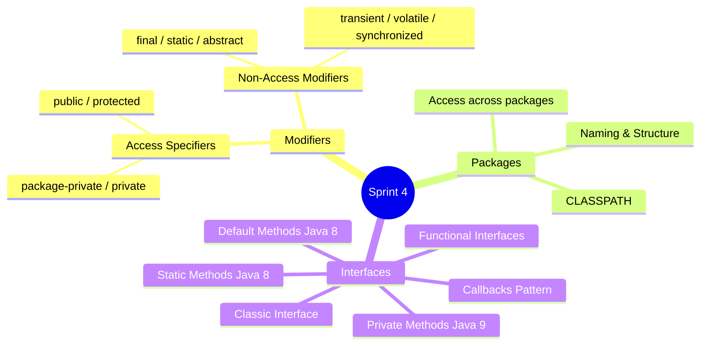
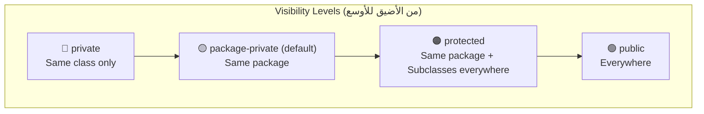
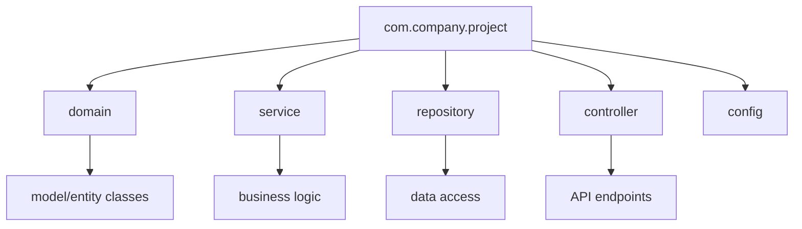
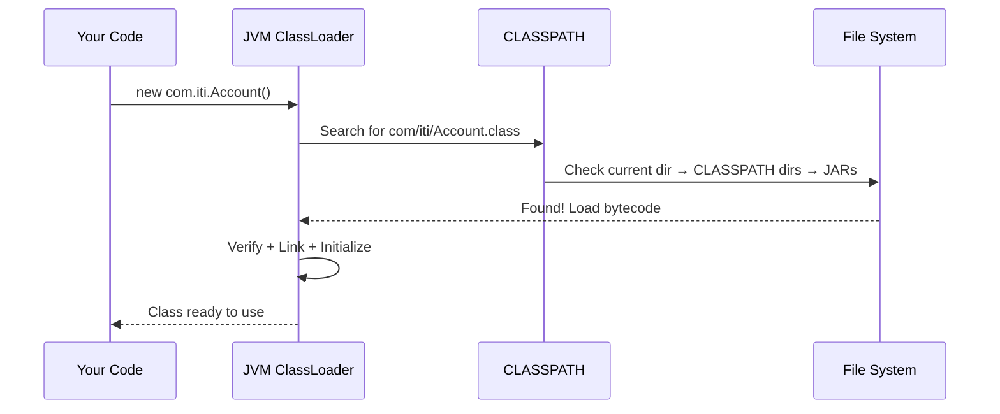
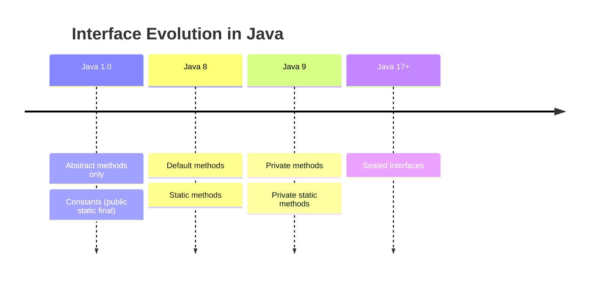
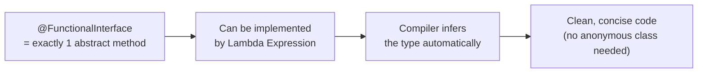

# 🚀 Sprint 4: Modifiers, Packages & Interfaces — معمارية الـ Java الحقيقية

> **ملحوظة للـ Mentee:** Sprint ده هو قلب الـ Java Architecture. الـ Interfaces مش بس syntax — هي الـ foundation بتاعة الـ SOLID Principles والـ Design Patterns كلها. لو فهمت Sprint ده كويس، هتفهم ليه الـ Spring Framework مبني عليه.

---

## 📍 خريطة الـ Sprint



---

# 🔐 الجزء الأول: Modifiers & Access Specifiers

## رسم Access Control الكامل



| المكان | `private` | `default` | `protected` | `public` |
|--------|-----------|-----------|-------------|---------|
| Same Class | ✅ | ✅ | ✅ | ✅ |
| Same Package (Subclass) | ❌ | ✅ | ✅ | ✅ |
| Same Package (Non-subclass) | ❌ | ✅ | ✅ | ✅ |
| Different Package (Subclass) | ❌ | ❌ | ✅ | ✅ |
| Different Package (Non-subclass) | ❌ | ❌ | ❌ | ✅ |

---

## 🔍 Access Specifiers في الكود — الـ Traps

```java
// package: com.iti.bank
public class BankAccount {

    private   double balance;      // اللي جوّا الـ class بس
    protected String ownerName;    // الـ subclasses في أي package
    String    branch;              // package-private: نفس الـ package بس (no keyword)
    public    String accountId;    // الكل يشوفه (لكن ده bad design!)

    private void validateAmount(double amount) {
        if (amount <= 0) throw new IllegalArgumentException("Invalid amount");
    }

    protected void notifyOwner(String msg) {   // subclasses تقدر تستخدمها
        System.out.println("Notifying " + ownerName + ": " + msg);
    }

    public boolean deposit(double amount) {    // الـ public API
        validateAmount(amount);                // private method — internal only
        balance += amount;
        notifyOwner("Deposited: " + amount);
        return true;
    }
}

// package: com.iti.bank (نفس الـ package)
class BankAuditor {
    void audit(BankAccount acc) {
        System.out.println(acc.branch);     // ✅ package-private → same package
        System.out.println(acc.ownerName);  // ✅ protected → same package
        // System.out.println(acc.balance); // ❌ private → NO ACCESS
    }
}

// package: com.iti.premium (package مختلف)
class PremiumAccount extends BankAccount {
    void upgrade() {
        System.out.println(ownerName);  // ✅ protected → subclass in different package
        // System.out.println(branch);  // ❌ package-private → different package
    }
}
```

> [!warning] ⚠️ WARNING — الـ `protected` Misconception
> كتير ناس بيفتكروا إن `protected` معناه "private للـ subclasses فقط". الحقيقة: `protected` بيسمح بالوصول لـ:
> 1. أي class في **نفس الـ package** (حتى لو مش subclass)
> 2. الـ **subclasses** في أي package
>
> ده بيعني إن `protected` أوسع من اللي بيتوقّعه معظم الناس. في الـ production design، استخدمه بحرص.

---

## ⚡ Non-Access Modifiers — الـ Behavior Controllers

### `final` — منع التغيير

```java
public class FinalDeepDive {

    // final variable — constant (naming convention: UPPER_SNAKE_CASE)
    public static final double PI = 3.14159265358979;
    public static final int MAX_RETRIES = 3;

    // final instance variable — لازم تتعمل initialize في الـ constructor
    private final String id;

    public FinalDeepDive(String id) {
        this.id = id;  // ✅ assigned once in constructor
        // this.id = "other"; // ❌ COMPILE ERROR: cannot assign twice
    }

    // final method — مش ممكن تتعمل override في الـ subclass
    public final String getId() {
        return id;
    }
}

// final class — مش ممكن تتعمل extend منها
// String, Integer, وكل الـ Wrapper classes هي final classes
public final class ImmutableConfig {
    // لا subclass يقدر يكسر الـ immutability دي
}
```

> [!info] 🤿 JVM DEEP-DIVE — `final` والـ JIT Optimization
> الـ `final` methods بتعطي الـ JIT Compiler فرصة ذهبية لـ **Method Inlining** — بدل ما يعمل method call (jump في الـ bytecode)، بيحط الـ method body مباشرة في مكان الاستدعاء. ده بيقلل الـ overhead ويزوّد الـ performance بشكل ملحوظ. الـ `final` variables برضو بتساعد في الـ constant folding optimization.

---

### `static` — الـ Class-Level Members

```java
public class StaticDeepDive {

    // Static variable — shared across ALL instances (في الـ Metaspace)
    private static int instanceCount = 0;
    private static final List<String> registry = new ArrayList<>();

    // Instance variable — per object (في الـ Heap)
    private String name;

    // Static Initializer Block — بيتنفّذ مرة واحدة لما الـ class بيتلوّد
    static {
        System.out.println("Class loaded! Initializing...");
        registry.add("DEFAULT");
        // هنا بتعمل أي initialization معقّدة للـ static fields
    }

    // Instance Initializer Block — بيتنفّذ قبل كل constructor
    {
        instanceCount++;
        System.out.println("New instance #" + instanceCount);
    }

    public StaticDeepDive(String name) {
        this.name = name; // الـ instance initializer بيشتغل قبل السطر ده
    }

    // Static method — مش عنده access للـ instance variables
    public static int getInstanceCount() {
        // System.out.println(name); // ❌ COMPILE ERROR: non-static in static context
        return instanceCount;
    }

    // Utility class pattern — static methods فقط
    public static class MathUtils {
        private MathUtils() {} // private constructor — prevent instantiation

        public static int add(int a, int b)      { return a + b; }
        public static int multiply(int a, int b) { return a * b; }
    }
}
```

> [!info] 🤿 JVM DEEP-DIVE — Static vs Instance في الـ Memory
> ```
> Metaspace:
> ┌──────────────────────────────────────────┐
> │  StaticDeepDive.class                    │
> │  ├── static int instanceCount = 3        │ ← مشترك بين كل instances
> │  ├── static List registry = [...]        │
> │  └── method table (vtable)               │
> └──────────────────────────────────────────┘
>
> Heap:
> ┌────────────────┐ ┌────────────────┐ ┌────────────────┐
> │ Object 1       │ │ Object 2       │ │ Object 3       │
> │ name = "Ahmed" │ │ name = "Sara"  │ │ name = "Khaled"│
> │ [→ Metaspace]  │ │ [→ Metaspace]  │ │ [→ Metaspace]  │
> └────────────────┘ └────────────────┘ └────────────────┘
> ```
> الـ `instanceCount` موجود مرة واحدة في الـ Metaspace. التغيير من أي object بيأثر على الكل.

---

# 📦 الجزء الثاني: Packages — نظام الـ Namespacing

## هيكل الـ Packages في الـ Production



```java
// File: src/com/iti/banking/domain/Account.java
package com.iti.banking.domain;       // لازم أول سطر في الـ file

public class Account {
    private String id;
    private double balance;
    // ...
}

// File: src/com/iti/banking/service/AccountService.java
package com.iti.banking.service;

import com.iti.banking.domain.Account;          // import class محددة (preferred ✅)
import com.iti.banking.repository.*;            // wildcard import (OK بس أقل وضوح)
import static java.lang.Math.PI;                // static import للـ constants
import static java.util.Collections.sort;       // static import للـ methods

public class AccountService {

    // استخدام Account من package تانية
    public Account createAccount(String id) {
        return new Account(); // بعد الـ import
    }

    public double circleArea(double r) {
        return PI * r * r; // static import — بدون Math.PI
    }
}
```

> [!warning] ⚠️ WARNING — الـ Wildcard Import مش بيبطّئ الـ Compilation
> كتير ناس بيفتكروا إن `import java.util.*` بيـ import كل حاجة في الـ package ويبطّئ الـ compilation. ده **غلط**. الـ compiler بيحلّ بس الـ classes اللي بتستخدمها فعلاً. الـ wildcard import بس بيأثر على readability مش performance. لكن في الـ production code، الـ explicit imports أوضح وأسهل في الـ debugging.

---

## الـ CLASSPATH — ازاي الـ JVM بتلاقي الـ Classes



```bash
# تحديد الـ CLASSPATH عند الـ compilation والـ execution
javac -classpath ./lib/mylib.jar:. com/iti/Main.java
java  -classpath ./lib/mylib.jar:. com.iti.Main

# في الـ production: Maven/Gradle بيديروا الـ CLASSPATH أوتوماتيكلي
```

---

# 🏗️ الجزء الثالث: Interfaces — أهم Concept في Sprint ده

## الـ Evolution الكاملة للـ Interface



---

## الـ Classic Interface — الـ Contract

```java
// Interface = Pure Contract (قبل Java 8)
public interface Drawable {

    // Implicitly: public static final
    int DEFAULT_COLOR = 0xFF000000; // black

    // Implicitly: public abstract
    void draw();
    void resize(double factor);
    String getDescription();
}

public interface Resizable {
    void resize(double factor);
    double getArea();
}

// Class بتـ implement أكتر من interface (Java's answer للـ multiple inheritance)
public class Circle implements Drawable, Resizable {

    private double radius;
    private int color;

    public Circle(double radius) {
        this.radius = radius;
        this.color = DEFAULT_COLOR;
    }

    @Override
    public void draw() {
        System.out.printf("Drawing circle: radius=%.2f, color=#%X%n", radius, color);
    }

    @Override
    public void resize(double factor) {
        radius *= factor;
    }

    @Override
    public String getDescription() {
        return String.format("Circle(r=%.2f)", radius);
    }

    @Override
    public double getArea() {
        return Math.PI * radius * radius;
    }
}
```

> [!info] 🤿 JVM DEEP-DIVE — Interface vs Abstract Class في الـ Memory
> ```
> Abstract Class:
> ├── بيعمل vtable زي أي class عادية
> ├── ممكن يحتوي state (instance variables)
> └── single inheritance فقط
>
> Interface (قبل Java 8):
> ├── الـ JVM بيعمل "itable" (interface table) لكل class بتـ implement interfaces
> ├── مفيش state (كل variables هي static final)
> └── multiple implementation — class تقدر تـ implement عدد لا نهائي
>
> الـ itable lookup أبطأ قليلاً من الـ vtable lookup،
> لكن الـ JIT Compiler بيـ optimize ده بعد الـ warm-up.
> ```

---

## 🆕 Default Methods (Java 8) — حل مشكلة الـ Evolution

```java
// المشكلة: عندنا interface مستخدم في 1000 class
// لو أضفنا abstract method جديدة → كل الـ 1000 class هتتكسر!
// الحل: Default Method

public interface Logger {

    void log(String message); // abstract — لازم تتـ implement

    // Default method — optional override
    default void logInfo(String msg) {
        log("[INFO] " + msg);
    }

    default void logError(String msg) {
        log("[ERROR] " + msg);        // بيستخدم الـ abstract method
    }

    default void logWithTimestamp(String msg) {
        log("[" + java.time.LocalTime.now() + "] " + msg);
    }

    // Static method — utility مرتبطة بالـ interface
    static Logger console() {
        return message -> System.out.println(message); // Lambda implementation
    }

    // Private method (Java 9) — shared logic بين الـ default methods
    private String formatMessage(String level, String msg) {
        return String.format("[%s] %s", level, msg);
    }
}

// Implementation بسيطة — لازم تـ implement الـ abstract method بس
public class FileLogger implements Logger {

    private final String filename;

    public FileLogger(String filename) {
        this.filename = filename;
    }

    @Override
    public void log(String message) {
        // write to file
        System.out.println("Writing to " + filename + ": " + message);
    }

    // logInfo, logError, logWithTimestamp كلهم موروثين من الـ interface
    // ممكن تعمل override لأي منهم لو محتاج

    @Override
    public void logError(String msg) {
        // Custom override للـ error logging
        System.err.println("[CRITICAL ERROR] " + msg);
        log("[ERROR] " + msg);
    }
}
```

> [!warning] ⚠️ WARNING — الـ Diamond Problem مع Default Methods
> لو class بتـ implement interfaceين عندهم نفس الـ default method:
>
> ```java
> interface A { default void hello() { System.out.println("A"); } }
> interface B { default void hello() { System.out.println("B"); } }
>
> // ❌ COMPILE ERROR: class must override hello()
> class C implements A, B {
>     // لازم تـ override وتحدد مين تستخدم
>     @Override
>     public void hello() {
>         A.super.hello(); // تصريح صريح: استخدم نسخة A
>     }
> }
> ```

---

## 🎯 Interfaces والـ Design Patterns

### Strategy Pattern — الأقوى مع Interfaces

```java
// الـ Strategy Interface
@FunctionalInterface
public interface SortStrategy {
    void sort(int[] array);
}

// Concrete Strategies
public class BubbleSort implements SortStrategy {
    @Override
    public void sort(int[] array) {
        int n = array.length;
        for (int i = 0; i < n - 1; i++)
            for (int j = 0; j < n - i - 1; j++)
                if (array[j] > array[j + 1]) {
                    int temp = array[j];
                    array[j] = array[j + 1];
                    array[j + 1] = temp;
                }
        System.out.println("BubbleSort used");
    }
}

public class QuickSort implements SortStrategy {
    @Override
    public void sort(int[] array) {
        java.util.Arrays.sort(array); // simplification
        System.out.println("QuickSort used");
    }
}

// Context — بيستخدم الـ Strategy
public class Sorter {
    private SortStrategy strategy;

    public Sorter(SortStrategy strategy) {
        this.strategy = strategy;
    }

    // بنغيّر الـ strategy at runtime
    public void setStrategy(SortStrategy strategy) {
        this.strategy = strategy;
    }

    public void sort(int[] array) {
        strategy.sort(array);
    }
}

// الاستخدام
public class Main {
    public static void main(String[] args) {
        int[] data = {5, 2, 8, 1, 9, 3};

        Sorter sorter = new Sorter(new BubbleSort());
        sorter.sort(data); // BubbleSort used

        sorter.setStrategy(new QuickSort());
        sorter.sort(data); // QuickSort used

        // Java 8+ Lambda — anonymous strategy بدون class كاملة
        sorter.setStrategy(arr -> {
            System.out.println("Lambda sort used");
            java.util.Arrays.sort(arr);
        });
        sorter.sort(data);
    }
}
```

---

## 🧩 Functional Interfaces (Java 8) — الـ Lambda Foundation



```java
import java.util.function.*;
import java.util.List;
import java.util.Arrays;

public class FunctionalInterfacesDemo {

    public static void main(String[] args) {

        // 1. Predicate<T> — بياخد T، بيرجع boolean
        Predicate<String> isEmpty   = String::isEmpty;
        Predicate<String> isLong    = s -> s.length() > 10;
        Predicate<String> isNotEmpty = isEmpty.negate();
        Predicate<String> isLongAndNotEmpty = isLong.and(isNotEmpty);

        System.out.println(isLongAndNotEmpty.test("Hello World")); // true
        System.out.println(isLongAndNotEmpty.test("Hi"));          // false

        // 2. Function<T, R> — بياخد T، بيرجع R
        Function<String, Integer> strToLength  = String::length;
        Function<Integer, String> intToStr     = i -> "Number: " + i;
        Function<String, String>  composed     = strToLength.andThen(intToStr);

        System.out.println(composed.apply("Hello")); // "Number: 5"

        // 3. Consumer<T> — بياخد T، ما بيرجعش حاجة
        Consumer<String> printer   = System.out::println;
        Consumer<String> upperPrint = s -> System.out.println(s.toUpperCase());
        Consumer<String> both = printer.andThen(upperPrint);

        both.accept("hello"); // prints "hello" then "HELLO"

        // 4. Supplier<T> — ما بياخدش حاجة، بيرجع T
        Supplier<List<String>> listFactory = () -> new java.util.ArrayList<>();
        List<String> list1 = listFactory.get(); // new list each time
        List<String> list2 = listFactory.get(); // different instance

        // 5. BiFunction<T, U, R> — بياخد T وU، بيرجع R
        BiFunction<String, Integer, String> repeat = (s, n) -> s.repeat(n);
        System.out.println(repeat.apply("ha", 3)); // "hahaha"

        // 6. UnaryOperator<T> extends Function<T,T>
        UnaryOperator<String> trim = String::trim;
        UnaryOperator<String> upper = String::toUpperCase;
        UnaryOperator<String> trimAndUpper = trim.andThen(upper)::apply;

        System.out.println(trimAndUpper.apply("  hello  ")); // "HELLO"

        // 7. BinaryOperator<T> extends BiFunction<T,T,T>
        BinaryOperator<Integer> add = Integer::sum;
        BinaryOperator<Integer> max = Integer::max;

        System.out.println(add.apply(3, 4));  // 7
        System.out.println(max.apply(3, 4));  // 4

        // Real-world usage مع Collections
        List<String> names = Arrays.asList("Ahmed", "sara", "KHALED", "nour");
        names.stream()
             .filter(s -> s.length() > 4)          // Predicate
             .map(String::toLowerCase)              // Function
             .forEach(System.out::println);         // Consumer
    }
}
```

> [!info] 🤿 JVM DEEP-DIVE — ازاي الـ Lambda بيتنفّذ في الـ JVM
> الـ Lambda مش بيتحوّل لـ anonymous inner class (زي ما كان الناس بتفتكر في الأول). بدلاً من كده، الـ Java compiler بيستخدم `invokedynamic` bytecode instruction (Java 7+). أول ما الـ lambda بيتـ invoke، الـ JVM بينشئ الـ implementation **lazily** عن طريق `LambdaMetafactory`. ده أسرع من الـ anonymous class لأنه:
> 1. مش بيعمل `.class` file جديد لكل lambda
> 2. الـ JIT بيقدر يـ optimize بشكل أفضل
> 3. Memory footprint أصغر بكتير

---

## 🔔 Interfaces والـ Callback Pattern

```java
// Real-World Example: Event-Driven System
@FunctionalInterface
public interface EventListener<T> {
    void onEvent(T event);
}

public class EventBus {

    private final java.util.Map<String, java.util.List<EventListener<Object>>> listeners
        = new java.util.HashMap<>();

    @SuppressWarnings("unchecked")
    public <T> void subscribe(String eventType, EventListener<T> listener) {
        listeners.computeIfAbsent(eventType, k -> new java.util.ArrayList<>())
                 .add((EventListener<Object>) listener);
    }

    public void publish(String eventType, Object event) {
        listeners.getOrDefault(eventType, java.util.List.of())
                 .forEach(l -> l.onEvent(event));
    }
}

// الاستخدام
public class EventBusDemo {
    public static void main(String[] args) {
        EventBus bus = new EventBus();

        // Subscribe باستخدام Lambda (Callback)
        bus.subscribe("USER_REGISTERED", (String userId) ->
            System.out.println("Welcome email sent to: " + userId));

        bus.subscribe("USER_REGISTERED", (String userId) ->
            System.out.println("Analytics tracked for: " + userId));

        bus.subscribe("ORDER_PLACED", (String orderId) ->
            System.out.println("Order confirmed: " + orderId));

        // Publish Events
        bus.publish("USER_REGISTERED", "user_123");
        // Output:
        // Welcome email sent to: user_123
        // Analytics tracked for: user_123

        bus.publish("ORDER_PLACED", "order_456");
        // Output:
        // Order confirmed: order_456
    }
}
```

---

# 🏋️ Practical Exercises — Progressive

> [!example]- 🟢 PE1 (Beginner): تعريف Interface ومقارنة أشكال هندسية
>
> **المطلوب:** عرّف interface اسمها `Shape` بـ 3 methods: `area()`, `perimeter()`, `describe()`. نفّذها في `Circle` و`Rectangle`.
>
> **الحل:**
>
> ```java
> public interface Shape {
>     double area();
>     double perimeter();
>
>     default String describe() {
>         return String.format("%s → Area: %.2f, Perimeter: %.2f",
>             getClass().getSimpleName(), area(), perimeter());
>     }
> }
>
> public class Circle implements Shape {
>     private final double radius;
>     public Circle(double radius) { this.radius = radius; }
>
>     @Override public double area()      { return Math.PI * radius * radius; }
>     @Override public double perimeter() { return 2 * Math.PI * radius; }
> }
>
> public class Rectangle implements Shape {
>     private final double w, h;
>     public Rectangle(double w, double h) { this.w = w; this.h = h; }
>
>     @Override public double area()      { return w * h; }
>     @Override public double perimeter() { return 2 * (w + h); }
> }
>
> public class Main {
>     public static void main(String[] args) {
>         Shape[] shapes = { new Circle(5), new Rectangle(4, 6) };
>         for (Shape s : shapes) {
>             System.out.println(s.describe());
>         }
>     }
> }
> ```

> [!example]- 🟡 PE2 (Intermediate): Payment Gateway باستخدام Strategy Pattern
>
> **السيناريو:** أنت بتبني payment system بيدعم أنواع مختلفة من الدفع. المطلوب:
> 1. Interface `PaymentProcessor` بـ methods: `processPayment(double amount)`, `refund(double amount)`, و default method `getTransactionFee(double amount)`
> 2. Implement: `CreditCardProcessor`, `PayPalProcessor`, `CryptoProcessor`
> 3. `PaymentService` class بتستخدم أي processor كـ Strategy
>
> **الحل:**
>
> ```java
> public interface PaymentProcessor {
>     boolean processPayment(double amount);
>     boolean refund(double amount);
>
>     default double getTransactionFee(double amount) {
>         return amount * 0.02; // 2% default fee
>     }
>
>     default String getReceiptHeader() {
>         return "=== " + getClass().getSimpleName() + " Receipt ===";
>     }
> }
>
> public class CreditCardProcessor implements PaymentProcessor {
>     private final String cardNumber;
>
>     public CreditCardProcessor(String cardNumber) {
>         this.cardNumber = cardNumber;
>     }
>
>     @Override
>     public boolean processPayment(double amount) {
>         System.out.printf("%s%nCharged %.2f EGP to card ending %s%n",
>             getReceiptHeader(), amount + getTransactionFee(amount),
>             cardNumber.substring(cardNumber.length() - 4));
>         return true;
>     }
>
>     @Override
>     public boolean refund(double amount) {
>         System.out.printf("Refunded %.2f EGP to card ending %s%n",
>             amount, cardNumber.substring(cardNumber.length() - 4));
>         return true;
>     }
>
>     @Override
>     public double getTransactionFee(double amount) {
>         return amount * 0.025; // Credit cards: 2.5%
>     }
> }
>
> public class PayPalProcessor implements PaymentProcessor {
>     private final String email;
>
>     public PayPalProcessor(String email) { this.email = email; }
>
>     @Override
>     public boolean processPayment(double amount) {
>         System.out.printf("%s%nSent %.2f EGP via PayPal to %s%n",
>             getReceiptHeader(), amount + getTransactionFee(amount), email);
>         return true;
>     }
>
>     @Override
>     public boolean refund(double amount) {
>         System.out.printf("PayPal refund of %.2f EGP sent to %s%n", amount, email);
>         return true;
>     }
>     // uses default 2% fee
> }
>
> public class PaymentService {
>     private PaymentProcessor processor;
>
>     public PaymentService(PaymentProcessor processor) {
>         this.processor = processor;
>     }
>
>     public void switchProcessor(PaymentProcessor processor) {
>         this.processor = processor;
>     }
>
>     public void checkout(double amount) {
>         System.out.printf("%nProcessing payment of %.2f EGP...%n", amount);
>         boolean success = processor.processPayment(amount);
>         System.out.println(success ? "✅ Payment successful!" : "❌ Payment failed!");
>     }
> }
>
> public class Main {
>     public static void main(String[] args) {
>         PaymentService service = new PaymentService(
>             new CreditCardProcessor("4111111111111234")
>         );
>         service.checkout(500.00);
>
>         service.switchProcessor(new PayPalProcessor("user@example.com"));
>         service.checkout(250.00);
>     }
> }
> ```

> [!example]- 🔴 PE3 (Advanced): Plugin System باستخدام Functional Interfaces
>
> **السيناريو:** بتبني reporting engine قابل للتوسيع. المطلوب:
> 1. Interface `ReportPlugin` بـ functional interface annotation
> 2. `ReportPipeline` class بتبني pipeline من plugins باستخدام `Function.andThen()`
> 3. Built-in plugins: `HeaderPlugin`, `FooterPlugin`, `MarkdownToHtmlPlugin`, `WordCountPlugin`
> 4. الـ pipeline بيتبنى dynamically في الـ runtime
>
> **الحل:**
>
> ```java
> import java.util.function.Function;
> import java.util.ArrayList;
> import java.util.List;
>
> @FunctionalInterface
> public interface ReportPlugin extends Function<String, String> {
>     // ReportPlugin IS a Function<String, String>
>     // بياخد report content ويعمله transform
> }
>
> public class ReportPlugins {
>
>     public static ReportPlugin header(String title) {
>         return content -> {
>             String line = "=".repeat(50);
>             return line + "\n  " + title.toUpperCase() + "\n" + line + "\n\n" + content;
>         };
>     }
>
>     public static ReportPlugin footer() {
>         return content -> content + "\n\n" +
>             "─".repeat(50) + "\n" +
>             "Generated: " + java.time.LocalDateTime.now() + "\n" +
>             "─".repeat(50);
>     }
>
>     public static ReportPlugin wordCounter() {
>         return content -> {
>             long words = java.util.Arrays.stream(content.split("\\s+"))
>                 .filter(w -> !w.isBlank()).count();
>             return content + "\n\n[Word Count: " + words + "]";
>         };
>     }
>
>     public static ReportPlugin uppercaseSection(String marker) {
>         return content -> content.replace(marker,
>             marker.toUpperCase());
>     }
>
>     public static ReportPlugin lineNumberer() {
>         return content -> {
>             String[] lines = content.split("\n");
>             StringBuilder sb = new StringBuilder();
>             for (int i = 0; i < lines.length; i++) {
>                 sb.append(String.format("%3d │ %s%n", i + 1, lines[i]));
>             }
>             return sb.toString();
>         };
>     }
> }
>
> public class ReportPipeline {
>     private Function<String, String> pipeline = Function.identity();
>
>     public ReportPipeline addPlugin(ReportPlugin plugin) {
>         pipeline = pipeline.andThen(plugin);
>         return this; // Fluent Builder Pattern
>     }
>
>     public String process(String rawContent) {
>         return pipeline.apply(rawContent);
>     }
> }
>
> public class Main {
>     public static void main(String[] args) {
>         String rawReport = """
>             project alpha status report
>             Team: Backend Engineering
>             Status: in progress
>             Blockers: database migration pending
>             Next milestone: api integration complete
>             """;
>
>         String result = new ReportPipeline()
>             .addPlugin(ReportPlugins.header("Project Alpha — Q4 Report"))
>             .addPlugin(ReportPlugins.wordCounter())
>             .addPlugin(ReportPlugins.footer())
>             .addPlugin(ReportPlugins.lineNumberer())
>             .process(rawReport);
>
>         System.out.println(result);
>     }
> }
> ```
>
> **الـ Design Patterns المستخدمة:**
> - **Strategy Pattern** — كل plugin هو strategy قابلة للتبديل
> - **Builder Pattern** — الـ `addPlugin()` بيرجع `this` للـ fluent chaining
> - **Decorator Pattern** — كل plugin بيـ "wrap" الـ content بـ functionality جديدة
> - **Composite Pattern** — الـ `Function.andThen()` بيكوّن pipeline من functions

---

# 🎯 Interview Survival Kit

> [!faq]- 🎯 Sprint 4 — Interview Questions الـ Hardcore
>
> ---
>
> **Q1: "What is the difference between Abstract Class and Interface?"**
>
> | | Abstract Class | Interface |
> |--|---------------|-----------|
> | **State** | ✅ instance variables | ❌ static final only |
> | **Constructor** | ✅ yes | ❌ no |
> | **Inheritance** | Single only | Multiple ✅ |
> | **Methods** | Abstract + Concrete | Abstract + Default + Static + Private |
> | **Access Modifiers** | Any | public (methods), public static final (vars) |
> | **When to use** | Shared base implementation + IS-A | Capability contract + CAN-DO |
>
> الـ Golden Rule: استخدم **Interface** لو بتعرّف capability ("يقدر يـ Drawable"). استخدم **Abstract Class** لو عندك shared implementation مع inheritance chain.
>
> ---
>
> **Q2: "Can an Interface extend multiple interfaces?"**
>
> آه! الـ interfaces تقدر تـ extend عدد لا نهائي من interfaces، والـ classes تقدر تـ implement عدد لا نهائي:
>
> ```java
> interface A { void doA(); }
> interface B { void doB(); }
> interface C extends A, B { void doC(); } // interface extends multiple interfaces ✅
>
> class MyClass implements A, B, C {       // class implements multiple ✅
>     public void doA() { }
>     public void doB() { }
>     public void doC() { }
> }
> ```
>
> ---
>
> **Q3: "What is a Functional Interface and how does it relate to Lambda?"**
>
> الـ Functional Interface هو interface عنده **exactly 1 abstract method**. الـ `@FunctionalInterface` annotation اختيارية لكن بتخلّي الـ compiler يـ enforce القاعدة دي.
>
> الـ Lambda Expression هو syntactic sugar لـ anonymous implementation للـ single abstract method:
>
> ```java
> @FunctionalInterface
> interface Transformer {
>     String transform(String input);
> }
>
> // قبل Java 8 (verbose):
> Transformer upper = new Transformer() {
>     @Override
>     public String transform(String input) { return input.toUpperCase(); }
> };
>
> // Java 8+ Lambda (clean):
> Transformer upper = input -> input.toUpperCase();
>
> // Method Reference (even cleaner):
> Transformer upper = String::toUpperCase;
> ```
>
> ---
>
> **Q4: (Hardcore) "What happens if two interfaces have the same default method?"**
>
> ```java
> interface Flyable  { default String move() { return "Flying"; } }
> interface Swimmable { default String move() { return "Swimming"; } }
>
> // ❌ COMPILE ERROR لو مش عملت override
> class Duck implements Flyable, Swimmable {
>     @Override
>     public String move() {
>         // لازم تحل الـ ambiguity بنفسك
>         return Flyable.super.move() + " and " + Swimmable.super.move();
>     }
> }
> ```
>
> ---
>
> **Q5: "What is the difference between `static` and `default` interface methods?"**
>
> | | `default` method | `static` method |
> |--|-----------------|-----------------|
> | **Belongs to** | instance (via implementing class) | interface itself |
> | **Can be overridden** | ✅ yes | ❌ no |
> | **Called via** | `object.method()` أو `InterfaceName.super.method()` | `InterfaceName.method()` |
> | **Purpose** | Backward compatibility + shared behavior | Utility/factory methods |
>
> ---
>
> **Q6: "Why are all Interface variables implicitly `public static final`?"**
>
> لأن الـ Interface هو pure contract. الـ instance state مش جزء من الـ contract — الـ implementation هي المسؤولة عن الـ state. الـ variables في الـ interface هي constants مشتركة بين كل الـ implementations. لو أضفت instance variable لـ interface، ده بيعني إن كل class بتـ implement الـ interface دي لازم تحمل الـ state ده، وده مش منطقي مع الـ multiple interface implementation.
>
> ---
>
> **Q7: (Tricky) "Can you instantiate an Interface directly?"**
>
> لأ مباشرةً، لكن ممكن عن طريق **Anonymous Class** أو **Lambda**:
>
> ```java
> interface Greeter { void greet(String name); }
>
> // ❌ Direct instantiation
> // Greeter g = new Greeter(); // COMPILE ERROR
>
> // ✅ Anonymous Class
> Greeter g1 = new Greeter() {
>     @Override
>     public void greet(String name) { System.out.println("Hello, " + name); }
> };
>
> // ✅ Lambda (لأنه Functional Interface)
> Greeter g2 = name -> System.out.println("Hi, " + name);
>
> g1.greet("Ahmed"); // Hello, Ahmed
> g2.greet("Sara");  // Hi, Sara
> ```

---

# 📋 ملخص Sprint 4

```
✅ Access Specifiers: private / default / protected / public + الـ exact visibility rules
✅ Non-Access Modifiers: final / static / abstract + JIT optimization implications
✅ Static Initializer blocks + Instance Initializer blocks وترتيب التنفيذ
✅ Packages: naming conventions, CLASSPATH, wildcard imports
✅ Classic Interface: contract, constants, multiple implementation
✅ Default Methods (Java 8): backward compatibility solution
✅ Static & Private Methods (Java 8/9): utility + shared logic
✅ Functional Interfaces + java.util.function الكاملة
✅ Strategy Pattern + Callback Pattern باستخدام Interfaces
✅ 3 Progressive PEs: Shapes → Payment Gateway → Plugin Pipeline
✅ Interview Kit: 7 أسئلة hardcore

Sprint 5 الجاي → Wrapper Classes, Autoboxing & Inner Classes
```

---

*📁 Sprint 4 — ITI Core Java Intake 46 | Dec 2025*
*🏛️ Mentor: Elite Egyptian Java Principal Architect*
