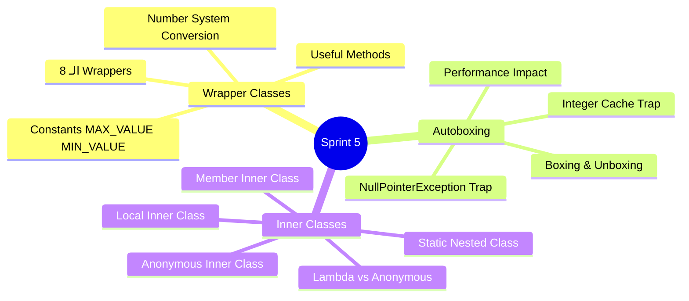
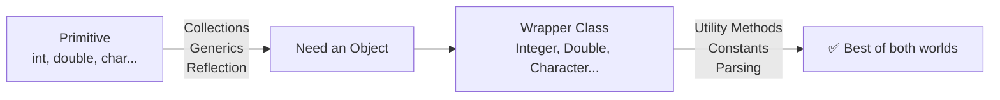
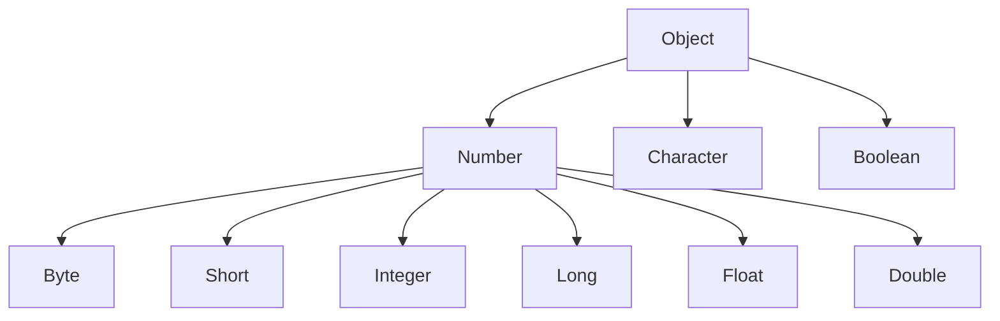
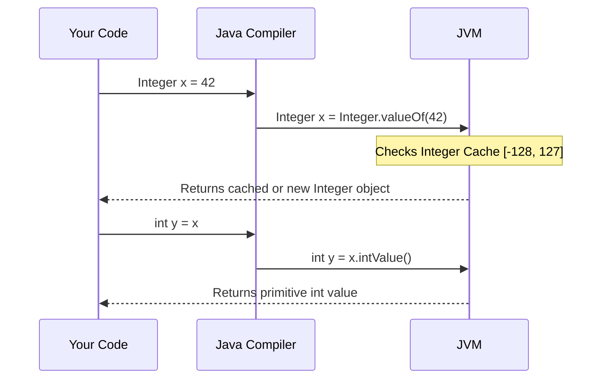
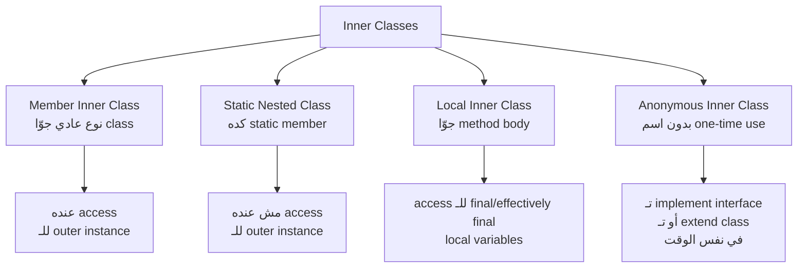

# 🚀 Sprint 5: Wrapper Classes, Autoboxing & Inner Classes — الـ Hidden Layers

> **ملحوظة للـ Mentee:** Sprint ده فيه concepts تبان بسيطة لكن فيها interview traps خطيرة جداً. الـ Autoboxing Cache، والـ NullPointerException الخفية، والـ Inner Classes في الـ Design Patterns — دي حاجات بتفرّق بين Junior وSenior في أي interview.

---

## 📍 خريطة الـ Sprint



---

# 📦 الجزء الأول: Wrapper Classes — لما الـ Primitive مش كفاية

## ليه بنحتاج Wrapper Classes أصلاً؟



الـ Java Collections زي `ArrayList` مش بتشتغل مع primitives مباشرةً:

```java
// ❌ مش ممكن — Generics لازم Object
List<int> numbers = new ArrayList<>();    // COMPILE ERROR

// ✅ لازم Wrapper
List<Integer> numbers = new ArrayList<>(); // يشتغل
```

---

## 🗺️ الـ 8 Wrapper Classes

| Primitive | Wrapper | الـ Superclass |
|-----------|---------|---------------|
| `byte` | `Byte` | `Number` |
| `short` | `Short` | `Number` |
| `int` | `Integer` | `Number` |
| `long` | `Long` | `Number` |
| `float` | `Float` | `Number` |
| `double` | `Double` | `Number` |
| `char` | `Character` | `Object` |
| `boolean` | `Boolean` | `Object` |



---

## 🔧 Wrapper Methods — الـ Arsenal الكامل

```java
public class WrapperMethods {
    public static void main(String[] args) {

        // ============================
        // 1. Parsing: String → Primitive
        // ============================
        int    i = Integer.parseInt("42");
        double d = Double.parseDouble("3.14");
        long   l = Long.parseLong("9876543210");
        boolean b = Boolean.parseBoolean("true"); // case-insensitive

        // ❌ NumberFormatException لو الـ String مش رقم
        // int bad = Integer.parseInt("hello"); // throws!

        // ============================
        // 2. valueOf: String/Primitive → Wrapper
        // ============================
        Integer intObj   = Integer.valueOf(42);       // from primitive
        Integer fromStr  = Integer.valueOf("42");     // from String
        Double  dblObj   = Double.valueOf("3.14");

        // ============================
        // 3. xxxValue: Wrapper → Primitive (cross-type conversion)
        // ============================
        Integer num = 254;
        byte  asByte   = num.byteValue();   // 254 → -2 (overflow!)
        short asShort  = num.shortValue();  // 254
        long  asLong   = num.longValue();   // 254L
        float asFloat  = num.floatValue();  // 254.0f
        double asDouble = num.doubleValue(); // 254.0

        // ============================
        // 4. toString: Number → String
        // ============================
        String s1 = Integer.toString(42);       // "42"
        String s2 = Integer.toBinaryString(42); // "101010"
        String s3 = Integer.toHexString(254);   // "fe"
        String s4 = Integer.toOctalString(8);   // "10"

        System.out.println("Binary: " + s2); // 101010
        System.out.println("Hex:    " + s3); // fe
        System.out.println("Octal:  " + s4); // 10

        // ============================
        // 5. Constants
        // ============================
        System.out.println(Integer.MAX_VALUE);  // 2,147,483,647
        System.out.println(Integer.MIN_VALUE);  // -2,147,483,648
        System.out.println(Integer.SIZE);       // 32 (bits)
        System.out.println(Integer.BYTES);      // 4 (bytes)
        System.out.println(Double.MAX_VALUE);   // 1.7976931348623157E308
        System.out.println(Double.NaN);         // NaN
        System.out.println(Double.POSITIVE_INFINITY); // Infinity

        // ============================
        // 6. Comparison & Utility
        // ============================
        System.out.println(Integer.max(10, 20));       // 20
        System.out.println(Integer.min(10, 20));       // 10
        System.out.println(Integer.sum(10, 20));       // 30
        System.out.println(Integer.compare(10, 20));   // negative (10 < 20)
        System.out.println(Integer.bitCount(255));     // 8 (number of 1-bits)
        System.out.println(Integer.reverse(1));        // 0x80000000
        System.out.println(Integer.highestOneBit(100)); // 64

        // ============================
        // 7. Number System Conversion
        // ============================
        int decimal  = Integer.parseInt("FF", 16);   // hex to decimal = 255
        int fromBin  = Integer.parseInt("1010", 2);  // binary to decimal = 10
        int fromOct  = Integer.parseInt("17", 8);    // octal to decimal = 15

        System.out.println(decimal); // 255
        System.out.println(fromBin); // 10
        System.out.println(fromOct); // 15
    }
}
```

> [!info] 🤿 JVM DEEP-DIVE — الـ `Number` Superclass
> كل الـ Numeric Wrappers (`Byte`, `Short`, `Integer`, `Long`, `Float`, `Double`) بترث من `java.lang.Number`. ده بيديك قوة polymorphism:
>
> ```java
> Number num = Integer.valueOf(42);
> System.out.println(num.intValue());    // 42
> System.out.println(num.doubleValue()); // 42.0
>
> // بتقدر تعمل generic method تشتغل مع أي numeric type
> static double toDouble(Number n) {
>     return n.doubleValue();
> }
> toDouble(42);      // Integer → 42.0
> toDouble(3.14f);   // Float   → 3.140000104904175
> toDouble(100L);    // Long    → 100.0
> ```

---

# ⚡ الجزء الثاني: Autoboxing — السحر الخفي والـ Traps

## ازاي الـ Autoboxing بيشتغل



```java
public class AutoboxingDemo {
    public static void main(String[] args) {

        // Autoboxing: primitive → Wrapper (automatic)
        Integer a = 42;           // compiler writes: Integer.valueOf(42)
        Double  d = 3.14;         // compiler writes: Double.valueOf(3.14)
        Boolean flag = true;      // compiler writes: Boolean.valueOf(true)

        // Auto-unboxing: Wrapper → primitive (automatic)
        int x = a;                // compiler writes: a.intValue()
        double y = d;             // compiler writes: d.doubleValue()
        boolean b = flag;         // compiler writes: flag.booleanValue()

        // Autoboxing في Collections
        java.util.List<Integer> list = new java.util.ArrayList<>();
        list.add(1);   // autoboxing: Integer.valueOf(1)
        list.add(2);   // autoboxing: Integer.valueOf(2)
        int sum = list.get(0) + list.get(1); // unboxing كل واحد منهم

        // Autoboxing في الـ Arithmetic
        Integer num1 = 10;
        Integer num2 = 20;
        Integer result = num1 + num2; // unbox, add, rebox!
        // compiler writes: Integer.valueOf(num1.intValue() + num2.intValue())

        System.out.println(result); // 30
    }
}
```

---

## ☠️ الـ Integer Cache Trap — أخطر Interview Question

```java
public class IntegerCacheTrap {
    public static void main(String[] args) {

        // الـ Integer Cache: [-128, 127] بيتـ cache مسبقاً في الـ JVM
        Integer a = 127;
        Integer b = 127;
        System.out.println(a == b);  // true ← نفس الـ cached object!

        Integer c = 128;
        Integer d = 128;
        System.out.println(c == d);  // false ← objects جدد في الـ Heap!

        // دلوقتي فهمنا ليه:
        Integer x = Integer.valueOf(100); // من الـ Cache
        Integer y = Integer.valueOf(100); // نفس الـ object من الـ Cache
        System.out.println(x == y);  // true

        Integer p = new Integer(100); // ❌ deprecated بس بيعمل new object دايماً
        Integer q = new Integer(100);
        System.out.println(p == q);  // false ← دايماً objects جديدة

        // الصح دايماً: استخدم .equals() مش ==
        System.out.println(c.equals(d)); // true ✅

        // نفس الـ cache موجود في:
        // Byte:      كل الـ range [-128, 127]
        // Short:     [-128, 127]
        // Integer:   [-128, 127] (قابل للتوسيع بـ JVM flag)
        // Long:      [-128, 127]
        // Character: [0, 127] (ASCII range)
        // Boolean:   TRUE و FALSE دايماً cached
    }
}
```

> [!warning] ⚠️ WARNING — الـ Integer Cache الـ Configurable
> الـ upper bound للـ Integer Cache ممكن يتغيّر عن طريق JVM flag:
> ```bash
> java -XX:AutoBoxCacheMax=1000 MyApp
> ```
> ده معناه إن `Integer.valueOf(500) == Integer.valueOf(500)` ممكن يكون `true` أو `false` حسب الـ JVM configuration! **ده سبب كافي إنك دايماً تستخدم `.equals()`**.

---

## 💀 الـ NullPointerException الخفية

```java
public class AutoboxingNPETrap {
    public static void main(String[] args) {

        // ❌ Trap 1: Unboxing null
        Integer count = null;
        // int x = count; // ← NullPointerException! unboxing null
        int x = count != null ? count : 0; // ✅ safe unboxing

        // ❌ Trap 2: الـ ternary operator والـ type promotion
        Integer val = null;
        // هنا الـ compiler بيـ unbox عشان يـ promote لـ int
        // int result = condition ? val : 0; // ← NullPointerException لو condition true!
        Integer result = true ? val : Integer.valueOf(0); // ✅ keep as Integer

        // ❌ Trap 3: Arithmetic على nullable Wrappers
        Integer a = null;
        Integer b = 5;
        // Integer sum = a + b; // ← NullPointerException! a.intValue() fails

        // ✅ الحل: استخدم Objects.requireNonNullElse أو Optional
        int safeSum = java.util.Objects.requireNonNullElse(a, 0) + b;
        System.out.println(safeSum); // 5

        // ❌ Trap 4: Map.get() returns null
        java.util.Map<String, Integer> scores = new java.util.HashMap<>();
        scores.put("Ahmed", 95);
        int saiScore = scores.get("Sara"); // NullPointerException! "Sara" not in map
        // ✅ Fix:
        int saraScore = scores.getOrDefault("Sara", 0);
        System.out.println(saraScore); // 0
    }
}
```

> [!warning] ⚠️ WARNING — Performance Impact للـ Autoboxing في Loops
> الـ Autoboxing في الـ loops بتعمل heap allocations كتيرة جداً:
>
> ```java
> // ❌ بيعمل 10,000 Integer objects في الـ Heap
> Long sum = 0L;
> for (long i = 0; i < 10_000; i++) {
>     sum += i; // unbox sum, add i, rebox result — كل iteration!
> }
>
> // ✅ استخدم primitives في الـ loops
> long sum2 = 0L;
> for (long i = 0; i < 10_000; i++) {
>     sum2 += i; // pure primitive arithmetic — no boxing
> }
> ```
>
> الفرق في الـ performance ممكن يوصل لـ 10x في الـ tight loops.

---

# 🪆 الجزء الثالث: Inner Classes — الـ 4 أنواع

## رسم تخطيطي للأنواع



---

## 1️⃣ Member Inner Class — الأقوى في الـ Encapsulation

```java
public class LinkedList<T> {

    // ===================================
    // الـ Node class — helper class خاصة بالـ LinkedList
    // مفيش سبب تكون public class منفصلة
    // ===================================
    private class Node {
        T data;
        Node next;

        Node(T data) {
            this.data = data;
            this.next = null;
        }
    }

    // ===================================
    // Iterator — بيستخدم الـ Node الـ private
    // ===================================
    public class LinkedListIterator {
        private Node current = head;

        public boolean hasNext() { return current != null; }

        public T next() {
            T data = current.data;
            current = current.next;
            return data;
        }
    }

    private Node head;
    private int size;

    public void add(T item) {
        Node newNode = new Node(item); // ✅ access الـ private inner class
        if (head == null) {
            head = newNode;
        } else {
            Node curr = head;
            while (curr.next != null) curr = curr.next;
            curr.next = newNode;
        }
        size++;
    }

    public LinkedListIterator iterator() {
        return new LinkedListIterator();
    }

    public static void main(String[] args) {
        LinkedList<String> list = new LinkedList<>();
        list.add("Ahmed");
        list.add("Sara");
        list.add("Khaled");

        // استخدام الـ Iterator (inner class object)
        LinkedList<String>.LinkedListIterator it = list.iterator();
        while (it.hasNext()) {
            System.out.println(it.next());
        }

        // طريقة الإنشاء من خارج الـ Outer class:
        LinkedList<Integer> numList = new LinkedList<>();
        LinkedList<Integer>.LinkedListIterator extIter = numList.iterator();
    }
}
```

> [!info] 🤿 JVM DEEP-DIVE — الـ Implicit Reference في الـ Inner Class
> الـ Member Inner Class عنده **hidden reference** للـ outer instance. الـ compiler بيضيف automatically:
>
> ```java
> // ما بتشوفه أنت:
> class Inner {
>     void doSomething() { outerVar = 5; }
> }
>
> // ما بيعمله الـ compiler فعلاً:
> class Outer$Inner {
>     final Outer this$0;  // ← hidden reference للـ outer!
>     Outer$Inner(Outer outer) { this.this$0 = outer; }
>     void doSomething() { this$0.outerVar = 5; }
> }
> ```
>
> ده معناه إن كل Inner class instance بيـ hold strong reference للـ outer object. لو عملت inner class instance وبعته لـ thread تاني أو خزّنته في static field، الـ outer object **مش هيتـ garbage collected** حتى لو أنت نفسك ما عندكش reference ليه. ده سبب شائع جداً للـ **memory leaks** في Android development!

---

## 2️⃣ Static Nested Class — الـ Clean Version

```java
public class HttpClient {

    // Static Nested Class — مش محتاج reference للـ HttpClient
    // مناسبة لما الـ nested class هي helper/utility independent
    public static class Builder {
        private String baseUrl;
        private int    timeout = 30_000;
        private int    maxRetries = 3;
        private boolean followRedirects = true;

        public Builder baseUrl(String url) {
            this.baseUrl = url;
            return this;
        }

        public Builder timeout(int ms) {
            this.timeout = ms;
            return this;
        }

        public Builder maxRetries(int retries) {
            this.maxRetries = retries;
            return this;
        }

        public Builder followRedirects(boolean follow) {
            this.followRedirects = follow;
            return this;
        }

        public HttpClient build() {
            if (baseUrl == null || baseUrl.isBlank()) {
                throw new IllegalStateException("baseUrl is required");
            }
            return new HttpClient(this);
        }
    }

    // Private fields — populated by Builder
    private final String  baseUrl;
    private final int     timeout;
    private final int     maxRetries;
    private final boolean followRedirects;

    private HttpClient(Builder builder) {
        this.baseUrl         = builder.baseUrl;
        this.timeout         = builder.timeout;
        this.maxRetries      = builder.maxRetries;
        this.followRedirects = builder.followRedirects;
    }

    public String get(String path) {
        System.out.printf("GET %s%s (timeout=%dms)%n", baseUrl, path, timeout);
        return "response";
    }

    @Override
    public String toString() {
        return String.format("HttpClient{url=%s, timeout=%d, retries=%d}",
            baseUrl, timeout, maxRetries);
    }

    public static void main(String[] args) {
        // Builder Pattern مع Static Nested Class
        // مش محتاج HttpClient instance عشان تبني الـ Builder
        HttpClient client = new HttpClient.Builder()  // ← new OuterClass.StaticNested()
            .baseUrl("https://api.example.com")
            .timeout(5_000)
            .maxRetries(5)
            .followRedirects(false)
            .build();

        System.out.println(client);
        client.get("/users");
    }
}
```

> [!info] 🤿 JVM DEEP-DIVE — Static Nested vs Member Inner
>
> ```
> Member Inner Class:
> ├── بيحتاج outer instance عشان تعمله instantiate
> ├── بيحتوي hidden reference للـ outer object
> ├── بيقدر يوصل لـ private instance members للـ outer
> └── ممكن يسبب memory leak
>
> Static Nested Class:
> ├── مستقل تماماً — مش محتاج outer instance
> ├── مفيش hidden reference
> ├── بيقدر يوصل بس لـ static members للـ outer class
> └── آمن من الـ memory leaks ✅
>
> الـ Rule: لو الـ inner class مش محتاجة outer state → اعملها static دايماً
> ```

---

## 3️⃣ Local Inner Class — جوّا الـ Method

```java
import java.util.*;

public class DataProcessor {

    public List<String> processAndFormat(List<Integer> data, String prefix) {
        final String separator = " | "; // effectively final — بتقدر الـ local class تستخدمها

        // Local class — موجودة بس جوّا الـ method دي
        class Formatter {
            private final int value;

            Formatter(int value) { this.value = value; }

            String format() {
                // بتوصل لـ:
                // 1. outer class members (prefix is a parameter → effectively final)
                // 2. final/effectively final local variables (separator)
                return prefix + value + separator + Integer.toBinaryString(value);
            }
        }

        List<String> result = new ArrayList<>();
        for (int val : data) {
            Formatter f = new Formatter(val); // instantiate جوّا نفس الـ method
            result.add(f.format());
        }
        return result;
    }

    public static void main(String[] args) {
        DataProcessor dp = new DataProcessor();
        List<String> formatted = dp.processAndFormat(
            Arrays.asList(5, 10, 15, 20),
            "Value: "
        );
        formatted.forEach(System.out::println);
        // Value: 5 | 101
        // Value: 10 | 1010
        // Value: 15 | 1111
        // Value: 20 | 10100
    }
}
```

> [!note] 📝 NOTE — متى تستخدم Local Inner Class
> الـ Local Inner Class نادراً تُستخدم في الكود الحديث. في معظم الحالات، Lambda أو Stream API بيحلوا نفس المشكلة بشكل أبسط. لكنها مفيدة لما محتاج:
> 1. تعمل multiple methods (Lambda بتعمل method واحدة)
> 2. تحتاج state local للـ method
> 3. بتـ extend abstract class (مش بس تـ implement interface)

---

## 4️⃣ Anonymous Inner Class — وبعدين Lambda

```java
import java.util.*;

public class AnonymousClassEvolution {

    interface Validator<T> {
        boolean validate(T value);
        default String getErrorMessage() { return "Validation failed"; }
    }

    public static void main(String[] args) {

        List<Integer> numbers = Arrays.asList(-5, 0, 3, -1, 7, 10, -3);

        // ❌ Before Java 8 — Anonymous Inner Class (verbose)
        Validator<Integer> positiveValidator = new Validator<Integer>() {
            @Override
            public boolean validate(Integer value) {
                return value > 0;
            }

            @Override
            public String getErrorMessage() {
                return "Value must be positive!";
            }
        };

        // ✅ Java 8+ Lambda — لو الـ interface عنده method واحدة abstract
        // لكن هنا الـ interface عندها method تانية (getErrorMessage) مش abstract
        // فالـ Lambda مش كافية لو عايز تـ override getErrorMessage

        // متى نستخدم Anonymous Class بدل Lambda:
        // 1. لما محتاج تـ override أكتر من method
        // 2. لما محتاج تـ extend abstract class (مش interface)
        // 3. لما محتاج state (instance variables)

        // Sorting مع Anonymous Comparator
        List<String> names = Arrays.asList("Ziad", "Ahmed", "Sara", "Khaled");

        // Anonymous Class
        Collections.sort(names, new Comparator<String>() {
            @Override
            public int compare(String a, String b) {
                return a.length() - b.length(); // sort by length
            }
        });

        // ✅ Lambda version (cleaner)
        names.sort((a, b) -> a.length() - b.length());

        // ✅ Method Reference version (cleanest)
        names.sort(Comparator.comparingInt(String::length));

        System.out.println(names); // [Sara, Ziad, Ahmed, Khaled]

        // Validate
        numbers.stream()
               .filter(positiveValidator::validate)
               .forEach(System.out::println); // 3, 7, 10
    }
}
```

> [!info] 🤿 JVM DEEP-DIVE — Anonymous Class vs Lambda في الـ Bytecode
>
> ```
> Anonymous Inner Class:
> ├── بيعمل .class file منفصل (MyClass$1.class)
> ├── بيعمل object في الـ Heap لكل instantiation
> ├── بيحتوي hidden outer reference (لو non-static context)
> └── overhead أكبر
>
> Lambda:
> ├── مش بيعمل .class file منفصل
> ├── بيستخدم invokedynamic + LambdaMetafactory
> ├── الـ JVM بيقرر الـ implementation strategy in runtime
> └── أسرع وأخف في الـ Memory
>
> القاعدة: لو ممكن Lambda → استخدم Lambda
>          لو محتاج multiple methods أو extends → Anonymous Class
> ```

---

# 🏋️ Practical Exercises — Progressive

> [!example]- 🟢 PE1 (Beginner): Number System Converter
>
> **المطلوب:** اكتب `NumberConverter` class بـ static methods لتحويل الأرقام بين الأنظمة المختلفة باستخدام Wrapper methods.
>
> ```java
> public class NumberConverter {
>
>     public static String toAllFormats(int decimal) {
>         return new StringBuilder()
>             .append(String.format("Decimal:  %d%n", decimal))
>             .append(String.format("Binary:   %s%n", Integer.toBinaryString(decimal)))
>             .append(String.format("Octal:    %s%n", Integer.toOctalString(decimal)))
>             .append(String.format("Hex:      %s%n", Integer.toHexString(decimal).toUpperCase()))
>             .append(String.format("Bits set: %d%n", Integer.bitCount(decimal)))
>             .toString();
>     }
>
>     public static int fromBinary(String binary) { return Integer.parseInt(binary, 2); }
>     public static int fromHex(String hex)        { return Integer.parseInt(hex, 16); }
>     public static int fromOctal(String octal)    { return Integer.parseInt(octal, 8); }
>
>     public static void main(String[] args) {
>         System.out.println(toAllFormats(255));
>         System.out.println("FF (hex) = " + fromHex("FF"));         // 255
>         System.out.println("11111111 (bin) = " + fromBinary("11111111")); // 255
>     }
> }
> ```

> [!example]- 🟡 PE2 (Intermediate): Thread-Safe Counter باستخدام Static Nested Class
>
> **السيناريو:** بتبني metrics system. المطلوب:
> 1. `MetricsCollector` outer class
> 2. Static Nested `Counter` class بـ thread-safe operations
> 3. Static Nested `Timer` class بتحسب execution time
> 4. Member Inner `Report` class بتولّد تقرير
>
> ```java
> import java.util.concurrent.atomic.AtomicLong;
> import java.util.Map;
> import java.util.concurrent.ConcurrentHashMap;
>
> public class MetricsCollector {
>
>     private final String serviceName;
>     private final Map<String, Counter> counters = new ConcurrentHashMap<>();
>     private final Map<String, Timer>   timers   = new ConcurrentHashMap<>();
>
>     public MetricsCollector(String serviceName) {
>         this.serviceName = serviceName;
>     }
>
>     // ============================
>     // Static Nested Class — Counter
>     // ============================
>     public static class Counter {
>         private final String name;
>         private final AtomicLong value = new AtomicLong(0);
>
>         public Counter(String name) { this.name = name; }
>
>         public void increment()          { value.incrementAndGet(); }
>         public void increment(long by)   { value.addAndGet(by); }
>         public void reset()              { value.set(0); }
>         public long getValue()           { return value.get(); }
>
>         @Override
>         public String toString() {
>             return String.format("Counter[%s] = %d", name, value.get());
>         }
>     }
>
>     // ============================
>     // Static Nested Class — Timer
>     // ============================
>     public static class Timer {
>         private final String name;
>         private final AtomicLong totalMs  = new AtomicLong(0);
>         private final AtomicLong callCount = new AtomicLong(0);
>
>         public Timer(String name) { this.name = name; }
>
>         public <T> T time(java.util.concurrent.Callable<T> operation) throws Exception {
>             long start = System.nanoTime();
>             try {
>                 return operation.call();
>             } finally {
>                 long elapsed = (System.nanoTime() - start) / 1_000_000;
>                 totalMs.addAndGet(elapsed);
>                 callCount.incrementAndGet();
>             }
>         }
>
>         public double avgMs() {
>             long calls = callCount.get();
>             return calls == 0 ? 0 : (double) totalMs.get() / calls;
>         }
>
>         @Override
>         public String toString() {
>             return String.format("Timer[%s] calls=%d avg=%.2fms",
>                 name, callCount.get(), avgMs());
>         }
>     }
>
>     // ============================
>     // Member Inner Class — Report
>     // بتحتاج access لـ serviceName (outer state)
>     // ============================
>     public class Report {
>         public String generate() {
>             StringBuilder sb = new StringBuilder();
>             sb.append("=".repeat(50)).append("\n");
>             sb.append("  Metrics Report: ").append(serviceName).append("\n"); // outer field
>             sb.append("=".repeat(50)).append("\n");
>             sb.append("  COUNTERS:\n");
>             counters.values().forEach(c -> sb.append("  → ").append(c).append("\n")); // outer map
>             sb.append("  TIMERS:\n");
>             timers.values().forEach(t -> sb.append("  → ").append(t).append("\n")); // outer map
>             sb.append("=".repeat(50));
>             return sb.toString();
>         }
>     }
>
>     // Factory methods
>     public Counter counter(String name) {
>         return counters.computeIfAbsent(name, Counter::new);
>     }
>
>     public Timer timer(String name) {
>         return timers.computeIfAbsent(name, Timer::new);
>     }
>
>     public Report report() { return new Report(); }
>
>     public static void main(String[] args) throws Exception {
>         MetricsCollector metrics = new MetricsCollector("OrderService");
>
>         Counter requests  = metrics.counter("requests");
>         Counter errors    = metrics.counter("errors");
>         Timer   dbTimer   = metrics.timer("db_query");
>
>         // Simulate some operations
>         for (int i = 0; i < 100; i++) {
>             requests.increment();
>             dbTimer.time(() -> {
>                 Thread.sleep(5); // simulate DB query
>                 return null;
>             });
>         }
>         errors.increment(3);
>
>         System.out.println(metrics.report().generate());
>     }
> }
> ```

> [!example]- 🔴 PE3 (Advanced): Event System باستخدام Anonymous Classes + Lambdas
>
> **السيناريو:** بتبني UI event system مشابه للـ Swing/Android. المطلوب:
> 1. Generic `Observable<T>` class بتـ support multiple listeners
> 2. `EventHandler<T>` functional interface
> 3. `Button`, `TextField` UI components ترث من `Observable`
> 4. استخدام Anonymous Classes للـ complex handlers وLambda للـ simple ones
>
> ```java
> import java.util.*;
> import java.util.function.Consumer;
>
> public class UIFramework {
>
>     // Functional Interface للـ simple handlers
>     @FunctionalInterface
>     public interface EventHandler<T> {
>         void handle(T event);
>     }
>
>     // Generic Observable class
>     public static class Observable<T> {
>         private final List<EventHandler<T>> handlers = new ArrayList<>();
>
>         public Observable<T> on(EventHandler<T> handler) {
>             handlers.add(handler);
>             return this;
>         }
>
>         public void emit(T event) {
>             handlers.forEach(h -> h.handle(event));
>         }
>     }
>
>     // Event types (records — Java 16+)
>     public record ClickEvent(int x, int y, long timestamp) {}
>     public record TextEvent(String text, int cursorPos) {}
>     public record FocusEvent(boolean gained) {}
>
>     // UI Components
>     public static class Button {
>         private final String label;
>         public final Observable<ClickEvent> onClick = new Observable<>();
>         public final Observable<FocusEvent> onFocus = new Observable<>();
>
>         public Button(String label) { this.label = label; }
>
>         public void simulateClick(int x, int y) {
>             System.out.println("Button '" + label + "' clicked at (" + x + "," + y + ")");
>             onClick.emit(new ClickEvent(x, y, System.currentTimeMillis()));
>         }
>     }
>
>     public static class TextField {
>         private String text = "";
>         public final Observable<TextEvent>  onTextChange = new Observable<>();
>         public final Observable<FocusEvent> onFocus      = new Observable<>();
>
>         public void type(String chars) {
>             text += chars;
>             onTextChange.emit(new TextEvent(text, text.length()));
>         }
>     }
>
>     public static void main(String[] args) {
>         Button   submitBtn   = new Button("Submit");
>         TextField emailField = new TextField();
>
>         // ✅ Lambda للـ simple handlers
>         submitBtn.onClick.on(e ->
>             System.out.println("Submit clicked at: " + e.x() + "," + e.y())
>         );
>
>         // ✅ Anonymous Class للـ complex handler (محتاج state)
>         submitBtn.onClick.on(new EventHandler<ClickEvent>() {
>             private int clickCount = 0; // state!
>
>             @Override
>             public void handle(ClickEvent event) {
>                 clickCount++;
>                 System.out.println("Click #" + clickCount + " at " + event.timestamp());
>                 if (clickCount > 3) {
>                     System.out.println("⚠️ Double-click protection triggered!");
>                 }
>             }
>         });
>
>         // ✅ Chaining multiple handlers
>         emailField.onTextChange
>             .on(e -> System.out.println("Text: " + e.text()))
>             .on(e -> {
>                 if (!e.text().contains("@")) {
>                     System.out.println("⚠️ Not a valid email yet");
>                 }
>             });
>
>         // Simulate UI interactions
>         emailField.type("ahmed");
>         emailField.type("@iti");
>         emailField.type(".com");
>
>         submitBtn.simulateClick(100, 200);
>         submitBtn.simulateClick(101, 201);
>         submitBtn.simulateClick(102, 202);
>         submitBtn.simulateClick(103, 203); // triggers protection
>     }
> }
> ```

---

# 🎯 Interview Survival Kit

> [!faq]- 🎯 Sprint 5 — Interview Questions الـ Hardcore
>
> ---
>
> **Q1: "What is the Integer Cache and why does it matter?"**
>
> الـ JVM بيـ cache الـ Integer objects من -128 لـ 127 عشان performance. `Integer.valueOf(100)` بيرجع دايماً نفس الـ object في الـ range ده. ده معناه إن `==` بيـ return `true` للقيم دي لكن `false` لأي قيمة خارج الـ range. **القاعدة الذهبية:** دايماً استخدم `.equals()` لمقارنة Wrapper objects.
>
> ---
>
> **Q2: "When can Autoboxing cause a NullPointerException?"**
>
> ```java
> // 3 حالات خطيرة:
>
> // 1. Unboxing null reference
> Integer x = null;
> int y = x; // NPE: x.intValue() on null
>
> // 2. Null from Map.get()
> Map<String, Integer> map = new HashMap<>();
> int val = map.get("missing"); // NPE: unboxing null
>
> // 3. Ternary with mixed types
> Integer a = null;
> int result = condition ? a : 0; // NPE if condition=true: a.intValue()
> ```
>
> ---
>
> **Q3: "What is the difference between the 4 types of Inner Classes?"**
>
> | | Member Inner | Static Nested | Local | Anonymous |
> |--|-------------|--------------|-------|-----------|
> | **Outer reference** | ✅ hidden ref | ❌ none | ✅ outer + effectively final locals | ✅ outer context |
> | **Access** | outer instance | outer static | method locals (final) | outer context |
> | **Instantiation** | `outer.new Inner()` | `new Outer.Static()` | جوّا الـ method بس | في مكان التعريف بس |
> | **Memory Leak Risk** | ⚠️ يعم | ✅ آمن | ⚠️ يعم | ⚠️ يعم |
>
> ---
>
> **Q4: (Hardcore) "Why can Local Inner Classes only access `final` or effectively final variables?"**
>
> لأن الـ local variable موجودة على الـ Stack وبتتمسح لما الـ method تخلص. لكن الـ Inner Class instance ممكن يعيش أطول (في الـ Heap). عشان الـ object يقدر يستخدم الـ variable بعد ما الـ method خلصت، الـ compiler بيعمل **copy** من الـ variable جوّا الـ object. لو الـ variable مش `final`، ممكن تتغيّر بعد الـ copy، وده بيعمل inconsistency. الـ `final` بيضمن إن الـ copy والـ original دايماً نفس القيمة.
>
> ---
>
> **Q5: "When would you use Anonymous Class over Lambda?"**
>
> استخدم **Anonymous Class** لما:
> 1. محتاج تـ override **أكتر من method واحدة**
> 2. محتاج **instance variables (state)** جوّا الـ handler
> 3. محتاج تـ **extend abstract class** (مش بس interface)
> 4. محتاج تـ override `toString()` أو `equals()` على الـ implementation
>
> في كل الحالات التانية → **Lambda أفضل**.
>
> ---
>
> **Q6: "What is the memory implication of non-static inner classes?"**
>
> كل non-static inner class instance بيـ hold **strong reference** للـ outer class instance. ده معناه:
> - الـ outer object مش هيتـ garbage collected طول ما في inner class instances حية
> - لو بعتت inner class instance لـ thread أو cache أو static field، الـ outer object هيـ "leak"
>
> الـ Fix: لو الـ inner class مش محتاجة outer state → اعملها `static`.
>
> ---
>
> **Q7: (Tricky) "What is the output of this code?"**
>
> ```java
> Integer a = 1000;
> Integer b = 1000;
> System.out.println(a == b);       // ?
> System.out.println(a.equals(b));  // ?
>
> Integer c = 100;
> Integer d = 100;
> System.out.println(c == d);       // ?
> System.out.println(c.equals(d));  // ?
> ```
>
> **الإجابة:**
> ```
> false  ← 1000 خارج الـ cache range, objects مختلفة
> true   ← نفس الـ content
> true   ← 100 في الـ cache range [-128, 127], نفس الـ object
> true   ← نفس الـ content
> ```

---

# 📋 ملخص Sprint 5

```
✅ الـ 8 Wrapper Classes + الـ Number hierarchy
✅ Wrapper Methods: parseXXX, valueOf, xxxValue, toString, constants
✅ Number System Conversion: decimal ↔ binary ↔ hex ↔ octal
✅ Autoboxing & Unboxing: ازاي بيشتغلوا في الـ bytecode
✅ Integer Cache Trap: [-128, 127] وليه == خطير مع Wrappers
✅ Autoboxing NPE الـ 3 حالات الخطيرة
✅ Member Inner Class: hidden outer reference + memory leak risk
✅ Static Nested Class: Builder Pattern + متى تستخدمها
✅ Local Inner Class: effectively final constraint + السبب
✅ Anonymous Inner Class: متى Lambda أحسن ومتى Anonymous أحسن
✅ 3 Progressive PEs: Number Converter → Metrics System → UI Event Framework
✅ Interview Kit: 7 أسئلة hardcore

Sprint 6 الجاي → Exception Handling: Checked vs Unchecked + Custom Exceptions
```

---

*📁 Sprint 5 — ITI Core Java Intake 46 | Dec 2025*
*🏛️ Mentor: Elite Egyptian Java Principal Architect*
