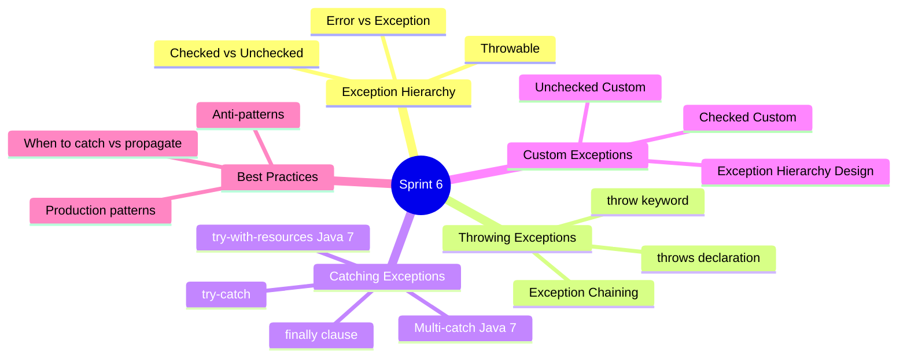
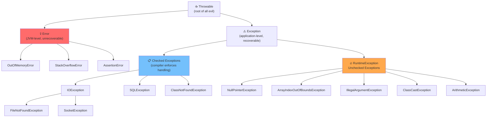
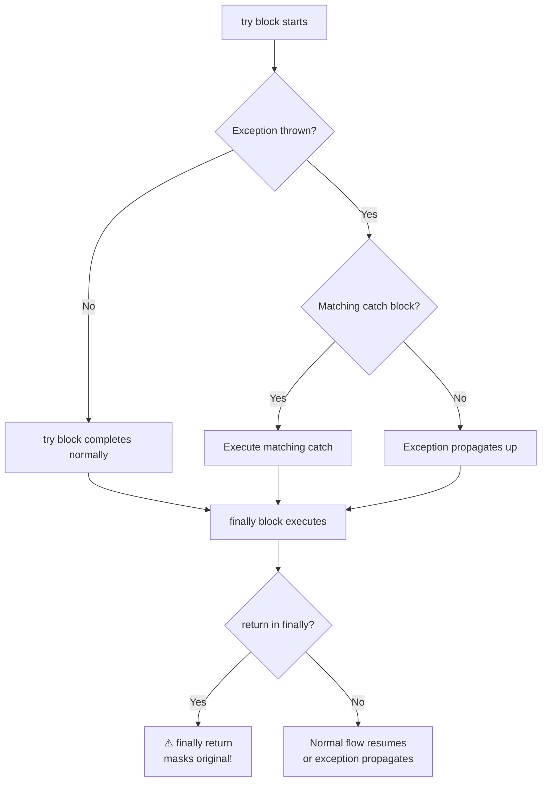
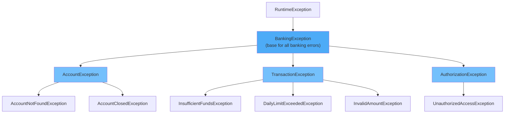

# 🚀 Sprint 6: Exception Handling — الدفاع المعماري

> **ملحوظة للـ Mentee:** Exception Handling مش بس `try-catch`. ده نظام دفاع كامل للـ application. الفرق بين Junior وSenior هنا واضح جداً — الـ Junior بيكتب `catch(Exception e) {}` ويمشي، والـ Senior بيصمّم exception hierarchy كاملة، بيـ chain الـ exceptions، وبيفهم الـ try-with-resources من جوّا.

---

## 📍 خريطة الـ Sprint



---

# 🏗️ الجزء الأول: Exception Hierarchy — الهرم الكامل



---

## الفرق الجوهري: Checked vs Unchecked

```java
import java.io.*;

public class CheckedVsUnchecked {

    // ============================
    // CHECKED EXCEPTION
    // الـ compiler بيجبرك تتعامل معاها
    // "يا تحطّها في try-catch، يا تعلن عنها بـ throws"
    // ============================
    public String readFile(String path) throws IOException { // إعلان إجباري
        BufferedReader reader = new BufferedReader(new FileReader(path));
        return reader.readLine();
    }

    // ============================
    // UNCHECKED EXCEPTION (RuntimeException)
    // الـ compiler مش بيجبرك — ده "programming error"
    // ============================
    public int divide(int a, int b) {
        // مش محتاج throws ArithmeticException
        return a / b; // بيرمي ArithmeticException لو b == 0
    }

    public static void main(String[] args) {

        CheckedVsUnchecked demo = new CheckedVsUnchecked();

        // Checked — لازم تتعامل معاها
        try {
            String content = demo.readFile("/path/to/file.txt");
            System.out.println(content);
        } catch (IOException e) {
            System.err.println("File error: " + e.getMessage());
        }

        // Unchecked — اختياري تتعامل معاها
        try {
            System.out.println(demo.divide(10, 0));
        } catch (ArithmeticException e) {
            System.err.println("Math error: " + e.getMessage()); // / by zero
        }
    }
}
```

> [!info] 🤿 JVM DEEP-DIVE — ليه في Checked و Unchecked أصلاً؟
> ده قرار معماري من James Gosling. الـ **Checked Exceptions** تمثّل حالات خارج إرادتك — file missing, network down, DB unavailable. الـ compiler بيجبرك تفكّر فيها وتتعامل معاها.
>
> الـ **Unchecked Exceptions** تمثّل **programming bugs** — null pointer، array bounds، division by zero. ده "غلطتك أنت" مش ظرف خارجي. الـ philosophy: لو كتبت الكود صح أصلاً، مش المفروض يحصلوا.
>
> في الـ real world: كتير من الـ modern frameworks زي Spring بتفضّل **Unchecked Exceptions** لأن الـ Checked Exceptions بتلوّث الـ API وبتجبر الـ caller يتعامل مع حاجات مش عارف يعملها.

---

# 💥 الجزء الثاني: Throwing Exceptions — الرمي الصح

## `throw` vs `throws` — الفرق الكلاسيكي

```java
public class ThrowVsThrows {

    // "throws" في الـ signature = إعلان: "الـ method دي ممكن ترمي الـ exception دي"
    public void processAge(int age) throws IllegalArgumentException {

        // "throw" في الـ body = الرمي الفعلي
        if (age < 0 || age > 150) {
            throw new IllegalArgumentException(
                "Invalid age: " + age + ". Must be between 0 and 150."
            );
        }
        System.out.println("Age processed: " + age);
    }

    // يمكن تعلن عن أكتر من exception
    public void loadUserData(int userId) throws IOException, IllegalArgumentException {
        if (userId <= 0) {
            throw new IllegalArgumentException("User ID must be positive: " + userId);
        }
        // simulate file read
        throw new IOException("User data file not found for ID: " + userId);
    }
}
```

---

## ⛓️ Exception Chaining — الـ Root Cause Pattern

```java
public class ExceptionChaining {

    // ❌ الطريقة السيئة — بتخسر الـ original cause
    public void badApproach() throws RuntimeException {
        try {
            connectToDatabase();
        } catch (SQLException e) {
            // اتفقدت الـ root cause!
            throw new RuntimeException("Database operation failed");
        }
    }

    // ✅ الطريقة الصح — بتحتفظ بالـ cause chain
    public void goodApproach() throws RuntimeException {
        try {
            connectToDatabase();
        } catch (SQLException e) {
            // بتـ wrap الـ original exception
            throw new RuntimeException("Database operation failed", e);
        }
    }

    // ✅ الأصح في الـ production — Custom Exception مع Cause
    public void bestApproach() throws DataAccessException {
        try {
            connectToDatabase();
        } catch (SQLException e) {
            throw new DataAccessException("Failed to load user data", e);
        }
    }

    private void connectToDatabase() throws SQLException {
        throw new SQLException("Connection refused: localhost:5432");
    }

    public static void main(String[] args) {
        ExceptionChaining demo = new ExceptionChaining();
        try {
            demo.bestApproach();
        } catch (DataAccessException e) {
            System.err.println("High-level error: " + e.getMessage());
            System.err.println("Root cause: " + e.getCause().getMessage());

            // Stack trace كامل مع الـ cause chain
            e.printStackTrace();
        }
    }
}

class DataAccessException extends RuntimeException {
    public DataAccessException(String message, Throwable cause) {
        super(message, cause);
    }
}
```

> [!warning] ⚠️ WARNING — Exception Swallowing: الجريمة الكبرى
> ده الـ anti-pattern الأخطر في الـ Java code:
>
> ```java
> // ❌ NEVER DO THIS — بتمسح الـ evidence
> try {
>     riskyOperation();
> } catch (Exception e) {
>     // empty catch block — الـ exception اتبلعت!
>     // مفيش logging، مفيش handling، مفيش rethrow
>     // البرنامج هيكمّل وكأن مفيش حاجة حصلت
> }
>
> // ❌ كمان سيء
> try {
>     riskyOperation();
> } catch (Exception e) {
>     System.out.println("Error occurred"); // بدون details!
> }
>
> // ✅ الصح: log + rethrow أو log + handle properly
> try {
>     riskyOperation();
> } catch (Exception e) {
>     logger.error("Operation failed: {}", e.getMessage(), e);
>     throw new ServiceException("Operation failed", e); // أو handle properly
> }
> ```

---

# 🎯 الجزء الثالث: Catching Exceptions — التفاصيل المعمارية

## الـ try-catch-finally Flow الكامل



```java
public class TryCatchFlow {

    public static void main(String[] args) {

        // ============================
        // 1. Basic try-catch-finally
        // ============================
        System.out.println("Result 1: " + example1(true));
        System.out.println("Result 2: " + example1(false));
    }

    static String example1(boolean throwEx) {
        try {
            System.out.println("try: start");
            if (throwEx) throw new RuntimeException("Oops!");
            System.out.println("try: end (no exception)");
            return "from try";
        } catch (RuntimeException e) {
            System.out.println("catch: " + e.getMessage());
            return "from catch";
        } finally {
            // دايماً بيشتغل — حتى لو return في try أو catch
            System.out.println("finally: always runs!");
            // ⚠️ لو حطّيت return هنا هيمسح الـ return من try/catch
        }
    }

    // ============================
    // 2. Multi-catch (Java 7+)
    // ============================
    static void multiCatch(String input, String[] arr) {
        try {
            int index = Integer.parseInt(input); // NumberFormatException
            System.out.println(arr[index]);       // ArrayIndexOutOfBoundsException
        } catch (NumberFormatException | ArrayIndexOutOfBoundsException e) {
            // بتتعامل مع الاتنين بنفس الطريقة
            System.err.println("Input error: " + e.getClass().getSimpleName());
        }
    }

    // ============================
    // 3. Catching Hierarchy — Order matters!
    // ============================
    static void catchOrder() {
        try {
            throw new FileNotFoundException("file.txt not found");
        }
        // ✅ الأكثر specific أولاً
        catch (FileNotFoundException e) {
            System.err.println("File not found: " + e.getMessage());
        }
        catch (IOException e) {
            // FileNotFoundException extends IOException
            // لو كانت الـ IOException أول → كانت هتمسك FileNotFoundException
            System.err.println("IO error: " + e.getMessage());
        }
        // ❌ لو عكست الترتيب → COMPILE ERROR: "Exception has already been caught"
    }
}
```

> [!warning] ⚠️ WARNING — الـ `finally` Return Trap
> ```java
> static int dangerousFinally() {
>     try {
>         return 1;    // هيتنفّذ
>     } finally {
>         return 2;    // ⚠️ بيمسح الـ return 1 !
>     }
> }
> System.out.println(dangerousFinally()); // يطبع 2 مش 1!
> ```
>
> وأخطر من كده:
> ```java
> static int exceptionLost() {
>     try {
>         throw new RuntimeException("Important error!");
>     } finally {
>         return 42; // ⚠️ بيمسح الـ exception كأنها ما حصلتش!
>     }
> }
> ```
>
> **القاعدة:** لا تضع `return` أو `throw` في `finally` block.

---

## 🔒 try-with-resources — الـ AutoCloseable Pattern

```java
import java.io.*;
import java.sql.*;

public class TryWithResources {

    // ============================
    // قبل Java 7 — الطريقة المؤلمة
    // ============================
    static String readFileLegacy(String path) throws IOException {
        BufferedReader reader = null;
        try {
            reader = new BufferedReader(new FileReader(path));
            return reader.readLine();
        } finally {
            if (reader != null) {    // لو الـ constructor نفسه رمى exception؟
                try {
                    reader.close(); // close() ممكن هي كمان ترمي exception!
                } catch (IOException closeEx) {
                    // suppress أو handle؟ صداع كبير
                }
            }
        }
    }

    // ============================
    // Java 7+ — try-with-resources
    // ============================
    static String readFileModern(String path) throws IOException {
        // reader.close() بيتستدعى أوتوماتيكلي — حتى لو في exception
        try (BufferedReader reader = new BufferedReader(new FileReader(path))) {
            return reader.readLine();
        }
        // مفيش finally محتاج!
    }

    // ============================
    // Multiple Resources
    // بيتقفلوا بالترتيب العكسي (LIFO)
    // ============================
    static void copyFile(String src, String dst) throws IOException {
        try (
            BufferedReader reader = new BufferedReader(new FileReader(src));
            BufferedWriter writer = new BufferedWriter(new FileWriter(dst))
        ) {
            String line;
            while ((line = reader.readLine()) != null) {
                writer.write(line);
                writer.newLine();
            }
        }
        // writer.close() أولاً، بعدين reader.close()
    }

    // ============================
    // Custom AutoCloseable Resource
    // ============================
    static class DatabaseConnection implements AutoCloseable {
        private final String url;
        private boolean connected = false;

        DatabaseConnection(String url) {
            this.url = url;
            System.out.println("🔗 Connected to: " + url);
            connected = true;
        }

        public void query(String sql) {
            if (!connected) throw new IllegalStateException("Not connected!");
            System.out.println("📊 Executing: " + sql);
        }

        @Override
        public void close() {
            connected = false;
            System.out.println("🔌 Disconnected from: " + url);
        }
    }

    static void demoCustomResource() {
        try (DatabaseConnection db = new DatabaseConnection("jdbc:postgresql://localhost/mydb")) {
            db.query("SELECT * FROM users WHERE active = true");
            db.query("UPDATE sessions SET last_seen = NOW()");
        }
        // close() بيتستدعى أوتوماتيكلي هنا
        System.out.println("✅ Resources cleaned up automatically!");
    }

    public static void main(String[] args) {
        demoCustomResource();
    }
}
```

> [!info] 🤿 JVM DEEP-DIVE — الـ Suppressed Exceptions
> لو الـ try block رمى exception، وبعدين `close()` في الـ try-with-resources رمى exception تانية:
>
> ```java
> try (MyResource r = new MyResource()) {
>     throw new IOException("primary exception");
>     // MyResource.close() throws RuntimeException("close failed")
> } catch (IOException e) {
>     System.out.println("Primary: " + e.getMessage());
>     // السكندري بيتحط في الـ suppressed list
>     for (Throwable suppressed : e.getSuppressed()) {
>         System.out.println("Suppressed: " + suppressed.getMessage());
>     }
> }
> // Output:
> // Primary: primary exception
> // Suppressed: close failed
> ```
>
> الـ primary exception بتـ "win" والـ close exception بتتحط كـ suppressed. مع الـ legacy `finally`، كان العكس — الـ close exception كانت بتمسح الـ primary. الـ try-with-resources حلّ المشكلة دي.

---

# 🏛️ الجزء الرابع: Custom Exceptions — التصميم المعماري

## تصميم Exception Hierarchy لـ Banking System



```java
// ============================
// Base Exception
// ============================
public class BankingException extends RuntimeException {

    private final String errorCode;
    private final java.time.Instant timestamp;

    public BankingException(String errorCode, String message) {
        super(message);
        this.errorCode = errorCode;
        this.timestamp = java.time.Instant.now();
    }

    public BankingException(String errorCode, String message, Throwable cause) {
        super(message, cause);
        this.errorCode = errorCode;
        this.timestamp = java.time.Instant.now();
    }

    public String getErrorCode()          { return errorCode; }
    public java.time.Instant getTimestamp() { return timestamp; }

    @Override
    public String toString() {
        return String.format("[%s] %s at %s", errorCode, getMessage(), timestamp);
    }
}

// ============================
// Specific Exceptions
// ============================
public class InsufficientFundsException extends BankingException {

    private final double availableBalance;
    private final double requestedAmount;

    public InsufficientFundsException(double available, double requested) {
        super("TXN_001",
            String.format("Insufficient funds: requested %.2f, available %.2f",
                requested, available));
        this.availableBalance = available;
        this.requestedAmount  = requested;
    }

    public double getAvailableBalance() { return availableBalance; }
    public double getRequestedAmount()  { return requestedAmount; }
    public double getShortfall()        { return requestedAmount - availableBalance; }
}

public class AccountNotFoundException extends BankingException {

    private final String accountId;

    public AccountNotFoundException(String accountId) {
        super("ACC_001", "Account not found: " + accountId);
        this.accountId = accountId;
    }

    public String getAccountId() { return accountId; }
}

public class DailyLimitExceededException extends BankingException {

    private final double dailyLimit;
    private final double usedAmount;

    public DailyLimitExceededException(double dailyLimit, double used) {
        super("TXN_002",
            String.format("Daily limit of %.2f exceeded (used: %.2f)", dailyLimit, used));
        this.dailyLimit  = dailyLimit;
        this.usedAmount  = used;
    }

    public double getRemainingLimit() { return dailyLimit - usedAmount; }
}
```

---

## الـ Service Layer باستخدام Custom Exceptions

```java
import java.util.HashMap;
import java.util.Map;

public class BankingService {

    private final Map<String, Double> accounts = new HashMap<>();
    private final Map<String, Double> dailyUsage = new HashMap<>();
    private static final double DAILY_LIMIT = 10_000.0;

    public BankingService() {
        accounts.put("ACC001", 5_000.0);
        accounts.put("ACC002", 15_000.0);
        accounts.put("ACC003", 500.0);
    }

    public void transfer(String fromId, String toId, double amount) {

        // Validation
        if (amount <= 0) {
            throw new BankingException("VAL_001",
                "Transfer amount must be positive: " + amount);
        }

        // Existence check
        if (!accounts.containsKey(fromId)) {
            throw new AccountNotFoundException(fromId);
        }
        if (!accounts.containsKey(toId)) {
            throw new AccountNotFoundException(toId);
        }

        // Balance check
        double fromBalance = accounts.get(fromId);
        if (fromBalance < amount) {
            throw new InsufficientFundsException(fromBalance, amount);
        }

        // Daily limit check
        double usedToday = dailyUsage.getOrDefault(fromId, 0.0);
        if (usedToday + amount > DAILY_LIMIT) {
            throw new DailyLimitExceededException(DAILY_LIMIT, usedToday);
        }

        // Execute transfer
        accounts.put(fromId, fromBalance - amount);
        accounts.put(toId, accounts.get(toId) + amount);
        dailyUsage.put(fromId, usedToday + amount);

        System.out.printf("✅ Transferred %.2f from %s to %s%n", amount, fromId, toId);
    }

    public static void main(String[] args) {
        BankingService service = new BankingService();

        // Test scenarios
        String[][] tests = {
            {"ACC001", "ACC002", "1000"},  // ✅ success
            {"ACC999", "ACC002", "100"},   // ❌ account not found
            {"ACC003", "ACC001", "1000"},  // ❌ insufficient funds
            {"ACC002", "ACC001", "9999"},  // ❌ daily limit (run twice)
        };

        for (String[] test : tests) {
            try {
                service.transfer(test[0], test[1], Double.parseDouble(test[2]));

            } catch (AccountNotFoundException e) {
                System.err.println("❌ [" + e.getErrorCode() + "] " + e.getMessage());

            } catch (InsufficientFundsException e) {
                System.err.printf("❌ [%s] %s (shortfall: %.2f)%n",
                    e.getErrorCode(), e.getMessage(), e.getShortfall());

            } catch (DailyLimitExceededException e) {
                System.err.printf("❌ [%s] %s (remaining: %.2f)%n",
                    e.getErrorCode(), e.getMessage(), e.getRemainingLimit());

            } catch (BankingException e) {
                // Base catch — لأي exception تاني في الـ hierarchy
                System.err.println("❌ Banking error: " + e);
            }
        }
    }
}
```

---

## 📋 Exception Handling Best Practices

```java
public class BestPractices {

    // ✅ 1. Be specific in catch clauses
    void specific() {
        try { riskyOp(); }
        catch (FileNotFoundException e) { /* handle */ } // ✅ specific
        // catch (Exception e) { }                        // ❌ too broad
    }

    // ✅ 2. Always include cause when wrapping
    void wrapWithCause() throws ServiceException {
        try { riskyOp(); }
        catch (IOException e) {
            throw new ServiceException("Failed to process", e); // ✅ include cause
            // throw new ServiceException("Failed");            // ❌ loses root cause
        }
    }

    // ✅ 3. Don't catch what you can't handle
    void dontCatchIfCantHandle() throws IOException {
        // لو مش عارف تتعامل مع الـ exception — propagate it
        String data = readFile("config.txt"); // throws IOException
        // الـ caller بيعرف أحسن منك ازاي يتعامل معاها
    }

    // ✅ 4. Use try-with-resources for anything Closeable
    void useAutoCloseable() throws IOException {
        try (InputStream in = new FileInputStream("data.bin")) {
            // in.close() guaranteed
        }
    }

    // ✅ 5. Document exceptions in Javadoc
    /**
     * Processes the given order.
     *
     * @param orderId the order to process
     * @throws OrderNotFoundException if no order with the given ID exists
     * @throws InsufficientStockException if items are out of stock
     */
    void processOrder(String orderId) throws Exception { /* */ }

    // ✅ 6. Fail fast with clear messages
    void failFast(String name, int age) {
        if (name == null || name.isBlank()) {
            throw new IllegalArgumentException("name must not be null or blank");
        }
        if (age < 0 || age > 150) {
            throw new IllegalArgumentException(
                "age must be between 0 and 150, got: " + age);
        }
    }

    // ❌ Anti-patterns
    void antiPatterns() {
        // ❌ 1. Pokemon exception (gotta catch 'em all)
        try { riskyOp(); } catch (Exception e) { }

        // ❌ 2. Exception as flow control
        try {
            int[] arr = new int[10];
            int i = 0;
            while (true) {
                System.out.println(arr[i++]); // using AIOOBE to stop loop — HORRIBLE
            }
        } catch (ArrayIndexOutOfBoundsException e) { }

        // ❌ 3. Logging and rethrowing without adding value
        try { riskyOp(); }
        catch (IOException e) {
            System.err.println(e.getMessage()); // log
            throw new RuntimeException(e);      // rethrow — الـ stack trace بيتـ duplicate
        }
    }

    private void riskyOp() throws IOException {}
    private String readFile(String path) throws IOException { return ""; }
}

class ServiceException extends Exception {
    public ServiceException(String message, Throwable cause) { super(message, cause); }
}

class OrderNotFoundException extends Exception {
    public OrderNotFoundException(String id) { super("Order not found: " + id); }
}

class InsufficientStockException extends Exception {
    public InsufficientStockException(String item) { super("Out of stock: " + item); }
}
```

> [!note] 📝 NOTE — Checked vs Unchecked: متى تختار إيه؟
>
> **استخدم Checked Exception لما:**
> - الـ caller عنده طريقة معقولة يتعامل مع الـ error (مثلاً: retry, fallback, user notification)
> - الـ error هو جزء من الـ expected behavior (مثلاً: file not found في file browser)
>
> **استخدم Unchecked Exception لما:**
> - ده programming error (null, invalid argument, wrong state)
> - الـ caller مش هيعرف يعمل حاجة مفيدة (مثلاً: DB connection pool exhausted)
> - بتبني framework أو library والـ checked exceptions بتلوّث الـ API
>
> الـ trend الحديث (Spring, Hibernate, JPA): **Unchecked Exceptions فقط**

---

# 🏋️ Practical Exercises — Progressive

> [!example]- 🟢 PE1 (Beginner): Validated Calculator
>
> **المطلوب:** اكتب `Calculator` class بـ methods: `add`, `subtract`, `multiply`, `divide`, `sqrt`. كل method لازم ترمي `InvalidOperationException` (Custom Unchecked) في حالة الـ input الغلط.
>
> ```java
> public class InvalidOperationException extends RuntimeException {
>     private final String operation;
>
>     public InvalidOperationException(String operation, String reason) {
>         super(String.format("Invalid operation '%s': %s", operation, reason));
>         this.operation = operation;
>     }
>
>     public String getOperation() { return operation; }
> }
>
> public class Calculator {
>
>     public double divide(double a, double b) {
>         if (b == 0) throw new InvalidOperationException("divide", "divisor cannot be zero");
>         return a / b;
>     }
>
>     public double sqrt(double n) {
>         if (n < 0) throw new InvalidOperationException("sqrt",
>             "cannot take square root of negative number: " + n);
>         return Math.sqrt(n);
>     }
>
>     public double log(double n) {
>         if (n <= 0) throw new InvalidOperationException("log",
>             "argument must be positive: " + n);
>         return Math.log(n);
>     }
>
>     public static void main(String[] args) {
>         Calculator calc = new Calculator();
>         double[][] tests = {{10, 2}, {5, 0}, {-4, 0}};
>
>         for (double[] t : tests) {
>             try {
>                 System.out.printf("%.1f / %.1f = %.2f%n", t[0], t[1], calc.divide(t[0], t[1]));
>             } catch (InvalidOperationException e) {
>                 System.err.println("❌ " + e.getMessage());
>             }
>         }
>
>         double[] sqrtTests = {16, -9, 0};
>         for (double n : sqrtTests) {
>             try {
>                 System.out.printf("√%.1f = %.2f%n", n, calc.sqrt(n));
>             } catch (InvalidOperationException e) {
>                 System.err.println("❌ " + e.getMessage());
>             }
>         }
>     }
> }
> ```

> [!example]- 🟡 PE2 (Intermediate): File Processing Pipeline مع try-with-resources
>
> **السيناريو:** بتبني CSV file processor. المطلوب:
> 1. Custom Checked Exception: `CsvParseException`
> 2. Custom Unchecked Exception: `InvalidDataException`
> 3. بيقرأ CSV، بيعمل validate، وبيكتب النتيجة في output file
> 4. استخدام try-with-resources وException Chaining
>
> ```java
> import java.io.*;
> import java.util.*;
>
> public class CsvParseException extends Exception {
>     private final int lineNumber;
>
>     public CsvParseException(int lineNumber, String reason, Throwable cause) {
>         super(String.format("Parse error on line %d: %s", lineNumber, reason), cause);
>         this.lineNumber = lineNumber;
>     }
>
>     public int getLineNumber() { return lineNumber; }
> }
>
> public class InvalidDataException extends RuntimeException {
>     public InvalidDataException(String field, String value, String constraint) {
>         super(String.format("Field '%s'='%s' violates: %s", field, value, constraint));
>     }
> }
>
> public class CsvProcessor {
>
>     record Student(String name, int age, double gpa) {}
>
>     public List<Student> processFile(String inputPath) throws CsvParseException {
>         List<Student> students = new ArrayList<>();
>
>         try (BufferedReader reader = new BufferedReader(new FileReader(inputPath))) {
>             String line;
>             int lineNum = 0;
>
>             // Skip header
>             reader.readLine();
>             lineNum++;
>
>             while ((line = reader.readLine()) != null) {
>                 lineNum++;
>                 try {
>                     students.add(parseLine(line));
>                 } catch (NumberFormatException e) {
>                     throw new CsvParseException(lineNum, "Invalid number format", e);
>                 } catch (InvalidDataException e) {
>                     throw new CsvParseException(lineNum, e.getMessage(), e);
>                 }
>             }
>
>         } catch (FileNotFoundException e) {
>             throw new CsvParseException(0, "Input file not found: " + inputPath, e);
>         } catch (IOException e) {
>             throw new CsvParseException(-1, "IO error while reading file", e);
>         }
>
>         return students;
>     }
>
>     private Student parseLine(String line) {
>         String[] parts = line.split(",");
>         if (parts.length != 3) {
>             throw new InvalidDataException("row", line, "must have exactly 3 columns");
>         }
>
>         String name = parts[0].trim();
>         int    age  = Integer.parseInt(parts[1].trim());
>         double gpa  = Double.parseDouble(parts[2].trim());
>
>         if (name.isBlank())    throw new InvalidDataException("name", name, "cannot be blank");
>         if (age < 16 || age > 60) throw new InvalidDataException("age", String.valueOf(age), "must be 16-60");
>         if (gpa < 0 || gpa > 4.0) throw new InvalidDataException("gpa", String.valueOf(gpa), "must be 0.0-4.0");
>
>         return new Student(name, age, gpa);
>     }
>
>     public void writeReport(List<Student> students, String outputPath) throws IOException {
>         try (PrintWriter writer = new PrintWriter(new FileWriter(outputPath))) {
>             writer.println("=".repeat(40));
>             writer.println("  STUDENT REPORT");
>             writer.println("=".repeat(40));
>             students.forEach(s ->
>                 writer.printf("%-20s age:%-3d GPA:%.2f%n", s.name(), s.age(), s.gpa())
>             );
>             writer.printf("%nTotal students: %d%n", students.size());
>             double avgGpa = students.stream().mapToDouble(Student::gpa).average().orElse(0);
>             writer.printf("Average GPA: %.2f%n", avgGpa);
>         }
>     }
>
>     public static void main(String[] args) {
>         CsvProcessor processor = new CsvProcessor();
>         try {
>             List<Student> students = processor.processFile("students.csv");
>             processor.writeReport(students, "report.txt");
>             System.out.println("✅ Report generated successfully!");
>         } catch (CsvParseException e) {
>             System.err.println("❌ Parse failed: " + e.getMessage());
>             if (e.getCause() != null) {
>                 System.err.println("   Caused by: " + e.getCause().getMessage());
>             }
>         } catch (IOException e) {
>             System.err.println("❌ Could not write report: " + e.getMessage());
>         }
>     }
> }
> ```

> [!example]- 🔴 PE3 (Advanced): Resilient HTTP Client مع Exception Hierarchy
>
> **السيناريو:** بتبني HTTP client بـ retry logic وcircuit breaker بسيط. المطلوب:
> 1. Exception Hierarchy كاملة: `NetworkException` → `ConnectionTimeoutException`, `ServiceUnavailableException`, `RateLimitException`
> 2. Retry mechanism مع exponential backoff
> 3. Circuit Breaker pattern: بعد 3 failures متتاليين، بيفتح الـ circuit
>
> ```java
> import java.util.concurrent.atomic.AtomicInteger;
> import java.util.Random;
>
> // Exception Hierarchy
> public class NetworkException extends RuntimeException {
>     private final int statusCode;
>     public NetworkException(int code, String msg)              { super(msg); this.statusCode = code; }
>     public NetworkException(int code, String msg, Throwable c) { super(msg, c); this.statusCode = code; }
>     public int getStatusCode() { return statusCode; }
> }
>
> public class ConnectionTimeoutException extends NetworkException {
>     public ConnectionTimeoutException(String host) {
>         super(408, "Connection timed out: " + host);
>     }
> }
>
> public class ServiceUnavailableException extends NetworkException {
>     public ServiceUnavailableException(String service) {
>         super(503, "Service unavailable: " + service);
>     }
> }
>
> public class RateLimitException extends NetworkException {
>     private final int retryAfterSeconds;
>     public RateLimitException(int retryAfter) {
>         super(429, "Rate limit exceeded. Retry after: " + retryAfter + "s");
>         this.retryAfterSeconds = retryAfter;
>     }
>     public int getRetryAfterSeconds() { return retryAfterSeconds; }
> }
>
> public class CircuitOpenException extends NetworkException {
>     public CircuitOpenException(String service) {
>         super(503, "Circuit breaker OPEN for: " + service + " — requests blocked");
>     }
> }
>
> // Circuit Breaker + Retry Logic
> public class ResilientHttpClient {
>
>     private final String baseUrl;
>     private final int    maxRetries;
>     private final int    failureThreshold;
>
>     private final AtomicInteger failureCount = new AtomicInteger(0);
>     private volatile boolean circuitOpen     = false;
>     private volatile long    circuitOpenTime  = 0;
>     private static final long CIRCUIT_TIMEOUT_MS = 10_000; // 10 seconds
>
>     private final Random random = new Random();
>
>     public ResilientHttpClient(String baseUrl, int maxRetries, int failureThreshold) {
>         this.baseUrl          = baseUrl;
>         this.maxRetries       = maxRetries;
>         this.failureThreshold = failureThreshold;
>     }
>
>     public String get(String path) {
>         checkCircuitBreaker(path);
>
>         Exception lastException = null;
>
>         for (int attempt = 1; attempt <= maxRetries; attempt++) {
>             try {
>                 String result = executeRequest(baseUrl + path);
>                 failureCount.set(0); // reset on success
>                 circuitOpen = false;
>                 System.out.printf("✅ [Attempt %d] GET %s succeeded%n", attempt, path);
>                 return result;
>
>             } catch (RateLimitException e) {
>                 // Don't retry on rate limit — wait and retry
>                 System.err.printf("⏳ [Attempt %d] Rate limited. Waiting %ds...%n",
>                     attempt, e.getRetryAfterSeconds());
>                 sleep(e.getRetryAfterSeconds() * 1000L);
>                 lastException = e;
>
>             } catch (ConnectionTimeoutException | ServiceUnavailableException e) {
>                 // Retry with exponential backoff
>                 long backoff = (long) Math.pow(2, attempt) * 100;
>                 System.err.printf("🔄 [Attempt %d/%d] %s. Retrying in %dms...%n",
>                     attempt, maxRetries, e.getMessage(), backoff);
>                 recordFailure();
>                 sleep(backoff);
>                 lastException = e;
>
>             } catch (NetworkException e) {
>                 // Non-retryable error
>                 recordFailure();
>                 throw e;
>             }
>         }
>
>         recordFailure();
>         throw new NetworkException(503,
>             "All " + maxRetries + " attempts failed for: " + path, lastException);
>     }
>
>     private void checkCircuitBreaker(String path) {
>         if (circuitOpen) {
>             long elapsed = System.currentTimeMillis() - circuitOpenTime;
>             if (elapsed > CIRCUIT_TIMEOUT_MS) {
>                 System.out.println("🔁 Circuit half-open — allowing test request");
>                 circuitOpen = false;
>             } else {
>                 throw new CircuitOpenException(baseUrl + path);
>             }
>         }
>     }
>
>     private void recordFailure() {
>         int failures = failureCount.incrementAndGet();
>         if (failures >= failureThreshold) {
>             circuitOpen     = true;
>             circuitOpenTime = System.currentTimeMillis();
>             System.err.println("🚨 Circuit OPENED after " + failures + " failures!");
>         }
>     }
>
>     // Simulated HTTP request with random failures
>     private String executeRequest(String url) {
>         int scenario = random.nextInt(5);
>         return switch (scenario) {
>             case 0 -> throw new ConnectionTimeoutException(url);
>             case 1 -> throw new ServiceUnavailableException(url);
>             case 2 -> throw new RateLimitException(5);
>             default -> "{ \"status\": \"ok\", \"url\": \"" + url + "\" }";
>         };
>     }
>
>     private void sleep(long ms) {
>         try { Thread.sleep(ms); } catch (InterruptedException e) {
>             Thread.currentThread().interrupt();
>         }
>     }
>
>     public static void main(String[] args) {
>         ResilientHttpClient client = new ResilientHttpClient(
>             "https://api.example.com", 3, 3
>         );
>
>         String[] endpoints = {"/users", "/orders", "/products", "/inventory"};
>
>         for (String endpoint : endpoints) {
>             try {
>                 String response = client.get(endpoint);
>                 System.out.println("Response: " + response);
>             } catch (CircuitOpenException e) {
>                 System.err.println("🚫 " + e.getMessage());
>             } catch (NetworkException e) {
>                 System.err.println("💥 Final failure [" + e.getStatusCode() + "]: " + e.getMessage());
>                 if (e.getCause() != null) {
>                     System.err.println("   Last error: " + e.getCause().getMessage());
>                 }
>             }
>             System.out.println("─".repeat(50));
>         }
>     }
> }
> ```

---

# 🎯 Interview Survival Kit

> [!faq]- 🎯 Sprint 6 — Interview Questions الـ Hardcore
>
> ---
>
> **Q1: "What is the difference between Checked and Unchecked Exceptions?"**
>
> - **Checked:** الـ compiler بيجبرك تتعامل معاها (try-catch أو throws). بتمثّل حالات خارجية — file missing, network error. مثال: `IOException`, `SQLException`
> - **Unchecked (RuntimeException):** الـ compiler مش بيجبرك. بتمثّل programming bugs. مثال: `NullPointerException`, `IllegalArgumentException`
> - **Error:** JVM-level، مش المفروض تتعامل معاها. مثال: `OutOfMemoryError`
>
> ---
>
> **Q2: "What is Exception Chaining and why is it important?"**
>
> العملية إنك لما بتـ wrap exception في exception تانية، بتحتفظ بالـ original cause:
> ```java
> catch (SQLException e) {
>     throw new ServiceException("DB operation failed", e); // e هو الـ cause
> }
> ```
> مهم لأنه بيحافظ على الـ full stack trace وبيساعد في الـ debugging. بدونه، بتخسر معلومة مهمة — "ليه؟"
>
> ---
>
> **Q3: "What is try-with-resources and how does it differ from finally?"**
>
> - `finally` بيشتغل دايماً، لكن الـ resource closing فيه boilerplate وممكن الـ close exception تمسح الـ original exception.
> - `try-with-resources` بيستدعي `close()` أوتوماتيكلي على أي `AutoCloseable` resource. لو في exceptions من الاتنين، الـ original exception بتـ win والـ close exception بتتحط في الـ suppressed list.
>
> ---
>
> **Q4: (Hardcore) "What does this print and why?"**
>
> ```java
> static int test() {
>     try {
>         return 1;
>     } finally {
>         return 2;
>     }
> }
> System.out.println(test());
> ```
>
> **الإجابة:** يطبع `2`. الـ `finally` block دايماً بيشتغل قبل الـ method تـ return، ولو فيه `return` في الـ `finally`، بيمسح الـ `return` في الـ `try`. ده **anti-pattern** — لا تعمله أبداً.
>
> ---
>
> **Q5: "Can you catch an Error in Java? Should you?"**
>
> تقنياً ممكن، لأن `Error` extends `Throwable`:
> ```java
> try { /* */ } catch (Error e) { } // technically valid
> ```
> لكن **عملياً لا**. الـ `Error` بيعني إن الـ JVM في حالة unrecoverable — `OutOfMemoryError` معناه مفيش memory، مش هتقدر تعمل حاجة. الـ catch block نفسه ممكن يفشل.
>
> الاستثناء الوحيد: `AssertionError` ممكن تـ catch في الـ testing frameworks.
>
> ---
>
> **Q6: "What are the rules for overriding methods that throw exceptions?"**
>
> الـ subclass method:
> - ✅ ممكن ترمي نفس الـ exception
> - ✅ ممكن ترمي **subclass** من الـ exception (أكثر specific)
> - ✅ ممكن ما ترميش أي exception
> - ❌ مش ممكن ترمي exception **أوسع** (أو مختلف تماماً) من اللي في الـ parent
>
> ```java
> class Parent {
>     void method() throws IOException { }
> }
> class Child extends Parent {
>     @Override
>     void method() throws FileNotFoundException { } // ✅ subclass of IOException
>     // void method() throws Exception { }          // ❌ broader than IOException
> }
> ```
>
> ---
>
> **Q7: (Tricky) "What's wrong with this code?"**
>
> ```java
> try {
>     doSomething();
> } catch (IOException e) {
>     log.error("Error", e);
>     throw new RuntimeException(e);
> }
> ```
>
> المشكلة مش في الـ correctness — الكود صح. المشكلة إن الـ **stack trace بيتـ log مرتين**: مرة في الـ `log.error()` ومرة لما الـ caller يـ catch الـ RuntimeException. ده بيملّي الـ logs بـ duplicates.
>
> الصح: إما تـ log أو تـ rethrow، مش الاتنين مع بعض في نفس الـ catch.

---

# 📋 ملخص Sprint 6

```
✅ Exception Hierarchy: Throwable → Error / Exception → Checked / Unchecked
✅ throw vs throws — الفرق والاستخدام
✅ Exception Chaining: initCause() و cause constructor
✅ Multi-catch (Java 7): catch (A | B e)
✅ finally: دايماً بيشتغل + الـ return trap
✅ try-with-resources: AutoCloseable + Suppressed Exceptions
✅ Custom Exception Design: hierarchy كاملة لـ Banking System
✅ Exception Handling Best Practices + Anti-patterns
✅ 3 Progressive PEs: Calculator → CSV Processor → Resilient HTTP Client
✅ Interview Kit: 7 أسئلة hardcore

Sprint 7 الجاي → Generics + Lambda Expressions + Method References
```

---

*📁 Sprint 6 — ITI Core Java Intake 46 | Dec 2025*
*🏛️ Mentor: Elite Egyptian Java Principal Architect*
