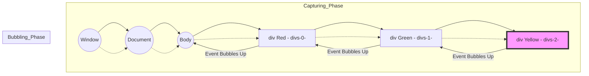

```js
 var divs = document.getElementsByClassName("myClass");
 var divs2 = document.querySelectorAll(".myClass");
 var newEle = document.createElement("div");
newEle.setAttribute("class","myClass");
 newEle.textContent = "hello new";
document.body.append(newEle);
```

### 1. الـ **Live Collection** vs. الـ **Static Collection**

الموضوع كله بيتلخص في "التفاعل مع التغيير".

- **`getElementsByClassName` (Live HTMLCollection):**
    
    ده بيرجع حاجة اسمها **HTMLCollection**. دي بنسميها "حية" (**Live**). يعني إيه؟ يعني الـ JavaScript بتفضل عاملة "علاقة حب" مستمرة مع الـ DOM. أي عنصر جديد يتضاف في الـ HTML واخد نفس الـ Class، الـ Collection دي بتحدث نفسها أوتوماتيكياً من غير ما تناديها تاني.
    
- **`querySelectorAll` (Static NodeList):**
    
    ده بيرجع **NodeList**. دي بنسميها "ثابتة" (**Static**). يعني هي بتصور الـ DOM "سيلفي" في اللحظة اللي ناديت فيها الـ Method. لو الـ DOM اتغير بعدها، الصورة (الـ NodeList) بتفضل زي ما هي، مش بتحس باللي حصل.
    

---

### 2. ليه بنستخدم دي وليه بنستخدم دي؟ (The Use Cases)

|**وجه المقارنة**|**getElementsByClassName**|**querySelectorAll**|
|---|---|---|
|**المرونة**|بتدور بالـ Class بس|بتدور بـ **CSS Selectors** (يعني تقدر تجيب ID مع Class مع Attribute)|
|**الأداء (Performance)**|أسرع بكتير (عشان متخصصة في حاجة واحدة)|أبطأ سنة (عشان بتعمل Parsing لـ Selector معقد)|
|**النوع المرتجع**|**HTMLCollection**|**NodeList**|
|**التعامل مع Array**|مفيش فيها `forEach` (لازم تحولها لـ Array)|فيها `forEach` مدمجة (Built-in)|

---

### 3. مثال عملي (السيناريو اللي أنت كتبته)

تخيل إنك بتعمل **To-Do List**.

JavaScript

```
// 1. هنجيب العناصر بطريقتين
var liveList = document.getElementsByClassName("task");
var staticList = document.querySelectorAll(".task");

console.log(liveList.length);   // هيديك مثلاً 2
console.log(staticList.length); // هيديك برضه 2

// 2. هنضيف Task جديدة للـ DOM
var newTask = document.createElement("div");
newTask.className = "task";
document.body.appendChild(newTask);

// 3. تعال نشوف الفرق دلوقتي
console.log(liveList.length);   // هتلاقيها بقت 3 (حست بالتغيير!)
console.log(staticList.length); // هتفضل 2 (نايمة في العسل)
```

---

### 4. أسئلة الإنترفيو (The Interview Trap) 🚩

دي الأسئلة اللي بسألها للناس عشان أعرف هما فاهمين **JS Engine** ولا لأ:

**س1: "لو عايز أعمل Loop على `HTMLCollection` باستخدام الـ `forEach` مباشرة، هل ينفع؟"**

- **الإجابة:** لأ، الـ `HTMLCollection` معندهاش `forEach`. لازم تحولها لـ Array حقيقية باستخدام `Array.from()` أو الـ **Spread Operator** `[...]`. لكن الـ `NodeList` اللي طالعة من `querySelectorAll` عندها `forEach` عادي.
    

**س2: "مين أسرع في الـ Performance؟ وليه؟"**

- **الإجابة:** الـ `getElementsByClassName` أسرع. ليه؟ لأن المتصفح مش محتاج "يفكر" في الـ CSS Selector، هو عنده فهرس جاهز للـ Classes فبيروح يجيبهم فوراً. الـ `querySelectorAll` لازم تعدي على **CSS Selector Engine** عشان تفهم أنت طالب إيه بالضبط.
    

**س3: "إيه المشكلة اللي ممكن تقابلني مع الـ Live Collection في الـ Loop؟"**

- **الإجابة (دي للمحترفين):** لو بتعمل Loop وبتمسح عناصر (مثلاً بتمسح كل اللي واخد Class معين)، الـ `length` بتاعت الـ `HTMLCollection` هتقل مع كل لفة، وده هيخلي الـ Loop "تخرف" وتفوت عناصر. في الحالة دي الـ Static Collection أضمن بكتير.
    

---

**عاش يا وحش، الكود الجاي إيه؟ ابعت لي الـ snippet اللي بعدها!**

**تحب المرة الجاية أشرح لك الفرق بين الـ `innerText` والـ `textContent` والـ `innerHTML` لو موجودين في الكود بتاعك؟**

---
## event life cycle : 
```js
divs[0].addEventListener("click",function(e){
    if(this===e.target){

        alert("hello iam red");
    }
    
})
divs[1].addEventListener("click",function(e){
    //  e.stopPropagation();
  if(this===e.target){
    alert("hello iam green");
    }
})
divs[2].addEventListener("click",function(e){
    //e.stopPropagation();
   alert("hello iam yellow");
});
```


## 1. إيه هو الـ Event Life Cycle؟

تخيل الـ **DOM** بتاعك عبارة عن طبقات فوق بعض (زي البصلة). لما بتدوس على عنصر جوه خالص، الـ **Event** مش بيظهر فجأة عند العنصر ده بس، لا.. ده بيمشي في رحلة. الرحلة دي 3 مراحل:

1. **Capturing Phase (Trickling):** الـ **Event** بينزل من الـ `window` والـ `document` لحد ما يوصل للعنصر اللي أنت دوست عليه (الـ **Target**).
    
2. **Target Phase:** الـ **Event** بيوصل للعنصر اللي حصل عليه الـ **Action** فعلياً.
    
3. **Bubbling Phase:** الـ **Event** بيبدأ "يفرقع" ويطلع لفوق تاني من الـ **Target** لحد الـ `window` (زي فقاقيع الهواء تحت المية).
    

---

## 2. توضيح الكود بتاعك (The Logic)

أنت كاتب حتة "صايعة" في الكود بتاعك وهي `if(this === e.target)`. تعال نعرف ليه دي بتغير اللعبة:

### الـ `e.target` vs الـ `this` (أو `e.currentTarget`)

- **`e.target`:** ده العنصر اللي "إيدك لمسته" فعلياً (The origin of the event).
    
- **`this` أو `e.currentTarget`:** ده العنصر اللي "متركب عليه" الـ **Listener** دلوقتي والـ **Event** بيعدي عليه حالياً.
    

**ليه أنت عملت الـ `if` دي؟**

عشان تمنع الـ **Event** إنه يتنفذ لو جاي من "فقاعة" (Bubbling) من عنصر جوه. أنت بتقول للـ JavaScript: "يا جافاسكربت، متنفذيش الـ `alert` دي إلا لو أنا دوست على الـ `div` ده بالذات، مش لو دوست على ابن من أبناؤه والـ **Event** سمع عندي".

### الـ `stopPropagation()`

لو شلت الكومنت من عليها، أنت كدة بتقول للـ **Event**: "استوب! متكملش رحلة الـ **Bubbling** لفوق". وده بيقطع الطريق على أي **Parent** مستني الـ **Event** ده.

---

## 3. الـ Mermaid Diagram (خريطة الرحلة)

عشان تتخيل الـ **Propagation** والفرق بين اللي أنت عملته والوضع العادي:




---

## 4. أسئلة إنترفيو "للتنانين" فقط 🐉

بص يا وحش، لما تقعد قدامي في إنترفيو، هسألك الأسئلة دي عشان أعرف أنت فاهم ولا حافظ:

**س1: إزاي أخلي الـ `addEventListener` يشتغل في الـ Capturing Phase مش الـ Bubbling؟**

- **الإجابة:** الـ `addEventListener` بتاخد **Third Argument** اختيارية اسمها `useCapture` (بوليان). لو بعت لها `true` هينفذ الـ **Function** وهي نازلة (Capturing)، الديفولت بتاعها `false` (يعني Bubbling).
    

**س2: إيه الفرق الجوهري بين `e.target` و `e.currentTarget`؟**

- **الإجابة:** الـ `target` هو اللي بدأ الحفلة (المكان اللي اتداس عليه)، أما الـ `currentTarget` هو المكان اللي الـ **Event Handler** مربوط فيه دلوقتي. (دي أهم حتة في الإنترفيو).
    

**س3: إيه هو الـ Event Delegation؟ وليه هو أحسن للأداء (Performance)؟**

- **الإجابة:** بدل ما أحط **Listener** على كل `li` جوه `ul` (وده بياخد رامات كتير)، أنا بحط **Listener** واحد بس على الـ `ul` (الـ Parent) وبستخدم الـ **Bubbling** عشان أعرف أنهي `li` اللي اتداس عليها عن طريق الـ `e.target`.
    

**س4: هل كل الـ Events بيحصلها Bubbling؟**

- **الإجابة:** لا! في **Events** مش بتعمل **Bubble** زي `focus`, `blur`, `mouseenter`, و `mouseleave`. ودي معلومة "سينيورز" أوي.
    

---

لما تيجي تمنع الـ **Event** إنه يتنفذ على العناصر الأب، فكر الأول: هل محتاج `e.stopPropagation()` (عشان تمنع الـ Event يوصل فوق خالص) ولا محتاج `if(e.target === e.currentTarget)` (عشان تضمن إن الكود يتنفذ لما تدوس على العنصر نفسه بس)؟

الخيار الثاني "أنضف" لأنه مش بيكسر الـ **Propagation** لباقي الـ **App** لو في حاجة تانية محتاجة تسمع الـ **Event**.

---


---
## bom
![[Pasted image 20260205044047.png]]Bom has objects regardless the window object and they are :
navigator , location , history , document .

---
## 1- window object 

![[Pasted image 20260205044303.png]]

