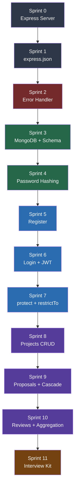

# FreelanceFlow — Learning Journey Index

> هذا الملف هو الـ roadmap الكامل للـ learning journey.
> كل sprint يبني على اللي قبله — الترتيب مهم.

---

## الملفات

- **Part A** — Sprints 0 → 4 (الـ Foundation)
- **Part B** — Sprints 5 → 11 (الـ Application + Interview)

---

## الـ Roadmap

| Sprint | السؤال اللي بيجاوب عليه | الـ Concept | الملف |
|--------|--------------------------|-------------|-------|
| **0** | ليه محتاج server أصلاً؟ | Express + dotenv + app.listen | Part A |
| **1** | ليه req.body فاضي؟ | express.json middleware | Part A |
| **2** | ليه السيرفر بيـcrash من غير تحذير؟ | AppError + Global Error Handler | Part A |
| **3** | فين بيتحفظ الداتا؟ | MongoDB + Mongoose Schema + Model | Part A |
| **4** | ليه الـ password خطر كده في الـ DB؟ | bcrypt + pre-save Hook | Part A |
| **5** | إزاي نبني Register endpoint حقيقي؟ | MVC + catchAsync + Router | Part B |
| **6** | إزاي السيرفر يتذكر مين أنت؟ | JWT + Stateless Auth + Login | Part B |
| **7** | إزاي نحمي الـ routes؟ | protect middleware + restrictTo | Part B |
| **8** | إزاي نبني CRUD كامل؟ | Projects + Soft Delete + populate | Part B |
| **9** | إزاي حاجة بتحصل تلقائياً؟ | Proposals + Cascade Hook | Part B |
| **10** | إزاي نحسب إحصائيات؟ | Reviews + Aggregation Pipeline | Part B |
| **11** | إزاي أجاوب في الـ interview؟ | Interview Kit + Checklist | Part B |

---

## خريطة الـ Concepts

```
Express Server (Sprint 0)
    └── Middleware Pipeline (Sprint 1)
            └── Error Handling (Sprint 2)
                    └── Database Layer (Sprint 3)
                            └── Data Security (Sprint 4)
                                    └── Auth System (Sprints 5, 6, 7)
                                                └── Business Logic (Sprints 8, 9, 10)
```

---

## اللي بيتبنى فوق بعض



---

## الـ Files بتاعت الـ Project في نهاية كل Sprint

| Sprint | الملفات الجديدة |
|--------|----------------|
| 0 | `server.js` · `.env` |
| 1 | `server.js` (updated) |
| 2 | `src/utils/AppError.js` · `src/middlewares/errorHandler.js` |
| 3 | `src/models/User.model.js` |
| 4 | `src/models/User.model.js` (updated — hook + select:false) |
| 5 | `src/utils/catchAsync.js` · `src/controllers/auth.controller.js` · `src/routes/auth.routes.js` · `app.js` |
| 6 | `src/controllers/auth.controller.js` (updated — login + JWT) · `src/routes/auth.routes.js` (updated) |
| 7 | `src/middlewares/auth.middleware.js` · `src/middlewares/errorHandler.js` (updated) |
| 8 | `src/models/Project.model.js` · `src/controllers/project.controller.js` · `src/routes/project.routes.js` |
| 9 | `src/models/Proposal.model.js` · `src/controllers/proposal.controller.js` · `src/routes/proposal.routes.js` |
| 10 | `src/models/Review.model.js` · `src/controllers/review.controller.js` · `src/routes/review.routes.js` |

---

## Final Folder Structure

```
freelance-flow/
├── src/
│   ├── controllers/
│   │   ├── auth.controller.js
│   │   ├── project.controller.js
│   │   ├── proposal.controller.js
│   │   └── review.controller.js
│   ├── middlewares/
│   │   ├── auth.middleware.js
│   │   └── errorHandler.js
│   ├── models/
│   │   ├── User.model.js
│   │   ├── Project.model.js
│   │   ├── Proposal.model.js
│   │   └── Review.model.js
│   ├── routes/
│   │   ├── auth.routes.js
│   │   ├── project.routes.js
│   │   ├── proposal.routes.js
│   │   └── review.routes.js
│   └── utils/
│       ├── AppError.js
│       └── catchAsync.js
├── app.js
├── server.js
└── .env
```
