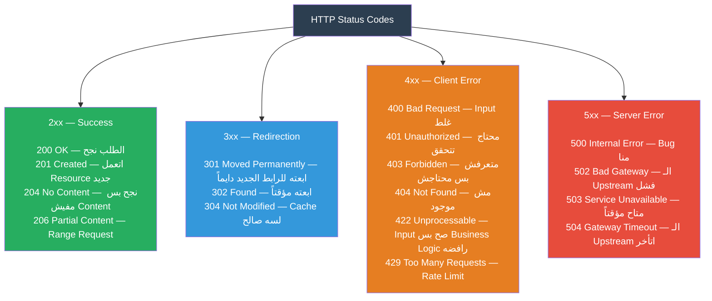
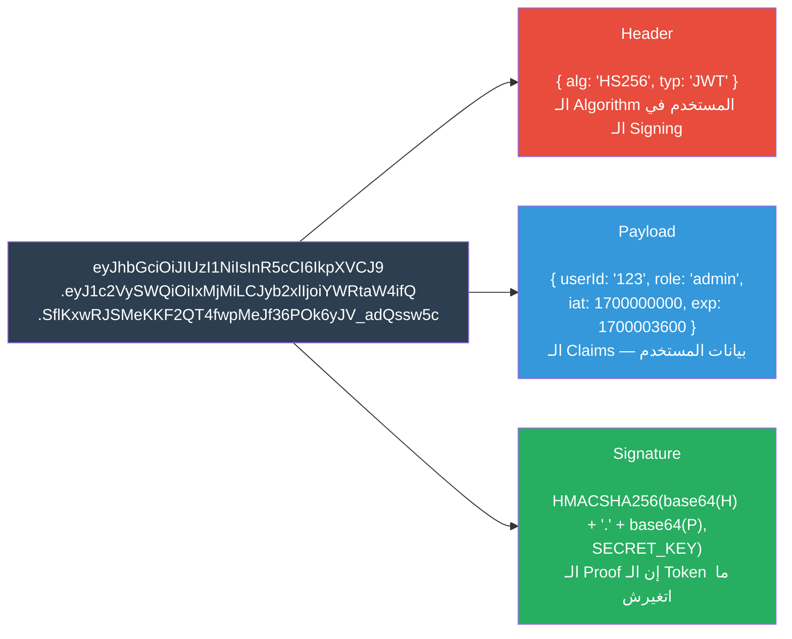
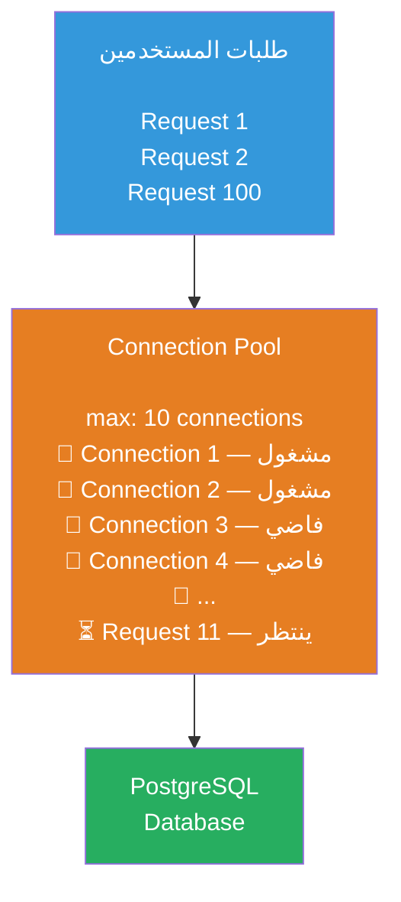
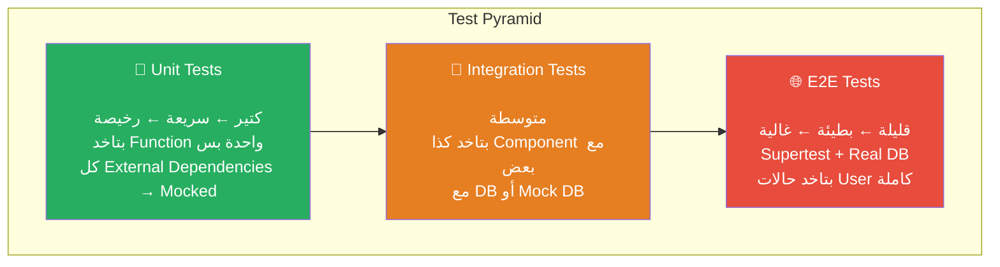
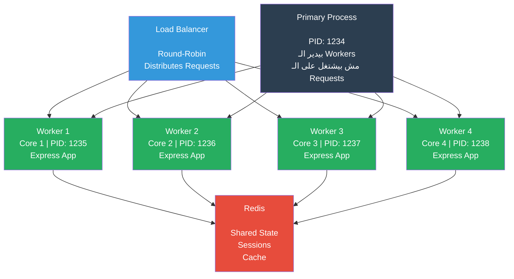
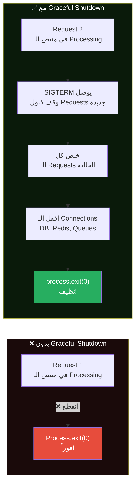
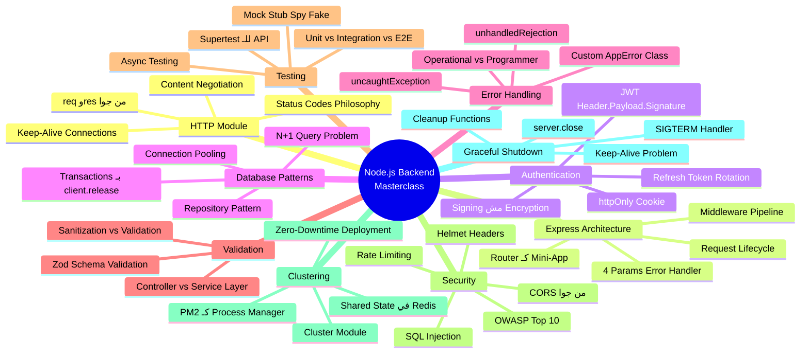

# 🚀 Node.js Backend Masterclass: من الـ HTTP لـ Production

> **الهدف من الملف ده:** إنك تفهم كل طبقة في الـ Backend من الـ HTTP Module الخام، لحد الـ Graceful Shutdown. لما تخلص الملف ده، هتبص على أي Express App وتعرف بالظبط إيه اللي بيحصل تحت الكبوت — من اللحظة اللي الـ Request دخل، للحظة اللي الـ Response خرج.

---

## الفهرس

1. [HTTP Module Deep Dive — قبل Express بكتير](#1-http-module-deep-dive)
2. [Express.js Architecture — إزاي بيشتغل فعلاً](#2-expressjs-architecture)
3. [Authentication & Authorization — JWT من جوا](#3-authentication--authorization)
4. [Database Patterns in Node.js — كود الـ DB الصح](#4-database-patterns-in-nodejs)
5. [Centralized Error Handling — ما تحطش try/catch في كل حتة](#5-centralized-error-handling)
6. [Validation Patterns — الـ Input الوسخ](#6-validation-patterns)
7. [Testing in Node.js — الكود اللي بيتأكد من نفسه](#7-testing-in-nodejs)
8. [Security Essentials — OWASP المبسط](#8-security-essentials)
9. [Clustering & Horizontal Scaling — أكتر من Core](#9-clustering--horizontal-scaling)
10. [Graceful Shutdown — إزاي تموت صح](#10-graceful-shutdown)
11. [Interview Survival Kit 🎯](#11-interview-survival-kit)

---

## 1. HTTP Module Deep Dive

### قبل ما تستخدم Express، لازم تفهم اللي تحته

الـ Express مش "magic" — هو Wrapper ذكي حوالين الـ `http` module الـ built-in. لما بتعمل `app.listen(3000)`، ده بيتحول في النهاية لـ `http.createServer().listen(3000)`. فاهم الـ `http` module يعني عارف Express من جوا.

### الـ req و res من جوا

```javascript
const http = require('http');

const server = http.createServer((req, res) => {
    // ── req هو IncomingMessage ────────────────────────────────
    console.log(req.method);        // "GET", "POST", "PUT", "DELETE"
    console.log(req.url);           // "/api/users?page=2&limit=10"
    console.log(req.headers);       // { 'content-type': 'application/json', ... }
    console.log(req.httpVersion);   // "1.1" أو "2.0"

    // URL Parsing
    const { URL } = require('url');
    const parsedUrl = new URL(req.url, `http://${req.headers.host}`);
    console.log(parsedUrl.pathname);                   // "/api/users"
    console.log(parsedUrl.searchParams.get('page'));   // "2"

    // Body القراءة — req هو Readable Stream!
    let body = '';
    req.on('data', chunk => {
        body += chunk.toString();  // chunk هو Buffer
    });
    req.on('end', () => {
        const data = JSON.parse(body);  // بعد ما كل الـ Data وصلت
        console.log(data);
    });

    // ── res هو ServerResponse ─────────────────────────────────
    res.statusCode = 200;
    res.setHeader('Content-Type', 'application/json');
    res.setHeader('X-Custom-Header', 'my-value');

    // الفرق بين write و end
    res.write('part 1');  // بيبعت chunk بدون ما يقفل الـ Connection
    res.write('part 2');
    res.end('done');       // بيبعت آخر chunk ويقفل الـ Connection
    // أو:
    res.end(JSON.stringify({ message: "ok" }));
});

server.listen(3000);
```

### Status Codes Philosophy — ليه الكود ده وهو مش ده؟

الـ HTTP Status Codes مش أرقام عشوائية. عندهم منطق:



```javascript
// ── الفلسفة الصح للـ Status Codes ──────────────────────────────

// ❌ غلط — بتستخدم 200 لكل حاجة
app.post('/users', (req, res) => {
    const user = createUser(req.body);
    res.status(200).json({ user }); // ← 200؟ بس انت خلقت حاجة جديدة!
});

// ✅ صح
app.post('/users', (req, res) => {
    const user = createUser(req.body);
    res.status(201).json({ user }); // ← 201 = تم الإنشاء

    // 201 بيقول للـ Client "فيه Resource جديد" — وغالباً بترجع Location header
    res.setHeader('Location', `/users/${user.id}`);
});

// ❌ غلط — 401 vs 403
app.get('/admin', (req, res) => {
    if (!req.user) {
        res.status(403).json({ error: "Access denied" }); // ← 403؟ بس انت مش متحقق
    }
});

// ✅ صح
// 401 = "مش عارف مين انت" (محتاج Login)
// 403 = "عارف مين انت بس مش مسموحلك" (Authorized بس مش عنده Permission)
app.get('/admin', authMiddleware, (req, res) => {
    if (!req.user.isAdmin) {
        res.status(403).json({ error: "هذه المنطقة للمشرفين فقط" }); // ← 403 صح
    }
});

app.get('/dashboard', (req, res) => {
    if (!req.user) {
        res.status(401).json({ error: "يرجى تسجيل الدخول" }); // ← 401 صح
    }
});
```

### Headers Management — مش بس Content-Type

```javascript
// ── Request Headers المهمة اللي لازم تعرفها ──────────────────

// Content-Type: نوع الـ Body اللي الـ Client بعته
req.headers['content-type'];  // 'application/json', 'multipart/form-data', ...

// Authorization: الـ Token أو الـ Credentials
req.headers['authorization'];  // 'Bearer eyJhbG...' أو 'Basic dXNl...'

// Accept: الـ Client عايز الرد بأي نوع
req.headers['accept'];  // 'application/json', 'text/html', '*/*'

// Accept-Encoding: Compression المدعومة
req.headers['accept-encoding'];  // 'gzip, deflate, br'

// X-Forwarded-For: لو فيه Proxy أو Load Balancer
req.headers['x-forwarded-for'];  // "192.168.1.1, 10.0.0.1"

// If-None-Match: للـ Conditional Requests والـ Caching
req.headers['if-none-match'];  // "abc123" (ETag قديم)

// ── Response Headers المهمة ──────────────────────────────────
res.setHeader('Content-Type', 'application/json; charset=utf-8');
res.setHeader('Cache-Control', 'public, max-age=3600');  // كاش لساعة
res.setHeader('ETag', '"abc123"');                        // للـ Conditional Requests
res.setHeader('X-RateLimit-Limit', '100');                // Rate Limiting
res.setHeader('X-RateLimit-Remaining', '95');
res.setHeader('Retry-After', '60');                       // لو Rate Limited
```

### Content Negotiation — الـ Client بيطلب إيه؟

```javascript
// ── Content Negotiation: بترجعله HTML ولا JSON؟ ──────────────
const http = require('http');

const server = http.createServer((req, res) => {
    const accept = req.headers['accept'] || '*/*';
    
    const userData = { id: 1, name: "Ahmed", role: "admin" };
    
    if (accept.includes('application/json')) {
        res.setHeader('Content-Type', 'application/json');
        res.end(JSON.stringify(userData));
    } else if (accept.includes('text/html')) {
        res.setHeader('Content-Type', 'text/html');
        res.end(`<h1>${userData.name}</h1><p>Role: ${userData.role}</p>`);
    } else if (accept.includes('text/plain')) {
        res.setHeader('Content-Type', 'text/plain');
        res.end(`Name: ${userData.name}, Role: ${userData.role}`);
    } else {
        res.statusCode = 406; // 406 Not Acceptable
        res.end('لا يمكن تقديم المحتوى بالصيغة المطلوبة');
    }
});

// Express بيعمل نفس الكلام بطريقة أنيقة:
app.get('/user', (req, res) => {
    res.format({
        'application/json': () => res.json(userData),
        'text/html':        () => res.send(`<h1>${userData.name}</h1>`),
        'default':          () => res.status(406).send('Not Acceptable'),
    });
});
```

### Keep-Alive Connections — مش Connection جديد مع كل Request

```javascript
// ── Keep-Alive: إزاي بيشتغل ──────────────────────────────────
// في HTTP/1.0، كل Request = TCP Connection جديدة (TCP Handshake تقيل!)
// في HTTP/1.1، الـ Connection بيفضل مفتوح بالـ Default

const server = http.createServer((req, res) => {
    // Persistent Connection — نفس الـ TCP Socket لكذا Request
    console.log(req.headers['connection']); // 'keep-alive' في HTTP/1.1

    res.setHeader('Connection', 'keep-alive');
    res.setHeader('Keep-Alive', 'timeout=5, max=100');
    // timeout=5: اقفل الـ Connection لو مفيش Request لـ 5 ثواني
    // max=100: بعد 100 Request، اقفل الـ Connection
    
    res.end('ok');
});

// ── Server Timeout Settings ───────────────────────────────────
server.keepAliveTimeout = 65000;  // 65 ثانية — أطول من الـ LB بشوية
server.headersTimeout = 66000;    // لازم أكبر من keepAliveTimeout

// ليه 65 ثانية؟ لأن AWS ELB بيقفل الـ Connection بعد 60 ثانية
// لو السيرفر بتاعك يقفل قبل الـ LB → 502 Gateway Error!
```

---

## 2. Express.js Architecture

### الـ Express مش Framework — هو Middleware Pipeline

الفكرة الجوهرية في Express إنه **سلسلة من الـ Middleware Functions**. كل Function بتاخد `(req, res, next)` وبتعمل حاجة وبعدين يا بتبعت Response يا بتنادي `next()` عشان يكمل للـ Middleware الجاي.

```mermaid
graph LR
    REQ["HTTP Request<br/>POST /api/users"]
    
    M1["Logger Middleware<br/>يسجل الـ Request"]
    M2["JSON Parser<br/>يحلل الـ Body"]
    M3["Auth Middleware<br/>يتحقق من الـ Token"]
    M4["Rate Limiter<br/>يحسب الـ Requests"]
    M5["Route Handler<br/>يعالج الـ Business Logic"]
    M6["Error Handler<br/>4 Parameters"]
    
    RES["HTTP Response<br/>201 Created"]
    
    REQ --> M1
    M1 -->|"next()"| M2
    M2 -->|"next()"| M3
    M3 -->|"next()"| M4
    M4 -->|"next()"| M5
    M5 -->|"next(err)"| M6
    M5 --> RES
    M6 --> RES
    
    style REQ fill:#2c3e50,color:#fff
    style RES fill:#27ae60,color:#fff
    style M3 fill:#e67e22,color:#fff
    style M6 fill:#e74c3c,color:#fff
```



### بناء Express من الصفر للفهم

```javascript
// ── إزاي Express بيشتغل — من غير ما تستخدمه ─────────────────
function createApp() {
    const middlewares = [];
    
    function use(path, fn) {
        if (typeof path === 'function') {
            fn = path;
            path = '/';
        }
        middlewares.push({ path, fn });
    }
    
    function handleRequest(req, res) {
        let index = 0;
        
        function next(err) {
            const middleware = middlewares[index++];
            if (!middleware) return; // انتهت السلسلة
            
            // لو فيه Error، ابحث عن Error Handler (4 params)
            if (err) {
                if (middleware.fn.length === 4) {
                    middleware.fn(err, req, res, next);
                } else {
                    next(err); // Skip العادي
                }
                return;
            }
            
            // تحقق من الـ Path
            if (!req.url.startsWith(middleware.path)) {
                return next();
            }
            
            try {
                middleware.fn(req, res, next);
            } catch (error) {
                next(error); // بيمسك الـ Sync Errors
            }
        }
        
        next();
    }
    
    return { use, handleRequest };
}

// الاستخدام — زي Express بالظبط!
const app = createApp();

app.use((req, res, next) => {
    console.log(`${req.method} ${req.url}`);
    next();
});

app.use('/api', (req, res, next) => {
    req.apiVersion = 'v1';
    next();
});

app.use((req, res) => {
    res.end('Hello!');
});
```

### الـ Request Lifecycle الكامل في Express

```javascript
// ── متابعة Request من الأول للآخر ───────────────────────────
const express = require('express');
const app = express();

// ── Level 1: Application-level Middleware ─────────────────────
// بيشتغل على كل Request بدون استثناء
app.use((req, res, next) => {
    req.requestId = crypto.randomUUID();  // ID فريد لكل Request
    req.startTime = Date.now();
    console.log(`[${req.requestId}] ${req.method} ${req.url} — started`);
    next();
});

app.use(express.json({ limit: '10mb' }));  // Parse Body
app.use(express.urlencoded({ extended: true }));

// ── Level 2: Router-level Middleware ─────────────────────────
// بيشتغل على Prefix معين بس
const apiRouter = express.Router();

// Middleware على الـ Router كله
apiRouter.use((req, res, next) => {
    console.log(`[API Router] ${req.method} ${req.path}`);
    next();
});

// ── Level 3: Route-specific Middleware ──────────────────────
// بيشتغل على Route معينة بس
const authMiddleware = (req, res, next) => {
    const token = req.headers.authorization?.split(' ')[1];
    if (!token) return res.status(401).json({ error: 'No token' });
    req.user = verifyToken(token);
    next();
};

apiRouter.get('/protected', authMiddleware, (req, res) => {
    res.json({ user: req.user });
});

// ── Level 4: Route Handler ────────────────────────────────────
apiRouter.post('/users', async (req, res, next) => {
    try {
        const user = await userService.create(req.body);
        res.status(201).json(user);
    } catch (err) {
        next(err);  // ← دي مهمة جداً! مش throw — بنبعت للـ Error Handler
    }
});

app.use('/api', apiRouter);

// ── Level 5: 404 Handler ──────────────────────────────────────
app.use((req, res, next) => {
    res.status(404).json({ error: `الـ Route ${req.url} مش موجودة` });
});

// ── Level 6: Error Handler — 4 Parameters ─────────────────────
// Express بيعرفه كـ Error Handler من وجود 4 Parameters!
app.use((err, req, res, next) => {
    console.error(`[${req.requestId}] Error:`, err);
    
    const statusCode = err.statusCode || 500;
    res.status(statusCode).json({
        error: err.message,
        requestId: req.requestId,
    });
});
```

### الـ Router كـ Mini-App

```javascript
// ── الـ Router بيخليك تقسم الـ App لـ Modules منفصلة ──────────

// users.router.js
const router = express.Router();

// الـ params بتاعة الـ Router متاحة في كل الـ Routes
router.param('userId', async (req, res, next, userId) => {
    try {
        const user = await User.findById(userId);
        if (!user) return res.status(404).json({ error: 'User not found' });
        req.targetUser = user;  // بيحطه في الـ req عشان الـ Handlers التانية تستخدمه
        next();
    } catch (err) {
        next(err);
    }
});

router.get('/', async (req, res, next) => {
    try {
        const users = await User.findAll(req.query);
        res.json(users);
    } catch (err) { next(err); }
});

router.get('/:userId', (req, res) => {
    res.json(req.targetUser);  // جاهز من الـ param middleware
});

router.put('/:userId', authMiddleware, async (req, res, next) => {
    try {
        const updated = await req.targetUser.update(req.body);
        res.json(updated);
    } catch (err) { next(err); }
});

router.delete('/:userId', authMiddleware, adminMiddleware, async (req, res, next) => {
    try {
        await req.targetUser.delete();
        res.status(204).end();  // 204 No Content — نجح ومفيش Body
    } catch (err) { next(err); }
});

module.exports = router;

// app.js
const usersRouter = require('./users.router');
app.use('/api/users', usersRouter);
// الـ Routes بتبقى:
// GET    /api/users
// GET    /api/users/:userId
// PUT    /api/users/:userId
// DELETE /api/users/:userId
```

### الـ 4 Parameters Trick — Error Handling Middleware

```javascript
// ── ليه لازم 4 Parameters بالظبط؟ ───────────────────────────

// Express بيستخدم fn.length (عدد الـ Parameters) عشان يفرق
// بين الـ Normal Middleware والـ Error Handler

// Normal Middleware — 3 Parameters
app.use((req, res, next) => { /* ... */ });

// Error Handler — 4 Parameters (err أول حاجة!)
app.use((err, req, res, next) => { /* ... */ });

// ❌ ده مش Error Handler رغم إن فيه err في جسمه
app.use((req, res, next) => {
    // Express مش هيبعتهوله الـ Errors!
});

// ── Error Handler الاحترافي ──────────────────────────────────
app.use((err, req, res, next) => {
    // لو الـ Response اتبعتت خلاص — مش نقدر نبعت تاني
    if (res.headersSent) {
        return next(err);  // بنمررها للـ Express default handler
    }

    // Logging
    const statusCode = err.isOperational ? err.statusCode : 500;
    const message    = err.isOperational ? err.message : 'Internal Server Error';

    if (!err.isOperational) {
        // Programmer Error — لازم نعرف بيه فوراً!
        console.error('CRITICAL ERROR:', err);
        // ابعت Alert لـ Sentry/Datadog هنا
    }

    res.status(statusCode).json({
        status: 'error',
        message,
        ...(process.env.NODE_ENV === 'development' && { stack: err.stack }),
    });
});
```

---

## 3. Authentication & Authorization

### JWT من جوا — مش بس Base64

الـ JWT (JSON Web Token) اسمه "Bearer Token" — يعني اللي شايله هو صاحبه. لازم تفهم التركيب الداخلي عشان تعمل Security Decisions صح.



### Signing vs Encryption — فرق جوهري

```javascript
// ── Signing (ما JWT بيعمله) ───────────────────────────────────
// الـ Header والـ Payload: مش مشفرين! مجرد Base64 Encoded
// يعني أي حد يقدر يقرأهم!

const token = 'eyJhbGciOiJIUzI1NiJ9.eyJ1c2VySWQiOiIxMjMifQ.xxx';
const [header, payload, signature] = token.split('.');

// أي حد يقدر يعمل ده:
const decodedPayload = JSON.parse(Buffer.from(payload, 'base64').toString());
console.log(decodedPayload); // { userId: "123" }

// بس مش يقدر يغير الـ Payload من غير ما يكتشف — عشان الـ Signature!
// لو غير الـ Payload: الـ Signature القديمة مش هتتطابق مع الـ Payload الجديد

// ── ليه ده مهم؟ ────────────────────────────────────────────────
// ← مبتحطش Sensitive Data في الـ JWT! (Password, Credit Card, SSN)
// ← الـ Payload بيتبان لأي حد عنده الـ Token
// ← الـ Signing بس بيضمن إن الـ Token ما اتعدلش

// ── لو عايز Confidentiality: استخدم JWE مش JWT ─────────────────
// أو شفّر الـ Sensitive Fields يدوياً قبل تحطهم في الـ Payload
```

```javascript
// ── بناء Authentication System كامل ─────────────────────────
const jwt = require('jsonwebtoken');
const bcrypt = require('bcrypt');

const JWT_SECRET     = process.env.JWT_SECRET;         // مش hardcode!
const JWT_EXPIRES    = '15m';                           // Access Token: قصير
const REFRESH_SECRET = process.env.REFRESH_SECRET;     // مختلف عن الـ JWT_SECRET!
const REFRESH_EXPIRES= '7d';                            // Refresh Token: طويل

// ── Login ────────────────────────────────────────────────────
async function login(email, password) {
    const user = await User.findByEmail(email);
    if (!user) throw new AppError('بيانات خاطئة', 401);

    const isValid = await bcrypt.compare(password, user.passwordHash);
    if (!isValid) throw new AppError('بيانات خاطئة', 401);
    // ← لاحظ نفس الـ Message — ما نقولش "المستخدم مش موجود" ولا "كلمة السر غلط"
    // عشان نمنع User Enumeration Attack

    // Access Token — قصير الأجل
    const accessToken = jwt.sign(
        { userId: user.id, role: user.role },
        JWT_SECRET,
        { expiresIn: JWT_EXPIRES, issuer: 'my-api', audience: 'my-client' }
    );

    // Refresh Token — طويل الأجل، بيتخزن في الـ DB
    const refreshToken = jwt.sign(
        { userId: user.id, tokenVersion: user.tokenVersion },
        REFRESH_SECRET,
        { expiresIn: REFRESH_EXPIRES }
    );

    // خزن الـ Refresh Token في الـ DB عشان تقدر تلغيه
    await TokenStore.save({
        userId: user.id,
        refreshToken,
        expiresAt: new Date(Date.now() + 7 * 24 * 60 * 60 * 1000),
    });

    return { accessToken, refreshToken };
}

// ── Refresh Token Flow ────────────────────────────────────────
async function refreshTokens(refreshToken) {
    let payload;
    try {
        payload = jwt.verify(refreshToken, REFRESH_SECRET);
    } catch (err) {
        throw new AppError('Refresh Token غير صالح', 401);
    }

    // تحقق إن الـ Token موجود في الـ DB (ما اتلغاش)
    const stored = await TokenStore.findByToken(refreshToken);
    if (!stored) throw new AppError('Token تم إلغاؤه', 401);

    // تحقق من الـ Token Version (للـ Global Logout)
    const user = await User.findById(payload.userId);
    if (user.tokenVersion !== payload.tokenVersion) {
        throw new AppError('Token قديم', 401);
    }

    // عمل Rotate الـ Refresh Token (Refresh Token Rotation)
    await TokenStore.delete(refreshToken);
    return login(user.email, null);  // عمل Tokens جديدة
}

// ── Global Logout — كل الأجهزة ────────────────────────────────
async function logoutAll(userId) {
    await User.incrementTokenVersion(userId);  // بيبطل كل الـ Refresh Tokens
    await TokenStore.deleteAllForUser(userId);
}
```

### Token Storage — الـ XSS vs CSRF Tradeoff

```javascript
// ── خيارات تخزين الـ Token في الـ Client ─────────────────────

// 1. localStorage / sessionStorage
//    ❌ عرضة لـ XSS Attack!
//    لو في Script خبيثة على الصفحة → تقدر تسرق الـ Token
//    localStorage.getItem('token') → سهل جداً

// 2. httpOnly Cookie
//    ✅ محمي من XSS (JavaScript مش يقدر يقرأه)
//    ❌ عرضة لـ CSRF Attack (طلبات من موقع تاني)
//    الحل: CSRF Token

// ── الحل الأمثل: httpOnly Cookie + CSRF Token ──────────────────
app.post('/login', async (req, res) => {
    const { accessToken, refreshToken } = await login(req.body.email, req.body.password);

    // Refresh Token في httpOnly Cookie
    res.cookie('refreshToken', refreshToken, {
        httpOnly: true,           // لا JavaScript يقدر يقرأه
        secure: process.env.NODE_ENV === 'production',  // HTTPS بس
        sameSite: 'strict',       // مش بيتبعت مع Cross-Site Requests
        maxAge: 7 * 24 * 60 * 60 * 1000,  // 7 أيام
        path: '/api/auth/refresh',  // متاح بس على هذا الـ Path
    });

    // Access Token في الـ Response Body — الـ Client يحطه في الميموري
    res.json({ accessToken });
    // الـ Client بيخزن accessToken في State/Memory (مش localStorage!)
    // وبيبعته كـ Bearer Token في كل Request
});

// ── Auth Middleware ───────────────────────────────────────────
const authMiddleware = (req, res, next) => {
    const authHeader = req.headers.authorization;
    if (!authHeader?.startsWith('Bearer ')) {
        return res.status(401).json({ error: 'Token مطلوب' });
    }

    const token = authHeader.substring(7);
    try {
        const payload = jwt.verify(token, JWT_SECRET, {
            issuer: 'my-api',
            audience: 'my-client',
        });
        req.user = payload;
        next();
    } catch (err) {
        if (err.name === 'TokenExpiredError') {
            return res.status(401).json({ error: 'Token منتهي', code: 'TOKEN_EXPIRED' });
        }
        return res.status(401).json({ error: 'Token غير صالح' });
    }
};
```

### Session-based vs Token-based — متى تستخدم إيه؟

```javascript
// ── Session-based Authentication ──────────────────────────────
// الـ State بيتخزن على السيرفر — بيناسب Traditional Web Apps

const session = require('express-session');
const RedisStore = require('connect-redis').default;
const redis = require('redis');

const redisClient = redis.createClient({ url: process.env.REDIS_URL });

app.use(session({
    store: new RedisStore({ client: redisClient }),
    secret: process.env.SESSION_SECRET,
    name: 'sessionId',          // مش الـ default 'connect.sid'
    resave: false,
    saveUninitialized: false,
    cookie: {
        httpOnly: true,
        secure: true,
        sameSite: 'strict',
        maxAge: 30 * 60 * 1000,  // 30 دقيقة
    },
}));

// Login بـ Session
app.post('/login', async (req, res) => {
    const user = await authenticate(req.body);
    req.session.userId = user.id;
    req.session.role = user.role;
    res.json({ message: 'تم تسجيل الدخول' });
});

// الفرق الجوهري:
// Session: الـ State على السيرفر — بتقدر تلغي فوراً
// JWT:     الـ State على الـ Client — مش تقدر تلغيه قبل ما يخلص
```

| الميزة | Session | JWT |
|---------|---------|-----|
| تلغيه فوراً؟ | ✅ نعم | ❌ مش بسهولة |
| Stateless؟ | ❌ محتاج Storage | ✅ نعم |
| Horizontal Scaling؟ | محتاج Redis Shared Store | ✅ سهل |
| Payload Limit؟ | ✅ لا حد | ❌ الـ Cookie محدود |
| مناسب لـ | Traditional Web Apps | SPAs, Mobile, Microservices |

---

## 4. Database Patterns in Node.js

### Connection Pooling — ليه ومتى؟

```javascript
// ── المشكلة: Connection جديد مع كل Query ─────────────────────
// كل اتصال بـ PostgreSQL بياخد ~100-300ms
// لو عندك 100 Request في الثانية → 100 Connection Overhead!

// ── الحل: Connection Pool ──────────────────────────────────────
const { Pool } = require('pg');

const pool = new Pool({
    host:     process.env.DB_HOST,
    database: process.env.DB_NAME,
    user:     process.env.DB_USER,
    password: process.env.DB_PASSWORD,
    port:     5432,
    
    // الـ Pool Settings
    max: 10,              // أقصى عدد Connections
    idleTimeoutMillis: 30000,    // اقفل Connection مش بيتستخدم لـ 30s
    connectionTimeoutMillis: 2000, // لو ما لقيتش Connection في 2s → Error
    
    // Production Settings
    ssl: process.env.NODE_ENV === 'production' ? {
        rejectUnauthorized: true,
        ca: process.env.DB_SSL_CERT,
    } : false,
});

// فحص الـ Pool عند بداية التشغيل
pool.on('error', (err, client) => {
    console.error('Unexpected error on idle DB client', err);
});

// الاستخدام
async function getUser(id) {
    // Pool بياخد Connection من الـ Pool (أو بينتظر لو كلهم مشغولين)
    const { rows } = await pool.query(
        'SELECT * FROM users WHERE id = $1',
        [id]  // ← Parameterized Query — ضد SQL Injection
    );
    return rows[0];
    // Pool بيرجع الـ Connection أوتوماتيك بعد الـ Query
}
```



### Repository Pattern — فصل الـ DB عن الـ Business Logic

```javascript
// ── بدون Repository Pattern — Anti-Pattern ────────────────────
app.get('/users/:id', async (req, res) => {
    // الـ Business Logic والـ DB في نفس المكان!
    const { rows } = await pool.query('SELECT * FROM users WHERE id = $1', [req.params.id]);
    if (!rows[0]) return res.status(404).json({ error: 'Not found' });
    if (rows[0].role !== 'admin' && rows[0].id !== req.user.id) {
        return res.status(403).json({ error: 'Forbidden' });
    }
    res.json(rows[0]);
});
// مشكلة: لو بديت تعمل Unit Testing، لازم تـ mock الـ pool كمان

// ── مع Repository Pattern ─────────────────────────────────────
// user.repository.js
class UserRepository {
    constructor(pool) {
        this.pool = pool;
    }

    async findById(id) {
        const { rows } = await this.pool.query(
            'SELECT id, email, name, role, created_at FROM users WHERE id = $1 AND deleted_at IS NULL',
            [id]
        );
        return rows[0] || null;
    }

    async findByEmail(email) {
        const { rows } = await this.pool.query(
            'SELECT * FROM users WHERE email = $1',
            [email]
        );
        return rows[0] || null;
    }

    async create(userData) {
        const { rows } = await this.pool.query(
            `INSERT INTO users (email, name, password_hash, role)
             VALUES ($1, $2, $3, $4)
             RETURNING id, email, name, role, created_at`,
            [userData.email, userData.name, userData.passwordHash, userData.role || 'user']
        );
        return rows[0];
    }

    async update(id, updates) {
        // Dynamic Update Query
        const fields = Object.keys(updates);
        const values = Object.values(updates);
        const setClause = fields.map((f, i) => `${f} = $${i + 2}`).join(', ');
        
        const { rows } = await this.pool.query(
            `UPDATE users SET ${setClause}, updated_at = NOW() WHERE id = $1 RETURNING *`,
            [id, ...values]
        );
        return rows[0];
    }

    async softDelete(id) {
        await this.pool.query(
            'UPDATE users SET deleted_at = NOW() WHERE id = $1',
            [id]
        );
    }

    async findAll({ page = 1, limit = 20, role, search } = {}) {
        const offset = (page - 1) * limit;
        const conditions = ['deleted_at IS NULL'];
        const params = [];
        
        if (role) {
            params.push(role);
            conditions.push(`role = $${params.length}`);
        }
        if (search) {
            params.push(`%${search}%`);
            conditions.push(`(name ILIKE $${params.length} OR email ILIKE $${params.length})`);
        }
        
        const where = conditions.join(' AND ');
        params.push(limit, offset);
        
        const { rows } = await this.pool.query(
            `SELECT id, email, name, role, created_at
             FROM users WHERE ${where}
             ORDER BY created_at DESC
             LIMIT $${params.length - 1} OFFSET $${params.length}`,
            params
        );
        return rows;
    }
}

// user.service.js — Business Logic فقط
class UserService {
    constructor(userRepository) {
        this.userRepo = userRepository;  // Dependency Injection
    }

    async getUserProfile(requesterId, targetId) {
        const user = await this.userRepo.findById(targetId);
        if (!user) throw new AppError('المستخدم غير موجود', 404);
        
        // Business Rule: يقدر يشوف نفسه بس أو الـ Admin يشوف الكل
        if (requesterId !== targetId) {
            throw new AppError('غير مسموح', 403);
        }
        
        return user;
    }
}

// Testing بقى سهل جداً:
const mockRepo = {
    findById: jest.fn().mockResolvedValue({ id: '1', name: 'Test' }),
};
const service = new UserService(mockRepo);
```

### N+1 Query Problem — الكارثة الصامتة

```javascript
// ── N+1 Problem ────────────────────────────────────────────────
// بتجيب 10 Posts وبعدين لكل Post بتعمل Query للـ Author

// ❌ Anti-Pattern — N+1 Queries
async function getPostsBad() {
    const posts = await Post.findAll();  // Query 1 → 10 Posts
    
    // 10 Queries تانية! = 11 Query في المجموع
    for (const post of posts) {
        post.author = await User.findById(post.authorId);  // Query لكل Post
    }
    
    return posts;
}

// ✅ الحل: JOIN أو Batch Loading
// الحل 1: SQL JOIN
async function getPostsGood() {
    const { rows } = await pool.query(`
        SELECT 
            posts.id,
            posts.title,
            posts.content,
            posts.created_at,
            users.id     as author_id,
            users.name   as author_name,
            users.email  as author_email
        FROM posts
        JOIN users ON posts.author_id = users.id
        WHERE posts.deleted_at IS NULL
        ORDER BY posts.created_at DESC
    `);
    
    return rows.map(row => ({
        id: row.id,
        title: row.title,
        content: row.content,
        author: { id: row.author_id, name: row.author_name, email: row.author_email },
    }));
}

// الحل 2: Batch Loading (DataLoader Pattern — مشهور مع GraphQL)
async function getPostsWithBatching() {
    const posts = await Post.findAll();  // Query 1
    
    // جمع كل الـ authorIds الفريدة
    const authorIds = [...new Set(posts.map(p => p.authorId))];
    
    // Query 2 واحدة بس لكل الـ Authors
    const { rows: authors } = await pool.query(
        'SELECT * FROM users WHERE id = ANY($1)',
        [authorIds]
    );
    
    const authorMap = new Map(authors.map(a => [a.id, a]));
    
    return posts.map(post => ({
        ...post,
        author: authorMap.get(post.authorId),
    }));
}
```

### Transactions في Async Context

```javascript
// ── Transaction الصح في Node.js ───────────────────────────────
// المشكلة: كل Query بتاخد Connection مختلف من الـ Pool
// Transaction لازم تشتغل على نفس الـ Connection!

// ❌ غلط — Queries على Connections مختلفة
async function transferBad(fromId, toId, amount) {
    await pool.query('UPDATE accounts SET balance = balance - $1 WHERE id = $2', [amount, fromId]);
    // لو هنا حصل Error، الـ Query الأولى خلصت بس التانية ما حصلتش!
    await pool.query('UPDATE accounts SET balance = balance + $1 WHERE id = $2', [amount, toId]);
}

// ✅ صح — Transaction على نفس الـ Client
async function transfer(fromId, toId, amount) {
    const client = await pool.connect();  // احجز Connection مخصوص

    try {
        await client.query('BEGIN');  // بداية الـ Transaction

        // Check Balance
        const { rows: [account] } = await client.query(
            'SELECT balance FROM accounts WHERE id = $1 FOR UPDATE',  // Row-level Lock
            [fromId]
        );
        
        if (account.balance < amount) {
            throw new AppError('رصيد غير كافٍ', 400);
        }

        // Debit
        await client.query(
            'UPDATE accounts SET balance = balance - $1 WHERE id = $2',
            [amount, fromId]
        );

        // Credit
        await client.query(
            'UPDATE accounts SET balance = balance + $1 WHERE id = $2',
            [amount, toId]
        );

        // Log
        await client.query(
            'INSERT INTO transactions (from_id, to_id, amount) VALUES ($1, $2, $3)',
            [fromId, toId, amount]
        );

        await client.query('COMMIT');  // كل حاجة تمام — نكمّل

    } catch (err) {
        await client.query('ROLLBACK');  // فيه مشكلة — نرجع للأول
        throw err;
    } finally {
        client.release();  // أهم سطر! لو نسيته الـ Pool هيتملى وما فيش Connections
    }
}

// ── Utility Function للـ Transactions ─────────────────────────
async function withTransaction(pool, callback) {
    const client = await pool.connect();
    try {
        await client.query('BEGIN');
        const result = await callback(client);
        await client.query('COMMIT');
        return result;
    } catch (err) {
        await client.query('ROLLBACK');
        throw err;
    } finally {
        client.release();
    }
}

// الاستخدام
await withTransaction(pool, async (client) => {
    await client.query('UPDATE accounts SET balance = balance - $1 WHERE id = $2', [100, 'from']);
    await client.query('UPDATE accounts SET balance = balance + $1 WHERE id = $2', [100, 'to']);
});
```

---

## 5. Centralized Error Handling

### Custom Error Classes — اعمل نظام Errors محترم

```javascript
// ── Custom Error Classes ───────────────────────────────────────
// errors/AppError.js

class AppError extends Error {
    constructor(message, statusCode = 500, details = null) {
        super(message);
        
        this.statusCode = statusCode;
        this.status = statusCode >= 500 ? 'error' : 'fail';
        this.isOperational = true;  // ← Operational Error (متوقعة)
        this.details = details;
        this.timestamp = new Date().toISOString();
        
        // عشان الـ Stack Trace يبدأ من الـ AppError مش من الـ Error class
        Error.captureStackTrace(this, this.constructor);
    }
}

// Specialized Errors
class NotFoundError extends AppError {
    constructor(resource = 'المورد') {
        super(`${resource} غير موجود`, 404);
        this.name = 'NotFoundError';
    }
}

class ValidationError extends AppError {
    constructor(errors) {
        super('بيانات غير صالحة', 422, errors);
        this.name = 'ValidationError';
    }
}

class UnauthorizedError extends AppError {
    constructor(message = 'يرجى تسجيل الدخول') {
        super(message, 401);
        this.name = 'UnauthorizedError';
    }
}

class ForbiddenError extends AppError {
    constructor(message = 'غير مسموح بهذا الإجراء') {
        super(message, 403);
        this.name = 'ForbiddenError';
    }
}

class ConflictError extends AppError {
    constructor(message = 'يوجد تعارض في البيانات') {
        super(message, 409);
        this.name = 'ConflictError';
    }
}

module.exports = { AppError, NotFoundError, ValidationError, UnauthorizedError, ForbiddenError, ConflictError };
```

### Operational vs Programmer Errors

```javascript
// ── Operational Errors — متوقعة، بنتعامل معاها ──────────────────
// - User بعت Input غلط → ValidationError
// - Resource مش موجود → NotFoundError
// - DB Connection انقطع → AppError 503
// - Rate Limit اتعدى → AppError 429

// ── Programmer Errors — Bugs مش متوقعة ──────────────────────────
// - TypeError: Cannot read property of undefined
// - RangeError: Maximum call stack size exceeded
// - خطأ في Logic البرنامج

// ── Error Handler اللي بيفرق بينهم ──────────────────────────────
function errorHandler(err, req, res, next) {
    // Default values
    err.statusCode = err.statusCode || 500;
    err.status     = err.status || 'error';

    if (process.env.NODE_ENV === 'development') {
        // في Development: اعرض كل التفاصيل
        return res.status(err.statusCode).json({
            status:     err.status,
            message:    err.message,
            details:    err.details,
            stack:      err.stack,
            name:       err.name,
        });
    }

    // في Production
    if (err.isOperational) {
        // Operational Error — آمن نبعته للـ Client
        return res.status(err.statusCode).json({
            status:  err.status,
            message: err.message,
            ...(err.details && { details: err.details }),
        });
    }

    // Programmer Error — مش نعرّض التفاصيل!
    console.error('PROGRAMMER ERROR 💥:', err);
    // أبعت لـ Sentry / Datadog هنا

    return res.status(500).json({
        status:  'error',
        message: 'حدث خطأ داخلي، يرجى المحاولة مرة أخرى',
    });
}

// ── تحويل DB Errors لـ AppErrors ───────────────────────────────
function handleDatabaseError(err) {
    // PostgreSQL Error Codes
    if (err.code === '23505') {  // Unique Violation
        const field = err.detail?.match(/Key \((.+)\)/)?.[1] || 'field';
        return new ConflictError(`${field} مستخدم بالفعل`);
    }
    if (err.code === '23503') {  // Foreign Key Violation
        return new AppError('مرجع غير موجود', 400);
    }
    if (err.code === 'ECONNREFUSED') {
        return new AppError('تعذر الاتصال بقاعدة البيانات', 503);
    }
    return err;  // Unknown error — اتركه كما هو
}
```

### uncaughtException & unhandledRejection

```javascript
// ── آخر خط دفاع ────────────────────────────────────────────────
// process.js أو app.js

// Synchronous Errors اللي ما اتمسكتش
process.on('uncaughtException', (err) => {
    console.error('UNCAUGHT EXCEPTION! 💥 Server is shutting down...');
    console.error(err.name, err.message);
    
    // أبعت لـ Sentry قبل ما تقفل
    Sentry.captureException(err);
    
    // لازم تقفل! الـ Process في حالة غير معروفة
    process.exit(1);
    // PM2 أو Docker هيعمل Restart أوتوماتيك
});

// Unhandled Promise Rejections
process.on('unhandledRejection', (reason, promise) => {
    console.error('UNHANDLED REJECTION! 💥 Shutting down...');
    console.error('Promise:', promise);
    console.error('Reason:', reason);
    
    Sentry.captureException(reason);
    
    // اقفل الـ Server الأول وبعدين الـ Process
    server.close(() => {
        process.exit(1);
    });
});

// لاحظ الفرق:
// uncaughtException → اقفل فوراً (Synchronous crash)
// unhandledRejection → اقفل الـ Server الأول (Async context)
```

---

## 6. Validation Patterns

### Schema Validation — Zod في العصر الحديث

```javascript
// ── Zod vs Joi — اختيار الـ Library ──────────────────────────
// Joi: قديم، JavaScript فقط، واسع الانتشار
// Zod: حديث، TypeScript-first، Type inference مجاني

const { z } = require('zod');

// ── Schema Definitions ─────────────────────────────────────────
const CreateUserSchema = z.object({
    name: z.string()
           .min(2, 'الاسم يجب أن يكون حرفين على الأقل')
           .max(50, 'الاسم طويل جداً')
           .trim(),
    
    email: z.string()
            .email('البريد الإلكتروني غير صالح')
            .toLowerCase(),
    
    password: z.string()
               .min(8, 'كلمة المرور 8 أحرف على الأقل')
               .regex(/[A-Z]/, 'يجب أن تحتوي على حرف كبير')
               .regex(/[0-9]/, 'يجب أن تحتوي على رقم'),
    
    role: z.enum(['user', 'admin', 'moderator']).default('user'),
    
    age: z.number()
          .int('العمر يجب أن يكون رقماً صحيحاً')
          .min(18, 'يجب أن يكون عمرك 18 سنة أو أكثر')
          .max(120)
          .optional(),
    
    address: z.object({
        city:    z.string().min(2),
        country: z.string().length(2, 'استخدم كود الدولة مكون من حرفين'),
    }).optional(),
}).strict();  // مش بيسمح بـ Extra Fields

// Schema للـ Update — كل Fields اختيارية
const UpdateUserSchema = CreateUserSchema.partial().omit({ password: true });

// ── Middleware للـ Validation ──────────────────────────────────
const validate = (schema, source = 'body') => {
    return (req, res, next) => {
        try {
            // parse بيعمل Validation ويرجع البيانات المنظفة
            req[source] = schema.parse(req[source]);
            next();
        } catch (err) {
            if (err instanceof z.ZodError) {
                // تحويل Zod Errors لـ Format مقروء
                const errors = err.errors.map(e => ({
                    field:   e.path.join('.'),
                    message: e.message,
                }));
                return next(new ValidationError(errors));
            }
            next(err);
        }
    };
};

// الاستخدام
app.post('/users', validate(CreateUserSchema), createUserHandler);
app.put('/users/:id', validate(UpdateUserSchema), updateUserHandler);

// للـ Query Params
const PaginationSchema = z.object({
    page:   z.coerce.number().int().min(1).default(1),  // coerce: بيحول String لـ Number
    limit:  z.coerce.number().int().min(1).max(100).default(20),
    search: z.string().max(100).optional(),
    sort:   z.enum(['name', 'email', 'created_at']).default('created_at'),
    order:  z.enum(['asc', 'desc']).default('desc'),
});

app.get('/users', validate(PaginationSchema, 'query'), getUsersHandler);
```

### Input Sanitization vs Validation

```javascript
// ── الفرق بين Sanitization والـ Validation ──────────────────────
// Validation: "هل الـ Input صح؟" → مقبول أو مرفوض
// Sanitization: "نضف الـ Input عشان يبقى آمن" → تعديل وقبول

// Sanitization Examples:
const sanitizeHtml = require('sanitize-html');
const DOMPurify = require('isomorphic-dompurify');

// تنظيف HTML — منع XSS
function sanitizeUserContent(content) {
    return sanitizeHtml(content, {
        allowedTags: ['b', 'i', 'em', 'strong', 'a', 'p', 'br'],
        allowedAttributes: { 'a': ['href'] },
        allowedSchemes: ['https'],
    });
}

// تنظيف SQL (الحل الأصح هو Parameterized Queries!)
// ← لا تعتمد على Sanitization للـ SQL — استخدم Prepared Statements دايماً

// Trim والـ Case Normalization
const cleanedEmail = email.trim().toLowerCase();
const cleanedPhone  = phone.replace(/[\s\-\(\)]/g, '');  // 01234-567-890 → 01234567890

// ── Validation في الـ Controller vs Service ────────────────────
// Controller Layer: Validate الـ HTTP Input (format, required fields)
// Service Layer:    Validate الـ Business Rules

// Controller — Technical Validation
app.post('/orders', validate(CreateOrderSchema), async (req, res, next) => {
    try {
        // هنا بنعتمد إن الـ Input نظيف من الـ Schema
        const order = await orderService.create(req.body, req.user.id);
        res.status(201).json(order);
    } catch (err) { next(err); }
});

// Service — Business Validation
class OrderService {
    async create(orderData, userId) {
        // Business Rules
        const cart = await this.cartRepo.findByUser(userId);
        if (cart.items.length === 0) {
            throw new AppError('السلة فارغة', 400);  // Business Rule
        }

        const user = await this.userRepo.findById(userId);
        if (user.suspendedAt) {
            throw new ForbiddenError('حسابك معلق');  // Business Rule
        }

        const totalAmount = cart.items.reduce((sum, item) => sum + item.price * item.quantity, 0);
        if (totalAmount > user.creditLimit) {
            throw new AppError('الطلب يتجاوز الحد الائتماني', 400);  // Business Rule
        }

        return this.orderRepo.create({ ...orderData, userId, totalAmount });
    }
}
```

---

## 7. Testing in Node.js

### Test Pyramid — إزاي تقسم الـ Tests



### Test Doubles — Mock وStub والفرق بينهم

```javascript
// ── الـ 4 أنواع Test Double ──────────────────────────────────

// 1. STUB — بيرجع قيمة محددة من غير ما يعمل أي حاجة
const userRepoStub = {
    findById: async (id) => ({ id, name: 'Test User', role: 'user' }),
    // مش بيتحقق من إيه الـ Arguments — بيرجع نفس الإجابة دايماً
};

// 2. MOCK — بيتحقق إن الـ Function اتنادت بالـ Arguments الصح
const emailServiceMock = {
    sendWelcomeEmail: jest.fn(),  // بيتتبع كل الـ Calls
};

// بعد الـ Test:
expect(emailServiceMock.sendWelcomeEmail).toHaveBeenCalledTimes(1);
expect(emailServiceMock.sendWelcomeEmail).toHaveBeenCalledWith(
    'user@example.com',
    'Ahmed'
);

// 3. SPY — زي الـ Mock بس على Implementation حقيقية
const consoleSpy = jest.spyOn(console, 'error').mockImplementation(() => {});
// بيترقب الـ console.error من غير ما يطبع فعلاً

// 4. FAKE — Implementation مبسطة حقيقية عشان الـ Testing
class FakeUserRepository {
    constructor() {
        this.users = new Map();
    }
    
    async findById(id) {
        return this.users.get(id) || null;
    }
    
    async create(userData) {
        const user = { id: String(this.users.size + 1), ...userData };
        this.users.set(user.id, user);
        return user;
    }
    
    async findByEmail(email) {
        return [...this.users.values()].find(u => u.email === email) || null;
    }
}
// الـ Fake بيحتاج Implementation بس مش بيتصل بـ DB حقيقية
```

### Unit Testing المحترف

```javascript
// users.service.test.js
const { UserService } = require('./user.service');
const { NotFoundError, ForbiddenError } = require('./errors/AppError');

describe('UserService', () => {
    let userService;
    let mockUserRepo;
    
    beforeEach(() => {
        // نبني Mock جديد قبل كل Test عشان يكونوا مستقلين
        mockUserRepo = {
            findById:    jest.fn(),
            findByEmail: jest.fn(),
            create:      jest.fn(),
            update:      jest.fn(),
        };
        
        userService = new UserService(mockUserRepo);
    });

    describe('getUserProfile', () => {
        it('يجب أن يرجع profile المستخدم لو هو صاحبه', async () => {
            // Arrange
            const user = { id: '1', name: 'Ahmed', email: 'ahmed@test.com' };
            mockUserRepo.findById.mockResolvedValue(user);
            
            // Act
            const result = await userService.getUserProfile('1', '1');
            
            // Assert
            expect(result).toEqual(user);
            expect(mockUserRepo.findById).toHaveBeenCalledWith('1');
        });

        it('يجب يرمي NotFoundError لو المستخدم مش موجود', async () => {
            mockUserRepo.findById.mockResolvedValue(null);
            
            await expect(
                userService.getUserProfile('1', '99')
            ).rejects.toThrow(NotFoundError);
        });

        it('يجب يرمي ForbiddenError لو بيحاول يشوف profile حد تاني', async () => {
            const user = { id: '2', name: 'Other User' };
            mockUserRepo.findById.mockResolvedValue(user);
            
            await expect(
                userService.getUserProfile('1', '2')  // requester='1', target='2'
            ).rejects.toThrow(ForbiddenError);
        });

        it('يجب يعمل DB call مرة واحدة بس', async () => {
            mockUserRepo.findById.mockResolvedValue({ id: '1', name: 'Ahmed' });
            await userService.getUserProfile('1', '1');
            expect(mockUserRepo.findById).toHaveBeenCalledTimes(1);
        });
    });
});
```

### Integration & E2E Testing بـ Supertest

```javascript
// users.integration.test.js
const request = require('supertest');
const app = require('./app');
const { pool } = require('./db/pool');

describe('Users API Integration Tests', () => {
    let authToken;
    let testUser;
    
    beforeAll(async () => {
        // Setup: عمل User في الـ Test DB
        testUser = await createTestUser({ role: 'admin' });
        authToken = generateTestToken(testUser);
    });
    
    afterAll(async () => {
        // Cleanup
        await cleanupTestData();
        await pool.end();
    });
    
    afterEach(async () => {
        // امسح الـ Data اللي اتعملت في الـ Test
        await pool.query('DELETE FROM users WHERE email LIKE $1', ['%@test.com']);
    });

    describe('POST /api/users', () => {
        it('يجب ينشئ مستخدم جديد بنجاح', async () => {
            const userData = {
                name: 'Ahmed Test',
                email: 'ahmed@test.com',
                password: 'Password123!',
            };
            
            const response = await request(app)
                .post('/api/users')
                .set('Authorization', `Bearer ${authToken}`)
                .send(userData)
                .expect(201)
                .expect('Content-Type', /json/);
            
            expect(response.body).toMatchObject({
                name:  userData.name,
                email: userData.email,
            });
            expect(response.body).not.toHaveProperty('password');
            expect(response.headers.location).toMatch(/\/api\/users\/.+/);
        });

        it('يجب يرجع 422 لو الـ Input غلط', async () => {
            const response = await request(app)
                .post('/api/users')
                .set('Authorization', `Bearer ${authToken}`)
                .send({ name: 'A', email: 'invalid-email' })  // Invalid
                .expect(422);
            
            expect(response.body.details).toBeDefined();
            expect(response.body.details.length).toBeGreaterThan(0);
        });

        it('يجب يرجع 409 لو الـ Email مكرر', async () => {
            await createTestUser({ email: 'existing@test.com' });
            
            await request(app)
                .post('/api/users')
                .set('Authorization', `Bearer ${authToken}`)
                .send({ name: 'Test', email: 'existing@test.com', password: 'Pass123!' })
                .expect(409);
        });
    });
});
```

### Testing Async Code

```javascript
// ── Testing Async بطرق مختلفة ────────────────────────────────

// 1. async/await (الأوضح)
it('بيرجع البيانات الصح', async () => {
    const result = await userService.findById('1');
    expect(result.name).toBe('Ahmed');
});

// 2. لو محتاج تتحقق إن Error اتـthrow
it('بيرمي Error صح', async () => {
    await expect(userService.findById('999')).rejects.toThrow(NotFoundError);
    await expect(userService.findById('999')).rejects.toMatchObject({
        message: 'المستخدم غير موجود',
        statusCode: 404,
    });
});

// 3. Testing Timeouts والـ Delays
it('بيـcache النتيجة', async () => {
    jest.useFakeTimers();  // بيتحكم في الوقت
    
    await cacheService.set('key', 'value', { ttl: 60 });
    
    jest.advanceTimersByTime(61000);  // قدّم الوقت 61 ثانية
    
    const cached = await cacheService.get('key');
    expect(cached).toBeNull();  // انتهت صلاحيته
    
    jest.useRealTimers();
});

// 4. Testing Event Emitters
it('بيـemit الـ Event الصح', (done) => {
    const emitter = new OrderService();
    
    emitter.on('orderCreated', (order) => {
        expect(order.status).toBe('pending');
        done();  // ← لازم تنادي done عشان Jest يعرف خلصت
    });
    
    emitter.createOrder({ items: [] });
});
```

---

## 8. Security Essentials

### CORS من جوا — مش بس npm install cors

```javascript
// ── إيه هو CORS ──────────────────────────────────────────────
// CORS (Cross-Origin Resource Sharing) هو Browser Security Feature
// الـ Browser بيمنع بنفسه الـ AJAX Requests من Origin مختلف
// الـ Server بيقول "أنا موافق على المطلوب من هذا الـ Origin"

// ── CORS Middleware من الصفر ──────────────────────────────────
const ALLOWED_ORIGINS = [
    'https://myapp.com',
    'https://www.myapp.com',
    ...(process.env.NODE_ENV === 'development' ? ['http://localhost:3000', 'http://localhost:5173'] : []),
];

function corsMiddleware(req, res, next) {
    const origin = req.headers.origin;

    if (ALLOWED_ORIGINS.includes(origin)) {
        res.setHeader('Access-Control-Allow-Origin', origin);
        // لا تستخدم '*' مع Credentials!
    }

    // لو Request فيها Credentials (Cookies, Authorization)
    res.setHeader('Access-Control-Allow-Credentials', 'true');

    // الـ Headers المسموح بيها في الـ Request
    res.setHeader('Access-Control-Allow-Headers',
        'Content-Type, Authorization, X-Request-ID'
    );

    // الـ Methods المسموح بيها
    res.setHeader('Access-Control-Allow-Methods',
        'GET, POST, PUT, PATCH, DELETE, OPTIONS'
    );

    // كام ثانية الـ Browser يـcache الـ Preflight Response
    res.setHeader('Access-Control-Max-Age', '86400');  // 24 ساعة

    // الـ Preflight Request (OPTIONS) بيبعته الـ Browser أوتوماتيك
    if (req.method === 'OPTIONS') {
        return res.status(204).end();  // No Content — بس الـ Headers
    }

    next();
}
```

### Helmet — كل Header وليه

```javascript
const helmet = require('helmet');

// ── Helmet بيضيف Headers مهمة للـ Security ────────────────────
app.use(helmet({
    // Content-Security-Policy — يحدد من فين الـ Browser يحمّل Resources
    contentSecurityPolicy: {
        directives: {
            defaultSrc: ["'self'"],           // بس من نفس الـ Origin
            scriptSrc:  ["'self'", "'unsafe-inline'"],  // JavaScript
            styleSrc:   ["'self'", 'https://fonts.googleapis.com'],
            imgSrc:     ["'self'", 'data:', 'https://cdn.myapp.com'],
            connectSrc: ["'self'", 'https://api.myapp.com'],
        },
    },
    
    // X-Frame-Options — يمنع الـ Clickjacking
    frameguard: { action: 'deny' },
    // DENY: مش هيتعرض في أي frame
    
    // X-Content-Type-Options — يمنع MIME Sniffing
    noSniff: true,
    // المتصفح مش هيخمّن نوع الملف — بيتبع الـ Content-Type
    
    // Strict-Transport-Security — HTTPS إجباري
    hsts: {
        maxAge: 31536000,    // سنة بالثواني
        includeSubDomains: true,
        preload: true,
    },
    
    // Referrer-Policy — إيه المعلومات بيبعتها في الـ Referrer Header
    referrerPolicy: { policy: 'same-origin' },
    
    // Permissions-Policy — تحكم في Browser APIs
    permittedCrossDomainPolicies: false,
}));
```

### Rate Limiting

```javascript
const rateLimit = require('express-rate-limit');
const RedisStore = require('rate-limit-redis');

// ── General Rate Limiter ───────────────────────────────────────
const generalLimiter = rateLimit({
    windowMs: 15 * 60 * 1000,  // 15 دقيقة
    max: 100,                   // 100 request لكل IP في الـ Window
    message: {
        error: 'كثير من الطلبات، يرجى الانتظار قبل المحاولة مرة أخرى',
        retryAfter: 'Retry-After header',
    },
    standardHeaders: true,  // بيضيف X-RateLimit-* headers
    legacyHeaders: false,
    
    // في Production — خزّن في Redis مش Memory
    store: new RedisStore({
        sendCommand: (...args) => redisClient.sendCommand(args),
    }),
    
    // لو في Load Balancer — ثق في الـ X-Forwarded-For
    trustProxy: true,
    keyGenerator: (req) => req.ip,
});

// ── Auth Rate Limiter (أشد) ───────────────────────────────────
const authLimiter = rateLimit({
    windowMs: 60 * 60 * 1000,  // ساعة
    max: 10,                    // 10 محاولات Login في الساعة
    skipSuccessfulRequests: true,  // ما بيعدش الـ Successful Logins
    message: { error: 'محاولات تسجيل دخول كثيرة، حاول بعد ساعة' },
});

// ── تطبيق Limiters ────────────────────────────────────────────
app.use('/api',      generalLimiter);
app.use('/api/auth', authLimiter);   // أشد على الـ Auth Routes
```

### SQL Injection vs NoSQL Injection

```javascript
// ── SQL Injection ─────────────────────────────────────────────
// ❌ تعرض للـ Attack
async function getUserBad(email) {
    const query = `SELECT * FROM users WHERE email = '${email}'`;
    // لو email = "'; DROP TABLE users; --"
    // الـ Query تبقى: SELECT * FROM users WHERE email = ''; DROP TABLE users; --'
    return pool.query(query);
}

// ✅ Parameterized Query — الحماية الصحيحة
async function getUserSafe(email) {
    return pool.query(
        'SELECT * FROM users WHERE email = $1',
        [email]  // DB بيتعامل مع الـ Input كـ Data مش كـ Code
    );
}

// ── NoSQL Injection (MongoDB) ─────────────────────────────────
// ❌ تعرض للـ Attack
async function loginBad(username, password) {
    return User.findOne({ username, password });
    // لو password = { $gt: "" } → Query تبقى: WHERE password > ""
    // كل الـ Records هترجع!
}

// ✅ الحماية
async function loginSafe(username, password) {
    // Validate إن password String فعلاً مش Object
    if (typeof password !== 'string') throw new AppError('Input غير صالح', 400);
    
    // أو استخدم Schema Validation قبل الـ DB Query
    const user = await User.findOne({ username });
    if (!user) return null;
    
    const isValid = await bcrypt.compare(password, user.passwordHash);
    return isValid ? user : null;
}

// ── OWASP Top 10 بسيط ────────────────────────────────────────
// A01: Broken Access Control → تحقق من الـ Authorization في كل Route
// A02: Cryptographic Failures → HTTPS + bcrypt للـ Passwords + مش Base64
// A03: Injection → Parameterized Queries + Input Validation
// A04: Insecure Design → Threat Modeling من البداية
// A05: Security Misconfiguration → Helmet + مش Default Configs
// A06: Vulnerable Components → npm audit + Dependabot
// A07: Auth Failures → Rate Limiting + JWT Expiry + Secure Storage
// A08: Integrity Failures → تحقق من الـ npm packages integrity
// A09: Logging & Monitoring → Winston + Centralized Logging
// A10: SSRF → Validate URLs قبل الـ HTTP Requests
```

---

## 9. Clustering & Horizontal Scaling

### الـ Cluster Module — استغلال كل الـ CPU Cores

```javascript
// ── بدون Clustering ────────────────────────────────────────────
// Node.js شغال على Core واحد بس رغم إن الجهاز عنده 8 Cores
// الـ 7 Cores التانية عاطلة!

// ── مع Clustering ─────────────────────────────────────────────
const cluster = require('cluster');
const os = require('os');
const numCPUs = os.cpus().length;  // 8 Cores مثلاً

if (cluster.isPrimary) {
    console.log(`Primary Process ${process.pid} شغال`);
    
    // بيعمل Worker Process لكل CPU Core
    for (let i = 0; i < numCPUs; i++) {
        const worker = cluster.fork();
        console.log(`Worker ${worker.process.pid} اتعمل`);
    }
    
    // لو Worker مات، اعمل واحد تاني
    cluster.on('exit', (worker, code, signal) => {
        console.warn(`Worker ${worker.process.pid} مات (${signal || code}). بنعمل واحد جديد...`);
        cluster.fork();
    });
    
    // Communication بين Primary والـ Workers
    for (const worker of Object.values(cluster.workers)) {
        worker.on('message', (msg) => {
            if (msg.type === 'stats') {
                console.log(`Worker ${worker.id} Stats:`, msg.data);
            }
        });
    }

} else {
    // Worker Process — بيشغل الـ Express App
    const app = require('./app');
    const server = app.listen(process.env.PORT || 3000, () => {
        console.log(`Worker ${process.pid} listening on port ${process.env.PORT}`);
    });
    
    // Graceful Shutdown للـ Worker
    process.on('SIGTERM', () => {
        server.close(() => {
            process.exit(0);
        });
    });
    
    // إرسال Stats للـ Primary
    setInterval(() => {
        process.send({
            type: 'stats',
            data: { memory: process.memoryUsage().heapUsed, pid: process.pid },
        });
    }, 30000);
}
```



### Shared State في Clustered Environment

```javascript
// ── المشكلة: كل Worker عنده Memory منفصلة ──────────────────────
// ❌ Anti-Pattern — State في الـ Memory
let requestCount = 0;

app.get('/stats', (req, res) => {
    requestCount++;
    res.json({ count: requestCount });
    // كل Worker عنده requestCount منفصل!
    // مش هتجمعهم
});

// ✅ الحل: External Shared State
const redis = require('redis');
const client = redis.createClient({ url: process.env.REDIS_URL });

app.get('/stats', async (req, res) => {
    const count = await client.incr('request_count');
    res.json({ count });
    // كل الـ Workers بيقروا وبيكتبوا على نفس الـ Redis Key
});

// ── Session Management في Clustered Environment ────────────────
// ❌ Memory Sessions مع Clustering = كارثة
// Worker 1 خزن Session للـ User
// الـ Load Balancer بعت الـ Next Request لـ Worker 2
// Worker 2 مش عارف بالـ Session → User بيـlogout!

// ✅ Sticky Sessions (الحل المؤقت)
// الـ Load Balancer بيربط كل Client بـ Worker معين دايماً
// المشكلة: لو الـ Worker مات، الـ Sessions اتفقدت

// ✅✅ Centralized Session Store (الحل الصح)
const session = require('express-session');
const RedisStore = require('connect-redis').default;

app.use(session({
    store: new RedisStore({ client }),  // Sessions في Redis مش Memory
    // دلوقتي أي Worker يقدر يقرأ أي Session
}));
```

### PM2 كـ Process Manager

```javascript
// ecosystem.config.js — ملف إعدادات PM2
module.exports = {
    apps: [{
        name: 'my-api',
        script: 'src/server.js',
        
        // Clustering
        instances: 'max',  // أو رقم محدد زي 4
        exec_mode: 'cluster',
        
        // Environment Variables
        env: {
            NODE_ENV: 'development',
            PORT: 3000,
        },
        env_production: {
            NODE_ENV: 'production',
            PORT: 80,
        },
        
        // Memory Management
        max_memory_restart: '500M',  // Restart لو الـ Memory عدت 500MB
        
        // Logging
        log_date_format: 'YYYY-MM-DD HH:mm:ss',
        error_file: 'logs/pm2-error.log',
        out_file:   'logs/pm2-out.log',
        merge_logs: true,
        
        // Monitoring
        max_restarts: 10,
        min_uptime: '10s',  // لو ما عاشش 10s → حاجة غلط
        
        // Graceful Shutdown
        kill_timeout: 5000,   // ادي الـ App 5 ثواني عشان يخلص
        listen_timeout: 3000, // ادي الـ App 3 ثواني عشان يـlisten
        
        // Zero-Downtime Reload
        wait_ready: true,     // استنى الـ App يبعت ready signal
    }],
};
```

```bash
# PM2 Commands المهمة
pm2 start ecosystem.config.js --env production
pm2 reload my-api    # Zero-downtime reload (بيبدل Workers واحد واحد)
pm2 restart my-api   # Restart عادي مع downtime
pm2 stop my-api
pm2 logs my-api
pm2 monit            # Dashboard تفاعلي
pm2 save             # يحفظ الـ Config
pm2 startup          # يشتغل مع الـ OS
```

---

## 10. Graceful Shutdown

### ليه الـ Shutdown بيكون كارثة؟



### الـ Implementation الكامل

```javascript
// graceful-shutdown.js

function setupGracefulShutdown(server, { 
    timeout = 30000,  // ادي الـ App 30 ثانية max
    onShutdown = async () => {},  // Cleanup Function
} = {}) {
    let isShuttingDown = false;
    
    // ── Health Check يعرف إن الـ Server في Shutdown ──────────────
    app.get('/health', (req, res) => {
        if (isShuttingDown) {
            res.status(503).json({ status: 'shutting_down' });
            // الـ Load Balancer بيبص على الـ 503 ويوقف يبعت Requests للسيرفر ده
        } else {
            res.json({ status: 'healthy', uptime: process.uptime() });
        }
    });
    
    // ── الـ Shutdown Logic ─────────────────────────────────────────
    async function shutdown(signal) {
        if (isShuttingDown) return;
        isShuttingDown = true;
        
        console.log(`\n[${new Date().toISOString()}] بدأ الـ Shutdown بسبب ${signal}...`);
        
        // Timeout Safety Net — لو الـ Cleanup اتأخر
        const forceExitTimer = setTimeout(() => {
            console.error('Shutdown اتأخر! Force exit...');
            process.exit(1);
        }, timeout);
        
        // عشان الـ Timer ما يمنعش الـ Process من الـ Exit
        forceExitTimer.unref();
        
        try {
            // ── Step 1: وقف قبول Connections جديدة ────────────────
            await new Promise((resolve, reject) => {
                server.close((err) => {
                    if (err) reject(err);
                    else resolve();
                    console.log('Server: وقف قبول Connections جديدة');
                });
            });
            
            // ── Step 2: Custom Cleanup ─────────────────────────────
            await onShutdown();
            
            clearTimeout(forceExitTimer);
            
            console.log('Shutdown خلص بنجاح ✅');
            process.exit(0);
            
        } catch (err) {
            console.error('خطأ أثناء الـ Shutdown:', err);
            process.exit(1);
        }
    }
    
    // ── Signals ────────────────────────────────────────────────────
    // SIGTERM: Docker/Kubernetes/PM2 بيبعته لما يريد يوقف الـ App
    process.on('SIGTERM', () => shutdown('SIGTERM'));
    
    // SIGINT: Ctrl+C في Terminal
    process.on('SIGINT',  () => shutdown('SIGINT'));
    
    return shutdown;
}

// ── الاستخدام في app.js ───────────────────────────────────────
const server = app.listen(PORT, () => {
    console.log(`Server running on port ${PORT}`);
    
    // بعد ما الـ Server يبدأ، PM2 بيستنى الـ ready Signal
    if (process.send) {
        process.send('ready');
    }
});

// Custom Cleanup Functions
const cleanup = async () => {
    console.log('جاري إغلاق DB Connection Pool...');
    await pool.end();
    
    console.log('جاري إغلاق Redis Connection...');
    await redisClient.quit();
    
    console.log('جاري إنهاء الـ Message Queue Connection...');
    await mqConnection.close();
    
    console.log('كل الـ Connections اتأغلت');
};

setupGracefulShutdown(server, {
    timeout: 30000,
    onShutdown: cleanup,
});
```

### Keep-Alive Connections مع الـ Graceful Shutdown

```javascript
// ── مشكلة: الـ Keep-Alive Connections بتمنع server.close ────────
// server.close بيمنع Connections الجديدة بس الـ Keep-Alive القديمة بتفضل!

const connections = new Set();

server.on('connection', (socket) => {
    connections.add(socket);
    socket.on('close', () => connections.delete(socket));
});

async function shutdown() {
    // أقفل كل الـ Open Connections بعد ما يخلصوا
    server.close(() => {
        console.log('Server closed');
    });
    
    // لو بعد 10 ثواني لسه في Connections، اقفلها بالقوة
    setTimeout(() => {
        for (const socket of connections) {
            socket.destroy();
        }
    }, 10000);
}

// ── مع Express وـ http-terminator (Library بتحل الموضوع) ───────
const { createHttpTerminator } = require('http-terminator');
const httpTerminator = createHttpTerminator({ server });

async function shutdown() {
    // بيقفل كل الـ Connections بذكاء
    await httpTerminator.terminate();
    
    await cleanup();
}
```

### Zero-Downtime Deployment

```javascript
// ── الـ Flow عشان Deployment من غير Downtime ─────────────────

/*
1. PM2 / Kubernetes بيبعت SIGTERM للـ Worker القديم
2. Worker قديم:
   - بيـ flag نفسه كـ "shutting down"
   - الـ Health Check بيرجع 503
   - الـ Load Balancer بيوقف يبعتله Requests
   - بيخلص الـ Requests الحالية
   - بيقفل الـ Connections
   - process.exit(0)

3. في نفس الوقت، Worker جديد بيبدأ:
   - بيشتغل ويجهز نفسه
   - بيبعت "ready" Signal لـ PM2
   - الـ Health Check بيرجع 200
   - الـ Load Balancer بيبدأ يبعتله Requests

مفيش وقت Downtime!
*/

// PM2 Reload (Zero-Downtime)
// pm2 reload ecosystem.config.js
// بيعمل Rolling Restart — بيبدل Worker واحد في وقت واحد
```

---

## 11. Interview Survival Kit 🎯

### 🌐 HTTP Module

---

**Q: إيه الفرق بين `res.write` و `res.end`؟**

> - `res.write(chunk)`: بيبعت Chunk من الـ Response من غير ما يقفل الـ Connection. ممكن تنادي عليه كذا مرة.
> - `res.end(data?)`: بيبعت آخر Chunk (اختياري) ويقفل الـ Response. لازم تنادي عليه في الآخر.
> - `res.send()` في Express بتعمل الاتنين + بتحدد الـ Content-Type تلقائياً.

---

**Q: إيه الفرق بين 401 و403؟**

> - **401 Unauthorized**: الـ Server مش عارف مين أنت — محتاج تعمل Authentication (Login). المسمى الأصح هو "Unauthenticated".
> - **403 Forbidden**: الـ Server عارف مين أنت بس مش مسموحلك — ما عندكش Permission. المسمى الأصح هو "Unauthorized".

---

**Q: إيه هو CORS وليه الـ Server هو اللي يتحكم فيه مش الـ Client؟**

> CORS هو Browser Security Feature — الـ Browser هو اللي بيطبقه مش السيرفر. لما تبعت Request من `frontend.com` لـ `api.com`، الـ Browser بيبعت Preflight Request (OPTIONS) للـ API بيسأله "هل أنا مسموحلي؟". لو الـ API رد بـ Headers صح، الـ Browser بيسمح بالـ Request. الـ Server هو اللي يقرر مين يسمحله عشان هو صاحب الـ Resource.

---

**Q: إيه هو الـ Keep-Alive Connection وليه مهم؟**

> في HTTP/1.0، كل Request كانت محتاجة TCP Connection جديدة (TCP Handshake ~100ms). الـ Keep-Alive بيخلي نفس الـ TCP Connection تُستخدم لكذا Request. في HTTP/1.1 ده الـ Default. في Production، لازم تضبط `keepAliveTimeout` في السيرفر أطول من الـ Load Balancer عشان تتجنب الـ 502 Errors.

---

### ⚡ Express Architecture

---

**Q: إزاي Express بيعرف الـ Error Handler؟**

> Express بيستخدم `fn.length` (عدد الـ Parameters المعرفة في الـ Function) عشان يميز الـ Normal Middleware (3 params) من الـ Error Handler (4 params). لازم الـ 4 Parameters تبقى `(err, req, res, next)` — حتى لو ما هتستخدمش الـ `next`. ده هو الـ "4 Parameters Trick".

---

**Q: إيه اللي بيحصل لو نسيت تنادي `next()` في Middleware؟**

> الـ Request بيـ"hang" — بيفضل مستنى من غير رد ولا لحد ما الـ Client يـ timeout. الـ Client هيستنى لحد ما يتعب ويقطع الاتصال. مش بيحصل Error في السيرفر — بس الـ User شايف تأخير. عشان كده كل Middleware إما بتنادي `next()` إما بتنادي `next(err)` إما بتبعت Response.

---

**Q: إيه هو `router.param` وإمتى تستخدمه؟**

> `router.param('name', callback)` بيشتغل أوتوماتيك كل ما يلاقي `:name` في أي Route جوه الـ Router. مفيد جداً للتحقق من الـ IDs وجلب الـ Data مرة واحدة من غير تكرار في كل Handler. مثلاً: `router.param('userId', ...)` بيجيب الـ User من DB ويحطه في `req.targetUser` قبل أي Route.

---

### 🔐 Authentication

---

**Q: إيه الفرق بين Signing والـ Encryption في JWT؟**

> - **Signing (ما JWT بيعمله)**: الـ Payload مش مشفر — أي حد يقدر يقرأه بـ Base64 Decode. الـ Signing بيضمن بس إن الـ Token ما اتعدلش. مش تحط Sensitive Data في الـ JWT!
> - **Encryption (JWE)**: الـ Payload مشفر — محدش يقدر يقرأه من غير الـ Key. أبطأ وأكبر حجماً. مستخدم في حالات محدودة.

---

**Q: إيه هو Refresh Token Rotation وليه مهم؟**

> بعد كل ما تستخدم الـ Refresh Token عشان تعمل Access Token جديد، بتحذف الـ Refresh Token القديم وبتدي واحد جديد. الفايدة: لو الـ Refresh Token اتسرق وحد استخدمه، السيستم هيكتشف إن في طلبين بـ نفس الـ Token — الأصلي والمسروق. لما يكتشف ده، بيلغي كل الـ Tokens للـ User.

---

**Q: إيه الـ XSS vs CSRF tradeoff في Storage؟**

> - **localStorage**: JavaScript يقدر يقرأه → XSS Attack يقدر يسرق الـ Token
> - **httpOnly Cookie**: JavaScript مش يقدر يقرأه → محمي من XSS، بس ممكن يُرسل تلقائياً مع Cross-Site Requests → CSRF
> - **الحل**: httpOnly Cookie للـ Refresh Token + `sameSite: 'strict'` للـ CSRF Protection + Access Token في الـ Memory (State/Context) بس.

---

### 🗄️ Database Patterns

---

**Q: إيه هو N+1 Query Problem وإزاي تحله؟**

> N+1 بيحصل لما بتعمل Query واحدة لجيب List من Objects، وبعدين لكل Object بتعمل Query تانية لجيب Related Data. الحل:
> 1. **JOIN**: جيب كل حاجة في Query واحدة
> 2. **Batch Loading (DataLoader Pattern)**: جمّع كل الـ IDs، وبعدين عمل Query واحدة بـ `WHERE id = ANY($1)`
> 3. **Eager Loading في ORM**: `User.findAll({ include: [Post] })`

---

**Q: ليه لازم `client.release()` في الـ Pool وإيه اللي يحصل لو نسيته؟**

> `pool.connect()` بياخد Connection من الـ Pool ومش بيرجعه تلقائياً. لو نسيت `client.release()`، الـ Connection بيفضل "مشغول" في الـ Pool ومش متاح لـ Queries تانية. بعد فترة، الـ Pool بيتملى وكل الـ Requests بتـ hang مستنية Connection. الحل دايماً استخدم `try/finally` عشان تضمن الـ `release()` حتى لو حصل Error.

---

### ❌ Error Handling

---

**Q: إيه الفرق بين Operational وProgrammer Error؟**

> - **Operational Error**: متوقعة وبنتعامل معاها — User بعت Input غلط، DB Connection انقطع، Rate Limit اتعدى. الـ `isOperational: true`. بترد على الـ Client برسالة مفيدة.
> - **Programmer Error**: Bug مش متوقع — TypeError، مش لفّيت الـ Promise، منطق غلط. الـ App في State غير معروف → الأفضل تعمل Restart وتابعه في Sentry.

---

**Q: إيه الفرق بين `uncaughtException` و `unhandledRejection`؟**

> - `uncaughtException`: Synchronous Error مش اتمسك بـ try/catch. مثلاً: `throw new Error()` في كود عادي. الـ Process في State غير معروف → لازم تعمل `process.exit(1)` فوراً.
> - `unhandledRejection`: Promise Rejected ومفيش `.catch()` عليه. ممكن تقفل الـ Server أول عشان الـ Requests الحالية تخلص.

---

### 🔒 Security

---

**Q: إيه الفرق بين `Content-Security-Policy` و `X-Frame-Options`؟**

> - **CSP**: بيحدد من فين الـ Browser يقدر يحمّل Resources — Scripts، Styles، Images، iFrames. دفاع متعدد الطبقات ضد XSS.
> - **X-Frame-Options**: بيمنع الصفحة من الظهور جوه `<iframe>`. دفاع ضد Clickjacking. موجود في CSP برضو عبر `frame-ancestors` directive.

---

**Q: ليه Parameterized Queries أفضل من Escaping للـ SQL Injection؟**

> الـ Escaping بيعتمد على تطبيق صح لقواعد معقدة وممكن يفوته حالات. الـ Parameterized Query بيخلي الـ DB نفسه يفرق بين الـ SQL Code والـ Data — مش ممكن يحصل خلط بيهم. الـ Data بتتبعت في Channel منفصل عن الـ SQL Statement.

---

### 🔄 Clustering

---

**Q: إيه هو الـ Sticky Sessions وليه مشكلة؟**

> الـ Sticky Sessions (أو Session Affinity) بتخلي الـ Load Balancer يربط كل Client بـ Worker معين دايماً. المشكلة:
> 1. لو الـ Worker مات، الـ Sessions اللي عنده اتضاعت
> 2. مش Load Balanced عدل — Worker واحد ممكن يشيل أكتر من غيره
> 3. الـ Auto-scaling بيبقى معقد
> الحل الصح: Centralized Session Store (Redis) من غير Sticky Sessions.

---

**Q: إيه هو الـ `wait_ready` في PM2؟**

> بيخلي PM2 مش يعتبر الـ Worker شغال لحد ما يبعت `process.send('ready')` بنفسه. فايدته: ضمان إن الـ App كامل جاهز (DB Connected, Cache Warm, etc.) قبل ما الـ Load Balancer يبعتله Requests. مهم جداً لـ Zero-Downtime Deployments.

---

### 🛑 Graceful Shutdown

---

**Q: إيه الفرق بين `SIGTERM` و `SIGKILL`؟**

> - **SIGTERM**: Signal "ودي" — الـ Process يقدر يمسكه ويعمل Cleanup ويقرر هو إمتى يقفل. PM2 وDocker وKubernetes بيبعتوه الأول.
> - **SIGKILL**: Signal "عنيف" — الـ OS بيقفل الـ Process فوراً مش بياخد رأيه. الـ Process مش يقدر يمسكه. بييجي بعد Timeout لو الـ SIGTERM ما اشتغلش.

---

**Q: ليه `server.close()` مش بيكفي للـ Graceful Shutdown؟**

> `server.close()` بيمنع **Connections الجديدة** بس. الـ Keep-Alive Connections القديمة بتفضل مفتوحة ومش بتخلص. الحل: تتبع كل الـ Connections في `Set` وتقفلها بعد Timeout، أو تستخدم `http-terminator` library اللي بتعمل ده تلقائياً.

---

### 📋 جدول المراجعة السريعة

| السؤال | الإجابة الجوهرية |
|---------|-----------------|
| 401 vs 403 | 401 = مش عارف مين أنت، 403 = عارفك بس مش مسموحلك |
| JWT Signing vs Encryption | Signing = الـ Payload مرئي + ضمان ما اتغيرش. JWE = مشفر |
| httpOnly Cookie vs localStorage | httpOnly محمي من XSS، localStorage أسهل للـ CSRF |
| N+1 Problem | جلب Related Data في Query واحدة بـ JOIN أو Batch Loading |
| client.release() | أهم سطر في الـ Pool — ماتنساهوش حتى عند Error |
| Operational vs Programmer Error | Operational = متوقع. Programmer = Bug = Restart |
| 4 params في Express | Express بيستخدم fn.length عشان يعرف الـ Error Handler |
| SIGTERM vs SIGKILL | SIGTERM = اقفل بأمان. SIGKILL = اقفل فوراً |
| Sticky Sessions المشكلة | لو Worker مات, Sessions اتضاعت. الحل: Redis Store |
| Rate Limiting لين | Auth Routes أشد — 10 محاولات/ساعة مش 100 |
| server.close() وحده | مش بيكفي — الـ Keep-Alive Connections بتفضل |
| Parameterized Queries | Separation of SQL Code وData على مستوى DB |

---



---

🫒 **زتونة الإنترفيو:**

الـ Backend Developer الشاطر مش اللي حافظ الـ APIs — هو اللي فاهم الـ Layers. فاهم إن الـ HTTP مش بس `res.json()` — هو Protocol كامل عنده Philosophy في الـ Status Codes والـ Headers. فاهم إن Express مش Framework سحري — هو سلسلة من Functions بتنادي على بعض. فاهم إن الـ JWT مش "أمان" — الـ Payload مرئي والـ Security بييجي من الـ Signing والـ Expiry والـ Storage الصح. فاهم إن الـ Database مش `await db.query()` — هو Connection Pool وTransactions وN+1 Problem بيدمر الـ Performance. فاهم إن الـ Error مش `console.error` — هو Operational vs Programmer وكل نوع ليه طريقة تعامل مختلفة. فاهم إن الـ Testing مش "بيضيع وقت" — هو الـ Documentation الحي للكود. فاهم إن الـ Security مش `npm install cors` — هو Headers وRate Limiting وParameterized Queries وCSP. وفاهم إن الـ Production مش "شغّل واتك تحظ" — هو Clustering وGraceful Shutdown وPM2 وZero-Downtime. ده هو الفرق بين اللي بيكتب كود يشتغل، واللي بيبني System يدوم.

---

*آخر تحديث: 2025 | مصادر: Node.js Documentation + Express.js Source Code + OWASP Guidelines + "Node.js Design Patterns" — Mario Casciaro + PostgreSQL Documentation*
