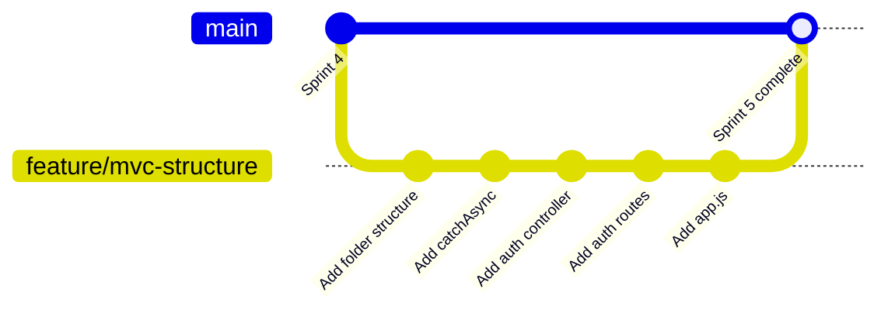

# FreelanceFlow — Git & GitHub Training Guide

> بيتوازى مع الـ Learning Journey sprint by sprint.
> بعد ما تخلص كل sprint وتشوف الـ checkpoint — اعمل الـ git section الخاص بيه هنا.
> الـ repo: https://github.com/muhammad-khaled-tech/freelance-flow.git

---

## One-Time Setup

```bash
# اعمل clone للـ repo المحلي
git clone https://github.com/muhammad-khaled-tech/freelance-flow.git
cd freelance-flow

# تحقق من الـ connection
git remote -v
# Output:
# origin  https://github.com/muhammad-khaled-tech/freelance-flow.git (fetch)
# origin  https://github.com/muhammad-khaled-tech/freelance-flow.git (push)
```

---

## الـ Workflow بتاعك في كل Sprint

```
1. اكتب الكود (اتبع الـ learning journey)
2. شوف الـ checkpoint في Postman
3. لما كل حاجة شغالة → تعالى هنا وعمل الـ git commands
4. روح للـ sprint الجاي
```

الـ git commands مش حاجة إضافية — هي **جزء من الـ sprint نفسه**.

---

## Sprint 0 — First Commit

### الملف الأول اللي لازم تعمله: `.gitignore`

```bash
# اعمله في الـ root بالـ content ده
cat > .gitignore << 'EOF'
# Dependencies
node_modules/

# Environment variables — NEVER push this to GitHub
.env

# Logs
*.log
npm-debug.log*

# OS files
.DS_Store
Thumbs.db

# IDE
.vscode/
.idea/
EOF
```

> [!warning] مهم جداً
> الـ `.env` فيه الـ `JWT_SECRET` والـ `MONGO_URI`. لو اتـ push على GitHub — أي حد يقدر يشوفهم. الـ `.gitignore` بيمنع ده.

### الـ Git Commands

```bash
# شوف إيه اللي اتغير
git status

# Add كل الـ files
git add .

# Commit مع رسالة واضحة
git commit -m "feat: Sprint 0 - bare-bones Express server

- Initialize project with npm
- Add express and dotenv dependencies
- Create server.js with basic GET / route
- Add .gitignore (exclude node_modules and .env)"

# Push للـ GitHub
git push origin main
```

### الـ Commit Message — ليه شكله كده؟

ده بيتبع الـ **Conventional Commits** standard:

```
<type>: <short description>

<optional longer body>
```

الـ types المهمة:

```
feat:     feature جديدة
fix:      bug fix
refactor: تغيير في الكود من غير feature أو bug
docs:     تغيير في الـ documentation
chore:    setup أو configuration
test:     إضافة tests
```

في الـ industry كل الـ teams بتستخدم ده — بيخلي الـ git history قابل للقراءة.

---

## Sprint 1 — express.json Middleware

```bash
git add server.js

git commit -m "feat: Sprint 1 - add express.json middleware

- Register express.json() before all routes
- Add /test-body route to verify req.body parsing
- Demonstrates middleware pipeline concept"

git push origin main
```

---

## Sprint 2 — Error Handler

```bash
git add src/utils/AppError.js src/middlewares/errorHandler.js server.js

git commit -m "feat: Sprint 2 - global error handling system

- Add AppError class extending native Error
- Add statusCode, status, isOperational properties
- Implement globalErrorHandler middleware (4-param)
- Add /test-error route for verification
- Add app.all('*') catch-all 404 handler"

git push origin main
```

---

## Sprint 3 — MongoDB + First Schema

### قبل الـ commit — اعمل `.env.example`

الـ `.env` مش بيتـ push — بس الـ developer التاني محتاج يعرف إيه الـ variables المطلوبة. الحل هو ملف `.env.example`:

```bash
cat > .env.example << 'EOF'
PORT=5000
NODE_ENV=development
MONGO_URI=mongodb://127.0.0.1:27017/freelanceflow
JWT_SECRET=your-secret-key-min-32-characters
JWT_EXPIRES_IN=7d
EOF
```

ده بيتـ push على GitHub — بس من غير قيم حقيقية.

```bash
git add src/models/User.model.js server.js .env.example

git commit -m "feat: Sprint 3 - MongoDB connection and User schema

- Add mongoose dependency
- Connect to MongoDB with error handling
- Create User schema (name, email, password, role)
- Add timestamps option
- Add unique index on email field
- Add .env.example for documentation"

git push origin main
```

---

## Sprint 4 — Password Hashing Hook

```bash
git add src/models/User.model.js

git commit -m "feat: Sprint 4 - password hashing with bcrypt

- Add bcryptjs dependency
- Implement pre-save hook for password hashing
- Add isModified check to avoid re-hashing on other updates
- Add select: false on password field
- Add minlength validation (8 chars)
- Add correctPassword instance method"

git push origin main
```

---

## Sprint 5 — MVC Structure + Register

هنا بنعمل **refactor كبير** — بنقسّم الكود لملفات. مناسب نعمله على **branch** منفصل.

### الـ Branch Concept



```bash
# اعمل branch جديد
git checkout -b feature/mvc-structure

# اعمل الـ folder structure
mkdir -p src/controllers src/routes

# بعد ما تكتب الكود
git add .

git commit -m "refactor: Sprint 5 - MVC structure and register endpoint

- Create src/controllers/auth.controller.js
- Create src/routes/auth.routes.js
- Create src/utils/catchAsync.js
- Create app.js (separate from server.js)
- Move route logic from server.js to controllers
- Implement register endpoint (POST /api/v1/auth/register)
- Apply Fat Model, Thin Controller principle"

# ارجع للـ main وعمل merge
git checkout main
git merge feature/mvc-structure

git push origin main
```

> [!info] ليه Branch؟
> الـ refactor الكبير ممكن يكسر حاجة شغالة. الـ branch بيخليك تشتغل بأمان — لو حاجة غلطت ترجع للـ main اللي شغال. ده بالظبط اللي بيحصل في الـ teams.

---

## Sprint 6 — Login + JWT

```bash
git add src/controllers/auth.controller.js src/routes/auth.routes.js

git commit -m "feat: Sprint 6 - login and JWT authentication

- Add jsonwebtoken dependency
- Implement login endpoint (POST /api/v1/auth/login)
- Add signToken helper function
- Add sendTokenResponse helper function
- Add JWT_SECRET and JWT_EXPIRES_IN to .env.example
- Implement user enumeration prevention (single error message)"

git push origin main
```

---

## Sprint 7 — Protect + restrictTo

```bash
git add src/middlewares/auth.middleware.js src/middlewares/errorHandler.js

git commit -m "feat: Sprint 7 - route protection and authorization

- Create auth.middleware.js
- Implement protect middleware (JWT verification, 4 steps)
- Implement restrictTo factory function (closure pattern)
- Enhance errorHandler with JWT-specific error handling
- Add JsonWebTokenError and TokenExpiredError handlers
- Add sendErrorDev / sendErrorProd separation"

git push origin main
```

---

## Sprint 8 — Projects CRUD

```bash
git checkout -b feature/projects-crud

git add src/models/Project.model.js \
        src/controllers/project.controller.js \
        src/routes/project.routes.js \
        app.js

git commit -m "feat: Sprint 8 - Projects CRUD with soft delete

- Create Project schema (title, description, budget, skills, deadline)
- Add cross-field validation (budget.max > budget.min)
- Add status state machine (open, in_progress, completed, cancelled)
- Implement createProject (client role only)
- Implement getAllProjects (open projects with populate)
- Implement getProject (single with populate)
- Implement updateProject (owner authorization check)
- Implement deleteProject (soft delete - status: cancelled)
- Add router.use(protect) pattern
- Add .route() method chaining"

git checkout main
git merge feature/projects-crud
git push origin main
```

---

## Sprint 9 — Proposals + Cascade Hook

```bash
git checkout -b feature/proposals-cascade

git add src/models/Proposal.model.js \
        src/controllers/proposal.controller.js \
        src/routes/proposal.routes.js \
        src/routes/project.routes.js \
        app.js

git commit -m "feat: Sprint 9 - proposals system with cascade hook

- Create Proposal schema (project, freelancer, coverLetter, bidAmount)
- Add compound unique index {project, freelancer}
- Implement post-save cascade hook:
  * Reject all other pending proposals on acceptance
  * Update project status to in_progress
  * Set acceptedFreelancer on project
- Implement submitProposal (freelancer role only)
- Implement getProjectProposals (client owner only)
- Implement acceptProposal (triggers cascade automatically)
- Add nested routes /:projectId/proposals"

git checkout main
git merge feature/proposals-cascade
git push origin main
```

---

## Sprint 10 — Reviews + Aggregation

```bash
git checkout -b feature/reviews-aggregation

git add src/models/Review.model.js \
        src/controllers/review.controller.js \
        src/routes/review.routes.js \
        src/models/User.model.js \
        app.js

git commit -m "feat: Sprint 10 - reviews and aggregation pipeline

- Add avgRating and ratingsCount to User schema
- Create Review schema with compound index {project, reviewer}
- Implement calcAverageRating static method
- Add post-save hook to trigger recalculation
- Add pre/post findOneAnd hooks for delete recalculation
- Implement createReview with business rule validation
- Implement getFreelancerStats with aggregation pipeline
- \$match + \$group stages for proposal and review stats"

git checkout main
git merge feature/reviews-aggregation
git push origin main
```

---

## الـ Git History بعد كل الـ Sprints

لما تخلص كل حاجة، `git log --oneline` المفروض تشوف حاجة زي دي:

```
a1b2c3d feat: Sprint 10 - reviews and aggregation pipeline
e4f5g6h feat: Sprint 9 - proposals system with cascade hook
i7j8k9l feat: Sprint 8 - Projects CRUD with soft delete
m0n1o2p feat: Sprint 7 - route protection and authorization
q3r4s5t feat: Sprint 6 - login and JWT authentication
u6v7w8x feat: Sprint 5 - MVC structure and register endpoint
y9z0a1b feat: Sprint 4 - password hashing with bcrypt
c2d3e4f feat: Sprint 3 - MongoDB connection and User schema
g5h6i7j feat: Sprint 2 - global error handling system
k8l9m0n feat: Sprint 1 - add express.json middleware
o1p2q3r feat: Sprint 0 - bare-bones Express server
```

ده بيبقى portfolio جميل — حد يفتح الـ repo يشوف الـ progress من الأول للآخر.

---

---

# Skills Roadmap — إيه اللي تضيفه على المشروع ده

الـ sprints اللي فاتوا بنوا الـ foundation. دلوقتي في مجالات تانية تقدر تضيفها على **نفس المشروع** عشان تتعلمهم على كود حقيقي.

---

## المستوى التاني — يستحق دلوقتي

### 1. Input Validation — `express-validator`

دلوقتي بتعتمد على Mongoose validation بس. لو حد بعت malformed JSON أو fields فاضية — الـ error messages مش كويسة.

```bash
npm install express-validator
```

**اللي هتتعلمه:** validation على مستوى الـ route قبل ما الداتا توصل الـ controller. الفرق بين schema validation والـ request validation.

**تضيفه على:** كل الـ POST وPATCH routes في المشروع.

---

### 2. Rate Limiting — `express-rate-limit`

حماية الـ API من الـ brute force. الـ login endpoint تحديداً خطر من غيره.

```bash
npm install express-rate-limit
```

**اللي هتتعلمه:** middleware عام على كل الـ routes، وmiddleware خاص على الـ auth routes.

```javascript
// مثال — 5 login attempts كل 15 دقيقة
const loginLimiter = rateLimit({
  windowMs: 15 * 60 * 1000,
  max: 5,
  message: 'Too many login attempts. Try again in 15 minutes.'
});

router.post('/login', loginLimiter, login);
```

---

### 3. API Documentation — `swagger-ui-express`

بدل ما تشرح الـ API بالكلام — بتعمل docs تفاعلية.

```bash
npm install swagger-ui-express swagger-jsdoc
```

**اللي هتتعلمه:** كيفية توثيق الـ API بـ OpenAPI spec. ده مطلوب في كل production project.

---

### 4. Testing — `jest` + `supertest`

الـ code اللي مش عنده tests — مش موثوق فيه في الـ industry.

```bash
npm install --save-dev jest supertest
```

**اللي هتتعلمه:** unit tests على الـ models، integration tests على الـ endpoints. وهتشوف الـ cascade hook بيتتست إزاي.

---

## المستوى التالت — بعد ما تتحكم في الـ foundation

### 5. Caching — `redis`

الـ `getAllProjects` بيعمل DB query في كل request. مع traffic عالي ده بطيء.

**اللي هتتعلمه:** تخزين الـ responses في Redis لمدة 5 دقائق. Invalidate الـ cache لما project جديد يتضاف.

---

### 6. File Upload — `multer` + Cloudinary

إضافة profile pictures للـ freelancers وattachments للـ projects.

```bash
npm install multer cloudinary multer-storage-cloudinary
```

**اللي هتتعلمه:** multipart/form-data، cloud storage، image optimization.

---

### 7. Real-time Notifications — `socket.io`

لما client يقبل proposal — الـ freelancer يتـ notify فوراً.

```bash
npm install socket.io
```

**اللي هتتعلمه:** WebSockets، events، الفرق بين HTTP وWebSocket.

---

### 8. Email — `nodemailer`

إرسال email لما:
- User جديد يسجّل
- Proposal يتقبل
- Project يتكمّل

```bash
npm install nodemailer
```

---

## ترتيب الأولوية

```
دلوقتي (بعد الـ Sprints مباشرة):
  1. express-validator   → validation صح
  2. express-rate-limit  → security أساسي
  3. swagger             → documentation

بعد كده:
  4. jest + supertest    → testing مهم للـ interviews
  5. redis caching       → performance

Advanced:
  6. file upload
  7. socket.io
  8. email
```

---

## كل skill فيهم — هتضيفه على نفس الـ FreelanceFlow

مش هتعمل project جديد. هتفتح branch في نفس الـ repo وتضيف الـ feature. كده بتتعلم وبتبني portfolio في نفس الوقت.

```bash
# مثال
git checkout -b feature/input-validation
# اعمل الـ implementation
git commit -m "feat: add express-validator for request validation"
git checkout main
git merge feature/input-validation
git push origin main
```

---

> **آخر نصيحة:** الـ repo ده لما يكون فيه 15-20 commit بـ conventional messages وfeature branches — ده بيبقى أحسن حاجة تقدر تبينها في الـ interview. أحسن من CV بفقرة "Node.js experience".
