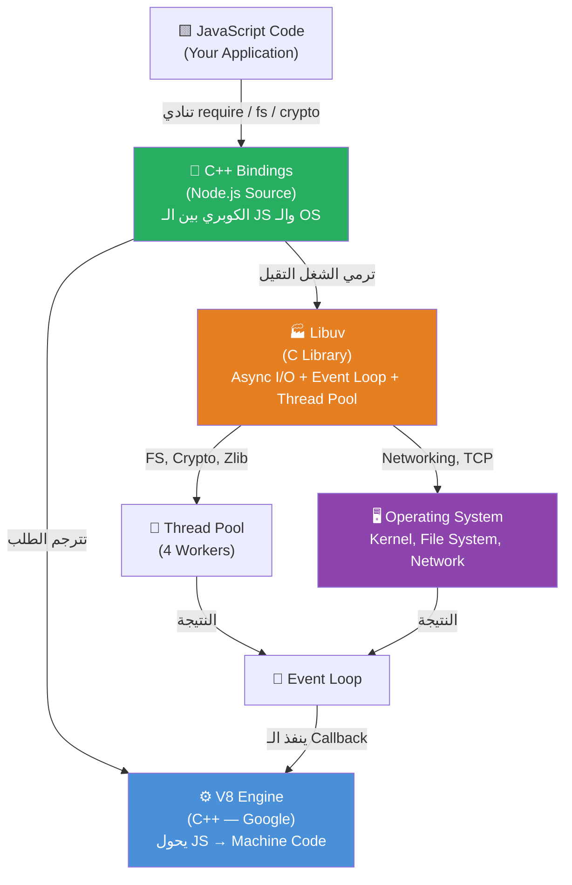
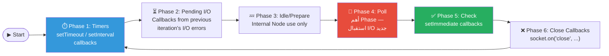
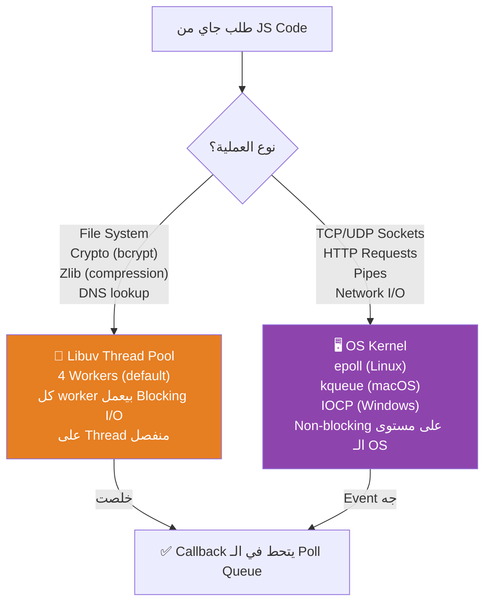
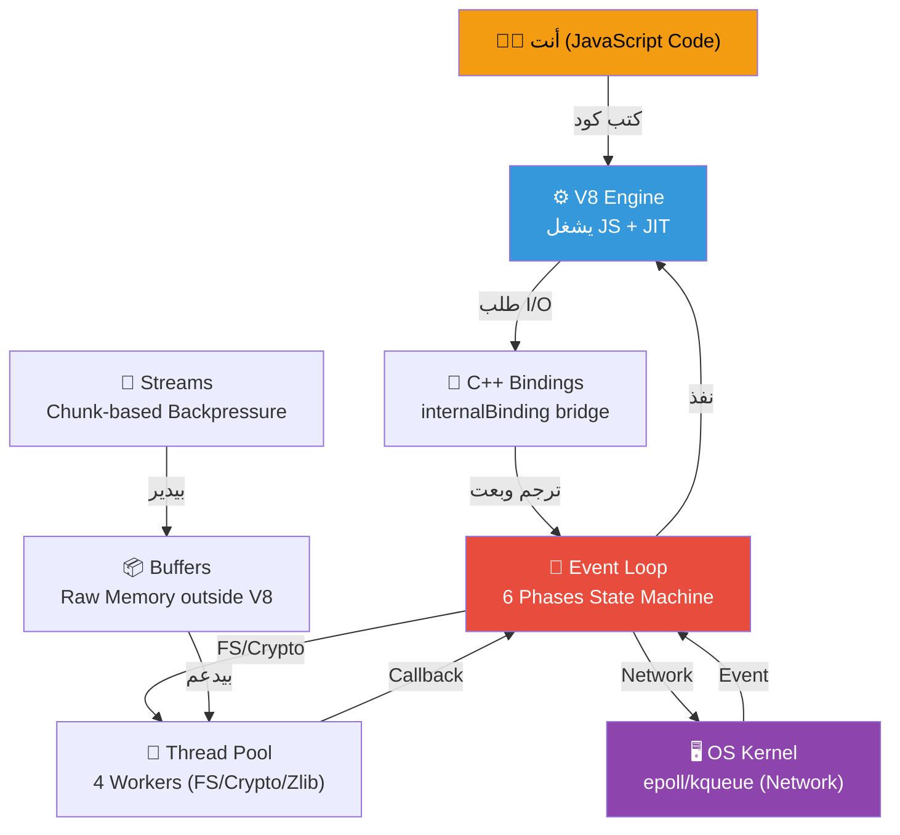

# 🧠 NodeJS Internals: من الجذور للعمارة

> **الهدف من الملف ده:** إنك تفهم Node.js مش كـ Framework بتستخدمه، لكن كـ System بيشتغل ليه منطق معماري محدد. لما تخلص الملف ده، هتبص على أي سطر `await fs.readFile(...)` وتعرف ورايه رحلة كاملة في الـ C++ والـ OS Kernel.

---

## الفهرس

1. [المشكلة الأصلية: C10K Problem](#1-المشكلة-الأصلية-c10k-problem)
2. [ليه JavaScript؟ قرار Ryan Dahl](#2-ليه-javascript-قرار-ryan-dahl)
3. [تشريح المفاعل: هيكل Node.js من جوه](#3-تشريح-المفاعل-هيكل-nodejs-من-جوه)
4. [V8 Engine: الجينيوس الأعمى](#4-v8-engine-الجينيوس-الأعمى)
5. [C++ Bindings: طبقة التهكير](#5-c-bindings-طبقة-التهكير)
6. [Libuv والـ Event Loop: المدير والعمال](#6-libuv-والـ-event-loop-المدير-والعمال)
7. [Thread Pool vs OS Kernel: مين بيشيل الشيلة؟](#7-thread-pool-vs-os-kernel-مين-بيشيل-الشيلة)
8. [Buffers والـ Streams: سباكة الداتا](#8-buffers-والـ-streams-سباكة-الداتا)
9. [الصورة الكاملة: ليه Node.js سريع؟](#9-الصورة-الكاملة-ليه-nodejs-سريع)
10. [Interview Survival Kit 🎯](#10-interview-survival-kit-)

---

## 1. المشكلة الأصلية: C10K Problem

### الكارثة اللي أنجبت نود

سنة 1999، واحد اسمه Dan Kegel كتب مقال شهير بعنوان "The C10K Problem". المقال كان بيقول ببساطة: **"ليه السيرفرات مش بتقدر تتعامل مع 10,000 connection في نفس الوقت؟"**

الوقت ده، الـ Web Server الملك كان **Apache HTTP Server**. وطريقة تفكيره كانت بسيطة وعاقلة تمامًا في ظاهرها:

> "جاله Connection جديد؟ يبقى هخلق له **Thread** جديد (أو **Process**) يخدمه."

```
Apache Model (Thread-per-Connection):

Client A ──► [Thread 1] ──► قرأ ملف ──► انتظر ──► رد
Client B ──► [Thread 2] ──► استعلم DB ──► انتظر ──► رد
Client C ──► [Thread 3] ──► انتظر Disk I/O ... 
...
Client 10,000 ──► [Thread 10,000] ──► ❌ OUT OF MEMORY
```

المشكلة؟ كل **Thread** في Linux بياكل تقريبًا **8MB من الـ Stack Memory** كـ Default. يعني 10,000 Thread = ~80GB رام. ده غير الـ Context Switching Overhead — وده التقيل الحقيقي.

### الـ Context Switching: العدو الصامت

لما عندك 10,000 Thread شغالين، الـ CPU (اللي عنده مثلًا 8 Cores) محتاج يقسم وقته عليهم. كل شوية بيوقف Thread يحفظ حالته (Registers, Stack Pointer, etc.) ويبدأ Thread تاني.

العملية دي اسمها **Context Switch** وهي مش مجانية. كل Switch بياخد من 1 لـ 10 ميكروثانية، والـ CPU Cache بيتمسح فيها. مع 10,000 Thread، الـ CPU يقضي نصف وقته بس في الـ Switching مش في الشغل الحقيقي.

> [!DEEP-DIVE]
> الـ Kernel بيحتاج يعمل **TLB Flush** (Translation Lookaside Buffer) مع كل Context Switch بين Processes مختلفة. ده بيخلي الـ CPU يعيد بناء الـ Virtual Memory Map من الأول، وهو من أغلى العمليات في الـ Modern CPU. الـ Threads داخل نفس الـ Process أرخص شوية لأنهم بيشاركوا الـ Address Space.

### الحل المقترح: Non-Blocking I/O + Single Thread

الحل النظري كان موجود من زمان. بدل ما تعمل Thread لكل Connection، خلي **Thread واحد** يدير كل الـ Connections عن طريق **انه ميستناش**. لو الـ Thread طلب ملف، مش هيقعد مستني الملف يتقرأ، هيروح يخدم حد تاني، ولما الملف يخلص هيرجعله.

المشكلة الوحيدة: معظم اللغات البرمجية موصوفة بـ Blocking I/O في DNA بتاعتها. C++، Java، Python — لما بتكتب `readFile()` فيهم، الـ Thread بيوقف ومينفعش تعمل حاجة تانية بسهولة.

**هنا دخل Ryan Dahl على الخط.**

---

## 2. ليه JavaScript؟ قرار Ryan Dahl

### 2009: الرجل والفكرة

Ryan Dahl كان بيتعذب مع حاجة اسمها **File Upload Progress Bar** في الـ Ruby on Rails. المشكلة كانت إن السيرفر كان بيعمل **Blocking** لما بيستقبل الـ Upload، فمكنش قادر يبعت للـ Client "اتحمل 20%... 40%..." في نفس الوقت.

فكرته الأولى كانت بـ C++. بس C++ وهو بيكتب فيها Async Code كانت **جحيم**. Callbacks على Callbacks، Memory Management يدوي، Compilation طويل.

### ليه JavaScript تحديدًا؟

JavaScript عندها خاصية **مش موجودة في أي لغة تانية** وقتها بنفس القدر: **هي Single-Threaded بـ Design وعندها مفهوم الـ Callbacks مدمج في ثقافتها.**

الـ JS Developers كانوا بيكتبوا `onclick(function() {...})` بشكل طبيعي من ساعة الـ Browser. يعني الـ Async Mindset كان موجود بالفعل في اللغة.

كمان، **V8** كان لسه طازج من Google (2008) وكانت سرعته جبارة. Ryan Dahl شاف في ده الفرصة:

> "أنا هاخد V8 (المحرك السريع)، أضيفله Libuv (العضلات الـ Async)، وأديه لـ JS Developers عشان يبنوا Non-Blocking Servers بـ Syntax هم عارفينه."

**وكدة ولد Node.js سنة 2009.**

---

## 3. تشريح المفاعل: هيكل Node.js من جوه

### الثالوث المقدس

Node.js مش "لغة برمجة" ومش "Framework". هو **Runtime Environment** — يعني "بيئة تشغيل" — مكونة من 3 أجزاء أساسية بتتكلم مع بعض:



### الفولدر Structure في Source Code بتاع Node

لو فتحت [github.com/nodejs/node](https://github.com/nodejs/node)، هتلاقي:

| Folder | اللغة | الوظيفة |
|--------|-------|---------|
| `lib/` | JavaScript | الـ API اللي أنت بتستخدمه (fs, http, crypto, ...) |
| `src/` | C++ | الـ Bindings اللي بتكلم الـ OS |
| `deps/v8/` | C++ | المحرك نفسه (مجيوب من Google) |
| `deps/uv/` | C | مكتبة Libuv |

يعني لما بتكتب `require('fs')`, أنت بتدخل `lib/fs.js`. وجوه `lib/fs.js` في نقطة معينة هيجيلك سطر زي:

```javascript
const binding = internalBinding('fs');
```

الـ `internalBinding` دي هي **بوابة النفق** اللي هتوديك من JavaScript لـ C++.

---

## 4. V8 Engine: الجينيوس الأعمى

### V8 هو برنامج C++ وظيفته الوحيدة: يفهم JS

تخيل إن V8 هو عالِم عبقري جالس في غرفة مغلقة. هو قادر يحل أي معادلة رياضية، يجمع arrays، يعمل closures معقدة — لكنه **أعمى تمامًا عن العالم خارج الغرفة**. مش يعرف إيه هو الـ Hard Disk، مش يعرف الـ Network، مش يعرف حتى إزاي يطبع على الشاشة.

```javascript
// V8 بيفهم ده كويس:
const result = [1, 2, 3].map(x => x * 2);
const hash = new Map();
async function fetch() { ... } // يعرف بناء الـ Syntax بس

// V8 مش عارف يفهم ده من غير مساعدة:
fs.readFile(...)      // ❌ مين هو fs ده؟
console.log(...)      // ❌ إيه معنى "اطبع على الشاشة"؟
setTimeout(...)       // ❌ الوقت؟ أنهي ساعة؟
```

### JIT: الجينيوس اللي بيتعلم وهو شغال

قديمًا، اللغات كانت يا Compiled (زي C++) يا Interpreted (زي Python القديم). V8 عمل ثورة بحاجة اسمها **Just-In-Time Compilation (JIT)**. وفيها مرحلتين:

#### المرحلة الأولى: Ignition (المُفسِّر السريع)

أول ما V8 يشوف كود JS، بيحوله بسرعة لـ **Bytecode** (مش Machine Code خام). الـ Bytecode ده أسرع من الـ Interpretation سطر بسطر، لكنه أبطأ من Machine Code. الهدف: تبدأ تشتغل **فورًا** من غير انتظار.

```
Source Code (JS)
      │
      ▼
   [Parser] ──► AST (Abstract Syntax Tree)
      │
      ▼
  [Ignition] ──► Bytecode
      │
      ▼
  ينفذ الكود بسرعة معقولة
```

#### المرحلة التانية: TurboFan (المُحسِّن)

جوه V8 فيه "جاسوس" اسمه **Profiler** بيراقب الكود وهو شغال. لو لقى إن فانكشن معينة بتتنادى كتير بنفس نوع الداتا (مثلًا بتجمع `number + number` دايمًا)، بيدي الأمر لـ **TurboFan**.

TurboFan بياخد الـ Bytecode ده ويحوله لـ **Optimized Machine Code** مخزن في الـ Memory. المرة الجاية لما الفانكشن دي تتنادى، V8 مش هيقرأها كـ JS خالص — هو هينفذها كـ Machine Code مباشرة بسرعة البرق.

> [!DEEP-DIVE]
> **Deoptimization — لما TurboFan يتفاجأ:**
> لو V8 عمل Optimize لفانكشن بتجمع أرقام، وفجأة جيتله بـ `string` بدل الـ `number`، الـ Optimized Code ده بيبقى "غلط". V8 بيعمل **Deoptimization**: بيرجع للـ Bytecode تاني ويبدأ يراقب من الأول. ده سر الـ Performance degradation اللي ممكن تشوفه لو بتغير Types في فانكشنز كتيرة الاستخدام. ده اللي بيخلي TypeScript مش بس "مريحة" — دي بتساعد V8 يعمل Optimize أحسن لأن الـ Types أثبت.

### Isolates والـ Contexts: غرف V8 المعزولة

| المفهوم | المعنى |
|---------|--------|
| **Isolate** | نسخة كاملة من V8 — ليها Heap وStack خاصين بيها. Node.js بيشغل Isolate واحد (Single Thread). |
| **Context** | "المحيط" اللي الكود بيعيش فيه. في Browser = `window`. في Node = `global`. كل Context بياخد Snapshot من الـ Built-ins. |

### Memory Model داخل V8 Heap

```
┌─────────────────────────────────────────────┐
│                V8 Heap                       │
│  ┌──────────────┐  ┌─────────────────────┐  │
│  │  New Space   │  │      Old Space      │  │
│  │ (Short-live) │  │  (Long-live objs)   │  │
│  └──────────────┘  └─────────────────────┘  │
│  ┌──────────────┐  ┌─────────────────────┐  │
│  │  Code Space  │  │    Large Object     │  │
│  │ (Bytecode)   │  │      Space          │  │
│  └──────────────┘  └─────────────────────┘  │
└─────────────────────────────────────────────┘
```

الـ **Garbage Collector** بتاع V8 (اسمه **Orinoco**) بيشتغل بـ Strategy اسمها **Generational GC**: معظم الـ Objects بتموت صغيرة (في الـ New Space). اللي بيعيشوا طول بيترقوا للـ Old Space. الـ GC بيمسح الـ New Space كتير وبسرعة، والـ Old Space أقل وبطيء.

---

## 5. C++ Bindings: طبقة التهكير

### المعضلة: لغتين مش بتتكلموش بعض

V8 بيفهم JS فقط. الـ OS بيفهم C/C++ فقط. فكيف لما بتكتب `fs.readFile('data.txt')` في JS، الـ Hard Disk بيتحرك؟

الإجابة: **الـ C++ Bindings** — وهي حرفيًا "التهكير" اللي Ryan Dahl عمله على V8.

### الـ internalBinding: بوابة النفق

```javascript
// lib/fs.js (JavaScript — اللي أنت بتشوفه)
const { readFile, readFileSync, open } = internalBinding('fs');
```

```cpp
// src/node_file.cc (C++ — اللي ورا الستارة)
void Initialize(Local<Object> target, ...) {
  env->SetMethod(target, "readFile", ReadFile);
  env->SetMethod(target, "open", Open);
  // ...
}
```

الـ `internalBinding('fs')` ده بيعمل إيه بالظبط؟

1. بيدور في Registry جوه Node على Module اسمه `'fs'`
2. بيلاقيه في `src/node_file.cc`
3. بيشغل الـ `Initialize` function اللي فوق دي
4. بيرجعلك JavaScript Object فيه الـ Functions دي

بس إزاي C++ Functions بتتحول لـ JS Functions؟

### v8::FunctionTemplate: سحر التحويل

```cpp
// الكود ده مبسط عشان يوضح الفكرة
void ReadFile(const v8::FunctionCallbackInfo<v8::Value>& args) {
    // args[0] = مسار الملف (JS String)
    // Node هيحوله لـ C++ String
    v8::String::Utf8Value filename(isolate, args[0]);
    
    // ودي بعت الطلب لـ Libuv
    uv_fs_t* req = new uv_fs_t;
    uv_fs_open(loop, req, *filename, O_RDONLY, 0, AfterOpen);
}
```

Node بيقول للـ V8: **"خد يا سيدي، الفانكشن اللي اسمها `readFile` في JavaScript، لما حد يناديها، روح نادي الـ C++ Function دي في الميموري."**

### الـ Context Switch: تكلفة العبور

لما الكود بيعدي من JavaScript لـ C++ (أو العكس)، بيحصل حاجة مكلفة اسمها **Boundary Crossing**:

```
JS Land                         C++ Land
─────────────────               ─────────────────
v8::String::Utf8Value    ◄──── const char*
v8::Number               ◄──── double / int64_t  
v8::Object               ◄──── C++ Struct
v8::ArrayBuffer          ◄──── void* (raw memory)
```

V8 محتاج يترجم الـ JS Objects دي لـ C++ Types، وده بياخد وقت. **عشان كدة الـ Bindings لازم تكون سريعة جدًا** — هي مش المكان المناسب للشغل التقيل. هي بس "المترجم".

> [!DEEP-DIVE]
> **C++ Addons: لما تعمل Binding خاص بيك**
> Node.js بيسمحلك تكتب C++ Addon خاص بيك لو عندك عملية حسابية بتهنج الـ JS. باستخدام `node-gyp` أو `N-API`، بتكتب C++ Code، وبتعمله Compile، وNode بيحمله كـ `.node` file (ده في الأساس `.so` أو `.dll`). الشركات زي Sharp (معالجة الصور) وBcrypt استخدمت الـ Approach ده عشان تجيب Performance مش ممكن في JS.

### Bootstrap: إزاي Node بيحقن كل حاجة في V8

لما بتشغل `node app.js`، الأول قبل ما يشوف كودك، Node بيعمل حاجة اسمها **Bootstrap**:

```
1. يشغل V8 Isolate (الغرفة الفاضية)
2. يكريت Global Context
3. يبدأ يحقن في الـ Global Object:
   - process ──► C++ Process Info
   - Buffer  ──► Raw Memory Handler
   - require ──► Module System
   - console ──► stdout/stderr Wrapper
   - setTimeout ──► Libuv Timer Wrapper
4. يشغل كودك
```

بقدر ما `console.log` شايف إنه JavaScript بسيط، هو في الحقيقة بياخد الـ String بتاعتك ويمرها لـ `uv_write()` في Libuv اللي بيبعتها لـ `stdout` في الـ OS.

---

## 6. Libuv والـ Event Loop: المدير والعمال

### Libuv: المصنع اللي ورا الستارة

Libuv ده مكتبة C مكتوبة خصيصًا عشان تحل مشكلة الـ Async I/O بشكل Portable — يعني بتشتغل على Linux, macOS, وWindows.

جوه Libuv في منطقتين رئيسيتين:
- **Thread Pool**: عمال بيشتغلوا في الخلفية
- **Event Loop**: المدير اللي بيوزع الشغل ويلم النتايج

### Event Loop: مش Loop عادي

الناس كتير بتتخيل الـ Event Loop كأنه كود Python بالشكل ده:

```python
# التصور الغلط:
while True:
    event = queue.pop()
    event.callback()
```

الحقيقة أعمق بكتير. الـ Event Loop هو **State Machine** مكتوبة بـ C في Libuv، وبتلف على **6 Phases** — وكل Phase بتتعامل مع نوع معين من الـ Callbacks.



#### Phase 1: Timers ⏱️

دي بتتحقق من الـ `setTimeout` و`setInterval` callbacks. هي **مش بتنفذ بالظبط في الوقت المحدد** — هي بتنفذ أول ما الـ Event Loop توصل للـ Timers Phase **بعد** ما الوقت اتعدى.

```javascript
setTimeout(() => console.log('timer!'), 100);
// ده مش بالظبط 100ms. ده "مش قبل 100ms"
// الفرق مهم في الـ Precision-critical applications
```

#### Phase 4: Poll 📡 (أهم Phase)

دي قلب الـ Event Loop. الـ Poll Phase بتعمل حاجتين:

1. **لو فيه I/O Callbacks في الـ Queue** → تنفذهم كلهم
2. **لو مفيش حاجة** → تقعد "تستنى" (Blocking) الـ OS يبعتلها events جديدة. قدانيها بتحسب: "هل فيه Timer قريب يشتغل؟" عشان تعرف هتستنى قد إيه.

ده هو سر "الاستجابة" في Node — لما مفيش شغل، الـ Event Loop مش بيلف فاضي ويضيع CPU. بيقعد بيستنى الـ OS بكفاءة.

#### Phase 5: Check ✅ (setImmediate)

`setImmediate` بتتنفذ هنا. الـ Phase دي بتيجي **بعد** الـ Poll مباشرة. ده بيخليها دايمًا أسرع من `setTimeout(fn, 0)` لو أنت جوه I/O Callback.

```javascript
// جوه I/O Callback:
fs.readFile('file.txt', () => {
    setImmediate(() => console.log('setImmediate'));  // دي هتطلع أول
    setTimeout(() => console.log('setTimeout'), 0);   // دي بعدها
});
```

### Microtasks: البلطجية اللي بيقاطعوا كل حاجة

الـ Microtasks مش Phase في الـ Event Loop. هم **"queue خاص" بيتفضى قبل الانتقال لأي Phase تانية**.

```
           بعد كل Phase
                │
                ▼
    ┌─────────────────────────┐
    │   هل فيه nextTick()    │ ──► نعم ──► نفذهم كلهم
    │   في الـ Queue؟        │ ◄── ارجع واسأل تاني
    └─────────────────────────┘
                │ لأ
                ▼
    ┌─────────────────────────┐
    │   هل فيه Promise       │ ──► نعم ──► نفذهم كلهم
    │   .then() في الـ Queue?│ ◄── ارجع واسأل تاني
    └─────────────────────────┘
                │ لأ
                ▼
         الـ Phase الجاية
```

**`process.nextTick()`** هو الأعلى أولوية على الإطلاق — بيتنفذ قبل حتى الـ Promise callbacks.

> [!DEEP-DIVE]
> **Event Loop Starvation — الكابوس:**
> لو عندك recursive `process.nextTick()` زي ده:
> ```javascript
> function starveLoop() {
>     process.nextTick(starveLoop); // ❌ كارثة
> }
> starveLoop();
> ```
> الـ Event Loop هيتجمد. مش هيقدر ينتقل لأي Phase لأن الـ nextTick Queue مش بتفضى أبدًا. في Node v11+، اتعملت حد أقصى للـ nextTick Iterations بين الـ Phases عشان يتجنب الكارثة دي. نفس المشكلة ممكن تحصل مع Promises لو عندك Infinite Promise Chain.

---

## 7. Thread Pool vs OS Kernel: مين بيشيل الشيلة؟

### السؤال الجوهري: مين بيقرأ الملف فعلًا؟

لما بتكتب:
```javascript
fs.readFile('huge-file.txt', (err, data) => {
    console.log('done!');
});
```

مين اللي بيقرأ الملف ده فعلًا؟ هل V8؟ هل الـ Event Loop؟ لأ.

الإجابة في اتجاهين حسب نوع العملية:



### Thread Pool: العمال الـ 4

الـ Thread Pool عبارة عن **4 Threads** (بـ Default) شغالين في الخلفية. كل Thread قادر يعمل Blocking Operations بدون ما يأثر على الـ Main Thread (اللي فيه V8 والـ Event Loop).

```
Main Thread (V8 + Event Loop)
│
├── Thread 1 ──► قارئ ملف كبير (Blocking) ...
├── Thread 2 ──► بيعمل bcrypt hash ... 
├── Thread 3 ──► فاضي، مستنى
└── Thread 4 ──► فاضي، مستنى
```

لما Thread يخلص شغله، بيحط الـ Callback في الـ **Poll Queue** والـ Event Loop هيلاقيها في الـ Phase بتاعتها.

**إزاي تغير عدد الـ Workers؟**
```javascript
process.env.UV_THREADPOOL_SIZE = 8; // قبل ما تشغل أي كود تاني
```

> [!DEEP-DIVE]
> **Thread Pool Starvation:**
> لو بعتلك 8 طلبات `bcrypt.hash()` في نفس الوقت، والـ Thread Pool عندك 4 Workers فقط، 4 طلبات هيبدأوا فورًا، والـ 4 التانيين هيقعدوا في Queue. لو كل `bcrypt` بتاخد 100ms، الطلبات الـ 4 اللي استنت هتبدأ بعد 100ms مش فورًا. الحل؟ إما تزود `UV_THREADPOOL_SIZE` أو تستخدم Worker Threads لتوزيع الحمل.

### OS Kernel: الجبار الشبكي

للـ Networking، Node مش بيستخدم Thread Pool. بدل كدة، بيستخدم **OS-level Async I/O** مباشرة:

- **Linux**: `epoll` — بيسمح لـ Single Thread يراقب آلاف الـ File Descriptors في نفس الوقت
- **macOS**: `kqueue`
- **Windows**: `IOCP` (I/O Completion Ports)

Node بيقول للـ Kernel: **"يا باشا، السوكيت ده لو جاله داتا، ابقى قولي بـ Event."** ومش بيستهلك Thread وهو مستنى. الـ Kernel هو اللي بيستنى، ولما الداتا توصل، بيبعت لـ Libuv اللي بيحط الـ Callback في الـ Poll Queue.

ده سبب **قدرة Node على تحمل آلاف الـ Connections المتزامنة** من غير ما يخلق Thread لكل واحدة.

---

## 8. Buffers والـ Streams: سباكة الداتا

### المشكلة: V8 Heap صغير والداتا كبيرة

V8 Heap ليه حد أقصى (default ~1.5GB على 64-bit). لو عندك ملف فيديو 4GB وحاولت تقرأه كله في الـ Memory وتبعته:

```javascript
// ❌ الطريقة المريحة اللي هتقتل السيرفر
fs.readFile('huge-video.mp4', (err, data) => {
    res.end(data); // 4GB في الـ V8 Heap = 💀
});
```

Node هيحاول يحجز 4GB في الـ V8 Heap، هيفشل، وهيرمي `ENOMEM`.

### Buffer: الميموري خارج V8

**Buffer** في Node هو مساحة ميموري **محجوزة خارج الـ V8 Heap** عن طريق `malloc()` في C. V8 بيشوفها كـ `Uint8Array`، لكن الداتا الفعلية في Raw C Memory.

```
┌──────────────────────────────────────────────┐
│                 V8 Heap                       │
│  ┌──────────────────────┐                    │
│  │  Buffer Object (JS)  │──────┐             │
│  │  { length: 65536,   │      │ pointer      │
│  │    byteOffset: 0 }  │      │             │
│  └──────────────────────┘      │             │
└──────────────────────────────┼─────────────┘
                                ▼
┌──────────────────────────────────────────────┐
│          Raw C Memory (malloc)                │
│  [0x4D, 0x50, 0x33, 0x20, 0x46, 0x49, ...]  │
│  (Actual binary data — outside V8 control)   │
└──────────────────────────────────────────────┘
```

**الفايدة الكبيرة:** الـ GC بتاع V8 مش بيتعامل مع الداتا دي مباشرة. ممكن تشيل Buffer حجمه 1GB من غير ما تملأ الـ V8 Heap.

### Zero-Copy: السحر الحقيقي

لما Node بيبعت Buffer من Hard Disk لـ Network Socket، في بعض الحالات ممكن يعمل حاجة اسمها **Zero-Copy** باستخدام `sendfile()` syscall في Linux:

```
بدون Zero-Copy:
HDD ──► Kernel Buffer ──► User Space Buffer ──► Kernel Buffer ──► NIC
         (نسخة 1)           (نسخة 2)               (نسخة 3)

مع Zero-Copy (sendfile):
HDD ──► Kernel Buffer ─────────────────────────► NIC
         (نسخة 1 بس — الداتا ما اتنقلتش للـ User Space خالص)
```

ده بيوفر نسختين من الداتا ويوفر كمان الـ CPU Cycles اللي كانت هتتصرف في النسخ.

### Streams: الماسورة اللي بتنقذ الرام

بدل ما تقرأ الملف كله في الميموري، **Stream** بيخليك تعامل مع الداتا **حتة حتة** (Chunk by Chunk).

```javascript
// ✅ الطريقة الصح — تشتغل مع أي حجم ملف
const readStream = fs.createReadStream('huge-video.mp4');
const writeStream = res; // الـ HTTP Response هو WriteStream

readStream.pipe(writeStream);
```

**إيه اللي بيحصل هنا بالظبط؟**

```
Disk I/O
   │
   ▼ chunk (64KB)
[ReadStream] ──────────► [Buffer] ──────────► [WriteStream]
   │                                               │
   │ لما Buffer يتمل، بيوقف القراءة              │ بتبعت لـ Client
   └───────────── Backpressure ◄──────────────────┘
```

### Backpressure: التنظيم الذاتي

**Backpressure** هي المشكلة اللي بتحصل لما الـ Readable أسرع من الـ Writable:

```javascript
// مثال على الكارثة:
// ReadStream من SSD سريع جداً (500MB/s)
// WriteStream لـ Client عنده نت بطيء (1MB/s)

readStream.on('data', (chunk) => {
    // الـ chunk بييجي بسرعة الـ SSD
    // بس الـ write بطيء بسرعة النت
    writeStream.write(chunk); // ❌ Buffer بيتراكم في الميموري!
});
```

`.pipe()` بيحل الـ Backpressure أوتوماتيكيًا:

```javascript
// .pipe() بيعمل ده من جوه:
readStream.on('data', (chunk) => {
    const canContinue = writeStream.write(chunk);
    if (!canContinue) {
        // الـ Write Buffer اتمل — وقف القراءة
        readStream.pause();
    }
});

writeStream.on('drain', () => {
    // الـ Write Buffer اتفرغ — استأنف القراءة
    readStream.resume();
});
```

### أنواع الـ Streams الأربعة

| النوع | المثال | الوصف |
|-------|--------|-------|
| **Readable** | `fs.createReadStream()` | بس بتقرأ منها |
| **Writable** | `fs.createWriteStream()` | بس بتكتب فيها |
| **Duplex** | `net.Socket` | بتقرأ وبتكتب مستقلين |
| **Transform** | `zlib.createGzip()` | بتقرأ، بتعدل، وبتكتب |

```javascript
// Pipeline: Stream Composition حقيقي
const { pipeline } = require('stream/promises');

await pipeline(
    fs.createReadStream('video.mp4'),     // Readable
    zlib.createGzip(),                     // Transform: compress
    crypto.createCipheriv('aes-256-gcm'), // Transform: encrypt  
    fs.createWriteStream('video.mp4.gz.enc') // Writable
);
// ده كله بيحصل بـ 64KB في الميموري في كل لحظة
// مهما كان حجم الملف
```

> [!DEEP-DIVE]
> **highWaterMark: ضبط الـ Buffer Size**
> كل Stream عندها `highWaterMark` — ده الحد اللي لما الـ Internal Buffer يوصله، الـ Stream بتـ"ترفض" استقبال داتا جديدة. Default للـ Object Mode: 16 objects. Default للـ Bytes Mode: 16KB. ممكن تضبطه:
> ```javascript
> const stream = fs.createReadStream('file', { highWaterMark: 128 * 1024 }); // 128KB chunks
> ```
> زيادة الـ highWaterMark ممكن تزود الـ Throughput (أقل Round-trips) لكن بيزود استهلاك الـ Memory. الـ Trade-off ده بيتقرر حسب طبيعة الـ Workload.

---

## 9. الصورة الكاملة: ليه Node.js سريع؟

### الرحلة الكاملة في سطر كود واحد

```javascript
const data = await fs.promises.readFile('data.txt', 'utf-8');
console.log(data);
```

```
┌─────────────────────────────────────────────────────────────┐
│                     JS Call Stack                           │
│  readFile('data.txt')                                       │
│       │                                                     │
│       ▼                                                     │
│  lib/fs.js ──► internalBinding('fs') ──► TUNNEL ──►        │
│                                                   │         │
└───────────────────────────────────────────────────┼─────────┘
                                                    │
                                            C++ World
                                                    │
┌───────────────────────────────────────────────────▼─────────┐
│  src/node_file.cc                                           │
│  ReadFile() ──► uv_fs_open() ──► Thread Pool               │
│                                        │                    │
│                                   Worker Thread             │
│                                   بيقرأ الملف (Blocking)    │
│                                        │                    │
│                            خلص ──► حط الـ Callback         │
│                                   في Poll Queue             │
└─────────────────────────────────────────────────────────────┘
                                                    │
                              Event Loop            │
┌───────────────────────────────────────────────────▼─────────┐
│  Phase 4: Poll                                              │
│  لقى Call Stack فاضي                                       │
│  ──► اتخد الـ Callback من الـ Queue                        │
│  ──► رجعه للـ V8 Call Stack                                │
└─────────────────────────────────────────────────────────────┘
                                                    │
┌───────────────────────────────────────────────────▼─────────┐
│                     JS Call Stack                           │
│  console.log(data) ──► Bindings ──► stdout ──► Terminal    │
└─────────────────────────────────────────────────────────────┘
```

### الـ 5 أسباب الجوهرية لسرعة Node

| السبب | التفسير |
|-------|---------|
| **Single-Threaded Event Loop** | مفيش Context Switching بين Threads للـ JS Logic |
| **Non-Blocking I/O** | الـ Main Thread ما بيستناش أي Operation تخلص |
| **OS Kernel for Networking** | آلاف الـ Connections بـ Thread واحد عن طريق `epoll` |
| **Buffers outside V8 Heap** | التعامل مع داتا ضخمة بـ Memory ضغير |
| **V8 JIT** | الكود بيتحول لـ Optimized Machine Code وهو شغال |

### متى Node مش مناسب؟

Node سريع في الـ **I/O-Bound** tasks (الشبكة، الملفات، قواعد البيانات). لكنه **مش مناسب** لـ **CPU-Bound** tasks:

```javascript
// ❌ ده هيجمد الـ Event Loop كله
app.get('/calculate', (req, res) => {
    let result = 0;
    for (let i = 0; i < 10_000_000_000; i++) {
        result += i; // CPU Blocking
    }
    res.json({ result });
    // خلال الـ Loop دي، مفيش Client تاني هيتخدم
});
```

للـ CPU-Intensive work في Node، الحل هو **Worker Threads** (موجودة من Node v10.5):

```javascript
const { Worker } = require('worker_threads');

app.get('/calculate', (req, res) => {
    const worker = new Worker('./heavy-calculation.js');
    worker.on('message', (result) => res.json({ result }));
    // Event Loop فاضي يخدم clients تانيين
});
```

---

## الخلاصة: الـ Mental Model الكامل



---

## 10. Interview Survival Kit 🎯

> [!INFO]
> الأسئلة دي اتجمعت من أكتر الـ Topics شيوعًا في مقابلات Node.js. مقسمة لـ Categories عشان تذاكر كل Category لوحدها. الهدف مش تحفظ الإجابة — الهدف تفهم الـ "ليه" جوه كل إجابة.

---

### 🔁 Event Loop & Async (الأكتر شيوعًا)

---

**Q: ما هو الـ Event Loop؟ وإزاي بيشتغل؟**

> مش Loop برمجية عادية — دي **State Machine** مكتوبة بـ C في Libuv بتلف على **6 Phases** بالترتيب. وظيفتها الوحيدة: لما الـ Call Stack يفضى، تاخد الـ Callback التالي من الـ Queue المناسبة وترميه يتنفذ. هي اللي بتخلي Node يبدو "Concurrent" وهو فعلًا Single-Threaded.

---

**Q: ما هو ترتيب التنفيذ في الكود ده؟**

```javascript
console.log('1');
setTimeout(() => console.log('2'), 0);
Promise.resolve().then(() => console.log('3'));
process.nextTick(() => console.log('4'));
console.log('5');
```

> **الإجابة: `1` → `5` → `4` → `3` → `2`**
>
> - `1` و `5`: Call Stack مباشرة — Synchronous
> - `4`: `nextTick` Queue — أعلى أولوية، بيتنفذ قبل أي Phase
> - `3`: Promise Microtask Queue — بعد `nextTick` مباشرة
> - `2`: Timers Phase في الـ Event Loop — أخر حاجة
>
> القاعدة: **Sync → nextTick → Promises → Event Loop Phases**

---

**Q: إيه الفرق بين `process.nextTick()` و `setImmediate()`؟**

> - `process.nextTick()`: **Microtask** — بيتنفذ فورًا بعد الـ Operation الحالية، قبل أي Phase في الـ Event Loop. الأعلى أولوية على الإطلاق.
> - `setImmediate()`: بيتنفذ في الـ **Check Phase** — يعني بعد الـ Poll Phase. أقل أولوية.
>
> جوه I/O Callback: `setImmediate` دايمًا أسبق من `setTimeout(fn, 0)` لأن الـ Check Phase بتيجي قبل الـ Timers Phase في نفس الـ Iteration.

---

**Q: ممكن الـ Event Loop يتجمد؟ إزاي؟ وإيه الحل؟**

> آه — أي **Synchronous CPU-Intensive** كود بيجمد الـ Main Thread كله. مثال: `JSON.parse()` لملف ضخم، أو loop بمليار iteration. خلال الوقت ده، مفيش Request جديدة هتتخدم.
>
> **الحلول:**
> - **Worker Threads**: شغّل الـ Heavy Calculation على Thread منفصل
> - **تقطيع الشغل**: استخدم `setImmediate()` بين الـ Chunks عشان تدي الـ Event Loop فرصة يتنفس
> - **Child Processes**: `child_process.fork()` لعمليات ثقيلة

---

**Q: إيه الـ Event Loop Starvation؟**

> لما حاجة بتمنع الـ Event Loop من الانتقال للـ Phase الجاية. مثال كلاسيكي:
> ```javascript
> // ❌ كارثة
> function recursive() { process.nextTick(recursive); }
> recursive();
> ```
> الـ `nextTick` Queue مش بتفضى أبدًا، فالـ Event Loop مش بيقدر يوصل للـ I/O Callbacks أو الـ Timers. في Node.js v11+ اتعملت حماية بحد أقصى للـ nextTick iterations بين الـ Phases.

---

**Q: إيه الفرق بين `setTimeout(fn, 0)` و `setImmediate(fn)`؟**

> بره أي I/O Context: الترتيب بينهم **غير مضمون** — بيعتمد على حالة الـ OS Timer.
>
> جوه I/O Callback: **`setImmediate` دايمًا أول** — لأن Check Phase بتيجي قبل Timers Phase في نفس الـ Iteration.
>
> ```javascript
> // جوه I/O:
> fs.readFile('f', () => {
>   setImmediate(() => console.log('immediate')); // أول
>   setTimeout(() => console.log('timeout'), 0);  // تاني
> });
> ```

---

### ⚙️ V8 Engine & Architecture

---

**Q: إيه هو الـ V8 Engine؟**

> برنامج مكتوب بـ C++ من Google وظيفته الوحيدة: يحول JavaScript لـ **Machine Code** باستخدام تقنية الـ **JIT (Just-In-Time) Compilation**. هو أعمى عن العالم الخارجي — مش يعرف `fs` ولا `setTimeout` ولا `console.log`. ده كله Node.js اللي بيحقنه فيه.

---

**Q: إيه هو الـ JIT Compilation وإزاي بيفرق في الـ Performance؟**

> بدل الـ Interpretation (سطر بسطر بطيء) أو الـ Full Compilation (انتظار طويل قبل التشغيل)، الـ JIT بيعمل الاتنين:
>
> - **Ignition**: يحول JS لـ Bytecode فورًا عشان يبدأ التنفيذ بسرعة
> - **TurboFan**: يراقب الكود وهو شغال — الفانكشن اللي بتتنادى كتير بنفس الـ Types، بيعملها Optimize ويحولها لـ Machine Code مضغوط
>
> النتيجة: الكود بيبقى أسرع كل ما اشتغل أكتر.

---

**Q: إيه هو الـ Deoptimization في V8؟**

> لو V8 عمل Optimize لفانكشن افترض إنها بتشتغل على `numbers` بس، وفجأة جالها `string` — الـ Optimized Code بقى غلط. V8 بيعمل **Deoptimization**: بيرجع للـ Bytecode، ويبدأ يراقب من الأول. عشان كدة، تغيير الـ Types جوه نفس الفانكشن بيضر الـ Performance. TypeScript بتساعد V8 يعمل Optimize أحسن لأن الـ Types أثبت.

---

**Q: إيه الفرق بين Node.js والبراوزر من ناحية الـ JS Environment؟**

> الـ V8 Engine نفسه في الاتنين — لكن "المحيط" (Environment) مختلف:
>
> | | Browser | Node.js |
> |--|---------|---------|
> | Global Object | `window` | `global` |
> | DOM API | `document`, `fetch` | ❌ مش موجود |
> | OS APIs | ❌ | `fs`, `path`, `crypto` |
> | Module System | ES Modules (افتراضي) | CommonJS (افتراضي) |
>
> Node بيحقن APIs مختلفة في نفس الـ V8 Engine — الـ V8 نفسه مش يعرف الفرق.

---

**Q: إيه هو الـ `libuv` ولماذا Node.js يحتاجه؟**

> مكتبة C بتوفر **Async I/O Cross-platform**. فيها:
> - **Thread Pool**: 4 Workers للـ FS, Crypto, Zlib
> - **Event Loop**: الـ State Machine بتاعة الـ 6 Phases
> - **OS Integration**: بتتكلم مع `epoll` (Linux) / `kqueue` (macOS) / `IOCP` (Windows) للـ Networking
>
> من غير Libuv، Node مش هيقدر يعمل Non-Blocking I/O على أي نظام تشغيل.

---

**Q: ليه Node.js Single-Threaded بس بيقدر يخدم آلاف الـ Requests في نفس الوقت؟**

> لأن الـ "Concurrency" في Node مش بتيجي من Threads — بتيجي من **Non-Blocking I/O**:
>
> - الـ JS نفسه بيشتغل على Thread واحد فعلًا
> - لكن أي I/O Operation (قراءة ملف، استعلام DB، طلب HTTP) بتتعمل **بره** الـ Main Thread — إما في الـ Thread Pool أو عند الـ OS Kernel
> - الـ Main Thread بيفضل حر يستقبل Requests جديدة وهو مستنى النتايج
>
> النتيجة: آلاف الـ Connections المتزامنة بـ Thread واحد بدون الـ Context Switching Overhead.

---

### 🌉 Modules & Bindings

---

**Q: إيه اللي بيحصل لما بتنادي `require('fs')`؟**

> 1. Node بيدور في الـ **Module Cache** الأول — لو الـ Module اتحمل قبل كده، بيرجع نفس الـ Object من الـ Cache فورًا
> 2. لو مش موجود في الـ Cache، بيدور على الملف (Built-in → node_modules → relative path)
> 3. بيقرأ الملف، بيـ wrap الكود في IIFE، بيشغله
> 4. بيخزن الـ `module.exports` في الـ Cache
> 5. بيرجع الـ `exports`
>
> الـ `fs` بالذات: بيدخل `lib/fs.js` (JS) → بيلاقي `internalBinding('fs')` → بيعدي للـ C++ في `src/node_file.cc`

---

**Q: إيه اللي بيحصل لو عملت `require` لنفس الـ Module مرتين؟**

> Node بيحمله **مرة واحدة بس**، وبيخزن الـ `exports` في **Module Cache** (حاجة زي Map جواها مسار الملف كـ Key والـ exports كـ Value). التاني `require` بيرجع نفس الـ Object من الـ Cache من غير ما يقرأ الملف تاني.
>
> الفايدة: Singletons طبيعية في Node. الخطر: لو عدّلت في الـ Object الراجع، التعديل هيبان في كل مكان عامل `require` لنفس الـ Module.

---

**Q: إيه الفرق بين `require` و `import`؟**

> | | `require` (CommonJS) | `import` (ES Modules) |
> |--|---------------------|----------------------|
> | التوقيت | Synchronous — بيحمل وقت التنفيذ | Static Analysis — بيتحلل قبل التنفيذ |
> | الـ Caching | Module Cache | مختلف — لكن موجود |
> | Tree Shaking | ❌ | ✅ |
> | Dynamic | ✅ `require(variable)` | `import()` function |
> | الـ Extension | `.js` في `.cjs` | `.mjs` أو `"type": "module"` |
>
> Node دعم ESM من v12 رسميًا، لكن CommonJS لسه الـ Default.

---

**Q: إيه هو الـ `internalBinding` في Node.js؟**

> فانكشن خاصة جداً مش متاحة لأي Developer عادي — Node بس اللي يستخدمها. وظيفتها إنها تربط الـ JavaScript API بالـ C++ Implementation في `src/`. مثلًا `internalBinding('fs')` بيرجع Object فيه كل الـ C++ Functions الخاصة بالـ File System. ده هو "النفق" الحقيقي بين JS وC++.

---

### 📦 Buffers & Streams

---

**Q: إيه هو الـ Buffer في Node.js؟ وليه موجود خارج الـ V8 Heap؟**

> مساحة ميموري (**Raw C Memory**) محجوزة خارج الـ V8 Heap عن طريق `malloc()`. V8 بيشوفها كـ `Uint8Array`، لكن الداتا الفعلية في C Memory.
>
> السبب إنها برّه الـ V8 Heap: الـ V8 Heap عنده حد أقصى (~1.5GB). Buffer خارجه بيسمح بالتعامل مع ملفات أكبر من الـ Heap limit كله، وبيخلي الـ GC بتاع V8 مش محتاج يدير الداتا دي.

---

**Q: إيه الفرق بين `fs.readFile` و `fs.createReadStream`؟**

> - `fs.readFile`: بيحمل الملف **كله** في الميموري (V8 Heap) قبل ما يديك الـ Callback. كارثة على الملفات الكبيرة.
> - `fs.createReadStream`: بيديك الداتا **Chunk بـ Chunk** (default 64KB). الميموري ثابتة مهما كان حجم الملف.
>
> القاعدة: ملفات صغيرة أو configs → `readFile`. أي حاجة تانية → `createReadStream`.

---

**Q: إيه هي الـ Backpressure وإزاي `.pipe()` بتحلها؟**

> الـ Backpressure بتحصل لما الـ **Readable** أسرع من الـ **Writable** — الداتا بتتراكم في الميموري.
>
> `.pipe()` بتحلها أوتوماتيك عن طريق:
> 1. لما `writable.write(chunk)` يرجع `false` (Buffer اتمل) → توقف `readable.pause()`
> 2. لما الـ `drain` Event يطلع من الـ Writable → تكمل `readable.resume()`
>
> النتيجة: الميموري ثابتة مهما كان الفرق في السرعة.

---

**Q: إيه هي أنواع الـ Streams الأربعة؟**

> | النوع | مثال | الاستخدام |
> |-------|------|-----------|
> | **Readable** | `fs.createReadStream()` | قراءة فقط |
> | **Writable** | `fs.createWriteStream()` | كتابة فقط |
> | **Duplex** | `net.Socket` | قراءة وكتابة مستقلتين |
> | **Transform** | `zlib.createGzip()` | تعديل الداتا وهي عادية |

---

### 🔐 Performance & Best Practices

---

**Q: إيه هو الـ Thread Pool Starvation؟**

> لما كل الـ 4 Workers في الـ Thread Pool مشغولين بعمليات طويلة. الـ Requests الجديدة بتقعد في Queue مستنية.
>
> مثال: 8 طلبات `bcrypt.hash()` في نفس الوقت مع Thread Pool = 4 → أول 4 بيبدأوا فورًا، باقي 4 بيستنوا.
>
> الحل: زيادة `UV_THREADPOOL_SIZE` أو استخدام **Worker Threads** للـ CPU-Intensive work.

---

**Q: متى Node.js مش الاختيار الصح؟**

> Node ممتاز في الـ **I/O-Bound** tasks. لكن مش مناسب لـ:
> - **CPU-Intensive** calculations (Video encoding, ML inference, Image processing)
> - تطبيقات محتاجة **True Parallelism** على مستوى الـ JS Logic
>
> الحل لو محتاج Node مع CPU-Intensive: **Worker Threads** أو **Child Processes** عشان تعزل الشغل التقيل عن الـ Main Thread.

---

**Q: إيه هو الـ Zero-Copy في Node.js Streams؟**

> بدل ما الداتا تتنقل كذا مرة في الميموري (Disk → Kernel Buffer → User Buffer → Kernel Buffer → Network)، الـ Zero-Copy بيستخدم `sendfile()` syscall في Linux عشان الداتا تعدي من الـ Disk Buffer لـ Network Buffer مباشرة من الـ Kernel من غير ما تعدي عبر الـ User Space خالص. بيوفر النسخ ويوفر CPU cycles.

---

**Q: إيه هو الـ `cluster` module وإمتى تستخدمه؟**

> بيسمحلك تشغّل **نسخ متعددة** من الـ Node Process — واحدة لكل CPU Core. الـ Master Process بتوزع الـ Requests على الـ Worker Processes.
>
> ```javascript
> const cluster = require('cluster');
> const numCPUs = require('os').cpus().length;
>
> if (cluster.isMaster) {
>   for (let i = 0; i < numCPUs; i++) cluster.fork();
> } else {
>   // كل Worker بيشغل نفس الـ Server
>   app.listen(3000);
> }
> ```
>
> بتستخدمه لما عايز تستغل كل الـ CPU Cores وتزود الـ Throughput. في Production، PM2 بيعمل ده أوتوماتيك.

---

**Q: إيه هو Memory Leak في Node.js وإزاي تكشفه؟**

> لما Objects بتفضل موجودة في الـ V8 Heap وما بتتمسحش من الـ GC رغم إنها مش محتاجة. الأسباب الشائعة:
> - **Global Variables** بتتراكم فيها داتا
> - **Event Listeners** ما بتتشالش (مش بتنادي `removeListener`)
> - **Closures** بتمسك references لـ Objects كبيرة
> - **Caches** بدون حد أقصى
>
> الكشف: `node --inspect` + Chrome DevTools Heap Snapshot، أو مكتبات زي `clinic.js`.

---

### 🏆 أسئلة السينيور (Level Up)

---

**Q: إزاي Node.js بيـ"يهكر" V8 ويديه قدرات مش موجودة فيه أصلًا؟**

> Node بيستخدم الـ **V8 C++ API** (`v8::FunctionTemplate`, `v8::ObjectTemplate`) عشان يخلق JS Functions وObjects من كود C++. في الـ Bootstrap بتاع Node (أول ما يشتغل):
> 1. بيكريت `Global Object`
> 2. بيستخدم `internalBinding` يربط كل C++ Function بـ JS Name
> 3. بيحقن الكل في الـ Global Scope
>
> الـ V8 فاكر إن `fs.readFile` فانكشن JS عادية — هي في الحقيقة Pointer لـ C++ Function في `src/node_file.cc`.

---

**Q: إيه هو الـ `vm` module في Node.js واستخداماته؟**

> بيسمحلك تشغل JS Code في **V8 Context منفصل** عن الـ Global Context بتاعك. مش Sandbox أمنية كاملة، لكن بيعزل الـ Global Variables.
>
> ```javascript
> const vm = require('vm');
> const ctx = vm.createContext({ x: 10 });
> vm.runInContext('x = x * 2', ctx);
> console.log(ctx.x); // 20 — ما أثرش على Global
> ```
>
> مستخدم جوه Node نفسه لتشغيل الـ `require`'d modules كل واحد في Context خاص بيه.

---

**Q: إيه الفرق بين `Error` و `AppError` في Production API؟**

> - **`Error` عادي**: بيجيلك من مكان غير متوقع (Bug حقيقي، DB connection drop). الـ Client ما يشوفش التفاصيل — بس "Something went wrong".
> - **`AppError`** (Operational Error): إنت اللي عملته بقصد — 404, 401, 400. الـ Client يشوف الـ Message لأنها معلومة مفيدة ليه.
>
> الفصل ده هو قلب الـ Global Error Handling Architecture — `isOperational: true` على الـ AppError بيقول للـ Handler "الـ Client يستأهل يعرف".

---

**Q: إزاي تتجنب الـ Callback Hell في Node.js؟**

> الـ Evolution كانت:
> 1. **Callbacks**: القديم — بيولد Pyramid of Doom
> 2. **Promises**: `.then().catch()` — أحسن بس لسه محتاج Chaining
> 3. **Async/Await**: الحل الأنيق — Synchronous-looking code مع كل مزايا الـ Async
>
> ```javascript
> // ❌ Callback Hell
> fs.readFile('a', (err, a) => {
>   fs.readFile('b', (err, b) => {
>     fs.readFile('c', (err, c) => { /* ... */ });
>   });
> });
>
> // ✅ Async/Await
> const [a, b, c] = await Promise.all([
>   fs.promises.readFile('a'),
>   fs.promises.readFile('b'),
>   fs.promises.readFile('c'),
> ]);
> ```

---

**Q: إيه هو الـ `process` object وأهم properties فيه؟**

> Object Global في Node بيدي معلومات عن الـ Running Process:
>
> | Property/Method | الاستخدام |
> |----------------|-----------|
> | `process.env` | الـ Environment Variables |
> | `process.argv` | Command-line arguments |
> | `process.cwd()` | Current working directory |
> | `process.exit(0)` | إيقاف الـ Process |
> | `process.nextTick()` | Microtask queue |
> | `process.memoryUsage()` | استهلاك الميموري |
> | `process.on('uncaughtException')` | آخر خط دفاع من Crashes |

---

### 📋 جدول المراجعة السريعة

| السؤال | الإجابة الجوهرية في كلمة |
|--------|--------------------------|
| ليه Node سريع؟ | Non-Blocking I/O + Event Loop |
| مين بيقرأ الملف فعلًا؟ | Thread Pool (C Worker) |
| مين بيخدم الـ Network؟ | OS Kernel (epoll) |
| V8 يعرف `setTimeout`؟ | لأ — Node بيحقنها |
| `require` مرتين = حمل مرتين؟ | لأ — Module Cache |
| Buffer فين في الميموري؟ | خارج V8 Heap (Raw C Memory) |
| `.pipe()` بتعمل إيه؟ | تحل Backpressure أوتوماتيك |
| Node مناسب للـ CPU Tasks؟ | لأ — Worker Threads للحل |
| `nextTick` vs `setImmediate`؟ | nextTick أسبق دايمًا |
| Deoptimization يعني إيه؟ | V8 رجع للـ Bytecode بعد فشل الـ Optimization |

---

*آخر تحديث: 2025 | مصدر: Node.js Source Code + Libuv Documentation + V8 Internals Blog*
