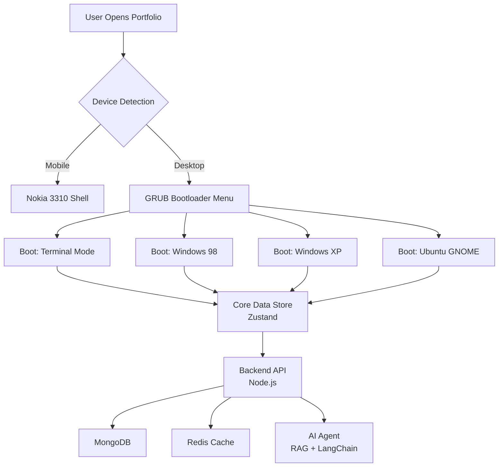
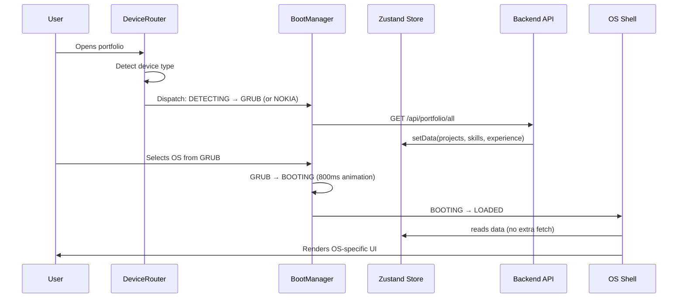
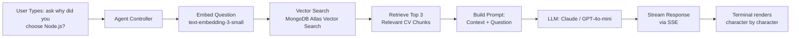
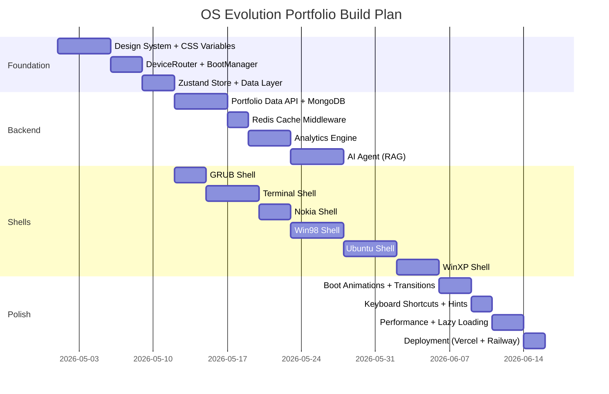

# 🖥️ OS Evolution Portfolio — Master Reference

> **"الـ Portfolio مش بس بيعرض شغلك — هو نفسه شغلك."**
> آخر تحديث: 2026 | Stack: Next.js 14 · TypeScript · Node.js · MongoDB · Redis · LangChain

---

## 📋 Table of Contents

- [[#📖 Project Description — الوصف التفصيلي]]
- [[#🌊 Full User Flow — كل خطوة بالتفصيل]]
- [[#🗺️ The Big Picture — Project Map]]
- [[#🎨 Design System — CSS Variables لكل OS]]
- [[#⚙️ Frontend Architecture]]
- [[#🧠 Backend Architecture]]
- [[#🤖 AI Layer]]
- [[#📱 Mobile — Nokia 3310 Experience]]
- [[#🚀 Build Phases — الـ Roadmap]]
- [[#🎯 Interview Defense Cheatsheet]]

---

## 📖 Project Description — الوصف التفصيلي

### ما هو المشروع؟

**OS Evolution Portfolio** هو Portfolio شخصي لـ Software Engineer — لكنه مش مجرد صفحة بيانات. هو **تجربة تفاعلية كاملة** مبنية على فكرة واحدة محورية:

> *تطور أنظمة التشغيل من الـ CLI الخام للـ Modern Desktop هو نفسه تطور أي Engineer من Junior لـ Senior — من الـ raw terminal thinking للـ polished system design.*

الـ Portfolio نفسه هو الـ Portfolio. مش بس بيعرض شغلك — هو **نفسه شغل** يعكس مستواك التقني وطريقة تفكيرك.

---

### الفكرة الجوهرية — ليه OS themes؟

لما recruiter بيفتح الـ Portfolio ده، بيشوف حاجة ما شافهاش قبل كده. مش template، مش Webflow، مش "أنا حاطت صورتي وشوية projects." ده **signal فوري** بيقول:

- الشخص ده بيفكر في الـ UX كـ architecture decision
- عنده معرفة تاريخية بالـ computing
- قادر يبني abstraction layers متعددة فوق بعضها
- بيهتم بالـ details للدرجة إن الـ Portfolio نفسه فيه design system كامل

كل ده من غير ما تقول كلمة واحدة عن نفسك.

---

### المكونات الرئيسية للمشروع

المشروع بيتكون من **3 طبقات أساسية** فوق بعضها:

**الطبقة الأولى — Experience Layer (الـ Frontend Shells)**
خمس تجارب مرئية مختلفة تماماً، بيختار منها اليوزر:
- **GRUB Bootloader** — شاشة الإقلاع الأولى (entry point)
- **Terminal/CLI Mode** — لمحبي الـ command line والـ technical recruiters
- **Windows 98** — نوستالجيا + humor + retro aesthetics
- **Windows XP** — الـ Luna theme الأشهر في تاريخ الـ computing
- **Ubuntu GNOME** — الـ Linux desktop للـ open source community
- **Nokia 3310** — الـ mobile fallback (عالم منفصل تماماً)

**الطبقة الثانية — Data Layer (الـ Backend API)**
Brain واحد بيغذي كل الـ shells بنفس البيانات — لكن بـ formats مختلفة حسب كل OS. MongoDB للـ persistence، Redis للـ caching، analytics engine بيسجل كل interaction.

**الطبقة الثالثة — Intelligence Layer (الـ AI Agent)**
RAG agent في الـ Terminal shell يقدر يجاوب على أسئلة الـ recruiters عن تجربتك — بيقرأ من الـ CV بتاعك كـ knowledge base.

---

### الـ Target Audience

المشروع بيخاطب **3 أنواع من الناس** بطريقة مختلفة لكل واحد:

| الجمهور | الـ Shell اللي هيستخدمه | الـ Message اللي هيوصله |
|---|---|---|
| **Technical Recruiter / Engineer** | Terminal Mode | "الشخص ده بيفكر في systems" |
| **Non-Technical Recruiter / HR** | Windows 98 أو XP | "الشخص ده مبدع ومختلف" |
| **Mobile User** | Nokia 3310 | "الشخص ده بيفكر في كل device" |
| **Linux / Open Source Dev** | Ubuntu GNOME | "الشخص ده من community بتاعنا" |

---

### الـ Tech Stack الكامل

```
┌─────────────────────────────────────────────────┐
│  FRONTEND                                       │
│  Next.js 14 (App Router) + TypeScript           │
│  Tailwind CSS + Custom CSS Variables            │
│  Framer Motion (boot animations)                │
│  Zustand (boot state machine)                   │
└─────────────────────────────────────────────────┘
┌─────────────────────────────────────────────────┐
│  BACKEND                                        │
│  Node.js + Express + TypeScript                 │
│  MongoDB + Mongoose (data + analytics)          │
│  Redis (cache + rate limiting)                  │
│  JWT (admin auth)                               │
└─────────────────────────────────────────────────┘
┌─────────────────────────────────────────────────┐
│  AI LAYER                                       │
│  LangChain.js + OpenAI API                      │
│  MongoDB Atlas Vector Search (RAG)              │
│  Server-Sent Events (streaming)                 │
└─────────────────────────────────────────────────┘
┌─────────────────────────────────────────────────┐
│  DEPLOYMENT                                     │
│  Vercel (Frontend)                              │
│  Railway (Backend API)                          │
│  MongoDB Atlas (Database + Vector Search)       │
│  Upstash (Redis serverless)                     │
└─────────────────────────────────────────────────┘
```

---

## 🌊 Full User Flow — كل خطوة بالتفصيل

### المرحلة صفر — Bootstrap (قبل أي render)

اللحظة اللي اليوزر بيفتح الـ URL، قبل ما يشوف أي حاجة على الشاشة، بيحصل 3 حاجات بالتوازي:

**1. Device Detection**
الـ `DeviceRouter` بيقرأ `window.innerWidth` و `navigator.userAgent`. لو الـ screen أصغر من 768px أو الـ user agent موبايل → يـroute للـ Nokia shell فوراً. لو desktop → يـroute للـ GRUB shell.

**2. Data Prefetch**
في نفس اللحظة، الـ `DataProvider` بيعمل `fetch` لـ `/api/portfolio/all` في الـ background. الـ response بيتخزن في الـ Zustand store. الـ shell مش هتطلب data تاني — هتقرأ من الـ store مباشرة.

**3. Theme Injection**
الـ CSS Variables للـ default theme (GRUB) بتتـinjected على الـ `<html>` element فوراً — قبل أي render — عشان مفيش flash of unstyled content.

```
User hits URL
     │
     ├─→ [Parallel] DeviceRouter: read screen size + UA
     ├─→ [Parallel] DataProvider: fetch /api/portfolio/all
     └─→ [Parallel] ThemeInjector: set data-theme="grub"
                            │
                    All 3 complete
                            │
                    Render first frame
```

---

### المرحلة الأولى — GRUB Bootloader Screen (Desktop)

اليوزر بيشوف شاشة سوداء بالكامل. في المنتصف:

```
GNU GRUB version 2.06

 ┌────────────────────────────────────────────┐
 │ * Terminal Mode (CLI)                      │
 │   Windows 98                               │
 │   Windows XP                               │
 │   Ubuntu 20.04 LTS                         │
 └────────────────────────────────────────────┘

 Use the ↑ and ↓ keys to select which entry is
 highlighted. Press enter to boot the selected OS.

 Mohamed Ashraf Portfolio — 2026
```

**التفاصيل التقنية لهذه الشاشة:**
- الـ cursor على أول option بيـblink بـ CSS animation
- الـ keyboard navigation: `↑` `↓` للتحريك، `Enter` للاختيار
- فيه hint صغير في الـ corner: `[Shift+R] Reboot` — visible طول الوقت
- الـ font: `Share Tech Mono` — بيحاكي الـ BIOS font الحقيقي
- الـ CRT scanlines effect على الشاشة كلها
- مفيش mouse interaction في الـ GRUB screen — keyboard only (authentic experience)
- لو اليوزر ما عملش حاجة في 30 ثانية → auto-boot للـ Terminal كـ default

---

### المرحلة الثانية — Boot Animation (الانتقال)

لما اليوزر يضغط Enter على أي OS:

**الـ Boot State Machine بيتحرك:**
`GRUB` → `BOOTING` → `LOADED`

**الـ Animation بتختلف حسب الـ OS المختار:**

```
Terminal selected:
  → شاشة سوداء تظهر فيها kernel messages تتكتب بسرعة:
    "[    0.000000] Linux version 5.15.0..."
    "[    0.123456] Initializing portfolio subsystem..."
    "[    0.234567] Loading Mohamed's data... OK"
    "[    0.345678] Starting terminal interface..."
    → bash prompt يظهر

Windows 98 selected:
  → شاشة سوداء فيها progress bar أزرق:
    "Windows 98"
    [████████████████░░░░] 80%
    → Windows 98 desktop يظهر

Windows XP selected:
  → الـ XP boot screen الأشهر في التاريخ:
    شعار Windows XP + progress bar متحرك تحته
    → XP desktop يظهر بالـ welcome sound (اختياري)

Ubuntu selected:
  → Ubuntu splash screen مع الـ 5 dots اللي بتضوي
    → GNOME desktop يظهر
```

**الـ Lazy Loading بيحصل هنا:**
`React.lazy()` بتـload الـ OS shell component لأول مرة أثناء الـ boot animation. اليوزر مش حاسس بالـ loading — هو شايل الـ boot animation والـ component بيتحمل في الـ background.

---

### المرحلة الثالثة — داخل كل OS Shell

#### 🖥️ Terminal Shell — الـ CLI Experience

اليوزر بيشوف bash prompt:

```bash
mohamed@portfolio:~$ _
```

الـ shell بيدعم commands حقيقية:

```bash
# Navigation commands
ls                    # بيعرض: about/  projects/  skills/  experience/  contact/
ls projects/          # بيعرض كل المشاريع كـ directories
cat projects/badaly   # بيعرض تفاصيل مشروع Badaly
cd skills/            # بيدخل الـ skills section
cat about.txt         # الـ bio

# Info commands
whoami                # اسمك + title
pwd                   # /home/mohamed/portfolio
uname -a              # بيعرض الـ stack بتاعك بشكل funny
neofetch              # ASCII art + system info (skills + experience)

# AI command
ask "why Node.js?"    # بيستدعي الـ RAG agent
ask "tell me about yourself"

# Easter eggs
sudo rm -rf /         # "Permission denied. Nice try."
vim                   # "You're already in a terminal portfolio, don't push it."
git log               # بيعرض الـ experience timeline كـ git commits

# Meta
help                  # بيعرض كل الـ commands
clear                 # بيمسح الشاشة
exit                  # "There's no escape. Use Shift+R to reboot."
```

**الـ Virtual File System:**
الـ Terminal مش بيعمل real file system — عنده `FileSystem.ts` object بيمثل الـ directory tree وبيـmap كل path لـ data من الـ Zustand store.

---

#### 🪟 Windows 98 Shell — نظام الـ Windows داخل الـ Tab

> [!important] القرار المعماري الأهم في الـ Windows Shells
> كل الـ windows بتفتح **in-place داخل نفس الـ browser tab** — مش browser windows جديدة، مش modals بسيطة. ده **windowing system كامل** مبني بـ React داخل الـ `<Win98Shell />` component. الـ browser tab = الـ monitor. الـ shell div = الـ desktop.

---

**الـ Desktop Layout:**

```
┌─────────────────────────────────────────────────────┐  ← browser tab (100vw × 100vh)
│  🗂️ My Projects    📄 Skills.txt                    │
│                                                     │
│  📁 Experience     📞 Contact Me                    │
│                                                     │
│   ┌──────────────────────────────────┐              │
│   │ 📁 My Projects          _ □ ✕   │  ← window 1  │
│   ├──────────────────────────────────┤              │
│   │  Badaly        │ NodeJS          │              │
│   │  Shabaka       │ React           │              │
│   │  DevArcheology │ MongoDB         │              │
│   └──────────────────────────────────┘              │
│          ┌──────────────────────────────┐           │
│          │ 📄 Badaly.exe        _ □ ✕  │ ← window 2│
│          ├──────────────────────────────┤           │
│          │  AI Phone Agent for Egypt    │           │
│          │  Stack: Node · LangGraph     │           │
│          │  [GitHub] [Live Demo]        │           │
│          └──────────────────────────────┘           │
│                                                     │
├─────────────────────────────────────────────────────┤
│ 🪟Start │ 📁My Projects │ 📄Badaly │    3:47 PM    │  ← Taskbar
└─────────────────────────────────────────────────────┘
```

---

**الـ Window Manager — الـ State:**

```typescript
// كل window في الـ system عبارة عن object في array
interface WindowInstance {
  id:        string;          // unique per instance
  type:      'explorer' | 'project' | 'skills' | 'about' | 'contact';
  title:     string;
  content:   WindowContent;   // الـ data اللي بتتعرض

  // Position & Size
  x:         number;          // من الـ desktop left
  y:         number;          // من الـ desktop top
  width:     number;
  height:    number;

  // State
  isMinimized:  boolean;
  isMaximized:  boolean;
  zIndex:       number;       // للـ focus management
  isFocused:    boolean;
}

// الـ Windows Store
interface WindowsState {
  windows:      WindowInstance[];
  nextZIndex:   number;

  // Actions
  openWindow:   (type, content) => void;   // فتح window جديد
  closeWindow:  (id) => void;              // ✕ button
  minimizeWindow:(id) => void;             // _ button
  maximizeWindow:(id) => void;             // □ button — toggle
  focusWindow:  (id) => void;              // click على window
  moveWindow:   (id, x, y) => void;        // drag
  resizeWindow: (id, w, h) => void;        // resize من الـ corner
}
```

---

**الـ 3 Control Buttons — بالتفصيل:**

**_ Minimize:**
- الـ window بتـdisappear من الـ desktop
- بس بتفضل موجودة في الـ Taskbar في الأسفل كـ button
- بتضغط عليها في الـ Taskbar → بترجع تظهر في نفس مكانها بـ animation

```typescript
minimizeWindow: (id) => {
  // مش بنحذف الـ window — بس بنغير الـ isMinimized flag
  // الـ CSS بيعمل scale(0) animation للـ desktop
  // الـ Taskbar button بيفضل موجود
  set(state => ({
    windows: state.windows.map(w =>
      w.id === id ? { ...w, isMinimized: true, isFocused: false } : w
    )
  }));
}
```

**□ Maximize / Restore:**
- أول ضغطة: الـ window بتـexpand لـ full desktop size (مش full browser — full الـ shell div)
- تاني ضغطة: بترجع لـ size وposition السابقين (بنحفظهم قبل الـ maximize)

```typescript
maximizeWindow: (id) => {
  set(state => ({
    windows: state.windows.map(w => {
      if (w.id !== id) return w;
      if (w.isMaximized) {
        // Restore: ارجع للـ size القديم المحفوظ
        return { ...w, isMaximized: false, ...w.savedBounds };
      } else {
        // Maximize: احفظ الـ bounds الحالية واـexpand
        return {
          ...w,
          isMaximized: true,
          savedBounds: { x: w.x, y: w.y, width: w.width, height: w.height },
          x: 0, y: 0,
          width: desktopWidth,
          height: desktopHeight
        };
      }
    })
  }));
}
```

**✕ Close:**
- بتشيل الـ window من الـ array نهائياً
- لو كانت focused → الـ focus بينتقل للـ window اللي تحتها (أعلى zIndex بعدها)
- لو مفيش windows تانية → الـ desktop يبقى empty

---

**الـ Drag System:**
الـ drag بيحصل بـ `onMouseDown` على الـ title bar بس (مش على الـ content). بيستخدم `pointercapture` عشان الـ drag يفضل شغال حتى لو الـ mouse خرجت من الـ window.

```typescript
const handleDragStart = (e: React.PointerEvent, windowId: string) => {
  e.currentTarget.setPointerCapture(e.pointerId);
  const startX = e.clientX - window.x;
  const startY = e.clientY - window.y;

  const handleMove = (e: PointerEvent) => {
    moveWindow(windowId,
      Math.max(0, e.clientX - startX),   // مينفعش يطلع بره الـ desktop (left)
      Math.max(0, e.clientY - startY)    // مينفعش يطلع فوق الـ taskbar
    );
  };
  // cleanup on pointer up
};
```

---

**الـ Z-Index (Focus) Management:**
لما تضغط على أي window، بتاخد أعلى `zIndex` في الـ system. ده بيضمن إن اللي ضغطت عليه دايماً فوق الباقي.

```typescript
focusWindow: (id) => {
  set(state => ({
    nextZIndex: state.nextZIndex + 1,
    windows: state.windows.map(w => ({
      ...w,
      isFocused: w.id === id,
      zIndex: w.id === id ? state.nextZIndex : w.zIndex
    }))
  }));
}
```

> [!interview] سؤال متوقع
> **"إزاي بتتعامل مع الـ z-index لما تعندك multiple windows؟"**
> بحتفظ بـ `nextZIndex` counter في الـ store. كل ما window تتـfocus، بتاخد الـ current counter وبيـincrement. بالتالي الـ focused window دايماً عندها أعلى z-index من غير ما أحسب حاجة manually.

---

**الـ Taskbar:**
- بتعرض كل الـ windows (minimized وغير minimized) كـ buttons
- الـ focused window بتاخد الـ `--bevel-sunken` style (زي button متضغط)
- الـ minimized window بتاخد opacity أقل
- بتضغط على button لـ window مش minimized → بتـminimize إياها
- بتضغط على button لـ window minimized → بتـrestore إياها

---

**الـ Desktop Icons:**
Double-click على أي icon → بيفتح window جديد. لو نفس الـ window موجود بالفعل وmminimized → بيـrestore بدل ما يفتح واحد جديد.

---

**الـ Content داخل كل Window Type:**

| Window Type | الـ Content |
|---|---|
| `explorer` (My Projects) | File explorer بيعرض المشاريع كـ icons — double click على project يفتح `project` window |
| `project` | Project details: اسم، وصف، tech stack كـ file properties، GitHub و Live Demo links |
| `skills` | Control Panel style: categories على اليسار (Frontend/Backend/AI)، skills على اليمين مع visual indicators |
| `about` | Notepad.exe style: plain text bio |
| `contact` | Outlook Express style: form بيشبه compose email |

---

#### 🐧 Ubuntu GNOME Shell

اليوزر بيشوف:
- **Top Panel** فيه: Activities button، الوقت في المنتصف، system icons على اليمين
- **Left Dock** فيه app icons: Projects، Skills، Experience، Contact
- **Desktop** نظيف بـ wallpaper

> [!note] نفس الـ Window Manager
> الـ Ubuntu shell بيستخدم **نفس الـ WindowManager architecture** بالظبط — بس بـ Ubuntu styling. الـ window controls هنا على اليسار (زي macOS / GNOME default) بدل اليمين، والـ buttons دوائر ملونة مش مستطيلات.

**الـ Activities Overview:**
لما بيضغط Activities أو الـ Super key → بيشوف الـ GNOME overview بالـ projects كـ app thumbnails.

**الـ Admin Dashboard (Secret Feature):**
في الـ terminal داخل الـ Ubuntu shell، لو كتب password معين → بيفتحله analytics dashboard بيعرض real-time stats عن الـ portfolio visitors.

---

#### 🖥️ Windows XP Shell

نفس مفهوم الـ Win98 بس بـ:
- Luna theme (الـ rounded corners والـ gradients)
- الـ My Computer → يفتح الـ projects
- الـ taskbar بالـ XP style
- الـ welcome screen لما بيـboot

---

### المرحلة الرابعة — الـ Reboot (Shift+R)

في أي وقت، أي مكان، في أي OS shell:

اليوزر بيضغط `Shift+R` →

```
State Machine: LOADED → REBOOTING → GRUB

Animation:
  1. الشاشة بتـfade to black (300ms)
  2. نص بيظهر: "System rebooting..."
  3. بعد 800ms: GRUB menu بيرجع يظهر
```

الـ global `KeyboardShortcuts` component مـmounted على مستوى الـ app كله — مش داخل كل shell. بالتالي `Shift+R` شغالة من أي مكان.

---

### المرحلة الخامسة — Nokia 3310 (Mobile Flow)

الـ mobile user مش بيشوف GRUB خالص. مباشرة بيشوف:

**الـ Nokia Device:**
صورة ثلاثية الأبعاد للـ Nokia 3310 في المنتصف. الـ LCD screen فيه menu:

```
┌──────────────┐
│  Portfolio   │
│              │
│  1. Messages │  ← Projects
│  2. Contacts │  ← Skills
│  3. Games    │  ← Easter egg
│  4. Settings │  ← About me
└──────────────┘
```

**الـ Navigation:**
بالـ on-screen Nokia buttons (أو swipe gestures). كل "app" بيفتح في الـ LCD screen كـ nested menu.

**الـ Marquee:**
في أسفل الـ screen — scrolling text بيقول: *"For the full OS Evolution experience, open this portfolio on a desktop."*

**الـ Snake Easter Egg:**
في "3. Games" → لعبة Snake حقيقية على الـ Nokia screen. بتـscore points = بتـunlock "achievements" زي "You found the Easter egg! Now open me on desktop."

---

### الـ Data Journey — من الـ API للـ Screen

```
Backend API
    │
    │  GET /api/portfolio/all
    │  Response: { projects[], skills[], experience[], meta{} }
    │
    ↓
Redis Cache (24hr TTL)
    │  أول request: miss → يجيب من MongoDB → يخزن في Redis
    │  باقي requests: hit → يرجع من Redis مباشرة
    ↓
Zustand Store (Client)
    │  setData() → single source of truth
    │  كل الـ shells بتقرأ منه
    ↓
Shell-Specific Renderer
    │  Terminal: بيحول projects لـ directory tree
    │  Win98: بيحول projects لـ window objects
    │  Ubuntu: بيحول projects لـ app entries
    │  Nokia: بيحول projects لـ SMS messages
    ↓
User Screen
```

---

### الـ Analytics Journey — من الـ Visit للـ Dashboard

```
User Opens Portfolio
    │
    │  Browser generates anonymous sessionId (UUID)
    ↓
DeviceRouter detects OS type
    │
    │  POST /api/analytics/session
    │  { sessionId, deviceType, timestamp, IP }
    ↓
User Selects OS from GRUB
    │
    │  PATCH /api/analytics/session/:id
    │  { chosenOS: "terminal" }
    ↓
User Navigates Sections
    │
    │  PATCH /api/analytics/session/:id
    │  { sectionsVisited: ["projects"], timePerSection: { projects: 45000 } }
    ↓
User Closes Tab / Session Ends
    │
    │  beacon API: navigator.sendBeacon("/api/analytics/end", data)
    │  (بـ sendBeacon عشان بيتبعت حتى لو الـ tab اتقفل)
    ↓
MongoDB stores Visit document
    │
    │  TTL Index: auto-delete after 90 days
    ↓
Admin Dashboard (Ubuntu Terminal)
    │
    │  GET /api/analytics/dashboard (requires JWT)
    │  MongoDB $facet aggregation
    ↓
Real-time stats on screen
```

---

## 🗺️ The Big Picture — Project Map



---

## 🎨 Design System — CSS Variables لكل OS

> [!important] القاعدة الذهبية
> كل OS عنده **theme isolated** خاص بيه. الـ `data-theme` attribute على الـ `<html>` tag هو اللي بيتحكم. مفيش hardcoded colors في أي component — كل حاجة من الـ variables.

### الـ Global Reset + Font Imports

```css
/* globals.css */
@import url('https://fonts.googleapis.com/css2?family=VT323&family=Share+Tech+Mono&display=swap');

*, *::before, *::after {
  box-sizing: border-box;
  margin: 0;
  padding: 0;
}

:root {
  /* === GLOBAL TOKENS === */
  --transition-boot: 800ms cubic-bezier(0.23, 1, 0.32, 1);
  --transition-fast: 150ms ease;
  --font-mono: 'Share Tech Mono', monospace;
  --font-pixel: 'VT323', monospace;
  --font-system: -apple-system, 'Segoe UI', sans-serif;
  --scanline-opacity: 0.03;
  --crt-blur: 0.5px;
}
```

---

### 🟫 Theme 1 — GRUB Bootloader

```css
[data-theme="grub"] {
  /* Colors */
  --bg-primary:       #000000;
  --bg-secondary:     #0000AA;   /* classic GRUB blue highlight */
  --text-primary:     #AAAAAA;
  --text-accent:      #FFFFFF;
  --text-selected:    #000000;
  --bg-selected:      #AAAAAA;
  --border-color:     #555555;

  /* Typography */
  --font-ui:          var(--font-mono);
  --font-size-base:   16px;
  --line-height:      1.4;

  /* Layout */
  --padding-screen:   2rem;
  --menu-item-height: 1.8rem;

  /* Effects */
  --glow-color:       transparent;
  --scanlines:        1;          /* boolean flag للـ JS */
}
```

> [!tip] GRUB Effect
> بتعمل scanlines بـ pseudo-element على الـ `body`:
> ```css
> [data-theme="grub"] body::after {
>   content: '';
>   position: fixed; inset: 0;
>   background: repeating-linear-gradient(
>     0deg,
>     transparent,
>     transparent 2px,
>     rgba(0,0,0,var(--scanline-opacity)) 2px,
>     rgba(0,0,0,var(--scanline-opacity)) 4px
>   );
>   pointer-events: none;
>   z-index: 9999;
> }
> ```

---

### 🪟 Theme 2 — Windows 98

```css
[data-theme="win98"] {
  /* The iconic silver palette */
  --bg-primary:       #008080;   /* teal desktop */
  --bg-window:        #C0C0C0;   /* classic silver */
  --bg-titlebar:      #000080;   /* navy title bar */
  --bg-titlebar-end:  #1084D0;   /* gradient end */
  --text-primary:     #000000;
  --text-titlebar:    #FFFFFF;
  --text-link:        #0000EE;
  --text-visited:     #551A8B;

  /* Beveled Borders — الـ secret sauce */
  --border-light:     #FFFFFF;
  --border-mid:       #DFDFDF;
  --border-dark:      #808080;
  --border-darker:    #000000;

  /* بيتستخدموا كـ box-shadow مش border */
  --bevel-raised:
    inset -1px -1px 0 var(--border-darker),
    inset  1px  1px 0 var(--border-light),
    inset -2px -2px 0 var(--border-dark),
    inset  2px  2px 0 var(--border-mid);
  --bevel-sunken:
    inset  1px  1px 0 var(--border-darker),
    inset -1px -1px 0 var(--border-light),
    inset  2px  2px 0 var(--border-dark),
    inset -2px -2px 0 var(--border-mid);

  /* Typography */
  --font-ui:          'MS Sans Serif', var(--font-system);
  --font-size-base:   11px;
  --font-size-title:  11px;

  /* Taskbar */
  --taskbar-height:   28px;
  --taskbar-bg:       var(--bg-window);
  --startbtn-bg:      var(--bg-window);
}
```

> [!example] Win98 Button Component
> ```css
> .win98-btn {
>   background: var(--bg-window);
>   box-shadow: var(--bevel-raised);
>   border: none;
>   padding: 3px 8px;
>   font-family: var(--font-ui);
>   font-size: var(--font-size-base);
>   cursor: pointer;
> }
> .win98-btn:active {
>   box-shadow: var(--bevel-sunken);
>   padding: 4px 7px 2px 9px; /* optical shift on press */
> }
> ```

---

### 🪟 Theme 3 — Windows XP

```css
[data-theme="winxp"] {
  /* Luna Theme — الـ green/blue classic */
  --bg-desktop:       #3A6EA5;   /* XP blue desktop */
  --bg-window:        #ECE9D8;   /* Luna beige */
  --bg-titlebar-start:#0A246A;
  --bg-titlebar-end:  #A6CAF0;
  --bg-taskbar:       #245EDC;
  --bg-start-btn:     #3C8B2E;   /* green start button */

  --text-primary:     #000000;
  --text-titlebar:    #FFFFFF;
  --text-shadow-title:rgba(0,0,0,0.5);

  /* XP Rounded Corners */
  --radius-window:    8px 8px 0 0;
  --radius-btn:       4px;

  /* XP Gloss Effect (CSS only) */
  --gloss-overlay:    linear-gradient(
    180deg,
    rgba(255,255,255,0.4) 0%,
    rgba(255,255,255,0.1) 50%,
    transparent 51%
  );

  /* Titlebar Gradient */
  --titlebar-gradient: linear-gradient(
    180deg,
    var(--bg-titlebar-start),
    var(--bg-titlebar-end)
  );

  --font-ui:          'Tahoma', var(--font-system);
  --font-size-base:   11px;
  --taskbar-height:   30px;
}
```

---

### 🐧 Theme 4 — Ubuntu GNOME

```css
[data-theme="ubuntu"] {
  /* Ubuntu 20.04 Yaru Theme */
  --bg-primary:       #2C2C2C;   /* dark panel */
  --bg-desktop:       #1B1B1B;
  --bg-window:        #3B3B3B;
  --bg-window-header: #454545;
  --bg-sidebar:       #2C2C2C;
  --bg-searchbar:     #1B1B1B;
  --bg-hover:         rgba(255,255,255,0.08);
  --bg-active:        rgba(255,255,255,0.14);

  --accent-orange:    #E95420;   /* Ubuntu orange — الـ brand color */
  --accent-orange-light: #F47B40;
  --accent-orange-dark:  #C34113;

  --text-primary:     #FFFFFF;
  --text-secondary:   rgba(255,255,255,0.7);
  --text-disabled:    rgba(255,255,255,0.35);

  /* Window Controls (traffic lights) */
  --btn-close:        #E95420;
  --btn-minimize:     #8B8B8B;
  --btn-maximize:     #8B8B8B;

  /* Typography */
  --font-ui:          'Ubuntu', 'Cantarell', var(--font-system);
  --font-size-base:   13px;
  --font-size-sm:     11px;

  /* Layout */
  --panel-height:     32px;     /* top GNOME panel */
  --dock-width:       48px;     /* left dock */
  --radius-window:    12px;
  --radius-btn:       6px;
  --radius-app-icon:  12px;

  /* Shadows */
  --shadow-window:    0 16px 48px rgba(0,0,0,0.6),
                      0 4px 16px rgba(0,0,0,0.4);
  --shadow-panel:     0 2px 8px rgba(0,0,0,0.5);
}
```

---

### 📱 Theme 5 — Nokia 3310

```css
[data-theme="nokia"] {
  /* Nokia 3310 — Classic Snake Era */
  --bg-device:        #2B3A2B;   /* dark green body */
  --bg-screen:        #9BBB0E;   /* iconic greenish LCD */
  --bg-screen-dark:   #8BAA0D;
  --bg-pixel-off:     #8BAA0D;
  --bg-pixel-on:      #0F380F;   /* dark pixel color */

  --text-primary:     #0F380F;   /* dark green on light screen */
  --text-secondary:   #2D5A1B;
  --bg-menu-selected: #0F380F;
  --text-selected:    #9BBB0E;

  /* Nokia Button Colors */
  --btn-nav:          #1A2A1A;
  --btn-call:         #1A3A1A;
  --btn-end:          #3A1A1A;

  /* Screen dimensions (fixed — Nokia screen was tiny) */
  --screen-width:     168px;    /* Nokia 3310 native: 84x48, بس 2x scale */
  --screen-height:    96px;
  --screen-padding:   4px;

  /* Pixel font */
  --font-ui:          var(--font-pixel);
  --font-size-base:   14px;
  --font-size-sm:     12px;

  /* LCD Effect */
  --lcd-grid:         rgba(15,56,15,0.05);
}
```

> [!tip] Nokia LCD Grid Effect
> ```css
> [data-theme="nokia"] .screen::before {
>   content: '';
>   position: absolute; inset: 0;
>   background-image:
>     linear-gradient(var(--lcd-grid) 1px, transparent 1px),
>     linear-gradient(90deg, var(--lcd-grid) 1px, transparent 1px);
>   background-size: 2px 2px;
>   pointer-events: none;
>   z-index: 10;
> }
> ```

---

### 🖥️ Theme 6 — Terminal (CLI Mode)

```css
[data-theme="terminal"] {
  /* Classic Green-on-Black CRT */
  --bg-primary:       #0D0D0D;
  --bg-secondary:     #111111;

  /* Terminal Color Variants */
  --term-green:       #00FF41;   /* matrix green */
  --term-green-dim:   #003B00;
  --term-amber:       #FFB000;   /* amber variant — للـ toggle */
  --term-white:       #F8F8F8;

  /* Default: green mode */
  --text-primary:     var(--term-green);
  --text-secondary:   rgba(0,255,65,0.6);
  --text-dim:         rgba(0,255,65,0.3);
  --text-error:       #FF4444;
  --text-success:     #00FF41;
  --text-warning:     #FFB000;
  --text-info:        #00BFFF;

  /* Cursor */
  --cursor-color:     var(--term-green);
  --cursor-width:     8px;
  --cursor-height:    16px;

  /* Prompt */
  --prompt-user:      #00FF41;
  --prompt-at:        rgba(0,255,65,0.5);
  --prompt-host:      #00BFFF;
  --prompt-path:      #FFB000;
  --prompt-symbol:    rgba(0,255,65,0.7);

  /* Typography */
  --font-ui:          var(--font-mono);
  --font-size-base:   15px;
  --line-height:      1.6;
  --letter-spacing:   0.02em;

  /* CRT Effects */
  --glow-intensity:   0 0 8px currentColor;
  --glow-strong:      0 0 20px currentColor, 0 0 40px currentColor;
}
```

> [!example] Terminal Text Glow
> ```css
> [data-theme="terminal"] .output-line {
>   text-shadow: var(--glow-intensity);
>   color: var(--text-primary);
> }
> [data-theme="terminal"] .command-text {
>   text-shadow: var(--glow-strong);
> }
> ```

---

## ⚙️ Frontend Architecture

### Component Tree

```
app/
├── layout.tsx              ← ProviderWrapper + DeviceRouter
├── page.tsx                ← Entry: renders <PortfolioRoot />
│
├── components/
│   ├── core/
│   │   ├── DeviceRouter.tsx       ← mobile vs desktop split
│   │   ├── BootManager.tsx        ← state machine
│   │   └── DataProvider.tsx       ← fetches API, feeds Store
│   │
│   ├── shells/
│   │   ├── GrubShell/
│   │   │   ├── index.tsx
│   │   │   └── MenuSelector.tsx
│   │   ├── TerminalShell/
│   │   │   ├── index.tsx
│   │   │   ├── CommandParser.ts   ← أهم ملف في الشيل ده
│   │   │   ├── FileSystem.ts      ← virtual FS
│   │   │   └── AskAgent.tsx       ← AI integration
│   │   ├── Win98Shell/
│   │   ├── WinXPShell/
│   │   ├── UbuntuShell/
│   │   └── NokiaShell/
│   │
│   └── shared/
│       ├── LoadingScreen.tsx      ← boot animation بين الـ shells
│       └── KeyboardShortcuts.tsx  ← Shift+R global listener
│
├── store/
│   └── portfolioStore.ts          ← Zustand store
│
├── hooks/
│   ├── useBootState.ts
│   ├── useDeviceType.ts
│   └── useKeyboardShortcut.ts
│
└── styles/
    ├── globals.css                ← الـ variables + reset
    ├── themes/
    │   ├── grub.css
    │   ├── win98.css
    │   ├── winxp.css
    │   ├── ubuntu.css
    │   ├── terminal.css
    │   └── nokia.css
    └── animations.css
```

---

### الـ Boot State Machine

```typescript
// store/portfolioStore.ts
type BootPhase =
  | 'DETECTING'   // device detection
  | 'GRUB'        // GRUB menu shown
  | 'BOOTING'     // animation running
  | 'LOADED'      // OS shell active
  | 'REBOOTING';  // Shift+R pressed

type OS = 'terminal' | 'win98' | 'winxp' | 'ubuntu' | 'nokia';

interface PortfolioState {
  phase: BootPhase;
  activeOS: OS | null;
  data: PortfolioData | null;
  isLoading: boolean;
  // Actions
  selectOS: (os: OS) => void;
  reboot: () => void;
  setData: (data: PortfolioData) => void;
}
```

> [!interview] سؤال متوقع
> **"ليه useReducer مش useState للـ boot state?"**
> لأن الـ state transitions هنا بتبعت rules — مثلاً `BOOTING` مينفعش يروح `GRUB` مباشرة من غير `REBOOTING`. الـ `useReducer` بيخليك تـenforce الـ valid transitions زي الـ state machine الصح.

---

### Data Flow Diagram



---

### Shell-Aware API Requests

```typescript
// كل shell بتطلب نفس الـ data بـ format مختلف
const fetchProjects = async (shell: OS) => {
  const params = new URLSearchParams({ format: shell });
  // Terminal يرجع: { name, description, tech[], github }
  // Win98 يرجع: { name, icon, size, modified, type: 'exe'|'folder' }
  // Ubuntu يرجع: { name, thumbnail, category, launchCmd }
  return fetch(`/api/projects?${params}`);
};
```

---

## 🧠 Backend Architecture

### Project Structure

```
portfolio-api/
├── src/
│   ├── modules/
│   │   ├── portfolio/
│   │   │   ├── portfolio.controller.ts
│   │   │   ├── portfolio.service.ts
│   │   │   ├── portfolio.model.ts
│   │   │   └── portfolio.routes.ts
│   │   │
│   │   ├── analytics/
│   │   │   ├── analytics.controller.ts
│   │   │   ├── analytics.service.ts
│   │   │   ├── analytics.model.ts   ← Visit schema
│   │   │   └── analytics.routes.ts
│   │   │
│   │   └── ai/
│   │       ├── agent.controller.ts
│   │       ├── agent.service.ts     ← RAG logic
│   │       └── agent.routes.ts
│   │
│   ├── middleware/
│   │   ├── rateLimit.ts             ← express-rate-limit + Redis store
│   │   ├── cache.ts                 ← Redis cache middleware
│   │   ├── geoip.ts                 ← IP → Country
│   │   └── auth.ts                  ← JWT for admin dashboard
│   │
│   ├── config/
│   │   ├── db.ts                    ← MongoDB connection
│   │   ├── redis.ts                 ← Redis client
│   │   └── env.ts                   ← zod env validation
│   │
│   └── app.ts
│
├── swagger.yaml
└── package.json
```

---

### MongoDB Schemas

```typescript
// Analytics Visit Schema
const VisitSchema = new Schema({
  sessionId:      { type: String, required: true },
  deviceType:     { type: String, enum: ['desktop', 'mobile'] },
  chosenOS:       { type: String, enum: ['terminal','win98','winxp','ubuntu','nokia'] },
  sectionsVisited:{ type: [String] },
  timePerSection: { type: Map, of: Number },   // { "projects": 45000 }
  terminalCmds:   { type: [String] },          // لو استخدم terminal
  country:        { type: String },
  city:           { type: String },
  createdAt:      { type: Date, default: Date.now, index: true }
}, { timestamps: false });

// TTL Index — بتحذف visits القديمة أوتوماتيك بعد 90 يوم
VisitSchema.index({ createdAt: 1 }, { expireAfterSeconds: 60 * 60 * 24 * 90 });
```

> [!interview] سؤال متوقع
> **"إيه الـ TTL Index وليه استخدمته هنا؟"**
> TTL = Time To Live. MongoDB feature بتحذف documents أوتوماتيك بعد مدة معينة. استخدمته للـ analytics عشان مش محتاج أحتفظ بـ visit data للأبد — بعد 90 يوم بتتحذف لوحدها من غير cron job.

---

### Redis Cache Middleware

```typescript
// middleware/cache.ts
const cache = (ttlSeconds: number) => async (req, res, next) => {
  const key = `portfolio:${req.path}:${JSON.stringify(req.query)}`;
  const cached = await redis.get(key);

  if (cached) {
    res.setHeader('X-Cache', 'HIT');
    return res.json(JSON.parse(cached));
  }

  // Override res.json to intercept and cache
  const originalJson = res.json.bind(res);
  res.json = (data) => {
    redis.setEx(key, ttlSeconds, JSON.stringify(data));
    res.setHeader('X-Cache', 'MISS');
    return originalJson(data);
  };
  next();
};

// Usage: router.get('/projects', cache(86400), controller.getProjects)
// 86400 = 24 hours
```

---

### Analytics Aggregation Pipeline

```typescript
// analytics.service.ts — للـ admin dashboard في Ubuntu shell
const getDashboardStats = async () => {
  return Visit.aggregate([
    { $facet: {
      totalVisits: [{ $count: 'count' }],

      byOS: [
        { $group: { _id: '$chosenOS', count: { $sum: 1 } } },
        { $sort: { count: -1 } }
      ],

      avgSessionTime: [
        { $group: { _id: null, avg: { $avg: { $sum: { $objectToArray: '$timePerSection' } } } } }
      ],

      topCountries: [
        { $group: { _id: '$country', visits: { $sum: 1 } } },
        { $sort: { visits: -1 } },
        { $limit: 5 }
      ],

      topTerminalCmds: [
        { $unwind: '$terminalCmds' },
        { $group: { _id: '$terminalCmds', count: { $sum: 1 } } },
        { $sort: { count: -1 } },
        { $limit: 10 }
      ]
    }}
  ]);
};
```

> [!interview] سؤال متوقع
> **"إيه الـ $facet في MongoDB؟"**
> بيخليك تعمل multiple aggregation pipelines في نفس الـ query وترجعهم كـ object واحد. بدل 5 queries منفصلين — request واحد بيرجع كل الـ dashboard data.

---

## 🤖 AI Layer

### Architecture: "Ask Mohamed" RAG Agent



### Implementation

```typescript
// ai/agent.service.ts
import { ChatOpenAI } from '@langchain/openai';
import { MongoDBAtlasVectorSearch } from '@langchain/mongodb';

// الـ CV بتاعك بيتقسم لـ chunks وبيتخزن كـ vectors في MongoDB
// كل chunk ممكن يكون: project description, skill, experience entry

const askAgent = async (question: string, res: Response) => {
  // 1. Vector search للـ relevant context
  const vectorStore = new MongoDBAtlasVectorSearch(embeddings, {
    collection: db.collection('cv_vectors'),
    indexName: 'cv_index',
  });

  const relevantDocs = await vectorStore.similaritySearch(question, 3);
  const context = relevantDocs.map(d => d.pageContent).join('\n---\n');

  // 2. Build prompt
  const systemPrompt = `
    أنت Mohamed، Backend Engineer مصري متخصص في Node.js وAI systems.
    بتجاوب على أسئلة الـ recruiters عن تجربتك.
    إجاباتك: مختصرة، واثقة، ومبنية على الـ context الموجود فقط.
    لو السؤال مش في الـ context: قول "اسألني في الـ contact form عشان نتكلم بتفصيل."
    Context:
    ${context}
  `;

  // 3. Stream response (Server-Sent Events)
  res.setHeader('Content-Type', 'text/event-stream');
  res.setHeader('Cache-Control', 'no-cache');

  const llm = new ChatOpenAI({ model: 'gpt-4o-mini', streaming: true });

  const stream = await llm.stream([
    { role: 'system', content: systemPrompt },
    { role: 'user', content: question }
  ]);

  for await (const chunk of stream) {
    res.write(`data: ${JSON.stringify({ text: chunk.content })}\n\n`);
  }
  res.write('data: [DONE]\n\n');
  res.end();
};
```

---

### Terminal Commands للـ AI

```bash
# Commands يقدر اليوزر يكتبهم في الـ Terminal shell
$ ask "what's your experience with distributed systems?"
$ ask "why should I hire you for a backend role?"
$ ask "tell me about badaly"
$ ask "what's your strongest technical skill?"

# الـ CommandParser بيـroute أي command يبدأ بـ "ask" للـ AI agent
```

---

## 📱 Mobile — Nokia 3310 Experience

### Layout Structure

```
┌─────────────────────┐
│  ┌───────────────┐  │
│  │ Mohamed Folio │  │  ← Nokia header bar
│  │ 14:32  ||||  │  │  ← time + signal
│  └───────────────┘  │
│                     │
│  ┌───────────────┐  │  ← LCD Screen (168×96px scaled)
│  │📨 Messages    │  │
│  │   > Projects  │  │
│  │               │  │
│  │📒 Contacts    │  │
│  │   > Skills    │  │
│  └───────────────┘  │
│                     │
│  ┌─────────────────────────────────────────┐  │
│  │ For full OS experience — open on desktop │  │  ← Marquee
│  └─────────────────────────────────────────┘  │
│                     │
│  [◀]  [✓OK]  [▶]   │  ← Nokia nav buttons
│  [ 1 ][ 2 ][ 3 ]   │
│  [ 4 ][ 5 ][ 6 ]   │
│  [ 7 ][ 8 ][ 9 ]   │
│  [* ][ 0 ][ # ]   │
└─────────────────────┘
```

### Nokia Marquee Component

```tsx
// الـ scrolling message
const NokiaMarquee = () => (
  <div className="marquee-container">
    <span className="marquee-text">
      📡 For the full OS Evolution experience, open this portfolio on a desktop.
      Try: Terminal Mode · Windows 98 · Windows XP · Ubuntu GNOME
      &nbsp;&nbsp;&nbsp;&nbsp;&nbsp;
    </span>
  </div>
);
```

```css
.marquee-container {
  width: var(--screen-width);
  overflow: hidden;
  background: var(--bg-pixel-on);
  color: var(--bg-screen);
  font-family: var(--font-pixel);
  font-size: 10px;
  padding: 2px 0;
  white-space: nowrap;
}

.marquee-text {
  display: inline-block;
  animation: marquee 20s linear infinite;
}

@keyframes marquee {
  from { transform: translateX(var(--screen-width)); }
  to   { transform: translateX(-100%); }
}
```

---

## 🚀 Build Phases — الـ Roadmap



---

### Phase Breakdown

| Phase | ما بتبنيه | الـ Tier | أهم Interview Concept |
|---|---|---|---|
| **1 — Foundation** | Design System · DeviceRouter · Store | 100% بإيدك | CSS Custom Properties · State Machines |
| **2 — Backend API** | MongoDB · Redis · Swagger | 100% بإيدك | Cache-aside · Rate Limiting |
| **3 — Analytics** | Visit tracking · Aggregations | 100% بإيدك | MongoDB `$facet` · TTL Index |
| **4 — AI Agent** | RAG · Embeddings · SSE Streaming | بإيدك + AI للـ boilerplate | RAG Architecture · SSE vs WebSocket |
| **5 — Shells UI** | GRUB · Terminal · Nokia | Structure بإيدك · CSS بـ AI | Lazy Loading · `React.lazy()` |
| **6 — Win98/XP/Ubuntu** | Complex UI shells | AI للـ visual details | Code Splitting · `Suspense` |
| **7 — Polish** | Animations · Perf · Deploy | Mixed | Core Web Vitals · Bundle Size |

---

## 🪟 Window Manager — Drag, Resize & Right-Click (التفصيل الكامل)

> [!important] الفلسفة الأساسية
> الـ Window Manager ده هو أعقد جزء في الـ Frontend بالكامل. هو نظام مستقل بذاته — زي الـ compositor في الـ real OS. كل حاجة تانية في الـ shell بتـdepend عليه. لازم يتبنى أولاً وبشكل صح قبل أي shell content.

---

### الـ Mental Model — فكّر فيه زي الـ Real OS

```
Browser Tab
└── Shell Div (position: relative — ده الـ "monitor")
    ├── Desktop Layer       (z-index: 0)  — الـ wallpaper + icons
    ├── Windows Layer       (z-index: 10-999) — الـ windows نفسها
    ├── Context Menu Layer  (z-index: 1000) — فوق كل حاجة
    └── Dialog Layer        (z-index: 2000) — MessageBox فوق كل حاجة
```

الـ Shell Div ده هو الـ coordinate system كله. كل `x, y` في الـ window state محسوبة منه — مش من الـ browser viewport.

---

### الـ State الكامل للـ Window Manager

```typescript
// types/window.types.ts

interface Bounds {
  x:      number;
  y:      number;
  width:  number;
  height: number;
}

interface WindowInstance {
  id:           string;        // nanoid() — unique per open
  type:         WindowType;    // 'explorer' | 'project' | 'skills' | 'about' | 'contact'
  title:        string;
  icon:         string;        // emoji أو SVG path
  content:      WindowContent;

  // Position & Size
  bounds:       Bounds;        // الـ current position وsize
  savedBounds:  Bounds | null; // بيتحفظ قبل الـ maximize

  // State Flags
  isMinimized:  boolean;
  isMaximized:  boolean;
  isFocused:    boolean;
  isShaking:    boolean;       // error animation

  // Z-Index
  zIndex:       number;

  // Constraints
  minWidth:     number;        // default: 200
  minHeight:    number;        // default: 150
  resizable:    boolean;       // بعض الـ dialogs مش قابلة للـ resize
  draggable:    boolean;
}

// الـ Zustand Store
interface WindowManagerStore {
  windows:     WindowInstance[];
  nextZIndex:  number;
  desktopRef:  RefObject<HTMLDivElement> | null; // لحساب الـ bounds

  // Window Lifecycle
  openWindow:    (config: Partial<WindowInstance>) => string; // بيرجع الـ id
  closeWindow:   (id: string) => void;
  minimizeWindow:(id: string) => void;
  maximizeWindow:(id: string) => void;
  restoreWindow: (id: string) => void;
  focusWindow:   (id: string) => void;
  shakeWindow:   (id: string) => void; // error feedback

  // Position & Size
  setWindowBounds:(id: string, bounds: Partial<Bounds>) => void;

  // Queries
  getFocusedWindow: () => WindowInstance | undefined;
  getWindowById:    (id: string) => WindowInstance | undefined;
}
```

---

### Part 1 — الـ DRAG System (بالتفصيل الممل)

#### الـ Drag Handle

الـ drag بيحصل من الـ **title bar فقط** — مش الـ content. والـ title bar عندها `useDrag` hook مستقل.

#### المشكلة الكلاسيكية: الـ Mouse Leaves the Window

لو استخدمت `onMouseMove` على الـ window نفسها، الـ drag بيوقف لما الـ mouse تتحرك بسرعة وتخرج من الـ window. الحل: **Pointer Capture API**.

```typescript
// hooks/useDrag.ts
import { useCallback, useRef } from 'react';
import { useWindowManager } from '@/store/windowManager';

interface DragState {
  isDragging:    boolean;
  startMouseX:   number;
  startMouseY:   number;
  startWindowX:  number;
  startWindowY:  number;
}

export const useDrag = (windowId: string) => {
  const { setWindowBounds, focusWindow, getWindowById } = useWindowManager();
  const dragState = useRef<DragState | null>(null);
  const titleBarRef = useRef<HTMLDivElement>(null);

  const onPointerDown = useCallback((e: React.PointerEvent<HTMLDivElement>) => {
    // مهم: بس الـ left mouse button
    if (e.button !== 0) return;

    const win = getWindowById(windowId);
    if (!win || win.isMaximized) return; // maximize → مش قابلة للـ drag

    // Focus the window on drag start
    focusWindow(windowId);

    // Capture pointer — الـ events هتفضل تيجي حتى لو الـ mouse خرجت
    e.currentTarget.setPointerCapture(e.pointerId);

    dragState.current = {
      isDragging:   true,
      startMouseX:  e.clientX,
      startMouseY:  e.clientY,
      startWindowX: win.bounds.x,
      startWindowY: win.bounds.y,
    };

    // Prevent text selection أثناء الـ drag
    e.preventDefault();
  }, [windowId]);

  const onPointerMove = useCallback((e: React.PointerEvent<HTMLDivElement>) => {
    if (!dragState.current?.isDragging) return;

    const { startMouseX, startMouseY, startWindowX, startWindowY } = dragState.current;
    const desktop = document.getElementById('desktop-area');
    if (!desktop) return;

    const desktopRect = desktop.getBoundingClientRect();

    // الـ delta من بداية الـ drag
    const deltaX = e.clientX - startMouseX;
    const deltaY = e.clientY - startMouseY;

    let newX = startWindowX + deltaX;
    let newY = startWindowY + deltaY;

    // === BOUNDARY CONSTRAINTS ===
    // الـ window متطلعش بره الـ desktop من أي اتجاه
    const win = getWindowById(windowId)!;

    // Left boundary — مش بتطلع بره الشمال
    newX = Math.max(0, newX);

    // Right boundary — على الأقل 100px من الـ window لازم يبقى visible
    newX = Math.min(desktopRect.width - 100, newX);

    // Top boundary — مش بتطلع فوق الـ desktop (تحت الـ menu bar لو Ubuntu)
    newY = Math.max(0, newY);

    // Bottom boundary — الـ title bar لازم يبقى فوق الـ taskbar
    const taskbarHeight = 28; // Win98: 28px, WinXP: 30px
    newY = Math.min(desktopRect.height - taskbarHeight - 20, newY);

    setWindowBounds(windowId, { x: newX, y: newY });
  }, [windowId]);

  const onPointerUp = useCallback((e: React.PointerEvent<HTMLDivElement>) => {
    if (!dragState.current) return;
    dragState.current = null;
    // Pointer capture بيتـrelease أوتوماتيك عند الـ pointer up
  }, []);

  return { titleBarRef, onPointerDown, onPointerMove, onPointerUp };
};
```

#### الـ Double-Click على الـ Title Bar

زي Windows الحقيقية — double click على الـ title bar = maximize/restore:

```typescript
const onTitleBarDoubleClick = useCallback(() => {
  const win = getWindowById(windowId);
  if (!win?.resizable) return;
  maximizeWindow(windowId); // toggle
}, [windowId]);
```

---

### Part 2 — الـ RESIZE System (الـ 8 Handles)

#### الـ Resize Handles Layout

```
[NW]───────[N]───────[NE]
 │                     │
[W]      window       [E]
 │                     │
[SW]───────[S]───────[SE]
```

كل handle ده `<div>` شفاف مع cursor مناسب.

```tsx
// components/Window/ResizeHandles.tsx
type ResizeDirection = 'n' | 's' | 'e' | 'w' | 'nw' | 'ne' | 'sw' | 'se';

const RESIZE_HANDLE_SIZE = 6; // px — عرض الـ handle

const handles: ResizeDirection[] = ['n','s','e','w','nw','ne','sw','se'];

const cursorMap: Record<ResizeDirection, string> = {
  n:  'n-resize',
  s:  's-resize',
  e:  'e-resize',
  w:  'w-resize',
  nw: 'nw-resize',
  ne: 'ne-resize',
  sw: 'sw-resize',
  se: 'se-resize',
};

export const ResizeHandles = ({ windowId, resizable }: Props) => {
  if (!resizable) return null;

  return (
    <>
      {handles.map(dir => (
        <ResizeHandle
          key={dir}
          direction={dir}
          windowId={windowId}
          cursor={cursorMap[dir]}
        />
      ))}
    </>
  );
};
```

```css
/* الـ handles positioned على edges الـ window */
.resize-handle {
  position: absolute;
  z-index: 10;
}

/* North */
.resize-handle[data-dir="n"]  { top: -3px; left: 6px; right: 6px; height: 6px; }
/* South */
.resize-handle[data-dir="s"]  { bottom: -3px; left: 6px; right: 6px; height: 6px; }
/* East */
.resize-handle[data-dir="e"]  { right: -3px; top: 6px; bottom: 6px; width: 6px; }
/* West */
.resize-handle[data-dir="w"]  { left: -3px; top: 6px; bottom: 6px; width: 6px; }
/* Corners — أكبر شوية للـ usability */
.resize-handle[data-dir="nw"] { top: -3px; left: -3px; width: 10px; height: 10px; }
.resize-handle[data-dir="ne"] { top: -3px; right: -3px; width: 10px; height: 10px; }
.resize-handle[data-dir="sw"] { bottom: -3px; left: -3px; width: 10px; height: 10px; }
.resize-handle[data-dir="se"] { bottom: -3px; right: -3px; width: 10px; height: 10px; }
```

#### الـ useResize Hook — العقل اللي وراء كل ده

```typescript
// hooks/useResize.ts
export const useResize = (windowId: string, direction: ResizeDirection) => {
  const { setWindowBounds, getWindowById } = useWindowManager();
  const resizeState = useRef<{
    startMouse: { x: number; y: number };
    startBounds: Bounds;
  } | null>(null);

  const onPointerDown = useCallback((e: React.PointerEvent) => {
    if (e.button !== 0) return;

    const win = getWindowById(windowId);
    if (!win) return;

    e.currentTarget.setPointerCapture(e.pointerId);
    e.stopPropagation(); // منعاً للـ drag على الـ titlebar يتفعل

    resizeState.current = {
      startMouse:  { x: e.clientX, y: e.clientY },
      startBounds: { ...win.bounds },
    };
  }, [windowId]);

  const onPointerMove = useCallback((e: React.PointerEvent) => {
    if (!resizeState.current) return;

    const { startMouse, startBounds } = resizeState.current;
    const win = getWindowById(windowId)!;

    const dx = e.clientX - startMouse.x;
    const dy = e.clientY - startMouse.y;

    let { x, y, width, height } = startBounds;

    // كل direction بيأثر على dimensions مختلفة
    // الـ EAST والـ SOUTH: بس الـ size بيتغير
    // الـ WEST والـ NORTH: الـ size والـ position بيتغيروا مع بعض

    switch (direction) {
      case 'e':
        width  = Math.max(win.minWidth, startBounds.width + dx);
        break;
      case 'w':
        width  = Math.max(win.minWidth, startBounds.width - dx);
        x      = startBounds.x + (startBounds.width - width);
        break;
      case 's':
        height = Math.max(win.minHeight, startBounds.height + dy);
        break;
      case 'n':
        height = Math.max(win.minHeight, startBounds.height - dy);
        y      = startBounds.y + (startBounds.height - height);
        break;
      case 'se':
        width  = Math.max(win.minWidth,  startBounds.width + dx);
        height = Math.max(win.minHeight, startBounds.height + dy);
        break;
      case 'sw':
        width  = Math.max(win.minWidth,  startBounds.width - dx);
        x      = startBounds.x + (startBounds.width - width);
        height = Math.max(win.minHeight, startBounds.height + dy);
        break;
      case 'ne':
        width  = Math.max(win.minWidth,  startBounds.width + dx);
        height = Math.max(win.minHeight, startBounds.height - dy);
        y      = startBounds.y + (startBounds.height - height);
        break;
      case 'nw':
        width  = Math.max(win.minWidth,  startBounds.width - dx);
        x      = startBounds.x + (startBounds.width - width);
        height = Math.max(win.minHeight, startBounds.height - dy);
        y      = startBounds.y + (startBounds.height - height);
        break;
    }

    // boundary check: مش بتطلع بره الـ desktop
    x = Math.max(0, x);
    y = Math.max(0, y);

    setWindowBounds(windowId, { x, y, width, height });
  }, [windowId, direction]);

  const onPointerUp = useCallback(() => {
    resizeState.current = null;
  }, []);

  return { onPointerDown, onPointerMove, onPointerUp };
};
```

> [!interview] سؤال متوقع
> **"إيه الـ tricky part في الـ North/West resize؟"**
> لما بتعمل resize من الـ North أو West، محتاج تغير الـ position والـ size في نفس الوقت. لو غيّرت الـ size بس → الـ window هتنمو للاتجاه الغلط. المعادلة هي: `newX = startX + (startWidth - newWidth)` — يعني كل ما الـ width قلّ، الـ x بيتحرك يمين بنفس المقدار، فالـ right edge يفضل ثابت.

---

### Part 3 — الـ RIGHT-CLICK CONTEXT MENU على الـ Window

#### فين بيظهر الـ Right-Click على الـ Window؟

```
┌─ Title Bar ──────── _ □ ✕ ─┐  ← Right-click هنا = Window Menu
│                             │
│    Content Area             │  ← Right-click هنا = Content Menu
│                             │     (مختلف حسب نوع الـ window)
└─────────────────────────────┘
```

#### الـ Window Right-Click Menu (على الـ Title Bar)

ده الـ classic Windows context menu الموجود على كل window:

```
┌───────────────────────┐
│   Restore             │  ← gray لو مش maximized/minimized
│   Move                │  ← بيـactivate الـ drag mode
│   Size                │  ← بيـactivate الـ resize mode
│   Minimize            │
│   Maximize            │  ← gray لو maximized بالفعل
├───────────────────────┤
│   Close         Alt+F4│
└───────────────────────┘
```

```typescript
// الـ menu items للـ window title bar
const getTitleBarMenuItems = (win: WindowInstance): ContextMenuItem[] => [
  {
    label:    'Restore',
    disabled: !win.isMaximized && !win.isMinimized,
    onClick:  () => restoreWindow(win.id),
  },
  {
    label:    'Move',
    disabled: win.isMaximized,
    onClick:  () => activateKeyboardMove(win.id), // arrow keys يحركوا الـ window
  },
  {
    label:    'Size',
    disabled: win.isMaximized || !win.resizable,
    onClick:  () => activateKeyboardResize(win.id),
  },
  { label: 'Minimize', onClick: () => minimizeWindow(win.id) },
  {
    label:    'Maximize',
    disabled: win.isMaximized || !win.resizable,
    onClick:  () => maximizeWindow(win.id),
  },
  { separator: true },
  {
    label:   'Close',
    hotkey:  'Alt+F4',
    bold:    true, // Windows بتعمل Close bold
    onClick: () => closeWindow(win.id),
  },
];
```

---

### Part 4 — الـ Global Context Menu System

#### الـ Architecture — Manager واحد بيحكم الكل

```typescript
// store/contextMenuStore.ts (Zustand)
interface ContextMenuState {
  isOpen:   boolean;
  x:        number;
  y:        number;
  items:    ContextMenuItem[];

  openMenu: (x: number, y: number, items: ContextMenuItem[]) => void;
  closeMenu:() => void;
}

interface ContextMenuItem {
  label?:    string;
  icon?:     string;          // emoji أو SVG
  hotkey?:   string;          // "Alt+F4", "Ctrl+C"
  bold?:     boolean;         // للـ default action
  disabled?: boolean;
  separator?:boolean;         // horizontal line
  submenu?:  ContextMenuItem[]; // nested menu ►
  onClick?:  () => void;
}
```

#### الـ ContextMenu Component

```tsx
// components/ContextMenu/index.tsx
export const ContextMenu = () => {
  const { isOpen, x, y, items, closeMenu } = useContextMenuStore();
  const menuRef = useRef<HTMLDivElement>(null);

  // Close on click outside أو Escape
  useEffect(() => {
    if (!isOpen) return;
    const handleClose = (e: MouseEvent) => {
      if (!menuRef.current?.contains(e.target as Node)) closeMenu();
    };
    const handleEsc = (e: KeyboardEvent) => {
      if (e.key === 'Escape') closeMenu();
    };
    document.addEventListener('mousedown', handleClose);
    document.addEventListener('keydown', handleEsc);
    return () => {
      document.removeEventListener('mousedown', handleClose);
      document.removeEventListener('keydown', handleEsc);
    };
  }, [isOpen]);

  // === SMART POSITIONING ===
  // لو الـ menu هتطلع بره الشاشة → اقلبها
  const adjustedPos = useMemo(() => {
    if (!menuRef.current) return { x, y };
    const menuRect = menuRef.current.getBoundingClientRect();
    const vpW = window.innerWidth;
    const vpH = window.innerHeight;
    return {
      x: x + menuRect.width  > vpW ? x - menuRect.width  : x,
      y: y + menuRect.height > vpH ? y - menuRect.height : y,
    };
  }, [x, y, isOpen]);

  if (!isOpen) return null;

  return (
    <div
      ref={menuRef}
      className="context-menu"
      style={{ left: adjustedPos.x, top: adjustedPos.y }}
    >
      {items.map((item, i) =>
        item.separator
          ? <div key={i} className="context-menu-separator" />
          : <ContextMenuItem key={i} item={item} onClose={closeMenu} />
      )}
    </div>
  );
};
```

#### CSS — الـ Win98/XP Look

```css
/* Win98 Context Menu */
[data-theme="win98"] .context-menu {
  position:   fixed;
  z-index:    var(--z-context-menu, 1000);
  background: var(--bg-window);
  box-shadow:
    1px 1px 0 var(--border-light) inset,
    -1px -1px 0 var(--border-dark) inset,
    2px 2px 4px rgba(0,0,0,0.4);
  padding:   2px;
  min-width: 160px;
  font-family: var(--font-ui);
  font-size:   var(--font-size-base);
}

[data-theme="win98"] .context-menu-item {
  display:        flex;
  align-items:    center;
  justify-content:space-between;
  padding:        3px 20px 3px 24px;
  cursor:         default;
  white-space:    nowrap;
}

[data-theme="win98"] .context-menu-item:hover:not(.disabled) {
  background: #000080;
  color:      #FFFFFF;
}

[data-theme="win98"] .context-menu-item.disabled {
  color:  #808080;
  cursor: default;
}

[data-theme="win98"] .context-menu-item.bold {
  font-weight: bold;
}

[data-theme="win98"] .context-menu-hotkey {
  margin-left: 24px;
  color:       inherit;
  opacity:     0.7;
}

[data-theme="win98"] .context-menu-separator {
  height:     1px;
  background: var(--border-dark);
  margin:     3px 2px;
  box-shadow: 0 1px 0 var(--border-light);
}

/* WinXP — نفس الـ structure بس rounded وألوان مختلفة */
[data-theme="winxp"] .context-menu {
  border-radius: 4px;
  box-shadow:    2px 2px 8px rgba(0,0,0,0.35);
  border:        1px solid #7A96DF;
  padding:       3px;
}

[data-theme="winxp"] .context-menu-item:hover:not(.disabled) {
  background:    linear-gradient(#316AC5, #2855AA);
  color:         #FFFFFF;
  border-radius: 3px;
}
```

#### الـ Submenu (النوع المتقدم)

لما يكون في `submenu` على item، بيظهر `►` على اليمين، وعند hover بيظهر submenu جنبه:

```tsx
const ContextMenuItemComponent = ({ item, onClose }) => {
  const [showSub, setShowSub] = useState(false);

  if (!item.submenu) {
    return (
      <div
        className={`context-menu-item ${item.disabled ? 'disabled' : ''} ${item.bold ? 'bold' : ''}`}
        onClick={() => { if (!item.disabled) { item.onClick?.(); onClose(); } }}
      >
        <span>{item.label}</span>
        {item.hotkey && <span className="context-menu-hotkey">{item.hotkey}</span>}
      </div>
    );
  }

  return (
    <div
      className="context-menu-item has-submenu"
      onMouseEnter={() => setShowSub(true)}
      onMouseLeave={() => setShowSub(false)}
    >
      <span>{item.label}</span>
      <span className="submenu-arrow">►</span>
      {showSub && (
        <div className="submenu">
          {item.submenu.map((sub, i) => (
            <ContextMenuItemComponent key={i} item={sub} onClose={onClose} />
          ))}
        </div>
      )}
    </div>
  );
};
```

---

### Part 5 — الـ Window Component المتكامل

```tsx
// components/Window/index.tsx
export const Window = ({ windowId }: { windowId: string }) => {
  const win = useWindowManager(s => s.getWindowById(windowId));
  const { focusWindow, closeWindow, minimizeWindow, maximizeWindow } = useWindowManager();
  const { openMenu } = useContextMenuStore();

  const { onPointerDown: onDragStart,
          onPointerMove: onDragMove,
          onPointerUp:   onDragEnd } = useDrag(windowId);

  if (!win || win.isMinimized) return null;

  const style: React.CSSProperties = {
    position:  'absolute',
    left:       win.bounds.x,
    top:        win.bounds.y,
    width:      win.isMaximized ? '100%' : win.bounds.width,
    height:     win.isMaximized ? '100%' : win.bounds.height,
    zIndex:     win.zIndex,
  };

  const handleTitleBarRightClick = (e: React.MouseEvent) => {
    e.preventDefault();
    e.stopPropagation();
    openMenu(e.clientX, e.clientY, getTitleBarMenuItems(win));
  };

  return (
    <div
      className={`window ${win.isFocused ? 'focused' : 'unfocused'} ${win.isShaking ? 'shaking' : ''}`}
      style={style}
      onPointerDown={() => focusWindow(windowId)}
    >
      {/* Title Bar */}
      <div
        className="window-titlebar"
        onPointerDown={onDragStart}
        onPointerMove={onDragMove}
        onPointerUp={onDragEnd}
        onDoubleClick={() => maximizeWindow(windowId)}
        onContextMenu={handleTitleBarRightClick}
      >
        <span className="window-icon">{win.icon}</span>
        <span className="window-title">{win.title}</span>
        <div className="window-controls">
          <button onClick={() => minimizeWindow(windowId)}>_</button>
          <button
            onClick={() => maximizeWindow(windowId)}
            disabled={!win.resizable}
          >□</button>
          <button
            className="close-btn"
            onClick={() => closeWindow(windowId)}
          >✕</button>
        </div>
      </div>

      {/* Content */}
      <div className="window-content">
        <WindowContent type={win.type} data={win.content} />
      </div>

      {/* Resize Handles — مش بتظهر لو maximized */}
      {!win.isMaximized && (
        <ResizeHandles windowId={windowId} resizable={win.resizable} />
      )}
    </div>
  );
};
```

---

### Part 6 — الـ Edge Cases المهمة

| الحالة | المشكلة | الحل |
|---|---|---|
| Drag سريع جداً | الـ mouse بتسبق الـ window فتوقف | `setPointerCapture` بيحل ده |
| Resize للـ min width | الـ window بتتصغر للـ zero | `Math.max(minWidth, newWidth)` |
| Window بره الشاشة | الـ user يلاقي window ملقيهاش | `clamp` على الـ x,y عند كل bounds update |
| Multiple windows focus | انت مش عارف أنهي فوق | `nextZIndex` counter دايماً يزيد |
| Right-click بره الشاشة | الـ menu بيطلع بره | Smart positioning بيقلب الـ menu |
| Maximize → Drag | الـ window المـmaximized مش المفروض تتـdrag | `if (win.isMaximized) return` في الـ drag handler |
| Alt+F4 | Keyboard shortcut للـ close | Global keyboard listener بيـcheck الـ focused window |

---

### Part 7 — الـ Minimize Animation (الـ Genie Effect)

الـ Windows الحقيقية لما بتـminimize بتعمل animation بتـshrink للـ taskbar button. ده الـ CSS approach:

```typescript
// لما تضغط minimize:
// 1. احسب position الـ taskbar button بتاع الـ window دي
// 2. ابعت الـ bounds دي للـ animation
// 3. بعد الـ animation خلّص → عمل isMinimized = true

const getTaskbarButtonRect = (windowId: string): DOMRect => {
  const btn = document.querySelector(`[data-taskbar-id="${windowId}"]`);
  return btn!.getBoundingClientRect();
};
```

```css
@keyframes minimize-to-taskbar {
  from {
    transform: scale(1);
    opacity: 1;
  }
  to {
    transform:
      translateX(var(--target-x))
      translateY(var(--target-y))
      scale(0.1);
    opacity: 0;
  }
}

.window.minimizing {
  animation: minimize-to-taskbar 200ms ease-in forwards;
  pointer-events: none;
}
```

---

> [!interview] سؤال متوقع (Advanced)
> **"إيه الـ performance concern في الـ drag/resize وإزاي بتعالجه؟"**
> الـ `setWindowBounds` بيـtrigger re-render على كل `pointermove` event — وده بيحصل ~60 مرة في الثانية. الحل هو إننا بنستخدم `transform: translate(x, y)` بدل `left/top` — لأن الـ transform مش بيـtrigger layout recalculation، بيحصل على الـ GPU مباشرة. ده الفرق بين 60fps smooth وjanky experience.

```css
/* بدل */
.window { left: var(--x); top: var(--y); }

/* استخدم */
.window {
  left: 0; top: 0; /* fixed origin */
  transform: translate(var(--x), var(--y));
  will-change: transform; /* browser hint للـ GPU */
}
```

---

## 🎯 Interview Defense Cheatsheet

> [!warning] قبل الـ Interview
> لكل قرار في الـ project، لازم تقدر تجاوب: **"ليه؟" و "إيه البديل اللي رفضته؟"**

---

### الأسئلة المتوقعة وإجاباتها

> [!question] "ليه Next.js مش React؟"
> **الجواب:** "لأن الـ portfolio محتاج SEO — الـ Static Generation بـ `generateStaticParams` بتخلي الـ projects pages قابلة للـ index. كمان الـ App Router خلى الـ data fetching per-shell isolated من غير prop drilling."

---

> [!question] "ليه Zustand مش Redux؟"
> **الجواب:** "الـ boot state machine بتاعي محتاجة global state بدون boilerplate. Redux overhead كبير لـ use case صغير. Zustand بيديني نفس الـ devtools experience بـ 5x أقل كود. اخترت الـ right tool للـ right job."

---

> [!question] "إيه مشكلة الـ Mix (React + Angular) في نفس الـ project؟"
> **الجواب:** "مش technical problem بقدر ما هي architectural smell. اللي يبرر الـ mix هو Micro-Frontend architecture بـ Module Federation — وده overhead مش مبرر لـ portfolio. Angular موجود في الـ MEAN Stack project اللي بيظهر في Projects section."

---

> [!question] "إزاي بتعمل الـ OS switching؟"
> **الجواب:** "عندي state machine بـ `useReducer` بـ 5 phases: DETECTING → GRUB → BOOTING → LOADED → REBOOTING. الـ transition من GRUB لأي OS بيمر بـ BOOTING phase اللي بيشغل الـ boot animation — بعدين بيـload الـ OS shell عبر `React.lazy()` لأول مرة. الـ `data-theme` attribute على الـ HTML element بيتغير مع كل OS وبيـtrigger الـ CSS variables cascade."

---

> [!question] "ليه SSE مش WebSocket للـ AI streaming؟"
> **الجواب:** "الـ Ask Agent بتاعي unidirectional — Server بيبعت، Client بيستقبل. WebSocket للـ bidirectional communication. SSE أبسط، HTTP-native، ومش محتاج connection upgrade. الـ right tool for the right job."

---

> [!question] "إزاي بتحمي الـ admin dashboard في Ubuntu shell؟"
> **الجواب:** "JWT authentication. الـ admin password في الـ terminal بيبعت POST لـ /api/auth/login — يرجعله token — بيتخزن في memory (مش localStorage عشان XSS). كل request للـ analytics endpoints بيبعت الـ token في Authorization header."

---

## زتونة الإنترفيو 🫒

> *"Describe your portfolio architecture in one sentence."*

**"الـ portfolio هو living system بـ shared data kernel وخمس rendering environments مختلفة — كل OS shell بيعرض نفس البيانات بـ persona مختلفة تماماً، زي الـ API-first design اللي أنا بطبقه في الـ backend: فصل الـ data عن الـ presentation."**

---

*المرجع ده living document — اتعدّل مع كل decision جديد في الـ project.*
