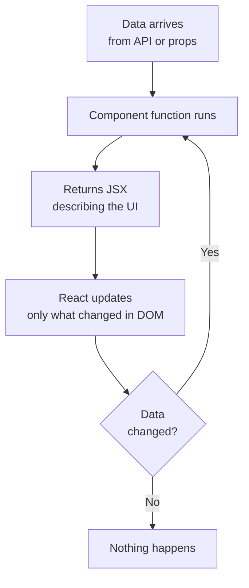
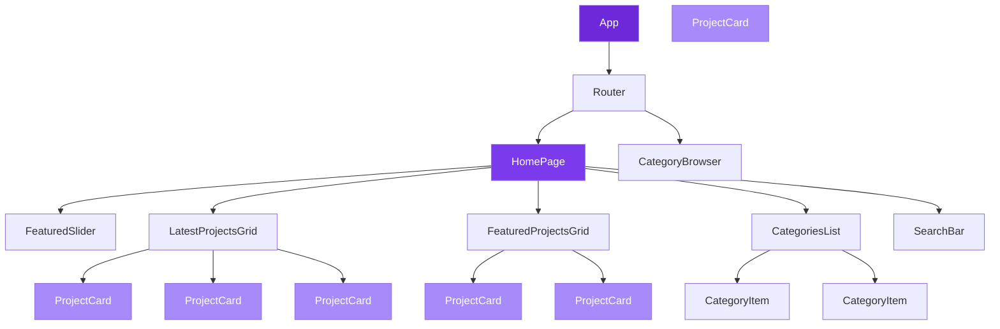
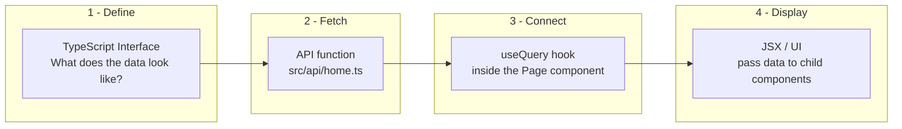
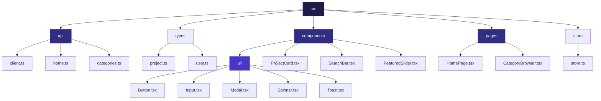
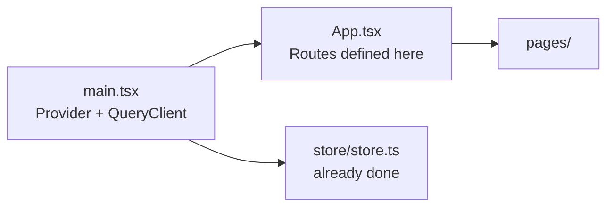
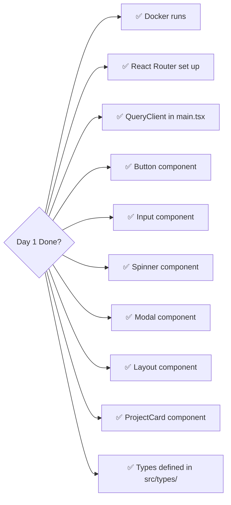
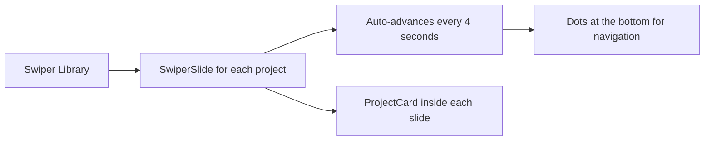
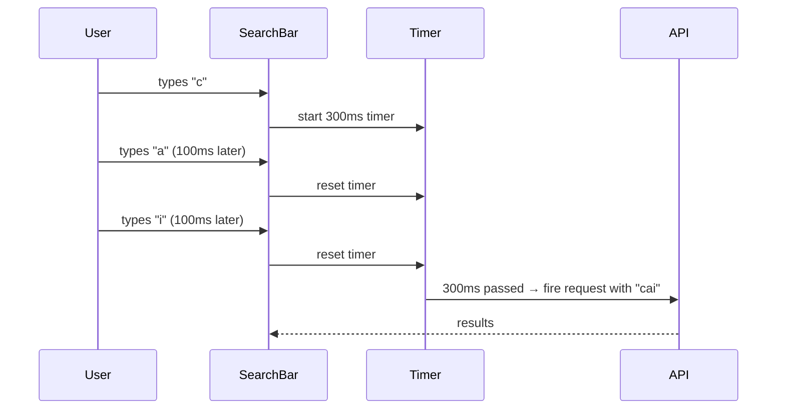
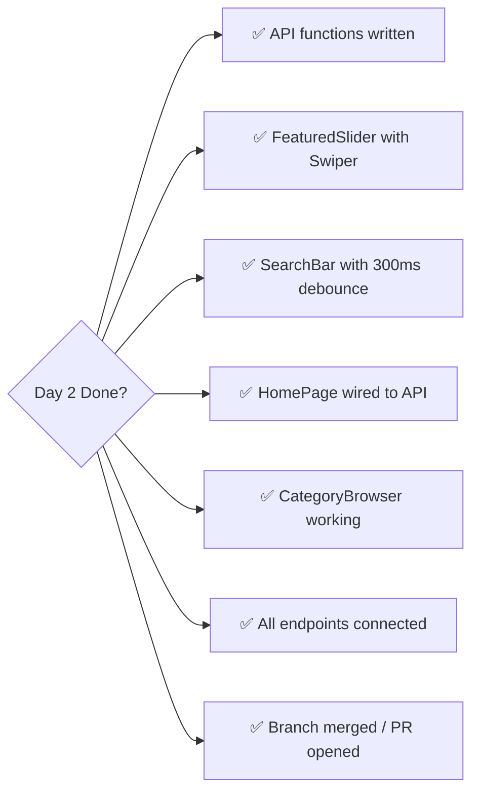
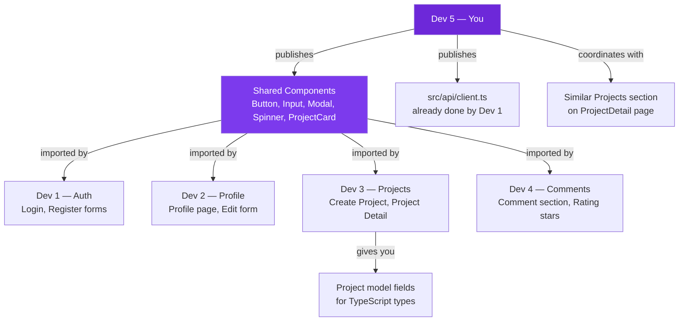

# Dev 5 — Homepage & Shared Infrastructure
## Your Complete 2-Day Survival Guide (React + TypeScript, First Timer)

> **Your role in one sentence:** You build the skeleton every other developer plugs into — shared components, the homepage, search, categories, and Docker.

---

## 🧠 Chapter 0 — How React Thinks (Read This First)

Before you touch code, you need to build the right mental model. React is not like building a webpage with HTML. React is about **describing what the UI should look like given the current data** — React figures out the actual DOM changes itself.

### The 3 Rules of React

```
1. UI = f(data)        → Your component is a function. Data goes in. UI comes out.
2. Data changed?       → React re-runs your function automatically.
3. You never touch DOM → No document.getElementById. Ever.
```

### How a Component Thinks



### The Component Tree Mental Model

Everything in React is a tree. Your homepage looks like this under the hood:



**The key insight:** `ProjectCard` is written once. It gets reused everywhere — homepage, search results, category page. It receives a `project` object as a prop and just displays it. It never fetches data itself.

---

## 🔄 Chapter 1 — The Data Flow Pattern (Your Core Loop)

This is the pattern you will repeat for **every single feature** in the next 2 days. Learn this pattern, and everything else is just filling in the blanks.



### Step 1 — Define the TypeScript Interface

Before writing any component, define what shape your data has. Think of it as a contract.

```ts
// src/types/project.ts

// This says: "A project MUST have these fields with these types"
export interface Project {
  id: number
  title: string
  details: string
  target: number
  current_money: number
  avg_rate: number          // comes from backend signal
  is_featured: boolean
  status: 'active' | 'cancelled' | 'completed'  // only these 3 values allowed
  startdate: string
  enddate: string
  category_id: number
  user_id: number
  created_at: string
}

export interface Category {
  id: number
  name: string
}

export interface Tag {
  id: number
  name: string
}

// What the /api/home/ endpoint returns
export interface HomepageData {
  top_rated: Project[]      // top 5 by avg_rate
  latest: Project[]         // latest 5 by created_at
  featured: Project[]       // latest 5 where is_featured = true
}
```

> **Why TypeScript?** When you type `project.` in your editor, it will auto-complete all fields. If you make a typo like `project.tittle`, TypeScript screams at you immediately — before you even run the code.

### Step 2 — Write the API Function

```ts
// src/api/home.ts
import api from './client'               // Dev 1's Axios instance — already configured with JWT
import { HomepageData } from '../types/project'

// This function calls GET /api/home/ and returns typed data
export const getHomepageData = async (): Promise<HomepageData> => {
  const response = await api.get('/home/')
  return response.data                   // React Query will call this for us
}

export const getCategories = async () => {
  const response = await api.get('/categories/')
  return response.data
}

export const searchProjects = async (query: string) => {
  const response = await api.get('/projects/', { params: { search: query } })
  return response.data
}

export const getProjectsByCategory = async (categoryId: number) => {
  const response = await api.get(`/categories/${categoryId}/projects/`)
  return response.data
}
```

### Step 3 — Connect with useQuery

```ts
// src/pages/HomePage.tsx
import { useQuery } from '@tanstack/react-query'
import { getHomepageData } from '../api/home'

function HomePage() {
  // useQuery does ALL of this for you:
  // - calls getHomepageData() automatically on mount
  // - gives you isLoading while waiting
  // - gives you isError if something went wrong
  // - caches the result so navigating back is instant
  // - refetches automatically when window regains focus

  const { data, isLoading, isError } = useQuery({
    queryKey: ['homepage'],       // unique cache key — like a name tag for this request
    queryFn: getHomepageData,     // the function that actually fetches
  })

  if (isLoading) return <Spinner />
  if (isError) return <p>Something went wrong</p>

  // data is fully typed as HomepageData here — TypeScript knows its shape
  return (
    <div>
      <FeaturedSlider projects={data.top_rated} />
      <LatestProjectsGrid projects={data.latest} />
    </div>
  )
}
```

### Step 4 — Display with Child Components

```tsx
// The "dumb" component — receives data, displays it, knows nothing about fetching
interface ProjectCardProps {
  project: Project
}

function ProjectCard({ project }: ProjectCardProps) {
  // project is guaranteed to have all fields TypeScript defined
  return (
    <div className="rounded-lg shadow p-4">
      <h2>{project.title}</h2>
      <p>{project.avg_rate} ⭐</p>
      {/* Donation progress bar */}
      <div className="w-full bg-gray-200 rounded h-2">
        <div
          className="bg-violet-600 h-2 rounded"
          style={{ width: `${(project.current_money / project.target) * 100}%` }}
        />
      </div>
    </div>
  )
}
```

---

## 📁 Chapter 2 — Your File Structure



> **Rule:** Pages fetch data. Components display it. Never the other way around.

---

## 🗓️ Day 1 — Foundation + Shared Components

### 🎯 Day 1 Goal

By end of Day 1, every developer on the team can:
- Pull and run the project with Docker
- Import `Button`, `Input`, `Spinner`, `Modal`, `ProjectCard` from your components folder
- Have a working route setup they can add pages to

---

### Task 1.1 — Verify the Scaffold (Morning, ~1 hour)

Your repo already has Vite + TS + Redux set up. Verify everything works:

```bash
pnpm install
pnpm dev
```

Check these files exist and are correct:



Your `main.tsx` should wrap everything:

```tsx
// src/main.tsx
import { StrictMode } from 'react'
import { createRoot } from 'react-dom/client'
import { Provider } from 'react-redux'
import { QueryClient, QueryClientProvider } from '@tanstack/react-query'
import { store } from './store/store'
import App from './App'
import './index.css'

// Create one QueryClient for the whole app
const queryClient = new QueryClient({
  defaultOptions: {
    queries: {
      staleTime: 1000 * 60 * 5,   // cache for 5 minutes before refetching
      retry: 1,                    // retry failed requests once
    }
  }
})

createRoot(document.getElementById('root')!).render(
  <StrictMode>
    <Provider store={store}>                        {/* Redux — for auth only */}
      <QueryClientProvider client={queryClient}>    {/* React Query — for everything else */}
        <App />
      </QueryClientProvider>
    </Provider>
  </StrictMode>
)
```

---

### Task 1.2 — Set Up React Router (Morning, ~1 hour)

```tsx
// src/App.tsx
import { BrowserRouter, Routes, Route } from 'react-router-dom'
import HomePage from './pages/HomePage'
import CategoryBrowser from './pages/CategoryBrowser'
import Layout from './components/ui/Layout'

function App() {
  return (
    <BrowserRouter>
      <Layout>                         {/* Navbar + Footer wrapper */}
        <Routes>
          <Route path="/" element={<HomePage />} />
          <Route path="/categories" element={<CategoryBrowser />} />
          <Route path="/categories/:id" element={<CategoryBrowser />} />
          {/* Other devs will add their routes here */}
        </Routes>
      </Layout>
    </BrowserRouter>
  )
}

export default App
```

> **`useParams` tip for later:** When URL is `/categories/5`, inside `CategoryBrowser` you do:
> ```ts
> const { id } = useParams()  // id = "5" (always a string from URL)
> const numericId = Number(id)
> ```

---

### Task 1.3 — Build the Shared UI Component Library (Afternoon)

These 5 components are what other devs will import. Build them in order from simplest to hardest.

#### Spinner (simplest — 10 minutes)

```tsx
// src/components/ui/Spinner.tsx
function Spinner() {
  return (
    <div className="flex items-center justify-center py-10">
      <div className="w-10 h-10 border-4 border-violet-600 border-t-transparent rounded-full animate-spin" />
    </div>
  )
}

export default Spinner
```

#### Button (20 minutes)

```tsx
// src/components/ui/Button.tsx

// Define all the variations this button supports
interface ButtonProps {
  children: React.ReactNode           // whatever you put inside <Button>...</Button>
  onClick?: () => void               // optional — not all buttons need onClick
  variant?: 'primary' | 'secondary' | 'danger'
  disabled?: boolean
  type?: 'button' | 'submit'        // submit is for forms
  className?: string                 // allow extra classes from parent
}

const variantStyles = {
  primary:   'bg-violet-600 text-white hover:bg-violet-700',
  secondary: 'bg-gray-100 text-gray-800 hover:bg-gray-200',
  danger:    'bg-red-600 text-white hover:bg-red-700',
}

function Button({
  children,
  onClick,
  variant = 'primary',    // default is primary if not specified
  disabled = false,
  type = 'button',
  className = '',
}: ButtonProps) {
  return (
    <button
      type={type}
      onClick={onClick}
      disabled={disabled}
      className={`
        px-4 py-2 rounded-lg font-medium transition-colors
        disabled:opacity-50 disabled:cursor-not-allowed
        ${variantStyles[variant]}
        ${className}
      `}
    >
      {children}
    </button>
  )
}

export default Button
```

#### Input (20 minutes)

```tsx
// src/components/ui/Input.tsx
interface InputProps {
  label: string
  type?: string
  placeholder?: string
  value: string
  onChange: (e: React.ChangeEvent<HTMLInputElement>) => void
  error?: string              // show error message below input
}

function Input({ label, type = 'text', placeholder, value, onChange, error }: InputProps) {
  return (
    <div className="flex flex-col gap-1">
      <label className="text-sm font-medium text-gray-700">{label}</label>
      <input
        type={type}
        placeholder={placeholder}
        value={value}
        onChange={onChange}
        className={`
          border rounded-lg px-3 py-2 outline-none transition-colors
          focus:border-violet-500 focus:ring-2 focus:ring-violet-200
          ${error ? 'border-red-500' : 'border-gray-300'}
        `}
      />
      {error && <p className="text-sm text-red-500">{error}</p>}
    </div>
  )
}

export default Input
```

#### Modal (30 minutes)

```tsx
// src/components/ui/Modal.tsx
interface ModalProps {
  isOpen: boolean
  onClose: () => void
  title: string
  children: React.ReactNode
}

function Modal({ isOpen, onClose, title, children }: ModalProps) {
  // Don't render anything if modal is closed
  if (!isOpen) return null

  return (
    // Dark overlay behind the modal
    <div
      className="fixed inset-0 bg-black/50 flex items-center justify-center z-50"
      onClick={onClose}           // clicking overlay closes modal
    >
      {/* Modal box — stopPropagation prevents overlay click from firing */}
      <div
        className="bg-white rounded-xl p-6 max-w-md w-full mx-4"
        onClick={e => e.stopPropagation()}
      >
        <div className="flex justify-between items-center mb-4">
          <h2 className="text-xl font-semibold">{title}</h2>
          <button onClick={onClose} className="text-gray-400 hover:text-gray-600 text-2xl">×</button>
        </div>
        {children}
      </div>
    </div>
  )
}

export default Modal
```

#### Layout (30 minutes)

```tsx
// src/components/ui/Layout.tsx
import { Link } from 'react-router-dom'

interface LayoutProps {
  children: React.ReactNode
}

function Layout({ children }: LayoutProps) {
  return (
    <div className="min-h-screen flex flex-col">
      {/* Navbar */}
      <nav className="bg-violet-700 text-white px-6 py-4 flex items-center justify-between">
        <Link to="/" className="text-xl font-bold">CrowdFunding Egypt 🇪🇬</Link>
        <div className="flex gap-4">
          <Link to="/" className="hover:text-violet-200">Home</Link>
          <Link to="/categories" className="hover:text-violet-200">Categories</Link>
          {/* Auth links will come from Dev 1 */}
        </div>
      </nav>

      {/* Page content */}
      <main className="flex-1 max-w-7xl mx-auto w-full px-4 py-8">
        {children}
      </main>

      {/* Footer */}
      <footer className="bg-gray-800 text-gray-300 text-center py-4">
        © 2026 CrowdFunding Egypt
      </footer>
    </div>
  )
}

export default Layout
```

---

### Task 1.4 — Build ProjectCard (End of Day 1)

`ProjectCard` is the most reused component in the project. Every developer will import it.

```tsx
// src/components/ProjectCard.tsx
import { Link } from 'react-router-dom'
import { Project } from '../types/project'

interface ProjectCardProps {
  project: Project
}

function ProjectCard({ project }: ProjectCardProps) {
  const progressPercent = Math.min(
    (project.current_money / project.target) * 100,
    100                                         // cap at 100%
  )

  return (
    <Link to={`/projects/${project.id}`} className="block">
      <div className="border rounded-xl overflow-hidden shadow hover:shadow-lg transition-shadow">
        {/* Project Image — Dev 3 will add images array later */}
        <div className="h-48 bg-violet-100 flex items-center justify-center">
          <span className="text-violet-400 text-4xl">📷</span>
        </div>

        <div className="p-4 flex flex-col gap-2">
          <h3 className="font-semibold text-lg line-clamp-1">{project.title}</h3>
          <p className="text-gray-500 text-sm line-clamp-2">{project.details}</p>

          {/* Rating */}
          <div className="flex items-center gap-1 text-yellow-500 text-sm">
            ⭐ {project.avg_rate.toFixed(1)}
          </div>

          {/* Progress Bar */}
          <div>
            <div className="flex justify-between text-xs text-gray-500 mb-1">
              <span>{project.current_money.toLocaleString()} EGP raised</span>
              <span>{progressPercent.toFixed(0)}%</span>
            </div>
            <div className="w-full bg-gray-200 rounded-full h-2">
              <div
                className="bg-violet-600 h-2 rounded-full transition-all"
                style={{ width: `${progressPercent}%` }}
              />
            </div>
            <p className="text-xs text-gray-400 mt-1">
              of {project.target.toLocaleString()} EGP goal
            </p>
          </div>
        </div>
      </div>
    </Link>
  )
}

export default ProjectCard
```

---

### Day 1 End Checklist



> 🚨 **Critical:** Commit and push at end of Day 1. Other developers need your shared components immediately.

---

## 🗓️ Day 2 — Homepage, Search & Categories

### 🎯 Day 2 Goal

By end of Day 2, the homepage is fully wired to the API with a working slider, project grids, categories list, and a debounced search bar.

---

### Task 2.1 — Write API Functions (Morning, 1 hour)

```ts
// src/api/home.ts
import api from './client'
import { HomepageData, Category, Project } from '../types/project'

export const getHomepageData = async (): Promise<HomepageData> => {
  const { data } = await api.get('/home/')
  return data
}

export const searchProjects = async (query: string): Promise<Project[]> => {
  const { data } = await api.get('/projects/', { params: { search: query } })
  return data.results ?? data       // handle paginated or plain response
}
```

```ts
// src/api/categories.ts
import api from './client'
import { Category, Project } from '../types/project'

export const getCategories = async (): Promise<Category[]> => {
  const { data } = await api.get('/categories/')
  return data
}

export const getCategoryProjects = async (id: number): Promise<Project[]> => {
  const { data } = await api.get(`/categories/${id}/projects/`)
  return data.results ?? data
}
```

---

### Task 2.2 — Build FeaturedSlider with Swiper (Morning, 1.5 hours)



```tsx
// src/components/FeaturedSlider.tsx
import { Swiper, SwiperSlide } from 'swiper/react'
import { Autoplay, Pagination } from 'swiper/modules'
import 'swiper/css'
import 'swiper/css/pagination'
import { Project } from '../types/project'
import ProjectCard from './ProjectCard'

interface FeaturedSliderProps {
  projects: Project[]
}

function FeaturedSlider({ projects }: FeaturedSliderProps) {
  return (
    <section className="mb-10">
      <h2 className="text-2xl font-bold mb-4">⭐ Top Rated Projects</h2>
      <Swiper
        modules={[Autoplay, Pagination]}
        autoplay={{ delay: 4000, disableOnInteraction: false }}
        pagination={{ clickable: true }}                // clickable dots
        loop={true}                                     // wraps around at end
        spaceBetween={16}
        slidesPerView={1}
        breakpoints={{
          640:  { slidesPerView: 2 },                   // tablet: show 2
          1024: { slidesPerView: 3 },                   // desktop: show 3
        }}
      >
        {projects.map(project => (
          <SwiperSlide key={project.id}>
            <ProjectCard project={project} />
          </SwiperSlide>
        ))}
      </Swiper>
    </section>
  )
}

export default FeaturedSlider
```

---

### Task 2.3 — Build SearchBar with Debounce (Mid Morning, 45 min)

**What is debounce?** Without debounce, you fire an API call on every single keystroke. Type "cairo" = 5 API calls. With 300ms debounce, you wait until the user stops typing for 300ms, then fire one call.



```tsx
// src/components/SearchBar.tsx
import { useState, useEffect } from 'react'
import { useQuery } from '@tanstack/react-query'
import { searchProjects } from '../api/home'
import ProjectCard from './ProjectCard'
import Spinner from './ui/Spinner'
import Input from './ui/Input'

function SearchBar() {
  const [inputValue, setInputValue] = useState('')    // what user is typing right now
  const [debouncedQuery, setDebouncedQuery] = useState('')  // what we actually search

  // Debounce effect — waits 300ms after user stops typing before updating debouncedQuery
  useEffect(() => {
    const timer = setTimeout(() => {
      setDebouncedQuery(inputValue)
    }, 300)

    // Cleanup: if user types again before 300ms, cancel the previous timer
    return () => clearTimeout(timer)
  }, [inputValue])

  // Only runs when debouncedQuery changes — and only if it's not empty
  const { data: results, isLoading } = useQuery({
    queryKey: ['search', debouncedQuery],
    queryFn: () => searchProjects(debouncedQuery),
    enabled: debouncedQuery.length > 1,     // don't search for single characters
  })

  return (
    <div className="mb-10">
      <Input
        label="Search Projects"
        placeholder="Search by title or tag..."
        value={inputValue}
        onChange={e => setInputValue(e.target.value)}
      />

      {/* Show results only when there's a query */}
      {debouncedQuery && (
        <div className="mt-4">
          {isLoading && <Spinner />}
          {results?.length === 0 && (
            <p className="text-gray-400 text-center py-4">No projects found for "{debouncedQuery}"</p>
          )}
          <div className="grid grid-cols-1 sm:grid-cols-2 lg:grid-cols-3 gap-4">
            {results?.map(project => (
              <ProjectCard key={project.id} project={project} />
            ))}
          </div>
        </div>
      )}
    </div>
  )
}

export default SearchBar
```

---

### Task 2.4 — Build the Full HomePage (Afternoon, 2 hours)

```tsx
// src/pages/HomePage.tsx
import { useQuery } from '@tanstack/react-query'
import { getHomepageData } from '../api/home'
import FeaturedSlider from '../components/FeaturedSlider'
import ProjectCard from '../components/ProjectCard'
import SearchBar from '../components/SearchBar'
import Spinner from '../components/ui/Spinner'

function HomePage() {
  const { data, isLoading, isError } = useQuery({
    queryKey: ['homepage'],
    queryFn: getHomepageData,
  })

  if (isLoading) return <Spinner />
  if (isError) return (
    <div className="text-center py-20 text-red-500">
      Failed to load homepage. Please refresh.
    </div>
  )

  return (
    <div>
      {/* Search */}
      <SearchBar />

      {/* Top 5 Rated — Slider */}
      <FeaturedSlider projects={data.top_rated} />

      {/* Latest 5 Projects */}
      <section className="mb-10">
        <h2 className="text-2xl font-bold mb-4">🆕 Latest Projects</h2>
        <div className="grid grid-cols-1 sm:grid-cols-2 lg:grid-cols-3 gap-4">
          {data.latest.map(project => (
            <ProjectCard key={project.id} project={project} />
          ))}
        </div>
      </section>

      {/* Featured 5 Projects */}
      <section className="mb-10">
        <h2 className="text-2xl font-bold mb-4">🔥 Featured Projects</h2>
        <div className="grid grid-cols-1 sm:grid-cols-2 lg:grid-cols-3 gap-4">
          {data.featured.map(project => (
            <ProjectCard key={project.id} project={project} />
          ))}
        </div>
      </section>
    </div>
  )
}

export default HomePage
```

---

### Task 2.5 — Build CategoryBrowser (Afternoon, 1.5 hours)

```tsx
// src/pages/CategoryBrowser.tsx
import { useState } from 'react'
import { useQuery } from '@tanstack/react-query'
import { getCategories, getCategoryProjects } from '../api/categories'
import ProjectCard from '../components/ProjectCard'
import Spinner from '../components/ui/Spinner'

function CategoryBrowser() {
  const [selectedCategoryId, setSelectedCategoryId] = useState<number | null>(null)

  // Fetch all categories
  const { data: categories, isLoading: loadingCategories } = useQuery({
    queryKey: ['categories'],
    queryFn: getCategories,
  })

  // Fetch projects for selected category — only runs when a category is selected
  const { data: projects, isLoading: loadingProjects } = useQuery({
    queryKey: ['category-projects', selectedCategoryId],
    queryFn: () => getCategoryProjects(selectedCategoryId!),
    enabled: selectedCategoryId !== null,       // ! = won't be null when this runs
  })

  if (loadingCategories) return <Spinner />

  return (
    <div>
      <h1 className="text-3xl font-bold mb-6">Browse Categories</h1>

      {/* Category Pills */}
      <div className="flex flex-wrap gap-2 mb-8">
        {categories?.map(category => (
          <button
            key={category.id}
            onClick={() => setSelectedCategoryId(category.id)}
            className={`
              px-4 py-2 rounded-full border font-medium transition-colors
              ${selectedCategoryId === category.id
                ? 'bg-violet-600 text-white border-violet-600'
                : 'bg-white text-gray-700 border-gray-300 hover:border-violet-400'
              }
            `}
          >
            {category.name}
          </button>
        ))}
      </div>

      {/* Projects for selected category */}
      {selectedCategoryId && (
        <div>
          {loadingProjects ? (
            <Spinner />
          ) : (
            <div className="grid grid-cols-1 sm:grid-cols-2 lg:grid-cols-3 gap-4">
              {projects?.map(project => (
                <ProjectCard key={project.id} project={project} />
              ))}
            </div>
          )}
        </div>
      )}

      {/* Empty state */}
      {!selectedCategoryId && (
        <p className="text-center text-gray-400 py-12">
          ☝️ Select a category to see its projects
        </p>
      )}
    </div>
  )
}

export default CategoryBrowser
```

---

### Day 2 End Checklist



---

## 🔑 Quick Reference — Patterns You'll Use Constantly

### useState

```tsx
const [value, setValue] = useState(initialValue)
//     ↑ read    ↑ update   ↑ starting value

// Example:
const [isOpen, setIsOpen] = useState(false)
<button onClick={() => setIsOpen(true)}>Open</button>
{isOpen && <Modal />}
```

### useQuery

```tsx
const { data, isLoading, isError } = useQuery({
  queryKey: ['unique-key', dependency],   // include variables that affect the request
  queryFn: () => apiFunctionCall(id),
  enabled: someCondition,                 // optional: only run when true
})
```

### useEffect for side effects

```tsx
useEffect(() => {
  // code to run when dependencies change
  return () => {
    // cleanup — runs before next effect or on unmount
  }
}, [dependency1, dependency2])    // runs when these change
                                  // [] = run only once on mount
```

### Conditional rendering patterns

```tsx
{isLoading && <Spinner />}                    // show if loading
{!isLoading && data && <Component />}         // show if not loading and data exists
{items.length === 0 ? <Empty /> : <List />}   // if/else
```

---

## ⚡ Common Mistakes to Avoid

| Mistake | Why it's wrong | Fix |
|---|---|---|
| Fetching data inside a child component | Breaks separation of concerns | Fetch in the Page, pass data as props |
| Calling `useState` inside an `if` block | React rule: hooks always in same order | Always call hooks at the top level of the function |
| Using array index as `key` | Causes bugs when list reorders | Always use `item.id` as key |
| Mutating state directly (`data.title = "x"`) | React won't detect the change | Always use the setter function: `setData({...data, title: "x"})` |
| Searching on every keystroke | 100 API calls for a 10-char query | Always debounce search inputs (300ms) |
| Forgetting `enabled` in useQuery | Sends requests with undefined params | Use `enabled: !!id` to wait until you have the value |

---

## 🧩 How Your Work Connects to the Other Devs



---

*Built for CrowdFunding Egypt — Dev 5 Sprint · April 2026*
