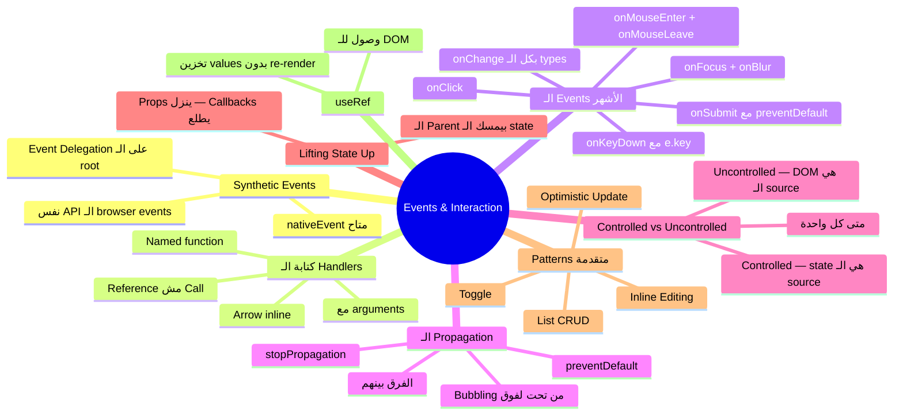

# الفصل الثالث — Events والـ Interaction: لما المستخدم يعمل حاجة

> **المتطلبات:** [[02-useState-and-State-Management]] — لازم تعرف الـ state والـ useState كويس، لأن الـ events في الغالب هدفها تغيير state — وبدون ما تفهم إزاي الـ state بتشتغل، الـ events مش هتبقى منطقية.

---

## البداية — الـ UI اللي ما بيردش

تخيّل معايا إنك بنيت الـ TaskFlow كامل — بتعرض tasks، بتجيب data من API — بس المستخدم مش قادر يعمل أي حاجة. ما ينفعش يكمّل task، ما ينفعش يمسحها، ما ينفعش يضيف واحدة جديدة.

ده **static UI** — بيعرض فقط. والمشكلة مش في الـ display، المشكلة إن الـ UI مش بيتفاعل مع المستخدم.

في plain HTML، التفاعل بيتم عن طريق الـ events:

```html
<!-- Plain HTML — works but disconnected from your data -->
<button onclick="alert('clicked!')">Click me</button>
<input onchange="console.log(this.value)">
```

المشكلة مع الطريقة دي في React إنك محتاج تربط الـ events بالـ state بتاع الـ component — وتحديث الـ state بيعمل re-render تلقائي. الـ plain HTML `onclick` ما بيعرفش حاجة عن الـ React state.

> React بتستخدم **Synthetic Events** — event system خاص بيها بيشتغل فوق الـ browser events ويتكامل مع الـ state system.

---

## [[01-Synthetic-Events]] — الـ Synthetic Events: مش بالظبط `addEventListener`

لما بتكتب `onClick` في JSX، مش بتعمل `addEventListener` عادي.

React بتعمل **event delegation** — بتضيف listener واحد بس على الـ root element بتاع التطبيق كله (`document` أو `#root`)، ولما أي event يحصل في أي حتة، React هي اللي بتقرر مين المفروض يستقبله.

```jsx
// What you write:
<button onClick={handleClick}>Click</button>

// What React actually does (simplified):
// Adds ONE listener at the root:
// document.addEventListener('click', reactEventDispatcher)
// When a click happens, React finds which component should handle it
// and calls its onClick handler with a SyntheticEvent object
```

**الـ SyntheticEvent** هو object بيشبه الـ browser event الأصلي — بس React بتعمله wrapper عشان يشتغل بشكل consistent على كل الـ browsers:

```jsx
function TaskCard({ task }) {
  function handleClick(event) {
    // event is a SyntheticEvent — it has the same API as the native event
    console.log(event.type);          // "click"
    console.log(event.target);        // the DOM element that was clicked
    console.log(event.currentTarget); // the element the handler is attached to
    console.log(event.timeStamp);     // when it happened

    // native event is accessible too:
    console.log(event.nativeEvent);   // the original browser event
  }

  return <div onClick={handleClick}>{task.title}</div>;
}
```

**فايدة عملية للـ delegation:** لو عندك list فيها 1000 item — React بتضيف listener واحد بس على الـ root، مش 1000 listener. ده بيفرق في الـ memory والـ performance.

---

## [[02-Basic-Event-Handlers]] — كيفية كتابة الـ Event Handlers

### القاعدة الأساسية: function reference مش function call

```jsx
// ❌ WRONG — this calls the function immediately during render
<button onClick={handleClick()}>Click</button>
//                          ^^
// The () calls it right now — not when the button is clicked
// This runs on every render, causing infinite re-renders if it sets state

// ✅ CORRECT — pass a reference, React calls it when clicked
<button onClick={handleClick}>Click</button>
//                ^^^^^^^^^^^ no () — just the function itself

// ✅ ALSO CORRECT — inline arrow function (use when you need to pass arguments)
<button onClick={() => handleClick(task.id)}>Click</button>
//                ↑ arrow function that calls handleClick with an argument
//                  React calls the arrow function on click
//                  the arrow function calls handleClick(task.id)
```

---

### الطرق المختلفة لكتابة الـ Handler

```jsx
function TaskCard({ task, onComplete, onDelete }) {

  // ── Method 1: Named function defined inside component ──
  function handleComplete() {
    onComplete(task.id);
  }

  // ── Method 2: Arrow function defined inside component ──
  const handleDelete = () => {
    if (window.confirm(`Delete "${task.title}"?`)) {
      onDelete(task.id);
    }
  };

  return (
    <div className="task-card">
      <h3>{task.title}</h3>

      {/* ── Method 3: Inline arrow (fine for simple calls) ── */}
      <button onClick={() => onComplete(task.id)}>
        ✓ Complete
      </button>

      {/* ── Using named handlers ── */}
      <button onClick={handleComplete}>Complete</button>
      <button onClick={handleDelete}>Delete</button>

      {/* ── Method 4: Passing extra data with the event object ── */}
      <button onClick={(e) => {
        e.stopPropagation(); // stop event from bubbling to parent
        handleDelete();
      }}>
        Delete
      </button>
    </div>
  );
}
```

**متى تستخدم كل طريقة؟**

```
Named function   → when the handler has logic (validation, conditions)
Arrow inline     → when it's a one-liner or needs to pass arguments
Method in class  → not a pattern in function components
```

---

## [[03-Common-Events]] — الـ Events الأشهر في React

### onClick — الضغط على أي element

```jsx
function TaskBoard() {
  const [selectedId, setSelectedId] = useState(null);

  return (
    <div>
      {tasks.map(task => (
        <div
          key={task.id}
          className={`task-card ${selectedId === task.id ? 'selected' : ''}`}
          onClick={() => setSelectedId(task.id)}
          // onClick works on ANY element — div, span, img, h1 — not just buttons
        >
          {task.title}
        </div>
      ))}

      {selectedId && <TaskDetails taskId={selectedId} />}
    </div>
  );
}
```

---

### onChange — تغيير قيمة الـ input

الـ `onChange` في React **مش زي** الـ `onchange` في HTML.

في HTML: `onchange` بيتشغّل لما الـ input يخسر الـ focus وقيمته اتغيّرت.
في React: `onChange` بيتشغّل **مع كل ضغطة كيبورد** — زي `oninput` في HTML.

```jsx
function SearchBar() {
  const [query, setQuery] = useState('');

  return (
    <div>
      <input
        type="text"
        value={query}
        onChange={(e) => setQuery(e.target.value)}
        //              ↑ e.target is the input element
        //                e.target.value is what the user typed
        placeholder="Search tasks..."
      />
      <p>Searching for: {query}</p>
    </div>
  );
}
```

**الـ `onChange` مع types مختلفة:**

```jsx
// Text input
<input type="text"     onChange={e => setValue(e.target.value)} />

// Number input — e.target.value is always a string
<input type="number"   onChange={e => setCount(Number(e.target.value))} />

// Checkbox — use e.target.checked, NOT e.target.value
<input type="checkbox" onChange={e => setIsChecked(e.target.checked)} />

// Select dropdown
<select onChange={e => setPriority(e.target.value)}>
  <option value="high">High</option>
  <option value="low">Low</option>
</select>

// File input — files are in e.target.files (a FileList)
<input type="file" onChange={e => setFile(e.target.files[0])} />
```

---

### onSubmit — تقديم الـ Form

```jsx
function NewTaskForm({ onTaskCreated }) {
  const [title, setTitle]       = useState('');
  const [priority, setPriority] = useState('medium');

  function handleSubmit(e) {
    e.preventDefault();
    // e.preventDefault() is ESSENTIAL — without it the browser will
    // reload the page (default HTML form behavior)

    if (!title.trim()) return; // basic validation

    onTaskCreated({ title: title.trim(), priority });

    // reset form after submit
    setTitle('');
    setPriority('medium');
  }

  return (
    <form onSubmit={handleSubmit}>
      <input
        value={title}
        onChange={e => setTitle(e.target.value)}
        placeholder="Task title"
      />
      <select value={priority} onChange={e => setPriority(e.target.value)}>
        <option value="high">High</option>
        <option value="medium">Medium</option>
        <option value="low">Low</option>
      </select>
      <button type="submit" disabled={!title.trim()}>
        Add Task
      </button>
    </form>
  );
}
```

---

### onKeyDown / onKeyUp — ضغطات الكيبورد

```jsx
function TaskInput({ onAdd }) {
  const [value, setValue] = useState('');

  function handleKeyDown(e) {
    // e.key is the key name — 'Enter', 'Escape', 'ArrowUp', etc.
    if (e.key === 'Enter' && !e.shiftKey) {
      // Enter without Shift → submit
      e.preventDefault(); // prevent newline in textarea
      if (value.trim()) {
        onAdd(value.trim());
        setValue('');
      }
    }

    if (e.key === 'Escape') {
      setValue(''); // clear on Escape
    }
  }

  return (
    <textarea
      value={value}
      onChange={e => setValue(e.target.value)}
      onKeyDown={handleKeyDown}
      placeholder="Type a task, press Enter to add..."
    />
  );
}
```

---

### onMouseEnter / onMouseLeave — الـ Hover

```jsx
function TaskCard({ task }) {
  const [isHovered, setIsHovered] = useState(false);

  return (
    <div
      className={`task-card ${isHovered ? 'hovered' : ''}`}
      onMouseEnter={() => setIsHovered(true)}
      onMouseLeave={() => setIsHovered(false)}
    >
      <h3>{task.title}</h3>

      {/* Only show actions when card is hovered */}
      {isHovered && (
        <div className="task-actions">
          <button>Edit</button>
          <button>Delete</button>
        </div>
      )}
    </div>
  );
}
```

---

### onFocus / onBlur — الـ Focus

```jsx
function SmartInput({ label, value, onChange, validate }) {
  const [touched, setTouched] = useState(false);
  // "touched" pattern: only show validation errors after user has interacted

  const error = touched && validate ? validate(value) : null;

  return (
    <div className={`field ${error ? 'has-error' : ''}`}>
      <label>{label}</label>
      <input
        value={value}
        onChange={e => onChange(e.target.value)}
        onFocus={() => {/* could clear error or highlight */}}
        onBlur={() => setTouched(true)}
        // onBlur fires when input LOSES focus
        // This is when we mark the field as "touched" and show errors
        className={error ? 'input-error' : ''}
      />
      {error && <span className="error-msg">{error}</span>}
    </div>
  );
}

// Usage:
<SmartInput
  label="Task Title"
  value={title}
  onChange={setTitle}
  validate={val => val.trim().length < 3 ? 'Title must be at least 3 characters' : null}
/>
```

---

## [[04-Event-Propagation]] — الـ Event Propagation: الـ Bubbling والـ Capturing

ده من أهم الأسئلة في الإنترفيو وأكتر مشكلة بتحصل في الـ UI.

لما event يحصل على element — بيتنقل في **مرحلتين**:

```
Phase 1 — Capturing (من فوق لتحت):
document → html → body → div.board → div.card → button

Phase 2 — Bubbling (من تحت لفوق):
button → div.card → div.board → body → html → document
```

في React، كل الـ event handlers بتشتغل في مرحلة الـ **Bubbling** بشكل افتراضي.

**المشكلة العملية:**

```jsx
function TaskBoard() {
  function handleBoardClick() {
    console.log('board clicked — deselect all');
    setSelectedId(null);
  }

  return (
    <div className="board" onClick={handleBoardClick}>
      {tasks.map(task => (
        <TaskCard
          key={task.id}
          task={task}
          onClick={() => setSelectedId(task.id)}
          // Problem: clicking the card ALSO triggers handleBoardClick
          // because the click bubbles up from card → board
        />
      ))}
    </div>
  );
}
```

```
User clicks on TaskCard
        ↓
TaskCard's onClick fires → setSelectedId(task.id)  ✅
        ↓
Event bubbles up to .board
        ↓
Board's onClick fires → setSelectedId(null)         ❌ immediately deselects!
```

**الحل: `stopPropagation()`**

```jsx
function TaskCard({ task, onClick }) {
  function handleClick(e) {
    e.stopPropagation();
    // stops the event from bubbling up to the board
    // board's onClick will NOT fire
    onClick(task.id);
  }

  return (
    <div className="task-card" onClick={handleClick}>
      {task.title}
    </div>
  );
}
```

**`stopPropagation` vs `preventDefault`:**

```jsx
// preventDefault — stops the browser's DEFAULT behavior for this event
// Example: stop <a href> from navigating, stop <form> from reloading
<form onSubmit={e => {
  e.preventDefault(); // browser won't reload the page
  handleSubmit();
}}>

// stopPropagation — stops the event from traveling to parent elements
// Example: click on card shouldn't trigger click on board
<div onClick={e => {
  e.stopPropagation(); // board's onClick won't fire
  handleCardClick();
}}>

// They're completely independent — you can use both together:
<a href="/old-page" onClick={e => {
  e.preventDefault();    // don't navigate to /old-page
  e.stopPropagation();   // don't tell the parent about this click
  handleClick();
}}>
```

---

## [[05-Controlled-vs-Uncontrolled]] — Controlled vs Uncontrolled Inputs

ده تمييز مهم جداً في React وبيجي في كل إنترفيو.

---

### Uncontrolled Input — الـ DOM بيتحكم في الـ value

```jsx
// Uncontrolled: React doesn't know what's in the input
// The DOM manages the value internally
function UncontrolledForm() {
  const inputRef = useRef(null);

  function handleSubmit(e) {
    e.preventDefault();
    // read the value from the DOM directly — not from state
    const value = inputRef.current.value;
    console.log('Submitted:', value);
  }

  return (
    <form onSubmit={handleSubmit}>
      <input ref={inputRef} defaultValue="Initial value" />
      {/* defaultValue — sets initial value but React doesn't track changes */}
      <button type="submit">Submit</button>
    </form>
  );
}
```

---

### Controlled Input — React بيتحكم في الـ value

```jsx
// Controlled: React state IS the source of truth
// The input's displayed value is always state — nothing else
function ControlledForm() {
  const [title, setTitle] = useState('');

  return (
    <form>
      <input
        value={title}
        //     ↑ value comes FROM state — not from the DOM
        onChange={e => setTitle(e.target.value)}
        //        ↑ every keystroke updates state
        //          state updates trigger re-render
        //          re-render sets input value to new state
        //          The DOM reflects state — always
      />
      <p>Character count: {title.length}</p>
      {/* This is only possible with controlled — uncontrolled can't do this */}
    </form>
  );
}
```

**الفرق في الـ Flow:**

```
UNCONTROLLED:
User types "h" → DOM updates input.value = "h" → React doesn't know

CONTROLLED:
User types "h" → onChange fires → setTitle("h") → state = "h"
              → React re-renders → input.value = "h" (from state)
              → state and DOM are always in sync
```

**متى تستخدم كل واحدة؟**

| | Controlled | Uncontrolled |
|---|---|---|
| الـ value مخزّن في | React state | DOM |
| بتقرأ الـ value إزاي | من الـ state مباشرةً | بـ `ref.current.value` |
| Validation فورية | ✅ سهل — state متاحة دايماً | ❌ صعب — محتاج تقرأ DOM |
| Dynamic UI (عداد حروف، preview) | ✅ مباشرة | ❌ محتاج ref |
| File inputs | ❌ مش ممكن | ✅ file inputs دايماً uncontrolled |
| الأبسط للـ forms الصغيرة | أحياناً أكتر boilerplate | أبسط في الكتابة |
| الأشهر في production | ✅ الغالبية بتستخدمه | نادراً |

> **نصيحة الخبراء:** في الغالب استخدم **controlled inputs**. بيديك control كامل على الـ value وبتقدر تعمل أي حاجة بيها (validation فورية، format أثناء الكتابة، disable الـ submit). الـ uncontrolled بتستخدمه بس لما محتاج تتكامل مع library قديمة أو مع file inputs.

---

## [[06-Lifting-State-Up]] — Lifting State Up: لما أكتر من component محتاج نفس الـ Data

ده من أهم الـ patterns في React.

**المشكلة:** عندك component `A` وcomponent `B` — محتاجين يشاركوا نفس الـ state. مين يحتفظ بالـ state؟

**الإجابة:** ارفعها للـ Parent المشترك بينهم — ونزّلها للأتنين كـ props.

---

**قبل الـ Lifting — كل component عنده state مستقل:**

```jsx
// ❌ Problem: each component has its own filter state
// TaskList doesn't know what FilterBar selected
function TaskPage() {
  return (
    <div>
      <FilterBar />     {/* has its own 'selectedFilter' state */}
      <TaskList />      {/* doesn't know about FilterBar's state */}
    </div>
  );
}
```

---

**بعد الـ Lifting — الـ parent بيمسك الـ state:**

```jsx
// ✅ Lift the state to the common parent
function TaskPage() {
  // State lives HERE — in the common parent
  const [filter, setFilter]   = useState('all');
  const [tasks, setTasks]     = useState([]);

  // derived value — computed from state, no separate state needed
  const filteredTasks = tasks.filter(task => {
    if (filter === 'all')  return true;
    if (filter === 'open') return task.status !== 'done';
    if (filter === 'done') return task.status === 'done';
    return true;
  });

  return (
    <div>
      {/* Pass state DOWN as prop, pass setter DOWN as callback */}
      <FilterBar
        currentFilter={filter}
        onFilterChange={setFilter}
        // ↑ parent gives child the ability to change parent's state
        //   by passing the setter function as a prop
      />

      <TaskList
        tasks={filteredTasks}
        onComplete={(id) => {
          setTasks(prev => prev.map(t =>
            t.id === id ? { ...t, status: 'done' } : t
          ));
        }}
        onDelete={(id) => {
          setTasks(prev => prev.filter(t => t.id !== id));
        }}
      />
    </div>
  );
}

// ── FilterBar — receives state and setter as props ──
function FilterBar({ currentFilter, onFilterChange }) {
  const filters = ['all', 'open', 'done'];

  return (
    <div className="filter-bar">
      {filters.map(f => (
        <button
          key={f}
          className={currentFilter === f ? 'active' : ''}
          onClick={() => onFilterChange(f)}
          // calls the parent's setter — changes state in the parent
        >
          {f}
        </button>
      ))}
    </div>
  );
}

// ── TaskList — receives tasks and action callbacks as props ──
function TaskList({ tasks, onComplete, onDelete }) {
  if (tasks.length === 0) return <p>No tasks match this filter.</p>;

  return (
    <ul>
      {tasks.map(task => (
        <TaskCard
          key={task.id}
          task={task}
          onComplete={() => onComplete(task.id)}
          onDelete={() => onDelete(task.id)}
        />
      ))}
    </ul>
  );
}
```

**الـ Data Flow:**

```
TaskPage (owns state)
    │
    ├─── filter ──────────────────────→ FilterBar (reads it)
    │                                        │
    │    onFilterChange ←──────────────── button onClick
    │         │
    │    setFilter(newFilter) — updates state in TaskPage
    │         │
    │    TaskPage re-renders with new filter
    │
    ├─── filteredTasks ───────────────→ TaskList (reads it)
    │
    └─── onComplete / onDelete ──────→ TaskList → TaskCard
              ↑
         called when user interacts with card
         updates tasks state in TaskPage
         TaskPage re-renders with updated tasks
```

الـ data بتنزل (props). الـ events بتطلع (callbacks). **One direction — always.**

---

## [[07-State-Patterns]] — الـ State Patterns الأشهر مع Events

### Pattern 1 — Toggle (تبديل بين قيمتين)

```jsx
function TaskCard({ task }) {
  const [isExpanded, setIsExpanded] = useState(false);

  return (
    <div className="task-card">
      <div className="task-header" onClick={() => setIsExpanded(prev => !prev)}>
        {/* prev => !prev — functional update — always uses latest state */}
        <h3>{task.title}</h3>
        <span>{isExpanded ? '▲' : '▼'}</span>
      </div>

      {isExpanded && (
        <div className="task-body">
          <p>{task.description}</p>
          <p>Assigned to: {task.assignee}</p>
          <p>Due: {task.dueDate}</p>
        </div>
      )}
    </div>
  );
}
```

---

### Pattern 2 — قائمة قابلة للتعديل

```jsx
function TaskBoard() {
  const [tasks, setTasks] = useState([
    { id: 1, title: 'Fix login bug',  done: false },
    { id: 2, title: 'Update UI',      done: false },
    { id: 3, title: 'Write tests',    done: true  },
  ]);

  // ── Mark as done ──
  function completeTask(id) {
    setTasks(prev =>
      prev.map(task =>
        task.id === id
          ? { ...task, done: true }   // new object — don't mutate
          : task                       // other tasks unchanged
      )
    );
  }

  // ── Delete ──
  function deleteTask(id) {
    setTasks(prev => prev.filter(task => task.id !== id));
  }

  // ── Add ──
  function addTask(title) {
    const newTask = {
      id:    Date.now(),  // simple unique id — use UUID in production
      title: title.trim(),
      done:  false,
    };
    setTasks(prev => [...prev, newTask]); // spread existing + add new
  }

  // ── Reorder (move task up) ──
  function moveUp(index) {
    if (index === 0) return; // already at top
    setTasks(prev => {
      const next = [...prev];               // copy the array
      [next[index - 1], next[index]] = [next[index], next[index - 1]]; // swap
      return next;
    });
  }

  const pending   = tasks.filter(t => !t.done);
  const completed = tasks.filter(t => t.done);

  return (
    <div>
      <AddTaskInput onAdd={addTask} />

      <h2>Pending ({pending.length})</h2>
      {pending.map((task, i) => (
        <TaskCard
          key={task.id}
          task={task}
          onComplete={() => completeTask(task.id)}
          onDelete={() => deleteTask(task.id)}
          onMoveUp={() => moveUp(i)}
          canMoveUp={i > 0}
        />
      ))}

      {completed.length > 0 && (
        <>
          <h2>Completed ({completed.length})</h2>
          {completed.map(task => (
            <TaskCard
              key={task.id}
              task={task}
              onDelete={() => deleteTask(task.id)}
            />
          ))}
        </>
      )}
    </div>
  );
}
```

---

### Pattern 3 — Optimistic Update

ده pattern احترافي — بيعمل الـ UI update **فوراً** من غير ما ينتظر الـ API، وبيرجع التغيير لو الـ API فشلت:

```jsx
function TaskCard({ task, onUpdate }) {
  const [optimisticDone, setOptimisticDone] = useState(task.done);
  const [isUpdating, setIsUpdating]         = useState(false);

  async function handleToggle() {
    const newDone = !optimisticDone;

    // 1. Update UI immediately — don't wait for API
    setOptimisticDone(newDone);
    setIsUpdating(true);

    try {
      // 2. Send to API in the background
      await fetch(`/api/tasks/${task.id}`, {
        method:  'PATCH',
        headers: { 'Content-Type': 'application/json' },
        body:    JSON.stringify({ done: newDone }),
      });
      // 3. Success — UI was already updated. Nothing to do.
    } catch {
      // 4. API failed — revert the UI change
      setOptimisticDone(!newDone);
      alert('Failed to update task. Please try again.');
    } finally {
      setIsUpdating(false);
    }
  }

  return (
    <div className={`task-card ${optimisticDone ? 'done' : ''}`}>
      <input
        type="checkbox"
        checked={optimisticDone}
        onChange={handleToggle}
        disabled={isUpdating}
      />
      <span style={{ opacity: isUpdating ? 0.6 : 1 }}>
        {task.title}
      </span>
    </div>
  );
}
```

---

### Pattern 4 — Inline Editing

```jsx
function TaskTitle({ task, onSave }) {
  const [isEditing, setIsEditing] = useState(false);
  const [draft, setDraft]         = useState(task.title);
  const inputRef                  = useRef(null);

  // focus the input when editing starts
  useEffect(() => {
    if (isEditing) {
      inputRef.current?.focus();
      inputRef.current?.select(); // select all text — user can type immediately
    }
  }, [isEditing]);

  function startEdit() {
    setDraft(task.title); // reset draft to current value
    setIsEditing(true);
  }

  function handleSave() {
    const trimmed = draft.trim();
    if (!trimmed) { handleCancel(); return; } // don't save empty title
    if (trimmed !== task.title) onSave(trimmed); // only save if changed
    setIsEditing(false);
  }

  function handleCancel() {
    setDraft(task.title); // discard changes
    setIsEditing(false);
  }

  function handleKeyDown(e) {
    if (e.key === 'Enter')  handleSave();
    if (e.key === 'Escape') handleCancel();
  }

  if (isEditing) {
    return (
      <input
        ref={inputRef}
        value={draft}
        onChange={e => setDraft(e.target.value)}
        onBlur={handleSave}       // save when input loses focus
        onKeyDown={handleKeyDown} // Enter = save, Escape = cancel
        className="title-input"
      />
    );
  }

  return (
    <h3
      onDoubleClick={startEdit} // double-click to edit
      title="Double-click to edit"
    >
      {task.title}
    </h3>
  );
}
```

---

## [[08-useRef-for-DOM]] — الـ useRef: الوصول للـ DOM مباشرةً

أحياناً محتاج تعمل حاجة على الـ DOM element مباشرةً — React ما بتديكش طريقة تعمل ده عن طريق الـ state. هنا بييجي الـ `useRef`.

```jsx
import { useRef } from 'react';

function TaskInput({ onAdd }) {
  const inputRef = useRef(null);
  // inputRef.current will point to the actual DOM input element
  // after the component renders

  function handleAdd() {
    const value = inputRef.current.value.trim();
    if (!value) return;
    onAdd(value);
    inputRef.current.value = ''; // clear the input directly
    inputRef.current.focus();    // keep focus in the input after adding
  }

  return (
    <div>
      <input
        ref={inputRef}
        //   ↑ attaches the ref to this DOM element
        type="text"
        placeholder="New task..."
        onKeyDown={e => e.key === 'Enter' && handleAdd()}
      />
      <button onClick={handleAdd}>Add</button>
    </div>
  );
}
```

**الـ useRef مش بس للـ DOM — بيستخدم كمان لتخزين قيم مش محتاجة تعمل re-render:**

```jsx
function TaskTimer({ taskId }) {
  const [elapsed, setElapsed]   = useState(0);
  const intervalRef             = useRef(null); // store interval ID — NOT state

  function startTimer() {
    if (intervalRef.current) return; // already running
    intervalRef.current = setInterval(() => {
      setElapsed(prev => prev + 1);
    }, 1000);
  }

  function stopTimer() {
    clearInterval(intervalRef.current);
    intervalRef.current = null; // reset
  }

  useEffect(() => {
    return () => clearInterval(intervalRef.current); // cleanup on unmount
  }, []);

  return (
    <div>
      <p>Time: {elapsed}s</p>
      <button onClick={startTimer}>Start</button>
      <button onClick={stopTimer}>Stop</button>
    </div>
  );
}
```

**لو خزّنا `intervalRef` كـ state:**
- كل ما بتحدّثه — re-render
- بس مش محتاجين re-render عشان نخزّن الـ interval ID

**لو خزّناه كـ ref:**
- مش بيعمل re-render
- القيمة بتتغيّر ومتاحة للـ next render

> ⚠️ **انتبه:** لا تحطّ حاجة في `ref` لو تغييرها المفروض يغيّر الـ UI — استخدم state في الحالة دي. الـ ref للـ side-data اللي مش محتاجة تتعرض.

---

## 🗺️ خريطة Events والـ Interaction كاملة



---

## ✅ Checkpoint — أسئلة إنترفيو Events

**س: إيه الـ Synthetic Event في React وإيه فايدته؟**
> الـ Synthetic Event هو wrapper بتعمله React فوق الـ native browser events عشان يكون consistent على كل الـ browsers. بدل ما كل browser يكون له سلوك مختلف في الـ events — React بتوحّدهم في API واحدة. وبدل ما تضيف `addEventListener` على كل element، React بتعمل **event delegation** — listener واحد على الـ root بيتعامل مع كل الـ events. الـ `event.nativeEvent` متاح لو احتجت الـ original browser event.

**س: إيه الفرق بين `onClick={handleClick}` و`onClick={handleClick()}`؟**
> الأولى بتبعت **reference** للـ function — React بتحتفظ بيها وبتناديها لما الـ click يحصل. التانية بتـ**call** الـ function فوراً أثناء الـ render وبتبعت الـ return value كـ handler — وده bug كلاسيكي. لو الـ function بتعمل `setState` → بيحصل re-render → function بتتكلّم تاني → infinite loop. القاعدة: مش هتشوف أبداً `()` على الـ handler إلا لو محتاج تبعت arguments فبتعمل arrow function: `onClick={() => handleClick(id)}`.

**س: إيه الفرق بين `stopPropagation` و`preventDefault`؟**
> `preventDefault` بيوقف **الـ behavior الافتراضي للـ browser** للـ event ده — زي منع الـ form من reload الصفحة عند submit، أو منع الـ link من الانتقال لـ href بتاعه. `stopPropagation` بيوقف **انتشار الـ event لأعلى** في شجرة الـ DOM (الـ bubbling) — لو ضغطت على card جوا board ومش عايز الـ board يعرف. الاتنين مستقلين تماماً — ممكن تستخدمهم مع بعض أو كل واحد لوحده.

**س: إيه الـ Controlled Input وليه الأشهر في React؟**
> الـ Controlled Input هو input الـ `value` بتاعه مربوط بـ React state — الـ state هي الـ single source of truth. كل keystroke بيعمل `onChange`، اللي بتعمل `setState`، اللي بتعمل re-render، اللي بيحدّث الـ input بالـ new state. ليه الأشهر؟ لأنك دايماً عارف قيمة الـ input بدون ما تقرأ الـ DOM — ودي بتخلّي الـ validation الفورية، الـ character counting، الـ conditional UI كلهم سهلين.

**س: إيه الـ Lifting State Up؟**
> لما أكتر من component محتاجين يشاركوا نفس الـ state — الحل هو ترفع الـ state للـ common parent بينهم. الـ parent بيمسك الـ state ويبعتها للـ children كـ props. لو child محتاج يغيّر الـ state — الـ parent بيبعتله callback كـ prop (`onFilterChange`, `onDelete`). الـ data بتنزل كـ props، والـ events بتطلع كـ callbacks. دايماً in one direction من فوق لتحت.

**س: إيه الـ `useRef` ومتى تستخدمه بدل `useState`؟**
> الـ `useRef` بيعملك object بيبقى ثابت بين الـ renders، وتقدر تغيّر `ref.current` من غير ما تعمل re-render. استخدمه في حالتين: **الأولى** — عايز توصل لـ DOM element مباشرةً (focus، scroll، قياس dimensions). **التانية** — عايز تخزّن قيمة بين الـ renders بس تغييرها مش المفروض يعمل re-render (interval ID، previous value، timer handle). لو تغيير القيمة المفروض يغيّر الـ UI — استخدم `useState`.

---

## 🛠️ Practical Exercise — TaskFlow التفاعلي

### Task 1 — اعمل الـ CRUD كامل

في `TaskBoard.jsx`، implement الـ 3 عمليات دول:

```jsx
// Starter — fill in the handlers
function TaskBoard() {
  const [tasks, setTasks] = useState([
    { id: 1, title: 'Fix login bug',  priority: 'high',   done: false },
    { id: 2, title: 'Update UI',      priority: 'medium', done: false },
    { id: 3, title: 'Write tests',    priority: 'low',    done: false },
  ]);

  function completeTask(id) {
    // hint: setTasks with .map()
  }

  function deleteTask(id) {
    // hint: setTasks with .filter()
  }

  function addTask(title) {
    // hint: setTasks with spread + new task object
  }

  return (
    <div>
      <AddTaskInput onAdd={addTask} />
      {tasks.map(task => (
        <TaskCard
          key={task.id}
          task={task}
          onComplete={() => completeTask(task.id)}
          onDelete={() => deleteTask(task.id)}
        />
      ))}
    </div>
  );
}
```

---

### Task 2 — أضف الـ Filter

فوق الـ task list، أضف 3 buttons: **All / Pending / Done**.

```jsx
// hint: add filter state
const [filter, setFilter] = useState('all'); // 'all' | 'pending' | 'done'

// hint: derive filtered list — don't store it in state
const visibleTasks = tasks.filter(task => { /* ... */ });
```

---

### Task 3 — الـ Challenge: Inline Edit

اخلّي الـ task title قابل للتعديل بـ double-click. لما المستخدم يضغط Enter أو يخرج من الـ input — الـ title يتحدّث. لما يضغط Escape — التغييرات بتترجع.

| السؤال | اللي تفكّر فيه |
|---|---|
| لو المستخدم ضغط على delete وهو في edit mode — إيه المفروض يحصل؟ | handle الـ priority — close edit first? |
| لو مسحت الـ title خالص وحاولت تـsave — إيه اللي يحصل؟ | validate قبل الـ save |
| الـ filter button — لو كل tasks completed والـ filter على pending — إيه اللي المستخدم هيشوفه؟ | empty state |

---

## 🫒 زتونة الإنترفيو

> **"In React, events work through a single listener at the root — that's event delegation. Every `onClick`, `onChange`, or `onSubmit` in JSX receives a SyntheticEvent with a consistent cross-browser API. The critical rule: always pass a function reference (`onClick={fn}`) never a call (`onClick={fn()}`). Controlled inputs are the React standard — `value` comes from state, `onChange` updates state, the DOM is always a reflection of state. When multiple components need to share state, lift it to their closest common parent and pass it down as props, with callbacks going back up. Bubbling means events travel up the DOM tree — `stopPropagation` cuts that off when needed. `preventDefault` stops the browser's default behavior for that event type. `useRef` is the escape hatch for direct DOM access or storing values that shouldn't trigger re-renders. The data flow is always one direction: state lives in the parent, flows down as props, and changes only happen through callbacks."**

---

*Next → [[04-useEffect]] — الـ useEffect: لما الـ Component محتاج يتكلم مع العالم من برّاه — API calls، timers، event listeners.*
