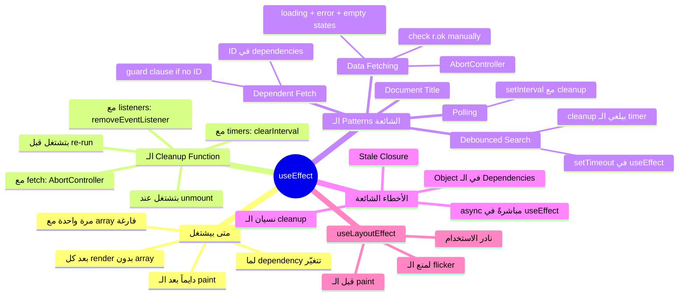

# الفصل الرابع — useEffect: الـ Component والعالم من حواليه

> **المتطلبات:** [[03-Events-and-Interaction]] — لازم تعرف الـ state والـ events كويس، لأن الـ useEffect غالباً بيشتغل على data جايبها من برّا وبيحطها في state.

---

## البداية — لما الـ Component مش مكتفي بنفسه

تخيّل معايا إنك خلّصت الفصول الثلاثة الأول وعندك TaskFlow بيشتغل كويس — بس الـ tasks عندك hardcoded جوا الكود:

```jsx
const tasks = [
  { id: 1, title: 'Fix login bug', priority: 'high',   assignee: 'Ali'  },
  { id: 2, title: 'Update UI',     priority: 'medium', assignee: 'Sara' },
];
```

في الحياة الحقيقية، الـ tasks دي بتيجي من API. يعني محتاج تعمل HTTP request لما الـ component يظهر، تحط الـ data في state، وترسم الـ UI.

المشكلة إنك لو حاولت تعمل الـ fetch **مباشرةً في الـ component body**:

```jsx
function TaskBoard() {
  const [tasks, setTasks] = useState([]);

  // ❌ This runs on EVERY render — and setTasks triggers a new render
  fetch('/api/tasks')
    .then(r => r.json())
    .then(data => setTasks(data)); // setTasks → re-render → fetch → setTasks → ...

  return <div>...</div>;
}
```

ده **infinite loop** مضمون. الـ `setTasks` بتعمل re-render، والـ re-render بيشغّل الـ fetch تاني، والـ fetch بيعمل `setTasks` تاني... وهكذا حتى الـ browser يعلق.

المشكلة إن الـ component body مكانه مش ليه — ده مكان للـ rendering logic بس.

> بدل ما تحط أي حاجة "من برّا" مباشرةً جوا الـ body — React عندها مكان مخصوص ليهم: الـ `useEffect`.

---

## [[01-What-Is-A-Side-Effect]] — الـ Side Effect: كل حاجة بتحصل بره الـ Render

الـ component المثالي هو function خالصة (pure function): بياخد input (props + state)، ويرجع output (JSX) — من غير ما يتأثر بحاجة من برّا، أو يأثّر في حاجة من برّا.

بس في الواقع إحنا دايماً محتاجين نعمل حاجات "من برّا" دي:

- **جلب data من API** — بتتكلم مع سيرفر برّاني
- **تعديل `document.title`** — بتلمس الـ browser مباشرةً
- **إعداد `setInterval` أو `setTimeout`** — بتحجز resource في الـ browser
- **إضافة event listener على `window`** — بتلمس الـ DOM من برّا الـ component

كل دول اسمهم **Side Effects** — وكلهم محلهم جوا الـ `useEffect`.

```jsx
import { useState, useEffect } from 'react';

function TaskBoard() {
  const [tasks, setTasks] = useState([]);

  useEffect(() => {
    // ✅ safe here — runs AFTER the component renders, not during
    fetch('/api/tasks')
      .then(r => r.json())
      .then(data => setTasks(data));
  }, []); // we'll explain the [] in the next section

  return (
    <div>
      {tasks.map(task => <TaskCard key={task.id} {...task} />)}
    </div>
  );
}
```

**الـ useEffect بياخد حاجتين:**
1. **Callback function** — فيها الـ side effect نفسه
2. **Dependency array** — بتتحكم *امتى* الـ effect يشتغل

---

## [[02-When-Does-useEffect-Run]] — الـ useEffect بيشتغل امتى بالظبط؟

سؤال مهم جداً وبيجي في الإنترفيو: هل الـ useEffect بيشتغل **قبل** الـ render ولا **بعده**؟

الإجابة: **بعده دايماً.**

```
1. React تعمل render للـ component وترسم الـ JSX في الـ DOM
2. المستخدم يشوف الـ UI على الشاشة
3. بعدين — useEffect بيشتغل
```

ليه كده؟ عشان React بتضمن إن الـ DOM جاهز خالص قبل ما أي side effect يشتغل. لو حاولت تلمس `document.getElementById(...)` جوا useEffect — هيكون موجود مضمون.

---

## [[03-Dependency-Array]] — الـ Dependency Array: مفتاح التحكم في useEffect

الـ dependency array هي أهم حاجة في الـ `useEffect`. وأكتر حاجة الـ juniors بيغلطوا فيها.

---

### الحالة الأولى — `[]` فارغة: اشتغل مرة واحدة بس

```jsx
useEffect(() => {
  // runs once — right after the first render
  fetch('/api/tasks')
    .then(r => r.json())
    .then(setTasks);
}, []); // empty array = "I depend on nothing" = run once and never again
```

ده الـ pattern الأشهر. بتستخدمه لما عايز تجيب data مرة واحدة لما الـ page تفتح.

---

### الحالة التانية — بدون array خالص: اشتغل في كل render

```jsx
useEffect(() => {
  console.log('I run after EVERY render — including re-renders!');
}); // no array at all — danger zone
```

> ⚠️ **انتبه:** غالباً مش محتاجها أبداً. لو عندك effect بيشتغل في كل render وجوّاه `setState` — إنت في infinite loop تاني. لو وجدت نفسك تكتبها، وقف وفكّر مرتين.

---

### الحالة التالتة — array فيها values: اشتغل لما القيمة دي تتغيّر

```jsx
function TaskDetails({ taskId }) {
  const [task, setTask] = useState(null);

  useEffect(() => {
    // runs when taskId changes — React compares old vs new value
    fetch(`/api/tasks/${taskId}`)
      .then(r => r.json())
      .then(setTask);
  }, [taskId]); // re-run whenever taskId changes

  return <div>{task?.title}</div>;
}
```

لما المستخدم يختار task تانية، الـ `taskId` يتغير، React تلاقي إن الـ dependency اتغيّرت، فبتشغّل الـ effect تاني.

بالظبط زي لما بتقول لـ Google Maps "وجّهني لـ..." — كل ما العنوان يتغيّر، بيعيد حساب الطريق من الأول.

---

### ملخص الـ Dependency Array

| الـ Array | امتى بيشتغل الـ Effect | الاستخدام |
|---|---|---|
| مفيش array | بعد كل render | نادراً — وبحذر شديد |
| `[]` فارغة | مرة واحدة بعد أول render | جلب data عند فتح الصفحة |
| `[value]` | أول render + كل ما `value` تتغيّر | جلب data بناءً على ID أو filter |
| `[a, b]` | أول render + لما `a` أو `b` تتغيّر | effect يعتمد على أكتر من قيمة |

---

### إزاي React بتقارن الـ Dependencies؟

React بتستخدم **Object.is** — وهو في الأساس `===` بس مع تعامل أحسن مع `NaN` و`-0`.

```jsx
// Primitives — comparison by VALUE ✅ works as expected
useEffect(() => { ... }, [userId]);     // re-runs when userId number changes
useEffect(() => { ... }, [searchText]); // re-runs when text changes

// Objects/Arrays — comparison by REFERENCE ⚠️ common trap
function Component({ filters }) {
  useEffect(() => {
    fetch(`/api/tasks?status=${filters.status}`);
  }, [filters]); // ← DANGER: if parent re-renders and creates new filters object,
                 //   this re-runs even if the values are identical
}

// Fix: depend on the specific value, not the whole object
useEffect(() => {
  fetch(`/api/tasks?status=${filters.status}`);
}, [filters.status]); // ← depends on the primitive value inside
```

ده bug شائع جداً — إنت حاسس إن الـ effect بيشتغل أكتر من اللازم والـ values مش اتغيّرت. السبب دايماً إنك محطوط object أو array في الـ dependencies، وأهله بيتعملوا في كل render.

---

## [[04-Cleanup]] — الـ Cleanup Function: مش بس تشتغل — لازم تقفل ورا نفسك

اللي بيجي دلوقتي هو من أهم الأسئلة في أي إنترفيو React.

تخيّل المستخدم فتح TaskDetails بتاع الـ Task رقم 1. الـ useEffect اشتغل وابتدى يعمل fetch. بس **قبل** ما الـ fetch يرجع، المستخدم غيّر رأيه وضغط على Task رقم 2.

دلوقتي عندك fetch قديم لسه شغّال، وأول ما يخلّص هيحاول يعمل `setTask` على component بيعرض data مختلفة خالص. النتيجة؟ Race condition — ممكن تشوف data الـ Task رقم 1 تظهر لثانية وهي المفروض Task رقم 2.

الحل: الـ **cleanup function** — بتـreturnها من جوا الـ useEffect. بتشتغل تلقائياً في حالتين:
- **قبل ما الـ effect يشتغل تاني** (لما الـ dependency تتغيّر)
- **لما الـ component يتشال من الـ DOM** (unmount)

```jsx
useEffect(() => {
  // create a controller to cancel the fetch if needed
  const controller = new AbortController();

  fetch(`/api/tasks/${taskId}`, { signal: controller.signal })
    .then(r => r.json())
    .then(data => setTask(data))
    .catch(err => {
      if (err.name === 'AbortError') {
        // fetch was intentionally cancelled — not a real error
        return;
      }
      setError(err.message);
    });

  // cleanup: runs before next effect or when component unmounts
  return () => {
    controller.abort(); // cancel the in-flight request
  };
}, [taskId]);
```

```
[taskId = 1] Component mounts
        ↓
useEffect runs → starts fetch for task 1
        ↓
User clicks task 2 → [taskId = 2]
        ↓
CLEANUP RUNS → controller.abort() → fetch for task 1 is cancelled ✅
        ↓
useEffect runs again → starts fetch for task 2
        ↓
Fetch for task 2 resolves → setTask(task2Data) ✅
```

---

### cleanup مع الـ Timers

```jsx
useEffect(() => {
  // auto-refresh tasks every 30 seconds
  const interval = setInterval(() => {
    fetch('/api/tasks').then(r => r.json()).then(setTasks);
  }, 30_000);

  return () => {
    clearInterval(interval); // MUST clear — otherwise interval survives component unmount
  };
}, []);
```

لو نسيت الـ `clearInterval` — الـ interval هيفضل يشتغل حتى بعد ما الـ component اتشال من الـ DOM، وكل 30 ثانية هيحاول يعمل `setTasks` على component مش موجود. ده الـ **memory leak**.

---

### cleanup مع الـ Event Listeners

```jsx
useEffect(() => {
  function handleKeyDown(e) {
    if (e.key === 'Escape') setSelectedTask(null);
    if (e.ctrlKey && e.key === 'n') setShowNewTaskModal(true);
  }

  window.addEventListener('keydown', handleKeyDown);

  return () => {
    window.removeEventListener('keydown', handleKeyDown); // same reference — crucial
  };
}, []); // runs once — keyboard shortcuts don't need to change
```

> ⚠️ **انتبه:** لازم تبعت **نفس الـ reference** لـ `removeEventListener`. لو عرّفت الـ function جوا الـ return — مش هيشيل اللي ضيّفته:
> ```jsx
> // ❌ Wrong — different function reference
> return () => window.removeEventListener('keydown', e => { ... });
>
> // ✅ Correct — same reference defined outside
> return () => window.removeEventListener('keydown', handleKeyDown);
> ```

---

## [[05-Strict-Mode]] — ليه الـ useEffect بيشتغل مرتين في الـ Development؟

لو شغّال `<React.StrictMode>` (والـ Vite بيشغّله by default في development) — هتلاحظ إن كل useEffect بيشتغل **مرتين** عند أول render.

مش bug. ده عمداً.

React بتعمل كده عشان تكشف effects مش عندها cleanup صح:

```
[Development only]
Component mounts
        ↓
useEffect runs → side effect 1 starts
        ↓
React immediately unmounts the component
        ↓
Cleanup function runs (if you wrote one) → side effect 1 cancelled ✅
        ↓
React mounts the component again
        ↓
useEffect runs again → side effect 2 starts
```

لو الـ effect بتاعك بيعمل مشاكل لما يشتغل مرتين — ده معناه إنك محتاج cleanup. React بتقولك كده بشكل مبكر في الـ development قبل ما يوصل production.

في الـ **production**: الـ effect بيشتغل مرة واحدة بس.

---

## [[06-Common-Patterns]] — الـ Patterns الأكتر استخداماً في الواقع

### Pattern 1 — Data Fetching مع Loading / Error / Empty States

ده الـ pattern اللي هتكتبه في **كل component تقريباً** في أي production app:

```jsx
function TaskBoard() {
  const [tasks, setTasks]     = useState([]);
  const [loading, setLoading] = useState(true);  // start as true — fetch is coming
  const [error, setError]     = useState(null);

  useEffect(() => {
    const controller = new AbortController();

    setLoading(true);
    setError(null); // clear any previous error before new fetch

    fetch('/api/tasks', { signal: controller.signal })
      .then(r => {
        // fetch only throws on network failure — NOT on 4xx/5xx
        // so we need to check r.ok manually
        if (!r.ok) throw new Error(`Server error: ${r.status} ${r.statusText}`);
        return r.json();
      })
      .then(data => {
        setTasks(data);
        setLoading(false);
      })
      .catch(err => {
        if (err.name === 'AbortError') return; // intentional cancel — ignore
        setError(err.message);
        setLoading(false);
      });

    return () => controller.abort();
  }, []);

  // render based on state — order matters
  if (loading) return <div className="spinner">Loading tasks...</div>;
  if (error)   return <div className="error-state">Something went wrong: {error}</div>;
  if (tasks.length === 0) return <div className="empty-state">No tasks yet. Create one!</div>;

  return (
    <div className="task-board">
      {tasks.map(task => <TaskCard key={task.id} {...task} />)}
    </div>
  );
}
```

لاحظ: في 3 حالات ممكن يكونوا **غلط** في الـ if checks دي:
- ❌ لو حطيت `tasks.length === 0` قبل `loading` — هتشوف "No tasks yet" لثانية في كل load
- ❌ لو نسيت `error` check — التطبيق هيبدو إنه شغّال بس مفيش data
- ✅ الترتيب الصح دايماً: loading → error → empty → data

---

### Pattern 2 — Fetching بناءً على ID (مع كل تغيير)

```jsx
function TaskDetails({ taskId }) {
  const [task, setTask]       = useState(null);
  const [loading, setLoading] = useState(false);

  useEffect(() => {
    if (!taskId) return; // guard: don't fetch if no ID selected

    const controller = new AbortController();
    setLoading(true);

    fetch(`/api/tasks/${taskId}`, { signal: controller.signal })
      .then(r => r.json())
      .then(data => {
        setTask(data);
        setLoading(false);
      })
      .catch(err => {
        if (err.name === 'AbortError') return;
        setLoading(false);
      });

    return () => controller.abort(); // cancel previous request when taskId changes

  }, [taskId]); // re-run whenever taskId changes

  if (!taskId)  return <div>Select a task to view details</div>;
  if (loading)  return <div>Loading task...</div>;
  if (!task)    return null;

  return <div className="task-detail"><h2>{task.title}</h2></div>;
}
```

---

### Pattern 3 — تغيير الـ Document Title

```jsx
function TaskDetails({ task }) {
  useEffect(() => {
    // update browser tab title when task changes
    document.title = task
      ? `${task.title} — TaskFlow`
      : 'TaskFlow';

    return () => {
      // reset title when leaving this component
      document.title = 'TaskFlow';
    };
  }, [task]); // re-run whenever task changes

  return <div>...</div>;
}
```

---

### Pattern 4 — Polling (Auto-Refresh)

```jsx
function TaskBoard() {
  const [tasks, setTasks] = useState([]);

  // initial fetch
  useEffect(() => {
    fetch('/api/tasks').then(r => r.json()).then(setTasks);
  }, []);

  // auto-refresh every 60 seconds
  useEffect(() => {
    const interval = setInterval(() => {
      fetch('/api/tasks')
        .then(r => r.json())
        .then(setTasks);
    }, 60_000);

    return () => clearInterval(interval); // don't forget cleanup
  }, []);

  return <div>...</div>;
}
```

لاحظ: فاصلين الـ initial fetch عن الـ polling في effects منفصلة — كل effect مسؤول عن حاجة واحدة بس. ده بيخلي الكود أسهل في القراءة والـ debugging.

---

### Pattern 5 — Debounced Search

ده pattern شايفه في كل تطبيق فيه search. عايزين نعمل fetch بس **بعد ما المستخدم يوقف يكتب** بثانية:

```jsx
function TaskSearch() {
  const [query, setQuery]   = useState('');
  const [results, setResults] = useState([]);

  useEffect(() => {
    if (!query.trim()) {
      setResults([]);
      return; // don't fetch for empty query
    }

    // wait 500ms before fetching — if query changes before that, cleanup cancels this
    const timer = setTimeout(() => {
      fetch(`/api/tasks?search=${encodeURIComponent(query)}`)
        .then(r => r.json())
        .then(setResults);
    }, 500);

    return () => clearTimeout(timer); // cancel pending timer if query changes

  }, [query]); // re-run on every keystroke, but timer delays the actual fetch

  return (
    <div>
      <input
        value={query}
        onChange={e => setQuery(e.target.value)}
        placeholder="Search tasks..."
      />
      {results.map(task => <TaskCard key={task.id} {...task} />)}
    </div>
  );
}
```

```
User types "f"    → effect runs → timer starts (500ms)
User types "fi"   → CLEANUP: timer cancelled → new timer starts (500ms)
User types "fix"  → CLEANUP: timer cancelled → new timer starts (500ms)
User stops typing → timer completes → fetch('/api/tasks?search=fix') ✅
Only 1 request made — not 3
```

ده الـ **debouncing pattern** — بتوفّر requests كتير ومش بتضغط على الـ backend بدون داعي.

---

## [[07-useEffect-vs-useLayoutEffect]] — useEffect أو useLayoutEffect؟

فيه hook شبيه اسمه `useLayoutEffect`. الفرق الوحيد: **توقيت التشغيل**.

```
Render
  ↓
DOM updates
  ↓
[useLayoutEffect runs here — before browser paints]
  ↓
Browser paints — user sees the UI
  ↓
[useEffect runs here — after browser paints]
```

| | useEffect | useLayoutEffect |
|---|---|---|
| بيشتغل | بعد ما الـ browser يرسم | قبل ما الـ browser يرسم |
| الأداء | لا يحجب الـ render | بيحجب الـ render لحد ما يخلّص |
| الاستخدام | 99% من الـ cases | قياس DOM dimensions، منع الـ flash |
| مناسب لـ | كل حاجة تقريباً | لما بتلاحظ flickering أو flash في الـ UI |

القاعدة: **ابدأ بـ useEffect دايماً**. انتقل لـ useLayoutEffect بس لو لاحظت الـ UI بيـflicker.

```jsx
// Example where useLayoutEffect makes sense:
// You want to scroll to bottom of a chat — if you use useEffect,
// user might see a flash of the wrong scroll position first

useLayoutEffect(() => {
  // runs before paint — no flash
  chatContainerRef.current.scrollTop = chatContainerRef.current.scrollHeight;
}, [messages]);
```

---

## [[08-Common-Mistakes]] — الأخطاء الأكتر شيوعاً

### الغلطة الأولى — نسيان الـ Cleanup

```jsx
// ❌ memory leak — interval survives component unmount
useEffect(() => {
  const id = setInterval(() => setCount(c => c + 1), 1000);
}, []);

// ✅ clean
useEffect(() => {
  const id = setInterval(() => setCount(c => c + 1), 1000);
  return () => clearInterval(id);
}, []);
```

---

### الغلطة التانية — Stale Closure

```jsx
// ❌ stale closure — count is always 0 inside the effect
const [count, setCount] = useState(0);

useEffect(() => {
  const id = setInterval(() => {
    console.log(count); // always logs 0 — captured the initial value
    setCount(count + 1); // adds 1 to 0 every time — stuck at 1
  }, 1000);
  return () => clearInterval(id);
}, []); // empty array means count is never updated inside

// ✅ use functional update — doesn't need count in dependencies
useEffect(() => {
  const id = setInterval(() => {
    setCount(prev => prev + 1); // React gives you the latest value
  }, 1000);
  return () => clearInterval(id);
}, []);
```

الـ stale closure من أصعب الـ bugs في React. الـ effect "يلتقط" نسخة قديمة من الـ state ويفضل يستخدمها. الحل في الـ `setState` هو دايماً استخدام الـ functional form `prev => prev + 1`.

---

### الغلطة التالتة — Object في الـ Dependencies

```jsx
// ❌ re-runs on every render — options is a new object every time
function TaskList({ filters }) {
  useEffect(() => {
    fetch(`/api/tasks?status=${filters.status}&priority=${filters.priority}`);
  }, [filters]); // new object reference every render = runs every render
}

// ✅ depend on the actual primitive values
function TaskList({ filters }) {
  useEffect(() => {
    fetch(`/api/tasks?status=${filters.status}&priority=${filters.priority}`);
  }, [filters.status, filters.priority]); // strings = compared by value ✅
}
```

---

### الغلطة الرابعة — async function مباشرةً

```jsx
// ❌ can't pass async function directly to useEffect
useEffect(async () => {
  const data = await fetch('/api/tasks').then(r => r.json());
  setTasks(data);
}, []);
// This breaks cleanup — async functions return Promises, not cleanup functions

// ✅ define async function inside and call it
useEffect(() => {
  async function loadTasks() {
    const r    = await fetch('/api/tasks');
    const data = await r.json();
    setTasks(data);
  }

  loadTasks();
  // return () => controller.abort(); // add if needed
}, []);
```

---

## 🗺️ خريطة useEffect كاملة



---

## ✅ Checkpoint — أسئلة إنترفيو useEffect

**س: إيه الـ useEffect وامتى بيشتغل بالظبط؟**
> الـ `useEffect` هو hook بيخلّيك تعمل side effects جوا الـ function component — زي الـ API calls والـ event listeners والـ timers. بيشتغل **بعد** ما React ترسم الـ component في الـ DOM وبعد ما الـ browser يعرض الـ UI للمستخدم — مش أثنا الـ render. امتى بيشتغل بيتحدّد بالـ dependency array: بدونها بيشتغل بعد كل render، بـ`[]` فارغة مرة واحدة، ومع values بيشتغل كل ما القيمة تتغيّر بناءً على `Object.is` comparison.

**س: إيه الفرق بين `useEffect(() => {}, [])` و`useEffect(() => {})`؟**
> الأولى بتشتغل مرة واحدة بعد أول render فقط — الـ `[]` بتقول لـ React "الـ effect ده مش بيعتمد على أي value، ما تشغّلوش تاني". التانية بتشتغل بعد **كل** render من غير استثناء — وده في الغالب مش اللي بتعوزه وبيسبّب performance issues أو infinite loops لو فيها setState.

**س: إيه الـ cleanup function وامتى بتحتاجها؟**
> الـ cleanup function هي function بتـreturnها من جوا الـ useEffect. بتشتغل في حالتين: قبل ما الـ effect يشتغل تاني (لو الـ dependency اتغيّرت)، أو لما الـ component يتمسح من الـ DOM. محتاجها مع **timers** (clearInterval/clearTimeout)، مع **event listeners** (removeEventListener)، ومع **fetch** (AbortController.abort). من غيرها — memory leaks، race conditions، وlisteners بتتراكم.

**س: إيه الـ Stale Closure وإزاي بتحلّه؟**
> الـ stale closure بتحصل لما الـ useEffect يـ"يلتقط" نسخة قديمة من state أو prop. مثلاً: لو عندك `setInterval` في effect بـ`[]` وجواه بيستخدم `count` — هيفضل يشوف القيمة الابتدائية لـ `count` حتى بعد ما تغيّرت. الحل: إما تحط `count` في الـ dependencies أو تستخدم الـ functional update form: `setCount(prev => prev + 1)` بدل `setCount(count + 1)`.

**س: ليه مش ممكن تعمل async function مباشرةً في useEffect؟**
> لأن الـ useEffect بيتوقع إن الـ callback ترجع إما `undefined` أو cleanup function. الـ async functions دايماً بترجع Promise — مش cleanup function. React مش عارفة تتعامل مع الـ Promise ده بشكل صح. الحل: تعرّف async function **جوا** الـ useEffect وتناديها.

**س: إيه الفرق بين useEffect وuseLayoutEffect؟**
> الاتنين بيشتغلوا بعد الـ render، بس `useLayoutEffect` بيشتغل **قبل** ما الـ browser يرسم الـ UI للمستخدم. يعني لو بتعمل حاجة بتغيّر الـ DOM زي scroll أو قياس dimensions — الـ `useLayoutEffect` بيمنع الـ flicker. الـ `useEffect` بيشتغل بعد الـ paint — والمستخدم ممكن يشوف الـ UI قبل ما التغيير يحصل. القاعدة: ابدأ بـ`useEffect` دايماً وانتقل لـ`useLayoutEffect` بس لو لاحظت flickering.

---

## 🛠️ Practical Exercise — TaskBoard بيجيب بيانات حقيقية

### Task 1 — ابدل الـ hardcoded data بـ fetch

في `src/App.jsx`، غيّر الـ tasks array الثابتة بـ useEffect حقيقي:

```jsx
import { useState, useEffect } from 'react';
import TaskCard from './components/TaskCard';

function App() {
  const [tasks, setTasks]     = useState([]);
  const [loading, setLoading] = useState(true);
  const [error, setError]     = useState(null);

  useEffect(() => {
    const controller = new AbortController();

    fetch('https://jsonplaceholder.typicode.com/todos?_limit=8', {
      signal: controller.signal,
    })
      .then(r => {
        if (!r.ok) throw new Error(`HTTP error: ${r.status}`);
        return r.json();
      })
      .then(data => {
        const mapped = data.map(todo => ({
          id:       todo.id,
          title:    todo.title,
          priority: todo.completed ? 'low' : 'high',
          assignee: 'Team',
        }));
        setTasks(mapped);
        setLoading(false);
      })
      .catch(err => {
        if (err.name === 'AbortError') return;
        setError(err.message);
        setLoading(false);
      });

    return () => controller.abort();
  }, []);

  if (loading) return <p style={{ padding: 24 }}>⏳ Loading tasks...</p>;
  if (error)   return <p style={{ padding: 24, color: 'red' }}>❌ {error}</p>;

  return (
    <div style={{ maxWidth: 640, margin: '0 auto', padding: 24 }}>
      <h1>TaskFlow 🗂️</h1>
      <p>{tasks.length} tasks loaded</p>
      {tasks.map(task => <TaskCard key={task.id} {...task} />)}
    </div>
  );
}

export default App;
```

---

### Task 2 — أضف Dynamic Document Title

ضيف useEffect تاني في `App.jsx`:

```jsx
useEffect(() => {
  if (loading) {
    document.title = 'Loading... — TaskFlow';
    return;
  }
  document.title = `${tasks.length} Tasks — TaskFlow`;

  return () => {
    document.title = 'TaskFlow'; // reset on unmount
  };
}, [loading, tasks.length]);
```

شوف الـ browser tab بيتغيّر لما الـ loading يخلّص.

---

### Task 3 — الـ Challenge: Debounced Search

أضف search input فوق الـ list، وعمل useEffect يفلتر الـ tasks بعد 400ms من ما المستخدم يوقف يكتب.

```jsx
// hint: you'll need these states
const [query, setQuery]           = useState('');
const [filtered, setFiltered]     = useState([]);

// hint: filter locally (no need for a real API here)
// tasks.filter(t => t.title.toLowerCase().includes(query.toLowerCase()))
```

| السؤال | اللي تفكّر فيه |
|---|---|
| لو مسحت الـ AbortController — إيه اللي ممكن يحصل؟ | جرّب تـslow down الـ network من DevTools وابدل بين الـ tasks سريع |
| لو حطيت `tasks` في dependencies الـ title effect — إيه اللي هيحصل؟ | هيشتغل في كل render ولا في حالات معيّنة بس؟ |
| الـ Debounce effect — إيه اللي بيشتغل لما تكتب "f" ثم "fi" ثم "fix" بسرعة؟ | كام request هيتبعت؟ |

---

## 🫒 زتونة الإنترفيو

> **"`useEffect` is React's escape hatch for synchronizing a component with the outside world — API calls, timers, event listeners, DOM manipulation. It always runs after the browser paints, never during render. The dependency array controls when it re-runs: empty means once, with values means on change, missing means every render (almost always a mistake). The cleanup function is non-negotiable whenever you create anything that outlives the component: intervals, listeners, pending fetches. Without cleanup, you get memory leaks, race conditions, and stale updates. One often-missed detail: React Strict Mode runs effects twice in development intentionally — to expose missing cleanups early. If your effect breaks when it runs twice, that's not a React bug, it's a signal your cleanup is incomplete."**

---

*Next → [[05-Routing]] — الـ Routing مع React Router: إزاي تعمل تطبيق فيه أكتر من صفحة وكل navigate مش بيعمل page reload.*
