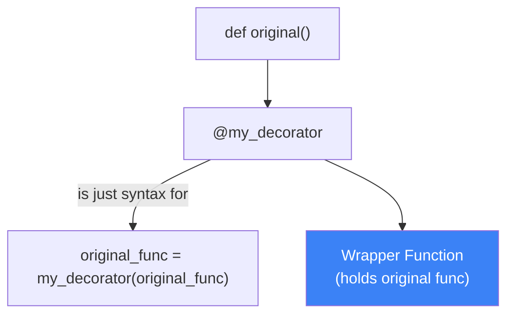
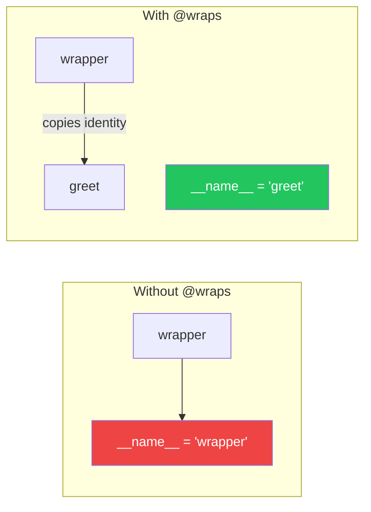
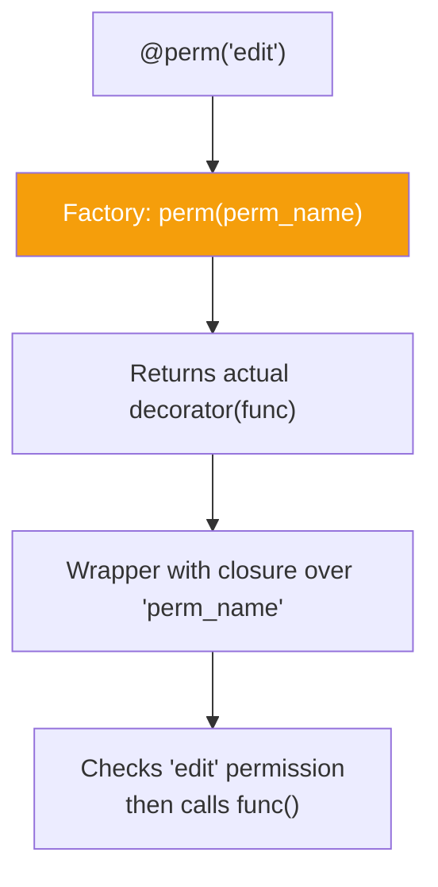
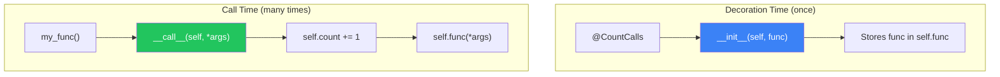
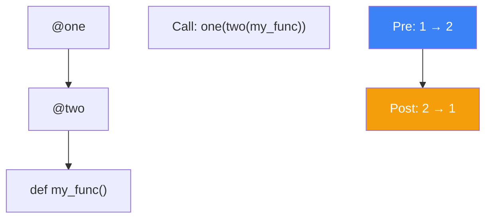

# الفصل الرابع — الـ Decorators: "الطبقة السرية" فوق كودك

> **المتطلبات:** [[03-Python-Functional-Paradigm]] — لازم تكون فاهم إن الـ functions في Python هي First-Class Objects، وفاهم إزاي الـ Closures بيشتغلوا (إن الـ inner function بتتذكر بيئة الـ outer function). الفصل ده هيبني فوقهم مباشرةً عشان يوريك إن الـ Decorator مش سحر — هو مجرد Closure عملي.

---

## البداية — مشكلة "نسخ ولزق" الكود

تخيّل معايا إنك بتكتب APIs في Django وكل function محتاجة تتأكد الأول إن الـ user مسموح له يدخل. هتكتب إيه؟ غالباً حاجة زي كده:

```python
def view_job(request):
    if not request.user.is_authenticated:
        return redirect('login')
    # ... منطق عرض الوظيفة ...

def apply_to_job(request):
    if not request.user.is_authenticated:
        return redirect('login')
    # ... منطق التقديم على الوظيفة ...
```

ده اسمه "Check-Prefix" وده أسوأ عدو للـ Clean Code. إنت بتكرر نفس الـ 3 أسطر في كل مكان. لو عايز تغير الـ logic (زي إنك تضيف `is_active` check)، هتضطر تروح لكل function في المشروع وتعدل فيها.

الحل اللي هيخلينا "نلبس" الـ function الأصلية طبقة حماية من غير ما نلمس جواها هو: **الـ Decorator**.

---

## [[01-Decorator-As-Closure]] — الـ Decorator كـ Closure في ثوب جديد

### 🧠 الشرح النظري

الـ Decorator في جوهره ليس أكثر من **Higher-Order Function** بتاخد function وترجع function جديدة. بس المشهد اللي إنت شايفه بـ `@` ده مجرد **Syntactic Sugar** (سكر نحوي) بيجمّل شكل الكود.

إزاي ده شغال؟ بالضبط زي ما الـ Closure بيخلق "بيئة مغلقة" للـ inner function، الـ Decorator بيخلق بيئة مغلقة عشان يغلف الـ original function.
لما بتكتب `@login_required` فوق `def view_job`، ده معناه حرفياً: 
`view_job = login_required(view_job)`.
الـ Decorator بياخد الـ function بتاعتك، ويرجعلك نسخة جديدة منها "محسّنة" (أي ليها قدرات إضافية).

الفكرة كلها قائمة على إنك بتدي الـ Wrapper function الفرصة تشتغل *قبل* أو *بعد* الـ function الأصلية. تقدر تمنع الـ function الأصلية من الشغل تماماً، تغير arguments بتاعتها، أو تعدل في النتيجة اللي رجعتها.

### 📊 Visualization



### 💻 Micro-Example

```python
def announce(func):                     # decorator factory — takes function
    def wrapper():                      # closure — wraps the original
        print("Before the function")    # pre-processing
        func()                          # calls the original function
        print("After the function")     # post-processing
    return wrapper                      # return the enhanced function

@announce
def greet(): 
    print("Hello!")
```

---

## [[02-Functools-Wraps]] — إنقاذ هوية الـ Function المخطوفة

### 🧠 الشرح النظري

في الـ example السابق، حصلت كارثة صغيرة محدش لاحظها. لما سويت `@announce`، الـ function اللي اسمها `greet` اختفت من الوجود. تم استبدالها بـ `wrapper`. ده مش مجرد كلام — ده بجد. لو عملت `print(greet.__name__)` هتاخد `wrapper` مش `greet`.

ليه ده خطر؟
1. **الـ Debugging:** الـ Traceback بتاع الأخطاء هيقولك إن الخطأ حصل في `wrapper` ومش هتعرف إيه الـ function الأصلية.
2. **الـ Introspection:** لو Django أو DRF أو أي library تانية بتحاول تقرا `__name__` أو `__doc__` بتاعة الـ function (عشان الـ routing أو الـ documentation)، هتلاقي معلومات غلط.

عشان تحل المشكلة دي، بنستخدم `@functools.wraps` جوا الـ decorator. هو بيعمل "نسخ" لكل الـ metadata (الاسم، الـ docstring، وغيره) من الـ original function للـ wrapper function. تخيل إنك بتدي الـ wrapper "هوية مزيفة" بس مطابقة للأصل عشان محدش ياخد باله إن الوظيفة اتخطفت.

### 📊 Visualization



### 💻 Micro-Example

```python
from functools import wraps

def log_call(func):
    @wraps(func)                         # copies func's identity to wrapper
    def wrapper(*args, **kwargs):
        print(f"Calling {func.__name__}") # now correctly shows 'func' name
        return func(*args, **kwargs)
    return wrapper

@log_call
def process_payment(amount): ...
```

---

## [[03-Decorator-With-Arguments]] — الـ Factory Pattern للـ Decorators

### 🧠 الشرح النظري

الـ `@login_required` بيشتغل لوحده، بس إيه رأيك لو عايز تعمل `@permission_required('edit_job')`؟ هنا الـ Decorator محتاج Argument. وده بيغير شكل الدنيا شوية.

عشان تفهم الفرق:
- **Decorator عادي:** بياخد `func` ويرجع `wrapper`.
- **Decorator بوسيطة:** محتاج `decorator_factory` — function بتاخد الـ arguments بتوعك (زي `'edit_job'`) وبعدين *ترجع* الـ decorator الحقيقي اللي هياخد `func`.

تخيل الموضوع كأنه "مصنع خواتم سحرية". إنت بتقول للمصنع `permission_required('edit_job')`، فالمصنع بيديك خاتم (Decorator) منقوش عليه "صلاحية التعديل". لما تلبس الخاتم ده لـ function (باستخدام `@`)، الخاتم هو اللي بيشتغل ويعمل التغليف.

ده معناه إن `@permission_required('edit')` بتستدعي function اسمها `permission_required` بترجع الـ decorator الفعلي. ده بالضبط اللي بيحصل في Django: `@permission_required('app.view_job')` هي Factory بترجع Decorator جاهز للتلبيس.

### 📊 Visualization



### 💻 Micro-Example

```python
def require_permission(perm_name):          # step 1: factory takes custom args
    def decorator(func):                    # step 2: actual decorator takes func
        @wraps(func)
        def wrapper(user, *args, **kwargs): # step 3: closure holds 'perm_name'
            if user.has_perm(perm_name):
                return func(user, *args, **kwargs)
            raise PermissionError(f"Missing {perm_name}")
        return wrapper
    return decorator

@require_permission('hirelink.edit_job')    # use the factory
def edit_job(user, job_id): ...
```

---

## [[04-Class-Based-Decorators]] — لما الـ Decorator يكون Class

### 🧠 الشرح النظري

كل اللي فات كان Functions، بس هل ينفع الـ Decorator يكون Class؟ أيوة، وبيكون أقوى بكتير لو الـ state معقدة.
بدل ما نعمل `wrapper()` function، بنعمل Class ليه `__init__` و `__call__`.

- **`__init__`**: بتشتغل مرة واحدة بس وقت ما الـ Decorator بيتطبق على الـ function (وقت تعريف الـ function نفسها — وقت تحميل الـ module). هنا بنحفظ الـ `func` الأصلية وأي arguments تانية.
- **`__call__`**: دي اللي بتشتغل كل مرة الـ function المزخرفة بتتنادي. هي مكان الـ `wrapper` function اللي بنيناها قبل كده.

تخيل إنك عايز تعمل Rate Limiting. الـ Class Decorator يقدر يحتفظ بعداد جواه `self.counter` لكل function مزخرفة بشكل منفصل. ده أصعب شوية تعمله بـ function بس (إلا لو استخدمت mutable default argument أو closure tricks معقدة). الـ Class بيخلي الـ state management واضح ومنظم.

### 📊 Visualization



### 💻 Micro-Example

```python
class CountCalls:
    def __init__(self, func):               # runs once at decoration
        self.func = func
        self.count = 0

    def __call__(self, *args, **kwargs):    # runs every time function is called
        self.count += 1
        print(f"Call {self.count} of {self.func.__name__}")
        return self.func(*args, **kwargs)

@CountCalls
def process_data(): ...
```

---

## [[05-Decorator-Stacking]] — ترتيب الطبقات: مين الأول؟

### 🧠 الشرح النظري

تقدر تحط أكتر من Decorator فوق نفس الـ function. بس الترتيب هنا **بيفرق جداً**. فكر فيها زي إنك بتلبس هدوم في الشتا: الفانلة الداخلية قبل البلوفير قبل الجاكيت. لما تيجي تقلع، هتقلع الجاكيت الأول.

في عالم الـ Decorators:
الـ Decorator اللي **أقرب** للـ `def` هو اللي **بيف الطلب عليه آخر حاجة**.
لما تكتب:

```python
@decorator_one
@decorator_two
def my_func():
    pass
```

ده معناه: `my_func = decorator_one(decorator_two(my_func))`.

ده معناه إن `decorator_two` (التحتاني) بيشتغل أول حاجة في الـ execution (يعتبر الـ inner function)، لكن في الـ stacking (الترتيب التصاعدي)، `decorator_one` هو اللي بيغلف كل حاجة من برا.

الخلاصة:
- **Pre-processing:** (الكود اللي قبل استدعاء الـ original func) بيشتغل من **فوق لتحت** (One ثم Two).
- **Post-processing:** (الكود اللي بعد ما الـ original func ترجع) بيشتغل من **تحت لفوق** (Two ثم One).

### 📊 Visualization



### 💻 Micro-Example

```python
def one(func):
    def wrapper():
        print("1 start")
        result = func()
        print("1 end")
        return result
    return wrapper

def two(func):
    def wrapper():
        print("2 start")
        result = func()
        print("2 end")
        return result
    return wrapper

@one
@two
def greet(): print("Hello")
# Output: 1 start, 2 start, Hello, 2 end, 1 end
```

---

## 🎯 أسئلة الإنترفيو

**س: إيه هو الـ Decorator في Python وإزاي بيشتغل من الداخل؟**
> الـ Decorator هو **Higher-Order Function** بتاخد `callable` (زي function) وترجع `callable` جديد. هو بيعتمد على مفهوم الـ **Closure** — الـ wrapper function اللي جوا الـ decorator بتتذكر الـ `func` الأصلية وبتقدر تنفذها جواها.<br/><br/>
> لما بنستخدم الـ `@` syntax، بنقول لـ Python: `target = decorator(target)`. ده بيحصل **مرة واحدة** وقت تحميل الـ module (import time)، مش وقت استدعاء الـ function.<br/><br/>
> النتيجة إن الـ wrapper بياخد control الأول. يقدر يعمل حاجة قبل وبعد تنفيذ الـ function الأصلية، أو حتى يمنع تنفيذها تماماً.

---

**س: ليه لازم نستخدم `functools.wraps` جوا الـ Decorator؟**
> بدون `@wraps`، الـ `wrapper` function هتاخد مكان الـ `func` الأصلية بالكامل — بما في ذلك الـ metadata زي `__name__` و `__doc__`. ده بيعمل مشكلتين كبيرتين:<br/><br/>
> **1. الـ Debugging:** لما يحصل Exception، الـ traceback هيقول إن الخطأ حصل في `wrapper` بدل اسم الـ function الأصلية — وده مربك جداً.<br/><br/>
> **2. الـ Framework Integration:** أطر عمل زي Django أو DRF بتعتمد على `__name__` عشان تولد URLs أو Documentation. لو `__name__` غلط، الـ system هيفشل أو هيديك نتايج غريبة.<br/><br/>
> `wraps` هو مجرد `partial(update_wrapper)` بياخد الـ `func` الأصلية وينسخ كل الـ attributes دي للـ `wrapper`.

---

**س: إزاي تبني Decorator بياخد Arguments؟ (زي `@permission_required('edit')`)**
> عشان تعمل Decorator بياخد arguments، لازم تضيف **طبقة تالتة** من الـ functions (Factory Pattern).<br/><br/>
> - **الطبقة الأولى (Factory):** بتاخد الـ arguments بتوعك (زي `'edit'`). مهمتها إنها ترجع الـ Decorator الحقيقي.<br/>
> - **الطبقة التانية (Decorator):** بتاخد الـ `func` اللي هتتزخرف. مهمتها ترجع الـ Wrapper.<br/>
> - **الطبقة التالتة (Wrapper):** بتنفذ الـ logic باستخدام الـ arguments اللي اتحفظت في الـ Closure بتاع الطبقة الأولى.<br/><br/>
> المثال: `def perm(name): return def decorator(func): return def wrapper(...): ...`<br/>
> الـ Closure هنا بيدي الـ wrapper access للـ `name` (argument) والـ `func` الأصلية في نفس الوقت.

---

**س: إيه الفرق بين Decorator مبني بـ Function وDecorator مبني بـ Class؟**
> الاتنين بيحققوا نفس الهدف، لكن الـ **Class-Based Decorator** بيكون أنضف وأوضح لما الـ state (حالة التخزين) بتاعة الـ decorator تكون معقدة أو عايزة تفضل محفوظة بين الـ calls المختلفة.<br/><br/>
> - **Function-Based:** بتعتمد على الـ closure variables. لو عايز تحفظ `counter`، هتحتاج تعمل list `counts = []` أو تستخدم `nonlocal` — وده ممكن يبقى messy لو الـ state كتيرة.<br/>
> - **Class-Based:** الـ `__init__` بيعمل setup للـ instance (زي `self.func = func`). الـ `__call__` بيشتغل كل مرة. تقدر تحتفظ بـ `self.counter` عادي جداً من غير أي tricks. الـ code بيكون object-oriented وواضح، وسهل تعمل inheritance بين الـ decorators لو حبيت.

---

**س: لو حطيت أكتر من Decorator فوق بعض، إيه ترتيب التنفيذ؟**
> ترتيب الـ Decorators بيتبع **نموذج البصلة (Onion Model)**.<br/><br/>
> الـ Decorator اللي **أقرب** لـ `def` هو اللي بيكون في **قلب** البصلة. هو أول واحد بينفذ `pre-processing` وآخر واحد بينفذ `post-processing`.<br/><br/>
> مثال: `@one` فوق `@two` فوق `def func`.<br/>
> 1. وقت الـ Call: `one wrapper` يبدأ، ينادي `two wrapper`، ينادي `func`.<br/>
> 2. وقت الـ Return: `func` ترجع لـ `two wrapper` (يعمل post-processing)، بعدين ترجع لـ `one wrapper` (يعمل post-processing).<br/><br/>
> القاعدة الذهبية: **Pre-processing: Top-Down (فوق لتحت). Post-processing: Bottom-Up (تحت لفوق).**

---

## 📝 خلاصة الدرس

- **Decorator هو Closure:** هو مجرد Function بترجع Function. الـ `@` syntax ده مجرد سكر نحوي بيخلي الكود مقروء أكتر.
- **`functools.wraps` إجباري:** بدونها، الـ function بتاعتك بتفقد هويتها (`__name__` و `__doc__`) والـ debugging بيبقى كابوس.
- **Arguments = Factory:** عشان تبعت Arguments للـ Decorator، محتاج تعمل "مصنع دوال" (طبقة زيادة) عشان تخزن الـ arguments دي.
- **Class Decorators:** مفيدة لما تحتاج تحتفظ بـ State (زي counters أو connection pools) بشكل نظيف ومنظم.
- **الترتيب يفرق:** في الـ stacking، الـ decorator اللي فوق بيغلف اللي تحته. التنفيذ قبل الـ function بيكون من فوق لتحت، وبعد الـ function بيكون من تحت لفوق.

---

*Next → [[05-Python-Advanced-Patterns]] — عرفنا إزاي نزخرف الـ functions. دلوقتي هنتعمق في الـ Context Managers (الـ `with` statement)، الـ Generators والـ `yield`، وإزاي الـ Type Hints الحديثة (Python 3.10+) بتخلي الكود بتاعنا bulletproof. وبعدها على Django مباشرةً.*
