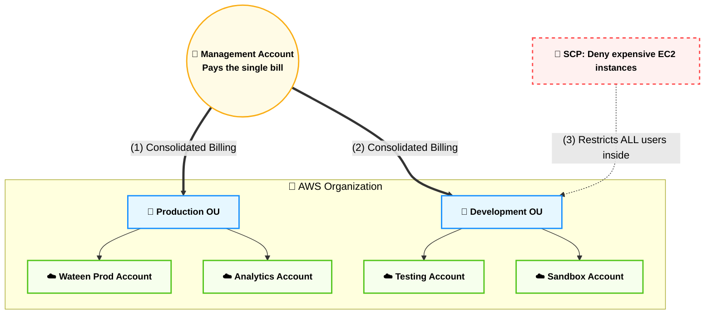
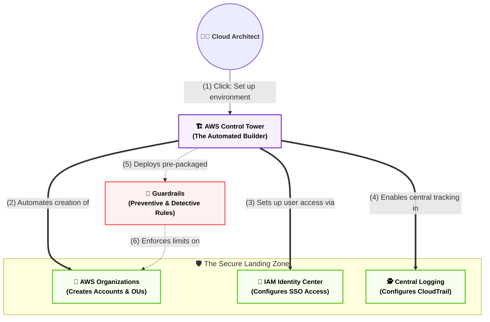

# Domain 4: Billing, Pricing & Support (هندسة التكاليف السحابية)

## المحطة الأولى: الإدارة المركزية وحوكمة الشركات - الجزء الأول (AWS Organizations)

**أصل الحكاية والمشكلة المعمارية (The Core Problem):**

تخيل إن منصة (Wateen.ai) كبرت جداً وبقى عندك فريق للتطوير (Dev)، وفريق للإنتاج (Prod)، وفريق للبيانات. لو كل فريق عمل حساب AWS منفصل وربطه بفيزا مختلفة، هيحصل الآتي:

1. الفواتير هتتشتت ومش هتعرف مين صرف إيه.
    
2. هتخسر "خصومات الكمية" (Volume Discounts) لأن كل حساب بيتحاسب لوحده من الصفر.
    
3. ممكن مطور مبتدئ في حساب الـ Dev يفتح سيرفر بـ 1000 دولار في الشهر بالغلط وتدبس فيه.
    

**الحل المعماري (AWS Organizations):**

أمازون عملت الخدمة دي عشان تكون "الشركة القابضة". بتعمل حساب رئيسي (Management Account)، وتدخل تحته كل الحسابات الفرعية التانية، وتبدأ تدير الفلوس والصلاحيات بقبضة من حديد.

### ⚙️ الفوائد المعمارية والمالية (لماذا نستخدم Organizations؟)

الامتحان بيركز على الـ 4 فوائد دول تحديداً:

#### 1. الفاتورة الموحدة (Consolidated Billing)

- حساب الـ Management هو اللي بيدفع الفاتورة المجمعة لكل الحسابات اللي تحته. ده بيسهل شغل قسم الحسابات في الشركة جداً.
    

#### 2. خصومات الكمية المجمعة (Aggregated Volume Discounts)

- **الميزة القاتلة:** تسعير أمازون لخدمات زي (S3) بيقل كل ما استهلاكك بيزيد (Tiered Pricing). الـ Organizations بتجمع استهلاك كل حساباتك مع بعض. لو حساب الـ Dev خزن 50 تيرا، وحساب الـ Prod خزن 50 تيرا، أمازون هتحاسبك على إنك خزنت 100 تيرا، فتدخل في شريحة سعرية أرخص بكتير!
    

#### 3. مشاركة الخصومات (Pooling of Reserved Instances)

- لو فريق الـ Dev اشترى (Reserved Instance) لمدة سنة، بس قفل السيرفر بتاعه ومبقاش بيستخدمه.. الخصم ده مابيضيعش! الـ Organizations بتخلي أي حساب تاني (زي الـ Prod) يورث الخصم ده أوتوماتيك ويستفيد بيه.
    

#### 4. سياسات التحكم في الخدمة (Service Control Policies - SCPs) 🚨

- دي **أقوى أداة حماية** في أمازون كلها. دي عبارة عن وثيقة (JSON) بتطبقها على حساب كامل عشان تمنع عنه خدمات معينة.
    
- **السيناريو:** بتعمل SCP تمنع أي حد في الـ Dev Account إنه يفتح سيرفرات غالية (زي سلسلة X1 أو P4).
    
- **القوة الغاشمة:** الـ SCP بتلغي أي صلاحيات تانية. حتى لو المطور معاه صلاحية (Administrator) جوه حساب الـ Dev، الـ SCP هتمنعه! (SCPs override everything).
    

### 📊 شفرات الامتحان: التفرقة الحاسمة لـ AWS Organizations

احفظ الكلمات الدلالية دي، بتيجي بالنص في أسئلة الـ Billing:

|**السيناريو المعماري في الامتحان (Keyword)**|**الإجابة الصحيحة (AWS Service / Feature)**|
|---|---|
|`Manage multiple AWS accounts centrally`|**AWS Organizations**|
|`Combine usage across all accounts to share volume pricing discounts`|**Consolidated Billing / AWS Organizations**|
|`Share Reserved Instances (RI) discounts across accounts`|**AWS Organizations**|
|`Restrict services or actions across multiple AWS accounts`|**Service Control Policies (SCPs)**|
|`Apply restrictions that override even the root user of a member account`|**Service Control Policies (SCPs)**|

---
## الجزء الثاني (AWS Control Tower)

**أصل الحكاية والمشكلة المعمارية (The Core Problem):**

في الجزء اللي فات عرفنا إن (AWS Organizations) بتحل مشكلة الفواتير المشتتة. بس إنت كـ Tech Lead اكتشفت مشكلة تانية: لو الشركة بتكبر بسرعة وكل يوم بتعملوا حساب جديد لفرع جديد أو تيم جديد، هل هتدخل كل مرة تعمل الحساب (Manual)، وتظبط الـ (SCPs) بإيدك، وتفعل المراقبة بـ (CloudTrail)، وتعمل إعدادات الـ (SSO) للموظفين؟

الخطوات اليدوية دي بتاخد أسابيع، والخطأ البشري فيها معناه إن في ثغرة أمنية ممكن تدمر الشركة.

**الحل المعماري (AWS Control Tower):**

دي مش خدمة جديدة بتبدأ من الصفر، دي عبارة عن "روبوت معماري" (Orchestrator). وظيفته إنه يبنيلك بيئة عمل كاملة وآمنة اسمها **(Landing Zone)** بضغطة زرار واحدة!

الـ Control Tower بيستخدم الـ AWS Organizations في الكواليس، بس هو اللي بيكتب الـ (SCPs) أوتوماتيك، وهو اللي بيفعل الـ (CloudTrail)، وهو اللي بيطبق معايير الأمان العالمية من غير ما إنت تتدخل.

### ⚙️ المفاهيم المعمارية لـ Control Tower

الامتحان بيركز جداً على المصطلحين دول:

#### 1. منطقة الهبوط الآمنة (The Landing Zone)

- ده مصطلح بيوصف بيئة السحابة لما تكون "متأسسة صح". يعني بيئة فيها كذا حساب (Multi-account)، متقسمة وحدات تنظيمية (OUs)، وفيها حساب مخصوص للـ Logs، وحساب مخصوص للـ Security، ومفتوح فيها الـ Single Sign-On (SSO). الـ Control Tower بيبني كل ده أوتوماتيك (Automated Setup).
    

#### 2. حواجز الحماية (Guardrails) 🚨

- تخيل إنك بتبني طريق سريع (Landing Zone) للعربيات (المطورين). إنت محتاج تحط حواجز حديد على يمين وشمال الطريق عشان محدش يقع في النهر. دي الـ Guardrails:
    
    - **حواجز وقائية (Preventive Guardrails):** دي بتمنع الغلطة قبل ما تحصل (بتستخدم الـ SCPs في الكواليس). مثلاً: "ممنوع أي مطور يمسح الـ CloudTrail".
        
    - **حواجز كشفية (Detective Guardrails):** دي بتكتشف الغلطة أول ما تحصل وتبعتلك إنذار (بتستخدم AWS Config في الكواليس). مثلاً: "لو في حد عمل Bucket S3 مفتوح للـ Public، ابعتلي إيميل فوراً".
        

### 📊 شفرات الامتحان: التفرقة القاضية (Organizations vs Control Tower)

أمازون بتعشق توقع المهندسين في الاختيار بين الخدمتين دول. احفظ الجدول ده صم:

|**السيناريو المعماري في الامتحان (Keyword)**|**الإجابة الصحيحة**|
|---|---|
|`Automate the setup of a secure, multi-account AWS environment`|**AWS Control Tower**|
|`Set up a Landing Zone based on best practices`|**AWS Control Tower**|
|`Enforce Preventive and Detective Guardrails`|**AWS Control Tower**|
|`Consolidate billing across multiple accounts`|**AWS Organizations**|
|`Use Service Control Policies (SCPs) to restrict access manually`|**AWS Organizations**|

كده المحطة الأولى (الإدارة والحوكمة المركزية) اكتملت تماماً وتأسست بخرسانة مسلحة. إنت دلوقتي بتقدر تدير 1000 حساب بضغطة زرار واحدة ومن غير ما تدفع سنت زيادة بالغلط.

الزق البلوك ده في הـ Vault، واديني التمام بكلمة **"ارمي المحطة التانية"** عشان ندخل في الفلوس الجد: **(بورصة السحابة ونماذج التسعير - EC2 Pricing & Data Transfer)**، ونفهم إمتى نشتري السيرفر بـ On-Demand وإمتى نجيبه بخصم 90%، وإزاي الباندويث بيتحسب! جاهز؟