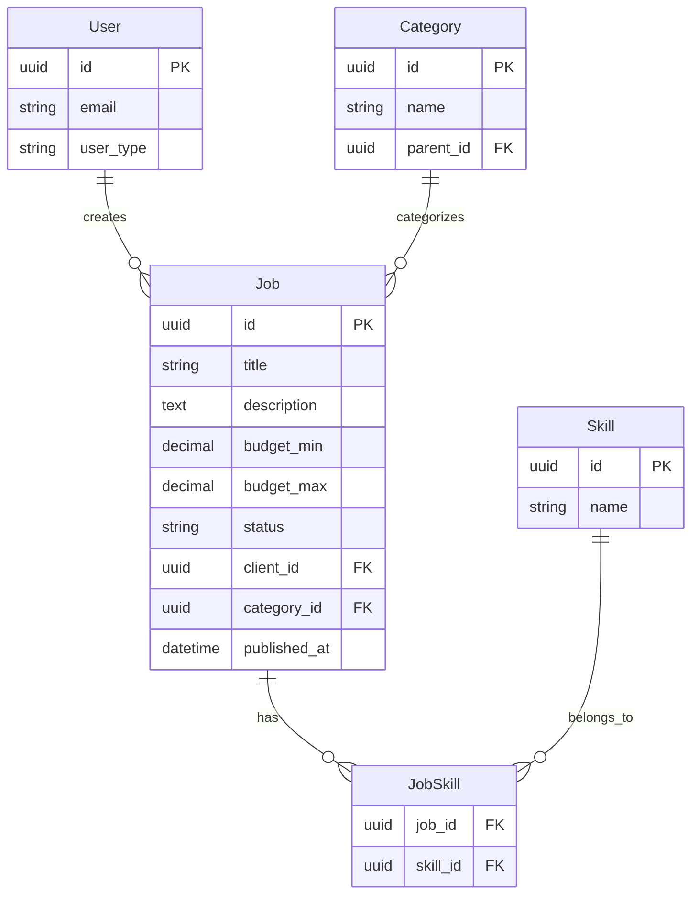
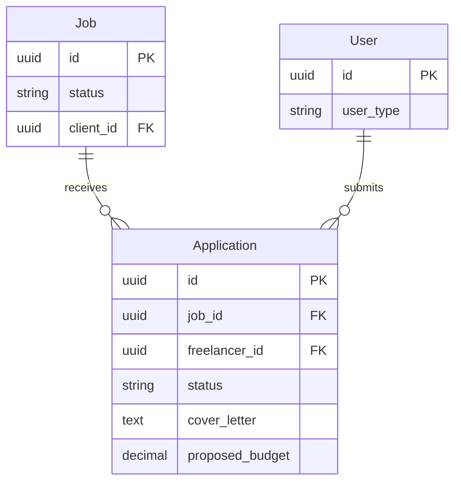
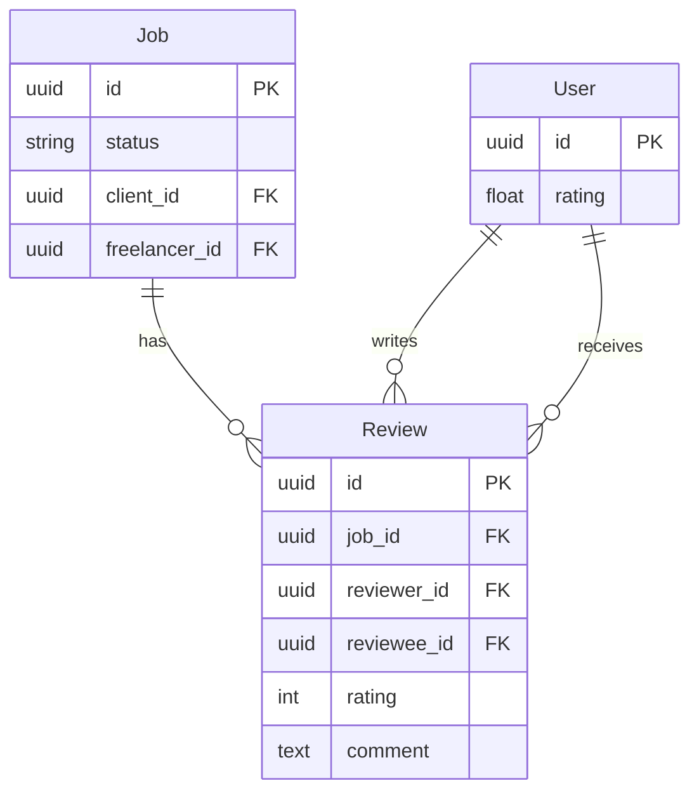
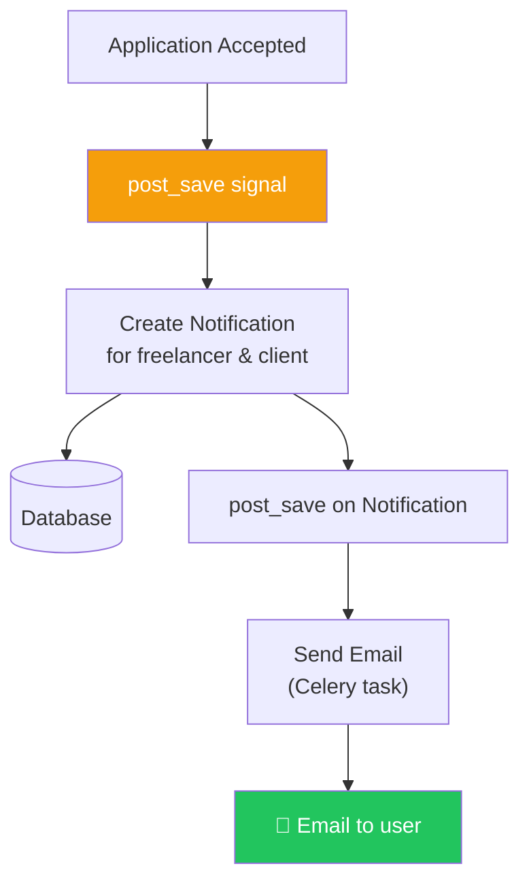

# الفصل السابع عشر — بناء HireLink API: من الصفر للـ Production

> **المتطلبات:** [[16-Project-Architecture-And-Setup]] — لازم تكون عامل setup المشروع بالكامل: Custom User Model، BaseModel، Split Settings، API Versioning. الفصل ده هيبني فوق الأساس ده عشان يطلع API كامل متكامل لكل features HireLink.

---

## البداية — تجميع كل القطع مع بعض

تخيّل معايا إنك بنيت الأساس — العمارة جاهزة، الأساسات متينة، والـ utilities مشتركة. دلوقتي وقت بناء الشقق نفسها. هنبني الـ apps الحقيقية بتاعة HireLink:

1. **Jobs App:** إنشاء وعرض وتعديل الوظايف. Clients ينشروا Jobs، Freelancers يتصفحوها.
2. **Applications App:** Freelancers يتقدموا على Jobs. Clients يقبلوا أو يرفضوا.
3. **Reviews App:** بعد ما الـ Job يتقفل، Client و Freelancer يقيموا بعض.
4. **Messaging App:** (اختياري) محادثات داخلية بين Client و Freelancer.
5. **Notifications App:** (اختياري) إشعارات بالـ email و in-app.

الفصل ده هيمشي معاك خطوة بخطوة في بناء الـ Models، Serializers، Views، Permissions، Signals، والـ URLs لكل App. مش هنعيد الأساسيات — هنركز على **إزاي نطبق** اللي اتعلمناه في الفصول السابقة في مشروع حقيقي.

---

## [[01-Jobs-App]] — الـ Jobs App: قلب المنصة

### 🧠 الشرح النظري

الـ Jobs App هو قلب HireLink. ده المكان اللي Clients بينشروا فيه الوظايف، و Freelancers بيتصفحوا ويتقدموا. المحتاجينه:

**الـ Models:**
- **`Skill`:** المهارات المطلوبة (Python, Django, React). ManyToMany مع Job.
- **`Category`:** تصنيف الوظايف (Web Development, Design, Marketing). ForeignKey من Job.
- **`Job`:** الوظيفة نفسها. فيها title, description, budget range, client, status.

**الـ Relationships:**
- Job → Client (ForeignKey لـ User). الـ client هو اللي عامل الـ job.
- Job → Category (ForeignKey). تصنيف الوظيفة.
- Job ↔ Skill (ManyToMany). المهارات المطلوبة.

**الـ Statuses:**
- `draft`: لسه متكملتش. مش ظاهرة للـ freelancers.
- `open`: ظاهرة ومفتوحة للتقديم.
- `in_progress`: فيه freelancer شغال عليها.
- `completed`: خلصت والفلوس اتدفعت.
- `closed`: اتقفلت من غير ما تكتمل.

**الـ Permissions:**
- أي حد (حتى anonymous) يقدر يشوف الـ jobs المفتوحة.
- Clients بس يقدر يعملوا Jobs جديدة.
- Client صاحب الـ job بس يقدر يعدلها أو يقفلها.

**الـ Features:**
- **Filtering:** فلترة بـ `status`, `budget_min`, `budget_max`, `category`, `skills`.
- **Search:** بحث في `title` و `description`.
- **Ordering:** ترتيب بـ `created_at`, `budget`, `views_count`.
- **Featured Jobs:** `is_featured=True` للوظايف المميزة.
- **View Count:** يتزود كل ما حد يفتح تفاصيل الوظيفة.

تخيّل الـ Jobs App زي **لوحة إعلانات الوظايف** في شركة توظيف:
- **Skill و Category:** أقسام اللوحة (تقنية، تسويق، تصميم).
- **Job:** الإعلان نفسه — فيه التفاصيل والمتطلبات.
- **Client:** الشركة اللي حاطة الإعلان.
- **Status:** حالة الإعلان (شغال، متقفل، ملغي).

### 📊 Visualization



### 💻 Micro-Example

```python
# hirelink/jobs/models.py
from django.db import models
from django.utils import timezone
from hirelink.core.models import BaseModel, SoftDeleteModel

class Skill(BaseModel):
    name = models.CharField(max_length=100, unique=True)
    
    class Meta:
        ordering = ['name']
    
    def __str__(self):
        return self.name

class Category(BaseModel):
    name = models.CharField(max_length=100)
    description = models.TextField(blank=True)
    parent = models.ForeignKey('self', on_delete=models.CASCADE, null=True, blank=True, related_name='children')
    icon = models.CharField(max_length=50, blank=True)
    
    class Meta:
        verbose_name_plural = 'Categories'
        ordering = ['name']
    
    def __str__(self):
        return self.name

class Job(SoftDeleteModel):
    STATUS_CHOICES = [
        ('draft', 'Draft'),
        ('open', 'Open'),
        ('in_progress', 'In Progress'),
        ('completed', 'Completed'),
        ('closed', 'Closed'),
    ]
    
    title = models.CharField(max_length=255)
    description = models.TextField()
    client = models.ForeignKey('accounts.User', on_delete=models.CASCADE, related_name='jobs')
    category = models.ForeignKey(Category, on_delete=models.SET_NULL, null=True, related_name='jobs')
    skills = models.ManyToManyField(Skill, related_name='jobs', through='JobSkill')
    
    budget_min = models.DecimalField(max_digits=10, decimal_places=2)
    budget_max = models.DecimalField(max_digits=10, decimal_places=2)
    status = models.CharField(max_length=20, choices=STATUS_CHOICES, default='draft')
    
    is_featured = models.BooleanField(default=False)
    views_count = models.PositiveIntegerField(default=0)
    
    deadline = models.DateField(null=True, blank=True)
    published_at = models.DateTimeField(null=True, blank=True)
    
    class Meta:
        ordering = ['-created_at']
        indexes = [
            models.Index(fields=['status', '-created_at']),
            models.Index(fields=['client', '-created_at']),
            models.Index(fields=['category', '-created_at']),
        ]
    
    def __str__(self):
        return self.title
    
    def publish(self):
        self.status = 'open'
        self.published_at = timezone.now()
        self.save()
    
    def increment_views(self):
        self.views_count += 1
        self.save(update_fields=['views_count'])

class JobSkill(BaseModel):
    job = models.ForeignKey(Job, on_delete=models.CASCADE)
    skill = models.ForeignKey(Skill, on_delete=models.CASCADE)
    
    class Meta:
        unique_together = ['job', 'skill']

# hirelink/jobs/serializers.py
from rest_framework import serializers
from .models import Job, Skill, Category

class SkillSerializer(serializers.ModelSerializer):
    class Meta:
        model = Skill
        fields = ['id', 'name']

class CategorySerializer(serializers.ModelSerializer):
    class Meta:
        model = Category
        fields = ['id', 'name', 'icon']

class JobListSerializer(serializers.ModelSerializer):
    client_name = serializers.CharField(source='client.get_full_name', read_only=True)
    category_name = serializers.CharField(source='category.name', read_only=True)
    skills = SkillSerializer(many=True, read_only=True)
    application_count = serializers.IntegerField(read_only=True)
    
    class Meta:
        model = Job
        fields = [
            'id', 'title', 'client_name', 'category_name', 'skills',
            'budget_min', 'budget_max', 'status', 'is_featured',
            'views_count', 'application_count', 'published_at', 'created_at'
        ]

class JobDetailSerializer(serializers.ModelSerializer):
    client = serializers.SerializerMethodField()
    category = CategorySerializer(read_only=True)
    skills = SkillSerializer(many=True, read_only=True)
    skill_ids = serializers.PrimaryKeyRelatedField(
        queryset=Skill.objects.all(), many=True, source='skills', write_only=True
    )
    application_count = serializers.IntegerField(read_only=True)
    
    class Meta:
        model = Job
        fields = [
            'id', 'title', 'description', 'client', 'category', 'skills', 'skill_ids',
            'budget_min', 'budget_max', 'status', 'is_featured',
            'views_count', 'application_count', 'deadline', 'published_at', 'created_at'
        ]
        read_only_fields = ['client', 'status', 'views_count', 'published_at']
    
    def get_client(self, obj):
        return {
            'id': obj.client.id,
            'name': obj.client.get_full_name(),
            'email': obj.client.email if self.context['request'].user == obj.client else None,
            'avatar': obj.client.avatar.url if obj.client.avatar else None,
        }

# hirelink/jobs/filters.py
import django_filters
from .models import Job

class JobFilter(django_filters.FilterSet):
    status = django_filters.CharFilter(lookup_expr='iexact')
    budget_min = django_filters.NumberFilter(field_name='budget_min', lookup_expr='gte')
    budget_max = django_filters.NumberFilter(field_name='budget_max', lookup_expr='lte')
    category = django_filters.UUIDFilter(field_name='category__id')
    skills = django_filters.ModelMultipleChoiceFilter(
        field_name='skills__id',
        to_field_name='id',
        queryset=Skill.objects.all(),
        conjoined=True
    )
    client = django_filters.UUIDFilter(field_name='client__id')
    has_deadline = django_filters.BooleanFilter(method='filter_has_deadline')
    
    class Meta:
        model = Job
        fields = ['status', 'budget_min', 'budget_max', 'category', 'skills', 'client', 'is_featured']
    
    def filter_has_deadline(self, queryset, name, value):
        if value:
            return queryset.filter(deadline__isnull=False)
        return queryset.filter(deadline__isnull=True)

# hirelink/jobs/permissions.py
from rest_framework import permissions

class IsClientOrReadOnly(permissions.BasePermission):
    def has_permission(self, request, view):
        if request.method in permissions.SAFE_METHODS:
            return True
        return request.user.is_authenticated and request.user.user_type == 'client'
    
    def has_object_permission(self, request, view, obj):
        if request.method in permissions.SAFE_METHODS:
            return True
        return obj.client == request.user

class IsClient(permissions.BasePermission):
    def has_permission(self, request, view):
        return request.user.is_authenticated and request.user.user_type == 'client'

# hirelink/jobs/views.py
from rest_framework.viewsets import ModelViewSet
from rest_framework.decorators import action
from rest_framework.response import Response
from rest_framework.permissions import IsAuthenticatedOrReadOnly, AllowAny
from django_filters.rest_framework import DjangoFilterBackend
from rest_framework.filters import SearchFilter, OrderingFilter
from django.db.models import Count

from .models import Job, Skill, Category
from .serializers import JobListSerializer, JobDetailSerializer, SkillSerializer, CategorySerializer
from .filters import JobFilter
from .permissions import IsClientOrReadOnly, IsClient

class JobViewSet(ModelViewSet):
    permission_classes = [IsAuthenticatedOrReadOnly, IsClientOrReadOnly]
    filter_backends = [DjangoFilterBackend, SearchFilter, OrderingFilter]
    filterset_class = JobFilter
    search_fields = ['title', 'description']
    ordering_fields = ['created_at', 'budget_min', 'budget_max', 'views_count', 'published_at']
    ordering = ['-created_at']
    
    def get_serializer_class(self):
        if self.action == 'list':
            return JobListSerializer
        return JobDetailSerializer
    
    def get_queryset(self):
        queryset = Job.objects.select_related('client', 'category').prefetch_related('skills')
        
        if self.action == 'list':
            queryset = queryset.annotate(application_count=Count('applications'))
        
        if not self.request.user.is_authenticated or self.request.user.user_type == 'freelancer':
            queryset = queryset.filter(status='open')
        
        return queryset
    
    def perform_create(self, serializer):
        serializer.save(client=self.request.user)
    
    def retrieve(self, request, *args, **kwargs):
        instance = self.get_object()
        instance.increment_views()
        serializer = self.get_serializer(instance)
        return Response(serializer.data)
    
    @action(detail=True, methods=['post'], permission_classes=[IsAuthenticatedOrReadOnly, IsClient])
    def publish(self, request, pk=None):
        job = self.get_object()
        if job.client != request.user:
            return Response({'error': 'Not allowed'}, status=403)
        job.publish()
        return Response({'status': 'published'})
    
    @action(detail=True, methods=['post'], permission_classes=[IsAuthenticatedOrReadOnly, IsClient])
    def close(self, request, pk=None):
        job = self.get_object()
        if job.client != request.user:
            return Response({'error': 'Not allowed'}, status=403)
        job.status = 'closed'
        job.save()
        return Response({'status': 'closed'})
    
    @action(detail=False, methods=['get'], permission_classes=[AllowAny])
    def featured(self, request):
        featured_jobs = self.get_queryset().filter(is_featured=True, status='open')[:10]
        serializer = JobListSerializer(featured_jobs, many=True, context={'request': request})
        return Response(serializer.data)
    
    @action(detail=False, methods=['get'], permission_classes=[IsAuthenticatedOrReadOnly, IsClient])
    def my_jobs(self, request):
        jobs = self.get_queryset().filter(client=request.user)
        serializer = self.get_serializer(jobs, many=True)
        return Response(serializer.data)

class SkillViewSet(ModelViewSet):
    queryset = Skill.objects.all()
    serializer_class = SkillSerializer
    permission_classes = [IsAuthenticatedOrReadOnly]
    pagination_class = None

class CategoryViewSet(ModelViewSet):
    queryset = Category.objects.all()
    serializer_class = CategorySerializer
    permission_classes = [IsAuthenticatedOrReadOnly]
    pagination_class = None

# hirelink/jobs/urls.py
from rest_framework.routers import DefaultRouter
from .views import JobViewSet, SkillViewSet, CategoryViewSet

router = DefaultRouter()
router.register('jobs', JobViewSet, basename='job')
router.register('skills', SkillViewSet, basename='skill')
router.register('categories', CategoryViewSet, basename='category')

urlpatterns = router.urls
```

---

## [[02-Applications-App]] — الـ Applications App: إدارة التقديمات

### 🧠 الشرح النظري

الـ Applications App هو اللي بيربط Freelancers بـ Jobs. أي Freelancer يقدر يتقدم على Job مفتوحة. Client يقبل Application واحدة (ويرفض الباقي تلقائياً).

**الـ Models:**
- **`Application`:** بتمثل تقديم Freelancer على Job. فيها `job`, `freelancer`, `cover_letter`, `proposed_budget`, `status`.

**الـ Statuses:**
- `pending`: لسه متشافش.
- `reviewed`: الـ client شافها.
- `accepted`: الـ client قبل الـ freelancer.
- `rejected`: الـ client رفض.
- `withdrawn`: الـ freelancer سحب التقديم.

**الـ Business Logic:**
- Freelancer ميقدرش يتقدم على نفس الـ job مرتين.
- Client ميقدرش يتقدم على Job.
- لما Client يقبل Application:
  1. الـ Application status يبقى `accepted`.
  2. الـ Job status يبقى `in_progress`.
  3. كل الـ applications التانية على نفس الـ job تبقى `rejected` تلقائياً.
  4. يتبعت Notification للـ freelancer (عن طريق Signal).

**الـ Permissions:**
- Freelancers بس يقبلوا يتقدموا.
- Clients يشوفوا applications على Jobs بتاعتهم بس.
- Freelancer يقدر يشوف applications بتاعته هو بس.

**الـ Signals:**
- `post_save` على Application: لو `status='accepted'`، نغير Job status ونبعت notifications.

تخيّل الـ Applications App زي **صندوق البريد** بتاع الـ Client:
- **Application:** خطاب التقديم — فيه الـ cover letter والميزانية المقترحة.
- **Status:** حالة الخطاب (لسه متقراش، اتقرا، اتقبل، اترفض).
- **Signal:** لما Client يختار خطاب ويقبله، النظام بيقفل الوظيفة تلقائياً ويرفض كل الخطابات التانية.

### 📊 Visualization



### 💻 Micro-Example

```python
# hirelink/applications/models.py
from django.db import models
from django.core.exceptions import ValidationError
from hirelink.core.models import BaseModel

class Application(BaseModel):
    STATUS_CHOICES = [
        ('pending', 'Pending'),
        ('reviewed', 'Reviewed'),
        ('accepted', 'Accepted'),
        ('rejected', 'Rejected'),
        ('withdrawn', 'Withdrawn'),
    ]
    
    job = models.ForeignKey('jobs.Job', on_delete=models.CASCADE, related_name='applications')
    freelancer = models.ForeignKey('accounts.User', on_delete=models.CASCADE, related_name='applications')
    cover_letter = models.TextField()
    proposed_budget = models.DecimalField(max_digits=10, decimal_places=2)
    status = models.CharField(max_length=20, choices=STATUS_CHOICES, default='pending')
    
    class Meta:
        ordering = ['-created_at']
        unique_together = ['job', 'freelancer']
        indexes = [
            models.Index(fields=['job', '-created_at']),
            models.Index(fields=['freelancer', '-created_at']),
            models.Index(fields=['status']),
        ]
    
    def __str__(self):
        return f"{self.freelancer.email} - {self.job.title}"
    
    def clean(self):
        if self.freelancer.user_type != 'freelancer':
            raise ValidationError('Only freelancers can apply to jobs')
        if self.job.status != 'open':
            raise ValidationError('Cannot apply to a job that is not open')
        if self.job.client == self.freelancer:
            raise ValidationError('Clients cannot apply to their own jobs')
    
    def save(self, *args, **kwargs):
        self.clean()
        super().save(*args, **kwargs)

# hirelink/applications/signals.py
from django.db.models.signals import post_save
from django.dispatch import receiver
from django.db import transaction
from .models import Application

@receiver(post_save, sender=Application)
def handle_application_accepted(sender, instance, created, **kwargs):
    if instance.status == 'accepted':
        with transaction.atomic():
            job = instance.job
            job.status = 'in_progress'
            job.save()
            
            job.applications.exclude(id=instance.id).update(status='rejected')
        
        # send_notification_email(instance.freelancer, job)
        # send_notification_email(job.client, job)

# hirelink/applications/serializers.py
from rest_framework import serializers
from .models import Application

class ApplicationSerializer(serializers.ModelSerializer):
    freelancer_name = serializers.CharField(source='freelancer.get_full_name', read_only=True)
    job_title = serializers.CharField(source='job.title', read_only=True)
    
    class Meta:
        model = Application
        fields = [
            'id', 'job', 'job_title', 'freelancer', 'freelancer_name',
            'cover_letter', 'proposed_budget', 'status', 'created_at'
        ]
        read_only_fields = ['freelancer', 'status']

class ApplicationUpdateSerializer(serializers.ModelSerializer):
    class Meta:
        model = Application
        fields = ['status']
    
    def validate_status(self, value):
        if self.instance.status != 'pending' and value == 'accepted':
            raise serializers.ValidationError('Cannot accept an application that is not pending')
        return value

# hirelink/applications/permissions.py
from rest_framework import permissions

class IsFreelancer(permissions.BasePermission):
    def has_permission(self, request, view):
        return request.user.is_authenticated and request.user.user_type == 'freelancer'

class IsJobClientOrApplicationFreelancer(permissions.BasePermission):
    def has_object_permission(self, request, view, obj):
        return obj.job.client == request.user or obj.freelancer == request.user

# hirelink/applications/views.py
from rest_framework.viewsets import ModelViewSet
from rest_framework.decorators import action
from rest_framework.response import Response
from rest_framework.permissions import IsAuthenticated
from django_filters.rest_framework import DjangoFilterBackend
from rest_framework.filters import OrderingFilter

from .models import Application
from .serializers import ApplicationSerializer, ApplicationUpdateSerializer
from .permissions import IsFreelancer, IsJobClientOrApplicationFreelancer

class ApplicationViewSet(ModelViewSet):
    permission_classes = [IsAuthenticated, IsJobClientOrApplicationFreelancer]
    filter_backends = [DjangoFilterBackend, OrderingFilter]
    filterset_fields = ['job', 'status']
    ordering_fields = ['created_at', 'proposed_budget']
    ordering = ['-created_at']
    
    def get_serializer_class(self):
        if self.action in ['update', 'partial_update']:
            return ApplicationUpdateSerializer
        return ApplicationSerializer
    
    def get_queryset(self):
        user = self.request.user
        if user.user_type == 'client':
            return Application.objects.filter(job__client=user).select_related('job', 'freelancer')
        return Application.objects.filter(freelancer=user).select_related('job', 'freelancer')
    
    def perform_create(self, serializer):
        serializer.save(freelancer=self.request.user)
    
    @action(detail=True, methods=['post'], permission_classes=[IsAuthenticated])
    def withdraw(self, request, pk=None):
        application = self.get_object()
        if application.freelancer != request.user:
            return Response({'error': 'Not allowed'}, status=403)
        if application.status not in ['pending', 'reviewed']:
            return Response({'error': 'Cannot withdraw this application'}, status=400)
        application.status = 'withdrawn'
        application.save()
        return Response({'status': 'withdrawn'})
    
    @action(detail=False, methods=['get'], permission_classes=[IsAuthenticated, IsFreelancer])
    def my_applications(self, request):
        applications = self.get_queryset().filter(freelancer=request.user)
        serializer = self.get_serializer(applications, many=True)
        return Response(serializer.data)

# hirelink/applications/urls.py
from rest_framework.routers import DefaultRouter
from .views import ApplicationViewSet

router = DefaultRouter()
router.register('applications', ApplicationViewSet, basename='application')

urlpatterns = router.urls
```

---

## [[03-Reviews-App]] — الـ Reviews App: التقييمات والسمعة

### 🧠 الشرح النظري

بعد ما Job تتقفل (تتوافق أو تكتمل)، Client و Freelancer يقدروا يقيموا بعض. التقييمات دي بتبني السمعة في المنصة.

**الـ Models:**
- **`Review`:** تقييم من مستخدم لآخر. فيه `job`, `reviewer`, `reviewee`, `rating` (1-5), `comment`.

**الـ Business Logic:**
- Client يقيم Freelancer (على شغله).
- Freelancer يقيم Client (على تعاونه ودفعه).
- كل واحد يقدر يعمل Review واحدة بس لكل Job.
- مينفعش تعمل Review غير لما الـ Job تكون `completed`.
- الـ `rating` من 1 لـ 5 نجوم.

**الـ Permissions:**
- بس اللي شاركوا في الـ Job (Client و Freelancer المقبول) يقدروا يعملوا Review.
- أي حد يقدر يشوف الـ reviews (عشان الشفافية).

**الـ Signals (أو Override Save):**
- لما Review يتعمل، نحسب متوسط التقييمات للمستخدم ونحدث `rating` field في User model.

تخيّل الـ Reviews App زي **نظام تقييم السواقين في Uber**:
- بعد الرحلة، الراكب (Client) يقيم السواق (Freelancer).
- السواق كمان يقيم الراكب.
- التقييمات بتظهر في profile كل واحد وبتأثر على فرصه في المستقبل.

### 📊 Visualization



### 💻 Micro-Example

```python
# hirelink/reviews/models.py
from django.db import models
from django.core.validators import MinValueValidator, MaxValueValidator
from django.core.exceptions import ValidationError
from hirelink.core.models import BaseModel

class Review(BaseModel):
    job = models.ForeignKey('jobs.Job', on_delete=models.CASCADE, related_name='reviews')
    reviewer = models.ForeignKey('accounts.User', on_delete=models.CASCADE, related_name='reviews_given')
    reviewee = models.ForeignKey('accounts.User', on_delete=models.CASCADE, related_name='reviews_received')
    rating = models.IntegerField(validators=[MinValueValidator(1), MaxValueValidator(5)])
    comment = models.TextField(blank=True)
    
    class Meta:
        ordering = ['-created_at']
        unique_together = ['job', 'reviewer', 'reviewee']
        indexes = [
            models.Index(fields=['reviewee', '-created_at']),
        ]
    
    def __str__(self):
        return f"{self.reviewer.email} rated {self.reviewee.email} {self.rating}★"
    
    def clean(self):
        if self.job.status != 'completed':
            raise ValidationError('Reviews can only be left for completed jobs')
        if self.reviewer not in [self.job.client, self.job.freelancer]:
            raise ValidationError('Only participants can leave a review')
        if self.reviewee not in [self.job.client, self.job.freelancer]:
            raise ValidationError('Can only review the other participant')
        if self.reviewer == self.reviewee:
            raise ValidationError('Cannot review yourself')

# hirelink/reviews/signals.py
from django.db.models.signals import post_save, post_delete
from django.dispatch import receiver
from django.db.models import Avg
from .models import Review

@receiver([post_save, post_delete], sender=Review)
def update_user_rating(sender, instance, **kwargs):
    reviewee = instance.reviewee
    avg_rating = Review.objects.filter(reviewee=reviewee).aggregate(Avg('rating'))['rating__avg']
    reviewee.rating = avg_rating or 0.0
    reviewee.save(update_fields=['rating'])

# hirelink/reviews/serializers.py
from rest_framework import serializers
from .models import Review

class ReviewSerializer(serializers.ModelSerializer):
    reviewer_name = serializers.CharField(source='reviewer.get_full_name', read_only=True)
    
    class Meta:
        model = Review
        fields = ['id', 'job', 'reviewer', 'reviewer_name', 'reviewee', 'rating', 'comment', 'created_at']
        read_only_fields = ['reviewer']

# hirelink/reviews/permissions.py
from rest_framework import permissions

class IsJobParticipant(permissions.BasePermission):
    def has_permission(self, request, view):
        return request.user.is_authenticated
    
    def has_object_permission(self, request, view, obj):
        if request.method in permissions.SAFE_METHODS:
            return True
        return obj.reviewer == request.user

# hirelink/reviews/views.py
from rest_framework.viewsets import ModelViewSet
from rest_framework.permissions import IsAuthenticatedOrReadOnly
from .models import Review
from .serializers import ReviewSerializer
from .permissions import IsJobParticipant

class ReviewViewSet(ModelViewSet):
    queryset = Review.objects.select_related('job', 'reviewer', 'reviewee')
    serializer_class = ReviewSerializer
    permission_classes = [IsAuthenticatedOrReadOnly, IsJobParticipant]
    filterset_fields = ['job', 'reviewee', 'rating']
    
    def perform_create(self, serializer):
        serializer.save(reviewer=self.request.user)

# hirelink/reviews/urls.py
from rest_framework.routers import DefaultRouter
from .views import ReviewViewSet

router = DefaultRouter()
router.register('reviews', ReviewViewSet, basename='review')

urlpatterns = router.urls
```

---

## [[04-Notifications-And-Signals]] — الـ Notifications: إشعارات تلقائية

### 🧠 الشرح النظري

الـ Notifications App بيدير إرسال الإشعارات للمستخدمين (Email, In-App, Push). بدل ما تحط منطق الإشعارات في كل View، بنستخدم **Signals** عشان نفصل الـ concerns.

**الـ Models:**
- **`Notification`:** إشعار لمستخدم معين. فيه `user`, `type`, `title`, `message`, `is_read`, `data` (JSON field للـ extra data).

**أنواع الإشعارات:**
- `new_application`: Freelancer قدم على Job بتاعتك.
- `application_accepted`: Client قبل طلبك.
- `application_rejected`: Client رفض طلبك.
- `job_completed`: الوظيفة اكتملت.
- `new_review`: حد عملك تقييم.
- `message_received`: وصلتك رسالة جديدة.

**إزاي بنستخدم Signals؟**
- `post_save` على `Application` → لو `status='accepted'`، نبعت Notification للـ freelancer و للـ client.
- `post_save` على `Review` → نبعت Notification للـ reviewee.
- `post_save` على `Message` → نبعت Notification للمستقبل.

**إرسال Email:**
- نستخدم Django's `send_mail` أو Celery لو عايزين async.
- نعمل `@receiver(post_save, sender=Notification)` عشان نبعت email لكل notification جديدة.

تخيّل الـ Notifications زي **مركز اتصالات**:
- **Signal:** بيبعت رسالة للمركز: "فلان عمل حاجة".
- **Notification Model:** تسجيل المكالمة — مين المتلقي، إيه الرسالة، وامتى.
- **Email/Celery:** موظف المركز بيتصل بالعميل (يبعت email) أو يسيبله رسالة في الـ inbox (in-app notification).

### 📊 Visualization



### 💻 Micro-Example

```python
# hirelink/notifications/models.py
from django.db import models
from hirelink.core.models import BaseModel

class Notification(BaseModel):
    TYPE_CHOICES = [
        ('new_application', 'New Application'),
        ('application_accepted', 'Application Accepted'),
        ('application_rejected', 'Application Rejected'),
        ('job_completed', 'Job Completed'),
        ('new_review', 'New Review'),
        ('message_received', 'Message Received'),
        ('system', 'System'),
    ]
    
    user = models.ForeignKey('accounts.User', on_delete=models.CASCADE, related_name='notifications')
    type = models.CharField(max_length=50, choices=TYPE_CHOICES)
    title = models.CharField(max_length=255)
    message = models.TextField()
    data = models.JSONField(default=dict, blank=True)
    is_read = models.BooleanField(default=False)
    
    class Meta:
        ordering = ['-created_at']
        indexes = [
            models.Index(fields=['user', '-created_at']),
            models.Index(fields=['user', 'is_read']),
        ]
    
    def __str__(self):
        return f"{self.user.email} - {self.title}"

# hirelink/notifications/signals.py
from django.db.models.signals import post_save
from django.dispatch import receiver
from django.core.mail import send_mail
from django.conf import settings
from .models import Notification

@receiver(post_save, sender=Notification)
def send_notification_email(sender, instance, created, **kwargs):
    if created and instance.user.email_notifications:
        subject = f"[HireLink] {instance.title}"
        message = instance.message
        send_mail(
            subject,
            message,
            settings.DEFAULT_FROM_EMAIL,
            [instance.user.email],
            fail_silently=True,
        )

# hirelink/applications/signals.py — Create notifications on application events
from django.db.models.signals import post_save
from django.dispatch import receiver
from hirelink.notifications.models import Notification

@receiver(post_save, sender=Application)
def create_application_notifications(sender, instance, created, **kwargs):
    if created:
        Notification.objects.create(
            user=instance.job.client,
            type='new_application',
            title='New Application Received',
            message=f"{instance.freelancer.get_full_name()} applied to {instance.job.title}",
            data={'job_id': str(instance.job.id), 'application_id': str(instance.id)}
        )
    
    elif instance.status == 'accepted' and instance.tracker.previous('status') != 'accepted':
        Notification.objects.create(
            user=instance.freelancer,
            type='application_accepted',
            title='Application Accepted!',
            message=f"Congratulations! Your application for {instance.job.title} was accepted.",
            data={'job_id': str(instance.job.id)}
        )
        Notification.objects.create(
            user=instance.job.client,
            type='application_accepted',
            title='Freelancer Hired',
            message=f"You hired {instance.freelancer.get_full_name()} for {instance.job.title}.",
            data={'job_id': str(instance.job.id), 'freelancer_id': str(instance.freelancer.id)}
        )

# hirelink/notifications/views.py
from rest_framework.viewsets import ModelViewSet
from rest_framework.decorators import action
from rest_framework.response import Response
from rest_framework.permissions import IsAuthenticated
from .models import Notification
from .serializers import NotificationSerializer

class NotificationViewSet(ModelViewSet):
    serializer_class = NotificationSerializer
    permission_classes = [IsAuthenticated]
    http_method_names = ['get', 'patch', 'head', 'options']
    
    def get_queryset(self):
        return Notification.objects.filter(user=self.request.user)
    
    @action(detail=True, methods=['patch'])
    def mark_read(self, request, pk=None):
        notification = self.get_object()
        notification.is_read = True
        notification.save()
        return Response({'status': 'marked as read'})
    
    @action(detail=False, methods=['patch'])
    def mark_all_read(self, request):
        self.get_queryset().filter(is_read=False).update(is_read=True)
        return Response({'status': 'all marked as read'})
```

---

## 🎯 أسئلة الإنترفيو

**س: إزاي تصمم Models لـ Job بعلاقات ManyToMany مع Skills؟ وإيه فايدة `through` model؟**

> تصميم الـ Models لـ Job مع Skills بيكون باستخدام `ManyToManyField` مع `through` model للتحكم في العلاقة.<br/><br/>
> 
> **الطريقة البسيطة (من غير `through`):**
> ```python
> class Job(models.Model):
>     skills = models.ManyToManyField(Skill)
> ```
> ده بيخلق جدول وسيط تلقائي (`job_skill`) لكن من غير fields إضافية.<br/><br/>
> 
> **الطريقة المتقدمة (مع `through`):**
> ```python
> class JobSkill(models.Model):
>     job = models.ForeignKey(Job, on_delete=models.CASCADE)
>     skill = models.ForeignKey(Skill, on_delete=models.CASCADE)
>     required_level = models.CharField(max_length=20)  # extra field
>     created_at = models.DateTimeField(auto_now_add=True)
>     
>     class Meta:
>         unique_together = ['job', 'skill']
> 
> class Job(models.Model):
>     skills = models.ManyToManyField(Skill, through='JobSkill')
> ```
> 
> **فوائد `through` model:**
> 1. **إضافة حقول إضافية:** زي `required_level` (مبتدئ، متوسط، خبير) أو `years_required`.
> 2. **تتبع الوقت:** `created_at` عشان تعرف إمتى المهارة اتضافت.
> 3. **تحكم في الـ Queries:** تقدر تعمل queries على الـ intermediate model (`JobSkill.objects.filter(required_level='expert')`).
> 4. **إضافة Constraints:** `unique_together` تمنع تكرار نفس المهارة لنفس الوظيفة.<br/><br/>
> 
> **متى تستخدم `through`؟** لما تحتاج تخزن معلومات عن العلاقة نفسها — مش بس إنها موجودة. في HireLink، استخدمنا `through=JobSkill` عشان نضيف `created_at` ونضمن uniqueness.

---

**س: إزاي بتضمن إن Application واحدة بس تتقبل لكل Job؟ وإزاي بتتعامل مع الـ race conditions؟**

> ضمان إن Application واحدة بس تتقبل لكل Job بيحتاج تعامل مع **race conditions** — لما اتنين Clients يحاولوا يقبلوا Applications مختلفة في نفس الوقت.<br/><br/>
> 
> **الحل: Database Transactions + `select_for_update()`**
> ```python
> from django.db import transaction
> 
> @transaction.atomic
> def accept_application(application_id):
>     # Lock the job row to prevent concurrent updates
>     job = Job.objects.select_for_update().get(applications__id=application_id)
>     
>     if job.status != 'open':
>         raise ValidationError('Job is not open')
>     
>     if job.applications.filter(status='accepted').exists():
>         raise ValidationError('Another application already accepted')
>     
>     application = job.applications.get(id=application_id)
>     application.status = 'accepted'
>     application.save()
>     
>     job.status = 'in_progress'
>     job.save()
>     
>     job.applications.exclude(id=application_id).update(status='rejected')
> ```
> 
> **ليه `select_for_update()` مهم؟**
> - بيعمل **Row-Level Lock** على الـ Job row في الـ database.
> - أي transaction تانية بتحاول تقرا أو تعدل نفس الـ Job row هتستنى لما الـ transaction الأولى تخلص.
> - بيمنع race conditions — مفيش اتنين يقبلوا Applications مختلفة لنفس الـ Job في نفس اللحظة.<br/><br/>
> 
> **بديل (Optimistic Locking):**
> - استخدم `version` field في الـ Job model.
> - كل ما تعدل الـ Job، زود الـ version.
> - في الـ update، اعمل `UPDATE jobs SET ... WHERE id = X AND version = Y`.
> - لو الـ rows affected = 0، معناه إن حد تاني عدل الـ Job قبلك — ارجع خطأ.<br/><br/>
> 
> **الـ Signals والـ Transactions:**
> - الـ Signals (زي `post_save`) بتتنفذ **بعد** الـ transaction تخلص (لو استخدمت `@transaction.atomic`).
> - ده بيضمن إن الـ notifications مش هتبعت غير لما الـ changes تكون اتحفظت فعلاً في الـ database.

---

**س: إزاي بتحسب متوسط التقييمات لمستخدم في Django؟ وايه أفضل طريقة عشان الـ performance؟**

> حساب متوسط التقييمات لمستخدم ممكن يتعمل بطريقتين: **On-the-fly** أو **Cached**.<br/><br/>
> 
> **الطريقة 1: On-the-fly (Query كل مرة)**
> ```python
> average_rating = Review.objects.filter(reviewee=user).aggregate(Avg('rating'))['rating__avg'] or 0.0
> ```
> - **الميزة:** بسيطة ودقيقة دايمًا.
> - **العيب:** Database query كل ما تحتاج الـ rating. لو الـ user profile بيتشاف كتير، ده ممكن يبطئ الأداء.<br/><br/>
> 
> **الطريقة 2: Cached (Denormalization)**
> - أضيف `rating` field في الـ User model (`rating = models.FloatField(default=0.0)`).
> - استخدم Signal عشان تحدث الـ rating لما Review يتضاف أو يتعدل أو يتحذف:
> ```python
> @receiver([post_save, post_delete], sender=Review)
> def update_user_rating(sender, instance, **kwargs):
>     reviewee = instance.reviewee
>     avg = Review.objects.filter(reviewee=reviewee).aggregate(Avg('rating'))['rating__avg']
>     reviewee.rating = avg or 0.0
>     reviewee.save(update_fields=['rating'])
> ```
> - **الميزة:** مفيش query لحساب الـ rating — القيمة جاهزة في الـ User model. أسرع بكتير.
> - **العيب:** Denormalization — البيانات متكررة. محتاج تتأكد إن الـ Signal دايمًا بيشتغل (حتى في bulk operations).<br/><br/>
> 
> **أفضل طريقة للـ Performance:**
> - استخدم **Cached Rating** مع `update_fields=['rating']` عشان متعملش save للـ User كله.
> - لو الـ reviews كتير جداً (ملايين)، استخدم **Celery Task** عشان تحدث الـ rating بشكل asynchronous.
> - أضيف `db_index=True` على `reviewee` field في Review model عشان تسرع الـ `AVG` query.
> - في الـ User profile view، استخدم `select_related` أو `prefetch_related` لو محتاج بيانات تانية.<br/><br/>
> 
> **الخلاصة:** Cached Rating مع Signals هو الأحسن للـ performance في الـ production. الـ denormalization مقبول هنا لأن الـ rating بيتغير بس لما يتضاف Review جديد (عملية نادرة نسبياً مقارنة بـ profile views).

---

**س: إزاي بتستخدم Signals عشان تفصل الـ Notifications عن الـ Business Logic؟ وإيه مميزات وعيوب الأسلوب ده؟**

> استخدام **Signals** للـ Notifications بيسمح بفصل الـ concerns — الـ Application model مش محتاج يعرف حاجة عن الـ Notification system.<br/><br/>
> 
> **إزاي بنعملها:**
> 1. في `applications/signals.py`:
> ```python
> @receiver(post_save, sender=Application)
> def create_notification_on_accept(sender, instance, **kwargs):
>     if instance.status == 'accepted':
>         Notification.objects.create(
>             user=instance.freelancer,
>             type='application_accepted',
>             title='Application Accepted!',
>             message=f'Your application for {instance.job.title} was accepted.'
>         )
> ```
> 2. في `applications/apps.py`:
> ```python
> class ApplicationsConfig(AppConfig):
>     def ready(self):
>         import hirelink.applications.signals
> ```
> 3. الـ Application model و الـ View مش بيلمسوا الـ Notification model — كل حاجة بتحصل تلقائياً.<br/><br/>
> 
> **المميزات:**
> 4. **Decoupling:** الـ Application logic منفصل تماماً عن الـ Notification logic. تقدر تغير نظام الإشعارات (تضيف Push، تغير الـ email template) من غير ما تلمس الـ Application code.
> 5. **DRY:** بدل ما تكرر كود الإشعارات في كل View وكل Model `save()`، بتكون في Signal واحد.
> 6. **Extensibility:** تقدر تضيف Receivers جديدة بسهولة. عايز تسجل Analytics؟ ضيف Receiver تاني لنفس الـ signal.
> 7. **Testing:** تقدر تختبر الـ Application logic من غير ما تقلق من الـ Notifications (الـ Signals ممكن تتعطل في الـ tests).<br/><br/>
> 
> **العيوب:**
> 8. **Implicit Flow:** الـ developer الجديد ممكن ميعرفش إن `application.save()` بيبعت إشعارات. الـ control flow بيبقى مخفي.
> 9. **Performance:** الـ Signals **Synchronous**. لو Receiver بيبعت Email (عملية بطيئة)، الـ `save()` هتاخد وقت أطول. الحل: استخدم Celery.
> 10. **Debugging:** تتبع الأخطاء في الـ Signals أصعب. الـ stack trace مش دايمًا واضح.
> 11. **Bulk Operations:** الـ Signals مش بتشتغل في `QuerySet.update()` أو `bulk_create()`.<br/><br/>
> 
> **Best Practices:**
> - خلي الـ Receivers بسيطة وسريعة. العمليات التقيلة (زي Email) حطها في Celery Task.
> - وثق الـ Signals في الـ Model docstring أو في تعليق واضح.
> - استخدم `dispatch_uid` عشان تمنع تكرار الـ receiver لو الـ app اتحملت مرتين.
> - اختبر الـ Signals في الـ unit tests (`@override_settings` أو `mock`).

---

**س: إزاي بتعمل Filtering معقد في DRF؟ مثال: فلترة Jobs بـ skills متعددة و budget range؟**

> الـ Filtering المعقد في DRF بيتعمل باستخدام `django-filter` مع `FilterSet` مخصص.<br/><br/>
> 
> **مثال: فلترة Jobs بـ skills متعددة (AND) و budget range:**
> ```python
> import django_filters
> from .models import Job, Skill
> 
> class JobFilter(django_filters.FilterSet):
>     budget_min = django_filters.NumberFilter(field_name='budget_min', lookup_expr='gte')
>     budget_max = django_filters.NumberFilter(field_name='budget_max', lookup_expr='lte')
>     
>     skills = django_filters.ModelMultipleChoiceFilter(
>         field_name='skills__id',
>         to_field_name='id',
>         queryset=Skill.objects.all(),
>         conjoined=True  # AND (all skills must match)
>     )
>     
>     category = django_filters.UUIDFilter(field_name='category__id')
>     
>     created_after = django_filters.DateFilter(field_name='created_at', lookup_expr='gte')
>     
>     class Meta:
>         model = Job
>         fields = ['status', 'is_featured']
> ```
> 
> **استخدام الـ Filter:**
> - `GET /api/v1/jobs/?budget_min=5000&budget_max=10000`
> - `GET /api/v1/jobs/?skills=uuid1&skills=uuid2` (مع `conjoined=True` → لازم يكون عند المهارتين مع بعض)
> - `GET /api/v1/jobs/?status=open&category=uuid&budget_min=5000`<br/><br/>
> 
> **Custom Filter Method:**
> لو الـ filtering logic معقد أكتر (زي "Jobs اللي فيها على الأقل واحدة من المهارات دي"):
> ```python
> class JobFilter(django_filters.FilterSet):
>     any_skills = django_filters.ModelMultipleChoiceFilter(
>         field_name='skills__id',
>         to_field_name='id',
>         queryset=Skill.objects.all(),
>         method='filter_any_skills'
>     )
>     
>     def filter_any_skills(self, queryset, name, value):
>         if value:
>             return queryset.filter(skills__in=value).distinct()
>         return queryset
> ```
> 
> **دمج Filtering مع Search و Ordering:**
> ```python
> class JobViewSet(ModelViewSet):
>     filter_backends = [DjangoFilterBackend, SearchFilter, OrderingFilter]
>     filterset_class = JobFilter
>     search_fields = ['title', 'description']
>     ordering_fields = ['created_at', 'budget_min', 'views_count']
> ```
> 
> **الترتيب مهم:**
> 1. `DjangoFilterBackend` يشتغل أولاً (يضيق النتايج).
> 2. `SearchFilter` ثانياً (يبحث في النتايج المصفية).
> 3. `OrderingFilter` أخيراً (يرتب النتايج).<br/><br/>
> 
> **تحسين الأداء:**
> - استخدم `distinct()` لما بتعمل filter على ManyToMany عشان تمنع الـ duplicates.
> - أضيف `db_index=True` على الـ fields اللي بتستخدمها في الـ filtering (`status`, `budget_min`, `category`).
> - استخدم `select_related` و `prefetch_related` في الـ ViewSet's `get_queryset()`.

---

## 📝 خلاصة الدرس

- **Jobs App:** قلب المنصة. Models: `Skill`, `Category`, `Job` (مع `through=JobSkill`). Permissions: `IsClientOrReadOnly` — Clients بس يعدلوا Jobs بتاعتهم. Custom Actions: `publish`, `close`, `featured`.
- **Applications App:** ربط Freelancers بـ Jobs. Model: `Application` مع `unique_together=['job', 'freelancer']`. Permissions: `IsFreelancer` للإنشاء، `IsJobClientOrApplicationFreelancer` للعرض والتعديل. Signal: لما Application تتقبل → Job status يتغير لـ `in_progress` وكل Applications تانية تترفض.
- **Reviews App:** تقييمات بعد اكتمال الـ Job. Model: `Review` مع `unique_together=['job', 'reviewer', 'reviewee']`. Signal: تحديث `user.rating` لما Review يتضاف أو يتحذف.
- **Notifications App:** إشعارات تلقائية. Model: `Notification` مع `type` و `is_read`. Signals: `post_save` على Application و Review و Message ينشئ Notifications. Signal تاني على Notification يبعت Email (أو Celery Task).
- **Performance Tips:** استخدم `select_related` للـ ForeignKeys، `prefetch_related` للـ ManyToMany. `select_for_update()` للـ race conditions. Cached rating مع Signals للـ performance.

---

*Next → [[18-Interview-Questions-50]] — خلصنا المشروع كله. دلوقتي معاك ٥٠ سؤال إنترفيو (مع إجابات Senior-Level) في Python, Django, DRF, و System Design. الأسئلة اللي هتسألها في أي إنترفيو Backend من Fresh لـ Mid-Level.*