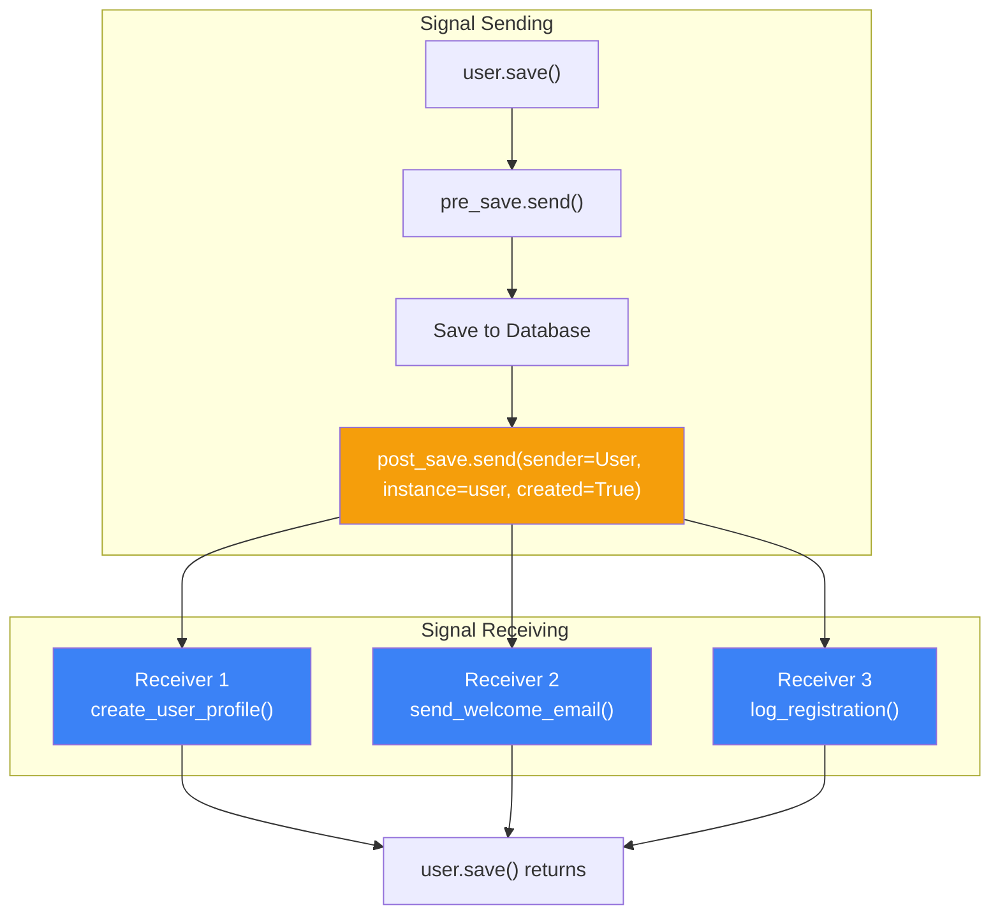
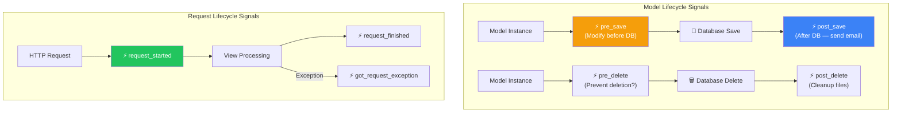
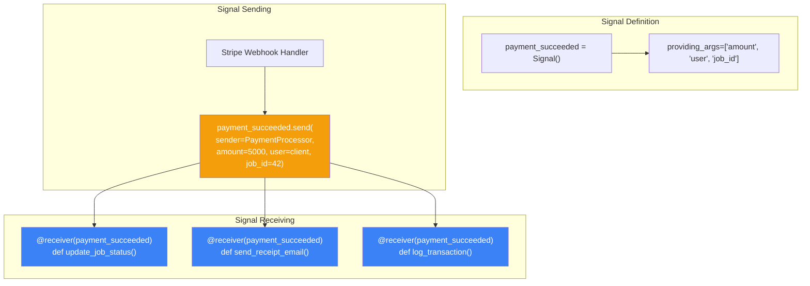
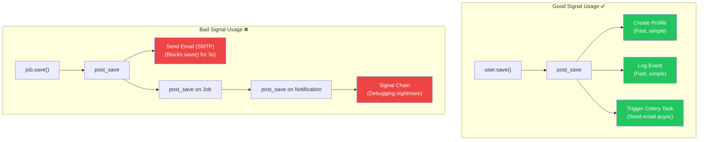

# الفصل التاسع — Django Signals: "الـ WhatsApp Group" بتاع Django

> **المتطلبات:** [[08-Django-Middleware]] — لازم تكون فاهم إزاي Django بتدير الـ Request/Response lifecycle، وفاهم إن في حاجات بتحصل "خارج" الـ request-response cycle العادي. الفصل ده هياخدك جوا نظام الإشعارات الداخلي بتاع Django — الـ Signals — اللي بيخلي أجزاء مختلفة من التطبيق تتكلم مع بعض من غير ما يعرفوا بعض.

---

## البداية — مشكلة الـ Tight Coupling

تخيّل معايا في HireLink: Client جديد سجل في الموقع. بعد ما الـ `User` object يتعمل، عايز تحصل ٣ حاجات:
1. يتعمل `UserProfile` object فارغ.
2. يتبعت Welcome Email للـ user.
3. يتسجل في log إن مستخدم جديد انضم.

المبتدئ هيكتب الكود ده في الـ view بتاعة التسجيل:

```python
def register(request):
    # Create user
    user = User.objects.create_user(username, email, password)
    
    # 1. Create profile
    UserProfile.objects.create(user=user)
    
    # 2. Send welcome email
    send_welcome_email(user.email)
    
    # 3. Log the event
    logger.info(f"New user registered: {user.username}")
    
    return redirect('login')
```

شكله عادي، بس فيه مشكلة كبيرة: **Tight Coupling**. الـ view بتاعة التسجيل بقت عارفة كل حاجة عن الـ profile system، والـ email system، والـ logging system. لو بكره أضفت حاجة رابعة (زي "ابعت Notification في Slack")، هضطر أعدل في الـ view تاني. لو حبيت أعمل API endpoint للتسجيل من الـ mobile app، هضطر أعيد نفس المنطق في الـ API view. ده اسمه **Code Duplication** و **High Coupling**.

الحل الأنيق: الـ **Signals**. الـ Signal هو "إعلان" بيطلع من مكان معين (زي `User` model) بيقول "حاجة حصلت!". أي حتة تانية في المشروع تقدر "تستمع" للإعلان ده وتشتغل لما تسمعه. الـ sender مش عارف مين بيستمع، والـ receiver مش عارف مين اللي باعت — هو مجرد بيسمع وينفذ.

ده بالظبط زي **WhatsApp Group**: الـ `User` model بيعمل `save()` وبعدين يبعت رسالة في الجروب: "يا جماعة، اتعمل User جديد". الـ `UserProfile` system (اللي عاملة mute للجروب) بتشوف الرسالة وتقول "أنا هعمل Profile". الـ Email system بتشوف الرسالة وتقول "أنا هبعت Welcome Email". الـ Logger بيشوف ويقول "أنا هسجل الحدث". الـ `User` model مش عارف مين في الجروب ولا مين هيرد — هو بس بيعلن.

---

## [[01-Signals-Deep-Dive]] — الـ Signals: تشريح النظام من الداخل

### 🧠 الشرح النظري

الـ Signals في Django هي تطبيق لـ **Observer Pattern** (أو Pub/Sub Pattern). في "ناشر" (Sender) بيبعت "إشارة" (Signal)، وفيه "مستمعين" (Receivers) بيسجلوا اهتمامهم بالإشارة دي وبيشتغلوا لما الإشارة تتبعت.

**المكونات الأساسية:**
1. **Signal Object:** ده الـ "نوع" الإشارة. Django بتعرف signals زي `post_save`، `pre_delete`، `m2m_changed`. كل واحد فيهم هو object من `django.dispatch.Signal`.
2. **Sender:** الـ model أو الـ object اللي ببعت الإشارة. غالباً بيكون Model class (زي `User`).
3. **Receiver:** الـ function اللي هتتنادى لما الإشارة تتبعت. دي الـ "callback" function.
4. **Connection:** عملية ربط الـ Receiver بالـ Signal. بنستخدم `@receiver` decorator أو `Signal.connect()`.

**إزاي بيشتغل من جوا؟**
لما بتعمل `user.save()`، Django بتبعت `pre_save` signal قبل ما تحفظ في الـ database، وبعدين بتحفظ، وبعدين تبعت `post_save` signal. الـ `post_save.send()` بتمر على كل الـ receivers المسجلين وتناديهم واحد واحد بالـ arguments اللي الـ sender باعتها (زي `instance`، `created`، `raw`).

**ملاحظة مهمة جداً:** الـ Signals **Synchronous** (متزامنة). يعني الـ `user.save()` مش هترجع غير لما **كل** الـ receivers يخلصوا شغلهم. ده بيعني إن لو receiver بطيء (زي إنه يبعت email عبر SMTP server بطيء)، الـ `save()` هتاخد وقت أطول. ده ممكن يكون مشكلة كبيرة في الـ performance لو مش فاهمها.

تخيّل الـ Signal system زي **راديو الشرطة**. الظابط (Sender) بيبعت رسالة على تردد معين: "أي وحدة متاحة، فيه حادثة في شارع كذا". كل عربية شرطة (Receiver) بتسمع الرسالة — بس بس العربية المهتمة (القريبة من المكان) هي اللي هترد وتتحرك. الظابط مش عارف مين هيرد — هو بس بيذيع. وكل العربيات بتسمع في نفس اللحظة (Synchronous) — مش بعدين.

### 📊 Visualization



### 💻 Micro-Example

```python
from django.db.models.signals import post_save
from django.dispatch import receiver
from django.contrib.auth.models import User

# Receiver function — listens for User post_save
@receiver(post_save, sender=User)
def handle_new_user(sender, instance, created, **kwargs):
    """
    This function runs automatically after ANY User is saved.
    sender: The model class (User)
    instance: The actual User object that was saved
    created: Boolean — True if this is a new user, False if updated
    """
    if created:
        print(f"New user created: {instance.username}")
        # Create profile, send email, log event...
    else:
        print(f"Existing user updated: {instance.username}")
```

---

## [[02-Built-in-Signals-Explained]] — الإشارات الجاهزة: متى تستخدم كل واحدة؟

### 🧠 الشرح النظري

Django بتيجي مع مجموعة من الـ Signals الجاهزة اللي بتغطي معظم احتياجاتك. كل واحد بيتبعت في لحظة محددة جداً.

**1. Model Signals (الأكثر استخداماً):**
- **`pre_save`:** بيتبعت **قبل** ما الـ object يتحفظ في الـ database. تقدر تعدل في الـ instance قبل ما تتحفظ (زي `instance.slug = slugify(instance.title)`). لو حصل exception، الـ save بتتلغي.
- **`post_save`:** بيتبعت **بعد** ما الـ object يتحفظ. ده المكان المثالي لحاجات زي إنشاء `UserProfile` بعد ما الـ `User` يتعمل، أو إرسال notifications. الـ instance موجودة في الـ database خلاص.
- **`pre_delete`:** بيتبعت **قبل** ما الـ object يتحذف. تقدر تمنع الحذف برفع exception. مناسب لعمل cleanup أو منع حذف related objects.
- **`post_delete`:** بيتبعت **بعد** ما الـ object يتحذف. مناسب لمسح files مرتبطة (زي صورة profile) أو logging.

**2. Request/Response Signals:**
- **`request_started`:** بيتبعت لما Django تبدأ تعالج request جديدة.
- **`request_finished`:** بيتبعت لما Django تخلص processing الـ request وتبعت الـ response.
- **`got_request_exception`:** بيتبعت لما يحصل exception جوا view. ده اللي بيستخدمه أدوات زي Sentry عشان يمسكوا الـ errors.

**3. Database Wrapper Signals:**
- **`connection_created`:** بيتبعت لما connection جديدة للـ database تتعمل. نادراً ما تحتاجه.

**4. Test Signals:**
- **`setting_changed`:** بيتبعت لما setting تتغير (غالباً في tests).
- **`template_rendered`:** بيتبعت لما template يتعمل render.

**5. ManyToMany Signals:**
- **`m2m_changed`:** بيتبعت لما علاقة ManyToMany تتغير (زي لما تضيف skills لـ Job). بيديك تفاصيل عن إيه اللي اتضاف أو اتحذف بالظبط.

تخيّل دول زي **إشعارات الموبايل**:
- `pre_save`: "التطبيق هيتحدث دلوقتي. عايز تعمل حاجة قبل ما يحفظ؟"
- `post_save`: "التطبيق اتحدث بنجاح. عايز تعمل حاجة دلوقتي؟"
- `pre_delete`: "التطبيق هيتحذف. متأكد؟ عايز تمسح الـ cache بتاعه؟"
- `post_delete`: "التطبيق اتحذف. خلاص، روح اعمل cleanup للـ files."
- `m2m_changed`: "الـ playlist اتغيرت — اتضاف ٣ أغاني واتحذفت ١."

### 📊 Visualization



### 💻 Micro-Example

```python
from django.db.models.signals import pre_save, post_save, pre_delete, post_delete
from django.dispatch import receiver
from django.utils.text import slugify

@receiver(pre_save, sender=Job)
def auto_generate_slug(sender, instance, **kwargs):
    """Generate slug from title BEFORE saving to database."""
    if not instance.slug:  # Only generate if slug is empty
        instance.slug = slugify(instance.title)

@receiver(post_save, sender=Job)
def notify_freelancers(sender, instance, created, **kwargs):
    """Notify matching freelancers AFTER job is saved."""
    if created and instance.status == 'open':
        # Find freelancers with matching skills and send notifications
        matching_freelancers = Freelancer.objects.filter(skills__in=instance.skills.all())
        for freelancer in matching_freelancers:
            send_new_job_notification(freelancer, instance)

@receiver(post_delete, sender=UserProfile)
def delete_avatar_file(sender, instance, **kwargs):
    """Delete the avatar file from disk when profile is deleted."""
    if instance.avatar:
        instance.avatar.delete(save=False)  # Delete the actual file
```

---

## [[03-Custom-Signals]] — بناء Signal خاص بيك: لما الـ Built-in مش كفاية

### 🧠 الشرح النظري

مش كل حاجة في مشروعك مرتبطة بالـ Models. أحياناً عايز تنشر حدث من مكان arbitrary في الكود، وتخلي حتة تانية تستمع له. هنا بتيجي فايدة **Custom Signals**.

**إزاي تبني Custom Signal؟**
1. **عرف الـ Signal object:** `payment_received = django.dispatch.Signal()`.
2. **حدد الـ providing_args (اختياري):** عشان توضح إيه الـ arguments اللي الـ receivers ممكن يتوقعوها.
3. **ابعته من المكان المناسب:** `payment_received.send(sender=self.__class__, amount=100, user=request.user)`.
4. **استقبله بـ `@receiver`:** زي أي signal تاني.

**مثال عملي في HireLink:**
تخيّل إن الـ payment system بتاعك (اللي ممكن يكون integration مع PayPal أو Stripe) بيعمل callback لما payment ينجح. بدل ما تحط كل الـ business logic (تحديث حالة الـ job، إرسال إيصال، تحديث الـ balance) في الـ webhook handler، ممكن الـ handler يبعت signal `payment_succeeded`. بعدين receivers منفصلة لكل مهمة تشتغل: واحد يحدث الـ job، واحد يبعت email، واحد يسجل في الـ accounting system.

ده بيخلي الكود **Modular** جداً. الـ webhook handler مش عارف حاجة عن الـ jobs ولا الـ emails — هو بس بيعلن: "فلوس وصلت!".

تخيّل إنك في شركة وفيها نظام **Intercom**:
- بدل ما تروح لكل مكتب وتقولهم "فلان دفع"، بتضغط زرار الـ Intercom وتبعت إعلان لكل المكاتب.
- مكتب المحاسبة (Accounting Receiver) يسمع ويسجل الدفع.
- مكتب خدمة العملاء (Email Receiver) يسمع ويبعت إيصال.
- مكتب المشاريع (Job Receiver) يسمع ويفتح المشروع.
الـ Intercom (Custom Signal) مش عارف مين بيسمع — ده مش شغله.

### 📊 Visualization



### 💻 Micro-Example

```python
# signals.py
from django.dispatch import Signal

# Define custom signal with documentation
payment_succeeded = Signal()  # providing_args=['user', 'amount', 'job_id']

# ----------------------------------------------------------------------

# views.py (or webhook handler)
from .signals import payment_succeeded

def stripe_webhook(request):
    # Process Stripe webhook payload...
    user = get_user_from_stripe_customer(customer_id)
    amount = stripe_event.data.object.amount
    job_id = stripe_event.data.object.metadata.job_id
    
    # Announce that payment succeeded — let receivers handle the rest
    payment_succeeded.send(
        sender=StripeWebhookHandler,
        user=user,
        amount=amount,
        job_id=job_id
    )
    return HttpResponse(status=200)

# ----------------------------------------------------------------------

# receivers.py
from django.dispatch import receiver
from .signals import payment_succeeded

@receiver(payment_succeeded)
def update_job_after_payment(sender, user, amount, job_id, **kwargs):
    """Receiver 1: Mark job as paid and active."""
    job = Job.objects.get(id=job_id)
    job.is_paid = True
    job.status = 'active'
    job.save()

@receiver(payment_succeeded)
def send_payment_receipt(sender, user, amount, job_id, **kwargs):
    """Receiver 2: Send receipt email to client."""
    send_mail(
        'Payment Confirmation',
        f'Your payment of ${amount} for job #{job_id} was successful.',
        'billing@hirelink.com',
        [user.email]
    )
```

---

## [[04-Signals-Anti-Patterns]] — Signals: متى تكون نعمة ومتى تكون نقمة؟

### 🧠 الشرح النظري

الـ Signals أداة قوية جداً — بس القوة دي ممكن تتحول لـ **كابوس صيانة** لو استخدمتها غلط. في Anti-Patterns لازم تكون عارفها عشان متقعش فيها.

**Anti-Pattern 1: إخفاء الـ Business Logic (مشكلة الـ Spooky Action at a Distance)**
لما تستخدم Signals بكثرة، الـ flow بتاع الكود بيبقى مخفي. انت بتعمل `user.save()` ومفيش أي indication إن ده هيطلق ٥ receivers في أماكن مختلفة في المشروع. الـ developer الجديد هيتفاجئ: "ليه بيحصل كل ده؟! أنا بس عملت save!".

**Anti-Pattern 2: Signals بتستدعي Signals (Signal Chains)**
تخيّل: `post_save` على `User` بتعمل `UserProfile`. `post_save` على `UserProfile` بتبعت signal تاني `profile_created`. `profile_created` بيعمل حاجة تالتة... ده بيخلي الـ debugging مستحيل. بتحصل infinite loops بسهولة لو مش حذر.

**Anti-Pattern 3: منطق الـ Validation في Signals**
ناس كتير بتحاول تمنع حذف `Job` لو ليه applications مفتوحة عن طريق `pre_delete` signal. ده غلط. الـ `pre_delete` ممكن يتم تجاهله في حالات معينة (زي `QuerySet.delete()` أو cascade delete). المكان الصح للـ validation هو الـ Model's `clean()` method أو `delete()` method override.

**Anti-Pattern 4: Slow Operations في Signals**
زي ما قولنا، الـ Signals **Synchronous**. لو receiver بيبعت email عبر SMTP بطيء، كل `save()` هتاخد ٣ ثواني زيادة. ده بيقتل الـ performance. الحل: استخدم Celery أو Django-Q عشان تشغل الـ slow operations في الخلفية.

**القاعدة الذهبية لاستخدام Signals:**
1. استخدم Signals **فقط** للـ "side effects" اللي مش جزء من الـ core logic بتاع الـ model.
2. الـ receiver لازم يكون بسيط وسريع. لو فيه حاجة تقيلة — استخدم task queue.
3. لو الـ logic خاص بـ model واحد ومش محتاج decoupling كبير — override الـ `save()` method بدل signal.
4. **دايماً اكتب تعليق** في الـ `save()` method أو في الـ view يوضح إن في signals مرتبطة بالعملية دي.

تخيّل Signals زي **بهارات الأكل**: رشة صغيرة بتحسن الطعم. لو حطيت كتير، الأكل بيبوظ ومش هتعرف إيه اللي جواه. متخليش الـ Signals تطغى على الـ explicit code flow. لو في شك، استخدم الـ explicit way (override `save()` أو call function directly).

### 📊 Visualization



### 💻 Micro-Example

```python
# ❌ ANTI-PATTERN 1: Hidden business logic
# models.py
class Job(models.Model):
    status = models.CharField(max_length=20)

# signals.py
@receiver(post_save, sender=Job)
def close_related_applications(sender, instance, **kwargs):
    if instance.status == 'closed':
        instance.applications.update(status='rejected')  # Hidden logic!

# view.py
def close_job(request, job_id):
    job = Job.objects.get(id=job_id)
    job.status = 'closed'
    job.save()  # 💥 Surprise! All applications get rejected!
    # Developer reading this has NO IDEA this is happening.

# ✅ BETTER APPROACH: Explicit method
class Job(models.Model):
    status = models.CharField(max_length=20)
    
    def close(self):
        """Explicitly close job and reject all applications."""
        self.status = 'closed'
        self.save()
        self.applications.update(status='rejected')
        # Logic is visible and self-contained

# view.py
def close_job(request, job_id):
    job = Job.objects.get(id=job_id)
    job.close()  # ✅ Clear what's happening
```

---

## 🎯 أسئلة الإنترفيو

**س: إيه هي الـ Signals في Django؟ وإزاي بتشتغل من جوا؟**

> الـ Signals هي تطبيق لـ **Observer Pattern** (أو Pub/Sub) في Django. بتسمح لـ **Senders** (زي Models) بإنهم "يعلنوا" عن أحداث معينة (زي `post_save`)، و **Receivers** (functions) بإنهم "يستمعوا" للإعلانات دي ويتنفذوا تلقائياً.<br/><br/>
> 
> **إزاي بتشتغل من جوا؟**
> 1. Django بتعرف Signal objects (زي `post_save = Signal()`). الـ object ده عنده قائمة بالـ receivers المسجلين.
> 2. لما بتعمل `model.save()`، Django بتبعت `pre_save.send()`، بعدين تحفظ في الـ database، بعدين `post_save.send()`.
> 3. الـ `.send()` method بتاخد الـ `sender` وأي arguments تانية (`instance`, `created`, إلخ)، وتمر على كل الـ receivers المسجلين وتناديهم واحد واحد بنفس الـ arguments.
> 4. الـ receivers بيتنفذوا **Synchronously** (متزامنين) — يعني `save()` مش هترجع غير لما كل receivers يخلصوا.
> 
> **المكونات الرئيسية:**
> - **Signal Object:** الإشارة نفسها (زي `post_save`).
> - **Sender:** اللي باعت الإشارة (غالباً Model class).
> - **Receiver:** الـ callback function اللي هتتنادى.
> - **Connection:** ربط الـ receiver بالـ signal (عن طريق `@receiver` أو `Signal.connect()`).

---

**س: اشرحلي الفرق بين `pre_save` و `post_save` Signals. وامتى تستخدم كل واحد؟**

> الفرق الأساسي هو **توقيت** إرسال الإشارة بالنسبة لعملية الحفظ في الـ database.<br/><br/>
> 
> **`pre_save`:**
> - **التوقيت:** بيتبعت **قبل** ما الـ object يتحفظ في الـ database.
> - **الاستخدامات:** تعديل بيانات الـ instance قبل ما تتحفظ. أمثلة:
>   - توليد `slug` من `title` (`instance.slug = slugify(instance.title)`).
>   - تعيين `updated_at` تلقائياً.
>   - Validation مخصص (بس الأفضل تستخدم `clean()`).
> - **الميزة:** تقدر تمنع الـ save عن طريق رفع Exception — الـ database مش هيتلمس.
> - **العيب:** الـ instance مش موجودة في الـ database بعد — معندهاش `pk` لو جديدة.<br/><br/>
> 
> **`post_save`:**
> - **التوقيت:** بيتبعت **بعد** ما الـ object يتحفظ في الـ database.
> - **الاستخدامات:** حاجات محتاجة الـ instance تكون موجودة فعلاً. أمثلة:
>   - إنشاء `UserProfile` بعد ما `User` يتعمل (محتاج `user.pk`).
>   - إرسال notifications أو emails.
>   - Logging أو analytics.
>   - تحديث related objects.
> - **الميزة:** الـ instance موجودة في الـ database (`pk` موجود). تقدر تعمل queries تانية بأمان.
> - **العيب:** لو الـ receiver بطيء، الـ `save()` كلها هتاخد وقت أطول (Synchronous).

---

**س: إمتى تستخدم Signals وإمتى تـ override الـ `save()` method بدلهم؟**

> ده سؤال مهم جداً في تصميم الـ Django projects. القرار بيعتمد على **مدى ارتباط الـ logic بالـ Model نفسه**.<br/><br/>
> 
> **استخدم Signals لما:**
> 1. الـ logic خاص بـ **Model مختلف تماماً** أو **App مختلف**. مثال: `User` model في `accounts` app، وعايز تعمل `UserProfile` في `profiles` app. الـ `User` model مش محتاج يعرف حاجة عن الـ `profiles` app — `post_save` signal بيفصل بينهم.
> 2. الـ logic محتاج يتطبق على **كل** instances حتى لو اتخلقت بطرق مختلفة (ORM `create()`, `get_or_create()`, admin panel, bulk operations — مع تحفظات).
> 3. عايز تسمح لـ **Apps تانية** إنها "تـ hook" في الـ events بتاعة الـ Model من غير ما تعدل في الـ Model نفسه (زي ما Django admin بتعمل).
> 4. الـ logic "جانبي" (side effect) ومش جزء من الـ core identity بتاعة الـ Model.<br/><br/>
> 
> **استخدم Override `save()` لما:**
> 1. الـ logic **جزء أساسي** من الـ Model وسلوكه. مثال: `Job` model عنده `slug` بيتولد تلقائياً من `title`. ده جزء من الـ `Job` نفسه — مكانه الطبيعي في `save()`.
> 2. الـ logic **بسيط** ومش محتاج decoupling. لو هتعمل `self.full_clean()` قبل الحفظ — ده في `save()`.
> 3. الـ logic محتاج يشتغل **دايماً** حتى في حالات معينة الـ signals مش بتشتغل فيها (زي `QuerySet.update()` أو `bulk_create()`). الـ signals مش بتتبعت في الحالات دي.
> 4. عايز تمنع الحفظ تحت ظروف معينة — `save()` تقدر تـ raise Exception قبل ما تعمل `super().save()`.<br/><br/>
> 
> **القاعدة:** لو الـ logic خاص بالـ Model نفسه — Override `save()`. لو الـ logic بيعمل حاجة لـ Model تاني أو App تاني — Signal.

---

**س: إيه هي أشهر Anti-Patterns في استخدام Signals؟ وإزاي تتجنبهم؟**

> الـ Signals ممكن تتحول من أداة قوية لـ كابوس صيانة لو اتم استخدامها غلط. أشهر الأخطاء:<br/><br/>
> 
> **1. إخفاء الـ Business Logic (Spooky Action at a Distance):**
> - **المشكلة:** الـ developer بيعمل `user.save()` ومش عارف إن ده بيطلق ٥ receivers في أماكن مختلفة. الـ code flow بقى مخفي.
> - **الحل:** دايماً اكتب تعليق واضح في الـ view أو في الـ Model `save()` method بيشرح إن في Signals مرتبطة. كمان، خلي الـ receivers في ملف `signals.py` واضح ومنظم في الـ App.<br/><br/>
> 
> **2. Signal Chains (إشارات بتستدعي إشارات):**
> - **المشكلة:** `post_save` على `User` → `post_save` على `UserProfile` → `profile_updated` Signal → ... ده بيخلي الـ debugging مستحيل وبيسبب infinite loops.
> - **الحل:** تجنب عمل `save()` على Model تاني جوا Receiver إلا للضرورة القصوى. لو مضطر، استخدم `sender` argument في الـ receiver التاني عشان تمنع الـ loops: `@receiver(post_save, sender=UserProfile)` بدل `@receiver(post_save)` (اللي بيشتغل على أي sender).<br/><br/>
> 
> **3. Slow/Blocking Operations في Signals:**
> - **المشكلة:** Receiver بيبعت email (SMTP) أو يعمل API call. الـ `save()` بتاخد ٣ ثواني بدل milliseconds.
> - **الحل:** استخدم Task Queue (زي Celery) عشان تشغل الـ slow operations في الخلفية. الـ receiver يبقى سريع وبيـ trigger الـ task بس.<br/><br/>
> 
> **4. Validation Logic في Signals:**
> - **المشكلة:** محاولة منع حذف object عن طريق `pre_delete` signal. ده مش مضمون لأن `pre_delete` مش بيتبعت في `QuerySet.delete()` أو cascade deletes.
> - **الحل:** استخدم Model methods (`clean()`, `delete()`) أو Database constraints (`PROTECT` on ForeignKey) للـ validation. الـ Signals للـ side effects مش للـ validation.<br/><br/>
> 
> **5. Signals مش بتشتغل في كل العمليات:**
> - **المشكلة:** الاعتماد على `post_save` عشان يعالج كل الـ instances. `QuerySet.update()` و `bulk_create()` مش بيبعتوا Signals.
> - **الحل:** لو محتاج logic يتطبق حتى في bulk operations، لازم تـ override الـ Manager methods أو تستخدم `post_bulk_create` signals (في libraries خارجية). متعتمدش على Signals لوحدها في الحالات دي.

---

**س: إزاي تبني Custom Signal في Django؟ وليه ممكن تحتاجه؟**

> **إزاي تبنيه:**
> 1. عرف الـ Signal object في `signals.py`:
> ```python
> from django.dispatch import Signal
> payment_received = Signal()  # providing_args=['user', 'amount', 'invoice_id']
> ```
> 2. ابعته من المكان المناسب:
> ```python
> payment_received.send(sender=self.__class__, user=request.user, amount=5000, invoice_id=123)
> ```
> 3. استقبله بـ `@receiver`:
> ```python
> from django.dispatch import receiver
> from .signals import payment_received
> 
> @receiver(payment_received)
> def handle_payment(sender, user, amount, invoice_id, **kwargs):
>     # Logic here
> ```
> 4. تأكد إن الـ receivers متسجلين: حط `from . import receivers` في `apps.py` (`ready()` method) عشان Django تحملهم.<br/><br/>
> 
> **ليه تحتاجه؟**
> الـ Built-in Signals (زي `post_save`) مرتبطة بالـ Models. أحياناً الأحداث المهمة في تطبيقك مش مرتبطة بـ Model save. أمثلة:
> - **Payment Webhooks:** Stripe أو PayPal بيرنوا على endpoint عندك. بدل ما تحط كل الـ business logic في الـ view، الـ view تبعت `payment_received` signal، و receivers منفصلة تتعامل معاه (تحديث Job، إرسال إيصال، تحديث analytics).
> - **User Actions:** مستخدم ضغط زرار "إبلاغ عن إساءة". تبعت `content_reported` signal. moderation team تسمعه وتعمل حاجة، analytics team تسمعه وتسجل.
> - **External Integrations:** API خارجي بعتلك data. الـ webhook handler يبعت signal، وكل integration تتعامل مع الـ data اللي يهمها.
> - **Decoupling Apps:** App A (مثلاً `jobs`) عايز ينشر حدث "Job Completed" من غير ما يعرف حاجة عن App B (`payments`) ولا App C (`notifications`). Custom Signal `job_completed` بيحل ده.
> 
> **الخلاصة:** Custom Signal هو الـ "Event Bus" الداخلي بتاعك. بيسمح لـ Apps مختلفة تتكلم مع بعض من غير Tight Coupling.

---

## 📝 خلاصة الدرس

- **الـ Signals هي Observer Pattern:** نظام Pub/Sub بيسمح لـ Senders يعلنوا عن أحداث، و Receivers يستمعوا ويتفاعلوا. بيفصل الـ apps عن بعض وبيقلل الـ coupling.
- **الـ Built-in Signals الأساسية:** `pre_save` (تعديل قبل الحفظ)، `post_save` (إجراءات بعد الحفظ)، `pre_delete` و `post_delete` (حذف objects)، `m2m_changed` (تغييرات ManyToMany)، `request_started/finished` (دورة حياة الـ request).
- **الـ Signals متزامنة (Synchronous):** `save()` مش هترجع غير لما كل receivers يخلصوا. تجنب العمليات البطيئة (زي emails) جوا الـ receiver — استخدم Celery بدلهم.
- **Custom Signals:** عرف `Signal()` object، ابعته بـ `.send()`، استقبله بـ `@receiver`. مثالي لـ decoupling apps وإدارة الـ events اللي مش مرتبطة بالـ Models (زي payment webhooks).
- **Anti-Patterns مهمة:** تجنب إخفاء الـ business logic (خلي الـ signals موثقة). تجنب signal chains (إشارات بتستدعي إشارات). متستخدمش signals للـ validation (استخدم `clean()` أو `delete()` override). متعتمدش على signals في `QuerySet.update()` أو `bulk_create()` — مش هيشتغلوا.
- **القاعدة الذهبية:** Signals للـ side effects بين الـ Apps المختلفة. لو الـ logic خاص بالـ Model نفسه — Override `save()`. لو مش متأكد، استخدم الـ explicit approach (override `save()` أو call function directly).

---

*Next → [[10-Django-Authentication-System]] — عرفنا إزاي نستمع للأحداث. دلوقتي هنتعمق في نظام الحماية: إزاي Django بتدير الـ Users والـ Permissions؟ إيه الفرق بين `AbstractUser` و `AbstractBaseUser`؟ وليه لازم تبدأ مشروعك بـ Custom User Model من أول يوم؟*