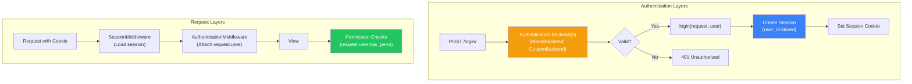
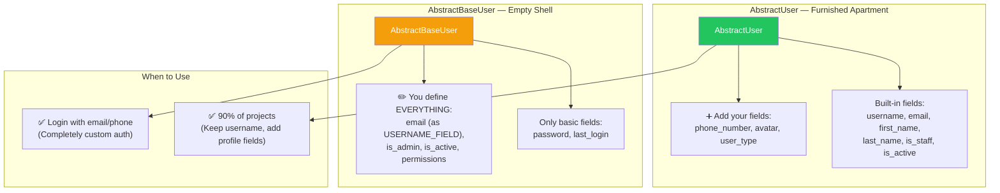
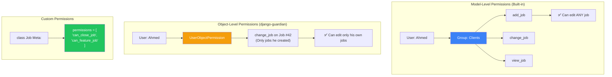
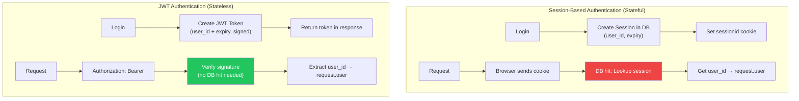
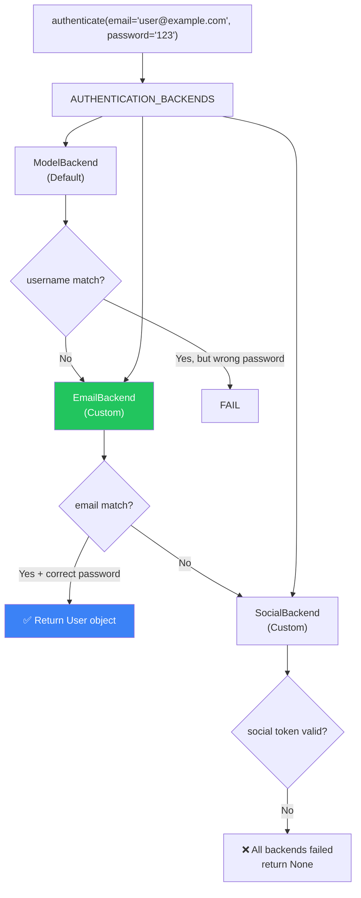

# الفصل العاشر — Django Authentication System: من الـ User Model للـ Permissions

> **المتطلبات:** [[09-Django-Signals]] — لازم تكون فاهم إزاي الـ Signals بتسمح لأجزاء مختلفة من التطبيق تتكلم مع بعض. الفصل ده هيستخدم نفس فكرة الـ decoupling عشان يوريك إزاي نظام الـ Authentication في Django مبني بشكل Modular تقدر تتحكم فيه بالكامل.

---

## البداية — سؤال الـ ٥ دقايق اللي بيحدد مصير مشروعك

تخيّل معايا إنك بدأت مشروع HireLink من ٣ شهور. استخدمت الـ `User` model الافتراضي بتاع Django. الدنيا كانت حلوة. دلوقتي الـ client عايز يضيف حقل `user_type` (هل المستخدم Client ولا Freelancer). وعايز يخلي الـ login بـ `email` مش `username`.

تقدر تضيف ده؟ أه — بس هتضطر:
1. تعمل `UserProfile` model جديد بعلاقة OneToOne مع `User`.
2. تستخدم `email` كـ `username` (وتخليه unique).
3. كل مرة تتعامل مع المستخدم، تعمل `user.profile.user_type`.

ده **Workaround**. مش حل حقيقي. وبعدين تكتشف إنك عايز تضيف `phone_number`، `verification_status`، `payment_method`... الـ `UserProfile` هتبقى وحش. وكل query هتحتاج `select_related('profile')` عشان الـ performance ميموتش.

الغلطة الأصلية: إنك بدأت بـ `User` model الافتراضي. Django نفسها بتحذرك في الـ documentation: "If you're starting a new project, it's highly recommended to set up a custom User model."

الفصل ده مش عن "إزاي تستخدم الـ `User` model". ده عن "إزاي تبني نظام Authentication كامل من الصفر بالطريقة الصح — الطريقة اللي هتخليك تتحكم في كل حاجة من أول يوم."

---

## [[01-Django-Auth-Architecture]] — نظام الـ Authentication: مش مجرد User Model

### 🧠 الشرح النظري

كتير من المبتدئين بيفكروا إن نظام الـ Authentication في Django هو `django.contrib.auth.models.User` وبس. ده غلط كبير. النظام ده معماري كامل متكامل من طبقات كتير:

**الطبقة 1: الـ User Model**
ده الـ object اللي بيمثل المستخدم في الـ database. بيحتوي على البيانات الأساسية: `username`، `password`، `email`، `is_active`، `is_staff`. لكن ده مجرد **قمة الجبل**.

**الطبقة 2: الـ Authentication Backend**
ده الـ "الدماغ" اللي بتعرف إزاي تتأكد من هوية المستخدم. لما بتنادي `authenticate(username='ahmed', password='123456')`، Django بتمر على كل الـ Authentication Backends المسجلين في `AUTHENTICATION_BACKENDS` وتسأل كل واحد: "هل تقدر تـ authenticate المستخدم ده؟". أول Backend ينجح بيرجع الـ `User` object.

الـ Default Backend هو `ModelBackend` — بيدور في الـ `User` model على `username` و `password` match. لكن تقدر تعمل Backend خاص بيك يـ authenticate عن طريق email، phone number، أو حتى JWT token.

**الطبقة 3: الـ Session Middleware**
بعد ما الـ user يتأكد من هويته، محتاج "يفضل متذكر" بين الـ requests. هنا بييجي دور `SessionMiddleware` و `AuthenticationMiddleware`. الـ Session بتخزن `user_id` في الـ server، والـ browser بيحتفظ بـ session cookie. `AuthenticationMiddleware` بتقرا الـ session في كل request وتحط `request.user`.

**الطبقة 4: الـ Permissions System**
ده نظام كامل بيديك تحكم دقيق في "مين يقدر يعمل إيه". فيه:
- **Permissions:** أذونات فردية (`can_add_job`، `can_close_job`).
- **Groups:** مجموعات من الـ permissions (`Clients`، `Freelancers`، `Admins`).
- **Content Types:** بيسمحلك تربط الـ permissions بـ Models معينة (زي "يقدر يعدل Job بس اللي هو عامله").

تخيّل نظام الـ Authentication في Django زي **مطار**:
- **الـ User Model:** جواز السفر (البيانات الأساسية).
- **Authentication Backend:** ضابط الجوازات — بيتأكد إن الجواز سليم والبيانات صح. ممكن يكون في أكتر من ضابط (واحد بيفحص الجواز المصري، واحد بيفحص الأجنبي).
- **Session Middleware:** الـ badge اللي بتاخده بعد ما تعدي الجوازات — بيديك access للبوابات.
- **Permissions System:** البوابات الإلكترونية — البadge بتاعك بيفتح بوابات معينة (صالة كبار الزوار) ومش بيفتح غيرها (برج المراقبة).

### 📊 Visualization



### 💻 Micro-Example

```python
# settings.py — The complete authentication stack
INSTALLED_APPS = [
    'django.contrib.auth',      # Core auth system (User model, backends)
    'django.contrib.contenttypes', # Required for permissions
    'django.contrib.sessions',  # Session management
    # ...
]

MIDDLEWARE = [
    'django.contrib.sessions.middleware.SessionMiddleware',      # 1. Load session
    'django.contrib.auth.middleware.AuthenticationMiddleware',   # 2. Attach user
    # ...
]

AUTHENTICATION_BACKENDS = [
    'django.contrib.auth.backends.ModelBackend',  # Default: username + password
    # 'hirelink.auth.EmailBackend',               # Custom: email + password
]

# views.py — Using the auth system
from django.contrib.auth import authenticate, login

def login_view(request):
    username = request.POST['username']
    password = request.POST['password']
    user = authenticate(request, username=username, password=password)  # Uses backends
    if user is not None:
        login(request, user)  # Creates session
        return redirect('dashboard')
    return render(request, 'login.html', {'error': 'Invalid credentials'})
```

---

## [[02-AbstractUser-vs-AbstractBaseUser]] — معركة الـ Custom User Models

### 🧠 الشرح النظري

Django بتقدملك طريقتين رئيسيتين عشان تعمل Custom User Model. الفرق بينهم هو **مدى التحكم** اللي عايزه.

**الطريقة الأولى: `AbstractUser` (الطريقة السهلة — ٩٠٪ من الحالات)**
ده **Extension** للـ `User` model الافتراضي. Django عملتلك كل الـ fields الأساسية (`username`، `email`، `first_name`، `last_name`، `is_staff`، `is_active`، إلخ) وإنت بس بتضيف الحقول اللي عايزها. الـ `AbstractUser` هو الـ `User` model الأصلي بس abstract (مش بيتعمل منه table في الـ database).

استخدم `AbstractUser` لو:
- عايز تحتفظ بـ `username` field (حتى لو هتستخدمه كـ email).
- عايز تستخدم الـ Django Admin زي ما هي (محتاج `is_staff` و `is_superuser`).
- عايز تضيف fields بسيطة زي `phone_number`، `avatar`، `user_type`.

**الطريقة التانية: `AbstractBaseUser` (التحكم الكامل — ١٠٪ من الحالات)**
ده "القالب الفارغ" للـ User model. بيديك **الحقول الأساسية فقط**: `password` و `last_login`. كل حاجة تانية انت هتكتبها بنفسك. مفيش `username`، مفيش `email`، مفيش `is_staff` — انت بتقرر كل حاجة.

استخدم `AbstractBaseUser` لو:
- عايز **تغير الـ `USERNAME_FIELD`** لـ `email` (وتلغي `username` خالص).
- عايز **تغير طريقة الـ Authentication بالكامل** (زي login بـ phone number).
- مش عايز تستخدم Django Admin (أو هتبني admin panel مخصصة).
- عايز تحكم كامل في الـ fields والـ methods والـ permissions.

**الخلاصة بالعامية المصرية:**
`AbstractUser` زي شقة متأثثة. انت بتجي تغير الستاير وتضيف كنبة. `AbstractBaseUser` زي شقة على الطوب — انت هتبني الحيطان الأول. معظم المشاريع بتبدأ بـ `AbstractUser` وخلاص. لكن لو انت باني SaaS كبير وعايز login بـ email من غير username خالص — `AbstractBaseUser` هو الحل.

### 📊 Visualization



### 💻 Micro-Example

```python
# Approach 1: AbstractUser — Simple extension
from django.contrib.auth.models import AbstractUser
from django.db import models

class User(AbstractUser):
    USER_TYPE_CHOICES = [
        ('client', 'Client'),
        ('freelancer', 'Freelancer'),
    ]
    user_type = models.CharField(max_length=20, choices=USER_TYPE_CHOICES)
    phone_number = models.CharField(max_length=15, blank=True)
    avatar = models.ImageField(upload_to='avatars/', blank=True)
    
    def __str__(self):
        return self.username  # Still has username field

# settings.py
AUTH_USER_MODEL = 'accounts.User'

# Approach 2: AbstractBaseUser — Complete control
from django.contrib.auth.models import AbstractBaseUser, BaseUserManager, PermissionsMixin
from django.db import models

class CustomUserManager(BaseUserManager):
    def create_user(self, email, password=None, **extra_fields):
        if not email:
            raise ValueError('Email is required')
        email = self.normalize_email(email)
        user = self.model(email=email, **extra_fields)
        user.set_password(password)
        user.save()
        return user
    
    def create_superuser(self, email, password=None, **extra_fields):
        extra_fields.setdefault('is_staff', True)
        extra_fields.setdefault('is_superuser', True)
        return self.create_user(email, password, **extra_fields)

class User(AbstractBaseUser, PermissionsMixin):
    email = models.EmailField(unique=True)  # No username field
    full_name = models.CharField(max_length=255)
    is_active = models.BooleanField(default=True)
    is_staff = models.BooleanField(default=False)
    
    objects = CustomUserManager()
    
    USERNAME_FIELD = 'email'  # Login with email instead of username
    REQUIRED_FIELDS = ['full_name']  # Fields required for createsuperuser
    
    def __str__(self):
        return self.email

# settings.py
AUTH_USER_MODEL = 'accounts.User'
```

---

## [[03-Permissions-And-Groups]] — نظام الصلاحيات: مين يقدر يعمل إيه؟

### 🧠 الشرح النظري

الـ Authentication بتقول "مين المستخدم؟" (Identity). الـ Authorization (أو Permissions) بتقول "إيه اللي المستخدم ده مسموح له يعمله؟" (Access Control).

Django عندها نظام صلاحيات قوي جداً مبني على ٣ مستويات:

**المستوى 1: Permissions (الأذونات الفردية)**
كل Model في Django بيحصل تلقائياً على ٤ Permissions:
- `add_modelname`: يقدر يعمل object جديد.
- `change_modelname`: يقدر يعدل object موجود.
- `delete_modelname`: يقدر يحذف object.
- `view_modelname`: يقدر يشوف object.

الـ Permissions دي بتتخزن في `django.contrib.auth.models.Permission` table. تقدر تضيف Permissions مخصصة في الـ Model's `Meta` class:
```python
class Job(models.Model):
    # ... fields ...
    class Meta:
        permissions = [
            ('can_close_job', 'Can close job'),
            ('can_feature_job', 'Can feature job'),
        ]
```

**المستوى 2: Groups (المجموعات)**
بدل ما تدّي Permissions لكل User فردي، بتعمل Groups (زي `Clients`، `Freelancers`، `Moderators`). كل Group ليها مجموعة من الـ Permissions. الـ User بيتضاف للـ Group ويكتسب كل Permissions بتاعتها تلقائياً. ده بيخلي إدارة الصلاحيات سهلة جداً.

**المستوى 3: Object-Level Permissions (Django Guardian)**
الـ Permissions الأساسية في Django هي **Model-Level** — يعني `can_change_job` بتدي المستخدم صلاحية تعديل **أي** Job. إيه لو عايز Client يعدل **فقط** الـ Jobs اللي هو عامله؟ ده اسمه **Object-Level Permissions**. Django مش بتدعمها بشكل built-in (إلا في admin). الحل هو مكتبة `django-guardian` — بتضيف جدول `UserObjectPermission` و `GroupObjectPermission` يربطوا User بـ Permission لـ Object معين.

تخيّل النظام ده زي **شركة**:
- **Permissions:** "فتح باب المكتب"، "استخدام الطابعة"، "دخول غرفة السيرفرات".
- **Groups:** "قسم المبيعات" (لهم صلاحية دخول مكتب المبيعات)، "قسم الـ IT" (لهم صلاحية غرفة السيرفرات).
- **Object-Level Permissions:** "الموظف ده يقدر يفتح مكتبه هو بس، مش مكاتب زمايله".

### 📊 Visualization



### 💻 Micro-Example

```python
# models.py — Define custom permissions
class Job(models.Model):
    title = models.CharField(max_length=200)
    client = models.ForeignKey(settings.AUTH_USER_MODEL, on_delete=models.CASCADE)
    status = models.CharField(max_length=20, default='open')
    
    class Meta:
        permissions = [
            ('can_close_job', 'Can close job'),
            ('can_reopen_job', 'Can reopen closed job'),
            ('can_feature_job', 'Can mark job as featured'),
        ]

# views.py — Using permissions
from django.contrib.auth.decorators import permission_required
from django.contrib.auth.mixins import PermissionRequiredMixin

# Function-based view with permission
@permission_required('jobs.can_close_job', raise_exception=True)
def close_job(request, job_id):
    job = get_object_or_404(Job, id=job_id)
    job.status = 'closed'
    job.save()
    return redirect('job_detail', job_id=job_id)

# Class-based view with permission
class JobCloseView(PermissionRequiredMixin, View):
    permission_required = 'jobs.can_close_job'
    
    def post(self, request, job_id):
        # ... close logic ...

# Creating groups and assigning permissions programmatically
from django.contrib.auth.models import Group, Permission

# Create Client group and assign permissions
client_group, created = Group.objects.get_or_create(name='Clients')
add_job_perm = Permission.objects.get(codename='add_job')
change_job_perm = Permission.objects.get(codename='change_job')
client_group.permissions.add(add_job_perm, change_job_perm)

# Assign user to group
user.groups.add(client_group)

# Check permission in template
# 
#   <button>Close Job</button>
# 

# Check permission in view logic
if request.user.has_perm('jobs.can_close_job'):
    # Allow closing
    pass
```

---

## [[04-Session-vs-Token-Authentication]] — ازاي تفضل متذكر: Cookies ولا Tokens؟

### 🧠 الشرح النظري

في عالم الـ Web، الـ HTTP هو **Stateless Protocol** — كل request مستقلة عن اللي قبلها. الـ server مش فاكر إنك انت نفس الشخص اللي بعت request من شوية. فإزاي تخليه "يتذكر" إنك logged in؟

**الطريقة التقليدية: Session-Based Authentication (Django Default)**
لما بتعمل `login(request, user)`، Django بتعمل حاجتين:
1. **في الـ Server:** بتخزن `user_id` في الـ Session (في جدول `django_session` في الـ database).
2. **في الـ Browser:** بتبعت `sessionid` cookie.

في كل request بعد كده، الـ browser بتبعث الـ cookie. `SessionMiddleware` بتقراه، تدور على الـ session في الـ database، تحمل `user_id`، وتعمل `request.user`.

**المميزات:**
- بسيط ومضمون. Django بتعمله automatically.
- تقدر تعمل Logout بسهولة (تمسح الـ session من الـ server).
- البيانات الحساسة (زي `user_id`) موجودة في الـ server بس — مش في الـ cookie.

**العيوب:**
- الـ Server لازم يحتفظ بحالة (Stateful). ده بيخلي الـ scaling أصعب (محتاج sticky sessions أو shared session storage زي Redis).
- مش مناسب للـ Mobile Apps أو Single Page Applications (SPAs) اللي مش بتستخدم Cookies بشكل طبيعي.

**الطريقة الحديثة: Token-Based Authentication (JWT)**
بدل ما نخزن session في الـ server، ندي المستخدم **Token** (زي JWT — JSON Web Token). الـ Token ده عبارة عن string مشفر بيحتوي على `user_id` و `expiration time`. الـ server مش بيخزن حاجة — هو بس بيتأكد إن الـ Token صحيح (بمفتاح سري) ويفك تشفيره.

**المميزات:**
- **Stateless:** الـ Server مش بيخزن sessions. الـ scaling سهل جداً (أي server يقدر يفحص الـ Token).
- مثالي للـ APIs والـ Mobile Apps (الـ Token بيتحط في `Authorization` header).
- مناسب للـ Microservices (كل service تقدر تفحص الـ Token بنفس المفتاح).

**العيوب:**
- Logout أصعب — الـ Token صالح لحد ما expiry time بتاعه يخلص. عشان تعمل logout فوري، محتاج Blacklist للـ Tokens.
- الـ Token ممكن يكون كبير شوية (بيحتوي على payload مشفر).
- لو الـ Token اتسرق، أي حد يقدر يستخدمه لحد ما ينتهي (مفيش server-side invalidation).

تخيّل الفرق بين **كارت عضوية نادي** (Session) و **تذكرة حفلة** (JWT):
- **كارت العضوية:** اسمك مسجل في سيستم النادي. لو ضاع الكارت، النادي بيوقف الرقم بتاعه فوراً (server-side logout). لكن الموظف لازم يبص في السيستم كل مرة (database hit).
- **تذكرة الحفلة:** التذكرة فيها تاريخ الحفلة ومكتوب عليها إنها صالحة لشخص واحد. أي حد على الباب يشوف التذكرة يدخلك — مش محتاج يرجع للسيستم. لكن لو ضاعت التذكرة، اللي يلاقيها يدخل — متقدرش توقفها (إلا لو الحفلة خلصت).

### 📊 Visualization



### 💻 Micro-Example

```python
# Session Authentication — Django Built-in (views.py)
from django.contrib.auth import authenticate, login, logout
from django.contrib.auth.decorators import login_required

def session_login(request):
    user = authenticate(username=request.POST['username'], password=request.POST['password'])
    if user:
        login(request, user)  # Creates session in database + sets cookie
        return redirect('dashboard')
    return render(request, 'login.html')

@login_required  # Checks session cookie
def dashboard(request):
    return render(request, 'dashboard.html', {'user': request.user})

def session_logout(request):
    logout(request)  # Deletes session from database
    return redirect('login')

# JWT Authentication — Using djangorestframework-simplejwt
from rest_framework_simplejwt.tokens import RefreshToken
from rest_framework.decorators import api_view, permission_classes
from rest_framework.permissions import IsAuthenticated

@api_view(['POST'])
def jwt_login(request):
    user = authenticate(username=request.data['username'], password=request.data['password'])
    if user:
        refresh = RefreshToken.for_user(user)  # Create JWT token
        return Response({
            'refresh': str(refresh),
            'access': str(refresh.access_token),
        })
    return Response({'error': 'Invalid credentials'}, status=401)

@api_view(['GET'])
@permission_classes([IsAuthenticated])  # Verifies JWT token from Authorization header
def jwt_protected_view(request):
    return Response({'message': f'Hello {request.user.username}'})
```

---

## [[05-Custom-Authentication-Backend]] — لما الـ Login يبقى بـ Email أو Phone

### 🧠 الشرح النظري

الـ Default Authentication Backend (`ModelBackend`) بيحاول يـ authenticate باستخدام `username` و `password`. لكن إيه لو عايز المستخدمين يسجلوا بـ `email`؟ أو بـ `phone_number`؟ أو حتى بـ `email` **أو** `username` (الاتنين ينفعوا)؟

الحل: **Custom Authentication Backend**.

الـ Backend هو مجرد class بيعمل implement لـ method واحدة أو اتنين:
- `authenticate(self, request, username=None, password=None, **kwargs)`: بتاخد الـ credentials وترجع `User` object لو صح، أو `None` لو غلط.
- `get_user(self, user_id)`: بترجع الـ User من الـ `user_id` (عشان `request.user`).

لما تعمل `authenticate(username='ahmed@hirelink.com', password='123456')`، Django بتمر على كل الـ backends في `AUTHENTICATION_BACKENDS` (بالترتيب) وتنادي `authenticate` على كل واحد. أول واحد يرجع `User` (مش `None`) هو اللي بينجح.

ده بيديك مرونة رهيبة:
- **EmailBackend:** يدور على `email` بدل `username`.
- **EmailOrUsernameBackend:** يحاول بـ `email` الأول، لو مفيش، يحاول بـ `username`.
- **PhoneBackend:** يـ authenticate بـ `phone_number` و `OTP` بدل password.
- **SocialAuthBackend:** يـ authenticate بـ Google/Facebook token.

تخيّل الـ Authentication Backends زي **موظفين الجوازات** في المطار:
- **الموظف المصري (ModelBackend):** بيفتش في الباسبور المصري — بيدور على `username` (رقم الباسبور) و `password` (البصمة).
- **الموظف الأجنبي (EmailBackend):** بيفتش في الباسبور الأجنبي — بيدور على `email` و `password`.
- **الكاونتر الإلكتروني (SocialAuthBackend):** بيقرا الـ QR code بتاع Google Token.
كل واحد متخصص في طريقة معينة. المسافر بيختار الكاونتر المناسب (أو Django بتمرر على الكل لحد ما تلاقي واحد يعرف يتعامل مع الـ credentials).

### 📊 Visualization



### 💻 Micro-Example

```python
# backends.py
from django.contrib.auth.backends import ModelBackend, BaseBackend
from django.contrib.auth import get_user_model
from django.db.models import Q

User = get_user_model()

# 1. Simple Email Backend — login with email instead of username
class EmailBackend(ModelBackend):
    def authenticate(self, request, username=None, password=None, **kwargs):
        # 'username' parameter will actually contain email
        try:
            user = User.objects.get(email=username)  # Search by email
        except User.DoesNotExist:
            return None
        
        if user.check_password(password) and self.user_can_authenticate(user):
            return user
        return None

# 2. Advanced Backend — login with email OR username
class EmailOrUsernameBackend(ModelBackend):
    def authenticate(self, request, username=None, password=None, **kwargs):
        try:
            # Try to find user by email OR username
            user = User.objects.get(
                Q(email=username) | Q(username=username)
            )
        except User.DoesNotExist:
            return None
        
        if user.check_password(password) and self.user_can_authenticate(user):
            return user
        return None

# 3. Phone OTP Backend — no password needed
class PhoneOTPBackend(BaseBackend):
    def authenticate(self, request, phone_number=None, otp=None, **kwargs):
        try:
            user = User.objects.get(phone_number=phone_number)
        except User.DoesNotExist:
            return None
        
        # Verify OTP from cache/Redis
        if verify_otp(phone_number, otp):
            return user
        return None
    
    def get_user(self, user_id):
        try:
            return User.objects.get(pk=user_id)
        except User.DoesNotExist:
            return None

# settings.py — Register custom backends
AUTHENTICATION_BACKENDS = [
    'hirelink.backends.EmailOrUsernameBackend',  # Try this first
    'django.contrib.auth.backends.ModelBackend',  # Fallback to default
]

# views.py — Now login accepts email as 'username' field
def login_view(request):
    credential = request.POST['username']  # Can be email or username
    password = request.POST['password']
    
    user = authenticate(request, username=credential, password=password)
    if user:
        login(request, user)
        return redirect('dashboard')
    return render(request, 'login.html', {'error': 'Invalid credentials'})
```

---

## 🎯 أسئلة الإنترفيو

**س: إيه الفرق بين `AbstractUser` و `AbstractBaseUser`؟ وامتى تستخدم كل واحد فيهم؟**

> الفرق الأساسي هو **مدى التحكم** اللي بيديهولك في الـ User model.<br/><br/>
> 
> **`AbstractUser`:**
> - **الوصف:** Extension للـ `User` model الافتراضي. Django عملتلك كل الـ fields الأساسية (`username`, `email`, `first_name`, `last_name`, `is_staff`, `is_active`, `is_superuser`, `permissions`). إنت بس بتضيف الحقول اللي عايزها.
> - **الاستخدام:** ٩٠٪ من المشاريع. مثالي لما تكون عايز تحتفظ بـ `username` field (حتى لو هتستخدمه كـ email) وتستفيد من الـ Django Admin زي ما هي. مجرد بتضيف `phone_number`، `avatar`، `user_type`.
> - **الميزة:** سهل وسريع. كل الـ built-in features (admin, permissions, groups) شغالة out-of-the-box.
> - **العيب:** مقيد شوية. مش هتعرف تغير `USERNAME_FIELD` (هتفضل `username`).<br/><br/>
> 
> **`AbstractBaseUser`:**
> - **الوصف:** "القالب الفارغ" للـ User model. بيديك **فقط** `password` و `last_login`. كل حاجة تانية (حتى `email`, `is_active`, `is_staff`) إنت اللي هتكتبها.
> - **الاستخدام:** ١٠٪ من المشاريع اللي محتاجة تحكم كامل. مثالي لما تكون عايز:
>   - Login بـ `email` بدل `username` (تغير `USERNAME_FIELD='email'`).
>   - Login بـ `phone_number`.
>   - تبني نظام Authentication مختلف تماماً عن Django Admin.
> - **الميزة:** تحكم كامل. تقدر تعمل أي حاجة.
> - **العيب:** محتاج تكتب كل حاجة بنفسك. الـ `UserManager`، الـ permissions (بتحتاج `PermissionsMixin`)، وربما الـ admin panel.<br/><br/>
> 
> **القاعدة الذهبية:** لو مشروعك هيستخدم Django Admin (حتى جزئياً) وعايز تبني حاجة بسرعة — `AbstractUser`. لو باني API-only service وعايز Login بـ email من غير username خالص — `AbstractBaseUser`.

---

**س: إزاي بتشتغل الـ Permissions في Django؟ وإيه الفرق بين Model-Level و Object-Level Permissions؟**

> نظام الـ Permissions في Django بيسمحلك تتحكم في **إيه اللي المستخدم يقدر يعمله** (Authorization)، بعد ما يتأكد من هويته (Authentication).<br/><br/>
> 
> **Model-Level Permissions (الافتراضية):**
> - كل Model في Django بيحصل تلقائياً على ٤ Permissions: `add`, `change`, `delete`, `view` (بتنضاف لـ `auth_permission` table).
> - الـ Permissions دي بتدي المستخدم صلاحية على **كل** objects من الـ Model ده. مثال: لو عنده `change_job`، يقدر يعدل **أي** Job في الـ database.
> - بتتفحص بـ `user.has_perm('app_name.permission_codename')` أو `@permission_required` decorator.
> - تقدر تضيف Permissions مخصصة في الـ Model's `Meta` class: `permissions = [('can_close_job', 'Can close job')]`.<br/><br/>
> 
> **Groups (المجموعات):**
> - بدل ما تدّي Permissions لكل User فردي، بتعمل Groups (زي `Editors`, `Moderators`). كل Group ليها مجموعة Permissions.
> - الـ User بيتضاف للـ Group ويكتسب كل Permissions بتاعتها. ده بيخلي الإدارة أسهل.
> - `user.groups.add(editor_group)`.<br/><br/>
> 
> **Object-Level Permissions (Row-Level):**
> - الـ Model-Level Permissions بتقول: "يقدر يعدل **أي** Job". Object-Level بتقول: "يقدر يعدل **Job #42 فقط** (اللي هو عامله)".
> - Django **لا تدعم** Object-Level Permissions بشكل built-in خارج الـ Admin. الحل هو مكتبة `django-guardian`.
> - `guardian` بتضيف جداول `UserObjectPermission` و `GroupObjectPermission` تربط User بـ Permission لـ Object معين (`object_pk`).
> - بعد ما تـ assign permission: `assign_perm('change_job', user, job)`. تتفحص: `user.has_perm('change_job', job)`.<br/><br/>
> 
> **الخلاصة:** Model-Level = صلاحية على الـ Model كله. Object-Level = صلاحية على instance معينة. في معظم المشاريع، Model-Level + Groups بيكونوا كافيين. Object-Level بتستخدمها في حالات زي "المستخدم يقدر يعدل الـ Post اللي هو كاتبه بس".

---

**س: اشرحلي الفرق بين Session Authentication و JWT Authentication. وامتى تستخدم كل واحد؟**

> الاتنين طرق عشان الـ Server "يتذكر" إن المستخدم logged in عبر requests مختلفة (HTTP stateless). الفرق الجوهري في **مكان تخزين الحالة (State)**.<br/><br/>
> 
> **Session-Based Authentication (Django Default):**
> - **إزاي بيشتغل:** بعد login، الـ server بيخلق Session record (في `django_session` table) فيها `user_id`. بيرجع `sessionid` cookie للـ browser. كل request بعد كده، الـ browser بيبعت الـ cookie. الـ server بيدور على الـ session في الـ database ويحمل الـ user.
> - **Stateful:** الـ Server محتفظ بالحالة. محتاج Database/Cache عشان يخزن الـ sessions.
> - **المميزات:**
>   - Logout فوري (بيمسح الـ session من الـ server).
>   - آمن — الـ `user_id` مش موجود في الـ client.
>   - Django بتدعمه built-in وسهل جداً.
> - **العيوب:**
>   - كل request محتاجة DB hit عشان تجيب الـ session (إلا لو استخدمت cached sessions).
>   - الـ Scaling أصعب — محتاج sticky sessions أو shared session storage (زي Redis) عشان تعمل load balancing.
>   - مش مناسب للـ Mobile Apps أو SPAs اللي مش بتتعامل مع cookies بشكل طبيعي.<br/><br/>
> 
> **JWT (JSON Web Token) Authentication:**
> - **إزاي بيشتغل:** بعد login، الـ server بيخلق JWT Token (string مشفر) بيحتوي على `user_id` و `expiry`. الـ Token بيتحط في `Authorization: Bearer <token>` header.
> - **Stateless:** الـ Server مش بيخزن حاجة. بيتأكد من صحة الـ Token باستخدام secret key بس. مفيش database hit.
> - **المميزات:**
>   - Stateless — Scaling سهل جداً. أي server يقدر يفحص الـ Token.
>   - مثالي للـ APIs، Microservices، و Mobile Apps.
>   - مفيش DB hit لكل request (أسرع).
> - **العيوب:**
>   - Logout أصعب. الـ Token صالح لحد ما ينتهي. عشان تعمل logout فوري، محتاج Blacklist (وتبقى Stateful).
>   - لو الـ Token اتسرق، أي حد يقدر يستخدمه (حتى لو غيرت الـ password) لحد ما ينتهي.
>   - حجم الـ Token كبير شوية (بيحتوي على payload).<br/><br/>
> 
> **امتى تستخدم إيه؟**
> - **Session:** مواقع تقليدية (Server-Rendered Templates)، Django Admin، لو بتبني Monolith وعايز أبسط حاجة.
> - **JWT:** REST APIs، Single Page Applications (React/Vue)، Mobile Apps، Microservices. في DRF (Django Rest Framework)، JWT هو المعيار الحديث.

---

**س: إزاي تبني Custom Authentication Backend؟ وليه ممكن تحتاجه؟**

> الـ Custom Authentication Backend بيسمحلك تغير **إزاي** Django بتـ authenticate المستخدمين. بدل ما تعتمد على `username` و `password` بس، تقدر تعمل login بـ `email`، `phone_number`، `social tokens`، أو أي logic تاني.<br/><br/>
> 
> **إزاي تبنيه:**
> 1. اعمل class جديد (في `backends.py`) بيرث من `BaseBackend` أو `ModelBackend`.
> 2. اكتب `authenticate(self, request, username=None, password=None, **kwargs)` method. لازم ترجع `User` object لو الـ credentials صح، أو `None` لو غلط.
> 3. (اختياري) اكتب `get_user(self, user_id)` method (بتستخدم عشان `request.user`). لو وارث من `ModelBackend`، مش محتاج تكتبها.
> 4. سجل الـ Backend في `settings.py`:
> ```python
> AUTHENTICATION_BACKENDS = [
>     'hirelink.backends.EmailBackend',
>     'django.contrib.auth.backends.ModelBackend',  # Fallback
> ]
> ```
> 
> **ليه تحتاجه؟**
> - **Login بـ Email بدل Username:** تغير الـ `authenticate` method عشان تدور على `email=username` بدل `username=username`.
> - **Login بـ Email أو Username (الاتنين):** تدور بـ `Q(email=username) | Q(username=username)`.
> - **Login بـ Phone Number + OTP:** الـ `authenticate` تاخد `phone_number` و `otp` وتتأكد من الـ OTP في Redis/Cache.
> - **Social Authentication:** تتأكد من Google/Facebook token عن طريق API call.
> - **Multi-Tenancy:** تضيف check إن الـ user بتاع الـ tenant الحالي بس (تقارن `user.tenant == request.tenant`).<br/><br/>
> 
> **نقطة مهمة:** Django بتمر على **كل** الـ backends في `AUTHENTICATION_BACKENDS` بالترتيب. أول واحد يرجع `User` (مش `None`) هو اللي بينجح. ده بيسمحلك تحط كذا backend مع بعض (زي EmailBackend + ModelBackend كـ fallback).

---

**س: ليه لازم تبدأ مشروع Django بـ Custom User Model من أول يوم؟ وإيه المخاطر لو مبدأتش بيه؟**

> ده سؤال **مهم جداً** في الـ Django interviews. الإجابة القصيرة: لأن تغيير الـ User model بعد ما المشروع بدأ هو **كابوس تقني**.<br/><br/>
> 
> **ليه لازم تبدأ بـ Custom User Model؟**
> 1. **Django نفسها بتنصح بكده:** في الـ official documentation: "If you're starting a new project, it's highly recommended to set up a custom User model, even if the default User model is sufficient for you." السبب إنك مش عارف إيه اللي محتاجه في المستقبل.
> 2. **المرونة المستقبلية:** النهارده عايز `email` و `username`. بكره عايز `user_type` (Client vs Freelancer). بعده عايز `phone_number` و `is_verified`. مع `AbstractUser`، ده سهل — مجرد بتضيف fields.
> 3. **تجنب الـ `UserProfile` Anti-Pattern:** بدل ما تعمل `UserProfile` model بعلاقة OneToOne (واللي بيخلي كل query محتاج `select_related('profile')` وبيأثر على الـ performance)، الـ fields بتبقى مباشرة في الـ User model.<br/><br/>
> 
> **إيه المخاطر لو مبدأتش بيه؟**
> - **Migrations كارثية:** تغيير `AUTH_USER_MODEL` بعد ما المشروع بدأ (بعد ما اتعملت migrations) صعب جداً. Django مش بتدعمه بشكل رسمي. هتضطر تمسح الـ database وتبدأ من الأول (مش ممكن في production)، أو تعمل workarounds معقدة يدوية.
> - **Foreign Key Hell:** لو عندك Models تانية بتربط بـ `User` (زي `Job.client`)، تغيير الـ User model يعني تعديل كل الـ ForeignKeys دي في الـ database schema — عملية خطيرة.
> - **Workarounds مؤلمة:** هتضطر تستخدم `UserProfile` (OneToOne) لكل حاجة. كل `request.user.profile.phone_number` بدل `request.user.phone_number`. ده بيأثر على الـ code readability والـ performance (N+1 queries لو مش حذر).<br/><br/>
> 
> **إزاي تبدأ صح من أول يوم؟**
> 1. أول حاجة في أي مشروع Django جديد: `python manage.py startapp accounts`.
> 2. اعمل `User(AbstractUser)` model حتى لو فاضي خالص.
> 3. حط `AUTH_USER_MODEL = 'accounts.User'` في `settings.py`.
> 4. اعمل أول migration.
> 5. استخدم `get_user_model()` بدل `User` المباشر في كل الكود.
> 
> **الخلاصة:** بداية المشروع بـ Custom User Model بتاخد ٥ دقايق إضافية. إصلاح الموضوع بعد ٦ شهور بياخد أيام وصداع. ابدأ صح من الأول.

---

## 📝 خلاصة الدرس

- **نظام الـ Authentication متعدد الطبقات:** مش مجرد `User` model. فيه `Authentication Backends` (الدماغ — إزاي تـ authenticate)، `Session/Cookie` system (التذكر بين requests)، و `Permissions/Groups` (الصلاحيات).
- **`AbstractUser` vs `AbstractBaseUser`:** `AbstractUser` = Extension سهل للـ User الافتراضي (استخدمه في ٩٠٪ من الحالات). `AbstractBaseUser` = تحكم كامل (استخدمه لو عايز login بـ email بدل username).
- **Custom User Model من أول يوم:** **قاعدة ذهبية**. ابدأ بـ `AUTH_USER_MODEL = 'accounts.User'` من أول ما تعمل `startproject`. التغيير بعدين كابوس.
- **Permissions و Groups:** Permissions = أذونات فردية (`can_close_job`). Groups = مجموعات من الأذونات (`Clients`, `Admins`). الـ User بيتضاف للمجموعة ويكتسب صلاحياتها. Object-Level Permissions (مكتبة `django-guardian`) للتحكم في صلاحيات الـ user على instance معينة.
- **Session vs JWT:** Session = Stateful (الـ server بيخزن session في DB). مناسب للمواقع التقليدية. JWT = Stateless (الـ server مش بيخزن حاجة). مثالي للـ APIs و Mobile Apps. اختار اللي يناسب مشروعك.
- **Custom Authentication Backend:** بتسمحلك تغير طريقة الـ login (بـ email، phone، social tokens). اعمل class في `backends.py`، اكتب `authenticate` method، سجله في `AUTHENTICATION_BACKENDS`.

---

*Next → [[11-DRF-Fundamentals]] — خلصنا أساسيات Django Core. دلوقتي هنتعمق في Django REST Framework (DRF): إيه الفرق بين Django العادية والـ API-first development؟ إزاي تبني REST API محترف؟ وإيه هي الـ Serializers اللي بتحول الـ Models لـ JSON والعكس؟*