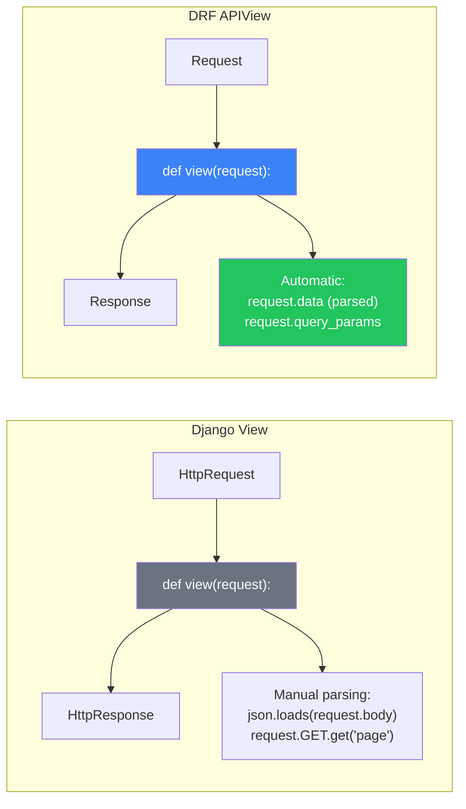
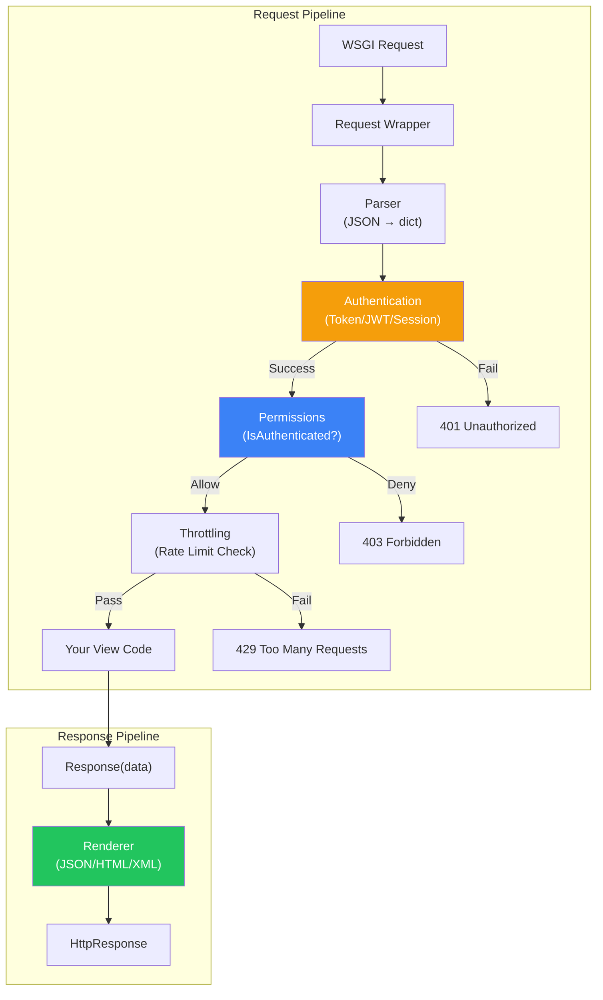
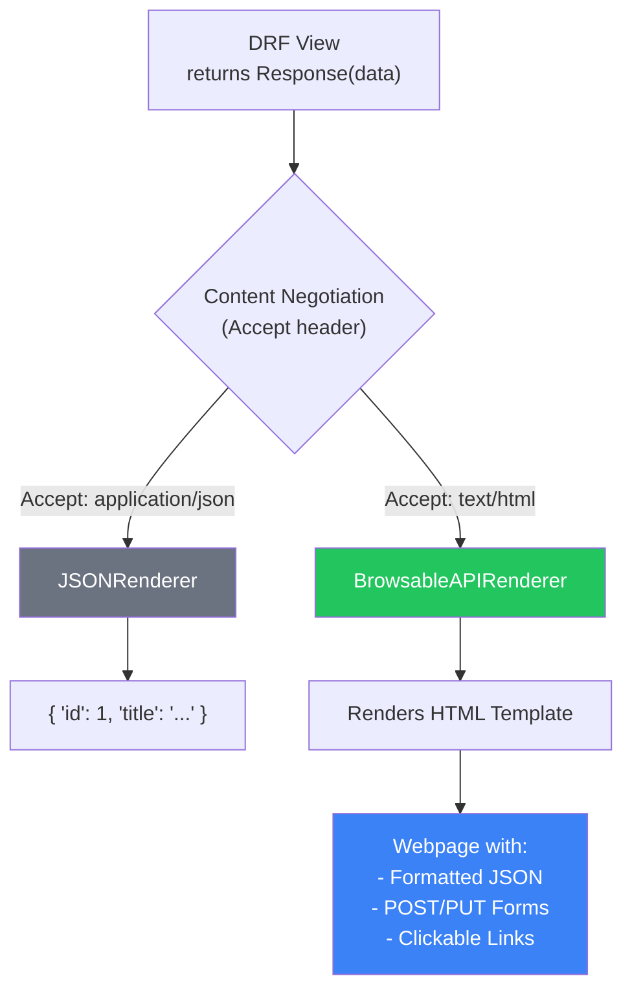

```mermaid
graph TD
    subgraph "Django Request/Response"
        D_REQ["HTTP Request"] --> D_VIEW["Django View"]
        D_VIEW --> D_TEMP["Template Rendering"]
        D_TEMP --> D_RES["HTML Response"]
    end
    
    subgraph "DRF Request/Response"
        DRF_REQ["HTTP Request"] --> PARSER["Parser<br/>(JSON → dict)"]
        PARSER --> AUTH["Authentication<br/>(Token/Session/JWT)"]
        AUTH --> PERM["Permissions<br/>(IsAuthenticated?)"]
        PERM --> VIEW["DRF View/ViewSet"]
        VIEW --> SERIAL["Serializer<br/>(Model → JSON)"]
        SERIAL --> RENDER["Renderer<br/>(JSON/HTML/XML)"]
        RENDER --> DRF_RES["Response"]
    end
    
    style SERIAL fill:#3b82f6,color:#fff
    style AUTH fill:#f59e0b,color:#fff
    style RENDER fill:#22c55e,color:#fff
```

# الفصل الحادي عشر — Django REST Framework: من الـ HTML لـ JSON

> **المتطلبات:** [[10-Django-Authentication-System]] — لازم تكون فاهم إزاي Django بتدير الـ Requests والـ Responses، وفاهم نظام الـ Authentication والـ Permissions. الفصل ده هيبني فوقهم عشان يوريك إزاي تحول مشروع Django العادي لـ REST API محترف بيخدم JSON.

---

## البداية — لما الـ HTML مش كفاية

تخيّل معايا إنك بنيت HireLink بـ Django العادية. الموقع شغال تمام — Views بترجع HTML Templates، الـ Forms شغالة، والـ Authentication بـ Sessions. الدنيا تمام.

بعد شهر، الـ client عايز يعمل Mobile App (Flutter أو React Native). الـ App محتاجة نفس البيانات — jobs، applications، user profiles — بس محتاجاها كـ **JSON** مش HTML. وعايزة تتعامل مع الـ API بـ **Tokens** مش Cookies.

الحل الساذج: تروح لكل View وتضيف شرط:
```python
def job_list(request):
    jobs = Job.objects.all()
    if request.GET.get('format') == 'json':
        return JsonResponse({'jobs': list(jobs.values())})
    return render(request, 'jobs.html', {'jobs': jobs})
```

ده شغال. بس هتكرر الـ if في كل View. وهتضطر تتعامل مع الـ authentication بشكل مختلف (Tokens vs Sessions). وهتضطر تكتب parsing للـ JSON input manually. وهتكتشف إنك بتعيد اختراع العجلة.

Django REST Framework (DRF) اتعملت عشان تحل المشكلة دي. هي مش "إضافة" صغيرة — هي **framework متكاملة** لبناء Web APIs فوق Django. بتديك:
- **Serializers:** تحول Models لـ JSON والعكس (بدل `values()`).
- **Authentication Classes:** تدعم Token, JWT, Session, OAuth.
- **Browsable API:** واجهة HTML تلقائية للـ API بتاعك (للـ development).
- **ViewSets و Routers:** تبني CRUD كامل في ٥ أسطر.

الفصل ده هيدخلك عالم DRF من أوسع أبوابه. مش بس "إزاي تستخدمها" — ده "إزاي بتشتغل من جوا وإزاي تختار الصح من البداية."

---

## [[01-What-Is-DRF]] — DRF: مش مجرد JSON Renderer

### 🧠 الشرح النظري

كتير من المبتدئين بيفتكروا إن DRF هي مجرد "حاجة بتحول Models لـ JSON". ده جزء صغير جداً من الصورة. DRF هي **Web API Framework** كاملة فوق Django بتقدم:

**1. Serialization Layer:**
ده قلب DRF. الـ Serializers مش مجرد `model_to_dict`. هم classes بتوصف **إزاي** البيانات تتحول من Model instance لـ JSON (serialization) ومن JSON لـ Model instance (deserialization). وفيهم validation مدمج، nested relationships، و custom logic.

**2. Authentication & Permissions:**
Django العادية بتعتمد على Session Authentication. DRF بتدعم أنظمة Authentication متعددة في نفس الوقت: Token, JWT, OAuth2, Basic, Session. وكمان Permissions خاصة بالـ API (`IsAuthenticated`, `IsAdminUser`, `DjangoModelPermissions`).

**3. View Layer:**
DRF بتقدم `APIView` (بديل لـ `View`)، `GenericAPIView`، و `ViewSets`. دول بيعملوا الـ heavy lifting بتاع parsing الـ request (JSON, XML, Form Data)، pagination، filtering، و rendering الـ response.

**4. Browsable API:**
دي feature سحرية. لما تفتح الـ API endpoint في الـ browser، DRF بترجعلك HTML page جميلة فيها الـ JSON response، وأزرار عشان تجرب الـ API (POST, PUT, DELETE). ده بيخلي الـ development والـ debugging أسرع بكتير من Postman.

**5. Content Negotiation:**
الـ client ممكن يقول "عايز JSON" (`Accept: application/json`) أو "عايز HTML" (`Accept: text/html`). DRF بتقرا الـ header ده وتختار الـ Renderer المناسب تلقائياً.

تخيّل DRF زي **مطار دولي**:
- Django العادية: **مطار داخلي** — بيتعامل مع المسافرين المحليين (HTML requests) بس.
- DRF: **مطار دولي** — عنده بوابات (Renderers) تخدم مسافرين من كل الجنسيات (JSON, XML, HTML). عنده مترجمين (Serializers) بيترجموا بين لغة البلد (Python Models) ولغات المسافرين (JSON). وعنده جمارك (Authentication/Permissions) بتفحص كل مسافر.

### 📊 Visualization



### 💻 Micro-Example

```python
# Traditional Django View — returns HTML
from django.shortcuts import render
from .models import Job

def job_list_html(request):
    jobs = Job.objects.all()
    return render(request, 'jobs/list.html', {'jobs': jobs})

# DRF API View — returns JSON (and browsable HTML automatically)
from rest_framework.decorators import api_view
from rest_framework.response import Response
from .serializers import JobSerializer

@api_view(['GET', 'POST'])
def job_list_api(request):
    if request.method == 'GET':
        jobs = Job.objects.all()
        serializer = JobSerializer(jobs, many=True)
        return Response(serializer.data)  # Automatically JSON/HTML based on Accept header
    
    elif request.method == 'POST':
        serializer = JobSerializer(data=request.data)  # request.data is parsed JSON
        if serializer.is_valid():
            serializer.save()
            return Response(serializer.data, status=201)
        return Response(serializer.errors, status=400)
```

---

## [[02-APIView-vs-View]] — `APIView`: الـ Django View على الستيرويدات

### 🧠 الشرح النظري

في Django العادية، الـ View بتاخد `HttpRequest` وترجع `HttpResponse`. في DRF، عندك `APIView` — بتاخد `Request` (نسخة محسنة من `HttpRequest`) وترجع `Response` (نسخة محسنة من `HttpResponse`).

**إيه الفرق بين `Request` و `HttpRequest`؟**
- `request.data`: بيحتوي على الـ parsed payload (JSON, Form Data, XML). في Django العادية، كنت محتاج `json.loads(request.body)`.
- `request.query_params`: بديل لـ `request.GET` — أوضح في الـ APIs.
- `request.user` و `request.auth`: الـ `auth` ده الـ token أو session object المستخدم في authentication.

**إيه الفرق بين `Response` و `HttpResponse`؟**
- `Response(data)` بتاخد Python dict/list وترجعه. DRF بتختار الـ Renderer المناسب (JSON, HTML) تلقائياً بناءً على `Accept` header.
- Content Negotiation تلقائي — لو فتحت في browser، هتشوف HTML Browsable API. لو بعت request بـ `Accept: application/json`، هيرجع JSON.

**الـ `@api_view` Decorator:**
بدل ما تعمل class لـ `APIView`، تقدر تستخدم `@api_view(['GET', 'POST'])` على function عادية. ده بيحوّل الـ function لـ `APIView` كامل بكل المميزات.

تخيّل `APIView` زي **Smart TV**:
- `HttpRequest`/`HttpResponse`: تلفزيون قديم — بيستقبل إشارة واحدة (HTML) ويطلع صورة.
- `Request`/`Response`: Smart TV — بيستقبل HDMI، USB، Netflix (JSON, XML, HTML) وبيختار المدخل المناسب تلقائياً. والريموت (`request.data`, `request.query_params`) أسهل في الاستخدام.

### 📊 Visualization



### 💻 Micro-Example

```python
# Traditional Django — Manual JSON handling
from django.http import JsonResponse
from django.views import View
import json

class JobListDjangoView(View):
    def get(self, request):
        jobs = Job.objects.all()
        data = [{'id': j.id, 'title': j.title} for j in jobs]
        return JsonResponse(data, safe=False)
    
    def post(self, request):
        data = json.loads(request.body)  # Manual parsing
        job = Job.objects.create(**data)
        return JsonResponse({'id': job.id}, status=201)

# DRF — Automatic parsing and rendering
from rest_framework.views import APIView
from rest_framework.response import Response
from rest_framework import status

class JobListAPIView(APIView):
    def get(self, request):
        jobs = Job.objects.all()
        serializer = JobSerializer(jobs, many=True)
        return Response(serializer.data)  # Auto JSON/HTML
    
    def post(self, request):
        serializer = JobSerializer(data=request.data)  # request.data auto-parsed
        if serializer.is_valid():
            serializer.save()
            return Response(serializer.data, status=status.HTTP_201_CREATED)
        return Response(serializer.errors, status=status.HTTP_400_BAD_REQUEST)

# Even shorter with @api_view decorator
from rest_framework.decorators import api_view

@api_view(['GET', 'POST'])
def job_list_view(request):
    if request.method == 'GET':
        jobs = Job.objects.all()
        serializer = JobSerializer(jobs, many=True)
        return Response(serializer.data)
    # ... POST logic
```

---

## [[03-Request-Response-Internals]] — تشريح الـ Request والـ Response في DRF

### 🧠 الشرح النظري

لما request بتوصل لـ DRF View، بتمر عبر **Pipeline** من الـ processing قبل ما توصل للكود بتاعك. فهم الـ pipeline ده هو الفرق بين الـ developer اللي بيصلح bugs بالتجربة والخطأ، واللي بيشخص المشكلة من جذورها.

**الـ Request Processing Pipeline:**
1. **WSGI Request:** Django بتستقبل `WSGIRequest` (نفس الـ `HttpRequest` العادي).
2. **DRF Request Wrapper:** `APIView` بتغلف الـ `HttpRequest` في `rest_framework.request.Request`.
3. **Parser Selection:** DRF بتبص على `Content-Type` header وتختار parser مناسب (JSONParser, FormParser, MultiPartParser).
4. **Parsing:** الـ parser بيحول الـ raw body لـ Python dict في `request.data`.
5. **Authentication:** DRF بتمر على `authentication_classes` (بالترتيب). كل class بيحاول يـ authenticate الـ request. أول واحد ينجح بيحط `request.user` و `request.auth`.
6. **Permissions:** DRF بتمر على `permission_classes`. لو أي واحد رفض (رجع `False`)، بترجع `403 Forbidden` فوراً قبل ما الـ View تتنفذ.
7. **Throttling:** بتتأكد إن الـ client مش عامل requests كتير (Rate Limiting). لو زاد عن الحد، `429 Too Many Requests`.
8. **View Execution:** أخيراً، الكود بتاعك (`.get()` أو `.post()`) بيتنفذ.

**الـ Response Processing Pipeline (بالعكس):**
1. **View Returns:** الكود بتاعك بيرجع `Response(data)`.
2. **Renderer Selection:** DRF بتبص على `Accept` header وتختار renderer (JSONRenderer, BrowsableAPIRenderer).
3. **Rendering:** الـ renderer بيحول `data` لـ string (JSON, HTML).
4. **HTTP Response:** الـ string بيتحط في `HttpResponse` وترجع للـ client.

تخيّل الـ Pipeline زي **خط إنتاج في مصنع**:
- **Parser:** العامل اللي بيفتح الكراتين (HTTP body) ويطلع اللي جواها (`request.data`).
- **Authentication:** حارس الأمن — بيتأكد من بطاقة الهوية (Token/Session).
- **Permission:** مدير القسم — بيتأكد إن العامل ده مسموح له يدخل القسم ده.
- **Throttling:** عداد السرعة — بيتأكد إن العامل مش بيجري بسرعة زيادة عن اللزوم.
- **Renderer:** عامل التغليف — بيحط المنتج النهائي (JSON) في كرتونة جديدة (`HttpResponse`).

### 📊 Visualization



### 💻 Micro-Example

```python
from rest_framework.views import APIView
from rest_framework.response import Response
from rest_framework import status
from rest_framework.parsers import JSONParser, FormParser, MultiPartParser
from rest_framework.authentication import TokenAuthentication, SessionAuthentication
from rest_framework.permissions import IsAuthenticated
from rest_framework.throttling import UserRateThrottle

class JobDetailAPIView(APIView):
    # Request pipeline configuration
    parser_classes = [JSONParser, FormParser, MultiPartParser]  # Accept JSON and Form data
    authentication_classes = [TokenAuthentication, SessionAuthentication]  # Try Token, then Session
    permission_classes = [IsAuthenticated]  # Must be logged in
    throttle_classes = [UserRateThrottle]  # Limit to 100 requests/day per user
    
    def get(self, request, job_id):
        # request.user is already set by authentication_classes
        # request.auth is the Token object (if TokenAuthentication succeeded)
        job = get_object_or_404(Job, id=job_id)
        
        # Check object-level permission manually if needed
        if job.client != request.user and not request.user.is_staff:
            return Response({'error': 'Not allowed'}, status=status.HTTP_403_FORBIDDEN)
        
        serializer = JobSerializer(job)
        return Response(serializer.data)  # Will be rendered as JSON or HTML automatically
```

---

## [[04-Browsable-API]] — الـ Browsable API: سلاحك السري في الـ Development

### 🧠 الشرح النظري

من أروع المميزات في DRF هي الـ **Browsable API**. لما تفتح endpoint في الـ browser (من غير أي headers خاصة)، DRF مش بترجع JSON خام. بترجعلك **HTML Page** كاملة فيها:
- الـ JSON response منسق وجميل.
- Forms عشان تجرب الـ POST, PUT, PATCH, DELETE مباشرةً من الـ browser.
- أزرار للـ OPTIONS request عشان تشوف الـ allowed methods.
- Links للـ related endpoints (Hyperlinked APIs).

**إزاي دي شغالة؟**
DRF بتبص على `Accept` header. لو `Accept: application/json`، بترجع JSONRenderer. لو `Accept: text/html` (زي أي browser عادي)، بترجع `BrowsableAPIRenderer`. الـ renderer ده بياخد نفس `data` اللي كانت هترجع كـ JSON، ويبني HTML page حواليه.

**ليه دي مهمة؟**
- **Development Speed:** مش محتاج تفتح Postman لكل endpoint. browser العادي يكفي.
- **Documentation تلقائية:** الـ Browsable API هي documentation حية للـ API بتاعك. أي developer جديد في الفريق يقدر يفهم الـ API بمجرد ما يفتحه.
- **Debugging:** لو في error في الـ serializer، الـ HTML page بتوريك الـ error messages بوضوح في الـ form.

تخيّل الـ Browsable API زي **كتالوج إلكتروني** في مطعم:
- الـ JSONRenderer: "الطباخ" اللي بيديك الأكل في طبق عادي (للـ applications).
- الـ BrowsableAPIRenderer: "الجرسون" اللي بيديك الكتالوج — تقدر تشوف الأطباق (GET)، وتطلب أطباق جديدة (POST Form)، وتقرا وصف كل طبق (OPTIONS). الجرسون والطباخ بيستخدموا نفس المطبخ (نفس الـ View) — بس التقديم مختلف.

### 📊 Visualization



### 💻 Micro-Example

```python
# No special code needed! The Browsable API is automatic.
# Just use normal DRF views.

from rest_framework.decorators import api_view
from rest_framework.response import Response

@api_view(['GET', 'POST'])
def job_list(request):
    """
    This endpoint is automatically browsable!
    - Open in browser: See HTML page with form
    - curl -H "Accept: application/json": Get JSON
    """
    if request.method == 'GET':
        jobs = Job.objects.all()
        serializer = JobSerializer(jobs, many=True)
        return Response(serializer.data)
    elif request.method == 'POST':
        serializer = JobSerializer(data=request.data)
        if serializer.is_valid():
            serializer.save()
            return Response(serializer.data, status=201)
        return Response(serializer.errors, status=400)

# To customize the browsable API appearance (optional):
from rest_framework.renderers import BrowsableAPIRenderer

class CustomBrowsableAPIRenderer(BrowsableAPIRenderer):
    template = 'custom_api.html'  # Use your own template
    
# In settings.py
REST_FRAMEWORK = {
    'DEFAULT_RENDERER_CLASSES': [
        'rest_framework.renderers.JSONRenderer',
        'rest_framework.renderers.BrowsableAPIRenderer',  # Remove in production if desired
    ]
}
```

---

## 🎯 أسئلة الإنترفيو

**س: إيه هو Django REST Framework؟ وإيه المشكلة اللي بتحلها؟**

> **Django REST Framework (DRF)** هي framework متكاملة لبناء Web APIs فوق Django. مش مجرد أداة لتحويل Models لـ JSON — هي نظام كامل بيضيف طبقات متخصصة للـ API development.<br/><br/>
> 
> **المشكلة اللي بتحلها:**
> 1. **Serialization:** Django العادية محتاجة تحويل يدوي من Models لـ JSON (`list(jobs.values())`). DRF بتقدم `Serializers` — Classes متخصصة بتوصف **إزاي** البيانات تتحول وتتعمل validation.
> 2. **Authentication:** Django الافتراضية بتعتمد على Session Authentication (Cookies). APIs (خاصة للـ Mobile Apps) محتاجة Token/JWT Authentication. DRF بتدعم أنظمة Authentication متعددة في نفس الوقت.
> 3. **Content Negotiation:** الـ client ممكن يطلب JSON أو XML أو HTML. DRF بتقرا `Accept` header وتختار الـ Renderer المناسب تلقائياً.
> 4. **Browsable API:** Django العادية بترجع HTML Templates. DRF بترجع HTML **أو** JSON تلقائياً — واجهة HTML تفاعلية للـ API في الـ development.
> 5. **Boilerplate Reduction:** كتابة CRUD API كاملة في Django العادية بتحتاج ٥٠+ سطر. في DRF مع `ModelViewSet` و `Router`، ممكن تخلصها في ٥ أسطر.<br/><br/>
> 
> **الخلاصة:** DRF بتحول Django من "Framework لبناء مواقع ويب" لـ "Framework لبناء APIs". هي الـ standard de-facto لأي Django project بيعمل API.

---

**س: اشرحلي الفرق بين `APIView` و `View` في Django. وإيه هي الـ Request و Response في DRF؟**

> الفرق الأساسي هو **مستوى التجريد** و **الأتمتة** اللي بتقدمها `APIView`.<br/><br/>
> 
> **`View` (Django العادية):**
> - بتاخد `HttpRequest` object. البيانات الخام (`request.body`) محتاجة parsing يدوي (`json.loads()`).
> - بترجع `HttpResponse`. محتاج تحدد الـ `content_type` وتحول الـ Python dict لـ JSON يدوياً (`JsonResponse`).
> - مفيش Content Negotiation — دايمًا بترجع اللي انت كاتبه.
> - مفيش Browsable API.<br/><br/>
> 
> **`APIView` (DRF):**
> - بتاخد `rest_framework.request.Request` — نسخة محسنة من `HttpRequest`.
>   - `request.data`: الـ parsed payload (JSON, Form Data, etc.) تلقائي.
>   - `request.query_params`: بديل لـ `request.GET` — أوضح للـ APIs.
>   - `request.user` و `request.auth`: الـ `auth` ده الـ token/session object المستخدم.
> - بترجع `rest_framework.response.Response`. بياخد Python dict وبيختار الـ Renderer المناسب (JSON, HTML) تلقائياً بناءً على `Accept` header.
> - بتدعم Content Negotiation و Browsable API out-of-the-box.
> - بتتعامل مع الـ `Authentication`, `Permission`, `Throttling` classes بشكل declarative.<br/><br/>
> 
> **الـ Request Pipeline في `APIView`:**
> 1. Parsing: تحويل raw body لـ `request.data`.
> 2. Authentication: تحديد `request.user`.
> 3. Permission: التحقق من الصلاحيات.
> 4. Throttling: التحقق من rate limits.
> 5. View Code: الكود بتاعك بيتنفذ.
> 6. Rendering: تحويل `Response` لـ JSON/HTML.<br/><br/>
> 
> **الخلاصة:** `APIView` بتوفر عليك كل الـ boilerplate code بتاع الـ APIs وتديك أدوات متخصصة. استخدم `View` للمواقع التقليدية، و `APIView` للـ APIs.

---

**س: إيه هو الـ Browsable API في DRF؟ وإزاي بيشتغل؟**

> الـ **Browsable API** هي واحدة من أقوى مميزات DRF. هي واجهة HTML تفاعلية للـ API بتاعك بتظهر **تلقائياً** لما تفتح endpoint في الـ browser.<br/><br/>
> 
> **إزاي بيشتغل؟**
> 1. **Content Negotiation:** لما request توصل، DRF بتبص على `Accept` header.
> 2. لو `Accept: application/json` (زي ما بيعمل `curl` أو Postman)، بتستخدم `JSONRenderer` وترجع JSON خام.
> 3. لو `Accept: text/html` (زي أي browser)، بتستخدم `BrowsableAPIRenderer`. الـ renderer ده:
>    - بياخد نفس `data` اللي كانت هترجع كـ JSON.
>    - بيبني HTML template (باستخدام Bootstrap) حوالين الـ data.
>    - بيضيف Forms عشان تجرب POST/PUT/PATCH مباشرةً من الـ browser.
>    - بيضيف أزرار للـ OPTIONS request (يعرض الـ allowed methods والـ fields).
>    - بيضيف Links للـ related endpoints (لو بتستخدم Hyperlinked APIs).<br/><br/>
> 
> **ليه هو مهم؟**
> - **Development Speed:** مش محتاج تفتح Postman لكل endpoint. الـ browser العادي كافي للـ CRUD كله.
> - **Documentation حية:** أي developer جديد في الفريق يقدر يفهم الـ API ويجربه بمجرد ما يفتحه — من غير ما يقرا docs منفصلة.
> - **Debugging:** لو في validation errors، الـ Browsable API بتوريك الـ error messages بوضوح في الـ form — مش مجرد JSON response.
> - **Exploration:** الـ hyperlinks بتسمحلك تتنقل بين الـ resources بسهولة (زي ما بتتصفح موقع عادي).<br/><br/>
> 
> **هل بتستخدمه في Production؟** غالباً لأ. معظم الناس بيشيلوا `BrowsableAPIRenderer` من `DEFAULT_RENDERER_CLASSES` في الـ production settings (أو بيخلوها متاحة للموظفين بس). لكن في الـ development، هي أداة لا غنى عنها.

---

**س: إزاي بتتعامل مع الـ Authentication في DRF؟ وايه الفرق بين الطرق المختلفة؟**

> DRF بتدعم أنظمة Authentication متعددة في نفس الوقت. بتعرفهم في `DEFAULT_AUTHENTICATION_CLASSES` في `settings.py` أو في كل View على حدة.<br/><br/>
> 
> **أشهر الأنواع:**
> 
> **1. `SessionAuthentication`:**
> - **إزاي بيشتغل:** نفس Django Sessions (Cookies). `SessionMiddleware` و `AuthenticationMiddleware` هما اللي بيشتغلوا.
> - **الاستخدام:** مثالي للـ APIs اللي بتستخدم في نفس الـ domain مع واجهة Django (زي AJAX calls من Templates). الـ Browsable API بتعتمد عليه.
> - **العيب:** مش مناسب للـ Mobile Apps أو APIs العامة (محتاج Cookies).<br/><br/>
> 
> **2. `TokenAuthentication`:**
> - **إزاي بيشتغل:** كل User ليه Token ثابت في `authtoken_token` table. الـ client بيبعته في `Authorization: Token <token>` header.
> - **المميزات:** بسيط. سهل الـ implementation.
> - **العيوب:** الـ Token ثابت (مش بينتهي). لو اتسرق، السارق يقدر يستخدمه للأبد (إلا لو غيرته manually). مش مناسب للـ production الكبيرة (JWT أفضل).<br/><br/>
> 
> **3. `JWTAuthentication` (عبر `djangorestframework-simplejwt`):**
> - **إزاي بيشتغل:** بعد login، بيرجع `access_token` (صالح لمدة قصيرة — 5-15 دقيقة) و `refresh_token` (صالح لمدة أطول — أيام). الـ client يبعت `Authorization: Bearer <access_token>`.
> - **المميزات:** Stateless — الـ server مش بيخزن الـ tokens. أمان أفضل (الـ access token قصير العمر). مثالي للـ SPAs و Mobile Apps.
> - **العيوب:** Logout أصعب (محتاج Blacklist للـ refresh token). Implementation معقد شوية.<br/><br/>
> 
> **4. `BasicAuthentication`:**
> - **إزاي بيشتغل:** `Authorization: Basic base64(username:password)`. بتبعت الـ password مع كل request.
> - **الاستخدام:** **للـ testing فقط**. غير آمن في production إلا مع HTTPS ومناسب لحاجات بسيطة جداً.
> - **العيب:** بتبعت الـ password في كل request — خطر لو الـ connection مش مؤمن أو لو في logging للـ headers.<br/><br/>
> 
> **كيف تختار؟**
> - **لـ AJAX calls من Django Templates:** `SessionAuthentication`.
> - **لـ Public API / Mobile App / SPA:** `JWTAuthentication` (الأفضل).
> - **لـ APIs داخلية بسيطة:** `TokenAuthentication`.
> - **لـ Development/Testing:** `BasicAuthentication` + `SessionAuthentication` (للـ Browsable API).<br/><br/>
> 
> **ملحوظة:** تقدر تحط أكتر من Authentication Class. DRF هتحاول بالترتيب. أول واحد ينجح (أو يفشل بشكل قاطع) هو اللي بيحدد. مثال: `[TokenAuthentication, SessionAuthentication]` — لو في Token header، يستخدمه. لو مفيش، يحاول Session.

---

**س: إيه الفرق بين `Serializer` و `ModelSerializer`؟ وامتى تستخدم كل واحد؟**

> الاتنين أدوات لتحويل الـ data بين Python objects و JSON. الفرق في **كمية الكود** اللي بتكتبه و **مدى التحكم** اللي بتحتفظ بيه.<br/><br/>
> 
> **`Serializer` (العادي):**
> - **الوصف:** Class بتعرف فيه **يدوياً** كل field وهتتعامل معاه إزاي. بتكتب `title = serializers.CharField(max_length=200)` لكل field.
> - **الـ `create()` و `update()`:** لازم تكتبهم بنفسك (إزاي تاخد `validated_data` وتعمل `Model.objects.create()`).
> - **الاستخدام:**
>   - لما الـ data مش مرتبطة بـ Model واحد (زي nested data من كذا model).
>   - لما محتاج تحكم كامل في الـ validation والـ saving logic.
>   - لما الـ fields متغيرة أو dynamic.<br/><br/>
> 
> **`ModelSerializer` (الأكثر استخداماً):**
> - **الوصف:** بيرث من `Serializer` وبيولد الـ fields تلقائياً من الـ Model. مجرد بتحدد `class Meta: model = Job; fields = '__all__'`.
> - **الـ `create()` و `update()`:** بتيجي جاهزة (default implementation). بتعمل `Model.objects.create(**validated_data)` تلقائياً.
> - **الاستخدام:**
>   - ٩٠٪ من الحالات. الـ API بتاعك مرتبط مباشرةً بـ Model.
>   - عايز تبني CRUD بسرعة.
>   - الـ validation logic بسيط (field-level).<br/><br/>
> 
> **الفرق العملي:**
> ```python
> # Serializer — Manual (10+ lines)
> class JobSerializer(serializers.Serializer):
>     id = serializers.IntegerField(read_only=True)
>     title = serializers.CharField(max_length=200)
>     budget = serializers.IntegerField(min_value=1)
>     
>     def create(self, validated_data):
>         return Job.objects.create(**validated_data)
>     
>     def update(self, instance, validated_data):
>         instance.title = validated_data.get('title', instance.title)
>         instance.budget = validated_data.get('budget', instance.budget)
>         instance.save()
>         return instance
> 
> # ModelSerializer — Automatic (3 lines)
> class JobSerializer(serializers.ModelSerializer):
>     class Meta:
>         model = Job
>         fields = '__all__'
>         # extra_kwargs = {'budget': {'min_value': 1}}  # Add validation
> ```
> 
> **امتى تستخدم إيه؟**
> - **ModelSerializer:** دايمًا إلا لو عندك سبب قوي يخليك تستخدم `Serializer`. هيوفر ٨٠٪ من وقتك.
> - **Serializer:** لما الـ endpoint مش مرتبط بـ Model واحد (زي dashboard endpoint بيجمع data من كذا model)، أو لما محتاج تتحكم في كل تفصيلة صغيرة (زي nested writes معقدة).
> 
> **الخلاصة:** `ModelSerializer` هي الـ default choice. `Serializer` هو الـ escape hatch لما تحتاج قوة تحكم أكبر.

---

## 📝 خلاصة الدرس

- **DRF مش مجرد JSON Renderer:** هي framework متكاملة لبناء Web APIs بتدعم Serialization, Authentication, Permissions, Throttling, Content Negotiation, و Browsable API.
- **`APIView` vs `View`:** `APIView` بتاخد `Request` (فيها `request.data` parsed) وترجع `Response` (تلقائياً JSON/HTML). بتتعامل مع الـ pipeline كله (Auth, Perms, Throttle) بشكل declarative.
- **الـ Request Pipeline:** Parsing → Authentication → Permission → Throttling → View Code → Rendering. كل طبقة ممكن تمنع الـ request من الوصول للـ View.
- **Browsable API:** DRF بترجع HTML تفاعلي تلقائياً لما تفتح الـ endpoint في browser. دي أقوى أداة development و debugging.
- **Authentication في DRF:** Session (للـ AJAX), Token (بسيط), JWT (الحديث للـ SPAs/Mobile), Basic (للـ testing). تقدر تحط أكتر من واحد.
- **`Serializer` vs `ModelSerializer`:** `ModelSerializer` بيولد الحقول تلقائياً من الـ Model (استخدمه في ٩٠٪ من الحالات). `Serializer` للتحكم الكامل أو للـ data غير المرتبطة بـ Model.

---

*Next → [[12-DRF-Serializers-Deep-Dive]] — عرفنا أساسيات DRF. دلوقتي هنتعمق في قلب DRF: الـ Serializers. إزاي تعمل Validation مخصص؟ إزاي تتعامل مع Nested Relationships (ForeignKey, ManyToMany)؟ وإيه هي الـ SerializerMethodField والـ `source` argument؟*