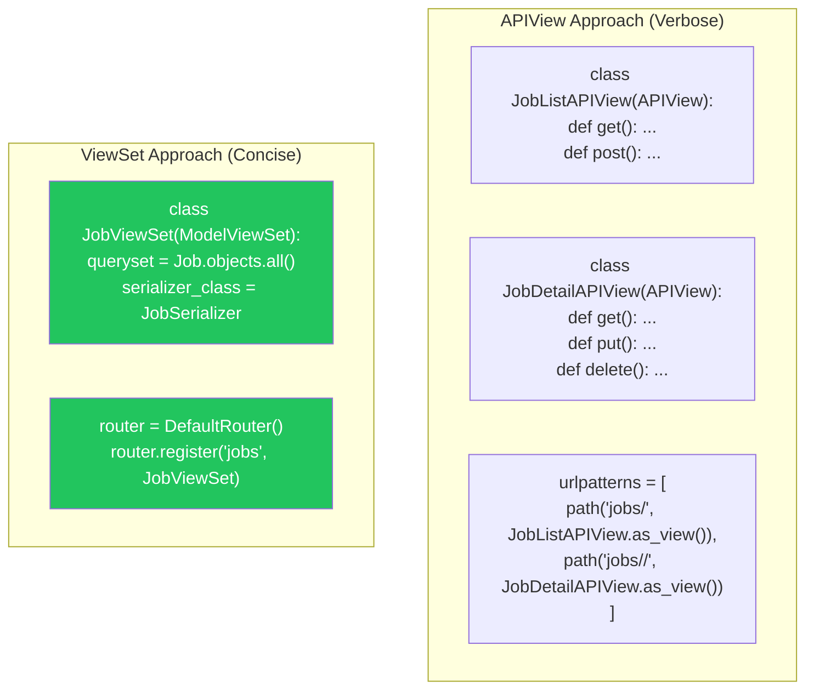
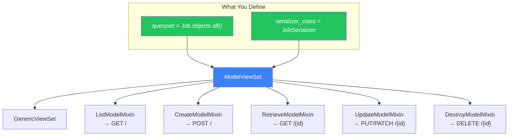
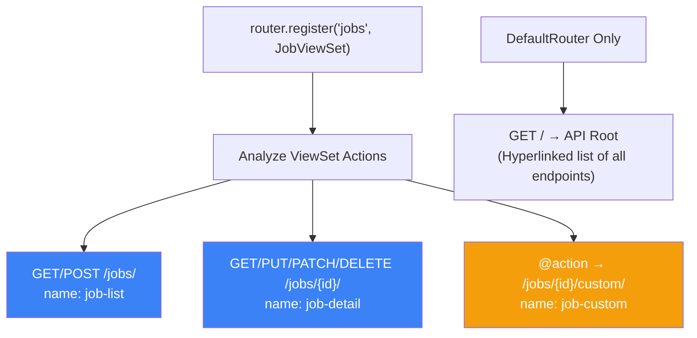
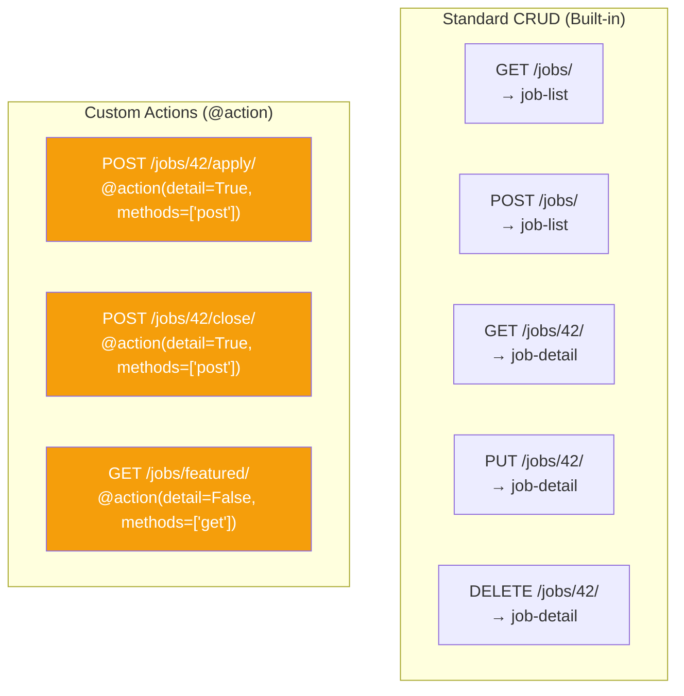
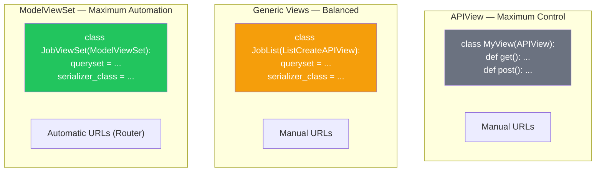

# الفصل الثالث عشر — DRF ViewSets والـ Routers: بناء CRUD كامل في ٥ أسطر

> **المتطلبات:** [[12-DRF-Serializers-Deep-Dive]] — لازم تكون فاهم إزاي تبني Serializers محترفة، وفاهم الفرق بين القراءة والكتابة في الـ Nested Relationships، وعارف إزاي تتعامل مع الـ Validation. الفصل ده هيبني فوقهم عشان يوريك إزاي تقلل كود الـ Views من ١٠٠ سطر لـ ١٠ أسطر باستخدام ViewSets والـ Routers.

---

## البداية — مشكلة تكرار الكود في الـ Views

تخيّل معايا إنك بنيت API للـ Jobs في HireLink. عايز تعمل endpoints للعمليات الأساسية:

- `GET /api/jobs/` — list كل الـ jobs.
- `POST /api/jobs/` — create job جديدة.
- `GET /api/jobs/42/` — retrieve job واحدة.
- `PUT /api/jobs/42/` — update job.
- `PATCH /api/jobs/42/` — partial update.
- `DELETE /api/jobs/42/` — delete job.

لو استخدمت `APIView` أو `@api_view`، هتضطر تكتب **كل** method يدوياً. ٦ methods × ٥ أسطر لكل واحد = ٣٠ سطر كود. ومعظمهم متكرر — `get_object()`, `get_queryset()`, `serializer.save()`. وده لمجرد Model واحد! لو عندك ١٠ Models، هتكتب ٣٠٠ سطر كود مكرر.

الحل: **ViewSets** و **Routers**. دول بيخلوك تبني CRUD كامل لـ Model في **٥ أسطر فقط**. إزاي؟ ViewSet هو class واحد بيجمع كل الـ actions (list, create, retrieve, update, destroy) في مكان واحد. وRouter هو اللي بيولد الـ URL patterns تلقائياً.

الفصل ده هيعلمك إزاي تنتقل من "كتابة كل حاجة" لـ "تحديد الخصائص بس".

---

## [[01-ViewSet-Basics]] — الـ ViewSet: الـ View اللي بتفهم REST

### 🧠 الشرح النظري

الـ ViewSet هو مجرد Class بيعمل inherit من `ViewSet` أو `GenericViewSet`. الفكرة إنك بدل ما تكتب class منفصل لكل HTTP method (`JobList`, `JobDetail`, `JobCreate`)، بتجمع كل الـ methods المرتبطة بـ resource واحد في class واحد.

**الفرق بين ViewSet و APIView:**
- **APIView:** بتكتب method لكل HTTP verb (`def get(self, request)`, `def post(self, request)`). انت مسؤول عن كل حاجة — جلب الـ queryset، الـ serialization، الـ response.
- **ViewSet:** بتكتب methods للـ **actions** (`def list(self, request)`, `def create(self, request)`, `def retrieve(self, request, pk)`). الـ ViewSet بيربط الـ actions دي بالـ HTTP methods تلقائياً.

**ليه ده أحسن؟**
1. **أقل كود:** كل الـ CRUD logic في مكان واحد.
2. **URLs تلقائية:** مع Router، الـ URLs بتتولد تلقائياً — مش محتاج تكتب `urlpatterns` يدوياً.
3. **Reusability:** تقدر تعمل inherit من `ModelViewSet` وتاخد كل الـ actions جاهزة. بس تغير `queryset` و `serializer_class`.
4. **Consistency:** كل الـ endpoints لنفس الـ resource بيتبعوا نفس الـ naming convention (`{basename}-list`, `{basename}-detail`).

تخيّل الـ ViewSet زي **جهاز الريموت كنترول**:
- **APIView:** إنك تقوم من مكانك وتضغط الزراير في التلفزيون manually. كل زرار له وظيفة منفصلة ومكان منفصل.
- **ViewSet:** الريموت كنترول — كل الأزرار في جهاز واحد. زرار `list` بيجيب القائمة، زرار `retrieve` بيجيب التفاصيل. والـ Router هو "البطاريات" اللي بتخلي الريموت يشتغل من غير أسلاك.

### 📊 Visualization



### 💻 Micro-Example

```python
# Approach 1: APIView — Manual everything (30+ lines)
from rest_framework.views import APIView
from rest_framework.response import Response

class JobListAPIView(APIView):
    def get(self, request):
        jobs = Job.objects.all()
        serializer = JobSerializer(jobs, many=True)
        return Response(serializer.data)
    
    def post(self, request):
        serializer = JobSerializer(data=request.data)
        if serializer.is_valid():
            serializer.save()
            return Response(serializer.data, status=201)
        return Response(serializer.errors, status=400)

class JobDetailAPIView(APIView):
    def get_object(self, pk):
        return get_object_or_404(Job, pk=pk)
    
    def get(self, request, pk):
        job = self.get_object(pk)
        serializer = JobSerializer(job)
        return Response(serializer.data)
    # ... put, patch, delete ...

# Approach 2: ViewSet — Automatic CRUD (5 lines)
from rest_framework.viewsets import ModelViewSet

class JobViewSet(ModelViewSet):
    queryset = Job.objects.all()
    serializer_class = JobSerializer
    # That's it! list, create, retrieve, update, partial_update, destroy are all included.
```

---

## [[02-ModelViewSet-Internals]] — الـ ModelViewSet: تشريح الـ Actions الجاهزة

### 🧠 الشرح النظري

الـ `ModelViewSet` هو الـ "سوبر هيرو" بتاع DRF. بيديك ٦ actions جاهزة من غير ما تكتب سطر كود واحد. إزاي بيحصل ده؟ عن طريق الـ **Mixins** والـ **Inheritance**.

**شجرة الوراثة لـ ModelViewSet:**
```
ModelViewSet
    ├── GenericViewSet (base class for generic views)
    ├── ListModelMixin (provides .list())
    ├── CreateModelMixin (provides .create())
    ├── RetrieveModelMixin (provides .retrieve())
    ├── UpdateModelMixin (provides .update() and .partial_update())
    └── DestroyModelMixin (provides .destroy())
```

كل Mixin بيضيف action واحد (أو اتنين) جاهز. الـ `ListModelMixin` عنده method `list(self, request)` اللي بتجيب الـ queryset وتسلمه للـ serializer. الـ `CreateModelMixin` عنده `create(self, request)` اللي بتاخد data وتعمل save.

**الـ Actions الـ ٦ الجاهزة:**
1. **`list()`** — GET `/jobs/` — ترجع list من الـ objects.
2. **`create()`** — POST `/jobs/` — تعمل object جديد.
3. **`retrieve()`** — GET `/jobs/42/` — ترجع object واحد.
4. **`update()`** — PUT `/jobs/42/` — تعدل object بالكامل.
5. **`partial_update()`** — PATCH `/jobs/42/` — تعدل جزء من الـ object.
6. **`destroy()`** — DELETE `/jobs/42/` — تحذف object.

**إنت بتعمل إيه كـ Developer؟**
1. تحدد `queryset` (منين تجيب البيانات).
2. تحدد `serializer_class` (إزاي تحول البيانات).
3. (اختياري) تضيف `permission_classes`, `authentication_classes`, `throttle_classes`.
4. (اختياري) تـ override أي action عشان تغير سلوكه.

تخيّل `ModelViewSet` زي **مطعم وجبات سريعة متكامل**:
- **الـ Mixins:** هم محطات التجهيز — واحدة للقائمة (List)، واحدة للطلب (Create)، واحدة للتوصيل (Retrieve)، وهكذا.
- **الـ `queryset`:** هو المخزون في المطبخ (الـ database).
- **الـ `serializer_class`:** هو الشيف — بيعرف إزاي يحول الطلب الخام (JSON) لوجبة جاهزة (Model).
- **إنت:** مدير المطعم — بتقول للشيف "استخدم المخزون ده" و "الوصفة دي". كل حاجة تانية جاهزة.

### 📊 Visualization



### 💻 Micro-Example

```python
from rest_framework.viewsets import ModelViewSet
from rest_framework.permissions import IsAuthenticatedOrReadOnly
from .models import Job
from .serializers import JobSerializer

class JobViewSet(ModelViewSet):
    # Define the data source
    queryset = Job.objects.all().select_related('client').prefetch_related('skills')
    
    # Define the serializer
    serializer_class = JobSerializer
    
    # Add permissions
    permission_classes = [IsAuthenticatedOrReadOnly]
    
    # Override default queryset behavior (optional)
    def get_queryset(self):
        # Filter: only show open jobs for anonymous users
        queryset = super().get_queryset()
        if not self.request.user.is_authenticated:
            queryset = queryset.filter(status='open')
        return queryset
    
    # Override create to set client automatically
    def perform_create(self, serializer):
        # perform_create is called inside CreateModelMixin.create()
        serializer.save(client=self.request.user)
```

---

## [[03-Routers-Automatic-URLs]] — الـ Routers: مولد الـ URLs التلقائي

### 🧠 الشرح النظري

في Django العادية، لازم تكتب `path('jobs/', JobList.as_view())` لكل endpoint. مع ViewSets، الـ Router هو اللي بيكتب الـ URLs دي نيابة عنك.

**إزاي بيشتغل الـ Router؟**
1. بتسجل الـ ViewSet مع Router: `router.register('jobs', JobViewSet, basename='job')`.
2. الـ Router بيبص على الـ actions اللي في الـ ViewSet (list, create, retrieve, update, partial_update, destroy).
3. بيولد URLs تلقائياً:
   - `jobs/` → name: `job-list` (GET, POST)
   - `jobs/{pk}/` → name: `job-detail` (GET, PUT, PATCH, DELETE)

**أنواع الـ Routers:**
- **`SimpleRouter`:** بيولد الـ URLs الأساسية بس (list و detail). مفيش API root view.
- **`DefaultRouter`:** نفس `SimpleRouter` + بيضيف API root view (`/api/`) بترجع links لكل الـ endpoints المسجلة. ده اللي بتستخدمه في ٩٥٪ من الحالات.

**الـ Basename:**
لما تسجل ViewSet، الـ Router بيحاول يخمن `basename` من الـ `queryset` (`JobViewSet` → `basename='job'`). الـ basename ده بيستخدم في تسمية الـ URL patterns (`job-list`, `job-detail`). لو الـ ViewSet معندهوش `queryset`، لازم تحدد `basename` manually.

تخيّل الـ Router زي **GPS أوتوماتيكي**:
- **الطريقة القديمة:** إنك تمسك خريطة ورقية وتخطط الطريق بنفسك (كتابة `path()` يدوياً). بطيء ومعرض للخطأ.
- **الـ Router:** GPS — بتديله العنوان (`jobs/`) وهو يرسملك الطريق (URL patterns) تلقائياً. ولو حبيت تزود endpoints تانية (`@action`)، هو يضبط الطريق تلقائياً.

### 📊 Visualization



### 💻 Micro-Example

```python
# urls.py
from rest_framework.routers import DefaultRouter
from .views import JobViewSet, ApplicationViewSet

router = DefaultRouter()
router.register('jobs', JobViewSet, basename='job')            # /api/jobs/
router.register('applications', ApplicationViewSet, basename='application') # /api/applications/

urlpatterns = [
    path('api/', include(router.urls)),  # All ViewSet URLs under /api/
    # The router automatically generates:
    # GET /api/                    -> API Root
    # GET /api/jobs/               -> job-list
    # POST /api/jobs/              -> job-list (create)
    # GET /api/jobs/42/            -> job-detail
    # PUT /api/jobs/42/            -> job-detail (update)
    # PATCH /api/jobs/42/          -> job-detail (partial_update)
    # DELETE /api/jobs/42/         -> job-detail (destroy)
]

# What the router generates behind the scenes:
# urlpatterns = [
#     path('jobs/', JobViewSet.as_view({'get': 'list', 'post': 'create'}), name='job-list'),
#     path('jobs/<int:pk>/', JobViewSet.as_view({'get': 'retrieve', 'put': 'update', 
#                                                'patch': 'partial_update', 'delete': 'destroy'}), 
#          name='job-detail'),
# ]
```

---

## [[04-Action-Decorator]] — الـ `@action`: Custom Endpoints فوق الـ CRUD

### 🧠 الشرح النظري

الـ CRUD الأساسي مش دايمًا كافي. أحياناً محتاج endpoints مخصصة لعمليات معينة. مثال:
- `POST /jobs/42/apply/` — يتقدم للـ job دي.
- `POST /jobs/42/close/` — يقفل الـ job.
- `GET /jobs/featured/` — يرجع الـ jobs المميزة بس.

الحل: **`@action` Decorator**.

الـ `@action` بيسمحلك تضيف methods مخصصة للـ ViewSet. الـ method دي هتبقى action جديد ليه URL خاص بيه. بتحدد:
- **`methods`:** الـ HTTP methods المسموحة (زي `['post']` أو `['get']`).
- **`detail`:** هل الـ action ده على instance واحدة (`detail=True`) ولا على الـ list كلها (`detail=False`).
- **`url_path`:** (اختياري) الجزء الأخير من الـ URL. لو محطتهوش، بيستخدم اسم الـ method.

**الـ URL اللي بيتولد:**
- `detail=True`: `/jobs/{pk}/<action_name>/`. مثال: `/jobs/42/apply/`.
- `detail=False`: `/jobs/<action_name>/`. مثال: `/jobs/featured/`.

**ليه ده أحسن من كتابة View منفصلة؟**
1. **كل حاجة في مكان واحد:** الـ logic بتاع الـ Job كله في `JobViewSet`.
2. **URLs تلقائية:** الـ Router بيضيف الـ URL تلقائياً (مش محتاج تعدل `urls.py`).
3. **Reusability:** الـ action بيستخدم نفس الـ `serializer_class` و `permission_classes` (إلا لو غيرتهم).

تخيّل `@action` زي **زرار إضافي في الريموت كنترول**:
- **الأزرار الأساسية:** (list, retrieve, create, update, delete) — اللي بتيجي مع الـ ModelViewSet.
- **زرار `apply`:** انت برمجته بنفسك. ضغطة واحدة تعمل "تقديم على الوظيفة".
- **زرار `featured`:** بيجيبلك القائمة المميزة بس.

### 📊 Visualization



### 💻 Micro-Example

```python
from rest_framework.viewsets import ModelViewSet
from rest_framework.decorators import action
from rest_framework.response import Response
from rest_framework import status

class JobViewSet(ModelViewSet):
    queryset = Job.objects.all()
    serializer_class = JobSerializer
    
    # Detail action — operates on a single job instance
    # URL: POST /jobs/{pk}/apply/
    @action(detail=True, methods=['post'], permission_classes=[IsAuthenticated])
    def apply(self, request, pk=None):
        job = self.get_object()  # Get the specific job instance
        
        # Check if already applied
        if job.applications.filter(freelancer=request.user).exists():
            return Response(
                {'error': 'You already applied to this job'},
                status=status.HTTP_400_BAD_REQUEST
            )
        
        # Create application
        application = job.applications.create(
            freelancer=request.user,
            status='pending'
        )
        
        serializer = ApplicationSerializer(application)
        return Response(serializer.data, status=status.HTTP_201_CREATED)
    
    # Detail action — close a job (only by client)
    # URL: POST /jobs/{pk}/close/
    @action(detail=True, methods=['post'], permission_classes=[IsAuthenticated])
    def close(self, request, pk=None):
        job = self.get_object()
        
        if job.client != request.user:
            return Response(
                {'error': 'Only the client can close this job'},
                status=status.HTTP_403_FORBIDDEN
            )
        
        job.status = 'closed'
        job.save()
        
        return Response({'status': 'Job closed successfully'})
    
    # List action — returns featured jobs only
    # URL: GET /jobs/featured/
    @action(detail=False, methods=['get'])
    def featured(self, request):
        featured_jobs = self.get_queryset().filter(is_featured=True)[:10]
        serializer = self.get_serializer(featured_jobs, many=True)
        return Response(serializer.data)
    
    # Action with custom URL path and multiple methods
    # URL: GET /jobs/my-jobs/, POST /jobs/my-jobs/
    @action(detail=False, methods=['get', 'post'], url_path='my-jobs')
    def my_jobs(self, request):
        if request.method == 'GET':
            jobs = self.get_queryset().filter(client=request.user)
            serializer = self.get_serializer(jobs, many=True)
            return Response(serializer.data)
        elif request.method == 'POST':
            # Custom create logic for client's own jobs
            pass
```

---

## [[05-Generic-Views-vs-ViewSets]] — امتى تستخدم ViewSet وامتى تستخدم Generic View؟

### 🧠 الشرح النظري

DRF بتقدملك ٣ طرق لبناء Views. اختيار الطريقة المناسبة بيفرق في سرعة التطوير ومرونة الكود.

**الطريقة 1: `APIView` / `@api_view`**
- **المميزات:** تحكم كامل. كل سطر انت كاتبه — مفيش "سحر". مناسب للـ endpoints المعقدة اللي مش بتتبع نمط CRUD (زي dashboard يجمع بيانات من كذا model).
- **العيوب:** كتير كود (boilerplate). كل method بتكتبها من الصفر.
- **امتى تستخدمها:** Endpoints مخصصة جداً، منطق معقد مش مرتبط بـ Model واحد.

**الطريقة 2: `GenericAPIView` + Mixins (`ListCreateAPIView`, `RetrieveUpdateDestroyAPIView`)**
- **المميزات:** أقل كود من `APIView`، لكن لسه واضح وصريح. بتحدد `queryset` و `serializer_class` والباقي جاهز.
- **العيوب:** لسه محتاج View منفصل للـ list/create و View تانية للـ detail. محتاج تكتب URLs يدوياً.
- **امتى تستخدمها:** عايز وضوح أكتر من ViewSet، أو محتاج تخصص سلوك معين (زي disable DELETE method).

**الطريقة 3: `ModelViewSet` + `Router`**
- **المميزات:** أقل كود ممكن. CRUD كامل في ٥ أسطر. URLs تلقائية. `@action` للـ endpoints المخصصة.
- **العيوب:** ممكن يبقى "سحري" زيادة للمبتدئين. الـ flow مش واضح دايمًا (المethods بتتنادى من الـ Router مش منك).
- **امتى تستخدمها:** أي resource بيعمل CRUD قياسي (Job, Application, User). ٩٠٪ من الـ APIs.

**القاعدة الذهبية (من Django REST Framework docs):**
1. ابدأ بـ `ModelViewSet` دايمًا. هو الأسرع والأقل أخطاء.
2. لو الـ endpoint مش CRUD (زي `/dashboard/` أو `/search/`)، استخدم `APIView`.
3. لو عايز تعطل بعض الـ actions (زي متسمحش بـ DELETE)، استخدم `ModelViewSet` بس امسح الـ method أو استخدم `GenericAPIView`.

تخيّل الفرق بينهم زي **أنواع السيارات**:
- **APIView:** عربية manual — انت بتتحكم في كل حاجة (الدبرياج، الفتيس). ممتعة للمحترفين، لكن متعبة في الزحمة.
- **Generic Views:** عربية automatic — أسهل، بس لسه بتسوق بنفسك.
- **ModelViewSet:** عربية ذاتية القيادة — بتقولها "عايز أروح هناك" (تسجل الـ ViewSet) وهي توصلك. أسرع وأسهل، لكن لو حصلت مشكلة، محتاج تفهم إزاي شغالة عشان تصلحها.

### 📊 Visualization



### 💻 Micro-Example

```python
# Approach 1: Generic Views — More explicit than ViewSet
from rest_framework.generics import ListCreateAPIView, RetrieveUpdateDestroyAPIView

class JobListCreateView(ListCreateAPIView):
    queryset = Job.objects.all()
    serializer_class = JobSerializer
    
    def perform_create(self, serializer):
        serializer.save(client=self.request.user)

class JobDetailView(RetrieveUpdateDestroyAPIView):
    queryset = Job.objects.all()
    serializer_class = JobSerializer

# urls.py (manual)
urlpatterns = [
    path('jobs/', JobListCreateView.as_view(), name='job-list'),
    path('jobs/<int:pk>/', JobDetailView.as_view(), name='job-detail'),
]

# Approach 2: ViewSet — More concise, same functionality
from rest_framework.viewsets import ModelViewSet

class JobViewSet(ModelViewSet):
    queryset = Job.objects.all()
    serializer_class = JobSerializer
    
    def perform_create(self, serializer):
        serializer.save(client=self.request.user)

# urls.py (automatic with router)
router = DefaultRouter()
router.register('jobs', JobViewSet)

# The ViewSet approach gives you the same endpoints + automatic @action support
```

---

## 🎯 أسئلة الإنترفيو

**س: إيه هو الـ ViewSet في DRF؟ وإيه الفرق بينه وبين APIView؟**

> الـ **ViewSet** هو تجميع لـ actions (list, create, retrieve, update, destroy) في class واحد، بدل ما تكتب class منفصل لكل endpoint. الـ **APIView** هو class منخفض المستوى (low-level) بتتحكم في كل method بنفسك.<br/><br/>
> 
> **الفرق الجوهري:**
> - **APIView:** بتكتب methods للـ HTTP verbs (`get()`, `post()`, `put()`). انت مسؤول عن كل حاجة — جلب الـ queryset، الـ serialization، الـ response. مناسب للـ endpoints المعقدة أو غير القياسية (زي dashboard أو search).
> - **ViewSet:** بتكتب methods للـ **actions** (`list()`, `create()`, `retrieve()`). الـ ViewSet بيربط الـ actions دي بالـ HTTP methods تلقائياً. مناسب للـ resources اللي بتعمل CRUD قياسي (زي Job, User, Application).<br/><br/>
> 
> **المميزات بتاعة ViewSet:**
> 1. **أقل كود:** `ModelViewSet` بيدي CRUD كامل في ٥ أسطر.
> 2. **URLs تلقائية:** مع Router، الـ URLs بتتولد تلقائياً — مش محتاج تكتب `urlpatterns` يدوياً.
> 3. **Reusability:** كل الـ logic بتاع resource واحد في مكان واحد.
> 4. **Custom Actions:** `@action` decorator بيسمحلك تضيف endpoints مخصصة بسهولة.<br/><br/>
> 
> **امتى تستخدم إيه؟**
> - **APIView:** Endpoints غير قياسية (زي `/dashboard/` أو `/analytics/`)، أو لو عايز تحكم كامل في كل تفصيلة.
> - **ViewSet:** أي resource بيعمل CRUD (٩٠٪ من الـ APIs). ابدأ بـ ViewSet دايمًا — وفر وقتك.

---

**س: إزاي بيشتغل الـ ModelViewSet من الداخل؟ اشرحلي الـ Mixins.**

> الـ **ModelViewSet** بيجمع بين **GenericViewSet** (الأساس) و **خمسة Mixins** — كل Mixin بيضيف action واحد جاهز.<br/><br/>
> 
> **شجرة الوراثة:**
> ```
> ModelViewSet
>     ├── GenericViewSet (base class with generic behavior)
>     ├── ListModelMixin → .list() → GET /resource/
>     ├── CreateModelMixin → .create() → POST /resource/
>     ├── RetrieveModelMixin → .retrieve() → GET /resource/{id}/
>     ├── UpdateModelMixin → .update() + .partial_update() → PUT/PATCH /resource/{id}/
>     └── DestroyModelMixin → .destroy() → DELETE /resource/{id}/
> ```
> 
> **إزاي كل Mixin بيشتغل؟**
> - **ListModelMixin:** `def list(self, request): queryset = self.get_queryset(); serializer = self.get_serializer(queryset, many=True); return Response(serializer.data)`.
> - **CreateModelMixin:** `def create(self, request): serializer = self.get_serializer(data=request.data); serializer.is_valid(raise_exception=True); self.perform_create(serializer); return Response(serializer.data, status=201)`.
> - **RetrieveModelMixin:** `def retrieve(self, request, pk=None): instance = self.get_object(); serializer = self.get_serializer(instance); return Response(serializer.data)`.
> - **UpdateModelMixin:** `def update(self, request, pk=None): instance = self.get_object(); serializer = self.get_serializer(instance, data=request.data); ... self.perform_update(serializer)`.
> - **DestroyModelMixin:** `def destroy(self, request, pk=None): instance = self.get_object(); self.perform_destroy(instance); return Response(status=204)`.<br/><br/>
> 
> **إنت كمطور بتعمل إيه؟**
> 1. بتحدد `queryset` و `serializer_class`.
> 2. (اختياري) بتـ override `perform_create()` أو `perform_update()` عشان تضيف behavior (زي `serializer.save(client=request.user)`).
> 3. (اختياري) بتـ override `get_queryset()` عشان تfilter البيانات بناءً على الـ user.
> 
> **الخلاصة:** الـ Mixins هم "قوالب جاهزة" للـ actions. `ModelViewSet` بيدمجهم كله في class واحد. لو عايز ViewSet بـ actions محددة بس (زي List و Create بس)، استخدم `GenericViewSet` مع الـ Mixins اللي انت عايزها manually.

---

**س: إيه هو الـ Router في DRF؟ وإزاي بيولد الـ URLs تلقائياً؟**

> الـ **Router** هو component في DRF بيولد الـ URL patterns تلقائياً من ViewSet. بدل ما تكتب `path()` لكل action، الـ Router بيعمل ده نيابة عنك.<br/><br/>
> 
> **إزاي بيشتغل؟**
> 1. بتسجل ViewSet مع Router: `router.register('jobs', JobViewSet, basename='job')`.
> 2. الـ Router بيحلل الـ ViewSet — يشوف الـ actions الموجودة (list, create, retrieve, update, partial_update, destroy).
> 3. لكل action، بيولد URL pattern مناسب:
>    - Actions بدون `pk` (list, create) → `/jobs/`
>    - Actions بـ `pk` (retrieve, update, destroy) → `/jobs/{pk}/`
>    - Custom `@action` → `/jobs/{pk}/<action_name>/` (detail=True) أو `/jobs/<action_name>/` (detail=False).
> 4. بيسمي كل pattern باستخدام الـ `basename`:
>    - `/jobs/` → `job-list`
>    - `/jobs/{pk}/` → `job-detail`
>    - `/jobs/{pk}/apply/` → `job-apply`<br/><br/>
> 
> **أنواع الـ Routers:**
> - **SimpleRouter:** بيولد الـ URLs الأساسية بس (list و detail). مفيش API root view.
> - **DefaultRouter:** نفس SimpleRouter + بيضيف API root view (`/api/`) بترجع links لكل الـ endpoints المسجلة. ده الـ default اللي بتستخدمه في معظم المشاريع.<br/><br/>
> 
> **الـ Basename:**
> الـ Router بيحاول يخمن الـ `basename` من الـ `queryset` بتاع الـ ViewSet (`JobViewSet.queryset.model` → `job`). لو الـ ViewSet معندهوش `queryset` (زي لما بتستخدم `get_queryset()` method)، لازم تحدد `basename` manually عشان الـ URL names تبقى صحيحة.<br/><br/>
> 
> **مثال على الـ URL patterns اللي بيتولدوا:**
> ```python
> router = DefaultRouter()
> router.register('jobs', JobViewSet)
> 
> # Generated URLs:
> # GET  /api/jobs/           → job-list (list)
> # POST /api/jobs/           → job-list (create)
> # GET  /api/jobs/42/        → job-detail (retrieve)
> # PUT  /api/jobs/42/        → job-detail (update)
> # PATCH /api/jobs/42/       → job-detail (partial_update)
> # DELETE /api/jobs/42/      → job-detail (destroy)
> ```

---

**س: إيه هو الـ `@action` decorator؟ وامتى تستخدمه؟**

> الـ **`@action`** decorator بيسمحلك تضيف **endpoints مخصصة** للـ ViewSet فوق الـ CRUD الأساسي. الـ method اللي بتزخرفها بتبقى action جديد ليه URL خاص بيه.<br/><br/>
> 
> **Parameters بتاعة `@action`:**
> - **`methods`:** List من الـ HTTP methods المسموحة (زي `['post']` أو `['get']`).
> - **`detail`:** Boolean. هل الـ action على instance واحدة (`True`) ولا على الـ list كلها (`False`).
>   - `detail=True` → URL: `/resource/{pk}/<action_name>/` (مثال: `/jobs/42/apply/`).
>   - `detail=False` → URL: `/resource/<action_name>/` (مثال: `/jobs/featured/`).
> - **`url_path`:** (اختياري) الجزء الأخير من الـ URL. لو محطتهوش، بيستخدم اسم الـ method.
> - **`permission_classes`:** (اختياري) Permissions خاصة بالـ action ده.<br/><br/>
> 
> **امتى تستخدمه؟**
> 1. **عمليات على instance معينة:** `apply` (تقديم على Job)، `close` (إغلاق Job)، `approve` (موافقة على Application). دي `detail=True`.
> 2. **عمليات على الـ list كلها:** `featured` (Jobs مميزة)، `my-jobs` (Jobs بتاعة الـ user الحالي)، `search` (بحث). دي `detail=False`.
> 3. **عمليات بتغير state:** `activate`, `deactivate`, `publish`, `archive` — أي حاجة مش مجرد CRUD.<br/><br/>
> 
> **ليه ده أحسن من كتابة View منفصلة؟**
> - **كل حاجة في مكان واحد:** الـ logic بتاع الـ Job كله في `JobViewSet`. سهل تلاقيه وتعدل عليه.
> - **URLs تلقائية:** الـ Router بيضيف الـ URL تلقائياً — مش محتاج تعدل `urls.py`.
> - **Reusability:** الـ action بيستخدم نفس الـ `serializer_class` و `permission_classes` بتوع الـ ViewSet (إلا لو غيرتهم).<br/><br/>
> 
> **مثال على `@action`:**
> ```python
> @action(detail=True, methods=['post'])
> def apply(self, request, pk=None):
>     job = self.get_object()
>     application = job.applications.create(freelancer=request.user)
>     return Response(ApplicationSerializer(application).data, status=201)
> ```
> الـ URL اللي بيتولد: `POST /jobs/42/apply/`.

---

**س: امتى تستخدم ViewSet وامتى تستخدم GenericAPIView؟**

> القرار بيعتمد على **مدى تعقيد الـ API** و **مدى حبك للـ explicit code**.<br/><br/>
> 
> **استخدم ModelViewSet + Router لما:**
> 1. الـ resource بتاعك بيعمل **CRUD قياسي** (Job, User, Application, Comment). ده ٩٠٪ من الحالات.
> 2. عايز **أقل كود ممكن** — ٥ أسطر للـ CRUD كله.
> 3. عايز **URLs تلقائية** من غير ما تكتب `urlpatterns` يدوياً.
> 4. محتاج تضيف **custom actions** (`@action`) لعمليات زي `apply`, `close`, `featured`.
> 5. عايز تستفيد من الـ **Browsable API** بشكل كامل (الـ Router بيضيف API Root).<br/><br/>
> 
> **استخدم GenericAPIView + Mixins لما:**
> 6. عايز **وضوح أكتر** — كل View ليها URL محدد في `urls.py`. مناسب للـ developers الجدد على DRF.
> 7. محتاج **تخصص سلوك** أكتر من اللي `ModelViewSet` بتقدمه (زي disable method معينة).
> 8. عايز **Views منفصلة** لنفس الـ resource (زي `JobListCreateView` و `JobDetailView`) — بعض الناس بيفضلوا الفصل ده.
> 9. الـ endpoints بتاعتك **مش متطابقة** مع الـ CRUD (زي `/jobs/{id}/analytics/` — ممكن `@action` يعملها برضه).<br/><br/>
> 
> **استخدم APIView / @api_view لما:**
> 10. الـ endpoint **مش مرتبط بـ Model واحد** (زي `/dashboard/` أو `/search/`).
> 11. الـ logic **معقد جداً** ومش بينفع يتوصف في `queryset` و `serializer_class` بس.
> 12. عايز **تحكم كامل** في كل تفصيلة — الـ request parsing، الـ response rendering، الـ error handling.<br/><br/>
> 
> **القاعدة الذهبية (من الـ DRF Documentation):**
> - ابدأ بـ **ModelViewSet** دايمًا. لو لقيت نفسك بتصارع الـ framework، ارجع لـ **GenericAPIView**.
> - استخدم **APIView** للـ endpoints غير القياسية (dashboard, analytics, webhooks).
> - متخليش "الخوف من السحر" يمنعك من استخدام ViewSets. فهم إزاي شغالة (زي ما شرحنا في السؤال التاني) هو الحل.

---

## 📝 خلاصة الدرس

- **ViewSet:** تجميع للـ actions (list, create, retrieve, update, destroy) في class واحد. بيقلل الكود وبيخلي الـ URLs تلقائية مع Router.
- **ModelViewSet:** بيجمع ٥ Mixins جاهزة للـ CRUD. كل اللي عليك تحدد `queryset` و `serializer_class`.
- **الـ Mixins:** `ListModelMixin`, `CreateModelMixin`, `RetrieveModelMixin`, `UpdateModelMixin`, `DestroyModelMixin`. كل واحد بيضيف action جاهز. تقدر تدمجهم مع `GenericViewSet` عشان تعمل ViewSet مخصص.
- **Router:** بيولد URL patterns تلقائياً من ViewSet. `DefaultRouter` بيضيف API root view. `SimpleRouter` بيولد الـ URLs الأساسية بس.
- **`@action` Decorator:** بيضيف endpoints مخصصة للـ ViewSet. `detail=True` للـ instance actions (زي `/jobs/42/apply/`). `detail=False` للـ list actions (زي `/jobs/featured/`).
- **اختيار الطريقة:** ModelViewSet + Router لـ ٩٠٪ من الحالات (CRUD). GenericAPIView لو عايز وضوح أكتر. APIView للـ endpoints المعقدة أو غير القياسية.

---

*Next → [[14-DRF-Authentication-And-JWT]] — عرفنا إزاي نبني API محترف بـ ViewSets. دلوقتي هنتعمق في تأمين الـ API: إزاي نستخدم JWT للـ Authentication؟ إيه الفرق بين Access Token و Refresh Token؟ وإزاي نخصص الـ Token Claims عشان تضيف بيانات extra؟*