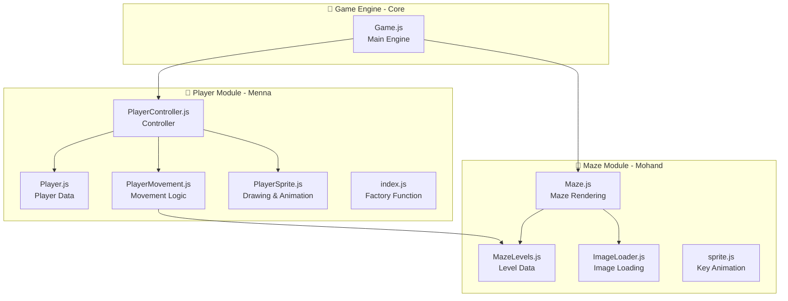
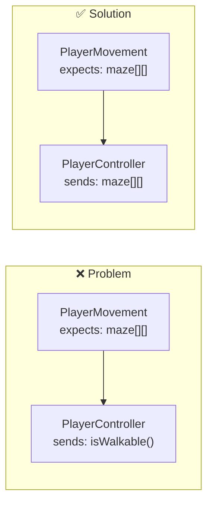
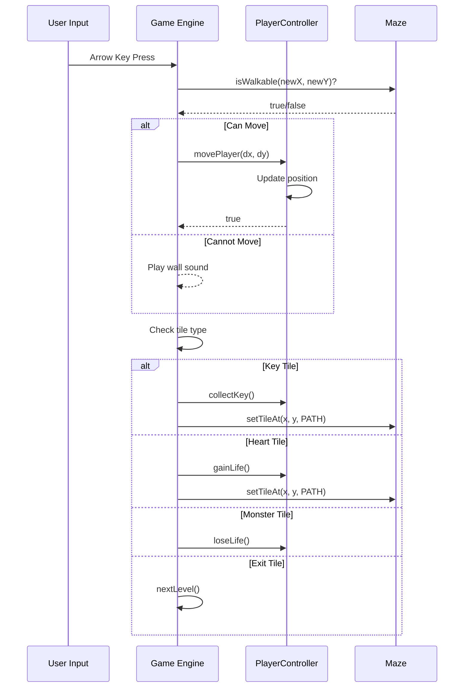

# 🎮 Mazer Project - Integration Guide

  

> Team Code Integration & Unified Naming Conventions

  

---

  

## 📊 Project Architecture Overview

  



  

---

  

## ⚠️ Current Compatibility Issues

  

### 1. Interface Mismatch

  



  

### 2. PlayerSprite Incompatibility

  

| File | Expected Constructor | Current Constructor |

| ----------------- | ----------------------------------------------- | ------------------- |

| `index.js` | `(image, frameWidth, frameHeight, totalFrames)` | — |

| `PlayerSprite.js` | — | `(image)` only |

  

---

  

## 📐 Unified Naming Conventions

  

### Tile Types

  

```javascript

// Use these values everywhere

const TILE = {

PATH: 0, // Walkable path

WALL: 1, // Blocks movement

HEART: 2, // Health collectible

KEY: 3, // Opens doors

MONSTER: 4, // Damages player

EXIT: 5, // Level exit/door

};

```

  

### Direction Values

  

```javascript

// Use these values for directions

const DIRECTION = {

UP: 0,

LEFT: 1,

DOWN: 2,

RIGHT: 3,

};

```

  

### Unified Size Constants

  

```javascript

// Shared size constants

const CONFIG = {

CELL_SIZE: 40, // Cell size in pixels (TILE_SIZE)

SPRITE_COLS: 9, // Player sprite sheet columns

SPRITE_ROWS: 4, // Player sprite sheet rows

ANIMATION_SPEED: 120, // Animation speed in ms

KEY_FRAMES: 4, // Key animation frames

KEY_STAGGER: 24, // Key animation delay

};

```

  

---

  

## 🔗 Required Interfaces

  

### Player Interface (What Game Engine needs from Player)

  

```javascript

const PlayerInterface = {

// Movement

movePlayer(dx, dy): boolean,

getPlayerPosition(): { x: number, y: number },

setPlayerPosition(x, y): void,

resetPlayerPosition(): void,

  

// Lives

loseLife(): void,

gainLife(): void,

getLivesCount(): number,

isPlayerAlive(): boolean,

  

// Rendering

update(deltaTime): void,

draw(ctx, cellSize, camera): void

};

```

  

### Maze Interface (What Game Engine needs from Maze)

  

```javascript

const MazeInterface = {

// Loading & Drawing

loadLevel(levelNumber): Promise<void>,

draw(ctx, camera): void,

  

// Queries

getMazeData(): number[][],

getTileAt(x, y): number,

isWalkable(x, y): boolean,

  

// Modifications

setTileAt(x, y, value): void,

getStartPosition(): { x: number, y: number },

getExitPosition(): { x: number, y: number }

};

```

  

---

  

## 🔄 Data Flow

  



  

---

  

## 📁 Recommended File Structure

  

```

js/

├── core/

│ ├── Game.js # Main Game Engine

│ ├── GameLoop.js # Game Loop

│ ├── InputHandler.js # Keyboard Input

│ └── constants.js # Shared Constants ⭐

│

├── player/

│ ├── Player.js # Player State

│ ├── PlayerMovement.js # Movement Logic

│ ├── PlayerSprite.js # Rendering & Animation

│ └── index.js # Factory + Exports

│

├── maze/

│ ├── Maze.js # Maze Class

│ ├── MazeLevels.js # Level Data

│ ├── MazeRenderer.js # Maze Drawing ⭐

│ ├── ImageLoader.js # Image Loading

│ └── index.js # Factory + Exports ⭐

│

└── utils/

├── Camera.js # Camera for large maps

└── collision.js # Collision Detection

```

  

---

  

## ✅ Required Changes Checklist

  

### Player Module (Menna)

  

- [ ] **PlayerSprite.js**: Add `export default` to class

- [ ] **PlayerSprite.js**: Fix constructor to accept correct parameters

- [ ] **PlayerSprite.js**: Fix `draw()` method signature

- [ ] **PlayerController.js**: Change `this.movement.move()` to `this.movement.movePlayer()`

- [ ] **PlayerController.js**: Pass `maze[][]` instead of `isWalkable` function

  

### Maze Module (Mohand)

  

- [ ] **Maze.js**: Convert to Class instead of separate functions

- [ ] **Maze.js**: Add `isWalkable(x, y)` method

- [ ] **Maze.js**: Add `getTileAt(x, y)` method

- [ ] **Maze.js**: Remove `document.getElementById` from inside the file

- [ ] Create **index.js** for exports

  

### Shared

  

- [ ] Create **constants.js** for shared constants

  

---

  

## 🎨 Integration Example

  

```javascript

// In Game.js - How to use modules together

  

import { createPlayer } from "./player/index.js";

import { createMaze } from "./maze/index.js";

import { TILE, CONFIG } from "./core/constants.js";

  

class Game {

async init() {

// Load maze

this.maze = await createMaze(1); // Level 1

  

// Create player

const startPos = this.maze.getStartPosition();

this.player = createPlayer({

startX: startPos.x,

startY: startPos.y,

lives: 3,

maze: this.maze.getMazeData(),

spriteImage: playerSprite,

});

}

  

update(deltaTime) {

this.player.update(deltaTime);

this.checkCollisions();

}

  

draw() {

this.maze.draw(this.ctx, this.camera);

this.player.draw(this.ctx, CONFIG.CELL_SIZE, this.camera);

}

  

handleInput(dx, dy) {

const { x, y } = this.player.getPlayerPosition();

const newX = x + dx;

const newY = y + dy;

  

if (this.maze.isWalkable(newX, newY)) {

this.player.movePlayer(dx, dy);

this.checkTileEffect(newX, newY);

}

}

  

checkTileEffect(x, y) {

const tile = this.maze.getTileAt(x, y);

  

switch (tile) {

case TILE.KEY:

this.player.collectKey();

this.maze.setTileAt(x, y, TILE.PATH);

break;

case TILE.HEART:

this.player.gainLife();

this.maze.setTileAt(x, y, TILE.PATH);

break;

case TILE.MONSTER:

this.player.loseLife();

break;

case TILE.EXIT:

this.nextLevel();

break;

}

}

}

```

  

---

  

## 📞 Team Responsibilities

  

| Responsibility | Person | Files |

| -------------- | ------ | ------------- |

| Player Logic | Menna | `js/player/*` |

| Maze & Levels | Mohand | `js/maze/*` |

| Game Engine | TBD | `js/core/*` |

| Integration | Team | This document |

  

---

  

> 💡 **Tip**: Before making any changes, review this document and follow the agreed-upon interfaces.