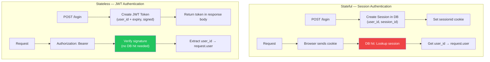
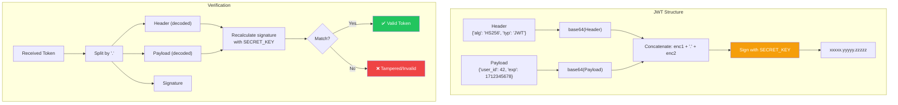
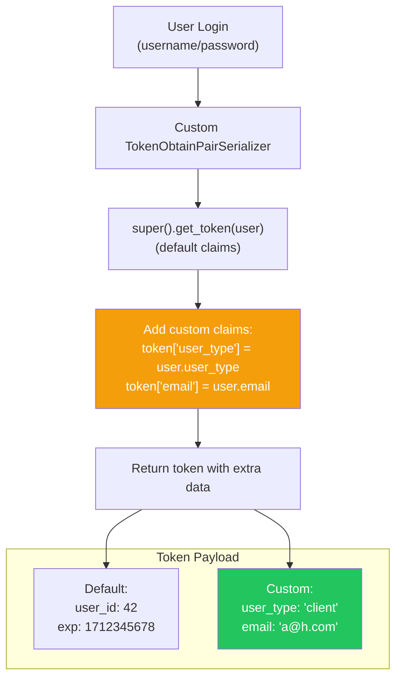
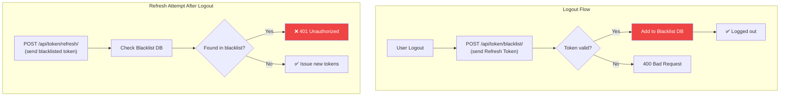

# الفصل الرابع عشر — DRF Authentication والـ JWT: تأمين الـ API بالمعايير الحديثة

> **المتطلبات:** [[13-DRF-ViewSets-And-Routers]] — لازم تكون فاهم إزاي تبني API كامل بـ ViewSets والـ Routers، وعارف إزاي تتعامل مع الـ Permissions الأساسية. الفصل ده هيبني فوقهم عشان يوريك إزاي تؤمن الـ API بتاعك باستخدام JWT (JSON Web Tokens) — المعيار الحديث للـ Authentication في الـ REST APIs.

---

## البداية — مشكلة الـ Stateless API

تخيّل معايا إنك بنيت HireLink API. الـ endpoints شغالة تمام. عايز تحميها — تخلي某些 endpoints متاحة بس للمستخدمين المسجلين. في Django العادية، كنت بتستخدم Session Authentication — الـ user بيسجل دخوله، الـ server بيعمل session في الـ database، ويرجع session cookie للمتصفح. كل request بعد كده، الـ browser بيبعت الـ cookie، والـ server بيجيب الـ session ويعرف المستخدم.

المشكلة: الـ Mobile App أو الـ React Frontend مش بيتعاملوا مع Cookies بشكل طبيعي. والأهم: الـ Session Authentication **Stateful** — الـ server محتاج يحتفظ بالـ sessions في الـ database أو Redis. ده بيخلي الـ scaling أصعب (كل request محتاجة database hit عشان تجيب الـ session). والأسوأ: لو الـ API بتاعك موزع على كذا server، لازم تعمل sticky sessions أو shared session storage.

الحل الحديث: **JWT (JSON Web Tokens)**. الـ JWT هو Token بيتكون من ٣ أجزاء (Header, Payload, Signature) وبيحتوي على معلومات المستخدم (زي `user_id` و `username`). الـ server بيوقع الـ token بمفتاح سري. أي server عنده المفتاح ده يقدر يتأكد من صحة الـ token — من غير ما يرجع للـ database. ده اسمه **Stateless Authentication**.

الفصل ده هيعلمك إزاي تدمج JWT مع DRF، إزاي تخصص الـ Token (تضيف بيانات extra)، وإزاي تتعامل مع Refresh Tokens عشان تحافظ على الأمان.

---

## [[01-Stateless-vs-Stateful]] — Stateless (JWT) vs Stateful (Session): معركة الفلسفات

### 🧠 الشرح النظري

في عالم الـ Web Authentication، في مدرستين أساسيتين: Stateful و Stateless. فهم الفرق بينهم هو المفتاح لاختيار النظام المناسب لمشروعك.

**Stateful Authentication (Django Sessions):**
- **إزاي بيشتغل:** المستخدم بيسجل دخوله. الـ server بيخلق Session ID (random string) ويخزنه في الـ database مع `user_id`. بيرجع الـ Session ID في Cookie. كل request بعد كده، الـ browser بيبعت الـ cookie، والـ server بيدور على الـ session في الـ database ويعرف المستخدم.
- **المميزات:**
  - **Logout فوري:** الـ server بيمسح الـ session من الـ database. المستخدم ينطرد فوراً.
  - **تحكم كامل:** تقدر تعدل أو تمسح أي session في أي وقت (زي "تسجيل الخروج من كل الأجهزة").
  - **بيانات حساسة أقل في الـ client:** الـ Session ID بس هو اللي في الـ cookie — مش محتاج تحط `user_id` أو أي حاجة تانية.
- **العيوب:**
  - **Database Hit لكل Request:** كل request محتاجة query عشان تجيب الـ session. ده بيأثر على الـ performance.
  - **Scaling أصعب:** لو عندك كذا server، لازم الـ sessions تكون متاحة للكل (sticky sessions أو shared Redis).
  - **مش مناسب للـ Mobile/SPA:** الـ Cookies مش دايمًا مدعومة أو سهلة في الـ mobile apps.

**Stateless Authentication (JWT):**
- **إزاي بيشتغل:** المستخدم بيسجل دخوله. الـ server بيخلق JWT Token (بيحتوي على `user_id` و `expiry`). بيرجعه في الـ response. الـ client يخزن الـ token (في localStorage أو memory). كل request بعد كده، الـ client بيبعت الـ token في `Authorization: Bearer <token>` header. الـ server بيفك تشفير الـ token (باستخدام secret key) ويعرف المستخدم — **من غير ما يرجع للـ database**.
- **المميزات:**
  - **Stateless:** مفيش database hit لكل request. أسرع.
  - **Scaling سهل:** أي server عنده الـ secret key يقدر يفحص الـ token. مفيش حاجة مشتركة بين الـ servers.
  - **مثالي للـ Microservices:** كل service تقدر تفحص الـ token بنفس المفتاح.
  - **Cross-Platform:** الـ token هو مجرد string — سهل يتخزن في mobile apps أو SPAs.
- **العيوب:**
  - **Logout أصعب:** الـ token صالح لحد ما ينتهي. لو عايز تعمل logout فوري، محتاج Blacklist (وتبقى Stateful).
  - **الـ Token ممكن يتسرق:** لو الـ token اتسرق، السارق يقدر يستخدمه لحد ما ينتهي (أو تعمله blacklist).
  - **حجم أكبر:** الـ token بيحتوي على payload — أطول من Session ID.

تخيّل الفرق بين **كارت عضوية النادي** (Session) و **تذكرة حفلة** (JWT):
- **كارت العضوية:** اسمك مسجل في سيستم النادي. لو ضاع الكارت، النادي بيوقف الرقم فوراً. لكن الموظف لازم يبص في السيستم كل مرة (database hit).
- **تذكرة الحفلة:** التذكرة فيها تاريخ الحفلة ومكتوب عليها إنها صالحة لشخص واحد. أي حد على الباب يشوف التذكرة يدخلك — مش محتاج يرجع للسيستم. لكن لو ضاعت التذكرة، اللي يلاقيها يدخل — متقدرش توقفها (إلا لو الحفلة خلصت).

### 📊 Visualization



### 💻 Micro-Example

```python
# Session Authentication (Django Built-in)
from django.contrib.auth import authenticate, login

def session_login(request):
    user = authenticate(username=request.POST['username'], password=request.POST['password'])
    if user:
        login(request, user)  # Creates session in DB + sets cookie
        return JsonResponse({'message': 'Logged in'})
    return JsonResponse({'error': 'Invalid'}, status=400)

# JWT Authentication (with simplejwt)
from rest_framework_simplejwt.tokens import RefreshToken
from rest_framework.decorators import api_view

@api_view(['POST'])
def jwt_login(request):
    user = authenticate(username=request.data['username'], password=request.data['password'])
    if user:
        refresh = RefreshToken.for_user(user)  # Create JWT tokens
        return Response({
            'access': str(refresh.access_token),  # Short-lived (minutes)
            'refresh': str(refresh)               # Long-lived (days)
        })
    return Response({'error': 'Invalid'}, status=400)

@api_view(['POST'])
def jwt_refresh(request):
    refresh_token = request.data['refresh']
    refresh = RefreshToken(refresh_token)
    return Response({'access': str(refresh.access_token)})
```

---

## [[02-JWT-Internals]] — تشريح الـ JWT: إيه اللي جوا الـ Token؟

### 🧠 الشرح النظري

الـ JWT (JSON Web Token) هو مجرد string طويل بيتكون من ٣ أجزاء مفصولة بنقطة (`.`). كل جزء هو JSON object متشفر بـ base64.

**التركيب: `xxxxx.yyyyy.zzzzz`**

**الجزء 1: Header**
```json
{
  "alg": "HS256",
  "typ": "JWT"
}
```
بيحدد نوع الـ token (JWT) والـ algorithm المستخدمة في التوقيع (HS256 — HMAC with SHA-256).

**الجزء 2: Payload**
```json
{
  "token_type": "access",
  "exp": 1712345678,
  "iat": 1712342078,
  "jti": "a3f5b2c1d4e6",
  "user_id": 42,
  "username": "ahmed"
}
```
ده "جسم" الـ token. بيحتوي على **Claims** (بيانات عن المستخدم والـ token):
- **Registered Claims:** `exp` (expiration time), `iat` (issued at), `jti` (JWT ID — unique identifier).
- **Public Claims:** `user_id`, `username`, `email` — بيانات المستخدم اللي عايز تحطها.
- **Private Claims:** أي حاجة مخصصة لتطبيقك (زي `user_type`, `permissions`).

**الجزء 3: Signature**
```
HMACSHA256(
  base64UrlEncode(header) + "." + base64UrlEncode(payload),
  secret_key
)
```
ده "التوقيع" اللي بيضمن إن الـ token متغيرش. الـ server بياخد الـ header والـ payload ويحسب الـ signature باستخدام `SECRET_KEY`. لو أي حرف اتغير في الـ payload، الـ signature هيتغير والـ token هيتعتبر invalid.

**ليه الـ Payload مش متشفر — هو بس `base64` encoded؟**
- `base64` هو **encoding** مش **encryption**. أي حد عنده الـ token يقدر يفك الـ base64 ويشوف الـ payload. عشان كده **ممنوع** تحط بيانات حساسة (زي password أو credit card) في الـ JWT payload.
- الأمان في الـ JWT مش في "إخفاء" البيانات — هو في "ضمان إن البيانات متغيرتش". الـ signature هو اللي بيأكد إن الـ token سليم ومضبوط من الـ server.

تخيّل الـ JWT زي **شيك بنكي**:
- **Header:** نوع الشيك (شيك مصرفي).
- **Payload:** المبلغ، اسم المستفيد، تاريخ الصلاحية (أي حد يقرا الشيك يعرفهم).
- **Signature:** توقيع البنك وختمه. ده اللي بيأكد إن الشيك حقيقي ومش مزور. لو غيرت المبلغ، التوقيع هيبقى غلط والشيك هيتعتبر invalid.

### 📊 Visualization



### 💻 Micro-Example

```python
# Decoding a JWT token (anyone can do this — it's just base64)
import base64
import json

def decode_jwt_payload(token):
    # Split the token into its three parts
    parts = token.split('.')
    if len(parts) != 3:
        raise ValueError("Invalid JWT format")
    
    # The payload is the second part (index 1)
    payload_b64 = parts[1]
    
    # Add padding if needed (base64 requires multiple of 4)
    padding = '=' * (4 - len(payload_b64) % 4)
    payload_b64 += padding
    
    # Decode base64 and parse JSON
    payload_bytes = base64.urlsafe_b64decode(payload_b64)
    payload = json.loads(payload_bytes)
    
    return payload

# Example usage
token = "eyJhbGciOiJIUzI1NiIsInR5cCI6IkpXVCJ9.eyJ1c2VyX2lkIjo0MiwiZXhwIjoxNzEyMzQ1Njc4fQ.abc123xyz"
payload = decode_jwt_payload(token)
print(payload)  # {'user_id': 42, 'exp': 1712345678}
# Notice: Anyone can see this! Never put secrets in JWT payload.
```

---

## [[03-Simple-JWT-Setup]] — إعداد `djangorestframework-simplejwt`: الطريقة الحديثة

### 🧠 الشرح النظري

في Django REST Framework، الـ library الرسمية والموصى بها للـ JWT هي `djangorestframework-simplejwt`. هي library بسيطة (زي ما اسمها) وقوية جداً، وبتدعم كل حاجة محتاجها: Access Tokens, Refresh Tokens, Token Blacklisting, Custom Claims.

**إزاي بتشتغل SimpleJWT؟**
1. **Login:** المستخدم بيبعت username/password لـ `/api/token/`. الـ view بترجع `access` token (صالح لمدة قصيرة — 5-15 دقيقة) و `refresh` token (صالح لمدة طويلة — أيام أو أسابيع).
2. **Accessing Protected Endpoints:** الـ client بيبعت الـ `access` token في `Authorization: Bearer <access_token>` header. الـ server بيفحص الـ token ويدخل الـ user.
3. **Refreshing:** لما الـ `access` token ينتهي، الـ client بيبعت الـ `refresh` token لـ `/api/token/refresh/`. الـ server بيرجع `access` token جديد. مفيش داعي إن المستخدم يسجل دخوله تاني.
4. **Logout (مع Blacklisting):** الـ client بيبعت الـ `refresh` token لـ `/api/token/blacklist/`. الـ server بيسجله في blacklist ويمنع استخدامه تاني. الـ `access` token هيفضل شغال لحد ما ينتهي (بس دي مدة قصيرة).

**ليه Refresh Token مهم؟**
- **أمان أفضل:** الـ `access` token قصير العمر. لو اتسرق، السارق يقدر يستخدمه لمدة ٥ دقايق بس.
- **تجربة مستخدم سلسة:** المستخدم مش محتاج يسجل دخوله كل ٥ دقايق. الـ client بيعمل refresh تلقائياً في الخلفية.
- **تحكم أفضل:** تقدر تمنع refresh tokens معينة (زي "تسجيل الخروج من كل الأجهزة") من غير ما تأثر على الـ access tokens القصيرة.

تخيّل Refresh Token زي **مفتاح الشقة الرئيسي**:
- **Access Token:** مفتاح بيفتح الباب لمدة ٥ دقايق. لو ضاع، السارق يقدر يدخل ٥ دقايق بس. بعدين المفتاح يبوظ.
- **Refresh Token:** المفتاح الرئيسي اللي في درج مكتبك. تستخدمه عشان تطلع نسخ جديدة من المفتاح المؤقت (access token). مش بتطلع المفتاح الرئيسي من الدرج إلا لما تحتاج تعمل refresh.
- **Blacklisting:** لما تغير قفل الشقة (تغير password)، بتكسر المفتاح الرئيسي. المفاتيح المؤقتة اللي لسه مع الناس هتبوظ بعد ٥ دقايق.

### 📊 Visualization

```mermaid
graph TD
    subgraph "Token Lifecycle"
        LOGIN["POST /api/token/<br/>(username/password)"] --> ISSUE["Issue tokens:<br/>Access (5min) + Refresh (7days)"]
        ISSUE --> STORE["Client stores tokens<br/>(memory, localStorage)"]
        
        API["API Request"] --> SEND["Send Access Token"]
        SEND --> CHECK{"Valid?"}
        CHECK -->|Yes| ALLOW["✅ Allow access"]
        CHECK -->|No (expired)| REFRESH["POST /api/token/refresh/<br/>(send Refresh Token)"]
        REFRESH --> NEW_ACCESS["Issue new Access Token"]
        NEW_ACCESS --> SEND
        
        LOGOUT["Logout"] --> BLACK["POST /api/token/blacklist/<br/>(send Refresh Token)"]
        BLACK --> DENY["❌ Refresh Token blocked"]
    end
    
    style ISSUE fill:#3b82f6,color:#fff
    style ALLOW fill:#22c55e,color:#fff
    style BLACK fill:#ef4444,color:#fff
```

### 💻 Micro-Example

```python
# 1. Install: pip install djangorestframework-simplejwt

# 2. settings.py
from datetime import timedelta

INSTALLED_APPS = [
    # ...
    'rest_framework',
    'rest_framework_simplejwt',
    'rest_framework_simplejwt.token_blacklist',  # Enable blacklisting
]

REST_FRAMEWORK = {
    'DEFAULT_AUTHENTICATION_CLASSES': [
        'rest_framework_simplejwt.authentication.JWTAuthentication',  # Use JWT
        'rest_framework.authentication.SessionAuthentication',  # Keep for Browsable API
    ],
}

SIMPLE_JWT = {
    'ACCESS_TOKEN_LIFETIME': timedelta(minutes=5),    # Short-lived access
    'REFRESH_TOKEN_LIFETIME': timedelta(days=7),      # Long-lived refresh
    'ROTATE_REFRESH_TOKENS': True,                    # Issue new refresh token on refresh
    'BLACKLIST_AFTER_ROTATION': True,                 # Blacklist old refresh token
    'AUTH_HEADER_TYPES': ('Bearer',),                 # Authorization: Bearer <token>
}

# 3. urls.py
from rest_framework_simplejwt.views import (
    TokenObtainPairView,
    TokenRefreshView,
    TokenBlacklistView,
)

urlpatterns = [
    path('api/token/', TokenObtainPairView.as_view(), name='token_obtain_pair'),
    path('api/token/refresh/', TokenRefreshView.as_view(), name='token_refresh'),
    path('api/token/blacklist/', TokenBlacklistView.as_view(), name='token_blacklist'),
]

# 4. Protecting views
from rest_framework.permissions import IsAuthenticated
from rest_framework.viewsets import ModelViewSet

class JobViewSet(ModelViewSet):
    permission_classes = [IsAuthenticated]  # Requires valid JWT in Authorization header
    queryset = Job.objects.all()
    serializer_class = JobSerializer

# 5. Frontend usage (example with fetch)
# Login
response = fetch('/api/token/', {
    method: 'POST',
    body: JSON.stringify({username: 'ahmed', password: '...'})
})
tokens = response.json()  // {access: '...', refresh: '...'}

// Access protected endpoint
fetch('/api/jobs/', {
    headers: {'Authorization': `Bearer ${tokens.access}`}
})

// Refresh token when access expires
newTokens = fetch('/api/token/refresh/', {
    method: 'POST',
    body: JSON.stringify({refresh: tokens.refresh})
})
```

---

## [[04-Customizing-JWT-Claims]] — إضافة بيانات Extra للـ Token

### 🧠 الشرح النظري

الـ default payload في SimpleJWT بيحتوي على `token_type`, `exp`, `iat`, `jti`, `user_id`. لكن في HireLink، محتاج تعرف `user_type` (client ولا freelancer) عشان تتحكم في الـ permissions من غير ما ترجع للـ database. أو محتاج `email` عشان تظهره في الـ frontend.

الحل: **Customizing Token Claims**.

SimpleJWT بتديك طريقتين عشان تضيف claims:
1. **`TOKEN_OBTAIN_SERIALIZER`:** تعمل Serializer مخصص لعملية الـ login. تضيف الـ claims اللي عايزها في الـ `get_token` method.
2. **`TokenObtainPairView` مع Serializer مخصص:** الأسلوب الأكتر تحكماً.

**إزاي بتضيف claims؟**
1. اعمل Serializer بيرث من `TokenObtainPairSerializer`.
2. Override الـ `get_token(cls, user)` method.
3. نادي `token = super().get_token(user)` عشان تاخد الـ token الأساسي.
4. أضيف claims: `token['user_type'] = user.user_type`, `token['email'] = user.email`.
5. ارجع الـ token.

**ملحوظة مهمة:** الـ claims اللي بتضيفها هتكون موجودة في **الـ Payload** بتاع الـ token. أي حد عنده الـ token يقدر يشوفها. متحطش بيانات حساسة (زي `is_staff` أو `permissions` إلا لو مش مشكلة إنها تكون visible). الأفضل تحط identifiers (`user_id`, `user_type`) وتستخدمهم عشان تعمل authorization check سريع من غير database hit.

تخيّل Custom Claims زي **ملصقات على الشنطة في المطار**:
- **الـ Default Claims:** رقم الرحلة (iat)، وقت الإقلاع (exp)، رقم الحجز (jti).
- **الـ Custom Claims:** "شنطة هشة" (user_type=fragile)، "درجة أولى" (tier=premium). أي موظف في المطار يقرا الملصق ويعرف إزاي يتعامل مع الشنطة من غير ما يرجع للسيستم.

### 📊 Visualization



### 💻 Micro-Example

```python
# serializers.py
from rest_framework_simplejwt.serializers import TokenObtainPairSerializer

class CustomTokenObtainPairSerializer(TokenObtainPairSerializer):
    @classmethod
    def get_token(cls, user):
        # Get the default token (with user_id, exp, iat, jti)
        token = super().get_token(user)
        
        # Add custom claims
        token['username'] = user.username
        token['email'] = user.email
        token['user_type'] = user.user_type  # 'client' or 'freelancer'
        token['is_verified'] = user.is_verified
        
        # You can also add nested data
        token['profile'] = {
            'avatar': user.avatar.url if user.avatar else None,
            'full_name': user.get_full_name()
        }
        
        return token

# views.py
from rest_framework_simplejwt.views import TokenObtainPairView

class CustomTokenObtainPairView(TokenObtainPairView):
    serializer_class = CustomTokenObtainPairSerializer

# urls.py
urlpatterns = [
    path('api/token/', CustomTokenObtainPairView.as_view(), name='token_obtain_pair'),
    # ... other jwt urls
]

# Using the custom claims in authentication
from rest_framework_simplejwt.authentication import JWTAuthentication
from django.contrib.auth import get_user_model

class CustomJWTAuthentication(JWTAuthentication):
    def get_user(self, validated_token):
        # You can access custom claims here
        user_id = validated_token['user_id']
        user_type = validated_token.get('user_type')  # From custom claim
        
        User = get_user_model()
        try:
            user = User.objects.get(id=user_id)
        except User.DoesNotExist:
            return None
        
        # Optional: Attach custom claims to request.user
        user.token_payload = validated_token
        
        return user

# settings.py
REST_FRAMEWORK = {
    'DEFAULT_AUTHENTICATION_CLASSES': [
        'hirelink.auth.CustomJWTAuthentication',  # Use custom auth class
    ],
}
```

---

## [[05-Token-Blacklisting]] — Logout حقيقي مع JWT

### 🧠 الشرح النظري

الـ JWT هو Stateless بطبيعته — الـ server مش بيخزن حاجة عن الـ tokens. ده بيعني إن "تسجيل الخروج" (logout) مش operation طبيعية في JWT. الـ token هيفضل شغال لحد ما `exp` time بتاعه يخلص.

**الحل: Token Blacklisting.**
بدل ما نعتمد على expiry، بنخزن الـ tokens اللي "اتسجل خروجها" في Blacklist (جدول في الـ database). لما request توصل، الـ server بيشوف الـ token: موجود في الـ blacklist؟ لو أه — نرفض الـ request. لو لأ — نسمح.

**إزاي ده بيشتغل في SimpleJWT؟**
1. بتفعل `rest_framework_simplejwt.token_blacklist` في `INSTALLED_APPS`.
2. بتعمل migrate — ده بيضيف جدول `blacklistedtoken` في الـ database.
3. لما الـ client يعمل logout، بيبعت الـ `refresh` token لـ `/api/token/blacklist/`. الـ view بتسجله في الـ blacklist.
4. أي محاولة تستخدم الـ refresh token ده تاني (عشان تعمل refresh) هترفض.
5. الـ `access` token هيفضل شغال لحد ما ينتهي (٥ دقايق). ده مقبول لأن مدته قصيرة.

**ليه بنـ Blacklist الـ Refresh Token بس؟**
- الـ `access` token قصير العمر (5-15 دقيقة). مش مستاهل تـ blacklist كل access token (هيملا الـ database بسرعة).
- الـ `refresh` token هو "مصدر" الـ access tokens الجديدة. لما تـ blacklist الـ refresh token، بتمنع المستخدم من إنه يجيب access tokens جديدة. كمان ٥ دقايق، كل حاجة هتبقى expired.

**إيه الفرق بين Blacklisting و Short Expiry؟**
- **Short Expiry:** أمان passive — الـ token يموت لوحده.
- **Blacklisting:** أمان active — انت بتقتل الـ token دلوقتي حالاً (أو الـ refresh token على الأقل). مثالي للـ logout، تغيير password، أو حظر مستخدم.

تخيّل Blacklisting زي **قائمة سوداء في النادي**:
- **Short Expiry:** بطاقة العضوية بتنتهي كل يوم. العضو لازم يجدد كل يوم.
- **Blacklisting:** لو العضو اتعمل له حظر، اسمه بيتحط في قائمة سوداء. حتى لو بطاقته لسه سارية، الحارس على الباب (الـ server) بيشوف الاسم في القائمة السوداء ويمنعه من الدخول.

### 📊 Visualization



### 💻 Micro-Example

```python
# 1. Enable blacklisting in settings.py
INSTALLED_APPS = [
    # ...
    'rest_framework_simplejwt.token_blacklist',
]

SIMPLE_JWT = {
    # ...
    'ROTATE_REFRESH_TOKENS': True,          # Issue new refresh token on refresh
    'BLACKLIST_AFTER_ROTATION': True,       # Blacklist old refresh token
}

# 2. Run migrations: python manage.py migrate

# 3. urls.py — Add blacklist endpoint
from rest_framework_simplejwt.views import TokenBlacklistView

urlpatterns = [
    # ...
    path('api/token/blacklist/', TokenBlacklistView.as_view(), name='token_blacklist'),
]

# 4. Frontend — Logout function
async function logout() {
    const refreshToken = localStorage.getItem('refresh_token');
    
    // Send refresh token to blacklist
    await fetch('/api/token/blacklist/', {
        method: 'POST',
        headers: {'Content-Type': 'application/json'},
        body: JSON.stringify({refresh: refreshToken})
    });
    
    // Clear local storage
    localStorage.removeItem('access_token');
    localStorage.removeItem('refresh_token');
    
    // Redirect to login
    window.location.href = '/login';
}

# 5. Custom blacklist behavior — Blacklist all user's tokens on password change
from rest_framework_simplejwt.tokens import OutstandingToken, BlacklistedToken

def blacklist_all_user_tokens(user):
    """Call this when user changes password or is banned."""
    for token in OutstandingToken.objects.filter(user=user):
        BlacklistedToken.objects.get_or_create(token=token)

# In password change view
@action(detail=False, methods=['post'])
def change_password(self, request):
    user = request.user
    if user.check_password(request.data['old_password']):
        user.set_password(request.data['new_password'])
        user.save()
        
        # Blacklist all existing refresh tokens
        blacklist_all_user_tokens(user)
        
        # Issue new tokens
        refresh = RefreshToken.for_user(user)
        return Response({
            'access': str(refresh.access_token),
            'refresh': str(refresh)
        })
```

---

## 🎯 أسئلة الإنترفيو

**س: إيه الفرق بين Stateful (Session) و Stateless (JWT) Authentication؟ وامتى تستخدم كل واحد؟**

> الفرق الأساسي هو **مكان تخزين حالة الـ authentication**.<br/><br/>
> 
> **Stateful (Django Sessions):**
> - **التخزين:** الـ server بيخزن Session ID و `user_id` في الـ database أو Redis. الـ client بيحتفظ بـ Session ID بس (في Cookie).
> - **المميزات:** Logout فوري (بتمسح الـ session). تحكم كامل (تقدر تعدل أو تمسح أي session). بيانات حساسة أقل في الـ client.
> - **العيوب:** كل request محتاجة database hit (أبطأ). Scaling أصعب (محتاج sticky sessions أو shared Redis). مش مناسب للـ Mobile/SPA.
> - **الاستخدام:** مواقع تقليدية (Django Templates)، Django Admin، تطبيقات صغيرة أو داخلية.<br/><br/>
> 
> **Stateless (JWT):**
> - **التخزين:** الـ server مش بيخزن حاجة. الـ token نفسه بيحتوي على `user_id` و `expiry` وموقع بـ secret key. الـ client بيحتفظ بالـ token (في localStorage أو memory).
> - **المميزات:** مفيش database hit لكل request (أسرع). Scaling سهل (أي server عنده الـ secret key يقدر يفحص الـ token). مثالي للـ Microservices والـ Mobile Apps.
> - **العيوب:** Logout أصعب (محتاج Blacklist). الـ token ممكن يتسرق ويستخدم لحد ما ينتهي. حجم الـ token أكبر من Session ID.
> - **الاستخدام:** REST APIs، Single Page Applications (React/Vue)، Mobile Apps، Microservices.<br/><br/>
> 
> **امتى تختار إيه؟**
> - **Session:** لو بتبني موقع Django تقليدي (مع Templates)، أو لو الـ API بتاعك داخلي (internal) والـ performance مش هم كبير.
> - **JWT:** لو بتبني REST API لـ Mobile App أو SPA. هو المعيار الحديث للـ APIs. في DRF، JWT هو الخيار الأكثر شيوعاً.

---

**س: اشرحلي تركيب الـ JWT (الـ ٣ أجزاء). وإزاي بيتم التحقق من صحته؟**

> الـ JWT بيتكون من **3 أجزاء** مفصولة بنقطة (`.`): `xxxxx.yyyyy.zzzzz`. كل جزء هو JSON object متشفر بـ base64.<br/><br/>
> 
> **الجزء 1: Header**
> ```json
> {
>   "alg": "HS256",
>   "typ": "JWT"
> }
> ```
> بيحدد الـ algorithm المستخدمة في التوقيع (HS256) ونوع الـ token.<br/><br/>
> 
> **الجزء 2: Payload**
> ```json
> {
>   "token_type": "access",
>   "exp": 1712345678,
>   "iat": 1712342078,
>   "jti": "a3f5b2c1d4e6",
>   "user_id": 42,
>   "username": "ahmed"
> }
> ```
> بيحتوي على **Claims** — بيانات عن المستخدم والـ token. `exp` (expiration time), `iat` (issued at), `user_id`, وأي claims مخصصة.<br/><br/>
> 
> **الجزء 3: Signature**
> ```
> HMACSHA256(
>   base64UrlEncode(header) + "." + base64UrlEncode(payload),
>   secret_key
> )
> ```
> ده التوقيع الرقمي اللي بيضمن إن الـ token متغيرش.<br/><br/>
> 
> **إزاي بيتم التحقق من صحة الـ Token؟**
> 1. الـ server بيستقبل الـ token، ويفصله لـ ٣ أجزاء.
> 2. بياخد الـ header والـ payload ويعيد حساب الـ signature باستخدام نفس الـ `SECRET_KEY`.
> 3. بيقارن الـ signature المحسوبة مع الـ signature اللي جت في الـ token.
> 4. لو متطابقين → الـ token سليم ومتغيرش. لو مختلفين → الـ token تم التلاعب به أو فاسد.
> 5. بعد التأكد من الـ signature، الـ server بيتأكد من `exp` — هل الـ token لسه صالح؟ لو `exp` < الوقت الحالي → token expired.
> 6. لو كله تمام، الـ server بيثق في الـ payload ويستخدم `user_id` عشان يعرف المستخدم (من غير ما يرجع للـ database).<br/><br/>
> 
> **ملحوظة أمان:** الـ payload مش متشفر — هو بس base64 encoded. أي حد عنده الـ token يقدر يشوف محتواه. عشان كده ممنوع تحط بيانات حساسة (زي password أو credit card) في الـ JWT payload. الأمان في الـ JWT هو في **ضمان إن البيانات متغيرتش** (الـ signature)، مش في **إخفائها**.

---

**س: إيه هو Refresh Token؟ وليه مهم في JWT Authentication؟**

> الـ **Refresh Token** هو Token ثانوي بيصدر مع الـ Access Token. وظيفته الأساسية هي **الحصول على Access Tokens جديدة** من غير ما يضطر المستخدم يسجل دخوله تاني.<br/><br/>
> 
> **الـ Access Token:**
> - **المدة:** قصيرة جداً (5-15 دقيقة).
> - **الاستخدام:** بيتبعت مع كل API request (في `Authorization: Bearer <access_token>` header).
> - **الهدف:** لو اتسرق، السارق يقدر يستخدمه لمدة قصيرة بس. بعد 5 دقايق، الـ token يبوظ.<br/><br/>
> 
> **الـ Refresh Token:**
> - **المدة:** طويلة (7 أيام لـ 30 يوم أو أكتر).
> - **الاستخدام:** بيتبعت **فقط** لـ `/api/token/refresh/` endpoint عشان تطلب Access Token جديد.
> - **التخزين:** بيتخزن في مكان آمن أكتر (httpOnly cookie أو secure storage).
> - **الهدف:** يسمح للمستخدم يفضل logged in من غير ما يسجل دخوله كل 5 دقايق. ولو الـ Refresh Token اتسرق، السارق يقدر يجيب Access Tokens جديدة — بس ده أقل احتمالاً لأن الـ Refresh Token مش بيتبعت مع كل request (بيتبعت مرة كل 5-15 دقيقة بس).<br/><br/>
> 
> **ليه المزيج ده مهم؟**
> 1. **أمان أفضل:** الـ Access Token قصير العمر. لو اتسرق (زي من MITM attack)، الضرر محدود بـ 5 دقايق.
> 2. **تجربة مستخدم سلسة:** المستخدم مش محتاج يسجل دخوله كل 5 دقايق. الـ client بيعمل refresh تلقائياً في الخلفية.
> 3. **تحكم أفضل:** تقدر تـ blacklist الـ Refresh Token (عند logout أو تغيير password) وتمنع إصدار Access Tokens جديدة. كمان 5 دقايق، كل الـ access tokens هتكون expired والمستخدم هيبقى logged out فعلياً.<br/><br/>
> 
> **الـ Flow الكامل:**
> 4. **Login:** بيرجع Access (5min) + Refresh (7days).
> 5. **API Requests:** بيبعت Access Token.
> 6. **Access Expires:** الـ server بيرد 401. الـ client بياخد الـ Refresh Token ويطلبه من `/api/token/refresh/`.
> 7. **Refresh:** الـ server بيرجع Access Token جديد. الـ client يعيد الـ API request الأصلي.
> 8. **Logout:** الـ client بيبعت الـ Refresh Token لـ `/api/token/blacklist/`. الـ server بيسجله في blacklist ويمنع refresh.

---

**س: إزاي تضيف Custom Claims للـ JWT Token في DRF؟ وليه ممكن تحتاجها؟**

> **إزاي تضيف Custom Claims؟**
> في `djangorestframework-simplejwt`، بتعمل Serializer مخصص بيرث من `TokenObtainPairSerializer` وتـ override الـ `get_token` method:<br/><br/>
> ```python
> from rest_framework_simplejwt.serializers import TokenObtainPairSerializer
> 
> class CustomTokenObtainPairSerializer(TokenObtainPairSerializer):
>     @classmethod
>     def get_token(cls, user):
>         token = super().get_token(user)  # Get default claims (user_id, exp, etc.)
>         
>         # Add custom claims
>         token['username'] = user.username
>         token['email'] = user.email
>         token['user_type'] = user.user_type  # 'client' or 'freelancer'
>         token['is_verified'] = user.is_verified
>         
>         return token
> ```
> بعدين تستخدم الـ Serializer ده في `CustomTokenObtainPairView` وتسجله في `urls.py` بدل الـ default view.<br/><br/>
> 
> **ليه تحتاج Custom Claims؟**
> 1. **Authorization سريع من غير Database Hit:** بدل ما تعمل query عشان تعرف `user.user_type` في كل request (عشان تتحقق من permissions)، الـ claim ده موجود في الـ token نفسه. الـ server يقدر يقراه فوراً.
> 2. **بيانات للـ Frontend:** الـ frontend يقدر يفك الـ token (أو تبعته في الـ response) ويعرف `username` و `email` من غير ما يعمل request إضافي.
> 3. **Multi-Tenancy:** تضيف `tenant_id` عشان تعرف المستخدم تابع لأي tenant في الـ SaaS.
> 4. **Feature Flags:** تضيف `has_premium` أو `permissions` list عشان الـ client يعرف إيه المميزات المتاحة من غير request إضافي.<br/><br/>
> 
> **تحذير أمان مهم:**
> - الـ claims موجودة في الـ **Payload** — أي حد عنده الـ token يقدر يقراها. متحطش بيانات حساسة (زي `is_staff` أو `email` لو مش عايزها تظهر).
> - الـ token بيتحط في `Authorization` header. لو الـ connection مش HTTPS، الـ token (والـ claims) ممكن يتسربوا.
> - استخدم Custom Claims للبيانات اللي مش سرية ومفيدة للـ authorization السريع. البيانات الحساسة لازم تفضل في الـ database وتتجاب بـ query عند الحاجة.

---

**س: إزاي تعمل Logout مع JWT؟ وايه هو Token Blacklisting؟**

> الـ JWT هو Stateless بطبيعته — الـ server مش بيخزن حاجة عن الـ tokens. عشان تعمل logout (تمنع استخدام token قبل ما ينتهي)، محتاج **Token Blacklisting**.<br/><br/>
> 
> **إزاي Blacklisting بيشتغل في SimpleJWT؟**
> 1. بتفعل `rest_framework_simplejwt.token_blacklist` في `INSTALLED_APPS`.
> 2. بتعمل migrate — ده بيضيف جدول `blacklistedtoken` في الـ database.
> 3. الـ client يبعت الـ **Refresh Token** لـ `/api/token/blacklist/`.
> 4. الـ view بتسجل الـ token في الـ blacklist table.
> 5. أي محاولة تستخدم الـ Refresh Token ده تاني (في `/api/token/refresh/`) هترفض.
> 6. الـ Access Token هيفضل شغال لحد ما `exp` time بتاعه يخلص (5-15 دقيقة). ده مقبول لأن مدته قصيرة.<br/><br/>
> 
> **ليه بنـ Blacklist الـ Refresh Token بس؟**
> - **Access Token قصير:** لو كل logout عمل blacklist لـ access token، الـ database هتمتلئ بسرعة (كل 5 دقايق token جديد).
> - **Refresh Token هو المصدر:** بمنع الـ refresh token، بتمنع المستخدم من إنه يجيب access tokens جديدة. كمان 5 دقايق، كل حاجة هتبقى expired والمستخدم هيكون logged out فعلياً.<br/><br/>
> 
> **سيناريوهات استخدام Blacklisting:**
> 1. **Logout:** المستخدم يسجل خروج — نـ blacklist الـ refresh token بتاعه.
> 2. **تغيير Password:** نـ blacklist كل refresh tokens بتاعة المستخدم عشان نجبره يسجل دخوله تاني على كل الأجهزة.
> 3. **حظر مستخدم:** نـ blacklist كل tokens بتاعته ونمنع أي access tokens جديدة.<br/><br/>
> 
> **بديل بدون Blacklisting:**
> - خلي الـ Access Token مدته قصيرة جداً (دقيقة أو اتنين). المستخدم مش هيلاحظ logout فوري — بس هيحصل خلال دقيقة.
> - استخدم **Session Authentication** بدل JWT لو الـ logout الفوري مهم جداً (زي تطبيقات البنوك).<br/><br/>
> 
> **كود مثال:**
> ```python
> # Logout endpoint (frontend)
> async function logout() {
>     const refresh = localStorage.getItem('refresh_token');
>     await fetch('/api/token/blacklist/', {
>         method: 'POST',
>         body: JSON.stringify({refresh})
>     });
>     localStorage.clear();
> }
> 
> # Blacklist all tokens on password change
> from rest_framework_simplejwt.tokens import OutstandingToken, BlacklistedToken
> 
> def blacklist_all_user_tokens(user):
>     for token in OutstandingToken.objects.filter(user=user):
>         BlacklistedToken.objects.get_or_create(token=token)
> ```

---

## 📝 خلاصة الدرس

- **Stateful vs Stateless:** Session = Stateful (server بيخزن حالة)، سهل الـ logout لكن scaling أصعب. JWT = Stateless (الـ token بيحتوي على كل حاجة)، scaling سهل لكن logout محتاج Blacklisting.
- **JWT Structure:** Header (algorithm), Payload (claims: user_id, exp), Signature (يمنع التلاعب). الـ Payload مش متشفر — أي حد يقدر يقراه. متحطش بيانات حساسة.
- **Access & Refresh Tokens:** Access Token قصير (5-15min) بيتبعت مع كل request. Refresh Token طويل (7-30days) بيستخدم بس عشان يجيب Access Tokens جديدة. المزيج ده بيدي أمان أفضل وتجربة مستخدم سلسة.
- **SimpleJWT Setup:** المكتبة الرسمية لـ JWT في DRF. بتدعم Access/Refresh tokens، Blacklisting، Custom Claims. إعدادها بسيط: `pip install djangorestframework-simplejwt`، أضفها لـ `INSTALLED_APPS`، وغير `DEFAULT_AUTHENTICATION_CLASSES`.
- **Custom Claims:** Override `TokenObtainPairSerializer.get_token()` عشان تضيف بيانات extra للـ token. مفيد للـ authorization السريع من غير database hit. استخدمها بحذر — البيانات visible لأي حد معاه الـ token.
- **Token Blacklisting:** تفعيل `token_blacklist` app بيسجل الـ refresh tokens اللي تم logout منها. بيمنع refresh tokens المسروقة من إنها تجيب access tokens جديدة. الـ access tokens هتفضل شغالة لحد ما تنتهي (مدتها قصيرة).

---

*Next → [[15-DRF-Permissions-Throttling-Filtering]] — عرفنا إزاي نأمن الـ API بـ JWT. دلوقتي هنتعمق في التحكم في الوصول: Permissions (مين يقدر يعمل إيه)، Throttling (Rate Limiting — كام request في الساعة)، و Filtering (إزاي تدور في البيانات). هنبني طبقة حماية كاملة للـ API.*