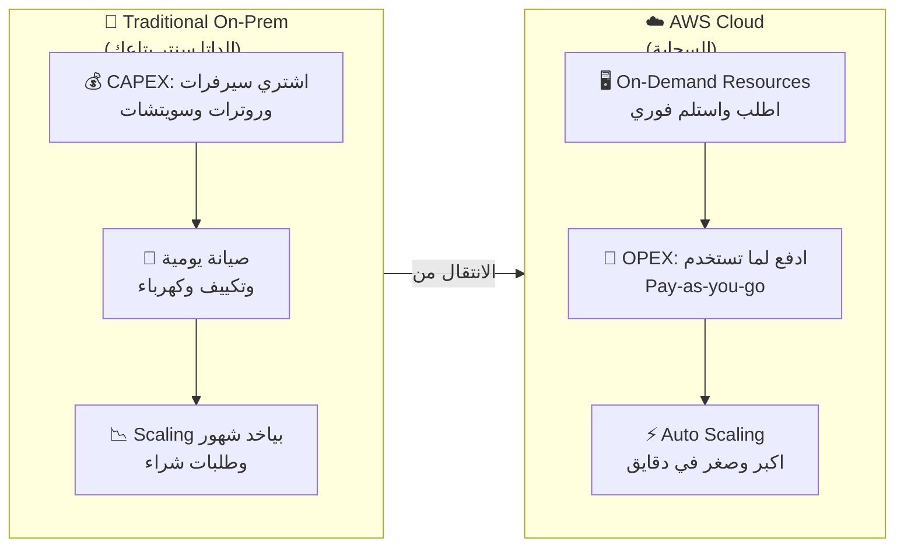
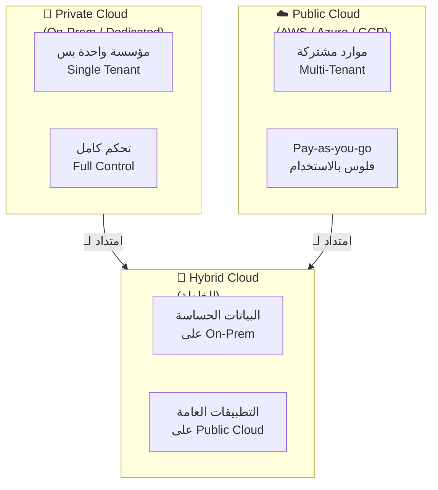
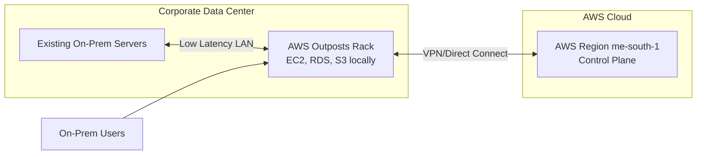
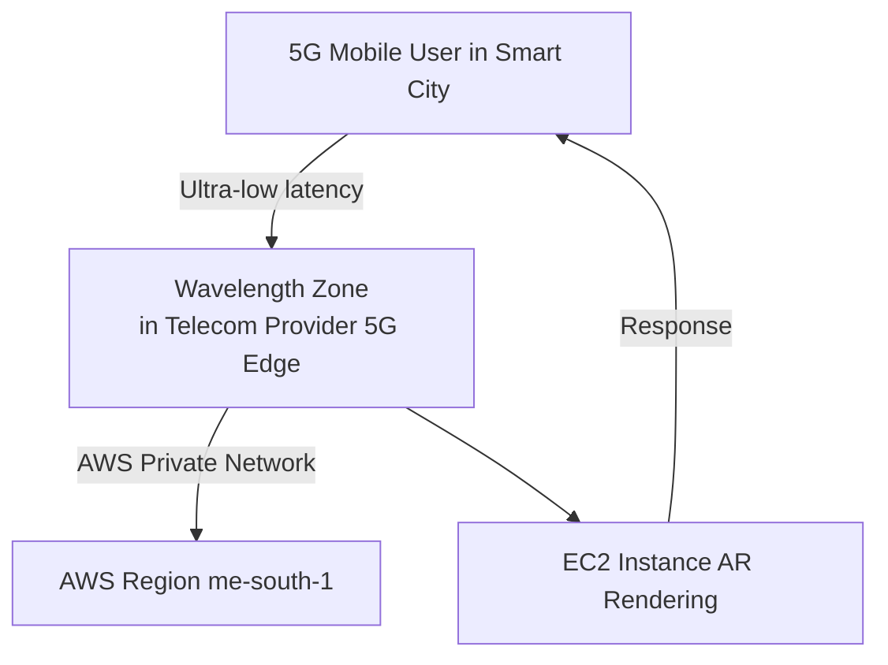

هات كوباية الشاي يا هندسة.. السهرة دي بتاعتنا وهنفصص AWS حتة حتة بالرسومات من غير ما نكروت حرف!

---

## ☁️ المفهوم الأول: إيه هي Cloud Computing وإيه اللي خلّى الناس تهرب من الداتا سنتر بتاعتها؟

### 🏜️ الحكاية والمشكلة (الأصل كله)

تخيّل معايا كده.. أنا عندي صاحبي، اسمه عبدو. عبدو ده فاتح محل فول وطعمية في حدائق القبة، وقرر يطلع أونلاين ويعمل دليفري. عمل app صغير كده اسمه "فولية عبدو". في الأول الدنيا كانت تمام، الناس بتحبه، والأوردرات جاية واحدة واحدة على موبايله. عبدو فكر يبني كل حاجة بنفسه، زي ما بيقولوا "على قدينا". راح اشترى سيرفرين مستعملين من سوق الجمعة، حطهم في أوضة صغيرة ورا المحل، جاب راوتر من توتال، وقعد يلف كابلات من هنا لهناك. قالك "أنا كده IT Engineer يا باشا!" المشكلة إن عبدو مش فاهم إن السيرفرات دي محتاجة حاجات تانية مش بس إنها تشتغل.. محتاجة تكييف 24 ساعة عشان ما تحترقش، محتاجة UPS عشان لما الكهربا تقطع ما يحصلش كارثة، ومحتاجة حد يفهم يعمل update وsecurity patch كل شوية. بس هو قال "هنمشيها كده لحد ما تكبر"، وهو مش واخد باله إنه بيشتري متاعب مش بس سيرفرات.

الدنيا تمشي لحد ما يجي رمضان. يا هندسة، رمضان ده كان النهاية بالنسبة لعبدو. الأوردرات انفجرت.. الناس كلها بتطلب فول وفلافل للإفطار في نفس اللحظة. السيرفرين اللي ورا المحل دخلوا في صدمة. الـ CPU وصل 100%، الـ RAM امتلت، والموقع وقع بالكامل بالظبط الساعة 4:55 قبل الإفطار بخمس دقايق.. وقت الذروة. الناس فتحت التطبيق لقيته مش شغال، راحوا طلبوا من المنافس اللي جنبه. عبدو خسر في يوم واحد أكتر مما كسبه في أسبوع كامل. فكر يشتري سيرفرات تانية، بس فين؟ الأوضة ورا المحل حرّتها زي الفرن بسبب حرارة القاهرة في يوليو، والتكييف اللي شغال 24 ساعة رفع فاتورة الكهربا لدرجة إنها بقت أغلى من تكلفة الفول نفسه. كمان السيرفرات محتاجة صيانة، update، security patches.. اضطر يوظف شاب قال له "أنا باعرف لينكس" بس الشاب ده بيقضي معظم وقته بيتفرج على ماتشات الكورة أو بينام على الكرسي. عبدو بقى بينفق فلوس على rent المكان، فلوس كهربا، فلوس راتب الـ IT guy اللي مش شغال، وفلوس hardware.. ومع ذلك الخدمة بتقع.

وبعدين جت الكارثة الحقيقية. ليلة في يوليو، حصل انقطاع كهربا في المنطقة. الـ UPS (البطارية الاحتياطية) شالت 30 دقيقة وبعدين ماتت. السيرفرات قفلت فجأة. الهارد ديسكات اتلفت بسبب الإغلاق المفاجئ. كل بيانات العملا اللي كانت على السيرفرات من 3 شهور راحت. مفيش backup. مفيش disaster recovery plan. عبدو قاعد في الظلام، عرّان من العرق، شايم ريحة الفول اللي مش قادر يوصله، متسائل ليه ما استخدمش حاجة زي AWS. دفع فلوس في كل حتة وفي الآخر خسر كل حاجة. ده يا هندسة، هو الألم الحقيقي للـ Traditional IT Approach. اللي بيسموه "On-Premises" يعني كل حاجة على كتافك.. أنت اللي بتشتري، أنت اللي بتصلح، أنت اللي بتبني، وأنت اللي بتتحمل النتيجة لو حاجة وقعت.

### 🦸 البطل اللي جه ينقذ عبدو (الحل)

جا هنا دور البطل: **Cloud Computing**. تخيّل إن عبدو بدل ما يشترى سيرفرات ويحطها ورا المحل، يروح يأجر قوة حوسبة من AWS. يعني إيه الكلام ده؟ يعني AWS عندها داتا سنترات ضخمة في كل حتة في العالم، وعبدو بيأجر منها بالدقيقة والجيجا. محتاج سيرفر؟ بكبسة زرار في الكونسول. الأوردرات زادت في رمضان؟ يكبر السيرفرات في دقايق. خلص رمضان ورجعنا للروتين العادي؟ يصغرها تاني ويدفع أقل. ما عادش محتاج يشغل باله بالتكييف ولا الكهربا ولا الـ UPS ولا الناس اللي بتنام على الشغل. AWS بتعمل كل ده.

الزبدة يا هندسة: **Cloud Computing** هي خدمة توصيل "On-Demand" لموارد الحوسبة (Compute Power)، التخزين (Storage)، قواعد البيانات (Databases)، وكل حاجة IT تانية. بتدفع بالاستخدام (Pay-as-you-go)، وتقدر تطلب أي نوع و أي حجم من الموارد في أي لحظة. AWS هي اللي تمتلك وتحافظ على الهاردوير المتصل بالشبكة، وأنت بس بتستأجر وتستخدم اللي تحتاجه من خلال ويب أبليكيشن. يعني بدل ما تبني مطبخ كامل عشان تأكل بيضة، تروح تأكل في مطعم وتدفع بس ثمن البيضة.

### 🔧 الزبدة التقنية (Under the Hood - CLF-C02)

- **التعريف الرسمي:** On-demand delivery of compute power, database storage, applications, and other IT resources.
- **نموذج التسعير:** Pay-as-you-go pricing (ادفع لما تستخدم، مش قبلها).
- **المرونة:** تقدر تطلب resources بالنوع والحجم اللي يناسبك، وتكبر أو تصغر في دقايق.
- **الوصول:** Simple way to access servers, storage, databases, and application services عبر web application.

**الـ 5 Characteristics الأساسية (لازم تحفظهم للامتحان):**

| الخاصية | الشرح بالعربي | المقصود |
|---------|---------------|---------|
| **On-Demand Self Service** | الخدمة الذاتية الفورية | تقدر تطلب resources من غير ما تتكلم مع حد من AWS |
| **Broad Network Access** | الوصول عبر الشبكة الواسعة | متاحة عبر الإنترنت من أي مكان وأي جهاز |
| **Multi-Tenancy & Resource Pooling** | التعددية والتجميع | كذا عميل بيشاركو نفس الـ infrastructure بس مع عزل أمني |
| **Rapid Elasticity & Scalability** | المرونة والتوسع السريع | تقدر تكبر وتصغر تلقائي حسب الطلب |
| **Measured Service** | الخدمة المقاسة | الاستخدام بيتقاس بدقة وتدفع بس على اللي استخدمته |

**الـ 6 Advantages (المميزات الستة):**

- **Trade CAPEX for OPEX:** تبدل رأس المال (اللي بتدفعه مرة واحدة على hardware) بمصاريف تشغيلية (تدفع بالاستخدام).
- **Economies of Scale:** AWS لأنها كبيرة، بتقدر تقليل التكلفة ليك.
- **Stop Guessing Capacity:** مش محتاج تتنبأ بالسعة.. تكبر حسب الاستخدام الفعلي.
- **Speed & Agility:** تقدر تطلق resources في دقايق بدل شهور.
- **Stop Running Data Centers:** سيب هم التشغيل والصيانة لـ AWS.
- **Go Global in Minutes:** تقدر تطلق app في regions حول العالم في دقايق.

**الـ 3 Pricing Fundamentals:**

```text
1. Compute:      تدفع على وقت الحوسبة (الساعات اللي شغالها السيرفر)
2. Storage:      تدفع على البيانات المخزنة في السحابة
3. Data Transfer OUT:  تدفع على البيانات اللي بتخرج من السحابة (Data IN مجاني)
```



> 💡 **معلومة سريعة:** Data Transfer IN مجاني دايماً في AWS. اللي بتدفع عليه هو Data Transfer OUT. يعني ادخل قد ما تحب، بس لما تطلع هتدفع!

> ⭐ **في الامتحان:** لو سألوك إزاي Cloud Computing بيقلل التكلفة؟ الإجابة: بيحوّل CAPEX لـ OPEX وبيستخدم economies of scale.

**Metadata للمفهوم:**
- **Use Case ✅:** Startups، تطبيقات متغيرة الحمل (variable workloads)، Disaster Recovery، Global Applications.
- **NOT Use Case ⚠️:** بيانات محظورة قانونياً إنها تسافر بره البلد (من غير hybrid model)، أو لو عندك legacy system مش هيتغير أبداً.
- **Pricing Model 💰:** Pay-as-you-go (OPEX). تدفع على Compute + Storage + Data Transfer OUT.
- **Shared Responsibility 🔐:** AWS مسؤولة عن **Security OF the Cloud** (الهاردوير، الداتا سنتر، الشبكة). أنت مسؤول عن **Security IN the Cloud** (البيانات، الـ OS، الـ firewall، الـ encryption).

---

## 🏗️ المفهوم الثاني: نماذج النشر (Deployment Models) - هنحط الداتا فين بالظبط؟

### 🏥 الحكاية والمشكلة (أصل الوجع)

تخيّل بقى مستشفى خاص في الإسكندرية، اسمها "مستشفى الشفاء". الدكتورة فاطمة، مديرة المستشفى، عايزة تتحول للرقمية. عندها ملفات مرضى (Patient Records) حساسة جداً، صور أشعة، تحاليل، بيانات بطاقات تأمين. في نفس الوقت، الدكاترة عايزين يفتحوا الإيميل من البيت، والمحاسب عايز يستخدم برنامج محاسبة سحابي، والاستقبال عايزة نظام حجز أونلاين. فاطمة راحت تكلمت مدير الـ IT، حسن. حسن قاعد في مكتبه متلخبط زي الفراخة اللي اتقطعت رجليها. من ناحية، مجلس الإدارة بيقوله "يا حسن، البيانات دي سرية جداً، مينفعش تخرج بره المستشفى. ده قانون البنك المركزي والصحة!" ومن ناحية تانية، الدكاترة بيقولوله "إحنا عايزين ندخل على الملفات من أي مكان، مش عايزين نجي المستشفى عشان نشوف تحليل بس!" حسن فكر يحط كل حاجة On-Prem في المستشفى، بس التكلفة عالية جداً.. محتاج سيرفرات، تكييف، فريق صيانة، ولو حصل حريق أو زلزال (زي زلزال 1992 اللي كسر الدنيا) كل البيانات تروح.

حسن اقترح على فاطمة إنه يحط كل حاجة على "السحابة العامة" (Public Cloud). فاطمة رفضت فوراً وقالتله "يا حسن، إنت مجنون؟ هنحط ملفات المرضى على إنترنت؟ هتتسرق! هتتحط في سيرفر جنب سيرفر تاني لشركة تانية؟ ده اسمه Multi-Tenancy يا ابني، يعني نفس الهاردوير بيخدم أكتر من عميل. إزاي أضمن إن شركة تانية مش هتشوف بياناتنا؟" حسن حاول يشرح لها إن فيه encryption وعزل، بس فاطمة مش مقتنعة إن كل حاجة تبقى public. فضلت المشكلة عالقة: إزاي نستفيد من السحابة في المرونة والتكلفة، وفي نفس الوقت نحافظ على البيانات الحساسة تحت سيطرتنا الكاملة؟ ده معضلة كل المؤسسات الكبيرة في مصر والعالم.

الوجع كبر لما جه قانون حماية البيانات الشخصية (Data Protection Laws). المستشفى لازم تثبت إنها متحكمة في البيانات الحساسة. حسن بقى بين النار والبحر: On-Prem مكلف وغير مرن، Public Cloud مرن بس مخيف للبيانات الحساسة. محتاج حل وسط. محتاج "خلطة" تجمع الأمان بتاع الـ On-Premises بالمرونة بتاعة الـ Cloud. محتاج يحط الإيميل والموقع على Cloud، ويحط ملفات المرضى في الداتا سنتر بتاعته. بس إزاي يخلي الاتنين يتكلموا مع بعض بسلاسة؟ ده السؤال اللي بيجاوب عليه الـ Deployment Models.

### 🦸 البطل: الـ 3 نماذج للنشر (الحل)

هنا بقى جا الحل اللي بيفرق المهندسين عن الناس العادية: **Deployment Models**. مش كل حاجة لازم تكون في السحابة العامة، ولا لازم كل حاجة تفضل في المستشفى. فيه 3 طرق للموضوع ده، وكل واحدة ليها استخدامها. زي ما تكون بتبني بيت: فيه بيت عمارة (Public) تقدر تسكن فيه بسرعة، وفيه فيلا خاصة (Private) تحت سيطرتك، وفيه دوبلكس (Hybrid) تجمع الاتنين.

### 🔧 الزبدة التقنية (Under the Hood - CLF-C02)

| النموذج | الشرح | مين بيتحكم | الاستخدام الأمثل |
|---------|-------|------------|------------------|
| **Public Cloud** ☁️ | موارد مملوكة ومشغلة من طرف تالت (زي AWS) وموصلة عبر الإنترنت | AWS / Provider | تطبيقات عامة، مواقع، تطبيقات بدون بيانات حساسة |
| **Private Cloud** 🏢 | خدمات سحابية لمؤسسة واحدة بس، مش مكشوفة للعامة. ممكن تكون On-Prem أو hosted | أنت / المؤسسة | بيانات سرية، بنوك، حكومة، قوانين صارمة |
| **Hybrid Cloud** 🔗 | مزيج: جزء On-Premises وجزء على Public Cloud، متصلين ببعض | مشترك | لما تحتاج تبقي بيانات حساسة عندك وتستفيد بمرونة السحابة |

**تفاصيل كل نموذج:**

**Public Cloud:**
- AWS, Azure, GCP بيملكوا ويشغلوا الـ infrastructure.
- **Multi-tenancy:** أكتر من عميل على نفس الهاردوير بس مع عزل تام (logical isolation).
- **Ventaja:** مرونة عالية، تكلفة منخفضة، ما فيش CAPEX.
- **مثال:** Gmail, Dropbox, Netflix (كلها على Public Cloud).

**Private Cloud:**
- مؤسسة واحدة بس بتستخدم الـ cloud resources.
- ممكن يكون في داتا سنتر بتاعك (On-Prem) أو في داتا سنتر مخصص ليك.
- **Single-tenancy:** الهاردوير كله بتاعك.
- **Ventaja:** تحكم كامل، security أعلى، compliance أسهل.
- **عيب:** أغلى، أبطأ في التوسع، أنت مسؤول عن الصيانة.

**Hybrid Cloud:**
- بتبقي بعض الـ servers عندك (On-Premises) وبتمتد لـ Cloud.
- بتستخدم تقنيات زي **AWS Outposts** (server racks من AWS في داتا سنترك) أو **VPN/Direct Connect**.
- **الفكرة:** Control over sensitive assets في الـ Private + Flexibility والـ cost-effectiveness بتاع الـ Public.



> 💡 **معلومة سريعة:** Hybrid Cloud مش معناه إنك شغال على سيرفرين منفصلين. لأ! لازم يكون فيه connectivity وintegration بين الـ On-Prem والـ Cloud. غير كده يبقى مجرد "Two separate environments" مش Hybrid.

> ⭐ **في الامتحان:** لو سألوك عن مؤسسة عايزة تفضل متحكمة في بيانات حساسة (Sensitive Data) وتستخدم السحابة في نفس الوقت؟ الإجابة: **Hybrid Cloud**. لو سألوك عن Startup عايزة تطلع بسرعة بأقل تكلفة؟ الإجابة: **Public Cloud**.

**Metadata للمفهوم:**

| | Public Cloud | Private Cloud | Hybrid Cloud |
|---|---|---|---|
| **Use Case ✅** | Startups، Web Apps، Dev/Test | Banks، Government، Healthcare | Legacy + Modern، Migration phases |
| **NOT Use Case ⚠️** | Top Secret Data (من غير extra controls) | Rapid Global Scaling (مكلف جداً) | لو مفيش integration حقيقي |
| **Pricing Model 💰** | Pay-as-you-go (OPEX) | CAPEX + OPEX (تكلفة ثابتة عالية) | Mixed: CAPEX للـ Private + OPEX للـ Public |
| **Shared Responsibility 🔐** | AWS: Of the Cloud. أنت: In the Cloud. | أنت: Of + In the Cloud (مسؤولية أكبر). | Mixed: Private جزءك، Public جزء AWS. |

---

عندك حق يا هندسة، خلينا ندوّر على المواضيع الجاية اللي هتفرق مع أي حد شغال في سوق زي مصر. هنغطي النهاردة حلول الـ Hybrid و Edge Computing اللي بتقرب AWS من المستخدمين فيزيائيًا، ودي مفاهيم متقدمة لكن مطلوبة في CLF-C02.

---

## المفهوم السادس: AWS Outposts – لما تحتاج السحابة جوه مركز بياناتك الخاص

### 1. السيناريو العملي من السوق المصري
تخيل بنك استثماري كبير في القاهرة، "بنك النيل"، عنده داتا سنتر ضخم قضى فيه ملايين الدولارات على مدى سنين. رغم إنهم عايزين يستفيدوا من الـ cloud agility، لكن عندهم تطبيقات تداول حساسة جدًا تحتاج latency أقل من 2 مللي ثانية بين الـ trading engine و الـ risk management systems اللي شغالة على خوادم بجانب بعض في الـ data center.  
كمان البنك المركزي فارض إن بعض أنواع الداتا (زي بيانات الحسابات الخاصة) تفضل فيزيائيًا داخل حدود مصر ولا تخرج لأي Public Cloud Region بره.  
الخوف إنهم لو نقلوا كل حاجة على AWS، الـ latency هيزيد والامتثال القانوني هيتعرض للخطر.  
حل تقليدي: يخلّو كل حاجة on-premises ويتحملوا مصاريف الصيانة والـ CAPEX العالية، أو يعملوا Hybrid ولكن مع Complexity عالية في الـ APIs و الـ management بين بيئتين مختلفتين تمامًا.    
هل في طريقة تجيب خدمات AWS نفسها (EC2, S3, RDS) داخل الداتا سنتر بتاعهم، ويديروها بنفس الـ APIs و الـ console، بدون ما يخلوا البيانات تطلع بره، ويستفيدوا من الـ pay-as-you-go؟

### 2. الحل المعماري مع AWS
AWS Outposts عبارة عن "racks" (خزائن سيرفرات) بتتسلم للعميل في داتا سنتره الخاص. AWS بتركبها وتديرها بالكامل كـ fully managed service.  
الـ Outposts بتشغّل نفس الـ AWS infrastructure services، الـ APIs، والأدوات اللي بتستخدمها في السحابة، عشان تبني تطبيقاتك بالكامل داخل مقرّك.  
بالنسبة لـ "بنك النيل"، تقدر تحط Outposts rack في الداتا سنتر بتاعها، وتشغّل Amazon EC2 instances، Amazon RDS databases، و Amazon ECS containers مباشرة على الـ Outposts، كل ده مرتبط بـ AWS Region قريب (زي me-south-1 في البحرين) لإدارة الـ control plane وتحديث الخدمات.  
البيانات الحساسة تفضل فيزيائيًا في الداتا سنتر بتاع البنك، والـ latency بين التطبيقات بيكون في حدود الشبكة المحلية. والأهم، بتدفع بنظام الـ pay-as-you-go مع AWS بدون ما تشتري السيرفرات دي ملكًا.

### 3. الزبدة التقنية للامتحان (كل تفاصيل Outposts)

#### 🖥️ ما هو AWS Outposts؟
- هي رفوف خوادم (racks) تحتوي على أجهزة AWS المصممة خصيصًا، توفر نفس الـ AWS infrastructure، الخدمات، APIs، والأدوات داخل مركز البيانات الخاص بك أو في موقع co-location.
- تشغّل الخدمات تمامًا كما في الـ Region، لكن فيزيائيًا قريبة من أحمالك.

#### 🔩 الخدمات المدعومة (مهم للامتحان)
Outposts مش مجرد سيرفرات، ولكن بيئة AWS كاملة. بعض الخدمات المدعومة:
- **Amazon EC2** (تشغيل instances)
- **Amazon EBS** (block storage)
- **Amazon S3** (على Outposts – bucket محلي)
- **Amazon RDS** (قواعد بيانات مدارة)
- **Amazon ECS / EKS** (containers)
- **Amazon EMR** (big data)

#### ⚖️ المسؤوليات (Shared Responsibility لـ Outposts)
- **AWS مسؤولة عن**: توصيل الـ rack، تركيبه، صيانته، تحديث البرمجيات والـ firmware، وإدارة البنية التحتية الفيزيائية داخل الـ rack (الـ security of the cloud).  
- **العميل (أنت) مسؤول عن**: الأمان الفيزيائي للـ rack نفسه (باب الداتا سنتر، المراقبة، الحماية من الوصول غير المصرح به)، وكذلك الأمان داخل الخدمات (IAM، تشفير، إلخ). هذه نقطة جوهرية.

#### 📍 الفوائد الرئيسية
- **Low-latency access** للأنظمة الـ on-premises.
- **معالجة البيانات محليًا** (local data processing) دون خروج البيانات.
- **Data residency**: الالتزام بأن البيانات تبقى داخل حدود الدولة أو المكان المحدد.
- **Fully managed**: لا تقلق بشأن صيانة الهاردوير، AWS بتعمله.
- **اتساق تشغيلي**: نفس الـ APIs ونفس أدوات الـ automation زي CloudFormation.

#### 🎨 رسم توضيحي (Mermaid flowchart) لـ Outposts في بيئة هجينة

الرسم يوضح إن الـ Outposts بتوفر موارد AWS محليًا، ومربوطة بـ Region للإدارة.

#### ⚠️ Use Case / NOT Use Case
- **Use Case**: تطبيقات تحتاج latency منخفض جدًا (<5ms) للأنظمة المحلية، الامتثال لـ data residency، المصانع (manufacturing)، المستشفيات، التطبيقات المالية عالية التردد.
- **NOT Use Case**: تطبيق ويب عادي لا يحتاج ارتباطًا محليًا، أو أحمال قابلة للتوسع الكبير جدًا بدون قيود فيزيائية – الأفضل يستخدم الـ Region مباشرة.

#### 💰 Pricing Model
- تدفع رسومًا مقدمة (upfront) أو شهرية للـ Outpost rack بالإضافة لاستهلاك الخدمات (EC2/S3/RDS) بنفس منطق الـ pay-as-you-go ولكن مع خيارات reserved على الـ Outpost.

#### 🛡️ Shared Responsibility (كما ذكرنا)
- **AWS**: أمان الخدمة والهاردوير داخل الـ rack.
- **أنت**: الأمان الفيزيائي للـ rack، إدارة IAM، تشفير البيانات، إلخ.

---

## المفهوم السابع: AWS Wavelength – جلب السحابة إلى حواف شبكات الجيل الخامس (5G)

### 1. السيناريو العملي من السوق المصري
"مدينة العلمين الذكية" الجديدة في مصر فيها شبكة 5G متطورة، وشركة "SmartMotion" الناشئة بتطور تطبيق واقع معزز (AR) للسياحة: الزائر يوجّه كاميرا موبايله على معلم أثري والتطبيق يعرض معلومات تاريخية ورسوم متحركة في الوقت الحقيقي.  
التحدي: معالجة الفيديو والـ AR rendering لازم تتم في أقل من 20 مللي ثانية عشان التجربة تكون سلسة. لو أرسلنا الفيديو لـ Region AWS بعيد (زي أوروبا)، الـ latency هيتجاوز 100ms والتجربة هتبقى سيئة.  
كمان مفيش إمكانية نبني سيرفرات مخصصة في كل مدينة، ومحتاجين نستفيد من الـ edge computing بأقل تكلفة وبدون إدارة بنية تحتية.  
هل ممكن نحط موارد AWS compute جوه شبكة 5G نفسها عشان نقلل الـ latency لدرجة كبيرة؟

### 2. الحل المعماري مع AWS
AWS Wavelength هي بنية تحتية مدمجة داخل مراكز بيانات مزودي خدمات الاتصالات (Telecom providers) على حافة شبكات الـ 5G.  
بتنشئ Wavelength Zone مرتبط بـ AWS Region. الـ Wavelength Zone بيحتوي على خدمات AWS الأساسية (EC2 instances, EBS volumes, VPC).  
التطبيق بتاع "SmartMotion" هينشر خوادم AR backend في Wavelength Zone داخل شبكة 5G بتاعة مزود الخدمة في مصر. حركة البيانات من المستخدم إلى التطبيق لا تغادر شبكة مزود الاتصالات: المسار: المستخدم → 5G → Wavelength Zone.  
ده بيوفر latency تحت 10ms عشان الخوادم قريبة جدًا من الـ edge. كمان مافيش تكاليف إضافية لاستخدام Wavelength، والفوترة بتتم بشكل عادي مقابل الخدمات المستخدمة. التكامل مع Carrier Gateway يضمن اتصال آمن وعالي النطاق بالـ Region الأصلي للحالات اللي تحتاج خدمات مش متاحة في Wavelength.

### 3. الزبدة التقنية للامتحان (تحت غطاء Wavelength)

#### 📡 ما هو Wavelength؟
- عبارة عن AWS infrastructure تُنشر داخل datacenters التابعة لمزودي الاتصالات (Communication Service Providers – CSPs) على حافة شبكات 5G.
- تقدم مجموعة مختارة من خدمات AWS (حاليًا EC2, EBS, VPC) لكنها تتيح وصولًا فائق السرعة إلى التطبيقات عبر شبكة 5G.
- الـ traffic بين الجهاز والـ Wavelength Zone لا يغادر شبكة الـ CSP؛ مما يضمن latency منخفض جدًا.

#### 🎯 الخصائص الرئيسية
- **النطاق الترددي العالي والأمان**: الـ traffic يبقى جوه شبكة الـ CSP، اتصال آمن.
- **لا توجد رسوم إضافية أو اتفاقيات خدمة إضافية** لاستخدام Wavelength: تدفع فقط على الخدمات المستعملة بنفس تسعير الـ Region.
- **متصل بـ AWS Region** عبر اتصال عالي النطاق وآمن، للإدارة والـ control plane.

#### 🛠️ حالات الاستخدام (موجودة في الشرائح)
- المدن الذكية (Smart Cities)
- التشخيص الطبي بمساعدة تعلم الآلة (ML-assisted diagnostics)
- المركبات المتصلة (Connected Vehicles)
- بث الفيديو المباشر التفاعلي (Interactive Live Video Streams)
- الواقع المعزز/الافتراضي (AR/VR)
- الألعاب عبر الإنترنت في زمن حقيقي (Real-time Gaming)

> ⭐ **في الامتحان:** الفرق بين Outposts و Wavelength هيسألوا عنه. Outposts = جوه داتا سنتر العميل. Wavelength = جوه شبكة مزود الاتصالات عند الحافة للـ 5G.

#### 🎨 رسم توضيحي (Mermaid flowchart) لـ Wavelength مع 5G

البيانات مش بتطلع بره شبكة الـ 5G، والـ compute قريب جدًا.

#### ⚠️ Use Case / NOT Use Case
- **Use Case**: تطبيقات تحتاج latency تحت 20ms وتعتمد على شبكات 5G، زي AR/VR، المركبات الذاتية القيادة، تحليلات الفيديو الحي، الألعاب السحابية.
- **NOT Use Case**: تطبيقات لا تعتمد على 5G، أو تحتاج كل خدمات AWS المتطورة مش مجرد compute و storage أساسيين (لكن ممكن يتكاملوا مع Region).

#### 💰 Pricing Model
- لا توجد رسوم إضافية. تدفع مقابل EC2 instances، EBS، و data transfer داخل وخارج Wavelength بنفس تسعير الـ Region.
- تكامل مع Carrier Gateway لا يضيف تكاليف إضافية.

#### 🛡️ Shared Responsibility
- **AWS**: أمان البنية التحتية لـ Wavelength Zones.
- **مزود الاتصالات**: أمان الشبكة الـ 5G والنقل.
- **أنت**: أمان الـ instances (IAM, SG)، تشفير البيانات.

---

## المفهوم الثامن: AWS Local Zones – تقريب موارد AWS لمدن محددة بدون الحاجة لـ Region كامل

### 1. السيناريو العملي من السوق المصري
شركة "NileStream" المصرية بتقدم خدمة بث مباشر للألعاب الرياضية المحلية (الدوري المصري). معظم جمهورها في القاهرة والإسكندرية. الخوادم الرئيسية مستضافة في Region البحرين (me-south-1)، ولكن زمن الوصول للمستخدمين في القاهرة حوالي 40-50 مللي ثانية، وده بيسبب تأخير ملحوظ في البث المباشر.  
هم عايزين يحطوا transcoding servers قريبة من المستخدمين في القاهرة عشان يقللوا الـ latency لأقل من 10ms، لكن مفيش AWS Region في مصر حاليًا.  
فكرة بناء داتا سنتر صغير مكلفة ومعقدة، ومش محتاجين كل خدمات الـ Region، بس محتاجين EC2 instances عشان transcoding و RDS لقاعدة بيانات الجلسات القريبة.  
هل ممكن يكون في نقطة وجود AWS في القاهرة، مش Region كامل، لكن قريبة كفاية عشان تحقق الـ latency المطلوب؟

### 2. الحل المعماري مع AWS
AWS Local Zones هي "امتداد لـ AWS Region" وتوفر موارد AWS (compute, storage, database) في مواقع قريبة من مراكز سكانية كبيرة، بدون ما تكون Region مستقل.  
بدل ما تنتظر Region في مصر، تقدر تستخدم AWS Local Zone في مدينة قريبة (حاليًا أقرب Local Zone في أوروبا أو الشرق الأوسط ممكن اسطنبول مثلًا، لكن الفكرة إنها بتكون موجودة في مدن زي بوسطن، هيوستن، أم درمان... إلخ - حسب التوفر).    
"نيل ستريم" ممكن تنشر EC2 instances في Local Zone اسطنبول (أو أي مدينة قريبة)، ومع VPC الممدودة، الـ instances بتكون في subnet خاص داخل الـ Local Zone، مرتبطة بالـ Region الأم (me-south-1) بشبكة عالية السرعة.  
كده الـ transcoding يبقى قريب جغرافيًا من المستخدمين المصريين (latency أقل)، وقاعدة البيانات المحلية تحتفظ بالجلسات محليًا لتجربة أسرع.

### 3. الزبدة التقنية للامتحان (كل أبعاد Local Zones)

#### 📍 تعريف Local Zone
- هو "extension of an AWS Region" يسمح لك بنشر موارد AWS (حاليًا EC2, RDS, EBS, ECS, ElastiCache, Direct Connect) في موقع قريب من المستخدمين النهائيين.
- يُدار من الـ Region الأصلي، ويستخدم VPC خاص به.

#### 🧠 الصفات الأساسية
- لا تحتاج لإنشاء Region جديد، فقط تختار Local Zone من خلال الـ Console عند إطلاق instance، وتحدد subnet في تلك الـ Zone.
- مثالي لتطبيقات حساسة للـ latency مثل: real-time gaming, live streaming, AR/VR, و collaborative editing.
- ليست بديل كامل لـ Region، لكنها توفر طبقة قرب جغرافي.

#### 🗺️ مثال موجود في الشرائح
- Region: us-east-1 (N. Virginia)
- Local Zones: Boston, Chicago, Dallas, Houston, Miami...

#### 🎨 رسم توضيحي (Mermaid flowchart) لـ Local Zone مع Region
```mermaid
flowchart TD
    subgraph Region[Region me-south-1 Bahrain]
        AZ1[AZ-1]
        AZ2[AZ-2]
    end
    subgraph Local Zone[Local Zone Istanbul]
        LZSubnet[Private Subnet]
        EC2_LZ[EC2 for Transcoding]
        RDS_LZ[RDS for Session Data]
    end
    InternetUser[User in Cairo] -->|Low latency| EC2_LZ
    Region -->|High-speed link| Local Zone
```
الرسم يوضح إن الـ Local Zone موصولة مباشر بالـ Region، والمستخدمين بيوصلوا للخدمة بزمن أقل.

#### ⚠️ Use Case / NOT Use Case
- **Use Case**: تطبيقات تحتاج latency أحادي الرقم (single-digit millisecond)، بث مباشر، ألعاب تنافسية، واجهات برمجة تطبيقات حساسة للوقت.
- **NOT Use Case**: أحمال تحتاج كل خدمات AWS أو تحتاج مرونة توسع كبيرة جدًا بدون قيود الموقع – الأفضل تظل في Region كامل، أو تستعمل Outposts للتحكم الكامل.

#### 💰 Pricing Model
- تدفع مقابل الخدمات المستخدمة (EC2, RDS, EBS) في الـ Local Zone، وعادة ما يكون التسعير أعلى قليلاً من الـ Region الرئيسي بسبب تكلفة تشغيل البنية التحتية الموزعة.
- لا توجد رسوم شهرية على Local Zone نفسها، فقط استهلاك الخدمات.

#### 🛡️ Shared Responsibility
- **AWS**: أمان وتوافر مراكز البيانات في Local Zones.
- **أنت**: كل ما يتعلق بأمان الـ workloads والتكوين.

---

[أنا شرحت الجزء ده تقنياً بالتفصيل.. قولي "كمل" عشان أدخل على المواضيع اللي بعدها بنفس العمق]