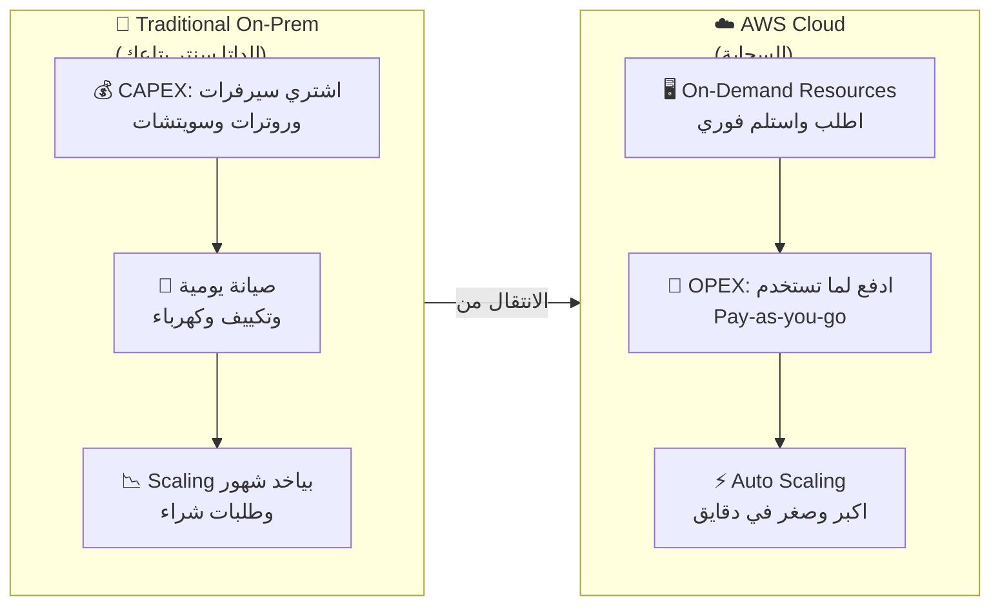
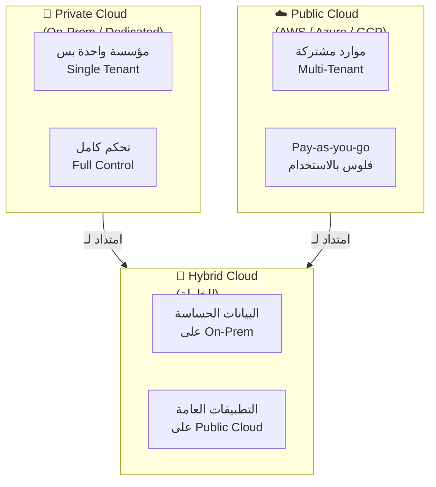

هات كوباية الشاي يا هندسة.. السهرة دي بتاعتنا وهنفصص AWS حتة حتة بالرسومات من غير ما نكروت حرف!

---

## ☁️ المفهوم الأول: إيه هي Cloud Computing وإيه اللي خلّى الناس تهرب من الداتا سنتر بتاعتها؟

### 🏜️ الحكاية والمشكلة (الأصل كله)

تخيّل معايا كده.. أنا عندي صاحبي، اسمه عبدو. عبدو ده فاتح محل فول وطعمية في حدائق القبة، وقرر يطلع أونلاين ويعمل دليفري. عمل app صغير كده اسمه "فولية عبدو". في الأول الدنيا كانت تمام، الناس بتحبه، والأوردرات جاية واحدة واحدة على موبايله. عبدو فكر يبني كل حاجة بنفسه، زي ما بيقولوا "على قدينا". راح اشترى سيرفرين مستعملين من سوق الجمعة، حطهم في أوضة صغيرة ورا المحل، جاب راوتر من توتال، وقعد يلف كابلات من هنا لهناك. قالك "أنا كده IT Engineer يا باشا!" المشكلة إن عبدو مش فاهم إن السيرفرات دي محتاجة حاجات تانية مش بس إنها تشتغل.. محتاجة تكييف 24 ساعة عشان ما تحترقش، محتاجة UPS عشان لما الكهربا تقطع ما يحصلش كارثة، ومحتاجة حد يفهم يعمل update وsecurity patch كل شوية. بس هو قال "هنمشيها كده لحد ما تكبر"، وهو مش واخد باله إنه بيشتري متاعب مش بس سيرفرات.

الدنيا تمشي لحد ما يجي رمضان. يا هندسة، رمضان ده كان النهاية بالنسبة لعبدو. الأوردرات انفجرت.. الناس كلها بتطلب فول وفلافل للإفطار في نفس اللحظة. السيرفرين اللي ورا المحل دخلوا في صدمة. الـ CPU وصل 100%، الـ RAM امتلت، والموقع وقع بالكامل بالظبط الساعة 4:55 قبل الإفطار بخمس دقايق.. وقت الذروة. الناس فتحت التطبيق لقيته مش شغال، راحوا طلبوا من المنافس اللي جنبه. عبدو خسر في يوم واحد أكتر مما كسبه في أسبوع كامل. فكر يشتري سيرفرات تانية، بس فين؟ الأوضة ورا المحل حرّتها زي الفرن بسبب حرارة القاهرة في يوليو، والتكييف اللي شغال 24 ساعة رفع فاتورة الكهربا لدرجة إنها بقت أغلى من تكلفة الفول نفسه. كمان السيرفرات محتاجة صيانة، update، security patches.. اضطر يوظف شاب قال له "أنا باعرف لينكس" بس الشاب ده بيقضي معظم وقته بيتفرج على ماتشات الكورة أو بينام على الكرسي. عبدو بقى بينفق فلوس على rent المكان، فلوس كهربا، فلوس راتب الـ IT guy اللي مش شغال، وفلوس hardware.. ومع ذلك الخدمة بتقع.

وبعدين جت الكارثة الحقيقية. ليلة في يوليو، حصل انقطاع كهربا في المنطقة. الـ UPS (البطارية الاحتياطية) شالت 30 دقيقة وبعدين ماتت. السيرفرات قفلت فجأة. الهارد ديسكات اتلفت بسبب الإغلاق المفاجئ. كل بيانات العملا اللي كانت على السيرفرات من 3 شهور راحت. مفيش backup. مفيش disaster recovery plan. عبدو قاعد في الظلام، عرّان من العرق، شايم ريحة الفول اللي مش قادر يوصله، متسائل ليه ما استخدمش حاجة زي AWS. دفع فلوس في كل حتة وفي الآخر خسر كل حاجة. ده يا هندسة، هو الألم الحقيقي للـ Traditional IT Approach. اللي بيسموه "On-Premises" يعني كل حاجة على كتافك.. أنت اللي بتشتري، أنت اللي بتصلح، أنت اللي بتبني، وأنت اللي بتتحمل النتيجة لو حاجة وقعت.

### 🦸 البطل اللي جه ينقذ عبدو (الحل)

جا هنا دور البطل: **Cloud Computing**. تخيّل إن عبدو بدل ما يشترى سيرفرات ويحطها ورا المحل، يروح يأجر قوة حوسبة من AWS. يعني إيه الكلام ده؟ يعني AWS عندها داتا سنترات ضخمة في كل حتة في العالم، وعبدو بيأجر منها بالدقيقة والجيجا. محتاج سيرفر؟ بكبسة زرار في الكونسول. الأوردرات زادت في رمضان؟ يكبر السيرفرات في دقايق. خلص رمضان ورجعنا للروتين العادي؟ يصغرها تاني ويدفع أقل. ما عادش محتاج يشغل باله بالتكييف ولا الكهربا ولا الـ UPS ولا الناس اللي بتنام على الشغل. AWS بتعمل كل ده.

الزبدة يا هندسة: **Cloud Computing** هي خدمة توصيل "On-Demand" لموارد الحوسبة (Compute Power)، التخزين (Storage)، قواعد البيانات (Databases)، وكل حاجة IT تانية. بتدفع بالاستخدام (Pay-as-you-go)، وتقدر تطلب أي نوع و أي حجم من الموارد في أي لحظة. AWS هي اللي تمتلك وتحافظ على الهاردوير المتصل بالشبكة، وأنت بس بتستأجر وتستخدم اللي تحتاجه من خلال ويب أبليكيشن. يعني بدل ما تبني مطبخ كامل عشان تأكل بيضة، تروح تأكل في مطعم وتدفع بس ثمن البيضة.

### 🔧 الزبدة التقنية (Under the Hood - CLF-C02)

- **التعريف الرسمي:** On-demand delivery of compute power, database storage, applications, and other IT resources.
- **نموذج التسعير:** Pay-as-you-go pricing (ادفع لما تستخدم، مش قبلها).
- **المرونة:** تقدر تطلب resources بالنوع والحجم اللي يناسبك، وتكبر أو تصغر في دقايق.
- **الوصول:** Simple way to access servers, storage, databases, and application services عبر web application.

**الـ 5 Characteristics الأساسية (لازم تحفظهم للامتحان):**

| الخاصية | الشرح بالعربي | المقصود |
|---------|---------------|---------|
| **On-Demand Self Service** | الخدمة الذاتية الفورية | تقدر تطلب resources من غير ما تتكلم مع حد من AWS |
| **Broad Network Access** | الوصول عبر الشبكة الواسعة | متاحة عبر الإنترنت من أي مكان وأي جهاز |
| **Multi-Tenancy & Resource Pooling** | التعددية والتجميع | كذا عميل بيشاركو نفس الـ infrastructure بس مع عزل أمني |
| **Rapid Elasticity & Scalability** | المرونة والتوسع السريع | تقدر تكبر وتصغر تلقائي حسب الطلب |
| **Measured Service** | الخدمة المقاسة | الاستخدام بيتقاس بدقة وتدفع بس على اللي استخدمته |

**الـ 6 Advantages (المميزات الستة):**

- **Trade CAPEX for OPEX:** تبدل رأس المال (اللي بتدفعه مرة واحدة على hardware) بمصاريف تشغيلية (تدفع بالاستخدام).
- **Economies of Scale:** AWS لأنها كبيرة، بتقدر تقليل التكلفة ليك.
- **Stop Guessing Capacity:** مش محتاج تتنبأ بالسعة.. تكبر حسب الاستخدام الفعلي.
- **Speed & Agility:** تقدر تطلق resources في دقايق بدل شهور.
- **Stop Running Data Centers:** سيب هم التشغيل والصيانة لـ AWS.
- **Go Global in Minutes:** تقدر تطلق app في regions حول العالم في دقايق.

**الـ 3 Pricing Fundamentals:**

```text
1. Compute:      تدفع على وقت الحوسبة (الساعات اللي شغالها السيرفر)
2. Storage:      تدفع على البيانات المخزنة في السحابة
3. Data Transfer OUT:  تدفع على البيانات اللي بتخرج من السحابة (Data IN مجاني)
```



> 💡 **معلومة سريعة:** Data Transfer IN مجاني دايماً في AWS. اللي بتدفع عليه هو Data Transfer OUT. يعني ادخل قد ما تحب، بس لما تطلع هتدفع!

> ⭐ **في الامتحان:** لو سألوك إزاي Cloud Computing بيقلل التكلفة؟ الإجابة: بيحوّل CAPEX لـ OPEX وبيستخدم economies of scale.

**Metadata للمفهوم:**
- **Use Case ✅:** Startups، تطبيقات متغيرة الحمل (variable workloads)، Disaster Recovery، Global Applications.
- **NOT Use Case ⚠️:** بيانات محظورة قانونياً إنها تسافر بره البلد (من غير hybrid model)، أو لو عندك legacy system مش هيتغير أبداً.
- **Pricing Model 💰:** Pay-as-you-go (OPEX). تدفع على Compute + Storage + Data Transfer OUT.
- **Shared Responsibility 🔐:** AWS مسؤولة عن **Security OF the Cloud** (الهاردوير، الداتا سنتر، الشبكة). أنت مسؤول عن **Security IN the Cloud** (البيانات، الـ OS، الـ firewall، الـ encryption).

---

## 🏗️ المفهوم الثاني: نماذج النشر (Deployment Models) - هنحط الداتا فين بالظبط؟

### 🏥 الحكاية والمشكلة (أصل الوجع)

تخيّل بقى مستشفى خاص في الإسكندرية، اسمها "مستشفى الشفاء". الدكتورة فاطمة، مديرة المستشفى، عايزة تتحول للرقمية. عندها ملفات مرضى (Patient Records) حساسة جداً، صور أشعة، تحاليل، بيانات بطاقات تأمين. في نفس الوقت، الدكاترة عايزين يفتحوا الإيميل من البيت، والمحاسب عايز يستخدم برنامج محاسبة سحابي، والاستقبال عايزة نظام حجز أونلاين. فاطمة راحت تكلمت مدير الـ IT، حسن. حسن قاعد في مكتبه متلخبط زي الفراخة اللي اتقطعت رجليها. من ناحية، مجلس الإدارة بيقوله "يا حسن، البيانات دي سرية جداً، مينفعش تخرج بره المستشفى. ده قانون البنك المركزي والصحة!" ومن ناحية تانية، الدكاترة بيقولوله "إحنا عايزين ندخل على الملفات من أي مكان، مش عايزين نجي المستشفى عشان نشوف تحليل بس!" حسن فكر يحط كل حاجة On-Prem في المستشفى، بس التكلفة عالية جداً.. محتاج سيرفرات، تكييف، فريق صيانة، ولو حصل حريق أو زلزال (زي زلزال 1992 اللي كسر الدنيا) كل البيانات تروح.

حسن اقترح على فاطمة إنه يحط كل حاجة على "السحابة العامة" (Public Cloud). فاطمة رفضت فوراً وقالتله "يا حسن، إنت مجنون؟ هنحط ملفات المرضى على إنترنت؟ هتتسرق! هتتحط في سيرفر جنب سيرفر تاني لشركة تانية؟ ده اسمه Multi-Tenancy يا ابني، يعني نفس الهاردوير بيخدم أكتر من عميل. إزاي أضمن إن شركة تانية مش هتشوف بياناتنا؟" حسن حاول يشرح لها إن فيه encryption وعزل، بس فاطمة مش مقتنعة إن كل حاجة تبقى public. فضلت المشكلة عالقة: إزاي نستفيد من السحابة في المرونة والتكلفة، وفي نفس الوقت نحافظ على البيانات الحساسة تحت سيطرتنا الكاملة؟ ده معضلة كل المؤسسات الكبيرة في مصر والعالم.

الوجع كبر لما جه قانون حماية البيانات الشخصية (Data Protection Laws). المستشفى لازم تثبت إنها متحكمة في البيانات الحساسة. حسن بقى بين النار والبحر: On-Prem مكلف وغير مرن، Public Cloud مرن بس مخيف للبيانات الحساسة. محتاج حل وسط. محتاج "خلطة" تجمع الأمان بتاع الـ On-Premises بالمرونة بتاعة الـ Cloud. محتاج يحط الإيميل والموقع على Cloud، ويحط ملفات المرضى في الداتا سنتر بتاعته. بس إزاي يخلي الاتنين يتكلموا مع بعض بسلاسة؟ ده السؤال اللي بيجاوب عليه الـ Deployment Models.

### 🦸 البطل: الـ 3 نماذج للنشر (الحل)

هنا بقى جا الحل اللي بيفرق المهندسين عن الناس العادية: **Deployment Models**. مش كل حاجة لازم تكون في السحابة العامة، ولا لازم كل حاجة تفضل في المستشفى. فيه 3 طرق للموضوع ده، وكل واحدة ليها استخدامها. زي ما تكون بتبني بيت: فيه بيت عمارة (Public) تقدر تسكن فيه بسرعة، وفيه فيلا خاصة (Private) تحت سيطرتك، وفيه دوبلكس (Hybrid) تجمع الاتنين.

### 🔧 الزبدة التقنية (Under the Hood - CLF-C02)

| النموذج | الشرح | مين بيتحكم | الاستخدام الأمثل |
|---------|-------|------------|------------------|
| **Public Cloud** ☁️ | موارد مملوكة ومشغلة من طرف تالت (زي AWS) وموصلة عبر الإنترنت | AWS / Provider | تطبيقات عامة، مواقع، تطبيقات بدون بيانات حساسة |
| **Private Cloud** 🏢 | خدمات سحابية لمؤسسة واحدة بس، مش مكشوفة للعامة. ممكن تكون On-Prem أو hosted | أنت / المؤسسة | بيانات سرية، بنوك، حكومة، قوانين صارمة |
| **Hybrid Cloud** 🔗 | مزيج: جزء On-Premises وجزء على Public Cloud، متصلين ببعض | مشترك | لما تحتاج تبقي بيانات حساسة عندك وتستفيد بمرونة السحابة |

**تفاصيل كل نموذج:**

**Public Cloud:**
- AWS, Azure, GCP بيملكوا ويشغلوا الـ infrastructure.
- **Multi-tenancy:** أكتر من عميل على نفس الهاردوير بس مع عزل تام (logical isolation).
- **Ventaja:** مرونة عالية، تكلفة منخفضة، ما فيش CAPEX.
- **مثال:** Gmail, Dropbox, Netflix (كلها على Public Cloud).

**Private Cloud:**
- مؤسسة واحدة بس بتستخدم الـ cloud resources.
- ممكن يكون في داتا سنتر بتاعك (On-Prem) أو في داتا سنتر مخصص ليك.
- **Single-tenancy:** الهاردوير كله بتاعك.
- **Ventaja:** تحكم كامل، security أعلى، compliance أسهل.
- **عيب:** أغلى، أبطأ في التوسع، أنت مسؤول عن الصيانة.

**Hybrid Cloud:**
- بتبقي بعض الـ servers عندك (On-Premises) وبتمتد لـ Cloud.
- بتستخدم تقنيات زي **AWS Outposts** (server racks من AWS في داتا سنترك) أو **VPN/Direct Connect**.
- **الفكرة:** Control over sensitive assets في الـ Private + Flexibility والـ cost-effectiveness بتاع الـ Public.



> 💡 **معلومة سريعة:** Hybrid Cloud مش معناه إنك شغال على سيرفرين منفصلين. لأ! لازم يكون فيه connectivity وintegration بين الـ On-Prem والـ Cloud. غير كده يبقى مجرد "Two separate environments" مش Hybrid.

> ⭐ **في الامتحان:** لو سألوك عن مؤسسة عايزة تفضل متحكمة في بيانات حساسة (Sensitive Data) وتستخدم السحابة في نفس الوقت؟ الإجابة: **Hybrid Cloud**. لو سألوك عن Startup عايزة تطلع بسرعة بأقل تكلفة؟ الإجابة: **Public Cloud**.

**Metadata للمفهوم:**

| | Public Cloud | Private Cloud | Hybrid Cloud |
|---|---|---|---|
| **Use Case ✅** | Startups، Web Apps، Dev/Test | Banks، Government، Healthcare | Legacy + Modern، Migration phases |
| **NOT Use Case ⚠️** | Top Secret Data (من غير extra controls) | Rapid Global Scaling (مكلف جداً) | لو مفيش integration حقيقي |
| **Pricing Model 💰** | Pay-as-you-go (OPEX) | CAPEX + OPEX (تكلفة ثابتة عالية) | Mixed: CAPEX للـ Private + OPEX للـ Public |
| **Shared Responsibility 🔐** | AWS: Of the Cloud. أنت: In the Cloud. | أنت: Of + In the Cloud (مسؤولية أكبر). | Mixed: Private جزءك، Public جزء AWS. |

---

[أنا شرحت جزء من الدومين بالتفصيل الممل.. قولي "كمل" عشان أدخل على المواضيع اللي بعدها بنفس العمق]