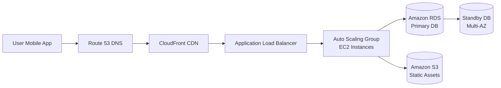
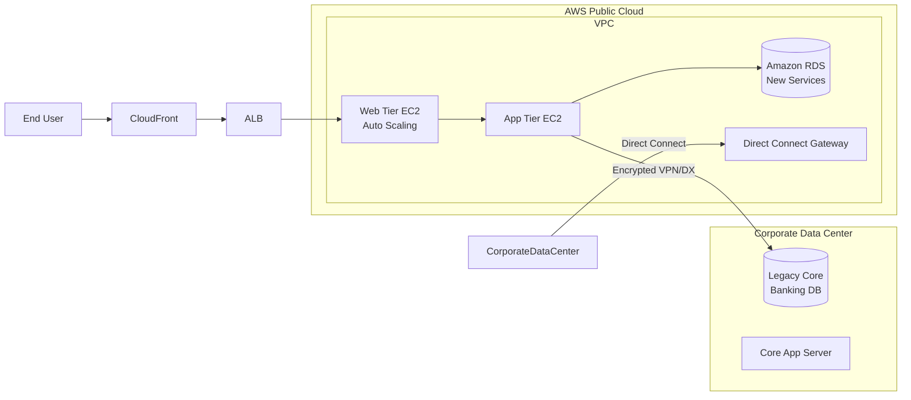

هات كوباية الشاي يا هندسة.. السهرة دي بتاعتنا وهنفصص AWS معمارياً وتقنياً من غير كروتة

احنا النهاردة داخلين على Domain 1 اللي هو Cloud Concepts، وده بيمثل حوالي 24% من أسئلة امتحان الـ CLF-C02. الـ Slides اللي معاك دي مجرد talking points، عشان كده هناخد كل نقطة ونشقها شق معماري وتقني بعمق enterprise-level، كأننا بنصمم infrastructure لشركة FinTech أو Healthcare ERP.

خلينا نبدأ بأول مفهومين أساسيين: **What is Cloud Computing** و **The Deployment Models of the Cloud**. وبعد ما نشرحهم بالتفصيل هنقف ونستنى إشارة "كمل" عشان ندخل على اللي بعدهم.

---

## 1. Enterprise Case Study — ليه أساسًا بنتكلم عن Cloud Computing؟

تخيل معايا شركة ناشئة في مجال الخدمات المالية الرقمية (Digital Banking) في مصر، عندها تطبيق موبايل بيتيح للمستخدمين فتح حسابات وتحويل فلوس ودفع فواتير. في البداية، الشركة اشترت سيرفرين ووضعتهم في مكتب صغير، وشغلت قاعدة بيانات MySQL على واحد فيهم، وواجهة التطبيق على التاني. كل حاجة تمام لحد ما بيدأ يزيد عدد المستخدمين.

المشاكل اللي بتبدأ تظهر واحدة واحدة:

- **Scaling limitations**: لما الحمل يزيد في آخر الشهر (مرتبات، تحويلات)، السيرفرات مش قادرة تستوعب. محتاجين نشتري أجهزة جديدة، والـ procurement بياخد أسابيع. ده معناه downtime وخسارة عملاء.
- **Power outages and cooling**: مكتب صغير مش Data Center، انقطاع الكهرباء بيحصل، والتكييف مش كافي، والسيرفرات بتسخن وبتحصل أعطال.
- **Disaster Recovery**: لو حصل حريق أو زلزال (وارد)، الداتا كلها هتضيع. مفيش خطة لاستعادة الخدمة.  
- **Operational burden**: محتاجين فريق 24/7 يراقب الأجهزة، يحدث الـ patches، يعمل backups يدويًا. التكلفة البشرية عالية جدًا.
- **Capital Expenditure (CAPEX)**: فلوس كتير مدفوعة مقدمًا في أجهزة ممكن متستخدمش بكامل طاقتها بعد peak معين. صعب جدًا تتنبأ بحجم الموارد اللي هتحتاجها بعد سنة.

الشركة بتحتاج حل يسمح ليها بـ:
- زيادة الموارد لحظيًا في أوقات الذروة وتقليلها بعد كده.
- الدفع حسب الاستخدام الفعلي (pay-as-you-go).
- عدم القلق من صيانة الأجهزة أو التبريد أو الكهرباء.
- تواجد في أكثر من موقع جغرافي عشان الـ latency والـ disaster recovery.
- الامتثال لمتطلبات البنك المركزي فيما يخص أمان البيانات.

ده بظبط اللي بتقدمه الـ Cloud Computing.

---

## 2. AWS Architectural Solution — إزاي الـ Cloud بيحل المشكلة دي؟

بدل ما نشتري أجهزة ونستضيفها محليًا، هنشغّل البنية التحتية بتاعتنا بالكامل على AWS. هنستخدم مجموعة من الـ Services اللي تخدمنا:

- **Amazon EC2** عشان السيرفرات الافتراضية، نختار instance type مناسب لحجم الـ traffic.
- **Amazon RDS** عشان قاعدة البيانات المُدارة (Managed Database)، AWS بتتولى backups وpatching.
- **Auto Scaling** لزيادة عدد الـ EC2 instances تلقائيًا لما الـ CPU يتعدى 70%، وتقليلها لما يقل الحمل.
- **Elastic Load Balancing** لتوزيع الطلبات على الـ instances.
- **Amazon S3** لتخزين الصور والمستندات (مثلاً صور الهوية).
- **AWS CloudFormation** لكتابة البنية كلها كـ Infrastructure as Code، بحيث نقدر ننشئ بيئة مماثلة في Region تانية بضغطة زر.

السيناريو ده بيحوّل الـ CAPEX لـ OPEX، ويقلل الـ Total Cost of Ownership (TCO) بشكل كبير، ويدي مرونة عالية جدًا. التطبيق بقى قادر يتحمل ضغط موسمي من غير أي انقطاع، ولو حصل فشل في Region معين، نقدر نفعّل خطة Disaster Recovery في Region تانية.

مخطط مبسط لتدفق الطلب (Request Flow) بعد الانتقال للـ Cloud:

---

## 3. Deep Technical Breakdown — What is Cloud Computing?

### ⚙️ التعريف التقني الحقيقي
الـ Cloud Computing هو نموذج لتوصيل خدمات تكنولوجيا المعلومات (compute, storage, databases, networking, software) عبر الإنترنت بشكل **On-Demand** مع **Pay-as-you-go pricing**. المستخدم بيوصل لمجموعة ضخمة من الموارد اللي ممكن يوفرها في دقايق بدل ما يستنى أسابيع عشان يشتري أجهزة.

AWS بتمتلك وتدير الـ hardware في Data Centers موزعة حول العالم، والمستخدم بيستخدم الموارد دي من خلال Web Console أو APIs.

### 🧩 المكونات الأساسية لأي سيرفر (اللي كان لازم تشتريها في الـ On-Premises)
أي سيرفر تقليدي بيتكون من:
- **Compute (CPU)**: قوة المعالجة.
- **Memory (RAM)**: الذاكرة العشوائية.
- **Storage**: مساحة لتخزين الملفات.
- **Database**: تخزين منظم للبيانات، بيحتاج برامج إدارة.
- **Networking**: رواتر، سويتشات، كابلات، DNS.

في الـ Cloud، كل عنصر من دول بقى خدمة مستقلة (Service)، تقدر تطلبها وتدفع مقابل استخدامها. ده اسمه **Decoupling**، وبيسمح لك تختار أفضل technologies لكل طبقة بدون ما تتقيد بجهاز واحد.

### 📊 الخصائص الخمسة الأساسية للـ Cloud Computing (Five Essential Characteristics)
الـ NIST حددت 5 خصائص لازم تتوفر في أي بيئة عشان تعتبر Cloud حقيقية، وAWS مطبقة كل ده:

1. **On-demand self-service**: أي مهندس DevOps يقدر يعمل Provisioning لموارد جديدة (EC2، RDS) باستخدام Console أو CLI بدون ما يتصل بـ AWS أو يطلب موافقة بشرية. الكلام ده بيختصر وقت الـ procurement من أسابيع لثواني.

2. **Broad network access**: الموارد بتكون متاحة عبر الإنترنت، ويمكن الوصول ليها من أي جهاز (موبايل، متصفح، أدوات CLI). ده بيسمح للفرق الموزعة تشتغل بسلاسة.

3. **Multi-tenancy and resource pooling**: AWS بتشغّل عدد كبير من العملاء على نفس الـ physical hardware باستخدام virtualization وعزل أمني تام (VPC, Hypervisor). ده معنى economies of scale اللي بتخلي الأسعار منخفضة والأداء ممتاز. كل عميل بيحس إنه شغال على جهاز خاص.

4. **Rapid elasticity and scalability**: تقدر تزود الموارد تلقائيًا (scale out) في peak time وتقللها (scale in) لما الاستخدام يقل. ده مش مجرد scalability، ده **Elasticity** اللي بتضمن إنك دافع على اللي محتاجه بالضبط في اللحظة دي.

5. **Measured service**: كل حاجة متقاسة. استخدام الـ CPU، عدد الطلبات، حجم البيانات المخزنة، نقل البيانات. الفاتورة بتجيلك بتفاصيل دقيقة. ده زي عداد الكهربا، بتدفع على اللي استهلكته. ده اسمه **metering & billing**.

### 💰 Pricing Fundamentals (روح الـ Cloud الاقتصادية)
عند AWS، الفلوس بتيجي من 3 حاجات أساسية:

- **Compute**: بتدفع على ساعة التشغيل أو الثانية (حسب OS). لو EC2 instance وقف، متدفعش حاجة (ماعدا storage متصلة).
- **Storage**: بتدفع على كل جيجابايت متخزنة شهريًا (مثلاً في S3 أو EBS).
- **Data Transfer OUT**: أي بيانات خارجة من AWS للإنترنت (Outbound) ليها تكلفة. **أما الـ Data Transfer In (الداخلة) فهي مجانية**. وده مهم عشان الشركات اللي عندها عمليات رفع كبيرة (زي تحميل backups) بتستفيد.

> ⭐ في الامتحان: AWS بتركز على إن **Data Transfer IN is free**، وده توفير كبير مقارنة بشركات الـ on-premises اللي كان لازم تدفع على كل حاجة جوه وبره.

### 🔐 أثر الـ Cloud على الأمان — Shared Responsibility Model (نظرة عامة)
الانتقال للـ Cloud مش معناه إنك رميت مسؤولية الأمان كله على AWS. النموذج ده بيقول:
- **AWS responsible FOR Security OF the Cloud**: تأمين الـ hardware, hypervisor, networking, data centers. يعني الأمان الفيزيائي والافتراضي التحتي.
- **Customer responsible FOR Security IN the Cloud**: تأمين الـ OS, application, data, IAM permissions, firewall rules, encryption keys.

لما تيجي تشغل EC2، AWS مش هتعمل update للـ patches بتاعت الـ OS. ده دورك. لكن هي بتأمن إن الـ hypervisor مش مخترق.

> ⚠️ الامتحان بيحاول يوقعك هنا: يتسأل "من المسؤول عن تشفير البيانات في S3؟" الإجابة: العميل (أنت). حتى لو S3 بتوفر encryption capability، تقعيلها مسؤوليتك.

---

### ✅ Use Case:
أي شركة محتاجة بنية تحتية مرنة بدون استثمار رأسمالي عالي، محتاجة تنطلق بسرعة وتنافس عالميًا.
### ⚠️ NOT Use Case:
لو عندك أنظمة قديمة جدًا (Legacy Mainframes) محتاجة أجهزة مخصصة بدون افتراضية، ممكن تكون Outposts أو Hybrid Cloud أنسب في الأول.
### 💰 Pricing Model:
Pay-as-you-go (دفع مقابل استخدام compute بالثانية، تخزين بالجيجابايت، ونقل بيانات خارجي فقط).
### 🔐 Shared Responsibility:
AWS مسؤولة عن أمان الـ cloud (المادي والافتراضي الأساسي)، والعميل مسؤول عن كل حاجة جوه (Guest OS, App, Data, IAM).
### ⭐ CLF-C02 Exam Tip:
الخصائص الخمسة للـ Cloud Computing (On-demand self-service, Broad network access, Multi-tenancy, Elasticity, Measured service) بيجو في أسئلة كتير. اربطهم بالسيناريوهات العملية.

---

## 1. Enterprise Case Study — ليه اختيار Deployment Model قرار مصيري؟

نفس شركة الـ Digital Banking اللي احنا فيها، البنك المركزي في مصر عنده متطلبات صارمة: بيانات العملاء الحساسة (أرقام حسابات، أرصدة) لازم تبقى مخزنة على سيرفرات موجودة فعلاً داخل حدود الدولة، وممنوع خروجها لـ Public Cloud من غير ضوابط. لكن في نفس الوقت، الشركة عايزة تستخدم خدمات متقدمة زي تحليل البيانات باستخدام AWS EMR أو Amazon Rekognition لفحص صور الهويات والوثائق. هل ترمي كل حاجة في السحابة العامة؟ لا. هل تفضل في الـ On-Premises التقليدي ومتستفدش من السحابة؟ لا.

الشركة محتاجة نموذج هجين (Hybrid Cloud): البيانات الحساسة تفضل على سيرفرات خاصة في Data Center محلي، وباقي الخدمات اللي مش حساسة (زي واجهة الموقع، الـ Analytics) تكون على AWS Public Cloud مع ربط آمن بينهم عبر Direct Connect أو VPN. كمان ممكن يكون عندها بيئة تطوير واختبار منعزلة تمامًا على Private Cloud عشان السرية.

أما شركة ناشئة صغيرة في مجال التجارة الإلكترونية (E-commerce) مبتديش أولوية للـ data residency علشان لسه مش مقيدة بتشريعات، فممكن تستخدم Public Cloud بالكامل. وشركة حكومية بتقدم خدمات المواطنين ممكن تحتاج Private Cloud بالكامل على الـ Outposts عشان السيطرة الكاملة.

---

## 2. AWS Architectural Solution — نماذج النشر الثلاثة

### 🅰️ Public Cloud
ده الشكل الافتراضي للـ Cloud. كل الموارد بتكون مملوكة ومدارة من طرف ثالث (AWS) ومتاحة عبر الإنترنت. في حالتنا، الشركة بتبني كل حاجة على AWS: EC2, RDS, S3, Lambda… الخ. الفوائد:
- مرونة وسرعة مطلقة.
- دفع حسب الاستخدام.
- عدم مسؤولية عن الـ hardware.

### 🅱️ Private Cloud
سحابة خاصة مخصصة لمؤسسة واحدة فقط. ليست متاحة للعامة. ممكن تتحقق بطريقتين:
- **On-premises Private Cloud**: الشركة تبني数据中心 خاص بيها باستخدام تقنيات زي OpenStack و VMware، وتديره بنفسها.
- **Virtual Private Cloud on AWS**: باستخدام VPC وSubnets، تقدر تعزل مواردك في Public Cloud لكنها بحكم التصميم تعتبر Private لأنها مخصصة ليك. لكن الـ Private Cloud كمصطلح في الـ Deployment Models بيشير غالبًا لـ on-premises private cloud. لكن AWS عندها مفهوم **Amazon Virtual Private Cloud (VPC)** اللي بيدي عزل شبكي كامل جوه السحابة العامة.

في حالة البنك، ممكن يستخدم Private Cloud على AWS Outposts: أجهزة Rack بتاعت AWS تتسلم في مقر البنك وتديرها AWS، وتبقى جزء من الـ AWS Region، لكن فعليًا الداتا تحت سيطرة العميل في الـ on-premises.

### 🅲 Hybrid Cloud
مزيج بين On-Premises (أو Private Cloud) و Public Cloud. بيتم ربطهم باستخدام **AWS Direct Connect** (اتصال مخصص عالي السرعة) أو **VPN** عبر الإنترنت. ده النموذج الأمثل لما يكون في التزامات تنظيمية أو أنظمة قديمة لا يمكن نقلها. زبوننا البنكي هيقسم workloads: Core Banking System على سيرفرات خاصة، وWeb Tier وMobile Backend على AWS، مع تكامل عبر APIs مؤمنة.

مخطط معماري يوضح الـ Hybrid:

---

## 3. Deep Technical Breakdown — Deployment Models

### 🧠 Private vs Public vs Hybrid: فهم أعمق للأبعاد

| البعد | Public Cloud | Private Cloud | Hybrid Cloud |
|-------|--------------|---------------|--------------|
| **الملكية** | مزود خارجي (AWS) | المنظمة نفسها | خليط |
| **الإدارة** | AWS تدير الكل | المنظمة تدير كل شيء | جزئين: مدار بواسطة AWS وجزء محلي |
| **الأمان** | متعدد المستأجرين (multi-tenant) | مستأجر واحد (single-tenant) عزل كامل | بيانات حساسة في الخاص، الباقي في العام |
| **التكلفة** | OPEX (تشغيل) | CAPEX + OPEX (استثمار+تشغيل) | مزيج، ممكن توفير |
| **الامتثال** | بيناسب معظم الحالات، لكن مش كل التشريعات | تحكم كامل، مثالي للبيانات شديدة الحساسية | يفي بمتطلبات data residency مع استعمال خدمات حديثة |
| **التوسع** | غير محدود عمليًا | محدود بالسعة المادية | توسع سحابي للمكونات المناسبة |

### 📌 نصائح معمارية وإنتاجية
- الـ Hybrid Cloud مش مجرد ربط شبكة. محتاج إدارة هوية موحدة (Federated Identity) عشان المستخدمين يوصلوا للـ resources في البيئتين بنفس credentials بدون تعقيد. AWS IAM Identity Center (AWS SSO سابقًا) بيساعد في ده.
- ترحيل الـ Workloads يبقى تدريجي: ابدأ بالـ low-risk applications، ثم انتقل لتطبيقات أكثر تعقيدًا. CAF (Cloud Adoption Framework) اللي هنتكلم عنه قدام بيحدد خطوات transformation.
- AWS Outposts و Local Zones و Wavelength بيخدموا حالات استخدام هجينة ومتطورة، بس الفكرة الأساسية: اختيار الـ deployment model المناسب يعتمد على أربع عوامل: **Compliance, Latency, Cost, Existing Investments**.

> ⭐ في الامتحان: سؤال مشهور: "شركة تحتاج لتشغيل تطبيق يحتوي على بيانات مالية حساسة ويجب أن تبقى داخل حدود الدولة، لكنها تريد استخدام AWS Services لتحليل البيانات. ما هو النموذج الأمثل؟" الإجابة: Hybrid Cloud. لأنك تستطيع إبقاء البيانات الحساسة في Private DC وترسل بيانات مجهولة للتحليل لـ AWS.

> ⚠️ نقطة مهمة: Public Cloud لا تعني أن بياناتك مكشوفة للعامة. لا يزال بإمكانك تشفيرها، عزل الشبكات (VPC)، ووضع جدران نارية. لكن "Public" هنا تعني أن البنية التحتية مشتركة بين عدة عملاء نظريًا مع عزل قوي.

### 🔁 أثر نموذج النشر على Shared Responsibility Model
في Private Cloud (on-premises)، أنت مسؤول عن كل شيء من الأمان الفيزيائي لحد الـ Application. في Public Cloud، المسؤولية مشتركة كما شرحنا. وفي Hybrid Cloud، المسؤولية متغيرة لكل مكون: اللي في AWS تطبق عليه shared model، واللي في مقرك تطبق عليه المسؤولية الكاملة.

---

### ✅ Use Case:
- **Public Cloud**: E-commerce platform تحتاج سرعة في النشر وتوسع غير محدود.
- **Private Cloud**: مؤسسة حكومية تتعامل مع بيانات مواطنين سرية وتحتاج تحكم مطلق.
- **Hybrid Cloud**: بنوك، شركات تأمين، تختلط فيها متطلبات تشريعية مع الرغبة في الاستفادة من الابتكار السحابي.
### ⚠️ NOT Use Case:
استخدام Hybrid Cloud فقط لوجود بعض السيرفرات القديمة التي لا يمكن تحويلها، في حين أن إعادة تصميم التطبيق (Refactoring) قد يكون أفضل على المدى الطويل.
### 💰 Pricing Model:
- Public: Pay-as-you-go.
- Private: CAPEX مقدمًا + OPEX للإدارة.
- Hybrid: مزيج، يمكن تحسين التكاليف عبر إبقاء الثابت على Private والنمو على Public.
### 🔐 Shared Responsibility:
- Public: AWS مسؤولة عن الأمان OF the cloud، العميل IN.
- Private: العميل مسؤول عن كل شيء.
- Hybrid: تعتمد على مكان تواجد المكون.
### ⭐ CLF-C02 Exam Tip:
دايمًا اربط Deployment Model باحتياجات compliance و data residency. الامتحان بيحب يخلط بين "Elasticity" و "Scalability" لكن في سياق النماذج، الفارق بين أنواع السحابة هو من يسيطر على البنية التحتية.

---

## 1. Enterprise Case Study — ليه الـ 6 Advantages دول مش بس مميزات، دول نموذج عمل جديد؟

خلينا نرجع لشركة الـ Digital Banking بتاعتنا المصرية. قبل الـ Cloud، الشركة كان عندها 3 سيرفرات ماديين اشترتهم بـ 300,000 جنيه (CAPEX)، بالإضافة لـ 10,000 جنيه شهريًا كهرباء وتبريد وصيانة (OPEX). التوسع كان كابوس: لو عايزين يزودوا سيرفر رابع، محتاجين أسبوعين لحد ما المورّد يوفره، ويدفعوا 100,000 جنيه تاني مرة واحدة، مع إن الحمل العالي بيحصل بس في آخر 3 أيام من كل شهر (تحويلات المرتبات). باقي الشهر، الـ 3 سيرفرات شغالين بـ 20% من طاقتهم (idle capacity). ده إهدار فظيع لرأس المال (underutilized assets).

لما قرروا يفكروا في التوسع لدول الخليج (مثلاً الإمارات)، اكتشفوا إن لازم يبنوا Data Center صغير هناك أو يستضيفوا سيرفرات، وده معناه استثمار جديد بالدولار، وتكاليف سفر للفريق، وتعقيدات تراخيص، وتأخير شهور. الـ Time-to-Market كان بطيء جدًا. والأسوأ، لو حصل انقطاع كهرباء في المقر الرئيسي في مصر، كل الخدمة تقع في البلدين لإن مفيش failover.

لما الشركة قررت ترحّل للـ AWS Public Cloud، استفادت بشكل مباشر من المزايا الستة اللي غيرت شكل Business Model بتاعها بالكامل.

---

## 2. AWS Architectural Solution — تطبيق المزايا الستة على البنية التحتية

المزايا دي مش نظريات، دي تنعكس مباشرة على التصميم:

- **1. Trade CAPEX for OPEX**: بدل ما يشتروا أجهزة، استأجروا سعة افتراضية. حولوا الاستثمار المقدم لمصاريف تشغيلية شهرية يمكن التنبؤ بها وإدارتها.
- **2. Benefit from Massive Economies of Scale**: لأن AWS عندها ملايين العملاء، سعر الـ compute hour و الـ GB أقل بكتير من لو الشركة اشترت hardware وتولته بنفسها. وفّروا على الأقل 40% من التكاليف التشغيلية.
- **3. Stop Guessing Capacity**: استخدموا Auto Scaling مع CloudWatch. النظام يتوسع تلقائيًا في آخر الشهر مع الزحام، وينكمش بعدها. مفيش هدر، ومفيش downtime بسبب overload.
- **4. Increase Speed and Agility**: بدل ما يستنوا أسبوعين عشان سيرفر، DevOps team يعمل deploy لـ 10 سيرفرات في دقائق باستخدام Infrastructure as Code (CloudFormation/Terraform). تجربة الـ A/B testing بقيت أسهل.
- **5. Stop Spending Money Running and Maintaining Data Centers**: مفيش فواتير كهرباء، مكيفات، حراسة، صيانة هاردوير. الفريق الفني بقى يركز على تحسين الـ application مش تغيير الديسكات الهارد.
- **6. Go Global in Minutes**: فتحوا Region جديد في البحرين (`me-south-1`) بضغطة زر، ونشروا نفس الـ infrastructure template. Latency عند العملاء في الخليج قلّ بنسبة 70%، وامتثلوا لمتطلبات البيانات المحلية. هذا ساعدهم على دخول السوق في شهر بدل سنة.

---

## 3. Deep Technical Breakdown — Six Advantages of Cloud Computing

ده واحد من أهم المفاهيم اللي لازم تكون فاهمها بكل أبعادها المعمارية والمالية والتشغيلية.

### 💰 1. Trade Capital Expense (CAPEX) for Operational Expense (OPEX)
في الـ On-Premises، بدفع مبلغ ضخم مقدماً (CAPEX) لشراء أجهزة، تراخيص برمجيات، بناء مركز بيانات. وبعدين بدفع مصاريف تشغيل (OPEX) علشان الكهربا والصيانة والمرتبات. الـ CAPEX ده استثمار "غارق" (Sunk Cost) لو الاحتياجات اتغيرت. في الـ Cloud، انتقلت لـ **OPEX خالص تقريباً**: بتدفع الـ AWS bill شهرياً بناءً على استخدامك الفعلي. ده بيحرر رأس المال (Cash Flow) لاستثماره في الابتكار والتطوير بدل ما يكون محبوس في أجهزة.
- **الأثر المالي:** الـ TCO (Total Cost of Ownership) بيقل لأنك مش بتحتاج تدفع أقساط أجهزة، ومصاريف الصيانة بتاعتك بتقل.
- **الأثر المحاسبي:** الـ OPEX بيتخصم من الضريبة في نفس السنة، بينما الـ CAPEX بيتخصم على سنين (إهلاك). ده بيحسن الـ balance sheet.

### 🏭 2. Benefit from Massive Economies of Scale
AWS تشتري مئات الآلاف من السيرفرات، وأجهزة التكييف، واستهلاك الكهرباء بكميات مهولة، فتحصل على خصومات هائلة من الموردين. هذه المدخرات تنعكس على العميل النهائي في شكل أسعار أقل باستمرار. انت كشركة صغيرة أو متوسطة لا يمكنك أبداً أن تحصل على هذه الأسعار بمفردك. حتى أكبر الشركات المصرية لا تشتري داتا سنترات بعدد AWS. استفدت من "قوة الشراء الجماعي" بدون ما تدفع اشتراك.

### 📈 3. Stop Guessing Capacity
في الـ On-Premises، إما تحط سيرفرات أكتر من اللزوم (over-provisioning) فتدفع فلوس على حاجة مش مستخدمة، أو تحط أقل من اللزوم (under-provisioning) فيحصل Downtime وتخسر عملاء. في AWS، مع الـ Auto Scaling، الـ metric اللي يحدد الحمل (مثلاً CPU Utilization > 70%) هو اللي يحدد العدد المناسب من الـ instances تلقائياً بدون أي تدخل بشري. ده اسمه **Elasticity**: القدرة على التوسع والتقلص تلقائياً.
- **CLF-C02 Trap:** "Stop guessing capacity" ليست مجرد scalability، هي أيضًا عن إنك ما تضطرش تعمل capacity planning يدوي غلط. هي الانتقال من التخمين للقياس الفعلي.

### ⚡ 4. Increase Speed and Agility
في الـ On-Premises، توفير البنية التحتية بياخد أسابيع من طلب المشتريات، الشحن، التركيب، التكوين. في AWS، الموارد متاحة في دقائق. ده بيسمح بمنهجيات Agile و DevOps بمعناها الحقيقي. تقدر تدمّر بيئة الاختبار (Testing Environment) كل ليلة وتعيد بنائها تاني يوم، تقدر تجرب أنواع جديدة من قواعد البيانات (NoSQL vs SQL) بدون ما تشتري أجهزة عشانها. السرعة هنا مش بس في التزويد، بل في التجريب والابتكار (Experimentation).

### 🛠️ 5. Stop Spending Money Running and Maintaining Data Centers
مراكز البيانات التقليدية تتطلب صيانة روتينية لا تنتهي: إدارة الطاقة والتبريد، عمر البطاريات، أمان المبنى، كاميرات المراقبة، موظفين 24/7. كل هذا يختفي مع الـ Infrastructure as a Service (IaaS) فما فوق. فريقك الفني يتوقف عن "صيانة المبنى" ويتفرغ لـ "تشغيل التطبيق". ده يسمونه **Undifferentiated Heavy Lifting** (رفع الأثقال غير المميزة). AWS ترفعها عنك.

### 🌍 6. Go Global in Minutes
بدل ما تخطط لشهور لبناء مركز بيانات في بلد جديد، تستطيع نشر تطبيقك في أي من الـ 30+ AWS Regions حول العالم بنفس الـ scripts والأدوات. هذا ليس فقط للـ Latency ولكن لـ:
- **Disaster Recovery (DR)**: توزع حملك بين Regions.
- **Compliance (Data Residency)**: تلتزم بتشريعات الدولة بإبقاء البيانات داخلها.
- ده يحول استراتيجية الـ International Expansion من مشروع ضخم إلى مشروع DevOps عادي.

> ⭐ في الامتحان: كثيراً ما يُسأل: "ما هي الميزة التي تمكن الشركة من إطلاق خدماتها عالمياً بسرعة؟" الإجابة هي "Go Global in Minutes". وأيضاً "ما هي الميزة التي تغني عن التخمين في حجم الموارد؟" هي "Stop Guessing Capacity".

> ⚠️ الامتحان بيحاول يوقعك هنا: يخلط بين Elasticity (المرونة اللحظية مع تغير الحمل) وبين ميزة توفير CAPEX. الميزة رقم 3 (Stop Guessing) تتعلق بـ Elasticity، بينما رقم 1 تتعلق بالتحوّل المالي.

> 💡 تذكر: Elasticity (التوسع والتقلص التلقائي) هي الآلية التي تحقق ميزة "Stop Guessing Capacity". هم مرتبطون لكن السؤال قد يفصلهم: Elasticity = تقني، Stop guessing = فائدة أعمال.

---

### ✅ Use Case:
أي مؤسسة تريد تحسين Cash Flow، التوسع السريع، وتريد لفريقها التركيز على الابتكار بدلاً من صيانة الماكينات.
### ⚠️ NOT Use Case:
مش مناسب إذا كانت هناك قيود تنظيمية تمنع OPEX وتُلزم بـ CAPEX فقط، أو إذا كانت أنظمة قديمة جداً لا يمكن محاكاتها (Legacy Simulation).
### 💰 Pricing Model:
تعكس المزايا نموذج Pay-as-you-go، وتقليل CAPEX يحرر الميزانية.
### 🔐 Shared Responsibility:
هذه المزايا كلها ممكنة لأن AWS هي المسؤولة عن أمان و صيانة الـ Cloud (المادي)، وأنا كعميل مسؤول عن التطبيق والبيانات.
### ⭐ CLF-C02 Exam Tip:
افهم كل ميزة كأنها "فائدة أعمال" (Business Benefit)، ليس "خاصية تقنية" (Technical Feature). الامتحان يسأل عن هذه المزايا في سيناريوهات تختار فيها الفائدة المناسبة لحل مشكلة معينة.

---

[أنا شرحت الجزء ده تقنياً بالتفصيل.. قولي "كمل" عشان أدخل على المواضيع اللي بعدها بنفس العمق]