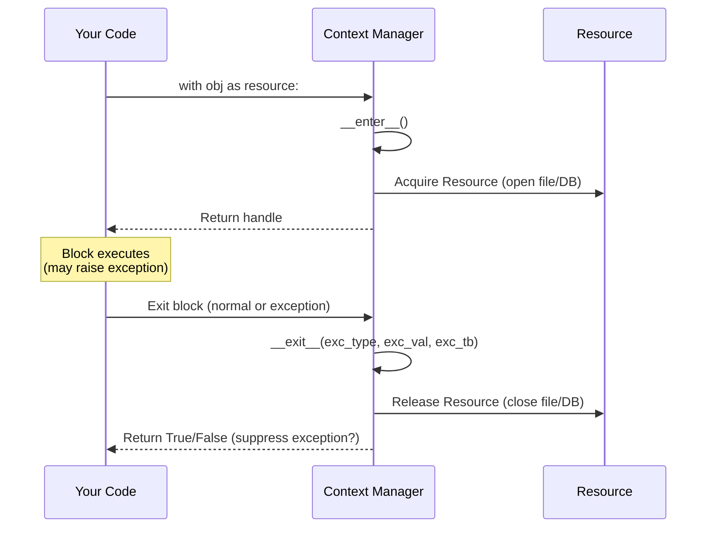
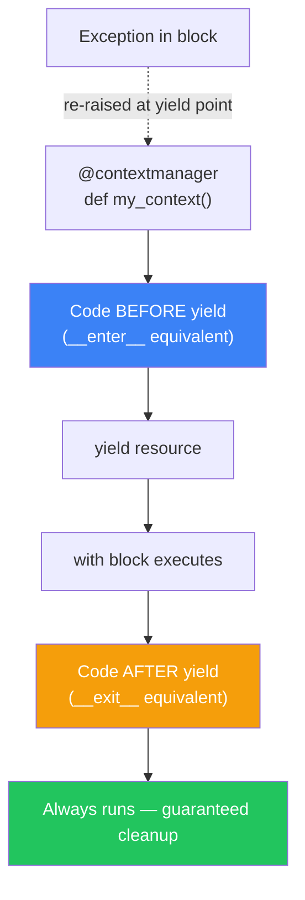
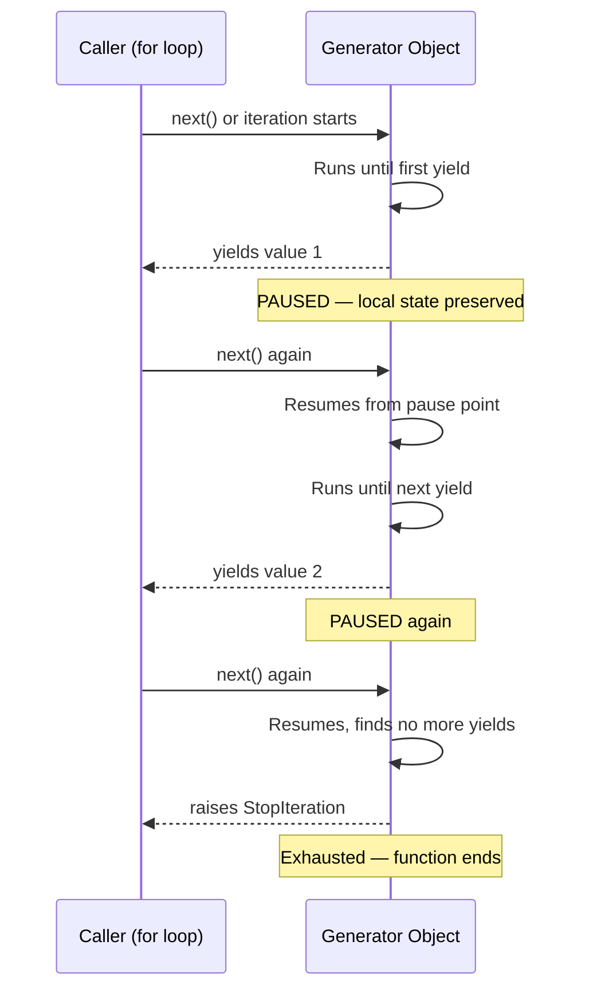
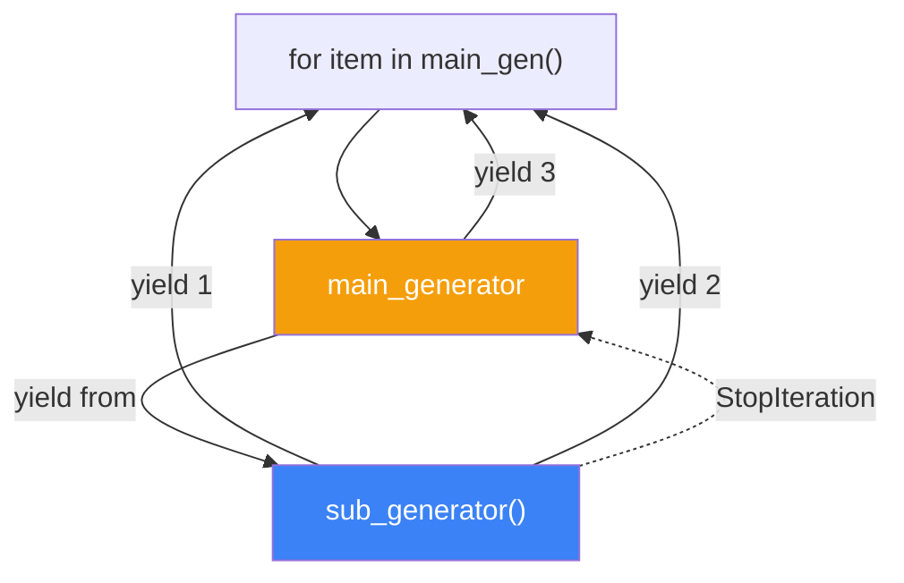
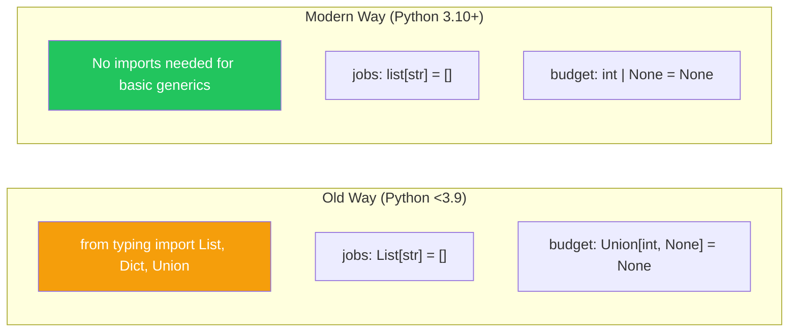
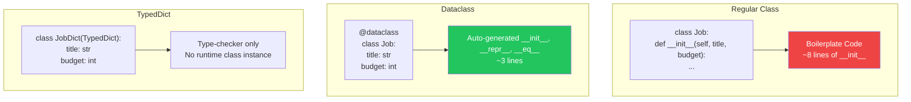

# الفصل الخامس — Context Managers، Generators، والـ Type Hints الحديثة

> **المتطلبات:** [[04-Python-Decorators]] — لازم تكون فاهم إزاي الـ Decorators بيشتغلوا كـ Higher-Order Functions، وإزاي بيخلقوا بيئة مغلقة (Closure) حوالين الـ function الأصلية. الفصل ده هيستخدم نفس طريقة التفكير عشان يبني Generators وContext Managers من الصفر، ويضيف عليها Type Hints عشان الكود يبقى bulletproof.

---

## البداية — إدارة الموارد: القاتل الصامت

تخيّل معايا إنك فاتح connection على الـ database عشان تجيب بيانات الـ jobs. لو حصل exception فجأة بعد ما فتحت الـ connection، مين هيقفله؟

```python
conn = get_db_connection()
jobs = conn.execute("SELECT * FROM jobs").fetchall()
# 💥 Exception هنا!
conn.close()  # 💀 السطر ده مش هيتنفذ أبداً
```

النتيجة؟ Connection مفتوح في الـ database للأبد (أو لحد ما الـ timeout يخلص). في production، ده معناه إن بعد 1000 request، الـ database هترفض أي connection جديدة. كارثة.

الحل التقليدي هو `try/finally`:

```python
conn = get_db_connection()
try:
    jobs = conn.execute("SELECT * FROM jobs").fetchall()
finally:
    conn.close()  # ✅ مضمون التنفيذ حتى مع exception
```

بس ده verbose. كل مرة تفتح file، connection، أو lock، لازم تكرر نفس الـ pattern. Python قالتلك: "ليه متكتبش كل ده؟ استخدم `with`."

---

## [[01-Context-Managers-Deep-Dive]] — الـ `with` statement: تشريح داخلي

### 🧠 الشرح النظري

الـ Context Manager هو مجرد **بروتوكول** — أي object بينفذ طريقتين معينتين تقدر تستخدمه مع `with`.

الطريقتين هما:
- **`__enter__(self)`**: بتتنادى لما بتدخل جوا الـ `with` block. هي المسؤولة عن فتح الـ resource (فتح file، بدء transaction، أخذ lock) وبترجع الـ object اللي هتتعامل معاه (زي file handle).
- **`__exit__(self, exc_type, exc_val, exc_tb)`**: بتتنادى **مهما حصل** جوا الـ block — سواء خلص عادي أو حصل exception. هي المسؤولة عن تنظيف الـ resource (قفل file، commit أو rollback transaction، تحرير lock).

تخيّل الموضوع زي "بواب أوتوماتيكي". أول ما توصل، بيفتحلك الباب (`__enter__`). لما تخلص وتخرج، بيقفل الباب وراك تلقائياً (`__exit__`). لو حصلت مشكلة جوا وأنت ماشي، البواب لسه موجود وهيقفل الباب (`__exit__` بتستقبل الـ exception details وتقرر تتعامل معاها إزاي).

الجميل في الموضوع إنك مش محتاج تكتب `try/finally` بنفسك. الـ `with` بتضمن إن `__exit__` هتتنادى دايمًا — حتى لو نسيت أو حصل exception.

### 📊 Visualization



### 💻 Micro-Example

```python
class ManagedFile:
    def __init__(self, filename, mode):
        self.filename = filename
        self.mode = mode

    def __enter__(self):                 # runs on entry
        self.file = open(self.filename, self.mode)
        return self.file                 # this becomes the 'as' variable

    def __exit__(self, exc_type, exc_val, exc_tb):  # runs on exit NO MATTER WHAT
        self.file.close()                # guaranteed cleanup

with ManagedFile("jobs.txt", "w") as f:
    f.write("Backend Dev")
# file is automatically closed here — even if write() raised an exception
```

---

## [[02-Contextlib-Simplified]] — `contextlib`: كتابة Context Managers في سطر

### 🧠 الشرح النظري

كتابة Class كامل عشان تعمل Context Manager بسيط ممكن تبقى overkill. Python وفرتلك `contextlib.contextmanager` — Decorator بيحوّل أي **Generator Function** لـ Context Manager كامل.

الـ Generator function هنا بتحتوي على `yield` واحدة بس (غالباً). الكود اللي قبل الـ `yield` ده هو الـ `__enter__`. الكود اللي بعد الـ `yield` ده هو الـ `__exit__`.

الـ `yield` نفسها بترجع الـ resource (أو `None` لو مفيش). لو حصل exception جوا الـ `with` block، الـ generator بيوقف، والـ exception بتترمي تلقائياً من نقطة الـ `yield`. إنت تقدر تمسكها بـ `try/except` حواليها لو عايز تسكتها.

تخيّل إنك بتعمل كوبري متحرك. قبل ما تعدي، بتفتح الكوبري (كود قبل `yield`). بتعدي (الـ `with` block). بعد ما تعدي، بتقفل الكوبري تلقائياً (كود بعد `yield`). حتى لو حصل زلزال وأنت بتعدي، الكوبري هيتقفل تلقائي وراك.

### 📊 Visualization



### 💻 Micro-Example

```python
from contextlib import contextmanager

@contextmanager
def managed_file(filename, mode):
    f = open(filename, mode)           # __enter__ logic
    try:
        yield f                        # pass resource to 'as' block
    finally:
        f.close()                      # __exit__ logic — ALWAYS runs

with managed_file("jobs.txt", "w") as f:
    f.write("Backend Dev")
```

---

## [[03-Generators-And-Yield]] — الـ Generator: Function بـ "ذاكرة"

### 🧠 الشرح النظري

الـ Generator هو نوع خاص من الـ functions اللي بدل ما ترجع قيمة واحدة بـ `return` وتقفل، بتقدر "توقف" تنفيذها وترجع قيمة بـ `yield`، وبعدين تكمل من حيث ما وقفت لما تتنادى تاني.

لما الـ Python interpreter بيشوف `yield` جوا function، بيحوّلها تلقائياً لـ **Generator Function**. بدل ما ترجع قيمة عادية، بترجع **Generator Object** — وده نوع من الـ **Iterators**.

الـ Generator Object ده "كسول" (Lazy). مش بينفذ الكود بتاع الـ function طول ما إنتش طلبت القيم منه (عن طريق `next()` أو `for` loop). ده بيخليه مثالي للتعامل مع كميات ضخمة من البيانات. بدل ما تحمل مليون row من الـ database في الـ RAM مرة واحدة، الـ generator يطلعلك row row على حسب ما تستهلكهم.

تخيّل إن الـ Generator زي "كتاب كبير". بدل ما تشيل الكتاب كله وتقراه في مرة واحدة (زي list)، أنت بتقرا صفحة، تحط علامة، تقفل الكتاب. لما ترجع تاني، تفتح من العلامة وتقرا الصفحة اللي بعدها. الـ `yield` هي الصفحة اللي بتسلمهالك، والـ function state هو العلامة.

### 📊 Visualization



### 💻 Micro-Example

```python
def read_jobs_in_batches(file_path, batch_size):
    with open(file_path, 'r') as f:
        batch = []
        for line in f:
            batch.append(line.strip())
            if len(batch) == batch_size:
                yield batch                   # return current batch and PAUSE
                batch = []                    # resume here on next iteration
        if batch:
            yield batch                       # return remaining items

for job_batch in read_jobs_in_batches("jobs.txt", 100):
    process(job_batch)                        # only 100 jobs in memory at a time
```

---

## [[04-Generator-Delegation]] — `yield from`: تفويض المهمة لـ Generator تاني

### 🧠 الشرح النظري

أحياناً بتبقى عايز تعمل Generator بيجمع data من مصادر مختلفة أو Generators تانية. بدل ما تعمل `for item in sub_generator: yield item` (وده كان بيعمل overhead على كل yield)، Python 3.3 قدمت `yield from`.

`yield from sub_generator` بتعمل تفويض كامل. بتفتح قناة اتصال مباشرة بين الـ caller والـ sub_generator. أي `next()` بتناديها على الـ generator الرئيسي بتمرر مباشرةً للـ sub_generator. أي قيمة الـ sub_generator بيعملها `yield` بتطلع مباشرةً للـ caller. لما الـ sub_generator يخلص (يرفع `StopIteration`)، الـ value بتاعته بترجع كأنها `return value` من `yield from`.

ده بيخلي الكود أنضف بكتير، وبيخلي الـ recursion في الـ generators ممكنة وسهلة. تخيّل مدير مشروع عنده Team Lead. بدل ما المدير يروح لكل developer فردي (`for dev in team: yield dev.work()`)، المدير بيفوض الـ Team Lead (`yield from team`). الـ Team Lead هو المسؤول عن إدارة developers بتوعه، والمدير بيتعامل مع الـ output مباشرة.

### 📊 Visualization



### 💻 Micro-Example

```python
def backend_jobs():
    yield "Python Dev"
    yield "Django Dev"

def frontend_jobs():
    yield "React Dev"
    yield "Angular Dev"

def all_hirelink_jobs():
    yield from backend_jobs()      # delegates directly to backend generator
    yield from frontend_jobs()     # delegates directly to frontend generator
    yield "DevOps Engineer"        # then continues its own logic

print(list(all_hirelink_jobs()))   # ['Python Dev', 'Django Dev', 'React Dev', 'Angular Dev', 'DevOps Engineer']
```

---

## [[05-Modern-Type-Hints]] — Type Hints الحديثة: كود Bulletproof بدون runtime cost

### 🧠 الشرح النظري

Python هي **Dynamically Typed** — المتغير ممكن يشاور على int وبعدين string عادي. ده بيدي مرونة رهيبة، لكنه بيخلي الـ bugs تظهر متأخر (في runtime) وممكن تكسر production.

**Type Hints** (اللي اتضافت في Python 3.5 واتطورت جداً) مش بتتفحص في runtime (Python بتتجاهلها تماماً أثناء التنفيذ). هي بس **metadata** بتستخدمها أدوات خارجية زي `mypy` أو الـ IDE بتاعك (PyCharm, VSCode) عشان تعملك static analysis وتقولك "إنت بتبعث string في مكان المفروض ياخد int" قبل ما تشغل الكود.

الـ Modern Syntax (Python 3.10+) بقت أبسط بكتير:
- **Union Types:** بدل `from typing import Union` و `Union[int, str]`، دلوقتي تقدر تكتب `int | str`. المعنى: "يا إما int يا إما str".
- **Built-in Generics:** بدل `from typing import List, Dict`، دلوقتي تقدر تكتب `list[str]` و `dict[str, int]` مباشرةً. (من Python 3.9).
- **`Optional`:** بدل `Optional[str]`، دلوقتي تقدر تكتب `str | None`. ده أوضح بكتير.

تخيّل Type Hints زي "لافتات المرور". العربية (Python runtime) مش بتقرا اللافتات — هي ماشية. بس السواق (المبرمج) والمرور (mypy) بيقرأوها عشان يتأكدوا إن مفيش حد هيدخل في شارع غلط أو يتخبط قبل ما يوصل.

### 📊 Visualization



### 💻 Micro-Example

```python
# Modern Python 3.10+ Type Hints (PEP 604)
def process_job_budget(job_title: str, amounts: list[int]) -> dict[str, int | None]:
    result: dict[str, int | None] = {}
    for amount in amounts:
        result[job_title] = amount if amount > 0 else None
    return result

# Function signature is self-documenting and IDE/MyPy-friendly
data = process_job_budget("Backend Dev", [5000, -100, 7000])
```

---

## [[06-Dataclasses-And-TypedDict]] — بدائل أخف للـ Classes والقواميس

### 🧠 الشرح النظري

لما بتبني API أو بتتعامل مع JSON data، بتلاقي نفسك كاتب Class كتير بس عشان تحتفظ ببيانات بسيطة، وكل مرة بتكتب `__init__` مملة: `self.title = title` و `self.budget = budget`. ده اسمه Boilerplate Code.

الحل الأول: **`dataclasses`** (من Python 3.7).
دي Decorator بتضيفه على class عادي. بتحلله تلقائياً وتضيف `__init__` و `__repr__` و `__eq__` نيابة عنك. بدل ما تكتب 10 أسطر، بتكتب 3. ولو عايز object immutable (زي tuple بس بأسماء)، بتحط `frozen=True`.

الحل التاني: **`TypedDict`** (من Python 3.8).
ده مش class حقيقي — ده مجرد "شكل" (Shape) للـ dictionary. بتستخدمه مع Type Checker عشان تقوله: "لما تشوف dict اسمها `JobDict`، اتأكد إن فيها `title` كـ string و `budget` كـ int". مش بيضيف أي methods أو logic — بس بيدي الـ type safety من غير overhead الـ class.

تخيّل الفرق بين "نموذج تقديم وظيفة" و "وظيفة حقيقية". الـ `dataclass` هي نموذج سهل تطبعه. الـ `TypedDict` هو مجرد قائمة بالحقول المطلوبة في النموذج — مش نموذج بذاته.

### 📊 Visualization



### 💻 Micro-Example

```python
from dataclasses import dataclass
from typing import TypedDict

# 1. Dataclass: Actual class with auto-generated methods
@dataclass(frozen=True)  # frozen=True makes it immutable like a tuple
class Job:
    title: str
    budget: int

job = Job("Backend Dev", 5000)
print(job)  # Job(title='Backend Dev', budget=5000) — auto __repr__

# 2. TypedDict: Type hint for dictionaries (no runtime class overhead)
class JobDict(TypedDict):
    title: str
    budget: int

def process(data: JobDict) -> None:  # mypy ensures data has title and budget
    print(data["title"])              # Works with plain dicts at runtime
```

---

## 🎯 أسئلة الإنترفيو

**س: إزاي الـ Context Manager بيشتغل من الداخل؟ وإيه فايدة `__exit__` تحديداً؟**
> الـ Context Manager بيعتمد على بروتوكول من طريقتين: `__enter__` و `__exit__`.<br/><br/>
> **`__enter__`**: بتتنادى عند بداية الـ `with` block. مسؤولة عن تهيئة الـ resource (فتح file، بدء DB transaction) وبترجع الـ resource handle اللي هيتحط بعد `as`.<br/><br/>
> **`__exit__`**: الفائدة الحقيقية هنا. بتتنادى **مهما حصل** — سواء الـ block خلص بنجاح أو حصل Exception. بتستقبل `exc_type, exc_val, exc_tb` اللي بيمثلوا الـ exception (لو حصل). مهمتها تنظيف الـ resource (قفل file، commit أو rollback transaction). لو رجعت `True`، ده معناه إنك "ابتلعت" الـ exception ومش عايزه يطلع للـ caller. استخدامها الأساسي في الـ database connections: لو حصل exception جوا الـ transaction، الـ `__exit__` بيعمل `rollback`، ولو خلص بنجاح بتعمل `commit`.

---

**س: إيه الفرق بين `return` و `yield` في Python؟**
> الفرق جوهري في **حالة الـ function** بعد ما ترجع القيمة.<br/><br/>
> **`return`**: بترجع قيمة و **تقفل الـ function تماماً**. كل الـ local variables بتتمسح من الـ stack. لو ناديت على الـ function تاني، هتبدأ من الأول خالص.<br/><br/>
> **`yield`**: بترجع قيمة و **توقف الـ function مؤقتاً** (Pause). الـ state كله (local variables، instruction pointer) بيفضل محفوظ. لما تنادي `next()` تاني على الـ generator object، الـ function بتكمل من النقطة اللي وقفت فيها بالـ state اللي كانت موجودة. ده اسمه **Generator** وبيسمح بالـ **Lazy Evaluation** — معالجة البيانات واحدة واحدة بدل تحميلها كلها في الـ RAM.

---

**س: إيه هي `yield from` وليه هي أفضل من `for` loop في Generators؟**
> `yield from sub_generator` بتعمل **تفويض مباشر** للـ iteration.<br/><br/>
> **الطريقة القديمة:** `for item in sub_generator: yield item`. هنا كل مرة الـ sub_generator بيعمل `yield`، القيمة بتطلع للـ main generator اللي بدوره بيعمل `yield` تاني — خطوتين overhead.<br/><br/>
> **`yield from`:** بتنشئ قناة اتصال مباشرة بين الـ caller والـ sub_generator. القيم بتعدي مباشرة من غير وسيط. بالإضافة لكده، `yield from` بتقدر ترجع قيمة الـ `StopIteration` بتاعة الـ sub_generator (الـ `return value`) وتستخدمها في الـ main generator. ده مستحيل يحصل مع `for` loop. `yield from` أساسية لكتابة recursive generators وcoroutines بطريقة نظيفة.

---

**س: إيه الجديد في Type Hints في Python 3.10+ مقارنة بالإصدارات الأقدم؟**
> أهم تطور هو **PEP 604 — Union Types باستخدام `|`**.<br/><br/>
> **قديماً:** `from typing import Union` وبعدين `Union[int, str]`. كان verbose ومحتاج imports كتير.<br/><br/>
> **حديثاً:** `int | str` مباشرةً. الكود بقى أنضف بكتير وأسهل في القراءة. كمان `str | None` بقت بديل مباشر وأوضح لـ `Optional[str]`.<br/><br/>
> بالإضافة لده، من Python 3.9، بقى ينفع تكتب `list[int]` بدل `List[int]` و `dict[str, int]` بدل `Dict[str, int]` من غير ما تستورد حاجة من `typing`. ده معناه إن الـ built-in generics بقت native. كل ده في صالح إن الـ type hints تبقى أقل حشو وأوضح.

---

**س: امتى تستخدم `dataclass` وامتى تستخدم `TypedDict`؟**
> الاتنين بيحلوا مشكلة تكرار الكود، لكن في سيناريوهات مختلفة.<br/><br/>
> **`@dataclass`**: بتستخدمها لما تكون **محتاج class حقيقي**. يعني عايز تعمل instance ليه methods، أو عايز تستخدم الـ auto-generated `__eq__` عشان تقارن objects ببعض، أو عايز object immutable (`frozen=True`). مثال: `Job` model في الـ business logic بتاعك.<br/><br/>
> **`TypedDict`**: بتستخدمها لما تكون **بتتعامل مع dictionaries جاية من برا** (زي JSON response من API) أو عايز type safety لـ dictionaries من غير overhead إنشاء class instance. `TypedDict` مش بيخلي حاجة في الـ runtime — هو مجرد annotation للـ type checker. مثال: شكل الـ JSON اللي بتيجي من الـ frontend أو اللي بتبعتها لـ Elasticsearch.<br/><br/>
> القاعدة: لو هتتعامل مع object ليه سلوك (methods)، استخدم `dataclass`. لو هتتعامل مع raw data structure (مجرد حامل بيانات)، استخدم `TypedDict`.

---

## 📝 خلاصة الدرس

- **Context Managers (`with`):** بروتوكول (`__enter__`/`__exit__`) بيضمن تنظيف الموارد (files, DB connections) حتى لو حصل Exception. `contextlib.contextmanager` بيحوّل Generator لـ Context Manager في سطر.
- **Generators (`yield`):** Functions بتقدر توقف تنفيذها وترجع قيمة، وبعدين تكمل من حيث وقفت. أساس الـ Lazy Evaluation — بتعالج البيانات واحدة واحدة من غير ما تحملها كلها في الـ RAM.
- **`yield from`:** بتفوض الـ iteration لـ sub-generator. بتنشئ قناة مباشرة بين الـ caller والـ sub-generator من غير وسيط، وبتسمح بقراءة قيمة `return` بتاعة الـ sub-generator.
- **Modern Type Hints (Python 3.10+):** استخدم `int | str` بدل `Union[int, str]`. استخدم `list[str]` بدل `List[str]`. الكود بيبقى أنضف والـ IDE بيساعدك أكتر.
- **`dataclass` vs `TypedDict`:** `dataclass` للـ classes البسيطة اللي عايزلها `__init__` تلقائي. `TypedDict` عشان توصف شكل الـ dictionaries للـ type checker من غير runtime overhead.

---

