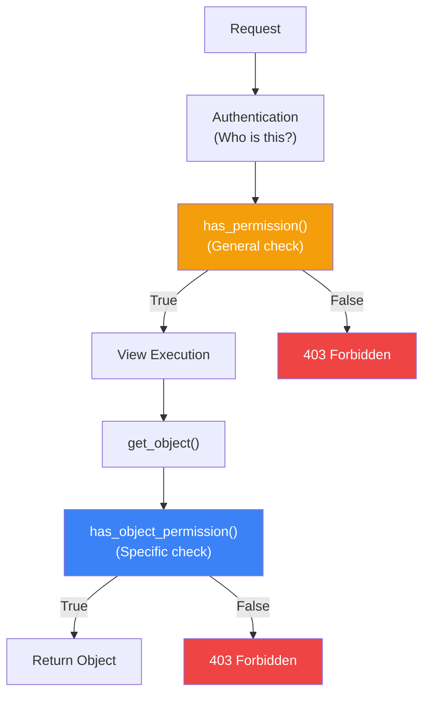
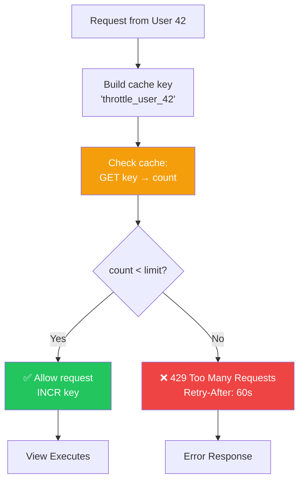
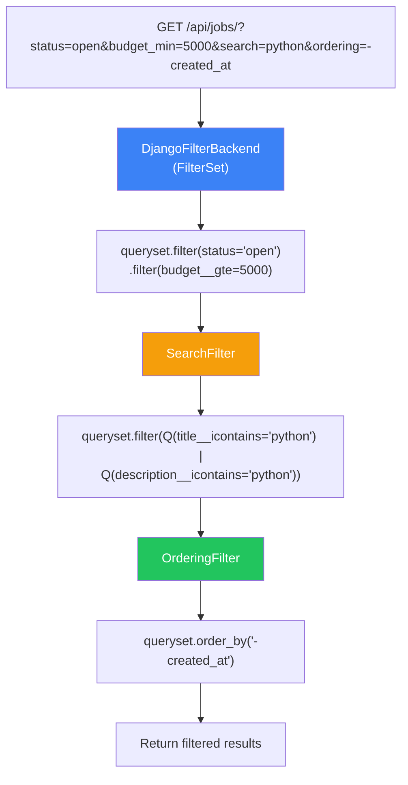
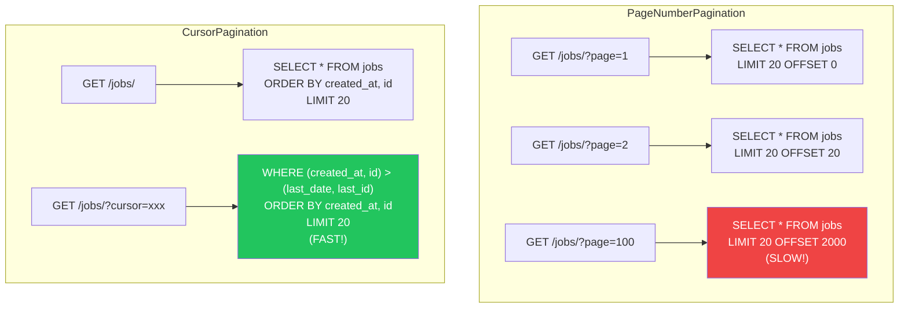

# الفصل الخامس عشر — DRF Permissions, Throttling, Filtering: التحكم الكامل في الـ API

> **المتطلبات:** [[14-DRF-Authentication-And-JWT]] — لازم تكون فاهم إزاي تؤمن الـ API بـ JWT، وعارف الفرق بين Authentication (مين المستخدم) و Authorization (إيه مسموح له). الفصل ده هيبني فوقهم عشان يوريك إزاي تتحكم في **إيه** المستخدم يقدر يعمل، **كام مرة** يقدر يعملها، و**إزاي** يدور في البيانات.

---

## البداية — مشكلة الـ API المفتوح

تخيّل معايا إنك بنيت HireLink API بالـ JWT. الدنيا شغالة تمام. المستخدمين بيسجلوا دخولهم ويقدروا يعملوا Jobs ويبعتوا Applications. بس فيه مشاكل بدأت تظهر:

1. أي مستخدم (حتى لو Client) يقدر يبعت POST request لـ `/api/jobs/42/apply/` ويتقدم على وظيفته هو! ده غلط — Clients مش مفروض يتقدموا على وظايف.

2. في مستخدم بدأ يبعت ١٠٠٠ request في الدقيقة لنفس الـ endpoint. الـ server بدأ يبطئ. ده ممكن يكون هجوم Denial of Service بسيط.

3. الـ frontend team عايزين endpoint يرجع الـ jobs المفتوحة بس، والـ jobs اللي budget فوق ٥٠٠٠، والـ jobs اللي فيها كلمة "Python". عايزين يعملوا ده بـ query parameters: `/api/jobs/?status=open&budget_min=5000&search=Python`.

الحلول:
- **Permissions:** تتحكم في **مين** يقدر يعمل **إيه**. Client يقدر يعمل Job، لكن ميقدرش يتقدم عليها. Freelancer يقدر يتقدم، لكن ميقدرش يقفل Job.
- **Throttling (Rate Limiting):** تتحكم في **كام مرة** المستخدم يقدر ينادي endpoint. ١٠٠ request في الدقيقة للـ Anonymous users، ١٠٠٠ للسجلين.
- **Filtering:** تدي الـ client القدرة على **تدوير وتصفية** البيانات اللي راجعة من الـ API.

الفصل ده هيغطي الثلاثة بالتفصيل — Permissions للتحكم في الأفعال، Throttling للحماية من الإساءة، و Filtering لتحسين تجربة البحث.

---

## [[01-Permissions-Deep-Dive]] — Permissions: مين يقدر يعمل إيه؟

### 🧠 الشرح النظري

الـ Authentication بيقول "مين المستخدم ده؟" (Identity). الـ Permissions بتقول "إيه اللي المستخدم ده مسموح له يعمله؟" (Authorization). في DRF، الـ Permissions هي classes بتتفحص كل request وتقرر: هل مسموح ولا لأ؟

**الـ Permission Classes الأساسية:**
- **`AllowAny`:** أي حد — حتى لو مش logged in. (ده الـ default لو محطتش permissions).
- **`IsAuthenticated`:** لازم يكون logged in. بيرفض الـ anonymous users بـ 401.
- **`IsAdminUser`:** لازم `user.is_staff = True`. للـ admin endpoints.
- **`IsAuthenticatedOrReadOnly`:** لو logged in → يقدر يعمل أي حاجة. لو anonymous → يقدر يعمل GET بس (read-only).
- **`DjangoModelPermissions`:** بيربط الـ Django Model Permissions (`add_job`, `change_job`) بالـ API. POST محتاج `add` permission، PUT/PATCH محتاج `change` permission.
- **`DjangoObjectPermissions`:** نفس `DjangoModelPermissions` لكن على مستوى الـ object (محتاج `django-guardian`).

**إزاي DRF بتفحص الـ Permissions؟**
1. الـ request بتوصل للـ View.
2. DRF بتنادي `get_permissions()` عشان تجيب قائمة الـ permission classes.
3. لكل class، بتنادي `has_permission(request, view)`. ده check عام — "هل المستخدم ده مسموح له يوصل للـ view دي أصلاً؟".
4. لو كل الـ classes رجعوا `True`، الـ View بتتنفذ.
5. لو في `get_object()` (زي في `retrieve`, `update`, `destroy`)، DRF بتنادي `has_object_permission(request, view, obj)`. ده check على الـ object نفسه — "هل المستخدم ده مسموح له يعدل الـ Job #42 دي؟".

**الفرق بين `has_permission` و `has_object_permission`:**
- **`has_permission`:** check عام — "هل يقدر يشوف أي Job؟" (بتتنادى قبل ما الـ view تشتغل).
- **`has_object_permission`:** check محدد — "هل يقدر يشوف الـ Job #42 دي؟" (بتتنادى لما الـ view تحاول تجيب object معين).

تخيّل الـ Permissions زي **نظام الأمن في شركة**:
- **`has_permission`:** حارس البوابة الرئيسية. بيتأكد إن معاك badge (IsAuthenticated) عشان تدخل المبنى.
- **`has_object_permission`:** حارس مكتب المدير. بيتأكد إنك المدير نفسه أو مساعديه عشان تدخل المكتب ده. حتى لو دخلت المبنى، مش هتعرف تدخل كل المكاتب.

### 📊 Visualization



### 💻 Micro-Example

```python
from rest_framework import permissions
from rest_framework.viewsets import ModelViewSet
from .models import Job

# 1. Built-in permissions
class JobViewSet(ModelViewSet):
    queryset = Job.objects.all()
    serializer_class = JobSerializer
    
    # Everyone can read, only authenticated can write
    permission_classes = [permissions.IsAuthenticatedOrReadOnly]

# 2. Custom Permission — Only client can close their own job
class IsClientOrReadOnly(permissions.BasePermission):
    def has_permission(self, request, view):
        # Allow read-only for everyone
        if request.method in permissions.SAFE_METHODS:
            return True
        # Write operations require authentication
        return request.user and request.user.is_authenticated
    
    def has_object_permission(self, request, view, obj):
        # Read-only for everyone
        if request.method in permissions.SAFE_METHODS:
            return True
        # Write operations: only the client who owns the job
        return obj.client == request.user

class JobViewSet(ModelViewSet):
    queryset = Job.objects.all()
    serializer_class = JobSerializer
    permission_classes = [IsClientOrReadOnly]
    
    def perform_create(self, serializer):
        serializer.save(client=self.request.user)

# 3. Custom Permission — Only freelancers can apply
class IsFreelancer(permissions.BasePermission):
    def has_permission(self, request, view):
        return request.user.is_authenticated and request.user.user_type == 'freelancer'

class ApplicationViewSet(ModelViewSet):
    permission_classes = [permissions.IsAuthenticated, IsFreelancer]

# 4. Different permissions for different actions
class JobViewSet(ModelViewSet):
    queryset = Job.objects.all()
    serializer_class = JobSerializer
    
    def get_permissions(self):
        if self.action == 'create':
            # Only clients can create jobs
            permission_classes = [permissions.IsAuthenticated, IsClient]
        elif self.action in ['update', 'partial_update', 'destroy']:
            # Only the client who owns the job can modify it
            permission_classes = [permissions.IsAuthenticated, IsClientOrReadOnly]
        else:
            # Everyone can list and retrieve
            permission_classes = [permissions.AllowAny]
        return [permission() for permission in permission_classes]
```

---

## [[02-Throttling-Rate-Limiting]] — Throttling: حماية الـ API من الإساءة

### 🧠 الشرح النظري

الـ Throttling (أو Rate Limiting) هو آلية بتحدد **كام request** المستخدم يقدر يبعت في فترة زمنية معينة. ده مش بس للحماية من الـ DDoS attacks — ده كمان عشان تضمن إن مستخدم واحد مش بياكل كل موارد الـ server ويأثر على باقي المستخدمين.

**أنواع الـ Throttling في DRF:**
- **`AnonRateThrottle`:** للمستخدمين غير المسجلين. بيستخدم IP address عشان يميزهم.
- **`UserRateThrottle`:** للمستخدمين المسجلين. بيستخدم `request.user.id`.
- **`ScopedRateThrottle`:** بتحدد rate مختلف لكل endpoint. مثال: `/api/jobs/` → ١٠٠٠ request/day، `/api/jobs/apply/` → ٥٠ request/day.

**إزاي بيشتغل؟**
1. كل request، DRF بتبني **cache key** فريد للمستخدم (زي `throttle_user_42` أو `throttle_anon_127.0.0.1`).
2. بتشوف كام request المستخدم ده عمل في الفترة الزمنية (من الـ cache — غالباً Redis أو Memcached).
3. لو العدد أقل من الـ limit → تسمح بمرور الـ request وتزود العداد.
4. لو العدد وصل للـ limit → ترجع `429 Too Many Requests` وتمنع الـ request من إنها توصل للـ view.

**ليه نستخدم Cache مش Database؟**
- **السرعة:** الـ throttling بيحصل على **كل** request. لو عملت database hit لكل request، الـ performance هيتأثر. Cache (زي Redis) أسرع بآلاف المرات.
- **الـ Atomicity:** الـ cache operations (زي `incr`) atomic — مضمون إن مفيش race condition في العد.

**أهمية الـ Throttling في الـ Production:**
- **يمنع الـ Abuse:** مستخدم خبيث ميقدرش يعمل ١٠٠٠٠ request في دقيقة ويرفع الـ server.
- **يضمن Fair Usage:** مستخدم واحد ميقدرش يستهلك كل الـ resources ويبطئ الباقي.
- **يخفض التكاليف:** لو بتدفع للـ cloud provider على حسب الـ usage (زي AWS Lambda أو external APIs)، الـ throttling بيضمن إنك متتجاوزش الـ budget.

تخيّل الـ Throttling زي **بوابات المرور في الطريق السريع**:
- **الـ Limit:** ١٠٠ عربية في الدقيقة.
- **العداد:** كام عربية عدت من البوابة.
- **لما توصل للـ limit:** البوابة بتقفل وتقول للعربيات الجديدة "استنوا شوية".
- **الـ Cache:** العداد الإلكتروني السريع — مش موظف بيعد على إيده (database).

### 📊 Visualization



### 💻 Micro-Example

```python
# settings.py
REST_FRAMEWORK = {
    'DEFAULT_THROTTLE_CLASSES': [
        'rest_framework.throttling.AnonRateThrottle',   # For anonymous users
        'rest_framework.throttling.UserRateThrottle',   # For authenticated users
    ],
    'DEFAULT_THROTTLE_RATES': {
        'anon': '100/day',      # 100 requests per day for anonymous
        'user': '1000/day',     # 1000 requests per day for authenticated
        'apply_job': '5/hour',  # Custom rate for specific actions
    }
}

# 1. Global Throttling (applies to all views)
from rest_framework.viewsets import ModelViewSet

class JobViewSet(ModelViewSet):
    queryset = Job.objects.all()
    serializer_class = JobSerializer
    # Throttling is applied automatically from DEFAULT_THROTTLE_CLASSES

# 2. Custom Throttling for specific actions
from rest_framework.throttling import ScopedRateThrottle
from rest_framework.decorators import action

class JobViewSet(ModelViewSet):
    queryset = Job.objects.all()
    serializer_class = JobSerializer
    
    @action(detail=True, methods=['post'], 
            throttle_classes=[ScopedRateThrottle], 
            throttle_scope='apply_job')  # Uses 'apply_job': '5/hour'
    def apply(self, request, pk=None):
        # This endpoint is limited to 5 requests per hour per user
        job = self.get_object()
        application = job.applications.create(freelancer=request.user)
        return Response(ApplicationSerializer(application).data)

# 3. Custom Throttle Class (e.g., burst limit)
from rest_framework.throttling import SimpleRateThrottle

class BurstRateThrottle(SimpleRateThrottle):
    scope = 'burst'
    rate = '10/minute'  # Default, can be overridden in settings
    
    def get_cache_key(self, request, view):
        if request.user.is_authenticated:
            return f"burst_user_{request.user.id}"
        return f"burst_anon_{self.get_ident(request)}"

# 4. Throttling with custom logic (e.g., different limits for premium users)
class PremiumUserRateThrottle(UserRateThrottle):
    def get_rate(self):
        if self.request.user.is_premium:
            return '10000/day'  # Premium users get more
        return super().get_rate()  # Regular users get default

# 5. Returning throttle headers
REST_FRAMEWORK = {
    'DEFAULT_THROTTLE_CLASSES': [...],
    'DEFAULT_THROTTLE_RATES': {...},
    'DEFAULT_THROTTLE_HEADERS': {
        'X-RateLimit-Limit': 'X-RateLimit-Limit',      # Total limit
        'X-RateLimit-Remaining': 'X-RateLimit-Remaining', # Remaining
        'X-RateLimit-Reset': 'X-RateLimit-Reset',      # Reset time (timestamp)
    }
}
# Clients can check headers to see their rate limit status
```

---

## [[03-Filtering-Search-Ordering]] — Filtering: إزاي المستخدم يدور على اللي عايزه

### 🧠 الشرح النظري

لما الـ client بينادي `GET /api/jobs/`، هو مش دايمًا عايز **كل** الـ jobs. عايز الـ jobs المفتوحة بس. أو الـ jobs اللي budget فوق ٥٠٠٠. أو الـ jobs اللي فيها "Python". الـ Filtering هو اللي بيدي الـ client القدرة على **تضييق النتائج** باستخدام query parameters.

**أنواع الـ Filtering في DRF:**

**1. `django-filter` (الأقوى والأكثر استخداماً):**
مكتبة خارجية بتتكامل مع DRF. بتسمحلك تعمل filtering معقد باستخدام query parameters.
- `GET /jobs/?status=open` → يرجع الـ open jobs بس.
- `GET /jobs/?budget_min=5000&budget_max=10000` → يرجع الـ jobs في range الميزانية.
- `GET /jobs/?client__username=ahmed` → يرجع jobs بتاعة client معين.

**2. `SearchFilter` (DRF Built-in):**
بيضيف `?search=python` parameter. بيدور في fields معينة (زي `title`, `description`) باستخدام `LIKE` أو full-text search.

**3. `OrderingFilter` (DRF Built-in):**
بيضيف `?ordering=budget` أو `?ordering=-created_at` (تنازلي). بيرتب النتايج حسب fields معينة.

**إزاي بيشتغل `django-filter`؟**
1. بتعمل `FilterSet` class بيوصف إيه الـ filters المتاحة.
2. الـ ViewSet بيستخدم `DjangoFilterBackend`.
3. الـ query parameters بتتحول لـ `filter()` calls على الـ queryset.

**ليه نستخدم Filtering؟**
- **تقليل البيانات:** بدل ما ترجع ١٠٠٠ job للـ client، ترجع ١٠ بس اللي محتاجهم. بيوفر bandwidth ويسرع الـ response.
- **تجربة مستخدم أفضل:** الـ frontend يقدر يعمل search و filters من غير ما يعمل logic في الـ client-side.
- **أمان:** تقدر تمنع filtering على fields حساسة (زي `client__email`).

تخيّل Filtering زي **فلتر البحث في أمازون**:
- **SearchFilter:** صندوق البحث — "Python Developer".
- **OrderingFilter:** ترتيب حسب — "السعر: من الأعلى للأقل".
- **FilterSet:** الفلاتر الجانبية — "القسم: تقنية"، "الميزانية: ٥٠٠٠-١٠٠٠٠".

### 📊 Visualization



### 💻 Micro-Example

```python
# 1. Install: pip install django-filter

# 2. filters.py
import django_filters
from .models import Job

class JobFilter(django_filters.FilterSet):
    # Exact match filters
    status = django_filters.CharFilter(lookup_expr='iexact')
    client__username = django_filters.CharFilter(lookup_expr='iexact')
    
    # Range filters
    budget_min = django_filters.NumberFilter(field_name='budget', lookup_expr='gte')
    budget_max = django_filters.NumberFilter(field_name='budget', lookup_expr='lte')
    
    # Date filters
    created_after = django_filters.DateFilter(field_name='created_at', lookup_expr='gte')
    created_before = django_filters.DateFilter(field_name='created_at', lookup_expr='lte')
    
    # Custom filter method
    has_applications = django_filters.BooleanFilter(method='filter_has_applications')
    
    class Meta:
        model = Job
        fields = ['status', 'budget_min', 'budget_max', 'is_featured']
    
    def filter_has_applications(self, queryset, name, value):
        if value:
            return queryset.filter(applications__isnull=False).distinct()
        return queryset.filter(applications__isnull=True)

# 3. views.py
from rest_framework.viewsets import ModelViewSet
from django_filters.rest_framework import DjangoFilterBackend
from rest_framework.filters import SearchFilter, OrderingFilter
from .filters import JobFilter

class JobViewSet(ModelViewSet):
    queryset = Job.objects.all().select_related('client')
    serializer_class = JobSerializer
    
    # Add filter backends
    filter_backends = [DjangoFilterBackend, SearchFilter, OrderingFilter]
    
    # DjangoFilterBackend
    filterset_class = JobFilter
    
    # SearchFilter — search in these fields
    search_fields = ['title', 'description', 'client__username']
    
    # OrderingFilter — allow ordering by these fields
    ordering_fields = ['created_at', 'budget', 'title']
    ordering = ['-created_at']  # Default ordering

# 4. Usage examples:
# GET /api/jobs/?status=open
# GET /api/jobs/?budget_min=5000&budget_max=10000
# GET /api/jobs/?search=python+django
# GET /api/jobs/?ordering=-budget
# GET /api/jobs/?client__username=ahmed
# GET /api/jobs/?has_applications=true
# GET /api/jobs/?status=open&search=backend&ordering=budget

# 5. Custom Filtering in get_queryset (for complex logic)
class JobViewSet(ModelViewSet):
    serializer_class = JobSerializer
    
    def get_queryset(self):
        queryset = Job.objects.all()
        
        # Filter by current user (show only their jobs)
        if self.action == 'my_jobs':
            queryset = queryset.filter(client=self.request.user)
        
        # Filter by user_type (freelancers see open jobs, clients see all)
        if self.request.user.user_type == 'freelancer':
            queryset = queryset.filter(status='open')
        
        return queryset
```

---

## [[04-Pagination]] — Pagination: تقطيع البيانات لصفحات

### 🧠 الشرح النظري

لما ترجع `GET /api/jobs/`، وعدد الـ jobs في الـ database ١٠٠٠٠. هل ترجعهم كلهم في response واحدة؟ ده هياخد وقت طويل وهيستهلك bandwidth رهيب. الحل: **Pagination** — ترجع ٢٠ job في كل "صفحة".

**أنواع الـ Pagination في DRF:**
- **`PageNumberPagination`:** الصفحات التقليدية. `GET /jobs/?page=2`. سهلة وبسيطة.
- **`LimitOffsetPagination`:** بتحدد `limit` (كام item) و `offset` (منين تبدأ). `GET /jobs/?limit=20&offset=40`. مرنة أكتر.
- **`CursorPagination`:** الأحسن للـ performance في الـ production. بتستخدم cursor (زي `?cursor=cD0yMDI0LTAxLTAx`) بدل رقم الصفحة. بتمنع مشكلة "تخطي items" لو البيانات بتتغير أثناء الـ pagination.

**ليه Cursor Pagination هو الأحسن في الـ Production؟**
- **Consistency:** لو في items جديدة اتنضافت أثناء ما المستخدم بيتصفح، `PageNumberPagination` هتخليه يشوف نفس الـ item مرتين أو يفوته item. `CursorPagination` بتضمن إن كل item بيتشاف مرة واحدة بس.
- **Performance:** `OFFSET 10000` في SQL بطيء جداً. `CursorPagination` بتستخدم `WHERE id > last_seen_id` — أسرع بكتير.
- **عيبه الوحيد:** مفيش "اذهب لصفحة ٥" مباشرةً. المستخدم بيقدر يتحرك لقدام ولورا بس (زي infinite scroll).

**إزاي بتشتغل Cursor Pagination؟**
1. الـ client بيطلب `/jobs/` (أول صفحة). الـ server بيرجع أول ٢٠ item، وcursor للصفحة الجاية.
2. الـ client يطلب `/jobs/?cursor=abc123`. الـ server بيفك الـ cursor (اللي بيحتوي على `created_at` و `id` لآخر item)، ويعمل `WHERE (created_at, id) > (last_created_at, last_id)`.

تخيّل Pagination زي **كتالوج ورقى**:
- **PageNumberPagination:** الكتاب مقسم لصفحات مرقمة. تقدر تروح لصفحة ٥ مباشرةً. لكن لو أضافوا صفحة جديدة في النص، ترقيم الصفحات هيتلخبط.
- **CursorPagination:** scroll لا نهائي في التطبيق. بتفضل تنزل لتحت والبيانات تظهر. مش هتشوف نفس الـ post مرتين.

### 📊 Visualization



### 💻 Micro-Example

```python
# settings.py — Global pagination
REST_FRAMEWORK = {
    'DEFAULT_PAGINATION_CLASS': 'rest_framework.pagination.PageNumberPagination',
    'PAGE_SIZE': 20,  # Default page size
}

# 1. PageNumberPagination (simplest)
from rest_framework.pagination import PageNumberPagination

class JobPageNumberPagination(PageNumberPagination):
    page_size = 20
    page_size_query_param = 'page_size'  # Allow client to change size
    max_page_size = 100  # Maximum allowed

class JobViewSet(ModelViewSet):
    queryset = Job.objects.all()
    serializer_class = JobSerializer
    pagination_class = JobPageNumberPagination

# 2. CursorPagination (recommended for production)
from rest_framework.pagination import CursorPagination

class JobCursorPagination(CursorPagination):
    page_size = 20
    ordering = '-created_at'  # Must have a unique field (or combination)
    cursor_query_param = 'cursor'

class JobViewSet(ModelViewSet):
    queryset = Job.objects.all()
    serializer_class = JobSerializer
    pagination_class = JobCursorPagination

# 3. Customizing pagination response
class CustomPagination(PageNumberPagination):
    page_size = 20
    
    def get_paginated_response(self, data):
        return Response({
            'links': {
                'next': self.get_next_link(),
                'previous': self.get_previous_link(),
            },
            'count': self.page.paginator.count,
            'total_pages': self.page.paginator.num_pages,
            'current_page': self.page.number,
            'results': data
        })

# 4. Disable pagination for specific actions
class JobViewSet(ModelViewSet):
    queryset = Job.objects.all()
    serializer_class = JobSerializer
    pagination_class = JobCursorPagination
    
    @action(detail=False, methods=['get'], pagination_class=None)
    def all(self, request):
        # Return ALL jobs without pagination (be careful!)
        serializer = self.get_serializer(self.get_queryset(), many=True)
        return Response(serializer.data)
```

---

## 🎯 أسئلة الإنترفيو

**س: إيه الفرق بين Authentication و Permissions في DRF؟ وازاي بيشتغلوا مع بعض؟**

> **Authentication** و **Permissions** هما طبقتين منفصلتين في الـ DRF request pipeline، وكل واحدة ليها دور محدد.<br/><br/>
> 
> **Authentication (من أنت؟):**
> - **الهدف:** تحديد **هوية** المستخدم. هل هو anonymous ولا logged in؟ وإيه الـ `user_id` بتاعه؟
> - **إزاي بيشتغل:** الـ Authentication classes (زي `JWTAuthentication`, `SessionAuthentication`) بتحاول تستخرج credentials من الـ request (Token في header، Session cookie). لو نجحت، بتحط `request.user` و `request.auth`.
> - **النتيجة:** `request.user` بيبقى `User` object أو `AnonymousUser`.<br/><br/>
> 
> **Permissions (إيه مسموح لك تعمله؟):**
> - **الهدف:** تحديد **صلاحيات** المستخدم. هل يقدر يعمل GET؟ POST؟ هل يقدر يعدل الـ Job #42 دي؟
> - **إزاي بيشتغل:** بعد الـ authentication، DRF بتنادي `has_permission()` لكل Permission class. لو كلهم رجعوا `True`، الـ request تكمل. لو في `get_object()`، بتنادي `has_object_permission()`.
> - **النتيجة:** إما `True` (مسموح) أو `False` (403 Forbidden).<br/><br/>
> 
> **الترتيب مهم:**
> 1. **Authentication أولاً:** DRF لازم تعرف مين المستخدم عشان تقدر تحدد صلاحياته. لو الـ authentication فشل، `request.user = AnonymousUser`.
> 2. **Permissions ثانياً:** بعد ما تعرف مين المستخدم، بتقرر هل مسموح له ولا لأ.
> 
> **مثال:** `IsAuthenticated` permission بتبص على `request.user.is_authenticated`. الـ authentication هو اللي حدد قيمة `is_authenticated` دي. من غير Authentication، الـ Permissions مش هتشتغل صح.

---

**س: إزاي تبني Custom Permission في DRF؟ وايه الفرق بين `has_permission` و `has_object_permission`؟**

> **بناء Custom Permission:**
> 1. اعمل class بيرث من `rest_framework.permissions.BasePermission`.
> 2. Override `has_permission(self, request, view)` للـ check العام.
> 3. Override `has_object_permission(self, request, view, obj)` للـ check على instance معينة.<br/><br/>
> 
> **الفرق بينهم:**
> - **`has_permission`:** بتتنادى **قبل** ما الـ view تشتغل. Check عام — "هل المستخدم ده مسموح له يوصل للـ view دي أصلاً؟". مثال: `IsAuthenticated` — بتتأكد إن المستخدم logged in قبل أي حاجة.
> - **`has_object_permission`:** بتتنادى **لما الـ view تحاول تجيب object معين** (زي في `retrieve`, `update`, `destroy`). Check محدد — "هل المستخدم ده مسموح له يشوف/يعدل الـ Job #42 دي؟". مثال: `IsOwnerOrReadOnly` — بتتأكد إن `obj.client == request.user`.<br/><br/>
> 
> **مثال كامل:**
> ```python
> from rest_framework import permissions
> 
> class IsClientOrReadOnly(permissions.BasePermission):
>     def has_permission(self, request, view):
>         # Allow read-only for everyone (GET, HEAD, OPTIONS)
>         if request.method in permissions.SAFE_METHODS:
>             return True
>         # Write operations require authentication
>         return request.user and request.user.is_authenticated
>     
>     def has_object_permission(self, request, view, obj):
>         # Read-only for everyone
>         if request.method in permissions.SAFE_METHODS:
>             return True
>         # Write operations: only the client who owns the job
>         return obj.client == request.user
> ```
> 
> **ملحوظة:** `has_permission` بتنادي دايمًا. `has_object_permission` بتنادي **بس** لو في `get_object()` (زي retrieve, update, destroy) **وبعد** `has_permission` ترجع `True`.

---

**س: إيه هو Throttling؟ وازاي بيشتغل في DRF؟ إيه الفرق بين `AnonRateThrottle` و `UserRateThrottle`؟**

> **Throttling (Rate Limiting)** هو آلية بتحدد عدد الـ requests اللي مستخدم معين يقدر يبعت في فترة زمنية. الهدف: منع abuse، ضمان fair usage، وحماية الـ server من overload.<br/><br/>
> 
> **إزاي بيشتغل في DRF؟**
> 1. **Cache Key:** DRF بتبني key فريد للمستخدم (زي `throttle_user_42` أو `throttle_anon_127.0.0.1`).
> 2. **Check Cache:** بتقرا الـ cache (Redis/Memcached) — كام request المستخدم ده عمل في الفترة الزمنية؟
> 3. **Compare:** لو العدد أقل من الـ limit → تسمح وتزود العداد. لو وصل للـ limit → 429 Too Many Requests.
> 4. **Headers:** DRF بترجع headers (`X-RateLimit-Limit`, `X-RateLimit-Remaining`) عشان الـ client يعرف حالته.<br/><br/>
> 
> **الفرق بين `AnonRateThrottle` و `UserRateThrottle`:**
> - **`AnonRateThrottle`:** للمستخدمين **غير المسجلين**. بتميزهم بـ IP address (`get_ident(request)`). مثال: `anon: 100/day` — أي حد من نفس الـ IP يقدر يعمل ١٠٠ request في اليوم.
> - **`UserRateThrottle`:** للمستخدمين **المسجلين**. بتميزهم بـ `request.user.id`. مثال: `user: 1000/day` — كل مستخدم مسجل يقدر يعمل ١٠٠٠ request في اليوم.<br/><br/>
> 
> **ليه نستخدم Cache مش Database؟**
> - **السرعة:** الـ throttling بيحصل على **كل** request. Cache أسرع بآلاف المرات من database.
> - **Atomicity:** عمليات الـ cache (زي `incr`) atomic — مضمون إن مفيش race condition في العد.<br/><br/>
> 
> **إعدادات في `settings.py`:**
> ```python
> REST_FRAMEWORK = {
>     'DEFAULT_THROTTLE_CLASSES': [
>         'rest_framework.throttling.AnonRateThrottle',
>         'rest_framework.throttling.UserRateThrottle',
>     ],
>     'DEFAULT_THROTTLE_RATES': {
>         'anon': '100/day',
>         'user': '1000/day',
>     }
> }
> ```

---

**س: إزاي بتعمل Filtering في DRF؟ وايه الفرق بين `DjangoFilterBackend`, `SearchFilter`, `OrderingFilter`؟**

> الـ Filtering بيسمح للـ client بتضييق نتايج الـ API باستخدام query parameters. DRF بتدعم ٣ أنواع رئيسية من الـ filtering backends:<br/><br/>
> 
> **1. `DjangoFilterBackend` (من `django-filter`):**
> - **الاستخدام:** Exact matching و range filtering. `GET /jobs/?status=open&budget_min=5000`.
> - **إزاي بيشتغل:** بتعمل `FilterSet` class بيوصف الـ filters. بيحول الـ query parameters لـ `queryset.filter()` calls.
> - **مثال:** `status = django_filters.CharFilter(lookup_expr='iexact')` → `?status=open` → `filter(status__iexact='open')`.
> - **الأقوى للـ exact filtering والـ ranges.**<br/><br/>
> 
> **2. `SearchFilter` (DRF Built-in):**
> - **الاستخدام:** Full-text search في fields متعددة. `GET /jobs/?search=python`.
> - **إزاي بيشتغل:** بياخد الـ search term ويعمل `Q(field1__icontains=term) | Q(field2__icontains=term)`.
> - **مثال:** `search_fields = ['title', 'description']` → `?search=python` → `filter(Q(title__icontains='python') | Q(description__icontains='python'))`.
> - **مناسب للـ search boxes.**<br/><br/>
> 
> **3. `OrderingFilter` (DRF Built-in):**
> - **الاستخدام:** ترتيب النتايج. `GET /jobs/?ordering=-created_at` (تنازلي).
> - **إزاي بيشتغل:** بياخد الـ field من query parameter ويعمل `queryset.order_by(field)`.
> - **مثال:** `ordering_fields = ['created_at', 'budget']` → `?ordering=budget` → `order_by('budget')`.
> - **مناسب لـ sort dropdowns.**<br/><br/>
> 
> **الدمج بينهم:**
> ```python
> class JobViewSet(ModelViewSet):
>     queryset = Job.objects.all()
>     filter_backends = [DjangoFilterBackend, SearchFilter, OrderingFilter]
>     filterset_class = JobFilter
>     search_fields = ['title', 'description']
>     ordering_fields = ['created_at', 'budget']
> ```
> 
> **الترتيب مهم:** `DjangoFilterBackend` بيشتغل أولاً (يضيق النتايج)، بعدين `SearchFilter`، بعدين `OrderingFilter` (يرتب). كل واحد بيعدل على الـ queryset اللي طلع من اللي قبله.

---

**س: إيه الفرق بين `PageNumberPagination`, `LimitOffsetPagination`, و `CursorPagination`؟ وامتى تستخدم كل واحد؟**

> الثلاثة طرق لتقطيع البيانات لصفحات، لكن كل واحدة مناسبة لسيناريو مختلف.<br/><br/>
> 
> **1. `PageNumberPagination`:**
> - **إزاي بتشتغل:** `GET /jobs/?page=2`. الـ server بيعمل `LIMIT 20 OFFSET 20`.
> - **المميزات:** بسيطة. المستخدم يقدر يروح لصفحة معينة (`page=5`). سهلة في الـ implementation.
> - **العيوب:** **Performance سيء مع الـ large offsets** — `OFFSET 10000` بطيء جداً. **Inconsistent** لو البيانات بتتغير — ممكن تفوت items أو تشوفهم مرتين.
> - **الاستخدام:** APIs صغيرة، admin panels، لو الـ data مش بتتغير كتير.<br/><br/>
> 
> **2. `LimitOffsetPagination`:**
> - **إزاي بتشتغل:** `GET /jobs/?limit=20&offset=40`. مرنة أكتر من page number.
> - **المميزات:** المستخدم بيتحكم في حجم الصفحة (`limit`). أسهل في الـ infinite scroll implementations.
> - **العيوب:** نفس مشاكل الـ performance مع الـ large offsets. `OFFSET 10000` لسه بطيء.
> - **الاستخدام:** لما عايز مرونة في حجم الصفحة، لكن الـ data مش ضخمة جداً.<br/><br/>
> 
> **3. `CursorPagination`:**
> - **إزاي بتشتغل:** `GET /jobs/?cursor=cD0yMDI0LTAxLTAx`. الـ cursor بيحتوي على آخر `created_at` و `id`. الـ server بيعمل `WHERE (created_at, id) > (last_date, last_id) LIMIT 20`.
> - **المميزات:** **Performance ممتاز** حتى مع ملايين الـ records — مفيش `OFFSET`. **Consistent** — مفيش items مكررة أو مفقودة حتى لو البيانات بتتغير.
> - **العيوب:** مفيش "اذهب لصفحة ٥". المستخدم يقدر يتحرك لقدام ولورا بس (زي infinite scroll). صعبة شوية في الـ implementation لو عايز total count.
> - **الاستخدام:** **الـ Production APIs** اللي عندها بيانات كبيرة ومتغيرة (زي social media feeds). ده الـ recommended approach في معظم الـ production use cases.<br/><br/>
> 
> **الخلاصة:**
> - **تطبيق صغير أو admin:** `PageNumberPagination`.
> - **عايز infinite scroll بسيط:** `LimitOffsetPagination`.
> - **API حقيقي في Production:** `CursorPagination`. هي الأفضل للـ performance والـ consistency.

---

## 📝 خلاصة الدرس

- **Permissions:** بتتحكم في Authorization (مين يقدر يعمل إيه). `has_permission` check عام، `has_object_permission` check على instance معينة. اعمل Custom Permissions عشان تتحكم في صلاحيات دقيقة (زي "الـ client بس يقدر يعدل Job بتاعته").
- **Throttling:** Rate Limiting — بيحدد عدد الـ requests في فترة زمنية. `AnonRateThrottle` للـ anonymous (عن طريق IP)، `UserRateThrottle` للـ authenticated (عن طريق user ID). استخدم Cache (Redis) مش Database للـ performance.
- **Filtering:** `DjangoFilterBackend` للـ exact matching والـ ranges (الأقوى). `SearchFilter` للـ text search. `OrderingFilter` لترتيب النتايج. ادمجهم مع بعض في `filter_backends` عشان تدي الـ client تحكم كامل.
- **Pagination:** `PageNumberPagination` (بسيطة، مناسبة للـ admin)، `CursorPagination` (الأحسن للـ production — أداء ممتاز و consistent). اختار الـ pagination المناسبة حسب حجم البيانات ونمط الاستخدام.
- **الـ Performance مهم:** دايمًا استخدم `select_related` و `prefetch_related` في الـ queryset عشان تقلل عدد الـ queries. `CursorPagination` أسرع بكتير من `OFFSET` في الجداول الكبيرة.

---

*Next → [[16-Project-Architecture-And-Setup]] — خلصنا كل أساسيات DRF. دلوقتي هنجمع كل حاجة اتعلمناها عشان نبدأ مشروع HireLink API الحقيقي: إزاي نـ structure المشروع بشكل احترافي، split settings، Custom User Model من أول يوم، وإعداد الـ BaseModel.*