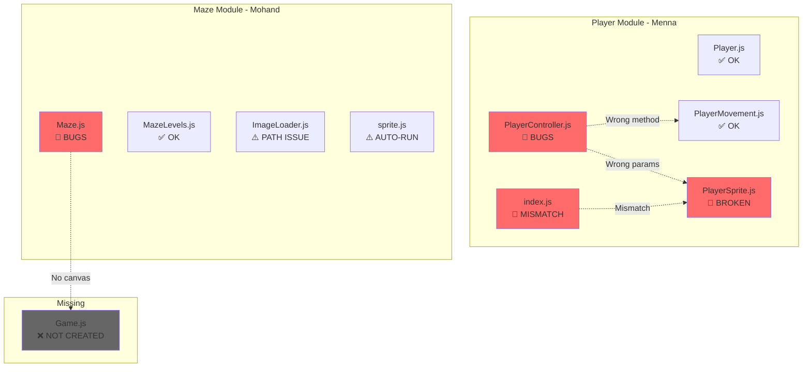
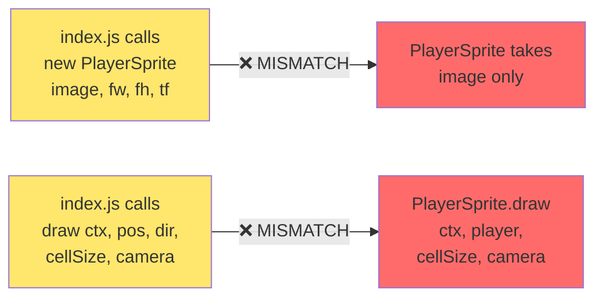
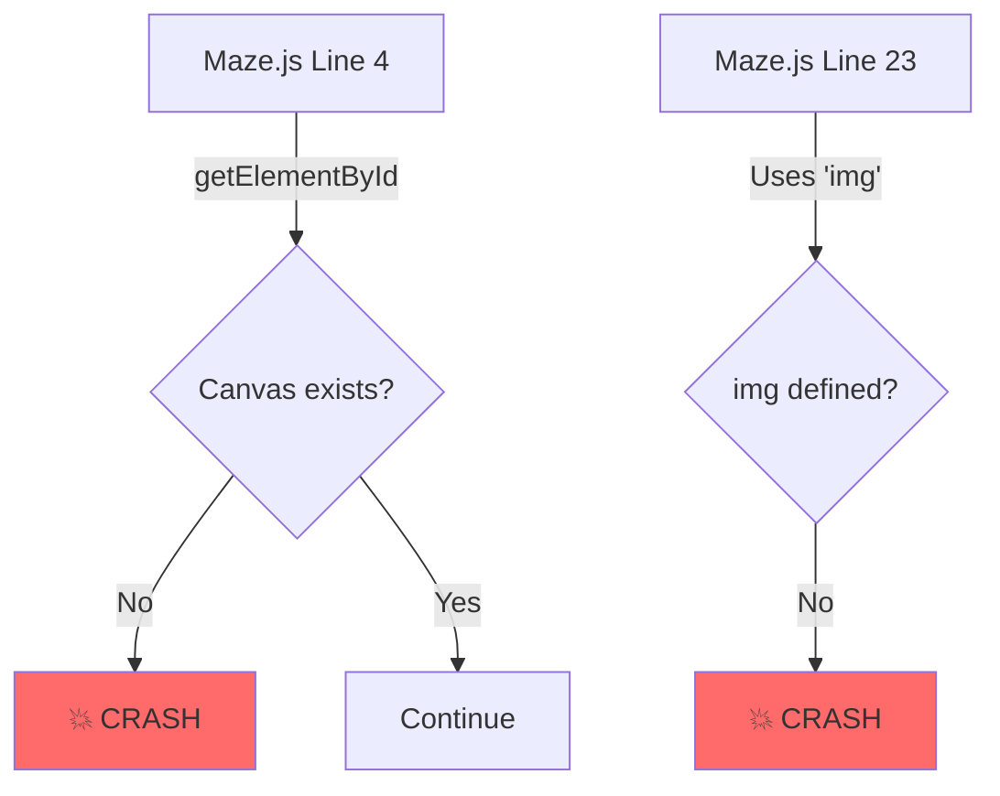
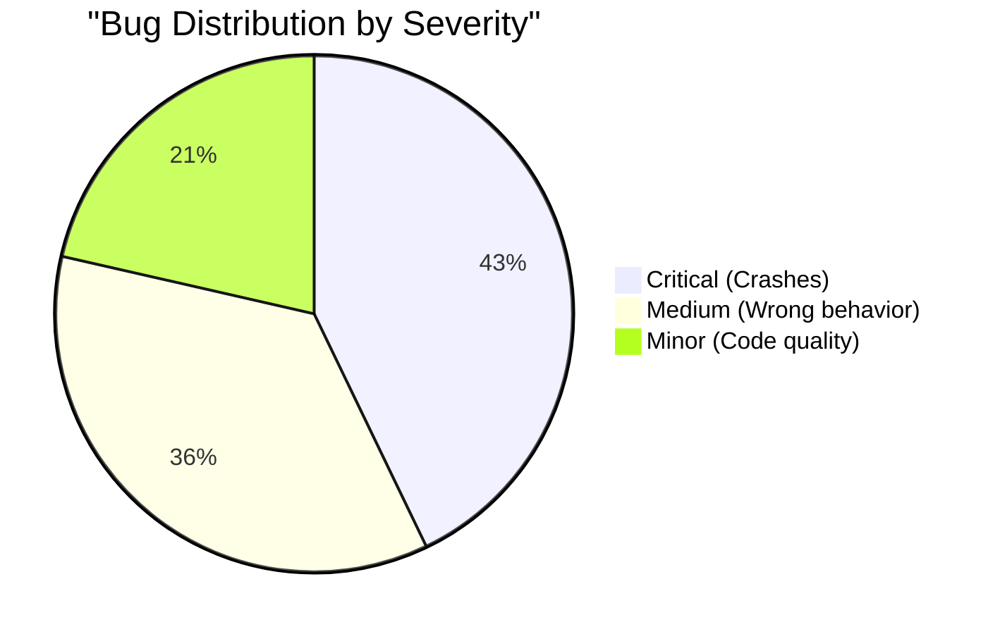

# 🔍 Code Review: Player & Maze Modules

  

> Detailed bug analysis and integration guide for Mazer Project

  

---

  

## 📊 Current Architecture

  



  

---

  

## 🔴 Critical Issues - Player Module

  

### PlayerSprite.js

  



  

| Line | Bug | Impact | Fix |

| ------- | ------------------------------------- | ----------------------------------- | --------------------------------------------------------- |

| **1** | Missing `export default` | Cannot import class | Add `export default` before `class` |

| **1-2** | Bad indentation | Code style issue | Remove extra leading spaces |

| **3** | Constructor takes `(image)` only | Crashes when called from `index.js` | Add params: `(image, cellSize)` |

| **23** | `draw(ctx, player, cellSize, camera)` | Wrong parameter structure | Change to: `(ctx, position, direction, cellSize, camera)` |

  

**Current Code (BROKEN):**

  

```javascript

const animationSpeed = 120;

class PlayerSprite {

// ❌ No export!

constructor(image) {

// ❌ Missing params!

this.image = image;

// ...

}

  

draw(ctx, player, cellSize, camera) {

// ❌ Wrong params!

const srcY = player.direction * this.frameHeight; // ❌ player is just {x, y}

// ...

}

}

```

  

**Fixed Code:**

  

```javascript

const animationSpeed = 120;

  

export default class PlayerSprite {

// ✅ Exported!

constructor(image, cellSize) {

// ✅ Correct params

this.image = image;

this.cellSize = cellSize;

this.frameWidth = image.width / 9;

this.frameHeight = image.height / 4;

this.currentFrame = 0;

this.frameTimer = 0;

}

  

update(deltaTime, isMoving) {

if (!isMoving) {

this.currentFrame = 0;

return;

}

this.frameTimer += deltaTime;

if (this.frameTimer >= animationSpeed) {

this.frameTimer = 0;

this.currentFrame = (this.currentFrame + 1) % 9;

}

}

  

draw(ctx, position, direction, cellSize, camera) {

// ✅ Fixed!

const srcX = this.currentFrame * this.frameWidth;

const srcY = direction * this.frameHeight;

ctx.drawImage(

this.image,

srcX,

srcY,

this.frameWidth,

this.frameHeight,

position.x * cellSize - camera.x,

position.y * cellSize - camera.y,

cellSize,

cellSize,

);

}

}

```

  

---

  

### PlayerController.js

  

| Line | Bug | Impact | Fix |

| ------ | ------------------------------------- | ----------------------------------------- | ----------------------------------------- |

| **15** | Passes `config.isWalkable` (function) | `PlayerMovement` expects `maze[][]` array | Pass `config.maze` instead |

| **34** | Calls `this.movement.move()` | Method doesn't exist! | Change to `this.movement.movePlayer()` |

| **62** | Calls `draw(ctx)` only | Missing `cellSize` and `camera` params | Add params: `draw(ctx, cellSize, camera)` |

  

**Current Code (BROKEN):**

  

```javascript

this.movement = new PlayerMovement(

this.player,

config.isWalkable // ❌ Function, not array!

);

  

movePlayer(dx, dy, maze) {

return this.movement.move(dx, dy, maze); // ❌ Wrong method name!

}

  

draw(ctx) {

this.sprite.draw(ctx, this.getPlayerPosition()); // ❌ Missing params!

}

```

  

**Fixed Code:**

  

```javascript

this.movement = new PlayerMovement(

this.player,

config.maze // ✅ Pass maze array

);

  

movePlayer(dx, dy) {

return this.movement.movePlayer(dx, dy); // ✅ Correct method!

}

  

draw(ctx, cellSize, camera) { // ✅ Add params

const position = this.getPlayerPosition();

const direction = this.player.getDirection();

this.sprite.draw(ctx, position, direction, cellSize, camera);

}

```

  

---

  

### Player.js

  

| Line | Bug | Impact | Fix |

| --------- | -------------------------------------- | --------------- | ---------------------------------------------------- |

| **33-35** | `loseLife()` duplicates `takeDamage()` | Code redundancy | Remove one or make `loseLife()` call `takeDamage(1)` |

  

**Suggestion:**

  

```javascript

loseLife() {

this.takeDamage(1); // ✅ Reuse existing method

}

```

  

---

  

## 🔴 Critical Issues - Maze Module

  

### Maze.js

  



  

| Line | Bug | Impact | Fix |

| ---------- | ----------------------------------- | ----------------------------- | ------------------------------------------- |

| **4** | `document.getElementById("canvas")` | Canvas doesn't exist in HTML! | Pass canvas as parameter or create it first |

| **23** | Uses `img` variable | `img` is never defined | Define `img` or remove `animateKey()` |

| **31, 40** | `console.log()` | Debug code left in | Remove debug logs |

| **39-42** | Uses `maze[j][i]` | Confusing X/Y logic | Use `maze[i][j]` for clarity |

| **63** | `loadLevelMaze(1)` runs immediately | Executes on import | Export as function, don't auto-run |

  

**Current Code (BROKEN):**

  

```javascript

let canvas = document.getElementById("canvas"); // ❌ Canvas doesn't exist!

const ctx = canvas.getContext("2d");

  

function animateKey(x, y) {

ctx.drawImage(img, ...); // ❌ img is undefined!

}

  

function drawMaze(maze) {

for(let i=0; i<maze.length; i++) {

for(let j=0; j<maze[i].length; j++) {

if(maze[j][i] == 0) { // ⚠️ Confusing!

console.log(i, j); // ❌ Debug log

drawPath(j, i);

}

}

}

}

  

loadLevelMaze(1); // ❌ Auto-runs!

```

  

**Fixed Code:**

  

```javascript

import { mazes } from "./MazeLevels.js";

import { images, loadAllImages } from "./ImageLoader.js";

  

export default class Maze {

constructor(canvas, levelNumber) {

this.canvas = canvas;

this.ctx = canvas.getContext("2d");

this.level = levelNumber;

this.data = mazes[levelNumber - 1];

this.TILE_SIZE = 40;

}

  

async load() {

await loadAllImages();

this.draw();

}

  

draw() {

for (let row = 0; row < this.data.length; row++) {

for (let col = 0; col < this.data[row].length; col++) {

const tile = this.data[row][col];

  

switch (tile) {

case 0:

this.drawPath(col, row);

break;

case 1:

this.drawWall(col, row);

break;

case 5:

this.drawDoor(col, row);

break;

}

}

}

}

  

drawPath(x, y) {

this.ctx.drawImage(

images.path,

x * this.TILE_SIZE,

y * this.TILE_SIZE,

this.TILE_SIZE,

this.TILE_SIZE,

);

}

  

drawWall(x, y) {

this.ctx.drawImage(

images.wall,

x * this.TILE_SIZE,

y * this.TILE_SIZE,

this.TILE_SIZE,

this.TILE_SIZE,

);

}

  

drawDoor(x, y) {

this.ctx.drawImage(

images.door,

x * this.TILE_SIZE,

y * this.TILE_SIZE,

this.TILE_SIZE,

this.TILE_SIZE,

);

}

  

isWalkable(x, y) {

if (y < 0 || y >= this.data.length || x < 0 || x >= this.data[0].length) {

return false;

}

return this.data[y][x] !== 1; // Not a wall

}

  

getTileAt(x, y) {

return this.data[y][x];

}

  

getMazeData() {

return this.data;

}

}

```

  

---

  

### ImageLoader.js

  

| Line | Bug | Impact | Fix |

| -------- | ------------------------------------------------ | ------------------------------- | --------------------------------- |

| **9-11** | Spaces in folder path `"game play /playground/"` | Path might fail on some systems | Remove spaces or use URL encoding |

  

---

  

### sprite.js

  

| Line | Bug | Impact | Fix |

| ------ | ---------------------------- | ---------------------------- | ------------------------ |

| **5** | Spaces in path | Same as above | Remove spaces |

| **23** | `animate()` runs immediately | Cannot control when to start | Export as class/function |

  

---

  

## 🔗 Integration Guide

  

### Step 1: Fix PlayerSprite.js

  

Replace entire file with the fixed version above (lines 1-33).

  

### Step 2: Fix PlayerController.js

  

**Line 13-16:** Change to:

  

```javascript

this.movement = new PlayerMovement(

this.player,

config.maze, // Changed from config.isWalkable

);

```

  

**Line 33-35:** Change to:

  

```javascript

movePlayer(dx, dy) {

return this.movement.movePlayer(dx, dy); // Removed maze param, fixed method name

}

```

  

**Line 61-63:** Change to:

  

```javascript

draw(ctx, cellSize, camera) {

const position = this.getPlayerPosition();

const direction = this.player.getDirection();

this.sprite.draw(ctx, position, direction, cellSize, camera);

}

```

  

### Step 3: Fix index.js

  

**Line 15-20:** Change to:

  

```javascript

const sprite = new PlayerSprite(

spriteImage,

spriteConfig.cellSize, // Only need these 2 params now

);

```

  

**Line 28-36:** Already correct! No changes needed.

  

### Step 4: Replace Maze.js

  

Replace entire file with the class-based version above.

  

### Step 5: Create Game.js

  

Create `js/core/Game.js`:

  

```javascript

import { createPlayer } from "../player/index.js";

import Maze from "../maze/Maze.js";

  

export default class Game {

constructor(canvasId) {

this.canvas = document.getElementById(canvasId);

if (!this.canvas) {

throw new Error(`Canvas with id "${canvasId}" not found!`);

}

this.ctx = this.canvas.getContext("2d");

}

  

async init(level = 1) {

// Load maze

this.maze = new Maze(this.canvas, level);

await this.maze.load();

  

// Create player

this.player = createPlayer({

startX: 0,

startY: 0,

lives: 3,

maze: this.maze.getMazeData(),

spriteImage: await this.loadPlayerSprite(),

spriteConfig: {

cellSize: 40,

},

});

}

  

async loadPlayerSprite() {

return new Promise((resolve) => {

const img = new Image();

img.src = "./assets/images/player-sprite.png";

img.onload = () => resolve(img);

});

}

  

update(deltaTime) {

this.player.update(deltaTime);

}

  

draw() {

this.maze.draw();

this.player.draw(this.ctx, 40, { x: 0, y: 0 });

}

  

handleInput(key) {

let dx = 0,

dy = 0;

  

if (key === "ArrowUp") dy = -1;

if (key === "ArrowDown") dy = 1;

if (key === "ArrowLeft") dx = -1;

if (key === "ArrowRight") dx = 1;

  

if (dx !== 0 || dy !== 0) {

this.player.movePlayer(dx, dy);

}

}

}

```

  

### Step 6: Add Canvas to HTML

  

In `index.html`, line 64, change:

  

```html

<div class="game-canvas-container">

<!-- Canvas will be created by JS here -->

</div>

```

  

To:

  

```html

<div class="game-canvas-container">

<canvas id="canvas" width="600" height="600"></canvas>

</div>

```

  

### Step 7: Initialize in HTML

  

At the bottom of `index.html`, before `</body>`:

  

```html

<script type="module">

import Game from "./js/core/Game.js";

  

const game = new Game("canvas");

await game.init(1);

  

// Game loop

let lastTime = 0;

function gameLoop(timestamp) {

const deltaTime = timestamp - lastTime;

lastTime = timestamp;

  

game.update(deltaTime);

game.draw();

  

requestAnimationFrame(gameLoop);

}

  

// Input handling

document.addEventListener("keydown", (e) => {

game.handleInput(e.key);

});

  

requestAnimationFrame(gameLoop);

</script>

```

  

---

  

## 📊 Bug Summary

  



  

| Module | Critical | Medium | Minor | Total |

| ------------------- | -------- | ------ | ----- | ------ |

| PlayerSprite.js | 3 | 1 | 1 | 5 |

| PlayerController.js | 2 | 1 | 0 | 3 |

| Player.js | 0 | 0 | 1 | 1 |

| index.js | 1 | 1 | 0 | 2 |

| Maze.js | 3 | 1 | 1 | 5 |

| ImageLoader.js | 0 | 1 | 0 | 1 |

| sprite.js | 0 | 1 | 0 | 1 |

| **TOTAL** | **9** | **6** | **3** | **18** |

  

---

  

## ✅ Testing Checklist

  

After fixes, verify:

  

- [ ] `PlayerSprite.js` has `export default`

- [ ] Player can move without crashes

- [ ] Canvas renders maze correctly

- [ ] No `console.log` outputs

- [ ] No undefined variable errors

- [ ] Player animation works

- [ ] Collision detection works

- [ ] Game initializes without errors

  

---

  

> **Next Steps:** Fix bugs in order of severity (Critical → Medium → Minor)