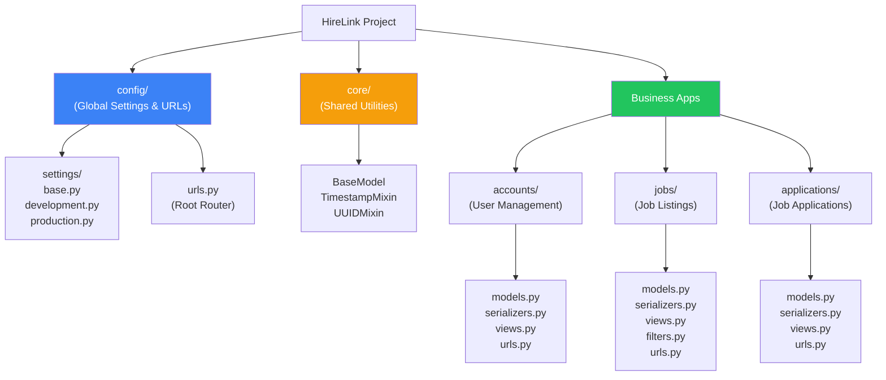
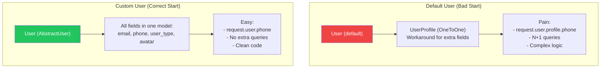
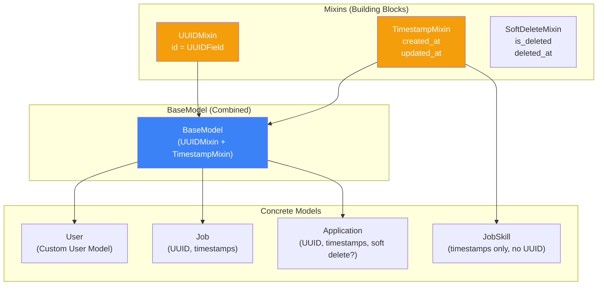
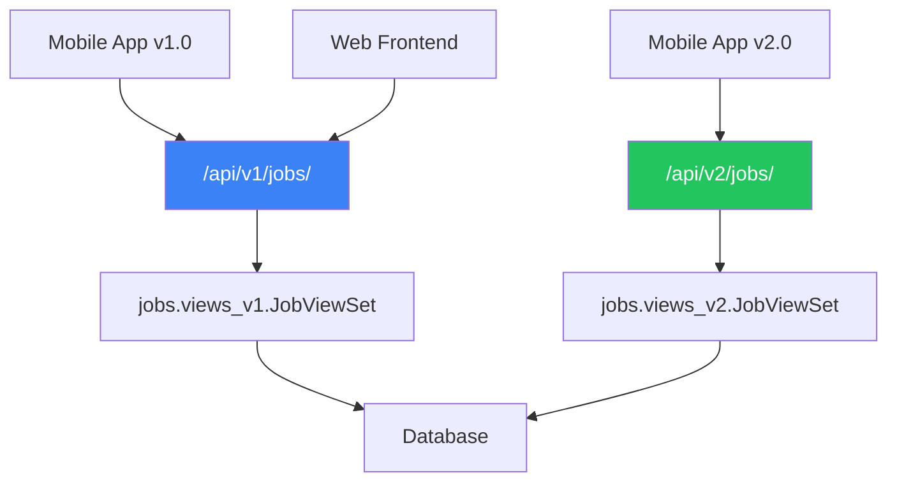
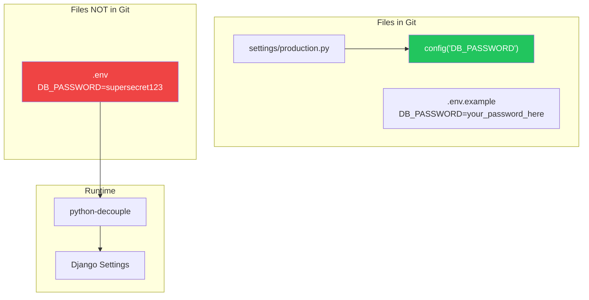

# الفصل السادس عشر — HireLink API: التهيئة الاحترافية للمشروع

> **المتطلبات:** كل الفصول السابقة من [[01-Python-Memory-And-GIL]] لحد [[15-DRF-Permissions-Throttling-Filtering]]. الفصل ده هو التتويج — هنطبق كل اللي اتعلمناه عشان نبني مشروع حقيقي من الصفر بالمعايير الاحترافية.

---

## البداية — من الصفر لـ Production-Ready Project

تخيّل معايا إنك قاعد قدام كمبيوتر فاضي. معاك Python ومشروع جديد. عايز تبني HireLink API — منصة freelancing مصرية بتربط Clients بـ Freelancers. فيديو يوتيوب هيقولك: `django-admin startproject hirelink` وخلاص. بس ده مش كافي لـ production.

إنت عايز:
- **Structure احترافي:** المشروع متقسم لـ apps منفصلة (`accounts`, `jobs`, `applications`, `messaging`).
- **Settings مقسمة:** Development غير Production. مفيش `DEBUG=True` في production ولا passwords في الكود.
- **Custom User Model:** من أول يوم. `email` هو الـ username. مفيش `UserProfile` منفصل.
- **BaseModel:** كل models فيها `created_at`, `updated_at`, `uuid` كـ primary key.
- **API Versioning:** `/api/v1/jobs/` عشان تقدر تغير الـ API في المستقبل من غير ما تكسر الـ clients القدام.
- **Documentation تلقائية:** Swagger/OpenAPI عشان الـ frontend team يعرفوا يستخدموا الـ API.

الفصل ده هيخطوا بيك خطوة بخطوة عشان تبني الأساس ده. مش مجرد "اعمل كذا" — ده "ليه بنعمل كذا وإزاي ده بيأثر على المشروع بعد ٦ شهور".

---

## [[01-Project-Structure]] — تقسيمة المشروع: من الفوضى للنظام

### 🧠 الشرح النظري

الـ default project structure اللي Django بتعمله (`startproject`) مش كافية لمشروع حقيقي. كل حاجة في root folder — `settings.py`, `urls.py`, `wsgi.py`. ده بيخلي المشروع صعب الصيانة لما يكبر.

**الـ Structure الاحترافي:**
```
hirelink/
├── manage.py
├── requirements/
│   ├── base.txt          # كل الـ packages المطلوبة
│   ├── development.txt   # development-specific (django-debug-toolbar)
│   └── production.txt    # production-specific (gunicorn, psycopg2)
├── config/               # Project configuration
│   ├── __init__.py
│   ├── settings/
│   │   ├── __init__.py
│   │   ├── base.py       # إعدادات مشتركة
│   │   ├── development.py
│   │   └── production.py
│   ├── urls.py           # Root URL configuration
│   ├── asgi.py
│   └── wsgi.py
├── hirelink/             # Reusable apps (business logic)
│   ├── core/             # Shared utilities, BaseModel, mixins
│   │   ├── models.py     # BaseModel, TimestampMixin
│   │   ├── utils.py
│   │   └── exceptions.py
│   ├── accounts/         # Custom User model, authentication
│   │   ├── models.py     # User, UserManager
│   │   ├── serializers.py
│   │   ├── views.py
│   │   └── urls.py
│   ├── jobs/             # Job listings
│   │   ├── models.py     # Job, Skill, Category
│   │   ├── serializers.py
│   │   ├── views.py
│   │   ├── filters.py
│   │   └── urls.py
│   ├── applications/     # Job applications
│   ├── messaging/        # Internal messaging
│   └── payments/         # Payment processing
├── static/               # Collected static files
├── media/                # User-uploaded files
├── templates/            # HTML templates (if any)
├── .env.example          # Example environment variables
├── .gitignore
├── Dockerfile
├── docker-compose.yml
└── README.md
```

**ليه التقسيمة دي؟**
- **`config/` منفصل:** كل إعدادات المشروع في مكان واحد. `settings/` مقسمة لـ base, development, production.
- **`requirements/` مقسمة:** متثبتش `django-debug-toolbar` في production. `base.txt` للـ shared packages.
- **`core` app:** لكل الـ shared logic — `BaseModel` (اللي كل models بترث منه)، `TimestampMixin`، `UUIDMixin`، custom exceptions.
- **Apps منفصلة:** `accounts` (المستخدمين)، `jobs` (الوظايف)، `applications` (التقديمات). كل app ليه `models.py`, `views.py`, `serializers.py`, `urls.py` خاصة بيه. ده بيسهل الـ maintenance والـ reuse.
- **API Versioning:** بنحط كل الـ API URLs تحت `/api/v1/` عشان لو غيرنا الـ API في المستقبل (v2)، الـ v1 تفضل شغالة للـ clients القدام.

تخيّل المشروع زي **شركة كبيرة**:
- **`config/`:** الإدارة العليا — القواعد العامة (settings) اللي بتمشي على الشركة كلها.
- **`core/`:** قسم الموارد البشرية والـ IT — خدمات مشتركة كل الأقسام محتاجاها.
- **`accounts/`:** قسم شؤون الموظفين — إدارة المستخدمين.
- **`jobs/`:** قسم المشاريع — إدارة الوظايف.
- **`applications/`:** قسم التوظيف — إدارة التقديمات.

كل قسم ليه مكاتبه وملفاته الخاصة. الإدارة العليا مش بتتدخل في تفاصيل كل قسم — بس بتحط القواعد العامة.

### 📊 Visualization



### 💻 Micro-Example

```python
# config/settings/base.py — Shared settings
from pathlib import Path
from datetime import timedelta

BASE_DIR = Path(__file__).resolve().parent.parent.parent

INSTALLED_APPS = [
    'django.contrib.admin',
    'django.contrib.auth',
    'django.contrib.contenttypes',
    'django.contrib.sessions',
    'django.contrib.messages',
    'django.contrib.staticfiles',
    
    # Third party
    'rest_framework',
    'rest_framework_simplejwt',
    'django_filters',
    'corsheaders',
    'drf_yasg',  # Swagger documentation
    
    # Local apps
    'hirelink.core',
    'hirelink.accounts',
    'hirelink.jobs',
    'hirelink.applications',
]

AUTH_USER_MODEL = 'accounts.User'

REST_FRAMEWORK = {
    'DEFAULT_AUTHENTICATION_CLASSES': [
        'rest_framework_simplejwt.authentication.JWTAuthentication',
    ],
    'DEFAULT_PERMISSION_CLASSES': [
        'rest_framework.permissions.IsAuthenticatedOrReadOnly',
    ],
    'DEFAULT_PAGINATION_CLASS': 'rest_framework.pagination.CursorPagination',
    'PAGE_SIZE': 20,
    'DEFAULT_FILTER_BACKENDS': [
        'django_filters.rest_framework.DjangoFilterBackend',
        'rest_framework.filters.SearchFilter',
        'rest_framework.filters.OrderingFilter',
    ],
}

SIMPLE_JWT = {
    'ACCESS_TOKEN_LIFETIME': timedelta(minutes=15),
    'REFRESH_TOKEN_LIFETIME': timedelta(days=7),
    'ROTATE_REFRESH_TOKENS': True,
    'BLACKLIST_AFTER_ROTATION': True,
}

# config/settings/development.py — Development overrides
from .base import *

DEBUG = True
ALLOWED_HOSTS = ['localhost', '127.0.0.1']

DATABASES = {
    'default': {
        'ENGINE': 'django.db.backends.sqlite3',
        'NAME': BASE_DIR / 'db.sqlite3',
    }
}

# config/settings/production.py — Production overrides
from .base import *
from decouple import config

DEBUG = False
ALLOWED_HOSTS = config('ALLOWED_HOSTS').split(',')

DATABASES = {
    'default': {
        'ENGINE': 'django.db.backends.postgresql',
        'NAME': config('DB_NAME'),
        'USER': config('DB_USER'),
        'PASSWORD': config('DB_PASSWORD'),
        'HOST': config('DB_HOST'),
        'PORT': config('DB_PORT', default='5432'),
    }
}

SECURE_SSL_REDIRECT = True
SESSION_COOKIE_SECURE = True
CSRF_COOKIE_SECURE = True
```

---

## [[02-Custom-User-Model]] — الـ User Model المخصص: الأساس المتين

### 🧠 الشرح النظري

أكبر غلطة في Django projects هي البدء بـ `User` model الافتراضي. Django نفسها بتحذرك: "If you're starting a new project, it's highly recommended to set up a custom User model." السبب إن تغييره بعدين شبه مستحيل.

**في HireLink، محتاجين:**
- Login بـ `email` مش `username`.
- `user_type` (Client ولا Freelancer).
- `is_verified` (هل الحساب موثق؟).
- `phone_number`, `avatar`, `bio`, `skills`.

**الحل: `AbstractUser` مع تعديل `USERNAME_FIELD`.**

Django بتقدم `AbstractUser` — ده الـ `User` model الافتراضي لكن abstract (مش بيتعمل منه table). إنت بتورث منه وتضيف الحقول اللي عايزها. تقدر كمان تغير `USERNAME_FIELD` لـ `email` وتخلي `username` field عادي (مش مطلوب).

**ليه `AbstractUser` مش `AbstractBaseUser`؟**
- `AbstractUser` بيديك كل حاجة جاهزة: `is_staff`, `is_superuser`, `groups`, `permissions`. Django Admin شغال out-of-the-box.
- `AbstractBaseUser` بيديك `password` و `last_login` بس. لازم تكتب كل حاجة بنفسك. استخدمه بس لو عايز تحكم كامل (زي login بـ phone number).

**إزاي نعمل Custom User Model من أول يوم؟**
1. `python manage.py startapp accounts`.
2. اعمل `User(AbstractUser)` model في `accounts/models.py`.
3. غير `USERNAME_FIELD = 'email'` و `REQUIRED_FIELDS = []`.
4. حط `AUTH_USER_MODEL = 'accounts.User'` في `settings.py`.
5. اعمل أول migration: `python manage.py makemigrations accounts`.
6. `python manage.py migrate`.

تخيّل الموضوع زي **بناء عمارة**. الـ `User` model هو الأساس. لو بدأت بأساس ضعيف (User افتراضي)، العمارة كلها هتكون معرضة للخطر. تغيير الأساس بعد ما العمارة اتبنت (migrations كتير و foreign keys) شبه مستحيل. ابدأ بأساس قوي من الأول — Custom User Model.

### 📊 Visualization



### 💻 Micro-Example

```python
# hirelink/accounts/models.py
from django.contrib.auth.models import AbstractUser, BaseUserManager
from django.db import models
from django.utils.translation import gettext_lazy as _

class UserManager(BaseUserManager):
    def create_user(self, email, password=None, **extra_fields):
        if not email:
            raise ValueError(_('The Email field must be set'))
        email = self.normalize_email(email)
        user = self.model(email=email, **extra_fields)
        user.set_password(password)
        user.save(using=self._db)
        return user
    
    def create_superuser(self, email, password=None, **extra_fields):
        extra_fields.setdefault('is_staff', True)
        extra_fields.setdefault('is_superuser', True)
        extra_fields.setdefault('is_verified', True)
        
        if extra_fields.get('is_staff') is not True:
            raise ValueError(_('Superuser must have is_staff=True.'))
        if extra_fields.get('is_superuser') is not True:
            raise ValueError(_('Superuser must have is_superuser=True.'))
        
        return self.create_user(email, password, **extra_fields)

class User(AbstractUser):
    USER_TYPE_CHOICES = [
        ('client', 'Client'),
        ('freelancer', 'Freelancer'),
    ]
    
    # Remove username field (we'll use email instead)
    username = None
    
    # Use email as the unique identifier
    email = models.EmailField(_('email address'), unique=True)
    
    # Custom fields
    user_type = models.CharField(max_length=20, choices=USER_TYPE_CHOICES)
    phone_number = models.CharField(max_length=15, blank=True)
    avatar = models.ImageField(upload_to='avatars/', blank=True, null=True)
    bio = models.TextField(blank=True)
    is_verified = models.BooleanField(default=False)
    email_verified = models.BooleanField(default=False)
    
    # Timestamps (could use BaseModel, shown later)
    created_at = models.DateTimeField(auto_now_add=True)
    updated_at = models.DateTimeField(auto_now=True)
    
    objects = UserManager()
    
    USERNAME_FIELD = 'email'
    REQUIRED_FIELDS = ['first_name', 'last_name', 'user_type']
    
    def __str__(self):
        return self.email
    
    def get_full_name(self):
        return f"{self.first_name} {self.last_name}".strip()
    
    def get_short_name(self):
        return self.first_name

# hirelink/accounts/admin.py
from django.contrib import admin
from django.contrib.auth.admin import UserAdmin as BaseUserAdmin
from django.utils.translation import gettext_lazy as _
from .models import User

@admin.register(User)
class UserAdmin(BaseUserAdmin):
    fieldsets = (
        (None, {'fields': ('email', 'password')}),
        (_('Personal info'), {'fields': ('first_name', 'last_name', 'phone_number', 'avatar', 'bio')}),
        (_('HireLink info'), {'fields': ('user_type', 'is_verified', 'email_verified')}),
        (_('Permissions'), {
            'fields': ('is_active', 'is_staff', 'is_superuser', 'groups', 'user_permissions'),
        }),
        (_('Important dates'), {'fields': ('last_login', 'created_at', 'updated_at')}),
    )
    add_fieldsets = (
        (None, {
            'classes': ('wide',),
            'fields': ('email', 'first_name', 'last_name', 'user_type', 'password1', 'password2'),
        }),
    )
    list_display = ('email', 'first_name', 'last_name', 'user_type', 'is_verified', 'is_staff')
    list_filter = ('user_type', 'is_verified', 'is_staff', 'is_superuser', 'is_active')
    search_fields = ('email', 'first_name', 'last_name')
    ordering = ('email',)
    readonly_fields = ('created_at', 'updated_at')
```

---

## [[03-BaseModel-And-Mixins]] — BaseModel: إعادة الاستخدام الذكي

### 🧠 الشرح النظري

لاحظت إن كل Model في المشروع محتاج `created_at`, `updated_at`, و `id` (أو `uuid`). بدل ما تكرر الـ fields دي في كل Model، بتعمل **Abstract Base Model** وكل Models تانية ترث منه.

**فوائد BaseModel:**
1. **DRY (Don't Repeat Yourself):** الحقول المتكررة بتتكتب مرة واحدة.
2. **Consistency:** كل models عندها نفس الـ timestamp fields ونفس الـ primary key type.
3. **Behavior مشترك:** تقدر تضيف methods مشتركة (زي `soft_delete()`, `is_active` filtering).

**ليه UUID بدل AutoField؟**
- **AutoField (integer):** sequential (1, 2, 3). بيعرض عدد الـ records في الـ API (`/jobs/1000/`). بيسهل التخمين (Enumeration attacks).
- **UUID:** random string (`a3f5b2c1-d4e6-...`). مش بيوضح عدد الـ records. أصعب في التخمين. مناسب للـ distributed systems.

**الـ Mixins:**
بدل ما تحط كل حاجة في BaseModel واحد، ممكن تعمل Mixins منفصلة:
- `TimestampMixin`: `created_at`, `updated_at`.
- `UUIDMixin`: `id = UUIDField(primary_key=True)`.
- `SoftDeleteMixin`: `is_deleted`, `deleted_at`.

الـ Models تختار الـ mixins اللي محتاجاها.

**القاعدة:**
- `BaseModel` = `UUIDMixin` + `TimestampMixin`. ده اللي ٩٥٪ من الـ Models هترث منه.
- Models معينة (زي `through` tables في ManyToMany) ممكن ترث من `TimestampMixin` بس.

تخيّل الموضوع زي **أثاث ايكيا**. بدل ما تصنع كل قطعة من الصفر، بتستخدم "الوحدات الأساسية" (Mixins) وتركبهم مع بعض. `BaseModel` هو "الوحدة الكاملة" — كرسي جاهز. لو عايز كرسي من غير مسند (من غير UUID)، ترجع للوحدات الأساسية.

### 📊 Visualization



### 💻 Micro-Example

```python
# hirelink/core/models.py
import uuid
from django.db import models
from django.utils import timezone

class UUIDMixin(models.Model):
    id = models.UUIDField(primary_key=True, default=uuid.uuid4, editable=False)
    
    class Meta:
        abstract = True

class TimestampMixin(models.Model):
    created_at = models.DateTimeField(auto_now_add=True)
    updated_at = models.DateTimeField(auto_now=True)
    
    class Meta:
        abstract = True

class SoftDeleteMixin(models.Model):
    is_deleted = models.BooleanField(default=False)
    deleted_at = models.DateTimeField(null=True, blank=True)
    
    class Meta:
        abstract = True
    
    def delete(self, using=None, keep_parents=False):
        self.is_deleted = True
        self.deleted_at = timezone.now()
        self.save()
    
    def hard_delete(self, using=None, keep_parents=False):
        super().delete(using=using, keep_parents=keep_parents)

class BaseModel(UUIDMixin, TimestampMixin):
    class Meta:
        abstract = True
        ordering = ['-created_at']

class BaseManager(models.Manager):
    def get_queryset(self):
        return super().get_queryset().filter(is_deleted=False)

class SoftDeleteModel(BaseModel, SoftDeleteMixin):
    objects = BaseManager()
    all_objects = models.Manager()  # Includes deleted items
    
    class Meta:
        abstract = True

# hirelink/jobs/models.py
from django.db import models
from hirelink.core.models import BaseModel, SoftDeleteModel

class Skill(BaseModel):
    name = models.CharField(max_length=100, unique=True)
    
    def __str__(self):
        return self.name

class Category(BaseModel):
    name = models.CharField(max_length=100)
    description = models.TextField(blank=True)
    parent = models.ForeignKey('self', on_delete=models.CASCADE, null=True, blank=True)
    
    class Meta:
        verbose_name_plural = 'Categories'
    
    def __str__(self):
        return self.name

class Job(SoftDeleteModel):  # Can be soft-deleted
    STATUS_CHOICES = [
        ('draft', 'Draft'),
        ('open', 'Open'),
        ('in_progress', 'In Progress'),
        ('completed', 'Completed'),
        ('closed', 'Closed'),
    ]
    
    title = models.CharField(max_length=255)
    description = models.TextField()
    client = models.ForeignKey('accounts.User', on_delete=models.CASCADE, related_name='jobs')
    category = models.ForeignKey(Category, on_delete=models.SET_NULL, null=True, related_name='jobs')
    skills = models.ManyToManyField(Skill, related_name='jobs')
    
    budget_min = models.DecimalField(max_digits=10, decimal_places=2)
    budget_max = models.DecimalField(max_digits=10, decimal_places=2)
    status = models.CharField(max_length=20, choices=STATUS_CHOICES, default='draft')
    
    is_featured = models.BooleanField(default=False)
    views_count = models.PositiveIntegerField(default=0)
    
    deadline = models.DateField(null=True, blank=True)
    published_at = models.DateTimeField(null=True, blank=True)
    
    def __str__(self):
        return self.title
    
    def publish(self):
        self.status = 'open'
        self.published_at = timezone.now()
        self.save()
```

---

## [[04-API-Versioning]] — API Versioning: حماية للمستقبل

### 🧠 الشرح النظري

لما تبني API، الـ clients (Mobile Apps, Frontend) بيعتمدوا على شكل الـ responses. لو غيرت الـ API (زي تغيير اسم field من `client` لـ `owner`)، كل الـ clients هتتكسر. الحل: **API Versioning**.

**الطرق الشائعة للـ Versioning:**
1. **URL Path:** `/api/v1/jobs/`, `/api/v2/jobs/`. الأكثر وضوحاً والأسهل في الـ implementation.
2. **Accept Header:** `Accept: application/json; version=1.0`. RESTful بحت، لكن أصعب في الـ testing.
3. **Query Parameter:** `/api/jobs/?version=1`. سهل، لكن بيلوث الـ URLs.

**في HireLink، هنستخدم URL Path Versioning:**
- `/api/v1/jobs/` — النسخة الحالية.
- `/api/v2/jobs/` — لو عملنا breaking changes في المستقبل.

**إزاي ننفذها في Django؟**
1. كل الـ API URLs تحت `api/v1/`.
2. نعمل `v1` package جوا كل app: `jobs/api/v1/views.py`, `jobs/api/v1/serializers.py`.
3. الـ root `urls.py` يشمل `api/v1/urls.py`.

**أو الطريقة الأبسط (اللي هنستخدمها):**
- الـ Views والـ Serializers في الـ app الرئيسي (`jobs/views.py`).
- نسجلهم مع Router تحت `/api/v1/` prefix.
- لما نحتاج v2، نعمل `jobs/api/v2/` package منفصل.

**ليه Versioning مهم من أول يوم؟**
- الـ clients (خصوصاً Mobile Apps) ممكن متحدثش التطبيق. الـ API لازم يفضل شغال للـ clients القدام.
- تقدر تطلق features جديدة في v2 من غير ما تخاف تكسر v1.
- الـ deprecation بيكون تدريجي — v1 تفضل شغالة لمدة ٦ شهور لحد ما كل الـ clients يهاجروا لـ v2.

تخيّل API Versioning زي **إصدارات Windows**. Windows 10 و Windows 11 الاتنين شغالين. التطبيقات اللي اتعملت لـ Windows 10 لسه شغالة على Windows 10. مايكروسوفت مبتكسرش الـ backward compatibility فجأة — بيدوا مهلة.

### 📊 Visualization



### 💻 Micro-Example

```python
# config/urls.py — Root URL configuration
from django.contrib import admin
from django.urls import path, include
from django.conf import settings
from django.conf.urls.static import static
from rest_framework import permissions
from drf_yasg.views import get_schema_view
from drf_yasg import openapi

schema_view = get_schema_view(
    openapi.Info(
        title="HireLink API",
        default_version='v1',
        description="Freelance platform connecting clients and freelancers",
        contact=openapi.Contact(email="support@hirelink.com"),
        license=openapi.License(name="MIT License"),
    ),
    public=True,
    permission_classes=[permissions.AllowAny],
)

urlpatterns = [
    path('admin/', admin.site.urls),
    
    # API Version 1
    path('api/v1/', include('hirelink.api_v1_urls')),
    
    # Documentation
    path('swagger/', schema_view.with_ui('swagger', cache_timeout=0), name='schema-swagger-ui'),
    path('redoc/', schema_view.with_ui('redoc', cache_timeout=0), name='schema-redoc'),
]

if settings.DEBUG:
    urlpatterns += static(settings.MEDIA_URL, document_root=settings.MEDIA_ROOT)

# hirelink/api_v1_urls.py — V1 API URLs
from rest_framework.routers import DefaultRouter
from django.urls import path, include
from rest_framework_simplejwt.views import TokenObtainPairView, TokenRefreshView, TokenBlacklistView

from hirelink.accounts.views import UserViewSet, RegisterView
from hirelink.jobs.views import JobViewSet, SkillViewSet, CategoryViewSet
from hirelink.applications.views import ApplicationViewSet

router = DefaultRouter()
router.register('users', UserViewSet, basename='user')
router.register('jobs', JobViewSet, basename='job')
router.register('skills', SkillViewSet, basename='skill')
router.register('categories', CategoryViewSet, basename='category')
router.register('applications', ApplicationViewSet, basename='application')

urlpatterns = [
    # Authentication
    path('auth/register/', RegisterView.as_view(), name='auth_register'),
    path('auth/token/', TokenObtainPairView.as_view(), name='token_obtain_pair'),
    path('auth/token/refresh/', TokenRefreshView.as_view(), name='token_refresh'),
    path('auth/token/blacklist/', TokenBlacklistView.as_view(), name='token_blacklist'),
    
    # Router URLs
    path('', include(router.urls)),
]

# hirelink/jobs/views.py — V1 Views
from rest_framework.viewsets import ModelViewSet
from rest_framework.permissions import IsAuthenticatedOrReadOnly
from django_filters.rest_framework import DjangoFilterBackend
from rest_framework.filters import SearchFilter, OrderingFilter
from .models import Job, Skill, Category
from .serializers import JobSerializer, SkillSerializer, CategorySerializer
from .filters import JobFilter
from .permissions import IsClientOrReadOnly

class JobViewSet(ModelViewSet):
    queryset = Job.objects.select_related('client', 'category').prefetch_related('skills')
    serializer_class = JobSerializer
    permission_classes = [IsAuthenticatedOrReadOnly, IsClientOrReadOnly]
    filter_backends = [DjangoFilterBackend, SearchFilter, OrderingFilter]
    filterset_class = JobFilter
    search_fields = ['title', 'description', 'client__email']
    ordering_fields = ['created_at', 'budget_min', 'budget_max', 'views_count']
    
    def perform_create(self, serializer):
        serializer.save(client=self.request.user)
    
    def get_queryset(self):
        queryset = super().get_queryset()
        # Filter out soft-deleted jobs (handled by BaseManager)
        return queryset

# For v2 in the future:
# hirelink/jobs/api/v2/views.py — V2 Views with breaking changes
class JobViewSetV2(ModelViewSet):
    # New serializer with different field names
    # New permission logic
    # New filtering options
    pass
```

---

## [[05-Environment-Variables]] — Environment Variables: سرية الإعدادات

### 🧠 الشرح النظري

مستحيل تحط `SECRET_KEY`, `DATABASE_PASSWORD`, `EMAIL_HOST_PASSWORD` في الكود. دول أسرار. لو الكود اترفع على GitHub (حتى private repo)، أي حد عنده access يقدر ياخدهم. الأسرار لازم تبقى في **Environment Variables**.

**الأدوات:**
- **`python-decouple`:** مكتبة بتقرا environment variables من `.env` file ومن الـ system environment.
- **`.env` file:** ملف فيه المتغيرات دي. **مش بيتحط في Git أبداً** (بيتحط في `.gitignore`).
- **`.env.example`:** نسخة من `.env` لكن من غير القيم الحقيقية. ده بيتحط في Git عشان المطورين الجدد يعرفوا إيه المتغيرات المطلوبة.

**إزاي نستخدم `python-decouple`؟**
```python
from decouple import config

SECRET_KEY = config('SECRET_KEY')  # Required — will raise error if missing
DEBUG = config('DEBUG', default=False, cast=bool)  # Optional with default
DB_PASSWORD = config('DB_PASSWORD')  # Required in production
```

**ليه `python-decouple` مش `os.environ.get()`؟**
- `config()` بتدعم casting (تحويل لـ bool, int, list).
- بتدعم default values.
- بتقرا من `.env` file تلقائياً (من غير ما تحمل `dotenv` library منفصلة).
- بترفع خطأ واضح لو المتغير المطلوب مش موجود.

**القاعدة الذهبية:** أي حاجة حساسة أو بتتغير بين البيئات (development vs production) لازم تبقى Environment Variable.

تخيّل Environment Variables زي **مفاتيح الشقة**. مفتاح شقة development غير مفتاح شقة production. إنت مش هتحط المفتاح مكتوب على باب الشقة (في الكود). المفتاح في جيبك (`.env`). ولما تسافر، بتاخد المفتاح معاك.

### 📊 Visualization



### 💻 Micro-Example

```python
# .env.example — Commit this to Git
SECRET_KEY=your-secret-key-here
DEBUG=True
ALLOWED_HOSTS=localhost,127.0.0.1
DB_NAME=hirelink
DB_USER=postgres
DB_PASSWORD=your-db-password
DB_HOST=localhost
DB_PORT=5432
EMAIL_HOST=smtp.gmail.com
EMAIL_PORT=587
EMAIL_HOST_USER=your-email@gmail.com
EMAIL_HOST_PASSWORD=your-app-password
REDIS_URL=redis://localhost:6379/0

# .env — NEVER commit this (add to .gitignore)
SECRET_KEY=django-insecure-abc123xyz789...
DEBUG=True
ALLOWED_HOSTS=localhost,127.0.0.1
DB_NAME=hirelink_dev
DB_USER=ahmed
DB_PASSWORD=mysecretpassword123
DB_HOST=localhost
DB_PORT=5432

# config/settings/base.py
from decouple import config, Csv
from pathlib import Path

BASE_DIR = Path(__file__).resolve().parent.parent.parent

SECRET_KEY = config('SECRET_KEY')
DEBUG = config('DEBUG', default=False, cast=bool)
ALLOWED_HOSTS = config('ALLOWED_HOSTS', default='', cast=Csv())

# config/settings/production.py
from .base import *
from decouple import config

DEBUG = False  # Force False in production

DATABASES = {
    'default': {
        'ENGINE': 'django.db.backends.postgresql',
        'NAME': config('DB_NAME'),
        'USER': config('DB_USER'),
        'PASSWORD': config('DB_PASSWORD'),
        'HOST': config('DB_HOST'),
        'PORT': config('DB_PORT', default='5432'),
    }
}

# Email configuration
EMAIL_BACKEND = 'django.core.mail.backends.smtp.EmailBackend'
EMAIL_HOST = config('EMAIL_HOST')
EMAIL_PORT = config('EMAIL_PORT', cast=int)
EMAIL_HOST_USER = config('EMAIL_HOST_USER')
EMAIL_HOST_PASSWORD = config('EMAIL_HOST_PASSWORD')
EMAIL_USE_TLS = True
DEFAULT_FROM_EMAIL = f"HireLink <{config('EMAIL_HOST_USER')}>"

# Cache with Redis
CACHES = {
    'default': {
        'BACKEND': 'django.core.cache.backends.redis.RedisCache',
        'LOCATION': config('REDIS_URL'),
    }
}

# requirements/base.txt
Django>=4.2,<5.0
djangorestframework>=3.14,<4.0
djangorestframework-simplejwt>=5.3,<6.0
django-filter>=23.5,<24.0
django-cors-headers>=4.3,<5.0
drf-yasg>=1.21,<2.0
python-decouple>=3.8,<4.0
psycopg2-binary>=2.9,<3.0  # PostgreSQL adapter
Pillow>=10.0,<11.0  # Image handling
celery>=5.3,<6.0  # Async tasks
redis>=5.0,<6.0  # Cache and message broker

# requirements/development.txt
-r base.txt
django-debug-toolbar>=4.2,<5.0
ipython>=8.15,<9.0

# requirements/production.txt
-r base.txt
gunicorn>=21.2,<22.0
```

---

## 🎯 أسئلة الإنترفيو

**س: إيه هي أفضل practices لـ Django Project Structure؟ وليه مش بنستخدم الـ default structure؟**

> الـ **Default Django Structure** (`startproject` و `startapp`) كويسة للمشاريع الصغيرة، لكن ليها limitations في المشاريع الكبيرة:<br/><br/>
> 
> **المشاكل في الـ default structure:**
> 1. **`settings.py` واحدة:** بتخليك تستخدم `if DEBUG:` عشان تفرق بين development و production. ده messy وعرضة للأخطاء (نسيت تحط `DEBUG=False` في production).
> 2. **كل Apps في نفس المستوى:** مفيش organization. بعد ١٠ Apps، المشروع بيبقى صعب تتنقل فيه.
> 3. **الـ base logic متكرر:** كل Model ليه `created_at`, `updated_at` متكررين. مفيش `BaseModel`.
> 4. **الـ URLs كلها في `urls.py` واحدة:** بتخلي الـ routing معقد وصعب الصيانة.<br/><br/>
> 
> **الـ Best Practices اللي بنطبقها في HireLink:**
> 1. **Split Settings:** `config/settings/base.py` (مشتركة)، `development.py`، `production.py`. `DEBUG` و `DATABASES` في كل بيئة منفصلة. مفيش `if DEBUG` في الكود.
> 2. **`core` App:** للحاجات المشتركة — `BaseModel`, `TimestampMixin`, `UUIDMixin`. كل Models تانية بترث منهم.
> 3. **Apps منظمة:** كل app ليه `models.py`, `views.py`, `serializers.py`, `urls.py` خاصة بيه. الـ root `urls.py` بتـ include الـ app URLs.
> 4. **Environment Variables:** استخدام `python-decouple` و `.env` file للأسرار. `.env` مش في Git.
> 5. **API Versioning:** `/api/v1/` prefix من الأول. سهل تضيف `/api/v2/` في المستقبل.
> 6. **Requirements مقسمة:** `base.txt`, `development.txt`, `production.txt`. بتثبت بس الـ packages المطلوبة في كل بيئة.

---

**س: ليه لازم نبدأ بـ Custom User Model من أول يوم؟ وإزاي نعمله بـ `AbstractUser`؟**

> **لازم نبدأ بـ Custom User Model من أول يوم** لأن Django بتحذر من تغيير الـ User model بعد ما الـ migrations تتعمل. تغييره بعدين شبه مستحيل في production وهتحتاج تمسح الـ database أو تعمل workarounds معقدة.<br/><br/>
> 
> **ليه `AbstractUser` مش `AbstractBaseUser`؟**
> - **`AbstractUser`:** بيديك كل الـ fields الأساسية (`username`, `email`, `first_name`, `last_name`, `is_staff`, `is_superuser`). Django Admin شغال out-of-the-box. مناسب لـ ٩٠٪ من المشاريع.
> - **`AbstractBaseUser`:** بيديك `password` و `last_login` بس. لازم تكتب كل حاجة بنفسك (حتى `email` field). استخدمه بس لو عايز تحكم كامل (زي login بـ phone number).<br/><br/>
> 
> **خطوات عمل Custom User Model بـ `AbstractUser`:**
> 1. اعمل app جديد: `python manage.py startapp accounts`.
> 2. في `accounts/models.py`:
> ```python
> from django.contrib.auth.models import AbstractUser
> from django.db import models
> 
> class User(AbstractUser):
>     username = None  # Remove username field
>     email = models.EmailField(unique=True)
>     user_type = models.CharField(max_length=20, choices=[('client', 'Client'), ('freelancer', 'Freelancer')])
>     
>     USERNAME_FIELD = 'email'
>     REQUIRED_FIELDS = ['first_name', 'last_name', 'user_type']
> ```
> 3. في `settings.py`: `AUTH_USER_MODEL = 'accounts.User'`.
> 4. اعمل أول migration: `python manage.py makemigrations accounts && python manage.py migrate`.
> 5. استخدم `get_user_model()` أو `settings.AUTH_USER_MODEL` في أي مكان بدل `User` المباشر.

---

**س: إيه فايدة `BaseModel` و `Mixins` في Django؟ وازاي بنستخدمهم؟**

> **`BaseModel` و `Mixins`** بيقللوا تكرار الكود (DRY) وبيضمنوا consistency عبر الـ models المختلفة.<br/><br/>
> 
> **المشكلة اللي بيحلوها:**
> كل Model في المشروع محتاج `id`, `created_at`, `updated_at`. بدل ما تكرر الـ 3 fields دول في كل Model (20 Model × 3 fields = 60 سطر تكرار)، بتعمل `BaseModel` مرة واحدة وكل Models ترث منه.<br/><br/>
> 
> **الـ Mixins الشائعة:**
> - **`UUIDMixin`:** `id = models.UUIDField(primary_key=True, default=uuid.uuid4)`. بيستخدم UUID بدل auto-increment integer. أكثر أماناً (مش بيعرض عدد الـ records) ومناسب للـ distributed systems.
> - **`TimestampMixin`:** `created_at`, `updated_at`. أي Model محتاج تتبع الوقت.
> - **`SoftDeleteMixin`:** `is_deleted`, `deleted_at`. بدل ما تحذف الـ record فعلياً، بتعمله mark as deleted. بيرجع في الـ queries اللي بتستخدم `objects.filter(is_deleted=False)`.
> - **`BaseModel`:** تجميع لـ `UUIDMixin` + `TimestampMixin`. ده اللي ٩٥٪ من الـ Models هترث منه.<br/><br/>
> 
> **كيف نستخدمهم:**
> ```python
> # core/models.py
> class BaseModel(UUIDMixin, TimestampMixin):
>     class Meta:
>         abstract = True
>         ordering = ['-created_at']
> 
> # jobs/models.py
> class Job(BaseModel):  # Inherits id, created_at, updated_at
>     title = models.CharField(max_length=255)
>     # ... rest of fields
> ```
> 
> **الفوائد:**
> 1. **DRY:** مفيش تكرار.
> 2. **Consistency:** كل Models عندها نفس الـ primary key type ونفس الـ timestamp behavior.
> 3. **Behavior مشترك:** تقدر تضيف methods زي `soft_delete()` في الـ Mixin وتستخدمها في أي Model.
> 4. **سهولة التغيير:** لو حبيت تغير الـ primary key لـ `BigAutoField` (مثلاً)، بتغيره في `BaseModel` بس.

---

**س: إيه هو API Versioning؟ وإزاي بنطبقه في Django REST Framework؟**

> **API Versioning** هو استراتيجية لإدارة التغييرات في الـ API من غير ما تكسر الـ clients القديمة.<br/><br/>
> 
> **ليه مهم؟**
> - الـ clients (خصوصاً Mobile Apps) ممكن متحدثش التطبيق. الـ API لازم يفضل شغال للـ clients القدام.
> - تقدر تطلق features جديدة أو تغير الـ response structure في v2 من غير ما تخاف تكسر v1.
> - الـ deprecation بيكون تدريجي — v1 تفضل شغالة لمدة ٦-١٢ شهر لحد ما كل الـ clients يهاجروا.<br/><br/>
> 
> **طرق الـ Versioning:**
> 1. **URL Path:** `/api/v1/jobs/`, `/api/v2/jobs/`. الأكثر وضوحاً والأسهل. (هنستخدمها في HireLink).
> 2. **Accept Header:** `Accept: application/json; version=1.0`. RESTful، لكن أصعب في الـ testing.
> 3. **Query Parameter:** `/api/jobs/?version=1`. سهل، لكن بيلوث الـ URLs.<br/><br/>
> 
> **التطبيق في Django:**
> 4. كل الـ API URLs تحت `api/v1/`:
> ```python
> # config/urls.py
> urlpatterns = [
>     path('api/v1/', include('hirelink.api_v1_urls')),
> ]
> ```
> 5. نعمل `api_v1_urls.py` يجمع كل الـ routers:
> ```python
> router = DefaultRouter()
> router.register('jobs', JobViewSet)
> # ... etc
> ```
> 6. الـ Views والـ Serializers في الـ app الرئيسي (`jobs/views.py`). ده لـ v1.
> 7. لما نحتاج v2، نعمل `jobs/api/v2/views.py` و `jobs/api/v2/serializers.py` ونضيف `path('api/v2/', include('hirelink.api_v2_urls'))`.<br/><br/>
> 
> **Best Practices:**
> - Version من أول يوم — حتى لو مش متوقع تغييرات. إضافته بعدين أصعب.
> - خلي v1 شغالة لمدة كافية (٦-١٢ شهر) بعد إطلاق v2. أعلن عن deprecation في الـ response headers.
> - الـ Serializers في v2 ممكن ترث من v1 وتعدل على الـ fields بس.

---

**س: إزاي تدير الـ Settings بأمان بين Development و Production؟ وايه دور `python-decouple`؟**

> إدارة الـ Settings بشكل آمن بتمنع تسريب الأسرار وبتضمن إن كل بيئة شغالة بالإعدادات المناسبة.<br/><br/>
> 
> **الاستراتيجية:**
> 1. **Split Settings Files:**
>    - `config/settings/base.py`: إعدادات مشتركة (INSTALLED_APPS, MIDDLEWARE, REST_FRAMEWORK).
>    - `config/settings/development.py`: `DEBUG=True`, SQLite database, `django-debug-toolbar`.
>    - `config/settings/production.py`: `DEBUG=False`, PostgreSQL, security headers.
> 2. **Environment Variables للأسرار:** `SECRET_KEY`, `DB_PASSWORD`, `EMAIL_HOST_PASSWORD` مينفعش يكونوا في الكود.
> 3. **`.env` file:** بيحتوي على القيم الحقيقية. **مش في Git** (بيتحط في `.gitignore`).
> 4. **`.env.example`:** بيحتوي على أسماء المتغيرات بس (من غير القيم). ده في Git عشان المطورين الجدد يعرفوا المطلوب.<br/><br/>
> 
> **دور `python-decouple`:**
> - مكتبة بتقرا Environment Variables من الـ system environment أو من `.env` file.
> - بتدعم **Casting**: `config('DEBUG', cast=bool)`, `config('ALLOWED_HOSTS', cast=Csv())`.
> - بتدعم **Default Values**: `config('DB_PORT', default='5432')`.
> - بترفع خطأ واضح لو متغير مطلوب مش موجود.<br/><br/>
> 
> **مثال:**
> ```python
> # .env (not in Git)
> SECRET_KEY=abc123xyz
> DEBUG=True
> DB_PASSWORD=supersecret
> 
> # settings/base.py
> from decouple import config
> SECRET_KEY = config('SECRET_KEY')  # Required
> DEBUG = config('DEBUG', default=False, cast=bool)
> 
> # settings/production.py
> from .base import *
> DATABASES = {
>     'default': {
>         'PASSWORD': config('DB_PASSWORD'),  # From .env
>     }
> }
> ```
> 
> **ليه `python-decouple` أحسن من `os.environ.get()`؟**
> - `os.environ.get('KEY', 'default')` بترجع `'default'` لو المفتاح مش موجود — ممكن يخلي production يشتغل بـ default insecure settings.
> - `config('KEY')` بترفع خطأ لو المفتاح مش موجود — بتمنع الأخطاء الصامتة.
> - `decouple` بتدعم `.env` file تلقائياً (من غير `python-dotenv`).
> - `decouple` بتدعم casting (bool, int, list) بسهولة.

---

## 📝 خلاصة الدرس

- **Project Structure احترافية:** `config/` للإعدادات (مقسمة لـ base, development, production). `core/` للـ shared logic (BaseModel, Mixins). كل Business App ليه ملفاته المنفصلة. `requirements/` مقسمة.
- **Custom User Model:** ابدأ بـ `AbstractUser` من أول يوم. `USERNAME_FIELD = 'email'`. أضيف `user_type` وأي fields إضافية. `AUTH_USER_MODEL = 'accounts.User'` قبل أول migration.
- **BaseModel و Mixins:** `UUIDMixin` (UUID primary key), `TimestampMixin` (created_at, updated_at), `SoftDeleteMixin` (حذف آمن). `BaseModel` بيجمعهم. بيوفر DRY و consistency.
- **API Versioning:** استخدم URL Path Versioning (`/api/v1/`). سهل واضح. بيحمي الـ clients من breaking changes في المستقبل.
- **Environment Variables:** استخدم `python-decouple` و `.env` file. الأسرار مش في Git. `.env.example` للتوثيق.
- **Documentation تلقائية:** `drf-yasg` بيولد Swagger/OpenAPI documentation من الـ code. الـ frontend team بيقدروا يشوفوا كل الـ endpoints ويتفاعلوا معاها.

---

*Next → [[17-Building-The-HireLink-API]] — جهزنا الأساس. دلوقتي هنبني الـ API كامل: Jobs, Applications, Reviews, Messaging. هنطبق كل الـ advanced patterns اللي اتعلمناها — Custom Permissions, Signals, Throttling, Cursor Pagination — عشان نطلع API محترف جاهز للـ production.*