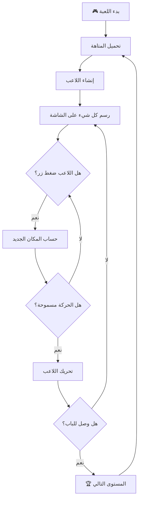
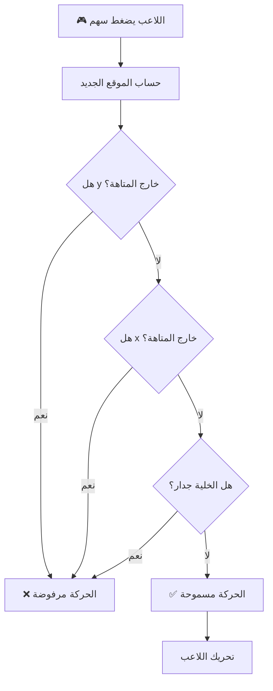
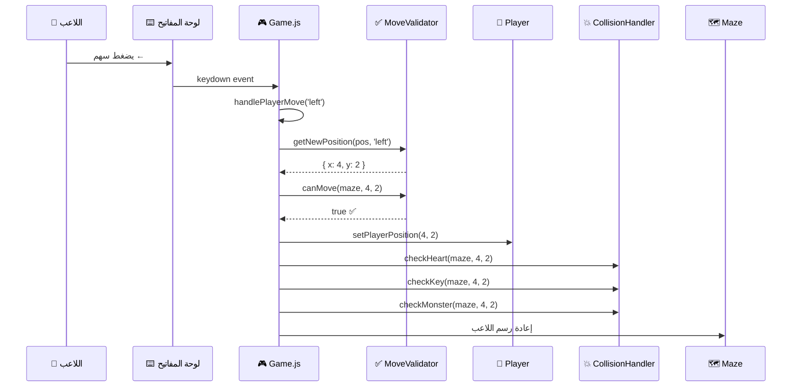

# 🎮 دليل شامل لفهم لعبة Mazer

  

## Complete Guide to Understanding Game Development Concepts

  

> **المستوى المطلوب:** مطور JavaScript متوسط

> **الهدف:** فهم كامل لكيفية بناء لعبة متاهة من الصفر

  

---

  

## 📑 جدول المحتويات

  

1. [المقدمة: ما هي اللعبة؟](#-المقدمة-ما-هي-اللعبة)

2. [الجزء الأول: المتاهة (Maze)](#-الجزء-الأول-المتاهة-maze)

3. [الجزء الثاني: اللاعب (Player)](#-الجزء-الثاني-اللاعب-player)

4. [الجزء الثالث: حلقة اللعبة (Game Loop)](#-الجزء-الثالث-حلقة-اللعبة-game-loop)

5. [الجزء الرابع: ربط كل شيء معًا](#-الجزء-الرابع-ربط-كل-شيء-معا)

6. [تمارين عملية](#-تمارين-عملية)

  

---

  

# 🎯 المقدمة: ما هي اللعبة؟

  

## الفكرة البسيطة

  

كل لعبة في العالم مبنية على 3 مكونات أساسية:

  

```

┌─────────────────────────────────────────────────────────┐

│ اللعبة │

├─────────────────────────────────────────────────────────┤

│ │

│ ┌──────────┐ ┌──────────┐ ┌──────────┐ │

│ │ البيانات │ │ المنطق │ │ العرض │ │

│ │ (Data) │ ←→ │ (Logic) │ ←→ │ (Render) │ │

│ └──────────┘ └──────────┘ └──────────┘ │

│ │

│ • مكان اللاعب • قواعد الحركة • رسم المتاهة │

│ • شكل المتاهة • التصادمات • رسم اللاعب │

│ • النقاط • الفوز/الخسارة • تحديث الشاشة │

│ │

└─────────────────────────────────────────────────────────┘

```

  

## كيف تعمل اللعبة؟ (التدفق العام)

  



  

---

  

# 🧱 الجزء الأول: المتاهة (Maze)

  

## 💡 الفكرة الأساسية

  

المتاهة ليست سوى **جدول ثنائي الأبعاد (2D Array)** يحتوي على أرقام. كل رقم يمثل نوع مختلف من البلاطات:

  

```javascript

// هذا هو ملف MazeLevels.js

// 0 = ممر (يمكن المشي عليه)

// 1 = جدار (يمنع الحركة)

// 2 = قلب (يزيد الحياة)

// 3 = مفتاح (للتجميع)

// 4 = وحش (يضر اللاعب)

// 5 = باب (الهدف النهائي)

```

  

## 🗺️ كيف تبدو المتاهة في الكود؟

  

```javascript

let maze = [

[0, 0, 0, 1, 0, 0, 3], // الصف 0

[1, 1, 0, 1, 0, 1, 0], // الصف 1

[0, 0, 0, 0, 0, 1, 0], // الصف 2

[0, 1, 1, 1, 0, 0, 0], // الصف 3

[0, 0, 0, 0, 0, 1, 5], // الصف 4

];

// العمود: 0 1 2 3 4 5 6

```

  

### 📊 تخيل هذا الجدول بصريًا:

  

```

العمود → 0 1 2 3 4 5 6

┌────┬────┬────┬────┬────┬────┬────┐

الصف 0 │ 🟫 │ 🟫 │ 🟫 │ ⬛ │ 🟫 │ 🟫 │ 🔑 │

├────┼────┼────┼────┼────┼────┼────┤

الصف 1 │ ⬛ │ ⬛ │ 🟫 │ ⬛ │ 🟫 │ ⬛ │ 🟫 │

├────┼────┼────┼────┼────┼────┼────┤

الصف 2 │ 🟫 │ 🟫 │ 🟫 │ 🟫 │ 🟫 │ ⬛ │ 🟫 │

├────┼────┼────┼────┼────┼────┼────┤

الصف 3 │ 🟫 │ ⬛ │ ⬛ │ ⬛ │ 🟫 │ 🟫 │ 🟫 │

├────┼────┼────┼────┼────┼────┼────┤

الصف 4 │ 🟫 │ 🟫 │ 🟫 │ 🟫 │ 🟫 │ ⬛ │ 🚪 │

└────┴────┴────┴────┴────┴────┴────┘

  

🟫 = ممر (0) ⬛ = جدار (1) 🔑 = مفتاح (3) 🚪 = باب (5)

```

  

## 🔍 كيف نقرأ المتاهة؟

  

### طريقة الوصول لأي خلية:

  

```javascript

// الصيغة العامة:

maze[row][column];

maze[الصف][العمود];

  

// أمثلة:

maze[0][0] = 0; // الخلية أعلى يسار → ممر

maze[0][3] = 1; // الصف 0، العمود 3 → جدار

maze[4][6] = 5; // الصف 4، العمود 6 → الباب

```

  

### ⚠️ انتبه! الترتيب مهم جدًا:

  

```

maze[y][x]

↑ ↑

│ └── العمود (column) = الحركة الأفقية ←→

│

└───── الصف (row) = الحركة الرأسية ↑↓

  

```

  

```javascript

// هذا صحيح ✅

let value = maze[row][column];

  

// هذا خطأ شائع ❌

let value = maze[column][row];

```

  

## 🎨 رسم المتاهة على الشاشة

  

### الخطوة 1: فهم Canvas

  

```javascript

// الـ Canvas هو "لوحة رسم" في HTML

let canvas = document.getElementById("canvas");

  

// الـ Context هو "القلم" الذي نرسم به

const ctx = canvas.getContext("2d");

  

// حجم كل بلاطة بالبكسل

const TILE_SIZE = 80;

```

  

### الخطوة 2: المرور على كل خلية ورسمها

  

```javascript

function drawMaze(maze) {

// المرور على كل صف

for (let row = 0; row < maze.length; row++) {

// المرور على كل عمود في هذا الصف

for (let col = 0; col < maze[row].length; col++) {

// ما هي قيمة هذه الخلية؟

let cellValue = maze[row][col];

  

// أين أرسم هذه الخلية على الشاشة؟

let drawX = col * TILE_SIZE; // الموقع الأفقي

let drawY = row * TILE_SIZE; // الموقع الرأسي

  

// ماذا أرسم؟

if (cellValue === 0) {

drawPath(drawX, drawY); // ممر

} else if (cellValue === 1) {

drawWall(drawX, drawY); // جدار

} else if (cellValue === 3) {

drawPath(drawX, drawY); // أرسم ممر أولاً

drawKey(drawX, drawY); // ثم المفتاح فوقه

} else if (cellValue === 5) {

drawDoor(drawX, drawY); // باب

}

}

}

}

```

  

### 📐 تحويل الإحداثيات (Math Behind Drawing)

  

```

┌─────────────────────────────────────────────────────────────┐

│ │

│ الخلية في الـ Array: maze[2][3] │

│ │

│ ┌──────────────────────────────────────────┐ │

│ │ │ │

│ │ row = 2 → Y = 2 × 80 = 160px │ │

│ │ col = 3 → X = 3 × 80 = 240px │ │

│ │ │ │

│ │ الرسم يبدأ من النقطة: (240, 160) │ │

│ │ │ │

│ └──────────────────────────────────────────┘ │

│ │

│ Canvas: │

│ ┌──────────────────────────────────────────┐ │

│ │ col 0 col 1 col 2 col 3 │ │

│ │ ┌────────┬────────┬────────┬────────┐ │ │

│ │ r0│ (0,0) │ (80,0) │(160,0) │(240,0) │ │ ← Y = 0 │

│ │ ├────────┼────────┼────────┼────────┤ │ │

│ │ r1│ (0,80) │(80,80) │(160,80)│(240,80)│ │ ← Y = 80 │

│ │ ├────────┼────────┼────────┼────────┤ │ │

│ │ r2│(0,160) │(80,160)│(160,160)│(240,160)│ │ ← Y = 160 │

│ │ └────────┴────────┴────────┴──────┬─┘ │ │

│ │ ▲ │ │

│ │ │ │ │

│ │ هنا الخلية │ │

│ │ maze[2][3] │ │

│ └──────────────────────────────────────────┘ │

│ │

└─────────────────────────────────────────────────────────────┘

```

  

### 🖼️ رسم الصور (drawImage)

  

```javascript

// أبسط طريقة لرسم صورة:

ctx.drawImage(

image, // الصورة المراد رسمها

x, // موقع الرسم الأفقي

y, // موقع الرسم الرأسي

width, // عرض الصورة عند الرسم

height, // ارتفاع الصورة عند الرسم

);

  

// مثال عملي:

function drawPath(x, y) {

ctx.drawImage(pathImage, x, y, TILE_SIZE, TILE_SIZE);

}

  

function drawWall(x, y) {

ctx.drawImage(wallImage, x, y, TILE_SIZE, TILE_SIZE);

}

```

  

## 🎬 تحريك العناصر في المتاهة (Animation)

  

### كيف تعمل الأنيميشن؟

  

الأنيميشن هو **خداع بصري**. نعرض صور متتالية بسرعة تخلق وهم الحركة:

  

```

Frame 1 Frame 2 Frame 3 Frame 4 Frame 1...

┌─────┐ ┌─────┐ ┌─────┐ ┌─────┐ ┌─────┐

│ 🔑 │ → │ 🔑 │ → │ 🔑 │ → │ 🔑 │ → │ 🔑 │

│ ◐ │ │ ◑ │ │ ◒ │ │ ◓ │ │ ◐ │

└─────┘ └─────┘ └─────┘ └─────┘ └─────┘

↑

│

Sprite Sheet: [Frame1 | Frame2 | Frame3 | Frame4]

```

  

### 📜 Sprite Sheet

  

صورة واحدة تحتوي على كل إطارات الأنيميشن:

  

```

┌─────────────────────────────────────────────────────┐

│ KEY SPRITE SHEET │

├───────────┬───────────┬───────────┬───────────────┤

│ Frame 0 │ Frame 1 │ Frame 2 │ Frame 3 │

│ │ │ │ │

│ 🔑 │ 🔑 │ 🔑 │ 🔑 │

│ (◐) │ (◑) │ (◒) │ (◓) │

│ │ │ │ │

├───────────┼───────────┼───────────┼───────────────┤

│ 0-125px │ 125-250px │ 250-375px │ 375-500px │

└───────────┴───────────┴───────────┴───────────────┘

↑

frameWidth = 125px

```

  

### الكود المسؤول عن الأنيميشن:

  

```javascript

let gameFrame = 0; // عداد الإطارات

let staggerFrames = 20; // كل كم إطار نغير الصورة؟

  

function animateKeys() {

gameFrame++; // زيادة العداد كل مرة

  

// حساب أي Frame نعرضه الآن

// Math.floor للتقريب للأسفل

// % 4 للدوران بين 0, 1, 2, 3

let position = Math.floor(gameFrame / staggerFrames) % 4;

  

// مثال على القيم:

// gameFrame = 0-19 → position = 0

// gameFrame = 20-39 → position = 1

// gameFrame = 40-59 → position = 2

// gameFrame = 60-79 → position = 3

// gameFrame = 80-99 → position = 0 (يعود من البداية)

  

// حساب أين نقص من الـ Sprite Sheet

let frameX = spriteWidth * position;

  

// رسم الجزء الصحيح من الـ Sprite

ctx.drawImage(

keySprite, // الصورة الكاملة

frameX,

0, // نقطة البداية للقص (sourceX, sourceY)

spriteWidth, // عرض المنطقة المقصوصة

spriteHeight, // ارتفاع المنطقة المقصوصة

drawX,

drawY, // أين نرسم على الـ Canvas

TILE_SIZE, // عرض الرسم النهائي

TILE_SIZE, // ارتفاع الرسم النهائي

);

  

// استدعاء نفسنا في الإطار التالي (60 مرة في الثانية)

requestAnimationFrame(animateKeys);

}

```

  

### 🔄 شرح requestAnimationFrame

  

```javascript

/*

requestAnimationFrame هي دالة من المتصفح تقول:

"نفذ هذا الكود قبل الرسم التالي للشاشة"

  

المتصفح يرسم الشاشة ~60 مرة في الثانية (60 FPS)

فكل استدعاء لـ animateKeys يحدث كل ~16.67 ملي ثانية

  

لماذا نستخدمها بدل setInterval؟

1. أسرع وأنعم

2. تتوقف تلقائيًا لو المتصفح في الخلفية (توفير بطارية)

3. متزامنة مع معدل تحديث الشاشة

*/

  

function animateKeys() {

// ... الكود ...

  

// هذا السطر يقول: "نفذني مرة ثانية في الإطار التالي"

requestAnimationFrame(animateKeys);

}

  

// بدء الحلقة:

animateKeys(); // أول استدعاء، ثم تستمر للأبد

```

  

---

  

# 🏃 الجزء الثاني: اللاعب (Player)

  

## 💡 ما هو اللاعب؟

  

اللاعب هو **كائن (Object)** يحتوي على:

  

- **البيانات:** مكانه، حياته، مفاتيحه، نقاطه

- **السلوكيات:** الحركة، جمع المفاتيح، خسارة الحياة

  

## 📦 هيكل كلاس اللاعب

  

```javascript

class Player {

// المتغيرات الخاصة (Private Fields)

// علامة # تعني: لا يمكن الوصول لها من خارج الكلاس

#position; // { x: 0, y: 0 }

#lives; // 3

#startPosition; // { x: 0, y: 0 }

#maxLives; // 3

#keys; // 0

#score; // 0

#isMoving; // false

#direction; // 0, 1, 2, 3 (up, left, right, down)

  

constructor(startX, startY, lives = 3) {

// إعداد القيم الابتدائية

this.#startPosition = { x: startX, y: startY };

this.#position = { x: startX, y: startY };

this.#lives = lives;

this.#maxLives = lives;

this.#keys = 0;

this.#score = 0;

this.#isMoving = false;

this.#direction = 2; // يبدأ ناظرًا لليمين

}

}

```

  

### 🤔 لماذا نستخدم Private Fields (#)؟

  

```javascript

// ❌ بدون Private Fields:

class Player {

constructor() {

this.lives = 3;

}

}

let player = new Player();

player.lives = 1000; // أي أحد يقدر يغيرها! 😱

  

// ✅ مع Private Fields:

class Player {

#lives;

constructor() {

this.#lives = 3;

}

  

getLivesCount() {

return this.#lives;

}

  

loseLife() {

this.#lives = Math.max(0, this.#lives - 1);

}

}

let player = new Player();

player.#lives = 1000; // ❌ Error! لا يمكن الوصول

player.loseLife(); // ✅ هذا مسموح

```

  

## 🎮 وظائف اللاعب

  

### 1. إدارة الموقع

  

```javascript

// تغيير موقع اللاعب

setPlayerPosition(x, y) {

this.#position = { x, y };

}

  

// قراءة موقع اللاعب

getPlayerPosition() {

// { ...this.#position } تعني: انسخ الكائن

// لماذا ننسخ؟ لمنع التعديل على الأصل!

return { ...this.#position };

}

  

// إرجاع اللاعب لنقطة البداية

resetPlayerPosition() {

this.#position = { ...this.#startPosition };

}

```

  

### 2. إدارة الحياة

  

```javascript

// خسارة حياة

loseLife() {

// Math.max يضمن أن العدد لا ينزل تحت 0

this.#lives = Math.max(0, this.#lives - 1);

}

  

// كسب حياة

gainLife() {

// Math.min يضمن أن العدد لا يتجاوز الحد الأقصى

this.#lives = Math.min(this.#maxLives, this.#lives + 1);

}

  

// هل اللاعب حي؟

isPlayerAlive() {

return this.#lives > 0;

}

```

  

### 3. جمع المفاتيح

  

```javascript

collectKey() {

this.#keys++; // زيادة عدد المفاتيح

this.#score += 100; // زيادة النقاط

}

```

  

## 🧭 نظام الاتجاهات

  

```javascript

// الاتجاهات مرقمة للسهولة:

const DIRECTION = {

UP: 0, // ↑ فوق

LEFT: 1, // ← يسار

RIGHT: 2, // → يمين

DOWN: 3, // ↓ تحت

};

  

// في الـ Sprite Sheet، كل صف يمثل اتجاه:

/*

┌────────────────────────────────────┐

│ Row 0: UP → الشخصية من الخلف │

│ Row 1: LEFT → الشخصية من اليسار │

│ Row 2: RIGHT → الشخصية من اليمين │

│ Row 3: DOWN → الشخصية من الأمام │

└────────────────────────────────────┘

*/

```

  

## 🚶 التحقق من صحة الحركة (MoveValidator)

  

قبل تحريك اللاعب، نتحقق: هل الحركة مسموحة؟

  

```javascript

class MoveValidator {

// هل يمكن التحرك لهذه الخلية؟

static canMove(maze, x, y) {

// 1. تأكد أن المتاهة موجودة

if (!maze) return false;

  

// 2. تأكد أننا داخل حدود المتاهة (Y)

if (y < 0 || y >= maze.length) return false;

  

// 3. تأكد أننا داخل حدود المتاهة (X)

if (x < 0 || x >= maze[y].length) return false;

  

// 4. تأكد أن الخلية ليست جدار

const tile = maze[y][x];

if (tile === 1) return false; // 1 = جدار

  

// 5. كل شيء تمام!

return true;

}

  

// حساب الموقع الجديد بناءً على الاتجاه

static getNewPosition(currentPos, direction) {

let newX = currentPos.x;

let newY = currentPos.y;

  

// تغيير الإحداثيات حسب الاتجاه

if (direction === "up") newY = newY - 1;

if (direction === "down") newY = newY + 1;

if (direction === "left") newX = newX - 1;

if (direction === "right") newX = newX + 1;

  

return { x: newX, y: newY };

}

}

```

  

### 📊 مخطط التحقق من الحركة

  



  

## 💥 التصادمات (Collision Handler)

  

بعد تحريك اللاعب، نتحقق: ماذا يوجد في الخلية الجديدة؟

  

```javascript

class CollisionHandler {

// التحقق من وجود وحش

static checkMonster(maze, x, y, state) {

if (maze && maze[y] && maze[y][x] === 4) {

// 4 = وحش

state.playerHearts--; // خصم حياة

return true; // نعم، ضربنا وحش

}

return false;

}

  

// التحقق من وجود قلب

static checkHeart(maze, x, y, state) {

if (maze && maze[y] && maze[y][x] === 2) {

// 2 = قلب

if (state.playerHearts < 3) {

state.playerHearts++; // زيادة الحياة

}

maze[y][x] = 0; // إزالة القلب من المتاهة

return true;

}

return false;

}

  

// التحقق من وجود مفتاح

static checkKey(maze, x, y, state) {

if (maze && maze[y] && maze[y][x] === 3) {

// 3 = مفتاح

state.keysCollected++; // زيادة عدد المفاتيح

maze[y][x] = 0; // إزالة المفتاح من المتاهة

return true;

}

return false;

}

}

```

  

---

  

# 🔄 الجزء الثالث: حلقة اللعبة (Game Loop)

  

## 💡 ما هي حلقة اللعبة؟

  

حلقة اللعبة هي **قلب أي لعبة**. تعمل باستمرار وتفعل 3 أشياء:

  

```

┌──────────────────────────────────────────────────────────┐

│ 🔄 GAME LOOP │

│ │

│ 1. INPUT → 2. UPDATE → 3. RENDER │

│ استقبال تحديث الحالة رسم كل شيء │

│ المدخلات │

│ │

│ ┌─────────┐ ┌─────────┐ ┌─────────┐ │

│ │ لوحة │ → │ حركة │ → │ رسم │ │

│ │ المفاتيح│ │ اللاعب │ │ الشاشة │ │

│ │ │ │ تصادمات │ │ │ │

│ │ │ │ منطق │ │ │ │

│ └─────────┘ └─────────┘ └─────────┘ │

│ │

│ ↑ │ │

│ └────────────────────────────────────┘ │

│ تكرار 60 مرة/ثانية │

└──────────────────────────────────────────────────────────┘

```

  

## 🕒 الزمن في الألعاب (Delta Time)

  

### المشكلة:

  

لو اللعبة تعمل بسرعة ثابتة على كل الأجهزة، ستكون سريعة جدًا على الأجهزة القوية وبطيئة على الضعيفة.

  

### الحل: Delta Time

  

نحسب **الوقت الفعلي** بين كل إطار، ونستخدمه لتعديل الحركة.

  

```javascript

let lastTimestamp = 0;

  

function gameLoop(timestamp) {

// حساب الفرق من الإطار السابق

const deltaTime = timestamp - lastTimestamp;

lastTimestamp = timestamp;

  

// استخدام deltaTime لتعديل الحركة

// مثال: لو نريد الشخصية تتحرك 100 بكسل في الثانية

let speed = 100; // بكسل/ثانية

let movement = speed * (deltaTime / 1000); // تحويل لثواني

  

player.x += movement;

  

// طلب الإطار التالي

requestAnimationFrame(gameLoop);

}

  

// بدء الحلقة

requestAnimationFrame(gameLoop);

```

  

### 📊 شرح بالأرقام:

  

```

┌────────────────────────────────────────────────────────┐

│ Delta Time Example │

├────────────────────────────────────────────────────────┤

│ │

│ جهاز سريع (120 FPS): │

│ ───────────────────── │

│ deltaTime = 1000ms / 120 = 8.33ms │

│ حركة = 100 × (8.33 / 1000) = 0.833 بكسل/إطار │

│ إجمالي في ثانية = 0.833 × 120 = 100 بكسل ✅ │

│ │

│ جهاز بطيء (30 FPS): │

│ ───────────────────── │

│ deltaTime = 1000ms / 30 = 33.33ms │

│ حركة = 100 × (33.33 / 1000) = 3.33 بكسل/إطار │

│ إجمالي في ثانية = 3.33 × 30 = 100 بكسل ✅ │

│ │

│ النتيجة: نفس السرعة على الجهازين! 🎉 │

│ │

└────────────────────────────────────────────────────────┘

```

  

## 📱 استقبال المدخلات (Input Handling)

  

```javascript

// الاستماع لضغطات لوحة المفاتيح

document.addEventListener("keydown", (event) => {

// تأكد أن اللعبة تعمل وليست متوقفة

if (!game.state.isGameRunning || game.state.isPaused) {

return; // تجاهل الضغطة

}

  

// تحديد أي سهم تم ضغطه

switch (event.key) {

case "ArrowUp":

game.handlePlayerMove("up");

break;

case "ArrowDown":

game.handlePlayerMove("down");

break;

case "ArrowLeft":

game.handlePlayerMove("left");

break;

case "ArrowRight":

game.handlePlayerMove("right");

break;

}

});

```

  

## 🎯 تدفق الحركة الكامل

  



  

---

  

# 🔗 الجزء الرابع: ربط كل شيء معًا

  

## 🏗️ هيكل كلاس Game

  

```javascript

class Game {

constructor() {

// إنشاء حالة اللعبة (كل البيانات)

this.state = new GameState();

  

// إنشاء المؤقت

this.timer = new Timer();

  

// إنشاء اللاعب في الموقع (0, 0) مع 3 حيوات

this.state.player = new Player(0, 0, 3);

}

  

// بدء اللعبة

startGame() {

this.state.reset(); // إعادة ضبط كل شيء

this.startLevel(1); // بدء المستوى الأول

}

  

// بدء مستوى معين

startLevel(level) {

this.state.currentLevel = level;

this.state.isGameRunning = true;

this.state.isPaused = false;

  

// تحميل بيانات المتاهة

this.state.currentMaze = mazes[level - 1];

  

// رسم المتاهة

loadLevelMaze(level);

  

// تحديث الواجهة

HUD.updateAll(this.state);

  

// بدء المؤقت

this.timer.reset();

this.timer.start();

}

  

// معالجة حركة اللاعب

handlePlayerMove(direction) {

// 1. تأكد أن اللعبة تعمل

if (!this.state.isGameRunning || this.state.isPaused) {

return;

}

  

// 2. احسب الموقع الجديد

const currentPos = this.state.player.getPlayerPosition();

const newPos = MoveValidator.getNewPosition(currentPos, direction);

  

// 3. تحقق أن الحركة مسموحة

if (MoveValidator.canMove(this.state.currentMaze, newPos.x, newPos.y)) {

// 4. حرك اللاعب

this.state.player.setPlayerPosition(newPos.x, newPos.y);

  

// 5. تحقق من التصادمات

CollisionHandler.checkHeart(

this.state.currentMaze,

newPos.x,

newPos.y,

this.state,

);

CollisionHandler.checkKey(

this.state.currentMaze,

newPos.x,

newPos.y,

this.state,

);

const hitMonster = CollisionHandler.checkMonster(

this.state.currentMaze,

newPos.x,

newPos.y,

this.state,

);

  

// 6. حدث الواجهة

HUD.updateAll(this.state);

  

// 7. تحقق من نهاية اللعبة

if (hitMonster && this.state.playerHearts <= 0) {

this.endGame();

}

  

// 8. تحقق من إكمال المستوى

if (LevelManager.isLevelComplete(this.state.currentMaze, currentPos)) {

this.levelComplete();

}

}

}

}

```

  

## 📊 مخطط كامل لهيكل اللعبة

  

```

┌──────────────────────────────────────────────────────────────┐

│ 🎮 GAME ARCHITECTURE │

├──────────────────────────────────────────────────────────────┤

│ │

│ ┌──────────────┐ │

│ │ Game.js │ │

│ │ (المنسق) │ │

│ └──────┬───────┘ │

│ │ │

│ ┌───────────────────┼───────────────────┐ │

│ │ │ │ │

│ ▼ ▼ ▼ │

│ ┌────────────┐ ┌────────────┐ ┌────────────┐ │

│ │ Player │ │ Maze │ │ GameState │ │

│ │ (اللاعب) │ │ (المتاهة) │ │ (الحالة) │ │

│ └─────┬──────┘ └─────┬──────┘ └─────┬──────┘ │

│ │ │ │ │

│ ├──────────────────┴───────────────────┤ │

│ │ │ │

│ ▼ ▼ │

│ ┌────────────────┐ ┌────────────────┐ │

│ │ MoveValidator │ │CollisionHandler│ │

│ │ (التحقق من │ │(التحقق من │ │

│ │ الحركة) │ │ التصادمات) │ │

│ └────────────────┘ └────────────────┘ │

│ │

├──────────────────────────────────────────────────────────────┤

│ SUPPORTING MODULES │

│ ┌─────────┐ ┌─────────┐ ┌─────────┐ ┌─────────────┐ │

│ │ Timer │ │ HUD │ │ Storage │ │ImageLoader │ │

│ │ المؤقت │ │الواجهة │ │ الحفظ │ │تحميل الصور │ │

│ └─────────┘ └─────────┘ └─────────┘ └─────────────┘ │

└──────────────────────────────────────────────────────────────┘

```

  

## 📁 هيكل الملفات

  

```

Mazer-Project/

│

├── index.html # الصفحة الرئيسية

│

├── css/

│ └── styles.css # التنسيقات

│

├── js/

│ ├── core/ # 🎯 محرك اللعبة

│ │ ├── Game.js # المنسق الرئيسي

│ │ ├── GameState.js # حالة اللعبة

│ │ ├── Timer.js # المؤقت

│ │ ├── HUD.js # الواجهة

│ │ ├── MoveValidator.js # التحقق من الحركة

│ │ ├── CollisionHandler.js # التصادمات

│ │ └── LevelManager.js # إدارة المستويات

│ │

│ ├── maze/ # 🧱 المتاهة

│ │ ├── Maze.js # رسم وتحريك المتاهة

│ │ ├── MazeLevels.js # بيانات المستويات

│ │ └── ImageLoader.js # تحميل الصور

│ │

│ ├── player/ # 🏃 اللاعب

│ │ ├── Player.js # بيانات اللاعب

│ │ ├── PlayerController.js # التحكم

│ │ ├── PlayerMovement.js # الحركة

│ │ └── PlayerSprite.js # الرسم

│ │

│ └── storage/ # 💾 الحفظ والتحميل

│ └── storage.js

│

└── assets/

├── images/ # 🖼️ الصور

│ ├── path.png

│ ├── wall.png

│ ├── key.png

│ └── player.png

│

└── sounds/ # 🔊 الأصوات

```

  

---

  

# 📝 تمارين عملية

  

## تمرين 1: أضف نوع بلاطة جديد

  

أضف بلاطة "نجمة" (star) تعطي 500 نقطة:

  

```javascript

// 1. في MazeLevels.js، استخدم الرقم 6 للنجمة

// 6 = Star (bonus points)

  

// 2. في Maze.js، أضف حالة جديدة:

else if (maze[i][j] === 6) {

drawPath(j, i);

// TODO: أضف النجمة لقائمة النجوم

}

  

// 3. في CollisionHandler.js، أضف دالة جديدة:

static checkStar(maze, x, y, state) {

// TODO: إذا كانت الخلية نجمة (6)

// - أضف 500 للنقاط

// - غير الخلية لممر (0)

}

```

  

## تمرين 2: أضف سرعة للاعب

  

اجعل اللاعب يتحرك أسرع عند الضغط على Shift:

  

```javascript

document.addEventListener("keydown", (event) => {

if (event.key === "Shift") {

// TODO: ضاعف سرعة اللاعب

}

});

  

document.addEventListener("keyup", (event) => {

if (event.key === "Shift") {

// TODO: أرجع السرعة الطبيعية

}

});

```

  

## تمرين 3: أضف مؤثر صوتي

  

أضف صوت عند جمع مفتاح:

  

```javascript

// في أعلى الملف

const keySound = new Audio("assets/sounds/key.mp3");

  

// في CollisionHandler.checkKey

if (maze[y][x] === 3) {

keySound.play(); // شغل الصوت

// ... باقي الكود

}

```

  

---

  

# 🎓 خلاصة

  

## المفاهيم الأساسية التي تعلمناها:

  

| المفهوم | الشرح |

| ------------------------- | ---------------------------------------- |

| **2D Array** | طريقة تمثيل المتاهة كجدول من الأرقام |

| **Canvas API** | رسم الرسومات على صفحة الويب |

| **Sprite Sheet** | صورة واحدة تحتوي كل إطارات الأنيميشن |

| **requestAnimationFrame** | تنفيذ كود 60 مرة في الثانية |

| **Private Fields (#)** | حماية البيانات داخل الكلاس |

| **Game Loop** | الحلقة المستمرة: Input → Update → Render |

| **Delta Time** | ضبط السرعة لتكون ثابتة على كل الأجهزة |

| **Collision Detection** | اكتشاف التصادمات بين العناصر |

  

## 🚀 الخطوات التالية:

  

1. ✅ افهم الكود الموجود جيدًا

2. 📝 جرب التمارين العملية

3. 🎨 أضف ميزات جديدة خاصة بك

4. 🐛 اكتشف الأخطاء وحاول إصلاحها

5. 💡 اسأل عن أي شيء غير واضح!

  

---

  

> **تذكر:** أفضل طريقة للتعلم هي **التجربة**!

> لا تخف من كسر الكود، يمكنك دائمًا التراجع باستخدام Git 😄

  

---

  

_تم إنشاء هذا الدليل لفريق Mazer Project_