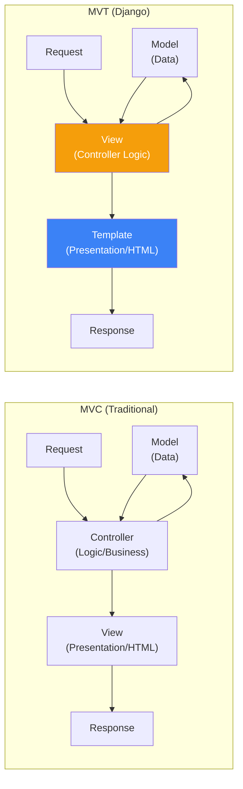
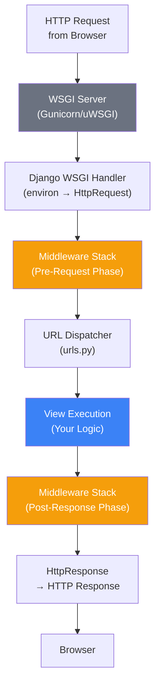
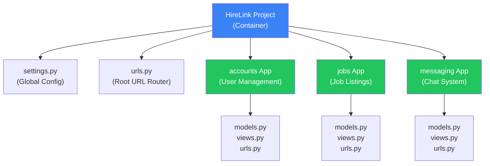
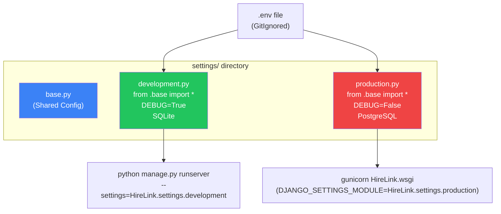
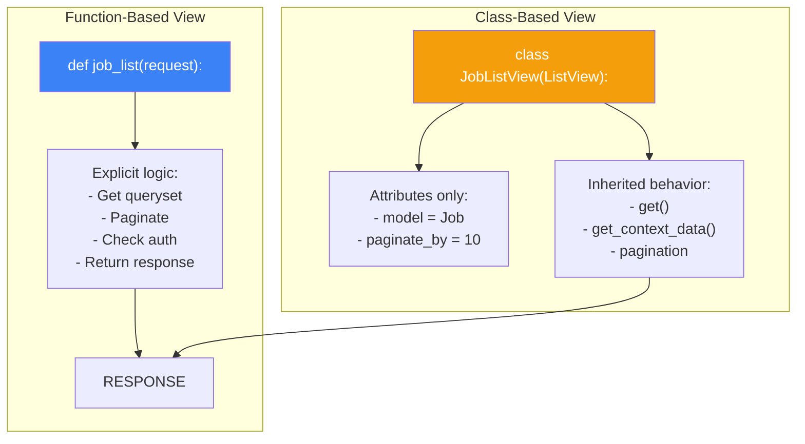

# الفصل السادس — Django MVT: الخريطة الكاملة من أول Request لآخر Response

> **المتطلبات:** [[05-Python-Advanced-Patterns]] — لازم تكون فاهم الـ Context Managers (عشان الـ database connections) والـ Decorators (عشان الـ middleware والـ views) والـ Type Hints (عشان الـ code quality). الفصل ده هيبني فوق كل ده عشان يوريك إزاي Django بيُدير دورة حياة الـ request من أول ما بيوصل للسيرفر لحد ما بيرجع response للمستخدم.

---

## البداية — السؤال اللي محدش بيسأله في الكورسات

كل كورس Django بيبدأ بإنك تكتب `django-admin startproject mysite` وتكتب أول `HttpResponse` في `views.py`. بس محدش بيقولك: **إيه اللي بيحصل بين اللحظة اللي المستخدم يضغط Enter في المتصفح، واللحظة اللي الصفحة بتظهر عنده؟**

تخيّل إنك فتحت `hirelink.com/jobs/backend/`. إيه الرحلة اللي بتمر بيها الـ request دي؟

1. المتصفح بيعمل HTTP Request للسيرفر.
2. الـ WSGI Server (زي Gunicorn) بيستقبل الـ request.
3. Django بتحول الـ HTTP request لـ `HttpRequest` object.
4. الـ URL dispatcher بيشوف `/jobs/backend/` ويروح لـ `urls.py`.
5. الـ URL pattern بيطابق الـ path ويروح لـ view معينة.
6. الـ view بتروح للـ model تجيب بيانات من الـ database.
7. الـ view تبعت البيانات دي للـ template.
8. الـ template يتعمل render لـ HTML.
9. Django تحول الـ `HttpResponse` لـ HTTP response حقيقي.
10. الـ WSGI server يبعت الـ response للمتصفح.

وده اللي هنفهمه بالتفصيل الممل. مش بس "إزاي تكتب view" — ده إزاي Django نفسها شغالة.

---

## [[01-MVT-vs-MVC]] — MVT مش مجرد MVC بمسميات تانية

### 🧠 الشرح النظري

كتير من الـ developers بيقولوا "Django بتستخدم MVC (Model-View-Controller) بس بمسميات مختلفة." ده مش دقيق. Django عندها **MVT (Model-View-Template)** وده اختلاف فلسفي حقيقي.

في الـ MVC التقليدي (زي Ruby on Rails أو Laravel):
- **Model:** البيانات والـ business logic.
- **View:** اللي بيظهر للمستخدم (HTML/CSS).
- **Controller:** هو الوسيط — بياخد الـ request من الـ View، يتعامل مع الـ Model، ويرجع Response مناسب.

في Django's MVT:
- **Model:** زي ما هو — البيانات والـ business logic (نفس الحاجة).
- **View:** ده مختلف تماماً! الـ View في Django هي الـ **Controller** بتاعة MVC. هي اللي بتاخد الـ request، تتعامل مع الـ Model، وتقرر إيه الـ response المناسب.
- **Template:** ده الـ View بتاع MVC. هو المسؤول عن الـ presentation layer (HTML/CSS).

طب ليه Django عملت كده؟ السبب إن Django مصممة عشان الـ "View" (المنطق) و "Template" (الشكل) يكونوا منفصلين تماماً. الـ View بتجهز الـ data (context) وتبعت للـ Template. الـ Template مش بيعرف يعمل حاجة غير إنه يعرض البيانات — مفيش منطق معقد فيه.

تخيّل مطعم:
- **Model:** الشيف في المطبخ — بيتعامل مع المكونات (البيانات).
- **View (Django):** الجرسون — بياخد الطلب من الزبون، يروح للشيف، يرجع بالأكل.
- **Template:** الصحن والتقديم — الأكل بيوصل في طبق جميل.

الجرسون (View) هو الـ Controller الحقيقي. هو اللي بيدير العملية كلها. Django اختارت تسميه "View" عشان هو اللي "بيشوف" الـ request ويقرر الـ response.

### 📊 Visualization



### 💻 Micro-Example

```python
# Django View = Controller in MVC
def job_list(request):                      # Django "View"
    jobs = Job.objects.all()                # Talks to Model
    return render(request, 'jobs.html',     # Delegates to Template
                  {'jobs': jobs})           # with prepared context

# Template = View in MVC
# jobs.html:
# 
#   <h2>{{ job.title }}</h2>               # ONLY presentation logic
# 
```

---

## [[02-Request-Response-Lifecycle]] — الرحلة الكاملة: من HTTP لـ HTTP

### 🧠 الشرح النظري

دورة حياة الـ request في Django هي سيمفونية متكاملة من الخطوات المتناغمة. كل خطوة ليها دور محدد وترتيب ثابت. فهمها هو الفرق بين الـ developer اللي بيصلح bugs بالتجربة والخطأ، واللي بيشخص المشكلة من أول نظرة.

**الخطوة 1: الـ WSGI Server (زي Gunicorn أو uWSGI)**
لما الـ HTTP request توصل للسيرفر، الـ web server (زي Nginx) بيبعت الـ request لـ WSGI server. الـ WSGI (Web Server Gateway Interface) هو معيار Python بيحدد إزاي الـ web server يتواصل مع الـ Python application. Gunicorn بياخد الـ HTTP request ويحولها لـ Python dictionary اسمها `environ`.

**الخطوة 2: Django's WSGI Handler**
Django عندها `WSGIHandler` class بياخد الـ `environ` dictionary ويحولها لـ `HttpRequest` object. ده object بيمثل الـ request في عالم Django — فيه `request.method`، `request.GET`، `request.POST`، `request.user` (في الآخر)، وكل حاجة محتاجها.

**الخطوة 3: Middleware Stack (Pre-Request)**
قبل ما الـ request توصل للـ view، بتمر عبر سلسلة من الـ Middleware classes. كل middleware بياخد الـ request ويعمل عليه حاجة (زي إضافة `request.user`، فحص CSRF token، تسجيل log) وبعدين يبعت للي بعده. الترتيب مهم جداً وهنشوفه في الفصل الجاي بالتفصيل.

**الخطوة 4: URL Routing (URL Dispatcher)**
بعد ما الـ request يخلص من الـ middleware، Django بتبص على `request.path` (زي `/jobs/backend/`) وتبدأ تدور في `ROOT_URLCONF` (غالباً `urls.py`). بتمر على كل pattern من فوق لتحت، وأول pattern يطابق الـ path هو اللي بيتنفذ. الـ pattern ده بيحدد إيه الـ view function أو class اللي هتتنادى.

**الخطوة 5: View Execution**
الـ view (سواء FBV أو CBV) بتتنادى والـ `request` object بيتمرر ليها كـ argument. هنا بيحصل المنطق بتاعك: قراءة بيانات من الـ database، تحديث records، تجهيز context للـ template. الـ view بترجع `HttpResponse` object (أو واحدة من الـ subclasses زي `JsonResponse` أو `HttpResponseRedirect`).

**الخطوة 6: Middleware Stack (Post-Response)**
الـ response اللي رجعت من الـ view بتمر عبر **نفس** الـ middleware stack، بس بالعكس (من تحت لفوق). كل middleware عنده فرصة يعدل على الـ response قبل ما يتبعت للمستخدم.

**الخطوة 7: WSGI Handler (Output)**
الـ `HttpResponse` object بيتحوّل لـ HTTP response حقيقي (string + headers) وبيتبعت لـ WSGI server اللي بدوره يبعتها للمتصفح.

### 📊 Visualization



### 💻 Micro-Example

```python
# urls.py
from django.urls import path
from . import views

urlpatterns = [
    path('jobs/<slug:slug>/', views.job_detail, name='job_detail'),
]

# views.py
from django.shortcuts import render, get_object_or_404
from django.http import HttpResponse

def job_detail(request, slug):                     # view receives HttpRequest
    job = get_object_or_404(Job, slug=slug)        # ORM query
    return render(request, 'job_detail.html',       # returns HttpResponse
                  {'job': job})
```

---

## [[03-Project-vs-App-Structure]] — الفرق بين Project و App: ليه Django بتفرق بينهم؟

### 🧠 الشرح النظري

أكبر غلط بيعمله المبتدئين في Django إنهم بيخلطوا بين **Project** و **App**. Django صممت النظام ده عشان يفرض **Separation of Concerns** و **Reusability**.

**الـ Project:**
ده الـ "حاوية" الكبيرة اللي بتحتوي على كل حاجة. هو الـ settings بتاعة الـ site كله، الـ root URL configuration، والـ WSGI/ASGI entry points. الـ Project عبارة عن مجموعة من الـ Apps بتشتغل مع بعض عشان تكون website كامل.

**الـ App:**
ده وحدة وظيفية قائمة بذاتها. بتعمل حاجة واحدة وبس. في HireLink، هيكون عندك App للمستخدمين (`accounts`)، App للوظائف (`jobs`)، App للمراسلات (`messaging`)، App للإشعارات (`notifications`). كل App ليه `models.py`، `views.py`، `urls.py` خاصة بيه.

ليه التقسيم ده مهم؟
1. **Reusability:** تقدر تاخد App كامل (زي نظام المراسلات) وتحطه في مشروع تاني من غير ما تلمس كود المشروع التاني.
2. **Maintainability:** لما تحب تعدل في نظام الوظائف، هتروح لـ `jobs` app. مش هتتوه في ملفات المشروع كله.
3. **Team Collaboration:** كل developer في الفريق يمسك App كامل. مفيش conflicts على نفس الملفات.

تخيّل شركة كبيرة:
- **الـ Project:** هو المبنى كله — فيه كهرباء، مياه، إنترنت (settings).
- **الـ App:** هو قسم داخل المبنى — قسم الـ HR (accounts)، قسم المشاريع (jobs)، قسم المالية (payments). كل قسم ليه موظفينه وملفاته وسياساته الخاصة بيه. لو قفلت قسم الـ HR، باقي الأقسام شغالة عادي.

### 📊 Visualization



### 💻 Micro-Example

```python
# Project structure — HireLink/
# manage.py
# HireLink/               # Project package
#   __init__.py
#   settings.py           # Global settings
#   urls.py               # Root URL conf
#   wsgi.py
# accounts/               # App 1
#   models.py
#   views.py
#   urls.py
# jobs/                   # App 2
#   models.py
#   views.py
#   urls.py
```

---

## [[04-Settings-Best-Practices]] — `settings.py`: من فوضى المبتدئين لاحترافية الـ Production

### 🧠 الشرح النظري

ملف `settings.py` الافتراضي اللي Django بتولده هو "مصيدة المبتدئين". بيحط كل حاجة في ملف واحد، وده كارثة في الـ production. إزاي تدي الـ database password لـ production من غير ما تحطه في الكود؟ إزاي تخلي `DEBUG=True` في development و `False` في production تلقائياً؟

الحل الاحترافي هو **تقسيم الـ settings لـ multiple files** واستخدام **Environment Variables**.

**1. تقسيم الـ Settings:**
بدل ملف واحد `settings.py`، بنعمل folder اسمه `settings/` جواه:
- `base.py`: كل الإعدادات المشتركة بين كل البيئات (INSTALLED_APPS، MIDDLEWARE، TEMPLATES).
- `development.py`: بيرث من `base.py` ويضيف `DEBUG=True`، `EMAIL_BACKEND='django.core.mail.backends.console.EmailBackend'`، database SQLite.
- `production.py`: بيرث من `base.py` ويضيف `DEBUG=False`، database PostgreSQL configuration من environment variables، security settings (SECURE_SSL_REDIRECT، CSRF_COOKIE_SECURE).

**2. Environment Variables:**
مستحيل تحط `SECRET_KEY` أو `DATABASE_PASSWORD` جوا الكود. دول بيبقوا في `.env` file (اللي مش بيتحط في git) وبيتقرأوا في الـ settings باستخدام مكتبة زي `python-decouple` أو `django-environ`.

تخيّل الموضوع زي "مفاتيح الشقة". مفتاح الشقة بتاعة development غير مفتاح production. إنت مش هتحط المفتاح مكتوب على الباب — المفتاح في جيبك (`.env`). ولما تروح لـ production، بتاخد مفتاح تاني في جيب تاني. الـ `base.py` هو "شكل الباب" اللي ثابت في كل الشقق. الـ `development.py` والـ `production.py` هما "مكان المفتاح وإزاي تفتح".

### 📊 Visualization



### 💻 Micro-Example

```python
# settings/base.py
from pathlib import Path
BASE_DIR = Path(__file__).resolve().parent.parent.parent

INSTALLED_APPS = [
    'django.contrib.admin',
    'django.contrib.auth',
    # ...
    'accounts',
    'jobs',
]

# settings/development.py
from .base import *

DEBUG = True
DATABASES = {
    'default': {
        'ENGINE': 'django.db.backends.sqlite3',
        'NAME': BASE_DIR / 'db.sqlite3',
    }
}

# settings/production.py
from .base import *
from decouple import config

DEBUG = False
DATABASES = {
    'default': {
        'ENGINE': 'django.db.backends.postgresql',
        'NAME': config('DB_NAME'),
        'USER': config('DB_USER'),
        'PASSWORD': config('DB_PASSWORD'),
        'HOST': config('DB_HOST'),
    }
}
```

---

## [[05-CBVs-vs-FBVs]] — Class-Based Views vs Function-Based Views: معركة العمالقة

### 🧠 الشرح النظري

في Django، عندك طريقتين لكتابة الـ Views: Functions (FBVs) أو Classes (CBVs). الاتنين بيوصلوا لنفس النتيجة، لكن لكل واحد مميزاته وعيوبه.

**Function-Based Views (FBVs):**
ده الأسلوب الأبسط والأوضح. انت بتكتب function عادية بتاخد `request` وترجع `response`. كل حاجة واضحة وصريحة. مفيش "سحر" أو inheritance معقد. ده الأسلوب المثالي للـ views البسيطة اللي مش محتاجة إعادة استخدام كتير للكود.

المشكلة: لما تحتاج تعمل نفس الـ pattern في كل view (زي pagination، authentication check، form handling)، هتلاقي نفسك بتكرر كود كتير. وهنا تيجي CBVs.

**Class-Based Views (CBVs):**
Django بتقدم generic classes للـ common patterns:
- `ListView`: لعرض list من الـ objects.
- `DetailView`: لعرض object واحد.
- `CreateView`: لإنشاء object جديد.
- `UpdateView`: لتعديل object موجود.
- `DeleteView`: لحذف object.

كل واحدة فيهم بتتعامل مع الـ boilerplate code نيابة عنك. بدل ما تكتب 20 سطر form validation، `CreateView` بتعمله في 3 سطور.

لكن العيب: الـ CBVs ممكن تبقى "سحرية" زيادة. مش واضح دايماً إيه اللي بيحصل ومتى. الـ flow بيكون مخفي جوا الـ inheritance hierarchy. الـ developer الجديد على المشروع ممكن يتوه.

القاعدة العملية (من الـ Django docs نفسها): ابدأ بـ FBVs. لو لقيت نفسك بتكرر كود، أو لو الـ view بتاعتك بتعمل واحدة من الـ CRUD operations الأساسية، **ساعتها** حول لـ CBV.

تخيّل FBV زي إنك تبني بيت من الصفر — تقدر تتحكم في كل حاجة لكن بتاخد وقت. CBV زي إنك تشتري بيت جاهز وتعدل عليه — أسرع بكتير لكن ممكن متعرفش إزاي المواسير ماشية جوا الحيطان.

### 📊 Visualization



### 💻 Micro-Example

```python
# Function-Based View (FBV) — Explicit
def job_list_fbv(request):
    jobs = Job.objects.filter(is_active=True)
    paginator = Paginator(jobs, 10)
    page = request.GET.get('page')
    jobs_page = paginator.get_page(page)
    return render(request, 'jobs/list.html', {'jobs': jobs_page})

# Class-Based View (CBV) — Implicit but concise
from django.views.generic import ListView

class JobListView(ListView):
    model = Job
    template_name = 'jobs/list.html'
    context_object_name = 'jobs'
    paginate_by = 10
    
    def get_queryset(self):
        return Job.objects.filter(is_active=True)  # override default queryset
```

---

## 🎯 أسئلة الإنترفيو

**س: إيه الفرق الحقيقي بين MVT في Django و MVC في الأطر التانية؟**
> الفرق مش مجرد مسميات — هو اختلاف في **المسؤوليات**.<br/><br/>
> في **MVC التقليدي** (زي Laravel): الـ Controller هو الوسيط اللي بياخد الـ request، يتعامل مع الـ Model، ويبعت البيانات للـ View (الـ HTML template). الـ View هنا هو الـ presentation layer بس.<br/><br/>
> في **MVT بتاعة Django**: الـ View هو الـ Controller الحقيقي. هو اللي بياخد الـ request، يتعامل مع الـ Model، ويجهز الـ context للـ Template. الـ Template هو الـ View بتاع MVC — مسؤول عن العرض فقط. الـ Model زي ما هو في الاتنين.<br/><br/>
> النتيجة العملية: في Django، الـ Template مش بيعرف يتعامل مع الـ Model مباشرةً (زي ما بيعمل Blade في Laravel). الـ View لازم تجهز كل البيانات الأول. ده بيفرض فصل أقوى بين المنطق والعرض.

---

**س: اشرحلي رحلة الـ Request في Django من لحظة ما المستخدم يضغط Enter لحد ما الصفحة تظهر.**<br/>
> الرحلة بتمر بـ 7 مراحل رئيسية:<br/><br/>
> **1. WSGI Server (Gunicorn):** بيستقبل الـ HTTP request ويحولها لـ Python `environ` dictionary.<br/><br/>
> **2. Django WSGI Handler:** بياخد `environ` ويعمل `HttpRequest` object.<br/><br/>
> **3. Middleware Stack (Pre-Request):** الـ request بتمر على كل middleware بالترتيب. كل واحد بيقدر يعدل الـ request أو يمنعها من التكملة (زي `LoginRequiredMiddleware`).<br/><br/>
> **4. URL Dispatcher:** Django بتبص في `urls.py` وتدور على pattern يطابق `request.path`. أول match بينادى الـ view المرتبطة بيه.<br/><br/>
> **5. View Execution:** الـ view (FBV أو CBV) بتتنفذ. بتتعامل مع الـ ORM عشان تجيب أو تعدل بيانات، وتجهز context، وترجع `HttpResponse`.<br/><br/>
> **6. Middleware Stack (Post-Response):** الـ response بتمر على **نفس** الـ middleware stack لكن بالعكس (من تحت لفوق). كل middleware بيقدر يعدل الـ response.<br/><br/>
> **7. WSGI Handler (Output):** الـ `HttpResponse` بيتحوّل لـ HTTP response فعلي (string + headers) ويتبعت للمستخدم.

---

**س: إيه الفرق بين Django Project و Django App؟ وليه Django مصمماهم منفصلين؟**<br/>
> الـ **Project** هو الحاوية الكلية — بيحتوي على الـ global settings، الـ root URL configuration، والـ WSGI entry points. الـ **App** هو وحدة وظيفية مستقلة بتعمل حاجة محددة (زي إدارة المستخدمين، عرض الوظائف، نظام المراسلات).<br/><br/>
> الهدف من الفصل ده هو **Reusability** و **Separation of Concerns**:<br/><br/>
> - **Reusability:** تقدر تاخد App كامل (زي نظام المراسلات) وتستخدمه في مشروع تاني من غير ما تلمس كود المشروع التاني.<br/><br/>
> - **Maintainability:** لما تحب تعدل في نظام الوظائف، كل الكود المتعلق بيه في `jobs/` app. مش هتتوه في ملفات المشروع.<br/><br/>
> - **Team Scaling:** فريق يقدر يشتغل على App مستقل من غير ما يتعارض مع فريق تاني بيشتغل على App تاني.<br/><br/>
> القاعدة: الـ Project بيتكون من Apps كتير. لو جزء من الموقع ممكن يعيش لوحده (زي مدونة، منتدى، سلة مشتريات) — يبقى App منفصل.

---

**س: إزاي تدير الـ Settings في Django بشكل احترافي لـ Development و Production؟**<br/>
> الحل الاحترافي هو **تقسيم الـ settings لـ modules منفصلة** + **استخدام Environment Variables**:<br/><br/>
> **1. تقسيم الملفات:** بنعمل folder `settings/` جواه `base.py` (الإعدادات المشتركة)، `development.py` (بيرث من base ويضيف `DEBUG=True` و SQLite)، `production.py` (بيرث من base ويضيف `DEBUG=False` و PostgreSQL config).<br/><br/>
> **2. Environment Variables:** باستخدام مكتبة زي `python-decouple`، بنقرا القيم الحساسة (`SECRET_KEY`، `DB_PASSWORD`، `EMAIL_HOST_PASSWORD`) من ملف `.env` (اللي مش بيتحط في Git).<br/><br/>
> **3. اختيار الـ settings module:** في development: `python manage.py runserver --settings=HireLink.settings.development`. في production: بنحط `DJANGO_SETTINGS_MODULE=HireLink.settings.production` كـ environment variable في الـ server.<br/><br/>
> ده بيضمن إن مفيش بيانات حساسة في الكود، وإن كل بيئة شغالة بإعداداتها المناسبة من غير تدخل يدوي.

---

**س: امتى تستخدم Function-Based Views وامتى تستخدم Class-Based Views في Django؟**<br/>
> القاعدة الذهبية من الـ Django documentation نفسها: **ابدأ بـ FBVs، وحوّل لـ CBVs لما تحتاج إعادة استخدام أو الـ view بتعمل CRUD واضح.**<br/><br/>
> **استخدم FBVs لما:**<br/>
> - الـ view بسيطة ومنطقها unique (مش pattern متكرر).<br/>
> - عايز تحكم كامل ووضوح في الـ flow (الـ explicit code).<br/>
> - الـ view مش بتتعامل مع model واحد بشكل أساسي (زي dashboard يجمع بيانات من كذا model).<br/><br/>
> **استخدم CBVs لما:**<br/>
> - الـ view بتعمل واحدة من عمليات CRUD الأساسية (list, detail, create, update, delete) لـ model معين.<br/>
> - بتلاقي نفسك بتكرر نفس الـ pattern في كذا view (زي pagination، form handling).<br/>
> - عايز تستفيد من الـ Mixins عشان تركب behavior معقد بسرعة.<br/><br/>
> **تحذير:** CBVs ممكن تبقى "سحرية" للمبتدئين. لازم تفهم الـ inheritance hierarchy (MRO) عشان تعرف إيه اللي بيحصل ومتى. لو مش فاهم إزاي `ListView` شغالة من جوا، اكتبها كـ FBV الأول عشان تفهمها.

---

## 📝 خلاصة الدرس

- **MVT مش MVC:** الـ View في Django هو الـ Controller الحقيقي — بياخد الـ request ويتعامل مع الـ Model ويبعت للـ Template. الـ Template هو الـ View بتاع MVC (عرض فقط).
- **رحلة الـ Request:** WSGI → Django WSGI Handler → Middleware (Pre) → URL Router → View → Middleware (Post) → HTTP Response.
- **Project vs App:** الـ Project هو الحاوية (settings، root URLs). الـ App هو وحدة وظيفية مستقلة (models، views، urls خاصة بيها). الفصل ده للـ Reusability و Maintainability.
- **Settings احترافية:** قسم الـ settings لـ `base.py`، `development.py`، `production.py`. استخدم Environment Variables (`.env`) للبيانات الحساسة.
- **FBV vs CBV:** FBV أوضح وأبسط للـ logic الفريد. CBV أقصر وأسرع للـ CRUD patterns. افهم الـ MRO بتاع الـ CBV قبل ما تستخدمها.

---

*Next → [[07-Django-ORM-Under-The-Hood]] — عرفنا إزاي Django بتدير الـ requests. دلوقتي هنتعمق في قلب Django: الـ ORM. إزاي `Job.objects.filter(budget__gt=5000)` بيتحول لـ SQL؟ إيه الـ QuerySet Laziness؟ وإزاي تحل مشكلة الـ N+1 Query اللي بتقتل الـ performance في production؟*