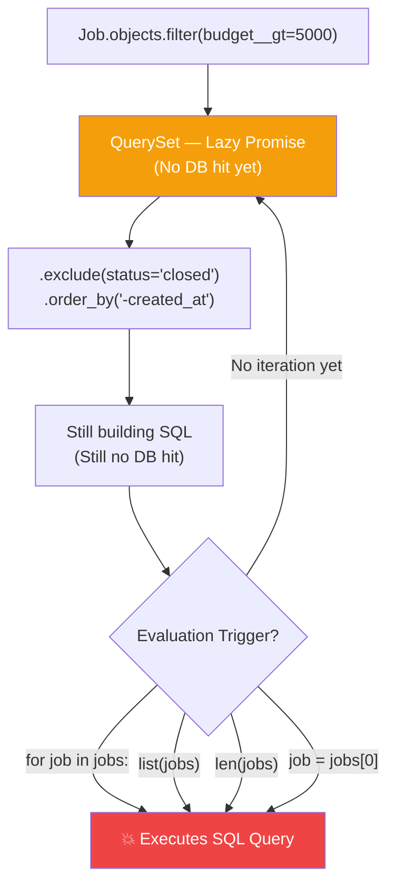
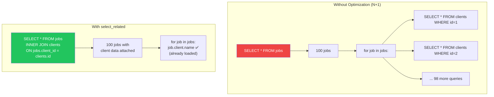
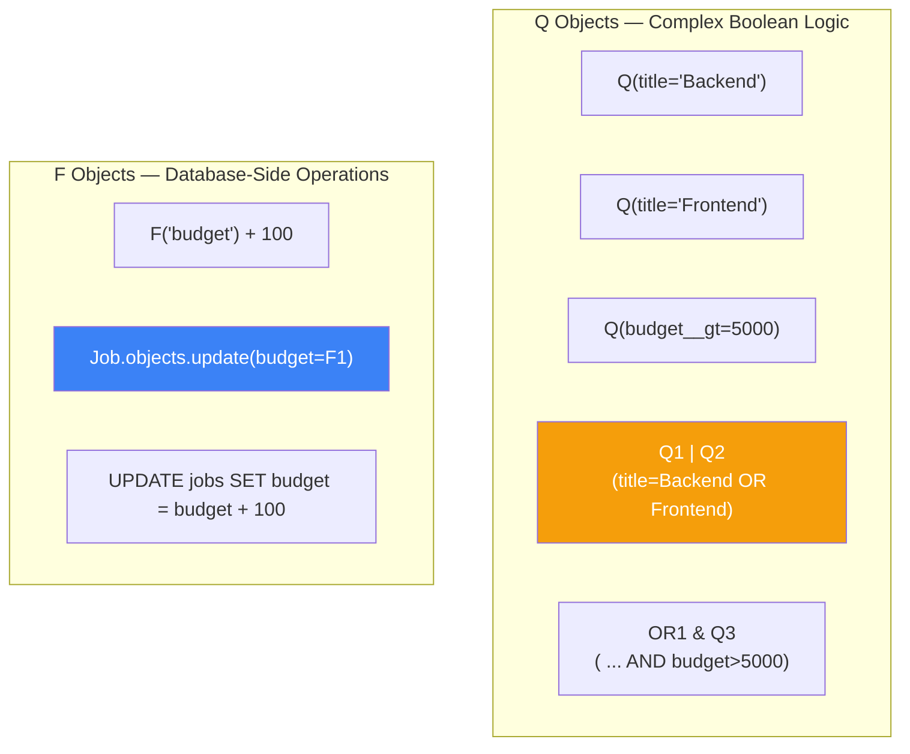
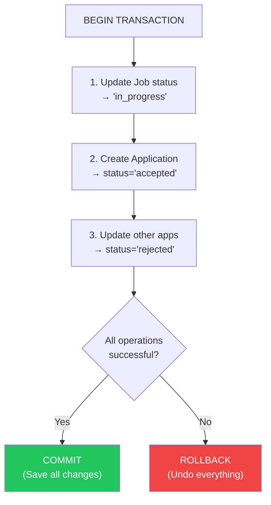
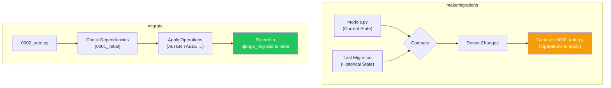
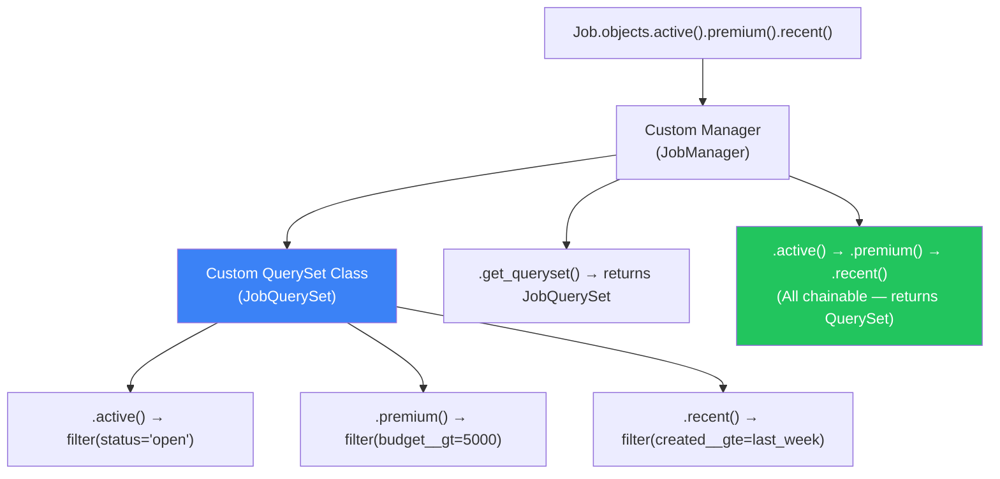

# الفصل السابع — Django ORM تحت المجهر: من Python لـ SQL والعكس

> **المتطلبات:** [[06-Django-MVT-Architecture]] — لازم تكون فاهم إزاي Django بتدير الـ Request/Response lifecycle، وفاهم مكان الـ Model في معادلة الـ MVT. الفصل ده هياخدك جوا أعماق الـ ORM عشان تفهم إزاي الـ Python code بتاعك بيتحوّل لـ SQL queries محترفة — وإزاي تمنع الكوارث قبل ما تحصل في production.

---

## البداية — السطر اللي بيكلف آلاف الدولارات

تخيّل معايا إنك كاتب الكود ده في `views.py` بتاعة HireLink:

```python
def dashboard(request):
    jobs = Job.objects.all()
    for job in jobs:
        print(job.client.name)  # ١٠٠٠ مرة
    return render(request, 'dashboard.html', {'jobs': jobs})
```

شكله innocuous جداً. بس لو عندك ١٠٠٠ job في الـ database، الكود ده هيعمل **١٠٠١ query** للـ database. كل `job.client` هتروح تعمل `SELECT` جديد. ده اسمه **N+1 Query Problem** — والنتيجة إن الـ dashboard بتاعتك هتاخد ٥ ثواني بدل ٠.٢ ثانية. ولو الـ traffic زاد، الـ database هتقع.

المشكلة إن الـ ORM بتاعة Django بتخفي التعقيد ده عنك. هي بتديك `Job.objects.all()` وكانها list عادية في الـ memory. بس هي مش list. هي **QuerySet** — وده object **كسول (Lazy)** مش بينفذ الـ query غير لما تضطره. وده سيف ورا سيف.

الفصل ده مش عن "إزاي تكتب `models.py`" — ده عن "إزاي الـ ORM بتفكر، وإزاي تخليها تشتغل لصالحك مش ضدك."

---

## [[01-QuerySet-Internals]] — الـ QuerySet: مش List — ده "وعد" بالبيانات

### 🧠 الشرح النظري

لما بتكتب `Job.objects.all()`، انت مش بتحصل على list فيها كل الـ jobs. انت بتحصل على **QuerySet** — وده object بيمثل "استعلام" عن الـ database، مش "نتيجة" الاستعلام.

الـ QuerySet ده **كسول (Lazy)**. بمعنى إنه مش بينفذ الـ SQL query فعلياً غير لما **تضطر** تلمس البيانات. إيه هي الحاجات اللي بتضطر الـ QuerySet إنه ينفذ الـ query؟ أي عملية بتحتاج تعرف **القيم** مش **الوعد**:
- **Iteration:** لما تعمل `for job in jobs` — الـ loop محتاج يعرف إيه هي القيم.
- **Slicing with step:** `jobs[0:5]` ينفع lazy. لكن `jobs[5]` (single index) بيضطر التنفيذ.
- **`len(jobs)`** — محتاج يعرف العدد.
- **`list(jobs)`** — بيحول لـ list حقيقية.
- **`bool(jobs)`** — عشان يعرف لو فيه نتايج ولا لأ.

طالما انت مش بتعمل أي حاجة من دول، الـ QuerySet هيفضل "وعد". تقدر تبني عليه filters زيادة: `jobs.filter(budget__gt=5000).exclude(status='closed').order_by('-created_at')` — وكل ده مجرد "بناء" للـ SQL query من غير ما يلمس الـ database.

تخيّل إنك بتطلب أوردر من مطعم. الـ QuerySet هو الـ "أوردر" اللي لسه مكتوب على الورقة. تقدر تعدل في الأوردر (تضيف أطباق، تشيل حاجات) طول ما الورقة في إيدك. أول ما تدّي الورقة للجرسون (تنفذ الـ query)، الأوردر بيروح للمطبخ ومتقدرش تغيره. الـ database هي المطبخ، والـ SQL query هو الأوردر اللي راح.

### 📊 Visualization



### 💻 Micro-Example

```python
# Building the QuerySet — NO database hit yet
jobs_qs = Job.objects.filter(status='open')  # Just a promise
jobs_qs = jobs_qs.filter(budget__gt=5000)    # Still building
jobs_qs = jobs_qs.exclude(title__icontains='intern')  # Still no DB hit

# Evaluation — DB hit happens HERE
print(jobs_qs)                               # str() triggers evaluation
for job in jobs_qs:                          # Iteration triggers evaluation
    print(job.title)

# Pro tip: .exists() is more efficient than bool(qs)
if jobs_qs.exists():                         # SELECT 1 ... LIMIT 1
    print("We have premium jobs!")
```

---

## [[02-Select-Related-And-Prefetch-Related]] — حل مشكلة الـ N+1 Query: السلاح السري

### 🧠 الشرح النظري

الـ N+1 Query Problem هو أشهر performance killer في Django. بيحصل لما تكون عندك علاقة ForeignKey أو ManyToMany، وتعمل loop على الـ objects وتلمس الـ related objects.

**المشكلة بالتفصيل:**
```python
jobs = Job.objects.all()  # Query 1: SELECT * FROM jobs (N rows returned)
for job in jobs:
    print(job.client.name)  # Query 2, 3, 4... (N queries) — SELECT * FROM clients WHERE id = job.client_id
```
لو عندك ١٠٠ job، ده معناه ١٠١ query. كارثة.

**الحل الأول: `select_related()` — للـ ForeignKey و OneToOne**
ده بيعمل **SQL JOIN** بين الجدولين. بدل ما تجيب الـ jobs وبعدين تروح تجيب الـ client بتاع كل job، Django بتعمل `SELECT * FROM jobs INNER JOIN clients ON jobs.client_id = clients.id` — query واحدة بترجع كل حاجة. الـ related objects بتكون محملة جاهزة مع الـ main object.

القيود: `select_related()` بيشتغل **فقط** مع العلاقات اللي هي ForeignKey أو OneToOne (علاقات من واحد لواحد أو كتير لواحد). مش بيشتغل مع ManyToMany أو reverse ForeignKey (علاقات واحد لكثير).

**الحل التاني: `prefetch_related()` — للـ ManyToMany و Reverse ForeignKey**
ده بيعمل **query منفصلة** للـ related objects وبعدين بيربطهم في Python. بدل JOIN واحد ضخم، Django بتعمل: Query 1 تجيب الـ jobs. بعدين تاخد كل الـ IDs بتاعة الـ jobs، وتعمل Query 2: `SELECT * FROM skills WHERE job_id IN (1,2,3,...,100)`. بعدين في الـ Python layer، Django بتربط كل job بـ skills بتاعته.

الفرق الجوهري: `select_related` = JOIN في SQL (query واحدة). `prefetch_related` = استعلامين منفصلين + ربط في Python.

تخيّل مكتبة: `select_related` إنك تطلب كتاب، والموظف يجيبلك الكتاب **والكاتب بتاعه** في نفس اللحظة (لأنهم في نفس الرف). `prefetch_related` إنك تطلب ١٠ كتب، والموظف يروح يجيب الكتب، وبعدين يروح يجيب كل الـ **tags** اللي على الكتب دي في رحلة تانية، ويربطهم على الترابيزة.

### 📊 Visualization



### 💻 Micro-Example

```python
# ❌ N+1 Problem — 101 queries for 100 jobs
jobs = Job.objects.all()
for job in jobs:
    print(job.client.name)        # Hits DB every single iteration

# ✅ select_related for ForeignKey — 1 query total
jobs = Job.objects.select_related('client').all()
for job in jobs:
    print(job.client.name)        # Client data already loaded — no extra query

# ✅ prefetch_related for ManyToMany — 2 queries total
jobs = Job.objects.prefetch_related('skills').all()
for job in jobs:
    for skill in job.skills.all():  # Skills already prefetched in Python
        print(skill.name)
```

---

## [[03-Q-Objects-And-F-Objects]] — استعلامات معقدة بدون Raw SQL

### 🧠 الشرح النظري

الـ ORM بتاعة Django بتدعم `filter(title='Backend', budget=5000)` بسهولة. بس إيه لو عايز تعمل `filter(title='Backend' OR title='Frontend')`؟ أو `filter(budget__gt=F('min_budget'))`؟ هنا بييجي دور **Q Objects** و **F Objects**.

**Q Objects — للـ Complex Lookups (OR, NOT, AND معقد)**
الـ `Q` object بيمثل شرط استعلام. تقدر تعمل `Q(title='Backend') | Q(title='Frontend')` (OR). تقدر تعمل `~Q(status='closed')` (NOT). تقدر تدمجهم مع `&` (AND). الـ Q objects بيسمحولك تبني شجرة منطقية معقدة وتمررها لـ `filter()`.

**F Objects — للـ Operations على مستوى الـ Database**
الـ `F` object بيمثل قيمة عمود في الـ database. بدل ما تعمل `for job in jobs: job.budget += 100; job.save()` (واللي بيحتاج تجيب البيانات للـ Python وبعدين ترجع تحفظ — slow و race condition)، تقدر تعمل `Job.objects.update(budget=F('budget') + 100)` — الـ SQL اللي هيتنفذ: `UPDATE jobs SET budget = budget + 100`. العملية بتحصل كلها جوا الـ database في query واحدة، من غير race condition.

تخيّل الـ Q objects زي "بوابة منطقية" في استعلامك: "جيبلي كل الوظائف اللي (عنوانها Backend **أو** Frontend) **و** (ميزانيتها أكبر من ٥٠٠٠ **أو** حالتها عاجلة)". الـ F objects زي "آلة حاسبة" جوا الـ database: "زود ميزانية كل الوظايف بـ ١٠٠" — الـ database نفسها هي اللي هتحسب مش Python.

### 📊 Visualization



### 💻 Micro-Example

```python
from django.db.models import Q, F

# Q Objects — Complex filtering with OR and NOT
premium_or_urgent = Job.objects.filter(
    Q(budget__gt=5000) | Q(is_urgent=True)      # budget > 5000 OR urgent
).filter(
    ~Q(status='closed')                         # AND NOT closed
)

# F Objects — Update without race conditions
Job.objects.filter(status='open').update(
    views_count=F('views_count') + 1            # Increment in DB, not Python
)

# F Objects — Compare fields within same row
jobs_with_budget_above_min = Job.objects.filter(
    budget__gt=F('min_budget')                  # WHERE budget > min_budget
)
```

---

## [[04-Database-Transactions]] — Atomic Operations: إما كل حاجة أو لا حاجة

### 🧠 الشرح النظري

تخيّل معايا في HireLink: Client بيقبل Proposal من Freelancer. العملية دي محتاجة:
1. تغير حالة الـ Job من `open` لـ `in_progress`.
2. تعمل `Application` object بـ `status='accepted'`.
3. ترفض كل الـ applications التانية لنفس الـ job.
4. تبعت Notification للـ freelancer.

إيه اللي يحصل لو الخطوة ٣ فشلت (حصل exception)؟ الـ job هتبقى `in_progress`، في `Application` متقبلة، لكن باقي الـ applications لسه موجودين والـ freelancers التانيين مش عارفين إن الوظيفة اتقفلت. دي حالة **Inconsistent State** — كارثة.

الحل هو **Database Transactions**. الـ Transaction هو وحدة شغل **Atomic** — إما كل العمليات تنجح وتتحفظ مع بعض (`commit`)، أو لو حصل أي خطأ، كل العمليات تتراجع (`rollback`) وترجع الـ database للحالة اللي كانت عليها قبل الـ transaction.

Django بتدعم الـ Transactions بطريقتين:
1. **`transaction.atomic()` كـ Context Manager:**
   ```python
   with transaction.atomic():
       # كل العمليات اللي هنا في Transaction واحدة
   ```
2. **`@transaction.atomic` كـ Decorator:**
   ```python
   @transaction.atomic
   def accept_proposal(request, job_id):
       # الـ view كلها في Transaction واحدة
   ```

الجميل إن Django's default behavior إن كل `save()` هي transaction لوحدها (Auto-commit). لكن لما تحط عمليات كتير في `atomic()` block، انت بتقول لـ Django: "استنى لما أخلص كل حاجة وبعدين احفظ."

تخيّل إنك بتكتب شيك. الـ Transaction هو إنك تكتب الشيك، توقع عليه، وتسلمه. لو القلم نشف في النص، بترمي الشيك وتبدأ بواحد جديد. مستحيل تسلم شيك من غير توقيع. `atomic()` بتضمن إن الـ database مش هتشوف "الشيك المنقوص" ده أبداً.

### 📊 Visualization



### 💻 Micro-Example

```python
from django.db import transaction
from django.shortcuts import get_object_or_404

@transaction.atomic
def accept_proposal(request, job_id, application_id):
    # Everything inside this view is a single transaction
    job = get_object_or_404(Job, id=job_id, client=request.user)
    accepted_app = get_object_or_404(Application, id=application_id, job=job)
    
    job.status = 'in_progress'
    job.save()
    
    accepted_app.status = 'accepted'
    accepted_app.save()
    
    # If anything below fails, the above changes are rolled back
    job.applications.exclude(id=application_id).update(status='rejected')
    
    # If we reach here, COMMIT — all changes saved together
    return HttpResponse("Proposal accepted!")
```

---

## [[05-Migrations-Internals]] — الـ Migrations: إزاي Django بتتتبع تغييرات الـ Schema

### 🧠 الشرح النظري

لما بتعمل `python manage.py makemigrations`، Django مش بتستخدم سحر. هي بتقارن بين حالتين:
1. **الـ Models الحالية:** الـ Python classes اللي في `models.py`.
2. **الـ Migration State:** آخر حالة للـ database schema اللي Django عارفة إنها اتطبقت (مخزنة في ملفات migration و في جدول `django_migrations` في الـ database).

الـ Migration file اللي بيتولد هو مجرد **Python code** بيوصف إزاي ننتقل من الحالة القديمة للحالة الجديدة. فيه `operations` زي:
- `migrations.CreateModel(name='Job', fields=[...])`
- `migrations.AddField(model_name='job', name='budget', field=models.IntegerField())`
- `migrations.AlterField(...)`

لما بتعمل `python manage.py migrate`، Django بتقرا الـ migration files اللي لسه متطبقتش (اللي مش موجودة في `django_migrations` table)، وتنفذ الـ `operations` اللي فيها بالترتيب، وتسجل إنها اتطبقت.

**الـ Dependency Graph:**
الـ migrations مش مجرد ملفات مترتبة أبجدياً. كل migration بيعتمد على migrations تانية. Django بتبني **Graph** من الـ dependencies دي وتنفذهم بالترتيب الصح (Topological Sort). ده بيسمح إن apps مختلفة يكون عندهم migrations مستقلة، وDjango تعرف تدمجهم صح.

تخيّل الـ Migrations زي **Git Commits** للـ Database Schema. كل `makemigrations` بتعمل "commit" جديد بيوصف التغيير. `migrate` زي `git push` — بتطبق الـ commits دي على الـ database. `django_migrations` table هي الـ `git log` — سجل بكل التغييرات اللي اتعملت.

### 📊 Visualization



### 💻 Micro-Example

```python
# Generated migration file — 0002_add_budget_field.py
from django.db import migrations, models

class Migration(migrations.Migration):
    dependencies = [
        ('jobs', '0001_initial'),  # Must run 0001 first
    ]

    operations = [
        migrations.AddField(
            model_name='job',
            name='budget',
            field=models.IntegerField(default=0),
        ),
        migrations.AlterField(
            model_name='job',
            name='status',
            field=models.CharField(choices=[('open', 'Open'), ('closed', 'Closed')], max_length=10),
        ),
    ]
```

---

## [[06-Custom-Managers-And-QuerySets]] — تنظيم الـ Queries المتكررة: الـ Managers المخصصة

### 🧠 الشرح النظري

بعد فترة في أي مشروع Django، بتلاقي نفسك بتكرر نفس الـ filters في كل مكان:
```python
active_jobs = Job.objects.filter(status='open', is_public=True)
premium_jobs = Job.objects.filter(budget__gt=5000)
```

ده بيخلي الكود متكرر، ولو عايز تغير تعريف "active" (تضيف `is_approved=True` مثلاً)، هتضطر تدور على كل `filter(status='open')` في المشروع وتعدلها. كابوس.

الحل هو **Custom Model Manager**. الـ Manager هو الـ interface اللي بتستخدمه عشان تعمل queries (الـ `objects` ده Manager). تقدر تعمل Manager خاص بيك بيحتوي على methods للـ queries المتكررة:

```python
class JobManager(models.Manager):
    def active(self):
        return self.filter(status='open', is_public=True)
    
    def premium(self):
        return self.filter(budget__gt=5000)
```

وبعدين تستخدمه: `Job.objects.active().filter(category='tech')`.

**الخطوة الأكثر تقدماً: Custom QuerySet**
بدل ما ترجع QuerSet عادي من الـ Manager methods، تقدر تعمل Custom QuerySet class ليها methods خاصة بيها، وكل method ترجع QuerySet جديد (chainable). ده بيسمحلك تعمل:
`Job.objects.active().premium().created_this_week()`

تخيّل الـ Manager زي "موظف الاستعلامات" في شركة. بدل ما كل مرة تقوله "عايز الموظفين اللي في قسم المبيعات واللي مرتبهم فوق ٥٠٠٠ واللي اتعينوا الشهر ده"، انت بتديله اختصارات: "هاتلي الـ Senior Sales Team". الموظف (Manager) بيعرف إزاي يترجم الاختصار ده للـ SQL query الصح.

### 📊 Visualization



### 💻 Micro-Example

```python
from django.db import models

# Step 1: Custom QuerySet with chainable methods
class JobQuerySet(models.QuerySet):
    def active(self):
        return self.filter(status='open', is_public=True)
    
    def premium(self):
        return self.filter(budget__gt=5000)
    
    def with_client_details(self):
        return self.select_related('client')

# Step 2: Custom Manager that returns the custom QuerySet
class JobManager(models.Manager):
    def get_queryset(self):
        return JobQuerySet(self.model, using=self._db)
    
    # Delegate methods to the QuerySet for convenience
    def active(self):
        return self.get_queryset().active()
    
    def premium(self):
        return self.get_queryset().premium()

# Step 3: Attach to Model
class Job(models.Model):
    title = models.CharField(max_length=200)
    status = models.CharField(max_length=20)
    budget = models.IntegerField()
    
    objects = JobManager()  # Replace default manager

# Usage — Clean and chainable
premium_open_jobs = Job.objects.active().premium().with_client_details()
```

---

## 🎯 أسئلة الإنترفيو

**س: إيه هو الـ QuerySet في Django؟ وليه هو "Lazy"؟**<br/>
> الـ **QuerySet** هو object بيمثل استعلام (Query) عن الـ database، مش نتيجة الاستعلام. هو "Lazy" بمعنى إنه **مش بينفذ الـ SQL query فعلياً** غير لما تضطر تلمس البيانات (عن طريق iteration، slicing بـ index، `len()`، `list()`، `bool()`).<br/><br/>
> الـ **Laziness** ده ميزة قوية لأنها بتسمحلك تبني queries معقدة بشكل تدريجي من غير ما تضغط على الـ database:
> ```python
> qs = Job.objects.all()  # No DB hit
> qs = qs.filter(status='open')  # Still no DB hit
> qs = qs.exclude(budget__lt=1000)  # Still no DB hit
> jobs = list(qs)  # 💥 DB hit happens here — single optimized query
> ```
> الـ SQL النهائي هيكون: `SELECT * FROM jobs WHERE status='open' AND budget >= 1000` — استعلام واحد بدل ٣.

---

**س: اشرحلي الـ N+1 Query Problem وإزاي `select_related` و `prefetch_related` بيحلوه.**<br/>
> الـ **N+1 Query Problem** بيحصل لما تعمل query رئيسي (`SELECT * FROM jobs` — 1 query) وبعدين تعمل loop على النتايج وتلمس related objects (`job.client.name` — N queries). المجموع: N+1 query.<br/><br/>
> **`select_related()`:** بيعمل **SQL JOIN** بين الجدولين. بيجيب البيانات كلها في query واحدة. مناسب للـ **ForeignKey** و **OneToOne** (علاقات من كتير لواحد). مثال:
> ```python
> jobs = Job.objects.select_related('client').all()  # 1 query with JOIN
> ```
> **`prefetch_related()`:** بيعمل **استعلامين منفصلين** ويربطهم في Python. مناسب للـ **ManyToMany** و **Reverse ForeignKey** (علاقات واحد لكثير). مثال:
> ```python
> jobs = Job.objects.prefetch_related('skills').all()  # 2 queries: jobs + skills
> ```
> الفرق الجوهري: `select_related` = JOIN واحد (SQL-level). `prefetch_related` = استعلامين + ربط في Python (Python-level). استخدامهم مع بعض ممكن: `select_related('client').prefetch_related('skills')`.

---

**س: إيه الفرق بين `Q` objects و `F` objects في Django ORM؟ وامتى تستخدم كل واحد؟**<br/>
> **`Q` Objects:** للـ **Complex Lookups** (استعلامات معقدة بمنطق OR، NOT، AND معقد). بتبني شجرة منطقية وتمررها لـ `filter()`:
> ```python
> from django.db.models import Q
> jobs = Job.objects.filter(Q(budget__gt=5000) | Q(is_urgent=True))
> # SQL: WHERE (budget > 5000 OR is_urgent = True)
> ```
> **`F` Objects:** للـ **عمليات على مستوى الـ Database** من غير ما تسحب البيانات للـ Python. بتستخدمها عشان تقارن عمودين في نفس الصف، أو تعمل update atomic:
> ```python
> from django.db.models import F
> # Compare two fields in the same row
> jobs = Job.objects.filter(current_budget__gt=F('min_budget'))
> # Atomic update without race conditions
> Job.objects.update(views_count=F('views_count') + 1)
> # SQL: UPDATE jobs SET views_count = views_count + 1
> ```
> **الفرق الجوهري:** `Q` للـ **منطق البحث** (WHERE clause). `F` للـ **العمليات الحسابية والمقارنات** بين الأعمدة (في WHERE أو SET clause). الاتنين بيخلوا العمليات تحصل جوا الـ database مش Python — أسرع وأأمن.

---

**س: إزاي بتضمن Atomic Operations في Django؟ وايه هو `transaction.atomic()`؟**<br/>
> **Atomic Operations** معناها إن مجموعة من عمليات الـ database إما تنجح كلها مع بعض (`COMMIT`)، أو لو حصل أي خطأ، كلها تتراجع (`ROLLBACK`) — مفيش حالة نص ونص.<br/><br/>
> في Django، بنستخدم **`transaction.atomic()`** لتحقيق ده. بييجي في شكلين:<br/><br/>
> **1. Context Manager:**
> ```python
> with transaction.atomic():
>     job.status = 'closed'
>     job.save()
>     send_notification(job)  # If this fails, job.save() is rolled back
> ```
> **2. Decorator:**
> ```python
> @transaction.atomic
> def close_job(request, job_id):
>     # Entire view is atomic
> ```
> **إزاي بيشتغل؟** Django بتعمل `BEGIN TRANSACTION` في البداية. كل `save()` بتحصل جوا الـ transaction. لو خرجت من الـ block من غير Exception، Django بتعمل `COMMIT`. لو حصل Exception، Django بتعمل `ROLLBACK` وكل التغييرات بتتراجع.<br/><br/>
> **تحذير:** `atomic()` مش بيحمي من race conditions (زي إن اتنين يعدلوا نفس الـ row في نفس الوقت). ده محتاج `select_for_update()` أو optimistic locking.

---

**س: إزاي Django بتعمل Migrations؟ وايه اللي بيحصل جوا `makemigrations` و `migrate`؟**<br/>
> **`makemigrations`:** Django بتقارن بين **حالتين**: (1) الـ Models الحالية في `models.py`. (2) آخر حالة للـ Schema الـ Django عارفة إنها اتطبقت (من ملفات الـ migration الموجودة وجدول `django_migrations`). الفرق بينهم بيتحول لـ **Migration File** (ملف Python فيه `operations` زي `CreateModel`، `AddField`، `AlterField`). الملف ده بيوصف إزاي ننتقل من الحالة القديمة للجديدة.<br/><br/>
> **`migrate`:** Django بتقرا الـ migration files اللي لسه متطبقتش (اللي مش موجودة في جدول `django_migrations`). بتبني **Dependency Graph** بين الـ migrations (عشان تعرف مين يعتمد على مين). بتنفذ الـ `operations` بالترتيب الصح (Topological Sort). كل ما تنفذ migration، بتسجلها في `django_migrations` table.<br/><br/>
> **الـ Dependency Graph:** ده اللي بيسمح إن apps مختلفة يكون عندهم migrations مستقلة، وDjango تعرف تدمجهم صح. مثال: `jobs.0002` بيعتمد على `accounts.0001` — Django هتنفذ `accounts.0001` الأول حتى لو `jobs.0002` أقدم في الوقت.

---

## 📝 خلاصة الدرس

- **QuerySet Lazy:** `Job.objects.all()` مش list — ده "وعد" بالبيانات. الـ SQL query مش بينفذ غير لما تلمس البيانات فعلياً (iteration، `len()`، `list()`). ده بيسمح ببناء queries معقدة تدريجياً.
- **حل N+1 Query:** `select_related()` للـ ForeignKey (JOIN واحد في SQL). `prefetch_related()` للـ ManyToMany (استعلامين منفصلين + ربط في Python). الاتنين بيقللوا عدد الـ queries من N+1 لـ 1 أو 2.
- **Q و F Objects:** `Q` لبناء منطق بحث معقد (OR, NOT). `F` للعمليات الحسابية والمقارنات على مستوى الـ database من غير ما تسحب البيانات للـ Python (atomic, race-condition-free).
- **Transactions:** `transaction.atomic()` بيضمن إن مجموعة عمليات إما تنجح كلها أو تتراجع كلها. ضروري للحفاظ على data consistency في العمليات المعقدة.
- **Migrations:** `makemigrations` بتولد ملفات Python بوصف تغييرات الـ schema. `migrate` بتنفذهم بالترتيب الصح (باستخدام dependency graph) وتسجلهم في `django_migrations` table.
- **Custom Managers:** بتنظم الـ queries المتكررة في Methods قابلة لإعادة الاستخدام. Custom QuerySet بيخلي الـ methods chainable: `Job.objects.active().premium().recent()`.

---

*Next → [[08-Django-Middleware]] — عرفنا إزاي Django بتتعامل مع الـ Models والـ Database. دلوقتي هنتعمق في الـ Middleware: "حاجز الأمن" اللي كل Request بيعدي منه. إزاي تبني Custom Middleware؟ إزاي `AuthenticationMiddleware` بيضيف `request.user`؟ وإيه هو الـ Onion Model اللي بيخلي ترتيب الـ Middleware يفرق جداً؟*