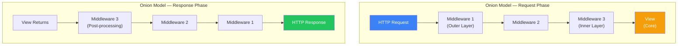
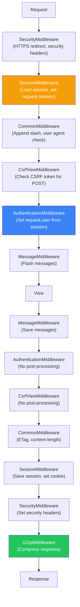
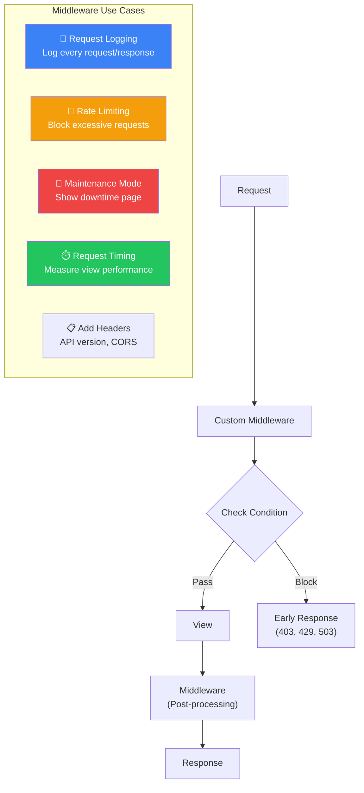
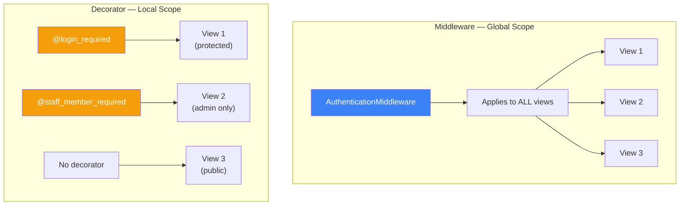

```mermaid
graph TD
    subgraph "Modern Middleware Factory"
        OUTER["def my_middleware(get_response):"] --> INNER["def middleware(request):"]
        INNER --> PRE["# Pre-processing<br/>(before view)"]
        PRE --> CALL["response = get_response(request)"]
        CALL --> POST["# Post-processing<br/>(after view)"]
        POST --> RETURN["return response"]
    end
    
    subgraph "Classic Class-Based"
        CLASS["class MyMiddleware:"] --> INIT["def __init__(self, get_response):"]
        INIT --> CALL2["def __call__(self, request):"]
        CALL2 --> SAME["Same pre/post logic"]
    end
    
    style OUTER fill:#22c55e,color:#fff
    style CLASS fill:#f59e0b,color:#fff
```

# الفصل الثامن — Django Middleware: "حاجز الأمن" اللي كل Request بيعدي منه

> **المتطلبات:** [[07-Django-ORM-Under-The-Hood]] — لازم تكون فاهم إزاي Django بتدير الـ Request/Response lifecycle، وفاهم إن الـ `HttpRequest` object هو اللي بيمر عبر النظام كله. الفصل ده هياخدك جوا الـ Middleware stack — الطبقة اللي بتتحكم في كل request قبل ما توصل للـ view وبعد ما تخرج منها.

---

## البداية — السؤال اللي بيحدد مصير كل Request

تخيّل معايا إنك عايز تضيف feature بسيطة لـ HireLink: عايز تسجل في ملف log كل request بتوصل للسيرفر — إيه الـ URL، إمتى وصلت، وإيه الـ IP بتاع المستخدم. هتعمل إيه؟

الحل الساذج: تروح لكل view في المشروع (اللي ممكن يكونوا ٥٠ view) وتضيف في أول كل واحدة:
```python
def job_list(request):
    logger.info(f"Request to /jobs/ from {request.META['REMOTE_ADDR']}")
    # ... باقي الـ view
```

ده كابوس صيانة. ولو عايز تضيف حاجة تانية (زي إنك تمنع requests من IPs معينة)، هتضطر تعدل كل الـ views تاني.

الحل الحقيقي: **Middleware**. دي طبقة بتعترض كل request قبل ما توصل للـ view، وبعد ما الـ view تخلص وترجع response. هي مكان واحد تقدر تحط فيه logic بيتطبق على **كل** requests و responses في المشروع كله.

الـ Middleware هو السر ورا إزاي Django بتضيف `request.user` (عن طريق `AuthenticationMiddleware`)، إزاي بتحمي من CSRF (عن طريق `CsrfViewMiddleware`)، وإزاي بتدير الـ sessions (عن طريق `SessionMiddleware`). فهم الـ Middleware = فهم إزاي Django نفسها شغالة.

---

## [[01-Middleware-Stack-And-Onion-Model]] — الـ Middleware Stack: نموذج البصلة (Onion Model)

### 🧠 الشرح النظري

الـ Middleware في Django مش مجرد قائمة من الـ classes بيتم تنفيذهم بالترتيب. هو **Stack** — طبقات متراكبة فوق بعض، وكل request بيخترقهم واحدة واحدة لحد ما يوصل للـ view، وبعدين الـ response بيرجع يخترقهم تاني **بالعكس**.

التشبيه الأشهر هو **نموذج البصلة (Onion Model)**. تخيّل بصلة ليها طبقات كتير:
- الـ **Request** بيدخل من الطبقة الخارجية (أول middleware في `MIDDLEWARE` list).
- بيعدي لكل الطبقات واحدة واحدة لحد ما يوصل لـ **قلب البصلة** — الـ View.
- الـ **Response** بتخرج من القلب وتبدأ تعدي في الطبقات **بالعكس** — من الداخل للخارج.

الترتيب في `MIDDLEWARE` list هو **كل حاجة**. الـ middleware الأول في القائمة هو أول واحد بيستقبل الـ request، وهو **آخر واحد** بيلمس الـ response. الـ middleware الأخير في القائمة هو أقرب واحد للـ view.

ليه ده مهم؟ تخيّل `AuthenticationMiddleware` (اللي بيضيف `request.user`) و `CsrfViewMiddleware` (اللي بيفحص الـ CSRF token). `AuthenticationMiddleware` **لازم** يكون قبل `CsrfViewMiddleware` في القائمة. ليه؟ لأن الـ CSRF check بيستخدم `request.user` — فالمستخدم لازم يكون متحمل الأول.

تخيّل إنك داخل مبنى حكومي عشان تخلص ورقة:
1. **البواب على الباب:** بيتأكد من هويتك (AuthenticationMiddleware) ويديك badge.
2. **جهاز الـ X-Ray:** بيفتش الشنطة (CsrfViewMiddleware) — محتاج يشوف الـ badge عشان يعرف إنت مين.
3. **الموظف:** (الـ View) — بيخلصلك الورقة.
4. **وأنت خارج:** بتعدي على نفس الناس بس بالعكس — جهاز X-Ray الأول، وبعدين البواب اللي بياخد الـ badge.

لو بدلت الترتيب — جهاز X-Ray قبل البواب — مش هتعرف تعدي لأن معندكش badge لسه.

### 📊 Visualization



### 💻 Micro-Example

```python
# settings.py — Order matters!
MIDDLEWARE = [
    'django.middleware.security.SecurityMiddleware',         # 1st — request
    'django.contrib.sessions.middleware.SessionMiddleware',  # 2nd
    'django.middleware.common.CommonMiddleware',             # 3rd
    'django.middleware.csrf.CsrfViewMiddleware',             # 4th
    'django.contrib.auth.middleware.AuthenticationMiddleware', # 5th
    'django.contrib.messages.middleware.MessageMiddleware',  # 6th
    # ... your custom middleware ...
    # View executes here
    # Response passes back through middleware in REVERSE order
]

# AuthenticationMiddleware MUST come before CsrfViewMiddleware
# Because CsrfViewMiddleware uses request.user (set by AuthenticationMiddleware)
```

---

## [[02-Building-Custom-Middleware]] — بناء Middleware مخصص: الطريقة القديمة والحديثة

### 🧠 الشرح النظري

Django بتدعم طريقتين لبناء Custom Middleware: الطريقة القديمة (Class-based with `__call__`) والطريقة الحديثة (Function-based with `__init__` and `__call__`). الاتنين بيحققوا نفس النتيجة، لكن الطريقة الحديثة أنظف وأسهل في الـ testing.

**الطريقة الكلاسيكية (Class-based Middleware):**
بتعمل class عادي فيه method `__call__(self, request)`. الـ `__call__` دي اللي بتتنادى على كل request. جواها، بتاخد الـ `request`، بتعمل الـ logic بتاعك، وبعدين بتنادي `self.get_response(request)` عشان تبعت الـ request للي بعده في السلسلة (أو للـ view لو هو الأخير). الـ response اللي بترجع من `get_response` بتعدي عليها (تقدر تعدلها) وبعدين ترجعها.

**الطريقة الحديثة (Factory-based Middleware):**
Django 3.1 قدمت طريقة أبسط: `def simple_middleware(get_response):`. دي function بترجع function. الـ outer function بتاخد `get_response` (اللي هو الـ next middleware في السلسلة). الـ inner function هي الـ middleware الحقيقي — بتاخد `request` وترجع `response`. ده اسلوب أقرب للـ Decorators وأسهل في الفهم.

**ليه الطريقة الحديثة أفضل؟**
1. **أوضح:** الـ flow واضح — outer function للـ setup (بيتنفذ مرة واحدة عند تحميل الـ server)، inner function لكل request.
2. **أسهل في الـ testing:** تقدر ت mock الـ `get_response` بسهولة.
3. **أقل boilerplate:** مش محتاج تعمل class كامل.

تخيّل الطريقة الكلاسيكية زي "موظف استقبال" ليه مكتب ثابت. الطريقة الحديثة زي "كشك متنقل" — بيتبنى بسرعة وبيتعامل مع اللي جاي وبعدين يمشي.

### 📊 Visualization



### 💻 Micro-Example

```python
# Modern way (Django 3.1+) — Recommended
def request_logger_middleware(get_response):
    # One-time configuration and initialization (runs once at server start)
    
    def middleware(request):
        # Code here runs for each request BEFORE the view
        print(f"Request: {request.method} {request.path}")
        
        response = get_response(request)  # Pass to next middleware/view
        
        # Code here runs for each request AFTER the view
        print(f"Response: {response.status_code}")
        
        return response
    
    return middleware

# settings.py
MIDDLEWARE = [
    # ...
    'hirelink.middleware.request_logger_middleware',  # Add your custom middleware
]
```

---

## [[03-Built-in-Middleware-Deep-Dive]] — تشريح الـ Built-in Middleware: إزاي Django بتشتغل من جوا

### 🧠 الشرح النظري

Django بتيجي مع مجموعة من الـ Middleware classes الجاهزة اللي بتعمل الشغل الأساسي لأي موقع. فهم إزاي كل واحد فيهم شغال بيديك قوة خارقة في الـ debugging والـ optimization.

**1. `SecurityMiddleware`:**
ده "حارس الأمن" بتاع Django. بيضيف headers أمان مهمة للـ HTTP responses:
- `X-Content-Type-Options: nosniff` — يمنع المتصفح من "تخمين" نوع الملف (يمنع attacks).
- `X-Frame-Options: DENY` — يمنع تحميل الموقع جوا iframe (يمنع clickjacking).
- تحويل الـ HTTP لـ HTTPS (`SECURE_SSL_REDIRECT`).
- `Strict-Transport-Security` (HSTS) — يجبر المتصفح إنه يستخدم HTTPS دايمًا.

**2. `SessionMiddleware`:**
ده المسؤول عن الـ Sessions. بيقرا الـ session ID من الـ cookies، ويحمل بيانات الـ session من الـ database/cache، ويحطها في `request.session`. بعد ما الـ view تخلص، بيحفظ أي تغييرات في الـ session ويرجع الـ cookie للمتصفح. **لازم** يكون قبل أي middleware بيستخدم الـ session (زي `AuthenticationMiddleware`).

**3. `AuthenticationMiddleware`:**
ده اللي بيضيف `request.user`. بيستخدم الـ session اللي `SessionMiddleware` حمّلتها عشان يعرف مين المستخدم المسجل دخوله. لو مفيش session، `request.user` بيبقى `AnonymousUser`. ده أشهر middleware في Django — كل `request.user` في أي view جاي من هنا.

**4. `CsrfViewMiddleware`:**
ده "البودي جارد" ضد CSRF attacks. بيتأكد إن أي POST/PUT/DELETE request جاي من نفس الموقع (عن طريق token في الـ form أو header). بيقارن الـ token اللي في الـ request مع واحد في الـ session. **لازم** `SessionMiddleware` و `AuthenticationMiddleware` يكونوا قبله.

**5. `CommonMiddleware`:**
مجموعة من الـ utilities:
- بيمنع access لـ `DISALLOWED_USER_AGENTS`.
- بيضيف `/` في آخر URL لو ناقصة (`APPEND_SLASH`).
- بيحول URLs لـ lowercase لو مكتوبة capital غلط.

**6. `GZipMiddleware`:**
بيضغط الـ responses (HTML, CSS, JS) قبل ما يتبعتوا للمتصفح — بيوفر bandwidth ويسرع الموقع. لازم يكون **آخر** middleware في الـ response phase عشان يضغط الـ response بعد ما كل الـ middlewares التانية خلصت.

تخيّل دول زي فريق أمن في مطار:
- **SecurityMiddleware:** البواب اللي بيتأكد إنك داخل البوابة الصح (HTTPS).
- **SessionMiddleware:** الموظف اللي بيديك كارت الصعود للطائرة (session cookie).
- **AuthenticationMiddleware:** اللي بيتأكد من هويتك على الكارت (user).
- **CsrfViewMiddleware:** جهاز الـ X-Ray اللي بيفتش الشنطة (form data).
- **CommonMiddleware:** الموظف اللي بيراجع إن كل حاجة مظبوطة (URLs).
- **GZipMiddleware:** اللي بيحزم الشنط في كيس بلاستيك (compression).

### 📊 Visualization



### 💻 Micro-Example

```python
# How AuthenticationMiddleware works internally (simplified)
def authentication_middleware(get_response):
    def middleware(request):
        # Pre-processing: Attach user to request
        request.user = get_user_from_session(request.session)
        if request.user is None:
            request.user = AnonymousUser()
        
        response = get_response(request)  # View executes with request.user
        
        # Post-processing: Nothing needed for auth
        return response
    return middleware

# Usage in view — user is already attached by middleware
def dashboard(request):
    if request.user.is_authenticated:  # Set by AuthenticationMiddleware
        return render(request, 'dashboard.html')
    return redirect('login')
```

---

## [[04-Middleware-Use-Cases]] — تطبيقات عملية: إمتى تبني Middleware خاص بيك؟

### 🧠 الشرح النظري

مش كل logic في Django مكانه الـ View أو الـ Model. في حاجات بتتكرر في **كل** request بغض النظر عن الـ view — وهنا بييجي دور الـ Custom Middleware.

**1. Request Logging (تسجيل كل requests):**
عايز تسجل كل request بتوصل للسيرفر — الـ URL، الـ method، الـ IP، والـ response time. بدل ما تحط logging في كل view، اعمل middleware واحد يسجل ده كله. ده بيديك visibility كاملة على الـ traffic وبيخلي الـ debugging أسهل.

**2. Rate Limiting (تحديد عدد requests):**
عايز تمنع مستخدم معين (عن طريق IP أو API key) من إنه يعمل أكتر من ١٠٠ request في الدقيقة. الـ middleware يقدر يعد الـ requests من كل IP، ولو زاد عن الحد، يرجع `HttpResponse(status=429)` (Too Many Requests) قبل ما الـ request توصل للـ view أصلاً.

**3. Maintenance Mode (وضع الصيانة):**
عايز توقف الموقع كله للصيانة من غير ما تقفل الـ server. الـ middleware يقدر يشوف flag في الـ database أو ملف setting، ولو `MAINTENANCE_MODE=True`، يرجع صفحة "الموقع في الصيانة" لكل الـ requests — ما عدا requests من admin IPs.

**4. Request Timing (قياس أداء الـ views):**
عايز تعرف إيه الـ views البطيئة في الموقع. الـ middleware يقدر يسجل وقت بداية الـ request (`time.time()`)، وبعد ما الـ view تخلص، يحسب الفرق ويسجله. لو الـ response time أكتر من ١ ثانية، يبعت alert.

**5. API Version Header (إضافة headers لكل responses):**
عايز تضيف `X-API-Version: 1.0.0` لكل response في الـ API. بدل ما تضيفه في كل view، اعمل middleware يضيف الـ header ده لكل response تلقائيًا.

تخيّل الـ Middleware زي "نظام التشغيل" بتاع الموقع. نظام التشغيل (Windows/Linux) بيدير حاجات كل البرامج محتاجاها — memory management، file system access، networking. انت مش بتروح لكل برنامج وتكتبله إزاي يتعامل مع الـ RAM. البرامج بتعتمد على نظام التشغيل في ده. نفس الفكرة: الـ views مش محتاجة تعرف إزاي تسجل log أو تفحص rate limit — الـ middleware بيعمل ده نيابة عنها.

### 📊 Visualization



### 💻 Micro-Example

```python
import time
import logging
from django.http import HttpResponse

logger = logging.getLogger(__name__)

# 1. Request Timing Middleware
def timing_middleware(get_response):
    def middleware(request):
        start_time = time.time()                # Start timer
        
        response = get_response(request)        # Process request
        
        duration = time.time() - start_time     # Calculate duration
        logger.info(f"{request.path} took {duration:.3f}s")
        
        # Add timing header to response
        response['X-Response-Time'] = f"{duration:.3f}"
        return response
    return middleware

# 2. Maintenance Mode Middleware
def maintenance_middleware(get_response):
    def middleware(request):
        # Check maintenance flag (from settings or database)
        from django.conf import settings
        if getattr(settings, 'MAINTENANCE_MODE', False):
            # Allow staff users to access site during maintenance
            if request.user.is_staff:
                return get_response(request)
            return HttpResponse("Site under maintenance", status=503)
        
        return get_response(request)
    return middleware
```

---

## [[05-Middleware-vs-Decorators]] — Middleware ولا Decorator: إمتى تستخدم إيه؟

### 🧠 الشرح النظري

الـ Middleware والـ Decorators الاتنين بيضيفوا behavior للـ views من غير ما تلمس الكود الأصلي. لكن الفرق في **النطاق (Scope)** و **التوقيت (Timing)**.

**الـ Middleware:**
- **النطاق:** **كل** requests في المشروع كله.
- **التوقيت:** بيشتغل قبل وبعد **كل** view.
- **الاستخدام:** Logic محتاج يتطبق على كل حاجة — زي authentication، logging، rate limiting، security headers.

**الـ Decorators:**
- **النطاق:** Views **محددة** انت بتختارها.
- **التوقيت:** بيشتغل قبل وبعد الـ view اللي مزخرفها بس.
- **الاستخدام:** Logic خاص بـ views معينة — زي `@login_required` (لبعض الـ views)، `@permission_required` (لـ views معينة).

**متى تستخدم Middleware ومتى Decorator؟**
- لو الـ logic مطلوب في **كل** views أو معظمهم → Middleware.
- لو الـ logic مطلوب في **عدد قليل** من الـ views → Decorator.
- لو الـ logic محتاج يشتغل **قبل** أي view (حتى قبل ما Django تختار الـ view) → Middleware (زي rate limiting — تقدر تمنع الـ request قبل ما توصل للـ URL router).

تخيّل Middleware زي "قانون المرور" — بيمشي على كل العربيات في البلد كلها. Decorator زي "بوابة جراج" — بتتحكم في عربية معينة في مكان معين. القانون مينفعش يكون Decorator (هتحطه على كل عربية)، والبوابة مينفعش تكون Middleware (هتقفل كل الشوارع).

### 📊 Visualization



### 💻 Micro-Example

```python
# Middleware — applies to EVERY request
def global_auth_check_middleware(get_response):
    def middleware(request):
        # This runs for ALL views — even static files
        if not request.user.is_authenticated and request.path.startswith('/admin/'):
            return HttpResponseForbidden("No access to admin")
        return get_response(request)
    return middleware

# Decorator — applies only to specific views
from django.contrib.auth.decorators import login_required, permission_required

@login_required                                    # Applies to this view only
def job_application(request, job_id):
    return render(request, 'apply.html')

@permission_required('jobs.can_close_job')         # Specific permission for this view
def close_job(request, job_id):
    return HttpResponse("Job closed")

def public_job_list(request):                      # No decorator — public access
    return render(request, 'jobs.html')
```

---

## 🎯 أسئلة الإنترفيو

**س: إيه هو الـ Middleware في Django؟ وإزاي بيشتغل؟**<br/>
> الـ Middleware هو نظام **Hooks** بيسمحلك تعترض وتعالج الـ `HttpRequest` objects قبل ما توصل للـ view، والـ `HttpResponse` objects قبل ما ترجع للمتصفح. هو عبارة عن **Stack** من الـ classes أو functions بيتم تنفيذهم بالترتيب في **مرحلتين**:<br/><br/>
> **1. Request Phase (Pre-processing):** كل middleware في `MIDDLEWARE` list بيتنفذ بالترتيب (من فوق لتحت). كل واحد بياخد الـ `request`، يعمل عليه شغل (زي إضافة `request.user`)، وبعدين يبعت للي بعده أو يمنع التكملة (يرجع `HttpResponse` فوراً).<br/><br/>
> **2. Response Phase (Post-processing):** بعد ما الـ view ترجع `HttpResponse`، الـ response بتمر على **نفس** الـ middlewares لكن **بالعكس** (من تحت لفوق). كل middleware بياخد الـ `response`، يعدل عليها (زي إضافة headers)، ويرجعها.<br/><br/>
> الـ Middleware بيشتغل على **كل** request في المشروع — ده بيخليه مناسب للـ global concerns زي authentication، logging، security headers.

---

**س: إيه هو الـ Onion Model في Django Middleware؟ وليه الترتيب مهم؟**<br/>
> الـ **Onion Model** هو تشبيه لطريقة عمل الـ Middleware stack. الـ Request بيدخل من الطبقة الخارجية (أول middleware في `MIDDLEWARE`) ويخترق الطبقات واحدة واحدة لحد ما يوصل للـ View (القلب). الـ Response بتخرج من القلب وتخترق الطبقات **بالعكس** (من الداخل للخارج).<br/><br/>
> **الترتيب مهم جداً** لأن كل middleware بيعتمد على اللي قبله. مثال:<br/>
> - `SessionMiddleware` **لازم** يكون قبل `AuthenticationMiddleware` — لأن الـ auth بيستخدم `request.session` اللي الـ session middleware حمّلتها.<br/>
> - `AuthenticationMiddleware` **لازم** يكون قبل `CsrfViewMiddleware` — لأن الـ CSRF check بيستخدم `request.user`.<br/>
> - `GZipMiddleware` **لازم** يكون **آخر** middleware — عشان يضغط الـ response بعد ما كل الـ middlewares التانية خلصت تعديلها.<br/><br/>
> لو الترتيب غلط، الـ site هيقع أو هيحصل أخطاء غامضة. القاعدة: **الـ middleware اللي بيضيف data للـ request لازم يكون قبل اللي بيستخدم الـ data دي.**

---

**س: إزاي تبني Custom Middleware في Django؟ وايه الفرق بين الطريقة القديمة والحديثة؟**<br/>
> في طريقتين لبناء Custom Middleware:<br/><br/>
> **1. الطريقة الكلاسيكية (Class-based):**
> ```python
> class MyMiddleware:
>     def __init__(self, get_response):
>         self.get_response = get_response
>     
>     def __call__(self, request):
>         # Pre-processing
>         response = self.get_response(request)
>         # Post-processing
>         return response
> ```
> **2. الطريقة الحديثة (Function-based — Django 3.1+):**
> ```python
> def my_middleware(get_response):
>     def middleware(request):
>         # Pre-processing
>         response = get_response(request)
>         # Post-processing
>         return response
>     return middleware
> ```
> **الفرق:** الطريقة الحديثة أوضح وأقل boilerplate. الـ outer function بتتنفذ مرة واحدة عند تحميل الـ server (لـ setup)، والـ inner function بتتنفذ لكل request. الطريقة الكلاسيكية بتحتاج class كامل. الاتنين بيشتغلوا بنفس الكفاءة — اختار اللي يريحك. Django نفسها بتميل للطريقة الحديثة في الـ documentation الجديد.

---

**س: إمتى تستخدم Middleware وإمتى تستخدم Decorator في Django؟**<br/>
> الفرق الأساسي في **النطاق (Scope)**:<br/><br/>
> **استخدم Middleware لما:**<br/>
> - الـ logic مطلوب في **كل** أو **معظم** views في المشروع (زي authentication، logging، rate limiting).<br/>
> - محتاج تمنع الـ request **قبل** ما توصل للـ URL router (زي maintenance mode أو IP blocking).<br/>
> - محتاج تضيف headers أو تعالج الـ response لكل حاجة (زي security headers أو compression).<br/><br/>
> **استخدم Decorator لما:**<br/>
> - الـ logic مطلوب لـ **عدد قليل** من الـ views المحددة (زي `@login_required` على views معينة).<br/>
> - الـ logic **مختلف** من view لـ view (زي permissions مختلفة لكل view).<br/>
> - عايز تحافظ على الـ view code explicit وواضح — الـ decorator فوق الـ view بيورك بالظبط إيه الـ behavior المضاف.<br/><br/>
> **القاعدة:** لو هتحط نفس الـ decorator على ٨٠٪ من الـ views بتوعك — حوله لـ Middleware. لو هتحطه على ١٠٪ بس — خليه Decorator.

---

**س: اشرحلي دور كل Built-in Middleware أساسي في Django.**<br/>
> **1. `SecurityMiddleware`:** بيضيف security headers (`X-Frame-Options`, `X-Content-Type-Options`) وبيدير HTTPS redirects و HSTS. بيكون أول middleware عشان يطبق الحماية من البداية.<br/><br/>
> **2. `SessionMiddleware`:** بيقرا الـ session cookie ويحمل بيانات الـ session في `request.session`. بعد الـ view، بيحفظ التغييرات ويرجع الـ cookie. **لازم** يكون قبل أي middleware بيستخدم الـ session.<br/><br/>
> **3. `AuthenticationMiddleware`:** بيستخدم الـ session عشان يحدد المستخدم ويضيف `request.user` (أو `AnonymousUser`). ده أساس أي نظام صلاحيات.<br/><br/>
> **4. `CsrfViewMiddleware`:** بيحمي من CSRF attacks — بيتأكد إن POST requests جايين من نفس الموقع (بمقارنة token في الـ form مع واحد في الـ session). بيستخدم `request.user` و `request.session`.<br/><br/>
> **5. `CommonMiddleware`:** مجموعة utilities — بيضيف `/` للـ URLs الناقصة، بيمنع access من user agents محظورة، وبيدير ETags للـ caching.<br/><br/>
> **6. `GZipMiddleware`:** بيضغط الـ response (HTML, CSS, JS) قبل ما يتبعت. **لازم** يكون آخر middleware في الـ response phase عشان يضغط بعد كل التعديلات.<br/><br/>
> **7. `MessageMiddleware`:** بيدير الـ flash messages (اللي بتظهر مرة واحدة). معتمد على الـ session.<br/><br/>
> **8. `XFrameOptionsMiddleware`:** بيمنع تحميل الموقع جوا iframe (يمنع clickjacking). غالباً بيتم التعامل معاه في `SecurityMiddleware` في الإصدارات الحديثة.

---

## 📝 خلاصة الدرس

- **Middleware Stack (Onion Model):** الـ Request بيدخل من أول middleware في `MIDDLEWARE` list، يعدي على الكل لحد الـ View (القلب)، وبعدين الـ Response بترجع تعدي على نفس الـ middlewares **بالعكس** (من تحت لفوق). الترتيب في القائمة هو كل حاجة.
- **Custom Middleware:** Django 3.1+ بتفضل الـ function-based middleware (`def my_middleware(get_response):`). أسهل وأوضح من الـ class-based القديمة.
- **Built-in Middleware Roles:** `SecurityMiddleware` (headers أمان)، `SessionMiddleware` (تحميل session)، `AuthenticationMiddleware` (إضافة `request.user`)، `CsrfViewMiddleware` (حماية CSRF)، `CommonMiddleware` (utilities)، `GZipMiddleware` (ضغط response).
- **Use Cases:** الـ Middleware مثالي للـ global concerns — logging، rate limiting، maintenance mode، timing، adding headers. أي حاجة محتاج تطبقها على **كل** requests.
- **Middleware vs Decorator:** Middleware = نطاق عام (كل views). Decorator = نطاق محدد (views معينة). لو الـ logic بيتكرر في معظم views → Middleware. لو لـ views قليلة → Decorator.
- **الترتيب مهم جداً:** `SessionMiddleware` → `AuthenticationMiddleware` → `CsrfViewMiddleware`. `GZipMiddleware` في الآخر. لو بدلت الترتيب، الـ site مش هيشتغل صح.

---

*Next → [[09-Django-Signals]] — عرفنا إزاي نعترض الـ Requests. دلوقتي هنتعمق في الـ Signals: "الـ WhatsApp Group" بتاع Django. إزاي تخلي حاجة تحصل تلقائياً لما Model يتسجل؟ إزاي تبعت Welcome Email أول ما User يتعمل؟ وإيه هي الـ Anti-Patterns اللي تخليك تتجنب Signals في بعض الحالات؟*