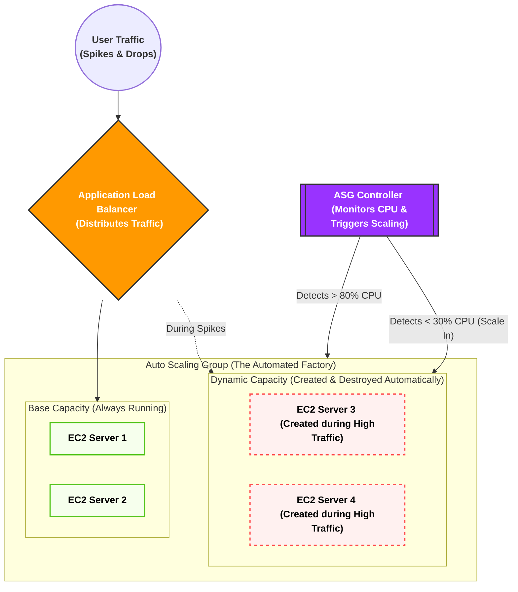
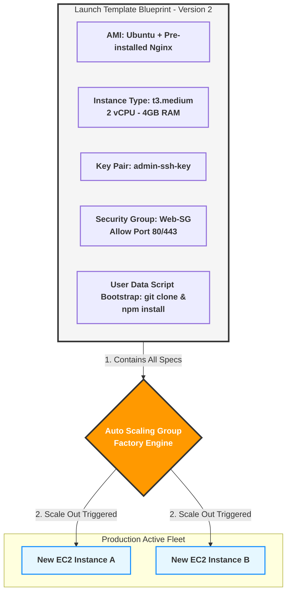
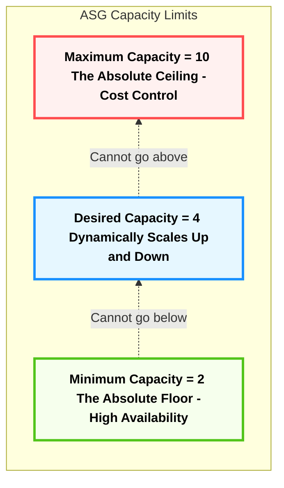
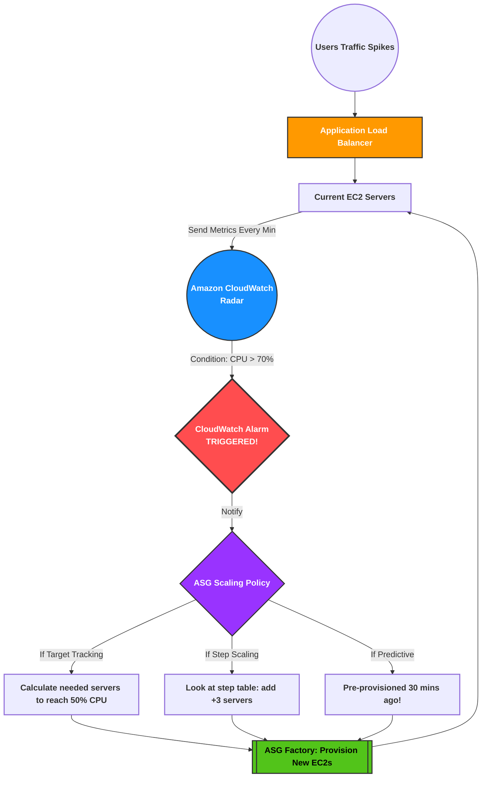
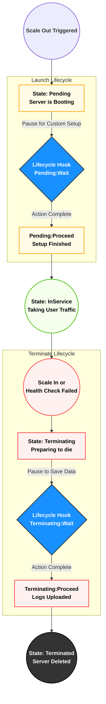

#  الـ **Auto Scaling Group (ASG)** - "العقل المدبر" 

### 1. تفكيك المصطلحات التأسيسية (مفاتيح فهم الكواليس)

قبل ما ندخل في الـ ASG، لازم نفكك 5 مصطلحات بيستخدموها الـ Cloud Architects كل يوم في شغلهم:

1. **Capacity (السعة الاستيعابية):**
    
    ده مصطلح بيعبر عن "قوة العضلات" بتاعة السيرفر بتاعك. السيرفر ده يقدر يستحمل كام ريكويست في الثانية؟ السعة دي بتتقاس بـ 3 حاجات رئيسية: استهلاك المعالج (CPU Utilization)، استهلاك الرامات (Memory)، وسرعة كارت الشبكة (Network Bandwidth).
    
2. **Provisioning (توفير أو تجهيز الموارد):**
    
    كلمة Provisioning معناها إنك تروح تطلب سيرفر جديد، تنزل عليه نظام التشغيل (زي Ubuntu)، وتسطب عليه الأبلكيشن بتاعك عشان يكون جاهز يستقبل زباين. في النظام القديم، العملية دي كانت بتاخد أيام أو أسابيع.
    
3. **Elasticity (المرونة - اللفظ الأهم في الـ Cloud):**
    
    تخيل "أستيك الفلوس" (Rubber Band). لما تشده بيمط معاك (يكبر)، ولما تسيبه بيرجع لحجمه الطبيعي (يصغر). المرونة في أمازون معناها إن البنية التحتية بتاعتك تكبر أوتوماتيك لما الضغط يزيد، وتكش وتصغر أوتوماتيك لما الضغط يقل عشان **توفر فلوسك**.
    
4. **Scale Out (التوسع للخارج):**
    
    لما الضغط يزيد، إنت بتضيف سيرفرات "جديدة" تقف جنب السيرفرات القديمة (مثلاً كان عندك سيرفرين، بقوا 5).
    
5. **Scale In (الانكماش للداخل):**
    
    لما الضغط يقل والزباين تنام، إنت بتمسح سيرفرات من اللي شغالين عشان متدفعش تكلفتهم على الفاضي (مثلاً الـ 5 سيرفرات يرجعوا يبقوا 2 بس).
    

### 2. أصل المشكلة: حدود موزع الأحمال (The Load Balancer Limits)

في الدروس اللي فاتت، فهمنا إن الـ **Load Balancer (ALB / NLB)** هو مدير المطعم اللي واقف على الباب بيوزع الزباين على الترابيزات (السيرفرات) عشان مفيش ترابيزة تقع من الضغط.

**المشكلة الهندسية المرعبة هنا:**

تخيل إنك عندك 3 سيرفرات (EC2) ورا الـ Load Balancer. السعة القصوى لكل سيرفر هي 1000 يوزر في نفس اللحظة.

فجأة، الأبلكيشن بتاعك طلع تريند، ودخل **10,000 يوزر** في نفس الثانية!

الـ Load Balancer هيعمل شغله بامتياز، هيوزع الـ 10,000 يوزر على الـ 3 سيرفرات بالتساوي... **والنتيجة؟ التلات سيرفرات هيتحرقوا ويهنجوا والموقع هيقع!**

ليه؟ لأن الـ Load Balancer وظيفته **التوزيع فقط**، مش وظيفته "يخلق" سيرفرات جديدة من العدم. هو ملوش دعوة إنت عندك كام سيرفر، هو بيوزع على اللي موجود قدامه وخلاص.

### 3. الحل: ظهور مصنع السيرفرات الذكي (Auto Scaling Group)

عشان نحل الكارثة دي، أمازون اخترعت خدمة الـ **ASG (مجموعة التوسع التلقائي)**.

الـ ASG مش مجرد أداة، ده عبارة عن **"مصنع آلي ذكي"** بيقف في ضهر الـ Load Balancer وبيعمل 3 وظايف خطيرة:

1. **المراقبة (Monitoring):** عينه دايماً على السيرفرات بتاعتك. بيراقب الـ CPU والرامات.
    
2. **التمدد والانكماش الآلي (Elastic Scaling):** أول ما الـ ASG يلمح إن السيرفرات الـ 3 بتوعك استهلاك الـ CPU بتاعهم عدى 80%، يروح فوراً ضاغط على زرار الطوارئ ويصنع (Provisions) سيرفرين كمان ويدخلهم الخدمة، فيقلل الحمل. ولما الزباين تمشي، الـ ASG يقتل السيرفرين الزيادة دول أوتوماتيك.
3. **الشفاء الذاتي (Self-Healing - Fleet Management):** دي الميزة الأهم! الـ ASG مش بس بيكبر ويصغر، ده بيعالج نفسه. لو سيرفر فجأة "هنج" أو باظ من غير ضغط، الـ ASG بيكتشف إنه مريض، فيقوم **قاتل السيرفر البايظ ده، وصانع سيرفر جديد سليم مكانه أوتوماتيك في ثواني** من غير ما إنت كمهندس تصحى من النوم تتدخل!
### 4. خريطة معمارية مبدئية لعملية الـ Scale Out & Scale In (Mermaid)
بص على الرسمة دي عشان تتخيل الـ ASG بيعمل إيه في الكواليس بناءً على الضغط:

---

جهاز الـ Auto Scaling Group (ASG) عبارة عن "مصنع آلي ذكي". لكن المصنع ده مبيفكرش؛ لو قلتله "اصنعلي سيرفر جديد فوراً"، هيقف عاجز ويسألك: _"أصنع سيرفر إيه؟ إيه نظام التشغيل اللي عليه؟ راماته كام؟ إيه الكود اللي هيشتغل جواه؟ وإيه البوديجارد (Security Group) اللي هيحميه؟"_
عشان كده، مستحيل تشغل الـ ASG من غير ما تديله **مخطط تشغيل** جاهز ومكتوب فيه كل مواصفات السيرفر من الصغير للكبير. المخطط ده في AWS اسمه **Launch Template**.
تعال نفصص مكونات ومصطلحات المخطط ده حتة حتة وبأقصى عمق هندسي:
### 1. تفكيك مصطلح الـ Launch Template والبديل القديم (Template vs Configuration)

في امتحان الـ Cloud Practitioner وفي سوق العمل، هتسمع مصطلحين دايماً:

- **Launch Configuration (القديم - الموقوف):** دي كانت الأسطمبة القديمة في أمازون. عيبها القاتل إنها **غير قابلة للتعديل**. لو عملت أسطمبة واكتشفت إنك نسيت تكتب فيها سطر كود، بتضطر تمسحها وتعمل واحدة جديدة تماماً من الصفر وتغير اسمها، وده كان بيعمل كوابيس في إدارة السيستم. (🚨 أمازون بتنصح بعدم استخدامه تماماً دلوقتي).
    
- **Launch Template (الحديث - المعتمد):** ده المخطط الذكي الحالي. الميزة القاتلة فيه هي الـ **Versioning (التطوير بالإصدارات)**. يعني تقدر تعمل مخطط وتسميه الإصدار رقم 1 (V1). بعد شهر، كود الـ Backend اتحدث، تدخل على نفس المخطط وتعدله وتسميه الإصدار رقم 2 (V2). وتقدر تخلي الـ ASG يشتغل بـ V2، ولو حصلت أي مشكلة، تقوله أوتوماتيك: "ارجع اشتغل بالإصدار القديم V1" في ثانية واحدة (Rollback).
    

### 2. المكونات الخمسة الذهب جدار الـ Launch Template

لما بتيجي تفتح كونسول أمازون وتعمل Launch Template، بتملى 5 خانات رئيسية، وكل خانة وراها مفهوم هندسي عميق:

#### أ. الـ AMI (Amazon Machine Image - صورة نظام التشغيل)

- **معناها الفني:** اختصار لـ "صورة جهاز أمازون الافتراضي". اعتبرها نسخة الويندوز أو اللينكس (الـ ISO الكبيرة) اللي عليها كل حاجة جاهزة.
- **العمق الهندسي:** الـ AMI مش مجرد نظام تشغيل أوبونتو (Ubuntu) فاضي. في الشركات الكبيرة، المهندسين بيعملوا حاجة اسمها **Golden AMI (الصورة الذهبية)**. يعني بيجيبوا سيرفر EC2 عادي، ينزلوا عليه نظام التشغيل، ويسطبوا جواه الـ Web Server (زي Nginx) ويسطبوا جواه كود الـ Backend بتاع الأبلكيشن (Node.js أو Laravel)، وياخدوا "لقطة" أو (Snapshot) من الهارد ديسك ده ويسموها AMI.
- لما الـ ASG ييجي يصنع سيرفر جديد، بياخد الـ AMI دي وينسخها على السيرفر الجديد، فالسيرفر بيتولد وهو جواه الكود والبرامج جاهزة وشغالة فوراً في ثانية واحدة من غير ما يضيع وقت في تحميل حاجة من الإنترنت.

#### ب. الـ Instance Type (نوع وحجم عضلات الخادم)

- **معناها الفني:** هنا بتحدد حجم الـ CPU (المعالج) والـ RAM (الذاكرة العشوائية) للسيرفر اللي هيتولد.
- **العمق الهندسي:** أمازون بتقسم الأجهزة لعائلات بناءً على وظيفتها، وبتتكتب برمز زي `t3.micro` أو `c5.large`. تعال نفك شفرة الاسم ده:
    
    - الحرف الأول (`t` أو `c`) ➔ ده اسم **العائلة**. عائلة `t` دي عائلة اقتصادية ومرنة (Burstable)، وعائلة `c` مخصصة للعمليات الحسابية الثقيلة (Compute Optimized).
    - الرقم الثاني (`3` أو `5`) ➔ ده **الجيل (Generation)** بتاع الأجهزة. (يعني جيل تالت أو جيل خامس، وكل ما الرقم يعلى معناه إن الهاردوير أحدث وأسرع وأرخص في التكلفة).
    - الكلمة الأخيرة (`micro` أو `large`) ➔ ده **الحجم** (عدد الكور في الـ CPU وحجم الرامات). `micro` يعني 1 كور و 1 جيجا رام، و `large` يعني أضعاف كده.
        
- في الـ Launch Template، إنت بتحدد الحجم المناسب للضغط بتاعك (مثلاً بتختار `t3.medium`).
    
#### ج. الـ Key Pair (مفتاح الدخول والتشفير)

- **معناها الفني:** ده ملف الأمان اللي بتنزله على لابتوبك الشخصي عشان تعرف تدخل بيه جوه السيرفر عن طريق الـ Terminal باستخدام بروتوكول الـ **SSH (Secure Shell)**.
    
- **العمق الهندسي:** الـ SSH هو الطريق الآمن للتحكم في السيرفرات عن بُعد بكتابة الأوامر. الـ Key Pair بيشتغل بنظام (Public/Private Key Cryptography). أمازون بتاخد الـ Public Key تزرعه جوه السيرفر وهو بيتولد، وإنت بتشيل الـ Private Key على لابتوبك. لما تيجي تدخل، السيرفر بيطابق المفتاحين مع بعض، لو مظبوطين يفتحلك الباب. إنت بتحدد المفتاح ده جوه الـ Launch Template عشان السيرفرات الجديدة تتولد وهي محمية بنفس المفتاح.
    

#### د. الـ Network Settings & Security Groups (تصاريح الحماية)

- هنا بتحدد الـ Security Group (البوديقارد) اللي اتكلمنا عليه في الدروس اللي فاتت.
    
- بتقول للـ Launch Template: _"أي سيرفر يصنعه الـ ASG بناءً على المخطط ده، لازم تركب على بابه الـ Security Group اللي اسمها (Web-SG) اللي بتسمح بس بمرور بورت 80 و 443 من الـ Load Balancer"_، عشان تضمن إن أي سيرفر جديد ينزل الشبكة يكون محمي فوراً ومفتوح عليه البورتات الصح بس.
    

#### هـ. الـ User Data (بيانات المستخدم - سكربت التشغيل الذاتي الحاسم)

- **معناها الفني:** دي أهم خانة مخفية تحت في الإعدادات المتقدمة (Advanced Details). دي عبارة عن مربع فاضي بتكتب جواه كود أو لغة أوامر (Bash Script) للينكس.
    
- **العمق الهندسي - Bootstrapping (التشغيل الذاتي):** تخيل إنك مش عايز تعمل Golden AMI، وعايز تستخدم نسخة Ubuntu عادية وفاضية خالص من أمازون، بس عايز السيرفر أول ما يتولد يقوم أوتوماتيك مسطب البرامج ومنزل كودك من GitHub ومشغل الأبلكيشن من غير ما تتدخل إنت يدوي.
    
- الكود اللي بتكتبه جوه الـ User Data ده **بيتنفذ مرة واحدة بس في العمر (عند أول قومة للسيرفر - First Boot)**. الـ ASG أول ما يقوم السيرفر، بيقرا الـ User Data وينفذ الأوامر اللي فيها سطر ورا سطر (يحدث السيرفر، ينزل Node.js، يعمل `git clone` لكود مشروعك، ويعمل `npm start`). العملية دي هندسياً اسمها **Bootstrapping**.
    

### 🏗️ مخطط العلاقات الفنية للـ Launch Template (Mermaid)

بص على اللوحة دي بتوضح إزاي الـ Launch Template بيجمع كل المكونات دي في "كتالوج واحد"، وإزاي الـ ASG بيقراه عشان يفرخ سيرفرات EC2 متطابقة:

### 📊 المقارنة الحاسمة السريعة (تثبيت الفكرة):

- **الـ AMI:** هي **الهارد ديسك المقفول** بنظام تشغيله بكوده (ملف جامد).
- **الـ User Data:** هو **أمر حركي (Script)** بيتنفذ على السيرفر الفاضي عشان يجهزه وهو بيقوم.
- **الـ Launch Template:** هو **الملف الإداري الكلي** اللي بيجمع الـ AMI والـ User Data والحجم والمفاتيح مع بعض في مكان واحد مدعوم بالإصدارات (Versions).

---

إحنا متفقين إن الـ Auto Scaling Group (ASG) هو مصنع ذكي بيصنع سيرفرات بناءً على الـ Launch Template. لكن المصنع ده مبيشتغلش بمزاجه؛ لازم المهندس (حضرتك) تحطله **"حدود آمنة" (Boundaries)** يشتغل جواها. لو سبته من غير حدود، ممكن يخلق مليون سيرفر ويفلس الشركة!

عشان كده، الـ ASG بيعتمد على 3 أرقام جوهرية بيمثلوا "دستور التشغيل". تعال نفصصهم بالعمق المعماري:

### 1. الـ Minimum Capacity (الحد الأدنى - خط الدفاع الأخير)

- **المعنى الفني:** ده أقل عدد من السيرفرات المسموح إنها تكون شغالة في أي لحظة، مهما كان الترافيك قليل أو حتى لو مفيش ولا يوزر على الموقع.
    
- **العمق الهندسي (High Availability):** ليه مش بنخلي الرقم ده (صفر) بالليل مثلاً عشان نوفر فلوس؟
    
    في أنظمة الـ Production، إحنا دايماً بنخلي الـ Minimum على الأقل **(2)**. وبنحط سيرفر في Availability Zone (A) وسيرفر تاني في Availability Zone (B).
    
    السبب: لو حطينا الحد الأدنى (1)، والداتا سنتر دي ولعت أو النور قطع فيها، الموقع هيقع لحد ما الـ ASG يكتشف ويعمل سيرفر جديد. لكن لو الحد الأدنى (2) في مكانين مختلفين، لو داتا سنتر باظت، التانية شايلة الشغل والموقع مبيقعش ولا ثانية. الـ ASG هنا وظيفته يقاتل عشان الرقم ده ماينزلش أبداً.
    

### 2. الـ Maximum Capacity (الحد الأقصى - فرامل التكلفة)

- **المعنى الفني:** ده سقف المصنع. أقصى عدد من السيرفرات الـ ASG يقدر يخلقه حتى لو الضغط وصل لملايين الريكويستات.
    
- **العمق الهندسي (Cost Control & Budgeting):** دي "الفرامل" اللي بتحمي ميزانية الشركة. تخيل إنك بتتعرض لهجوم إلكتروني (DDoS Attack) وناس بتبعت ريكويستات وهمية عشان توقع السيرفر. لو الـ Max مفتوح، الـ ASG هيفتكر إن ده ضغط حقيقي وهيفضل يخلق سيرفرات لحد ما فاتورة أمازون تجيلك بملايين الدولارات! إحنا بنحط الـ Max بناءً على حسبة هندسية دقيقة للميزانية، مثلاً (10 سيرفرات كحد أقصى)، بحيث لو وصلنا للرقم ده، الـ ASG يتوقف عن البناء مهما حصل.
    

### 3. الـ Desired Capacity (السعة المطلوبة حالياً - مؤشر التشغيل)

- **المعنى الفني:** ده العدد "الفعلي" للسيرفرات اللي شغالة **دلوقتي حالا** على أرض الواقع.
    
- **العمق الهندسي (The Moving Target):** الرقم ده عامل زي "مؤشر الحرارة" في التكييف. هو الرقم الوحيد اللي بيتحرك أوتوماتيك طالع نازل بين الـ Min والـ Max بناءً على الزحمة.
    
- **قاعدة ذهبية:** الـ Desired Capacity مستحيل ينزل تحت الـ Min، ومستحيل يطلع فوق الـ Max.
    

### 🧠 سيناريو هندسي (إزاي التلاتة بيشتغلوا مع بعض في الكواليس؟)

تخيل إننا ضبطنا الأرقام كده: `Min = 2`, `Desired = 2`, `Max = 10`.

1. **الساعة 3 الفجر (الهدوء التام):**
    
    - الزباين نايمة. استهلاك الـ CPU بتاع السيرفرين (10%).
        
    - الـ ASG عايز يقلل العدد، بس بيبص يلاقي `Min = 2` وهو عنده `Desired = 2`، فبيقول: "أنا واصل للحد الأدنى، مش هقدر أمسح حاجة".
        
2. **الساعة 12 الظهر (حملة إعلانية انفجرت):**
    
    - الضغط زاد جداً. الـ ASG قرر يزود سيرفرين كمان.
        
    - بيقوم رافع مؤشر الـ `Desired` يخليه (4). في نفس اللحظة المصنع بيشتغل ويخلق سيرفرين جداد.
        
3. **الساعة 8 بالليل (الكارثة / الذروة القصوى):**
    
    - الضغط مستمر، الـ ASG رفع الـ `Desired` لـ 6، ثم 8، ثم وصل للرقم المرعب **10**.
        
    - الزباين لسه بتدخل، والـ ASG عايز يخلي الـ `Desired` يبقى 12.. بس هنا بيصطدم بالحيطة: `Max = 10`.
        
    - الـ ASG بيوقف بناء تماماً ويقول: "أنا وصلت للسقف اللي المهندس حددهولي عشان الميزانية، مش هقدر أصنع سيرفرات تاني".
        

### 🏗️ لوحة حدود السعة المعمارية (Mermaid)

بص على الرسمة دي بتوضح إزاي الـ Desired بيتحرك بحرية في المساحة اللي بين الأرض والسقف:

---

إحنا جهزنا المصنع (Launch Template) وحطينا له سقف وأرضية (Min & Max). لكن الـ ASG في حد ذاته "أعمى"؛ مبيعرفش إذا كان السيرفر مضغوط ولا مرتاح.
عشان السيستم يشتغل أوتوماتيك، لازم نركب "عقل ورادار" يراقب، و"سياسة" (قانون) ياخد بناءً عليها قرار الزيادة أو النقصان.
تعال نفصص الرادار والـ 3 سياسات (عقول) اللي بيحركوا الـ ASG في كواليس أمازون:
### 1. الرادار السري: Amazon CloudWatch (العين الساهرة)

الـ ASG مبيراقبش السيرفرات بنفسه، بيعتمد على خدمة تانية في أمازون اسمها **CloudWatch**.
- الـ CloudWatch ده عامل زي "جهاز رسم القلب". بيفضل يقيس نبض السيرفرات كل دقيقة (بيسجل استهلاك الـ CPU، والرامات، وحجم الداتا اللي داخلة واللي طالعة).
- إحنا بنعمل جواه حاجة اسمها **Alarm (إنذار)**. بنقوله: _"يا CloudWatch، لو لقيت متوسط الـ CPU بتاع كل السيرفرات عدى 70% لمدة 3 دقايق، اضرب سرينة وبلغ الـ ASG فوراً!"_.
- الـ ASG بيسمع السرينة دي، ويفتح الدرج يشوف "السياسة" اللي المهندس كاتبها، وينفذها.

### 2. العقل الأول: Target Tracking Scaling (الطيار الآلي - الأذكى والأشهر)

دي السياسة المفضلة في 90% من المشاريع الحقيقية، لأنها بتشتغل زي **تكييف الهواء الأوتوماتيك (Thermostat)**.

- **إزاي بتفكر؟** إنت بتحدد للـ ASG "هدف" (Target) وتقوله: "أنا عايز متوسط الـ CPU بتاع كل السيرفرات يفضل دايماً عند 50%".
- **التصرف الآلي:** * لو الترافيك زاد والـ CPU وصل 80% ➔ الـ ASG هيحسب أوتوماتيك حسبة رياضية معقدة ويقول: "عشان أرجع الـ 80% دي لـ 50%، أنا محتاج أخلق 4 سيرفرات حالاً".. ويخلقهم.
    - لو الترافيك قل والـ CPU نزل لـ 20% ➔ الـ ASG هيحسب ويقول: "أنا عندي سيرفرات شغالة عالفاضي، همسح 3 منهم عشان أرجع للـ 50% وأوفر فلوس".
- **الميزة:** إنت مابتشغلش دماغك بكام سيرفر يتخلق، إنت بتحط الهدف وهو بيضبط العدد لوحده بالملي.
    

### 3. العقل الثاني: Step Scaling (سياسة السلالم التصاعدية - للطوارئ الانفجارية)

السياسة دي بنستخدمها لو الترافيك بتاعنا "مجنون" وبيعمل طفرات مفاجئة جداً (زي أوقات البلاك فرايداي). هنا إنت مابتسيبش الـ ASG يحسب لوحده، إنت بتحطله **جدول خطوات صارم**

- **إزاي بتفكر؟**
    
    - **الخطوة الأولى:** لو الـ CPU بين 70% و 80% ➔ ضيف (1) سيرفر.
        
    - **الخطوة الثانية:** لو الـ CPU بين 80% و 90% ➔ ضيف (3) سيرفرات دفعة واحدة.
        
    - **الخطوة الثالثة:** لو الـ CPU عدى 90% ➔ ضيف (5) سيرفرات فوراً (حالة طوارئ قصوى)!
        
- **الميزة:** بتديك تحكم دقيق جداً كمهندس، وبتقدر تصد الهجمات أو الزيارات المفاجئة بشكل أسرع وأعنف من الطيار الآلي.
    

### 4. العقل الثالث: Predictive Scaling (التنبؤ بالذكاء الاصطناعي - قراءة المستقبل)

ده السحر الحقيقي بتاع AWS.
تخيل إنك عندك موقع بيذيع ماتشات كورة، والضغط دايماً بيضرب في السما يوم الجمعة الساعة 8 بالليل.
- **المشكلة القديمة:** الـ ASG العادي هيستنى لما الساعة تيجي 8، والزباين تدخل، والـ CPU يعلى، وبعدين **يبدأ يصنع** سيرفرات (والتصنيع بياخد من دقيقتين لـ 5 دقايق، ففي الوقت ده ممكن الموقع يبطأ شوية).
    
- **الحل بالـ Predictive:** أمازون بتسلط موديل ذكاء اصطناعي (Machine Learning) يراقب الموقع بتاعك لمدة أسبوعين، فيتعلم النمط (Pattern) بتاع زباينك.
    
- ييجي يوم الجمعة، الموديل يقول للـ ASG: _"اسمع، أنا متنبأ إن كمان نص ساعة هيحصل انفجار زوار.. متستناش! اخلق 5 سيرفرات دلوقتي حالا وخليهم جاهزين وسخنين"_. تيجي الساعة 8، الزباين تدخل تلاقي السيرفرات مستنياهم والموقع طلقة!

### 🏗️ خريطة قرار الـ ASG (Mermaid)

بص الخريطة دي بتوضح دورة حياة القرار، من أول ما اليوزر يدخل لحد ما السيرفر يتخلق:

---

---

في الرسائل اللي فاتت، شفنا الـ ASG كأنه "مصنع" بيبني سيرفرات عشان يصد الترافيك. لكن في الحقيقة، الـ ASG ليه دور تاني أعظم بكتير: هو **"طبيب جراح سفاح"**! مبيسمحش لأي سيرفر مريض إنه يفضل في الخدمة ثانية واحدة، بيقتله فوراً ويجيب غيره. السياسة دي في هندسة السحابة بنسميها **(Cattle, not Pets)** يعني السيرفرات بالنسبة لنا قطيع مواشي، لو واحد مرض بندبحه ونجيب غيره، مش حيوان أليف هنقعد نعالجه!

عشان الـ ASG يعرف مين المريض ومين السليم، بيعتمد على نبضات الفحص (Health Checks). تعال نفصصها لآخر مستوى:

### 1. أنواع فحوصات النبض (ASG Health Checks)

الـ ASG بيقدر يسمع نبض السيرفرات عن طريق نوعين من الفحوصات، واختيارك بينهم بيحدد مدى ذكاء السيستم بتاعك:

#### أ. فحص الـ EC2 (الفحص الافتراضي - EC2 Status Checks)

- **معناه الفني:** ده الفحص البدائي اللي بييجي متفعل لوحده. الـ ASG بيكلم الهاردوير بتاع أمازون يسأله: _"هل السيرفر ده واصله كهربا وشغال؟ وهل كارت الشبكة بتاعه بيستقبل داتا؟"_
    
- **العيب القاتل (The Architectural Trap):** الفحص ده أعمى عن "الكود بتاعك". تخيل إن السيرفر شغال وزي الفل (هاردوير)، لكن كود الـ Node.js أو الـ Laravel اللي جواه ضرب Error 500 ووقع (سوفت وير). فحص الـ EC2 هيقول للـ ASG: "السيرفر ده سليم 100% الهاردوير بتاعه شغال!"، والـ ASG هيفضل سايبه في الخدمة، واليوزرز يدخلوا يلاقوا الموقع واقع!
    

#### ب. فحص الـ ELB (الفحص الذكي العميق - ELB Health Checks)

- **معناه الفني:** هنا إنت بتقول للـ ASG: _"ماتعتمدش على فحص الهاردوير، اعتمد على كلام مدير المطعم (الـ Load Balancer)"_.
    
- **إزاي بيشتغل؟** الـ Load Balancer زي ما شرحنا قبل كده بيبعت ريكويست حقيقي (HTTP Request) للصفحة الرئيسية بتاعتك كل 10 ثواني. لو كود الـ Backend ماردش بـ `HTTP 200 OK`، الـ Load Balancer هيعتبره مريض (Unhealthy).
    
- **الشفاء الذاتي (Self-Healing):** أول ما الـ Load Balancer يعلم على السيرفر بـ `Unhealthy`، بيبلغ الـ ASG فوراً. الـ ASG بدون أي رحمة بيعمل حاجتين:
    
    1. يقتل السيرفر المريض ده تماماً (Terminates the instance).
        
    2. يخلق سيرفر جديد مكانه تماماً من الـ Launch Template عشان يعوض النقص ويحافظ على الـ Desired Capacity.
        
- **قاعدة ذهبية:** لو الـ ASG بتاعك وراه Load Balancer، **لازم وحتماً** تفعل خيار `Turn on ELB Health Checks`، وإلا السيستم بتاعك هيكون فيه ثغرة غبية جداً.
    

### 2. فترة السماح (Health Check Grace Period)

- **المشكلة:** لما الـ ASG بيخلق سيرفر جديد، السيرفر ده بياخد وقت عشان يقوم (يحمل نظام التشغيل، وينزل الكود، ويسطب البرامج من الـ User Data). لو الـ ASG بدأ يعمل Health Check والسيرفر لسه بيسطب البرامج، السيرفر هيفشل في الفحص، والـ ASG هيفتكره مريض ويقتله، ويخلق غيره، ويقتله، وندخل في حلقة مفرغة (Infinite Loop).
    
- **الحل الفني:** أمازون عملت مصطلح اسمه **Grace Period (فترة السماح)**. ده تايمر (مثلاً 300 ثانية). إنت بتقول للـ ASG: _"لما تولد سيرفر جديد، غمض عينك عنه ووقف الفحص لمدة 5 دقايق لحد ما يخلص تسطيب براحته، وبعد الـ 5 دقايق ابدأ راقبه"_.
    

### 3. خطافات دورة الحياة (Lifecycle Hooks - مستوى المهندسين الخبراء)

هنا بنعلى بالـ Architecture لمستوى الـ Enterprise.

في المشاريع المعقدة، إحنا محتاجين نوقف الزمن! الـ ASG بطبيعته سريع جداً؛ بيخلق السيرفر ويرميه للزباين، أو يقتله ويمسحه في ثانية. أحياناً السرعة دي بتعملنا كوارث.

**مصطلح الـ Lifecycle Hook (خطاف دورة الحياة):** هو "زرار إيقاف مؤقت" (Pause Button). بيخليك تمسك السيرفر وتوقفه في مرحلة معينة قبل ما يدخل الخدمة أو قبل ما يموت، عشان تلحق تنفذ أوامر معينة.

وليه نوعين جوهريين:

#### أ. خطاف البداية (Pending:Wait)

- **السيناريو:** السيرفر اتولد (Pending)، بس الكود بتاعك محتاج ينزل موديل ذكاء اصطناعي حجمه 50 جيجا من الـ S3، وده بياخد 15 دقيقة. لو الـ ASG خلى السيرفر (InService) ودخله زباين، الزباين هتشوف إيرور لأن الموديل لسه مانزلش.
    
- **الحل:** بنعمل Hook يخلي حالة السيرفر `Pending:Wait` (معلق وموقوف). السيرفر ينزل الـ 50 جيجا براحته، ولما يخلص، يبعت رسالة للـ ASG يقوله: _"أنا خلصت، كمل العملية"_ (الرسالة دي اسمها `CompleteLifecycleAction`). ساعتها الـ ASG يغير حالته لـ `InService` ويدخله للـ Load Balancer.
    

#### ب. خطاف النهاية (Terminating:Wait)

- **السيناريو:** الضغط قل، والـ ASG قرر يقتل سيرفر عشان يوفر فلوس. بس الكارثة إن السيرفر ده في اللحظة دي بيعالج "دفعات مالية" لـ 10 زباين أو جواه ملفات Log (سجلات) لسه ماترفعتش. لو الـ ASG قتله فجأة، الداتا هتضيع والزباين هتخسر فلوسها!
    
- **الحل:** بنعمل Hook يخلي حالة السيرفر `Terminating:Wait` (محتضر بس لسه عايش). السيرفر بياخد فرصة (مثلاً ساعة) يخلص فيها معالجة الفلوس، ويرفع الـ Logs بتاعته على الـ S3، وبعد ما يخلص يبعت للـ ASG يقوله: _"أنا جاهز أموت دلوقتي"_. فيقوم الـ ASG مكمل عملية القتل بأمان تام (Terminated).
    

### 🏗️ خريطة دورة حياة السيرفر (Mermaid)

بص على اللوحة دي بتوضح رحلة السيرفر من الولادة للموت، ومكان الـ Hooks بتعترض الرحلة دي فين (أكواد سادة بدون أي تعقيد عشان تظهر معاك بوضوح):

---