### الجزء الأول: يعني إيه IP ويعني إيه شبكة (Network) أصلاً؟

تخيل معايا إنك عايز تبعت جواب لصاحبك في مدينة تانية. عشان الجواب يوصل صح، لازم تكتب على الظرف: (اسم المحافظة - اسم الشارع - رقم العمارة). لو مفيش عنوان، الجواب هيتوه.

في عالم الكمبيوتر، الأجهزة (لابتوب، موبايل، أو سيرفر) مش بتفهم أسماء شوارع ولا محافظات، بتفهم **أرقام** بس.

**1. إيه هو الـ IP Address؟**

كلمة IP هي اختصار لـ (Internet Protocol). ده ببساطة **"عنوان البيت"** بتاع أي جهاز متوصل بالنت أو بأي أجهزة تانية.

عشان جهازك يكلم سيرفر جوجل، أو يكلم لابتوب أخوك اللي معاك في نفس الأوضة، لازم جهازك يكون ليه "رقم/عنوان" وجهاز أخوك ليه "رقم/عنوان".

شكل الـ IP بيكون عبارة عن 4 أرقام بينهم نقط، زي كده:

`192.168.1.5`

الرقم ده متقسم حتتين (بالظبط زي فكرة الشارع ورقم العمارة):

- **جزء بيعبر عن الشارع:** بيقولنا الجهاز ده ساكن في أنهي منطقة.
    
- **جزء بيعبر عن رقم البيت:** بيقولنا ده الجهاز رقم كام جوه الشارع ده.
    

**2. إيه هي الشبكة (The Network)؟**

تخيل إن عندنا 4 لابتوبات في أوضة واحدة، وعايزينهم يبعتوا ملفات لبعض من غير ما نستخدم فلاشة.

بنجيب جهاز صغير مربع كده اسمه **Switch** (عامل زي مشترك الكهرباء بالظبط، بس بتاع كابلات نت)، وبنوصل الـ 4 لابتوبات بسلك فيه.

بمجرد ما وصلناهم ببعض، إحنا كده خلقنا **"شارع"** مقفول عليهم. الشارع ده هو **الـ Network (الشبكة)**.

عشان الـ 4 أجهزة دول يعرفوا يكلموا بعض جوه الشارع بتاعهم، لازم نديهم عناوين (IPs) تليق على الشارع ده، فهنعمل إيه؟

هنديهم كلهم نفس "اسم الشارع" (أول 3 أرقام مثلاً)، ونغير بس "رقم العمارة" (آخر رقم).

- اللابتوب الأول: `10.0.0.1`
    
- اللابتوب التاني: `10.0.0.2`
    
- اللابتوب التالت: `10.0.0.3`
    
- اللابتوب الرابع: `10.0.0.4`
    

دلوقتي لو لابتوب `1` عايز يبعت ملف للابتوب `4`، بيبعت رسالة في السلك يقول: "يا جماعة، الملف ده رايح للعنوان `10.0.0.4`"، فالمشترك (Switch) ياخد الملف ويوصله للبيت المظبوط.

إحنا كده فهمنا بس يعني إيه "عنوان" (IP) ويعني إيه "شارع" (الشبكة المحلية المعزولة).

---
### الجزء التاني: إزاي نطلع من "الشارع" بتاعنا للإنترنت؟ (الـ Router والـ IPs)

إحنا وقفنا المرة اللي فاتت إننا عملنا "شارع مقفول" (شبكة محلية) فيه 4 لابتوبات بيكلموا بعض عن طريق المشترك (الـ Switch).

**المشكلة الجديدة:** تخيل لابتوب رقم `1` (اللي عنوانه `10.0.0.1`) حب يفتح موقع "جوجل". سيرفرات جوجل دي مش ساكنة معانا في الشارع، دي ساكنة في قارة تانية خالص!

المشترك بتاعنا (الـ Switch) غلبان، مبيعرفش غير الأجهزة اللي متوصلة بيه في نفس الأوضة. لو سألته عن جوجل هيقولك: "والله ما أعرفه ولا عندي عنوانه".

هنا بنحتاج نركب جهاز جديد على باب الشارع بتاعنا اسمه **الراوتر (Router)**.

**1. إيه هو الراوتر؟**

الراوتر ده عامل زي "مكتب البريد" أو "البوابة الرئيسية" بتاعة الكومباوند. وظيفته إنه يربط "الشارع بتاعنا المقفول" بـ "شوارع تانية كتير" (اللي هي الإنترنت).

الراوتر بيكون متوصل بكابلين: كابل باصص جوه الشارع بتاعنا، وكابل تاني طالع لبره متوصل بشركة الإنترنت (زي WE أو ڤودافون).

عشان الراوتر يقدر يوفق بين الشارع بتاعنا اللي جوه، والإنترنت اللي بره، لازم نفهم نوعين من العناوين (IPs):

**2. العناوين الداخلية (Private IPs) - "أرقام غرف الفندق"**

تخيل إنك ساكن في فندق، ورقم أوضتك "501". لو حبيت تطلب خدمة الغرف، هترفع السماعة وتقولهم: "أنا في أوضة 501". الفندق كله عارف يعني إيه 501.

ده بالظبط هو الـ **Private IP** (زي `10.0.0.1`). ده عنوان **مجاني، ومخفي**، وبيشتغل _جوه_ الشارع بتاعنا بس. لو حد من بره الفندق (الإنترنت) سأل على أوضة 501، محدش هيعرف يوصله لأن كل فنادق العالم فيها أوضة 501!

**3. العناوين الخارجية (Public IPs) - "العنوان الرسمي على الخريطة"**

طيب لو واحد صاحبك من أمريكا عايز يبعتلك طرد بالبريد وإنت في الفندق، ينفع يكتب على الطرد "أوضة 501" ويسكت؟ مستحيل الطرد يوصل.

لازم يكتب العنوان الرسمي الفريد اللي مفيش منه اتنين في العالم: "فندق كذا، شارع كذا، مدينة القاهرة، مصر".

العنوان الرسمي ده هو الـ **Public IP**.

الـ Public IP ده رقم **فريد جداً (Unique)** مفيش منه نسختين في العالم كله، وبتشتريه بفلوس من شركة الإنترنت، وبنديه لمين؟ بنديه للـ **Router** بتاعنا من بره.

**السيناريو بيحصل إزاي في الحقيقة؟**

1. اللابتوب بتاعك (Private IP) بيبعت طلب للراوتر يقوله: "هاتلي صفحة جوجل".
    
2. الراوتر ياخد الطلب، ويشيل منه عنوان أوضتك الداخلي، ويحط عليه عنوانه هو الرسمي (Public IP)، ويطلع بيه على الإنترنت يكلم جوجل.
    
3. جوجل ترد على الراوتر وتبعتله الصفحة.
    
4. الراوتر يستلم الصفحة، ويدخلها جوه الشارع بتاعنا، ويسلمها للابتوب بتاعك في إيده.
    
---

### 1. الـ VPC (Virtual Private Cloud) — "الكومباوند بتاعك"

تخيل إنك رحت الصحراء بتاعة أمازون دي، واشتريت حتة أرض كبيرة، وقمت باني حواليها **سور عالي جداً ومقفول بيبان حديد**.

السور ده في أمازون اسمه **VPC**.

- **الـ Analogy (التشبيه):** الـ VPC هو "الفندق" أو "الكومباوند" المقفول بتاعك إنت بس. أي سيرفر هتحطه جوه السور ده، هيبقى بتاعك ومحدش من بره يقدر يلمسه ولا يشوفه.
    
- **علاقة ده بالـ IPs:** بمجرد ما بتبني السور ده (الـ VPC)، أمازون بتديك "دفتر كبير" مليان أرقام (مثلاً 65,000 رقم). الأرقام دي هي الـ **Private IPs** (أرقام الأوض الداخلية بتاعة الفندق). إنت اللي بتوزع الأرقام دي على سيرفراتك جوه الكومباوند عشان يعرفوا يكلموا بعض في السر من غير ما حد من بره يشوفهم.
    

### 2. الـ Subnets (الشبكات الفرعية) — "مباني الكومباوند"

إنت دلوقتي جوه السور (الـ VPC) ومعاك دفتر فيه 65,000 رقم، ومساحة الأرض كبيرة جداً. هندسياً، مش صح إننا نرمي كل السيرفرات في مكان واحد "سايح" على بعضه، صح؟

عشان كده بنقسم مساحة الكومباوند دي لـ "مباني" أو "مناطق" أصغر. كل منطقة من دول بنسميها **Subnet (شبكة فرعية)**.

بناخد حبة أرقام من الدفتر الكبير، وندي لكل مبنى (Subnet) شوية أرقام على قده (مثلاً 256 رقم بس).

بنقسم الأوض دي لنوعين أساسيين عشان الأمان:

- **الـ Public Subnet (مبنى الاستقبال/الريسبشن):** ده المبنى اللي بيكون قريب من باب الكومباوند. بنسمح للناس الغريبة (الإنترنت) إنهم يدخلوه عشان يسألوا على حاجة. بنحط هنا السيرفرات اللي لازم العالم يشوفها، زي الموقع بتاعك (Web Server).
    
- **الـ Private Subnet (الخزنة/سكن العيلة):** ده مبنى متداري في آخر الكومباوند، مقفول عليه بمليون قفل. مفيش أي حد غريب (من الإنترنت) يقدر يوصله مباشرة. بنحط هنا الحاجات الحساسة جداً اللي مش عايزين حد يهكرها، زي قاعدة البيانات (Database) والكود الأساسي.
    

ولما بتيجي تكريت سيرفر (EC2)، أمازون بتقولك: "تحب تسكّن السيرفر ده في مبنى الاستقبال (Public Subnet) ولا في مبنى الخزنة (Private Subnet)؟".

إحنا كده قفلنا حتة الأرض (VPC) وقسمناها مباني (Subnets).

تفكيرك في تسلسل الخطوات صح 100% (بنعمل VPC الأول ➔ جواه Subnets ➔ ونحط السيرفرات جواها). لكن التشبيه محتاج تظبيطة صغيرة عشان المعمارية تظبط في دماغك هندسياً.

تعالى نصلح التشبيه ده عشان يكون دقيق:

### 3. البوابة الرئيسية — الـ Internet Gateway (IGW)

البيت بتاعك (الـ VPC) أول ما بتبنيه بيكون عبارة عن حيطان أسمنت مقفولة من كل حتة (معزول تماماً عن الإنترنت).

عشان تسمح إن الأوض بتاعتك تشوف الشارع العمومي (الإنترنت)، لازم تيجي في السور الخارجي بتاع البيت وتفتح **"بوابة حديد رئيسية"**.

البوابة دي في أمازون اسمها **Internet Gateway (IGW)**.

- **الـ Analogy:** البوابة دي هي اللي بتلعب دور "الراوتر" الفعلي اللي بيربط شبكتك الداخلية بالإنترنت (الـ ISP). أي سيرفر جوه البيت عايز يفتح جوجل، لازم يعدي من بوابة الـ IGW دي.
    

### 4. اليافطة المرورية — الـ Route Table

دلوقتي إحنا ركبنا بوابة (IGW) في سور البيت. السيرفر (EC2) قاعد جوه أوضته (الـ Subnet).. هيعرف منين طريق البوابة دي عشان يخرج للشارع؟ هو مبيشوفش!

هنا أمازون عملت حاجة اسمها **Route Table (خريطة التوجيه)**. دي ببساطة عبارة عن **يافطة مرورية** بنعلقها على باب كل أوضة من جوه، مكتوب عليها تعليمات بتمشي السيرفر:

- **إزاي بنعمل الـ Public Subnet (أوضة الاستقبال)؟** بنجيب يافطة (Route Table) ونكتب عليها صراحة: _"يا سيرفر، لو عايز تروح لأي حتة في الإنترنت (بنديها الرمز 0.0.0.0/0)، امشي طوالي لحد ما توصل للبوابة الرئيسية (IGW)"_. بمجرد ما علقنا اليافطة دي، الأوضة دي بقت Public والسيرفرات اللي جواها شافت النور.
    
- **إزاي بنعمل الـ Private Subnet (الأوضة السرية)؟** بنجيب يافطة تانية خالص، ونكتب عليها: _"مسموحلك بس تكلم الأوض اللي جنبك جوه البيت"_. اليافطة دي **مفيهاش** أي سيرة لبوابة الـ IGW. السيرفر اللي جوه لو حاول يخرج، مش هيعرف السكة وهيفضل محبوس جوه، وده قمة الأمان.
    

تفكيرك في تسلسل الخطوات صح 100% (بنعمل VPC الأول ➔ جواه Subnets ➔ ونحط السيرفرات جواها). لكن التشبيه محتاج تظبيطة صغيرة عشان المعمارية تظبط في دماغك هندسياً.

تعالى نصلح التشبيه ده عشان يكون دقيق:

* **الـ VPC مش هو الإنترنت ولا هو الـ ISP:** الـ VPC ده هو **"بيتك الكبير"** أو **"الكومباوند الخاص بيك"**. الإنترنت ده هو الشارع العمومي اللي بره بيتك خالص. وشركة أمازون (AWS) نقدر نعتبرها هي المحافظة أو الأرض اللي إنت باني عليها بيتك.
* **الـ Subnet مش بيت منفصل:** الـ Subnet هي عبارة عن **"أوضة"** أو **"دور"** جوه بيتك الكبير (الـ VPC). إنت مقسم بيتك لأوضة استقبال للضيوف (Public Subnet)، وأوضة نوم شخصية متدارية (Private Subnet). والـ Private IPs دي مجرد أرقام بنرقم بيها الأوض والسراير جوه بيتك عشان تعرف تنادي على إخواتك جوه البيت.

دلوقتي إحنا عندنا البيت (VPC) متقسم أوض (Subnets). تعال بقى ناخد النقطتين اللي عليهم الدور عشان نعرف إزاي البيت ده هيتصل بالشارع العمومي (الإنترنت):

---

### 3. البوابة الرئيسية — الـ Internet Gateway (IGW)

البيت بتاعك (الـ VPC) أول ما بتبنيه بيكون عبارة عن حيطان أسمنت مقفولة من كل حتة (معزول تماماً عن الإنترنت).

عشان تسمح إن الأوض بتاعتك تشوف الشارع العمومي (الإنترنت)، لازم تيجي في السور الخارجي بتاع البيت وتفتح **"بوابة حديد رئيسية"**.
البوابة دي في أمازون اسمها **Internet Gateway (IGW)**.

* **الـ Analogy:** البوابة دي هي اللي بتلعب دور "الراوتر" الفعلي اللي بيربط شبكتك الداخلية بالإنترنت (الـ ISP). أي سيرفر جوه البيت عايز يفتح جوجل، لازم يعدي من بوابة الـ IGW دي.

### 4. اليافطة المرورية — الـ Route Table

دلوقتي إحنا ركبنا بوابة (IGW) في سور البيت. السيرفر (EC2) قاعد جوه أوضته (الـ Subnet).. هيعرف منين طريق البوابة دي عشان يخرج للشارع؟ هو مبيشوفش!

هنا أمازون عملت حاجة اسمها **Route Table (خريطة التوجيه)**. دي ببساطة عبارة عن **يافطة مرورية** بنعلقها على باب كل أوضة من جوه، مكتوب عليها تعليمات بتمشي السيرفر:

* **إزاي بنعمل الـ Public Subnet (أوضة الاستقبال)؟** بنجيب يافطة (Route Table) ونكتب عليها صراحة: *"يا سيرفر، لو عايز تروح لأي حتة في الإنترنت (بنديها الرمز 0.0.0.0/0)، امشي طوالي لحد ما توصل للبوابة الرئيسية (IGW)"*. بمجرد ما علقنا اليافطة دي، الأوضة دي بقت Public والسيرفرات اللي جواها شافت النور.
* **إزاي بنعمل الـ Private Subnet (الأوضة السرية)؟** بنجيب يافطة تانية خالص، ونكتب عليها: *"مسموحلك بس تكلم الأوض اللي جنبك جوه البيت"*. اليافطة دي **مفيهاش** أي سيرة لبوابة الـ IGW. السيرفر اللي جوه لو حاول يخرج، مش هيعرف السكة وهيفضل محبوس جوه، وده قمة الأمان.

---
بص يا هندسة، عشان نربط كل اللي فات ده بمثال عملي حقيقي (Real-world Architecture) لسيستم متقفل صح ومحمي زي اللي بتستخدمه الشركات الكبيرة، تعال نتخيل إننا بنبني البنية التحتية لأبلكيشن ويب (Web Application).

الأبلكيشن ده بيتكون من حتتين:

1. **Frontend/API Layer:** كود الأبلكيشن اللي اليوزر بيشوفه وبيتعامل معاه، وده هينزل على سيرفر **EC2**.
    
2. **Database Layer:** قاعدة البيانات اللي بتخزن بيانات المستخدمين، ودي هتكون **RDS (PostgreSQL)**.
    

تعال نبني الكومباوند والـ Rules بتاعته خطوة بخطوة:

### أولاً: تقسيم المربعات (The VPC & Subnets)

إحنا هنبني كومباوند كبير (**VPC**) ونديله مساحة أرقام `10.0.0.0/16` (يعني معانا حوالي 65 ألف IP داخلي). جوه الكومباوند ده، هنقسم الأرض لمبنيين (Two Subnets):

1. **مبنى الاستقبال (Public Subnet):** هنديها أرقام تبدأ بـ `10.0.1.0/24`. هنحط جواها سيرفر الـ **EC2** بتاع الويب. ليه؟ عشان السيرفر ده لازم يشوف الزباين اللي جايين من بره الكومباوند.
    
2. **الأوضة المحصنة (Private Subnet):** هنديها أرقام تبدأ بـ `10.0.2.0/24`. هنحط جواها الـ **RDS Database**. ليه؟ عشان مش عايزين أي مخلوق من الإنترنت يشم رقم الـ IP بتاع الداتا بيز أو يحاول يوصل لها مباشرة.
    

### ثانياً: بيبان الشارع واليافطات المرورية (The Route Table Rules)

- **بوابة الشارع (Internet Gateway - IGW):** هنركب البوابة دي على السور الخارجي للـ VPC عشان نربطه بالإنترنت.
    
- **الـ Rule بتاعة الـ Public Subnet:** اليافطة المرورية اللي متعلقة على باب مبنى الاستقبال مكتوب فيها:
    
    - `10.0.0.0/16 -> Local` (يعني لو عايز تلمس أي سيرفر معاك جوه الكومباوند، روح له عل طول).
        
    - `0.0.0.0/0 -> IGW` (🚨 دي الـ Rule السحرية: لو عايز تروح لأي مكان بره في الإنترنت، اطلع من البوابة الرئيسية). كده الـ EC2 بقا شايف النت والنت شايفه.
        
- **الـ Rule بتاعة الـ Private Subnet:** اليافطة المرورية اللي على باب الأوضة المحصنة مكتوب فيها سطر واحد بس:
    
    - `10.0.0.0/16 -> Local` (مسموح لك بس تكلم جيرانك اللي جوه الكومباوند). مفيش أي سيرة للبوابة الخارجية! كده الـ RDS مستحيل تخرج بره ولا حد يوصل لها من بره.
        

### ثالثاً: البوديقاردات الشخصية (The Security Group Rules)

هنا بقى بنحط الـ Rules الذكية جداً على مستوى الأجهزة نفسها لمنع الاختراق:

1. **بوديقارد السيرفر (EC2 Security Group - هنسميه SG-Web):**
    
    - **Inbound Rules (مين يدخل؟):** بنقول له اسمح بـ **Port 80** و **Port 443** (بتوع الـ HTTP/HTTPS) من **أي مكان في العالم (`0.0.0.0/0`)**، عشان دي ريكويستات تصفح طبيعية من المتصفحات بتاعة اليوزرز.
        
2. **بوديقارد الداتا بيز (RDS Security Group - هنسميه SG-DB):**
    
    - **Inbound Rules (مين يدخل؟):** (🚨 هنا قمة الهندسة والأمان) مش بنقول له اسمح لبورت 5432 من IP معين.. لأ! بنقول له: _"يا بوديقارد، ممنوع تفتح بورت 5432 (بورت الـ PostgreSQL) لأي حد في الكون، إلا لو الريكويست جاي من جهاز شايل البوديقارد اللي اسمه `SG-Web`"_ (يعني بنعمل تداخل وصلاحية بناءً على الـ Security Group التانية).
        
    - ده معناه إن السيرفر الـ EC2 بتاعنا هو الوحيد في العالم اللي مسموح له يلمس الداتا بيز. لو هكر حاول يدخل من بره، الـ Security Group هتقفشه على الباب وترفضه.
        

### المعمارية كاملة بالـ Mermaid Diagram:


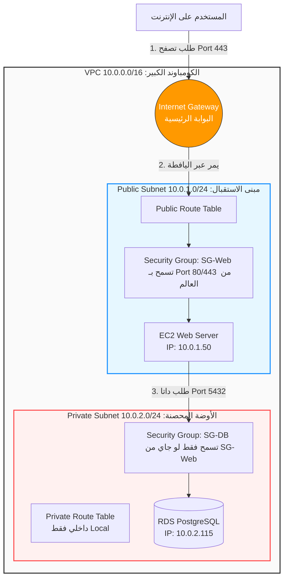

### تتبع السيناريو ده في ثواني (كيف تسير البيانات؟):

اليوزر يكتب عنوان موقعك ➔ الريكويست يضرب في البوابة الخارجية (**IGW**) ➔ البوابة تبص في الخريطة (**Public Route Table**) وتحدف الريكويست لمبنى الاستقبال ➔ البوديقارد (**SG-Web**) يفتش الريكويست ويلاقيه بورت 443 سليم فيعديه للسيرفر (**EC2**) ➔ كود الـ Backend على السيرفر محتاج يقرأ بيانات اليوزر من الداتا بيز، فيقوم مطلع ريكويست داخلي لـ IP الداتا بيز `10.0.2.115` على بورت 5432 ➔ الريكويست يوصل لباب الأوضة المحصنة، البوديقارد (**SG-DB**) يفتشه ويقول: _"أنت جاي منين؟ جاي من سيرفر الـ EC2 اللي معاه رخصة SG-Web؟ اه.. اتفضل ادخل"_ ➔ الـ **RDS** ترد على الـ EC2، والـ EC2 يرد على اليوزر.

---
### الحتة الأولى: يعني إيه `10.0.0.0/16`؟ (ده النطاق أو الـ Range)

إحنا متفقين إن الـ IP الواحد بيكون رقم زي ده: `10.0.1.50`.

لكن لما نيجي نكتب قاعدة في المرور، مش هينفع نكتب قاعدة لكل IP لوحده (مش هنكتب 65 ألف سطر!). إحنا عايزين نكتب قاعدة تقول: **"أي حد عنوانه بيبدأ بـ 10.0..."**

الرقم اللي فيه علامة السلاش `/` ده بنسميه في النيتورك **(CIDR Block)**.

اعتبر علامة الـ `/` دي بتقول للراوتر: **"إحنا واخدين مساحة أرقام قد إيه"**.

- **الرقم `/16`:** معناه "مساحة ضخمة جداً" (حوالي 65 ألف عنوان). دي المساحة بتاعة الكومباوند كله (الـ VPC). أي IP بيبدأ بـ `10.0` (زي `10.0.1.5` أو `10.0.50.99`) بينتمي للمساحة دي.
    
- **الرقم `/24`:** معناه "مساحة صغيرة" (256 عنوان بس). دي المساحة بتاعة أوضة واحدة أو مبنى واحد (Subnet).
    
- **الرقم `/32`:** معناه "جهاز واحد بس بعينه".
    
- **الرقم `0.0.0.0/0`:** ده معناه **"أي حد في الكوكب، الإنترنت كله"**.
    

إذن، `10.0.0.0/16` تترجم بالعربي لـ: **"أي سيرفر ساكن معانا جوه الكومباوند"**.

### الحتة التانية: يعني إيه `-> Local`؟ (ده القرار أو الاتجاه)

كلمة `Local` معناها **"محلي / داخلي"**.

يعني مش محتاجين نخرج بره السور، ولا محتاجين نروح لبوابة الإنترنت (IGW). الهدف اللي إنت رايحله ده موجود جنبك جوه الكومباوند.

### الخلاصة: السطر كله معناه إيه؟

لو سيرفر الويب (اللي واخد IP مثلاً `10.0.1.50`) عايز يبعت داتا لسيرفر الداتا بيز (اللي واخد IP مثلاً `10.0.2.115`)، السيرفر بيسأل اليافطة المرورية: _"أروح العنوان ده إزاي؟"_

اليافطة هتبص على الـ IP وتشوف سطر `10.0.0.0/16 -> Local` وتترجمه وتقول للسيرفر:

**"بص يا ابني، الرقم اللي إنت رايحله ده (10.0.2.115) بيقع جوه نطاق عيلتنا (10.0.0.0/16). طالما هو من عيلتنا، يبقى التوجيه بتاعه (Local). يعني متخرجش بره الكومباوند، السيرفر ده جارك جوه، روح خبط على بابه علطول من جوه الشبكة."**

وعلى العكس تماماً، لو السيرفر عايز يفتح موقع `facebook.com` (وده الـ IP بتاعه بره عيلتنا خالص)، اليافطة هتبص على القاعدة التانية اللي هي `0.0.0.0/0 -> IGW` وتقوله:

**"الرقم اللي إنت طالبه ده مش من عيلتنا، ده حد غريب من أي مكان في العالم (0.0.0.0/0)، يبقى عشان توصله لازم تطلع من البوابة الرئيسية (IGW)."**

---

ممتاز جداً يا هندسة. إحنا كده بنينا الكومباوند (VPC)، قسمناه أوض (Subnets)، ركبنا بوابة الشارع (IGW)، وعلقنا اليافطات المرورية (Route Tables).

عشان الـ Architecture بتاعتنا تبقى "Enterprise-grade" وجاهزة للـ Production، ناقصنا قطعتين في البازل هما الأهم في تأمين النيتورك، وهنشرحهم بنفس التشبيه: **الفرق بين الـ NACL والـ Security Group**، و**حوار الـ NAT Gateway**.

### 1. طبقات الحماية: حارس المبنى (NACL) vs البودي جارد (Security Group)

في عالم الـ AWS، الأمان مبيعتمدش على قفل واحد، بنعتمد على طبقتين من التفتيش (Defense in Depth).

#### أ. الـ Security Group (البودي جارد الشخصي)

زي ما اتكلمنا، ده البودي جارد اللي واقف على باب **السيرفر نفسه (الـ EC2)**.

- **الـ Rule بتاعته (Allow Only):** البودي جارد ده بيشتغل بقاعدة "المنع الافتراضي". يعني قافل كل حاجة، وإنت بتقوله بس "اسمح لمين". (مفيش جواه حاجة اسمها Deny IP معين، هو بطبيعته مانع الكل).
    
- **الميزة الهندسية الأهم (Stateful - بيمتلك ذاكرة):** يعني إيه Stateful؟ تخيل سيرفر الويب بتاعك طلب يقرأ بيانات من الداتا بيز. الريكويست وهو رايح هيعدي على البودي جارد ويدخل. لما الداتا بيز ترد وتبعت البيانات، البودي جارد هيقول: _"آه، الرد ده بتاع الريكويست اللي أنا لسه مدخله من شوية، اتفضل اخرج طوالي"_. مبيفتشش الريكويست وهو راجع!
    

#### ب. الـ NACL (Network Access Control List - أمن الكومباوند)

ده عسكري الأمن اللي واقف على باب **المبنى كله (الـ Subnet)** من بره، قبل ما توصل للسيرفرات أصلاً.

- **الـ Rule بتاعته (Allow & Deny):** العسكري ده معاه لستة باللي مسموح يدخل (Allow)، ولستة باللي ممنوع يدخل صراحة (Deny). يعني تقدر تقوله: _"لو شفت الـ IP بتاع الهكر ده 5.5.5.5، اطرده وماتدخلوش المبنى أصلاً"_.
    
- **الميزة الهندسية الأهم (Stateless - فاقد للذاكرة):** العسكري ده مبيفتكرش حد. لو سمح لريكويست إنه يدخل المبنى، ولما الريكويست ده حب يرجع ويخرج تاني، العسكري هيوقفه ويقوله: _"إنت رايح فين؟ وريني تصريح الخروج بتاعك!"_. يعني لازم تكتب له Rule لدخول الترافيك (Inbound)، وRule تانية خالص لخروجه (Outbound).
    

**الخلاصة:** الريكويست اللي جاي من الإنترنت بيعدي الأول على العسكري (NACL) يفتشه، لو عدى، يروح يخبط على باب السيرفر فالبودي جارد (Security Group) يفتشه تاني.

### 2. معضلة الأوضة السرية والـ NAT Gateway

تعال نفتكر **الأوضة المحصنة (Private Subnet)**. إحنا حطينا الداتا بيز وسيرفرات الـ Backend جواها، وكتبنا على اليافطة إنها **ممنوع** تخرج لبوابة الشارع (IGW). كده الأوضة دي آمنة 100% ومفيش مخلوق من الإنترنت يقدر يوصلها.

**المشكلة الهندسية (The Catch):** سيرفر الـ Backend اللي جوه ده (اللي شغال بـ Linux)، بعد كام شهر نزل له تحديث أمني مهم جداً، أو المطور عايز ينزل عليه `npm install` لمكتبة معينة من الإنترنت.

السيرفر ده معندوش Public IP، واليافطة منعاه من الخروج للشارع. هيجيب التحديث إزاي وهو محبوس؟!

**الحل السحري: الـ NAT Gateway (المرسال / الدليفري بوي)**

أمازون عملت جهاز اسمه NAT (Network Address Translation). بناخد الجهاز ده ونحطه جوه **مبنى الاستقبال (Public Subnet)** اللي واصل بالإنترنت.

بيشتغل إزاي كـ "دليفري"؟

1. السيرفر المحبوس في الأوضة السرية يبعت طلب للـ NAT يقوله: _"والنبي يا كابتن روح هاتلي التحديث ده من سيرفرات أوبونتو على الإنترنت"_.
    
2. الـ NAT ياخد الطلب، يشيل منه عنوان السيرفر المحبوس، ويحط عنوانه هو (عشان معاه Public IP)، ويخرج هو من بوابة الشارع (IGW) يجيب التحديث.
    
3. الـ NAT يرجع الكومباوند، ويسلم التحديث للسيرفر المحبوس في إيده.
    

**اللقطة المعمارية هنا:** الـ NAT بيسمح للسيرفرات المحبوسة إنها **تبدأ** اتصال وتخرج تجيب حاجة (Outbound)، لكن لو أي حد من الإنترنت حاول يكلم الـ NAT عشان يدخل للسيرفر المحبوس، الـ NAT هيرفض ويقوله "ممنوع الدخول". هو بيشتغل في اتجاه واحد بس (One-way mirror).

### الرسمة المعمارية النهائية (The Big Picture)


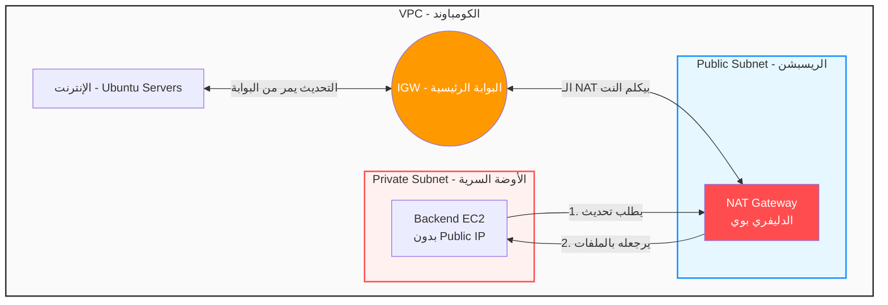
---
# load balncers

## مقدمة .. يعني ايه ping ?

عشان نفهم يعني إيه **Ping**، تعال نرجع لمثال "الشارع والبيوت" بتاعنا.

### 1. الفكرة ببساطة (مثال خبطة الباب)

تخيل إنك ساكن في أول الشارع، وعايز تبعت رسالة مهمة جداً لواحد صاحبك ساكن في آخر الشارع. بس قبل ما تمشي المشوار ده كله أو تبعتله ملفات كبيرة، إنت عايز تتأكد من حاجتين:

1. **هل هو موجود وصاحي أصلاً؟** (عشان متروحش تلاقي الباب مقفول).
    
2. **هل الطريق سريع ولا زحمة؟** (عشان تعرف هتاخد وقت قد إيه).
    

فبتقوم باعت "عيل صغير" بيجري بسرعة، وتقوله: _"روح اخبط على باب صاحبي خبطة واحدة، وأول ما يرد عليك ويقولك (مين؟)، ارجعلي فوراً"_.

إنت بتمسك ستوب ووتش (ساعة إيقاف):

- لو العيل رجعلك بعد ثانيتين ➔ معناه إن صاحبك صاحي والطريق سريع جداً.
    
- لو رجعلك بعد 10 ثواني ➔ معناه إن صاحبك صاحي بس الطريق زحمة جداً (أو صاحبك تقيل في الرد).
    
- لو العيل مرجعش خالص ➔ معناه إن صاحبك نايم، أو العيل تاه في السكة، أو الشارع مقطوع.
    

**هذا "العيل الصغير" في عالم النيتورك هو الـ Ping!**

### 2. التشريح التقني: الـ Ping بيشتغل إزاي؟

أمر `ping` ده أداة أساسية موجودة في أي نظام تشغيل (ويندوز، لينكس، ماك). لما بتفتح الـ Terminal وتكتب مثلاً `ping google.com`، اللي بيحصل في الكواليس هو الآتي:

1. جهازك بيبعت حزمة بيانات صغيرة جداً (زي رسالة فاضية) اسمها **Echo Request** (طلب صدى الصوت).
    
2. الرسالة دي بتسافر في كابلات الإنترنت لحد ما توصل لسيرفرات جوجل.
    
3. سيرفر جوجل أول ما يستلمها، متبرمج إنه يرد عليها فوراً برسالة تانية اسمها **Echo Reply** (الرد على الصدى).
    
4. جهازك بيحسب الوقت بالملي ثانية (ms) من لحظة خروج الرسالة لحد لحظة رجوع الرد.
    

### 3. إحنا كمهندسين بنقيس إيه بالـ Ping؟ (أهم 3 حاجات)

لما بنعمل Ping، عينينا بتروح على 3 مصطلحات أساسية:

1. **الـ Reachability (إمكانية الوصول):** هل السيرفر ده عايش ومتوصل بالشبكة ولا واقع؟ لو رد، يبقى السيرفر "عايش". لو ماردش بيطلعلك إيرور شهير اسمه `Request Timed Out` (الطلب انتهى وقته ومفيش رد).
    
2. **الـ Latency (زمن التأخير أو البينج):**
    
    ودي الكلمة اللي الجيمرز بيستخدموها كتير ("البينج عندي عالي واللعبة بتعلق"). ده **الوقت** اللي بتاخده الرحلة ذهاب وعودة.
    
    - لو الـ Latency مثلاً `20ms` (عشرين جزء من الألف من الثانية) ➔ ده اتصال طيارة وممتاز.
        
    - لو الـ Latency مثلاً `300ms` ➔ ده اتصال بطيء وفيه تأخير ملحوظ في نقل الداتا.
        
3. **الـ Packet Loss (فقدان البيانات):**
    
    الـ Ping عادة بيبعت 4 رسايل ورا بعض. لو جهازك بعت 4 رسايل، وسيرفر جوجل رد على 3 بس وفيه رسالة وقعت في السكة، ده معناه إن فيه **Packet Loss بنسبة 25%**. وده مؤشر خطير إن كابلات النيتورك فيها مشكلة أو السيرفر عليه ضغط رهيب لدرجة إنه بيوقع رسايل.
    

### 4. علاقة ده بالـ Load Balancer اللي شرحناه (الـ Health Checks)

نربط بقى الخيوط ببعضها! في الرسالة اللي فاتت قلتلك إن الـ Load Balancer بيعمل **Health Checks (فحص النبض)** للسيرفرات عشان يتأكد إنها شغالة قبل ما يبعتلها اليوزرز.

الـ Health Check ده في جوهره هو عملية **Ping** مستمرة!

الـ Load Balancer واقف يبعت Ping (سواء Network Ping أو HTTP Ping) للسيرفر الأول والتاني والتالت كل 10 ثواني.

- لو السيرفر الأول رد ➔ الـ Load Balancer يقول "تمام ده Healthy، ابعتله زباين".
    
- لو السيرفر التاني ماردش على الـ Ping 3 مرات ورا بعض ➔ الـ Load Balancer يقول "السيرفر ده مات أو هنج (Unhealthy)، اقطع عنه الزباين فوراً لحد ما يفوق ويرجع يرد على الـ Ping بتاعي".
    

### الرسمة التوضيحية (Sequence Diagram)

بص على حركة الريكويست والرد في الرسمة دي:


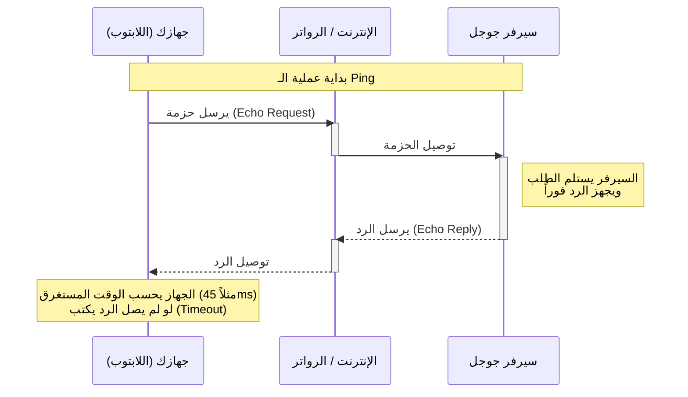

---

### 1. تفكيك المصطلحات التأسيسية (قبل ما ندخل في الموضوع)

عشان نفهم القصة من جذورها، لازم نكون متفقين على معاني الكلمات دي كأننا بنبني بيت:

- **الـ Request (الطلب):** لما اليوزر بيكتب لينك موقعك ويدوس Enter، المتصفح بيبعت رسالة رقمية للنت اسمها "طلب". الرسالة دي بتقول: "لو سمحتوا، ابعتولي صفحة الهوم بيج بتاعة الموقع ده".
    
- **الـ Traffic (حركة المرور / الزيارات):** ده مصطلح بنوصف بيه "كمية الريكويستات" أو عدد الطلبات اللي جاية للموقع بتاعك في وقت واحد. (موقع عليه 10 يوزرز = ترافيك قليل، موقع عليه مليون يوزر = ترافيك ضخم).
    
- **الـ Server / EC2 (الخادم):** ده جهاز كمبيوتر عملاق شغال 24 ساعة بدون توقف، متوصل بالإنترنت السريع جداً. وظيفته يستقبل الـ Requests، يعالجها، ويرد عليها.
    
- **الـ Frontend (الواجهة الأمامية):** ده الكود اللي بيشتغل على متصفح اليوزر (موبايل أو لابتوب)، زي الزراير والألوان والصور (HTML, CSS, React).
    
- **الـ Backend (الخلفية / الكواليس):** ده الكود اللي شغال جوه الـ Server بتاعك (زي Node.js أو Laravel). ده اللي بيفكر، يكلم الداتا بيز، ويجهز البيانات المطلوبة عشان يبعتها للـ Frontend.
    

### 2. أصل المشكلة: السيرفر الواحد ونقطة الانهيار (Single Point of Failure)

تخيل إنك عملت أبلكيشن ورفعته على **سيرفر واحد فقط**.

طول ما الأبلكيشن بيدخله 100 يوزر في اليوم، السيرفر مرتاح وبيرد بسرعة.

فجأة، الأبلكيشن بتاعك اتشهر، وبقى بيدخله 100,000 يوزر في نفس اللحظة (Traffic ضخم).

السيرفر الواحد ده ليه طاقة استيعاب (زي أي جهاز كمبيوتر ليه RAM و CPU). لما الريكويستات بتزيد عن طاقته، السيرفر "بيهنج" وبيقع (Crashes). ولأن الأبلكيشن كله معتمد على السيرفر ده بس، الموقع كله بيقفل في وش اليوزرز.

الحالة دي في هندسة البرمجيات بنسميها **Single Point of Failure (نقطة الانهيار الواحدة)**: يعني لو حتة واحدة باظت، السيستم كله بيموت.

### 3. الحلول المتاحة (مفهوم الـ Scaling - التوسع)

عشان نحل مشكلة الزحمة دي، المهندسين قدامهم طريقين للـ **Scaling (التوسع وتكبير قدرة النظام)**:

**أ. التوسع الرأسي (Vertical Scaling / Scale Up):**

إنك تروح تمسك السيرفر بتاعك، وتكبر إمكانياته. يعني لو كان فيه 4 جيجا رامات، تخليهم 64 جيجا رامات.

- **العيب القاتل:** مهما كبرت السيرفر، هتيجي عند حد معين ومش هتعرف تكبره تاني (مفيش سيرفر في العالم راماته لا نهائية). زائد إنك لسه عندك مشكلة "نقطة الانهيار الواحدة"؛ لو السيرفر العملاق ده سلك الكهربا بتاعه اتقطع، الموقع برضه هيقع.
    

**ب. التوسع الأفقي (Horizontal Scaling / Scale Out):** هنا العبقرية. بدل ما نجيب سيرفر واحد عملاق، إحنا هنجيب **5 أو 10 سيرفرات متوسطين**، ونحطهم جنب بعض يشتغلوا كفريق. لو سيرفر منهم باظ أو اتحرق، الـ 9 الباقيين شغالين والموقع مش هيقع.

المصطلح ده بيحقق هدف عظيم اسمه **High Availability (التوافر العالي)**: يعني الموقع متاح وشغال بنسبة 99.99% ومش بيقع أبداً.

### 4. ظهور البطل: الـ Load Balancer (موزع الأحمال)

إحنا اخترنا التوسع الأفقي (بقى عندنا 5 سيرفرات Backend).

**هنا ظهرت مشكلة جديدة وكبيرة جداً:**

كل سيرفر من الـ 5 ليه IP مختلف (عنوان مختلف). اليوزر اللي قاعد في بيته هيكلم لأنو سيرفر فيهم؟ وإيه اللي يمنع إن كل اليوزرز يروحوا يكلموا السيرفر رقم 1 ويسيبوا الباقيين فاضيين، فالسيرفر رقم 1 يقع برضه؟

**الحل:** كان اختراع جهاز أو برنامج بيتحط في النص بين (اليوزرز) وبين (السيرفرات الـ 5).

الجهاز ده اسمه **Load Balancer (موزع الأحمال)**.

- **بيعمل إيه بالظبط؟** تخيل إنه "مدير صالة المطعم" اللي واقف على الباب. الزباين (اليوزرز) مابيدخلوش يقعدوا على أي ترابيزة بمزاجهم. هما بيكلموا مدير الصالة الأول. المدير يبص على الترابيزات (السيرفرات)، يلاقي سيرفر 1 مشغول، فياخد اليوزر يوديه لسيرفر 2 الفاضي.
    
- **النتيجة:** الحمل (Load) بيتوزع بالعدل (Balancing) على كل السيرفرات، ومفيش سيرفر بيقع من الضغط.
    


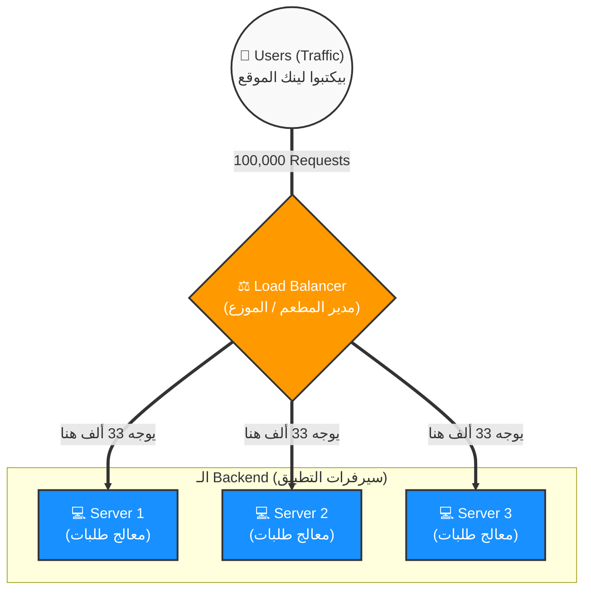

كده إحنا أسسنا الأرضية اللي هنقف عليها، وفهمنا المصطلحات، والمشكلة، ودور الـ Load Balancer بشكل عام.

---
 الـ Application Load Balancer (موزع الأحمال الذكي للويب)**، أو اختصاراً **ALB**.

ده أذكى وأشهر نوع فيهم، وده اللي هتستخدمه بنسبة 95% في أي بروجكت بتبنيه سواء بـ Laravel أو Node.js، لأنه مصمم خصيصاً عشان يفهم لغة الويب.

تعال نفصص بيشتغل إزاي من جوه مصطلح بمصطلح:

### 1. بيشتغل على Layer 7 (الطبقة السابعة) — يعني إيه؟

في هندسة الشبكات، فيه نموذج اسمه **OSI Model** (نموذج الاتصال المعياري). ده بيقسم طريقة نقل البيانات بين الأجهزة لـ 7 طبقات (Layers).

- الطبقات اللي تحت (زي Layer 3 و 4) دي طبقات "غبية" شوية. بتهتم بس بنقل الكابلات والـ IPs والأرقام من غير ما تفهم إيه الداتا اللي بتتنقل أصلاً.
    
- **الطبقة السابعة (Layer 7 - Application Layer):** دي أعلى طبقة، ودي اللي المتصفحات (زي كروم) والسيرفرات بيستخدموها. دي الطبقة اللي بتفهم بروتوكول **HTTP و HTTPS**.
    

بما إن الـ ALB بيشتغل في Layer 7، ده معناه إنه **بيقدر يفتح الريكويست ويقرأ محتواه**.

مبيقراش بس الـ IP، لأ، ده بيقرأ الـ URL (اللينك اللي اليوزر كاتبه)، بيقرأ الـ Headers، وبيقرا الـ Cookies. كأنه موظف أمن بيفتح الظرف ويقرأ الجواب من جوه قبل ما يوجهه!

### 2. التوجيه الذكي (Smart Routing) — ميزة الـ ALB القاتلة

لأن الـ ALB بيقدر يقرأ اللينك (URL)، المهندسين بيستخدموه عشان يوزع الترافيك بذكاء مش مجرد توزيع أعمى.

تعال ناخد مثال عملي (Microservices Architecture - معمارية الخدمات المصغرة):

تخيل إنك بتبني سيستم كبير. بدل ما تحط الكود كله في سيرفر واحد، إنت قسمته:

- سيرفرات مخصصة لصفحات الموقع العادية (Frontend).
    
- سيرفرات مخصصة للـ API ومعالجة الدفع والـ Backend.
    

الـ ALB بيعمل حاجة اسمها **Path-Based Routing (التوجيه بناءً على المسار)**:

- لو اليوزر طلب اللينك `badaly.com` أو `badaly.com/home` ➔ الـ ALB يقرأ اللينك، ويقول: "آه، ده عايز الموقع العادي"، فيبعت الريكويست لمجموعة سيرفرات الـ Frontend.
    
- لو اليوزر (أو الموبايل أبلكيشن) طلب اللينك `badaly.com/api/users` ➔ الـ ALB يقرأ كلمة `/api`، فيقول: "لأ، ده ريكويست تقيل محتاج داتا"، فيوجهه لمجموعة سيرفرات الـ Backend (مثلاً Node.js).
    

### 3. مصطلح الـ Target Group (مجموعة الهدف)

الـ ALB مابيبعتش الريكويست لسيرفر EC2 لوحده كده في الهواء. لازم نحط السيرفرات المتشابهة في جروب اسمه **Target Group**.

- **الـ Target Group:** عبارة عن "حاوية منطقية" أو "صندوق" بنحط فيه مجموعة سيرفرات (EC2 Instances) بتعمل نفس الوظيفة بالظبط.
    
- إنت ممكن تعمل Target Group تسميه `API-Servers`، وتحط جواه 5 سيرفرات. الـ ALB بياخد الريكويست ويرميه للـ Target Group دي، وهي اللي بتوزع على الـ 5 سيرفرات اللي جواها بالدور.
    

### 4. الـ Health Check الذكي (فحص النبض على طريقة الـ HTTP)

في الرسالة اللي فاتت شرحنا الـ Ping وإزاي بيعرف السيرفر عايش ولا ميت.

الـ ALB بيعمل Ping، بس مش Ping نيتورك عادي.. بيعمل **HTTP Health Check**.

- **يعني إيه؟** الـ ALB بيبعت ريكويست حقيقي للسيرفر (مثلاً بيفتح صفحة اسمها `/health`).
    
- السيرفر لازم يرد بكود **HTTP 200 OK**.
    
    _(ملاحظة: كود 200 ده الكود العالمي في الويب اللي معناه "طلبك ناجح وكل حاجة تمام"، عكس كود 404 اللي معناه "الصفحة مش موجودة" أو 500 اللي معناه "السيرفر ضرب إيرور")._
    
- لو السيرفر رد بـ 200، الـ ALB يعتبره **Healthy** (سليم) ويبعتله يوزرز. لو السيرفر رد بـ 500 (مثلاً الداتا بيز وقعت جواه)، الـ ALB بيعتبره **Unhealthy** ويطلعه بره الخدمة فوراً عشان اليوزرز ميشوفوش الإيرور ده.
    

### خريطة معمارية للـ ALB (Mermaid)

بص على الرسمة دي بتوضح إزاي الـ ALB بيقرأ اللينكات ويوزعها على الـ Target Groups المختلفة:


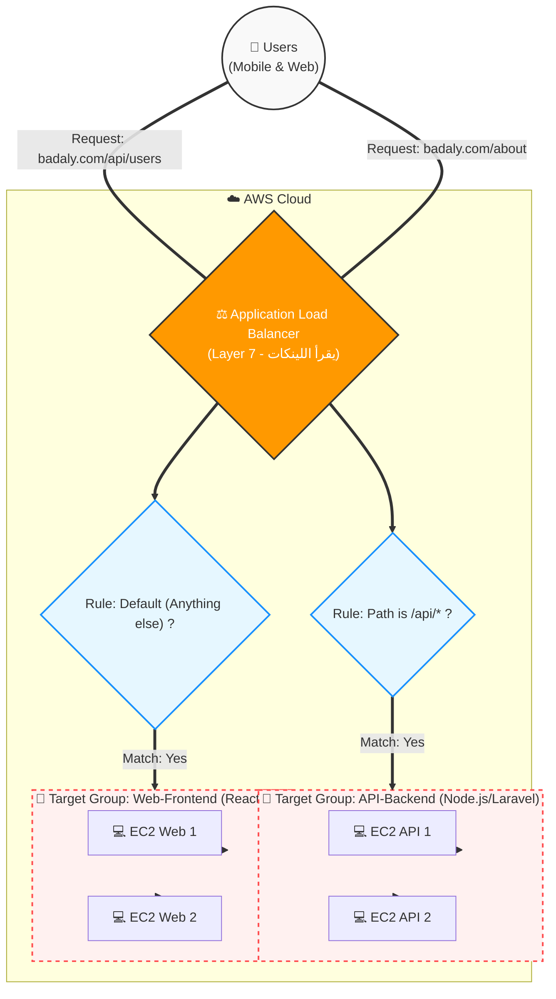

### مفاتيح امتحان الـ Cloud Practitioner للـ ALB

لما يجيلك سؤال في الامتحان، عينينا بتدور على الـ Keywords (الكلمات الدلالية) دي اللي بتأكد إن الإجابة هي ALB:

1. لو قالك توجيه الترافيك بناءً على **HTTP/HTTPS** أو الـ **Headers** أو الـ **Query Strings**.
    
2. لو قالك **Path-based routing** (يعني كلمة `/api` تروح لسيرفر، و `/images` تروح لسيرفر تاني).
    
3. لو قالك إن الأبلكيشن بتاعك مبني كـ **Microservices** (خدمات مصغرة بتكلم بعض).
    

لو كل مصطلح وتفصيلة هنا دخلت الدماغ وبقت واضحة، قولي **"تمام كمل"** عشان ندخل على الرسالة التالتة: (النوع التاني المجنون بسرعته: الـ Network Load Balancer).

---
 الـ Network Load Balancer (الوحش السريع للمهمات الصعبة)**، أو اختصاراً **NLB**.

لو كان الـ ALB (اللي فات) هو "المدير الذكي" اللي بيقرأ طلبات الزباين بالتفصيل، فالـ NLB هو "سير النقل السريع جداً" في مصنع ضخم؛ ملوش دعوة إنت شايل إيه جوه الصندوق، هو وظيفته ينقل الصناديق دي من الشارع للسيرفرات بأقصى سرعة ممكنة في العالم.

تعال نفكك المصطلحات والمفاهيم بتاعته حتة حتة:

### 1. بيشتغل على Layer 4 (الطبقة الرابعة) — يعني إيه "أعمى" بس سريع؟

في الرسالة اللي فاتت قلنا إن Layer 7 بتفهم لغة الويب (HTTP) واللينكات.

الـ NLB بيشتغل في طبقة أقل، اسمها **Layer 4 (Transport Layer - طبقة النقل)**.

الطبقة دي **لا تفهم** يعني إيه لينك (`/api`)، ولا بتفهم يعني إيه متصفح أو Cookies. هي بتفهم بس حاجتين:

- **رقم الـ IP:** مين اللي بيبعت الداتا.
    
- **رقم الـ Port (المنفذ):** الداتا دي رايحة على بورت كام (مثلاً بورت 80 أو 443).
    

عشان هو مش بيضيع وقت في فتح الريكويست وقراية محتواه من جوه، الـ NLB بيقدر يوجه الترافيك **بسرعة مرعبة** (زي الراجل اللي بيختم الباسبورات من غير ما يبص في وشك).

### 2. بيفهم لغات الـ TCP والـ UDP — يعني إيه دول؟

بما إن الـ NLB مبيفهمش HTTP، أومال هو بينقل الداتا بأنهي لغة (بروتوكول)؟ بينقلها بلغات الطبقة الرابعة اللي هما **TCP** و **UDP**. ودول لازم نفهمهم:

- **بروتوكول الـ TCP (Transmission Control Protocol - النقل المضمون):**
    
    تخيل إنك بتبعت لواحد صاحبك طرد بالبريد "مسجل بعلم الوصول". إنت مش هترتاح غير لما البريد يكلمك يقولك "صاحبك استلم الطرد ومضى". الـ TCP بيعمل كده؛ بيقسّم البيانات لحتت، ويتأكد إن كل حتة وصلت للسيرفر المظبوط ولو حتة وقعت بيبعتها تاني. (عشان كده بيستخدم في نقل الداتا الحساسة زي قواعد البيانات).
    
- **بروتوكول الـ UDP (User Datagram Protocol - النقل السريع جداً):**
    
    تخيل إنك بتبعت رسايل بالبريد العادي، بترميهم في الصندوق وتجري. مفيش ضمان إنهم هيوصلوا، ومفيش وقت تتأكد. ده بيستخدم في الحاجات اللي محتاجة "سرعة اللحظة" ومفيهاش مشكلة لو فريم أو لقطة وقعت.. زي إيه؟ **ألعاب الأونلاين (Gaming)**، ومكالمات الفيديو (Zoom/Skype)، والبث المباشر.
    

**الخلاصة:** الـ NLB بيقدر يوزع أحمال ألعاب الأونلاين ومكالمات الفيديو بكفاءة خرافية لأنه بيدعم الـ UDP، عكس الـ ALB اللي مبيفهمش غير مواقع ويب بس.

### 3. الأداء الخرافي (Ultra-High Performance) والـ Latency

الـ NLB مصمم للأنظمة اللي عليها ضغط مش طبيعي.

- بيقدر يستقبل **ملايين الريكويستات في الثانية الواحدة (Millions of requests per second)** من غير ما يعرق أو يحتاج وقت عشان يسخن (الـ ALB بيحتاج وقت يكبر فيه لو الترافيك زاد فجأة، الـ NLB جاهز دايماً).
    
- **الـ Latency (زمن التأخير):** الـ NLB زمن التأخير بتاعه بيتقاس بـ "أجزاء من الملي ثانية" (Ultra-low latency). الريكويست بيلمسه ويوصل للسيرفر في نفس اللحظة تقريباً.
    

### 4. الميزة الذهبية: الـ Static IP (عنوان لا يتغير أبداً)

- **المشكلة في الـ ALB:** الـ ALB ملوش IP ثابت. أمازون كل شوية بتغير الـ IPs بتاعته في الخلفية عشان تكبره وتصغره حسب الضغط. عشان كده دايماً بنكلم الـ ALB بـ "اسم أو لينك" (DNS Name) مش برقم.
    
- **الحل في الـ NLB:** الـ NLB بيديك **Static IP** (رقم ثابت) لكل Availability Zone.
    
    **ليه ده مهم؟** تخيل إنك بتعمل سيستم للبنك الأهلي، والبنك بيقولك: "الفايرول (Firewall) بتاعي مش هيسمح بمرور أي داتا ليك غير لو أديتني رقم IP ثابت أعمله Allow عندي". في الحالة دي الـ ALB مش هينفعك، ولازم تستخدم NLB عشان تديهم الـ IP الثابت ده (اللي بنسميه في أمازون Elastic IP).
    

### خريطة معمارية للـ NLB (Mermaid)

بص على الرسمة دي بتوضح إزاي الـ NLB مبيفكرش، هو بس بيشوف البورت ويرمي الترافيك بسرعة الصاروخ للسيرفرات، ومعاه الـ IP الثابت:


```mermaid
flowchart TD
    Users(("🎮 Users\n(Gamers & IoT Devices)"))

    subgraph AWS_Cloud ["☁️ AWS Cloud - Layer 4 Network"]
        
        NLB{"⚡ Network Load Balancer\n(Layer 4 - IP & Port Only)"}
        
        ElasticIP["📌 Elastic IP (Static)\nمثلاً: 3.120.45.6"]
        
        ElasticIP -.->|مربوط بـ| NLB
        
        subgraph TG_Game ["🎯 Target Group: Game Servers (TCP/UDP)"]
            EC2_G1["💻 Game Server 1"]
            EC2_G2["💻 Game Server 2"]
            EC2_G3["💻 Game Server 3"]
        end
    end

    %% Flow of traffic
    Users ===|Millions of Requests/Sec\n(TCP Port 27015)| ElasticIP
    
    NLB ==>|Fast Forwarding| EC2_G1
    NLB ==>|Fast Forwarding| EC2_G2
    NLB ==>|Fast Forwarding| EC2_G3

    %% Styling
    classDef main fill:#f9f9f9,stroke:#333,stroke-width:2px;
    classDef nlb fill:#9933ff,stroke:#333,stroke-width:2px,color:#fff;
    classDef eip fill:#ffcc00,stroke:#333,stroke-width:2px,color:#000;
    classDef tg fill:#fff1f0,stroke:#ff4d4f,stroke-width:2px,stroke-dasharray: 5 5;
    
    class Users main;
    class NLB nlb;
    class ElasticIP eip;
    class TG_Game tg;
```

### مفاتيح امتحان الـ Cloud Practitioner للـ NLB

لما تقرأ السؤال في الامتحان، الإجابة بتكون **NLB** لو شفت أي كلمة من دول:

1. لو ذكر سرعة مرعبة: **"Millions of requests per second"**.
    
2. لو طلب أداء عالي جداً وتأخير شبه معدوم: **"Ultra-low latency"**.
    
3. لو ذكر بروتوكولات الطبقة الرابعة صراحة: **"TCP, UDP, or TLS traffic"**.
    
4. لو العميل (زي بنك أو مؤسسة) اشترط عنوان ثابت للـ Firewall: **"Requires a Static IP / Elastic IP"**.
    

---
 لازم أكسرلك "صنم" أو تخيل معين في دماغك: **إنت متخيل إن الـ ALB ده عبارة عن "سيرفر واحد" (صندوق واحد) واقف على الباب بيستقبل الترافيك.**

لو هو كان فعلاً سيرفر واحد، كان زمان ليه IP ثابت وخلاص.. لكن الصدمة المعمارية جوه سحابة أمازون هي إن **الـ ALB نفسه بيتعمله Scaling (بيتمدد وينكمش) زي الـ EC2 بالظبط!**

تعال نفصصها بالراحة عشان تقتنع تماماً:

### 1. الكواليس المخفية: الـ ALB مش سيرفر، ده "جيش مخفي"

لما إنت بتعمل Create لـ ALB، أمازون مش بتخصص لك سيرفر واحد. أمازون بتدير الـ ALB ده كـ **Managed Service** (خدمة مدارة بالكامل من عندهم).

- **في وقت الهدوء:** لو الترافيك بتاع موقعك قليل، أمازون بتشغل في الكواليس (Node) أو "عقدة" واحدة للـ ALB عشان تستقبل الترافيك. العقدة دي بتاخد رقم IP (مثلاً `1.1.1.1`).
    
- **في وقت الانفجار (Spike):** تخيل إنك عملت إعلان، وفجأة دخل 500 ألف يوزر في نفس الثانية. لو الـ ALB كان "سيرفر واحد بـ IP واحد" زي ما إنت متخيل، كان الـ ALB نفسه **هيهنج ويقع** قبل ما الترافيك يوصل للسيرفرات بتاعتك أصلاً!
    

### 2. السحر المعماري (Auto Scaling for the Load Balancer)

عشان أمازون تمنع الـ ALB من إنه يقع، بتعمل سحر في الخلفية إنت مابتحسش بيه:

أول ما الـ ALB يلاقي الترافيك بيزيد عليه جداً، بيروح لأمازون يقولها: _"الحقيني، أنا مش قادر أصد الريكويستات دي لوحدي"_.

تقوم أمازون أوتوماتيك **خالقة 4 أو 5 سيرفرات ALB جديدة** جنبه في نفس اللحظة عشان يصدوا الترافيك معاه.

كل سيرفر ALB جديد بيتولد، بياخد من أمازون **IP جديد مختلف** (مثلاً `2.2.2.2` و `3.3.3.3`). ولما الإعلان يخلص والترافيك يهدى، أمازون بتمسح السيرفرات الزيادة دي، والـ IPs بتاعتهم بتتمسح معاهم وترجع لـ IP واحد.

### 3. ليه بقى الـ IP متغير؟ (دور الـ DNS)

بما إن الـ IPs بتاعة البوابات (الـ ALB Nodes) عمالة تزيد وتقل وتتغير حسب الضغط، أمازون مستحيل تديك رقم IP ثابت تديه لليوزرز أو للفايرول.

- **أمازون بتقولك:** "يا هندسة، متوجعش دماغك بأرقام الـ IPs بتاعتي لأن أنا بغيرها وبزودها كل شوية عشان أحميك من الوقوع. أنا هديك **DNS Name (اسم/لينك ثابت)** زي كده: `my-app-alb-123.amazonaws.com`."
    
- **إزاي اليوزر بيوصل؟** اليوزر بيكتب الاسم ده، والـ DNS (دليل التليفونات) بيبص في اللحظة دي: "يا ترى أمازون مشغلة كام IP للـ ALB ده دلوقتي؟" يقوم الـ DNS موجه اليوزر لأي IP شغال فيهم في اللحظة دي.
    

### خريطة معمارية للتمدد الخفي (Mermaid)

بص على الرسمة دي بتوضح إزاي الـ ALB نفسه بيتمدد في الخلفية (ودول اللي بياخدوا IPs متغيرة) قبل ما يوزعوا على الـ Target Group بتاعتك:


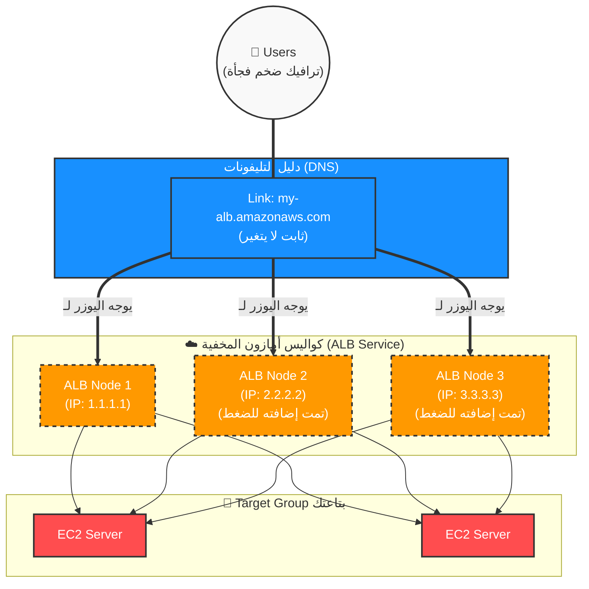

### الخلاصة اللي تقتنع بيها:

الـ ALB ملوش IP ثابت لأنه مش "بواب واحد"، ده "فرقة حراسة مرنة". لما الضغط بيزيد، أمازون بتعين بوابين جدد (IPs جديدة) ولما يقل بتمشيهم. عشان كده الثابت الوحيد هو "اسم الفرقة" (DNS Name) مش رقم بطاقة بواب بعينه.

اقتنعت كده بالخدعة المعمارية اللي بتحصل في الكواليس دي؟ لو الدماغ نورت والفكرة ركبت صح، قولي **"تمام كمل"** عشان ندخل في الرسالة الرابعة اللي فيها النوع التالت (GWLB) وبعده المراجعة الشاملة.

---
 الـ Gateway Load Balancer (حارس الأمن ومفتش الحقائب)**، أو اختصاراً **GWLB**.

النوع ده حالة خاصة جداً، مش هتستخدمه في استضافة موقع عادي، لكنه بيحل "كابوس هندسي" للشركات الكبيرة (Enterprises) والبنوك اللي بتشتري أنظمة حماية غالية من شركات تانية (Third-party) زي Cisco أو Palo Alto.

تعال نفكك مصطلحاته والقصة بتاعته من الصفر:

### 1. تفكيك المصطلحات (يعني إيه أجهزة أمنية خارجية؟)

في عالم الـ Security، أمازون بتقدملك أدوات حماية زي الـ WAF والـ Shield (اللي اتكلمنا عنهم قبل كده). لكن بعض الشركات الكبيرة بتقول لأمازون: _"شكراً، بس أنا دافع ملايين في رخص برامج حماية من شركات متخصصة زي Fortinet أو Palo Alto وعايز أستخدمها جوه أمازون"_.

البرامج دي بنسميها **Virtual Appliances (أجهزة افتراضية)**، ومن أشهر أنواعها:

- **Firewalls (جدران الحماية المتقدمة):** بتفلتر الترافيك بقواعد معقدة جداً للشركات.
    
- **IDS/IPS (نظم كشف ومنع التطفل):** دي برامج بتعمل Deep Packet Inspection (فحص عميق جداً)، بتدور على الفيروسات، والبرمجيات الخبيثة (Malware) جوه الريكويست نفسه.
    

عشان البرامج دي تشتغل في أمازون، بننزلها على سيرفرات **EC2**.

### 2. الكابوس المعماري القديم (المشكلة اللي اخترعوا الـ GWLB عشانها)

تخيل إنك نزلت برنامج الحماية (الـ Firewall) ده على سيرفر EC2 وحطيته على باب الكومباوند بتاعك.

أي ترافيك جاي من الإنترنت لازم يعدي على سيرفر الـ Firewall ده الأول يتفتش، وبعدين يدخل لتطبيقك.

**فين المشكلة؟**

1. لو سيرفر الـ Firewall ده هنج ووقع ➔ الترافيك كله هيقف وموقعك هيقع!
    
2. طيب لو جبنا 5 سيرفرات Firewalls عشان نوزع الحمل (Scaling)؟ ➔ هندسة توجيه الترافيك لـ 5 سيرفرات Firewalls جوه أمازون كان جحيم. كنت بتحتاج تكتب يافطات مرورية (Route Tables) معقدة جداً وتعدل في شكل الريكويست، وده كان بيبوظ الترافيك أحياناً.
    

### 3. الحل: الـ Gateway Load Balancer (الـ Bump-in-the-wire)

أمازون اخترعت الـ GWLB عشان يحل الأزمة دي، وهو بيشتغل على **Layer 3 (الطبقة التالتة - Network Layer)**.

- **بيعمل إيه بالظبط؟ (تشبيه جهاز كشف المعادن في المول):**
    
    تخيل إن الترافيك (اليوزرز) هما زباين داخلين المول. الـ GWLB هو "الضابط" اللي واقف على الباب بيوجه الزباين، وسيرفرات الـ Firewalls هي "أجهزة كشف المعادن" (X-Ray).
    
    الزربون بيدخل ➔ الضابط (GWLB) يوجهه لجهاز تفتيش فاضي ➔ يتفتش ➔ يرجع للضابط ➔ الضابط يدخله المول (الأبلكيشن بتاعك).
    
- **الميزة السحرية (Transparent - شفاف):**
    
    الـ GWLB بيشتغل بخاصية بنسميها في النيتورك "Bump in the wire" (مطب في السلك).
    
    يعني إيه؟ يعني الريكويست بتاع اليوزر بيدخل للـ GWLB، والـ GWLB يبعته للـ Firewall يتفتش ويرجع، **من غير ما يغير فيه حرف واحد ولا يغير الـ IP بتاعه**. اليوزر مبيحسش إن ريكويسته اتخطف وراح اتفتش ورجع، التطبيق بتاعك بيشوف الريكويست كأنه جاي من اليوزر مباشرة.
    

### خريطة معمارية للـ GWLB (Mermaid)

بص على الرسمة دي بتوضح إزاي الـ GWLB بياخد الترافيك، يوزعه على سيرفرات الحماية، ويرجعه تاني مساره الطبيعي:

Code snippet

```mermaid
flowchart TD
    Internet(("🌐 Internet Traffic"))

    subgraph AWS_Cloud ["☁️ AWS Cloud Environment"]
        
        IGW["🚪 Internet Gateway"]
        
        GWLB{"🛂 Gateway Load Balancer\n(Layer 3 - Transparent Router)"}
        
        subgraph Security_Fleet ["🛡️ أسطول الحماية (Third-Party Appliances)"]
            FW1["🛑 Palo Alto Firewall 1"]
            FW2["🛑 Palo Alto Firewall 2"]
            FW3["🛑 Cisco IDS/IPS"]
        end
        
        ALB["⚖️ Application Load Balancer\n(موزع التطبيق بتاعك)"]
        
        App_EC2["💻 EC2 Application Servers"]
    end

    %% Flow of Traffic
    Internet === IGW
    IGW ===|1. كل الترافيك يدخل للـ GWLB أولاً| GWLB
    
    %% Inspection loop
    GWLB ==>|2. توجيه للتفتيش| FW1 & FW2 & FW3
    FW1 & FW2 & FW3 ==>|3. العودة بعد التفتيش (آمن)| GWLB
    
    %% Forward to destination
    GWLB ===|4. استكمال الطريق للتطبيق| ALB
    ALB --> App_EC2

    %% Styling
    classDef main fill:#f9f9f9,stroke:#333,stroke-width:2px;
    classDef gwlb fill:#1890ff,stroke:#333,stroke-width:2px,color:#fff;
    classDef fw fill:#ff4d4f,stroke:#333,stroke-width:2px,color:#fff;
    classDef app fill:#ff9900,stroke:#333,stroke-width:2px,color:#fff;

    class Internet main;
    class GWLB gwlb;
    class FW1,FW2,FW3 fw;
    class ALB,App_EC2 app;
```

### مفاتيح امتحان الـ Cloud Practitioner للـ GWLB

النوع ده أسئلته صريحة جداً ومفيهاش لفة، لو شفت أي كلمة من دول في السؤال، الإجابة فوراً **Gateway Load Balancer**:

1. **Third-party virtual appliances** (أجهزة افتراضية من شركات خارجية).
    
2. **Firewalls, Intrusion Detection Systems (IDS), Intrusion Prevention Systems (IPS)**.
    
3. كلمة **Transparent network gateway** أو **Bump-in-the-wire**.
    

كده إحنا فصصنا التلات أنواع بالكامل، كل واحد فيهم بيشتغل في أنهي طبقة (Layer 7, Layer 4, Layer 3) وبيحل مشكلة إيه.

في انتظار إشارة "كمل" عشان أبعتلك **الرسالة الخامسة (المراجعة الشاملة والمقارنة النهائية في جدول واحد)** عشان تقفل الملف ده هندسياً وتكون جاهز للأمثلة العملية بعدها.

---
### الجزء الأول: هل الـ GWLB (Gateway Load Balancer) ليه IP ولا لأ؟

الإجابة المختصرة: **ليه Private IP (عنوان داخلي مخفي) وملوش Public IP (عنوان عام للشارع).**

تعال نفكك المفهوم ده هندسياً:

إحنا قلنا إن الـ GWLB بيشتغل في **Layer 3** (يعني أعمق من الـ ALB والـ NLB)، وهو عبارة عن "مطب في السلك" عشان يفتش الترافيك عبر سيرفرات حماية خارجية (Firewalls).

بما إنه مستخبي جوه الكومباوند ومبيواجهش الزباين اللي في الشارع بره مباشرة، فهو مش محتاج Public IP. لكن السيرفرات بتاعتك واليافطة المرورية (Route Table) محتاجين يعرفوا مكانه جوه الكومباوند عشان يرموا له الترافيك يتفتش.

**أمازون بتهندس ده إزاي؟**

لما بتعمل GWLB، أمازون بتخليه يزرع "كارت شبكة وهمي" جوه الـ Subnet بتاعتك اسمه **GWLB Endpoint** واختصاره (**GWLBE**).

- **الـ Endpoint:** ده عبارة عن بوابه أو كارت شبكة بياخد **Private IP ثابت** من جوه مساحة أرقام الـ Subnet بتاعتك (مثلاً بياخد رقم `10.0.1.22`).
    
- لما بتيجي تكتب الـ Rule جوه اليافطة المرورية (Route Table)، بتقول لها: _"يا يافطة، أي ترافيك جاي من بره وعايز يدخل، حدفيه الأول على الـ GWLBE اللي عنوانه `10.0.1.22`"_، وهو بياخده يطيره لسيرفرات الحماية ويرجعه.
    

إذن: الـ GWLB ليه IP داخلي (Private) تلمسه بيه اليافطة المرورية، لكن ملوش IP خارجي (Public) يشوفه العالم الخارجي.

### الجزء الثاني: لغز الـ NLB.. إزاي بيفضل بـ Static IP ثابت وهو بيعمل Scaling؟

إنت منطقك صح وعقلك قارن بالـ ALB وقال: طالما فيه Scaling (تمدد وزيادة أجهزة في الخلفية)، يبقى المفروض الـ IPs تزيد وتتغير! ليه الـ NLB ثابت؟

السر هنا إن **الـ ALB والـ NLB مبنيين في كواليس أمازون بتكنولوجيات مختلفة تماماً عن بعض.**

#### 1. تفكيك تكنولوجيا الـ NLB (سر الـ AWS Hyperplane)

الـ ALB في أصل تصميمه (حتى لو اتطور مؤخراً) بيعتمد على خلق سيرفرات كاملة (Nodes) في الخلفية، وكل ما الترافيك يزيد يتولد سيرفر جديد بـ IP جديد، والـ DNS يلمهم.

أما الـ **NLB**، أمازون مش بتبنيه كـ "سيرفرات عادية". الـ NLB مبني فوق شبكة برمجية مرعبة ومخصصة جوه داتا سنترز أمازون اسمها **AWS Hyperplane**.

الـ Hyperplane دي عبارة عن "مصفوفة ذكية وضخمة جداً لتوجيه البيانات" (Distributed Software-Defined Network).

#### 2. مثال سنترال الطوارئ (الـ Analogy اللي هيثبت الفكرة)

تخيل "رقم طوارئ الإسعاف أو الشرطة" في مصر (مثلاً 123). الرقم ده **رقم واحد ثابت مستحيل يتغير** (ده الـ Static IP بتاع الـ NLB).

- **وقت الهدوء:** بالليل، مفيش غير 5 موظفين بس (Processing Nodes) قاعدين جوه سنترال الطوارئ مستنيين المكالمات. لما تطلب 123، المكالمة بتروح لواحد منهم.
    
- **وقت الانفجار (Scaling):** فجأة حصلت حادثة كبيرة أو ماتش كورة، وفي نفس الثانية ضرب **100,000 مواطن** رقم 123 في نفس اللحظة!
    
- **هل شركة الاتصالات بتروح تغير رقم 123 وتخليه أرقام تانية؟** مستحيل! الرقم بيفضل `123` ثابت في وش المدفع للعالم كله.
    
- **الـ Scaling بيحصل إزاي جوه السنترال؟** السنترال من جوه في الكواليس (جوه أجهزة شركة الاتصالات) بيفتح خطوط معالجة أوتوماتيك ويوزع الـ 100,000 مكالمة دي على **2000 موظف استقبال** دخلوا الخدمة في نفس الفيمتو ثانية عشان يصدوا الضغط، من غير ما رقم 123 يتأثر أو يتغير منه حرف!
    

#### 3. التطبيق التقني على الـ NLB

لما بتعمل NLB، أمازون بتحجز لك رقم IP ثابت بره (Elastic IP) للـ Availability Zone الواحدة، الرقم ده بيفضل واقف على الباب مبيتغيرش.

ورا الرقم الثابت ده، واقفة شبكة الـ **Hyperplane** العملاقة. لما الترافيك يرتفع من 100 ريكويست لـ **ملايين الريكويستات في الثانية**، الـ Hyperplane بتزود "قدرة تمرير البيانات والمعالجة" (طاقة الأجهزة والسيرفرات الداخلية والموزعة جوه شبكة أمازون) ورا نفس الـ IP ده، من غير ما تحتاج تفتح بوابات جديدة بـ IPs جديدة بره.

هي بتوسع "الماسورة وقدرة الفلترة" اللي ورا المحبس الثابت، فالترافيك بيدخل من نفس العنوان، ويتوزع بسرعة الصاروخ في الكواليس على الـ Target Group بتاعتك.

### جدول يلخص الخدعة المعمارية بين الاتنين:

|**وجه المقارنة**|**الـ ALB (موزع التطبيق)**|**الـ NLB (موزع الشبكة)**|
|---|---|---|
|**طريقة الـ Scaling**|بيولد بوابات (Nodes) جديدة بره، فكل بوابة بتاخد IP جديد ➔ **الـ IP بيتغير**.|بيزود طاقة المعالجة في الشبكة الداخلية (Hyperplane) ورا نفس البوابة ➔ **الـ IP ثابت**.|
|**نقطة الاتصال**|بتكلمه بـ **DNS Name (اسم)** والـ DNS يغير الأرقام وراه.|بتكلمه بـ **Static IP (رقم ثابت)** مبيتغيرش طول العمر.|

---

المعمارية الحقيقية فيها تفصيلة هندسية مخفية صايعة جداً بتقدمها أمازون اسمها الـ **GWLB Endpoint (GWLBE)**.

الـ GWLB والـ Firewalls بتاعته بيبقوا **في مكان واحد مركزي بس (Centralized)**، واللي بيتزرع جوه الـ Subnets التانية هو مجرد "نقطة اتصال" أو "بوابة سحرية صغيرة". تعال نفصص المعمارية دي بالتفصيل الممل ومن غير أي سطحية.

### 1. تفكيك المصطلحات الحقيقية في الـ Production

عشان الصورة تظبط في دماغك، لازم نفصل بين قطعتين في البازل:

- **الـ GWLB المركزي (The Security Cluster):** ده اللود بالنسر الفعلي، ومعه الـ Target Group اللي جواها سيرفرات الـ Firewalls (زي Palo Alto أو Checkpoint). دول بنعزلهم في مكان لوحدهم خالص (إما Subnet مخصصة للحماية، أو VPC منفصل تماماً اسمه Security VPC).
    
- **الـ GWLB Endpoint (GWLBE):** ده كارت شبكة وهمي صغيييير جداً (Powered by AWS PrivateLink). ده اللي بنزرعه جوه الـ Subnets اللي فيها الأبلكيشن بتاعك. اعتبره **"بوابة سفر عبر الزمن" أو (Portal)**؛ وظيفته الوحيدة إنه يشفط الترافيك من الـ Subnet بتاعتك يطيره للـ GWLB المركزي في لمح البصر، ويرجعه تاني.
    

### 2. التشبيه العبقري (غرفة الأشعة المركزية)

تخيل إن عندك مستشفى ضخمة فيها 4 أدوار (4 Subnets). كل دور فيه عيادات ودكاترة ومرضى (السيرفرات بتاعتك). المستشفى دي عايزة تفتش شنط أي حد يدخل الأدوار دي بأجهزة أشعة (X-Ray) متطورة جداً وغالية.

- **الحل الغلط:** إننا نشتري جهاز X-Ray غالي ونعين موظفين أمن في كل دور من الأربعة. (تكلفة مرعبة وضياع مساحة).
    
- **الحل الصح (بتاع الـ GWLB):** إحنا هنعمل "أوضة تفتيش مركزية" واحدة بس في البدروم (Security Subnet) ونحط فيها كل الأجهزة والظباط (الـ GWLB والـ Firewalls).
    
- **إزاي الأدوار هتوصل للبدروم؟** بنيجي في كل دور من الأربعة، ونفتح في الحيطة "فتحة ماسورة شفط هوائية" صغيرة (دي الـ **GWLB Endpoint**).
    
- لما المريض (الريكويست) يجي يدخل الدور الأول، الممرض (اليافطة المرورية - Route Table) ياخد الشنطة بتاعته ويرميها في ماسورة الشفط. الشنطة تطير تروح أوضة التفتيش في البدروم، تتفحص على جهاز الـ X-Ray، ولو سليمة، الموظف يرميها في ماسورة العودة، فتطلع في ثانية للدور الأول وتدخل للمريض.
    

### 3. العمق التقني: بروتوكول الـ GENEVE (السحر اللي بيحصل في السلك)

لما اليافطة المرورية (Route Table) بتاعتك بتمسك الريكويست وتبعت لـ الـ GWLB Endpoint، بيحصل سحر تقني هنا:

الـ Endpoint بياخد الريكويست الأصلي بتاع المستخدم (بكل بياناته والـ IPs الحقيقية بتاعته)، ويقوم حاطه جوه كبسولة ويقفل عليه. العملية دي اسمها **Encapsulation (التغليف)**.

الكبسولة دي بتتسحب عبر شبكة أمازون باستخدام بروتوكول شبكات مخصص اسمه **GENEVE Protocol** وشغال على بورت **6081**.

1. الكبسولة بتسافر على بورت 6081 لحد ما تخبط في الـ **GWLB المركزي**.
    
2. الـ GWLB المركزي يفك الكبسولة ويدي الريكويست الأصلي للـ Firewalls تتأكد إن مفيهوش فيروسات أو ثغرات.
    
3. الـ Firewall يرجع الريكويست للـ GWLB، فالـ GWLB يغلفه تاني في كبسولة الـ GENEVE ويرجعه للـ **GWLB Endpoint** اللي واقف في الـ Subnet بتاعتك.
    
4. الـ Endpoint يفك الكبسولة ويطلع الريكويست الأصلي نضيف وسليم، فيكمل طريقه للـ ALB أو الـ EC2 بتاع موقعك كأن مفيش حاجة حصلت.
    

بفضل الحركة دي، الريكويست بيفضل محتفظ ببيانات اليوزر الأصلي (Transparent) من غير ما يتشوه.

### 4. اللوحة المعمارية الحقيقية (The Real Production Architecture)

بص على الرسمة دي في Obsidian، هتوضح لك إزاي الـ GWLB قاعد في أوضته المركزية فوق، والـ Subnets اللي تحت (A و B) فيها مجرد Endpoints (الماسورة) بتحدف له الداتا:

Code snippet

```mermaid
flowchart TD
    Internet(("🌐 Internet Traffic\n(0.0.0.0/0)"))

    subgraph VPC ["☁️ Your Production VPC"]
        IGW["🚪 Internet Gateway"]

        subgraph Security_Subnet ["🔒 Central Security Subnet (أوضة التفتيش المركزية)"]
            GWLB{"🛂 Gateway Load Balancer\n(مركزي - واحد فقط)"}
            subgraph Firewalls ["أسطول الفايروال (Target Group)"]
                FW1["🛑 Firewall Instance 1"]
                FW2["🛑 Firewall Instance 2"]
            end
            GWLB <-->|Inspection Layer 3| FW1 & FW2
        end

        subgraph Subnet_A ["🟢 Application Subnet A (الدور الأول)"]
            GWLBE_A["🕳️ GWLB Endpoint A\n(ماسورة الشفط)"]
            EC2_A["💻 App Server A"]
        end

        subgraph Subnet_B ["🟢 Application Subnet B (الدور الثاني)"]
            GWLBE_B["🕳️ GWLB Endpoint B\n(ماسورة الشفط)"]
            EC2_B["💻 App Server B"]
        end
    end

    %% Routing Flow
    Internet === IGW
    
    %% Traffic to Subnet A goes through Endpoint A to Central GWLB
    IGW -->|1. Traffic For A| GWLBE_A
    GWLBE_A <==>|2. GENEVE Tunnel\n(Port 6081 Capsule)| GWLB
    GWLBE_A -->|3. Clean Traffic| EC2_A

    %% Traffic to Subnet B goes through Endpoint B to Central GWLB
    IGW -->|1. Traffic For B| GWLBE_B
    GWLBE_B <==>|2. GENEVE Tunnel\n(Port 6081 Capsule)| GWLB
    GWLBE_B -->|3. Clean Traffic| EC2_B

    %% Styling
    classDef vpc fill:#fdfdfd,stroke:#ff9900,stroke-width:2px,color:#000;
    classDef sec fill:#fff1f0,stroke:#ff4d4f,stroke-width:2px,color:#000;
    classDef app fill:#e6f7ff,stroke:#1890ff,stroke-width:2px,color:#000;
    classDef endpoint fill:#f6ffed,stroke:#52c41a,stroke-width:2px,stroke-dasharray: 5 5;

    class VPC vpc;
    class Security_Subnet sec;
    class Subnet_A,Subnet_B app;
    class GWLBE_A,GWLBE_B endpoint;
```


---
#  الـ **Auto Scaling Group (ASG)** - "العقل المدبر" 

### 1. تفكيك المصطلحات التأسيسية (مفاتيح فهم الكواليس)

قبل ما ندخل في الـ ASG، لازم نفكك 5 مصطلحات بيستخدموها الـ Cloud Architects كل يوم في شغلهم:

1. **Capacity (السعة الاستيعابية):**
    
    ده مصطلح بيعبر عن "قوة العضلات" بتاعة السيرفر بتاعك. السيرفر ده يقدر يستحمل كام ريكويست في الثانية؟ السعة دي بتتقاس بـ 3 حاجات رئيسية: استهلاك المعالج (CPU Utilization)، استهلاك الرامات (Memory)، وسرعة كارت الشبكة (Network Bandwidth).
    
2. **Provisioning (توفير أو تجهيز الموارد):**
    
    كلمة Provisioning معناها إنك تروح تطلب سيرفر جديد، تنزل عليه نظام التشغيل (زي Ubuntu)، وتسطب عليه الأبلكيشن بتاعك عشان يكون جاهز يستقبل زباين. في النظام القديم، العملية دي كانت بتاخد أيام أو أسابيع.
    
3. **Elasticity (المرونة - اللفظ الأهم في الـ Cloud):**
    
    تخيل "أستيك الفلوس" (Rubber Band). لما تشده بيمط معاك (يكبر)، ولما تسيبه بيرجع لحجمه الطبيعي (يصغر). المرونة في أمازون معناها إن البنية التحتية بتاعتك تكبر أوتوماتيك لما الضغط يزيد، وتكش وتصغر أوتوماتيك لما الضغط يقل عشان **توفر فلوسك**.
    
4. **Scale Out (التوسع للخارج):**
    
    لما الضغط يزيد، إنت بتضيف سيرفرات "جديدة" تقف جنب السيرفرات القديمة (مثلاً كان عندك سيرفرين، بقوا 5).
    
5. **Scale In (الانكماش للداخل):**
    
    لما الضغط يقل والزباين تنام، إنت بتمسح سيرفرات من اللي شغالين عشان متدفعش تكلفتهم على الفاضي (مثلاً الـ 5 سيرفرات يرجعوا يبقوا 2 بس).
    

### 2. أصل المشكلة: حدود موزع الأحمال (The Load Balancer Limits)

في الدروس اللي فاتت، فهمنا إن الـ **Load Balancer (ALB / NLB)** هو مدير المطعم اللي واقف على الباب بيوزع الزباين على الترابيزات (السيرفرات) عشان مفيش ترابيزة تقع من الضغط.

**المشكلة الهندسية المرعبة هنا:**

تخيل إنك عندك 3 سيرفرات (EC2) ورا الـ Load Balancer. السعة القصوى لكل سيرفر هي 1000 يوزر في نفس اللحظة.

فجأة، الأبلكيشن بتاعك طلع تريند، ودخل **10,000 يوزر** في نفس الثانية!

الـ Load Balancer هيعمل شغله بامتياز، هيوزع الـ 10,000 يوزر على الـ 3 سيرفرات بالتساوي... **والنتيجة؟ التلات سيرفرات هيتحرقوا ويهنجوا والموقع هيقع!**

ليه؟ لأن الـ Load Balancer وظيفته **التوزيع فقط**، مش وظيفته "يخلق" سيرفرات جديدة من العدم. هو ملوش دعوة إنت عندك كام سيرفر، هو بيوزع على اللي موجود قدامه وخلاص.

### 3. الحل: ظهور مصنع السيرفرات الذكي (Auto Scaling Group)

عشان نحل الكارثة دي، أمازون اخترعت خدمة الـ **ASG (مجموعة التوسع التلقائي)**.

الـ ASG مش مجرد أداة، ده عبارة عن **"مصنع آلي ذكي"** بيقف في ضهر الـ Load Balancer وبيعمل 3 وظايف خطيرة:

1. **المراقبة (Monitoring):** عينه دايماً على السيرفرات بتاعتك. بيراقب الـ CPU والرامات.
    
2. **التمدد والانكماش الآلي (Elastic Scaling):** أول ما الـ ASG يلمح إن السيرفرات الـ 3 بتوعك استهلاك الـ CPU بتاعهم عدى 80%، يروح فوراً ضاغط على زرار الطوارئ ويصنع (Provisions) سيرفرين كمان ويدخلهم الخدمة، فيقلل الحمل. ولما الزباين تمشي، الـ ASG يقتل السيرفرين الزيادة دول أوتوماتيك.
3. **الشفاء الذاتي (Self-Healing - Fleet Management):** دي الميزة الأهم! الـ ASG مش بس بيكبر ويصغر، ده بيعالج نفسه. لو سيرفر فجأة "هنج" أو باظ من غير ضغط، الـ ASG بيكتشف إنه مريض، فيقوم **قاتل السيرفر البايظ ده، وصانع سيرفر جديد سليم مكانه أوتوماتيك في ثواني** من غير ما إنت كمهندس تصحى من النوم تتدخل!
### 4. خريطة معمارية مبدئية لعملية الـ Scale Out & Scale In (Mermaid)
بص على الرسمة دي عشان تتخيل الـ ASG بيعمل إيه في الكواليس بناءً على الضغط:


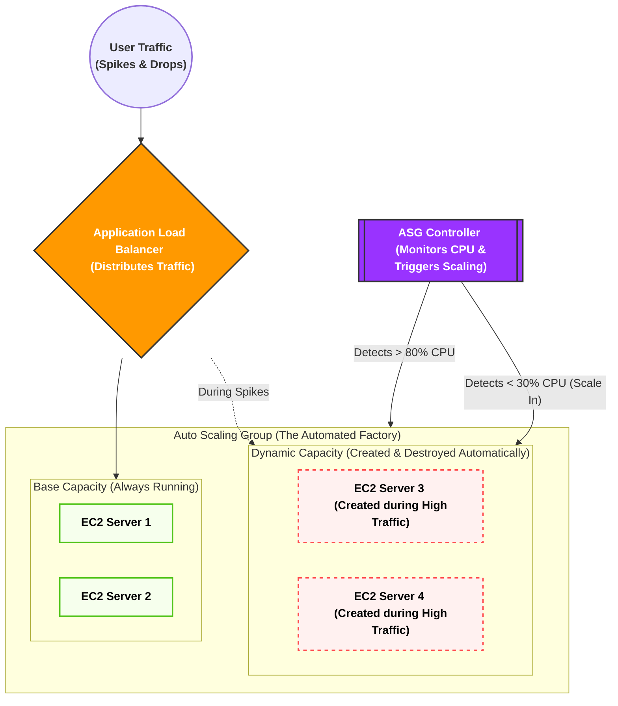

---

جهاز الـ Auto Scaling Group (ASG) عبارة عن "مصنع آلي ذكي". لكن المصنع ده مبيفكرش؛ لو قلتله "اصنعلي سيرفر جديد فوراً"، هيقف عاجز ويسألك: _"أصنع سيرفر إيه؟ إيه نظام التشغيل اللي عليه؟ راماته كام؟ إيه الكود اللي هيشتغل جواه؟ وإيه البوديجارد (Security Group) اللي هيحميه؟"_
عشان كده، مستحيل تشغل الـ ASG من غير ما تديله **مخطط تشغيل** جاهز ومكتوب فيه كل مواصفات السيرفر من الصغير للكبير. المخطط ده في AWS اسمه **Launch Template**.
تعال نفصص مكونات ومصطلحات المخطط ده حتة حتة وبأقصى عمق هندسي:
### 1. تفكيك مصطلح الـ Launch Template والبديل القديم (Template vs Configuration)

في امتحان الـ Cloud Practitioner وفي سوق العمل، هتسمع مصطلحين دايماً:

- **Launch Configuration (القديم - الموقوف):** دي كانت الأسطمبة القديمة في أمازون. عيبها القاتل إنها **غير قابلة للتعديل**. لو عملت أسطمبة واكتشفت إنك نسيت تكتب فيها سطر كود، بتضطر تمسحها وتعمل واحدة جديدة تماماً من الصفر وتغير اسمها، وده كان بيعمل كوابيس في إدارة السيستم. (🚨 أمازون بتنصح بعدم استخدامه تماماً دلوقتي).
    
- **Launch Template (الحديث - المعتمد):** ده المخطط الذكي الحالي. الميزة القاتلة فيه هي الـ **Versioning (التطوير بالإصدارات)**. يعني تقدر تعمل مخطط وتسميه الإصدار رقم 1 (V1). بعد شهر، كود الـ Backend اتحدث، تدخل على نفس المخطط وتعدله وتسميه الإصدار رقم 2 (V2). وتقدر تخلي الـ ASG يشتغل بـ V2، ولو حصلت أي مشكلة، تقوله أوتوماتيك: "ارجع اشتغل بالإصدار القديم V1" في ثانية واحدة (Rollback).
    

### 2. المكونات الخمسة الذهب جدار الـ Launch Template

لما بتيجي تفتح كونسول أمازون وتعمل Launch Template، بتملى 5 خانات رئيسية، وكل خانة وراها مفهوم هندسي عميق:

#### أ. الـ AMI (Amazon Machine Image - صورة نظام التشغيل)

- **معناها الفني:** اختصار لـ "صورة جهاز أمازون الافتراضي". اعتبرها نسخة الويندوز أو اللينكس (الـ ISO الكبيرة) اللي عليها كل حاجة جاهزة.
- **العمق الهندسي:** الـ AMI مش مجرد نظام تشغيل أوبونتو (Ubuntu) فاضي. في الشركات الكبيرة، المهندسين بيعملوا حاجة اسمها **Golden AMI (الصورة الذهبية)**. يعني بيجيبوا سيرفر EC2 عادي، ينزلوا عليه نظام التشغيل، ويسطبوا جواه الـ Web Server (زي Nginx) ويسطبوا جواه كود الـ Backend بتاع الأبلكيشن (Node.js أو Laravel)، وياخدوا "لقطة" أو (Snapshot) من الهارد ديسك ده ويسموها AMI.
- لما الـ ASG ييجي يصنع سيرفر جديد، بياخد الـ AMI دي وينسخها على السيرفر الجديد، فالسيرفر بيتولد وهو جواه الكود والبرامج جاهزة وشغالة فوراً في ثانية واحدة من غير ما يضيع وقت في تحميل حاجة من الإنترنت.

#### ب. الـ Instance Type (نوع وحجم عضلات الخادم)

- **معناها الفني:** هنا بتحدد حجم الـ CPU (المعالج) والـ RAM (الذاكرة العشوائية) للسيرفر اللي هيتولد.
- **العمق الهندسي:** أمازون بتقسم الأجهزة لعائلات بناءً على وظيفتها، وبتتكتب برمز زي `t3.micro` أو `c5.large`. تعال نفك شفرة الاسم ده:
    
    - الحرف الأول (`t` أو `c`) ➔ ده اسم **العائلة**. عائلة `t` دي عائلة اقتصادية ومرنة (Burstable)، وعائلة `c` مخصصة للعمليات الحسابية الثقيلة (Compute Optimized).
    - الرقم الثاني (`3` أو `5`) ➔ ده **الجيل (Generation)** بتاع الأجهزة. (يعني جيل تالت أو جيل خامس، وكل ما الرقم يعلى معناه إن الهاردوير أحدث وأسرع وأرخص في التكلفة).
    - الكلمة الأخيرة (`micro` أو `large`) ➔ ده **الحجم** (عدد الكور في الـ CPU وحجم الرامات). `micro` يعني 1 كور و 1 جيجا رام، و `large` يعني أضعاف كده.
        
- في الـ Launch Template، إنت بتحدد الحجم المناسب للضغط بتاعك (مثلاً بتختار `t3.medium`).
    
#### ج. الـ Key Pair (مفتاح الدخول والتشفير)

- **معناها الفني:** ده ملف الأمان اللي بتنزله على لابتوبك الشخصي عشان تعرف تدخل بيه جوه السيرفر عن طريق الـ Terminal باستخدام بروتوكول الـ **SSH (Secure Shell)**.
    
- **العمق الهندسي:** الـ SSH هو الطريق الآمن للتحكم في السيرفرات عن بُعد بكتابة الأوامر. الـ Key Pair بيشتغل بنظام (Public/Private Key Cryptography). أمازون بتاخد الـ Public Key تزرعه جوه السيرفر وهو بيتولد، وإنت بتشيل الـ Private Key على لابتوبك. لما تيجي تدخل، السيرفر بيطابق المفتاحين مع بعض، لو مظبوطين يفتحلك الباب. إنت بتحدد المفتاح ده جوه الـ Launch Template عشان السيرفرات الجديدة تتولد وهي محمية بنفس المفتاح.
    

#### د. الـ Network Settings & Security Groups (تصاريح الحماية)

- هنا بتحدد الـ Security Group (البوديقارد) اللي اتكلمنا عليه في الدروس اللي فاتت.
    
- بتقول للـ Launch Template: _"أي سيرفر يصنعه الـ ASG بناءً على المخطط ده، لازم تركب على بابه الـ Security Group اللي اسمها (Web-SG) اللي بتسمح بس بمرور بورت 80 و 443 من الـ Load Balancer"_، عشان تضمن إن أي سيرفر جديد ينزل الشبكة يكون محمي فوراً ومفتوح عليه البورتات الصح بس.
    

#### هـ. الـ User Data (بيانات المستخدم - سكربت التشغيل الذاتي الحاسم)

- **معناها الفني:** دي أهم خانة مخفية تحت في الإعدادات المتقدمة (Advanced Details). دي عبارة عن مربع فاضي بتكتب جواه كود أو لغة أوامر (Bash Script) للينكس.
    
- **العمق الهندسي - Bootstrapping (التشغيل الذاتي):** تخيل إنك مش عايز تعمل Golden AMI، وعايز تستخدم نسخة Ubuntu عادية وفاضية خالص من أمازون، بس عايز السيرفر أول ما يتولد يقوم أوتوماتيك مسطب البرامج ومنزل كودك من GitHub ومشغل الأبلكيشن من غير ما تتدخل إنت يدوي.
    
- الكود اللي بتكتبه جوه الـ User Data ده **بيتنفذ مرة واحدة بس في العمر (عند أول قومة للسيرفر - First Boot)**. الـ ASG أول ما يقوم السيرفر، بيقرا الـ User Data وينفذ الأوامر اللي فيها سطر ورا سطر (يحدث السيرفر، ينزل Node.js، يعمل `git clone` لكود مشروعك، ويعمل `npm start`). العملية دي هندسياً اسمها **Bootstrapping**.
    

### 🏗️ مخطط العلاقات الفنية للـ Launch Template (Mermaid)

بص على اللوحة دي بتوضح إزاي الـ Launch Template بيجمع كل المكونات دي في "كتالوج واحد"، وإزاي الـ ASG بيقراه عشان يفرخ سيرفرات EC2 متطابقة:


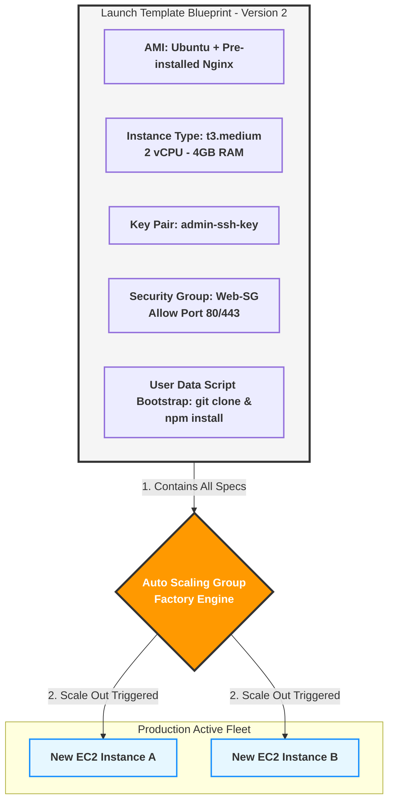

### 📊 المقارنة الحاسمة السريعة (تثبيت الفكرة):

- **الـ AMI:** هي **الهارد ديسك المقفول** بنظام تشغيله بكوده (ملف جامد).
- **الـ User Data:** هو **أمر حركي (Script)** بيتنفذ على السيرفر الفاضي عشان يجهزه وهو بيقوم.
- **الـ Launch Template:** هو **الملف الإداري الكلي** اللي بيجمع الـ AMI والـ User Data والحجم والمفاتيح مع بعض في مكان واحد مدعوم بالإصدارات (Versions).

---

إحنا متفقين إن الـ Auto Scaling Group (ASG) هو مصنع ذكي بيصنع سيرفرات بناءً على الـ Launch Template. لكن المصنع ده مبيشتغلش بمزاجه؛ لازم المهندس (حضرتك) تحطله **"حدود آمنة" (Boundaries)** يشتغل جواها. لو سبته من غير حدود، ممكن يخلق مليون سيرفر ويفلس الشركة!

عشان كده، الـ ASG بيعتمد على 3 أرقام جوهرية بيمثلوا "دستور التشغيل". تعال نفصصهم بالعمق المعماري:

### 1. الـ Minimum Capacity (الحد الأدنى - خط الدفاع الأخير)

- **المعنى الفني:** ده أقل عدد من السيرفرات المسموح إنها تكون شغالة في أي لحظة، مهما كان الترافيك قليل أو حتى لو مفيش ولا يوزر على الموقع.
    
- **العمق الهندسي (High Availability):** ليه مش بنخلي الرقم ده (صفر) بالليل مثلاً عشان نوفر فلوس؟
    
    في أنظمة الـ Production، إحنا دايماً بنخلي الـ Minimum على الأقل **(2)**. وبنحط سيرفر في Availability Zone (A) وسيرفر تاني في Availability Zone (B).
    
    السبب: لو حطينا الحد الأدنى (1)، والداتا سنتر دي ولعت أو النور قطع فيها، الموقع هيقع لحد ما الـ ASG يكتشف ويعمل سيرفر جديد. لكن لو الحد الأدنى (2) في مكانين مختلفين، لو داتا سنتر باظت، التانية شايلة الشغل والموقع مبيقعش ولا ثانية. الـ ASG هنا وظيفته يقاتل عشان الرقم ده ماينزلش أبداً.
    

### 2. الـ Maximum Capacity (الحد الأقصى - فرامل التكلفة)

- **المعنى الفني:** ده سقف المصنع. أقصى عدد من السيرفرات الـ ASG يقدر يخلقه حتى لو الضغط وصل لملايين الريكويستات.
    
- **العمق الهندسي (Cost Control & Budgeting):** دي "الفرامل" اللي بتحمي ميزانية الشركة. تخيل إنك بتتعرض لهجوم إلكتروني (DDoS Attack) وناس بتبعت ريكويستات وهمية عشان توقع السيرفر. لو الـ Max مفتوح، الـ ASG هيفتكر إن ده ضغط حقيقي وهيفضل يخلق سيرفرات لحد ما فاتورة أمازون تجيلك بملايين الدولارات! إحنا بنحط الـ Max بناءً على حسبة هندسية دقيقة للميزانية، مثلاً (10 سيرفرات كحد أقصى)، بحيث لو وصلنا للرقم ده، الـ ASG يتوقف عن البناء مهما حصل.
    

### 3. الـ Desired Capacity (السعة المطلوبة حالياً - مؤشر التشغيل)

- **المعنى الفني:** ده العدد "الفعلي" للسيرفرات اللي شغالة **دلوقتي حالا** على أرض الواقع.
    
- **العمق الهندسي (The Moving Target):** الرقم ده عامل زي "مؤشر الحرارة" في التكييف. هو الرقم الوحيد اللي بيتحرك أوتوماتيك طالع نازل بين الـ Min والـ Max بناءً على الزحمة.
    
- **قاعدة ذهبية:** الـ Desired Capacity مستحيل ينزل تحت الـ Min، ومستحيل يطلع فوق الـ Max.
    

### 🧠 سيناريو هندسي (إزاي التلاتة بيشتغلوا مع بعض في الكواليس؟)

تخيل إننا ضبطنا الأرقام كده: `Min = 2`, `Desired = 2`, `Max = 10`.

1. **الساعة 3 الفجر (الهدوء التام):**
    
    - الزباين نايمة. استهلاك الـ CPU بتاع السيرفرين (10%).
        
    - الـ ASG عايز يقلل العدد، بس بيبص يلاقي `Min = 2` وهو عنده `Desired = 2`، فبيقول: "أنا واصل للحد الأدنى، مش هقدر أمسح حاجة".
        
2. **الساعة 12 الظهر (حملة إعلانية انفجرت):**
    
    - الضغط زاد جداً. الـ ASG قرر يزود سيرفرين كمان.
        
    - بيقوم رافع مؤشر الـ `Desired` يخليه (4). في نفس اللحظة المصنع بيشتغل ويخلق سيرفرين جداد.
        
3. **الساعة 8 بالليل (الكارثة / الذروة القصوى):**
    
    - الضغط مستمر، الـ ASG رفع الـ `Desired` لـ 6، ثم 8، ثم وصل للرقم المرعب **10**.
        
    - الزباين لسه بتدخل، والـ ASG عايز يخلي الـ `Desired` يبقى 12.. بس هنا بيصطدم بالحيطة: `Max = 10`.
        
    - الـ ASG بيوقف بناء تماماً ويقول: "أنا وصلت للسقف اللي المهندس حددهولي عشان الميزانية، مش هقدر أصنع سيرفرات تاني".
        

### 🏗️ لوحة حدود السعة المعمارية (Mermaid)

بص على الرسمة دي بتوضح إزاي الـ Desired بيتحرك بحرية في المساحة اللي بين الأرض والسقف:


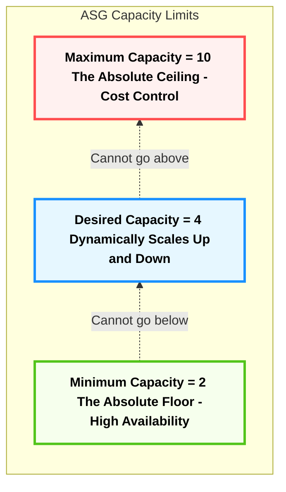

---

إحنا جهزنا المصنع (Launch Template) وحطينا له سقف وأرضية (Min & Max). لكن الـ ASG في حد ذاته "أعمى"؛ مبيعرفش إذا كان السيرفر مضغوط ولا مرتاح.
عشان السيستم يشتغل أوتوماتيك، لازم نركب "عقل ورادار" يراقب، و"سياسة" (قانون) ياخد بناءً عليها قرار الزيادة أو النقصان.
تعال نفصص الرادار والـ 3 سياسات (عقول) اللي بيحركوا الـ ASG في كواليس أمازون:
### 1. الرادار السري: Amazon CloudWatch (العين الساهرة)

الـ ASG مبيراقبش السيرفرات بنفسه، بيعتمد على خدمة تانية في أمازون اسمها **CloudWatch**.
- الـ CloudWatch ده عامل زي "جهاز رسم القلب". بيفضل يقيس نبض السيرفرات كل دقيقة (بيسجل استهلاك الـ CPU، والرامات، وحجم الداتا اللي داخلة واللي طالعة).
- إحنا بنعمل جواه حاجة اسمها **Alarm (إنذار)**. بنقوله: _"يا CloudWatch، لو لقيت متوسط الـ CPU بتاع كل السيرفرات عدى 70% لمدة 3 دقايق، اضرب سرينة وبلغ الـ ASG فوراً!"_.
- الـ ASG بيسمع السرينة دي، ويفتح الدرج يشوف "السياسة" اللي المهندس كاتبها، وينفذها.

### 2. العقل الأول: Target Tracking Scaling (الطيار الآلي - الأذكى والأشهر)

دي السياسة المفضلة في 90% من المشاريع الحقيقية، لأنها بتشتغل زي **تكييف الهواء الأوتوماتيك (Thermostat)**.

- **إزاي بتفكر؟** إنت بتحدد للـ ASG "هدف" (Target) وتقوله: "أنا عايز متوسط الـ CPU بتاع كل السيرفرات يفضل دايماً عند 50%".
- **التصرف الآلي:** * لو الترافيك زاد والـ CPU وصل 80% ➔ الـ ASG هيحسب أوتوماتيك حسبة رياضية معقدة ويقول: "عشان أرجع الـ 80% دي لـ 50%، أنا محتاج أخلق 4 سيرفرات حالاً".. ويخلقهم.
    - لو الترافيك قل والـ CPU نزل لـ 20% ➔ الـ ASG هيحسب ويقول: "أنا عندي سيرفرات شغالة عالفاضي، همسح 3 منهم عشان أرجع للـ 50% وأوفر فلوس".
- **الميزة:** إنت مابتشغلش دماغك بكام سيرفر يتخلق، إنت بتحط الهدف وهو بيضبط العدد لوحده بالملي.
    

### 3. العقل الثاني: Step Scaling (سياسة السلالم التصاعدية - للطوارئ الانفجارية)

السياسة دي بنستخدمها لو الترافيك بتاعنا "مجنون" وبيعمل طفرات مفاجئة جداً (زي أوقات البلاك فرايداي). هنا إنت مابتسيبش الـ ASG يحسب لوحده، إنت بتحطله **جدول خطوات صارم**

- **إزاي بتفكر؟**
    
    - **الخطوة الأولى:** لو الـ CPU بين 70% و 80% ➔ ضيف (1) سيرفر.
        
    - **الخطوة الثانية:** لو الـ CPU بين 80% و 90% ➔ ضيف (3) سيرفرات دفعة واحدة.
        
    - **الخطوة الثالثة:** لو الـ CPU عدى 90% ➔ ضيف (5) سيرفرات فوراً (حالة طوارئ قصوى)!
        
- **الميزة:** بتديك تحكم دقيق جداً كمهندس، وبتقدر تصد الهجمات أو الزيارات المفاجئة بشكل أسرع وأعنف من الطيار الآلي.
    

### 4. العقل الثالث: Predictive Scaling (التنبؤ بالذكاء الاصطناعي - قراءة المستقبل)

ده السحر الحقيقي بتاع AWS.
تخيل إنك عندك موقع بيذيع ماتشات كورة، والضغط دايماً بيضرب في السما يوم الجمعة الساعة 8 بالليل.
- **المشكلة القديمة:** الـ ASG العادي هيستنى لما الساعة تيجي 8، والزباين تدخل، والـ CPU يعلى، وبعدين **يبدأ يصنع** سيرفرات (والتصنيع بياخد من دقيقتين لـ 5 دقايق، ففي الوقت ده ممكن الموقع يبطأ شوية).
    
- **الحل بالـ Predictive:** أمازون بتسلط موديل ذكاء اصطناعي (Machine Learning) يراقب الموقع بتاعك لمدة أسبوعين، فيتعلم النمط (Pattern) بتاع زباينك.
    
- ييجي يوم الجمعة، الموديل يقول للـ ASG: _"اسمع، أنا متنبأ إن كمان نص ساعة هيحصل انفجار زوار.. متستناش! اخلق 5 سيرفرات دلوقتي حالا وخليهم جاهزين وسخنين"_. تيجي الساعة 8، الزباين تدخل تلاقي السيرفرات مستنياهم والموقع طلقة!

### 🏗️ خريطة قرار الـ ASG (Mermaid)

بص الخريطة دي بتوضح دورة حياة القرار، من أول ما اليوزر يدخل لحد ما السيرفر يتخلق:


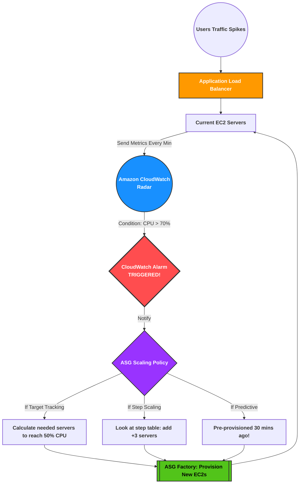
---

عشان تبني سيستم مستقر جوه أمازون، لازم تفهم إن الـ Auto Scaling Group بيُدار بقوتين مختلفتين تماماً بيشتغلوا مع بعض في نفس اللحظة. الفكرة كلها إنك تفصل في دماغك بين "القواعد الصارمة" اللي بتحمي السيستم، وبين "العقول الذكية" اللي بتاخد القرارات.

تعال نفصصها ونعمل مقارنة هندسية تظبط اللقطة دي تماماً:

### أولاً: الدستور الحاكم (Capacity Limits)

دول عبارة عن "الحواجز الخرسانية" أو القواعد اللي مستحيل أي حد يكسرها تحت أي ظرف. وظيفتهم الأساسية يحموا السيستم من إنه يقع، ويحموا جيب العميل أو فيزا الشركة من الإفلاس.

- **الـ Min Capacity (الأرضية):** ده خط الدفاع الأول. بيضمن إن دايماً فيه عدد معين من السيرفرات شغال (مثلاً سيرفرين) عشان الموقع ميقعش أبداً (High Availability). الـ ASG مستحيل يمسح سيرفرات لو العدد وصل للرقم ده.
    
- **الـ Max Capacity (السقف):** دي فرامل الطوارئ. بتمنع الـ ASG إنه يخلق سيرفرات تتخطى الرقم ده، حتى لو الموقع عليه ملايين الزيارات. الهدف هنا هو حماية الميزانية (Cost Control).
    
- **الـ Desired Capacity (الرقم الفعلي):** ده مؤشر السيرفرات اللي شغالة دلوقتي حالا. ده الرقم الوحيد اللي بيزيد ويقل، بس دايماً محبوس ومزنوق بين أرضية الـ Min وسقف الـ Max.
    

### ثانياً: العقول المدبرة (Scaling Policies)

دول بقى "المديرين التنفيذيين" (زي الـ Target Tracking والـ Step Scaling). وظيفتهم إنهم يراقبوا الزحمة وياخدوا قرارات سريعة بالزيادة أو النقصان.

- المديرين دول **ملهمش سلطة مطلقة**. هما مجرد بيطلعوا "توصية أو طلب" بتغيير رقم الـ (Desired).
    
- أي طلب بيطلع من المديرين دول، لازم يتعرض الأول على (الدستور الحاكم) عشان يوافق عليه أو يرفضه أو يقصه!
    

### ثالثاً: ميكانيكا اتخاذ القرار (لما المدير يخبط في الدستور)

عشان المعمارية توضح، تعال نشوف سيناريوهين بيورونا إزاي السياسات بتتفلتر غصب عنها:

**السيناريو الأول: اصطدام الـ Step Scaling مع السقف (Max)**

- **إعدادات الدستور:** `Min = 2` ، `Max = 10` ، `Desired = 8`.
    
- **سياسة المدير:** Step Scaling بتقول (لو الـ CPU عدى 90%، ضيف 5 سيرفرات فوراً).
    
- **لحظة الانفجار:** حصل هجوم على الموقع، والـ CPU ضرب 95%.
    
- **التنفيذ المعماري:**
    
    1. السياسة بتبعت طلب للـ ASG: _"أنا عايز أضيف 5 سيرفرات على الـ 8 اللي شغالين، خليلي الـ Desired يبقى 13"_.
        
    2. محرك الـ ASG بيبص في الدستور، بيلاقي إن السقف `Max = 10`.
        
    3. **القرار الحاسم:** الـ ASG بيرفض طلب السياسة وبيرد يقول: _"طلبك مرفوض، أنا آخري أضيفلك (2) سيرفر بس عشان أقفل السقف بتاعي (10)، ومش هصنع سيرفرات تاني مهما حصل"_.
        
        _(هنا الـ Max هو اللي أنقذ الميزانية من طلب الـ Step Scaling المبالغ فيه)._
        

**السيناريو الثاني: اصطدام الـ Target Tracking مع الأرضية (Min)**

- **إعدادات الدستور:** `Min = 4` ، `Max = 20` ، `Desired = 4`.
    
- **سياسة المدير:** Target Tracking بتقول (حافظ على الـ CPU عند 50%).
    
- **لحظة الهدوء:** مفيش زباين خالص، والـ CPU نزل لـ 10%.
    
- **التنفيذ المعماري:**
    
    1. السياسة بتحسبها وتطلب: _"عشان أرفع الـ CPU لـ 50%، أنا محتاج أمسح 3 سيرفرات، خليلي الـ Desired يبقى 1 بس"_.
        
    2. محرك الـ ASG بيبص في الدستور، يكتشف إن الأرضية `Min = 4`.
        
    3. **القرار الحاسم:** الـ ASG بيرفض المسح تماماً، وبيقول: _"ممنوع! أنا لازم أحافظ على الـ 4 سيرفرات شغالين عشان السيستم ميبقاش في خطر"_.
        

### رابعاً: جدول المقارنة المعمارية (الخلاصة)

|**وجه المقارنة**|**الدستور الحاكم (Capacity Limits)**|**المديرين (Scaling Policies)**|
|---|---|---|
|**الدور الهندسي**|بيحط إطار الأمان وحواجز الميزانية اللي بتحمي السيستم.|بيراقب السيستم وبياخد قرارات التمدد والانكماش حسب الزحمة.|
|**القوة والتحكم**|**سلطة مطلقة (Veto).** يقدر يرفض أو يقص أي قرار.|**سلطة مقيدة.** بيقترح بس، وميقدرش يكسر الحواجز.|
|**الأمثلة**|Min, Max, Desired.|Target Tracking, Step Scaling, Predictive.|
|**بيحصل إيه وقت التعارض؟**|الدستور (الحدود) هو اللي بيكسب دايماً وتمشي كلمته.|طلب السياسة بيتقص ويتحجم غصب عنه عشان يناسب الحدود.|

### 🏗️ خريطة فلترة القرارات (Mermaid)


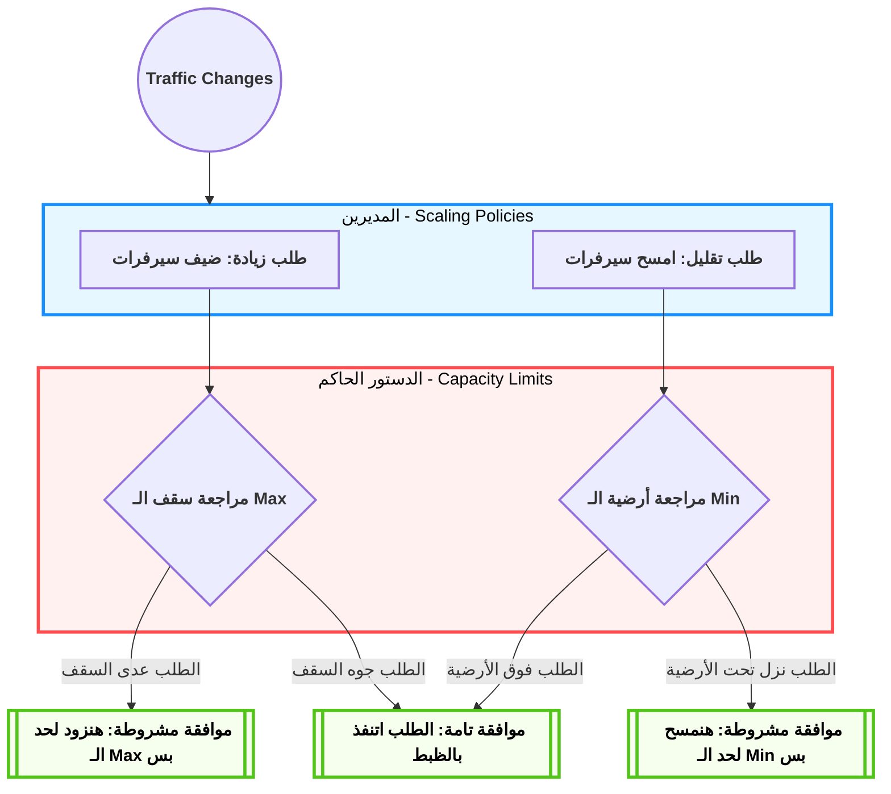

---

في الرسائل اللي فاتت، شفنا الـ ASG كأنه "مصنع" بيبني سيرفرات عشان يصد الترافيك. لكن في الحقيقة، الـ ASG ليه دور تاني أعظم بكتير: هو **"طبيب جراح سفاح"**! مبيسمحش لأي سيرفر مريض إنه يفضل في الخدمة ثانية واحدة، بيقتله فوراً ويجيب غيره. السياسة دي في هندسة السحابة بنسميها **(Cattle, not Pets)** يعني السيرفرات بالنسبة لنا قطيع مواشي، لو واحد مرض بندبحه ونجيب غيره، مش حيوان أليف هنقعد نعالجه!

عشان الـ ASG يعرف مين المريض ومين السليم، بيعتمد على نبضات الفحص (Health Checks). تعال نفصصها لآخر مستوى:

### 1. أنواع فحوصات النبض (ASG Health Checks)

الـ ASG بيقدر يسمع نبض السيرفرات عن طريق نوعين من الفحوصات، واختيارك بينهم بيحدد مدى ذكاء السيستم بتاعك:

#### أ. فحص الـ EC2 (الفحص الافتراضي - EC2 Status Checks)

- **معناه الفني:** ده الفحص البدائي اللي بييجي متفعل لوحده. الـ ASG بيكلم الهاردوير بتاع أمازون يسأله: _"هل السيرفر ده واصله كهربا وشغال؟ وهل كارت الشبكة بتاعه بيستقبل داتا؟"_
    
- **العيب القاتل (The Architectural Trap):** الفحص ده أعمى عن "الكود بتاعك". تخيل إن السيرفر شغال وزي الفل (هاردوير)، لكن كود الـ Node.js أو الـ Laravel اللي جواه ضرب Error 500 ووقع (سوفت وير). فحص الـ EC2 هيقول للـ ASG: "السيرفر ده سليم 100% الهاردوير بتاعه شغال!"، والـ ASG هيفضل سايبه في الخدمة، واليوزرز يدخلوا يلاقوا الموقع واقع!
    

#### ب. فحص الـ ELB (الفحص الذكي العميق - ELB Health Checks)

- **معناه الفني:** هنا إنت بتقول للـ ASG: _"ماتعتمدش على فحص الهاردوير، اعتمد على كلام مدير المطعم (الـ Load Balancer)"_.
    
- **إزاي بيشتغل؟** الـ Load Balancer زي ما شرحنا قبل كده بيبعت ريكويست حقيقي (HTTP Request) للصفحة الرئيسية بتاعتك كل 10 ثواني. لو كود الـ Backend ماردش بـ `HTTP 200 OK`، الـ Load Balancer هيعتبره مريض (Unhealthy).
    
- **الشفاء الذاتي (Self-Healing):** أول ما الـ Load Balancer يعلم على السيرفر بـ `Unhealthy`، بيبلغ الـ ASG فوراً. الـ ASG بدون أي رحمة بيعمل حاجتين:
    
    1. يقتل السيرفر المريض ده تماماً (Terminates the instance).
        
    2. يخلق سيرفر جديد مكانه تماماً من الـ Launch Template عشان يعوض النقص ويحافظ على الـ Desired Capacity.
        
- **قاعدة ذهبية:** لو الـ ASG بتاعك وراه Load Balancer، **لازم وحتماً** تفعل خيار `Turn on ELB Health Checks`، وإلا السيستم بتاعك هيكون فيه ثغرة غبية جداً.
    

### 2. فترة السماح (Health Check Grace Period)

- **المشكلة:** لما الـ ASG بيخلق سيرفر جديد، السيرفر ده بياخد وقت عشان يقوم (يحمل نظام التشغيل، وينزل الكود، ويسطب البرامج من الـ User Data). لو الـ ASG بدأ يعمل Health Check والسيرفر لسه بيسطب البرامج، السيرفر هيفشل في الفحص، والـ ASG هيفتكره مريض ويقتله، ويخلق غيره، ويقتله، وندخل في حلقة مفرغة (Infinite Loop).
    
- **الحل الفني:** أمازون عملت مصطلح اسمه **Grace Period (فترة السماح)**. ده تايمر (مثلاً 300 ثانية). إنت بتقول للـ ASG: _"لما تولد سيرفر جديد، غمض عينك عنه ووقف الفحص لمدة 5 دقايق لحد ما يخلص تسطيب براحته، وبعد الـ 5 دقايق ابدأ راقبه"_.
    

### 3. خطافات دورة الحياة (Lifecycle Hooks - مستوى المهندسين الخبراء)

هنا بنعلى بالـ Architecture لمستوى الـ Enterprise.

في المشاريع المعقدة، إحنا محتاجين نوقف الزمن! الـ ASG بطبيعته سريع جداً؛ بيخلق السيرفر ويرميه للزباين، أو يقتله ويمسحه في ثانية. أحياناً السرعة دي بتعملنا كوارث.

**مصطلح الـ Lifecycle Hook (خطاف دورة الحياة):** هو "زرار إيقاف مؤقت" (Pause Button). بيخليك تمسك السيرفر وتوقفه في مرحلة معينة قبل ما يدخل الخدمة أو قبل ما يموت، عشان تلحق تنفذ أوامر معينة.

وليه نوعين جوهريين:

#### أ. خطاف البداية (Pending:Wait)

- **السيناريو:** السيرفر اتولد (Pending)، بس الكود بتاعك محتاج ينزل موديل ذكاء اصطناعي حجمه 50 جيجا من الـ S3، وده بياخد 15 دقيقة. لو الـ ASG خلى السيرفر (InService) ودخله زباين، الزباين هتشوف إيرور لأن الموديل لسه مانزلش.
    
- **الحل:** بنعمل Hook يخلي حالة السيرفر `Pending:Wait` (معلق وموقوف). السيرفر ينزل الـ 50 جيجا براحته، ولما يخلص، يبعت رسالة للـ ASG يقوله: _"أنا خلصت، كمل العملية"_ (الرسالة دي اسمها `CompleteLifecycleAction`). ساعتها الـ ASG يغير حالته لـ `InService` ويدخله للـ Load Balancer.
    

#### ب. خطاف النهاية (Terminating:Wait)

- **السيناريو:** الضغط قل، والـ ASG قرر يقتل سيرفر عشان يوفر فلوس. بس الكارثة إن السيرفر ده في اللحظة دي بيعالج "دفعات مالية" لـ 10 زباين أو جواه ملفات Log (سجلات) لسه ماترفعتش. لو الـ ASG قتله فجأة، الداتا هتضيع والزباين هتخسر فلوسها!
    
- **الحل:** بنعمل Hook يخلي حالة السيرفر `Terminating:Wait` (محتضر بس لسه عايش). السيرفر بياخد فرصة (مثلاً ساعة) يخلص فيها معالجة الفلوس، ويرفع الـ Logs بتاعته على الـ S3، وبعد ما يخلص يبعت للـ ASG يقوله: _"أنا جاهز أموت دلوقتي"_. فيقوم الـ ASG مكمل عملية القتل بأمان تام (Terminated).
    

### 🏗️ خريطة دورة حياة السيرفر (Mermaid)

بص على اللوحة دي بتوضح رحلة السيرفر من الولادة للموت، ومكان الـ Hooks بتعترض الرحلة دي فين (أكواد سادة بدون أي تعقيد عشان تظهر معاك بوضوح):


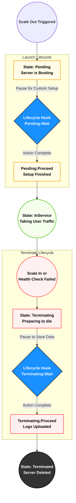


---