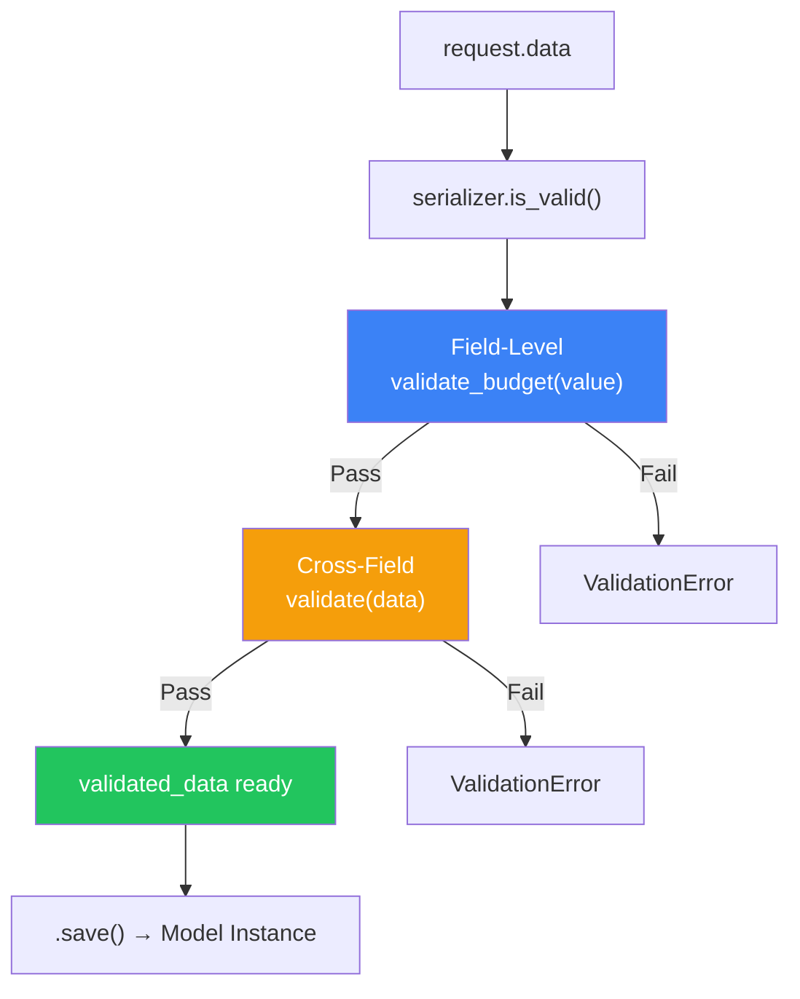
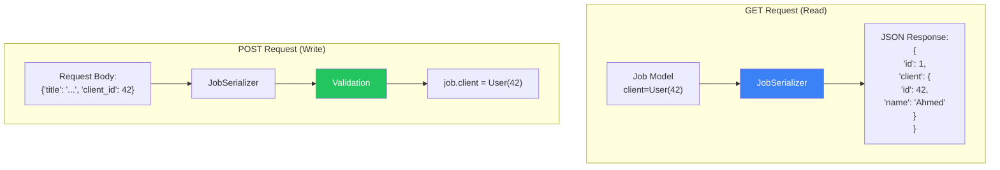
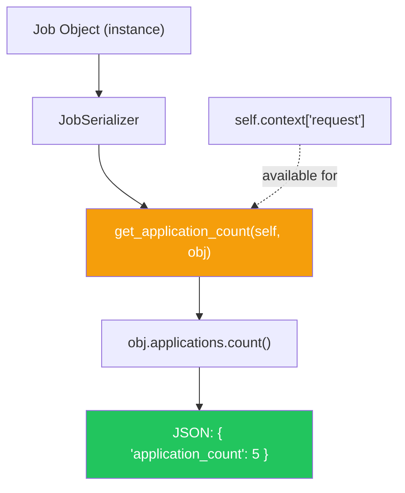
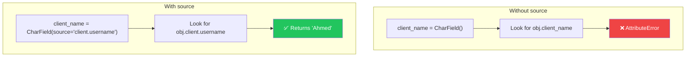
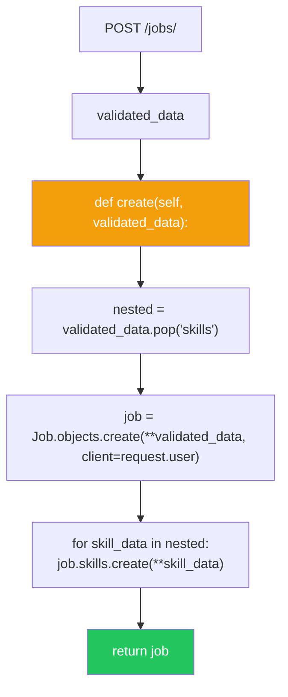

# الفصل الثاني عشر — DRF Serializers: "المترجم الفوري" بين Python والـ JSON

> **المتطلبات:** [[11-DRF-Fundamentals]] — لازم تكون فاهم إزاي DRF بتدير الـ Request/Response lifecycle، وفاهم الفرق بين `APIView` و `View`، وعارف أساسيات الـ Serializers (الفرق بين `Serializer` و `ModelSerializer`). الفصل ده هياخدك جوا أعماق الـ Serializers عشان تفهم إزاي تتحكم في كل تفصيلة.

---

## البداية — مشكلة البيانات اللي مش متطابقة

تخيّل معايا في HireLink: الـ `Job` Model عنده `client` (ForeignKey لـ `User`). لما ترجع list بالـ jobs في الـ API، مش عايز ترجع `"client": 42` (الـ ID بس). عايز ترجع `"client": {"id": 42, "name": "Ahmed", "avatar": "..."}`.

وفي نفس الوقت، لما الـ client يبعت POST request عشان يعمل Job جديد، هو مش هيرجع الـ client object كله — هو هيبعت `"client": 42`. الـ Serializer محتاج يتعامل مع الحالتين: **قراءة** (Nested data) و **كتابة** (Primary Key).

المشكلة التانية: Validation. مين يتأكد إن `budget` موجبة؟ مين يتأكد إن `title` مش موجود قبل كده لنفس الـ client؟ مين يمنع إن الـ client يغيّر `client` field في update؟

الـ Serializer هو "المترجم الفوري" بين عالم Python (Models, Objects) وعالم JSON (Primitives, Dicts). وعلشان يكون مترجم شاطر، محتاج قواعد واضحة للترجمة — وده اللي هنغطيه النهارده.

---

## [[01-Serializer-Validation]] — Validation: من الـ Field لـ Object

### 🧠 الشرح النظري

الـ Serializer في DRF مش مجرد "بيحول Model لـ JSON". هو **Validator** قوي جداً. الـ validation بيحصل على ٣ مستويات — من الأصغر للأكبر — وكل مستوى ليه استخدامه.

**المستوى 1: Field-Level Validation**
ده validation على field واحد فقط. بتعمله عن طريق كتابة method اسمها `validate_<field_name>`. المethod دي بتاخد قيمة الـ field وترجع القيمة بعد التعديل (أو ترفع `ValidationError`). مثال: `validate_budget(self, value)` تتأكد إن `value > 0`.

**المستوى 2: Cross-Field Validation**
ده validation محتاج يقارن أكتر من field مع بعض. مثال: `min_budget` و `max_budget` — محتاج تتأكد إن `min_budget <= max_budget`. بتعمله في `validate(self, data)` method. الـ `data` dictionary بيمثل كل الـ fields اللي المستخدم باعتها.

**المستوى 3: Object-Level Validation**
ده validation محتاج يدور في الـ database أو يعرف context إضافي. مثال: تتأكد إن `title` مش موجود لنفس الـ client قبل كده. محتاج `client_id` (اللي في الـ view) وده بيوصل لـ serializer عن طريق `self.context['request']`. برضه في `validate(self, data)`.

**الـ Validation Flow:**
لما بتعمل `serializer.is_valid()`، DRF بتنادي:
1. `to_internal_value(data)` — بتحول الـ JSON primitive لـ Python types.
2. لكل field: `validate_<field_name>(value)` (لو موجودة).
3. لكل field: الـ `validate()` method بتاعة الـ Field class (زي `CharField.validate()`).
4. `validate(data)` — الـ cross-field و object-level validation.
5. لو كله ناجح، `serializer.validated_data` بيتحط.

تخيّل الـ Validation زي **نظام أمني متعدد الطبقات**:
- **Field-Level:** البواب على باب العمارة — بيتأكد إن اللي داخل معاه بطاقة (value موجودة ونوعها صح).
- **Cross-Field:** الأمن في الأسانسير — بيتأكد إن اللي داخل الدور ده مسموح له يكون في الأدوار اللي فوقه (الحقول متناسقة).
- **Object-Level:** رجل الأمن في الشقة — بيتأكد من قاعدة بيانات السكان (لا يوجد تعارض مع سكان تانيين).

### 📊 Visualization



### 💻 Micro-Example

```python
from rest_framework import serializers
from .models import Job

class JobSerializer(serializers.ModelSerializer):
    class Meta:
        model = Job
        fields = ['id', 'title', 'budget', 'min_budget', 'max_budget', 'client']
        read_only_fields = ['client']  # Client is set from request.user, not input

    # Level 1: Field-level validation
    def validate_budget(self, value):
        if value <= 0:
            raise serializers.ValidationError("Budget must be positive")
        return value

    # Level 2 & 3: Cross-field and Object-level validation
    def validate(self, data):
        # Cross-field: min_budget <= max_budget
        if 'min_budget' in data and 'max_budget' in data:
            if data['min_budget'] > data['max_budget']:
                raise serializers.ValidationError(
                    "Minimum budget cannot exceed maximum budget"
                )
        
        # Object-level: Title unique per client
        request = self.context.get('request')
        if request and request.method == 'POST':
            client = request.user
            title = data.get('title')
            if Job.objects.filter(client=client, title=title).exists():
                raise serializers.ValidationError(
                    "You already have a job with this title"
                )
        
        return data
```

---

## [[02-Nested-Serializers]] — التعامل مع الـ Relationships: قراءة وكتابة

### 🧠 الشرح النظري

الـ Models الناجحة دايمًا فيها Relationships. الـ `Job` عنده `client` (ForeignKey)، وعنده `skills` (ManyToMany)، وعنده `applications` (Reverse ForeignKey). إزاي تمثلهم في الـ API؟

**القراءة (Serialization — GET):**
- **Primary Key:** `"client": 42` — أبسط حاجة. الـ client بيمثل بـ ID.
- **Nested Serializer:** `"client": {"id": 42, "name": "Ahmed", "email": "..."}` — بترجع الـ object كله. ده الأكثر استخداماً في الـ frontend عشان يوفر requests زيادة.
- **Hyperlinked:** `"client": "http://api.hirelink.com/users/42/"` — بترجع URL للـ resource. ده أسلوب RESTful بحت.

**الكتابة (Deserialization — POST/PUT):**
- **Primary Key:** الـ client بيبعت `"client": 42`. الـ Serializer بيتأكد إن الـ ID موجود في الـ database ويحطه في الـ relationship. ده الأسهل والأكثر استخداماً.
- **Nested Write:** الـ client بيبعت `"client": {"name": "Ahmed"}`. الـ Serializer يعمل client جديد أو يعدل الموجود. ده صعب ومحتاج كتابة `create()` و `update()` methods يدوياً.

**المشكلة:** نفس الـ field (`client`) محتاج سلوك مختلف في القراءة (Nested) والكتابة (Primary Key). الحل هو إنك تعمل Serializers منفصلة للقراءة والكتابة، أو تستخدم `PrimaryKeyRelatedField` مع `read_only=True` وتمرر الـ client من الـ view.

**القاعدة الذهبية:**
- **للقراءة:** استخدم Nested Serializers. الـ frontend بيحبهم.
- **للـ OneToOne/ForeignKey كتابة:** استخدم `PrimaryKeyRelatedField` أو حط الـ ID في الـ URL مش في الـ payload (`/jobs/?client=42`).
- **للـ ManyToMany كتابة:** استخدم `PrimaryKeyRelatedField(many=True)`.

تخيّل Nested Serializers زي **تقرير مفصل عن موظف**:
- **Primary Key:** رقم الموظف (٤٢) — بيديك المعلومة الأساسية بس.
- **Nested Serializer:** الملف الكامل للموظف (اسمه، صورته، قسمه، مديره). القراءة غنية بالمعلومات.
- **الكتابة بـ Nested:** إنك تبعت الملف الكامل عشان تغير رقم تليفونه — صعب وزيادة. الأسهل تبعت رقم الموظف والمعلومة الجديدة بس.

### 📊 Visualization



### 💻 Micro-Example

```python
from rest_framework import serializers
from .models import Job, Skill

# Serializer for nested reading
class ClientSerializer(serializers.ModelSerializer):
    class Meta:
        model = User
        fields = ['id', 'username', 'email', 'avatar']

class SkillSerializer(serializers.ModelSerializer):
    class Meta:
        model = Skill
        fields = ['id', 'name']

# Main Job Serializer
class JobSerializer(serializers.ModelSerializer):
    # Nested read — full object in GET
    client = ClientSerializer(read_only=True)
    skills = SkillSerializer(many=True, read_only=True)
    
    # Flat write — accept primary key in POST/PUT
    client_id = serializers.PrimaryKeyRelatedField(
        queryset=User.objects.all(),
        source='client',
        write_only=True
    )
    skill_ids = serializers.PrimaryKeyRelatedField(
        queryset=Skill.objects.all(),
        many=True,
        source='skills',
        write_only=True
    )
    
    class Meta:
        model = Job
        fields = ['id', 'title', 'budget', 'client', 'client_id', 
                  'skills', 'skill_ids', 'created_at']
        read_only_fields = ['created_at']
```

---

## [[03-SerializerMethodField]] — حقول مش موجودة في الـ Model

### 🧠 الشرح النظري

الـ API مش دايمًا مراية للـ Model. أحياناً عايز ترجع بيانات **محسوبة (Computed)** أو **مركبة (Derived)**. مثال:
- عدد الـ applications على Job معينة (`application_count`).
- هل الـ user الحالي متقدم على الـ job دي (`has_applied`).
- الـ full name للمستخدم (`full_name` من `first_name` و `last_name`).

الحل: **`SerializerMethodField`**. ده field بيدي قيمة بيرجعها **method** في الـ serializer. المethod اسمها `get_<field_name>` وبتاخد `self` و `obj` (الـ object اللي بيتم serialize) وترجع أي حاجة (dict, list, string, int).

**إزاي بيشتغل؟**
1. بتعرف field: `application_count = serializers.SerializerMethodField()`.
2. بتكتب method: `def get_application_count(self, obj): return obj.applications.count()`.
3. DRF بتنادي المethod دي لكل object وترجع القيمة في الـ JSON.

**المميزات:**
- مرونة مطلقة — تقدر ترجع أي حاجة.
- تقدر توصل لـ `self.context['request']` عشان تعمل logic معتمد على الـ user الحالي (زي `has_applied`).

**العيوب:**
- الـ method بتتنادى **لكل object على حدة**. لو الـ queryset كبير، ده ممكن يسبب N+1 Query Problem. لازم تستخدم `prefetch_related` أو `annotate` في الـ view.

تخيّل `SerializerMethodField` زي **حقل "إجمالي الفاتورة"** في invoice. هو مش مخزن في الـ database — بيتحسب كل مرة (الكمية × السعر). الـ serializer هو الكاشير — بيسأل الـ method "إيه الإجمالي؟" ويرد.

### 📊 Visualization



### 💻 Micro-Example

```python
from rest_framework import serializers
from .models import Job

class JobSerializer(serializers.ModelSerializer):
    # Computed fields
    application_count = serializers.SerializerMethodField()
    has_applied = serializers.SerializerMethodField()
    full_title = serializers.SerializerMethodField()
    
    class Meta:
        model = Job
        fields = ['id', 'title', 'budget', 'application_count', 
                  'has_applied', 'full_title', 'created_at']
    
    def get_application_count(self, obj):
        # obj is the Job instance
        return obj.applications.count()
    
    def get_has_applied(self, obj):
        request = self.context.get('request')
        if request and request.user.is_authenticated:
            return obj.applications.filter(freelancer=request.user).exists()
        return False
    
    def get_full_title(self, obj):
        return f"{obj.title} (${obj.budget})"

# Important: In the view, prefetch to avoid N+1
# Job.objects.prefetch_related('applications').all()
```

---

## [[04-Source-Argument]] — الـ `source` argument: قوة خفية

### 🧠 الشرح النظري

الـ Serializer fields بتفترض إن اسم الـ field في الـ JSON هو نفس اسم الـ attribute في الـ Model. لكن إيه لو مختلفين؟ إيه لو عايز ترجع `client_name` بدل `client.username`؟

الحل: **`source` argument**.

الـ `source` بيقول للـ serializer: "القيمة بتاعة الـ field ده مش موجودة في attribute بنفس الاسم — استخدم الـ path ده بداله". الـ path ممكن يكون:
- Attribute عادي: `source='title'` (ده الـ default).
- Related field: `source='client.username'` (بيستخدم الـ dot notation).
- Method: `source='get_absolute_url'` (بينادي method على الـ model).

**ليه ده قوي؟**
1. **إعادة تسمية الحقول:** لو الـ frontend عايز `owner` بدل `client`، استخدم `source='client'`.
2. **الوصول للـ related fields:** `client_name = serializers.CharField(source='client.username', read_only=True)`.
3. **استخدام Model Methods:** `detail_url = serializers.URLField(source='get_absolute_url', read_only=True)`.

**فرق مهم بين `source` و `SerializerMethodField`:**
- `source` بيعمل **direct attribute access**. أسرع وأنظف.
- `SerializerMethodField` بينادي method في الـ serializer. استخدمه لما الـ logic معقد أو محتاج context.

تخيّل `source` زي **اختصار في سطح المكتب**. بدل ما تفتح `C:\Users\Ahmed\Documents\Projects\file.txt` كل مرة، بتعمل shortcut اسمه `MyFile`. الـ `source='client.username'` هو الـ path الطويل. الـ field name (`client_name`) هو الـ shortcut.

### 📊 Visualization



### 💻 Micro-Example

```python
from rest_framework import serializers
from .models import Job

class JobSerializer(serializers.ModelSerializer):
    # Rename field: API returns 'owner' instead of 'client'
    owner = serializers.PrimaryKeyRelatedField(source='client', read_only=True)
    
    # Access related field: return client's username directly
    client_name = serializers.CharField(source='client.username', read_only=True)
    
    # Access model method
    absolute_url = serializers.URLField(source='get_absolute_url', read_only=True)
    
    # Access reverse relation count (careful: N+1 if not annotated)
    application_total = serializers.IntegerField(source='applications.count', read_only=True)
    
    class Meta:
        model = Job
        fields = ['id', 'title', 'owner', 'client_name', 
                  'absolute_url', 'application_total', 'budget']

# Better: Use annotation in view to avoid N+1 for .count
# from django.db.models import Count
# Job.objects.annotate(application_total=Count('applications'))
```

---

## [[05-Custom-Serializer-Methods]] — الـ `create()` و `update()`: لما الـ Default مش كافي

### 🧠 الشرح النظري

الـ `ModelSerializer` بيعمل `create()` و `update()` تلقائياً. هو بياخد `validated_data` ويعمل `Model.objects.create(**validated_data)`. لكن الحياة مش دايمًا بهذه البساطة.

أحياناً محتاج:
- تحط `request.user` كـ `client` للـ Job الجديدة.
- تتعامل مع nested objects (تعملها create أو update).
- تبعت إشارات (Signals) أو تعمل logging.
- تضيف منطق معقد بعد الحفظ.

الحل: **Override `create()` و `update()`**.

الـ `create(self, validated_data)` بتنادي لما بتعمل POST. المفروض ترجع الـ instance الجديدة.
الـ `update(self, instance, validated_data)` بتنادي لما بتعمل PUT/PATCH. المفروض تعدل الـ `instance` وترجعها.

**إزاي تتعامل مع Nested Writes؟**
لو عايز تسمح بإنشاء related objects جوا الـ POST (زي إنشاء Job ومعه Skills جديدة)، محتاج:
1. تستخدم `serializers.ModelSerializer` للـ nested objects.
2. في `create()`: تسحب الـ nested data من `validated_data` (باستخدام `pop`).
3. تعمل الـ main object الأول.
4. تعمل الـ related objects باستخدام الـ nested data.
5. تربطهم ببعض.

تخيّل `create()` و `update()` زي **مدير المشتريات**:
- الـ Default: "اشتري الحاجات اللي في الطلب" (`Model.objects.create`).
- الـ Custom: "اشتري الحاجات، بس خلي المورد بتاعها هو الشركة الأم (`request.user`). ولو في حاجات مش موجودة، اعملها الأول (nested create). وختم الأوراق (logging)."

### 📊 Visualization



### 💻 Micro-Example

```python
from rest_framework import serializers
from .models import Job, Skill

class SkillSerializer(serializers.ModelSerializer):
    class Meta:
        model = Skill
        fields = ['id', 'name']

class JobSerializer(serializers.ModelSerializer):
    skills = SkillSerializer(many=True)  # Accept nested data for write
    
    class Meta:
        model = Job
        fields = ['id', 'title', 'budget', 'skills']
    
    def create(self, validated_data):
        # Extract nested data
        skills_data = validated_data.pop('skills')
        
        # Add the current user as client
        request = self.context.get('request')
        validated_data['client'] = request.user
        
        # Create the job
        job = Job.objects.create(**validated_data)
        
        # Create related skills
        for skill_data in skills_data:
            Skill.objects.create(job=job, **skill_data)
        
        return job
    
    def update(self, instance, validated_data):
        # Handle nested updates (more complex — often easier to use separate endpoints)
        skills_data = validated_data.pop('skills', None)
        
        # Update main fields
        instance.title = validated_data.get('title', instance.title)
        instance.budget = validated_data.get('budget', instance.budget)
        instance.save()
        
        # Update skills (simplified — full implementation would handle add/remove)
        if skills_data is not None:
            instance.skills.all().delete()  # Clear existing
            for skill_data in skills_data:
                Skill.objects.create(job=instance, **skill_data)
        
        return instance
```

---

## 🎯 أسئلة الإنترفيو

**س: إزاي بتعمل Validation في DRF Serializer؟ اشرحلي المستويات المختلفة.**

> الـ Validation في DRF Serializer بيحصل على **3 مستويات** — من الأصغر للأكبر — وكل مستوى ليه استخدامه المناسب.<br/><br/>
> 
> **المستوى 1: Field-Level Validation**
> - **إزاي:** Method اسمها `validate_<field_name>(self, value)`.
> - **الاستخدام:** التحقق من field واحد فقط. مثال: `validate_budget` تتأكد إن `value > 0`. ترجع القيمة (بعد التعديل لو حبيت) أو ترفع `ValidationError`.
> - **الميزة:** بسيطة ومباشرة. بتتنادى قبل أي validation تاني على الـ field ده.<br/><br/>
> 
> **المستوى 2: Cross-Field Validation**
> - **إزاي:** Method اسمها `validate(self, data)`. الـ `data` dictionary بتمثل كل الـ validated fields لحد دلوقتي.
> - **الاستخدام:** التحقق من تناسق أكتر من field مع بعض. مثال: تتأكد إن `min_budget <= max_budget`.
> - **الميزة:** بتقدر تقارن fields ببعض. بتتنادى بعد كل الـ field-level validations.<br/><br/>
> 
> **المستوى 3: Object-Level Validation**
> - **إزاي:** برضه في `validate(self, data)`. الفرق إنك هنا بتستخدم `self.context` أو `self.instance`.
> - **الاستخدام:** التحقق من حاجة محتاجة تدخل على الـ database أو تعرف context الطلب. مثال: تتأكد إن `title` مش موجود لنفس الـ client قبل كده (محتاج `self.context['request'].user`).
> - **الميزة:** أقوى مستوى. بتقدر تعمل queries وتمنع duplicates.<br/><br/>
> 
> **الـ Validation Flow بالترتيب:**
> 1. `to_internal_value()` — تحويل JSON لـ Python types.
> 2. `validate_<field_name>()` — لكل field.
> 3. `Field.validate()` — الـ validation الأساسي (زي `CharField.max_length`).
> 4. `validate()` — الـ cross-field والـ object-level.
> 5. لو كله ناجح، `is_valid()` بترجع `True` و `validated_data` بيتحط.

---

**س: إزاي تتعامل مع Nested Relationships في DRF؟ اشرحلي الفرق بين القراءة والكتابة.**

> التعامل مع الـ Nested Relationships (زي ForeignKey و ManyToMany) بيفرق بين **القراءة (GET)** و **الكتابة (POST/PUT)**.<br/><br/>
> 
> **القراءة (Serialization — إخراج JSON):**
> 1. **Primary Key:** `client = serializers.PrimaryKeyRelatedField(read_only=True)`. الـ JSON: `"client": 42`. أبسط وأسرع حاجة.
> 2. **Nested Serializer:** `client = ClientSerializer(read_only=True)`. الـ JSON: `"client": {"id": 42, "name": "Ahmed"}`. ده الأكثر استخداماً في الـ frontend لأنه بيوفر requests إضافية.
> 3. **Hyperlinked:** `client = serializers.HyperlinkedRelatedField(view_name='user-detail', read_only=True)`. الـ JSON: `"client": "http://api.example.com/users/42/"`. ده أسلوب RESTful بحت (HATEOAS).<br/><br/>
> 
> **الكتابة (Deserialization — استقبال JSON):**
> 4. **Primary Key:** `client_id = serializers.PrimaryKeyRelatedField(queryset=User.objects.all(), source='client', write_only=True)`. الـ client يبعت `"client_id": 42`. الـ serializer يدور على الـ User ويحطه في `job.client`. ده الأسهل والأكثر أماناً.
> 5. **Nested Write (صعب):** `client = ClientSerializer()`. الـ client يبعت `"client": {"name": "Ahmed"}`. الـ serializer يعمل User جديد أو يعدل الموجود. محتاج تكتب `create()` و `update()` methods يدوياً. استخدمها بحذر (غالباً الأفضل تعمل endpoint منفصل للـ nested resource).
> 6. **ManyToMany Write:** `skill_ids = serializers.PrimaryKeyRelatedField(queryset=Skill.objects.all(), many=True, source='skills', write_only=True)`. الـ client يبعت `"skill_ids": [1, 2, 3]`.<br/><br/>
> 
> **القاعدة الذهبية:**
> - **للقراءة:** استخدم Nested Serializers. الـ frontend بيحبهم.
> - **للـ ForeignKey كتابة:** استخدم `PrimaryKeyRelatedField` مع `write_only=True`.
> - **للـ ManyToMany كتابة:** استخدم `PrimaryKeyRelatedField(many=True)` مع `write_only=True`.
> - **تجنب Nested Writes** إلا للضرورة القصوى. هي معقدة ومعرضة للأخطاء.

---

**س: إيه هو `SerializerMethodField`؟ وامتى تستخدمه بدل `source`؟**

> **`SerializerMethodField`** هو field بياخد قيمته من **method في الـ serializer** مش من الـ Model مباشرةً.<br/><br/>
> 
> **إزاي بيشتغل؟**
> 1. بتعرفه: `computed_field = serializers.SerializerMethodField()`.
> 2. بتكتب method: `def get_computed_field(self, obj): return ...`.
> 3. الـ method بتاخد `obj` (الـ instance اللي بيتم serialize) وتقدر توصل لـ `self.context` (اللي فيه `request`).
> 4. DRF بتنادي المethod دي **لكل object** في الـ queryset وترجع القيمة في الـ JSON.<br/><br/>
> 
> **امتى تستخدمه؟**
> - **قيم محسوبة (Computed):** مثال: `application_count = obj.applications.count()`.
> - **قيم معتمدة على الـ Context:** مثال: `has_applied` — هل الـ `request.user` متقدم على الـ job دي؟
> - **Logic معقد:** مثال: حساب سعر بعد خصومات معقدة.
> - **تجميع بيانات من كذا مكان:** مثال: `full_name = f"{obj.first_name} {obj.last_name}"` (مع إن `source` ممكن يعمل ده).<br/><br/>
> 
> **الفرق بينه وبين `source`:**
> - **`source='client.username'`:** بيستخدم **direct attribute access**. أسرع وأنظف. مناسب للوصول للـ related fields أو إعادة تسمية الحقول. مثال: `client_name = CharField(source='client.username')`.
> - **`SerializerMethodField`:** بينادي **method**. أبطأ شوية (method call overhead). مناسب للـ logic المعقد أو اللي محتاج context. مثال: `has_applied = SerializerMethodField()`.<br/><br/>
> 
> **تحذير أداء:** `SerializerMethodField` بينادي method **لكل object على حدة**. لو الـ queryset كبير (١٠٠٠ Job)، الـ method هتتنادى ١٠٠٠ مرة. لو المmethod فيها DB query (زي `obj.applications.count()`)، ده هيسبب **N+1 Query Problem**. الحل: استخدم `annotate()` أو `prefetch_related()` في الـ view عشان تجهز البيانات قبل الـ serialization.

---

**س: إزاي تتعامل مع الـ `create()` و `update()` methods في Serializer مخصص؟**

> أحياناً الـ default `create()` و `update()` بتوع `ModelSerializer` مش كافيين. محتاج تتحكم في **إزاي** الـ object بيتعمل أو بيتعدل.<br/><br/>
> 
> **الـ `create(self, validated_data)`:**
> - **الاستخدام:** POST requests (إنشاء object جديد).
> - **المفروض ترجع:** الـ instance الجديدة.
> - **إزاي تـ override:**
> ```python
> def create(self, validated_data):
>     # 1. Extract nested data (if any)
>     skills_data = validated_data.pop('skills', [])
>     
>     # 2. Add extra fields (like request.user)
>     validated_data['client'] = self.context['request'].user
>     
>     # 3. Create the main object
>     job = Job.objects.create(**validated_data)
>     
>     # 4. Handle nested creation
>     for skill_data in skills_data:
>         Skill.objects.create(job=job, **skill_data)
>     
>     # 5. Post-creation logic (signals, logging, etc.)
>     logger.info(f"Job {job.id} created by {job.client}")
>     
>     return job
> ```
> 
> **الـ `update(self, instance, validated_data)`:**
> - **الاستخدام:** PUT/PATCH requests (تعديل object موجود).
> - **المفروض ترجع:** الـ instance بعد التعديل.
> - **إزاي تـ override:**
> ```python
> def update(self, instance, validated_data):
>     # 1. Extract nested data
>     skills_data = validated_data.pop('skills', None)
>     
>     # 2. Update main fields
>     instance.title = validated_data.get('title', instance.title)
>     instance.budget = validated_data.get('budget', instance.budget)
>     instance.save()
>     
>     # 3. Handle nested updates
>     if skills_data is not None:
>         instance.skills.all().delete()  # Clear existing
>         for skill_data in skills_data:
>             Skill.objects.create(job=instance, **skill_data)
>     
>     return instance
> ```
> 
> **نقاط مهمة:**
> - **Nested Data:** دايمًا استخدم `pop('field', None)` أو `pop('field', [])` عشان تشيل الـ nested data من `validated_data` قبل ما تبعتهم لـ `Model.objects.create()`.
> - **الـ `instance` في `update`:** هو الـ object الموجود فعلاً في الـ database. عدل عليه مباشرةً واعمل `save()`.
> - **Partial Updates (PATCH):** استخدم `validated_data.get('field', instance.field)` عشان تحافظ على القيم القديمة لو الـ field مش مبعوت.
> - **الـ Context:** `self.context['request']` هو الطريقة الوحيدة عشان توصل للـ request جوا الـ serializer. استخدمه عشان تعرف الـ user الحالي أو الـ view name.

---

**س: إيه الفرق بين `many=True` في الـ Serializer و `ListSerializer`؟**

> `many=True` هو اختصار لاستخدام `ListSerializer` — الاتنين بيخدموا نفس الغرض لكن بطريقة مختلفة.<br/><br/>
> 
> **`many=True`:**
> - **إزاي بيشتغل:** لما بتمرر `many=True` لـ `Serializer`، DRF بتغلف الـ serializer بتاعك في `ListSerializer` تلقائياً.
> - **الاستخدام:** `JobSerializer(jobs, many=True)`.
> - **ده معناه:** "خد الـ `JobSerializer` وطبقه على كل item في الـ list دي".
> - **الميزة:** سهل وسريع. مفيش حاجة زيادة بتتعمل.<br/><br/>
> 
> **`ListSerializer`:**
> - **إزاي بيشتغل:** هو class مستقل (`serializers.ListSerializer`) بياخد `child` serializer.
> - **الاستخدام:** `ListSerializer(child=JobSerializer(), data=jobs_data)`.
> - **الفرق:** تقدر تعمل **Custom ListSerializer** عشان تتحكم في سلوك الـ list ككل.<br/><br/>
> 
> **امتى تحتاج Custom ListSerializer؟**
> 1. **Bulk Create/Update مخصص:** عايز تعمل `create()` للـ list كلها في query واحدة بدل ما تنادي `save()` على كل item.
> 2. **Validation على مستوى الـ List:** مثال: تتأكد إن مفيش duplicate titles في الـ list اللي بتبتعتها.
> 3. **Pagination مخصصة:** تتحكم في شكل الـ response بتاع الـ list (زي إضافة metadata).<br/><br/>
> 
> **مثال على Custom ListSerializer:**
> ```python
> class JobListSerializer(serializers.ListSerializer):
>     def validate(self, data):
>         # List-level validation: no duplicate titles in the batch
>         titles = [item['title'] for item in data]
>         if len(titles) != len(set(titles)):
>             raise serializers.ValidationError("Duplicate titles not allowed in bulk create")
>         return data
>     
>     def create(self, validated_data):
>         # Bulk create in one query
>         jobs = [Job(**item) for item in validated_data]
>         return Job.objects.bulk_create(jobs)
> 
> class JobSerializer(serializers.ModelSerializer):
>     class Meta:
>         model = Job
>         fields = '__all__'
>         list_serializer_class = JobListSerializer  # Use custom list serializer
> ```
> 
> **الخلاصة:** `many=True` هو السكر النحوي لـ `ListSerializer`. في ٩٥٪ من الحالات، `many=True` يكفي. استخدم `ListSerializer` مخصص لما تحتاج تتحكم في سلوك الـ list ككل (زي bulk operations أو list-level validation).

---

## 📝 خلاصة الدرس

- **الـ Validation 3 مستويات:** Field-Level (`validate_<field>`), Cross-Field (`validate(data)`), Object-Level (`validate(data)` مع `self.context`). كل مستوى ليه استخدامه والترتيب مهم.
- **Nested Relationships:** للقراءة (GET) استخدم Nested Serializers (بيانات غنية). للكتابة (POST/PUT) استخدم `PrimaryKeyRelatedField` مع `write_only=True` (أسهل وأأمن). تجنب Nested Writes إلا للضرورة.
- **`SerializerMethodField`:** للقيم المحسوبة أو المعتمدة على الـ context (زي `request.user`). انتبه للـ N+1 Query Problem — استخدم `annotate()` أو `prefetch_related()` في الـ view.
- **`source` Argument:** للوصول المباشر للـ attributes أو related fields (`source='client.username'`). أسرع من `SerializerMethodField` ومناسب لإعادة التسمية والوصول للـ nested fields.
- **`create()` و `update()` مخصصين:** Override عشان تتحكم في منطق الحفظ (إضافة `request.user`، التعامل مع nested data، logging). استخدم `pop()` عشان تشيل الـ nested data قبل ما تبعت لـ `Model.objects.create()`.
- **`many=True` vs `ListSerializer`:** `many=True` هو اختصار لـ `ListSerializer`. استخدم `ListSerializer` مخصص للـ bulk operations أو list-level validation.

---

*Next → [[13-DRF-ViewSets-And-Routers]] — عرفنا إزاي نبني Serializers قوية. دلوقتي هنتعمق في الـ ViewSets والـ Routers: إزاي تبني CRUD كامل في 5 أسطر؟ إيه هي الـ `@action` decorator؟ وإزاي تتحكم في الـ URLs بشكل احترافي؟*