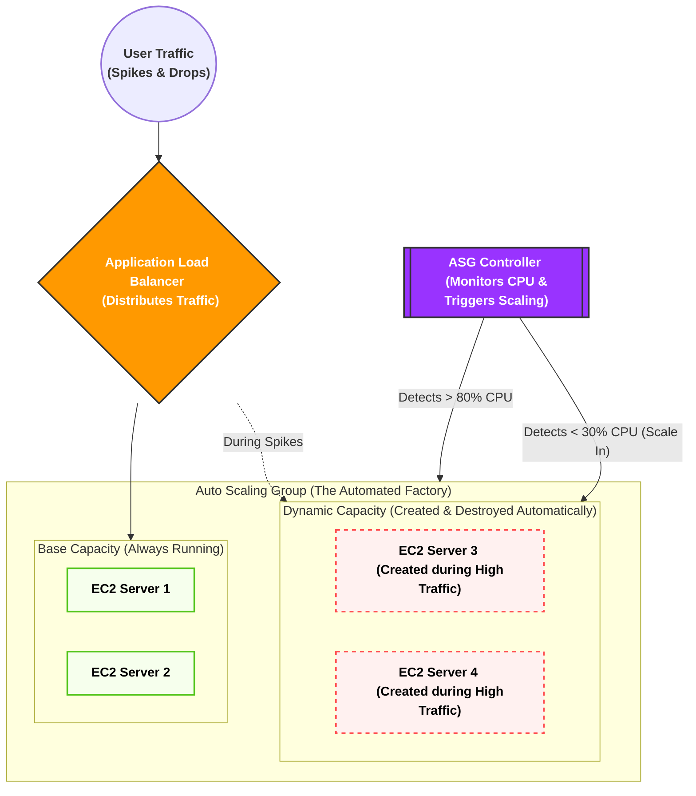
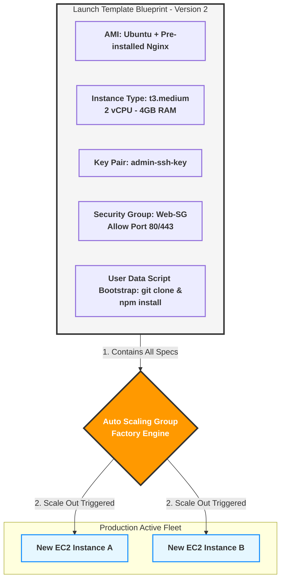

يا هلا بالعمق الهندسي! ده أحسن قرار تاخده، لأن الـ **Auto Scaling Group (ASG)** هو "العقل المدبر" اللي بيخلي الـ Cloud يشتغل كأنه سحر.

بناءً على نظامنا، دي **الرسالة الأولى: المقدمة وتأسيس المشكلة (ليه اخترعوا الـ ASG؟ وتفكيك مصطلحاته الأساسية)**.

هناخد راحتنا على الآخر ونبني الأساس صح.

### 1. تفكيك المصطلحات التأسيسية (مفاتيح فهم الكواليس)

قبل ما ندخل في الـ ASG، لازم نفكك 5 مصطلحات بيستخدموها الـ Cloud Architects كل يوم في شغلهم:

1. **Capacity (السعة الاستيعابية):**
    
    ده مصطلح بيعبر عن "قوة العضلات" بتاعة السيرفر بتاعك. السيرفر ده يقدر يستحمل كام ريكويست في الثانية؟ السعة دي بتتقاس بـ 3 حاجات رئيسية: استهلاك المعالج (CPU Utilization)، استهلاك الرامات (Memory)، وسرعة كارت الشبكة (Network Bandwidth).
    
2. **Provisioning (توفير أو تجهيز الموارد):**
    
    كلمة Provisioning معناها إنك تروح تطلب سيرفر جديد، تنزل عليه نظام التشغيل (زي Ubuntu)، وتسطب عليه الأبلكيشن بتاعك عشان يكون جاهز يستقبل زباين. في النظام القديم، العملية دي كانت بتاخد أيام أو أسابيع.
    
3. **Elasticity (المرونة - اللفظ الأهم في الـ Cloud):**
    
    تخيل "أستيك الفلوس" (Rubber Band). لما تشده بيمط معاك (يكبر)، ولما تسيبه بيرجع لحجمه الطبيعي (يصغر). المرونة في أمازون معناها إن البنية التحتية بتاعتك تكبر أوتوماتيك لما الضغط يزيد، وتكش وتصغر أوتوماتيك لما الضغط يقل عشان **توفر فلوسك**.
    
4. **Scale Out (التوسع للخارج):**
    
    لما الضغط يزيد، إنت بتضيف سيرفرات "جديدة" تقف جنب السيرفرات القديمة (مثلاً كان عندك سيرفرين، بقوا 5).
    
5. **Scale In (الانكماش للداخل):**
    
    لما الضغط يقل والزباين تنام، إنت بتمسح سيرفرات من اللي شغالين عشان متدفعش تكلفتهم على الفاضي (مثلاً الـ 5 سيرفرات يرجعوا يبقوا 2 بس).
    

### 2. أصل المشكلة: حدود موزع الأحمال (The Load Balancer Limits)

في الدروس اللي فاتت، فهمنا إن الـ **Load Balancer (ALB / NLB)** هو مدير المطعم اللي واقف على الباب بيوزع الزباين على الترابيزات (السيرفرات) عشان مفيش ترابيزة تقع من الضغط.

**المشكلة الهندسية المرعبة هنا:**

تخيل إنك عندك 3 سيرفرات (EC2) ورا الـ Load Balancer. السعة القصوى لكل سيرفر هي 1000 يوزر في نفس اللحظة.

فجأة، الأبلكيشن بتاعك طلع تريند، ودخل **10,000 يوزر** في نفس الثانية!

الـ Load Balancer هيعمل شغله بامتياز، هيوزع الـ 10,000 يوزر على الـ 3 سيرفرات بالتساوي... **والنتيجة؟ التلات سيرفرات هيتحرقوا ويهنجوا والموقع هيقع!**

ليه؟ لأن الـ Load Balancer وظيفته **التوزيع فقط**، مش وظيفته "يخلق" سيرفرات جديدة من العدم. هو ملوش دعوة إنت عندك كام سيرفر، هو بيوزع على اللي موجود قدامه وخلاص.

### 3. الحل: ظهور مصنع السيرفرات الذكي (Auto Scaling Group)

عشان نحل الكارثة دي، أمازون اخترعت خدمة الـ **ASG (مجموعة التوسع التلقائي)**.

الـ ASG مش مجرد أداة، ده عبارة عن **"مصنع آلي ذكي"** بيقف في ضهر الـ Load Balancer وبيعمل 3 وظايف خطيرة:

1. **المراقبة (Monitoring):** عينه دايماً على السيرفرات بتاعتك. بيراقب الـ CPU والرامات.
    
2. **التمدد والانكماش الآلي (Elastic Scaling):** أول ما الـ ASG يلمح إن السيرفرات الـ 3 بتوعك استهلاك الـ CPU بتاعهم عدى 80%، يروح فوراً ضاغط على زرار الطوارئ ويصنع (Provisions) سيرفرين كمان ويدخلهم الخدمة، فيقلل الحمل. ولما الزباين تمشي، الـ ASG يقتل السيرفرين الزيادة دول أوتوماتيك.
3. **الشفاء الذاتي (Self-Healing - Fleet Management):** دي الميزة الأهم! الـ ASG مش بس بيكبر ويصغر، ده بيعالج نفسه. لو سيرفر فجأة "هنج" أو باظ من غير ضغط، الـ ASG بيكتشف إنه مريض، فيقوم **قاتل السيرفر البايظ ده، وصانع سيرفر جديد سليم مكانه أوتوماتيك في ثواني** من غير ما إنت كمهندس تصحى من النوم تتدخل!
### 4. خريطة معمارية مبدئية لعملية الـ Scale Out & Scale In (Mermaid)
بص على الرسمة دي عشان تتخيل الـ ASG بيعمل إيه في الكواليس بناءً على الضغط:

كده إحنا أسسنا الأرضية، وعرفنا المصطلحات، وفهمنا إن الـ ASG هو "الرئة" اللي بتخلي السيستم يتنفس ويكبر ويصغر أوتوماتيك.
عشان المصنع ده (الـ ASG) يشتغل، محتاج نديله **"كتالوج أو أسطمبة"** يصنع منها السيرفرات الجديدة. الكتالوج ده هو المكون الأول للـ ASG واسمه **(Launch Template)**.
لو المقدمة هضمتها تماماً وكل مصطلح ركب مكانه، قولي **"تمام كمل"** عشان ندخل في الرسالة التانية ونفصص الـ Launch Template حتة حتة من جوه!

---

جهاز الـ Auto Scaling Group (ASG) عبارة عن "مصنع آلي ذكي". لكن المصنع ده مبيفكرش؛ لو قلتله "اصنعلي سيرفر جديد فوراً"، هيقف عاجز ويسألك: _"أصنع سيرفر إيه؟ إيه نظام التشغيل اللي عليه؟ راماته كام؟ إيه الكود اللي هيشتغل جواه؟ وإيه البوديجارد (Security Group) اللي هيحميه؟"_
عشان كده، مستحيل تشغل الـ ASG من غير ما تديله **مخطط تشغيل** جاهز ومكتوب فيه كل مواصفات السيرفر من الصغير للكبير. المخطط ده في AWS اسمه **Launch Template**.
تعال نفصص مكونات ومصطلحات المخطط ده حتة حتة وبأقصى عمق هندسي:
### 1. تفكيك مصطلح الـ Launch Template والبديل القديم (Template vs Configuration)

في امتحان الـ Cloud Practitioner وفي سوق العمل، هتسمع مصطلحين دايماً:

- **Launch Configuration (القديم - الموقوف):** دي كانت الأسطمبة القديمة في أمازون. عيبها القاتل إنها **غير قابلة للتعديل**. لو عملت أسطمبة واكتشفت إنك نسيت تكتب فيها سطر كود، بتضطر تمسحها وتعمل واحدة جديدة تماماً من الصفر وتغير اسمها، وده كان بيعمل كوابيس في إدارة السيستم. (🚨 أمازون بتنصح بعدم استخدامه تماماً دلوقتي).
    
- **Launch Template (الحديث - المعتمد):** ده المخطط الذكي الحالي. الميزة القاتلة فيه هي الـ **Versioning (التطوير بالإصدارات)**. يعني تقدر تعمل مخطط وتسميه الإصدار رقم 1 (V1). بعد شهر، كود الـ Backend اتحدث، تدخل على نفس المخطط وتعدله وتسميه الإصدار رقم 2 (V2). وتقدر تخلي الـ ASG يشتغل بـ V2، ولو حصلت أي مشكلة، تقوله أوتوماتيك: "ارجع اشتغل بالإصدار القديم V1" في ثانية واحدة (Rollback).
    

### 2. المكونات الخمسة الذهب جدار الـ Launch Template

لما بتيجي تفتح كونسول أمازون وتعمل Launch Template، بتملى 5 خانات رئيسية، وكل خانة وراها مفهوم هندسي عميق:

#### أ. الـ AMI (Amazon Machine Image - صورة نظام التشغيل)

- **معناها الفني:** اختصار لـ "صورة جهاز أمازون الافتراضي". اعتبرها نسخة الويندوز أو اللينكس (الـ ISO الكبيرة) اللي عليها كل حاجة جاهزة.
- **العمق الهندسي:** الـ AMI مش مجرد نظام تشغيل أوبونتو (Ubuntu) فاضي. في الشركات الكبيرة، المهندسين بيعملوا حاجة اسمها **Golden AMI (الصورة الذهبية)**. يعني بيجيبوا سيرفر EC2 عادي، ينزلوا عليه نظام التشغيل، ويسطبوا جواه الـ Web Server (زي Nginx) ويسطبوا جواه كود الـ Backend بتاع الأبلكيشن (Node.js أو Laravel)، وياخدوا "لقطة" أو (Snapshot) من الهارد ديسك ده ويسموها AMI.
- لما الـ ASG ييجي يصنع سيرفر جديد، بياخد الـ AMI دي وينسخها على السيرفر الجديد، فالسيرفر بيتولد وهو جواه الكود والبرامج جاهزة وشغالة فوراً في ثانية واحدة من غير ما يضيع وقت في تحميل حاجة من الإنترنت.

#### ب. الـ Instance Type (نوع وحجم عضلات الخادم)

- **معناها الفني:** هنا بتحدد حجم الـ CPU (المعالج) والـ RAM (الذاكرة العشوائية) للسيرفر اللي هيتولد.
- **العمق الهندسي:** أمازون بتقسم الأجهزة لعائلات بناءً على وظيفتها، وبتتكتب برمز زي `t3.micro` أو `c5.large`. تعال نفك شفرة الاسم ده:
    
    - الحرف الأول (`t` أو `c`) ➔ ده اسم **العائلة**. عائلة `t` دي عائلة اقتصادية ومرنة (Burstable)، وعائلة `c` مخصصة للعمليات الحسابية الثقيلة (Compute Optimized).
        
    - الرقم الثاني (`3` أو `5`) ➔ ده **الجيل (Generation)** بتاع الأجهزة. (يعني جيل تالت أو جيل خامس، وكل ما الرقم يعلى معناه إن الهاردوير أحدث وأسرع وأرخص في التكلفة).
        
    - الكلمة الأخيرة (`micro` أو `large`) ➔ ده **الحجم** (عدد الكور في الـ CPU وحجم الرامات). `micro` يعني 1 كور و 1 جيجا رام، و `large` يعني أضعاف كده.
        
- في الـ Launch Template، إنت بتحدد الحجم المناسب للضغط بتاعك (مثلاً بتختار `t3.medium`).
    
#### ج. الـ Key Pair (مفتاح الدخول والتشفير)

- **معناها الفني:** ده ملف الأمان اللي بتنزله على لابتوبك الشخصي عشان تعرف تدخل بيه جوه السيرفر عن طريق الـ Terminal باستخدام بروتوكول الـ **SSH (Secure Shell)**.
    
- **العمق الهندسي:** الـ SSH هو الطريق الآمن للتحكم في السيرفرات عن بُعد بكتابة الأوامر. الـ Key Pair بيشتغل بنظام (Public/Private Key Cryptography). أمازون بتاخد الـ Public Key تزرعه جوه السيرفر وهو بيتولد، وإنت بتشيل الـ Private Key على لابتوبك. لما تيجي تدخل، السيرفر بيطابق المفتاحين مع بعض، لو مظبوطين يفتحلك الباب. إنت بتحدد المفتاح ده جوه الـ Launch Template عشان السيرفرات الجديدة تتولد وهي محمية بنفس المفتاح.
    

#### د. الـ Network Settings & Security Groups (تصاريح الحماية)

- هنا بتحدد الـ Security Group (البوديقارد) اللي اتكلمنا عليه في الدروس اللي فاتت.
    
- بتقول للـ Launch Template: _"أي سيرفر يصنعه الـ ASG بناءً على المخطط ده، لازم تركب على بابه الـ Security Group اللي اسمها (Web-SG) اللي بتسمح بس بمرور بورت 80 و 443 من الـ Load Balancer"_، عشان تضمن إن أي سيرفر جديد ينزل الشبكة يكون محمي فوراً ومفتوح عليه البورتات الصح بس.
    

#### هـ. الـ User Data (بيانات المستخدم - سكربت التشغيل الذاتي الحاسم)

- **معناها الفني:** دي أهم خانة مخفية تحت في الإعدادات المتقدمة (Advanced Details). دي عبارة عن مربع فاضي بتكتب جواه كود أو لغة أوامر (Bash Script) للينكس.
    
- **العمق الهندسي - Bootstrapping (التشغيل الذاتي):** تخيل إنك مش عايز تعمل Golden AMI، وعايز تستخدم نسخة Ubuntu عادية وفاضية خالص من أمازون، بس عايز السيرفر أول ما يتولد يقوم أوتوماتيك مسطب البرامج ومنزل كودك من GitHub ومشغل الأبلكيشن من غير ما تتدخل إنت يدوي.
    
- الكود اللي بتكتبه جوه الـ User Data ده **بيتنفذ مرة واحدة بس في العمر (عند أول قومة للسيرفر - First Boot)**. الـ ASG أول ما يقوم السيرفر، بيقرا الـ User Data وينفذ الأوامر اللي فيها سطر ورا سطر (يحدث السيرفر، ينزل Node.js، يعمل `git clone` لكود مشروعك، ويعمل `npm start`). العملية دي هندسياً اسمها **Bootstrapping**.
    

### 🏗️ مخطط العلاقات الفنية للـ Launch Template (Mermaid)

بص على اللوحة دي بتوضح إزاي الـ Launch Template بيجمع كل المكونات دي في "كتالوج واحد"، وإزاي الـ ASG بيقراه عشان يفرخ سيرفرات EC2 متطابقة:

### 📊 المقارنة الحاسمة السريعة (تثبيت الفكرة):

- **الـ AMI:** هي **الهارد ديسك المقفول** بنظام تشغيله بكوده (ملف جامد).
- **الـ User Data:** هو **أمر حركي (Script)** بيتنفذ على السيرفر الفاضي عشان يجهزه وهو بيقوم.
- **الـ Launch Template:** هو **الملف الإداري الكلي** اللي بيجمع الـ AMI والـ User Data والحجم والمفاتيح مع بعض في مكان واحد مدعوم بالإصدارات (Versions).

كده المكون الأول والأساسي للـ Auto Scaling Group (الـ Launch Template) اتفرم بكل مصطلحاته الدقيقة؟
لو تمام والأسطابة واضحة في دماغك، قولي **"تمام كمل"** عشان ندخل في الرسالة التالتة ونفصص المكون التاني: (قوانين الأرقام الثلاثة - Min, Max, and Desired Capacity)!