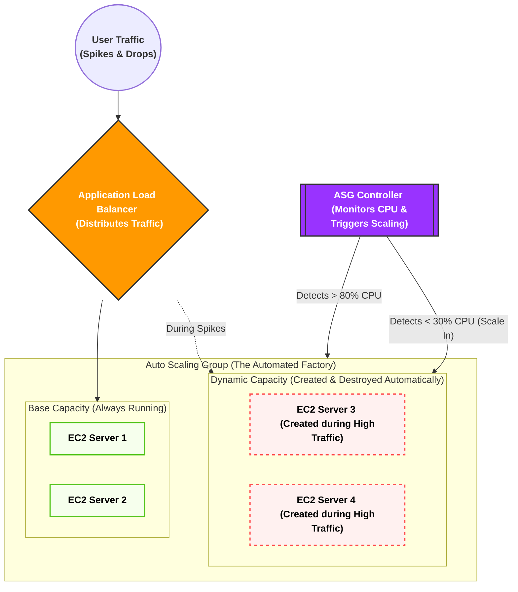

يا هلا بالعمق الهندسي! ده أحسن قرار تاخده، لأن الـ **Auto Scaling Group (ASG)** هو "العقل المدبر" اللي بيخلي الـ Cloud يشتغل كأنه سحر.

بناءً على نظامنا، دي **الرسالة الأولى: المقدمة وتأسيس المشكلة (ليه اخترعوا الـ ASG؟ وتفكيك مصطلحاته الأساسية)**.

هناخد راحتنا على الآخر ونبني الأساس صح.

### 1. تفكيك المصطلحات التأسيسية (مفاتيح فهم الكواليس)

قبل ما ندخل في الـ ASG، لازم نفكك 5 مصطلحات بيستخدموها الـ Cloud Architects كل يوم في شغلهم:

1. **Capacity (السعة الاستيعابية):**
    
    ده مصطلح بيعبر عن "قوة العضلات" بتاعة السيرفر بتاعك. السيرفر ده يقدر يستحمل كام ريكويست في الثانية؟ السعة دي بتتقاس بـ 3 حاجات رئيسية: استهلاك المعالج (CPU Utilization)، استهلاك الرامات (Memory)، وسرعة كارت الشبكة (Network Bandwidth).
    
2. **Provisioning (توفير أو تجهيز الموارد):**
    
    كلمة Provisioning معناها إنك تروح تطلب سيرفر جديد، تنزل عليه نظام التشغيل (زي Ubuntu)، وتسطب عليه الأبلكيشن بتاعك عشان يكون جاهز يستقبل زباين. في النظام القديم، العملية دي كانت بتاخد أيام أو أسابيع.
    
3. **Elasticity (المرونة - اللفظ الأهم في الـ Cloud):**
    
    تخيل "أستيك الفلوس" (Rubber Band). لما تشده بيمط معاك (يكبر)، ولما تسيبه بيرجع لحجمه الطبيعي (يصغر). المرونة في أمازون معناها إن البنية التحتية بتاعتك تكبر أوتوماتيك لما الضغط يزيد، وتكش وتصغر أوتوماتيك لما الضغط يقل عشان **توفر فلوسك**.
    
4. **Scale Out (التوسع للخارج):**
    
    لما الضغط يزيد، إنت بتضيف سيرفرات "جديدة" تقف جنب السيرفرات القديمة (مثلاً كان عندك سيرفرين، بقوا 5).
    
5. **Scale In (الانكماش للداخل):**
    
    لما الضغط يقل والزباين تنام، إنت بتمسح سيرفرات من اللي شغالين عشان متدفعش تكلفتهم على الفاضي (مثلاً الـ 5 سيرفرات يرجعوا يبقوا 2 بس).
    

### 2. أصل المشكلة: حدود موزع الأحمال (The Load Balancer Limits)

في الدروس اللي فاتت، فهمنا إن الـ **Load Balancer (ALB / NLB)** هو مدير المطعم اللي واقف على الباب بيوزع الزباين على الترابيزات (السيرفرات) عشان مفيش ترابيزة تقع من الضغط.

**المشكلة الهندسية المرعبة هنا:**

تخيل إنك عندك 3 سيرفرات (EC2) ورا الـ Load Balancer. السعة القصوى لكل سيرفر هي 1000 يوزر في نفس اللحظة.

فجأة، الأبلكيشن بتاعك طلع تريند، ودخل **10,000 يوزر** في نفس الثانية!

الـ Load Balancer هيعمل شغله بامتياز، هيوزع الـ 10,000 يوزر على الـ 3 سيرفرات بالتساوي... **والنتيجة؟ التلات سيرفرات هيتحرقوا ويهنجوا والموقع هيقع!**

ليه؟ لأن الـ Load Balancer وظيفته **التوزيع فقط**، مش وظيفته "يخلق" سيرفرات جديدة من العدم. هو ملوش دعوة إنت عندك كام سيرفر، هو بيوزع على اللي موجود قدامه وخلاص.

### 3. الحل: ظهور مصنع السيرفرات الذكي (Auto Scaling Group)

عشان نحل الكارثة دي، أمازون اخترعت خدمة الـ **ASG (مجموعة التوسع التلقائي)**.

الـ ASG مش مجرد أداة، ده عبارة عن **"مصنع آلي ذكي"** بيقف في ضهر الـ Load Balancer وبيعمل 3 وظايف خطيرة:

1. **المراقبة (Monitoring):** عينه دايماً على السيرفرات بتاعتك. بيراقب الـ CPU والرامات.
    
2. **التمدد والانكماش الآلي (Elastic Scaling):** أول ما الـ ASG يلمح إن السيرفرات الـ 3 بتوعك استهلاك الـ CPU بتاعهم عدى 80%، يروح فوراً ضاغط على زرار الطوارئ ويصنع (Provisions) سيرفرين كمان ويدخلهم الخدمة، فيقلل الحمل. ولما الزباين تمشي، الـ ASG يقتل السيرفرين الزيادة دول أوتوماتيك.
3. **الشفاء الذاتي (Self-Healing - Fleet Management):** دي الميزة الأهم! الـ ASG مش بس بيكبر ويصغر، ده بيعالج نفسه. لو سيرفر فجأة "هنج" أو باظ من غير ضغط، الـ ASG بيكتشف إنه مريض، فيقوم **قاتل السيرفر البايظ ده، وصانع سيرفر جديد سليم مكانه أوتوماتيك في ثواني** من غير ما إنت كمهندس تصحى من النوم تتدخل!
### 4. خريطة معمارية مبدئية لعملية الـ Scale Out & Scale In (Mermaid)
بص على الرسمة دي عشان تتخيل الـ ASG بيعمل إيه في الكواليس بناءً على الضغط:

كده إحنا أسسنا الأرضية، وعرفنا المصطلحات، وفهمنا إن الـ ASG هو "الرئة" اللي بتخلي السيستم يتنفس ويكبر ويصغر أوتوماتيك.
عشان المصنع ده (الـ ASG) يشتغل، محتاج نديله **"كتالوج أو أسطمبة"** يصنع منها السيرفرات الجديدة. الكتالوج ده هو المكون الأول للـ ASG واسمه **(Launch Template)**.
لو المقدمة هضمتها تماماً وكل مصطلح ركب مكانه، قولي **"تمام كمل"** عشان ندخل في الرسالة التانية ونفصص الـ Launch Template حتة حتة من جوه!