# Java Core Internal Semantic Synthesis Proposal

**Date:** 2026-01-06  
**Scope:** Java Core folder ONLY (No cross-subject links)  
**Purpose:** Transform static notes into an interconnected knowledge graph

---

## Executive Summary

This proposal establishes **internal semantic links** between 16 Java Core notes, creating a learning pathway that flows from fundamentals to advanced concepts. Each link includes a rationale explaining how it strengthens understanding of the Java Ecosystem.

---

## 📊 Concept Relationship Map

```mermaid
graph TD
    subgraph Foundation ["🧱 Foundation Layer"]
        DT[Data Types.md]
        OP[Operators, Control Statements and String Handling.md]
        MOD[Modifiers & Access Specifiers.md]
    end

    subgraph OOP ["🏗️ OOP Layer"]
        WR[Wrapers.md]
        WC[Wrapper Classes & inner classes.md]
        IC[Inner Classes.md]
        VAR[var.md]
    end

    subgraph Functional ["⚡ Functional Layer"]
        CB[Callback interface.md]
        FI[Functional interfaces.md]
        GL[Generics and Lambda Expressions...md]
    end

    subgraph Advanced ["🚀 Advanced Layer"]
        SA[Stream API.md]
        JC[Java collections.md]
        EX[Exceptions.md]
        TH[Threading.md]
    end

    subgraph Context ["📚 Context"]
        HE[The History and Evolution of Java.md]
        MT[حاجات متفرقة جات على بالي.md]
    end

    DT --> WR
    DT --> WC
    WR --> WC
    WC --> IC
    IC --> CB
    CB --> FI
    FI --> GL
    GL --> SA
    GL --> JC
    SA --> JC
    EX --> TH
    MOD --> IC
    HE --> DT
```



---

## 🔗 Proposed WikiLinks by File

### 1. Data Types.md

#### YAML Frontmatter Update
```yaml
---
tags:
  - java-core
  - java-primitives
  - java-memory
  - java-type-system
difficulty: 2
related:
  - "[[Wrapers]]"
  - "[[Wrapper Classes & inner classes]]"
  - "[[Operators, Control Statements and String Handling]]"
---
```

#### Proposed Links

| Target File | Link Location | Rationale |
|:--|:--|:--|
| `[[Wrapers]]` | Section on primitive limitations | **Learning Flow:** Data Types explains *why* primitives exist (performance), while Wrappers explains *why we need objects*. Understanding primitives first makes wrapper autoboxing intuitive. |
| `[[Wrapper Classes & inner classes]]` | Section on type conversion | **Concept Bridge:** The widening/narrowing conversions in Data Types directly apply to wrapper valueOf() and parseXXX() methods. |
| `[[Operators, Control Statements and String Handling]]` | After arrays section | **Sequential Learning:** Operators and control statements are the natural next step after understanding data types. |
| `[[The History and Evolution of Java]]` | In the portability section | **Context:** The 32-bit fixed `int` size is a direct result of Java's "Write Once, Run Anywhere" philosophy explained in history. |

---

### 2. Wrapers.md

#### YAML Frontmatter Update
```yaml
---
tags:
  - java-core
  - java-wrappers
  - java-autoboxing
  - java-collections-prerequisite
difficulty: 2
related:
  - "[[Data Types]]"
  - "[[Wrapper Classes & inner classes]]"
  - "[[Java collections]]"
---
```

#### Proposed Links

| Target File | Link Location | Rationale |
|:--|:--|:--|
| `[[Data Types]]` | Opening section | **Prerequisite:** Wrappers only make sense if you understand why primitives can't be used in Collections. Data Types establishes this. |
| `[[Wrapper Classes & inner classes]]` | After autoboxing section | **Deeper Dive:** Wrapper Classes & inner classes covers the same topic with more depth on inner class mechanics. Consolidates learning. |
| `[[Java collections]]` | In the ArrayList<Integer> example | **Application:** Shows *exactly where* wrappers become mandatory. Collections refuse primitives direct access. |
| `[[Exceptions]]` | In NullPointerException warning section | **Error Handling:** The NPE trap with auto-unboxing is a critical runtime exception students must learn to handle. |

---

### 3. Wrapper Classes & inner classes.md

#### YAML Frontmatter Update
```yaml
---
tags:
  - java-core
  - java-wrappers
  - java-inner-classes
  - java-memory-model
difficulty: 3
related:
  - "[[Wrapers]]"
  - "[[Inner Classes]]"
  - "[[Callback interface]]"
  - "[[Functional interfaces]]"
---
```

#### Proposed Links

| Target File | Link Location | Rationale |
|:--|:--|:--|
| `[[Wrapers]]` | At the start | **Foundation:** Both files cover wrappers; this one adds inner class context. Cross-reference prevents content duplication confusion. |
| `[[Inner Classes]]` | After inner class types section | **Complete Coverage:** Inner Classes.md provides the comprehensive taxonomy (Member, Static, Local, Anonymous) that this file introduces. |
| `[[Callback interface]]` | In Anonymous Inner Class section | **Pattern Application:** Anonymous classes are *how* callbacks were implemented before lambdas. |
| `[[Functional interfaces]]` | In Lambda evolution section | **Evolution:** Shows how Anonymous Inner Classes evolved into Lambda Expressions via Functional Interfaces. |

---

### 4. Inner Classes.md

#### YAML Frontmatter Update
```yaml
---
tags:
  - java-oop
  - java-inner-classes
  - java-encapsulation
  - java-design-patterns
difficulty: 3
related:
  - "[[Wrapper Classes & inner classes]]"
  - "[[Callback interface]]"
  - "[[Modifiers & Access Specifiers]]"
---
```

#### Proposed Links

| Target File | Link Location | Rationale |
|:--|:--|:--|
| `[[Wrapper Classes & inner classes]]` | Opening reference | **Alternate View:** Wrapper Classes file approaches inner classes from wrapper perspective; this file is the comprehensive guide. |
| `[[Callback interface]]` | In Anonymous Inner Class section | **Direct Application:** Callbacks are the #1 use case for Anonymous Inner Classes in GUI and event handling. |
| `[[Modifiers & Access Specifiers]]` | In encapsulation section | **Access Control:** Inner classes break normal access rules (can access outer's private). Modifiers file explains the baseline rules being broken. |
| `[[Functional interfaces]]` | At the end | **Evolution Path:** Anonymous Inner Classes on Functional Interfaces → Lambda syntax. This is the Java 8 transformation story. |

---

### 5. Callback interface.md

#### YAML Frontmatter Update
```yaml
---
tags:
  - java-oop
  - java-callbacks
  - java-event-handling
  - java-design-patterns
difficulty: 3
related:
  - "[[Functional interfaces]]"
  - "[[Inner Classes]]"
  - "[[Generics and Lambda Expressions and Method Reference]]"
---
```

#### Proposed Links

| Target File | Link Location | Rationale |
|:--|:--|:--|
| `[[Inner Classes]]` | In Anonymous class usage | **Implementation:** Callbacks require a class implementing the interface. Inner Classes shows all 4 ways to do this. |
| `[[Functional interfaces]]` | After ActionListener example | **Generalization:** ActionListener is a Functional Interface. This link shows callbacks are a *subset* of functional programming. |
| `[[Generics and Lambda Expressions and Method Reference]]` | At the end | **Modern Replacement:** Lambdas replaced verbose callback syntax. This link shows the cleaner alternative. |

---

### 6. Functional interfaces.md

#### YAML Frontmatter Update
```yaml
---
tags:
  - java-functional
  - java-lambda
  - java-streams-prerequisite
  - java-java8
difficulty: 3
related:
  - "[[Callback interface]]"
  - "[[Generics and Lambda Expressions and Method Reference]]"
  - "[[Stream API]]"
---
```

#### Proposed Links

| Target File | Link Location | Rationale |
|:--|:--|:--|
| `[[Callback interface]]` | In SAM explanation | **Historical Context:** Callbacks were the original "single method" pattern. Functional interfaces formalized this. |
| `[[Generics and Lambda Expressions and Method Reference]]` | After Predicate/Consumer section | **Syntax:** Functional interfaces define the *contract*, Lambdas/Method References are the *implementation syntax*. |
| `[[Stream API]]` | After built-in interfaces table | **Application:** Predicate, Consumer, Function are *used by* Stream operations (filter, forEach, map). |
| `[[Java collections]]` | In collection iteration examples | **Bridge:** removeIf(Predicate) shows Functional Interfaces applied to Collections directly. |

---

### 7. Generics and Lambda Expressions and Method Reference.md

#### YAML Frontmatter Update
```yaml
---
tags:
  - java-generics
  - java-lambda
  - java-method-reference
  - java-type-safety
  - java-java8
difficulty: 4
related:
  - "[[Functional interfaces]]"
  - "[[Stream API]]"
  - "[[Java collections]]"
  - "[[Data Types]]"
---
```

#### Proposed Links

| Target File | Link Location | Rationale |
|:--|:--|:--|
| `[[Functional interfaces]]` | In Lambda introduction | **Prerequisite:** Lambdas can only target Functional Interfaces. Understanding SAM is mandatory. |
| `[[Stream API]]` | After Method Reference section | **Application:** Streams are the primary consumer of lambdas and method references in modern Java. |
| `[[Java collections]]` | In Generic collections section | **Type Safety:** Generics were invented for Collections. ArrayList<String> is the canonical example. |
| `[[Data Types]]` | In Type Erasure section | **Foundation:** Understanding primitives vs objects explains why generics only work with wrapper types. |
| `[[Exceptions]]` | In try-with-resources lambda context | **Error Handling:** Generic methods can declare thrown exceptions; understanding exception hierarchy matters. |

---

### 8. Stream API.md

#### YAML Frontmatter Update
```yaml
---
tags:
  - java-streams
  - java-functional
  - java-parallel
  - java-java8
  - java-performance
difficulty: 4
related:
  - "[[Generics and Lambda Expressions and Method Reference]]"
  - "[[Java collections]]"
  - "[[Functional interfaces]]"
  - "[[Threading]]"
---
```

#### Proposed Links

| Target File | Link Location | Rationale |
|:--|:--|:--|
| `[[Generics and Lambda Expressions and Method Reference]]` | In Pipeline section | **Syntax Source:** Every stream operation uses lambdas/method references. This is the prerequisite. |
| `[[Java collections]]` | In collect() section | **Source & Destination:** Streams often start from and end in Collections. Collectors.toList() bridges both. |
| `[[Functional interfaces]]` | In filter/map/reduce section | **Contract:** filter takes Predicate, map takes Function, forEach takes Consumer. These interfaces define behavior. |
| `[[Threading]]` | In Parallel Streams section | **Concurrency:** parallel() uses Fork/Join framework. Understanding threads explains performance gains and pitfalls. |

---

### 9. Java collections.md

#### YAML Frontmatter Update
```yaml
---
tags:
  - java-collections
  - java-data-structures
  - java-generics
  - java-performance
difficulty: 4
related:
  - "[[Generics and Lambda Expressions and Method Reference]]"
  - "[[Stream API]]"
  - "[[Wrapers]]"
  - "[[Exceptions]]"
---
```

#### Proposed Links

| Target File | Link Location | Rationale |
|:--|:--|:--|
| `[[Generics and Lambda Expressions and Method Reference]]` | In iterator section | **Type Safety:** Collections without generics return Object. Understanding generics explains modern collection usage. |
| `[[Stream API]]` | After removeIf section | **Modern API:** Most collection processing today uses streams. stream() is the bridge method. |
| `[[Wrapers]]` | In ArrayList<Integer> section | **Requirement:** Collections can't hold primitives. Wrappers are mandatory for numeric collections. |
| `[[Exceptions]]` | In ConcurrentModificationException section | **Runtime Errors:** Iterator invalidation throws ConcurrentModificationException. Exception handling is essential. |
| `[[Threading]]` | In synchronized collections section | **Concurrency:** Collections.synchronizedList() relates to thread safety concepts. |

---

### 10. Exceptions.md

#### YAML Frontmatter Update
```yaml
---
tags:
  - java-exceptions
  - java-error-handling
  - java-runtime
  - java-checked-unchecked
difficulty: 3
related:
  - "[[Threading]]"
  - "[[Java collections]]"
  - "[[Wrapers]]"
  - "[[Stream API]]"
---
```

#### Proposed Links

| Target File | Link Location | Rationale |
|:--|:--|:--|
| `[[Threading]]` | After custom exception section | **Concurrency Errors:** InterruptedException is the key exception in threading. Exception handling is critical in concurrent code. |
| `[[Java collections]]` | In RuntimeException section | **Application:** ConcurrentModificationException, NoSuchElementException occur in collection usage. |
| `[[Wrapers]]` | In NullPointerException section | **Common Bug:** Auto-unboxing null wrappers is a major NPE source. |
| `[[Stream API]]` | In try-with-resources section | **Modern Context:** Streams implement AutoCloseable; try-with-resources applies. |

---

### 11. Threading.md

#### YAML Frontmatter Update
```yaml
---
tags:
  - java-concurrency
  - java-threading
  - java-multithreading
  - java-synchronization
difficulty: 4
related:
  - "[[Exceptions]]"
  - "[[Stream API]]"
  - "[[Functional interfaces]]"
  - "[[Inner Classes]]"
---
```

#### Proposed Links

| Target File | Link Location | Rationale |
|:--|:--|:--|
| `[[Exceptions]]` | In Thread.sleep() section | **Error Handling:** InterruptedException must be caught. Understanding checked exceptions is prerequisite. |
| `[[Stream API]]` | After Thread basics | **Parallel Alternative:** Parallel streams abstract threading complexity. This shows the modern alternative. |
| `[[Functional interfaces]]` | In Runnable section | **Bridge:** Runnable is a Functional Interface. Lambda syntax simplifies thread creation. |
| `[[Inner Classes]]` | In Anonymous Runnable section | **Implementation:** Anonymous inner classes were the pre-Java-8 way to create runnables. |

---

### 12. Modifiers & Access Specifiers.md

#### YAML Frontmatter Update
```yaml
---
tags:
  - java-oop
  - java-encapsulation
  - java-access-control
  - java-interfaces
difficulty: 3
related:
  - "[[Inner Classes]]"
  - "[[Functional interfaces]]"
  - "[[The History and Evolution of Java]]"
---
```

#### Proposed Links

| Target File | Link Location | Rationale |
|:--|:--|:--|
| `[[Inner Classes]]` | In protected access section | **Special Case:** Inner classes can access outer's private members, breaking normal access rules. |
| `[[Functional interfaces]]` | In interface section | **Interface Evolution:** Default methods in interfaces are covered here; Functional interfaces build on this. |
| `[[The History and Evolution of Java]]` | In package naming section | **Context:** Reverse domain naming convention connects to Java's enterprise history. |

---

### 13. Operators, Control Statements and String Handling.md

#### YAML Frontmatter Update
```yaml
---
tags:
  - java-core
  - java-operators
  - java-control-flow
  - java-strings
difficulty: 2
related:
  - "[[Data Types]]"
  - "[[Exceptions]]"
---
```

#### Proposed Links

| Target File | Link Location | Rationale |
|:--|:--|:--|
| `[[Data Types]]` | At the start | **Prerequisite:** Operators work on data types. Understanding types is required first. |
| `[[Exceptions]]` | In String parsing section | **Error Handling:** NumberFormatException occurs when parsing invalid strings. |

---

### 14. var.md

#### YAML Frontmatter Update
```yaml
---
tags:
  - java-core
  - java-var
  - java-java10
  - java-type-inference
difficulty: 2
related:
  - "[[Data Types]]"
  - "[[Generics and Lambda Expressions and Method Reference]]"
---
```

#### Proposed Links

| Target File | Link Location | Rationale |
|:--|:--|:--|
| `[[Data Types]]` | In type inference section | **Foundation:** var infers types; understanding explicit types is prerequisite. |
| `[[Generics and Lambda Expressions and Method Reference]]` | At the end | **Advanced Inference:** Generic type inference relates to var's inference mechanism. |

---

### 15. The History and Evolution of Java.md

#### YAML Frontmatter Update
```yaml
---
tags:
  - java-history
  - java-evolution
  - java-jvm
  - java-context
difficulty: 1
related:
  - "[[Data Types]]"
  - "[[Modifiers & Access Specifiers]]"
---
```

#### Proposed Links

| Target File | Link Location | Rationale |
|:--|:--|:--|
| `[[Data Types]]` | After portability section | **Application:** The fixed-size primitives are a direct result of the WORA philosophy. |
| `[[Modifiers & Access Specifiers]]` | In enterprise section | **Context:** Package naming conventions and access modifiers support enterprise development. |

---

### 16. حاجات متفرقة جات على بالي.md

#### YAML Frontmatter Update
```yaml
---
tags:
  - java-misc
  - java-tips
  - java-gotchas
difficulty: 2
related:
  - "[[Data Types]]"
  - "[[Exceptions]]"
---
```

#### Proposed Links

| Target File | Link Location | Rationale |
|:--|:--|:--|
| `[[Data Types]]` | Where primitives discussed | **Cross-reference:** Miscellaneous tips often relate to type gotchas. |
| `[[Exceptions]]` | Where error handling discussed | **Practical Tips:** Many gotchas involve exception handling patterns. |

---

## 🎯 Learning Pathway Summary

```
┌─────────────────────────────────────────────────────────────────────┐
│                    JAVA ECOSYSTEM LEARNING PATH                      │
├─────────────────────────────────────────────────────────────────────┤
│                                                                      │
│  LEVEL 1: Foundation                                                 │
│  ┌──────────────┐ ──► ┌──────────────┐ ──► ┌──────────────┐         │
│  │ History.md   │     │ Data Types   │     │  Operators   │         │
│  └──────────────┘     └──────────────┘     └──────────────┘         │
│         │                    │                                       │
│         ▼                    ▼                                       │
│  LEVEL 2: Object-Orientation                                         │
│  ┌──────────────┐ ──► ┌──────────────┐ ──► ┌──────────────┐         │
│  │  Modifiers   │     │   Wrappers   │     │Inner Classes │         │
│  └──────────────┘     └──────────────┘     └──────────────┘         │
│                              │                    │                  │
│                              ▼                    ▼                  │
│  LEVEL 3: Functional Programming                                     │
│  ┌──────────────┐ ──► ┌──────────────┐ ──► ┌──────────────┐         │
│  │  Callbacks   │     │  Functional  │     │   Generics   │         │
│  │              │     │  Interfaces  │     │   Lambdas    │         │
│  └──────────────┘     └──────────────┘     └──────────────┘         │
│                                                   │                  │
│                                                   ▼                  │
│  LEVEL 4: Advanced APIs                                              │
│  ┌──────────────┐ ◄── ┌──────────────┐ ──► ┌──────────────┐         │
│  │  Exceptions  │     │  Stream API  │     │ Collections  │         │
│  └──────────────┘     └──────────────┘     └──────────────┘         │
│         │                    │                                       │
│         ▼                    ▼                                       │
│  LEVEL 5: Concurrency                                                │
│  ┌──────────────────────────────────────────────────────────┐       │
│  │                      Threading.md                         │       │
│  │            (Uses Exceptions + Parallel Streams)           │       │
│  └──────────────────────────────────────────────────────────┘       │
│                                                                      │
└─────────────────────────────────────────────────────────────────────┘
```

---

## 📋 Tag Taxonomy

| Category | Tags | Files Using |
|:--|:--|:--|
| **Core** | `#java-core`, `#java-primitives` | Data Types, Operators, var |
| **OOP** | `#java-oop`, `#java-encapsulation` | Modifiers, Inner Classes |
| **Functional** | `#java-functional`, `#java-lambda` | Functional interfaces, Generics, Stream API |
| **Concurrency** | `#java-concurrency`, `#java-threading` | Threading |
| **Collections** | `#java-collections`, `#java-data-structures` | Java collections |
| **Error Handling** | `#java-exceptions`, `#java-error-handling` | Exceptions |
| **Java Versions** | `#java-java8`, `#java-java10` | Functional interfaces, var |

---

## ✅ Implementation Checklist

When applying this proposal:

- [ ] Add YAML frontmatter to each file (if missing)
- [ ] Insert `[[WikiLinks]]` at suggested locations
- [ ] Verify all links resolve correctly
- [ ] Test navigation flow in Obsidian
- [ ] Review difficulty ratings for accuracy

---

## 📝 Notes

1. **No cross-subject links** were created (per instructions)
2. All links are **bidirectional** conceptually (A→B implies B→A)
3. Links prioritize **learning flow** over alphabetical order
4. Difficulty ratings: 1 (beginner) to 5 (expert)

---

*Generated by Knowledge Architect Agent | 2026-01-06*
