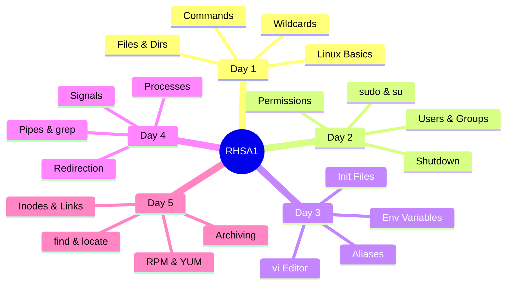
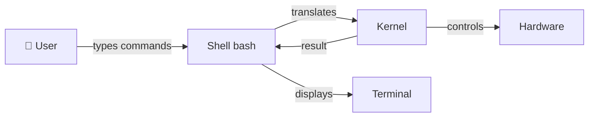
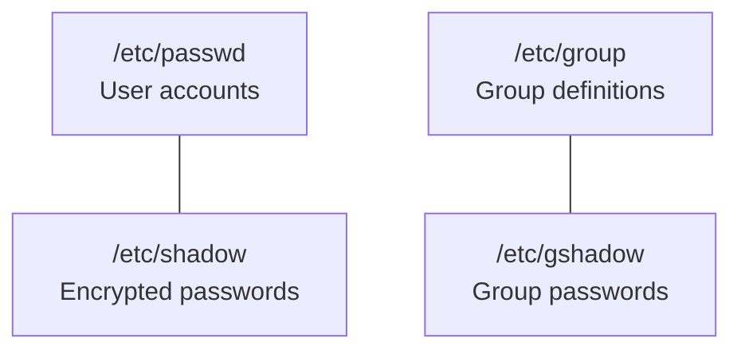
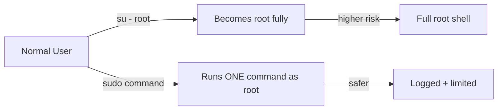
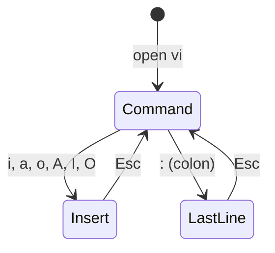
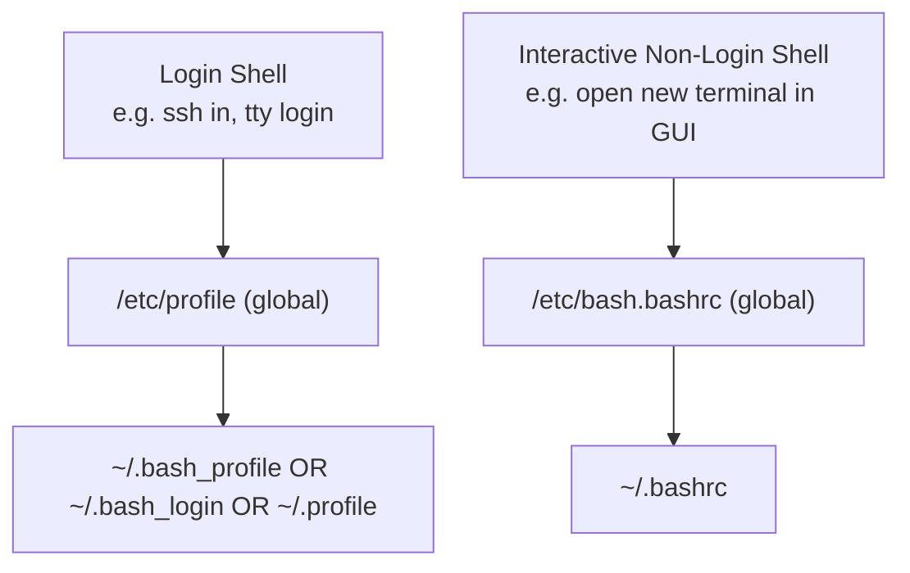
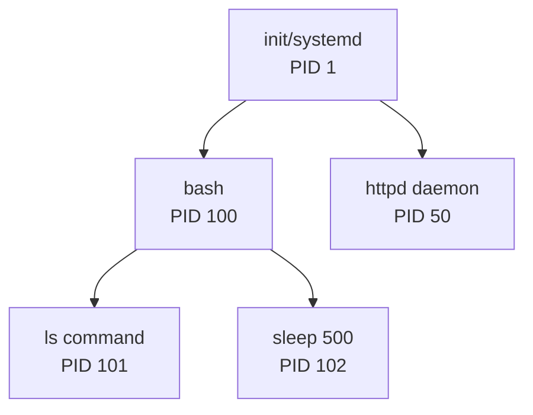
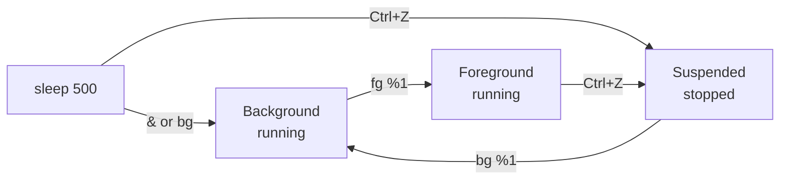
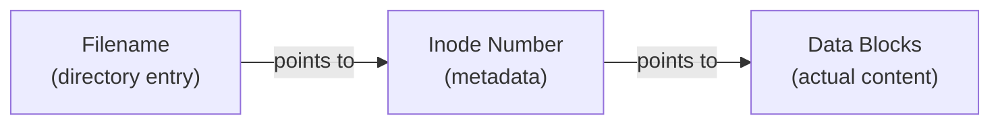
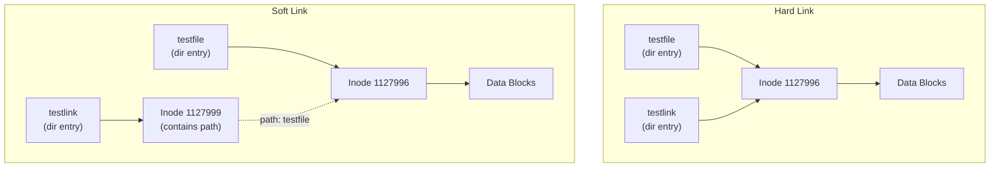

# 🐧 RHSA1 — Red Hat System Administration I
## Complete Revision Notes
**ITI Open Source Track**
*Covers: Commands • Users & Groups • Permissions • vi • Processes • Redirection • Packages • Archiving*

---

## 📋 Course Map



---

## 🗓️ DAY 1 — Linux Basics, Commands, Files & Directories

### 🧠 What is Linux?

Think of Linux like a car engine — the **kernel** is the engine itself (handles hardware), the **shell** is the steering wheel (you give directions), and the **terminal** is the dashboard (where you see results).



### 📟 Command Syntax

```bash
command  [options]  [arguments]
   ↑          ↑          ↑
 what     modifies    what to
 to do    behavior   act on
```

> ⚠️ **Critical rules:**
> - Items are separated by **spaces**
> - Commands are **case-sensitive** (`ls` ≠ `LS`)
> - Chain commands with `;` → `cal; date; uname`
> - Stop a running command: `Ctrl+C`
> - End keyboard input: `Ctrl+D`

### 🔑 Essential Day 1 Commands

| Command | What it does | Example |
|---------|-------------|---------|
| `pwd` | Print working directory | `pwd` → `/home/user1` |
| `ls` | List directory contents | `ls -la /etc` |
| `cd` | Change directory | `cd /home/user1` |
| `cat` | View entire file at once | `cat /etc/passwd` |
| `more` | View file page by page | `more /etc/passwd` |
| `head -n` | First n lines | `head -4 /etc/passwd` |
| `tail -n` | Last n lines | `tail -7 /etc/passwd` |
| `cp` | Copy files/dirs | `cp -r dir1 dir2` |
| `mv` | Move or rename | `mv file1 file2` |
| `rm` | Remove file | `rm -i file1` |
| `rmdir` | Remove empty directory | `rmdir emptydir` |
| `mkdir` | Make directory | `mkdir -p a/b/c` |
| `touch` | Create empty file | `touch newfile` |
| `uname` | System info | `uname -a` |
| `man` | Manual pages | `man ls` |

### 📂 ls Options — The Most Used Command

```bash
ls -l      # long format (permissions, owner, size, date)
ls -a      # show hidden files (starting with .)
ls -la     # combine: long + hidden
ls -F      # show type: / for dirs, * for executables, @ for links
ls -R      # recursive (show subdirs)
ls -ld     # show directory itself, not its contents
ls -i      # show inode numbers
```

### 📁 Directory Navigation

```bash
cd /home/user1/work    # absolute path (starts from /)
cd ..                  # go up one level
cd ~                   # go to home directory
cd -                   # go to previous directory
```

> 🔑 **Absolute vs Relative Path:**
> - **Absolute**: always starts with `/` — works from anywhere
> - **Relative**: starts from where you ARE right now

### 🃏 Wildcards (File Globbing)

Think of wildcards like a search engine for filenames.

| Wildcard | Meaning | Example | Matches |
|----------|---------|---------|---------|
| `*` | 0 or more characters | `ls f*` | `file1`, `fruit`, `f` |
| `?` | exactly 1 character | `ls file?` | `file1`, `file2` |
| `[abc]` | one of these chars | `ls [ab]*` | `abm`, `bat`, `bam` |
| `[a-z]` | range of chars | `ls [a-f]*` | files starting a to f |

```bash
ls *3          # anything ending in 3
ls ???         # exactly 3 characters
ls ?a*         # second character is 'a'
ls [ab]*       # starts with a or b
ls -a .*       # hidden files only (start with .)
```

### 📖 Getting Help

```bash
man ls                 # full manual for ls
man -k passwd          # search all man pages for keyword "passwd"
man 1 passwd           # passwd COMMAND man page (section 1)
man 5 passwd           # passwd FILE man page (section 5)
whatis ls              # one-line description
ls --help              # built-in quick help
```

> 💡 **Lab 1, Q11 answer:** `man 1 passwd; man 5 passwd` — chaining two man commands with `;`

---

## 🗓️ DAY 2 — Users, Groups & Permissions

### 👥 The Four Key Files



### 📄 /etc/passwd Format

```
username : x : uid : gid : comment : home_dir : shell
   1       2   3    4       5          6          7
```

Example:
```
islam:x:1001:1001:Islam Askar:/home/islam:/bin/bash
```

| Field | Meaning |
|-------|---------|
| `username` | Login name |
| `x` | Password placeholder (actual in /etc/shadow) |
| `uid` | User ID number |
| `gid` | Primary group ID |
| `comment` | Full name / info |
| `home_dir` | Home directory path |
| `shell` | Default login shell |

### 🔐 /etc/shadow Format

```
username : encrypted_pass : last_changed : min : max : warn : inactive : expire
```

| Field | Meaning |
|-------|---------|
| `last_changed` | Days since Jan 1, 1970 password last changed |
| `min` | Min days before password can be changed |
| `max` | Max days before password MUST be changed |
| `warn` | Days before expiry to warn user |
| `inactive` | Days after expiry account is disabled |
| `expire` | Absolute expiry date |

### 👤 User Management Commands

```bash
# Create user
useradd username
useradd -D                          # view/modify defaults
passwd username                     # set password
newusers filename                   # add multiple users from file

# Modify user
usermod -l newname username         # change login name
usermod -L username                 # lock account
usermod -U username                 # unlock account
usermod -aG groupname username      # add to supplementary group

# Delete user
userdel username                    # delete user (keep home)
userdel -r username                 # delete user AND home directory

# Password aging
chage -m 0 username                 # min days between changes
chage -M 30 username                # max days (expire after 30)
chage -W 7 username                 # warn 7 days before expiry
chage -E 2024-12-31 username        # absolute expiry date
```

### 👥 Group Management Commands

```bash
groupadd groupname                  # create group
groupadd -r groupname               # create system group (low GID)
groupmod -n newname oldname         # rename group
groupdel groupname                  # delete group
gpasswd -a username groupname       # add user to group
gpasswd -d username groupname       # remove user from group
newgrp groupname                    # switch active group
groups                              # show your groups
id                                  # show uid, gid, all groups
find / -nogroup                     # find files with no group owner
```

### 🔍 Who is Who Commands

```bash
whoami          # your effective username
id              # your uid, gid, and all groups
who             # who is logged in (login, tty, time)
w               # who is logged in + what they're doing
finger          # detailed user info
finger username # info about specific user
```

### 🦸 sudo vs su



```bash
su -              # switch to root (full login shell)
su - username     # switch to another user
su - -c "command" # run one command as root then return
sudo command      # run command as root (if in sudoers)
```

> ⚠️ **sudo is controlled by `/etc/sudoers`** — always edit with `visudo` (has syntax checking)

### 🔒 Permissions — The Foundation

Think of permissions like a house: the **owner** is the homeowner, the **group** is the family, and **others** are strangers.

```
-  rwx  rw-  r--
↑   ↑    ↑    ↑
type owner group others
```

| Type char | Meaning |
|-----------|---------|
| `-` | Regular file |
| `d` | Directory |
| `l` | Symbolic link |
| `b` | Block device |
| `c` | Character device |

| Permission | On a File | On a Directory |
|-----------|-----------|----------------|
| `r` (4) | Read/display/copy file | List contents with `ls` |
| `w` (2) | Modify file contents | Add/delete files inside (needs `x` too) |
| `x` (1) | Execute the file | `cd` into it; needed to access contents |

### 🔢 chmod — Two Ways

**Symbolic mode:**
```bash
chmod u+x file        # add execute for owner
chmod g-w file        # remove write for group
chmod o=r file        # set others to read only
chmod a=rw file       # set everyone to read+write
chmod u+x,go+r file   # multiple changes at once
```

**Octal mode:**
```bash
# r=4, w=2, x=1  →  add them up for each group
chmod 755 file    # rwxr-xr-x  (owner=7, group=5, others=5)
chmod 644 file    # rw-r--r--
chmod 700 file    # rwx------  (only owner can do anything)
chmod 777 file    # rwxrwxrwx  (everyone everything)
chmod 444 file    # r--r--r--  (read only for all)
```

**Octal quick reference:**
```
0 = ---    4 = r--
1 = --x    5 = r-x
2 = -w-    6 = rw-
3 = -wx    7 = rwx
```

### 🎭 chown — Change Ownership

```bash
chown user1 file1              # change owner only
chown user1:group1 file1       # change owner and group
chown :group1 file1            # change group only
chown -R user1 directory/      # recursive (whole tree)
```

### 🎭 umask — Default Permissions

```bash
umask        # show current umask
umask 022    # set umask
```

How it works:
```
Files start at:      666  (rw-rw-rw-)
Dirs start at:       777  (rwxrwxrwx)
umask 022 subtracts: 022
Result for files:    644  (rw-r--r--)
Result for dirs:     755  (rwxr-xr-x)
```

> 💡 **Lab 2, Q "maximum permission":**
> - File default max = `666` (files don't get execute by default)
> - Directory default max = `777`

---

## 🗓️ DAY 3 — vi Editor, Init Files & Environment Variables

### ✏️ vi — The Three Modes



> 🔑 **You can ONLY type text in Insert mode. Everything else happens in Command mode.**

### vi Opening Syntax

```bash
vi filename       # open/create file
vi -r filename    # recover crashed file
view filename     # open read-only
```

### 🖱️ Cursor Movement (Command Mode)

```bash
h  ← left         l  → right
j  ↓ down          k  ↑ up
w  forward one word    b  back one word
0  beginning of line   $  end of line (not in slides but standard)
G  last line of file   nG  go to line n
:n  go to line n
Ctrl+F  page forward   Ctrl+B  page back
```

### ✍️ Entering Insert Mode

```bash
i   insert BEFORE cursor
a   append AFTER cursor
A   append at END of line
I   insert at BEGINNING of line
o   open new line BELOW
O   open new line ABOVE
```

### ✂️ Delete & Edit (Command Mode)

```bash
x       delete character at cursor
dw      delete word (from cursor)
dd      delete current line
D       delete from cursor to end of line
n,nd    delete lines n through n  (e.g. 2,5d)
s       substitute: delete char at cursor, enter insert mode
```

### 📋 Copy & Paste (Command Mode)

```bash
yy          yank (copy) current line
p           paste BELOW current line
P           paste ABOVE current line
n,n co n    copy lines n-n and paste after line n
n,n m n     move lines n-n to after line n
```

### 🔍 Search & Replace

```bash
/string       search forward for string
?string       search backward for string
n             next match
N             previous match
%s/old/new/g  replace ALL occurrences globally
```

### 💾 Save & Quit (Last Line Mode — press `:` first)

```bash
:w            save
:w newfile    save as new filename
:wq           save and quit
:x            save and quit (same as :wq)
ZZ            save and quit (no colon needed)
:q!           quit WITHOUT saving (force quit)
```

### ⚙️ vi Settings

```bash
:set nu       show line numbers
:set nonu     hide line numbers
:set ic       ignore case in search
:set noic     case sensitive search
:set showmode show current mode
```

### 🌍 Environment Variables

| Variable | Meaning |
|----------|---------|
| `$HOME` | Full path to your home directory |
| `$PATH` | Colon-separated dirs searched for commands |
| `$PWD` | Current working directory |
| `$SHELL` | Path to your login shell |
| `$USER` | Currently logged-in username |
| `$HOSTNAME` | Name of the computer |

```bash
echo $HOME         # print one variable
set                # show ALL variables (including local)
env                # show only exported (environment) variables
export MYVAR=val   # make a variable available to child processes
```

### 📁 Init Files — When Are They Loaded?



| File | When loaded | Scope |
|------|-------------|-------|
| `/etc/profile` | Any login shell | System-wide |
| `/etc/bash.bashrc` | Any bash shell | System-wide |
| `~/.bash_profile` | Login shell (preferred over .profile) | Per user |
| `~/.bash_login` | Login shell (if .bash_profile absent) | Per user |
| `~/.profile` | Login shell + GUI session | Per user |
| `~/.bashrc` | Every new bash shell | Per user |

> 🔑 **Lab 3, Q9:** To display date at login and change prompt permanently, edit `~/.bashrc`:
> ```bash
> date
> PS1="[\u@\h \W]$ "
> ```

### 🏷️ Aliases

```bash
alias ll='ls -l'           # create alias
alias ls='ls --color=auto' # override command
alias                      # list all aliases
unalias ll                 # remove alias
\ls                        # bypass alias, use real command
```

### 🕑 Command History

```bash
history             # show command history
!!                  # repeat last command
!string             # repeat last command starting with string
!n                  # repeat command number n
!-n                 # repeat command n steps back
^old^new            # repeat last command with old replaced by new
```

> 💡 History is stored in `~/.bash_history`

---

## 🗓️ DAY 4 — Processes, Signals, Redirection & Pipes

### ⚙️ What is a Process?

Think of a process like a person working on a task. The **PID** is their employee ID, the **parent** is their manager, and **daemons** are the night-shift workers running in the background.



### 🔍 Viewing Processes

```bash
ps               # your processes in this terminal
ps -e            # ALL system processes
ps -f            # full format (PPID, UID, CMD shown)
ps -ef           # all processes, full format (most common)
ps -u username   # processes for a specific user
top              # live updating process viewer
```

**ps output columns:**
```
PID    TTY    TIME    CMD
 ↑      ↑      ↑       ↑
Process Terminal CPU time Command
 ID     device  used    name
```

### ⚡ Process Priority (Nice Values)

```
Nice: -20 ←————————————→ +19
       ↑                    ↑
  Highest priority     Lowest priority
  (root only)         (any user can set)
```

```bash
nice -n 10 command          # start command with nice=10 (lower priority)
nice -n 20 makewhatis       # very low priority background task
renice 5 -p 1234            # change priority of running PID 1234
renice 10 -u username       # change priority of all user's processes
```

> 🔑 Regular users can only **increase** the nice value (lower priority). Only root can **decrease** it (increase priority to -20).

### 📡 Signals

| Signal | Number | Meaning | Catchable? |
|--------|--------|---------|-----------|
| `SIGTERM` | 15 | Polite termination request | Yes (default for kill) |
| `SIGKILL` | 9 | Force kill — cannot be ignored | No |
| `SIGSTOP` | 19 | Pause/suspend process | No |
| `SIGTSTP` | 20 | Pause (from Ctrl+Z) | Yes |
| `SIGHUP` | 1 | Hangup — reload config | Yes |

```bash
kill 1234              # send SIGTERM (15) to PID 1234
kill -9 1234           # force kill PID 1234
kill -STOP 1234        # pause PID 1234
pkill process_name     # kill by name
pkill -9 firefox       # force kill all firefox
pgrep -l firefox       # find PID of firefox
pgrep -u username      # all PIDs for user
```

### 🎭 Job Control (Foreground & Background)

```bash
command &          # start in background
Ctrl+Z             # suspend (pause) current foreground job
jobs               # list background/suspended jobs
bg %1              # resume job 1 in background
fg %1              # bring job 1 to foreground
kill %1            # kill job 1 (by job number, not PID)
```



### ↔️ Redirection

```bash
# stdout
command > file        # redirect output to file (OVERWRITE)
command >> file       # redirect output to file (APPEND)

# stdin
command < file        # use file as input

# stderr
command 2> file       # redirect errors to file
command 2>> file      # append errors to file

# both stdout and stderr
command > out 2> err         # separate files
command > out 2>&1           # both to same file
command &> file              # bash shorthand for both

# discard output
command > /dev/null          # throw away stdout
command 2> /dev/null         # throw away errors
```

### 🔗 Pipes

```bash
# | sends stdout of left command as stdin to right command
ls -lR / | more                    # page through long output
cat /etc/passwd | wc -l            # count lines in passwd
ps -ef | grep httpd                # find httpd processes
who | wc -l                        # count logged-in users
```

**The `tee` command** — write to screen AND file at same time:
```bash
ls -lR / | tee output.txt | more   # save to file AND display paged
```

### 🔤 String Processing Commands

#### grep — Search for Patterns

```bash
grep pattern file           # find lines matching pattern
grep -i pattern file        # case insensitive
grep -v pattern file        # inverse: lines NOT matching
grep -n pattern file        # show line numbers
grep -c pattern file        # count matching lines
grep -l pattern *.txt       # list filenames that match
grep -w "word" file         # match whole word only
grep "^g" /etc/passwd       # lines starting with g
grep "bash$" /etc/passwd    # lines ending with bash
```

#### cut — Extract Columns

```bash
cut -f3 -d: /etc/passwd     # field 3, delimiter ":"
cut -f1,5 -d: /etc/passwd   # fields 1 and 5
cut -c1-5 file              # characters 1 to 5
```

#### sort — Sort Lines

```bash
sort file                   # alphabetical sort
sort -r file                # reverse order
sort -n file                # numeric sort
sort -t: -k3 /etc/passwd    # sort by field 3 (UID)
sort -t: -n -k3 /etc/passwd # sort by UID numerically
sort -t: -k1 -o out.txt file # sort and save output
```

#### wc — Count Things

```bash
wc file         # lines, words, characters
wc -l file      # lines only
wc -w file      # words only
wc -c file      # characters only
who | wc -l     # count logged-in users
```

#### Other Useful Commands

```bash
# tr — translate characters
echo "Hello" | tr 'a-z' 'A-Z'     # convert to uppercase
echo "Hello" | tr 'A-Z' 'a-z'     # convert to lowercase

# diff — compare two files
diff file1 file2               # show differences
diff /etc/named.conf.new /etc/named.conf

# cmp — compare byte by byte (binary files too)
cmp file1 file2
```

---

## 🗓️ DAY 5 — Inodes, Links, RPM/YUM, find & Archiving

### 📊 Inodes — How Linux Sees Files

> **Analogy:** An inode is like a library card catalog entry. The **filename** is what you search for, but the **inode** is the card with all the actual details (size, location, permissions). The file content is the actual book on the shelf.



**What an inode stores:**
- File type and permissions
- Owner UID and GID
- File size
- Timestamps (created, modified, accessed)
- Link count
- Pointers to data blocks

> ⚠️ **What inode does NOT store:** the filename! Filenames live in directory entries.

```bash
ls -i filename        # show inode number
ls -id /              # inode of directory
stat filename         # detailed inode info
```

### 🔗 Hard Links vs Soft Links



| Feature | Hard Link | Soft Link (Symlink) |
|---------|-----------|-------------------|
| Same inode? | ✅ Yes | ❌ No (new inode) |
| Cross partitions? | ❌ No | ✅ Yes |
| Works on dirs? | ❌ No | ✅ Yes |
| If original deleted? | File still accessible | ❌ Dangling/broken link |
| Link count affected? | ✅ Increments | ❌ No |

```bash
ln testfile testlink       # hard link
ln -s testfile testlink    # soft/symbolic link
ls -li testfile testlink   # compare inodes
```

### 💾 Disk Space Commands

```bash
df -h          # disk free — show all filesystems in human-readable
df -h /        # show space for just / filesystem
du -sh         # disk usage — total space used in current dir
du -sh /home   # space used by /home
```

### 🔍 Finding Files

#### locate — Fast (but uses database)

```bash
locate passwd              # search pre-built database
updatedb                   # update the database
```
> Fast but only as current as last `updatedb` run. May miss recently-created files.

#### find — Powerful (searches live filesystem)

```bash
find /path -name "filename"          # find by name
find / -name ".profile"              # find .profile anywhere
find /etc -name "*.conf"             # find all .conf files
find / -user root                    # files owned by root
find ~ -mtime -2                     # modified in last 2 days
find ~ -mtime +7                     # modified more than 7 days ago
find ~ -type d                       # directories only
find ~ -type f                       # regular files only
find / -perm 644                     # specific permissions
find / -size +10M                    # files larger than 10MB
find / -nogroup                      # files with no group owner
```

**find with actions:**
```bash
find /tmp -name "*.tmp" -delete              # find and delete
find / -name "core" -exec rm {} \;          # find and run command on each
find / -name "*.log" -exec ls -lh {} \;     # find and list details
```

### 📦 RPM — Package Management (Low Level)

> **Analogy:** RPM is like installing software from a USB drive — direct, manual, you handle dependencies yourself.

```bash
rpm -i package.rpm          # install
rpm -e packagename          # remove/erase
rpm -U package.rpm          # upgrade (replaces old)
rpm -F package.rpm          # freshen (update only if installed)
rpm -qa                     # query ALL installed packages
rpm -qa | grep "apache"     # check if apache is installed
rpm -qa --last              # list by install date
rpm -qi packagename         # info about installed package
rpm -ql packagename         # list files in package
rpm -qf /path/to/file       # which package owns this file
```

### 📦 YUM — Package Management (High Level)

> **Analogy:** YUM is like an app store — finds packages, downloads them, and resolves dependencies automatically.

```bash
yum search keyword           # search for packages
yum list packagename         # show installed + available versions
yum list installed           # all installed packages (like rpm -qa)
yum list available           # what's in repositories
yum install package          # install + dependencies
yum localinstall /path/pkg   # install from local file
yum remove package           # uninstall
yum upgrade package          # upgrade (remove old version)
yum update package           # update (keep old version)
yum provides /path/to/file   # which package owns this file
yum repolist all             # list all configured repositories
yum clean all                # clear downloaded cache
yum grouplist                # list package groups
```

> 🔑 **RPM vs YUM:**
> - RPM = manual, no dependency resolution
> - YUM = automatic, handles dependencies, downloads from internet
> - YUM config files: `/etc/yum.repos.d/*.repo`

### 🗜️ Archiving & Compression

#### tar — Archive Tool

> **Analogy:** `tar` is like packing boxes. It puts many files into one container, but doesn't make it smaller. Compression (gzip, bzip2) is like vacuum-sealing the box.

```bash
# Create archive
tar cvf archive.tar file1 file2 dir1    # create verbose

# View contents
tar tf archive.tar                       # list (no extract)

# Extract
tar xvf archive.tar                      # extract all
tar xvf archive.tar file1               # extract specific file

# Combined with compression:
tar cvzf archive.tar.gz dir/            # create + gzip
tar cvjf archive.tar.bz2 dir/           # create + bzip2
tar xvzf archive.tar.gz                 # extract gzip
tar xvjf archive.tar.bz2               # extract bzip2
```

**tar flags memory trick: `cvf` = Create Verbose File, `xvf` = eXtract Verbose File**

#### Compression Tools Comparison

| Tool | Command | Extension | Ratio | Speed |
|------|---------|-----------|-------|-------|
| compress | `compress file` | `.Z` | ~50-60% | Fast |
| gzip | `gzip file` | `.gz` | ~60-70% | Fast |
| bzip2 | `bzip2 file` | `.bz2` | ~65-75% | Slower |
| zip | `zip out.zip files` | `.zip` | ~65% | Fast, multi-file |

```bash
# compress / uncompress
compress -v file.tar         # compress
uncompress file.tar.Z        # decompress
zcat file.tar.Z              # view without decompressing

# gzip / gunzip
gzip file                    # compress (replaces original)
gunzip file.gz               # decompress
gzcat file.gz                # view without decompressing

# bzip2 / bunzip2
bzip2 file                   # compress
bunzip2 file.bz2             # decompress
bzcat file.bz2               # view without decompressing

# zip / unzip
zip archive.zip file1 file2  # create zip (keeps originals)
unzip -l archive.zip         # list contents
unzip archive.zip            # extract
```

> 🔑 **Key difference (Lab 5, Q1):**
> - `compress` → lower compression ratio, creates `.Z`
> - `gzip` → better compression, creates `.gz`
> - `zip` → creates multi-file archive AND compresses, cross-platform

---

## 🧪 LAB ANSWERS — Quick Reference

### Lab 1 Key Answers

```bash
# Q2: cat vs more
# cat: dumps entire file at once
# more: page by page, interactive (Space=next page, q=quit)

# Q4: Remove non-empty dir
rmdir dir11          # FAILS if not empty
rm -r dir11          # works — recursive

# Q4b: rmdir -p removes dir AND empty parents
rmdir -p dir12       # removes dir12, then its parent if empty

# Q4c: absolute and relative path for mycv
# pwd = /home/user
# Absolute: /home/user/docs/mycv
# Relative: docs/mycv

# Q5: Copy passwd with new name
cp /etc/passwd ~/mypasswd

# Q6: Rename
mv mypasswd oldpasswd

# Q7: Four ways to go home from /usr/bin
cd ~
cd $HOME
cd
cd /home/username

# Q8: Commands starting with w
ls /usr/bin/w*

# Q9: First 4 lines of passwd
head -4 /etc/passwd

# Q10: Last 7 lines
tail -7 /etc/passwd

# Q11: Two man pages in sequence
man 1 passwd; man 5 passwd

# Q12: man page of passwd FILE (section 5)
man 5 passwd

# Q13: All man pages with keyword passwd
man -k passwd
```

### Lab 2 Key Answers

```bash
# Q1-Q2: Create users
useradd -c "Islam Askar" islam && passwd islam
useradd -c "Bad User" baduser && passwd baduser

# Q3: Create group with specific GID
groupadd -g 30000 pgroup

# Q4: Create group
groupadd badgroup

# Q5: Add islam to pgroup as supplementary
usermod -aG pgroup islam

# Q6: Change islam's password
passwd islam

# Q7: Password expires after 30 days
chage -M 30 islam

# Q8: Lock baduser
usermod -L baduser

# Q9: Delete baduser
userdel -r baduser

# Q10: Delete badgroup
groupdel badgroup

# Q13: Create folder, read-only for owner
mkdir ~/myteam
chmod 400 ~/myteam    # or: chmod u=r,go-rwx ~/myteam

# Q16: Change permissions (2 ways)
# Symbolic:
chmod u=rw,g=wx,o=x oldpasswd
# Octal: owner=rw=6, group=wx=3, others=x=1
chmod 631 oldpasswd

# Q16: Change default umask to match above
umask 146    # 777-631=146 for dirs; 666-631=... adjust as needed

# Q18: File with 444 — can't edit, can't delete (need w on dir)
chmod 444 file
vi file          # get "read only" warning
rm file          # FAILS unless you have write on the parent directory
```

### Lab 3 Key Answers

```bash
# Q3: List available shells
cat /etc/shells

# Q4: List env variables in current shell
set

# Q5: List bash env variables
env

# Q6: Commands to show a specific variable
echo $VARIABLE
printenv VARIABLE

# Q7: Show current shell
echo $SHELL

# Q8: Init files
# sh:   ~/.profile
# ksh:  ~/.profile (login), ~/.kshrc (interactive)
# bash: ~/.bash_profile (login), ~/.bashrc (interactive)

# Q10: Purpose of backslash \
# \ is a line continuation character — tells shell "command continues on next line"
# The > prompt is PS2 (secondary prompt), shown when command is incomplete
# Change PS2: export PS2=":"
```

### Lab 4 Key Answers

```bash
# Q1: List user commands, redirect to file
ls /usr/bin > /tmp/commands.list

# Q2: Count user commands
wc -l /tmp/commands.list

# Q3: Users whose login starts with 'g'
grep "^g" /etc/passwd

# Q4: Login name and full name (fields 1 and 5) starting with 'g'
grep "^g" /etc/passwd | cut -f1,5 -d:

# Q5: Save sorted by full name
grep "^g" /etc/passwd | cut -f1,5 -d: | sort -t: -k2 > output.txt

# Q6: Find .bash_profile, sort ls / recursively, save stdout and stderr separately
find / -name ".bash_profile" > found.txt 2> err.txt &
ls -R / 2> ls_err.txt > ls_out.txt &

# Q7: Number of logged-in users
who | wc -l

# Q8: Lines 7-10 of /etc/passwd
head -10 /etc/passwd | tail -4
# or: sed -n '7,10p' /etc/passwd

# Q9: What happens?
# cat file1 | cat file2 → cat file2 ignores stdin, shows only file2
# ls | rm → rm expects filenames as args, not stdin — ERROR
# ls /etc/passwd | wc -l → output of ls is 1 line → wc prints 1

# Q10-Q15: Job control
sleep 100           # start
Ctrl+Z              # stop/suspend
bg %1               # resume in background
jobs                # list jobs
fg %1               # bring to foreground
kill %1             # kill it

# Q16: Display your processes only
ps -u $(whoami)
ps -fu $USER

# Q17: Display all processes EXCEPT yours
ps -ef | grep -v $USER

# Q18: pgrep for your processes
pgrep -u $USER

# Q19: Kill your processes
pkill -u $USER
```

### Lab 5 Key Answers

```bash
# Q1: Compress and decompress
compress file1        # → file1.Z
uncompress file1.Z
gzip file1            # → file1.gz
gunzip file1.gz
zip file1.zip file1   # → file1.zip
unzip file1.zip

# Q2: View compressed file content
zcat file.gz          # for gzip
bzcat file.bz2        # for bzip2
zcat file.Z           # for compress

# Q3: Backup /etc
tar cvf /tmp/etc_backup.tar /etc
# or with compression:
tar cvzf /tmp/etc_backup.tar.gz /etc

# Q4: Files modified in last 2 days (from home)
find ~ -mtime -2

# Q5: Files owned by root in /etc
find /etc -user root

# Q6: All directories in home
find ~ -type d

# Q7: Find .profile anywhere
find / -name ".profile"

# Q8: Identify file types
file /etc/passwd      # ASCII text
file /dev/pts/0       # character special
file /etc             # directory
file /dev/sda         # block special

# Q9: Inode numbers
ls -id / /etc /etc/hosts

# Q10: diff and cmp
cp /etc/passwd ~/mypasswd
diff /etc/passwd ~/mypasswd     # no output = identical
cmp /etc/passwd ~/mypasswd      # no output = identical
vi ~/mypasswd                   # edit it
diff /etc/passwd ~/mypasswd     # now shows differences
cmp /etc/passwd ~/mypasswd      # shows first difference byte

# Q11: Symbolic link across filesystem
ln -s /etc/passwd /boot/passwd_link

# Q12: Hard link across filesystem?
ln /etc/passwd /boot/passwd_hard   # FAILS!
# Because /etc and /boot are on DIFFERENT partitions/filesystems
# Hard links cannot cross filesystem boundaries
```

---

## 🔗 Cross-Topic Connections (Admin 1 → Admin 2)

| Admin 1 Concept | Where it appears in Admin 2 |
|----------------|----------------------------|
| `systemctl status postfix` | Admin 2 Lab Q1-Q9 — service management |
| `vi /etc/default/grub` | Admin 2 GRUB2 configuration |
| `crontab -e` / cron format | Admin 2 scheduling section |
| `chmod` + `setfacl` | Admin 2 Lab Q16 — ACL permissions |
| `grep "^g" /etc/passwd` | Admin 2 Lab Q3-Q5 — user queries |
| `/etc/rsyslog.conf` editing | Admin 2 centralized logging — vi skills |
| `find / -name ".profile"` | Admin 2 Lab Q7 — find syntax |
| Processes & PIDs (Day 4) | Admin 2 systemd & service processes |
| `mail` command | Admin 2 Lab Q3 — sending mail to root |
| Redirection `>>` | Admin 2 cron job output to files |

---

## ⚡ Admin 1 Quick-Reference Cheat Sheet

### Files & Directories
```bash
pwd / ls -la / cd ~ / cd - / cd ..
cp -r src dst / mv src dst / rm -r dir / mkdir -p a/b/c
head -n / tail -n / cat / more
```

### Users & Groups
```bash
useradd / passwd / usermod -aG / userdel -r
groupadd / groupmod / groupdel / gpasswd
chage -M 30 / chage -E date / chage -W days
su - / sudo / whoami / id / who / w
```

### Permissions
```bash
chmod 755 / chmod u+x,go-w / chown user:group
umask 022
# r=4 w=2 x=1 → rwx=7 rw-=6 r-x=5 r--=4
```

### vi
```bash
# Open: vi file  |  Quit: :q!  |  Save: :wq
# Insert mode: i a o A I O  |  Back to command: Esc
# Delete: x dd dw  |  Copy: yy  |  Paste: p
# Search: /string  |  Replace all: %s/old/new/g
# Goto line: nG or :n  |  Last line: G
```

### Processes & Jobs
```bash
ps -ef / top / pgrep -l name / pkill name
kill PID / kill -9 PID / kill %jobnumber
command & / Ctrl+Z / bg %1 / fg %1 / jobs
nice -n 10 cmd / renice 5 -p PID
```

### Redirection & Pipes
```bash
cmd > file / cmd >> file / cmd < file
cmd 2> err / cmd > out 2>&1 / cmd &> file
cmd1 | cmd2 / cmd | tee file | more
grep -inv pattern file / cut -f1 -d: file
sort -t: -k3 -n / wc -l / tr 'a-z' 'A-Z'
```

### Packages & Archives
```bash
rpm -i pkg.rpm / rpm -e pkg / rpm -qa | grep x
yum install pkg / yum remove pkg / yum search x
tar cvf arch.tar files / tar xvf arch.tar
tar cvzf arch.tar.gz dir / tar xvzf arch.tar.gz
gzip file / gunzip file.gz / zip out.zip files
find / -name "x" / find ~ -mtime -2 / locate x
```

---
*Admin 1 Revision Complete ✅ — See Admin 2 Deep Study Guide for full coverage with connections*
