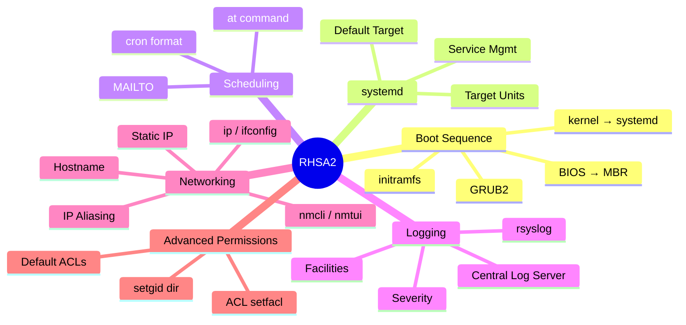
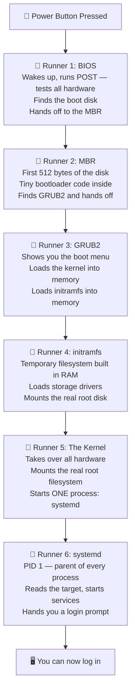
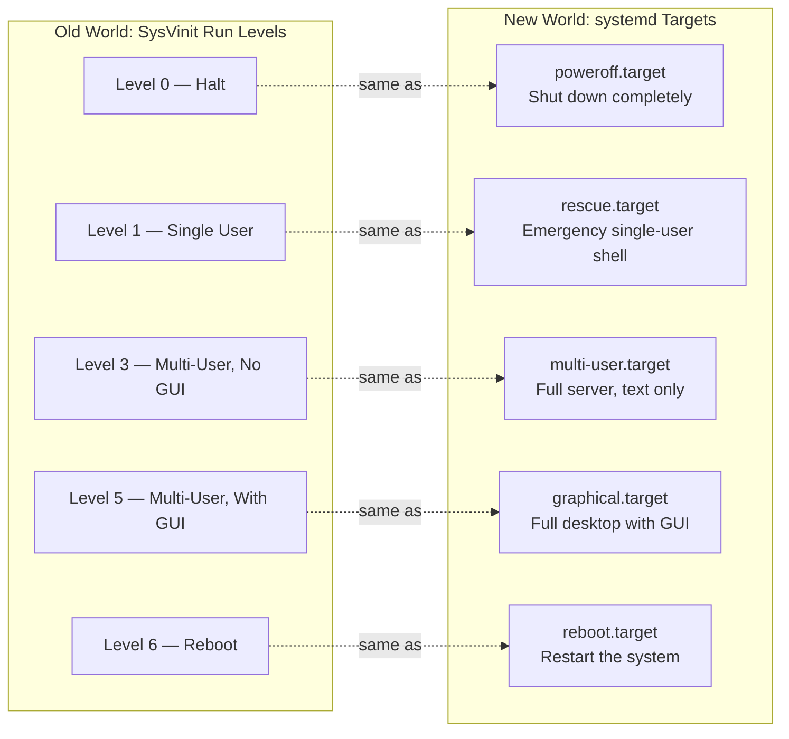
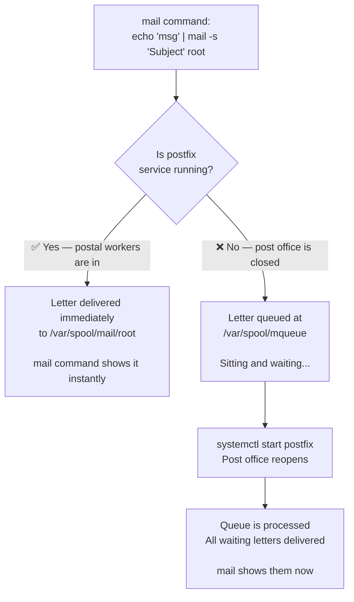
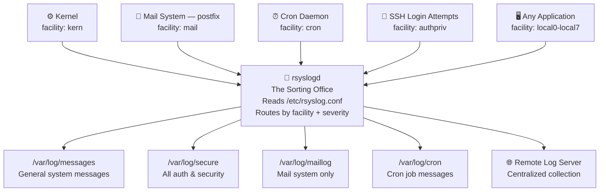
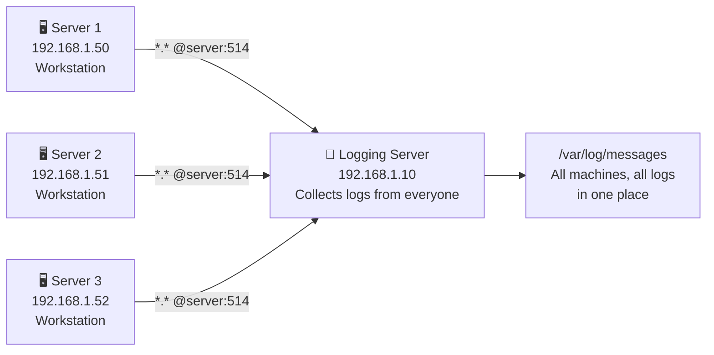
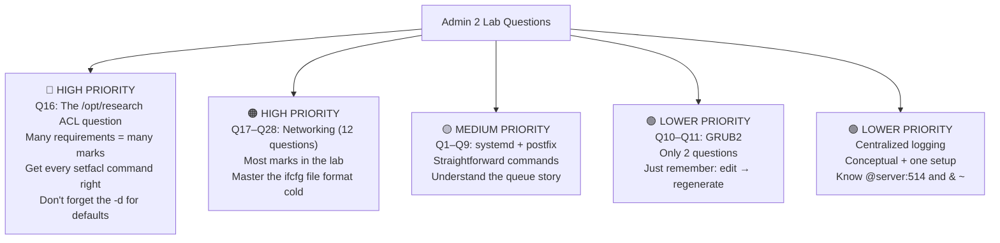

# 🚀 RHSA2 — Red Hat System Administration II
## Deep Study Guide — Story Edition
**ITI Open Source Track**
*Builds on Admin 1 | Topics: Boot • systemd • Scheduling • Logging • Networking • Permissions*

---

## 📋 Admin 2 Topics Map



---

## 🔗 Before We Start — The Bridge from Admin 1 to Admin 2

Think of Admin 1 as learning how to use tools — a hammer, a screwdriver, a drill. You practiced on small things. Admin 2 is where you walk into a real building site and use those exact same tools to build something serious. Every single Admin 2 topic connects back to something you already know. Here's that map:

| You learned in Admin 1... | Admin 2 uses it for... |
|--------------------------|----------------------|
| `vi` editor | Editing GRUB2 config, rsyslog.conf, network config files |
| `systemctl` basics | Full service lifecycle — start, stop, enable, the postfix lab |
| `chmod` and `chown` | Building the foundation for ACLs and setgid directories |
| `grep` and `cut` | Filtering log files, extracting data from config files |
| `cron` and `at` | Deep scheduling — the format, MAILTO, job output |
| Processes and daemons | Understanding what systemd is actually managing |
| Redirection `>>` | Sending cron job output to log files |
| `mail` command | Used in 7 out of the first 15 lab questions |

Keep that table in mind. When something in Admin 2 feels hard, look for the Admin 1 tool it's built on.

---

# 🥾 TOPIC 1 — The Linux Boot Sequence

---

## The Story: A Relay Race from Dead Hardware to Login Prompt

Picture your server sitting in a data center. It's powered off — completely dead. Just silicon, metal, and electricity waiting to happen. Someone presses the power button. What happens next is a **relay race** — six runners, each doing their specific job and then passing the baton to the next one.

Miss one handoff, drop the baton once — and the system doesn't boot. This is why understanding the boot sequence matters: when something goes wrong at 3 AM and your server won't start, you need to know *which runner* dropped the baton and why.



Now let's follow each runner in detail.

---

## 🏃 Runner 1 — BIOS (Basic Input/Output System)

The moment power flows in, the BIOS wakes up. It's a tiny program burned permanently into a chip on your motherboard — it was there before Linux, before any operating system. Its job is simple but critical: **make sure the hardware is actually there and working before anything else tries to use it.**

It does this by running something called the **POST — Power-On Self Test**. Think of the BIOS as a flight attendant doing a safety check before takeoff. "RAM present and responding? ✅ CPU functional? ✅ Hard drive detected? ✅ Keyboard found? ✅." If something critical is missing or broken, the BIOS sounds an alarm (literally — those mysterious beep codes you sometimes hear from a computer that won't boot are the BIOS telling you what failed) and refuses to continue.

Once the safety check passes, the BIOS has one last job: find where Linux is hiding. It looks at its boot order list — "check USB first, then DVD, then hard drive" — and when it finds the right bootable disk, it reads the very first 512 bytes of that disk. That special area is called the **MBR**. The BIOS loads those 512 bytes into RAM and says "your turn."

> 💡 The BIOS has absolutely no idea what Linux is. It doesn't know about filesystems, partitions, or operating systems. It just knows: "load the first 512 bytes of this disk and execute them." All the intelligence comes from what's stored in those 512 bytes.

---

## 🏃 Runner 2 — MBR (Master Boot Record)

Here's a fun constraint: the MBR is **exactly 512 bytes**. That's it. To put that in perspective, this paragraph you're reading right now is longer than 512 bytes. So the entire job of the MBR has to squeeze into that tiny space, and it's divided up very precisely:

```
┌──────────────────────────────────────────────────────────┐
│  446 bytes  →  The actual bootloader code                │
│               "Find GRUB2 on the disk and jump to it"    │
├──────────────────────────────────────────────────────────┤
│   64 bytes  →  The partition table                       │
│               "Here's where each partition starts/ends"  │
├──────────────────────────────────────────────────────────┤
│    2 bytes  →  Magic number: 0x55AA                      │
│               "I am a valid boot sector"                 │
└──────────────────────────────────────────────────────────┘
                  Total: exactly 512 bytes
```

Those 446 bytes of bootloader code have one goal: find GRUB2 (which lives somewhere in the `/boot` partition), load it into memory, and hand control over to it. The MBR is so small it can't do anything fancy — it's purely a "find the real bootloader and go there" courier.

The **magic number** `0x55AA` at the very end is how the BIOS verifies it actually found a valid boot sector and not just random garbage data on the disk. If those final two bytes aren't exactly `0x55AA`, the BIOS rejects the disk and tries the next one in the boot order.

---

## 🏃 Runner 3 — GRUB2 (GRand Unified Bootloader)

Now we have room to breathe. GRUB2 is a real, sophisticated piece of software. If you've ever seen that menu when you boot a Linux machine — "Red Hat Enterprise Linux 7" at the top with a countdown timer — that's GRUB2's work.

Think of GRUB2 as the **maitre d' at a restaurant**. You walk in (the computer boots), the maitre d' greets you and shows you a menu of options: "Tonight we have RHEL 7, RHEL 7 rescue mode, or perhaps Windows?" You have a few seconds to choose. If you don't pick anything, the maitre d' goes with the house recommendation. Once you've chosen, they tell the kitchen (loads your chosen kernel and initramfs into memory) and the meal begins.

### The Two Config Files — The Most Important Thing to Know About GRUB2

GRUB2 has two config files, and confusing them is a classic mistake:

```
/boot/grub2/grub.cfg       ← The actual menu GRUB2 reads at boot time.
                              AUTO-GENERATED by a command.
                              If you edit this directly, your changes get
                              wiped the next time grub2-mkconfig runs.
                              ⛔ Never edit this file directly.

/etc/default/grub           ← The blueprint. This is where you make changes.
                              Human-readable settings.
                              ✅ This is the file you always edit.
```

The relationship between them: `/etc/default/grub` is your **blueprint**, and `/boot/grub2/grub.cfg` is the **finished building**. You never grab a chisel and carve directly into the finished building — you update the blueprint and run a construction tool to rebuild it.

That construction tool is:
```bash
grub2-mkconfig -o /boot/grub2/grub.cfg
```

**You must run this command every single time you change `/etc/default/grub`.** Without it, GRUB2 never sees your changes. This is the #1 mistake people make with GRUB2 configuration.

### What You Can Configure in `/etc/default/grub`

Open the file and you'll see something like this:
```bash
GRUB_TIMEOUT=5
GRUB_DISTRIBUTOR="$(sed 's, release .*$,,g' /etc/system-release)"
GRUB_DEFAULT=saved
GRUB_DISABLE_SUBMENU=true
GRUB_TERMINAL_OUTPUT="console"
GRUB_CMDLINE_LINUX="crashkernel=auto rhgb quiet"
GRUB_DISABLE_RECOVERY="true"
```

The ones that matter for the lab:

```bash
GRUB_TIMEOUT=5
# How many seconds the boot menu stays on screen before auto-booting.
# Set to 0 = skip the menu entirely and boot immediately.
# Set to -1 = wait forever until user makes a choice.
# Lab Q10 asks you to change this to 20.

GRUB_DEFAULT=saved
# Which menu entry boots automatically when the timer runs out.
# "saved" = remember whatever was chosen last time.
# 0 = always boot the first entry in the menu.
# 1 = always boot the second entry.
# Lab Q11 asks you to change this to select a different OS.

GRUB_CMDLINE_LINUX="crashkernel=auto rhgb quiet"
# Extra arguments passed directly to the Linux kernel when it starts.
# rhgb = show a graphical progress bar during boot instead of text.
# quiet = suppress the wall of text kernel messages during boot.
```

### Lab Q10 — Change the Boot Timeout to 20 Seconds

```bash
# Step 1: Open the blueprint file
vi /etc/default/grub

# Step 2: Find the timeout line and change it
GRUB_TIMEOUT=5      # ← find this line
GRUB_TIMEOUT=20     # ← change it to this

# Step 3: Rebuild the actual GRUB2 config from the blueprint
grub2-mkconfig -o /boot/grub2/grub.cfg
# You'll see output like "Generating grub configuration file ..."
# That means it worked.
```

### Lab Q11 — Change the Default Operating System

```bash
# Step 1: First, find out what's on the menu and their index numbers
awk -F\' '/^menuentry / {print NR-1": ", $2}' /boot/grub2/grub.cfg
# Output might look like:
# 0:  Red Hat Enterprise Linux 7 (Core)
# 1:  Red Hat Enterprise Linux 7 (0-rescue-...)
# The number on the left is the index you use in GRUB_DEFAULT.

# Step 2: Open the blueprint
vi /etc/default/grub

# Step 3: Change GRUB_DEFAULT to the index number you want
GRUB_DEFAULT=saved  # ← change this
GRUB_DEFAULT=1      # ← to this (or whichever index you want)

# Step 4: Rebuild — always, every time, no exceptions
grub2-mkconfig -o /boot/grub2/grub.cfg
```

---

## 🏃 Runner 4 — initramfs (Initial RAM Filesystem)

Here's a classic chicken-and-egg problem: to read your hard drive, the kernel needs **storage drivers** (like SCSI, RAID, or LVM drivers). But those drivers are *stored on the hard drive*. How do you load drivers from a disk you can't read yet?

The answer is **initramfs** — a tiny, self-contained mini-Linux system that lives entirely in **RAM**. Think of it like a **paramedic's first-responder kit**. When a paramedic arrives at a scene, they don't carry a full hospital in their bag — just the essential tools needed to stabilize the patient right now, well enough to reach the actual hospital. initramfs carries just enough drivers to access the real hard drive, mount the real root filesystem, and then hand control to the real system.

Here's what initramfs does step by step:
1. GRUB2 loads both the kernel AND the initramfs image file into RAM simultaneously
2. The kernel starts and immediately mounts initramfs as a temporary root `/`
3. initramfs runs its startup scripts — loading the specific storage drivers this system needs
4. With those drivers loaded, the real root partition can now be read
5. The real root filesystem gets mounted at `/`
6. initramfs hands control to the real systemd, then unmounts itself and disappears from memory

```bash
lsinitrd              # peek inside your initramfs image to see what drivers it has
dracut                # the tool that BUILDS the initramfs image
                      # runs automatically whenever a new kernel is installed
```

> 💡 If a kernel update ever breaks your system at boot — you see it trying to boot but then getting stuck — it's often because dracut built an initramfs missing a driver that your storage hardware needs. Knowing this saves you hours of confused troubleshooting.

---

## 🏃 Runner 5 — The Kernel

With initramfs doing the groundwork, the kernel finally mounts the real root filesystem properly, takes full control of all hardware, sets up memory management, and then does something remarkable:

It starts **exactly one process**.

Just one.

That process is **systemd**, and it receives **PID 1** — Process ID number 1. Every single other process on the entire system will be either started directly by systemd, or started by something that systemd started. systemd is the ancestor of everything. The entire process tree of your running system hangs off PID 1.

---

## 🏃 Runner 6 — systemd

systemd wakes up with PID 1 and immediately asks one question: *"What state should this system be in?"*

It finds the answer by reading a symbolic link:
```bash
ls -l /etc/systemd/system/default.target
# → /etc/systemd/system/default.target -> /usr/lib/systemd/system/graphical.target
```

That link points to a **target file** — a description of what a fully-running system should look like. "Should there be a graphical desktop? Just a text console? Just a minimal emergency shell?" The target tells systemd which services to start, which units to activate, what state to reach.

Then systemd gets to work — starting services in parallel (much faster than the old sequential SysVinit), setting the hostname, mounting filesystems, initializing the network, starting the mail server, the cron scheduler, the logging system — and eventually presenting you with a login prompt.

The relay race is complete. Six runners, six handoffs, one login prompt.

---

# ⚙️ TOPIC 2 — systemd & Target Units

---

## The Story: systemd is the City Manager

Imagine your Linux system as a city. The kernel is the terrain — roads, electricity grids, water pipes. Infrastructure. But a city doesn't run on infrastructure alone. You need the post office open. You need the police department staffed. You need traffic lights running. You need the hospital ready. Someone has to coordinate all of this.

**systemd is the city manager.** When the city "boots up" each morning, the city manager reads a master plan (the target) and goes through a checklist: "Start the network department. Start the mail department. Start the logging department. Start the web server department." And critically — if one department fails to open, the city manager logs the incident and keeps going with the rest. The city doesn't grind to a halt because one department had a problem.

In Linux terms, each "department" is a **service unit**. systemd starts them, monitors them, automatically restarts them if they crash, and shuts them down cleanly when the city closes at night.

---

## The Old World vs The New World — Run Levels to Targets

Before systemd, Linux used a simpler but more rigid system called **SysVinit** with numbered **run levels**. It was like a city that could only operate in 6 preset "modes": mode 0 means everyone goes home, mode 3 means all offices open but no entertainment venues, mode 5 means the whole city is open including restaurants and theaters.

systemd replaced these numbered modes with **named targets** that are more descriptive and flexible:



For a **production server**, you want `multi-user.target`. Servers don't need a graphical desktop — that's just wasted RAM and an extra attack surface. The lab starts with the system in `graphical.target` and asks you to permanently switch it to `multi-user.target`.

---

## Two Ways to Change Target — And Why the Difference Matters

This is a subtle distinction the exam loves to test:

**`systemctl set-default`** — changes the city's *permanent opening plan* for next time. Tomorrow when the city opens for business, it'll use this new plan. But right now, while the city is already running, nothing changes. People are still at their desks, services are still running.

**`systemctl isolate`** — throws out the current mode right now and switches immediately, while the city is running. The city manager sends out an all-hands message: "Effective immediately, we're switching to multi-user mode. All GUI desktops must close. Everyone not essential, go home." Services not needed in the new target get stopped on the spot.

```bash
# See what the current default target is
systemctl get-default
# → graphical.target   (or multi-user.target)

# Lab Q2: Change the default to multi-user and reboot into it
systemctl set-default multi-user.target   # update the permanent plan
reboot                                     # restart so the new plan takes effect

# After reboot, verify:
systemctl get-default
# → multi-user.target  ✅

# To switch right now without rebooting (no reboot needed):
systemctl isolate multi-user.target
```

---

## Managing Services — Opening and Closing Departments

Each service is a department. You have full control: open it, close it, restart it, decide if it opens every morning automatically.

```bash
# ── WHAT'S HAPPENING RIGHT NOW? ──────────────────────────────
systemctl status postfix
# Shows:  ● postfix.service - Postfix Mail Transport Agent
#            Loaded: loaded (/usr/lib/systemd/system/postfix.service; enabled)
#            Active: active (running) since Mon 2024-01-01 08:00:00
#         Main PID: 1234 (master)
# Plus the last few log lines — very useful for debugging!

# ── START / STOP / RESTART ───────────────────────────────────
systemctl start postfix      # open the department RIGHT NOW
systemctl stop postfix       # close the department RIGHT NOW
systemctl restart postfix    # close then immediately reopen (apply config changes)
systemctl reload postfix     # tell staff to re-read their instructions
                             # (no downtime — the service keeps running)

# ── WILL IT SURVIVE A REBOOT? ────────────────────────────────
systemctl enable postfix     # "add postfix to the morning checklist"
systemctl disable postfix    # "remove postfix from the morning checklist"
systemctl is-enabled postfix # "is postfix on the morning checklist?"

# ── THE COMBINED SHORTCUT ─────────────────────────────────────
systemctl enable --now postfix   # enable for boot AND start right now
                                 # the most common real-world command

# ── LIST ALL DEPARTMENTS ──────────────────────────────────────
systemctl list-units --type=service           # Lab Q1: currently active services
systemctl list-units --type=service --all     # all services, including stopped ones
systemctl list-unit-files --type service      # which are enabled vs disabled for boot
```

> ⚠️ **The trap everyone falls into:**
> `systemctl start` starts it now but it's forgotten after reboot.
> `systemctl enable` survives reboots but doesn't start it right this moment.
> You almost always want **both** — use `enable --now`.

---

## 📬 The Postfix Story — Lab Questions 1 Through 9

The first nine lab questions aren't nine separate isolated tasks — they're **one continuous story** about the relationship between a service (postfix, the mail server) and the thing that depends on it (mail delivery). Follow the story and the commands will make complete sense.

**The setup:** postfix is the city's postal department. When you send mail using the `mail` command, you're dropping an envelope in the outbox. postfix picks it up, processes it, and delivers it to the recipient's mailbox at `/var/spool/mail/username`. If the postal department is closed? Your envelope sits in a queue, waiting.

### Q1 — Taking Stock Before We Start

Before changing anything, look at all currently running services:
```bash
systemctl list-units --type=service
# Scroll through — find postfix. Is it running?
# Look at the ACTIVE column: "active" = running, "inactive" = stopped
```

### Q2 — The Server Doesn't Need a Desktop

A server running in graphical mode is wasteful. Switch to text-only multi-user mode:
```bash
systemctl set-default multi-user.target
reboot
# Log back in. You now have a text terminal. This is correct for a server.
systemctl get-default   # verify: should say multi-user.target
```

### Q3 & Q4 — Sending Mail and Confirming It Arrives

postfix is running. Let's send a letter to root:
```bash
echo 'This is the test email body' | mail -s 'Hello Root' root
#                   ↑ the body                ↑ subject     ↑ recipient
```

The mail command pipes the body text to postfix, which delivers it immediately to `/var/spool/mail/root`.

To read it, open the mail reader:
```bash
mail
# You see a list of messages. Type the number to read one.
# d = delete,  r = reply,  q = quit
# Or bypass the reader and just look at the raw file:
cat /var/spool/mail/root
```

### Q5, Q6, Q7 — What Happens When the Postal Workers Go Home?

Now shut down the postfix service — close the post office:
```bash
systemctl stop postfix
```

Send another letter:
```bash
echo 'Will this get delivered?' | mail -s 'Test While Stopped' root
```

Check the mail:
```bash
mail
# Nothing new! Where did the letter go?
```

The letter didn't disappear — it's sitting in the **mail queue** at `/var/spool/mqueue`. The `mail` command accepted it (it can store messages locally) but without postfix running, nothing gets delivered further. It's like dropping a letter in a locked post office — it's there, but nobody is processing it.



### Q8 & Q9 — The Post Office Reopens

Start postfix again:
```bash
systemctl start postfix
```

The moment postfix starts, its very first action is checking the queue. It sees the undelivered message from Q6, processes it immediately, and drops it in root's mailbox.

```bash
mail
# The message from Q6 is now there — delivered the moment postfix came back online.
```

**The lesson from these 9 questions:** Services are dependencies. Understand what depends on what, and you understand why things work — or don't.

---

# 📅 TOPIC 3 — Task Scheduling with cron

---

## The Story: The Automated Night Watchman

You're a system administrator, and you need to monitor your server's memory every 10 minutes throughout the business day to investigate a performance problem. You can't sit there manually running `free` every 10 minutes from 8 AM to 5 PM. You'd go insane. You need to hire someone to do it automatically.

That someone is **cron** — a service (`crond`) that runs silently in the background, wakes up every single minute, looks at a schedule, and asks: "Is there anything I'm supposed to run right now?" If yes, it runs it and goes back to sleep. If no, it just goes back to sleep. It never gets tired, never forgets, never takes a day off.

The schedule lives in a **crontab** — a table of jobs and when to run them. Think of it as the watchman's printed instruction sheet pinned to the wall: "At 8:00 AM, run this. Every 10 minutes, run that. At midnight on Fridays, archive these logs."

---

## Reading the Crontab Format — Five Fields and a Command

Every cron job is written as one line with six parts separated by spaces:

```
MIN    HOUR    DOM    MON    DOW    command
 ↑       ↑      ↑      ↑      ↑       ↑
0-59   0-23   1-31   1-12   0-6    what to run
                            (Sun=0)
```

The trick to reading crontab lines is to say them out loud in English. Let's practice:

```bash
30 8 * * 1-5    /usr/bin/backup.sh
# "At 8 hours and 30 minutes, any day of month, any month,
#  but only days 1-5 (Monday through Friday) → run backup.sh"
# In plain English: "8:30 AM on weekdays"

0 2 * * *       /usr/bin/cleanup.sh
# "At minute 0 of hour 2, every day, every month, every day of week"
# In plain English: "2:00 AM every day"

*/10 8-17 * * * /usr/bin/vmstat >> /var/log/perf.log
# "Every 10 minutes (*/10), but only during hours 8 through 17,
#  every day of month, every month, every day of week"
# In plain English: "Every 10 minutes between 8 AM and 5 PM, every day"
```

The special syntax pieces you need to know:

| Symbol | What it means | Real example |
|--------|--------------|-------------|
| `*` | Every possible value — wildcard | `* * * * *` = run every single minute |
| `*/n` | Every n steps | `*/10` in MIN = every 10 minutes |
| `a-b` | Range from a to b inclusive | `8-17` in HOUR = 8 AM through 5 PM |
| `a,b,c` | A list of specific values | `1,15` in DOM = 1st and 15th of the month |
| `@daily` | Shortcut for once per day | Same as `0 0 * * *` |
| `@reboot` | Run once after every system boot | Useful for startup tasks |

---

## The MAILTO Feature — The Watchman Sends a Report

Here's something that surprises everyone the first time: **cron automatically emails the output of every job to someone.** When your scheduled command produces output — like `vmstat` printing memory stats to stdout — cron captures that output and mails it.

Who does it send to? The variable `MAILTO` at the top of your crontab controls this. By default it goes to the user who owns the crontab (root, in our case).

```bash
# Open root's crontab to edit it:
crontab -e

# Default behavior — output emailed to root:
MAILTO=root
*/10 8-17 * * * /usr/bin/vmstat        # output → mailed to root

# Lab Q14 — redirect output to the manager user:
MAILTO=manager
*/10 8-17 * * * /usr/bin/vmstat        # output → mailed to manager

# Suppress all email (if you don't want any):
MAILTO=""
*/10 8-17 * * * /usr/bin/vmstat        # no email at all

# Save to a log file instead of emailing (using redirection from Admin 1):
*/10 8-17 * * * /usr/bin/vmstat >> /var/log/perf_report.log
# The >> appends each run's output to the file
# No MAILTO needed here — output goes to file, not email
```

---

## Lab Questions 12 Through 15 — The Full Scheduling Walkthrough

### Q12 — Monitor Memory Every 10 Minutes During Business Hours

Your boss suspects a memory leak. You need data points every 10 minutes from 8 AM to 5 PM:

```bash
crontab -e    # opens root's crontab in vi

# Option A: save to a log file (easiest to review later)
*/10 8-17 * * * /usr/bin/vmstat >> /var/log/perf_report.log

# Option B: the memory-focused command — free -h shows memory clearly
*/10 8-17 * * * /usr/bin/free -h >> /var/log/perf_report.log

# Option C: sar -r gives the most detailed memory breakdown
# (requires the sysstat package to be installed)
*/10 8-17 * * * /usr/bin/sar -r >> /var/log/perf_report.log

# Option D: email to root on every run
MAILTO=root
*/10 8-17 * * * /usr/bin/vmstat
```

> 💡 **Why the full path `/usr/bin/vmstat` instead of just `vmstat`?**
> When cron runs your commands, it uses an extremely minimal `$PATH` — it doesn't have the same directory list that you have in your interactive shell. To be safe and avoid "command not found" errors, always use the absolute path to the command. Find it with `which vmstat`.

### Q13 — Checking Root's Mailbox for cron Reports

After your cron jobs have run a few times (wait for a scheduled time to pass, or temporarily change it to `*/1` to run every minute for testing), check root's mail:

```bash
mail
# You'll see a list of messages from cron (CRON DAEMON is the sender)
# Type a message number to read it — you'll see the vmstat output inside
# d = delete the message
# q = quit the mail reader
```

### Q14 — Redirect cron Output to the Manager User

The manager wants these memory reports sent directly to them. Edit the crontab:
```bash
crontab -e

# Change (or add) the MAILTO variable before the job:
MAILTO=manager
*/10 8-17 * * * /usr/bin/vmstat
```

Now every time that cron job runs, the output goes to the `manager` user's mailbox instead of root's.

### Q15 — Read the Mail as the Manager User

Switch to the manager user and check their mailbox:
```bash
su - manager       # become the manager user (the - loads their environment)
mail               # open their mailbox
# The memory reports from cron should be here
exit               # return to root when done
```

---

## Who Can Use cron? Access Control

Cron has a gatekeeper system using two files:

| What exists | Who can schedule cron jobs? |
|-------------|---------------------------|
| `/etc/cron.allow` exists | **Only** users listed in this file — everyone else blocked |
| Only `/etc/cron.deny` exists | Everyone **except** users listed in this file |
| Neither file exists | All users can use cron |
| Both files exist | `cron.allow` takes priority — only listed users |

> 💡 **Admin 1 connection:** This is the exact same pattern as `/etc/at.allow` and `/etc/at.deny` for the `at` command. If you learned that pattern in Admin 1, you already know this one.

---

# 📋 TOPIC 4 — Managing System Logs with rsyslog

---

## The Story: The City's Central Postal Sorting Office

Your Linux system is a busy city with hundreds of departments running simultaneously — the web server, the mail server, the authentication system, the scheduler, the kernel itself. Every single department generates events all day long: "User islam logged in." "Connection from 192.168.1.5 refused." "Service restarted." "Disk space at 90%."

These events are called **log messages**, and there are thousands of them every hour. Without organization, they'd be meaningless noise. You'd never find the one message that explains why your server crashed at 2 AM.

**rsyslogd** is the city's **central postal sorting office**. Every log message generated anywhere in the system gets sent to rsyslog. rsyslog reads two things printed on each message's "envelope": **who sent it** (the facility) and **how urgent it is** (the severity level). Then it routes the message to the appropriate "mailbox" — a specific log file — based on routing rules you define in its configuration file.



---

## The Envelope — Reading Facility and Severity

### The Facility — Which Department Sent This?

| Facility | Who it represents |
|----------|-----------------|
| `kern` | The Linux kernel itself |
| `mail` | The mail system (postfix, sendmail) |
| `daemon` | Background service daemons |
| `cron` | Cron and at job messages |
| `authpriv` | Authentication — SSH logins, su, sudo |
| `local0`–`local7` | Reserved for your own custom applications |
| `*` | Every facility — the catch-all |

### The Severity — How Urgent Is This Message?

Picture a scale where one end is "the building is on fire" and the other end is "here's some detailed debugging info that probably nobody will ever read":

```
emerg    ← The system is DOWN. Complete failure.               (most urgent)
alert    ← Act right now or something will break.
crit     ← A critical component has failed.
err      ← An error happened, but system keeps running.
warning  ← Something unusual. Worth investigating.
notice   ← Normal operation but significant enough to log.
info     ← Routine informational messages.
debug    ← Extremely verbose. Only for troubleshooting.        (least urgent)
```

> 🔑 **The critical rule about severity:** When you write `mail.warning` in a config rule, you're saying "capture warning severity AND EVERYTHING MORE URGENT THAN IT." So you get warning, err, crit, alert, and emerg — but NOT info or debug. Think of it as "this urgent or worse."

### The Routing Rules — Teaching rsyslog to Sort Mail

Rules in `/etc/rsyslog.conf` follow a simple pattern:
```
facility.severity     destination
```

Real examples from the default RHEL config:
```bash
# Everything info+ severity, but NOT mail, auth, or cron:
*.info;mail.none;authpriv.none;cron.none    /var/log/messages
# The .none suffix means "exclude this facility entirely"

# All authentication messages (any severity) go here:
authpriv.*          /var/log/secure

# All mail system messages go here:
mail.*              /var/log/maillog

# All cron messages go here:
cron.*              /var/log/cron

# System emergencies? Broadcast to every logged-in terminal:
*.emerg             *
```

---

## The Centralized Logging Story — One Sorting Office for the Whole City

Your boss manages 5 servers across the office. When a production issue happens at 2 AM, they don't want to SSH into each of 5 separate servers, dig through 5 separate log files, trying to piece together what happened across all of them. They want **one place** where all servers send their logs — a single sorting office that collects mail from every building in the entire city.

This is **centralized logging**, and it's one of the most common real-world sysadmin setups you'll encounter.



### Step 1 — Configure the Logging Server to Accept Incoming Messages

By default, rsyslog only listens for messages generated locally on its own machine. To accept messages from other machines, you need to unlock its receiving doors. Edit `/etc/rsyslog.conf` on the logging server:

```bash
vi /etc/rsyslog.conf

# Find these lines — they exist but are commented out by default:

# For UDP (fast delivery, but messages could theoretically be lost):
$ModLoad imudp
$UDPServerRun 514

# For TCP (reliable delivery, guaranteed arrival order):
$ModLoad imtcp
$InputTCPServerRun 514

# Uncomment the ones you want (remove the # at the start of each line)
```

Then restart rsyslog to apply the changes, and open the firewall so other machines can actually reach port 514:
```bash
systemctl restart rsyslog

firewall-cmd --permanent --add-port=514/udp
firewall-cmd --permanent --add-port=514/tcp
firewall-cmd --reload
```

### Step 2 — Configure Each Workstation to Forward Its Logs

On every machine that should send its logs to the central server, add a forwarding rule to `/etc/rsyslog.conf`:

```bash
vi /etc/rsyslog.conf

# Add this line anywhere in the rules section:
*.* @192.168.1.10:514       # one @ sign = send via UDP

# OR for TCP (more reliable):
*.* @@192.168.1.10:514      # two @@ signs = send via TCP
```

That one line `*.* @server:514` translates to: "Take every message from every facility at every severity level and forward a copy to the server at that IP address on port 514."

```bash
# Apply the change:
systemctl restart rsyslog
```

### Step 3 — Test That It's Working

```bash
# On the WORKSTATION — generate a test log message:
logger 'Test from workstation: centralized logging is set up'
# logger is a command that manually injects a message into the logging system

# On the LOGGING SERVER — watch the log file in real time:
tail -f /var/log/messages
# You should see your message appear within a second or two:
# Jan 01 10:00:00 workstation root: Test from workstation: centralized logging is set up
```

---

## The Deep Questions — Understanding What's Really Happening

### "Does the message appear in the logging server's /var/log/messages?"

Yes — if the setup is correct. You'll see the message show up in the `tail -f` output on the server almost instantly after running `logger` on the workstation.

### "Why does the message ALSO appear on the workstation's own /var/log/messages?"

This is the question that trips people up. You set up forwarding — so why is the message still appearing locally?

Because rsyslog processes the message **locally first**, then separately runs the forwarding rule. The workstation's `/etc/rsyslog.conf` still has this rule that was there before you added forwarding:
```bash
*.info;mail.none;authpriv.none;cron.none    /var/log/messages
```

This rule runs first: "info or above severity → write to local /var/log/messages." It fires and writes the message to the local file. Then separately, your new forwarding rule `*.* @server:514` also fires and sends a copy to the server.

Both rules match. Both actions happen. The message appears in both places.

### "How Do You Make It Appear ONLY on the Logging Server?"

You need to tell rsyslog: "After forwarding this message, **throw it away** — don't let it fall through to any other rules that would write it locally."

The discard action in rsyslog is written as `& ~` — the tilde symbol means "discard":

```bash
# In the workstation's /etc/rsyslog.conf:
*.* @192.168.1.10:514       # Rule 1: forward everything to the server
& ~                          # Rule 2: discard — stop processing this message
```

The `& ~` on its own line means "apply the discard action to whatever matched the rule above." So rsyslog forwards it, then immediately discards it before it can reach the `write to /var/log/messages` rule. The message now lives only on the server.

---

# 🌐 TOPIC 5 — Network Configuration

---

## The Story: Giving Your Server a Street Address

Think of your server as a building that receives and sends packages. Before any package can arrive, before any package can leave, your building needs to be properly registered in the city's address system. A building needs four things:

- **A street address** (IP address) — the unique number that identifies your building
- **A neighborhood boundary** (subnet mask) — defines which buildings are on your local street vs. which are across town
- **A post office** (default gateway) — where you send packages that aren't on your local street; it routes them further
- **A phone directory** (DNS server) — translates human-readable names ("google.com") into numeric addresses your network actually uses

Network configuration is the process of giving your server all four of these.

---

## First — See What You Already Have

Before changing anything, find out what's currently configured:

```bash
# Modern way (preferred on RHEL 7+):
ip addr show
# Shows every interface with its IP address and status

ip link show
# Shows every interface with its MAC address and whether it's UP or DOWN

# Classic way (older but still works and still asked in labs):
ifconfig           # shows only active/UP interfaces
ifconfig -a        # shows ALL interfaces, including ones that are DOWN
```

### Lab Q17 — Show Your MAC Address Two Different Ways

Your MAC address (Media Access Control address) is the permanent hardware identifier burned into your network card at the factory. Every network card in the world has a globally unique one. It looks like `52:54:00:ab:cd:ef` — six pairs of hex digits.

```bash
# Way 1 — using the modern ip command:
ip link show
# Look for the line starting with "link/ether" under your interface:
# 2: eth0: <BROADCAST,MULTICAST,UP,LOWER_UP>
#     link/ether 52:54:00:ab:cd:ef brd ff:ff:ff:ff:ff:ff

# Way 2 — using ifconfig and grep to filter:
ifconfig -a | grep ether
# Output: ether 52:54:00:ab:cd:ef  txqueuelen 1000  (Ethernet)
```

### Lab Q18 & Q19 — Active Interfaces vs All Interfaces

```bash
# Q18: Show only active (currently UP and connected) interfaces:
ip addr show          # ip always shows all, but active ones show "UP" in flags
ifconfig              # without -a, only shows active interfaces

# Q19: Show ALL interfaces including ones that are DOWN:
ip addr show          # already shows everything
ifconfig -a           # the -a flag forces "show all, even DOWN ones"
```

---

## Bringing an Interface Up and Down

Sometimes you need to disconnect a network interface and reconnect it — maybe you're changing its IP configuration and want to apply the new settings cleanly:

```bash
# Bring the interface DOWN — disconnect it from the network:
ip link set eth0 down    # Lab Q20 — modern way
ifdown eth0              # older way, reads the config file

# Bring the interface back UP — reconnect it:
ip link set eth0 up      # Lab Q22 — modern way
ifup eth0                # older way, reads and applies the config file
```

> 💡 Replace `eth0` with your actual interface name. On newer systems it might be `ens33`, `eno1`, `enp2s0`, or something similar. Use `ip link show` to see the real name on your system.

---

## Configuring a Static IP — Filling in the Address Registration Form

On RHEL and CentOS, every network interface has its own configuration file stored here:
```
/etc/sysconfig/network-scripts/ifcfg-<interface_name>
```

For `eth0`, the file is `/etc/sysconfig/network-scripts/ifcfg-eth0`.

Think of this file as your building's official address registration form. You fill it in completely, save it, and the next time the interface starts up, it reads the form and configures itself exactly as specified.

```bash
# Lab Q21 — Open the form and fill it in for a static IP:
vi /etc/sysconfig/network-scripts/ifcfg-eth0
```

Here's what a complete static IP configuration looks like:
```bash
DEVICE=eth0              # which interface this file belongs to
BOOTPROTO=none           # "none" or "static" = I'm configuring this manually
                         # (change to "dhcp" for dynamic — that's Lab Q24)
IPADDR=192.168.1.100     # the IP address you want this interface to have
NETMASK=255.255.255.0    # defines the network boundary (/24 = 256 addresses)
GATEWAY=192.168.1.1      # your router — where to send traffic going elsewhere
DNS1=8.8.8.8             # primary DNS server (Google's public DNS)
DNS2=8.8.4.4             # backup DNS server
ONBOOT=yes               # "yes" = automatically bring this interface up at boot
```

After filling in the form and saving it:
```bash
ifup eth0           # bring the interface up using the config file you just edited
ifconfig eth0       # Lab Q23 — verify the IP was applied correctly
```

---

## Configuring Dynamic IP — Letting DHCP Handle It

If your server should get its address automatically from a DHCP server:

```bash
# Method 1 — Edit the config file:
vi /etc/sysconfig/network-scripts/ifcfg-eth0
# Change: BOOTPROTO=none  →  BOOTPROTO=dhcp
# Remove (or comment out) the IPADDR, NETMASK, GATEWAY lines
# Keep: ONBOOT=yes
ifup eth0

# Method 2 — Use NetworkManager (Lab Q24):
nmcli con mod eth0 ipv4.method auto    # "auto" means "use DHCP"
nmcli con up eth0                       # activate the connection with new settings

# Method 3 — Text-based UI, the most beginner-friendly option:
nmtui     # launches a menu interface — just click through the options
```

After switching to DHCP, verify both ways (Lab Q25):
```bash
ifconfig eth0                                        # see what IP was assigned
cat /etc/sysconfig/network-scripts/ifcfg-eth0       # see the config file contents
```

---

## IP Aliasing — One Card, Three Addresses (Lab Q27)

Here's a real scenario: you're running three websites on one server, and each website needs its own unique IP address. But you only have one physical network card. Solution: **IP aliases** — virtual interfaces named `eth0:1`, `eth0:2`, etc. They share the physical hardware but each has its own address.

```bash
# Step 1: Create alias config files by copying the main one:
cp /etc/sysconfig/network-scripts/ifcfg-eth0 \
   /etc/sysconfig/network-scripts/ifcfg-eth0:1

# Step 2: Edit the alias file — only two things change:
vi /etc/sysconfig/network-scripts/ifcfg-eth0:1
# Change DEVICE to:  DEVICE=eth0:1
# Change IPADDR to:  IPADDR=192.168.1.101   ← a DIFFERENT IP

# Step 3: Repeat for a second alias:
cp /etc/sysconfig/network-scripts/ifcfg-eth0 \
   /etc/sysconfig/network-scripts/ifcfg-eth0:2
vi /etc/sysconfig/network-scripts/ifcfg-eth0:2
# DEVICE=eth0:2
# IPADDR=192.168.1.102   ← yet another different IP

# Step 4: Bring all aliases up:
ifup eth0:1
ifup eth0:2

# Step 5: Verify all three IPs are active simultaneously:
ifconfig
# You should see eth0 (original), eth0:1, and eth0:2 all listed with their IPs
```

---

## Changing the Hostname (Lab Q28)

The hostname is your server's name on the network — like naming your building. It appears in your shell prompt, in every log message your server generates, and when other machines look up your server by name.

```bash
# The correct way — permanent and immediate:
hostnamectl set-hostname myserver.company.com

# Verify it took effect:
hostname                   # shows the current hostname
hostnamectl status         # shows detailed info including static/transient/pretty names

# Also update /etc/hosts so local name lookups work:
vi /etc/hosts
# Add or update this line:
# 192.168.1.100    myserver.company.com    myserver
```

---

# 🔐 TOPIC 6 — Advanced Permissions with ACLs

---

## The Story: The University Research Lab

Your university just opened a new research lab, and you're the sysadmin. The lab has one shared directory: `/opt/research`. Three types of people need access, and they each need different levels:

- **Professors** (`profs` group): Senior researchers. They review all the research results, so they need to read and write everything in the directory.
- **Graduate students** (`grads` group): They're the ones generating the research results, creating new files and storing their findings. They need full control over what they create.
- **Interns** (`interns` group): They can read existing research to learn from it, but they absolutely cannot modify or create anything — they might accidentally corrupt valuable data.
- **Everyone else** (other): No access whatsoever. The research is confidential.

You sit down and try to solve this with `chmod` from Admin 1. And you immediately hit a wall.

`chmod` gives you **three slots**: owner permissions, group permissions, others permissions. That's it. But you need **four different access levels** for four different groups. You can't say "group profs gets rw, but group interns gets r--" using a single group slot. chmod can't express this.

This is the exact problem that **ACLs (Access Control Lists)** were invented to solve. ACLs let you attach additional permission rules to any file or directory — one rule per user or group, as many as you need.

---

## How ACLs Work — Additional Keycards on Top of the Lock

Think of standard `chmod` permissions as the **building's general access policy** posted on the front door: "Employees may enter. Visitors need an escort." ACLs are like **individual keycards** programmed for specific people on top of that general policy. You can give one department read-only access, another department full access, and a third person write-only access — all without changing the general policy for everyone else.

```bash
# Read the current ACLs on a file or directory:
getfacl /opt/research

# Add an ACL rule for a specific group:
setfacl -m g:profs:rw /opt/research       # give group profs read+write
setfacl -m g:interns:r-- /opt/research    # give group interns read-only
setfacl -m g:grads:rwx /opt/research      # give group grads read+write+execute

# Add an ACL rule for a specific user:
setfacl -m u:islam:rwx /opt/research      # give user islam full access

# Remove a specific ACL rule:
setfacl -x g:interns /opt/research        # remove interns' ACL entry

# Remove ALL ACL rules from a file:
setfacl -b /opt/research
```

---

## Default ACLs — Stamping Every New File at Birth

Here's the tricky part. You've set ACLs on the `/opt/research` directory. But what happens when a grad student creates a new file inside? That new file starts fresh — it has no ACLs on it. The grad student would have to manually run `setfacl` on every file they create. That's completely impractical.

**Default ACLs** solve this. A default ACL is a **template** — it gets automatically stamped onto every new file or subdirectory created inside the directory. You set it once on the directory, and every future file born inside inherits those rules.

```bash
# The -d flag means "set a DEFAULT ACL" (inherited by new files):
setfacl -d -m g:profs:rw /opt/research
# "Every NEW file created inside /opt/research will automatically
#  give group profs read+write access — without anyone doing anything manually"
```

Without `-d`: you're setting the ACL on the directory itself right now.
With `-d`: you're setting the template that gets copied to every new file born inside.

---

## The setgid Bit — Making New Files Belong to the Right Group

There's one more puzzle piece. Even with default ACLs, there's a problem: when a grad student creates a new file, Linux makes that file group-owned by the **grad student's primary group** — which might be `grads`, or it might be something else entirely (like `users` or `domain users`).

If the file isn't group-owned by `grads`, then the default ACL that says "group grads gets rwx" still works (because it's an explicit named ACL entry). But the setup is cleaner and more predictable when new files automatically inherit the directory's group ownership.

The **setgid bit** on a directory does exactly this:

> "When the setgid bit is set on a directory, every new file or directory created inside **automatically inherits the directory's group ownership** — regardless of who created it or what their primary group is."

```bash
# Set the setgid bit — two ways:
chmod g+s /opt/research         # symbolic way: add 's' to group permissions

chmod 2770 /opt/research        # numeric way: the '2' at the front is setgid
# Breaking down 2770:
# 2 = setgid bit
# 7 = rwx for owner
# 7 = rwx for group
# 0 = --- for others (no access at all)
```

After setting setgid, the `ls -l` output shows `s` instead of `x` in the group execute position:
```
drwxrws---   root   grads   /opt/research
         ↑
         's' here = setgid is active
         New files will be group-owned by 'grads' automatically
```

---

## Lab Q16 — Building /opt/research Step by Step

Now let's build the entire solution, step by step, understanding **why** each command is necessary:

**Step 1: Create the directory**
```bash
mkdir /opt/research
```

**Step 2: Set ownership — root owns it, grads is the group**
```bash
chown root:grads /opt/research
# root owns it (as the lab requires)
# grads is the group — combined with setgid, new files will inherit this
```

**Step 3: Set base permissions with the setgid bit**
```bash
chmod 3770 /opt/research
# 3 = setgid (2) + sticky bit (1)
#   setgid → new files inherit group 'grads'
#   sticky → users can only delete their own files (extra safety in shared dirs)
# 7 = rwx for root (the owner)
# 7 = rwx for grads (the group — they can create and access files)
# 0 = --- for others (no access at all, as required)
```

**Step 4: Set ACLs on the directory for immediate access control**
```bash
setfacl -m g:profs:rwx /opt/research      # profs: read, write, AND enter the directory
setfacl -m g:interns:r-x /opt/research    # interns: read contents and enter, but no write
setfacl -m o::--- /opt/research            # others: absolutely nothing
```

**Step 5: Set DEFAULT ACLs so all future files inherit the right permissions**
```bash
setfacl -d -m g:grads:rwx /opt/research    # new files: grads get full control
setfacl -d -m g:profs:rw- /opt/research    # new files: profs get read and write
setfacl -d -m g:interns:r-- /opt/research  # new files: interns get read only
setfacl -d -m o::--- /opt/research         # new files: others get nothing
```

**Step 6: Verify everything was applied correctly**
```bash
getfacl /opt/research
```

Expected output — read through it and match each line to a requirement:
```
# file: opt/research
# owner: root                 ← root owns it ✅
# group: grads                ← group is grads (for setgid inheritance) ✅
# flags: -s-                  ← the 's' flag = setgid is active ✅
user::rwx                     ← root (owner) has full access
group::rwx                    ← grads group has full access ✅
group:profs:rwx               ← profs can enter, read, and write ✅
group:interns:r-x             ← interns can enter and read, not write ✅
mask::rwx                     ← maximum effective permission ceiling
other::---                    ← everyone else: no access at all ✅
default:user::rwx
default:group::rwx
default:group:profs:rw-       ← new files: profs auto-get read+write ✅
default:group:interns:r--     ← new files: interns auto-get read only ✅
default:mask::rwx
default:other::---             ← new files: others get nothing ✅
```

Every requirement satisfied. The research lab is properly secured.

---

# 🧪 Complete Lab Answer Key

### Part 1: systemd & postfix (Q1–Q9)

```bash
# Q1: List all running services
systemctl list-units --type=service

# Q2: Change default target and reboot
systemctl set-default multi-user.target
reboot

# Q3: Send mail to root
echo 'Test message body' | mail -s 'Test Subject' root

# Q4: Verify mail arrived
mail
# or: cat /var/spool/mail/root

# Q5: Stop postfix
systemctl stop postfix

# Q6: Send mail again (will queue, not deliver)
echo 'Sent while postfix stopped' | mail -s 'Test 2' root

# Q7: Check mail — nothing new yet, it's queued
mail

# Q8: Start postfix — queued message gets delivered
systemctl start postfix

# Q9: Check mail — message from Q6 now appears
mail
```

### Part 2: GRUB2 (Q10–Q11)

```bash
# Q10: Change timeout to 20 seconds
vi /etc/default/grub
# Change GRUB_TIMEOUT=5 to GRUB_TIMEOUT=20
grub2-mkconfig -o /boot/grub2/grub.cfg

# Q11: Change default OS
awk -F\' '/^menuentry / {print NR-1": ", $2}' /boot/grub2/grub.cfg
vi /etc/default/grub
# Change GRUB_DEFAULT=saved to GRUB_DEFAULT=1 (or desired index)
grub2-mkconfig -o /boot/grub2/grub.cfg
```

### Part 3: Scheduling (Q12–Q15)

```bash
# Q12: Monitor memory every 10 min, 8 AM–5 PM
crontab -e
# Add: */10 8-17 * * * /usr/bin/free -h >> /var/log/perf_report.log

# Q13: Check root's mail for cron output
mail

# Q14: Redirect cron output to manager
crontab -e
# Change/add: MAILTO=manager  (above the job line)

# Q15: Check mail as manager
su - manager
mail
exit
```

### Part 4: Permissions — /opt/research (Q16)

```bash
mkdir /opt/research
chown root:grads /opt/research
chmod 3770 /opt/research
setfacl -m g:profs:rwx /opt/research
setfacl -m g:interns:r-x /opt/research
setfacl -m o::--- /opt/research
setfacl -d -m g:grads:rwx /opt/research
setfacl -d -m g:profs:rw- /opt/research
setfacl -d -m g:interns:r-- /opt/research
setfacl -d -m o::--- /opt/research
getfacl /opt/research    # verify
```

### Part 5: Networking (Q17–Q28)

```bash
# Q17: MAC address two ways
ip link show
ifconfig -a | grep ether

# Q18: Active interfaces
ip addr show    # or: ifconfig

# Q19: ALL interfaces
ip addr show    # or: ifconfig -a

# Q20: Bring interface down
ip link set eth0 down

# Q21: Static IP — edit /etc/sysconfig/network-scripts/ifcfg-eth0
# Set: BOOTPROTO=none, IPADDR=x.x.x.x, NETMASK=255.255.255.0
#      GATEWAY=x.x.x.1, DNS1=8.8.8.8, ONBOOT=yes

# Q22: Bring interface up
ip link set eth0 up    # or: ifup eth0

# Q23: Verify with ifconfig
ifconfig eth0

# Q24: Dynamic IP via NetworkManager
nmcli con mod eth0 ipv4.method auto
nmcli con up eth0

# Q25: Check ifconfig and config file
ifconfig eth0
cat /etc/sysconfig/network-scripts/ifcfg-eth0

# Q26: Use TUI tool
system-config-network

# Q27: Three IPs on one interface
cp ifcfg-eth0 ifcfg-eth0:1  →  DEVICE=eth0:1, IPADDR=.101
cp ifcfg-eth0 ifcfg-eth0:2  →  DEVICE=eth0:2, IPADDR=.102
ifup eth0:1 && ifup eth0:2 && ifconfig

# Q28: Change hostname
hostnamectl set-hostname newhostname
vi /etc/hosts    # update local DNS entry too
```

### Part 6: Centralized Logging (rsyslog lab)

```bash
# LOGGING SERVER — /etc/rsyslog.conf:
$ModLoad imudp
$UDPServerRun 514
# systemctl restart rsyslog
# firewall-cmd --permanent --add-port=514/udp && firewall-cmd --reload

# WORKSTATION — /etc/rsyslog.conf:
*.* @192.168.1.10:514
& ~                        # discard locally after forwarding
# systemctl restart rsyslog

# Test:
logger 'Test centralized logging'
# On server: tail -f /var/log/messages — message appears there only
```

---

# ⚡ Quick-Reference Cheat Sheet

### Boot & GRUB2
```bash
# Rule: edit blueprint → ALWAYS regenerate
vi /etc/default/grub                              # edit here
grub2-mkconfig -o /boot/grub2/grub.cfg            # then always run this
lsinitrd                                           # view initramfs contents
dracut                                             # rebuild initramfs
```

### systemd
```bash
systemctl {start|stop|restart|reload|status} <service>
systemctl {enable|disable|is-enabled} <service>
systemctl enable --now <service>                  # enable + start in one shot
systemctl {get-default|set-default|isolate} <target>
systemctl list-units --type=service [--all]
systemctl list-unit-files --type service
```

### cron
```bash
crontab -e    # edit schedule
crontab -l    # list schedule  
crontab -r    # delete ALL jobs (dangerous!)
# Format: MIN HOUR DOM MON DOW command
*/10 8-17 * * *  /usr/bin/free -h >> /var/log/perf.log
MAILTO=manager   # email output to manager instead of root
```

### rsyslog
```bash
# Server: uncomment in /etc/rsyslog.conf:
$ModLoad imudp && $UDPServerRun 514
# Client: add to /etc/rsyslog.conf:
*.* @server_ip:514    # forward (UDP)
& ~                   # discard locally (only on server)
logger 'test'         # manually inject a test log message
```

### Networking
```bash
ip addr show / ifconfig -a                # view interfaces
ip link show / ifconfig -a | grep ether   # see MAC addresses
ip link set eth0 {up|down}                # toggle interface
ifup eth0 / ifdown eth0                   # up/down via config file
nmcli con mod eth0 ipv4.method {auto|manual}
nmcli con up eth0
hostnamectl set-hostname newname
# Static IP config file: /etc/sysconfig/network-scripts/ifcfg-eth0
# BOOTPROTO=none  IPADDR=x.x.x.x  NETMASK=x  GATEWAY=x  ONBOOT=yes
```

### ACLs
```bash
getfacl /path                           # view all ACLs
setfacl -m g:groupname:rwx /path        # set group ACL
setfacl -m u:username:r-- /path         # set user ACL
setfacl -d -m g:groupname:rw /path      # set DEFAULT ACL (new files inherit)
setfacl -x g:groupname /path            # remove one ACL entry
setfacl -b /path                        # remove ALL ACLs
chmod 2770 /path                        # setgid + rwxrwx---
chown root:grads /path                  # set ownership for setgid
```

---

## 🏆 Where to Focus Your Energy for Maximum Score



**The 6 things you cannot walk into the exam without knowing:**

1. `systemctl set-default multi-user.target` then `reboot`
2. Edit `/etc/default/grub` → always run `grub2-mkconfig -o /boot/grub2/grub.cfg`
3. `setfacl -m g:name:rwx /path` for immediate ACL + `setfacl -d -m g:name:rw /path` for default ACL
4. `crontab -e` and being able to read `*/10 8-17 * * *` aloud correctly
5. Static IP: `BOOTPROTO=none`, `IPADDR=x.x.x.x`, `NETMASK=x`, `GATEWAY=x`, `ONBOOT=yes`
6. `*.* @server:514` forwards logs + `& ~` discards them locally

---
*Admin 2 Deep Guide Complete ✅*
*The story is the explanation. If you understand the story, you'll remember the commands.*
