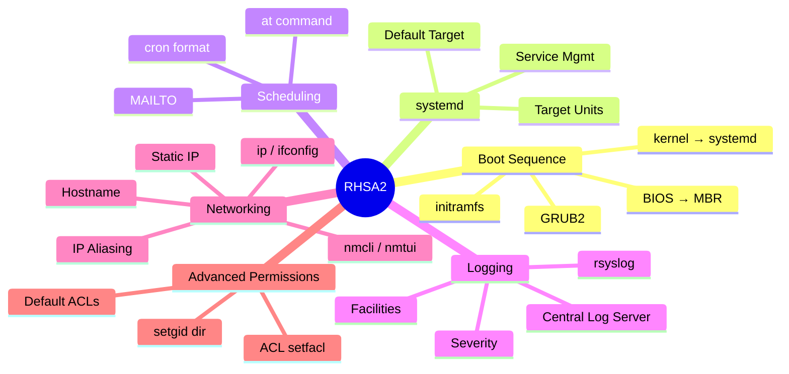
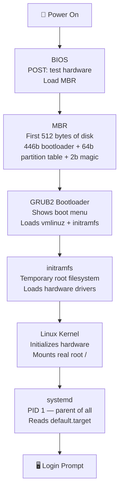
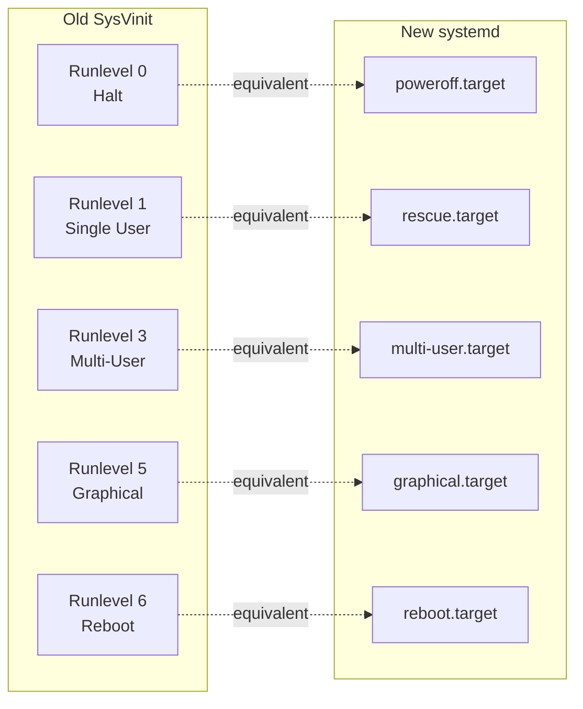
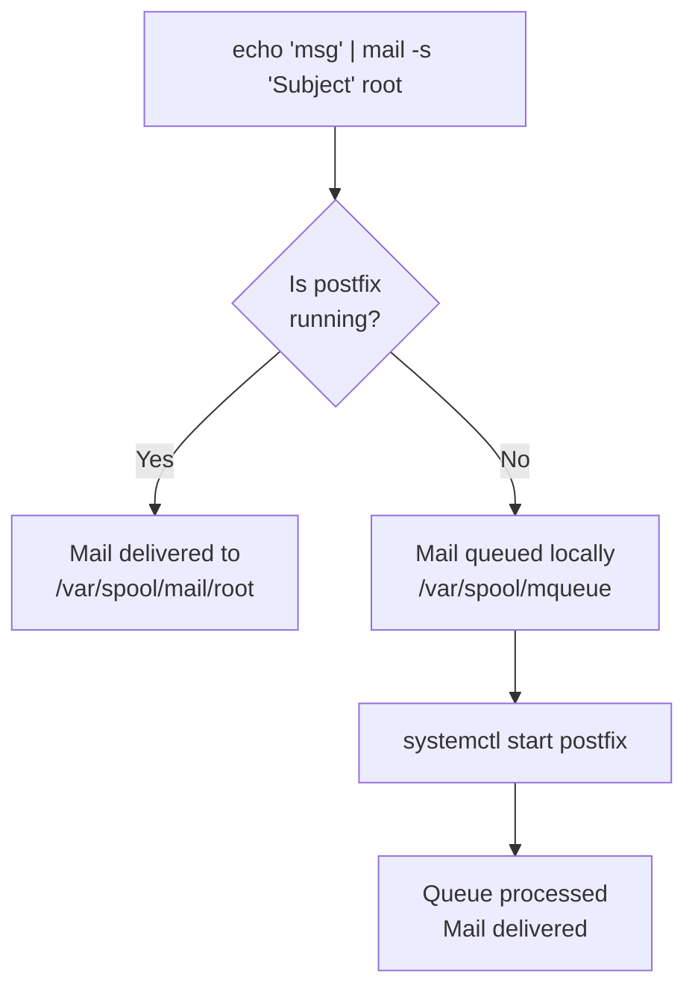
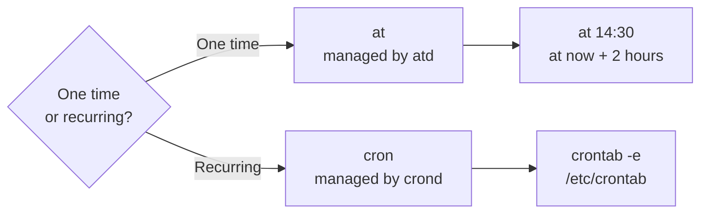
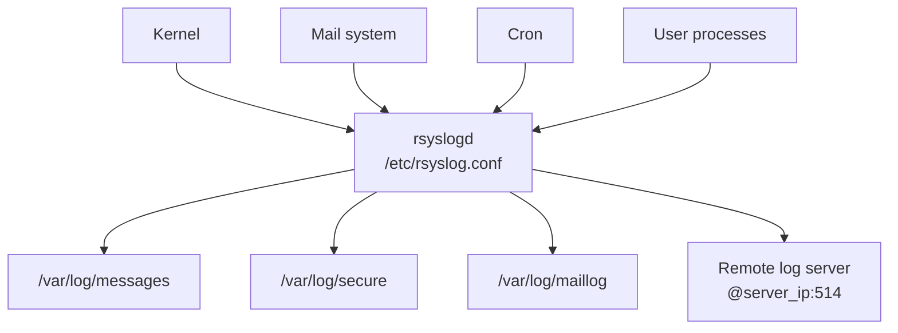
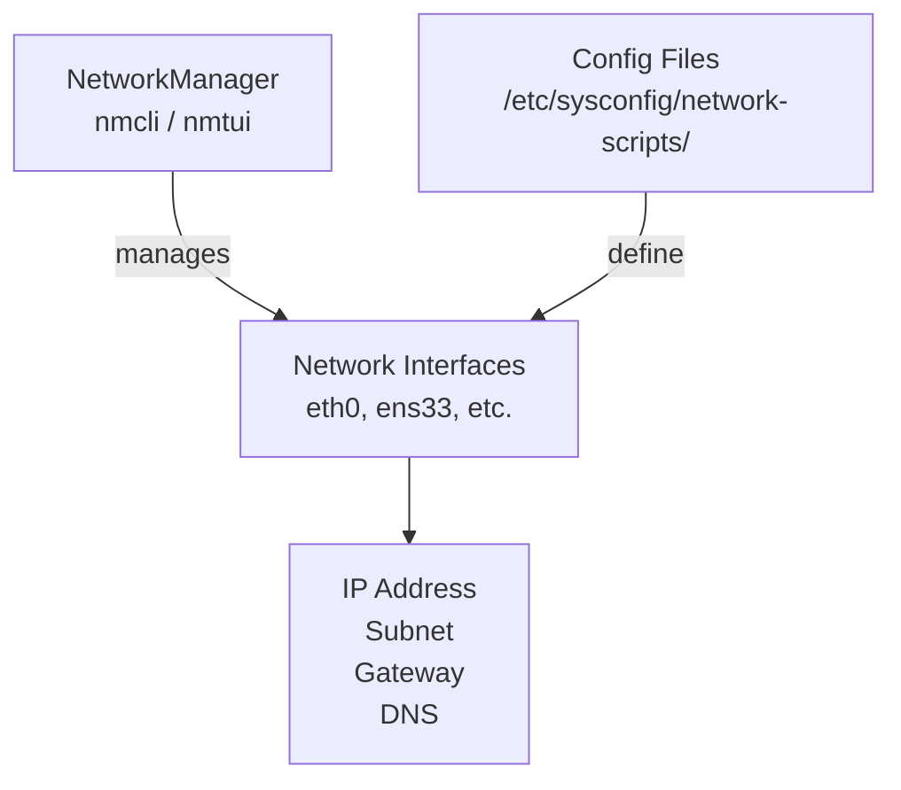
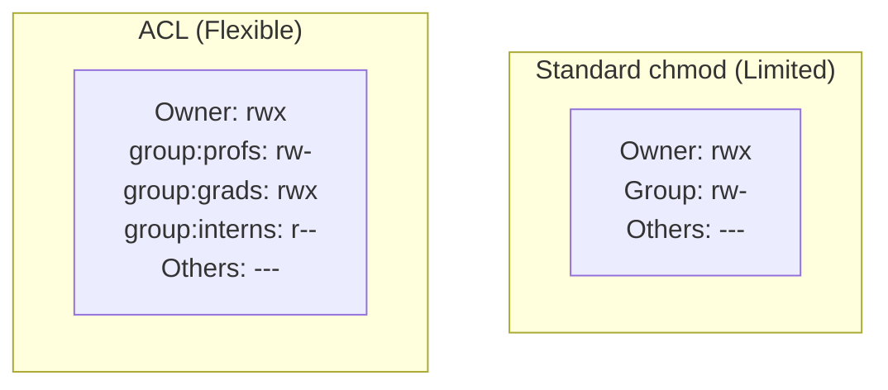
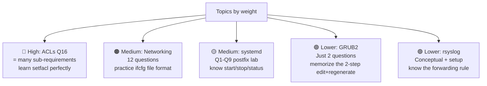

# 🚀 RHSA2 — Red Hat System Administration II
## Deep Study Guide + Lab Answer Key
**ITI Open Source Track**
*Builds on Admin 1 | Topics: Boot • systemd • Scheduling • Logging • Networking • Permissions*

---

## 📋 Admin 2 Topics Map



---

## 🔗 How Admin 1 Connects to Admin 2

> Before diving into Admin 2, here's the bridge — every Admin 2 topic builds directly on something you already know from Admin 1.

| Admin 1 Skill | Admin 2 Uses It For |
|--------------|-------------------|
| `vi /etc/passwd` | Editing GRUB2 config files, rsyslog.conf, network config |
| `systemctl` (basic) | Full service lifecycle management in Admin 2 Lab |
| `chmod / chown` | Advanced ACLs and setgid directories |
| `grep / cut` | Extracting info from config files and logs |
| `cron / at` | Deep dive into scheduling in Admin 2 |
| Processes & signals | systemd manages ALL processes |
| Redirection `>>` | Cron job output → files and mail |
| `mail` command | Used throughout Admin 2 Lab |
| `/etc/passwd` file format | Understanding users and mail delivery |

---

## 🥾 TOPIC 1 — The Linux Boot Sequence

### The Full Journey (Power Button → Login Prompt)



### 🧠 What Each Stage Does — With Analogies

#### Stage 1: BIOS
> Like a building's entrance guard — checks all the doors and windows (hardware POST), then directs you to the elevator (MBR).

- Runs **POST** (Power-On Self Test) — tests RAM, CPU, storage
- Finds the bootable device
- Loads the **first 512 bytes** of that device (the MBR) into RAM

#### Stage 2: MBR (Master Boot Record)
> Like the building's lobby directory — tells you which floor to go to.

- Only **512 bytes** total:
  - 446 bytes → bootloader code
  - 64 bytes → partition table
  - 2 bytes → "magic number" (error detection: `0x55AA`)
- Its job: find GRUB2 and hand over control

#### Stage 3: GRUB2 (GRand Unified Bootloader)
> Like the elevator — lets you choose which floor (OS) to go to.

```
⚠️  TWO config files — know which to edit!

/boot/grub2/grub.cfg      ← AUTO-GENERATED. NEVER edit directly.
/etc/default/grub          ← THIS is what you edit.

After editing /etc/default/grub always run:
grub2-mkconfig -o /boot/grub2/grub.cfg
```

**Key parameters in `/etc/default/grub`:**

```bash
GRUB_TIMEOUT=5            # seconds to show menu (Lab Q10: change to 20)
GRUB_DEFAULT=saved        # which entry boots by default (Lab Q11)
GRUB_CMDLINE_LINUX="rhgb quiet"   # extra kernel args
```

**Lab Q10 — Change timeout to 20:**
```bash
vi /etc/default/grub
# Change: GRUB_TIMEOUT=5  → GRUB_TIMEOUT=20
grub2-mkconfig -o /boot/grub2/grub.cfg
```

**Lab Q11 — Change default OS:**
```bash
# Step 1: List menu entries and their index numbers
awk -F\' '/^menuentry / {print NR-1": ", $2}' /boot/grub2/grub.cfg

# Step 2: Edit /etc/default/grub
vi /etc/default/grub
# Change: GRUB_DEFAULT=saved  → GRUB_DEFAULT=1  (use the index you want)

# Step 3: Regenerate
grub2-mkconfig -o /boot/grub2/grub.cfg
```

#### Stage 4: initramfs (Initial RAM Filesystem)
> Like a toolbox carried by a construction worker — has just enough tools to open the building (mount the real root filesystem).

- Loaded into memory as a temporary root filesystem
- Contains essential drivers (SCSI, RAID, LVM) needed to mount the real `/`
- Once real root is mounted, initramfs is discarded
- Built by **dracut** utility whenever a new kernel is installed
- View its contents: `lsinitrd`

#### Stage 5: Kernel
- Mounts the real root filesystem
- Initializes all hardware
- Starts ONE process: **systemd (PID 1)**

#### Stage 6: systemd
- PID 1 — the parent of everything
- Reads `/etc/systemd/system/default.target` → determines what state to boot into
- Starts all required services in parallel (faster than old SysVinit)

---

## ⚙️ TOPIC 2 — systemd & Target Units

### systemd Replaces Run Levels

> **Admin 1 connection:** You learned about processes and daemons. systemd is the master process manager — it starts, stops, and monitors every service on the system.



| Run Level | systemd Target | Description |
|-----------|----------------|-------------|
| 0 | `poweroff.target` | Shut down and power off |
| 1 | `rescue.target` | Single-user rescue shell (no network) |
| 2,3,4 | `multi-user.target` | Text multi-user (servers use this) |
| 5 | `graphical.target` | Full GUI desktop |
| 6 | `reboot.target` | Shut down and reboot |

### 🔧 systemd Commands — The Full Picture

```bash
# ── TARGET (run level) MANAGEMENT ──────────────────────────
systemctl get-default                    # what target boots by default?
systemctl set-default multi-user.target  # change permanent default (Lab Q2)
systemctl isolate graphical.target       # switch NOW without rebooting

# ── SERVICE MANAGEMENT ─────────────────────────────────────
systemctl start postfix                  # start service (Lab Q8)
systemctl stop postfix                   # stop service (Lab Q5)
systemctl restart postfix                # stop then start
systemctl reload postfix                 # reload config without restart
systemctl status postfix                 # show status + recent logs

# ── BOOT PERSISTENCE ────────────────────────────────────────
systemctl enable postfix                 # auto-start at boot
systemctl disable postfix               # don't auto-start at boot
systemctl is-enabled postfix            # check if enabled

# ── LISTING ─────────────────────────────────────────────────
systemctl list-units --type=service             # active services (Lab Q1)
systemctl list-units --type=service --all       # including inactive
systemctl list-unit-files --type service        # enabled/disabled status
```

> 🔑 **Critical difference to understand:**
> - `systemctl start` → starts NOW (temporary, lost on reboot)
> - `systemctl enable` → starts on every boot (permanent)
> - You usually want BOTH: `systemctl enable --now postfix`

### 📬 Lab Part 1: Mail + postfix walkthrough

This lab section teaches you the relationship between a **service** (postfix) and what depends on it (mail delivery). Here's the complete logic:



```bash
# Q3: Send mail to root
echo 'Test message body' | mail -s 'Test Subject' root

# Q4: Verify mail received
mail                              # interactive mail reader
# Or check file directly:
cat /var/spool/mail/root

# Q5: Stop postfix
systemctl stop postfix

# Q6: Send mail again (postfix stopped — mail will queue)
echo 'Sent while postfix stopped' | mail -s 'Test 2' root

# Q7: Check mail — may not arrive yet (queued)
mail                              # probably no new mail

# Q8: Start postfix — queued mail is now delivered
systemctl start postfix

# Q9: Check again — now the queued mail arrives
mail
```

---

## 📅 TOPIC 3 — Task Scheduling (cron & at)

### 🧠 at vs cron — When to Use Which



### The cron Format — Mastering It

```
MIN   HOUR   DOM   MON   DOW   command
 ↑     ↑      ↑     ↑     ↑
0-59  0-23   1-31  1-12  0-6(Sun=0)
```

**Special syntax:**
```bash
*       # every value (wildcard)
*/10    # every 10 units (step)
1-5     # range: 1 through 5
1,3,5   # list: 1, 3, and 5
```

**Reading examples:**
```bash
0 2 * * *       # every day at 2:00 AM
30 8 * * 1-5    # 8:30 AM, Monday through Friday
*/10 8-17 * * * # every 10 min between 8 AM and 5 PM (Lab Q12)
0 0 1 * *       # midnight on the 1st of every month
@reboot         # once at system startup
@daily          # once per day (same as 0 0 * * *)
```

### Lab Q12 — Memory-Focused Monitoring (Complete Answer)

```bash
# Edit root's crontab
crontab -e

# Option 1: vmstat (CPU, memory, swap, IO overview)
*/10 8-17 * * * /usr/bin/vmstat >> /var/log/perf_report.log

# Option 2: free -h (memory and swap — most relevant for memory issues)
*/10 8-17 * * * /usr/bin/free -h >> /var/log/perf_report.log

# Option 3: sar -r (detailed memory stats — needs sysstat package)
*/10 8-17 * * * /usr/bin/sar -r >> /var/log/perf_report.log

# Option 4: Send output directly to root via email (MAILTO)
MAILTO=root
*/10 8-17 * * * /usr/bin/vmstat
```

> 💡 **Why does cron email output?**
> Because `MAILTO=root` is set by default at the top of the system crontab. Any stdout from cron jobs is emailed to that address.

### Lab Q13 — Q15: Mail from cron

```bash
# Q13: Check mail as root for cron output
mail                           # check root's mailbox

# Q14: Send cron output to manager instead
# Add MAILTO before the job in crontab:
MAILTO=manager
*/10 8-17 * * * /usr/bin/vmstat

# Q15: Check mail as manager
su - manager
mail
```

### cron Access Control

| File | Effect |
|------|--------|
| `/etc/cron.allow` | If exists: ONLY listed users may use cron |
| `/etc/cron.deny` | If exists (no allow file): listed users are BLOCKED |
| Neither exists | All users can use cron |

> **Admin 1 connection:** This is the same logic as `/etc/at.allow` and `/etc/at.deny` for the `at` command — you already learned this pattern!

---

## 📋 TOPIC 4 — Managing System Logs (rsyslog)

### How rsyslog Works

> **Analogy:** rsyslog is like a postal sorting office. Every process in the system sends "letters" (log messages). rsyslog reads the address (facility + severity) on each letter and routes it to the right "mailbox" (log file or remote server).



### The Selector: facility.severity

**Facilities** (what generated the message):

| Facility | Source |
|----------|--------|
| `kern` | Kernel |
| `mail` | Mail system (postfix, sendmail) |
| `daemon` | System daemons |
| `cron` | cron and at jobs |
| `auth` / `authpriv` | Authentication and security |
| `local0`–`local7` | Custom applications |
| `*` | Everything |

**Severity Levels** (how bad is it — HIGH to LOW):

```
emerg    → System is DOWN (level 0)
alert    → Act immediately (level 1)
crit     → Critical failure (level 2)
err      → Error occurred (level 3)
warning  → Something may be wrong (level 4)
notice   → Normal but significant (level 5)
info     → Informational (level 6)
debug    → Verbose debugging (level 7)
```

> 🔑 **Specifying a severity logs THAT level AND ABOVE.**
> So `mail.warning` catches warning, err, crit, alert, emerg — but NOT info or debug.

### /etc/rsyslog.conf Rules Format

```bash
# facility.severity    destination
*.info                 /var/log/messages      # all info+ to messages
mail.*                 /var/log/maillog       # all mail logs
authpriv.*             /var/log/secure        # auth logs
cron.*                 /var/log/cron          # cron logs
*.emerg                *                      # emergencies to all users
```

### 🖥️ Lab: Centralized Logging Setup (Full Walkthrough)


**Step 1: Configure the Logging Server**
```bash
# Edit /etc/rsyslog.conf — uncomment these lines:
vi /etc/rsyslog.conf

# For UDP (add/uncomment):
$ModLoad imudp
$UDPServerRun 514

# For TCP (add/uncomment):
$ModLoad imtcp
$InputTCPServerRun 514

# Restart rsyslog
systemctl restart rsyslog

# Open firewall port
firewall-cmd --permanent --add-port=514/udp
firewall-cmd --permanent --add-port=514/tcp
firewall-cmd --reload
```

**Step 2: Configure the Workstation to Forward**
```bash
vi /etc/rsyslog.conf

# Add this line (forward everything via UDP):
*.* @192.168.1.10:514

# For TCP use @@ instead of @:
*.* @@192.168.1.10:514

systemctl restart rsyslog
```

**Step 3: Test**
```bash
# On workstation — generate a test message:
logger 'Test message from workstation'

# On logging server — verify it arrived:
tail -f /var/log/messages
# Should see: Feb 26 10:00:01 workstation root: Test message from workstation
```

**Q: Why does the message ALSO appear on the workstation's /var/log/messages?**

Because rsyslog processes messages **locally first**, then forwards them. The default config still has:
```bash
*.info   /var/log/messages
```
This rule matches the message and writes it locally. Then the forwarding rule ALSO sends it to the server. Both happen.

**Q: How to make the message appear ONLY on the logging server?**

Use the **discard action** (`~`) to drop the message locally after forwarding:
```bash
# In workstation's /etc/rsyslog.conf:
*.* @192.168.1.10:514    # forward everything
& ~                       # then discard (don't write locally)
```

---

## 🌐 TOPIC 5 — Network Configuration

### 🧠 Key Concepts First



### Essential Networking Commands

```bash
# ── VIEW INFORMATION ────────────────────────────────────────
ip addr show              # show all interfaces (active)    (Lab Q18)
ip addr show              # show all (active + inactive)    (Lab Q19)
ifconfig                  # show active interfaces (older tool)
ifconfig -a               # show ALL including down ones    (Lab Q19)
ip link show              # show MAC addresses + link state  (Lab Q17)
ifconfig -a | grep ether  # MAC address method 2            (Lab Q17)

# ── BRING UP / DOWN ─────────────────────────────────────────
ip link set eth0 down     # bring interface down            (Lab Q20)
ip link set eth0 up       # bring interface up              (Lab Q22)
ifdown eth0               # alternative (uses config file)
ifup eth0                 # alternative

# ── NETWORKMANAGER ──────────────────────────────────────────
nmcli con show            # list connections
nmcli con up eth0         # activate connection
nmcli con down eth0       # deactivate connection
nmcli con mod eth0 ipv4.method auto          # set to DHCP   (Lab Q24)
nmcli con mod eth0 ipv4.addresses 192.168.1.100/24  # static IP
nmcli con mod eth0 ipv4.gateway 192.168.1.1
nmcli con mod eth0 ipv4.dns 8.8.8.8
nmcli con mod eth0 ipv4.method manual        # required for static
nmcli con reload                             # reload after file edits
nmtui                                        # text-based UI (Lab Q24)
```

### Static IP Configuration File

Location: `/etc/sysconfig/network-scripts/ifcfg-eth0`

```bash
# Lab Q21 — Static IP config:
DEVICE=eth0
BOOTPROTO=none          # ← "none" or "static" for static IP
IPADDR=192.168.1.100
NETMASK=255.255.255.0
GATEWAY=192.168.1.1
DNS1=8.8.8.8
DNS2=8.8.4.4
ONBOOT=yes              # ← bring up on boot
```

```bash
# Lab Q24 — Dynamic IP config:
DEVICE=eth0
BOOTPROTO=dhcp          # ← "dhcp" for dynamic
ONBOOT=yes
```

### IP Aliasing — Multiple IPs on One Interface (Lab Q27)

> **Analogy:** Like having multiple mailboxes on the same house — same physical house (interface), different addresses.

```bash
# Create alias files (copy and modify)
cp /etc/sysconfig/network-scripts/ifcfg-eth0 \
   /etc/sysconfig/network-scripts/ifcfg-eth0:1

vi /etc/sysconfig/network-scripts/ifcfg-eth0:1
# Change:
DEVICE=eth0:1
IPADDR=192.168.1.101    # different IP

# Repeat for :2
cp ifcfg-eth0 ifcfg-eth0:2
# DEVICE=eth0:2, IPADDR=192.168.1.102

# Bring aliases up
ifup eth0:1
ifup eth0:2

# Verify all three IPs
ifconfig
```

### Hostname (Lab Q28)

```bash
hostnamectl set-hostname newhostname     # permanent, immediate
vi /etc/hostname                          # or edit file directly
vi /etc/hosts                             # update local DNS too
hostname                                  # show current hostname
```

---

## 🔐 TOPIC 6 — Advanced Permissions (ACLs)

### 🧠 Why Regular chmod Isn't Enough

> **Admin 1 connection:** You learned `chmod` which gives 3 sets of permissions: owner, group, others. But what if you need:
> - Group A: read+write
> - Group B: read-only
> - Group C: no access
>
> Regular chmod can't express this. That's what **ACLs (Access Control Lists)** solve.



### ACL Commands

```bash
# View ACLs
getfacl /path/to/dir

# Set ACL for a user
setfacl -m u:username:rwx /path

# Set ACL for a group
setfacl -m g:groupname:rw /path

# Set DEFAULT ACL (inherited by new files created inside)
setfacl -d -m g:groupname:rw /path

# Remove an ACL entry
setfacl -x g:groupname /path

# Remove ALL ACLs
setfacl -b /path
```

### Special Permission Bits (setgid + sticky)

| Bit | On Directory | On File |
|-----|-------------|---------|
| setuid (4) | (no effect) | File runs as owner's UID |
| **setgid (2)** | **New files inherit directory's group** | File runs as group's GID |
| sticky (1) | Only owner can delete their own files | (legacy) |

```bash
# chmod with special bits: prepend the special digit
chmod 2770 /opt/research    # setgid + rwxrwx---
chmod 3770 /opt/research    # setgid + sticky + rwxrwx---

# In ls -l output: setgid shows as 's' in group execute position
drwxrws---   ← the 's' means setgid is set
```

### 🧪 Lab Q16 — Full /opt/research Solution

**Requirements recap:**
- `/opt/research` owned by root
- Only profs and grads can create files
- New files group-owned by grads automatically
- profs auto get read+write on new files
- interns auto get read-only on new files
- others: no access at all

```bash
# Step 1: Create directory
mkdir /opt/research

# Step 2: Set ownership (root owns it) and setgid
# setgid (2) ensures new files inherit group 'grads'
chown root:grads /opt/research
chmod 3770 /opt/research
# 3 = setgid+sticky  7 = rwx (root)  7 = rwx (grads)  0 = --- (others)
# Result: drwxrws--T  root grads  /opt/research

# Step 3: Set immediate ACLs (for existing access)
setfacl -m g:profs:rwx /opt/research       # profs can enter and create
setfacl -m g:interns:rx /opt/research      # interns can read and enter
setfacl -m o::--- /opt/research            # others: nothing

# Step 4: Set DEFAULT ACLs (inherited by new files inside)
setfacl -d -m g:grads:rwx /opt/research    # grads own new files
setfacl -d -m g:profs:rw /opt/research     # profs get rw on new files
setfacl -d -m g:interns:r /opt/research    # interns get r on new files
setfacl -d -m o::--- /opt/research         # others: nothing on new files

# Step 5: Verify everything
getfacl /opt/research
```

**Expected getfacl output:**
```
# file: opt/research
# owner: root
# group: grads
# flags: -s-
user::rwx
group::rwx
group:profs:rwx
group:interns:r-x
mask::rwx
other::---
default:user::rwx
default:group::rwx
default:group:profs:rw-
default:group:interns:r--
default:mask::rwx
default:other::---
```

---

## 🧪 Complete Lab Answer Key

### Part 1: systemd & Services

| Q | Command(s) |
|---|-----------|
| Q1: View all services | `systemctl list-units --type=service` |
| Q2: Set multi-user + reboot | `systemctl set-default multi-user.target && reboot` |
| Q3: Send mail to root | `echo 'body' \| mail -s 'Subject' root` |
| Q4: Verify mail | `mail` or `cat /var/spool/mail/root` |
| Q5: Stop postfix | `systemctl stop postfix` |
| Q6: Send mail again | `echo 'body' \| mail -s 'Test2' root` |
| Q7: Verify (queued) | `mail` — message likely not there yet |
| Q8: Start postfix | `systemctl start postfix` |
| Q9: Verify (delivered) | `mail` — now arrives |

### Part 2: GRUB2

```bash
# Q10: Change timeout to 20s
vi /etc/default/grub          # set GRUB_TIMEOUT=20
grub2-mkconfig -o /boot/grub2/grub.cfg

# Q11: Change default OS
awk -F\' '/^menuentry / {print NR-1": ", $2}' /boot/grub2/grub.cfg
vi /etc/default/grub          # set GRUB_DEFAULT=1 (or desired index)
grub2-mkconfig -o /boot/grub2/grub.cfg
```

### Part 3: Scheduling

```bash
# Q12: Monitor memory every 10 min, 8-17
crontab -e
# Add: */10 8-17 * * * /usr/bin/free -h >> /var/log/perf_report.log

# Q13: Check root's cron mail
mail

# Q14: Send to manager instead
# Add to crontab: MAILTO=manager  (before the job line)

# Q15: Check as manager
su - manager && mail
```

### Part 4: Permissions (Q16)
*(See full solution above in Topic 6)*

### Part 5: Networking

```bash
# Q17: MAC address (2 ways)
ip link show
ifconfig -a | grep ether

# Q18: Active interfaces
ip addr show  OR  ifconfig

# Q19: ALL interfaces (including down)
ip addr show  OR  ifconfig -a

# Q20: Bring interface down
ip link set eth0 down  OR  ifdown eth0

# Q21: Configure static IP
vi /etc/sysconfig/network-scripts/ifcfg-eth0
# Set BOOTPROTO=none, IPADDR, NETMASK, GATEWAY, DNS1, ONBOOT=yes

# Q22: Bring interface up
ip link set eth0 up  OR  ifup eth0

# Q23: Verify with ifconfig
ifconfig eth0

# Q24: Dynamic IP via NetworkManager
nmcli con mod eth0 ipv4.method auto
nmcli con up eth0

# Q25: Check ifconfig + config file
ifconfig eth0
cat /etc/sysconfig/network-scripts/ifcfg-eth0

# Q26: system-config-network
system-config-network   # TUI → select interface → Static IP

# Q27: 3 IPs on one interface
# Create ifcfg-eth0:1 (DEVICE=eth0:1, IPADDR=.101)
# Create ifcfg-eth0:2 (DEVICE=eth0:2, IPADDR=.102)
ifup eth0:1 && ifup eth0:2 && ifconfig

# Q28: Change hostname
hostnamectl set-hostname newhostname
# Also update /etc/hosts
```

### Part 6: Centralized Logging

```bash
# LOGGING SERVER: /etc/rsyslog.conf
$ModLoad imudp
$UDPServerRun 514
# systemctl restart rsyslog
# firewall-cmd --permanent --add-port=514/udp && firewall-cmd --reload

# WORKSTATION: /etc/rsyslog.conf
*.* @<server_ip>:514
& ~       # discard locally after forwarding
# systemctl restart rsyslog

# TEST
logger 'Test message from workstation'
# On server: tail -f /var/log/messages
```

---

## ⚡ Admin 2 Quick-Reference Cheat Sheet

### Boot & GRUB2
```bash
# Edit:       vi /etc/default/grub   (GRUB_TIMEOUT=20, GRUB_DEFAULT=1)
# Regenerate: grub2-mkconfig -o /boot/grub2/grub.cfg
# Initramfs:  dracut (rebuild) / lsinitrd (view)
```

### systemd
```bash
systemctl {start|stop|restart|status} service
systemctl {enable|disable|is-enabled} service
systemctl {get-default|set-default|isolate} target
systemctl list-units --type=service [--all]
```

### cron
```bash
crontab -e / crontab -l / crontab -r
# MIN HOUR DOM MON DOW command
*/10 8-17 * * *  /usr/bin/free -h >> /var/log/perf.log
MAILTO=manager   # redirect output email
```

### rsyslog
```bash
# Forward:  *.* @server_ip:514
# TCP:      *.* @@server_ip:514
# Discard:  & ~
# Test:     logger 'message'
# Config:   /etc/rsyslog.conf
```

### Networking
```bash
ip addr show / ifconfig -a          # view
ip link set eth0 {up|down}          # toggle
nmcli con mod eth0 ipv4.method {auto|manual}
nmcli con up eth0
hostnamectl set-hostname name
# Config: /etc/sysconfig/network-scripts/ifcfg-eth0
```

### ACLs
```bash
getfacl /path                        # view
setfacl -m g:groupname:rwx /path    # set for group
setfacl -d -m g:groupname:rw /path  # set default (inherited)
chmod 2770 /path                     # setgid directory
chown root:grads /path               # set ownership
```

---

## 🏆 Exam Strategy — Maximizing Your Admin 2 Score



**Must-memorize commands:**
1. `systemctl start/stop/restart/status/enable/disable <service>`
2. `grub2-mkconfig -o /boot/grub2/grub.cfg` (after every grub edit)
3. `setfacl -m g:name:rwx` and `setfacl -d -m g:name:rw` (default ACL)
4. `crontab -e` and the `*/10 8-17 * * *` format
5. Static IP file: `BOOTPROTO=none`, `IPADDR=`, `ONBOOT=yes`
6. `*.* @server:514` and `& ~` for centralized logging

---
*Admin 2 Deep Guide Complete ✅ — Study Admin 1 notes first, then return to this guide — the connections will click!*
