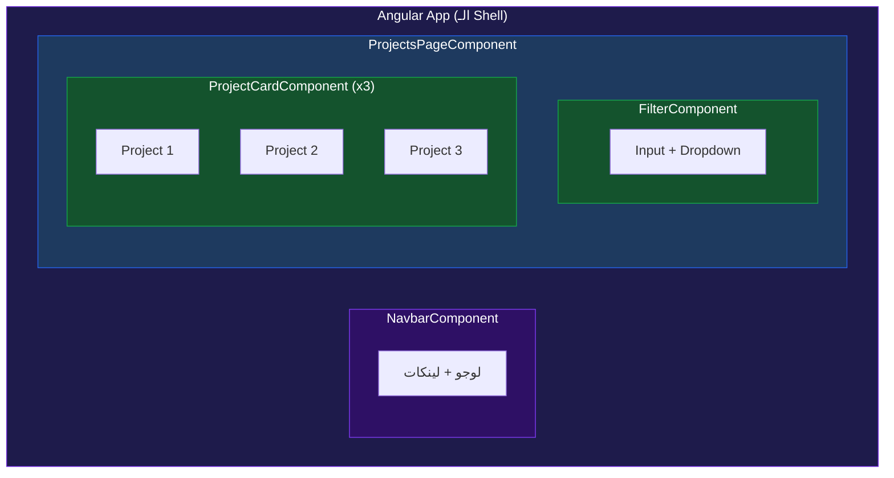
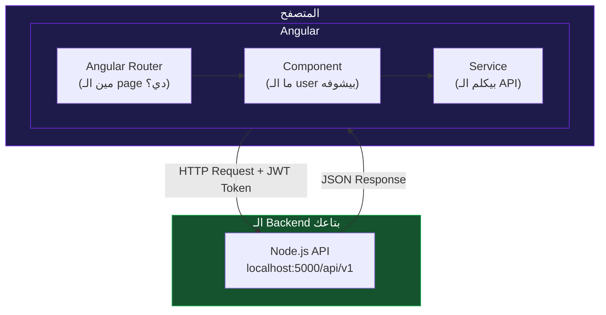
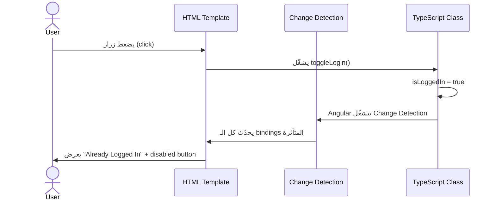
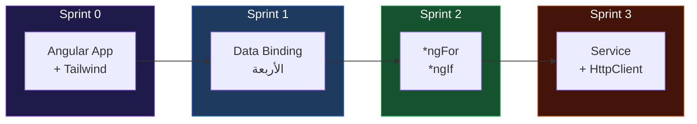

# 🎓 FreelanceFlow Frontend — Learning Journey
> بنبني من الصفر الحقيقي. سطر بسطر. مفيش حاجة هتعدي من غير ما تفهمها.

---

# 🏁 Sprint 0 — ليه Angular؟ وإيه اللي بيحصل جوّاه؟

---

## قبل ما نكتب سطر واحد كود — لازم نفهم المشكلة

أنت دلوقتي عندك backend شغال على `http://localhost:5000/api/v1`.

عندك endpoints. عندك JWT. عندك Projects وProposals وReviews.

بس لو Ali عايز يعمل project — مش هيفتح Postman. هيفتح **browser**. هيشوف form، يكتب فيه، يضغط زر.

ومش هيبعت `Authorization: Bearer <token>` يدوياً في كل request — في حاجة بتعمل ده تلقائياً.

ومش هيشوف JSON raw — هيشوف cards وtables وbuttons.

**ده اللي Angular بتعمله.** بتاخد الـ API بتاعك وبتحوّله لـ UI حقيقي.

---

## طب إيه الفرق بين Angular وHTML عادي؟

لو هتعمل الـ frontend ده بـ plain HTML وJavaScript:

```html
<!-- projects.html -->
<ul id="list"></ul>

<script>
  async function load() {
    const token = localStorage.getItem('token');
    const res   = await fetch('http://localhost:5000/api/v1/projects', {
      headers: { Authorization: 'Bearer ' + token }
    });
    const data  = await res.json();

    const ul = document.getElementById('list');
    data.data.projects.forEach(p => {
      const li       = document.createElement('li');
      li.textContent = p.title;
      ul.appendChild(li);
    });
  }
  load();
</script>
```

ده شغال. بس فيه 3 مشاكل كبار:

**المشكلة الأولى — التحديث يدوي.**
لو project اتضاف أو اتحذف، لازم تشغّل `load()` تاني بنفسك. مفيش حاجة بتراقب.

**المشكلة التانية — الكود متكرر.**
في `projects.html` بتكتب الـ token logic. في `proposals.html` بتكتبها تاني. في `reviews.html` تاني. في 10 صفحات — 10 مرات نفس الكود.

**المشكلة التالتة — الـ DOM manipulation يدوي.**
`document.createElement`، `appendChild`، `innerHTML` — ده كود هشاش جداً. مع أي تعقيد بسيط بيبقى جحيم.

Angular حلّ الـ 3 مشاكل دول بفكرة واحدة: **الـ Component**.

---

## الفكرة الكبيرة — إيه هو الـ Component؟

تخيل إنك بتبني الـ UI زي ما بتبني بـ LEGO.

كل قطعة LEGO = Component واحد. عنده:
- **شكله** — ده الـ HTML template
- **طريقة اشتغاله** — ده الـ TypeScript class
- **لونه وحجمه** — ده الـ CSS

وكل قطعة **مسؤولة عن نفسها**. الـ `ProjectCardComponent` مش شغله يعرف حاجة عن الـ `LoginComponent`. كل واحد عنده الـ data بتاعته والـ logic بتاعته.



لاحظ إن الـ `ProjectCardComponent` ظهر 3 مرات. ده مش 3 ملفات مختلفة — ده **نفس الـ component** بيتعمل reuse 3 مرات بـ data مختلفة.

ده اللي مش ممكن تعمله بسهولة في HTML عادي.

---

## طب Standalone Components دي إيه؟ (v17+)

في الـ Angular القديم (قبل v17) — كان في حاجة اسمها **NgModule**.

كان زي عقد إيجار. كل component عايز يشتغل، لازم يتسجّل في module أولاً. زي ما تتخيل إنك عايز تشغّل browser على laptop، بس لازم أول حاجة تسجّل الـ browser في وزارة الاتصالات.

Angular v17 قرر يخلّص من ده. دلوقتي كل component **مستقل بذاته** — `standalone: true`. بيعلن بنفسه إيه اللي يحتاجه، ومش محتاج module يسجّله.

```typescript
// الطريقة القديمة — محتاج تسجيل في NgModule
@Component({ selector: 'app-card', templateUrl: './card.component.html' })
export class CardComponent {}

// الطريقة الجديدة (v17+) — standalone ومستقل
@Component({
  standalone: true,
  selector: 'app-card',
  templateUrl: './card.component.html'
})
export class CardComponent {}
```

في الـ guide ده هنشتغل بالطريقة الجديدة دايماً.

---

## وين Tailwind بتيجي في الصورة؟

Angular بيتكلم عن **structure** — الـ components، الـ data، الـ routing.

Tailwind بيتكلم عن **appearance** — الألوان، الـ spacing، الـ typography.

الاتنين بيشتغلوا جنب بعض. Angular بيقول "فيه button هنا"، وTailwind بيقول "الـ button ده أزرق وفيه padding وعنده hover effect".

```html
<!-- بدون Tailwind -->
<button class="my-button">Submit</button>

<!-- مع Tailwind — الـ styling مباشرة في الـ HTML -->
<button class="bg-blue-600 text-white px-4 py-2 rounded-lg hover:bg-blue-700">
  Submit
</button>
```

مفيش ملف CSS منفصل. الـ styles موجودة جنب الـ HTML على طول — ده بيخلي الـ component فعلاً self-contained.

---

## الصورة الكاملة قبل ما نبدأ



لاحظ الـ 3 أجزاء الجديدة:

**Router** — بيقول "الـ URL ده `/projects` يعني اعرض الـ `ProjectsComponent`". زي الـ routes في Express بس للـ frontend.

**Component** — ما الـ user بيشوفه وبيتفاعل معاه.

**Service** — هو اللي بيكلم الـ API. الـ component مش بيكلم الـ API مباشرة — بيطلب من الـ service.

---

## 💻 إنشاء الـ Project

> **متطلب مسبق:** Node.js مثبّت على جهازك. تتأكد بـ `node -v`.

افتح terminal واكتب:

```bash
npm install -g @angular/cli
```

`-g` معناها global — بتثبّت الـ Angular CLI على جهازك كله مش على مشروع بعينه.

`@angular/cli` هو الأداة اللي بتنشئ وتشغّل وتبني Angular projects. زي `express-generator` بس أقوى بكتير.

تتأكد إنه اتثبت صح:

```bash
ng version
```

المفروض تشوف سطر فيه `Angular CLI: 17.x.x` أو أحدث.

---

## 💻 إنشاء الـ App

```bash
ng new freelance-flow-frontend
```

هيسألك سؤالين:

```
? Which stylesheet format would you like to use?
> CSS

? Do you want to enable Server-Side Rendering (SSR)?
> No
```

اختار **CSS** وـ**No** للـ SSR. (SSR موضوع تاني خالص — مش محتاجينه دلوقتي.)

بعدين:

```bash
cd freelance-flow-frontend
```

---

## شجرة الـ Project — إيه كل ملف ده؟

```
freelance-flow-frontend/
├── src/
│   ├── app/
│   │   ├── app.component.ts       ← أول component في الـ app (الـ shell)
│   │   ├── app.component.html     ← الـ HTML بتاعه
│   │   ├── app.component.css      ← الـ styles بتاعه
│   │   └── app.config.ts          ← إعدادات الـ app (routing, HTTP, etc.)
│   ├── index.html                 ← ملف HTML واحد بس — Angular بيحط نفسه جواه
│   ├── main.ts                    ← نقطة البداية — زي server.js في Node
│   └── styles.css                 ← global styles
├── angular.json                   ← إعدادات Angular CLI
├── package.json                   ← نفس فكرة Node — dependencies وscripts
└── tsconfig.json                  ← إعدادات TypeScript
```

---

## أهم ملفين — `main.ts` و `index.html`

### `index.html` أولاً:

افتحه — هتلاقيه كده:

```html
<!doctype html>
<html lang="en">
  <head>
    <meta charset="utf-8">
    <title>FreelanceFlowFrontend</title>
    <base href="/">
    <meta name="viewport" content="width=device-width, initial-scale=1">
    <link rel="icon" type="image/x-icon" href="favicon.ico">
  </head>
  <body>
    <app-root></app-root>
  </body>
</html>
```

لاحظ `<app-root></app-root>`. ده مش HTML tag standard. ده **Angular component**.

Angular هيشوف الـ tag ده ويقول: "أنا عارف الـ `app-root` ده — هحوّله لـ component بتاعه وأحط الـ HTML بتاعه هنا."

**ليه ملف HTML واحد بس؟**

في الـ multi-page website التقليدي — كل صفحة ملف HTML. في Angular — ملف واحد بس. Angular بيبدّل الـ content جوّاه بدون ما الصفحة تعمل reload. ده اللي بيتسمى **Single Page Application (SPA)**.

---

### `main.ts` تاني:

```typescript
import { bootstrapApplication } from '@angular/platform-browser';
import { appConfig }            from './app/app.config';
import { AppComponent }         from './app/app.component';

bootstrapApplication(AppComponent, appConfig)
  .catch(err => console.error(err));
```

**سطر بسطر:**

`import { bootstrapApplication }` — بتجيب الـ function اللي بتشغّل Angular. زي `require('express')` بالظبط.

`import { appConfig }` — بتجيب الـ إعدادات: فيها routing، HTTP client، وأي providers تانية.

`import { AppComponent }` — بتجيب أول component في الـ app — هو الـ shell اللي كل حاجة بتتحط جوّاه.

`bootstrapApplication(AppComponent, appConfig)` — ده زي `app.listen(PORT)` في Node. ده اللي بيشغّل الـ app فعلاً. بيقول: "ابدأ Angular، حط `AppComponent` في الـ `<app-root>` في الـ HTML."

`.catch(err => console.error(err))` — لو حصل error وقت الـ startup — اطبعه.

---

## 💻 شوف الـ App قبل ما تغير فيه حاجة

```bash
ng serve
```

افتح browser على `http://localhost:4200`. هتشوف صفحة Angular default.

لاحظ حاجتين مهمين:

**أولاً** — الـ port مختلف. Backend على `5000`، Frontend على `4200`. الاتنين شغالين مع بعض.

**تانياً** — لما بتعدّل أي ملف، الـ browser بيتحدث **تلقائياً** من غير ما تعمل refresh. ده اللي بيتسمى **Hot Module Replacement** — Angular CLI بيعمله تلقائياً. زي `nodemon` بس للـ frontend.

---

## 💻 تثبيت Tailwind CSS

وقّف السيرفر أولاً بـ `Ctrl+C`، وبعدين:

```bash
npm install -D tailwindcss postcss autoprefixer
npx tailwindcss init
```

**إيه الـ packages دي؟**

`tailwindcss` — الـ framework نفسه. بيولّد CSS من الـ class names اللي بتحطها في الـ HTML.

`postcss` — أداة بتعالج الـ CSS. Tailwind بيشتغل جوّاها — مش بتتعامل معاه مباشرة، بس لازم يكون موجود.

`autoprefixer` — بيضيف `-webkit-` وـ`-moz-` prefixes تلقائياً للـ CSS عشان يشتغل على كل الـ browsers.

`-D` = `--save-dev` — نفس الفكرة اللي في Node. ده بس للـ development. في الـ production بيتعمل compile مرة واحدة.

`npx tailwindcss init` — بيعمل ملف `tailwind.config.js` — ده ملف إعدادات Tailwind.

---

## 💻 إعداد `tailwind.config.js`

افتحه — هتلاقيه كده:

```javascript
/** @type {import('tailwindcss').Config} */
module.exports = {
  content: [],
  theme: {
    extend: {},
  },
  plugins: [],
}
```

غيّره لكده:

```javascript
/** @type {import('tailwindcss').Config} */
module.exports = {
  content: [
    "./src/**/*.{html,ts}"
  ],
  theme: {
    extend: {},
  },
  plugins: [],
}
```

**شرح السطر المهم:**

`content: ["./src/**/*.{html,ts}"]`

ده بيقول لـ Tailwind: "دوّر على الـ class names اللي بستخدمها في أي `.html` أو `.ts` file جوّا `src`."

**ليه لازم نعرفه فين بنستخدمه؟**

Tailwind مش زي Bootstrap. ما بيحملش كل الـ CSS من أول وجديد. بيولّد CSS classes بس اللي بتستخدمها فعلاً. لو ما قلتلوش فين — هيولّد ملف CSS فاضي.

---

## 💻 إضافة Tailwind لـ `styles.css`

افتح `src/styles.css` وحط التلاتة سطور دول:

```css
@tailwind base;
@tailwind components;
@tailwind utilities;
```

**إيه كل سطر:**

`@tailwind base` — بيعمل CSS reset. بيمسح الـ default browser styles (padding، margin، font sizes مختلفة من browser للتاني) ويبدأ بـ baseline نضيفة.

`@tailwind components` — بيجيب الـ component classes. دلوقتي فاضي بس هنضيف فيه custom classes بعدين.

`@tailwind utilities` — ده الجزء الأهم. كل الـ classes زي `bg-blue-500` و`px-4` و`rounded-lg` موجودة هنا.

---

## 💻 اختبر إن Tailwind شغال

افتح `src/app/app.component.html`. هتلاقيه فيه كتير — احذف كل حاجة وحط ده بدله:

```html
<div class="min-h-screen bg-gray-50 flex items-center justify-center">
  <div class="bg-white rounded-2xl shadow-sm border border-gray-200 p-10 max-w-md w-full">
    <h1 class="text-2xl font-bold text-gray-900 mb-2">FreelanceFlow</h1>
    <p class="text-gray-500 text-sm">Angular + Tailwind is working.</p>
  </div>
</div>
```

شغّل السيرفر تاني:

```bash
ng serve
```

---

## شرح كل class في الـ HTML ده

`min-h-screen` — الـ `div` ده ارتفاعه على الأقل 100% من الشاشة.

`bg-gray-50` — background لونه رمادي فاتح جداً (مش أبيض صافي — أبيض بصبغة رمادية).

`flex items-center justify-center` — Flexbox. يحط الـ content في النص أفقياً وعمودياً.

`bg-white` — الـ card بيضاء.

`rounded-2xl` — corners مستديرة كبيرة.

`shadow-sm` — ظل خفيف — بيدي الـ card إحساس إنها شوية فوق الـ background.

`border border-gray-200` — border رفيعة رمادية فاتحة.

`p-10` — padding من كل الجهات — 10 وحدات (كل وحدة = 4px — يعني 40px).

`max-w-md` — الـ card مش هتاخد أكتر من 448px عرض.

`w-full` — على الشاشات الصغيرة تاخد العرض كله.

`text-2xl font-bold text-gray-900` — نص كبير، بولد، لون رمادي داكن جداً (مش أسود صافي).

`mb-2` — margin-bottom صغير تحت الـ heading.

`text-gray-500 text-sm` — نص صغير، لون رمادي متوسط.

---

## ✅ Checkpoint

> [!example] Test 1 — Angular شغال
> افتح `http://localhost:4200`
>
> **Expected:** card في النص بيقول "FreelanceFlow" و"Angular + Tailwind is working."

> [!example] Test 2 — Tailwind فعّال
> في `app.component.html` غيّر `bg-gray-50` لـ `bg-blue-50`
>
> **Expected:** الـ background اتغير للأزرق الفاتح تلقائياً من غير restart

> [!example] Test 3 — Hot Reload شغال
> غيّر النص من "Angular + Tailwind is working." لأي حاجة تانية
>
> **Expected:** التغيير اتعمل في الـ browser من غير ما تعمل refresh

---

## سؤال مهم — ليه مفيش `app.module.ts`؟

لو شفت أي Angular tutorial قديم — هتلاقي فيه ملف `app.module.ts`. مش هتلاقيه في الـ project بتاعنا.

السبب: احنا شغالين بـ Standalone Components (v17+). مفيش modules.

لو حد سألك في interview: "Angular بيشتغل إزاي من غير NgModule؟"

الإجابة: الـ `bootstrapApplication()` في `main.ts` بياخد الـ root component والـ `appConfig` مباشرة. الـ config ده بيحتوي على الـ providers (Router، HttpClient، etc.) اللي كانوا قبل كده في الـ NgModule.

---

## إيه اللي بنيناه في Sprint 0

```
freelance-flow-frontend/
├── src/
│   ├── app/
│   │   ├── app.component.html  ← عدّلناه — Tailwind layout
│   │   ├── app.component.ts    ← لسه default
│   │   └── app.config.ts       ← لسه default
│   ├── main.ts                 ← شرحناه سطر بسطر
│   ├── styles.css              ← أضفنا Tailwind directives
│   └── index.html              ← شرحنا `<app-root>`
├── tailwind.config.js          ← أضفناه وعدّلنا الـ content paths
└── package.json                ← Tailwind + PostCSS + Autoprefixer اتضافوا
```

---

## ملخص Sprint 0

اللي اتبنى:
- **Angular app** بـ Angular CLI
- **Tailwind CSS** مربوط ومشتغل
- **Hot Reload** — أي تعديل بيظهر فوراً

اللي اتعلمته:
- Angular = Framework كامل مش library — بيحدد البنية
- الـ `<app-root>` في `index.html` هو مكان الـ app كله
- `main.ts` = نقطة البداية — زي `server.js` في Node
- `bootstrapApplication()` = زي `app.listen()` — هو اللي بيشغّل الـ app
- Standalone Components = مفيش NgModule — كل component مستقل بذاته
- Tailwind بيتعلم الـ classes من الـ HTML بتاعك — مش بيحمّل CSS كله

---

# 📦 Sprint 1 — الـ Component من الجوّا: TypeScript + Template + Binding

---

## المشكلة اللي Sprint 1 بيحلها

عندنا app شغالة. بس الـ HTML بتاعنا **static** — مكتوب فيه نص ثابت.

الـ backend بيرجعلنا data من قاعدة البيانات — مش نصوص ثابتة.

لازم الـ component يقدر يعمل 3 حاجات:
1. **يحتفظ بـ data** — زي الـ projects اللي جابهم من الـ API
2. **يعرضها في الـ HTML** — بدون ما تعمل DOM manipulation يدوي
3. **يتفاعل مع الـ user** — لما حد يضغط زرار أو يكتب في input

الـ 3 حاجات دول اسمهم: **Data Binding**.

---

## Component ده في الحقيقة إيه؟

كل component في Angular فيه 3 أجزاء:

```
AppComponent
├── app.component.ts     ← الـ Class (العقل — logic + data)
├── app.component.html   ← الـ Template (الشكل — ما الـ user بيشوفه)
└── app.component.css    ← الـ Styles (اللون والحجم)
```

الـ Class والـ Template مش منفصلين تماماً. بينهم **connection حي** — لما data في الـ Class تتغير، الـ Template بيتحدث تلقائياً. ده هو الـ Data Binding.

---

## الـ TypeScript Class — الهيكل الأساسي

افتح `src/app/app.component.ts`. هتلاقيه كده:

```typescript
import { Component } from '@angular/core';

@Component({
  standalone: true,
  selector: 'app-root',
  templateUrl: './app.component.html',
  styleUrl: './app.component.css'
})
export class AppComponent {
  title = 'freelance-flow-frontend';
}
```

**سطر بسطر:**

`import { Component } from '@angular/core'` — بتجيب الـ `Component` decorator من Angular. زي `require('express')` — بتجيب الأداة الأساسية.

`@Component({...})` — ده **Decorator**. فكر فيه زي metadata بتقول لـ Angular "الـ class دي مش class عادية — دي Component." وبتقوله:

- `standalone: true` — مستقلة، مش محتاجة module.
- `selector: 'app-root'` — الاسم اللي هتستخدمه في الـ HTML. لما Angular يشوف `<app-root>` في الـ HTML، يحط الـ component ده هناك.
- `templateUrl` — فين الـ HTML بتاعه.
- `styleUrl` — فين الـ CSS بتاعه.

`export class AppComponent` — الـ class نفسها. الـ `export` لأن ملفات تانية محتاجة تستخدمها.

`title = 'freelance-flow-frontend'` — ده **property** على الـ class. زي `this.title` في JavaScript عادي.

---

## أنواع الـ Data Binding الأربعة

في Angular 4 أنواع binding. كل نوع بيحل مشكلة مختلفة.

### النوع الأول — Interpolation `{{ }}`

**المشكلة:** عايز أعرض قيمة متغير في الـ HTML.

```typescript
// app.component.ts
export class AppComponent {
  username = 'Ali';
  projectCount = 5;
}
```

```html
<!-- app.component.html -->
<h1>Welcome, {{ username }}</h1>
<p>You have {{ projectCount }} projects</p>
<p>2 + 2 = {{ 2 + 2 }}</p>
```

`{{ }}` — Angular بيشوف الأقواس دول، بيروح يجيب قيمة الـ property من الـ class، ويحطها في الـ HTML.

لو `username` اتغيرت في الـ TypeScript — الـ HTML بيتحدث تلقائياً. مش محتاج `document.getElementById` ولا `innerHTML`.

---

### النوع التاني — Property Binding `[property]`

**المشكلة:** عايز أتحكم في attribute أو property على HTML element.

```typescript
export class AppComponent {
  isDisabled  = true;
  imageUrl    = 'https://example.com/logo.png';
  buttonLabel = 'Submit Proposal';
}
```

```html
<button [disabled]="isDisabled">{{ buttonLabel }}</button>

```

الأقواس `[]` معناها: "الـ value دي مش string ثابت — ده expression من الـ TypeScript class."

**الفرق بين Interpolation وProperty Binding:**

`{{ }}` بيحوّل الـ value لـ string ويحطه كـ text.

`[property]` بيحط الـ value مباشرة على الـ DOM property من غير تحويل.

---

### النوع التالت — Event Binding `(event)`

**المشكلة:** عايز أعمل function في الـ TypeScript لما حاجة تحصل في الـ HTML.

```typescript
export class AppComponent {
  count = 0;

  increment() {
    this.count++;
  }

  onInputChange(event: Event) {
    const input = event.target as HTMLInputElement;
    console.log(input.value);
  }
}
```

```html
<button (click)="increment()">
  Clicked {{ count }} times
</button>

<input (input)="onInputChange($event)" placeholder="Search projects..." />
```

الأقواس `()` معناها: "لما الـ event ده يحصل — شغّل الـ function دي."

`$event` — Angular بيعمل available الـ native browser event object. بتستخدمه لما محتاج تعرف الـ value اللي الـ user كتبه.

---

### النوع الرابع — Two-Way Binding `[(ngModel)]`

**المشكلة:** عندي input وعايز الـ variable في الـ TypeScript يتحدث تلقائياً وكمان الـ input يعكس قيمة الـ variable.

تخيل الفرق:

- **One-way:** TypeScript → HTML (بس). لو الـ variable اتغير في الـ TypeScript، الـ HTML يتحدث.
- **Two-way:** TypeScript ↔ HTML. الـ variable بيتحدث لما الـ user يكتب، والـ input بيتحدث لو الـ variable اتغير من الـ TypeScript.

```typescript
// لازم أولاً تعلن الـ property
export class AppComponent {
  searchText = '';
}
```

```html
<input [(ngModel)]="searchText" placeholder="Search..." />
<p>You are searching for: {{ searchText }}</p>
```

لاحظ إن `[(ngModel)]` فيها الاتنين — `[]` لـ property binding و`()` لـ event binding مع بعض.

**مهم:** `ngModel` محتاج import خاص. هنشوف ده في الكود الكامل بعدين.

---

## 💻 الكود الكامل — تطبيق عملي

هنبني mini demo فيه كل الأنواع الأربعة مع بعض. ده هيبقى شبيه جداً بـ components حقيقية هنعملها بعدين.

افتح `src/app/app.component.ts` وحط ده:

```typescript
import { Component }   from '@angular/core';
import { CommonModule } from '@angular/common';
import { FormsModule }  from '@angular/forms';

@Component({
  standalone: true,
  selector: 'app-root',
  imports: [CommonModule, FormsModule],
  templateUrl: './app.component.html',
  styleUrl: './app.component.css'
})
export class AppComponent {
  // Properties — الـ data بتاعة الـ component
  appName     = 'FreelanceFlow';
  isLoggedIn  = false;
  searchText  = '';

  // Method — بيتشغل لما الـ user يضغط الزرار
  toggleLogin() {
    this.isLoggedIn = !this.isLoggedIn;
  }
}
```

---

## شرح الـ imports الجديدة

`CommonModule` — بيجيب معاه الـ Angular directives الأساسية زي `*ngIf` وـ`*ngFor`. هنشرحهم قريباً.

`FormsModule` — بيجيب معاه `ngModel`. من غيره — Angular مش هيعرف الـ `[(ngModel)]` ده إيه.

`imports: [CommonModule, FormsModule]` — ده الجزء المهم في الـ Standalone Components. الـ component بيعلن **هو نفسه** إيه اللي محتاجه من غير module وسيط.

---

افتح `src/app/app.component.html` وحط ده:

```html
<div class="min-h-screen bg-gray-50 flex items-center justify-center p-4">
  <div class="bg-white rounded-2xl shadow-sm border border-gray-200 p-8 w-full max-w-lg space-y-6">

    <!-- Interpolation {{ }} -->
    <h1 class="text-2xl font-bold text-gray-900">
      Welcome to {{ appName }}
    </h1>

    <!-- Property Binding [] -->
    <button
      [disabled]="isLoggedIn"
      (click)="toggleLogin()"
      class="w-full py-2 px-4 rounded-lg text-sm font-medium border border-gray-300 text-gray-700 hover:bg-gray-50 disabled:opacity-40 disabled:cursor-not-allowed transition-colors">
      {{ isLoggedIn ? 'Already Logged In' : 'Log In' }}
    </button>

    <!-- Two-Way Binding [(ngModel)] -->
    <div class="space-y-2">
      <label class="text-sm text-gray-500">Search Projects</label>
      <input
        [(ngModel)]="searchText"
        placeholder="Type something..."
        class="w-full border border-gray-300 rounded-lg px-3 py-2 text-sm focus:outline-none focus:ring-2 focus:ring-blue-500 focus:border-transparent"
      />
    </div>

    <!-- Interpolation يعرض قيمة اللي بيكتبه -->
    <p class="text-sm text-gray-500">
      Searching for: <span class="font-medium text-gray-800">{{ searchText || '...' }}</span>
    </p>

    <!-- Login status -->
    <div class="text-sm text-center"
         [class.text-green-600]="isLoggedIn"
         [class.text-gray-400]="!isLoggedIn">
      {{ isLoggedIn ? 'Status: Logged In' : 'Status: Guest' }}
    </div>

  </div>
</div>
```

---

## شرح سطور مهمة في الـ HTML

`{{ isLoggedIn ? 'Already Logged In' : 'Log In' }}` — Ternary expression جوّا الـ interpolation. Angular بيحسب الـ expression ويحط النتيجة.

`[disabled]="isLoggedIn"` — الـ button بتـ disable تلقائياً لما `isLoggedIn` بتبقى `true`.

`(click)="toggleLogin()"` — لما الـ user يضغط، Angular بيشغّل `toggleLogin()`.

`[class.text-green-600]="isLoggedIn"` — ده class binding. بيضيف الـ class `text-green-600` بس لما الـ condition صح. لو غلط — الـ class مش موجودة خالص.

`{{ searchText || '...' }}` — لو `searchText` فاضي — اعرض `'...'` بدله.

---

## ✅ Checkpoint

> [!example] Test 1 — Interpolation
> افتح `http://localhost:4200`
>
> **Expected:** تشوف "Welcome to FreelanceFlow" في الـ heading

> [!example] Test 2 — Event Binding
> اضغط زرار "Log In"
>
> **Expected:** الزرار يبقى disabled والـ status يتغير لـ "Logged In" باللون الأخضر

> [!example] Test 3 — Two-Way Binding
> اكتب في الـ search input
>
> **Expected:** الـ paragraph تحته بيتحدث في real time بنفس اللي بتكتبه

> [!example] Test 4 — Property Binding على الـ class
> اضغط Log In وشوف لون الـ Status
>
> **Expected:** يتغير من رمادي لأخضر تلقائياً

---

## الـ Deep Dive — إيه اللي بيحصل من جوّا؟

لما بتكتب `{{ searchText }}` في الـ HTML — Angular مش بيـ watch الـ variable ده بـ `setInterval` أو حاجة زي كده.

Angular عنده حاجة اسمها **Change Detection**. بعد أي event (click، input، HTTP response) — Angular بيشوف كل الـ components ويقارن الـ values الجديدة بالقديمة. لو في فرق — بيحدّث الـ DOM.

ده معناه إنك **مش محتاج تقول لـ Angular "اتحدث"** — هو بيعمل ده تلقائياً بعد كل event.



---

## ملخص Sprint 1

اللي اتعلمته:

- **`@Component` Decorator** — بيحوّل class عادية لـ Angular component
- **`standalone: true`** — مش محتاج module — بس محتاج تعلن الـ imports بنفسك
- **`{{ }}` Interpolation** — عرض قيمة من الـ class في الـ HTML
- **`[property]` Property Binding** — تحكم في HTML attributes من الـ TypeScript
- **`(event)` Event Binding** — شغّل method في الـ TypeScript لما event يحصل
- **`[(ngModel)]` Two-Way Binding** — ربط input بـ variable في الاتجاهين
- **Change Detection** — Angular بيحدّث الـ HTML تلقائياً بعد أي event

---

# 📦 Sprint 2 — `*ngFor` و`*ngIf`: إزاي Angular بيعرض Lists

---

## المشكلة اللي Sprint 2 بيحلها

Backend بيرجعلك array من projects. إزاي تعرضها في الـ HTML؟

في HTML عادي:

```javascript
data.projects.forEach(p => {
  const li = document.createElement('li');
  li.textContent = p.title;
  ul.appendChild(li);
});
```

في Angular — في حاجة اسمها **Structural Directives**. بتكتبها مباشرة في الـ HTML وهي اللي بتتحكم في هيكل الـ DOM.

---

## إيه هو الـ Directive؟

الـ Decorator `@Component` بيقول "الـ class دي component". الـ Directive بيقول "الـ HTML element ده له سلوك خاص".

في نوعين مهمين:

**Structural Directives** — بتغير **هيكل** الـ DOM. بتضيف أو بتشيل elements.
- `*ngFor` — بيعمل loop
- `*ngIf` — بيخفي أو يظهر

**Attribute Directives** — بتغير **شكل** أو **سلوك** element موجود.
- `[class]` — اللي شفناه في Sprint 1
- `[style]` — بتغير الـ inline styles

---

## `*ngFor` — الـ Loop في الـ HTML

```typescript
// app.component.ts
export class AppComponent {
  projects = [
    { id: 1, title: 'Build a React Dashboard',  budget: 1200, status: 'open'        },
    { id: 2, title: 'Design a Mobile App UI',   budget: 800,  status: 'in_progress' },
    { id: 3, title: 'Write API Documentation',  budget: 300,  status: 'open'        },
  ];
}
```

```html
<!-- بدون Angular — إزاي كنا بنعمله -->
<!-- <script> بيعمل forEach ويضيف elements للـ DOM </script> -->

<!-- مع Angular -->
<div *ngFor="let project of projects">
  <h3>{{ project.title }}</h3>
  <p>Budget: ${{ project.budget }}</p>
</div>
```

`*ngFor="let project of projects"` — Angular بيقرأ ده ويقول: "ادور على الـ `projects` array، لكل عنصر فيها — اعمل نسخة من الـ `div` ده وسمّي الـ element الحالي `project`."

النجمة `*` في الأول مهمة — بتقول لـ Angular "ده structural directive بيغير هيكل الـ DOM."

---

## `*ngFor` مع Index وconditions

```html
<div *ngFor="let project of projects; let i = index; let isLast = last">
  <span class="text-gray-400 text-xs">{{ i + 1 }}.</span>
  <h3>{{ project.title }}</h3>
  <hr *ngIf="!isLast" class="border-gray-100" />
</div>
```

`let i = index` — Angular بيعمل متاح رقم الـ element الحالي.

`let isLast = last` — Angular بيقولك هل ده آخر عنصر في الـ array. بنستخدمه عشان ما نحطش فاصل بعد آخر عنصر.

---

## `*ngIf` — الإخفاء والإظهار

```typescript
export class AppComponent {
  isLoading  = false;
  hasError   = false;
  projects   = [ /* ... */ ];
}
```

```html
<!-- لو شغال بيعمل load -->
<div *ngIf="isLoading" class="text-center text-gray-400 py-8">
  Loading projects...
</div>

<!-- لو في error -->
<div *ngIf="hasError" class="text-red-500 text-sm p-4 bg-red-50 rounded-lg">
  Something went wrong. Please try again.
</div>

<!-- لو مفيش projects -->
<div *ngIf="!isLoading && !hasError && projects.length === 0"
     class="text-center text-gray-400 py-8">
  No projects found.
</div>

<!-- لو في projects — اعرضهم -->
<div *ngIf="projects.length > 0">
  <div *ngFor="let project of projects">
    <h3>{{ project.title }}</h3>
  </div>
</div>
```

`*ngIf` مش بتخفي الـ element زي `display: none`. بتشيله من الـ DOM خالص لما الـ condition تبقى `false`، وتضيفه لما تبقى `true`.

---

## `*ngIf` مع `else`

```html
<div *ngIf="isLoggedIn; else guestBlock">
  <p>Welcome back, Ali!</p>
</div>

<ng-template #guestBlock>
  <p>Please log in to continue.</p>
</ng-template>
```

`<ng-template>` — Angular container مش بيتعمل render في الـ HTML. Angular بيستخدمه كـ "محتوى احتياطي".

`#guestBlock` — ده template reference variable — بيعمل اسم للـ template عشان الـ `*ngIf` يقدر يرجع عليه.

---

## 💻 الكود الكامل — Project List مع Status

عدّل `app.component.ts`:

```typescript
import { Component }   from '@angular/core';
import { CommonModule } from '@angular/common';

@Component({
  standalone: true,
  selector:   'app-root',
  imports:    [CommonModule],
  templateUrl: './app.component.html',
  styleUrl:    './app.component.css'
})
export class AppComponent {
  isLoading = false;

  projects = [
    {
      id:     1,
      title:  'Build a React Dashboard',
      budget: { min: 500,  max: 1200 },
      status: 'open',
      skills: ['React', 'Node.js']
    },
    {
      id:     2,
      title:  'Design a Mobile App UI',
      budget: { min: 300,  max: 800  },
      status: 'in_progress',
      skills: ['Figma', 'UI/UX']
    },
    {
      id:     3,
      title:  'Write API Documentation',
      budget: { min: 100,  max: 300  },
      status: 'completed',
      skills: ['Technical Writing']
    },
  ];
}
```

عدّل `app.component.html`:

```html
<div class="min-h-screen bg-gray-50 p-6">
  <div class="max-w-2xl mx-auto space-y-4">

    <h1 class="text-xl font-semibold text-gray-900">Open Projects</h1>

    <!-- Loading State -->
    <div *ngIf="isLoading" class="text-center py-16 text-gray-400 text-sm">
      Loading...
    </div>

    <!-- Empty State -->
    <div *ngIf="!isLoading && projects.length === 0"
         class="text-center py-16 text-gray-400 text-sm">
      No projects available.
    </div>

    <!-- Project Cards -->
    <div *ngFor="let project of projects"
         class="bg-white rounded-xl border border-gray-200 p-5 space-y-3">

      <!-- Title + Status -->
      <div class="flex items-start justify-between">
        <h2 class="font-medium text-gray-900 text-sm">{{ project.title }}</h2>

        <span
          class="text-xs px-2 py-1 rounded-full font-medium"
          [class.bg-green-50]="project.status === 'open'"
          [class.text-green-700]="project.status === 'open'"
          [class.bg-blue-50]="project.status === 'in_progress'"
          [class.text-blue-700]="project.status === 'in_progress'"
          [class.bg-gray-100]="project.status === 'completed'"
          [class.text-gray-500]="project.status === 'completed'">
          {{ project.status }}
        </span>
      </div>

      <!-- Budget -->
      <p class="text-sm text-gray-500">
        Budget: ${{ project.budget.min }} – ${{ project.budget.max }}
      </p>

      <!-- Skills -->
      <div class="flex flex-wrap gap-2">
        <span
          *ngFor="let skill of project.skills"
          class="text-xs bg-gray-100 text-gray-600 px-2 py-1 rounded-md">
          {{ skill }}
        </span>
      </div>

      <!-- Propose Button — يظهر بس لو status = open -->
      <button
        *ngIf="project.status === 'open'"
        class="text-xs text-blue-600 font-medium hover:text-blue-800 transition-colors">
        Submit Proposal →
      </button>

    </div>
  </div>
</div>
```

---

## شرح class binding في الـ Status Badge

```html
[class.bg-green-50]="project.status === 'open'"
[class.text-green-700]="project.status === 'open'"
```

Angular بيقول: "ضيف `bg-green-50` لو `project.status` مساوية `'open'`." الـ class بتتضاف وتتشال تلقائياً مع كل change detection cycle.

في الـ project الحقيقي هنستخدم pipe أو function عشان ما تتكررش. بس دلوقتي مهم تفهم الفكرة.

---

## ✅ Checkpoint

> [!example] Test 1 — List Rendering
> افتح `http://localhost:4200`
>
> **Expected:** 3 project cards بـ titles مختلفة

> [!example] Test 2 — Conditional Styles
> شوف الـ status badge في كل card
>
> **Expected:** "open" أخضر، "in_progress" أزرق، "completed" رمادي

> [!example] Test 3 — `*ngIf` على الـ Button
> شوف إن الـ "Submit Proposal →" بيظهر بس في الـ open projects
>
> **Expected:** الـ completed وin_progress مفيهومش الزرار

> [!example] Test 4 — Skills Tags
> شوف الـ skills tags في كل project
>
> **Expected:** كل skill في tag منفصل، ومتعدد على حسب الـ array

> [!example] Test 5 — Empty State
> في `app.component.ts` خلّي الـ `projects` array فاضية `[]`
>
> **Expected:** رسالة "No projects available." تظهر

---

## ملخص Sprint 2

اللي اتعلمته:

- **Structural Directives** — بتغير هيكل الـ DOM — النجمة `*` في الأول مش decorative
- **`*ngFor`** — بيعمل loop على array ويعمل نسخة من الـ template لكل element
- **`let i = index`** — Angular بيعمل متاح الـ index والـ first والـ last
- **`*ngIf`** — بيشيل العنصر من الـ DOM خالص مش بيخبيه بـ CSS
- **`*ngIf` + `else`** — بتستخدم `<ng-template>` كـ fallback content
- الـ `[class.name]` binding — بتضيف class شرطياً من الـ TypeScript

---

# 📦 Sprint 3 — الـ Service: الـ Component مش بيكلم الـ API مباشرة

---

## المشكلة اللي Sprint 3 بيحلها

لازم نجيب الـ projects من `http://localhost:5000/api/v1/projects`.

الـ component ممكن يعمل ده بنفسه — يعمل HTTP request مباشرة في `app.component.ts`. بس ده مشكلة:

لما يكون عندنا `ProjectsComponent` وـ`DashboardComponent` وـ`FreelancerProfileComponent` — كلهم محتاجين data من الـ API. لو كل واحد بيكلم الـ API بنفسه، الكود بيتكرر 3 مرات.

الـ **Service** بيحل ده. Service هو class مسؤوليتها الوحيدة إنها تكلم الـ API. الـ components بتطلب منه الـ data — ما بتعرفوش شغله من جوّا.

---

## إيه هو الـ Service؟

```
Component  →  "عايز الـ projects"  →  Service
Service    →  HTTP Request         →  API
API        →  JSON Response        →  Service
Service    →  "اتفضل الـ data"     →  Component
```

الـ component مش عارف الـ URL. مش عارف الـ token. مش عارف إزاي بتتعمل الـ request. بيسأل الـ service وبس.

ده اللي بيتسمى **Separation of Concerns** — كل جزء مسؤول عن حاجة واحدة بس.

---

## إيه هو الـ Dependency Injection؟

الـ service مش بتعمله `new ProjectsService()` في الـ component. Angular بيعمل ده نيابة عنك.

الـ component بيقول في الـ constructor: "أنا محتاج `ProjectsService`." Angular بيشوف ده، بيعمل instance من الـ service (أو يستخدم واحد موجود)، وبيديه للـ component.

```typescript
// بدون Dependency Injection — غلط
export class AppComponent {
  private service = new ProjectsService();   // ❌ أنت بتنشئه بنفسك
}

// مع Dependency Injection — صح
export class AppComponent {
  constructor(private service: ProjectsService) {}  // ✅ Angular بيديهولك
}
```

**ليه الفرق مهم؟**

لو عملت `new ProjectsService()` بنفسك — كل component هيعمل instance جديدة. يعني كل component هيبعت HTTP request لوحده، مش هيشاركوا الـ data، والـ caching مستحيل.

Angular بيعمل الـ service **Singleton** — نسخة واحدة بس في كل الـ app. كل الـ components بتستخدم نفس الـ instance.

---

## 💻 إنشاء الـ Service

```bash
ng generate service services/api
```

`ng generate service` — Angular CLI بيعمل ملف service فيه الـ boilerplate الأساسي.

`services/api` — بيحطه في folder اسمه `services` باسم `api`.

هتلاقي ملف جديد: `src/app/services/api.service.ts`:

```typescript
import { Injectable } from '@angular/core';

@Injectable({
  providedIn: 'root'
})
export class ApiService {

}
```

`@Injectable({ providedIn: 'root' })` — بيقول لـ Angular "الـ service دي متاحة في كل الـ app، واعملها Singleton — نسخة واحدة بس."

---

## 💻 إضافة `HttpClient`

Angular عنده `HttpClient` — مش `fetch` عادي. بيديك Observables (هنشرحهم دلوقتي)، وبيعمل error handling أسهل.

عدّل `src/app/app.config.ts`:

```typescript
import { ApplicationConfig }           from '@angular/core';
import { provideRouter }               from '@angular/router';
import { provideHttpClient }           from '@angular/common/http';
import { routes }                      from './app.routes';

export const appConfig: ApplicationConfig = {
  providers: [
    provideRouter(routes),
    provideHttpClient()          // ← أضف السطر ده
  ]
};
```

`provideHttpClient()` — بيعمل available الـ `HttpClient` في كل الـ app. من غير السطر ده — أي service تحاول تعمل HTTP request هتـ crash.

---

## إيه هو الـ Observable؟

الـ `HttpClient` مش بيرجع `Promise` زي `fetch`. بيرجع **Observable**.

تخيل الفرق كده:

- **Promise** = طلبية من Talabat. بتطلب، وبتستنى، وبتيجيلك مرة واحدة.
- **Observable** = اشتراك في قناة YouTube. بتشترك، وكل ما تتنشر حلقة جديدة — بتوصلك تلقائياً. وتقدر تلغي الاشتراك.

في HTTP الفرق مش واضح جداً — الـ response بييجي مرة واحدة. بس الـ Observable بيديك:

- `.pipe()` — بتعمل transformations على الـ data قبل ما توصل للـ component.
- `.subscribe()` — عشان "تستنى" الـ response.
- `takeUntilDestroyed()` — بتلغي الـ subscription تلقائياً لما الـ component يتحذف من الـ DOM.

---

## 💻 كتابة الـ Service

```typescript
import { Injectable }  from '@angular/core';
import { HttpClient }  from '@angular/common/http';
import { Observable }  from 'rxjs';

// Interface — بتعرّف شكل الـ data القادمة من الـ API
interface Project {
  _id:           string;
  title:         string;
  description:   string;
  budget:        { min: number; max: number };
  skillsRequired: string[];
  status:        'open' | 'in_progress' | 'completed';
  deadline:      string;
}

interface ApiResponse<T> {
  status: string;
  results?: number;
  data:   T;
}

@Injectable({ providedIn: 'root' })
export class ApiService {
  private baseUrl = 'http://localhost:5000/api/v1';

  constructor(private http: HttpClient) {}

  // GET /projects
  getProjects(): Observable<ApiResponse<{ projects: Project[] }>> {
    return this.http.get<ApiResponse<{ projects: Project[] }>>(
      `${this.baseUrl}/projects`
    );
  }
}
```

**شرح سطر بسطر:**

`interface Project` — TypeScript interface بتقول "الـ Project object شكله كده." بتديك intellisense وtype checking. لو كتبت `project.titl` بدل `project.title` — TypeScript هيـ error فوراً.

`'open' | 'in_progress' | 'completed'` — ده **Union Type**. بيقول `status` ممكن تكون إحدى الـ 3 values دول بس. لو حاولت تحط value تانية — TypeScript هيرفض.

`interface ApiResponse<T>` — ده **Generic interface**. الـ `<T>` بيتعوض بالـ type الحقيقي لما بتستخدمه. بنستخدمه لأن كل responses الـ API بيها نفس الـ shape: `{ status, data }` — بس الـ `data` بتختلف.

`private http: HttpClient` — Angular بيـ inject الـ `HttpClient` في الـ service تلقائياً.

`this.http.get<...>(url)` — بيبعت GET request وبيرجع Observable من النوع اللي بين الـ `<>`.

---

## 💻 استخدام الـ Service في الـ Component

عدّل `app.component.ts`:

```typescript
import { Component, OnInit }   from '@angular/core';
import { CommonModule }        from '@angular/common';
import { ApiService }          from './services/api.service';

@Component({
  standalone: true,
  selector:  'app-root',
  imports:   [CommonModule],
  templateUrl: './app.component.html',
  styleUrl:    './app.component.css'
})
export class AppComponent implements OnInit {
  projects:  any[] = [];
  isLoading        = true;
  errorMessage     = '';

  constructor(private apiService: ApiService) {}

  ngOnInit(): void {
    this.loadProjects();
  }

  loadProjects(): void {
    this.isLoading = true;

    this.apiService.getProjects().subscribe({
      next:  (res) => {
        this.projects  = res.data.projects;
        this.isLoading = false;
      },
      error: (err) => {
        this.errorMessage = 'Failed to load projects. Is the backend running?';
        this.isLoading    = false;
        console.error(err);
      }
    });
  }
}
```

---

## شرح السطور الجديدة

`implements OnInit` — بيقول "الـ component ده بيطبّق الـ `OnInit` interface" — يعني لازم يكون فيه method اسمها `ngOnInit()`.

`ngOnInit(): void` — Angular بيشغّل الـ method دي تلقائياً بعد ما الـ component يتعمل ويكون جاهز. ده المكان الصح لأي كود لازم يشتغل "لما الصفحة تفتح".

**ليه مش في الـ constructor؟**

الـ constructor بيشتغل لما الـ class بتتعمل. وقتها Angular لسه مكملش setup الـ component. الـ `ngOnInit` بيشتغل بعد ما Angular يخلّص كل حاجة — ده الوقت الآمن لتشغيل أي logic.

`.subscribe({ next, error })` — بتقول لـ Observable "ابدأ." الـ `next` بتتشغل لما الـ data تيجي، والـ `error` بتتشغل لو حصل مشكلة.

---

## ✅ Checkpoint

> [!tip] قبل الـ Test — تأكد إن الـ Backend شغال
> افتح terminal تاني وشغّل: `npm run dev` في الـ backend folder

> [!example] Test 1 — Data من الـ API
> افتح `http://localhost:4200`
>
> **Expected:** الـ projects اللي في الـ database بتاعتك تظهر فعلاً

> [!example] Test 2 — Loading State
> في `app.component.ts` خلّي `isLoading = true` وامنع `loadProjects()` من الاشتغال
>
> **Expected:** رسالة "Loading..." تظهر

> [!example] Test 3 — Error State
> وقّف الـ backend وارجع للـ browser
>
> **Expected:** رسالة "Failed to load projects. Is the backend running?"

---

## ملخص Sprint 3

اللي اتعلمته:

- **Service** — class مسؤوليتها الوحيدة التواصل مع الـ API
- **`@Injectable({ providedIn: 'root' })`** — بيعمل الـ service Singleton في كل الـ app
- **Dependency Injection** — Angular بيـ inject الـ service للـ component تلقائياً
- **`HttpClient`** — Angular's HTTP client — بيرجع Observables
- **`provideHttpClient()`** في `app.config.ts` — لازم يكون موجود عشان الـ HTTP يشتغل
- **Observable vs Promise** — Observable زي اشتراك قناة — بتشترك ولما تيجي data تتعمل notify
- **`ngOnInit()`** — المكان الصح لأي كود لازم يشتغل لما الـ component يفتح
- **TypeScript Interfaces** — بتعرّف شكل الـ data — بيديك type safety وintelisense

---

## ملخص Sprint 0 → 3



عندك دلوقتي:
- App شغالة بـ Tailwind
- فاهم الـ Data Binding بأنواعه
- بتعرض lists بـ `*ngFor` وبتتحكم في الـ visibility بـ `*ngIf`
- بتجيب data حقيقية من الـ backend بتاعك

اللي جاي: **Routing** — إزاي الـ app بتنقل بين صفحات من غير page reload.
