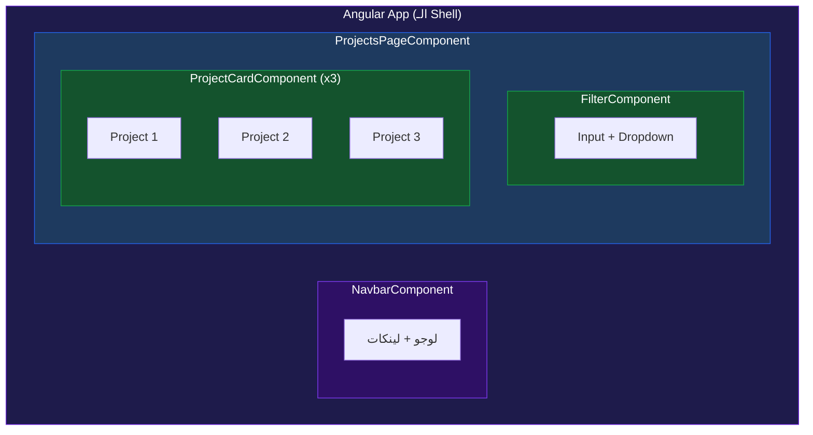
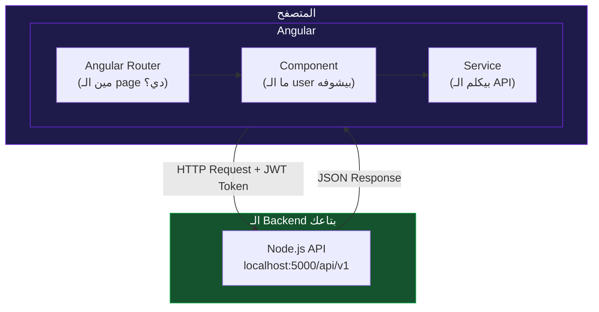
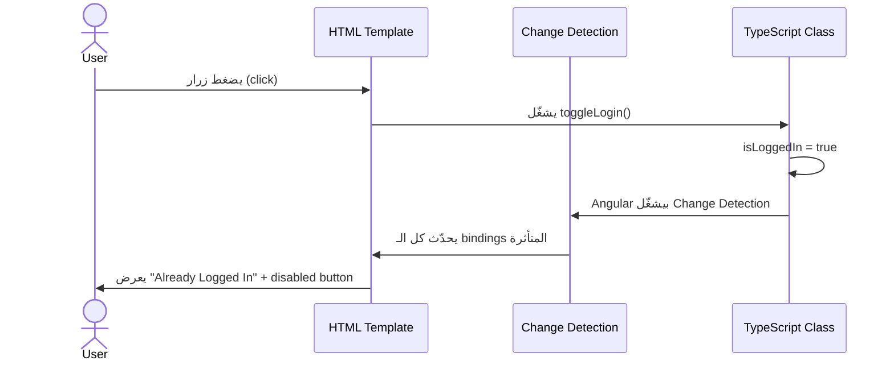
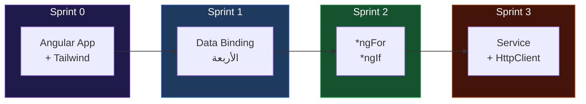
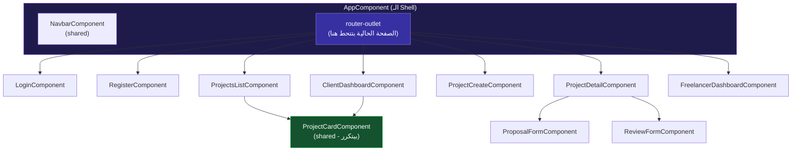
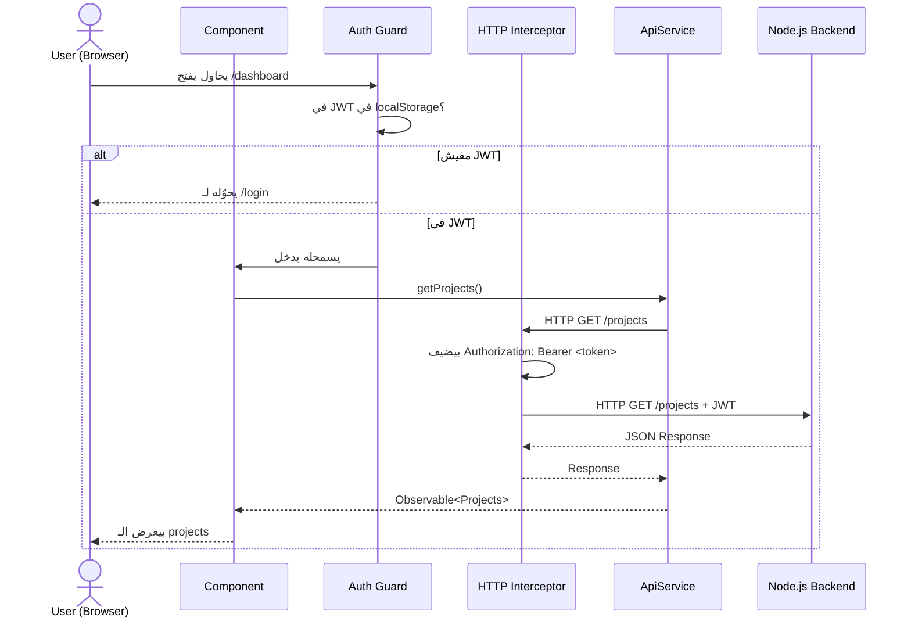
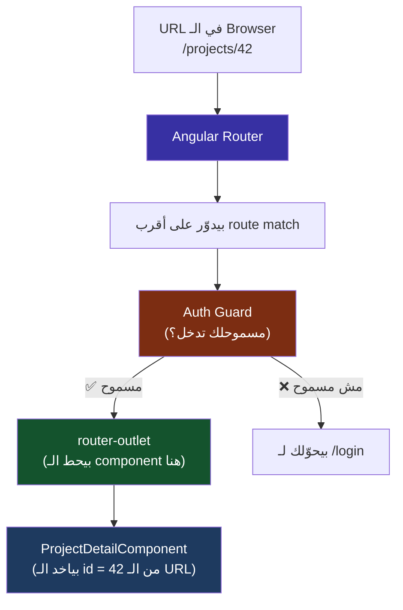
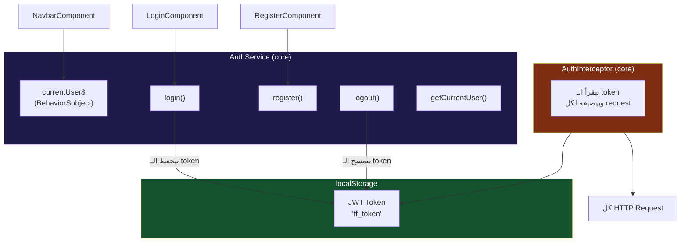
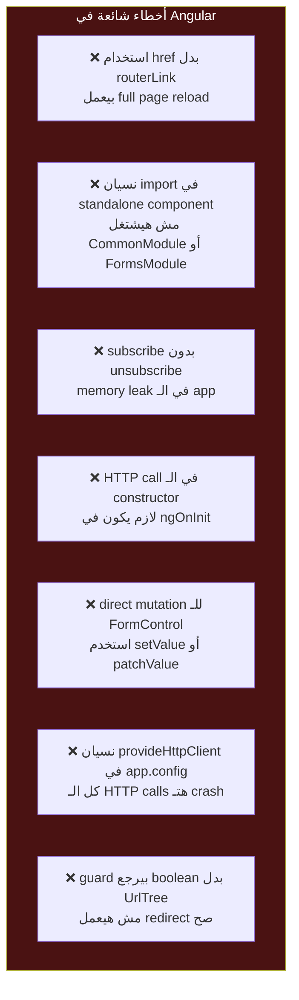

# 🎓 FreelanceFlow Frontend — Learning Journey
> بنبني من الصفر الحقيقي. سطر بسطر. مفيش حاجة هتعدي من غير ما تفهمها.

---

# 🏁 Sprint 0 — ليه Angular؟ وإيه اللي بيحصل جوّاه؟

---

## قبل ما نكتب سطر واحد كود — لازم نفهم المشكلة

أنت دلوقتي عندك backend شغال على `http://localhost:5000/api/v1`.

عندك endpoints. عندك JWT. عندك Projects وProposals وReviews.

بس لو Ali عايز يعمل project — مش هيفتح Postman. هيفتح **browser**. هيشوف form، يكتب فيه، يضغط زر.

ومش هيبعت `Authorization: Bearer <token>` يدوياً في كل request — في حاجة بتعمل ده تلقائياً.

ومش هيشوف JSON raw — هيشوف cards وtables وbuttons.

**ده اللي Angular بتعمله.** بتاخد الـ API بتاعك وبتحوّله لـ UI حقيقي.

---

## طب إيه الفرق بين Angular وHTML عادي؟

لو هتعمل الـ frontend ده بـ plain HTML وJavaScript:

```html
<!-- projects.html -->
<ul id="list"></ul>

<script>
  async function load() {
    const token = localStorage.getItem('token');
    const res   = await fetch('http://localhost:5000/api/v1/projects', {
      headers: { Authorization: 'Bearer ' + token }
    });
    const data  = await res.json();

    const ul = document.getElementById('list');
    data.data.projects.forEach(p => {
      const li       = document.createElement('li');
      li.textContent = p.title;
      ul.appendChild(li);
    });
  }
  load();
</script>
```

ده شغال. بس فيه 3 مشاكل كبار:

**المشكلة الأولى — التحديث يدوي.**
لو project اتضاف أو اتحذف، لازم تشغّل `load()` تاني بنفسك. مفيش حاجة بتراقب.

**المشكلة التانية — الكود متكرر.**
في `projects.html` بتكتب الـ token logic. في `proposals.html` بتكتبها تاني. في `reviews.html` تاني. في 10 صفحات — 10 مرات نفس الكود.

**المشكلة التالتة — الـ DOM manipulation يدوي.**
`document.createElement`، `appendChild`، `innerHTML` — ده كود هشاش جداً. مع أي تعقيد بسيط بيبقى جحيم.

Angular حلّ الـ 3 مشاكل دول بفكرة واحدة: **الـ Component**.

---

## الفكرة الكبيرة — إيه هو الـ Component؟

تخيل إنك بتبني الـ UI زي ما بتبني بـ LEGO.

كل قطعة LEGO = Component واحد. عنده:
- **شكله** — ده الـ HTML template
- **طريقة اشتغاله** — ده الـ TypeScript class
- **لونه وحجمه** — ده الـ CSS

وكل قطعة **مسؤولة عن نفسها**. الـ `ProjectCardComponent` مش شغله يعرف حاجة عن الـ `LoginComponent`. كل واحد عنده الـ data بتاعته والـ logic بتاعته.



لاحظ إن الـ `ProjectCardComponent` ظهر 3 مرات. ده مش 3 ملفات مختلفة — ده **نفس الـ component** بيتعمل reuse 3 مرات بـ data مختلفة.

ده اللي مش ممكن تعمله بسهولة في HTML عادي.

---

## طب Standalone Components دي إيه؟ (v17+)

في الـ Angular القديم (قبل v17) — كان في حاجة اسمها **NgModule**.

كان زي عقد إيجار. كل component عايز يشتغل، لازم يتسجّل في module أولاً. زي ما تتخيل إنك عايز تشغّل browser على laptop، بس لازم أول حاجة تسجّل الـ browser في وزارة الاتصالات.

Angular v17 قرر يخلّص من ده. دلوقتي كل component **مستقل بذاته** — `standalone: true`. بيعلن بنفسه إيه اللي يحتاجه، ومش محتاج module يسجّله.

```typescript
// الطريقة القديمة — محتاج تسجيل في NgModule
@Component({ selector: 'app-card', templateUrl: './card.component.html' })
export class CardComponent {}

// الطريقة الجديدة (v17+) — standalone ومستقل
@Component({
  standalone: true,
  selector: 'app-card',
  templateUrl: './card.component.html'
})
export class CardComponent {}
```

في الـ guide ده هنشتغل بالطريقة الجديدة دايماً.

---

## وين Tailwind بتيجي في الصورة؟

Angular بيتكلم عن **structure** — الـ components، الـ data، الـ routing.

Tailwind بيتكلم عن **appearance** — الألوان، الـ spacing، الـ typography.

الاتنين بيشتغلوا جنب بعض. Angular بيقول "فيه button هنا"، وTailwind بيقول "الـ button ده أزرق وفيه padding وعنده hover effect".

```html
<!-- بدون Tailwind -->
<button class="my-button">Submit</button>

<!-- مع Tailwind — الـ styling مباشرة في الـ HTML -->
<button class="bg-blue-600 text-white px-4 py-2 rounded-lg hover:bg-blue-700">
  Submit
</button>
```

مفيش ملف CSS منفصل. الـ styles موجودة جنب الـ HTML على طول — ده بيخلي الـ component فعلاً self-contained.

---

## الصورة الكاملة قبل ما نبدأ



لاحظ الـ 3 أجزاء الجديدة:

**Router** — بيقول "الـ URL ده `/projects` يعني اعرض الـ `ProjectsComponent`". زي الـ routes في Express بس للـ frontend.

**Component** — ما الـ user بيشوفه وبيتفاعل معاه.

**Service** — هو اللي بيكلم الـ API. الـ component مش بيكلم الـ API مباشرة — بيطلب من الـ service.

---

## 💻 إنشاء الـ Project

> **متطلب مسبق:** Node.js مثبّت على جهازك. تتأكد بـ `node -v`.

افتح terminal واكتب:

```bash
npm install -g @angular/cli
```

`-g` معناها global — بتثبّت الـ Angular CLI على جهازك كله مش على مشروع بعينه.

`@angular/cli` هو الأداة اللي بتنشئ وتشغّل وتبني Angular projects. زي `express-generator` بس أقوى بكتير.

تتأكد إنه اتثبت صح:

```bash
ng version
```

المفروض تشوف سطر فيه `Angular CLI: 17.x.x` أو أحدث.

---

## 💻 إنشاء الـ App

```bash
ng new freelance-flow-frontend
```

هيسألك سؤالين:

```
? Which stylesheet format would you like to use?
> CSS

? Do you want to enable Server-Side Rendering (SSR)?
> No
```

اختار **CSS** وـ**No** للـ SSR. (SSR موضوع تاني خالص — مش محتاجينه دلوقتي.)

بعدين:

```bash
cd freelance-flow-frontend
```

---

## شجرة الـ Project — إيه كل ملف ده؟

```
freelance-flow-frontend/
├── src/
│   ├── app/
│   │   ├── app.component.ts       ← أول component في الـ app (الـ shell)
│   │   ├── app.component.html     ← الـ HTML بتاعه
│   │   ├── app.component.css      ← الـ styles بتاعه
│   │   └── app.config.ts          ← إعدادات الـ app (routing, HTTP, etc.)
│   ├── index.html                 ← ملف HTML واحد بس — Angular بيحط نفسه جواه
│   ├── main.ts                    ← نقطة البداية — زي server.js في Node
│   └── styles.css                 ← global styles
├── angular.json                   ← إعدادات Angular CLI
├── package.json                   ← نفس فكرة Node — dependencies وscripts
└── tsconfig.json                  ← إعدادات TypeScript
```

---

## أهم ملفين — `main.ts` و `index.html`

### `index.html` أولاً:

افتحه — هتلاقيه كده:

```html
<!doctype html>
<html lang="en">
  <head>
    <meta charset="utf-8">
    <title>FreelanceFlowFrontend</title>
    <base href="/">
    <meta name="viewport" content="width=device-width, initial-scale=1">
    <link rel="icon" type="image/x-icon" href="favicon.ico">
  </head>
  <body>
    <app-root></app-root>
  </body>
</html>
```

لاحظ `<app-root></app-root>`. ده مش HTML tag standard. ده **Angular component**.

Angular هيشوف الـ tag ده ويقول: "أنا عارف الـ `app-root` ده — هحوّله لـ component بتاعه وأحط الـ HTML بتاعه هنا."

**ليه ملف HTML واحد بس؟**

في الـ multi-page website التقليدي — كل صفحة ملف HTML. في Angular — ملف واحد بس. Angular بيبدّل الـ content جوّاه بدون ما الصفحة تعمل reload. ده اللي بيتسمى **Single Page Application (SPA)**.

---

### `main.ts` تاني:

```typescript
import { bootstrapApplication } from '@angular/platform-browser';
import { appConfig }            from './app/app.config';
import { AppComponent }         from './app/app.component';

bootstrapApplication(AppComponent, appConfig)
  .catch(err => console.error(err));
```

**سطر بسطر:**

`import { bootstrapApplication }` — بتجيب الـ function اللي بتشغّل Angular. زي `require('express')` بالظبط.

`import { appConfig }` — بتجيب الـ إعدادات: فيها routing، HTTP client، وأي providers تانية.

`import { AppComponent }` — بتجيب أول component في الـ app — هو الـ shell اللي كل حاجة بتتحط جوّاه.

`bootstrapApplication(AppComponent, appConfig)` — ده زي `app.listen(PORT)` في Node. ده اللي بيشغّل الـ app فعلاً. بيقول: "ابدأ Angular، حط `AppComponent` في الـ `<app-root>` في الـ HTML."

`.catch(err => console.error(err))` — لو حصل error وقت الـ startup — اطبعه.

---

## 💻 شوف الـ App قبل ما تغير فيه حاجة

```bash
ng serve
```

افتح browser على `http://localhost:4200`. هتشوف صفحة Angular default.

لاحظ حاجتين مهمين:

**أولاً** — الـ port مختلف. Backend على `5000`، Frontend على `4200`. الاتنين شغالين مع بعض.

**تانياً** — لما بتعدّل أي ملف، الـ browser بيتحدث **تلقائياً** من غير ما تعمل refresh. ده اللي بيتسمى **Hot Module Replacement** — Angular CLI بيعمله تلقائياً. زي `nodemon` بس للـ frontend.

---

## 💻 تثبيت Tailwind CSS

وقّف السيرفر أولاً بـ `Ctrl+C`، وبعدين:

```bash
npm install -D tailwindcss postcss autoprefixer
npx tailwindcss init
```

**إيه الـ packages دي؟**

`tailwindcss` — الـ framework نفسه. بيولّد CSS من الـ class names اللي بتحطها في الـ HTML.

`postcss` — أداة بتعالج الـ CSS. Tailwind بيشتغل جوّاها — مش بتتعامل معاه مباشرة، بس لازم يكون موجود.

`autoprefixer` — بيضيف `-webkit-` وـ`-moz-` prefixes تلقائياً للـ CSS عشان يشتغل على كل الـ browsers.

`-D` = `--save-dev` — نفس الفكرة اللي في Node. ده بس للـ development. في الـ production بيتعمل compile مرة واحدة.

`npx tailwindcss init` — بيعمل ملف `tailwind.config.js` — ده ملف إعدادات Tailwind.

---

## 💻 إعداد `tailwind.config.js`

افتحه — هتلاقيه كده:

```javascript
/** @type {import('tailwindcss').Config} */
module.exports = {
  content: [],
  theme: {
    extend: {},
  },
  plugins: [],
}
```

غيّره لكده:

```javascript
/** @type {import('tailwindcss').Config} */
module.exports = {
  content: [
    "./src/**/*.{html,ts}"
  ],
  theme: {
    extend: {},
  },
  plugins: [],
}
```

**شرح السطر المهم:**

`content: ["./src/**/*.{html,ts}"]`

ده بيقول لـ Tailwind: "دوّر على الـ class names اللي بستخدمها في أي `.html` أو `.ts` file جوّا `src`."

**ليه لازم نعرفه فين بنستخدمه؟**

Tailwind مش زي Bootstrap. ما بيحملش كل الـ CSS من أول وجديد. بيولّد CSS classes بس اللي بتستخدمها فعلاً. لو ما قلتلوش فين — هيولّد ملف CSS فاضي.

---

## 💻 إضافة Tailwind لـ `styles.css`

افتح `src/styles.css` وحط التلاتة سطور دول:

```css
@tailwind base;
@tailwind components;
@tailwind utilities;
```

**إيه كل سطر:**

`@tailwind base` — بيعمل CSS reset. بيمسح الـ default browser styles (padding، margin، font sizes مختلفة من browser للتاني) ويبدأ بـ baseline نضيفة.

`@tailwind components` — بيجيب الـ component classes. دلوقتي فاضي بس هنضيف فيه custom classes بعدين.

`@tailwind utilities` — ده الجزء الأهم. كل الـ classes زي `bg-blue-500` و`px-4` و`rounded-lg` موجودة هنا.

---

## 💻 اختبر إن Tailwind شغال

افتح `src/app/app.component.html`. هتلاقيه فيه كتير — احذف كل حاجة وحط ده بدله:

```html
<div class="min-h-screen bg-gray-50 flex items-center justify-center">
  <div class="bg-white rounded-2xl shadow-sm border border-gray-200 p-10 max-w-md w-full">
    <h1 class="text-2xl font-bold text-gray-900 mb-2">FreelanceFlow</h1>
    <p class="text-gray-500 text-sm">Angular + Tailwind is working.</p>
  </div>
</div>
```

شغّل السيرفر تاني:

```bash
ng serve
```

---

## شرح كل class في الـ HTML ده

`min-h-screen` — الـ `div` ده ارتفاعه على الأقل 100% من الشاشة.

`bg-gray-50` — background لونه رمادي فاتح جداً (مش أبيض صافي — أبيض بصبغة رمادية).

`flex items-center justify-center` — Flexbox. يحط الـ content في النص أفقياً وعمودياً.

`bg-white` — الـ card بيضاء.

`rounded-2xl` — corners مستديرة كبيرة.

`shadow-sm` — ظل خفيف — بيدي الـ card إحساس إنها شوية فوق الـ background.

`border border-gray-200` — border رفيعة رمادية فاتحة.

`p-10` — padding من كل الجهات — 10 وحدات (كل وحدة = 4px — يعني 40px).

`max-w-md` — الـ card مش هتاخد أكتر من 448px عرض.

`w-full` — على الشاشات الصغيرة تاخد العرض كله.

`text-2xl font-bold text-gray-900` — نص كبير، بولد، لون رمادي داكن جداً (مش أسود صافي).

`mb-2` — margin-bottom صغير تحت الـ heading.

`text-gray-500 text-sm` — نص صغير، لون رمادي متوسط.

---

## ✅ Checkpoint

> [!example] Test 1 — Angular شغال
> افتح `http://localhost:4200`
>
> **Expected:** card في النص بيقول "FreelanceFlow" و"Angular + Tailwind is working."

> [!example] Test 2 — Tailwind فعّال
> في `app.component.html` غيّر `bg-gray-50` لـ `bg-blue-50`
>
> **Expected:** الـ background اتغير للأزرق الفاتح تلقائياً من غير restart

> [!example] Test 3 — Hot Reload شغال
> غيّر النص من "Angular + Tailwind is working." لأي حاجة تانية
>
> **Expected:** التغيير اتعمل في الـ browser من غير ما تعمل refresh

---

## سؤال مهم — ليه مفيش `app.module.ts`؟

لو شفت أي Angular tutorial قديم — هتلاقي فيه ملف `app.module.ts`. مش هتلاقيه في الـ project بتاعنا.

السبب: احنا شغالين بـ Standalone Components (v17+). مفيش modules.

لو حد سألك في interview: "Angular بيشتغل إزاي من غير NgModule؟"

الإجابة: الـ `bootstrapApplication()` في `main.ts` بياخد الـ root component والـ `appConfig` مباشرة. الـ config ده بيحتوي على الـ providers (Router، HttpClient، etc.) اللي كانوا قبل كده في الـ NgModule.

---

## إيه اللي بنيناه في Sprint 0

```
freelance-flow-frontend/
├── src/
│   ├── app/
│   │   ├── app.component.html  ← عدّلناه — Tailwind layout
│   │   ├── app.component.ts    ← لسه default
│   │   └── app.config.ts       ← لسه default
│   ├── main.ts                 ← شرحناه سطر بسطر
│   ├── styles.css              ← أضفنا Tailwind directives
│   └── index.html              ← شرحنا `<app-root>`
├── tailwind.config.js          ← أضفناه وعدّلنا الـ content paths
└── package.json                ← Tailwind + PostCSS + Autoprefixer اتضافوا
```

---

## ملخص Sprint 0

اللي اتبنى:
- **Angular app** بـ Angular CLI
- **Tailwind CSS** مربوط ومشتغل
- **Hot Reload** — أي تعديل بيظهر فوراً

اللي اتعلمته:
- Angular = Framework كامل مش library — بيحدد البنية
- الـ `<app-root>` في `index.html` هو مكان الـ app كله
- `main.ts` = نقطة البداية — زي `server.js` في Node
- `bootstrapApplication()` = زي `app.listen()` — هو اللي بيشغّل الـ app
- Standalone Components = مفيش NgModule — كل component مستقل بذاته
- Tailwind بيتعلم الـ classes من الـ HTML بتاعك — مش بيحمّل CSS كله

---

# 📦 Sprint 1 — الـ Component من الجوّا: TypeScript + Template + Binding

---

## المشكلة اللي Sprint 1 بيحلها

عندنا app شغالة. بس الـ HTML بتاعنا **static** — مكتوب فيه نص ثابت.

الـ backend بيرجعلنا data من قاعدة البيانات — مش نصوص ثابتة.

لازم الـ component يقدر يعمل 3 حاجات:
1. **يحتفظ بـ data** — زي الـ projects اللي جابهم من الـ API
2. **يعرضها في الـ HTML** — بدون ما تعمل DOM manipulation يدوي
3. **يتفاعل مع الـ user** — لما حد يضغط زرار أو يكتب في input

الـ 3 حاجات دول اسمهم: **Data Binding**.

---

## Component ده في الحقيقة إيه؟

كل component في Angular فيه 3 أجزاء:

```
AppComponent
├── app.component.ts     ← الـ Class (العقل — logic + data)
├── app.component.html   ← الـ Template (الشكل — ما الـ user بيشوفه)
└── app.component.css    ← الـ Styles (اللون والحجم)
```

الـ Class والـ Template مش منفصلين تماماً. بينهم **connection حي** — لما data في الـ Class تتغير، الـ Template بيتحدث تلقائياً. ده هو الـ Data Binding.

---

## الـ TypeScript Class — الهيكل الأساسي

افتح `src/app/app.component.ts`. هتلاقيه كده:

```typescript
import { Component } from '@angular/core';

@Component({
  standalone: true,
  selector: 'app-root',
  templateUrl: './app.component.html',
  styleUrl: './app.component.css'
})
export class AppComponent {
  title = 'freelance-flow-frontend';
}
```

**سطر بسطر:**

`import { Component } from '@angular/core'` — بتجيب الـ `Component` decorator من Angular. زي `require('express')` — بتجيب الأداة الأساسية.

`@Component({...})` — ده **Decorator**. فكر فيه زي metadata بتقول لـ Angular "الـ class دي مش class عادية — دي Component." وبتقوله:

- `standalone: true` — مستقلة، مش محتاجة module.
- `selector: 'app-root'` — الاسم اللي هتستخدمه في الـ HTML. لما Angular يشوف `<app-root>` في الـ HTML، يحط الـ component ده هناك.
- `templateUrl` — فين الـ HTML بتاعه.
- `styleUrl` — فين الـ CSS بتاعه.

`export class AppComponent` — الـ class نفسها. الـ `export` لأن ملفات تانية محتاجة تستخدمها.

`title = 'freelance-flow-frontend'` — ده **property** على الـ class. زي `this.title` في JavaScript عادي.

---

## أنواع الـ Data Binding الأربعة

في Angular 4 أنواع binding. كل نوع بيحل مشكلة مختلفة.

### النوع الأول — Interpolation `{{ }}`

**المشكلة:** عايز أعرض قيمة متغير في الـ HTML.

```typescript
// app.component.ts
export class AppComponent {
  username = 'Ali';
  projectCount = 5;
}
```

```html
<!-- app.component.html -->
<h1>Welcome, {{ username }}</h1>
<p>You have {{ projectCount }} projects</p>
<p>2 + 2 = {{ 2 + 2 }}</p>
```

`{{ }}` — Angular بيشوف الأقواس دول، بيروح يجيب قيمة الـ property من الـ class، ويحطها في الـ HTML.

لو `username` اتغيرت في الـ TypeScript — الـ HTML بيتحدث تلقائياً. مش محتاج `document.getElementById` ولا `innerHTML`.

---

### النوع التاني — Property Binding `[property]`

**المشكلة:** عايز أتحكم في attribute أو property على HTML element.

```typescript
export class AppComponent {
  isDisabled  = true;
  imageUrl    = 'https://example.com/logo.png';
  buttonLabel = 'Submit Proposal';
}
```

```html
<button [disabled]="isDisabled">{{ buttonLabel }}</button>

```

الأقواس `[]` معناها: "الـ value دي مش string ثابت — ده expression من الـ TypeScript class."

**الفرق بين Interpolation وProperty Binding:**

`{{ }}` بيحوّل الـ value لـ string ويحطه كـ text.

`[property]` بيحط الـ value مباشرة على الـ DOM property من غير تحويل.

---

### النوع التالت — Event Binding `(event)`

**المشكلة:** عايز أعمل function في الـ TypeScript لما حاجة تحصل في الـ HTML.

```typescript
export class AppComponent {
  count = 0;

  increment() {
    this.count++;
  }

  onInputChange(event: Event) {
    const input = event.target as HTMLInputElement;
    console.log(input.value);
  }
}
```

```html
<button (click)="increment()">
  Clicked {{ count }} times
</button>

<input (input)="onInputChange($event)" placeholder="Search projects..." />
```

الأقواس `()` معناها: "لما الـ event ده يحصل — شغّل الـ function دي."

`$event` — Angular بيعمل available الـ native browser event object. بتستخدمه لما محتاج تعرف الـ value اللي الـ user كتبه.

---

### النوع الرابع — Two-Way Binding `[(ngModel)]`

**المشكلة:** عندي input وعايز الـ variable في الـ TypeScript يتحدث تلقائياً وكمان الـ input يعكس قيمة الـ variable.

تخيل الفرق:

- **One-way:** TypeScript → HTML (بس). لو الـ variable اتغير في الـ TypeScript، الـ HTML يتحدث.
- **Two-way:** TypeScript ↔ HTML. الـ variable بيتحدث لما الـ user يكتب، والـ input بيتحدث لو الـ variable اتغير من الـ TypeScript.

```typescript
// لازم أولاً تعلن الـ property
export class AppComponent {
  searchText = '';
}
```

```html
<input [(ngModel)]="searchText" placeholder="Search..." />
<p>You are searching for: {{ searchText }}</p>
```

لاحظ إن `[(ngModel)]` فيها الاتنين — `[]` لـ property binding و`()` لـ event binding مع بعض.

**مهم:** `ngModel` محتاج import خاص. هنشوف ده في الكود الكامل بعدين.

---

## 💻 الكود الكامل — تطبيق عملي

هنبني mini demo فيه كل الأنواع الأربعة مع بعض. ده هيبقى شبيه جداً بـ components حقيقية هنعملها بعدين.

افتح `src/app/app.component.ts` وحط ده:

```typescript
import { Component }   from '@angular/core';
import { CommonModule } from '@angular/common';
import { FormsModule }  from '@angular/forms';

@Component({
  standalone: true,
  selector: 'app-root',
  imports: [CommonModule, FormsModule],
  templateUrl: './app.component.html',
  styleUrl: './app.component.css'
})
export class AppComponent {
  // Properties — الـ data بتاعة الـ component
  appName     = 'FreelanceFlow';
  isLoggedIn  = false;
  searchText  = '';

  // Method — بيتشغل لما الـ user يضغط الزرار
  toggleLogin() {
    this.isLoggedIn = !this.isLoggedIn;
  }
}
```

---

## شرح الـ imports الجديدة

`CommonModule` — بيجيب معاه الـ Angular directives الأساسية زي `*ngIf` وـ`*ngFor`. هنشرحهم قريباً.

`FormsModule` — بيجيب معاه `ngModel`. من غيره — Angular مش هيعرف الـ `[(ngModel)]` ده إيه.

`imports: [CommonModule, FormsModule]` — ده الجزء المهم في الـ Standalone Components. الـ component بيعلن **هو نفسه** إيه اللي محتاجه من غير module وسيط.

---

افتح `src/app/app.component.html` وحط ده:

```html
<div class="min-h-screen bg-gray-50 flex items-center justify-center p-4">
  <div class="bg-white rounded-2xl shadow-sm border border-gray-200 p-8 w-full max-w-lg space-y-6">

    <!-- Interpolation {{ }} -->
    <h1 class="text-2xl font-bold text-gray-900">
      Welcome to {{ appName }}
    </h1>

    <!-- Property Binding [] -->
    <button
      [disabled]="isLoggedIn"
      (click)="toggleLogin()"
      class="w-full py-2 px-4 rounded-lg text-sm font-medium border border-gray-300 text-gray-700 hover:bg-gray-50 disabled:opacity-40 disabled:cursor-not-allowed transition-colors">
      {{ isLoggedIn ? 'Already Logged In' : 'Log In' }}
    </button>

    <!-- Two-Way Binding [(ngModel)] -->
    <div class="space-y-2">
      <label class="text-sm text-gray-500">Search Projects</label>
      <input
        [(ngModel)]="searchText"
        placeholder="Type something..."
        class="w-full border border-gray-300 rounded-lg px-3 py-2 text-sm focus:outline-none focus:ring-2 focus:ring-blue-500 focus:border-transparent"
      />
    </div>

    <!-- Interpolation يعرض قيمة اللي بيكتبه -->
    <p class="text-sm text-gray-500">
      Searching for: <span class="font-medium text-gray-800">{{ searchText || '...' }}</span>
    </p>

    <!-- Login status -->
    <div class="text-sm text-center"
         [class.text-green-600]="isLoggedIn"
         [class.text-gray-400]="!isLoggedIn">
      {{ isLoggedIn ? 'Status: Logged In' : 'Status: Guest' }}
    </div>

  </div>
</div>
```

---

## شرح سطور مهمة في الـ HTML

`{{ isLoggedIn ? 'Already Logged In' : 'Log In' }}` — Ternary expression جوّا الـ interpolation. Angular بيحسب الـ expression ويحط النتيجة.

`[disabled]="isLoggedIn"` — الـ button بتـ disable تلقائياً لما `isLoggedIn` بتبقى `true`.

`(click)="toggleLogin()"` — لما الـ user يضغط، Angular بيشغّل `toggleLogin()`.

`[class.text-green-600]="isLoggedIn"` — ده class binding. بيضيف الـ class `text-green-600` بس لما الـ condition صح. لو غلط — الـ class مش موجودة خالص.

`{{ searchText || '...' }}` — لو `searchText` فاضي — اعرض `'...'` بدله.

---

## ✅ Checkpoint

> [!example] Test 1 — Interpolation
> افتح `http://localhost:4200`
>
> **Expected:** تشوف "Welcome to FreelanceFlow" في الـ heading

> [!example] Test 2 — Event Binding
> اضغط زرار "Log In"
>
> **Expected:** الزرار يبقى disabled والـ status يتغير لـ "Logged In" باللون الأخضر

> [!example] Test 3 — Two-Way Binding
> اكتب في الـ search input
>
> **Expected:** الـ paragraph تحته بيتحدث في real time بنفس اللي بتكتبه

> [!example] Test 4 — Property Binding على الـ class
> اضغط Log In وشوف لون الـ Status
>
> **Expected:** يتغير من رمادي لأخضر تلقائياً

---

## الـ Deep Dive — إيه اللي بيحصل من جوّا؟

لما بتكتب `{{ searchText }}` في الـ HTML — Angular مش بيـ watch الـ variable ده بـ `setInterval` أو حاجة زي كده.

Angular عنده حاجة اسمها **Change Detection**. بعد أي event (click، input، HTTP response) — Angular بيشوف كل الـ components ويقارن الـ values الجديدة بالقديمة. لو في فرق — بيحدّث الـ DOM.

ده معناه إنك **مش محتاج تقول لـ Angular "اتحدث"** — هو بيعمل ده تلقائياً بعد كل event.



---

## ملخص Sprint 1

اللي اتعلمته:

- **`@Component` Decorator** — بيحوّل class عادية لـ Angular component
- **`standalone: true`** — مش محتاج module — بس محتاج تعلن الـ imports بنفسك
- **`{{ }}` Interpolation** — عرض قيمة من الـ class في الـ HTML
- **`[property]` Property Binding** — تحكم في HTML attributes من الـ TypeScript
- **`(event)` Event Binding** — شغّل method في الـ TypeScript لما event يحصل
- **`[(ngModel)]` Two-Way Binding** — ربط input بـ variable في الاتجاهين
- **Change Detection** — Angular بيحدّث الـ HTML تلقائياً بعد أي event

---

# 📦 Sprint 2 — `*ngFor` و`*ngIf`: إزاي Angular بيعرض Lists

---

## المشكلة اللي Sprint 2 بيحلها

Backend بيرجعلك array من projects. إزاي تعرضها في الـ HTML؟

في HTML عادي:

```javascript
data.projects.forEach(p => {
  const li = document.createElement('li');
  li.textContent = p.title;
  ul.appendChild(li);
});
```

في Angular — في حاجة اسمها **Structural Directives**. بتكتبها مباشرة في الـ HTML وهي اللي بتتحكم في هيكل الـ DOM.

---

## إيه هو الـ Directive؟

الـ Decorator `@Component` بيقول "الـ class دي component". الـ Directive بيقول "الـ HTML element ده له سلوك خاص".

في نوعين مهمين:

**Structural Directives** — بتغير **هيكل** الـ DOM. بتضيف أو بتشيل elements.
- `*ngFor` — بيعمل loop
- `*ngIf` — بيخفي أو يظهر

**Attribute Directives** — بتغير **شكل** أو **سلوك** element موجود.
- `[class]` — اللي شفناه في Sprint 1
- `[style]` — بتغير الـ inline styles

---

## `*ngFor` — الـ Loop في الـ HTML

```typescript
// app.component.ts
export class AppComponent {
  projects = [
    { id: 1, title: 'Build a React Dashboard',  budget: 1200, status: 'open'        },
    { id: 2, title: 'Design a Mobile App UI',   budget: 800,  status: 'in_progress' },
    { id: 3, title: 'Write API Documentation',  budget: 300,  status: 'open'        },
  ];
}
```

```html
<!-- بدون Angular — إزاي كنا بنعمله -->
<!-- <script> بيعمل forEach ويضيف elements للـ DOM </script> -->

<!-- مع Angular -->
<div *ngFor="let project of projects">
  <h3>{{ project.title }}</h3>
  <p>Budget: ${{ project.budget }}</p>
</div>
```

`*ngFor="let project of projects"` — Angular بيقرأ ده ويقول: "ادور على الـ `projects` array، لكل عنصر فيها — اعمل نسخة من الـ `div` ده وسمّي الـ element الحالي `project`."

النجمة `*` في الأول مهمة — بتقول لـ Angular "ده structural directive بيغير هيكل الـ DOM."

---

## `*ngFor` مع Index وconditions

```html
<div *ngFor="let project of projects; let i = index; let isLast = last">
  <span class="text-gray-400 text-xs">{{ i + 1 }}.</span>
  <h3>{{ project.title }}</h3>
  <hr *ngIf="!isLast" class="border-gray-100" />
</div>
```

`let i = index` — Angular بيعمل متاح رقم الـ element الحالي.

`let isLast = last` — Angular بيقولك هل ده آخر عنصر في الـ array. بنستخدمه عشان ما نحطش فاصل بعد آخر عنصر.

---

## `*ngIf` — الإخفاء والإظهار

```typescript
export class AppComponent {
  isLoading  = false;
  hasError   = false;
  projects   = [ /* ... */ ];
}
```

```html
<!-- لو شغال بيعمل load -->
<div *ngIf="isLoading" class="text-center text-gray-400 py-8">
  Loading projects...
</div>

<!-- لو في error -->
<div *ngIf="hasError" class="text-red-500 text-sm p-4 bg-red-50 rounded-lg">
  Something went wrong. Please try again.
</div>

<!-- لو مفيش projects -->
<div *ngIf="!isLoading && !hasError && projects.length === 0"
     class="text-center text-gray-400 py-8">
  No projects found.
</div>

<!-- لو في projects — اعرضهم -->
<div *ngIf="projects.length > 0">
  <div *ngFor="let project of projects">
    <h3>{{ project.title }}</h3>
  </div>
</div>
```

`*ngIf` مش بتخفي الـ element زي `display: none`. بتشيله من الـ DOM خالص لما الـ condition تبقى `false`، وتضيفه لما تبقى `true`.

---

## `*ngIf` مع `else`

```html
<div *ngIf="isLoggedIn; else guestBlock">
  <p>Welcome back, Ali!</p>
</div>

<ng-template #guestBlock>
  <p>Please log in to continue.</p>
</ng-template>
```

`<ng-template>` — Angular container مش بيتعمل render في الـ HTML. Angular بيستخدمه كـ "محتوى احتياطي".

`#guestBlock` — ده template reference variable — بيعمل اسم للـ template عشان الـ `*ngIf` يقدر يرجع عليه.

---

## 💻 الكود الكامل — Project List مع Status

عدّل `app.component.ts`:

```typescript
import { Component }   from '@angular/core';
import { CommonModule } from '@angular/common';

@Component({
  standalone: true,
  selector:   'app-root',
  imports:    [CommonModule],
  templateUrl: './app.component.html',
  styleUrl:    './app.component.css'
})
export class AppComponent {
  isLoading = false;

  projects = [
    {
      id:     1,
      title:  'Build a React Dashboard',
      budget: { min: 500,  max: 1200 },
      status: 'open',
      skills: ['React', 'Node.js']
    },
    {
      id:     2,
      title:  'Design a Mobile App UI',
      budget: { min: 300,  max: 800  },
      status: 'in_progress',
      skills: ['Figma', 'UI/UX']
    },
    {
      id:     3,
      title:  'Write API Documentation',
      budget: { min: 100,  max: 300  },
      status: 'completed',
      skills: ['Technical Writing']
    },
  ];
}
```

عدّل `app.component.html`:

```html
<div class="min-h-screen bg-gray-50 p-6">
  <div class="max-w-2xl mx-auto space-y-4">

    <h1 class="text-xl font-semibold text-gray-900">Open Projects</h1>

    <!-- Loading State -->
    <div *ngIf="isLoading" class="text-center py-16 text-gray-400 text-sm">
      Loading...
    </div>

    <!-- Empty State -->
    <div *ngIf="!isLoading && projects.length === 0"
         class="text-center py-16 text-gray-400 text-sm">
      No projects available.
    </div>

    <!-- Project Cards -->
    <div *ngFor="let project of projects"
         class="bg-white rounded-xl border border-gray-200 p-5 space-y-3">

      <!-- Title + Status -->
      <div class="flex items-start justify-between">
        <h2 class="font-medium text-gray-900 text-sm">{{ project.title }}</h2>

        <span
          class="text-xs px-2 py-1 rounded-full font-medium"
          [class.bg-green-50]="project.status === 'open'"
          [class.text-green-700]="project.status === 'open'"
          [class.bg-blue-50]="project.status === 'in_progress'"
          [class.text-blue-700]="project.status === 'in_progress'"
          [class.bg-gray-100]="project.status === 'completed'"
          [class.text-gray-500]="project.status === 'completed'">
          {{ project.status }}
        </span>
      </div>

      <!-- Budget -->
      <p class="text-sm text-gray-500">
        Budget: ${{ project.budget.min }} – ${{ project.budget.max }}
      </p>

      <!-- Skills -->
      <div class="flex flex-wrap gap-2">
        <span
          *ngFor="let skill of project.skills"
          class="text-xs bg-gray-100 text-gray-600 px-2 py-1 rounded-md">
          {{ skill }}
        </span>
      </div>

      <!-- Propose Button — يظهر بس لو status = open -->
      <button
        *ngIf="project.status === 'open'"
        class="text-xs text-blue-600 font-medium hover:text-blue-800 transition-colors">
        Submit Proposal →
      </button>

    </div>
  </div>
</div>
```

---

## شرح class binding في الـ Status Badge

```html
[class.bg-green-50]="project.status === 'open'"
[class.text-green-700]="project.status === 'open'"
```

Angular بيقول: "ضيف `bg-green-50` لو `project.status` مساوية `'open'`." الـ class بتتضاف وتتشال تلقائياً مع كل change detection cycle.

في الـ project الحقيقي هنستخدم pipe أو function عشان ما تتكررش. بس دلوقتي مهم تفهم الفكرة.

---

## ✅ Checkpoint

> [!example] Test 1 — List Rendering
> افتح `http://localhost:4200`
>
> **Expected:** 3 project cards بـ titles مختلفة

> [!example] Test 2 — Conditional Styles
> شوف الـ status badge في كل card
>
> **Expected:** "open" أخضر، "in_progress" أزرق، "completed" رمادي

> [!example] Test 3 — `*ngIf` على الـ Button
> شوف إن الـ "Submit Proposal →" بيظهر بس في الـ open projects
>
> **Expected:** الـ completed وin_progress مفيهومش الزرار

> [!example] Test 4 — Skills Tags
> شوف الـ skills tags في كل project
>
> **Expected:** كل skill في tag منفصل، ومتعدد على حسب الـ array

> [!example] Test 5 — Empty State
> في `app.component.ts` خلّي الـ `projects` array فاضية `[]`
>
> **Expected:** رسالة "No projects available." تظهر

---

## ملخص Sprint 2

اللي اتعلمته:

- **Structural Directives** — بتغير هيكل الـ DOM — النجمة `*` في الأول مش decorative
- **`*ngFor`** — بيعمل loop على array ويعمل نسخة من الـ template لكل element
- **`let i = index`** — Angular بيعمل متاح الـ index والـ first والـ last
- **`*ngIf`** — بيشيل العنصر من الـ DOM خالص مش بيخبيه بـ CSS
- **`*ngIf` + `else`** — بتستخدم `<ng-template>` كـ fallback content
- الـ `[class.name]` binding — بتضيف class شرطياً من الـ TypeScript

---

# 📦 Sprint 3 — الـ Service: الـ Component مش بيكلم الـ API مباشرة

---

## المشكلة اللي Sprint 3 بيحلها

لازم نجيب الـ projects من `http://localhost:5000/api/v1/projects`.

الـ component ممكن يعمل ده بنفسه — يعمل HTTP request مباشرة في `app.component.ts`. بس ده مشكلة:

لما يكون عندنا `ProjectsComponent` وـ`DashboardComponent` وـ`FreelancerProfileComponent` — كلهم محتاجين data من الـ API. لو كل واحد بيكلم الـ API بنفسه، الكود بيتكرر 3 مرات.

الـ **Service** بيحل ده. Service هو class مسؤوليتها الوحيدة إنها تكلم الـ API. الـ components بتطلب منه الـ data — ما بتعرفوش شغله من جوّا.

---

## إيه هو الـ Service؟

```
Component  →  "عايز الـ projects"  →  Service
Service    →  HTTP Request         →  API
API        →  JSON Response        →  Service
Service    →  "اتفضل الـ data"     →  Component
```

الـ component مش عارف الـ URL. مش عارف الـ token. مش عارف إزاي بتتعمل الـ request. بيسأل الـ service وبس.

ده اللي بيتسمى **Separation of Concerns** — كل جزء مسؤول عن حاجة واحدة بس.

---

## إيه هو الـ Dependency Injection؟

الـ service مش بتعمله `new ProjectsService()` في الـ component. Angular بيعمل ده نيابة عنك.

الـ component بيقول في الـ constructor: "أنا محتاج `ProjectsService`." Angular بيشوف ده، بيعمل instance من الـ service (أو يستخدم واحد موجود)، وبيديه للـ component.

```typescript
// بدون Dependency Injection — غلط
export class AppComponent {
  private service = new ProjectsService();   // ❌ أنت بتنشئه بنفسك
}

// مع Dependency Injection — صح
export class AppComponent {
  constructor(private service: ProjectsService) {}  // ✅ Angular بيديهولك
}
```

**ليه الفرق مهم؟**

لو عملت `new ProjectsService()` بنفسك — كل component هيعمل instance جديدة. يعني كل component هيبعت HTTP request لوحده، مش هيشاركوا الـ data، والـ caching مستحيل.

Angular بيعمل الـ service **Singleton** — نسخة واحدة بس في كل الـ app. كل الـ components بتستخدم نفس الـ instance.

---

## 💻 إنشاء الـ Service

```bash
ng generate service services/api
```

`ng generate service` — Angular CLI بيعمل ملف service فيه الـ boilerplate الأساسي.

`services/api` — بيحطه في folder اسمه `services` باسم `api`.

هتلاقي ملف جديد: `src/app/services/api.service.ts`:

```typescript
import { Injectable } from '@angular/core';

@Injectable({
  providedIn: 'root'
})
export class ApiService {

}
```

`@Injectable({ providedIn: 'root' })` — بيقول لـ Angular "الـ service دي متاحة في كل الـ app، واعملها Singleton — نسخة واحدة بس."

---

## 💻 إضافة `HttpClient`

Angular عنده `HttpClient` — مش `fetch` عادي. بيديك Observables (هنشرحهم دلوقتي)، وبيعمل error handling أسهل.

عدّل `src/app/app.config.ts`:

```typescript
import { ApplicationConfig }           from '@angular/core';
import { provideRouter }               from '@angular/router';
import { provideHttpClient }           from '@angular/common/http';
import { routes }                      from './app.routes';

export const appConfig: ApplicationConfig = {
  providers: [
    provideRouter(routes),
    provideHttpClient()          // ← أضف السطر ده
  ]
};
```

`provideHttpClient()` — بيعمل available الـ `HttpClient` في كل الـ app. من غير السطر ده — أي service تحاول تعمل HTTP request هتـ crash.

---

## إيه هو الـ Observable؟

الـ `HttpClient` مش بيرجع `Promise` زي `fetch`. بيرجع **Observable**.

تخيل الفرق كده:

- **Promise** = طلبية من Talabat. بتطلب، وبتستنى، وبتيجيلك مرة واحدة.
- **Observable** = اشتراك في قناة YouTube. بتشترك، وكل ما تتنشر حلقة جديدة — بتوصلك تلقائياً. وتقدر تلغي الاشتراك.

في HTTP الفرق مش واضح جداً — الـ response بييجي مرة واحدة. بس الـ Observable بيديك:

- `.pipe()` — بتعمل transformations على الـ data قبل ما توصل للـ component.
- `.subscribe()` — عشان "تستنى" الـ response.
- `takeUntilDestroyed()` — بتلغي الـ subscription تلقائياً لما الـ component يتحذف من الـ DOM.

---

## 💻 كتابة الـ Service

```typescript
import { Injectable }  from '@angular/core';
import { HttpClient }  from '@angular/common/http';
import { Observable }  from 'rxjs';

// Interface — بتعرّف شكل الـ data القادمة من الـ API
interface Project {
  _id:           string;
  title:         string;
  description:   string;
  budget:        { min: number; max: number };
  skillsRequired: string[];
  status:        'open' | 'in_progress' | 'completed';
  deadline:      string;
}

interface ApiResponse<T> {
  status: string;
  results?: number;
  data:   T;
}

@Injectable({ providedIn: 'root' })
export class ApiService {
  private baseUrl = 'http://localhost:5000/api/v1';

  constructor(private http: HttpClient) {}

  // GET /projects
  getProjects(): Observable<ApiResponse<{ projects: Project[] }>> {
    return this.http.get<ApiResponse<{ projects: Project[] }>>(
      `${this.baseUrl}/projects`
    );
  }
}
```

**شرح سطر بسطر:**

`interface Project` — TypeScript interface بتقول "الـ Project object شكله كده." بتديك intellisense وtype checking. لو كتبت `project.titl` بدل `project.title` — TypeScript هيـ error فوراً.

`'open' | 'in_progress' | 'completed'` — ده **Union Type**. بيقول `status` ممكن تكون إحدى الـ 3 values دول بس. لو حاولت تحط value تانية — TypeScript هيرفض.

`interface ApiResponse<T>` — ده **Generic interface**. الـ `<T>` بيتعوض بالـ type الحقيقي لما بتستخدمه. بنستخدمه لأن كل responses الـ API بيها نفس الـ shape: `{ status, data }` — بس الـ `data` بتختلف.

`private http: HttpClient` — Angular بيـ inject الـ `HttpClient` في الـ service تلقائياً.

`this.http.get<...>(url)` — بيبعت GET request وبيرجع Observable من النوع اللي بين الـ `<>`.

---

## 💻 استخدام الـ Service في الـ Component

عدّل `app.component.ts`:

```typescript
import { Component, OnInit }   from '@angular/core';
import { CommonModule }        from '@angular/common';
import { ApiService }          from './services/api.service';

@Component({
  standalone: true,
  selector:  'app-root',
  imports:   [CommonModule],
  templateUrl: './app.component.html',
  styleUrl:    './app.component.css'
})
export class AppComponent implements OnInit {
  projects:  any[] = [];
  isLoading        = true;
  errorMessage     = '';

  constructor(private apiService: ApiService) {}

  ngOnInit(): void {
    this.loadProjects();
  }

  loadProjects(): void {
    this.isLoading = true;

    this.apiService.getProjects().subscribe({
      next:  (res) => {
        this.projects  = res.data.projects;
        this.isLoading = false;
      },
      error: (err) => {
        this.errorMessage = 'Failed to load projects. Is the backend running?';
        this.isLoading    = false;
        console.error(err);
      }
    });
  }
}
```

---

## شرح السطور الجديدة

`implements OnInit` — بيقول "الـ component ده بيطبّق الـ `OnInit` interface" — يعني لازم يكون فيه method اسمها `ngOnInit()`.

`ngOnInit(): void` — Angular بيشغّل الـ method دي تلقائياً بعد ما الـ component يتعمل ويكون جاهز. ده المكان الصح لأي كود لازم يشتغل "لما الصفحة تفتح".

**ليه مش في الـ constructor؟**

الـ constructor بيشتغل لما الـ class بتتعمل. وقتها Angular لسه مكملش setup الـ component. الـ `ngOnInit` بيشتغل بعد ما Angular يخلّص كل حاجة — ده الوقت الآمن لتشغيل أي logic.

`.subscribe({ next, error })` — بتقول لـ Observable "ابدأ." الـ `next` بتتشغل لما الـ data تيجي، والـ `error` بتتشغل لو حصل مشكلة.

---

## ✅ Checkpoint

> [!tip] قبل الـ Test — تأكد إن الـ Backend شغال
> افتح terminal تاني وشغّل: `npm run dev` في الـ backend folder

> [!example] Test 1 — Data من الـ API
> افتح `http://localhost:4200`
>
> **Expected:** الـ projects اللي في الـ database بتاعتك تظهر فعلاً

> [!example] Test 2 — Loading State
> في `app.component.ts` خلّي `isLoading = true` وامنع `loadProjects()` من الاشتغال
>
> **Expected:** رسالة "Loading..." تظهر

> [!example] Test 3 — Error State
> وقّف الـ backend وارجع للـ browser
>
> **Expected:** رسالة "Failed to load projects. Is the backend running?"

---

## ملخص Sprint 3

اللي اتعلمته:

- **Service** — class مسؤوليتها الوحيدة التواصل مع الـ API
- **`@Injectable({ providedIn: 'root' })`** — بيعمل الـ service Singleton في كل الـ app
- **Dependency Injection** — Angular بيـ inject الـ service للـ component تلقائياً
- **`HttpClient`** — Angular's HTTP client — بيرجع Observables
- **`provideHttpClient()`** في `app.config.ts` — لازم يكون موجود عشان الـ HTTP يشتغل
- **Observable vs Promise** — Observable زي اشتراك قناة — بتشترك ولما تيجي data تتعمل notify
- **`ngOnInit()`** — المكان الصح لأي كود لازم يشتغل لما الـ component يفتح
- **TypeScript Interfaces** — بتعرّف شكل الـ data — بيديك type safety وintelisense

---

## ملخص Sprint 0 → 3



عندك دلوقتي:
- App شغالة بـ Tailwind
- فاهم الـ Data Binding بأنواعه
- بتعرض lists بـ `*ngFor` وبتتحكم في الـ visibility بـ `*ngIf`
- بتجيب data حقيقية من الـ backend بتاعك

اللي جاي: **Routing** — إزاي الـ app بتنقل بين صفحات من غير page reload.


---

# 🗺️ الصورة الكاملة للمشروع — قبل ما نكمل

---

## لازم تشوف الـ Big Picture قبل ما نبدأ Sprint 4

احنا مش بنبني screens عشوائية. احنا بنبني **system** كامل. كل component في مكانه بسبب.

خلينا نشوف الـ FreelanceFlow كـ مشروع كامل — الـ folder structure، الـ component tree، وكل screen محتاجينها.

---

## الـ Folder Structure الكاملة — النهاية

```
src/
├── app/
│   │
│   ├── core/                          ← حاجات بتتشغل مرة واحدة في الـ app
│   │   ├── guards/
│   │   │   ├── auth.guard.ts          ← يمنع الـ guest من الـ protected pages
│   │   │   └── role.guard.ts          ← client بس يدخل /projects/create
│   │   ├── interceptors/
│   │   │   └── auth.interceptor.ts    ← بيضيف JWT لكل request تلقائياً
│   │   └── services/
│   │       ├── auth.service.ts        ← login / register / logout / currentUser
│   │       └── api.service.ts         ← كل الـ HTTP calls للـ backend
│   │
│   ├── features/                      ← كل feature في folder منفصل
│   │   ├── auth/
│   │   │   ├── login/
│   │   │   │   ├── login.component.ts
│   │   │   │   └── login.component.html
│   │   │   └── register/
│   │   │       ├── register.component.ts
│   │   │       └── register.component.html
│   │   │
│   │   ├── projects/
│   │   │   ├── projects-list/         ← قائمة الـ projects (Sara بتشوفها)
│   │   │   │   ├── projects-list.component.ts
│   │   │   │   └── projects-list.component.html
│   │   │   ├── project-detail/        ← تفاصيل project واحد + proposals
│   │   │   │   ├── project-detail.component.ts
│   │   │   │   └── project-detail.component.html
│   │   │   └── project-create/        ← Ali بيعمل project جديد
│   │   │       ├── project-create.component.ts
│   │   │       └── project-create.component.html
│   │   │
│   │   ├── proposals/
│   │   │   └── proposal-form/         ← Sara بتبعت proposal
│   │   │       ├── proposal-form.component.ts
│   │   │       └── proposal-form.component.html
│   │   │
│   │   ├── dashboard/
│   │   │   ├── client-dashboard/      ← Ali بيشوف projects بتاعته
│   │   │   │   ├── client-dashboard.component.ts
│   │   │   │   └── client-dashboard.component.html
│   │   │   └── freelancer-dashboard/  ← Sara بتشوف proposals بتاعتها
│   │   │       ├── freelancer-dashboard.component.ts
│   │   │       └── freelancer-dashboard.component.html
│   │   │
│   │   └── reviews/
│   │       └── review-form/           ← Ali بيعمل review لـ Sara
│   │           ├── review-form.component.ts
│   │           └── review-form.component.html
│   │
│   ├── shared/                        ← components بتتستخدم في أكتر من مكان
│   │   ├── navbar/
│   │   │   ├── navbar.component.ts
│   │   │   └── navbar.component.html
│   │   ├── project-card/              ← الـ card بتتعمل reuse في list والـ dashboard
│   │   │   ├── project-card.component.ts
│   │   │   └── project-card.component.html
│   │   └── status-badge/              ← open / in_progress / completed badge
│   │       ├── status-badge.component.ts
│   │       └── status-badge.component.html
│   │
│   ├── app.component.ts               ← الـ shell — بيحتوي الـ <router-outlet>
│   ├── app.component.html
│   ├── app.config.ts                  ← providers: Router, HttpClient, Interceptor
│   └── app.routes.ts                  ← كل الـ routes في مكان واحد
│
├── index.html
├── main.ts
└── styles.css
```

---

## الـ Component Tree — مين جوّا مين؟



---

## الـ Data Flow — من الـ User لـ MongoDB ورجوع



---

## الـ Screens — كل صفحة وهدفها

```
/login                → LoginComponent          → أي حد
/register             → RegisterComponent       → أي حد
/projects             → ProjectsListComponent   → freelancer (Sara بتبحث)
/projects/:id         → ProjectDetailComponent  → أي حد مسجّل
/projects/create      → ProjectCreateComponent  → client بس (Ali)
/dashboard/client     → ClientDashboardComponent    → client بس
/dashboard/freelancer → FreelancerDashboardComponent → freelancer بس
```

---

## الـ UI/UX على Google Stitch — إيه اللي هتحتاج تعمله

**Google Stitch** (لو بتقصد Stitch by Google أو Figma Stitch) هو أداة rapid prototyping. قبل ما تبدأ تبني screens، هتحتاج تصمم:

### الـ Screens اللي محتاج تصممها:

**Auth Screens:**
- Login Page — email + password + link لـ register
- Register Page — name + email + password + role selector (client / freelancer)

**Projects Screens:**
- Projects List — search bar + filter chips (بـ skills) + project cards grid
- Project Detail — project info + proposals list (لو client) + proposal form (لو freelancer)
- Create Project — form: title + description + budget range + skills + deadline

**Dashboard Screens:**
- Client Dashboard — projects بتاعته مقسّمة بـ status (open / in_progress / completed)
- Freelancer Dashboard — proposals بتاعتها بـ status + average rating card

**Shared Components:**
- Navbar — logo + nav links + user avatar + logout
- Project Card — title + status badge + budget + skills tags + CTA button
- Status Badge — open (green) / in_progress (blue) / completed (gray)

### الـ Design Tokens اللي Tailwind بيوفّرها:

```
Colors:
  Primary: blue-600 (#2563eb)     ← CTAs, links, active states
  Success: green-600 (#16a34a)    ← open status, success messages
  Warning: amber-500 (#f59e0b)    ← in_progress status
  Neutral: gray-*                 ← كل حاجة تانية

Typography:
  Heading:    text-xl / text-2xl  font-semibold
  Body:       text-sm             text-gray-700
  Muted:      text-xs             text-gray-400

Spacing:
  Card padding:  p-5 / p-6
  Section gap:   space-y-4 / space-y-6
  Page padding:  p-6 / p-8
```

---

# 📦 Sprint 4 — Routing: التنقل بين الصفحات من غير Reload

---

## المشكلة اللي Sprint 4 بيحلها

دلوقتي الـ app عنده صفحة واحدة بس. مفيش `/login` مفيش `/projects` مفيش `/dashboard`.

لو عملنا ملفات HTML منفصلة زي الـ websites القديمة — كل ما الـ user يضغط لينك، الـ browser هيعمل full page reload: بيبعت request للـ server، الـ server بيبعت HTML جديد، الـ browser بيرسم كل حاجة من أول وجديد.

ده بطيء وبيضيّع الـ state بتاع الـ user (زي الـ token في memory).

Angular Router بيحل ده بـ **Client-Side Routing**:

- الـ URL بيتغير في الـ browser bar
- الـ page مش بتعمل reload
- Angular بس بيبدّل الـ component اللي شايله الـ `<router-outlet>`
- الـ state باقي زي ما هو

---

## إزاي الـ Router بيشتغل؟



---

## 💻 إعداد الـ Routes

عدّل `src/app/app.routes.ts`:

```typescript
import { Routes } from '@angular/router';

// We will import components here as we create them.
// For now, we define the route structure.
export const routes: Routes = [
  // Redirect the root path to /projects by default
  {
    path: '',
    redirectTo: '/projects',
    pathMatch: 'full'
  },

  // Auth routes — no guard needed, anyone can access
  {
    path: 'login',
    loadComponent: () =>
      import('./features/auth/login/login.component')
        .then(m => m.LoginComponent)
  },
  {
    path: 'register',
    loadComponent: () =>
      import('./features/auth/register/register.component')
        .then(m => m.RegisterComponent)
  },

  // Public project browsing — any logged-in user
  {
    path: 'projects',
    loadComponent: () =>
      import('./features/projects/projects-list/projects-list.component')
        .then(m => m.ProjectsListComponent)
  },

  // Project detail — any logged-in user
  // :id is a route parameter — Angular will extract it from the URL
  {
    path: 'projects/:id',
    loadComponent: () =>
      import('./features/projects/project-detail/project-detail.component')
        .then(m => m.ProjectDetailComponent)
  },

  // Create project — clients only (guard will be added in Sprint 6)
  {
    path: 'projects/create',
    loadComponent: () =>
      import('./features/projects/project-create/project-create.component')
        .then(m => m.ProjectCreateComponent)
  },

  // Client dashboard — clients only
  {
    path: 'dashboard/client',
    loadComponent: () =>
      import('./features/dashboard/client-dashboard/client-dashboard.component')
        .then(m => m.ClientDashboardComponent)
  },

  // Freelancer dashboard — freelancers only
  {
    path: 'dashboard/freelancer',
    loadComponent: () =>
      import('./features/dashboard/freelancer-dashboard/freelancer-dashboard.component')
        .then(m => m.FreelancerDashboardComponent)
  },

  // Wildcard — any URL that doesn't match goes to /projects
  {
    path: '**',
    redirectTo: '/projects'
  }
];
```

**شرح `loadComponent` وليه مش `component` مباشرة:**

`component: ProjectsListComponent` — Angular بيحمّل كل الـ components وقت الـ startup. حتى لو الـ user مش هيفتح صفحة معينة خالص.

`loadComponent: () => import(...)` — **Lazy Loading**. Angular بيحمّل الـ component بس لما الـ user يفتح الـ route بتاعه فعلاً. ده بيصغّر الـ initial bundle ويخلي الـ app تفتح أسرع.

---

## 💻 إضافة `<router-outlet>` في الـ App Shell

`app.component.html` لازم يبقى بسيط جداً — مجرد Navbar وـ `router-outlet`:

```html
<!-- app.component.html -->

<!-- The navbar is always visible on every page -->
<app-navbar></app-navbar>

<!-- Angular swaps this with the current page's component -->
<!-- No page reload — just DOM replacement -->
<router-outlet></router-outlet>
```

عدّل `app.component.ts`:

```typescript
import { Component }      from '@angular/core';
import { RouterOutlet }   from '@angular/router';
import { NavbarComponent } from './shared/navbar/navbar.component';

@Component({
  standalone: true,
  selector: 'app-root',
  // RouterOutlet and NavbarComponent must be imported
  // because this is a standalone component
  imports: [RouterOutlet, NavbarComponent],
  templateUrl: './app.component.html',
  styleUrl: './app.component.css'
})
export class AppComponent {}
```

`RouterOutlet` — ده الـ import اللي بيخلّي `<router-outlet>` يشتغل في الـ template.

---

## 💻 إنشاء الـ Shared NavbarComponent

```bash
ng generate component shared/navbar
```

`src/app/shared/navbar/navbar.component.ts`:

```typescript
import { Component }              from '@angular/core';
import { RouterLink, RouterLinkActive } from '@angular/router';

@Component({
  standalone: true,
  selector: 'app-navbar',
  // RouterLink enables [routerLink] directive in the template
  // RouterLinkActive adds a CSS class to the active link
  imports: [RouterLink, RouterLinkActive],
  templateUrl: './navbar.component.html',
})
export class NavbarComponent {}
```

`src/app/shared/navbar/navbar.component.html`:

```html
<nav class="bg-white border-b border-gray-200 px-6 py-3">
  <div class="max-w-5xl mx-auto flex items-center justify-between">

    <!-- Logo — clicking it goes to /projects -->
    <a routerLink="/projects"
       class="text-base font-semibold text-gray-900 tracking-tight">
      FreelanceFlow
    </a>

    <!-- Navigation links -->
    <div class="flex items-center gap-6">

      <!-- routerLink: navigates without page reload -->
      <!-- routerLinkActive: adds the class when this route is active -->
      <a routerLink="/projects"
         routerLinkActive="text-blue-600 font-medium"
         class="text-sm text-gray-500 hover:text-gray-800 transition-colors">
        Browse Projects
      </a>

      <a routerLink="/dashboard/client"
         routerLinkActive="text-blue-600 font-medium"
         class="text-sm text-gray-500 hover:text-gray-800 transition-colors">
        My Projects
      </a>

      <a routerLink="/login"
         class="text-sm bg-gray-900 text-white px-4 py-1.5 rounded-lg hover:bg-gray-700 transition-colors">
        Login
      </a>

    </div>
  </div>
</nav>
```

---

## شرح `routerLink` وـ`routerLinkActive`

`routerLink="/projects"` — بدل `href="/projects"`. الفرق مهم جداً:

- `href="/projects"` — browser بيعمل full page reload. Angular بيموت وبيتولد من أول وجديد.
- `routerLink="/projects"` — Angular Router بيتدخل، بيبدّل الـ component من غير reload. الـ state باقي.

`routerLinkActive="text-blue-600 font-medium"` — Angular بيضيف الـ classes دول تلقائياً على الـ link لما الـ URL الحالي يطابق الـ `routerLink`. لما الـ user يروح صفحة تانية — Angular بيشيل الـ classes دول تلقائياً.

---

## 💻 إنشاء الـ Pages (Placeholder Components)

هنعمل الـ components الأساسية بـ placeholder content عشان الـ routing يشتغل. هنملاهم بالكود الحقيقي في الـ sprints الجاية.

```bash
ng generate component features/auth/login
ng generate component features/auth/register
ng generate component features/projects/projects-list
ng generate component features/projects/project-detail
ng generate component features/projects/project-create
ng generate component features/dashboard/client-dashboard
ng generate component features/dashboard/freelancer-dashboard
```

كل component منهم هيتعمل بـ default template. عدّل `login.component.html` مثلاً:

```html
<!-- Temporary placeholder — will be replaced in Sprint 5 -->
<div class="min-h-screen bg-gray-50 flex items-center justify-center">
  <div class="bg-white border border-gray-200 rounded-2xl p-8 w-full max-w-sm">
    <h1 class="text-xl font-semibold text-gray-900 mb-1">Login</h1>
    <p class="text-sm text-gray-400">Sprint 5 will fill this in.</p>
  </div>
</div>
```

اعمل نفس الكلام للباقين بـ اسم الصفحة المختلف.

---

## 💻 الـ `app.config.ts` — إضافة الـ Router

```typescript
import { ApplicationConfig }   from '@angular/core';
import { provideRouter }       from '@angular/router';
import { provideHttpClient }   from '@angular/common/http';
import { routes }              from './app.routes';

export const appConfig: ApplicationConfig = {
  providers: [
    // Register all routes with the Angular Router
    provideRouter(routes),

    // Make HttpClient available for injection anywhere in the app
    provideHttpClient()
  ]
};
```

---

## 💻 التنقل من الكود (Programmatic Navigation)

`routerLink` شغال في الـ HTML. بس أحياناً محتاج تنقل الـ user من الـ TypeScript — مثلاً بعد login ناجح.

```typescript
import { Component }  from '@angular/core';
import { Router }     from '@angular/router';

@Component({ /* ... */ })
export class LoginComponent {

  // Angular injects Router — we use it to navigate programmatically
  constructor(private router: Router) {}

  onLoginSuccess(): void {
    // After successful login, send the user to the projects page
    this.router.navigate(['/projects']);
  }

  onLoginSuccessWithParams(): void {
    // Navigate with query params: /projects?status=open
    this.router.navigate(['/projects'], {
      queryParams: { status: 'open' }
    });
  }
}
```

---

## 💻 قراءة Route Parameters

لما الـ URL يكون `/projects/64abc123` — إزاي تجيب الـ `64abc123` ده؟

```typescript
import { Component, OnInit } from '@angular/core';
import { ActivatedRoute }    from '@angular/router';
import { ApiService }        from '../../../core/services/api.service';

@Component({ /* ... */ })
export class ProjectDetailComponent implements OnInit {
  project: any = null;
  projectId    = '';

  constructor(
    // ActivatedRoute gives us access to the current route's params, query params, etc.
    private route:  ActivatedRoute,
    private apiSvc: ApiService
  ) {}

  ngOnInit(): void {
    // snapshot.params is a plain object — use it when the id won't change
    // while the component is alive (navigating from /projects/1 to /projects/2
    // while ProjectDetailComponent is already mounted would need params$ Observable)
    this.projectId = this.route.snapshot.params['id'];

    this.loadProject();
  }

  loadProject(): void {
    this.apiSvc.getProjectById(this.projectId).subscribe({
      next:  (res) => this.project = res.data.project,
      error: (err) => console.error('Failed to load project', err)
    });
  }
}
```

`ActivatedRoute` — Angular بيـ inject الـ object ده وفيه كل المعلومات عن الـ route الحالية:
- `snapshot.params['id']` — الـ route parameters زي الـ `:id`
- `snapshot.queryParams['status']` — الـ query string زي `?status=open`
- `snapshot.url` — الـ URL segments

---

## ✅ Checkpoint — Sprint 4

> [!example] Test 1 — Basic Routing
> افتح `http://localhost:4200/login`
>
> **Expected:** تشوف الـ Login placeholder page من غير page reload

> [!example] Test 2 — RouterLink
> اضغط "Browse Projects" في الـ Navbar
>
> **Expected:** الـ URL يتغير لـ `/projects` والـ link يتلوّن بالأزرق (routerLinkActive)

> [!example] Test 3 — Wildcard Route
> افتح `http://localhost:4200/anything-random`
>
> **Expected:** يتحوّل تلقائياً لـ `/projects`

> [!example] Test 4 — Route Parameters
> افتح `http://localhost:4200/projects/test-id-123`
>
> **Expected:** الـ ProjectDetailComponent يفتح (placeholder)

---

## ملخص Sprint 4

اللي اتعلمته:

- **Client-Side Routing** — Angular بيبدّل الـ component من غير page reload
- **`<router-outlet>`** — الـ placeholder اللي Angular بيحط فيه الـ current page
- **`loadComponent` (Lazy Loading)** — بيحمّل الـ component بس لما الـ user يفتح الـ route
- **`routerLink`** — بدل `href` — مش بيعمل page reload
- **`routerLinkActive`** — بيضيف CSS classes على الـ active link تلقائياً
- **`Router.navigate()`** — تنقل programmatic من الـ TypeScript
- **`ActivatedRoute`** — بتجيب منه الـ route parameters والـ query params

---

# 📦 Sprint 5 — Auth Service + JWT: تسجيل الدخول والخروج

---

## المشكلة اللي Sprint 5 بيحلها

الـ backend عنده JWT. كل request محتاجة `Authorization: Bearer <token>`.

محتاجين:
1. صفحة Login بتبعت credentials للـ API وبتحفظ الـ JWT
2. صفحة Register بتعمل account جديد
3. الـ token يتبعت مع **كل** request تلقائياً — من غير ما نكتبه في كل service
4. أي component يعرف مين الـ user الحالي

---

## الـ Auth Architecture



---

## 💻 إنشاء الـ AuthService

اعمل `src/app/core/services/auth.service.ts`:

```typescript
import { Injectable }    from '@angular/core';
import { HttpClient }    from '@angular/common/http';
import { Router }        from '@angular/router';
import { BehaviorSubject, Observable, tap } from 'rxjs';

// ---- Interfaces ----

export interface User {
  _id:          string;
  name:         string;
  email:        string;
  role:         'client' | 'freelancer';
  avgRating:    number;
  ratingsCount: number;
}

interface AuthResponse {
  status: string;
  token:  string;
  data:   { user: User };
}

interface RegisterBody {
  name:     string;
  email:    string;
  password: string;
  role:     'client' | 'freelancer';
}

interface LoginBody {
  email:    string;
  password: string;
}

// ---- Service ----

@Injectable({ providedIn: 'root' })
export class AuthService {
  private readonly BASE_URL    = 'http://localhost:5000/api/v1';
  private readonly TOKEN_KEY   = 'ff_token';   // localStorage key
  private readonly USER_KEY    = 'ff_user';    // localStorage key

  // BehaviorSubject: like a regular Subject but it always holds
  // the last emitted value. Any new subscriber gets the current
  // value immediately — perfect for "who is logged in right now?"
  private currentUserSubject = new BehaviorSubject<User | null>(
    this.getUserFromStorage()   // initialize from localStorage on app start
  );

  // Public Observable that any component can subscribe to
  currentUser$: Observable<User | null> = this.currentUserSubject.asObservable();

  constructor(
    private http:   HttpClient,
    private router: Router
  ) {}

  // ---- Public Helpers ----

  // Quick synchronous check — use in guards and interceptors
  get currentUser(): User | null {
    return this.currentUserSubject.value;
  }

  get isLoggedIn(): boolean {
    return !!this.getToken();
  }

  getToken(): string | null {
    return localStorage.getItem(this.TOKEN_KEY);
  }

  // ---- Auth Methods ----

  register(body: RegisterBody): Observable<AuthResponse> {
    return this.http
      .post<AuthResponse>(`${this.BASE_URL}/auth/register`, body)
      .pipe(
        // tap: side-effect — runs WITHOUT changing the Observable's value
        // Perfect for saving to localStorage after a successful response
        tap(res => this.saveSession(res))
      );
  }

  login(body: LoginBody): Observable<AuthResponse> {
    return this.http
      .post<AuthResponse>(`${this.BASE_URL}/auth/login`, body)
      .pipe(
        tap(res => this.saveSession(res))
      );
  }

  logout(): void {
    // Clear everything from localStorage
    localStorage.removeItem(this.TOKEN_KEY);
    localStorage.removeItem(this.USER_KEY);

    // Push null to the BehaviorSubject — all subscribers (like Navbar)
    // will immediately know the user is logged out
    this.currentUserSubject.next(null);

    // Send the user to the login page
    this.router.navigate(['/login']);
  }

  // ---- Private Helpers ----

  private saveSession(res: AuthResponse): void {
    // Store the JWT token so the interceptor can attach it to requests
    localStorage.setItem(this.TOKEN_KEY, res.token);

    // Store the user object so we don't need to decode the JWT
    localStorage.setItem(this.USER_KEY, JSON.stringify(res.data.user));

    // Notify all subscribers that a user is now logged in
    this.currentUserSubject.next(res.data.user);
  }

  private getUserFromStorage(): User | null {
    // Called once on app startup to restore session from localStorage
    const raw = localStorage.getItem(this.USER_KEY);
    if (!raw) return null;

    try {
      return JSON.parse(raw) as User;
    } catch {
      // If the stored value is corrupt, clear it
      localStorage.removeItem(this.USER_KEY);
      return null;
    }
  }
}
```

---

## شرح `BehaviorSubject` بالتفصيل

```typescript
// Regular Subject: بيبعت values لـ subscribers
// BehaviorSubject: زي Subject بس بيحتفظ بآخر value
// أي subscriber جديد بيجيبله الـ value الحالية فوراً

const subject = new BehaviorSubject<User | null>(null);

// Component A بيشترك — بياخد null فوراً (الـ current value)
subject.subscribe(user => console.log('A:', user)); // A: null

// User بيعمل login
subject.next({ name: 'Ali', role: 'client' });
// A: { name: 'Ali', role: 'client' }

// Component B بيشترك بعدين — بياخد آخر value فوراً
subject.subscribe(user => console.log('B:', user));
// B: { name: 'Ali', role: 'client' }  ← مش محتاج يستنى event جديد
```

---

## 💻 إنشاء الـ HTTP Interceptor

الـ Interceptor هو middleware للـ frontend. بيشتغل قبل كل HTTP request وبعد كل response. استخدمنا نفس الفكرة في Node.js بـ `protect` middleware — ده نفسه بس على الـ client side.

اعمل `src/app/core/interceptors/auth.interceptor.ts`:

```typescript
import { HttpInterceptorFn } from '@angular/common/http';
import { inject }            from '@angular/core';
import { AuthService }       from '../services/auth.service';

// Angular v17+ uses functional interceptors — a plain function, not a class
// HttpInterceptorFn receives the request and a "next" handler
export const authInterceptor: HttpInterceptorFn = (req, next) => {

  // inject() works inside injection context (interceptors, guards, etc.)
  const authService = inject(AuthService);
  const token       = authService.getToken();

  // If there's no token, pass the request through unchanged
  // (login and register endpoints don't need a token)
  if (!token) {
    return next(req);
  }

  // Clone the request and add the Authorization header
  // We MUST clone — HttpRequest objects are immutable
  const authReq = req.clone({
    setHeaders: {
      Authorization: `Bearer ${token}`
    }
  });

  // Pass the modified request to the next handler
  return next(authReq);
};
```

**ليه لازم `req.clone()`؟**

الـ `HttpRequest` object في Angular **immutable** — مش ممكن تعدّل عليه مباشرة. لو حاولت `req.headers.set(...)` — هيتجاهلك. لازم تعمل نسخة جديدة بالتعديلات بتاعتك.

---

## 💻 تسجيل الـ Interceptor في `app.config.ts`

```typescript
import { ApplicationConfig }                     from '@angular/core';
import { provideRouter }                         from '@angular/router';
import { provideHttpClient, withInterceptors }   from '@angular/common/http';
import { routes }                                from './app.routes';
import { authInterceptor }                       from './core/interceptors/auth.interceptor';

export const appConfig: ApplicationConfig = {
  providers: [
    provideRouter(routes),

    // withInterceptors registers our functional interceptors
    // They run in order for every outgoing HTTP request
    provideHttpClient(
      withInterceptors([authInterceptor])
    )
  ]
};
```

---

## 💻 بناء الـ Login Component

اعمل `src/app/features/auth/login/login.component.ts`:

```typescript
import { Component }          from '@angular/core';
import { CommonModule }       from '@angular/common';
import { FormsModule }        from '@angular/forms';
import { RouterLink }         from '@angular/router';
import { Router }             from '@angular/router';
import { AuthService }        from '../../../core/services/auth.service';

@Component({
  standalone: true,
  selector:   'app-login',
  imports:    [CommonModule, FormsModule, RouterLink],
  templateUrl: './login.component.html'
})
export class LoginComponent {
  // Form fields — bound to inputs via [(ngModel)]
  email    = '';
  password = '';

  // UI state
  isLoading    = false;
  errorMessage = '';

  constructor(
    private authService: AuthService,
    private router:      Router
  ) {}

  onSubmit(): void {
    // Basic client-side validation before hitting the API
    if (!this.email || !this.password) {
      this.errorMessage = 'Please fill in all fields.';
      return;
    }

    this.isLoading    = true;
    this.errorMessage = '';

    this.authService.login({
      email:    this.email,
      password: this.password
    }).subscribe({
      next: (res) => {
        this.isLoading = false;

        // Redirect based on role — clients go to their dashboard,
        // freelancers go to browse projects
        const role = res.data.user.role;
        if (role === 'client') {
          this.router.navigate(['/dashboard/client']);
        } else {
          this.router.navigate(['/projects']);
        }
      },
      error: (err) => {
        this.isLoading = false;
        // The API returns { message: '...' } for errors
        this.errorMessage = err.error?.message || 'Login failed. Please try again.';
      }
    });
  }
}
```

`src/app/features/auth/login/login.component.html`:

```html
<div class="min-h-screen bg-gray-50 flex items-center justify-center px-4">
  <div class="bg-white border border-gray-200 rounded-2xl p-8 w-full max-w-sm space-y-5">

    <!-- Header -->
    <div>
      <h1 class="text-xl font-semibold text-gray-900">Welcome back</h1>
      <p class="text-sm text-gray-400 mt-1">Log in to your FreelanceFlow account</p>
    </div>

    <!-- Error Banner — only shown when errorMessage is set -->
    <div *ngIf="errorMessage"
         class="bg-red-50 border border-red-200 text-red-700 text-sm rounded-lg px-4 py-3">
      {{ errorMessage }}
    </div>

    <!-- Form — (ngSubmit) fires when the user presses Enter or clicks the button -->
    <form (ngSubmit)="onSubmit()" class="space-y-4">

      <div class="space-y-1">
        <label class="text-xs font-medium text-gray-600 uppercase tracking-wide">
          Email
        </label>
        <input
          type="email"
          [(ngModel)]="email"
          name="email"
          placeholder="ali@example.com"
          class="w-full border border-gray-300 rounded-lg px-3 py-2.5 text-sm focus:outline-none focus:ring-2 focus:ring-blue-500 focus:border-transparent"
          autocomplete="email"
        />
      </div>

      <div class="space-y-1">
        <label class="text-xs font-medium text-gray-600 uppercase tracking-wide">
          Password
        </label>
        <input
          type="password"
          [(ngModel)]="password"
          name="password"
          placeholder="••••••••"
          class="w-full border border-gray-300 rounded-lg px-3 py-2.5 text-sm focus:outline-none focus:ring-2 focus:ring-blue-500 focus:border-transparent"
          autocomplete="current-password"
        />
      </div>

      <!-- Submit Button — disabled while loading -->
      <button
        type="submit"
        [disabled]="isLoading"
        class="w-full bg-gray-900 text-white text-sm font-medium py-2.5 rounded-lg hover:bg-gray-700 transition-colors disabled:opacity-50 disabled:cursor-not-allowed">
        {{ isLoading ? 'Logging in...' : 'Log In' }}
      </button>

    </form>

    <!-- Link to Register -->
    <p class="text-center text-sm text-gray-400">
      Don't have an account?
      <a routerLink="/register" class="text-blue-600 font-medium hover:underline">
        Sign up
      </a>
    </p>

  </div>
</div>
```

**ليه `name="email"` على الـ input؟**

لما بتستخدم `[(ngModel)]` جوّا `<form>` — Angular محتاج الـ `name` attribute يعرف منه الـ field. من غيره Angular بيـ throw error.

**إيه هو `(ngSubmit)`؟**

بدل ما تعمل `(click)` على الـ button — `(ngSubmit)` بيتشغل لما الـ form يتـ submit بأي طريقة: زرار Submit أو ضغطة Enter في أي field. ده الـ behavior الصح للـ forms.

---

## 💻 بناء الـ Register Component

`src/app/features/auth/register/register.component.ts`:

```typescript
import { Component }    from '@angular/core';
import { CommonModule } from '@angular/common';
import { FormsModule }  from '@angular/forms';
import { RouterLink }   from '@angular/router';
import { Router }       from '@angular/router';
import { AuthService }  from '../../../core/services/auth.service';

@Component({
  standalone: true,
  selector:   'app-register',
  imports:    [CommonModule, FormsModule, RouterLink],
  templateUrl: './register.component.html'
})
export class RegisterComponent {
  // Form fields
  name     = '';
  email    = '';
  password = '';
  // Default to freelancer — most users signing up are looking for work
  role: 'client' | 'freelancer' = 'freelancer';

  isLoading    = false;
  errorMessage = '';

  constructor(
    private authService: AuthService,
    private router:      Router
  ) {}

  onSubmit(): void {
    if (!this.name || !this.email || !this.password) {
      this.errorMessage = 'Please fill in all fields.';
      return;
    }

    if (this.password.length < 8) {
      this.errorMessage = 'Password must be at least 8 characters.';
      return;
    }

    this.isLoading    = true;
    this.errorMessage = '';

    this.authService.register({
      name:     this.name,
      email:    this.email,
      password: this.password,
      role:     this.role
    }).subscribe({
      next: (res) => {
        this.isLoading = false;

        // After registration, route based on role
        if (res.data.user.role === 'client') {
          this.router.navigate(['/dashboard/client']);
        } else {
          this.router.navigate(['/projects']);
        }
      },
      error: (err) => {
        this.isLoading    = false;
        this.errorMessage = err.error?.message || 'Registration failed.';
      }
    });
  }
}
```

`src/app/features/auth/register/register.component.html`:

```html
<div class="min-h-screen bg-gray-50 flex items-center justify-center px-4">
  <div class="bg-white border border-gray-200 rounded-2xl p-8 w-full max-w-sm space-y-5">

    <div>
      <h1 class="text-xl font-semibold text-gray-900">Create account</h1>
      <p class="text-sm text-gray-400 mt-1">Join FreelanceFlow today</p>
    </div>

    <div *ngIf="errorMessage"
         class="bg-red-50 border border-red-200 text-red-700 text-sm rounded-lg px-4 py-3">
      {{ errorMessage }}
    </div>

    <form (ngSubmit)="onSubmit()" class="space-y-4">

      <div class="space-y-1">
        <label class="text-xs font-medium text-gray-600 uppercase tracking-wide">Full Name</label>
        <input type="text" [(ngModel)]="name" name="name"
               placeholder="Sara Ahmed"
               class="w-full border border-gray-300 rounded-lg px-3 py-2.5 text-sm focus:outline-none focus:ring-2 focus:ring-blue-500 focus:border-transparent" />
      </div>

      <div class="space-y-1">
        <label class="text-xs font-medium text-gray-600 uppercase tracking-wide">Email</label>
        <input type="email" [(ngModel)]="email" name="email"
               placeholder="sara@example.com"
               class="w-full border border-gray-300 rounded-lg px-3 py-2.5 text-sm focus:outline-none focus:ring-2 focus:ring-blue-500 focus:border-transparent" />
      </div>

      <div class="space-y-1">
        <label class="text-xs font-medium text-gray-600 uppercase tracking-wide">Password</label>
        <input type="password" [(ngModel)]="password" name="password"
               placeholder="Minimum 8 characters"
               class="w-full border border-gray-300 rounded-lg px-3 py-2.5 text-sm focus:outline-none focus:ring-2 focus:ring-blue-500 focus:border-transparent" />
      </div>

      <!-- Role Selector — two clickable cards -->
      <div class="space-y-1">
        <label class="text-xs font-medium text-gray-600 uppercase tracking-wide">I am a...</label>
        <div class="grid grid-cols-2 gap-3">

          <label class="cursor-pointer">
            <input type="radio" [(ngModel)]="role" name="role" value="freelancer" class="sr-only" />
            <div class="border rounded-lg p-3 text-center text-sm transition-colors"
                 [class.border-blue-500]="role === 'freelancer'"
                 [class.bg-blue-50]="role === 'freelancer'"
                 [class.text-blue-700]="role === 'freelancer'"
                 [class.border-gray-300]="role !== 'freelancer'"
                 [class.text-gray-500]="role !== 'freelancer'">
              Freelancer
            </div>
          </label>

          <label class="cursor-pointer">
            <input type="radio" [(ngModel)]="role" name="role" value="client" class="sr-only" />
            <div class="border rounded-lg p-3 text-center text-sm transition-colors"
                 [class.border-blue-500]="role === 'client'"
                 [class.bg-blue-50]="role === 'client'"
                 [class.text-blue-700]="role === 'client'"
                 [class.border-gray-300]="role !== 'client'"
                 [class.text-gray-500]="role !== 'client'">
              Client
            </div>
          </label>

        </div>
      </div>

      <button type="submit"
              [disabled]="isLoading"
              class="w-full bg-gray-900 text-white text-sm font-medium py-2.5 rounded-lg hover:bg-gray-700 transition-colors disabled:opacity-50 disabled:cursor-not-allowed">
        {{ isLoading ? 'Creating account...' : 'Create Account' }}
      </button>

    </form>

    <p class="text-center text-sm text-gray-400">
      Already have an account?
      <a routerLink="/login" class="text-blue-600 font-medium hover:underline">Log in</a>
    </p>

  </div>
</div>
```

`class="sr-only"` على الـ radio input — بيخفيه visually بس بيفضل موجود في الـ DOM لـ accessibility. الـ `<label>` الـ wrapper هو اللي بيتعمل click عليه.

---

## 💻 تحديث الـ Navbar بمعلومات الـ User

```typescript
// navbar.component.ts
import { Component }          from '@angular/core';
import { CommonModule }       from '@angular/common';
import { RouterLink, RouterLinkActive } from '@angular/router';
import { AuthService, User }  from '../../core/services/auth.service';
import { Observable }         from 'rxjs';

@Component({
  standalone: true,
  selector:   'app-navbar',
  imports:    [CommonModule, RouterLink, RouterLinkActive],
  templateUrl: './navbar.component.html'
})
export class NavbarComponent {
  // Expose the observable directly to the template
  // We use the async pipe in the template to subscribe/unsubscribe automatically
  currentUser$: Observable<User | null>;

  constructor(private authService: AuthService) {
    this.currentUser$ = this.authService.currentUser$;
  }

  logout(): void {
    this.authService.logout();
  }
}
```

```html
<!-- navbar.component.html -->
<nav class="bg-white border-b border-gray-200 px-6 py-3">
  <div class="max-w-5xl mx-auto flex items-center justify-between">

    <a routerLink="/projects"
       class="text-base font-semibold text-gray-900 tracking-tight">
      FreelanceFlow
    </a>

    <!-- async pipe: subscribes to currentUser$ automatically
         and unsubscribes when the component is destroyed.
         'user' is the emitted value — null if not logged in -->
    <div *ngIf="currentUser$ | async as user; else guestNav"
         class="flex items-center gap-5">

      <!-- Client-only links -->
      <a *ngIf="user.role === 'client'"
         routerLink="/dashboard/client"
         routerLinkActive="text-blue-600 font-medium"
         class="text-sm text-gray-500 hover:text-gray-800 transition-colors">
        My Projects
      </a>

      <!-- Freelancer-only links -->
      <a *ngIf="user.role === 'freelancer'"
         routerLink="/dashboard/freelancer"
         routerLinkActive="text-blue-600 font-medium"
         class="text-sm text-gray-500 hover:text-gray-800 transition-colors">
        My Proposals
      </a>

      <a routerLink="/projects"
         routerLinkActive="text-blue-600 font-medium"
         class="text-sm text-gray-500 hover:text-gray-800 transition-colors">
        Browse
      </a>

      <!-- User info + Logout -->
      <div class="flex items-center gap-3">
        <span class="text-sm text-gray-700 font-medium">{{ user.name }}</span>
        <button (click)="logout()"
                class="text-xs text-gray-400 hover:text-gray-700 transition-colors">
          Logout
        </button>
      </div>

    </div>

    <!-- Guest navigation — shown when no user is logged in -->
    <ng-template #guestNav>
      <div class="flex items-center gap-4">
        <a routerLink="/login"
           class="text-sm text-gray-500 hover:text-gray-800 transition-colors">
          Login
        </a>
        <a routerLink="/register"
           class="text-sm bg-gray-900 text-white px-4 py-1.5 rounded-lg hover:bg-gray-700 transition-colors">
          Sign Up
        </a>
      </div>
    </ng-template>

  </div>
</nav>
```

**الـ `async` pipe — مهم جداً:**

بدل ما تعمل `ngOnInit` وتعمل `.subscribe()` يدوياً وتحفظ الـ value في property — الـ `async` pipe بيعمل الاتنين تلقائياً:
- بيشترك في الـ Observable
- بيعمل unsubscribe تلقائياً لما الـ component يتدمر

ده بيمنع **memory leaks** — لو ما اتعملش unsubscribe، الـ subscription بتفضل شغالة حتى لو الـ component اتمسح من الـ DOM.

---

## ✅ Checkpoint — Sprint 5

> [!example] Test 1 — Register
> افتح `/register`، سجّل account جديد بـ role: freelancer
>
> **Expected:** بعد register تنتقل لـ `/projects` تلقائياً + الـ Navbar يظهر اسمك

> [!example] Test 2 — Login
> افتح `/login`، ادخل بـ credentials صح
>
> **Expected:** client → `/dashboard/client`، freelancer → `/projects`

> [!example] Test 3 — JWT في كل Request
> افتح DevTools → Network → اعمل login ثم افتح `/projects`
>
> **Expected:** كل request فيها `Authorization: Bearer eyJ...` في الـ headers

> [!example] Test 4 — Session Persistence
> بعد login اعمل F5 (hard refresh)
>
> **Expected:** الـ Navbar لسه بيعرض اسمك — مش رجع للـ guest

> [!example] Test 5 — Logout
> اضغط Logout
>
> **Expected:** الـ Navbar بيرجع للـ guest view + بيروح لـ `/login`

> [!example] Test 6 — Wrong Credentials
> حاول تعمل login بـ password غلط
>
> **Expected:** رسالة error حمرا تظهر بدون page reload

---

## ملخص Sprint 5

اللي اتعلمته:

- **`BehaviorSubject`** — Observable بيحتفظ بآخر value — مثالي لـ "الـ user الحالي"
- **HTTP Interceptor** — middleware للـ frontend — بيضيف الـ JWT لكل request من غير ما تكتبه في كل service
- **`req.clone()`** — HttpRequest immutable — لازم تعمل نسخة عشان تعدّل
- **`tap()`** — side-effect operator في RxJS — بيشغّل code بدون ما يغير الـ stream
- **`async` pipe** — بيشترك في Observable ويعمل unsubscribe تلقائياً — بيمنع memory leaks
- **Session Persistence** — الـ token في localStorage بيضمن إن الـ user مش بيتـ logout عند كل refresh
- الـ **Role-based Navigation** — الـ Navbar بيتغير شكله بناءً على الـ user's role

---

# 📦 Sprint 6 — Auth Guards: حماية الـ Routes

---

## المشكلة اللي Sprint 6 بيحلها

دلوقتي أي حد يقدر يفتح `/dashboard/client` حتى لو مش logged in. بس الـ component هيحاول يجيب data وهيـ fail لأن مفيش JWT.

لازم نمنع ده قبل ما يحصل. ده شغل الـ **Guard**.

الـ Guard هو function بتشتغل قبل ما Angular يعرض الـ component. لو بترجع `true` — Angular يكمل. لو بترجع `false` أو `UrlTree` — Angular يوقف ويحوّل الـ user لمكان تاني.

---

## 💻 إنشاء الـ Auth Guard

اعمل `src/app/core/guards/auth.guard.ts`:

```typescript
import { inject }      from '@angular/core';
import { Router }      from '@angular/router';
import { CanActivateFn } from '@angular/router';
import { AuthService } from '../services/auth.service';

// Angular v17+ uses functional guards — a plain function, not a class.
// CanActivateFn is the type signature Angular expects.
export const authGuard: CanActivateFn = (route, state) => {
  const authService = inject(AuthService);
  const router      = inject(Router);

  // Check if the user has a valid token
  if (authService.isLoggedIn) {
    return true;   // Allow navigation to proceed
  }

  // No token — redirect to login and preserve the attempted URL
  // so we can send them back after they log in
  return router.createUrlTree(['/login'], {
    queryParams: { returnUrl: state.url }
  });
};
```

`state.url` — الـ URL اللي الـ user كان بيحاول يفتحه. بنحفظه في query param عشان بعد login نرجعه للصفحة دي.

`router.createUrlTree(...)` — بيعمل `UrlTree` object. Angular بيشوفه ويعمل redirect. أنظف من `router.navigate()` في الـ guards.

---

## 💻 إنشاء الـ Role Guard

```typescript
// src/app/core/guards/role.guard.ts
import { inject }        from '@angular/core';
import { Router }        from '@angular/router';
import { CanActivateFn } from '@angular/router';
import { AuthService }   from '../services/auth.service';

// Factory function — takes the required role and returns a guard function.
// This lets us reuse the same logic: roleGuard('client') or roleGuard('freelancer')
export const roleGuard = (requiredRole: 'client' | 'freelancer'): CanActivateFn => {
  return (route, state) => {
    const authService = inject(AuthService);
    const router      = inject(Router);
    const user        = authService.currentUser;

    // Not logged in at all
    if (!user) {
      return router.createUrlTree(['/login']);
    }

    // Logged in but wrong role
    if (user.role !== requiredRole) {
      // Redirect to their appropriate dashboard instead of showing an error
      const fallback = user.role === 'client'
        ? '/dashboard/client'
        : '/dashboard/freelancer';

      return router.createUrlTree([fallback]);
    }

    // Correct role — allow through
    return true;
  };
};
```

---

## 💻 تطبيق الـ Guards على الـ Routes

عدّل `app.routes.ts`:

```typescript
import { Routes }    from '@angular/router';
import { authGuard } from './core/guards/auth.guard';
import { roleGuard } from './core/guards/role.guard';

export const routes: Routes = [
  {
    path: '',
    redirectTo: '/projects',
    pathMatch: 'full'
  },

  // Public routes — no guard
  {
    path: 'login',
    loadComponent: () =>
      import('./features/auth/login/login.component').then(m => m.LoginComponent)
  },
  {
    path: 'register',
    loadComponent: () =>
      import('./features/auth/register/register.component').then(m => m.RegisterComponent)
  },

  // Semi-public — anyone logged in
  {
    path: 'projects',
    canActivate: [authGuard],     // Must be logged in
    loadComponent: () =>
      import('./features/projects/projects-list/projects-list.component')
        .then(m => m.ProjectsListComponent)
  },
  {
    path: 'projects/:id',
    canActivate: [authGuard],
    loadComponent: () =>
      import('./features/projects/project-detail/project-detail.component')
        .then(m => m.ProjectDetailComponent)
  },

  // Client-only routes
  {
    path: 'projects/create',
    canActivate: [authGuard, roleGuard('client')],   // Must be logged in AND be a client
    loadComponent: () =>
      import('./features/projects/project-create/project-create.component')
        .then(m => m.ProjectCreateComponent)
  },
  {
    path: 'dashboard/client',
    canActivate: [authGuard, roleGuard('client')],
    loadComponent: () =>
      import('./features/dashboard/client-dashboard/client-dashboard.component')
        .then(m => m.ClientDashboardComponent)
  },

  // Freelancer-only routes
  {
    path: 'dashboard/freelancer',
    canActivate: [authGuard, roleGuard('freelancer')],
    loadComponent: () =>
      import('./features/dashboard/freelancer-dashboard/freelancer-dashboard.component')
        .then(m => m.FreelancerDashboardComponent)
  },

  { path: '**', redirectTo: '/projects' }
];
```

`canActivate: [authGuard, roleGuard('client')]` — Angular بيشغّل الـ guards بالترتيب. لو `authGuard` بـ return `false` — `roleGuard` مش بيشتغل خالص. لو الأول عدا — التاني بيشتغل.

---

## 💻 الـ Return URL — إرجاع الـ User للصفحة اللي كان فيها

عدّل `login.component.ts` عشان نستخدم الـ `returnUrl`:

```typescript
import { ActivatedRoute } from '@angular/router';

export class LoginComponent {
  // ...same as before...

  // Inject ActivatedRoute to read query params
  constructor(
    private authService:   AuthService,
    private router:        Router,
    private activatedRoute: ActivatedRoute
  ) {}

  onSubmit(): void {
    // ...validation...

    this.authService.login({ email: this.email, password: this.password })
      .subscribe({
        next: (res) => {
          this.isLoading = false;

          // Check if there's a returnUrl query param
          // e.g. /login?returnUrl=%2Fdashboard%2Fclient
          const returnUrl = this.activatedRoute.snapshot.queryParams['returnUrl'];

          if (returnUrl) {
            // Send them back to where they were trying to go
            this.router.navigateByUrl(returnUrl);
          } else {
            // Default redirect based on role
            const role = res.data.user.role;
            this.router.navigate([
              role === 'client' ? '/dashboard/client' : '/projects'
            ]);
          }
        },
        error: (err) => {
          this.isLoading    = false;
          this.errorMessage = err.error?.message || 'Login failed.';
        }
      });
  }
}
```

---

## ✅ Checkpoint — Sprint 6

> [!example] Test 1 — Auth Guard
> بدون login افتح `http://localhost:4200/dashboard/client`
>
> **Expected:** Angular بيحوّلك لـ `/login?returnUrl=%2Fdashboard%2Fclient`

> [!example] Test 2 — Role Guard
> عمل login بـ freelancer account ثم افتح `/dashboard/client`
>
> **Expected:** بيتحوّلك لـ `/dashboard/freelancer` (مش للـ login)

> [!example] Test 3 — Return URL
> بدون login افتح `/projects/create`، اعمل login
>
> **Expected:** بعد login بيرجعك لـ `/projects/create` مش للـ dashboard

---

## ملخص Sprint 6

- **Guards** — بتشتغل قبل ما Angular يعرض أي component
- **`authGuard`** — بيتأكد من وجود JWT قبل أي protected route
- **`roleGuard`** — factory function بترجع guard بناءً على الـ role المطلوب
- **`UrlTree`** — الطريقة الصح للـ redirect من جوّا guard
- **Return URL** — بيحفظ الـ URL المطلوب عشان يرجع الـ user بعد login

---

# 📦 Sprint 7 — Reactive Forms: الـ Forms الجادة

---

## ليه Reactive Forms وليه مش Template-driven؟

الـ `[(ngModel)]` اللي استخدمناه في Sprint 1 اسمه **Template-driven forms**. شغال لـ forms بسيطة. بس:

- الـ validation بتتعمل في الـ HTML — صعب تعمل custom validation
- مش سهل تعمل dynamic forms (fields بتتضاف وتتشال)
- صعب تعمل testing

**Reactive Forms** بتعمل الـ form كاملة في الـ TypeScript. الـ HTML بس بيـ bind ليها. ده بيديك:
- Full control على الـ validation
- يسهّل الـ testing
- Dynamic forms ممكنة بسهولة

---

## الـ Core Concepts

```
FormGroup  → الـ form كلها
  └── FormControl  → كل field
        ├── value       — القيمة الحالية
        ├── valid       — هل الـ validation عدي؟
        ├── touched     — هل الـ user لمس الـ field؟
        ├── dirty       — هل الـ value اتغيرت؟
        └── errors      — object فيه الـ validation errors
```

---

## 💻 بناء Project Create Form

`src/app/features/projects/project-create/project-create.component.ts`:

```typescript
import { Component }                                 from '@angular/core';
import { CommonModule }                              from '@angular/common';
import { ReactiveFormsModule, FormBuilder, Validators, FormGroup, FormArray } from '@angular/forms';
import { Router }                                    from '@angular/router';
import { ApiService }                                from '../../../core/services/api.service';

@Component({
  standalone: true,
  selector:   'app-project-create',
  // ReactiveFormsModule provides formGroup, formControlName directives
  imports:    [CommonModule, ReactiveFormsModule],
  templateUrl: './project-create.component.html'
})
export class ProjectCreateComponent {
  isLoading    = false;
  errorMessage = '';

  // FormBuilder is a helper service that reduces boilerplate
  // when creating FormGroups and FormControls
  projectForm: FormGroup;

  constructor(
    private fb:     FormBuilder,
    private apiSvc: ApiService,
    private router: Router
  ) {
    // Build the form structure in the constructor
    // so it's ready before the template renders
    this.projectForm = this.fb.group({
      title: ['', [
        Validators.required,
        Validators.minLength(5),
        Validators.maxLength(100)
      ]],
      description: ['', [
        Validators.required,
        Validators.minLength(20)
      ]],
      // Nested group for the budget object
      budget: this.fb.group({
        min: [null, [Validators.required, Validators.min(1)]],
        max: [null, [Validators.required, Validators.min(1)]]
      }, { validators: this.budgetRangeValidator }),   // Group-level validator

      deadline: ['', Validators.required],

      // FormArray: a dynamic list of form controls
      // Each skill is one FormControl in the array
      skillsRequired: this.fb.array([
        this.fb.control('', Validators.required)   // Start with one empty skill field
      ])
    });
  }

  // Custom validator at the group level
  // Checks that budget.max > budget.min
  private budgetRangeValidator(group: FormGroup) {
    const min = group.get('min')?.value;
    const max = group.get('max')?.value;

    if (min && max && max <= min) {
      // Return an error object — the key is the error name
      return { budgetRange: true };
    }
    // Return null = valid
    return null;
  }

  // Getter for the skills FormArray — shortcut to avoid repetition in template
  get skills(): FormArray {
    return this.projectForm.get('skillsRequired') as FormArray;
  }

  addSkill(): void {
    // Push a new empty FormControl into the array
    this.skills.push(this.fb.control('', Validators.required));
  }

  removeSkill(index: number): void {
    // Don't allow removing the last skill
    if (this.skills.length > 1) {
      this.skills.removeAt(index);
    }
  }

  onSubmit(): void {
    // Mark all fields as touched to trigger validation messages
    this.projectForm.markAllAsTouched();

    if (this.projectForm.invalid) return;

    this.isLoading    = true;
    this.errorMessage = '';

    this.apiSvc.createProject(this.projectForm.value).subscribe({
      next: (res) => {
        this.isLoading = false;
        // Navigate to the new project's detail page
        this.router.navigate(['/projects', res.data.project._id]);
      },
      error: (err) => {
        this.isLoading    = false;
        this.errorMessage = err.error?.message || 'Failed to create project.';
      }
    });
  }
}
```

`src/app/features/projects/project-create/project-create.component.html`:

```html
<div class="min-h-screen bg-gray-50 py-10 px-4">
  <div class="max-w-xl mx-auto">

    <div class="mb-8">
      <h1 class="text-xl font-semibold text-gray-900">Post a New Project</h1>
      <p class="text-sm text-gray-400 mt-1">
        Describe your project and freelancers will start bidding.
      </p>
    </div>

    <!-- formGroup directive links this <form> to our TypeScript FormGroup -->
    <form [formGroup]="projectForm" (ngSubmit)="onSubmit()" class="space-y-6">

      <!-- ── Title ── -->
      <div class="space-y-1">
        <label class="text-xs font-medium text-gray-600 uppercase tracking-wide">
          Project Title
        </label>
        <!-- formControlName links this input to the 'title' FormControl -->
        <input type="text"
               formControlName="title"
               placeholder="e.g. Build a React Dashboard"
               class="w-full border rounded-lg px-3 py-2.5 text-sm focus:outline-none focus:ring-2 focus:ring-blue-500 transition"
               [class.border-red-400]="projectForm.get('title')?.invalid && projectForm.get('title')?.touched"
               [class.border-gray-300]="!(projectForm.get('title')?.invalid && projectForm.get('title')?.touched)" />

        <!-- Validation messages — only shown after the user has touched the field -->
        <div *ngIf="projectForm.get('title')?.invalid && projectForm.get('title')?.touched"
             class="text-xs text-red-500 mt-1">
          <span *ngIf="projectForm.get('title')?.errors?.['required']">Title is required.</span>
          <span *ngIf="projectForm.get('title')?.errors?.['minlength']">
            At least 5 characters.
          </span>
        </div>
      </div>

      <!-- ── Description ── -->
      <div class="space-y-1">
        <label class="text-xs font-medium text-gray-600 uppercase tracking-wide">
          Description
        </label>
        <textarea formControlName="description"
                  rows="4"
                  placeholder="Describe exactly what you need, the deliverables, and any technical requirements..."
                  class="w-full border rounded-lg px-3 py-2.5 text-sm focus:outline-none focus:ring-2 focus:ring-blue-500 transition resize-none"
                  [class.border-red-400]="projectForm.get('description')?.invalid && projectForm.get('description')?.touched"
                  [class.border-gray-300]="!(projectForm.get('description')?.invalid && projectForm.get('description')?.touched)">
        </textarea>
        <div *ngIf="projectForm.get('description')?.invalid && projectForm.get('description')?.touched"
             class="text-xs text-red-500">
          <span *ngIf="projectForm.get('description')?.errors?.['required']">Description is required.</span>
          <span *ngIf="projectForm.get('description')?.errors?.['minlength']">
            Minimum 20 characters — give freelancers enough context.
          </span>
        </div>
      </div>

      <!-- ── Budget ── -->
      <!-- formGroupName links a nested <div> to a nested FormGroup -->
      <div formGroupName="budget" class="space-y-1">
        <label class="text-xs font-medium text-gray-600 uppercase tracking-wide">
          Budget Range (USD)
        </label>
        <div class="grid grid-cols-2 gap-3">
          <div>
            <input type="number"
                   formControlName="min"
                   placeholder="Min ($)"
                   class="w-full border border-gray-300 rounded-lg px-3 py-2.5 text-sm focus:outline-none focus:ring-2 focus:ring-blue-500" />
          </div>
          <div>
            <input type="number"
                   formControlName="max"
                   placeholder="Max ($)"
                   class="w-full border border-gray-300 rounded-lg px-3 py-2.5 text-sm focus:outline-none focus:ring-2 focus:ring-blue-500" />
          </div>
        </div>
        <!-- Group-level validator error -->
        <p *ngIf="projectForm.get('budget')?.errors?.['budgetRange']"
           class="text-xs text-red-500">
          Maximum must be greater than minimum.
        </p>
      </div>

      <!-- ── Deadline ── -->
      <div class="space-y-1">
        <label class="text-xs font-medium text-gray-600 uppercase tracking-wide">
          Deadline
        </label>
        <input type="date"
               formControlName="deadline"
               class="w-full border border-gray-300 rounded-lg px-3 py-2.5 text-sm focus:outline-none focus:ring-2 focus:ring-blue-500" />
      </div>

      <!-- ── Skills ── -->
      <div class="space-y-2">
        <div class="flex items-center justify-between">
          <label class="text-xs font-medium text-gray-600 uppercase tracking-wide">
            Required Skills
          </label>
          <button type="button"
                  (click)="addSkill()"
                  class="text-xs text-blue-600 font-medium hover:text-blue-800">
            + Add Skill
          </button>
        </div>

        <!-- formArrayName links to the 'skillsRequired' FormArray -->
        <div formArrayName="skillsRequired" class="space-y-2">
          <!-- Iterate over skills.controls — the array of FormControls -->
          <div *ngFor="let skill of skills.controls; let i = index"
               class="flex items-center gap-2">
            <input type="text"
                   [formControlName]="i"
                   placeholder="e.g. React, Node.js, Figma"
                   class="flex-1 border border-gray-300 rounded-lg px-3 py-2 text-sm focus:outline-none focus:ring-2 focus:ring-blue-500" />
            <button type="button"
                    (click)="removeSkill(i)"
                    [disabled]="skills.length === 1"
                    class="text-gray-400 hover:text-red-500 transition disabled:opacity-30 disabled:cursor-not-allowed text-lg leading-none">
              ×
            </button>
          </div>
        </div>
      </div>

      <!-- ── Error Banner ── -->
      <div *ngIf="errorMessage"
           class="bg-red-50 border border-red-200 text-red-700 text-sm rounded-lg px-4 py-3">
        {{ errorMessage }}
      </div>

      <!-- ── Submit ── -->
      <button type="submit"
              [disabled]="isLoading"
              class="w-full bg-gray-900 text-white text-sm font-medium py-2.5 rounded-lg hover:bg-gray-700 transition disabled:opacity-50 disabled:cursor-not-allowed">
        {{ isLoading ? 'Posting...' : 'Post Project' }}
      </button>

    </form>
  </div>
</div>
```

---

## ✅ Checkpoint — Sprint 7

> [!example] Test 1 — Validation Messages
> اضغط Submit من غير ما تملي أي حاجة
>
> **Expected:** كل field بيتلوّن أحمر ورسائل الـ validation بتظهر

> [!example] Test 2 — Budget Validator
> حط min: 1000 وmax: 500 واضغط Submit
>
> **Expected:** "Maximum must be greater than minimum."

> [!example] Test 3 — Dynamic Skills
> اضغط "+ Add Skill" مرتين
>
> **Expected:** 3 skill fields بيظهروا

> [!example] Test 4 — Create Project
> ملي الـ form بشكل صح واضغط Submit (الـ backend لازم يكون شغال)
>
> **Expected:** بيروح لـ `/projects/<new_id>` بعد النجاح

---

## ملخص Sprint 7

- **Reactive Forms** — الـ form structure بتتبنى في TypeScript مش HTML
- **`FormGroup`** — container للـ form كلها أو لجزء منها (nested)
- **`FormControl`** — كل field منفرد مع validators بتاعته
- **`FormArray`** — array ديناميكية من FormControls — للـ skills، للـ tags، لأي list
- **`Validators`** — built-in validators: `required`، `minLength`، `min`، `max`
- **Custom Validator** — function بترجع error object أو `null`
- **`markAllAsTouched()`** — بيـ trigger validation messages على كل الـ fields
- **`formGroupName` وـ`formArrayName`** — بيربطوا HTML sections بـ nested FormGroups وArrays

---

# 📦 Sprint 8 — الـ Features الكاملة: Projects، Proposals، Reviews

---

## الـ ApiService الكاملة — كل الـ Endpoints

عدّل `src/app/core/services/api.service.ts`:

```typescript
import { Injectable }  from '@angular/core';
import { HttpClient, HttpParams }  from '@angular/common/http';
import { Observable }  from 'rxjs';

// ---- Interfaces ----

export interface User {
  _id:          string;
  name:         string;
  email:        string;
  role:         'client' | 'freelancer';
  avgRating:    number;
  ratingsCount: number;
}

export interface Project {
  _id:               string;
  title:             string;
  description:       string;
  budget:            { min: number; max: number };
  skillsRequired:    string[];
  status:            'open' | 'in_progress' | 'completed' | 'cancelled';
  deadline:          string;
  client:            User;
  acceptedFreelancer?: User;
  createdAt:         string;
}

export interface Proposal {
  _id:         string;
  project:     string;
  freelancer:  User;
  coverLetter: string;
  bidAmount:   number;
  status:      'pending' | 'accepted' | 'rejected';
  createdAt:   string;
}

export interface Review {
  _id:        string;
  project:    string;
  reviewer:   User;
  freelancer: User;
  rating:     number;
  comment:    string;
  createdAt:  string;
}

// Generic wrapper matching our API's response shape
export interface ApiResponse<T> {
  status:   string;
  results?: number;
  data:     T;
}

// ---- Service ----

@Injectable({ providedIn: 'root' })
export class ApiService {
  private readonly BASE = 'http://localhost:5000/api/v1';

  constructor(private http: HttpClient) {}

  // ========== Projects ==========

  getProjects(filters?: { status?: string; skill?: string }): Observable<ApiResponse<{ projects: Project[] }>> {
    let params = new HttpParams();
    if (filters?.status) params = params.set('status', filters.status);
    if (filters?.skill)  params = params.set('skill',  filters.skill);

    return this.http.get<ApiResponse<{ projects: Project[] }>>(
      `${this.BASE}/projects`, { params }
    );
  }

  getProjectById(id: string): Observable<ApiResponse<{ project: Project }>> {
    return this.http.get<ApiResponse<{ project: Project }>>(
      `${this.BASE}/projects/${id}`
    );
  }

  createProject(body: Partial<Project>): Observable<ApiResponse<{ project: Project }>> {
    return this.http.post<ApiResponse<{ project: Project }>>(
      `${this.BASE}/projects`, body
    );
  }

  updateProject(id: string, body: Partial<Project>): Observable<ApiResponse<{ project: Project }>> {
    return this.http.patch<ApiResponse<{ project: Project }>>(
      `${this.BASE}/projects/${id}`, body
    );
  }

  completeProject(id: string): Observable<ApiResponse<{ project: Project }>> {
    return this.http.patch<ApiResponse<{ project: Project }>>(
      `${this.BASE}/projects/${id}/complete`, {}
    );
  }

  deleteProject(id: string): Observable<ApiResponse<null>> {
    return this.http.delete<ApiResponse<null>>(`${this.BASE}/projects/${id}`);
  }

  // ========== Proposals ==========

  getProposals(projectId: string): Observable<ApiResponse<{ proposals: Proposal[] }>> {
    return this.http.get<ApiResponse<{ proposals: Proposal[] }>>(
      `${this.BASE}/projects/${projectId}/proposals`
    );
  }

  submitProposal(projectId: string, body: { coverLetter: string; bidAmount: number }): Observable<ApiResponse<{ proposal: Proposal }>> {
    return this.http.post<ApiResponse<{ proposal: Proposal }>>(
      `${this.BASE}/projects/${projectId}/proposals`, body
    );
  }

  acceptProposal(proposalId: string): Observable<ApiResponse<{ proposal: Proposal }>> {
    return this.http.patch<ApiResponse<{ proposal: Proposal }>>(
      `${this.BASE}/proposals/${proposalId}/accept`, {}
    );
  }

  // ========== Reviews ==========

  createReview(body: {
    projectId:    string;
    freelancerId: string;
    rating:       number;
    comment:      string;
  }): Observable<ApiResponse<{ review: Review }>> {
    return this.http.post<ApiResponse<{ review: Review }>>(
      `${this.BASE}/reviews`, body
    );
  }

  getFreelancerStats(freelancerId: string): Observable<ApiResponse<any>> {
    return this.http.get<ApiResponse<any>>(
      `${this.BASE}/reviews/stats/${freelancerId}`
    );
  }
}
```

---

## 💻 ProjectDetailComponent — الصفحة الأهم

ده الـ component الأكتر تعقيداً في الـ app. بيعرض:
- معلومات الـ project
- لو client وowner: قائمة الـ proposals مع زرار Accept
- لو freelancer: form عشان يبعت proposal
- لو project completed وأنا الـ client: form عشان أكتب review

`src/app/features/projects/project-detail/project-detail.component.ts`:

```typescript
import { Component, OnInit }        from '@angular/core';
import { CommonModule }             from '@angular/common';
import { ActivatedRoute, Router }   from '@angular/router';
import { ReactiveFormsModule, FormBuilder, Validators } from '@angular/forms';
import { ApiService, Project, Proposal } from '../../../core/services/api.service';
import { AuthService, User }        from '../../../core/services/auth.service';

@Component({
  standalone: true,
  selector:   'app-project-detail',
  imports:    [CommonModule, ReactiveFormsModule],
  templateUrl: './project-detail.component.html'
})
export class ProjectDetailComponent implements OnInit {
  project:   Project | null = null;
  proposals: Proposal[]     = [];
  isLoading                 = true;
  errorMessage              = '';

  // Track UI state for async actions
  acceptingProposalId: string | null = null;   // which proposal is being accepted
  isCompleting                       = false;
  isSubmittingProposal               = false;
  isSubmittingReview                 = false;
  proposalSuccess                    = false;
  reviewSuccess                      = false;

  // The logged-in user — injected from AuthService
  currentUser: User | null;

  // Proposal form (shown to freelancers)
  proposalForm = this.fb.group({
    coverLetter: ['', [Validators.required, Validators.minLength(50)]],
    bidAmount:   [null, [Validators.required, Validators.min(1)]]
  });

  // Review form (shown to client after completion)
  reviewForm = this.fb.group({
    rating:  [null, [Validators.required, Validators.min(1), Validators.max(5)]],
    comment: ['', [Validators.required, Validators.minLength(10)]]
  });

  constructor(
    private route:      ActivatedRoute,
    private router:     Router,
    private fb:         FormBuilder,
    private apiSvc:     ApiService,
    private authSvc:    AuthService
  ) {
    this.currentUser = this.authSvc.currentUser;
  }

  ngOnInit(): void {
    const projectId = this.route.snapshot.params['id'];
    this.loadProject(projectId);
  }

  loadProject(id: string): void {
    this.isLoading = true;

    this.apiSvc.getProjectById(id).subscribe({
      next: (res) => {
        this.project   = res.data.project;
        this.isLoading = false;

        // If the current user is the project owner, load proposals too
        if (this.isProjectOwner) {
          this.loadProposals(id);
        }
      },
      error: () => {
        this.errorMessage = 'Project not found.';
        this.isLoading    = false;
      }
    });
  }

  loadProposals(projectId: string): void {
    this.apiSvc.getProposals(projectId).subscribe({
      next: (res) => this.proposals = res.data.proposals,
      error: (err) => console.error('Could not load proposals', err)
    });
  }

  // ---- Computed properties (getters) ----

  // Is the current user the client who posted this project?
  get isProjectOwner(): boolean {
    return !!this.project &&
           !!this.currentUser &&
           this.project.client._id === this.currentUser._id;
  }

  // Is the current user a freelancer (can submit proposals)?
  get isFreelancer(): boolean {
    return this.currentUser?.role === 'freelancer';
  }

  // Should we show the review form?
  get canReview(): boolean {
    return this.isProjectOwner &&
           this.project?.status === 'completed';
  }

  // ---- Actions ----

  acceptProposal(proposalId: string): void {
    this.acceptingProposalId = proposalId;

    this.apiSvc.acceptProposal(proposalId).subscribe({
      next: () => {
        // Reload the project to reflect the new status (in_progress)
        this.loadProject(this.project!._id);
        this.acceptingProposalId = null;
      },
      error: (err) => {
        this.errorMessage        = err.error?.message || 'Failed to accept proposal.';
        this.acceptingProposalId = null;
      }
    });
  }

  completeProject(): void {
    if (!this.project) return;
    this.isCompleting = true;

    this.apiSvc.completeProject(this.project._id).subscribe({
      next: () => {
        this.isCompleting = false;
        this.loadProject(this.project!._id);   // Reload to show completed state
      },
      error: (err) => {
        this.errorMessage = err.error?.message || 'Failed to complete project.';
        this.isCompleting = false;
      }
    });
  }

  submitProposal(): void {
    this.proposalForm.markAllAsTouched();
    if (this.proposalForm.invalid || !this.project) return;

    this.isSubmittingProposal = true;

    this.apiSvc.submitProposal(this.project._id, this.proposalForm.value as any)
      .subscribe({
        next: () => {
          this.isSubmittingProposal = false;
          this.proposalSuccess      = true;   // Show success message
          this.proposalForm.reset();
        },
        error: (err) => {
          this.isSubmittingProposal = false;
          this.errorMessage         = err.error?.message || 'Failed to submit proposal.';
        }
      });
  }

  submitReview(): void {
    this.reviewForm.markAllAsTouched();
    if (this.reviewForm.invalid || !this.project?.acceptedFreelancer) return;

    this.isSubmittingReview = true;

    this.apiSvc.createReview({
      projectId:    this.project._id,
      freelancerId: this.project.acceptedFreelancer._id,
      ...this.reviewForm.value as any
    }).subscribe({
      next: () => {
        this.isSubmittingReview = false;
        this.reviewSuccess      = true;
        this.reviewForm.reset();
      },
      error: (err) => {
        this.isSubmittingReview = false;
        this.errorMessage       = err.error?.message || 'Failed to submit review.';
      }
    });
  }
}
```

`src/app/features/projects/project-detail/project-detail.component.html`:

```html
<div class="min-h-screen bg-gray-50 py-8 px-4">
  <div class="max-w-3xl mx-auto space-y-6">

    <!-- Loading -->
    <div *ngIf="isLoading" class="text-center py-20 text-gray-400 text-sm">
      Loading project...
    </div>

    <!-- Error -->
    <div *ngIf="errorMessage && !isLoading"
         class="bg-red-50 border border-red-200 text-red-700 text-sm rounded-xl px-4 py-3">
      {{ errorMessage }}
    </div>

    <!-- Main Content -->
    <ng-container *ngIf="project && !isLoading">

      <!-- ── Project Info Card ── -->
      <div class="bg-white border border-gray-200 rounded-2xl p-6 space-y-4">

        <!-- Title + Status -->
        <div class="flex items-start justify-between gap-4">
          <h1 class="text-xl font-semibold text-gray-900">{{ project.title }}</h1>

          <span class="text-xs px-2.5 py-1 rounded-full font-medium whitespace-nowrap"
                [class.bg-green-50]="project.status === 'open'"
                [class.text-green-700]="project.status === 'open'"
                [class.bg-blue-50]="project.status === 'in_progress'"
                [class.text-blue-700]="project.status === 'in_progress'"
                [class.bg-gray-100]="project.status === 'completed'"
                [class.text-gray-500]="project.status === 'completed'">
            {{ project.status | titlecase }}
          </span>
        </div>

        <!-- Description -->
        <p class="text-sm text-gray-600 leading-relaxed">{{ project.description }}</p>

        <!-- Meta row -->
        <div class="flex flex-wrap gap-x-6 gap-y-2 text-sm text-gray-500">
          <span>Budget: ${{ project.budget.min }} – ${{ project.budget.max }}</span>
          <span>Deadline: {{ project.deadline | date:'mediumDate' }}</span>
          <span>Posted by: {{ project.client.name }}</span>
        </div>

        <!-- Skills -->
        <div class="flex flex-wrap gap-2">
          <span *ngFor="let skill of project.skillsRequired"
                class="text-xs bg-gray-100 text-gray-600 px-2.5 py-1 rounded-md">
            {{ skill }}
          </span>
        </div>

        <!-- Accepted Freelancer (shown when in_progress or completed) -->
        <div *ngIf="project.acceptedFreelancer"
             class="flex items-center gap-2 p-3 bg-blue-50 rounded-lg">
          <span class="text-xs text-blue-600 font-medium">Working with:</span>
          <span class="text-xs text-blue-800">{{ project.acceptedFreelancer.name }}</span>
          <span class="text-xs text-blue-500">({{ project.acceptedFreelancer.avgRating | number:'1.1-1' }}⭐)</span>
        </div>

      </div>

      <!-- ── Client Actions ── -->
      <div *ngIf="isProjectOwner" class="space-y-4">

        <!-- Complete Project Button (only when in_progress) -->
        <div *ngIf="project.status === 'in_progress'"
             class="bg-white border border-gray-200 rounded-2xl p-5">
          <p class="text-sm text-gray-600 mb-3">
            Work is done? Mark this project as completed to leave a review.
          </p>
          <button (click)="completeProject()"
                  [disabled]="isCompleting"
                  class="bg-green-600 text-white text-sm font-medium px-5 py-2 rounded-lg hover:bg-green-700 transition disabled:opacity-50">
            {{ isCompleting ? 'Completing...' : 'Mark as Completed' }}
          </button>
        </div>

        <!-- Proposals List (only when open) -->
        <div *ngIf="project.status === 'open'" class="space-y-3">
          <h2 class="text-sm font-semibold text-gray-800 uppercase tracking-wide">
            Proposals ({{ proposals.length }})
          </h2>

          <div *ngIf="proposals.length === 0"
               class="bg-white border border-gray-200 rounded-xl p-6 text-center text-sm text-gray-400">
            No proposals yet. Share your project to attract freelancers.
          </div>

          <div *ngFor="let proposal of proposals"
               class="bg-white border border-gray-200 rounded-xl p-5 space-y-3">

            <div class="flex items-center justify-between">
              <div>
                <p class="font-medium text-sm text-gray-900">{{ proposal.freelancer.name }}</p>
                <p class="text-xs text-gray-400">
                  {{ proposal.freelancer.ratingsCount }} reviews ·
                  {{ proposal.freelancer.avgRating | number:'1.1-1' }}⭐ avg
                </p>
              </div>
              <span class="text-sm font-semibold text-gray-900">
                ${{ proposal.bidAmount }}
              </span>
            </div>

            <p class="text-sm text-gray-600">{{ proposal.coverLetter }}</p>

            <button (click)="acceptProposal(proposal._id)"
                    [disabled]="acceptingProposalId === proposal._id"
                    class="text-sm bg-gray-900 text-white px-4 py-1.5 rounded-lg hover:bg-gray-700 transition disabled:opacity-50">
              {{ acceptingProposalId === proposal._id ? 'Accepting...' : 'Accept Proposal' }}
            </button>

          </div>
        </div>

      </div>

      <!-- ── Review Form (Client after completion) ── -->
      <div *ngIf="canReview && !reviewSuccess"
           class="bg-white border border-gray-200 rounded-2xl p-6 space-y-4">
        <h2 class="text-sm font-semibold text-gray-800">Leave a Review</h2>

        <form [formGroup]="reviewForm" (ngSubmit)="submitReview()" class="space-y-4">

          <div class="space-y-1">
            <label class="text-xs font-medium text-gray-600 uppercase tracking-wide">
              Rating (1–5)
            </label>
            <input type="number" formControlName="rating" min="1" max="5"
                   placeholder="5"
                   class="w-24 border border-gray-300 rounded-lg px-3 py-2 text-sm focus:outline-none focus:ring-2 focus:ring-blue-500" />
          </div>

          <div class="space-y-1">
            <label class="text-xs font-medium text-gray-600 uppercase tracking-wide">
              Comment
            </label>
            <textarea formControlName="comment" rows="3"
                      placeholder="Share your experience working with this freelancer..."
                      class="w-full border border-gray-300 rounded-lg px-3 py-2.5 text-sm focus:outline-none focus:ring-2 focus:ring-blue-500 resize-none">
            </textarea>
          </div>

          <button type="submit"
                  [disabled]="isSubmittingReview"
                  class="bg-gray-900 text-white text-sm font-medium px-5 py-2 rounded-lg hover:bg-gray-700 transition disabled:opacity-50">
            {{ isSubmittingReview ? 'Submitting...' : 'Submit Review' }}
          </button>

        </form>
      </div>

      <!-- Review Success -->
      <div *ngIf="reviewSuccess"
           class="bg-green-50 border border-green-200 text-green-700 text-sm rounded-xl px-4 py-3">
        Review submitted successfully.
      </div>

      <!-- ── Proposal Form (Freelancer) ── -->
      <div *ngIf="isFreelancer && project.status === 'open' && !proposalSuccess"
           class="bg-white border border-gray-200 rounded-2xl p-6 space-y-4">
        <h2 class="text-sm font-semibold text-gray-800">Submit Your Proposal</h2>

        <form [formGroup]="proposalForm" (ngSubmit)="submitProposal()" class="space-y-4">

          <div class="space-y-1">
            <label class="text-xs font-medium text-gray-600 uppercase tracking-wide">
              Cover Letter
            </label>
            <textarea formControlName="coverLetter" rows="4"
                      placeholder="Explain why you're the best fit, your relevant experience, and your approach..."
                      class="w-full border border-gray-300 rounded-lg px-3 py-2.5 text-sm focus:outline-none focus:ring-2 focus:ring-blue-500 resize-none">
            </textarea>
            <div *ngIf="proposalForm.get('coverLetter')?.invalid && proposalForm.get('coverLetter')?.touched"
                 class="text-xs text-red-500">
              Minimum 50 characters required.
            </div>
          </div>

          <div class="space-y-1">
            <label class="text-xs font-medium text-gray-600 uppercase tracking-wide">
              Your Bid (USD)
            </label>
            <input type="number" formControlName="bidAmount"
                   placeholder="e.g. 1200"
                   class="w-32 border border-gray-300 rounded-lg px-3 py-2 text-sm focus:outline-none focus:ring-2 focus:ring-blue-500" />
          </div>

          <button type="submit"
                  [disabled]="isSubmittingProposal"
                  class="bg-gray-900 text-white text-sm font-medium px-5 py-2 rounded-lg hover:bg-gray-700 transition disabled:opacity-50">
            {{ isSubmittingProposal ? 'Submitting...' : 'Submit Proposal' }}
          </button>

        </form>
      </div>

      <!-- Proposal Success -->
      <div *ngIf="proposalSuccess"
           class="bg-green-50 border border-green-200 text-green-700 text-sm rounded-xl px-4 py-3">
        Your proposal was submitted. The client will review it soon.
      </div>

    </ng-container>
  </div>
</div>
```

`| titlecase` و`| date` و`| number` — دول **Angular Pipes**. بيـ format الـ values قبل ما تتعرض:
- `'open' | titlecase` → `'Open'`
- `project.deadline | date:'mediumDate'` → `'Jan 15, 2025'`
- `4.6666 | number:'1.1-1'` → `'4.7'`

---

## ✅ Checkpoint — Sprint 8

> [!example] Test 1 — Full Journey
> اعمل register كـ client → create project → register كـ freelancer → submit proposal → login كـ client → accept proposal → complete project → leave review
>
> **Expected:** الـ Journey كاملة بتشتغل من أول لآخر

> [!example] Test 2 — Role Separation
> login كـ freelancer وروح لـ project detail
>
> **Expected:** بيشوف proposal form بس — مش proposals list

> [!example] Test 3 — Cascade
> accept proposal من الـ client view
>
> **Expected:** الـ project status بيتغير لـ in_progress تلقائياً (الـ cascade بتاع الـ backend)

---

# 📦 Sprint 9 — Dashboards + Pipes + الـ Shared Components

---

## 💻 الـ ProjectsListComponent الكاملة

```typescript
// src/app/features/projects/projects-list/projects-list.component.ts
import { Component, OnInit }  from '@angular/core';
import { CommonModule }       from '@angular/common';
import { RouterLink }         from '@angular/router';
import { FormsModule }        from '@angular/forms';
import { ApiService, Project } from '../../../core/services/api.service';

@Component({
  standalone: true,
  selector:   'app-projects-list',
  imports:    [CommonModule, RouterLink, FormsModule],
  templateUrl: './projects-list.component.html'
})
export class ProjectsListComponent implements OnInit {
  projects:     Project[] = [];
  isLoading              = true;
  errorMessage           = '';

  // Search and filter state
  searchText   = '';
  filterSkill  = '';
  filterStatus = 'open';   // Default to showing open projects only

  constructor(private apiSvc: ApiService) {}

  ngOnInit(): void {
    this.loadProjects();
  }

  loadProjects(): void {
    this.isLoading = true;

    this.apiSvc.getProjects({ status: this.filterStatus || undefined }).subscribe({
      next: (res) => {
        this.projects  = res.data.projects;
        this.isLoading = false;
      },
      error: () => {
        this.errorMessage = 'Failed to load projects.';
        this.isLoading    = false;
      }
    });
  }

  // Client-side search filter — runs in the browser without an API call
  // For a real app with thousands of projects, you'd send searchText to the API instead
  get filteredProjects(): Project[] {
    if (!this.searchText.trim()) return this.projects;

    const q = this.searchText.toLowerCase();
    return this.projects.filter(p =>
      p.title.toLowerCase().includes(q) ||
      p.skillsRequired.some(s => s.toLowerCase().includes(q))
    );
  }

  onFilterChange(): void {
    // Re-fetch from API when the status filter changes
    this.loadProjects();
  }
}
```

```html
<!-- projects-list.component.html -->
<div class="min-h-screen bg-gray-50 py-8 px-4">
  <div class="max-w-3xl mx-auto space-y-5">

    <!-- Header + Filters -->
    <div class="flex flex-col sm:flex-row sm:items-center gap-3">
      <h1 class="text-xl font-semibold text-gray-900 flex-1">Browse Projects</h1>

      <!-- Status filter -->
      <select [(ngModel)]="filterStatus"
              (ngModelChange)="onFilterChange()"
              class="border border-gray-300 rounded-lg px-3 py-2 text-sm bg-white focus:outline-none focus:ring-2 focus:ring-blue-500">
        <option value="">All statuses</option>
        <option value="open">Open</option>
        <option value="in_progress">In Progress</option>
        <option value="completed">Completed</option>
      </select>

      <!-- Search -->
      <input [(ngModel)]="searchText"
             placeholder="Search by title or skill..."
             class="border border-gray-300 rounded-lg px-3 py-2 text-sm focus:outline-none focus:ring-2 focus:ring-blue-500 sm:w-56" />
    </div>

    <!-- Loading -->
    <div *ngIf="isLoading" class="text-center py-16 text-gray-400 text-sm">
      Loading projects...
    </div>

    <!-- Empty -->
    <div *ngIf="!isLoading && filteredProjects.length === 0"
         class="text-center py-16 text-gray-400 text-sm">
      No projects match your search.
    </div>

    <!-- Project Cards -->
    <a *ngFor="let project of filteredProjects"
       [routerLink]="['/projects', project._id]"
       class="block bg-white border border-gray-200 rounded-2xl p-5 hover:border-gray-300 hover:shadow-sm transition-all space-y-3 no-underline">

      <!-- Title + Status -->
      <div class="flex items-start justify-between gap-3">
        <h2 class="text-sm font-medium text-gray-900">{{ project.title }}</h2>
        <span class="text-xs px-2 py-0.5 rounded-full whitespace-nowrap font-medium"
              [class.bg-green-50]="project.status === 'open'"
              [class.text-green-700]="project.status === 'open'"
              [class.bg-blue-50]="project.status === 'in_progress'"
              [class.text-blue-700]="project.status === 'in_progress'"
              [class.bg-gray-100]="project.status === 'completed'"
              [class.text-gray-500]="project.status === 'completed'">
          {{ project.status | titlecase }}
        </span>
      </div>

      <!-- Description (truncated) -->
      <p class="text-xs text-gray-500 line-clamp-2 leading-relaxed">
        {{ project.description }}
      </p>

      <!-- Meta -->
      <div class="flex flex-wrap items-center justify-between gap-2">
        <div class="flex flex-wrap gap-1.5">
          <span *ngFor="let skill of project.skillsRequired"
                class="text-xs bg-gray-100 text-gray-600 px-2 py-0.5 rounded">
            {{ skill }}
          </span>
        </div>
        <span class="text-xs font-medium text-gray-700">
          ${{ project.budget.min }} – ${{ project.budget.max }}
        </span>
      </div>

    </a>

  </div>
</div>
```

---

## 💻 Client Dashboard

```typescript
// client-dashboard.component.ts
import { Component, OnInit }   from '@angular/core';
import { CommonModule }        from '@angular/common';
import { RouterLink }          from '@angular/router';
import { ApiService, Project } from '../../../core/services/api.service';
import { AuthService }         from '../../../core/services/auth.service';

@Component({
  standalone: true,
  selector:   'app-client-dashboard',
  imports:    [CommonModule, RouterLink],
  templateUrl: './client-dashboard.component.html'
})
export class ClientDashboardComponent implements OnInit {
  allProjects: Project[] = [];
  isLoading             = true;

  constructor(
    private apiSvc:  ApiService,
    private authSvc: AuthService
  ) {}

  ngOnInit(): void {
    this.apiSvc.getProjects().subscribe({
      next: (res) => {
        // Filter to only show the logged-in client's own projects
        const userId     = this.authSvc.currentUser?._id;
        this.allProjects = res.data.projects.filter(
          p => p.client._id === userId
        );
        this.isLoading   = false;
      },
      error: () => { this.isLoading = false; }
    });
  }

  // Convenience getters to split projects by status for the UI
  get openProjects():        Project[] { return this.allProjects.filter(p => p.status === 'open'); }
  get inProgressProjects():  Project[] { return this.allProjects.filter(p => p.status === 'in_progress'); }
  get completedProjects():   Project[] { return this.allProjects.filter(p => p.status === 'completed'); }
}
```

```html
<!-- client-dashboard.component.html -->
<div class="min-h-screen bg-gray-50 py-8 px-4">
  <div class="max-w-4xl mx-auto space-y-8">

    <!-- Header -->
    <div class="flex items-center justify-between">
      <h1 class="text-xl font-semibold text-gray-900">My Projects</h1>
      <a routerLink="/projects/create"
         class="text-sm bg-gray-900 text-white px-4 py-2 rounded-lg hover:bg-gray-700 transition">
        + Post Project
      </a>
    </div>

    <!-- Loading -->
    <div *ngIf="isLoading" class="text-center py-16 text-gray-400 text-sm">Loading...</div>

    <!-- Stats row -->
    <div *ngIf="!isLoading" class="grid grid-cols-3 gap-4">
      <div class="bg-white border border-gray-200 rounded-xl p-4 text-center">
        <p class="text-2xl font-semibold text-gray-900">{{ openProjects.length }}</p>
        <p class="text-xs text-gray-400 mt-1">Open</p>
      </div>
      <div class="bg-white border border-gray-200 rounded-xl p-4 text-center">
        <p class="text-2xl font-semibold text-blue-600">{{ inProgressProjects.length }}</p>
        <p class="text-xs text-gray-400 mt-1">In Progress</p>
      </div>
      <div class="bg-white border border-gray-200 rounded-xl p-4 text-center">
        <p class="text-2xl font-semibold text-green-600">{{ completedProjects.length }}</p>
        <p class="text-xs text-gray-400 mt-1">Completed</p>
      </div>
    </div>

    <!-- In-Progress Projects (most urgent — shown first) -->
    <div *ngIf="inProgressProjects.length > 0" class="space-y-3">
      <h2 class="text-xs font-semibold text-gray-500 uppercase tracking-wider">
        In Progress
      </h2>
      <a *ngFor="let p of inProgressProjects"
         [routerLink]="['/projects', p._id]"
         class="block bg-white border border-blue-200 rounded-xl p-4 hover:border-blue-300 transition space-y-1 no-underline">
        <p class="text-sm font-medium text-gray-900">{{ p.title }}</p>
        <p class="text-xs text-gray-400">
          Working with: {{ p.acceptedFreelancer?.name || 'Unknown' }}
        </p>
      </a>
    </div>

    <!-- Open Projects -->
    <div *ngIf="openProjects.length > 0" class="space-y-3">
      <h2 class="text-xs font-semibold text-gray-500 uppercase tracking-wider">Open</h2>
      <a *ngFor="let p of openProjects"
         [routerLink]="['/projects', p._id]"
         class="block bg-white border border-gray-200 rounded-xl p-4 hover:border-gray-300 transition space-y-1 no-underline">
        <p class="text-sm font-medium text-gray-900">{{ p.title }}</p>
        <p class="text-xs text-gray-400">Deadline: {{ p.deadline | date:'mediumDate' }}</p>
      </a>
    </div>

    <!-- Completed Projects -->
    <div *ngIf="completedProjects.length > 0" class="space-y-3">
      <h2 class="text-xs font-semibold text-gray-500 uppercase tracking-wider">Completed</h2>
      <a *ngFor="let p of completedProjects"
         [routerLink]="['/projects', p._id]"
         class="block bg-white border border-gray-200 rounded-xl p-4 hover:border-gray-300 transition opacity-60 space-y-1 no-underline">
        <p class="text-sm font-medium text-gray-900">{{ p.title }}</p>
      </a>
    </div>

    <!-- Empty State -->
    <div *ngIf="!isLoading && allProjects.length === 0"
         class="text-center py-16 space-y-3">
      <p class="text-gray-400 text-sm">You haven't posted any projects yet.</p>
      <a routerLink="/projects/create"
         class="inline-block text-sm bg-gray-900 text-white px-5 py-2 rounded-lg hover:bg-gray-700 transition">
        Post your first project
      </a>
    </div>

  </div>
</div>
```

---

## ✅ الـ Checkpoint النهائي — Sprint 9

> [!example] Test 1 — Client Full Flow
> Login كـ client → Dashboard بيعرض projects بتاعته مقسّمة بالـ status

> [!example] Test 2 — Stats Cards
> الـ numbers في الـ stats row صح وبتتحدث لما تضيف project جديد

> [!example] Test 3 — Search
> في Projects List اكتب في الـ search
>
> **Expected:** الـ filter بيشتغل client-side من غير API call جديد

---

# 🎯 Sprint 10 — Interview Survival Kit: Angular Edition

---

## الأسئلة المتوقعة وإجاباتها

---

### "ما الفرق بين Component وDirective وService؟"

> **Component** — مسؤول عن UI محدد. عنده template (HTML) وlogic (TypeScript) وstyles. كل حاجة بتشوفها في الـ screen هي component.
>
> **Directive** — بيضيف behavior لـ HTML element موجود من غير ما يضيف template جديد. `*ngFor` و`*ngIf` هم structural directives بيغيروا هيكل الـ DOM. `[class]` و`[style]` هم attribute directives بيغيروا الشكل.
>
> **Service** — مش بتاع UI خالص. مسؤول عن logic وdata: HTTP calls، auth state، shared data. بيتشارك بين أكتر من component عن طريق الـ Dependency Injection.

---

### "إيه هو Dependency Injection وليه Angular بيستخدمه؟"

> Angular عنده **Injector** — زي registry بيحفظ فيه الـ services. لما component بيطلب service في الـ constructor، Angular بيدوّر في الـ registry، بيجيب الـ instance الموجودة (أو بيعملها لو مش موجودة)، وبيديها للـ component.
>
> **ليه؟** لأن لو كل component عمل `new MyService()` بنفسه — كل component هيعمل instance مستقلة. مش هيشاركوا الـ state. الـ DI بيضمن إن الـ services اللي `providedIn: 'root'` بتبقى **Singleton** — نسخة واحدة في كل الـ app.

---

### "ما الفرق بين Template-driven Forms وReactive Forms؟"

> **Template-driven:** الـ form structure في الـ HTML بـ `ngModel`. سهل للـ forms البسيطة. الـ validation في الـ template. صعب تعمل dynamic validation أو testing.
>
> **Reactive:** الـ form structure كاملة في TypeScript بـ `FormGroup` وـ`FormControl`. الـ HTML بس بيـ bind للـ form. أسهل في الـ custom validation والـ dynamic forms والـ testing. ده الاختيار الصح للـ production apps.

---

### "إيه هو Observable وإيه الفرق بينه وبين Promise؟"

> **Promise:** بيرجع قيمة واحدة في المستقبل. مش قابل للإلغاء. بيشتغل على طول لما تعمله.
>
> **Observable:** بيرجع stream من القيم (واحدة أو أكتر). قابل للإلغاء بـ `unsubscribe`. **Lazy** — مش بيشتغل خالص لحد ما حد يعمله `subscribe`. بيديك operators زي `map`، `filter`، `tap`، `switchMap` عشان تعالج الـ data قبل ما توصل.
>
> في الـ HTTP — الفرق مش واضح لأن الـ response بييجي مرة واحدة. الفرق بيظهر في real-time features زي WebSockets أو search as you type.

---

### "إيه هو الـ Auth Interceptor وليه أحسن من كتابة الـ token في كل service؟"

> الـ Interceptor هو middleware على مستوى الـ HTTP client. بيشتغل على كل request قبل ما تتبعت للـ server.
>
> البديل هو إنك تكتب في كل method في كل service: `headers: { Authorization: 'Bearer ' + token }`. لو عندك 20 method — بتكتبها 20 مرة. لو الـ token key اتغير — بتغيره في 20 مكان.
>
> الـ Interceptor بيحط الـ header مرة واحدة في مكان واحد. كل الـ requests تلقائياً بتاخد الـ header ده من غير ما تفكر فيه.

---

### "إيه هو Lazy Loading وليه مهم؟"

> بدون Lazy Loading — Angular بيحمّل كل الـ components وقت الـ app start. لو عندك 20 page — الـ user بيحمّل كل الـ 20 pages حتى لو هيفتح page واحدة بس.
>
> مع Lazy Loading (`loadComponent: () => import(...)`) — Angular بيحمّل كل component بس لما الـ user يفتح الـ route بتاعه. ده بيصغّر الـ initial bundle ويخلي الـ app تفتح أسرع. مهم جداً على الـ mobile وبطيء الإنترنت.

---

### "ليه `async` pipe أحسن من `.subscribe()` في الـ template؟"

> لما بتعمل `.subscribe()` يدوياً في `ngOnInit` — لازم تعمل `unsubscribe` في `ngOnDestroy` عشان تمنع memory leak. لو نسيت — الـ subscription بتفضل شغالة حتى لو الـ component اتدمر.
>
> الـ `async` pipe بيعمل الاتنين تلقائياً: subscribe لما الـ component يتعمل، وunsubscribe لما يتدمر. مفيش chance للـ memory leak. وأنظف كود.

---

## 🚨 أكتر الأخطاء في Angular



---

## ✅ الـ Checklist النهائي قبل Deploy

```
Setup
  ✅ provideRouter(routes) في app.config.ts
  ✅ provideHttpClient(withInterceptors([authInterceptor])) في app.config.ts
  ✅ tailwind.config.js فيه content: ["./src/**/*.{html,ts}"]
  ✅ @tailwind base/components/utilities في styles.css

Components
  ✅ كل standalone component بيعلن imports بتاعته
  ✅ CommonModule مـ import لو في *ngIf أو *ngFor
  ✅ ReactiveFormsModule مـ import لو في formGroup
  ✅ RouterLink مـ import لو في routerLink

Routing
  ✅ routerLink مش href لأي internal navigation
  ✅ canActivate guards على كل protected routes
  ✅ loadComponent (lazy loading) على كل feature routes
  ✅ wildcard route ** آخر حاجة في الـ routes array

Auth
  ✅ authInterceptor بيضيف Bearer token لكل request
  ✅ BehaviorSubject في AuthService للـ currentUser
  ✅ Session بتتسترجع من localStorage عند الـ app startup
  ✅ logout بيمسح localStorage وبيـ navigate لـ /login

Forms
  ✅ markAllAsTouched() قبل التحقق من الـ validity
  ✅ [disabled] على Submit button أثناء الـ loading
  ✅ error messages بتظهر بس بعد touched
  ✅ (ngSubmit) على الـ form مش (click) على الـ button
```

---

## كلمة الأخير

اللي بنيته ده frontend كامل من الصفر.

مش بس Angular تعلمته — تعلمت:

- إزاي تفكر في الـ UI كـ components منفصلة لكل واحد مسؤوليته
- إزاي الـ Auth flow بيشتغل من الـ token لحد الـ guard
- إزاي الـ Service pattern بيخلي الكود قابل للـ reuse والـ testing
- إزاي Reactive Forms بتديك control حقيقي على الـ user input

الـ "ليه" هو اللي بيفرق بين Junior وMid-level developer — في Angular زي ما كان في Node.js.
