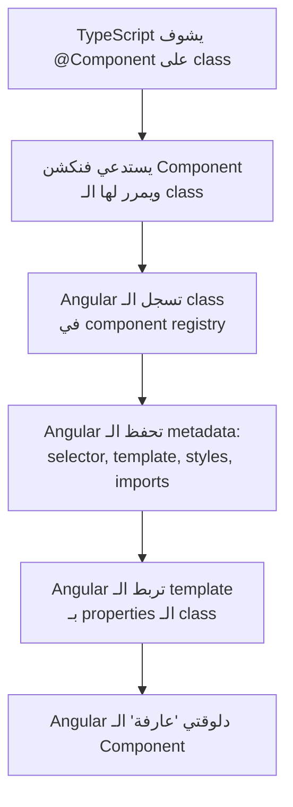

# الفصل الأول — TypeScript: السلاح السري بتاع Angular

> **ملاحظة:** كل عنوان فرعي في الملف ده مكتوب كـ Obsidian internal link عشان الـ graph يربط الدنيا ببعضها.

---

## لماذا وُجد TypeScript أصلاً؟

تخيل معايا إن في شركة كبيرة، فيه مهندس اسمه **Anders Hejlsberg** — نفس الراجل اللي عمل C#. في 2012، كان شغال في Microsoft وشايف حاجة بتحصل في الدنيا بتخوفه: الـ JavaScript بدأت تتحول من "لغة بتعمل بيها buttons" لـ "لغة بتبني بيها تطبيقات بـ 100,000 سطر."

المشكلة؟ الـ JavaScript مكنتش متصممة لكده خالص.

فيه حكاية مشهورة: الـ JavaScript اتعملت في **10 أيام** سنة 1995 على إيد Brendan Eich. الهدف كان بسيط — تضيف animations وتعمل form validation. مش إنك تبني بيها Angular app بـ 50 ألف سطر وفيها 30 developer شغالين في نفس الوقت.

المشكلة الكبيرة إن JavaScript **مفيهاش types**. يعني إيه ده بالظبط؟

```javascript
// JavaScript — بيعمل حاجة غلط بصمت تام
function calculateTotal(price, quantity) {
  return price * quantity;
}

// اتصورت إنك بتحسب 10 × 5 = 50
calculateTotal("10", 5);
// النتيجة: "1010101010" ← string repetition مش multiplication!
// JavaScript ما قالكش أي error. الـ bug راح production وأنت مش عارف.
```

اللي حصل ده مش نادر — ده بيحصل كل يوم في مشاريع كبيرة. **Anders** شاف المشكلة دي وقرر يحلها بدون ما يعمل لغة جديدة من الصفر. الحل كان **TypeScript**: JavaScript + نظام types فوقيها.

```typescript
// TypeScript — يمسك الـ bug قبل ما تشغل الكود
function calculateTotal(price: number, quantity: number): number {
  return price * quantity;
}

calculateTotal("10", 5);
// ❌ TypeScript Error — في محررك مباشرةً، قبل أي تشغيل:
// Argument of type 'string' is not assignable to parameter of type 'number'
```

**Angular** اتكتب بـ TypeScript من أول يوم. مش خيار — ضرورة. مشروعك كله بالكامل TypeScript. فهمه مش optional.

---

## [[Types and Type Annotations]] — العقد مع المتغيرات

الـ **type annotation** هو نظام عقود بسيط: بتقول للـ TypeScript "المتغير ده هيتعامل بس مع النوع ده."

```typescript
// Basic annotations
let name: string    = "Mohamed";
let age: number     = 25;
let isLoggedIn: boolean = false;
let scores: number[]   = [90, 85, 78];  // array of numbers
let tags: string[]     = ["angular", "ts"]; // array of strings
```

**الجزء الذكي — Type Inference:** TypeScript بيحفظ نوع المتغير حتى لو ماكتبتش الـ annotation:

```typescript
let name = "Mohamed"; // TypeScript فاهم: هذا string
let age  = 25;        // TypeScript فاهم: هذا number

name = 42;
// ❌ Error: Type 'number' is not assignable to type 'string'
// هو "تذكر" إن name هي string حتى من غير ما تقوله
```

**الـ `any` — باب الهروب الملعون:**

```typescript
let data: any = "hello";
data = 42;          // تمام
data = { x: 1 };   // تمام
data.doesntExist;   // تمام — TypeScript صمّ عيّ
// الـ any بيلغي كل فائدة TypeScript. استخدامه = خسارة
```

**الـ `void` — للفنكشنات اللي بتعمل بس مش بتدي:**

```typescript
function logout(): void {
  localStorage.removeItem('token');
  // بتعمل حاجة وبس — مش بتـreturn قيمة
}
```

**الـ `null` في حياتك اليومية كـ Angular developer:**

```typescript
let token: string | null = null; // ممكن string أو null
token = "eyJhbGci..."; // valid
token = null;          // valid
token = 42;            // ❌ Error: لا هو string ولا null
```

---

## [[Interfaces]] — "بلوبرينت" الداتا بتاعتك

الـ **Interface** هي وصف لشكل object: لازم يبقى فيه الحقول دي بالأنواع دي، وبس.

تخيلها زي فورمة حكومية: لازم تملي الخانة دي والخانة دي — غيرها مش مقبول.

```typescript
// تعريف الـ blueprint
interface Book {
  _id: string;
  title: string;
  price: number;
  inStock: boolean;
}

// استخدام الـ blueprint
const book: Book = {
  _id: "abc123",
  title: "Clean Code",
  price: 29.99,
  inStock: true,
};

// TypeScript بيتحكم بيها
book.tittle;  // ❌ Error: 'tittle' مش موجود — قصدك 'title'؟
              // حتى الـ typos بيمسكها!

const incomplete: Book = {
  _id: "123",
  title: "Some Book",
  // ❌ Error: حقل 'price' ناقص
  // ❌ Error: حقل 'inStock' ناقص
};
```

**Interface vs Class — فرق جوهري:**

| | Interface | Class |
|---|---|---|
| موجودة في runtime؟ | ❌ بتختفي بعد الـ compile | ✅ موجودة في JavaScript |
| بتنفذ logic؟ | ❌ بس وصف | ✅ فيها methods حقيقية |
| الهدف | Type checking فقط | Type + behavior |

```typescript
interface User {
  email: string;
}
// بعد compile → اختفت تماماً من JavaScript

class UserService {
  login() { /* ... */ }
}
// بعد compile → موجودة كـ JavaScript class حقيقي
```

**Extending Interfaces — وراثة الشكل:**

```typescript
interface BaseEntity {
  _id: string;
  createdAt: string;
}

interface User extends BaseEntity {
  email: string;
  firstName: string;
  // User كمان بياخد _id و createdAt من BaseEntity
}
// User الآن محتاج: _id, createdAt, email, firstName
```

---

## [[Union Types and Literal Types]] — المرونة المضبوطة

**Union type** — المتغير ممكن يبقى نوع من الأنواع دي:

```typescript
let token: string | null = null;

let id: number | string = 42;
id = "abc123"; // valid كمان
```

**Literal types** — أقوى من Union: بتحدد القيم المسموح بيها بالظبط:

```typescript
// role مش أي string — لازم تبقى "user" أو "admin" بالظبط
type Role = 'user' | 'admin';

let userRole: Role = 'user';      // ✅
userRole = 'admin';               // ✅
userRole = 'moderator';           // ❌ Error: مش في القائمة

// في interfaces:
interface User {
  role: 'user' | 'admin';
}

// TypeScript بيمسك حتى الـ comparisons المستحيلة:
if (user.role === 'superadmin') {
  // ❌ TypeScript Warning: هذا الشرط مستحيل يبقى true
}
```

---

## [[Optional Chaining]] — التعامل الآمن مع الغياب

**Optional field (`?`)** — حقل ممكن يغيب ومفيش مشكلة:

```typescript
interface Review {
  _id: string;
  rating: number;
  comment?: string; // الـ ? = ممكن يكون undefined — مش إجباري
}

// كلاهما valid:
const withComment: Review    = { _id: "1", rating: 5, comment: "Great!" };
const withoutComment: Review = { _id: "2", rating: 4 }; // comment غايب — ok
```

**Optional chaining (`?.`)** — التصفح الآمن في الـ null:

تخيل إنك شايل خارطة طريق، وبتحاول توصل لـ "القاهرة > مصر الجديدة > حي X" — لو أي محطة في الطريق مش موجودة، مش بيوقع crash، بيرجع `undefined` بهدوء.

```typescript
const user = auth.getCurrentUser(); // ممكن ترجع null

// بدون optional chaining — crash لو user هي null:
console.log(user.firstName);  // ❌ TypeError: Cannot read properties of null

// بـ optional chaining — بيرجع undefined بأمان:
console.log(user?.firstName); // undefined — مش crash

// Chaining على مستويات:
console.log(user?.address?.city);
// لو user = null → undefined
// لو user موجود بس address = null → undefined
// لو كل حاجة موجودة → قيمة city الحقيقية
```

**في Angular forms اللي شغالها كل يوم:**

```typescript
// في الـ template:
@if (loginForm.get('email')?.touched && loginForm.get('email')?.invalid)
//                           ^
// .get() بترجع null لو الـ control مش موجود — ?.  تحمينا من crash
```

---

## [[Non-Null Assertion Operator]] — "ثق بيّ يا TypeScript"

أحياناً أنت عارف إن القيمة مش null، بس TypeScript مش شايف ده. الـ `!` بيقول له "سيبها عليا":

```typescript
// TypeScript شايف: loginForm.value.email هي string | null | undefined
// أنت عارف: الـ form valid قبل السطر ده يتنفذ، يعني email موجودة

const email = this.loginForm.value.email!;
//                                      ^
// الـ ! بيقول: "ثق إن القيمة دي مش null"
// TypeScript بيتعامل مع email كـ string — مش string | null | undefined
```

**⚠️ تحذير:** استخدم الـ `!` بس لما تكون متأكد 100%. لو غلطت، بتاخد runtime crash من غير أي warning من TypeScript.

---

## [[Generics]] — "القالب المرن"

الـ **Generic** زي عفريت بيتشكل — تقوله "اتشكل string" يبقى string، تقوله "اتشكل number" يبقى number، بس في الحالتين هو نفس الكود.

**المشكلة من غير Generics:**

```typescript
function getFirstString(arr: string[]): string { return arr[0]; }
function getFirstNumber(arr: number[]): number  { return arr[0]; }
// نفس الكود، مكرر، بس لأنواع مختلفة — مش منطقي
```

**الحل بـ Generics:**

```typescript
function getFirst<T>(arr: T[]): T {
  return arr[0];
}
// T = placeholder — بيتبدل بالنوع الحقيقي وقت الاستخدام

getFirst<string>(['a', 'b', 'c']); // T = string → returns string
getFirst<number>([1, 2, 3]);       // T = number → returns number
getFirst(['a', 'b', 'c']);         // TypeScript بيحدس T = string أوتوماتيك
```

**في مشروعك بالظبط — الـ ApiResponse:**

```typescript
interface ApiResponse<T> {
  success: boolean;
  message: string;
  data: T; // بيتبدل بأي نوع تحدده
}

// استخدام:
const userRes: ApiResponse<User>     = { success: true, message: "ok", data: user };
const booksRes: ApiResponse<Book[]>  = { success: true, message: "ok", data: books };
```

**ليه ده قوي؟** Interface واحدة بدل ما تكتب `UserApiResponse`, `BookApiResponse`, `OrderApiResponse` — كلهم متطابقين بس بنوع `data` مختلف.

---

## [[Type Aliases]] — أسماء جديدة لأشكال قديمة

الـ `type` بيعمل اسم بديل لأي نوع:

```typescript
// Union type بإسم
type ID = string | number;

// Object type (شبه interface)
type Point = { x: number; y: number };

// Function type
type LoginFn = (email: string, password: string) => Observable<any>;
```

| | `interface` | `type` |
|---|---|---|
| Object shapes | ✅ مناسب | ✅ مناسب |
| Union types | ❌ | ✅ فقط بـ type |
| Function types | ❌ | ✅ مناسب |
| Extending | ✅ `extends` | ⚠️ ممكن بس أصعب |

**القاعدة البسيطة:** استخدم `interface` لـ object shapes، `type` لـ unions والـ function signatures.

---

## [[Decorators]] — "الطوابع السحرية" بتاعة Angular

**ده أهم section في الـ TypeScript chapter كله.** Angular مبنية على decorators. لو ماعرفتش إيه هو الـ decorator، Angular هتفضل magic مش بتفهمها.

### الـ Decorator هو فنكشن بيلف على حاجة تانية ويضيف سلوك ليها.

تخيله زي الـ "طابع" بتاخده في الجواب الحكومي — الطابع مش هو محتوى الجواب، بس بيقول "الجواب ده رسمي ومسجل."

```typescript
// decorator بسيط للتوضيح:
function Log(target: any, key: string, descriptor: PropertyDescriptor) {
  const original = descriptor.value;
  descriptor.value = function (...args: any[]) {
    console.log(`Calling ${key} with`, args);
    return original.apply(this, args);
  };
  return descriptor;
}

class Calculator {
  @Log
  add(a: number, b: number) { return a + b; }
}

new Calculator().add(2, 3);
// Console: "Calling add with [2, 3]"
// Returns: 5
// الـ @Log أضاف الـ logging من غير ما تغير في جوه الـ method
```

### الـ Decorators بتاعة Angular:

```typescript
@Component({...})    // يحول class عادي → Component Angular يعرفه ويديره
@Injectable({...})   // يحول class عادي → Service Angular يعمله instance
@Input()             // يحول property → بياخد قيمة من الـ parent
@Output()            // يحول property → يبعث events للـ parent
@ViewChild()         // يحول property → reference لـ element في الـ template
@HostListener()      // يحول method → DOM event listener
```

### ما الذي يفعله `@Component` فعلياً؟

لما TypeScript يشوف `@Component({...})` على class، بيحصل التالي:



بدون الـ `@Component`، Angular ماتعرفش إن الـ class ده component خالص. بتعامله كـ plain TypeScript class عادي.

---

## [[Access Modifiers]] — "من يحق له الوصول؟"

TypeScript بيديك تحكم كامل في مين يقدر يوصل لإيه في الـ class:

```typescript
class AuthService {
  public apiUrl  = 'http://localhost:5000'; // الكل يقرأ ويكتب
  private token  = 'secret';               // AuthService بس — حتى الـ component اللي بيستخدمها لا
  protected base = '/api';                 // AuthService والـ subclasses بتاعتها
  readonly KEY   = 'jwt_token';            // الكل يقرأ — مفيش حد يكتب
}

const service = new AuthService();
service.apiUrl;       // ✅
service.token;        // ❌ Error: 'token' is private
service.KEY;          // ✅ (reading)
service.KEY = 'x';    // ❌ Error: read-only
```

**في Angular — العرف المتبع:**
- `private` للـ internal state اللي الـ components متفترضش تلمسه مباشرةً
- `public` (أو من غير modifier — بيبقى public تلقائي) للـ methods اللي الـ components بتستدعيها
- `readonly` للـ constants

**الـ `!` في class properties:**

```typescript
class Navbar {
  private authSub!: Subscription;
  //              ^
  // "Definite Assignment Assertion"
  // بتقول لـ TypeScript: "أنا عارف إني هـassign القيمة دي قبل ما استخدمها"
  // بنستخدمها لما الـ assignment بتحصل في ngOnInit مش في الـ constructor
  // من غير !، TypeScript يشتكي: "Property 'authSub' has no initializer"
}
```

---

## 🗺️ خريطة TypeScript كاملة

```mermaid
mindmap
  root((TypeScript))
    Types
      string / number / boolean
      arrays : T[]
      null / undefined / void
      any (avoid!)
    Interfaces
      object blueprint
      extends (inheritance)
      compile-time only
    Advanced Types
      Union : A or B
      Literal : exact values
      Generics : placeholder T
      Type Alias
    OOP Features
      Access Modifiers
        public / private / protected
        readonly
      Decorators
        @Component
        @Injectable
        @Input / @Output
    Safety Operators
      Optional ? : maybe undefined
      Optional chaining ?.
      Non-null assertion !
```

---

## ✅ Checkpoint — أسئلة إنترفيو TypeScript

**س: إيه الفرق بين `interface` و `type`؟**

> `interface` لـ object shapes وبتقدر تـextend منها بسهولة. `type` لـ unions، function types، وأي نوع تاني. للـ object shapes المجردة — كلاهما works، لكن convention في Angular هو `interface`.

**س: إيه معنى `generic` وليه بنستخدمه؟**

> الـ generic هو placeholder للنوع — بيخليك تكتب كود مرة واحدة يشتغل مع أنواع مختلفة بدون ما تكرر نفسك. مثال: `ApiResponse<T>` بدل `UserApiResponse`, `BookApiResponse`, إلخ.

**س: إيه الفرق بين `?.` و `!`؟**

> `?.` (optional chaining) = "لو القيمة موجودة كمل، لو لا ارجع `undefined` بهدوء." `!` (non-null assertion) = "أنا أكيد إنها مش null، ثق بيا." الأولى defensive الثانية assertive.

**س: إيه اللي بيحصل فعلياً لما بنكتب `@Component({...})`؟**

> الـ `@Component` هو decorator — فنكشن بيتنفذ على الـ class وبيسجله في Angular's component registry مع كل الـ metadata بتاعته (selector, template, imports). من غيره، Angular مش هتعرف إن الـ class ده component.

---

## 🫒 زتونة الإنترفيو

> **"TypeScript is JavaScript with a contract system. Instead of discovering type bugs at runtime in production, you catch them at compile-time in your editor. Angular uses it because the framework's entire DI system, decorators, and template binding depend on type information to work correctly."**

---

*Next → [[02-Angular-Architecture]] — إزاي Angular تقرأ كودك وتشغله من أول سطر في main.ts*
