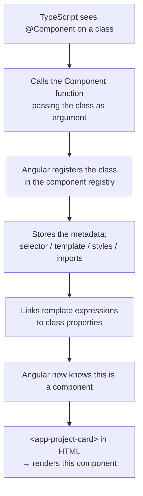

# الفصل الأول — TypeScript: السلاح السري بتاع Angular

> **ملاحظة للـ Obsidian:** كل عنوان فرعي مكتوب كـ internal link عشان الـ graph يربط الدنيا. العنوانين دول هم محطات رحلة واحدة متصلة — مش مواضيع منفصلة.

---

## البداية — ليه وُجد TypeScript أصلاً؟

تخيل معايا إن في شركة كبيرة، فيه مهندس اسمه **Anders Hejlsberg** — نفس الراجل اللي عمل C#. في 2012، كان شغال في Microsoft وشايف حاجة بتحصل في الدنيا بتخوفه: الـ JavaScript بدأت تتحول من "لغة بتعمل بيها buttons" لـ "لغة بتبني بيها تطبيقات بـ 100,000 سطر."

المشكلة؟ الـ JavaScript مكنتش متصممة لكده خالص.

فيه حكاية مشهورة: الـ JavaScript اتعملت في **10 أيام** سنة 1995 على إيد Brendan Eich. الهدف كان بسيط — تضيف animations وتعمل form validation. مش إنك تبني بيها Angular app بـ 50 ألف سطر وفيها 30 developer شغالين في نفس الوقت.

المشكلة الكبيرة إن JavaScript **مفيهاش types**:

```javascript
// JavaScript — fails silently in production
function calculateTotal(price, quantity) {
  return price * quantity;
}

// You expected 10 × 5 = 50
calculateTotal("10", 5);
// Returns: "1010101010" — string repetition, not multiplication!
// No error. No warning. Bug ships to production.
```

**TypeScript** هو JavaScript + نظام contracts فوقيها. بتكتب types، وTypeScript بيتحقق منها وقت الكتابة — مش وقت التشغيل.

```typescript
// TypeScript — catches the bug in your editor, before any execution
function calculateTotal(price: number, quantity: number): number {
  return price * quantity;
}

calculateTotal("10", 5);
// ❌ TypeScript Error (in your editor, instantly):
// Argument of type 'string' is not assignable to parameter of type 'number'
```

**Angular اتكتبت بـ TypeScript من أول يوم.** مش خيار — ضرورة. مشروعك **FreelanceFlow** كله TypeScript. فهمه مش optional.

> طيب، الـ types ديه — إيه أبسط شكل ليها في الكود الفعلي؟

---

## [[01-Types-and-Annotations]] — العقد مع المتغيرات

الـ **type annotation** هو إعلان نية: "المتغير ده هيتعامل بس مع النوع ده — لو حاولت تحط فيه غيره، أعلمني فوراً."

```typescript
// Basic type declarations
let name: string    = "Mohamed";
let age: number     = 25;
let isLoggedIn: boolean = false;
let scores: number[]    = [90, 85, 78];
let tags: string[]      = ["angular", "typescript"];
```

**الجزء الذكي — Type Inference:** TypeScript بيحفظ النوع حتى لو ماكتبتش الـ annotation:

```typescript
let name = "Mohamed"; // TypeScript infers: string
let age  = 25;        // TypeScript infers: number

name = 42;
// ❌ Error: Type 'number' is not assignable to type 'string'
// It "remembers" that name is a string, even without explicit annotation
```

**الـ `any` — باب الهروب الملعون:**

```typescript
let data: any = "hello";
data = 42;          // fine
data = { x: 1 };   // fine
data.doesntExist;   // fine — TypeScript goes silent on anything typed as 'any'
// Using 'any' defeats the entire purpose of TypeScript
```

**الـ `void` — للفنكشنات اللي بتعمل بس مش بتدي:**

```typescript
function logout(): void {
  localStorage.removeItem('token');
  // performs an action, returns nothing
}
```

**الـ `null` في حياتك اليومية:**

```typescript
let token: string | null = null; // can be a string OR null — nothing else
token = "eyJhbGci..."; // valid
token = null;          // valid
token = 42;            // ❌ Error: neither string nor null
```

> تمام. عرفنا نوع المتغير البسيط. بس إيه اللي بيحصل لما المتغير ده مش رقم أو string — لما هو **object** فيه حقول؟ زي project من الـ API بتاع FreelanceFlow؟

---

## [[02-Interfaces]] — "بلوبرينت" الداتا بتاعتك

في FreelanceFlow، الـ API بيرجع لك objects. Project له title وbudget وstatus. Proposal لها freelancer وprice وmessage. إزاي تقول لـ TypeScript "الـ project ده شكله كده بالظبط"؟

الإجابة: **Interface**.

تخيلها زي فورمة حكومية: لازم تملي الخانة دي والخانة دي — غيرها مش مقبول.

```typescript
// Define the exact shape of a Project from our API
interface Project {
  _id: string;
  title: string;
  description: string;
  budget: number;
  status: 'open' | 'in-progress' | 'completed';
  clientId: string;
}

// Use the shape
const project: Project = {
  _id: "abc123",
  title: "Build E-commerce Site",
  description: "Full stack project with Angular",
  budget: 5000,
  status: 'open',
  clientId: "user_xyz",
};

// TypeScript now enforces the shape
project.tittle;  // ❌ Error: 'tittle' does not exist — did you mean 'title'?

const incomplete: Project = {
  _id: "123",
  title: "Some Project",
  // ❌ Error: Property 'description' is missing
  // ❌ Error: Property 'budget' is missing
  // ❌ Error: Property 'status' is missing
  // ❌ Error: Property 'clientId' is missing
};
```

**Interface vs Class — فرق جوهري:**

| | Interface | Class |
|---|---|---|
| موجودة في runtime؟ | ❌ بتختفي بعد الـ compile | ✅ موجودة في JavaScript |
| بتنفذ logic؟ | ❌ بس وصف | ✅ فيها methods حقيقية |
| الهدف | Type checking فقط | Type + behavior |

```typescript
interface User {
  email: string;
}
// After TypeScript compiles → completely disappears from JavaScript output

class UserService {
  login() { /* real code */ }
}
// After TypeScript compiles → exists as real JavaScript code
```

**Extending Interfaces — وراثة الشكل:**

```typescript
// Every entity in our API has these fields
interface BaseEntity {
  _id: string;
  createdAt: string;
  updatedAt: string;
}

// Project inherits all BaseEntity fields
interface Project extends BaseEntity {
  title: string;
  budget: number;
  status: 'open' | 'in-progress' | 'completed';
}
// A Project now requires: _id, createdAt, updatedAt, title, budget, status
```

> كويس — عرفنا نوصف شكل الـ object. بس إيه اللي بيحصل لما حقل في الـ object ممكن يكون قيمتين مختلفتين؟ زي الـ `status` اللي ممكن يكون `'open'` أو `'in-progress'` أو `'completed'`؟

---

## [[03-Union-and-Literal-Types]] — المرونة المضبوطة

في FreelanceFlow، الـ proposal عندها `status` ممكن يكون `'pending'`, `'accepted'`, أو `'rejected'`. لو كتبت `status: string` — TypeScript هيقبل `'banana'` وده bug. الحل؟

**Union type** — المتغير ممكن يكون نوع من الأنواع دي:

```typescript
let token: string | null = null;

let id: number | string = 42;
id = "abc123"; // also valid
```

**Literal types** — أقوى: بتحدد القيم المسموح بيها بالظبط:

```typescript
// Status can ONLY be one of these three strings — nothing else
type ProposalStatus = 'pending' | 'accepted' | 'rejected';

interface Proposal {
  _id: string;
  projectId: string;
  freelancerId: string;
  price: number;
  status: ProposalStatus;
}

let p: Proposal = { /* ... */ status: 'pending' };  // ✅
p.status = 'accepted';                               // ✅
p.status = 'banana';                                 // ❌ Error: not in the union
p.status = 'Pending';                                // ❌ Error: case-sensitive

// TypeScript even catches impossible comparisons:
if (p.status === 'cancelled') {
  // ❌ Warning: This condition is always false
  // 'cancelled' is not a valid ProposalStatus
}
```

> ممتاز. الـ interface بتاعة الـ Proposal دلوقتي type-safe. بس إيه اللي يحصل لما حقل مش موجود دايماً؟ مثلاً الـ Proposal ممكن يبقى ليها cover letter أو لأ؟

---

## [[04-Optional-Chaining]] — التعامل الآمن مع الغياب

**Optional field (`?`)** — حقل ممكن يغيب ومفيش مشكلة:

```typescript
interface Proposal {
  _id: string;
  price: number;
  coverLetter?: string; // the ? means: might be undefined — not required
}

// Both are valid:
const withLetter: Proposal    = { _id: "1", price: 500, coverLetter: "I'm perfect for this!" };
const withoutLetter: Proposal = { _id: "2", price: 300 }; // no coverLetter — that's fine
```

**Optional chaining (`?.`)** — التصفح الآمن في الـ null:

تخيل إنك شايل خريطة طريق وبتحاول توصل لـ "القاهرة > مصر الجديدة > حي X" — لو أي محطة في الطريق مش موجودة، مش بيوقع crash، بيرجع `undefined` بهدوء.

```typescript
const user = auth.getCurrentUser(); // might return null

// Without optional chaining — crashes if user is null:
console.log(user.firstName);  // ❌ TypeError: Cannot read properties of null

// With optional chaining — returns undefined safely:
console.log(user?.firstName); // undefined — no crash

// Chaining multiple levels:
console.log(user?.profile?.avatarUrl);
// if user = null    → undefined
// if profile = null → undefined
// if both exist     → the actual avatarUrl value
```

**في Angular forms بتاعتك كل يوم:**

```typescript
// In the template:
@if (loginForm.get('email')?.touched && loginForm.get('email')?.invalid)
//                           ^
// .get() returns null if the control doesn't exist — ?. prevents crash
```

> تمام — عرفنا نتعامل مع الـ null بأمان. بس أحياناً أنت عارف إن القيمة مش null، وTypeScript مش مصدّقك. ازاي تقوله "ثق بيّ"؟

---

## [[05-Non-Null-Assertion]] — "ثق بيّ يا TypeScript"

أحياناً أنت عارف إن القيمة مش null، بس TypeScript مش شايف ده. الـ `!` بيقول له "سيبها عليا":

```typescript
// TypeScript sees: loginForm.value.email is string | null | undefined
// You know: the form is valid before this line runs — email exists

const email = this.loginForm.value.email!;
//                                      ^
// The ! removes null/undefined from the type
// TypeScript now treats email as: string (not string | null | undefined)
```

**⚠️ تحذير:** استخدم الـ `!` بس لما تكون متأكد 100%. لو غلطت، بتاخد runtime crash من غير أي warning:

```typescript
const element = document.getElementById('myId')!;
// Fine IF you are certain the element exists in the DOM
// If it doesn't exist — runtime crash. TypeScript won't warn you.
```

> عرفنا نتعامل مع الأنواع البسيطة والـ null. بس إيه اللي بيحصل لما بتكتب function بتشتغل مع أنواع مختلفة — مش نوع واحد؟ زي function بترجع أول عنصر، بس مرة من array of Projects ومرة من array of Proposals؟

---

## [[06-Generics]] — "القالب المرن"

في FreelanceFlow، الـ API بترجع response بنفس الشكل دايماً:

```json
{ "success": true, "message": "ok", "data": { ... } }
```

الـ `data` ممكن يكون `User`، أو `Project[]`، أو `Proposal`. لو كتبت interface منفصلة لكل واحدة — بتكرر نفسك. الحل؟ **Generics**.

الـ Generic زي عفريت بيتشكل — تقوله "اتشكل `User`" يبقى User، تقوله "اتشكل `Project[]`" يبقى Project array، بس في الحالتين نفس الكود الواحد.

```typescript
// Without generics — repetition:
function getFirstString(arr: string[]): string { return arr[0]; }
function getFirstNumber(arr: number[]): number  { return arr[0]; }
// Same logic, duplicated just for different types

// With generics — write once, works for all types:
function getFirst<T>(arr: T[]): T {
  return arr[0];
}
// T is a placeholder — TypeScript replaces it with the actual type at call time

getFirst<string>(['a', 'b', 'c']); // T = string → returns string
getFirst<number>([1, 2, 3]);       // T = number → returns number
getFirst(['a', 'b', 'c']);         // TypeScript infers T = string automatically
```

**في FreelanceFlow بالظبط — الـ ApiResponse:**

```typescript
// One interface for ALL API responses — T is whatever 'data' contains
interface ApiResponse<T> {
  success: boolean;
  message: string;
  data: T;
}

// TypeScript knows the exact shape of 'data' in each case:
const userRes: ApiResponse<User>          = { success: true, message: "ok", data: user };
const projectsRes: ApiResponse<Project[]> = { success: true, message: "ok", data: projects };
const proposalRes: ApiResponse<Proposal>  = { success: true, message: "ok", data: proposal };
```

**ليه ده قوي؟** Interface واحدة بدل `UserApiResponse`, `ProjectApiResponse`, `ProposalApiResponse` — كلهم متطابقين ما عدا نوع `data`.

> عارفين Generics. بس في الكود بتاعنا بنشوف أحياناً `type Role = 'user' | 'admin'` — ده مش interface. إيه الفرق؟

---

## [[07-Type-Aliases]] — أسماء جديدة لأشكال قديمة

الـ `type` بيعمل اسم بديل لأي نوع — بسيط أو معقد:

```typescript
// Alias for a union type — used across the whole app
type UserRole = 'client' | 'freelancer' | 'admin';

// Alias for a function signature
type ApiCall<T> = (id: string) => Observable<ApiResponse<T>>;

// Alias for an object shape (similar to interface)
type Coordinates = { lat: number; lng: number };
```

| | `interface` | `type` |
|---|---|---|
| Object shapes | ✅ مناسب | ✅ مناسب |
| Union types | ❌ | ✅ فقط |
| Function signatures | ❌ | ✅ |
| Extending | ✅ `extends` | ⚠️ أصعب |

**القاعدة:** استخدم `interface` لـ object shapes، `type` لـ unions والـ function signatures.

> تمام. عارفين كل أنواع TypeScript. دلوقتي السؤال المهم: Angular نفسها إزاي بتعرف إن الـ class ده component؟ وإن ده service؟ الإجابة في أغرب — وأقوى — حاجة في TypeScript.

---

## [[08-Decorators]] — "الطوابع السحرية" بتاعة Angular

**ده أهم section في الـ chapter كله.** Angular مبنية على decorators. لو ماعرفتش إيه هو الـ decorator، Angular هتفضل magic مش بتفهمها.

### الـ Decorator هو فنكشن بيلف على class أو property ويضيف سلوك ليها.

تخيله زي الـ "طابع" بتاخده في الجواب الرسمي — الطابع مش هو محتوى الجواب، بس بيقول "الجواب ده رسمي ومسجل."

```typescript
// A decorator is just a function that receives what it decorates
function Log(target: any, key: string, descriptor: PropertyDescriptor) {
  const original = descriptor.value;
  descriptor.value = function (...args: any[]) {
    console.log(`Calling ${key} with`, args);
    return original.apply(this, args);
  };
  return descriptor;
}

class Calculator {
  @Log // wraps the add method — every call gets logged automatically
  add(a: number, b: number) { return a + b; }
}

new Calculator().add(2, 3);
// Console: "Calling add with [2, 3]"
// Returns: 5
// @Log added behavior without modifying the method's internal code
```

### الـ Decorators بتاعة Angular:

```typescript
@Component({...})    // transforms a plain class → Angular knows it's a component
@Injectable({...})   // transforms a plain class → Angular manages it as a service
@Input()             // transforms a property → accepts values from parent component
@Output()            // transforms a property → emits events to parent component
@ViewChild()         // transforms a property → holds a reference to a child element
@HostListener()      // transforms a method → DOM event listener
```

### ما الذي يفعله `@Component` فعلياً؟



بدون الـ `@Component`، Angular ماتعرفش إن الـ class ده component خالص. بتعامله كـ plain TypeScript class.

> آخر حاجة — Angular بتمسك كل الـ services وبتوزعها على الـ components. عشان تعمل ده لازم يعرف "من يقدر يوصل لإيه." ده اللي بيحدده الـ Access Modifiers.

---

## [[09-Access-Modifiers]] — "من يحق له الوصول؟"

TypeScript بيديك تحكم كامل في مين يقدر يوصل لإيه في الـ class:

```typescript
class AuthService {
  public apiUrl  = 'http://localhost:5000'; // anyone can read and write
  private token  = 'secret';               // ONLY AuthService — not even the component using it
  protected base = '/api';                 // AuthService and its subclasses
  readonly KEY   = 'jwt_token';            // anyone can read — nobody can write after init
}

const service = new AuthService();
service.apiUrl;       // ✅
service.token;        // ❌ Error: 'token' is private
service.KEY;          // ✅ reading is fine
service.KEY = 'x';    // ❌ Error: read-only
```

**في Angular — العرف المتبع:**
- `private` للـ internal state اللي الـ components متفترضش تلمسه مباشرةً
- `public` أو من غير modifier (بيبقى public تلقائياً) للـ methods اللي الـ components بتستدعيها
- `readonly` للـ constants اللي بتتحدد مرة واحدة

**الـ `!` في class properties:**

```typescript
class ProjectsPage {
  private projectsSub!: Subscription;
  //                  ^
  // "Definite Assignment Assertion"
  // Tells TypeScript: "I promise this will be assigned before it's used"
  // Used when assignment happens in ngOnInit, not the constructor
  // Without !, TypeScript complains: "Property 'projectsSub' has no initializer"
}
```

---

## 🗺️ خريطة TypeScript كاملة

```mermaid
mindmap
  root((TypeScript))
    Types
      string / number / boolean
      arrays T[]
      null / undefined / void
      any<br/>avoid!
    Interfaces
      object blueprint
      extends inheritance
      compile-time only
    Advanced Types
      Union A or B
      Literal exact values
      Generics placeholder T
      Type Alias
    OOP Features
      Access Modifiers
        public / private / protected
        readonly
      Decorators
        @Component
        @Injectable
        @Input @Output
    Safety Operators
      Optional ? maybe undefined
      Optional chaining ?.
      Non-null assertion !
```

---

## ✅ Checkpoint — أسئلة إنترفيو TypeScript

**س: إيه الفرق بين `interface` و `type`؟**
> `interface` لـ object shapes، قابلة لـ `extends`، وبتختفي بعد الـ compile. `type` لـ unions وfunction signatures وأي نوع تاني. للـ object shapes المجردة — كلاهما يشتغل، لكن convention في Angular هو `interface`.

**س: إيه معنى `generic` وليه بنستخدمه؟**
> الـ generic هو placeholder للنوع — بيخليك تكتب كود مرة واحدة يشتغل مع أنواع مختلفة. مثال: `ApiResponse<T>` بدل `ProjectApiResponse`, `ProposalApiResponse`, `UserApiResponse` — كلهم متطابقين ما عدا `data`.

**س: إيه الفرق بين `?.` و `!`؟**
> `?.` (optional chaining) = "لو القيمة موجودة كمّل، لو لا ارجع `undefined` بهدوء." `!` (non-null assertion) = "أنا أكيد إنها مش null، ثق بيا." الأولى defensive، التانية assertive.

**س: إيه اللي بيحصل فعلياً لما بنكتب `@Component({...})`؟**
> الـ `@Component` هو decorator — فنكشن بيتنفذ على الـ class وبيسجله في Angular's component registry مع الـ metadata بتاعته (selector, template, imports). من غيره، Angular ماتعرفش إن الـ class ده component خالص.

---

## 🛠️ Practical Exercise — FreelanceFlow Types Foundation

قبل ما نبدأ نبني أي component، لازم نبني **الـ types** بتاعة المشروع. ده الأساس اللي هيبنى عليه كل حاجة جاية.

### المطلوب

اعمل ملف `src/app/models/index.ts` وحط فيه الـ interfaces دول، level by level:

---

**Level 1 — BaseEntity:**

```typescript
// Every document in our MongoDB database has these fields
interface BaseEntity {
  _id: string;
  createdAt: string;
  updatedAt: string;
}
```

---

**Level 2 — User:**

```typescript
// Extend BaseEntity — User inherits _id, createdAt, updatedAt
interface User extends BaseEntity {
  email: string;
  firstName: string;
  lastName: string;
  role: 'client' | 'freelancer' | 'admin'; // literal union — no other string allowed
  profilePicture?: string;                  // optional — might not exist
  bio?: string;
}
```

---

**Level 3 — Project:**

```typescript
interface Project extends BaseEntity {
  title: string;
  description: string;
  budget: number;
  status: 'open' | 'in-progress' | 'completed' | 'cancelled';
  clientId: string;
  freelancerId?: string; // optional — only set after a proposal is accepted
  skills: string[];
}
```

---

**Level 4 — Proposal:**

```typescript
interface Proposal extends BaseEntity {
  projectId: string;
  freelancerId: string;
  price: number;
  deliveryDays: number;
  coverLetter?: string;
  status: 'pending' | 'accepted' | 'rejected';
}
```

---

**Level 5 — Generic ApiResponse:**

```typescript
// One interface for ALL API responses from our backend
interface ApiResponse<T> {
  success: boolean;
  message: string;
  data: T;
}

// For paginated list endpoints (GET /projects, GET /proposals, etc.)
interface PaginatedResponse<T> {
  success: boolean;
  message: string;
  data: {
    items: T[];
    total: number;
    page: number;
    limit: number;
  };
}
```

---

### التحدي الاختياري 🔥

اكتب الـ type signatures دول، وبعدين نفّذهم:

```typescript
// 1. A function that takes a Project and returns its Arabic status label
type GetStatusLabel = (project: Project) => string;

// 2. A function that filters proposals by their status
type FilterProposals = (
  proposals: Proposal[],
  status: Proposal['status']  // hint: 'pending' | 'accepted' | 'rejected'
) => Proposal[];

// Implement both:
const getStatusLabel: GetStatusLabel = (project) => {
  // hint: use a switch statement or an object map
  // expected: 'open' → 'مفتوح', 'in-progress' → 'جارٍ', etc.
};

const filterProposals: FilterProposals = (proposals, status) => {
  // one line using .filter()
};
```

---

### ✅ Expected Output

بعد ما تعمل الملف، تأكد إن ده بيـcompile من غير errors:

```typescript
// This should compile with NO errors:
const project: Project = {
  _id: "proj_001",
  title: "Build FreelanceFlow Frontend",
  description: "Angular 21 app with Tailwind",
  budget: 8000,
  status: 'open',
  clientId: "user_abc",
  skills: ["Angular", "TypeScript", "Tailwind"],
  createdAt: new Date().toISOString(),
  updatedAt: new Date().toISOString(),
};

// This SHOULD give you ❌ Error:
project.status = 'banana';       // not in the union
project.status = 'Open';         // case-sensitive — 'open' only

// This SHOULD also give you ❌ Error:
const res: ApiResponse<Project> = {
  success: true,
  data: project,
  // ❌ Error: Property 'message' is missing
};
```

---

## 🫒 زتونة الإنترفيو

> **"TypeScript is JavaScript with a contract system. Instead of discovering type bugs at runtime in production, you catch them at compile-time in your editor. Angular uses it because the framework's entire DI system, decorators, and template binding depend on type information to work correctly — without TypeScript, Angular cannot function."**

---

*Next → [[02-Angular-Architecture]] — الـ types بتاعنا جاهزة. دلوقتي إزاي Angular تقرأ كودك وتشغّله من أول سطر في `main.ts`؟*
