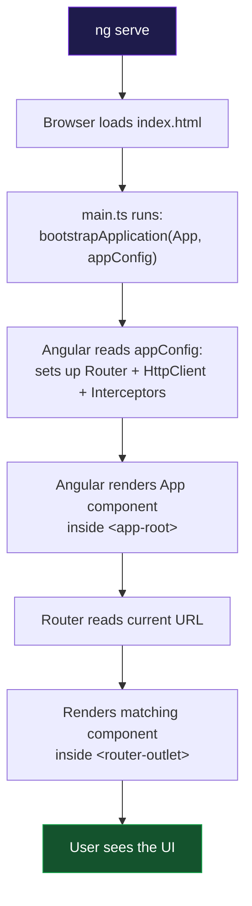
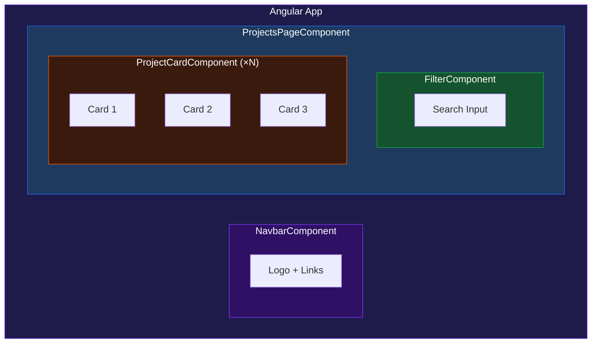
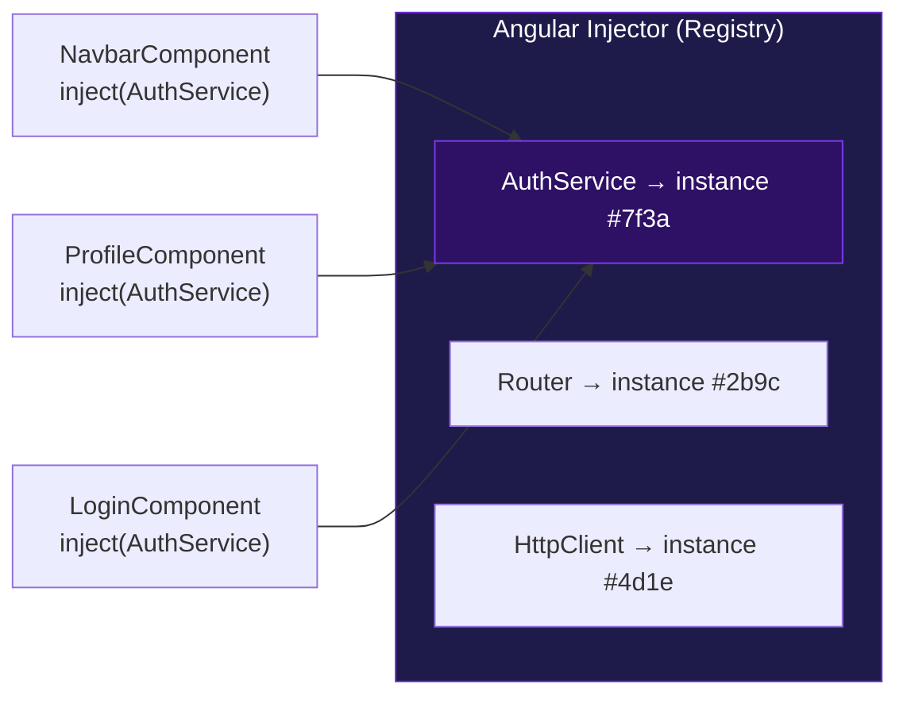
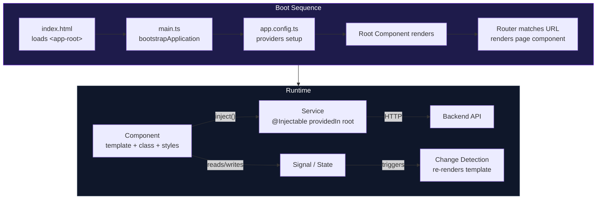

# الفصل الثاني — Angular: كيف تفكر وكيف تشتغل

> **المتطلبات:** [[01-TypeScript-For-Angular]] — لازم تبقى عارف الـ Decorators و Interfaces قبل ما تكمل.

---

## البداية — إيه اللي Angular بتعمله فعلاً؟

خليني أسألك سؤال: لو عندك Backend شغال — endpoints، JWT، data كلها موجودة — إيه اللي ناقص؟

الناقص هو **الواجهة**. المكان اللي Ali هيفتحه في الـ browser ويشوف فيه buttons وcards وforms. مش Postman. مش JSON raw.

Angular هو الإجابة على السؤال ده. هو **framework** — مش library. الفرق إيه؟

- **Library** = أنت اللي بتستدعيها لما تحتاجها (زي jQuery)
- **Framework** = هو اللي بيستدعي كودك، مش أنت. هو المدير، وأنت بتكتب له الـ pieces

Angular بيتكفل بـ:
- **Rendering** — بياخد HTML + TypeScript ويعمل منهم DOM حقيقي في الـ browser
- **Data Binding** — لما تغير متغير في الـ TypeScript، الـ template بيتحدث أوتوماتيك
- **Routing** — لما الـ URL يتغير، Angular يعرف يعرض الـ component المناسب
- **HTTP** — بيبعت requests للـ backend بطريقة منظمة
- **Dependency Injection** — بيخلق الـ services وبيوزعها على الـ components

بتكتب components، وAngular بيقرر امتى وإزاي يشغّلها.

> طيب — من أين يبدأ كل ده؟ أول سطر بيتنفذ في أي Angular app فين بالظبط؟

---

## [[01-Boot-Process]] — رحلة الـ app من أول `ng serve` لحد ما تشوف الـ UI

تخيل إنك شغّلت `ng serve` — إيه اللي بيحصل خلف الكواليس؟

**المحطة الأولى — `index.html`:**

```html
<!doctype html>
<html>
  <head>
    <title>My App</title>
  </head>
  <body>
    <app-root></app-root>
    <!-- this custom tag is where Angular will render everything -->
  </body>
</html>
```

الملف ده هو نقطة الدخول. فيه tag اسمه `<app-root>` — مش HTML عادي، ده **custom tag** تعرّفه Angular. الـ browser لوحده ما يعرفش يعمل بيه حاجة — Angular هو اللي هيملاه.

---

**المحطة التانية — `main.ts`:**

```typescript
import { bootstrapApplication } from '@angular/platform-browser';
import { appConfig } from './app/app.config';
import { App } from './app/app';

bootstrapApplication(App, appConfig);
// Tells Angular: "App is the root component, appConfig is the global setup"
```

ده **أول كود بيتنفذ** في التطبيق. `bootstrapApplication` بتقول لـ Angular: "ابدأ بالـ component ده، واستخدم الـ config ده كـ global configuration."

---

**المحطة التالتة — `app.config.ts`:**

```typescript
export const appConfig: ApplicationConfig = {
  providers: [
    provideRouter(routes),       // sets up the router with our routes
    provideHttpClient(           // sets up HTTP client globally
      withFetch(),
      withInterceptors([tokenInterceptor, errorInterceptor])
    ),
  ]
};
```

الـ config ده هو "قائمة الخدمات العالمية" — كل حاجة محتاجها كل جزء في الـ app بتتسجل هنا.

---

**المحطة الرابعة — الـ Root Component:**

```typescript
@Component({
  selector: 'app-root',      // matches the <app-root> tag in index.html
  imports: [RouterOutlet],
  templateUrl: './app.html',
})
export class App {}
```

Angular بيدور على `<app-root>` في `index.html` ويشوف إن الـ `App` component عنده `selector: 'app-root'` — تطابق! بيعرض الـ template بتاعه جوّاه.

---

**المحطة الخامسة — الـ Router:**

الـ `app.html` بيبقى فيه `<router-outlet>`:

```html
<app-navbar></app-navbar>
<router-outlet></router-outlet>
<!-- router-outlet is a placeholder — Angular renders the matching component here -->
```

Angular بيقرأ الـ URL الحالي، يدور عليه في `app.routes.ts`، ويعرض الـ component المناسب جوّا الـ `<router-outlet>`.

---

**الصورة الكاملة:**



> تمام. فهمنا إزاي الـ app بيبدأ. بس كل حاجة في Angular قايمة على مفهوم واحد أساسي — الـ Component. إيه هو بالظبط؟

---

## [[02-The-Component]] — "وحدة البناء" — LEGO Angular

تخيل إنك بتبني UI زي ما بتبني بـ LEGO. كل قطعة LEGO = **Component** واحد. عنده:
- **شكله** — الـ HTML template
- **طريقة اشتغاله** — الـ TypeScript class
- **لونه** — الـ CSS

وكل قطعة **مسؤولة عن نفسها**. الـ `NavbarComponent` ما يعرفش حاجة عن الـ `LoginComponent`. كل component عنده الـ data بتاعته والـ logic بتاعته.



كل صندوق هنا = component منفصل. ممكن تعمل `ProjectCardComponent` وتستخدمه في 10 صفحات مختلفة من غير ما تكتبه أكتر من مرة.

> عرفنا إن الـ Component هو وحدة البناء. بس إزاي Angular يعرف إن الـ class ده component؟ وإيه الخيارات اللي بتبقى فيها؟

---

## [[03-Component-Decorator]] — "شهادة الميلاد" بتاعة الـ Component

في الـ chapter اللي فات اتكلمنا على Decorators. دلوقتي بنطبق ده على أهم decorator في Angular.

```typescript
@Component({
  // 1. selector — the HTML tag name for this component
  selector: 'app-greeting',

  // 2. standalone — this component manages its own imports (no NgModule needed)
  standalone: true,

  // 3. imports — what this component uses in its template
  imports: [CommonModule, RouterLink],

  // 4. templateUrl — path to the HTML file
  templateUrl: './greeting.html',

  // 4b. OR inline template for simple components:
  // template: `<h1>Hello {{ name }}</h1>`,

  // 5. styleUrl — path to the CSS file
  styleUrl: './greeting.css',

  // 5b. OR inline styles:
  // styles: [`h1 { color: red; }`],
})
export class GreetingComponent {
  name = 'World';
}
```

خليني أشرح كل property:

---

### الـ `selector` — "الاسم في الـ HTML"

الـ selector بيحدد إزاي هتستخدم الـ component ده في أي template تاني:

```typescript
selector: 'app-navbar'
// Usage in any template: <app-navbar></app-navbar>

selector: 'app-project-card'
// Usage: <app-project-card></app-project-card>
```

**ليه بيبدأ بـ `app-`؟** عشان ما يتعارضش مع HTML elements الأصلية. HTML عنده `<button>` و`<input>` — لو سمّيت component بتاعك `<button>` بتحدث فوضى. الـ `app-` prefix بيقول "ده custom, ملكيتي."

---

### الـ `imports` array — "قائمة الحاجات"

كل حاجة بتستخدمها في الـ template لازم تبقى في الـ `imports`. لو نسيت حاجة، Angular بيديك error مباشرة:

```typescript
imports: [
  CommonModule,        // NgIf, NgFor, NgClass (old directives — less needed in Angular 17+)
  ReactiveFormsModule, // [formGroup], formControlName — for reactive forms
  FormsModule,         // [(ngModel)] — for template-driven forms
  RouterLink,          // routerLink="/home" — navigation links
  RouterLinkActive,    // routerLinkActive="active" — highlights active link
  AsyncPipe,           // | async — unwrap Observables in templates
]
```

**أشهر error في Angular:** بتكتب `[formGroup]` في الـ template بس منسيت `ReactiveFormsModule` في الـ imports:

```
Error: Can't bind to 'formGroup' since it isn't a known property of 'form'
```

الحل دايماً: اسأل "إيه اللي بيوفر الحاجة دي؟" وضيفه في الـ imports.

---

### الـ `standalone: true` — "الاستقلالية"

ده من أهم التغييرات في Angular الحديث. قبل Angular 14 كل component كان لازم يبقى جزء من **NgModule**:

```typescript
// OLD WAY — Angular 2 to 13 (you'll see this in old projects)
@NgModule({
  declarations: [LoginComponent, RegisterComponent],
  imports: [ReactiveFormsModule, RouterModule],
  // If ReactiveFormsModule wasn't here, ALL components in this module broke
})
export class AuthModule {}
```

الـ problem: الـ link بين "الـ component محتاج ReactiveFormsModule" وبين "هو موجود" كانت **غير مباشرة** — جوّا module تاني. ده كان مصدر confusion كبير.

**Standalone (دلوقتي — الـ default):**

```typescript
@Component({
  standalone: true,                        // self-contained
  imports: [ReactiveFormsModule, RouterLink], // explicit — no middleman
  // the component itself declares what it needs
})
export class LoginComponent {}
```

كل component بيقول مباشرةً هو محتاج إيه. مفيش mystery.

> عرفنا @Component كاملاً. بس Angular بتحتاج حاجة تانية غير الـ components — بتحتاج **services**: كود مشترك بين الـ components كلها. إزاي بتعمل ده من غير ما كل component يعمل نسخة منفصلة من نفس الحاجة؟

---

## [[04-Dependency-Injection]] — "المخزن المركزي"

### أولاً — المشكلة

تخيل إن عندك `AuthService` بيتكلم مع الـ backend للـ login والـ logout. عندك 5 components كلها محتاجة الـ service ده:

```typescript
// The naive approach — each component creates its own instance
class NavbarComponent {
  private auth = new AuthService(); // new instance
}

class ProfileComponent {
  private auth = new AuthService(); // ANOTHER new instance
}

class SettingsComponent {
  private auth = new AuthService(); // YET ANOTHER new instance
}
```

المشكلة؟ **3 instances منفصلة** من `AuthService`. لو `NavbarComponent` عمل login وغيّر `this.isLoggedIn = true` — الـ `ProfileComponent` ماشافش التغيير ده لأنه عنده نسخة تانية خالص.

وفوق ده، الكود **tight coupled**: لو `AuthService` محتاج في constructor بتاعه `HttpClient` — كل component هيتعامل مع ده بنفسه. صعب جداً للـ testing وللـ maintenance.

---

### الحل — Dependency Injection

الفكرة بسيطة جداً: **مش أنت اللي بتعمل الـ dependencies — Angular هو اللي بيعملهم وبيديك إياهم.**

```typescript
// The Angular way — ask for it, don't create it
class NavbarComponent {
  private auth = inject(AuthService);
  // "I need an AuthService — Angular, please provide one"
  // Angular creates it ONCE and gives the same instance to everyone who asks
}

class ProfileComponent {
  private auth = inject(AuthService);
  // Angular recognizes: "I already have an AuthService instance — here it is"
  // SAME object as NavbarComponent got
}
```

دلوقتي لو `NavbarComponent` غيّر حاجة في `AuthService` — `ProfileComponent` شايف التغيير لأنهم بيتشاركوا **نفس الـ instance**.

---

### إزاي الـ Injector بيشتغل

Angular عنده registry داخلي اسمه **الـ Injector** — زي قاموس من "نوع → instance":



لما أي component يطلب `AuthService`:
1. Angular يدور في الـ registry
2. لو موجود → يرجعه
3. لو مش موجود → يعمله، يحفظه، يرجعه

**النتيجة: singleton تلقائي.**

---

### `@Injectable` — "شهادة القبول في الـ Injector"

عشان Angular يقدر يدير service في الـ injector بتاعه، الـ service دي لازم يكون عليها الـ decorator ده:

```typescript
@Injectable({ providedIn: 'root' })
export class AuthService {
  private isLoggedIn = false;

  login(email: string, password: string) {
    // calls the backend...
    this.isLoggedIn = true;
  }

  logout() {
    this.isLoggedIn = false;
  }

  isAuthenticated(): boolean {
    return this.isLoggedIn;
  }
}
```

**`providedIn: 'root'`** = "سجّل الـ service دي في الـ Root Injector — الواحد المشترك بين التطبيق كله." النتيجة: instance واحد لكل التطبيق.

---

### `inject()` vs Constructor Injection — طريقتان لنفس الهدف

**الطريقة الكلاسيكية — Constructor:**

```typescript
export class LoginComponent {
  constructor(
    private auth: AuthService,
    private router: Router,
    private fb: FormBuilder
  ) {}
  // as dependencies grow, constructor becomes long
  // parameter order matters
}
```

**الطريقة الحديثة — `inject()` function (Angular 14+):**

```typescript
export class LoginComponent {
  private auth   = inject(AuthService);
  private router = inject(Router);
  private fb     = inject(FormBuilder);
  // flat, clean, each dependency is a class property
  // order doesn't matter
}
```

كلاهما صح. الـ modern way أنظف — هتشوفها كتير في الـ Angular الحديث.

**قاعدة واحدة مهمة:** `inject()` لازم تتكتب في **injection context** — يعني في الـ class field initialization أو في الـ constructor. مش جوّا method عادية:

```typescript
class MyService {
  private http = inject(HttpClient); // ✅ class field — injection context

  fetchData() {
    const http = inject(HttpClient); // ❌ Error: not in injection context
  }
}
```

---

### الـ Singleton — إثبات عملي

```typescript
@Injectable({ providedIn: 'root' })
export class CounterService {
  count = 0;
}

// In ComponentA:
const counter = inject(CounterService);
counter.count++; // count = 1

// In ComponentB:
const counter = inject(CounterService);
console.log(counter.count); // 1 — SAME instance, sees the change
```

ده بالظبط ليه الـ services هي المكان الصح للـ shared state — مش الـ components.

> ممتاز. فهمنا الـ DI. بس سؤال مهم: لو غيّرت `this.isLoggedIn = true` في الـ TypeScript — إزاي Angular يعرف إنه يعيد رسم الـ template؟ مين اللي "يراقب" التغييرات دي؟

---

## [[05-Change-Detection]] — "الرادار" بتاع Angular

### المشكلة الأصلية

في الـ vanilla JavaScript:

```javascript
// You change a value
isLoggedIn = true;
// Nothing happens to the UI automatically
// You have to manually update the DOM:
document.querySelector('.user-menu').style.display = 'block';
```

Angular بيعفيك من ده تماماً. بس **كيف**؟

---

### Zone.js — "الجاسوس القديم"

Angular (قبل v18) كان بيستخدم مكتبة اسمها **Zone.js**. الـ Zone.js بتعمل حاجة مجنونة: بتـ**override** كل الـ async browser APIs:

```
setTimeout      → Zone.js wraps it
setInterval     → Zone.js wraps it
Promise.then    → Zone.js wraps it
addEventListener → Zone.js wraps it
HTTP requests   → Zone.js wraps it
```

لما أي واحدة من دول تخلص، Zone.js بتصحّي Angular: "في حاجة async خلصت — ممكن يكون في تغييرات!" Angular بعدين بيعمل **change detection run**: بيقارن كل variable مرتبط بالـ template بقيمته القديمة — لو في فرق، بيحدّث الـ DOM.

```typescript
submitLogin() {
  this.loading = true;
  // Zone.js flags this as a potential change
  // Angular re-renders: button becomes disabled

  this.authService.login(email, password).subscribe({
    next: () => {
      this.loading = false;
      // Zone.js sees the HTTP request completed
      // Angular re-renders again
    }
  });
}
```

---

### Zoneless — "الجيل الجديد" (Angular 18+)

من Angular 18، Angular قدم **Zoneless Change Detection** — بدون Zone.js. بدلاً من "اراقب كل حاجة وافترض في تغييرات" — Angular بس بيتحدث لما **Signals** تتغير.

**Signal** هو متغير Angular يعرف يراقبه:

```typescript
// Create a reactive value using signal()
loading = signal(false);

// In template — reading the signal:
@if (loading()) {
  <div class="spinner"></div>
}

// In TypeScript — updating the signal:
this.loading.set(true);
// Angular INSTANTLY knows to re-render — no guessing needed
```

الـ Signals بنشرحهم بالتفصيل في الفصل الخاص بيهم. بس المهم دلوقتي: هما **الطريقة الحديثة** للـ change detection.

---

### `OnPush` — "وفّر موارد الجهاز"

بالـ default، Angular بيعيد رسم component لما **أي حاجة** في التطبيق تتغير. في app كبيرة بـ 200 component ده بيبقى بطيء جداً.

`OnPush` بيقول لـ Angular: "ماترسمنيش غير لو":
1. الـ `@Input()` بتاعي اتغيّر
2. event جاي مني
3. Observable مشترك معايا emit

```typescript
@Component({
  changeDetection: ChangeDetectionStrategy.OnPush,
  template: `<h2>{{ item.name }}</h2>`,
})
export class ItemCardComponent {
  @Input() item!: { name: string; price: number };
  // only re-renders when 'item' input changes — not for unrelated app updates
}
```

> دلوقتي عندنا صورة كاملة عن الـ architecture: boot process → components → DI → change detection. خليني أجمعها في خريطة واحدة قبل الـ checkpoint.

---

## 🗺️ خريطة الـ Architecture كاملة



---

## ✅ Checkpoint — أسئلة إنترفيو Architecture

**س: إيه الفرق بين Library وFramework؟**
> في الـ library، أنت بتستدعيها. في الـ framework، هو اللي بيستدعي كودك — هو المدير. Angular framework لأنه بيحدد هيكل الـ app ويتحكم في الـ lifecycle.

**س: ليه `@Injectable({ providedIn: 'root' })` بتخلي الـ service singleton؟**
> لأن Angular بيسجّل الـ service دي في الـ Root Injector — مشترك على مستوى التطبيق كله. أول component يطلبها → Angular يعملها. كل component تاني بعد كده → Angular يديه نفس الـ instance.

**س: إيه الفرق بين `inject()` و constructor injection؟**
> كلاهما بيعملوا نفس الحاجة. Constructor injection هو الكلاسيكي وكل مكتبة بتدعمه. `inject()` هو الـ modern Angular API (14+) — أنظف لأن كل dependency تبقى property واضحة من غير ما الـ constructor يكبر.

**س: إيه Zone.js ولماذا Angular يتخلى عنه؟**
> Zone.js كانت تـoverride كل الـ async APIs لتعلم Angular بالتغييرات. شغلانة ذكية بس مكلفة — بتراقب حاجات كتير حتى لو ماتغيرتش. الـ Signals (Angular 16+) أدق وأسرع: Angular بيتحدث فقط لما signal معينة تتغير.

---

## 🛠️ Practical Exercise — بناء الـ Component الأول

مش محتاج Angular CLI دلوقتي. الهدف إنك تفهم الـ structure من الداخل.

---

### Task 1 — اقرأ الكود ده وجاوب

```typescript
@Component({
  selector: 'app-user-card',
  standalone: true,
  imports: [CommonModule],
  template: `
    <div class="card">
      <h2>{{ user.name }}</h2>
      <p>{{ user.email }}</p>
      <span>Status: {{ user.status }}</span>
    </div>
  `,
})
export class UserCardComponent {
  user = {
    name: 'Ali Hassan',
    email: 'ali@example.com',
    status: 'active',
  };
}
```

**أجب على:**
1. إيه الـ HTML tag اللي هتستخدمه لتعرض الـ component ده في template تاني؟
2. لو حبيت تضيف `RouterLink` في الـ template — في أنهو مكان بالظبط هتضيفه؟
3. لو أضفت `status: 'banned'` للـ user object — TypeScript هيشتكي؟ ليه أو ليه لا؟

---

### Task 2 — اعمل Service بسيط

اكتب class اسمها `CounterService` بـ:
- property `count` مبدئياً = 0
- method `increment()` بتزود الـ count
- method `reset()` بترجعه صفر
- الـ decorator المناسب عشان Angular يديره

```typescript
// your implementation here

// Expected behavior:
const counter = inject(CounterService); // or new for now
counter.increment();
counter.increment();
console.log(counter.count); // 2

counter.reset();
console.log(counter.count); // 0
```

---

### Task 3 — Singleton Thinking

عندك الـ `CounterService` من Task 2. تخيل إن:
- `ButtonComponent` عمل `counter.increment()` 3 مرات
- `DisplayComponent` بيقرأ `counter.count`

**السؤال:** لو الـ service بـ `providedIn: 'root'` — الـ `DisplayComponent` هيشوف قيمة كام؟ ولو كل component عمل `new CounterService()` بنفسه — هيشوف قيمة كام؟ ليه؟

---

### Task 4 — Component Structure

من غير ما تكتب كود Angular — رسّم على ورقة (أو في Obsidian) هيكل الـ components لصفحة بيها:
- Navbar في الأعلى
- قائمة فيها 5 items، كل item بيتعرض في "card"
- فيلتر في الجنب لتصفية الـ items

**أسئلة عن الرسمة:**
1. كام component بتحتاج؟
2. مين اللي "يمتلك" الـ data — الـ cards ولا الـ page؟
3. لو الـ Navbar محتاج يعرف اسم المستخدم — من أين يجيب المعلومة دي؟

---

### ✅ Expected Insight

الـ Task 4 مش ليها إجابة واحدة صح. الهدف إنك تبدأ تفكر زي Angular developer — "كل حاجة component، كل shared state في service."

---

## 🫒 زتونة الإنترفيو

> **"Angular is a framework, not a library — it calls your code, not the other way around. A component is the building block: template + class + styles in one self-contained unit. Dependency Injection means components don't create their own services — Angular creates them once and shares them as singletons. Change Detection is how Angular syncs the DOM with your data — classically via Zone.js, modernly via Signals."**

---

*Next → [[03-Template-Syntax]] — عرفنا الـ component من الداخل. دلوقتي — إزاي بتكتب الـ HTML بتاعه؟ الـ `{{ }}` و`[]` و`()` — كل notation معناها إيه وليه موجودة؟*
